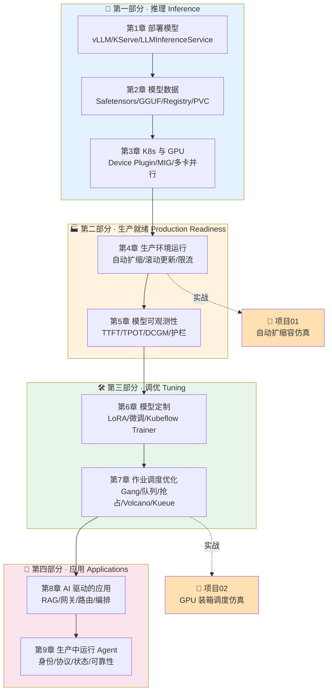

# 📚 《Generative AI on Kubernetes》中文逐章精讲 + 实战合集

> 本仓库是 O'Reilly《**Generative AI on Kubernetes**》(Roland Huß & Daniele Zonca 著,2026) 的
> **中文逐章精讲**加**本机可跑实战项目**合集。
>
> 📖 讲义部分 (`book-guide/`,9 章):把原书每一个概念、每一段 YAML、每一张图都拆开讲透,
> 并补上**第一性原理**、**面试高频题**与**生产实战坑**。
> 🧪 实战部分 (`projects/`,2 个项目):用**纯 Python**(零 GPU、零网络、零 K8s 集群、无需任何 key)
> 复刻真实集群里最核心的两条决策链路——**自动扩缩容**与**GPU 装箱调度**——每个都带 `pytest` 测试与 `run_demo` 出图。

**这本书讲什么?** 一句话:**如何把生成式 AI(LLM / Agent) 从"能在笔记本上跑通"变成"在 Kubernetes 上生产级地跑起来"。**
从部署单个模型,到管理 TB 级权重、驯服 GPU、生产化运维、可观测、微调定制、共享集群调度,直到架构完整的 AI 应用与 Agent 系统——一条完整的工程链路。

---

## 🗺️ 学习路径



**怎么学最高效?**

- 🟢 **打地基**:第 1→2→3 章务必按顺序读透,后面所有章节都建立在"部署 + 数据 + GPU"这三块之上。
- 🟡 **进生产**:读完第 4 章立刻上手**项目 01**,把"扩多少 Pod"这件事从直觉变成定量。
- 🟢 **懂调度**:读完第 7 章立刻上手**项目 02**,把"装箱 / 碎片 / MIG"变成能跑能测的代码。
- 🔵 **做应用**:第 8→9 章是把前面所有能力"组装成产品",面向 RAG 与 Agent 落地。
- ⚡ **面试冲刺**:每章末尾都有「💡 面试高频题」,两个项目也各带一节——可单独拎出来速刷。

---

## 📖 讲义逐章 · `book-guide/`

| # | 章节(点击进入) | 一句话简介 | 核心关键词 |
|---|---|---|---|
| 1 | [部署模型 Deploying Models](book-guide/01_部署模型%20Deploying%20Models.md) | 把"一个模型"变成集群里可靠、可扩、可运维的推理服务;由本地→FastAPI→Model Server→K8s→Controller 六台阶 | vLLM · TGI · KServe · Ray Serve · LLMInferenceService |
| 2 | [模型数据 Model Data](book-guide/02_模型数据%20Model%20Data.md) | 几十上百 GB 的权重如何存、搬、让成百上千 Pod 高效拿到;五种访问方案决策矩阵 | Safetensors · GGUF · ONNX · Registry · PVC · OCI |
| 3 | [Kubernetes 与 GPU](book-guide/03_Kubernetes与GPU.md) | K8s 原生不认识 GPU:从发现→登记→调度→切分→拼装→Operator 的完整链路 | NFD · Device Plugin · MIG · DRA · 张量/流水线并行 · GPU Operator |
| 4 | [生产环境运行](book-guide/04_生产环境运行.md) | 把"能跑通"变成高并发真实流量下长期稳定;聚焦自动扩缩/滚动更新/可靠性/限流 | HPA · KPA · KEDA · 灰度 · 冷启动 · LLM 感知路由 |
| 5 | [模型可观测性](book-guide/05_模型可观测性.md) | 从"能跑"到"跑得让你放心":日志/指标/追踪 + LLM 专属指标 + 质量与安全护栏 | TTFT · TPOT · SLI/SLO · DCGM · LLM-as-judge · Guardrails |
| 6 | [模型定制](book-guide/06_模型定制.md) | 现成模型不够用时如何改造:先想清要不要训→怎么训→训练在 K8s 上跑起来 | LoRA · 微调 · 对齐 · 后训练 · Kubeflow Trainer |
| 7 | [作业调度优化](book-guide/07_作业调度优化.md) | 平台管理员视角:多团队抢稀缺 GPU 时,如何不死锁、高利用、还公平 | Gang 调度 · 队列 · 优先级 · 抢占 · 拓扑感知 · Volcano/Kueue/KAI |
| 8 | [AI 驱动的应用](book-guide/08_AI驱动的应用.md) | 从"部署单模型"跃迁到"架构完整 AI 应用":RAG/网关/缓存/多模型路由/编排 | RAG · Gateway · Multi-model Routing · Orchestration · Agentic |
| 9 | [生产中运行 Agent 应用](book-guide/09_生产中运行Agent应用.md) | 会推理、会调工具、会协作的 Agent 真上生产时的硬骨头:身份/协议/状态/可靠/可观测 | Agent 身份 · A2A/MCP 协议 · 状态管理 · 可靠性 · 可观测 |

---

## 🧪 实战项目 · `projects/`

> 两个项目都是**纯 Python**、**离线可跑**、**无 GPU / 无网络 / 无 K8s 集群 / 无需任何 key**。
> 依赖仅 `numpy` + `matplotlib` + `pytest`(见各自 `requirements.txt`)。

| # | 项目(点击进入) | 一句话简介 | 产出 & 测试 |
|---|---|---|---|
| 01 | [k8s_autoscale_sim](projects/01_k8s_autoscale_sim) | 手写"到达流→队列→Pod 机群→自动扩缩控制器"的闭环仿真,定量回答**"到底该开多少个 Pod?"**(开多烧钱、开少破 SLO);带冷却与 Pod 预热延迟 | 4 大指标(SLO 满足率/成本/过冲/抖动)+ 3 张时间线图;**19 passed** |
| 02 | [gpu_binpacking_scheduler](projects/02_gpu_binpacking_scheduler) | 复刻真实 GPU 集群调度器的核心决策:一堆作业排队上机,**每个作业放哪台节点?**;含 first/best/worst-fit 三策略 + MIG 切分 + 离散事件仿真 | 利用率/碎片率/排队/被拒 4 维对比 + 热图 + 策略对比图;**26 passed** |

### ▶️ 如何跑

```bash
# ── 项目 01 · 自动扩缩容仿真 ──
cd projects/01_k8s_autoscale_sim
pip install -r requirements.txt
python -m pytest -q      # → 19 passed
python run_demo.py       # → 生成 figures/ 下 3 张图(时间线/权衡/指标对比)

# ── 项目 02 · GPU 装箱调度仿真 ──
cd projects/02_gpu_binpacking_scheduler
pip install -r requirements.txt
python -m pytest -q      # → 26 passed
python run_demo.py       # → 生成节点占用热图 + 策略四维对比图
```

> 💡 两个项目的 README 都做了**逐行代码讲解 + 第一性原理 + 结果解读 + 面试题 + 常见坑**,
> 建议"先读讲义对应章 → 跑 demo 看图 → 回读项目 README 打通理解"。

---

## 🎯 面试 & 实战用法

**🧑‍💻 面试备战**

- 每章末尾的「💡 面试高频题」按主题成组,覆盖 K8s + GPU + LLM 推理 + 调度 + Agent,可直接当**题库速刷**。
- 两个项目各带一节面试题,且**能把口头答案变成能跑的代码**——面试时"我写过一个 HPA 反馈控制器仿真 / GPU 装箱调度器"是极强的加分项。
- 建议按「学习路径」里的 🔴/🟡 优先级抓重点章,时间紧就先啃第 1、3、4、7 章 + 两个项目。

**🏭 实战落地**

- 讲义里的 YAML、决策矩阵、参数取值都对齐原书并补了生产坑,可直接当**上手 Checklist**。
- 项目 01 的四大指标框架(SLO/成本/过冲/抖动)可迁移到你**真实的 HPA/KEDA 调参**里做 A/B 评估。
- 项目 02 的三种放置策略与 MIG 判定逻辑,对应真实 **Volcano / Kueue / NVIDIA KAI** 的核心思路,读懂它再看真实调度器源码会轻松很多。

**📌 阅读建议**

- 讲义用了大量 **mermaid 图 + 表格 + emoji 分区**,建议在支持 mermaid 的编辑器(Obsidian / VS Code / GitHub)中阅读。
- 讲义与项目**互为印证**:第 4 章 ↔ 项目 01,第 7 章 ↔ 项目 02,配套读理解最深。

---

> 🌟 学习顺序推荐:**讲义第 1→9 章顺序读**,读到第 4、7 章时**穿插动手跑对应项目**,
> 最后用每章面试题 + 项目面试题**收口复盘**。祝你把生成式 AI 真正跑上 Kubernetes 生产!
