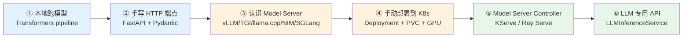
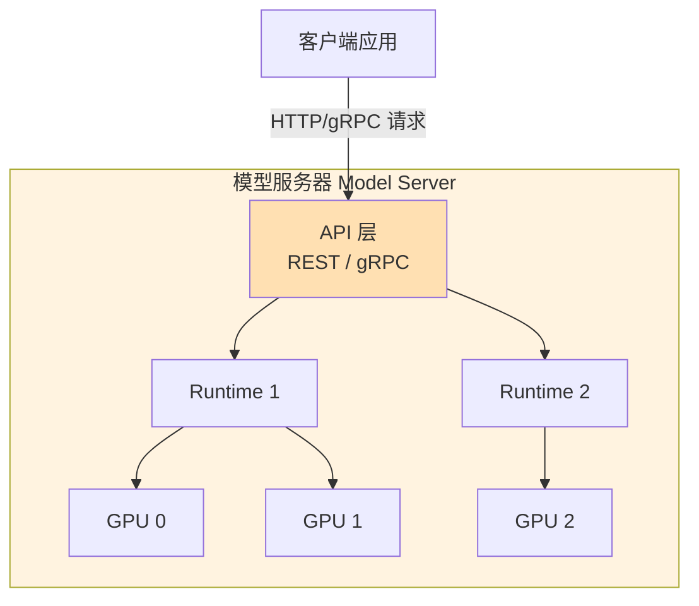
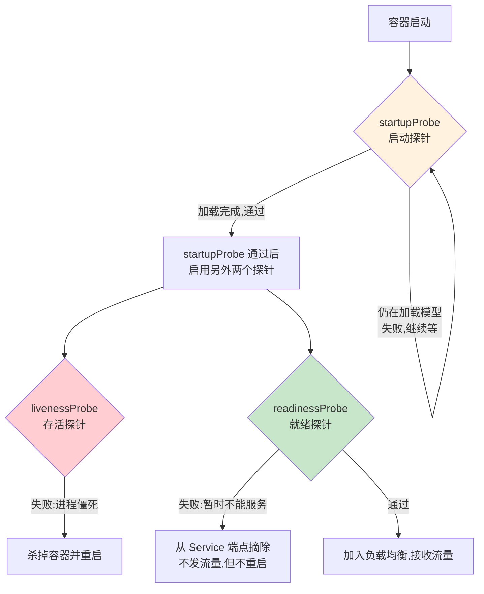
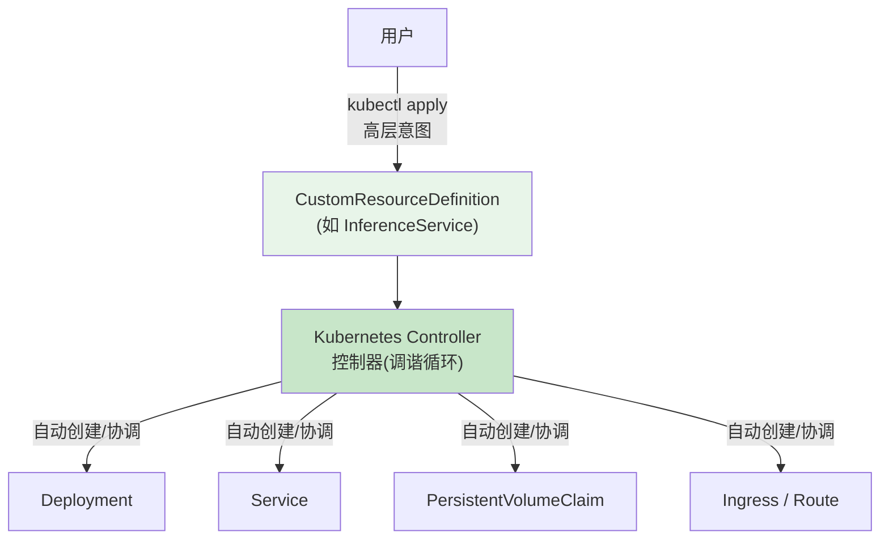
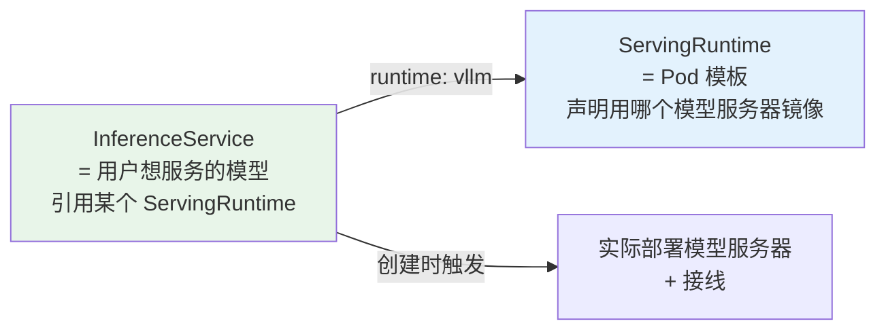
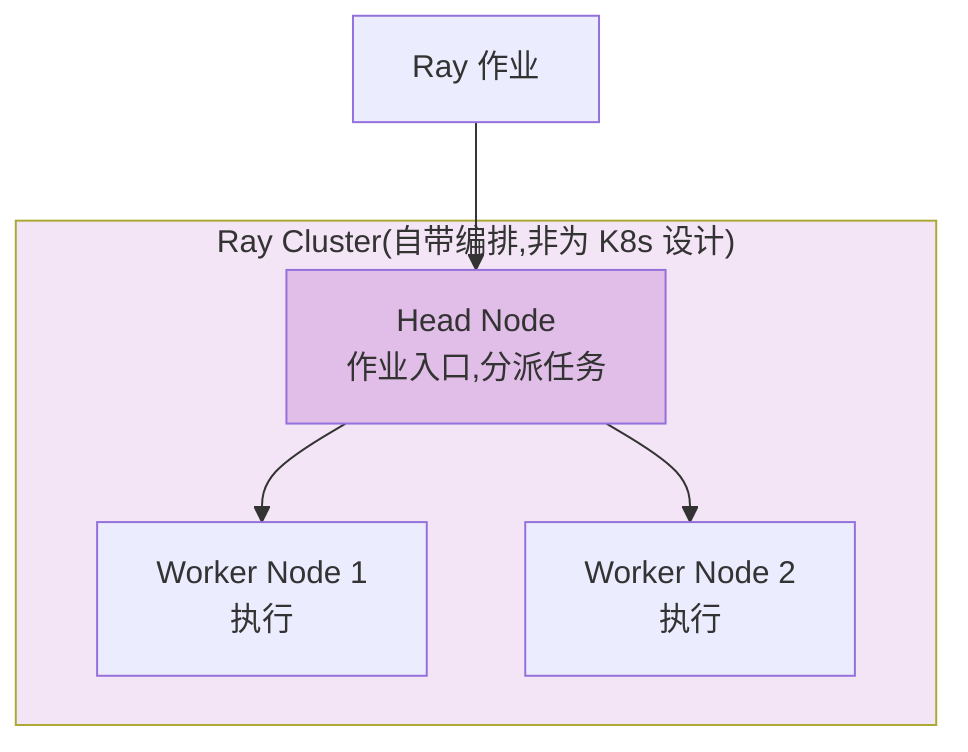
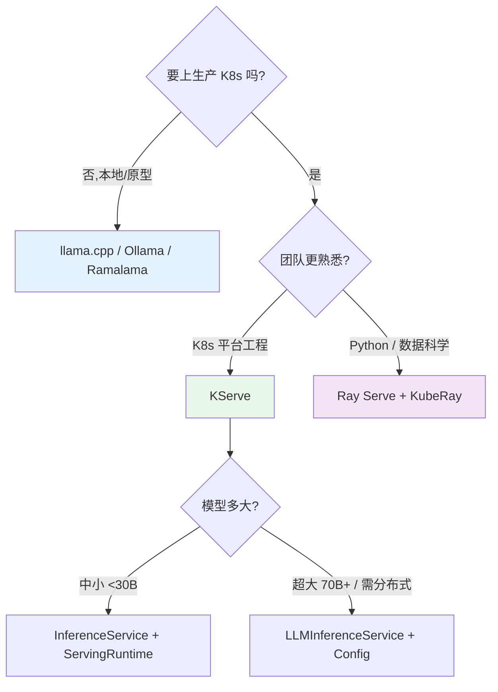

# 第 1 章 · 部署模型 Deploying Models

> 逐章精讲 ·《Generative AI on Kubernetes》(Roland Huß & Daniele Zonca, O'Reilly)
> 对应原书 pp.49–87 · 本章是全书的地基:把「一个模型」变成「集群里一个可靠、可扩、可运维的推理服务」。

---

## 🗺️ 本章地图

这一章回答一个核心问题:**「我手里有个 LLM,怎么把它跑成 Kubernetes 上一个生产级的推理服务?」**

原书的叙事是一条「由简到繁、由手工到抽象」的主线,我把它拆成 6 个台阶:



| 台阶 | 关键词 | 你要学会的事 | 原书页码 |
|------|--------|--------------|----------|
| ① 本地跑 | `transformers.pipeline` | 模型 = 权重 + 运行时;GPU/显存与参数量的关系 | 51–52 |
| ② 手写端点 | FastAPI / Pydantic | 为什么「自己写服务」注定重复造轮子 | 52–53 |
| ③ Model Server | vLLM / TGI / SGLang / NIM | 推理服务器是什么,各家取舍 | 53–66 |
| ④ 手动部署 | Deployment / PVC / GPU / taint | 一份完整的 YAML 里藏着多少复杂度 | 66–69 |
| ⑤ Controller | KServe / Ray / CRD | 用高层抽象把复杂度收进控制器 | 69–86 |
| ⑥ LLM 专用 | `LLMInferenceService` | 分布式/路由/KV-cache 感知调度 | 78–81 |

> 💡 **本章私货补充**:原书对 **就绪/存活探针(readiness/liveness probes)、容器化流程、镜像分层** 讲得比较散。这是任务要点里点名的重点,也是面试高频,我会在第 ④ 台阶用一整节 **从第一性原理讲透**,补齐原书的空白。

---

## 🎬 序章:为什么要在「自己的集群」里跑模型?

你可能会问:直接调用 OpenAI / Claude 的 API 不香吗?为什么还要自己部署?

原书开篇给出三个硬理由(p.49):

| 场景 | 为什么必须自建 |
|------|----------------|
| 🔒 **数据合规** | 真实数据受隐私法/合规要求约束,**不能离开集群**(医疗、金融、政务) |
| 🎛️ **部署控制权** | 需要对模型的部署方式、性能、版本有更强的掌控 |
| 💰 **成本 / 定制** | 大量开源模型可商用免费,大规模场景下自建单位成本更低,还能微调 |

> 🔬 **第一性原理**:云 API 的本质是「把推理算力+运维能力打包成一次 HTTP 调用卖给你」。当**数据不能出门**或**你想省掉中间商赚差价**时,你就必须自己拥有那套「推理算力+运维能力」。这本书讲的就是**如何在 Kubernetes 上把这套能力搭起来**。

Hugging Face 是最大的模型/数据集/库社区(第 2 章会给出当前开源 LLM 清单)。无论模型从哪来,**部署到 K8s 有一部分工作和模型无关(通用的容器/编排),另一部分需要仔细分析模型本身(显存、并行、任务类型)**——这句话是全章的纲。

<details>
<summary>📎 侧栏回顾:Transformer 与注意力机制(p.50)</summary>

原书在正式开讲前插了一段背景,这里浓缩:

- **Transformer**:Google 2017 年提出的深度学习架构,靠 **注意力机制(Attention)** 高效捕捉长程依赖。
- 相比 RNN 的核心优势:**没有循环单元**(不把一个神经元的输出当作下一个的输入),因此**训练时高度可并行**。
- **长程依赖(long-range dependency)**:一句话的含义受上下文影响,这是 NLP 的核心概念。
- **注意力**:模仿人类注意力,给句子不同部分分配不同**权重(重要性)**。
- **多头注意力(multi-head attention)**:并行跑多次注意力,产出多个输出,拼接后再线性变换。
- 现代 LLM 绝大多数基于 Transformer 或其变体(如 **MoE 混合专家**),也扩展到视觉/多模态。

> 📌 本书假设你用的是「基于 Transformer 的 LLM」,输出是文本,但输入可以混合图像/音频(即多模态)。

</details>

---

## ① 本地跑模型:一切的起点 "It Works on My Machine"

在上 K8s 之前,先搞懂**在一台机器上怎么跑一个模型**。

> 🔬 **一句话本质**:部署一个模型 = **模型本身(权重)** + **能加载并执行它的运行时(runtime)**。

因为 Transformer 系模型最常见,所以可以直接用 Hugging Face 的 **`transformers` 库**来加载和调用。

### 💻 代码逐行:Example 1-1(用 Transformers 跑 Llama 3.2 1B)

```python
import transformers
import torch
import os

model_id = "meta-llama/Llama-3.2-1B-Instruct"   # ← ① HF 格式的模型标识符
pipeline = transformers.pipeline(               # ← ② 加载并初始化模型
    "text-generation",
    model=model_id,
    device_map="auto",
    torch_dtype=torch.bfloat16,                 # ← ③ 用 bfloat16 精度,更快更省显存
    token=os.environ.get("HF_TOKEN")            # ← ④ 部分模型需 HF token 授权下载
)
messages = [
    {"role": "user", "content": "Hey how are you doing today?"}
]
result = pipeline(messages, max_new_tokens=256)
print(result[0]["generated_text"][-1]["content"])  # ← ⑤ 只取助手回复那一段
```

**逐行讲解:**

| 标注 | 代码 | 讲透它 |
|------|------|--------|
| ① | `model_id = "meta-llama/..."` | HF 上的模型坐标,格式是 `组织/模型名`。`-Instruct` 后缀表示这是**指令微调版**(会遵循对话格式) |
| ② | `transformers.pipeline("text-generation", ...)` | `pipeline` 是 HF 的高层封装:一行代码搞定「下载权重 → 建模型 → 建 tokenizer → 组装成可调用对象」 |
| ③ | `torch_dtype=torch.bfloat16` | 权重用 16 位脑浮点存储。相比 fp32,**显存减半、速度更快**,精度损失极小(见下方框) |
| ④ | `token=os.environ.get("HF_TOKEN")` | Llama 系是**门控模型(gated)**,需去 HF 个人设置里申请 token 才能下载 |
| ⑤ | `result[0]["generated_text"][-1]["content"]` | pipeline 返回的是完整对话列表,`[-1]` 取最后一条(助手的回复),`["content"]` 取正文 |

> ⚠️ **常见坑**:`device_map="auto"` 会自动把模型层分配到可用的 GPU/CPU。**没 GPU 时它会退回 CPU**,能跑,但慢到「几十秒才吐一句话」。别用 CPU 跑生产。

### 💡 显存与参数量:一张必须刻进脑子的表

原书给了一个非常实用的经验法则(p.51):

| 模型规模 | 别称 | 大致显存需求 | 备注 |
|----------|------|--------------|------|
| **7B 参数** | 小语言模型 SLM | 约 **15 GB** | fp16 下,单张消费级/入门专业卡可载 |
| **70B 参数** | 中大型 LLM | 约 **140 GB** | 需多卡,单卡放不下 |

> 🔬 **第一性原理:显存怎么算出来的?**
> 每个参数用 fp16/bf16 存 = **2 字节**。
> - 7B × 2 B ≈ **14 GB**(权重本身),再加 KV cache、激活值、框架开销 → 约 15 GB。
> - 70B × 2 B ≈ **140 GB**。
> 记住公式:**`显存(GB) ≈ 参数量(B) × 2 × 精度系数`**(fp16→1,int8→0.5,int4→0.25)。这就是量化(quantization)能省显存的根本原因。

> 💡 **面试高频**:「一个 13B 模型 fp16 推理大概要多少显存?」→ 13×2≈26GB 权重,加 KV cache/开销 → 单张 40GB A100 够用,24GB 卡就得量化。**能张口就来这个心算,面试官会觉得你真跑过模型。**

---

## ② 手写 HTTP 端点:重复造轮子的开始

Example 1-1 有两个致命缺陷(p.52):
1. **prompt 写死在代码里**,用户没法交互;
2. **每次启动都从 HF 现下模型**(开发期常见,生产期应提前把模型放进集群,免联网)。

那就用 Python 生态里最轻的组合 **FastAPI + Pydantic** 暴露一个端点。

### 💻 代码逐行:Example 1-2 / 1-3(FastAPI 的 /generate 端点)

```python
from fastapi import FastAPI
from pydantic import BaseModel
import transformers

app = FastAPI()

class InputText(BaseModel):     # ← 用 Pydantic 定义「请求体」结构
    text: str

class OutputText(BaseModel):    # ← 定义「响应体」结构
    text: str

def get_pipeline():
    model_id = "meta-llama/Llama-3.2-1B-Instruct"
    return transformers.pipeline(
        "text-generation",
        model=model_id,
        device_map="auto"
    )

pipeline = get_pipeline()       # ← 进程启动时加载一次(而非每次请求都加载!)

@app.post("/generate", response_model=OutputText)
async def generate_func(prompt: InputText):
    output = pipeline(prompt.text)
    return {"text": output[0]["generated_text"]}
```

**关键点:**

- **`InputText` / `OutputText`**:Pydantic 模型 = 自动做**请求校验 + 类型转换 + 生成 OpenAPI 文档**。`text: str` 表示请求必须带一个字符串字段 `text`。
- **`pipeline = get_pipeline()` 放在模块级**:模型加载**只在进程启动时发生一次**。⚠️ 如果把它写进 `generate_func` 里,每来一个请求就重新加载几十 GB 权重 —— 这是新手最常犯的性能自杀。
- **`@app.post("/generate")`**:定义一个 POST 端点,prompt 现在是**动态的**,多用户可并发调用。

### 🤔 但是……你已经在重复造轮子了

原书在这里点出一个深刻的观察(p.53):

> 生产负载要求的东西远不止一个端点:**可扩展性(scalability)、吞吐(throughput)、可复现性(reproducibility)、监控(monitoring)**……而且这段代码**其实和具体模型无关**——这说明你正在做的东西可以被泛化。

> 🔬 **一句话点破**:你手写的这个 FastAPI 服务,本质上就是在**重新发明一个「模型服务器(Model Server)」**。既然有人已经把这件事做到了极致(还顺手加了 PagedAttention、continuous batching 等黑魔法),你为什么要自己写?

于是,自然过渡到下一节。

---

## ③ 模型服务器 Model Server:专业选手登场

### 是什么?

> **模型服务器(Model Server / Serving Runtime)** = 一个包含**一个或多个运行时(runtime)**的组件。它能:
> - 分布式使用**多张 GPU**;
> - 执行**多种类型**的模型;
> - 通过 **API(REST 或 gRPC)** 暴露模型;
> - **最大化吞吐、最小化延迟**。



### 为什么它不是新概念,但 GenAI 让它「变味」了

这个概念在**预测式 AI(predictive AI)**(分类、回归)里早就存在。但生成式 AI 让暴露的 **API 形态发生了根本变化**(p.54):

| 维度 | 预测式 AI | 生成式 AI |
|------|-----------|-----------|
| 端点风格 | 通用 `/predict` 或 `/infer` | **任务导向**:文本生成、摘要、分类、文生图… |
| 模型角色 | 黑盒函数(输入→输出) | 同一模型能干**多种任务**、处理**多种模态** |
| 标准化程度 | 高(KServe **OIP** 开放推理协议) | 仍在实验阶段;**OpenAI Chat Completions API 成了事实标准** |

> ⚠️ **抽象泄漏(abstraction leak)警告**:模型服务器想给你一层「统一 API」的抽象,但如果这个 API 是**某家实现私有的**,客户端就被**绑死在特定实现上**,抽象就破了。
> - 预测式 AI 靠 **KServe OIP(open-inference-protocol)** 标准化 `/infer`。
> - 生成式 AI 目前靠 **OpenAI 兼容 API** 事实上统一(下面每个服务器都会「兼容 OpenAI」,原因就在这)。

> 💡 **面试高频**:「为什么现在几乎所有推理服务器都提供 OpenAI-compatible endpoint?」→ 因为它是事实标准,客户端只需对着一套 API 编程,**换后端(vLLM↔TGI↔SGLang)不用改客户端代码**,避免供应商锁定。

### 📊 五大模型服务器横评

原书重点讲了 5 个。这是全章最实用的一张表,我把它整理成决策地图:

| 服务器 | 出身 | 一句话定位 | 招牌技术 | 最佳场景 | OpenAI 兼容 |
|--------|------|-----------|----------|----------|:-----------:|
| **vLLM** | Linux Foundation AI&Data | 开源推理的**事实主力** | PagedAttention、continuous batching、投机解码 | 生产级高吞吐,>50 种架构 | ✅ |
| **TGI** | Hugging Face | HF 官方推理服务器 | **多后端**(CUDA/TensorRT-LLM/llama.cpp/AWS Neuron) | 需灵活切换硬件后端 | ✅ (原生+兼容) |
| **llama.cpp** | 社区(C++) | **本地/边缘之王** | GGUF 格式、极致轻量、纯 CPU 可跑 | 笔记本、on-device、原型 | ✅ (Python server) |
| **NVIDIA NIM** | NVIDIA | **开箱即用**的 N 卡专供 | 每模型精调镜像、PV 本地缓存、自动选后端 | 纯 NVIDIA 生产栈,想省心 | ✅ |
| **SGLang** | 开源 | **高缓存命中**专家 | **RadixAttention**(KV cache radix 树) | Agent 多轮/共享前缀 prompt | ✅ |

下面逐个讲透关键点。

#### 🅰️ vLLM —— 默认首选

```python
# Example 1-3:Python 里直接用
from vllm import LLM
llm = LLM(model="meta-llama/Meta-Llama-3-8B")
results = llm.generate("LLMs are great for")
print(results[0].outputs[0].text)
```

但我们的目标是**在 K8s 上以服务形式跑**,所以要用它的 server 模式:

```bash
# Example 1-4:启动 vLLM 服务器
vllm serve \
 --port=8080 \
 --model=/mnt/models \                         # ← 容器内本地模型路径(不是从 HF 现下!)
 --served-model-name=meta-llama/Meta-Llama-3-8B

# 用 curl 调用(OpenAI 兼容的 /v1/completions)
curl http://localhost:8080/v1/completions \
 -H "Content-Type: application/json" \
 -d '{
  "model": "meta-llama/Meta-Llama-3-8B",
  "prompt": "LLMs are great for",
  "max_tokens": 10,        # ← 生成多少 token
  "temperature": 0         # ← 采样随机性;0 = 完全确定性输出
 }'
```

> 💡 **生产要点**:`--model=/mnt/models` 指向**容器内的本地副本**,而非 HF 在线拉取。生产 K8s 环境**几乎总是用本地模型**(启动快、免联网、可复现)。第 2 章专讲怎么把模型塞进集群。

<details>
<summary>🔬 侧栏:LLM 推理优化术语速查(p.58–60)</summary>

原书列了一串优化技术。作为 MLOps 工程师,**你不需要精通内部实现,但要听得懂**:

| 技术 | 一句话本质 | 影响 |
|------|-----------|------|
| **PagedAttention** | 像操作系统分页一样管理 KV cache 显存,消除碎片 | 显存利用率↑,吞吐↑ |
| **FlashAttention** | 融合算子,减少 HBM 读写,加速自注意力 | 因为注意力是 **O(n²)** 时间/显存,这里最值得优化 |
| **量化 Quantization** | 缩小权重浮点位宽(fp16→int8→int4) | 显存↓,可能损失质量 |
| **模型蒸馏 Distillation** | 训小「学生」模型模仿大「老师」模型 | 模型体积大幅↓,保留大部分能力 |
| **投机解码 Speculative Decoding** | 小「草稿」模型先猜几个 token,大模型一次性验证 | 吞吐 **↑1.5~3 倍**,输出质量不变 |
| **Continuous Batching** | 动态拼批,请求完成即换新请求进批,不等整批结束 | GPU 利用率↑ |
| **RadixAttention**(SGLang) | 用 radix 树存 KV cache,跨请求复用公共前缀 | 多轮/共享前缀场景命中率↑ |

> 🔬 **核心洞察(原书原话)**:「作为 MLOps 工程师,你**不用当优化专家**。选一个**社区活跃、持续开发**的模型服务器,新优化会自动被纳入。」vLLM 的配置通常只是改启动参数,而且它越来越能**根据模型自动检测该用什么配置**,默认值大概率就对。

> ⚠️ 但有两类配置你**必须警惕**:
> 1. **量化**:会影响模型**质量**,需要调优找 trade-off —— 这属于模型开发阶段的事,推理时应已定好。
> 2. **并行/扩展**:**多节点分布式服务(multinode distributed serving)** 会改变整体拓扑,需要额外协调组件,**并让部署变成有状态(stateful)**。这是第 4 章的重头。

</details>

#### 🅱️ TGI —— 多后端的灵活派

```bash
# Example 1-5:启动 TGI,同时暴露原生 API 和 OpenAI 兼容 API
text-generation-launcher \
 --port 8080 \
 --model-id /mnt/models

# TGI 原生 API(流式)
curl localhost:8080/generate_stream \
    -H 'Content-Type: application/json' -X POST \
    -d '{"inputs":"LLMs are great for","parameters":{"max_new_tokens":10}}'

# OpenAI 兼容 API(注意端口 3000)
curl localhost:3000/v1/chat/completions \
    -H 'Content-Type: application/json' -X POST \
    -d '{
  "model": "tgi",
  "messages": [
    {"role": "system", "content": "You are a helpful assistant."},
    {"role": "user", "content": "LLMs are great for"}
  ],
  "max_tokens": 10
}'
```

- **多后端(multi-backend)**是新趋势:同一个 TGI/Triton 可挂 CUDA、TensorRT-LLM、llama.cpp(CPU)、AWS Neuron 等后端。
- **代价(trade-off)**:虽然对外统一(OpenAI 兼容),但**各后端的配置和调优参数差异巨大**,切后端/调性能时会变复杂。
- `system` prompt 在 **instruct 模型**里用来**定义模型角色**——instruct 是最常见的微调类别之一。

#### 🅲 llama.cpp —— 本地与边缘之王

- C++ 重写 Transformer,最初专为 Llama,现支持多种模型。**主打效率**,是**笔记本本地跑**的推荐选择。
- 催生了 **GGUF 文件格式**(现被众多库采用)。
- 不为高并发大规模生产设计,但在**资源受限环境**(边缘、on-device、本地开发)里所向披靡。
- 被 **Ollama、Ramalama、LM Studio** 当作底层引擎。

```bash
# Example 1-6:启动 llama.cpp 的 Python server(OpenAI 兼容)
python -m llama_cpp.server --model /mnt/models
```

> 💡 **TIP(p.63)**:有台 ≥24GB 内存的机器(哪怕**没 GPU**),跑量化 LLM 极其简单:
> ```bash
> ollama run llama3.2:3b      # Ollama:开发体验最顺滑
> ramalama run llama3.2:3b    # Ramalama:容器隔离更强,支持多 registry
> ```
> 两者底层都是 llama.cpp,都暴露 OpenAI 兼容 API。**上生产 K8s 前,拿它们做本地开发/实验/原型最合适。**

#### 🅳 NVIDIA NIM —— 开箱即用的省心派

NIM 走的是**「意见强硬(opinionated)」**路线,和前面的通用服务器不同:

| 特性 | 说明 | 解决什么痛点 |
|------|------|-------------|
| **每模型族精调镜像** | 由 NVIDIA 亲自测试发布(Llama、Mistral 等) | 免去自己选镜像+调参 |
| **自动选后端** | 按硬件自动选,偏好序 **TensorRT-LLM > vLLM > SGLang** | 无需手动配置就用上最优引擎 |
| **本地缓存(PersistentVolume)** | 模型**只下载一次**,副本重建/重启不再重下 | 直击「加载时间」这个最大痛点 |
| **硬件优化** | 检测加速器 → 选最合适的模型变体 → 自动调服务器设置 | 硬件感知,自动最优 |

> 🔬 **本质**:NIM 用「牺牲灵活性、换取确定性和易用性」的哲学,把「选镜像+选后端+调参+管缓存」这些脏活全包了。代价是**你被绑在 NVIDIA 生态**里。

#### 🅴 SGLang —— 高缓存命中的性能派

```bash
# Example 1-7:启动 SGLang 服务器
python -m sglang.launch_server \
 --model-path /mnt/models \
 --port 8080
```

- 招牌是 **RadixAttention**:用 **radix 树(基数树)** 存 KV cache,支持**高效前缀搜索 + 跨请求缓存复用**。
- **最适合**:公共 prompt 前缀多的负载(如 Agent 反复用相似上下文、多轮对话复用历史)、结构化 prompt。
- 也支持 continuous batching、投机解码、多种量化。同样是 OpenAI 兼容。

> 💡 **选型口诀**:**生产高吞吐选 vLLM;要多硬件后端选 TGI;本地/边缘选 llama.cpp;纯 N 卡想省心选 NIM;Agent 多轮/共享前缀选 SGLang。**

---

## ④ 手动部署到 Kubernetes:直面复杂度

> 原书叫这个 **DIY(Do It Yourself)** 方式。它**永远可用**,当你需要定制部署的每一个细节时甚至是**必要的**——即便在有控制器的环境里。

### 从命令到 GPU

```bash
# Example 1-8:带 GPU 启动 vLLM
CUDA_VISIBLE_DEVICES=0,1 \      # ← 指定用哪几张 GPU(第 0、1 张)
vllm serve \
 --port=8080 \
 --model=/mnt/models \
 --served-model-name=meta-llama/Meta-Llama-3-8B
```

`CUDA_VISIBLE_DEVICES` 是**约束进程能看到哪些 GPU**的环境变量——这是把物理 GPU 分配给容器的最原始手段。

### 💻 代码逐行:Example 1-9(完整 Deployment + PVC)

这是本章最核心的一份 YAML。我逐块拆:

```yaml
kind: Deployment
apiVersion: apps/v1
metadata:
  name: vllm
spec:
  replicas: 1
  template:
    spec:
      containers:
        - resources:
            limits:
              cpu: '4'
              memory: 12Gi
              nvidia.com/gpu: '1'      # ← ① 除 CPU/内存外,声明需要的 GPU 数量
            requests:
              cpu: '2'
          name: vllm
          env:
            - name: HF_TOKEN           # ← ② 从 Secret 注入 HF token(用于在线拉取)
              valueFrom:
                secretKeyRef:
                  name: huggingface-secret
                  key: token
          args: [                      # ← ③ vLLM 镜像入口已是启动 server,只需补参数
            "--port", "8080",
            "--model", "meta-llama/Meta-Llama-3-8B",
            "--download-dir", "/models-cache" ]   # ← ④ 在线下载时指定持久化缓存目录
          ports:
            - name: http
              containerPort: 8080      # ← ⑤ 暴露端口(后续可经 Service/Ingress 对外)
              protocol: TCP
          volumeMounts:
            - name: models-cache
              mountPath: /models-cache
          image: vllm/vllm-openai:latest
      volumes:
        - name: models-cache           # ← ⑥ 用作缓存的持久卷
          persistentVolumeClaim:
            claimName: vllm-models-cache
      tolerations:
        - key: nvidia.com/gpu          # ← ⑦ 容忍 GPU 节点的污点,才能被调度上去
          operator: Exists
          effect: NoSchedule
---
apiVersion: v1
kind: PersistentVolumeClaim
metadata:
  name: vllm-models-cache
spec:
  accessModes:
    - ReadWriteOnce
  volumeMode: Filesystem
  resources:
    requests:
      storage: 100Gi
```

**七处标注逐一讲透:**

| # | 配置 | 讲透它 |
|---|------|--------|
| ① | `nvidia.com/gpu: '1'` | GPU 是**扩展资源(extended resource)**,不像 CPU/内存是核心资源。K8s 靠**设备插件(device plugin)** 把它注册进来(第 3 章)。⚠️ GPU **只能在 limits 里整数请求,不能超卖、不能小数** |
| ② | `secretKeyRef` | 敏感信息(token/密码)绝不写进 YAML 明文,而是引用 **Secret** 对象,运行时注入为环境变量 |
| ③ | `args: [...]` | vLLM 镜像的 **entrypoint 已经是 `vllm serve`**,所以这里只追加参数,不用重写启动命令 |
| ④ | `--download-dir /models-cache` | 在线下载模式下,把模型存到**持久卷**,重启不用重下 |
| ⑤ | `containerPort: 8080` | 声明容器监听端口。这只是「声明」,真正对外暴露还需 Service + Ingress |
| ⑥ | PVC `models-cache` | 100Gi 持久存储,`ReadWriteOnce`(单节点读写)——大模型权重的家 |
| ⑦ | `tolerations` + `NoSchedule` | **污点/容忍(taint/toleration)机制**:GPU 节点打上污点**赶走普通负载**,这个 GPU 工作负载带上容忍才**允许**被调度上去 |

> 🔬 **第一性原理:taint/toleration 为什么存在?**
> GPU 节点又贵又稀缺。如果不加保护,K8s 会把一堆不需要 GPU 的普通 Pod 也塞上去,挤占资源。做法是:**给 GPU 节点打污点(taint)= 默认拒绝所有 Pod**;只有**显式带容忍(toleration)的 GPU 负载才能上**。这是一对「锁与钥匙」。

### ⚠️ 原书亲口承认:这个例子还没覆盖的东西

原书诚实地列出这份 YAML 的**盲区**(p.69),这些正是走向生产必须补的:

- ❌ GPU 在 K8s 里的完整配置(第 3 章)
- ❌ **重启策略(restart policies)**
- ❌ **扩缩容(scaling)**
- ❌ **探针(probes)** ← 任务点名的重点,下面我专门补
- ❌ 分布式服务(仅覆盖了**单节点**场景)

> 原书结论:「手动方式虽然可行且自包含,但暴露出**巨大的复杂度**:GPU 资源管理、污点容忍、存储配置、密钥管理、模型专属参数……每多部一个模型,复杂度就**成倍增长**。**这正是模型服务器控制器存在的理由**——把复杂度藏进更高层的 API。」

---

### 🩺 补课:就绪探针 vs 存活探针(原书留白,面试必考)

原书把 probes 列进「盲区清单」却没展开。但这是任务要点里**点名的核心**,也是 K8s 面试的必考题。我从第一性原理讲透。

> 🔬 **第一性原理:K8s 凭什么知道你的容器「活着」和「能干活」?**
> K8s 不懂你容器里跑的是 vLLM 还是数据库,它需要你**告诉它怎么检查健康**。这就是探针(probe)——K8s 周期性地对容器做一次「体检」。

LLM 服务尤其需要探针,因为它有一个**残酷的特性:模型加载极慢**(几十 GB 权重,可能要几分钟才就绪)。探针配错,后果是灾难性的。



#### 三种探针对比表

| 探针 | 回答的问题 | 失败后果 | LLM 场景要点 |
|------|-----------|----------|-------------|
| **startupProbe** 启动探针 | 「**启动完成了吗?**」 | 继续等,不触发另两个探针 | **LLM 必备**:给足加载时间,防止慢启动被 liveness 误杀 |
| **livenessProbe** 存活探针 | 「**进程还活着吗?**」 | **杀掉并重启**容器 | 探测 CUDA OOM / 死锁 / 僵死;⚠️ 阈值别太紧 |
| **readinessProbe** 就绪探针 | 「**现在能接流量吗?**」 | **从 Service 摘除**,不重启 | 模型没载完 / 正在满载时,先别发新请求过来 |

#### 💻 给 vLLM 加探针的正确姿势

vLLM 的 OpenAI 兼容服务器提供了 `/health` 端点,可直接用:

```yaml
containers:
  - name: vllm
    image: vllm/vllm-openai:latest
    ports:
      - containerPort: 8080
    # ① 启动探针:模型没载完前,不放行另外两个探针
    startupProbe:
      httpGet:
        path: /health
        port: 8080
      failureThreshold: 60      # 最多容忍 60 次失败
      periodSeconds: 10         # 每 10s 探一次 → 最长给 600s(10 分钟)加载时间
    # ② 存活探针:进程僵死才重启(阈值放宽,别误杀)
    livenessProbe:
      httpGet:
        path: /health
        port: 8080
      periodSeconds: 10
      failureThreshold: 3
    # ③ 就绪探针:决定要不要给这个 Pod 发流量
    readinessProbe:
      httpGet:
        path: /health
        port: 8080
      periodSeconds: 5
      failureThreshold: 3
```

**逐条讲透:**

- **① startupProbe 是 LLM 部署的救命稻草**:模型加载可能长达数分钟。若**只配 liveness**,容器还在载模型时 liveness 就开始探测→探不通→**被判定死亡→重启→再载→再被杀……无限重启死循环**。startupProbe 的作用就是「**加载期间挂免死金牌**」,`failureThreshold × periodSeconds = 60 × 10 = 600s` 给足十分钟。
- **② liveness 阈值要宽松**:LLM 满负载推理时可能短暂不响应健康检查。阈值太紧会**误杀正在干活的健康容器**,引发**级联重启雪崩**。
- **③ readiness 决定「上不上负载均衡」**:它失败**不重启容器**,只是**把 Pod 从 Service 的 endpoints 里摘掉**,不再往它发新请求。模型没就绪、或正满载时,这能防止请求打到还没准备好的实例上。

> ⚠️ **头号大坑(面试必问)**:**用 liveness 探针探测「模型是否加载完成」。** 大错特错!模型加载慢 → liveness 探不通 → 容器被反复重启 → **永远起不来**。
> ✅ **正确分工**:
> - 「**载完没有**」→ 交给 **startupProbe**(慢启动保护);
> - 「**能不能接流量**」→ 交给 **readinessProbe**;
> - 「**是不是僵死了**」→ 交给 **livenessProbe**(且阈值放宽)。

> 💡 **面试高频三连**:
> 1. 「liveness 和 readiness 有什么区别?」→ liveness 失败**重启容器**,readiness 失败**只摘流量不重启**。
> 2. 「为什么大模型部署一定要配 startupProbe?」→ 因为加载慢,防止被 liveness 在启动期误杀进无限重启。
> 3. 「readiness 失败但 liveness 正常,会发生什么?」→ Pod 保持运行,但**从 Service endpoints 摘除**,不接新流量,等它恢复。

### 🏗️ 补课:容器化与镜像分层(把模型装进容器的正确方式)

任务要点也点了「容器化、镜像」。原书更多是「直接用 vLLM 官方镜像」,这里补齐**为什么**和**怎么做对**。

> 🔬 **第一性原理:镜像是分层(layered)的。** Docker 镜像由只读层叠加而成,每条 `RUN/COPY/ADD` 生成一层。**变动少的放底层,变动多的放上层**,这样重建时能最大化复用缓存。

**LLM 镜像的核心抉择:模型权重要不要打进镜像?**

| 方案 | 做法 | 优点 | 缺点 |
|------|------|------|------|
| **权重打进镜像** | `COPY model/ /mnt/models` | 自包含、可复现、无需运行时下载 | 镜像巨大(几十 GB),推送/拉取慢,更新模型要重建镜像 |
| **权重放外部卷(推荐)** | 镜像只装运行时,模型经 **PVC / storage-initializer** 挂载 | 镜像小、模型与代码解耦、换模型不重建 | 需管理存储和加载逻辑 |

> 💡 **生产共识**:**镜像只装「运行时(vLLM/TGI 等)」,模型权重通过 PVC 或对象存储在运行时加载。** 这也是为什么 Example 1-9 里模型走的是 `--download-dir /models-cache`(PVC)而非烤进镜像。第 2 章会专门讲模型的打包/注册/加载。

> ⚠️ **加速器镜像的坑(p.71–72)**:每种加速器有**不同的驱动和框架**(NVIDIA→CUDA、AMD→ROCm),挑镜像时**必须对准硬件**。这和多架构容器(ARM64/i386 自动选)类似,但**加速器目前仍需手动选**,很容易拿错镜像导致跑不起来。

---

## ⑤ 模型服务器控制器 Model Server Controller:把复杂度收进 CRD

手动部署暴露的问题是:**每个模型都要一份 Deployment + PVC + GPU 配置 + 污点容忍 + 模型参数**,数量一多就爆炸。

> **模型服务器控制器**通过 **自定义资源定义(CRD, CustomResourceDefinition)** 提供**更高层的抽象**,让你**声明意图(declare intent)** 而非手搓底层资源,还提供**集中式状态信息**,便于监控部署健康。



> 🔬 **控制器模式的本质**:你声明「**我想要什么(desired state)**」,控制器不断把「**实际状态(actual state)**」调谐(reconcile)到你要的样子。你不再管「怎么做」,只管「要什么」。这是 K8s 声明式哲学的精髓。

原书重点讲两个流派:**KServe**(K8s 原生派) 和 **Ray Serve / KubeRay**(Python 优先派)。

### 🅰️ KServe —— Kubernetes 原生的推理平台

- **CNCF 项目**,在 K8s 上提供模型推理平台,管理模型服务器与模型的生命周期与「接线」,借 K8s 组件实现:**可扩展、路由、金丝雀发布、密度打包、暴露推理端点**。
- 前身是 Kubeflow 社区的 **KfServing**,后独立(仍属 Kubeflow 生态)。**最初面向预测式 AI,近期才扩展到生成式 AI**。

#### 三种部署模式(0.16 起改名)

| 新名(0.16+) | 旧名 | 底层技术 | 适用性 |
|--------------|------|----------|--------|
| **Knative** | Serverless | Knative + Istio,管自动扩缩、滚动更新、流量管理、组合 | 功能最全,但大模型难吃满其动态扩缩优势 |
| **Standard** | RawDeployment | **零额外依赖**,每个模型建一个原生 Deployment | GenAI 推荐,大模型静态管理更稳 |
| **ModelMesh** | ModelMesh(不变) | 模型服务器**动态加载/卸载**模型 | 高密度(上千小模型),**不适用 GenAI** |

> ⚠️ **为什么 ModelMesh 不适合 GenAI**:LLM 又大又复杂,一个节点根本塞不下多个,谈何「高密度多模型」。所以**GenAI 用 Knative 或 Standard**。而**大模型(30B+)通常需要静态管理的专属 GPU**,难以发挥 Knative 动态扩缩的优势 → **原书后文默认用 Standard 模式**。

#### 两个核心 API:ServingRuntime 与 InferenceService

这是 KServe 最精妙的设计——**把「运行时配置」和「模型配置」分离**:



**ServingRuntime(Example 1-10)** = 一个 Pod 模板,声明模型服务器:

```yaml
apiVersion: serving.kserve.io/v1alpha1
kind: ServingRuntime
metadata:
  name: vllm                       # ← 自定义运行时名字(也有预置的 HuggingFace Runtime,底层就是 vLLM)
spec:
  containers:                      # ← 这是 podSpec,可配所有运行模型服务器的参数
    - args: ["--model", "/mnt/models/", "--port", "8080"]
      name: kserve-container
      image: vllm/vllm-openai:latest   # ← 用的镜像(apply 后不会立即部署,只是在 namespace 内「可用」)
      ports:
        - containerPort: 8080
          name: http1
          protocol: TCP
  multiModel: false
  supportedModelFormats:
    - autoSelect: true
      name: pytorch                # ← 声明本运行时能服务 PyTorch 模型(vLLM 底层是 PyTorch)
```

> 🔑 **关键理解**:apply 一个 ServingRuntime **不会立刻起服务**,它只是在 namespace 里**注册了一个「可用的运行时模板」**。也可以用 `ClusterServingRuntime` 做**全集群**可用。

**InferenceService(Example 1-11)** = 用户真正想服务的**模型**:

```yaml
apiVersion: serving.kserve.io/v1beta1
kind: InferenceService
metadata:
  name: Meta-Llama-3-8B
  annotations:
    serving.kserve.io/deploymentMode: Standard   # ← 选部署模式
spec:
  predictor:
    model:
      modelFormat:
        name: pytorch              # ← 声明模型类型,KServe 据此自动找能处理它的 ServingRuntime
      runtime: vllm                # ← 按名字引用上面的 ServingRuntime
      storageUri: pvc://llama/model   # ← 模型从哪来(这里是集群内 PVC)
    containers:
      resources:                   # ← 可为每个模型覆盖资源需求
        limits: {cpu: "4", memory: 50Gi, nvidia.com/gpu: "1"}
        requests: {cpu: "1", memory: 50Gi, nvidia.com/gpu: "1"}
```

> 💡 **创建 InferenceService 才真正触发部署**——它把模型和运行时「接线」起来,起 Pod、建 Service。

> 🔬 **为什么要拆成两个 API?(原书核心洞见)**
> 因为**运行时生命周期**和**模型生命周期**完全不同、归属也不同:
> - **平台团队**管运行时版本、默认配置、容器镜像(ServingRuntime);
> - **数据科学团队**独立部署和迭代模型(InferenceService)。
> 这样双方**并行工作、互不冲突**。这是「关注点分离」在 MLOps 里的教科书级应用。

**其他能力**(不部署 LLM 也要知道):

- **inference logger**:把每次输入/输出转发给日志服务,用于审计或训练。
- **preprocessing / postprocessing**:前后处理。
- **InferenceGraph**:组合多个模型。
- **storage initializer**:KServe 注入的 initContainer,读取模型位置→下载→拷贝到模型服务器目录;可用 `ClusterStorageContainer` 换成自定义协议(第 2 章详讲)。

### 🆕 ⑥ 从 InferenceService 到 LLMInferenceService(KServe 0.16 新 API)

> 传统 `InferenceService` 能做基础 LLM 服务,但 **KServe 0.16 引入 `LLMInferenceService` CRD**,专为**复杂、大规模 LLM 部署**设计。

它提供的高级能力:
- 🧠 **KV cache 感知调度(KV cache-aware scheduling)** 的智能路由;
- 🔀 **分离式服务(disaggregated serving)**;
- 🌐 **多节点分布式推理(multinode distributed inference)**。

> 实现上,`LLMInferenceService` **使用 Standard 部署模式**,创建原生 Deployment。这反映了一个根本转变:**长时运行的 GPU 负载,更看重稳定性、资源可预测性、基于模型状态的智能路由,而非快速扩缩。**

#### 💻 Example 1-12:配置模板 + 实际部署(base template 模式)

```yaml
# 基础配置模板
apiVersion: serving.kserve.io/v1alpha1
kind: LLMInferenceServiceConfig
metadata:
  name: vllm-llama-config
spec:
  template:
    containers:
      - name: kserve-container
        image: vllm/vllm-openai:latest      # ← vLLM 镜像 + 启动参数
        args: ["--port=8080", "--model=/mnt/models"]
        resources:
          limits: {nvidia.com/gpu: "1", cpu: "4", memory: 50Gi}
  router:                                    # ← 路由:网关+路由+调度器,KV cache 感知调度
    gateway: {}
    route: {}
    scheduler: {}
  parallelism:                               # ← 并行策略:张量/数据/专家并行
    tensorParallelism: 2
---
# 实际 LLM 部署
apiVersion: serving.kserve.io/v1alpha1
kind: LLMInferenceService
metadata:
  name: llama-3-8b
spec:
  baseRefs:                                  # ← 引用基础模板(可多个,最后一个优先级最高)
    - vllm-llama-config
  model:                                     # ← 模型来源与标识
    uri: pvc://llama/model
    name: meta-llama/Llama-3.1-8B-Instruct
  replicas: 3                                # ← 副本数,可覆盖基础模板
```

**设计要点:**
- **`LLMInferenceServiceConfig` = 基础模板**,`LLMInferenceService` **引用它并可覆盖**特定设置——这是**模板继承(inheritance)** 模式,`baseRefs` 可列多个,**后者优先**。
- **`router`**:网关 + 路由 + 调度器,实现 KV cache 感知的智能路由。
- **`parallelism`**:原生支持**张量并行(tensor)、数据并行(data)、专家并行(expert)**——部署超大模型(70B+)必需。
- 深入的分布式/分离式服务见第 4 章;分布式推理参考 **llm-d 项目**。

#### 📊 Table 1-1:两套 KServe API 对比(必背)

| 维度 | InferenceService + ServingRuntime | LLMInferenceService + LLMInferenceServiceConfig |
|------|-----------------------------------|-------------------------------------------------|
| **主要场景** | 预测式 AI(分类/回归) | **生成式 AI(LLM、文本生成)** |
| **部署模式** | 单节点、简单扩缩 | **多节点分布式推理、分离式服务** |
| **配置模板** | ServingRuntime 定义模型服务器模板 | Config 定义**带继承**的 LLM 基础配置 |
| **路由调度** | 基础负载均衡 | **网关+调度器+KV cache 感知调度** |
| **并行支持** | 有限 | **原生支持张量/数据/专家并行** |
| **典型模型规模** | 小到中型 | **大模型(7B–405B+)** |

### 🅱️ Ray Serve 与 KubeRay —— Python 优先的另一种哲学

> KServe 是 **K8s 原生**;Ray 走**另一条路**——**Python 优先**,自带一套编排层。

- **Ray** 是比 KServe 更新、范围更广的开源框架,用于**构建和扩展 ML 应用**。极其 Pythonic,所有配置直接写在 Python 代码里。
- Ray **不专为模型服务**,而是定义一组通用核心概念:**Task、Actor、Object、Placement Group、Environment Dependency**,加上 **Ray Cluster** 构成执行模型。
- **Ray Serve** 才是用来服务模型的组件;部署逻辑用 Python 定义。



**Example 1-13:Ray Serve 部署 Transformer 模型**

```python
from starlette.requests import Request
from typing import Dict
from transformers import pipeline
from ray import serve

@serve.deployment                         # ← 装饰器:在此配置部署细节(如自动扩缩)
class TransformerModelDeployment:
    def __init__(self):
        self._model = pipeline("my-transformer-model")   # ← init 里加载模型
    def __call__(self, request: Request) -> Dict:
        return self._model(request.query_params["text"])[0]

serve.run(                                 # ← 以指定前缀部署模型
    TransformerModelDeployment.bind(),
    route_prefix="/my-model/")
```

> 💡 Ray Serve 极其灵活(配置全在代码里),很容易看到它**集成 FastAPI 暴露端点**、或**用 vLLM 部署完整模型服务器**的例子。

**问题**:Ray Cluster **不是为 K8s 设计的**——它有独立的调度/编排基础设施,head/worker 节点需要用多个 Deployment 精心配置才能互联。

**KubeRay** 应运而生,把 Ray 各 API 做成 CRD,其中 **`RayService`** 一个对象就代表「**一个多节点 Ray Cluster + 一个跑在其上的 Ray Serve 应用**」:

```yaml
# Example 1-14:RayService CR 片段
apiVersion: ray.io/v1alpha1
kind: RayService
metadata:
  name: my-transformer-model
spec:
  serveConfigV2: |                         # ← 这里放 Ray Serve 应用的全部配置
    applications:
      - name: my-transformer-model
        import_path: my-transformer-model:deployment
        runtime_env:
          working_dir: "https://my-git-repo.com/main.zip"   # ← 应用代码从这里下载
  rayClusterConfig:                        # ← 配置 Ray Cluster 的 head 与 worker
    rayVersion: %VERSION%                  # ← Ray 版本(此处与镜像都要指定)
    headGroupSpec:
      template:
        spec:
          containers:
          - name: ray-head
            image: rayproject/ray-ml:%VERSION%
            ports:
            - containerPort: 8000
              name: serve                  # ← head 还暴露 dashboard/client 等多个组件
    workerGroupSpecs:
    - replicas: 1
      groupName: gpu-group
      template:
        spec:
          containers:
          - name: ray-worker
            image: rayproject/ray-ml:%VERSION%
          tolerations:                     # ← 同样用污点/容忍匹配节点(GPU 或专属 Ray 节点)
            - key: "ray.io/node-type"
              operator: "Equal"
              value: "worker"
              effect: "NoSchedule"
```

> 🔬 **KServe vs Ray 的哲学对撞**:
> - **KServe**:K8s 原生,API 对平台工程师熟悉,但要额外组件(如 Knative)才能自动扩缩。
> - **Ray**:Python 优先,数据科学家友好,自带分布式服务能力;但**引入自己的编排层,和 K8s 部分重叠**,在调试/管资源时**制造运维复杂度**。

---

## 🧭 决策全景图:什么时候用什么?



| 你的处境 | 推荐路径 |
|----------|----------|
| 早期项目 / 想搞懂底层 | **手动 Deployment**(原书建议:先手动,理解控制器帮你自动化了什么,抽象泄漏时好排查) |
| 生产、平台团队主导 | **KServe Standard 模式**(中小模型 InferenceService,超大模型 LLMInferenceService) |
| Python 团队、需复杂分布式拓扑 | **Ray Serve + KubeRay** |
| 纯 NVIDIA、想省心 | **NVIDIA NIM** |

---

## 📌 小结:本章的 5 条硬核收获(Lessons Learned)

原书结尾的总结(p.86–87),我提炼为 5 条:

1. **模型服务器提供的优化(PagedAttention、FlashAttention、continuous batching)直接决定吞吐和延迟。** 你能用 FastAPI 自己包一个,但**生产负载需要专业运行时**来榨干 GPU、高效管理「访存受限的解码阶段」。→ **别自己造轮子,用 vLLM/TGI/SGLang。**

2. **「运行时配置」与「模型生命周期管理」分离,反映的是运维现实。** KServe 用 `InferenceService + ServingRuntime` 做通用服务,用 `LLMInferenceService + Config` 做复杂 LLM 部署(分布式+高级路由)。→ **平台团队管运行时,数据科学团队管模型,并行不冲突。**

3. **控制器选型是根本性的权衡(trade-off)。** KServe 原生集成 K8s 原语(Deployment/Service/Ingress),平台工程师熟悉,但自动扩缩需额外组件;Ray 提供 Python 优先体验和内建分布式,但**引入与 K8s 重叠的编排层**,增加运维复杂度。

4. **早期项目「先手动、再上控制器」依然有效。** 搞懂底层的 Deployment、PVC、GPU 配置,能让你明白**控制器到底自动化了什么**,当抽象泄漏时更好诊断。

5. **探针是 LLM 部署的隐形生死线(本讲补充)。** 模型加载极慢的特性,要求 **startupProbe 保护启动、readinessProbe 管流量、livenessProbe 宽松探僵死**——三者分工错乱会导致无限重启雪崩。

> **承上启下**:推理基础设施到位后,还剩关键一块——**模型本身**。**下一章(第 2 章)** 攻克「如何管理模型数据、如何高效把它塞进集群」。

---

## 🔗 延伸阅读

| 主题 | 指向 |
|------|------|
| 开源 LLM 清单、模型打包/注册/加载、GGUF/存储格式 | 本书**第 2 章** |
| K8s 的 GPU / 加速器管理(device plugin、CUDA/ROCm 驱动) | 本书**第 3 章** |
| 分布式服务、分离式服务、多节点推理拓扑 | 本书**第 4 章**、**llm-d 项目** |
| 模型服务器的扩缩、硬件优化、可观测指标 | 本书**第 5 章** |
| 量化、蒸馏等模型定制技术 | 本书**第 6 章** |
| Ray 深入 | 《Learning Ray》(Max Pumperla 等,O'Reilly 2023) |
| Transformer 与注意力 | 文章 "How do Transformers work?" |
| 推理协议标准 | KServe **OIP(open-inference-protocol)**、**OpenAI Chat Completions API** |

---

> ✅ **一句话记住这一章**:**部署 LLM = 用「专业模型服务器」把模型跑起来 + 用「控制器(KServe/Ray)」把 K8s 复杂度收进声明式 CRD + 用「探针」守住启动与流量的生死线。** 手动 YAML 让你看清复杂度,控制器让你摆脱复杂度。
