# 📦 第 2 章 · 模型数据 Model Data

> 《Generative AI on Kubernetes》逐章精讲 —— 对应原书第 2 章（PDF p.88–158）
>
> 作者：Roland Huss、Daniele Zonca（O'Reilly）
>
> 本篇聚焦一个看似平淡、实则决定成败的问题：**几十上百 GB 的模型权重，如何存、如何搬、如何让集群里成百上千个 Pod 高效地"拿到"它。**

---

## 🗺️ 本章地图

在 Kubernetes 上跑 LLM，第一道坎不是算法、不是 GPU，而是**数据体积**。一个模型小则几 GB，大则接近 1 TB。把这团巨大的字节高效地送进集群、送到运行时（runtime）面前，是一门专门的工程。本章分三大块把这件事讲透：

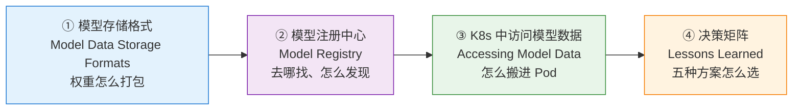

| 小节 | 你会学到 | 原书页码 |
|---|---|---|
| **2.1 为什么模型数据是个难题** | 模型有多大、TB 级数据的挑战 | p.88–90 |
| **2.2 存储格式** | 仅权重 vs 自包含；ONNX / Safetensors / GGUF | p.90–110 |
| **2.3 模型注册中心** | Hugging Face Hub / MLflow / Kubeflow / OCI Registry | p.110–130 |
| **2.4 K8s 中访问模型数据** | storageUri、storage initializer、init 容器、emptyDir | p.130–133 |
| **2.5 PersistentVolume 共享存储** | PV/PVC、ReadOnlyMany、网络文件系统 | p.133–137 |
| **2.6 OCI 镜像装模型** | 分层、缓存、LoRA 分层共享 | p.137–143 |
| **2.7 Modelcars** | shareProcessNamespace + /proc 符号链接零拷贝 | p.143–152 |
| **2.8 OCI Image Volume Mounts** | K8s 原生镜像卷挂载（1.31+ / 1.35 beta） | p.152–154 |
| **2.9 决策矩阵** | 五种方案的存储/速度/启动权衡 | p.154–157 |

> 💡 **一句话总览**：模型数据管理 = **格式（怎么打包）× 发现（去哪找）× 访问（怎么搬进 Pod）**。三者独立又串联，本章教你把每一环都拆到本质。

---

## 2.1 🐘 为什么"模型数据"值得单独开一章

### 是什么：模型到底有多大

原书开篇给了一张让人清醒的表 —— 主流开源模型的参数量与磁盘体积：

| 模型 Name | 厂商 Vendor | 参数量 Parameters | 体积 Size |
|---|---|---|---|
| Llama 4 Maverick | Meta | 4000 亿（MoE，激活 17B） | ~800 GB |
| DeepSeek-V3 | DeepSeek | 6710 亿（MoE，激活 37B） | ~700 GB |
| Llama 3.1 405B | Meta | 4050 亿 | ~750 GB |
| Qwen3-235B | 阿里 | 2350 亿（MoE，激活 22B） | ~118 GB |
| Mixtral 8x22B | Mistral | 1410 亿（MoE，激活 39B） | ~88 GB |
| GPT-OSS 120B | OpenAI | 1170 亿（MoE，激活 5B） | ~70 GB |
| Gemma 2 27B | Google | 270 亿 | ~54 GB |
| Granite 13B | IBM | 130 亿 | ~26 GB |
| Falcon 2 11B | TII | 110 亿 | ~22 GB |
| Mistral 7B | Mistral | 70 亿 | ~14 GB |

> 🔬 **第一性原理 · 参数量为什么对应这么多字节？**
>
> 体积 ≈ 参数量 × 每参数字节数。以 FP16（半精度）为例，每个参数占 **2 字节**：
>
> $$\text{Size} \approx N_{\text{params}} \times \text{bytes/param}$$
>
> - Mistral 7B：$7\times10^9 \times 2\,\text{B} = 14\times10^9\,\text{B} \approx 14\ \text{GB}$ ✅ 与表对上。
> - Llama 3.1 405B：$405\times10^9 \times 2\,\text{B} \approx 810\ \text{GB}$，表里写 ~750 GB（部分层用更省的精度/部分参数共享，略低于纯 FP16 上限）。
>
> 记住这条换算：**"每 10 亿参数 ≈ 2 GB（FP16）"**，面试里张口就能估。如果量化到 4-bit（每参数 0.5 字节），体积直接缩到 1/4 —— 这就是后面 GGUF 量化格式的意义。

### ⚠️ MoE 的坑：参数量 ≠ 每次推理都算

注意上表里大量标了 **MoE（Mixture of Experts，混合专家）**。DeepSeek-V3 总参数 6710 亿，但**每个 token 只激活 370 亿**。这意味着：

- **磁盘/内存**要按**总参数**准备（700 GB 全都得存下、装载）——这是本章要解决的"数据"问题；
- **算力（FLOPs）**只按**激活参数**消耗——这是后面章节 GPU 那一块的问题。

所以别被"激活 37B"迷惑：**存储成本是总量的账，一分不能少。**

### 为什么难：即使小模型也麻烦

原书特意强调："**Even smaller models can pose significant challenges**（即使更小的模型也会给管理员带来显著挑战）"。为什么？因为在 K8s 里问题会被**副本数**放大：

- 单个 14 GB 的 Mistral 7B 看着不大；
- 但你要跑 **20 个副本**做高可用，如果每个 Pod 各下一份 = 280 GB 的重复流量 + 磁盘；
- 冷启动（scale-to-zero 唤醒）时，每次拉 14 GB，用户等着首字节，延迟爆炸。

> 💡 **本章的灵魂矛盾**：**存一份共享 vs 每个 Pod 本地一份**。前者省存储但读有网络延迟，后者读得快但浪费存储。本章所有方案，本质都在这条轴上找平衡点。

---

## 2.2 🧬 模型存储格式 Model Data Storage Formats

### 是什么：模型不只是"一堆权重"

在 Hugging Face 上下载的模型，绝不只有裸权重（raw weights）。它还带着：

- **元数据（metadata）**：来源、作者、许可证等；
- **架构定义（architecture）**：神经网络的层怎么连、Transformer 怎么接线。

对运维（operator）来说，模型常常是个**黑盒（black box）**。但**弄清它是什么格式仍然至关重要**——因为不是每个格式都能在每个运行时上跑（回顾第 1 章）。有些格式高度灵活能被多种运行时用，有些则死死绑在某个特定平台上。

### 两大阵营：仅权重 vs 自包含

原书把格式分成两个高层类别：

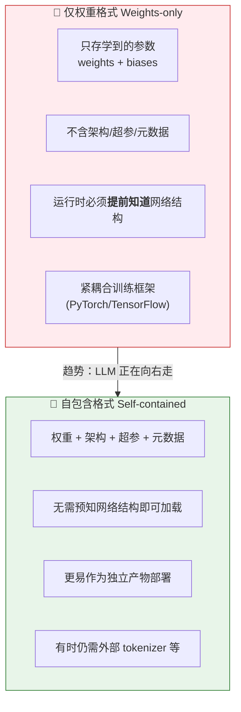

原书点破一个关键：**两者的边界是渐变的（gradual），不是非黑即白**。有些"看起来自包含"的格式，仍然需要外部组件（比如 LLM 的 tokenizer 文件）。

> 🔬 **第一性原理 · 为什么"仅权重"跑不起来？**
>
> 神经网络 = **结构（图）+ 参数（数字）**。仅权重格式只给你一大袋数字（tensor），但不告诉你"第 3 层是注意力还是 MLP、隐藏维度多少、怎么连接"。就像给你一箱没编号的乐高零件却没有图纸——你必须**在推理端手动重建训练时的架构**（原书 Figure 2-1 的核心），把权重张量正确地"塞回"对应位置。少一个维度对不上，直接报错。

#### 常见的仅权重格式

| 格式 | 扩展名 | 框架 | 说明 |
|---|---|---|---|
| **PyTorch State Dict** | `.pt` `.pth` | PyTorch | 用 `torch.nn.Module` 的 `state_dict` 序列化张量；Llama/GPT/BLOOM 的开发与微调阶段常用，**LLM 事实标准** |
| **TensorFlow Checkpoint** | `.ckpt` | TensorFlow | 曾用于 BERT，随 PyTorch 在 GenAI 崛起而式微 |
| **NumPy 数组** | `.npy` `.npz` | NumPy | 存小模型/单个权重矩阵还行，缺 LLM 部署需要的结构和元数据 |

> ⚠️ **常见坑 · `.pt`/`pickle` 的安全炸弹**：PyTorch 传统的 `.pt`/pickle 格式在**反序列化时能执行任意 Python 代码**。从网上下一个"权重文件"，加载它可能就等于在你机器上跑陌生人的代码。这正是下面 Safetensors 诞生的直接动机。

### 自包含格式能装什么

原书列了自包含模型可以携带的信息，逐条理解：

| 组成 | 内容 | 是什么 |
|---|---|---|
| **Weights & biases** | 神经网络的数值参数 | 占体积的大头 |
| **Model architecture** | 层的连接图，或对知名架构的引用 | 让运行时能重建网络 |
| **Tokenizer & vocabulary** | 分词器与词表 | 语言模型预处理文本必需 |
| **Hyperparameters** | 学习率、batch size、epoch 数等 | 训练配置信息 |
| **Other metadata** | 来源、作者、上下文 | 便于发现与复现 |

有些自包含格式还支持**前/后处理脚本（pre-/post-processing）**：推理前变换输入、推理后把输出转成可用形式。

### ⚠️ 现实：截至 2026 年，"完全自包含"并不存在

原书直言不讳（这是本节最重要的判断）：

> "as of 2026, no such format exists（截至 2026 年，还没有这样的格式）。"

没有任何一个广泛使用的格式，能把**权重 + tokenizer + 词表 + 完整架构**全部塞进单一产物。所以即便号称"自包含"的格式，更准确的叫法是 **"大体自包含（mostly self-contained）"**——它们打包了权重和部分元数据，但常常漏掉 tokenizer 或详细架构，仍然绑定特定运行时。

#### LLM 常见的"大体自包含"格式速览

| 格式 | 扩展名 | 缺什么 | 绑定运行时 |
|---|---|---|---|
| **Safetensors** | `.safetensors` | tokenizer.json、架构定义 | Hugging Face Transformers 生态 |
| **GGUF/GGML** | `.gguf` `.ggml` | 完整推理仍依赖外部运行时 | llama.cpp、vLLM |
| **ONNX** | `.onnx` | tokenizer、词表 | ONNX Runtime、TensorRT 等 |
| **TF SavedModel** | 目录 | —（较完整）| TensorFlow 生态，LLM 少用 |
| **HF Transformers** | 目录约定 | —（是"打包约定"非单一格式）| —— |

> 💡 **面试高频 · Hugging Face Transformers 是"格式"吗？**
> 严格说**不是**。它是一种**打包约定（packaging convention）**：一个目录里放权重（`.safetensors` 或 `.bin`）+ 两个关键文件 `tokenizer.json` 和 `config.json`。理解这点能避免很多概念混淆。

#### 🔑 tokenizer.json 与 config.json：LLM 的两把钥匙

原书用一个专门 sidebar 强调这两个文件，它们已成为**社区事实标准**，影响力远超 HF 生态：

| 文件 | 管什么 | 里面有什么 | 缺了会怎样 |
|---|---|---|---|
| **`tokenizer.json`** | 分词规则 + 词表映射 | 如何把文本切成 token（如 BPE 字节对编码）、特殊 token（padding / 起始 / 结束） | 运行时**无法把原始文本变成 token ID**，输入进不去 |
| **`config.json`** | 架构 + 超参 | 层数、注意力头数、隐藏维度、前馈维度、模型类型（如 `llama`） | 运行时**无法重建网络图**，模型加载不了 |

一句话：`tokenizer.json` 负责"看懂输入"，`config.json` 负责"搭好网络"。**两者缺一，模型就是一堆无法启动的字节。**

### 三种主流格式深挖

#### ① ONNX —— 通用互操作的蓝本

**Open Neural Network Exchange**，2017 年由微软和 Facebook 联合开发，目标是**框架无关（framework-independent）**：一个框架训练、另一个框架部署，不用转换。

ONNX 用 **Protocol Buffers（Protobuf）** 存成单个 `.onnx` 文件，含三部分：

1. **计算图（computational graph）**：网络结构与数据流；
2. **学到的参数**：权重和偏置；
3. **元数据**：输入/输出规格、算子集、版本。

- ✅ **强在广泛的运行时支持**：ONNX Runtime、TensorRT、OpenVINO、Triton。
- ⚠️ **算子集（op set）陷阱**：每个运行时支持一组固定算子（矩阵乘、卷积、注意力……）。如果模型用了运行时不支持的算子，**加载直接失败**，除非用插件扩展。
- ❌ **对 LLM 不够**：缺 tokenizer、词表、预处理逻辑。生成任务里，光有 `.onnx` 无法把原始文本变成 token 输入。

> 原书判断：截至 2026 年，ONNX 更适合**计算机视觉**（预处理简单、与模型耦合弱）。但它是"完全自包含格式该长什么样"的**概念蓝图**。

#### ② Safetensors —— 安全 + 高效的权重存储

Hugging Face 于 2021 年开发，直接针对 `.pt`/pickle 的**安全漏洞**和**性能瓶颈**。核心思想：**只存张量数据，绝不执行代码**。

原书 Figure 2-3 展示其内部结构：

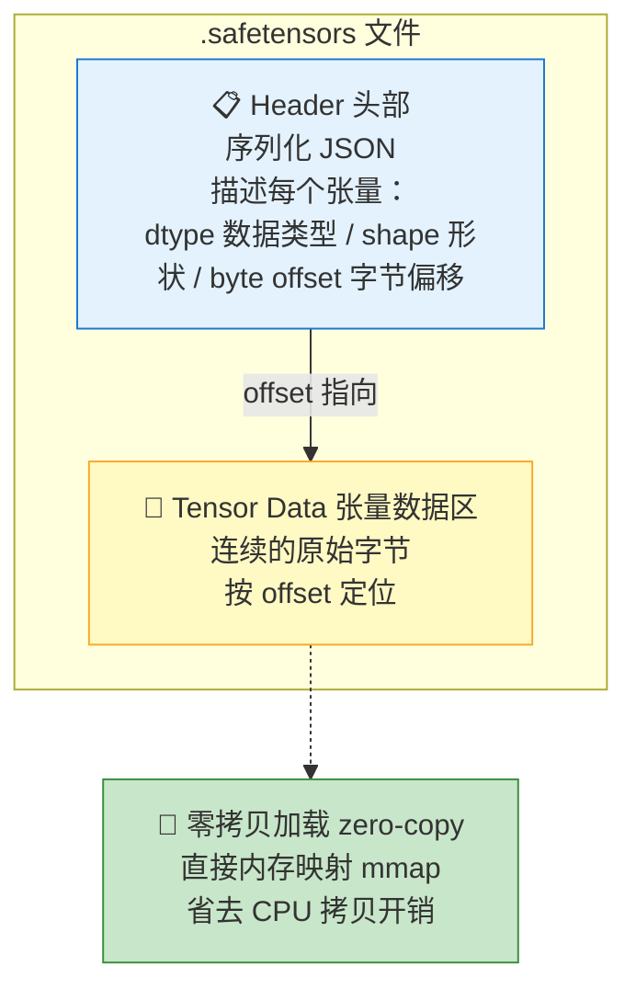

**两大优势**：

1. **安全**：不含可执行代码，杜绝反序列化时的代码注入。
2. **零拷贝加载（zero-copy loading）**：头部记录了每个张量的字节偏移，可以把数据**直接 mmap 到内存**，不经过 CPU 逐字节搬运——对大模型加载速度提升明显。

**分片（Sharding）**：Safetensors 支持把超大模型拆成多个小文件。比如原书说 Llama 4.1 405B 发布时是 **30 个分片**，命名如 `model-0000x-of-00030.safetensors`，外加一个索引文件 `model.safetensors.index.json`。

抄录原书 **Example 2-1** 索引文件（并逐行讲解）：

```json
{
  "metadata": {
    "total_size": 141107412992
  },
  "weight_map": {
    "lm_head.weight": "model-00030-of-00030.safetensors",
    "model.embed_tokens.weight": "model-00001-of-00030.safetensors",
    "model.layers.0.input_layernorm.weight": "model-00001-of-00030.safetensors",
    "model.layers.0.mlp.down_proj.weight": "model-00001-of-00030.safetensors",
    "model.layers.0.mlp.gate_proj.weight": "model-00001-of-00030.safetensors",
    "model.layers.0.mlp.up_proj.weight": "model-00001-of-00030.safetensors",
    "model.layers.1.input_layernorm.weight": "model-00002-of-00030.safetensors",
    "model.layers.1.mlp.down_proj.weight": "model-00002-of-00030.safetensors",
    "model.layers.1.mlp.gate_proj.weight": "model-00001-of-00030.safetensors",
    "model.layers.1.mlp.up_proj.weight": "model-00002-of-00030.safetensors"
  }
}
```

逐行拆解：

- `"total_size": 141107412992` —— 所有权重字节总和，约 **131 GB**（$141107412992 / 1024^3 \approx 131$）。
- `"weight_map"` —— **每个张量名 → 它所在的分片文件**的映射表。
- `"lm_head.weight": "...00030..."` —— 最终输出层权重落在第 30 个分片。
- 注意 `model.layers.1.mlp.gate_proj.weight` 落在 **00001** 而不是 00002 —— **同一层的不同张量可能被打散到不同分片**，索引文件就是拼图说明书。

> 💡 **分片为什么重要**：① 单文件过大不现实（存储限制）；② **并行加载**——不同分片可以并发拉取、并发处理，大幅缩短就绪时间。后面讲 OCI 分层时你会看到，这种"拆成多块"的思想会再次立功（每块作为独立层缓存）。

⚠️ 但 Safetensors 仍是"大体自包含"：**tokenizer 信息和架构定义不在 `.safetensors` 里面**，必须外挂 `tokenizer.json` 和 `config.json`。它现在是 HF 上大规模模型的**默认权重格式**。

#### ③ GGUF / GGML —— 为量化和低配硬件而生

**GGUF（GPT-Generated Unified Format）** 及其前身 **GGML**，出自 Georgi Gerganov 的 **llama.cpp** 项目，专门优化 **CPU 和边缘设备**上的 LLM 存储与执行。

核心特性：

- **量化（Quantization）为核心**：把权重从浮点降到 8-bit / 4-bit 甚至 2-bit 整数，**大幅压缩内存占用与算力开销**，让模型能在**没有独立 GPU** 的机器上跑，且精度可接受。
- **向后兼容（backward compatibility）**：模块化设计，新模型能在旧运行时上跑（只要核心组件不变），避免频繁格式转换。
- **专精 LLM**（不像 ONNX 通用）；原本为 CPU 设计，现在 llama.cpp、vLLM 也支持 GPU。
- **比 Safetensors 塞更多元数据**：GGUF 把**基础 tokenizer 信息 + 运行时元数据 + 权重**打进单文件（词表、特殊 token 都能存）。

原书 Figure 2-4 描述 GGUF 的二进制布局：

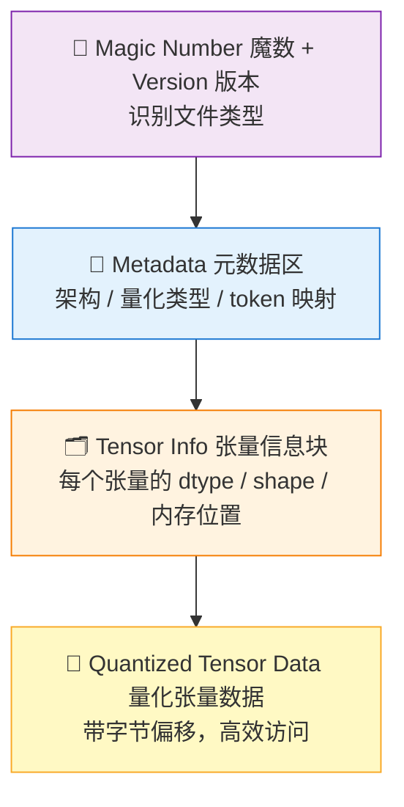

> 💡 **GGUF 为什么在 K8s 里讨喜**：**单文件、自包含**——一个 `.gguf` 就是一个完整、一致的产物（artifact），编排和扩缩容都简单。相比之下 Safetensors 的多文件结构则更适合和 OCI 分层配合（每个组件一层，独立缓存+并行下载）。

### 📊 三格式横向对比

| 维度 | ONNX | Safetensors | GGUF/GGML |
|---|---|---|---|
| 主要定位 | 通用 ML 互操作 | 安全高效存权重 | LLM 量化推理 |
| 含架构 | ✅（计算图）| ❌ | ⚠️ 基础架构元数据 |
| 含 tokenizer | ❌ | ❌ | ✅ 基础 |
| 安全（无代码执行）| ✅ | ✅✅ | ✅ |
| 零拷贝加载 | — | ✅ | — |
| 量化优化 | — | — | ✅✅ |
| 典型运行时 | ORT/TensorRT/Triton | HF/vLLM | llama.cpp/vLLM |
| 单文件？ | ✅ | ❌（多分片）| ✅ |
| LLM 生产采用度 | 低 | **高**（默认权重）| **高**（llama.cpp 生态）|

> 🔬 **第一性原理 · 为什么没有"模型界的 Docker"？**
>
> 原书反复用一个类比："**The quest for true model portability**（追寻真正的模型可移植性）"。就像 OCI 镜像抽象了应用内部、让软件能跨环境无缝部署，理想的模型格式也应在**模型数据（数据科学家产出）**和**模型执行（MLOps 运维）**之间画一条清晰边界。但今天的现实是"先让模型能跑起来"压倒了"标准化"。要达到这个圣杯（holy grail），需要**格式**和**运行时**两端同时收敛——CNCF 的 **ModelPack** 规范（2025 年 5 月入 CNCF Sandbox）就是朝这个方向的尝试，它把模型数据打进 OCI 镜像。这条路还很长。

---

## 2.3 🏛️ 模型注册中心 Model Registry

### 是什么 & 为什么

**模型注册中心（Model Registry）** = 管理模型的中央系统：追踪版本、治理、存储 ML 产物的元数据。它是 ML 生命周期里**连接"实验"与"生产部署"的桥梁**，既是**发现机制**又是**协作平台**。

原书一个关键设计洞见：

> ⚠️ **注册中心通常只存元数据，不存权重本身！**
>
> 组织多把注册中心部署为**集群内部服务**（不对外暴露）。它主要管**模型元数据**，而**真正的权重存在外部对象存储（如 AWS S3）里，注册中心只保存引用（reference）**。这种**元数据与数据分离**保证了管理大模型的灵活性，同时让元数据在集群内随手可查。

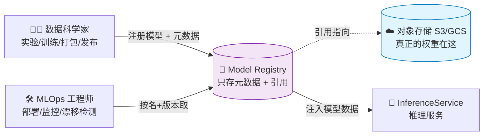

### 核心能力清单

原书定义了注册中心的核心特性：

| 能力 | 说明 |
|---|---|
| **元数据管理** | 存准确率、数据集血缘（lineage）、性能基准等 |
| **模型发现与搜索** | 按架构/超参/数据集/指标检索，支持范围查询（如 `accuracy > 0.95`）|
| **版本控制** | 追踪模型和数据集的多个版本，支持对比与回滚，保证复现性 |
| **生命周期管理** | 管理阶段：实验 → staging → 生产 → 退役 |
| **访问控制** | 细粒度权限，保障跨团队安全协作 |
| **审计与合规** | 记录使用/审批/变更，满足监管与复现 |
| **数据流水线** | 集成 CI/CD，自动化验证、打包、上线 |

> 💡 **背景概念 · 模型实验 vs 特征存储**
> - **模型实验（Model Experimentation）**：用不同超参反复训练找最优配置，每次跑产出 accuracy/loss 等指标（K8s 上表现为 GPU 密集的训练 Job）。
> - **特征存储（Feature Store）**：管理特征的计算与服务，保证训练/推理一致，防止**训练-服务偏斜（training-serving skew）**。但**对生成式 AI 而言特征不那么核心**——LLM 主要吃文本和 embedding，而非结构化特征。Feast 是主流开源特征存储。

### 四大注册中心对比

原书详解了四个代表，各有定位：

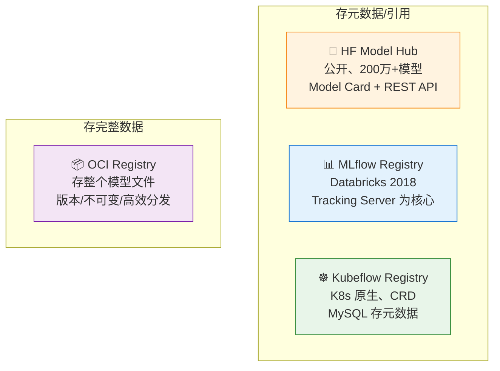

#### ① Hugging Face Model Hub —— 模型界的 GitHub

截至 2026 年初，托管 **200 万+模型**（其中 LLM **31 万+**），全部公开。每个模型配 **Model Card**（标准化摘要：用途、训练数据、性能基准、限制、许可证），还有内置推理小组件可在线试玩。提供 **REST API** 供程序化访问。

⚠️ **生产局限**：是**公开**注册中心，不适合私有专有模型；全自动流水线里的版本追踪也受限。企业需要**内部专用注册中心**。

#### ② MLflow Model Registry —— 数据科学家友好

Linux 基金会项目，Databricks 2018 年创建。核心是 **Tracking Server**（记录实验元数据、指标、产物）。模型最简单存本地文件系统，生产环境可推到 S3 或从 HF Hub 下载，通过**产物 URI（artifact URI）**管理引用。

抄录 **Example 2-2**（Python 注册模型，逐行讲解）：

```python
mlflow.set_tracking_uri(uri="http://localhost:8000")   # ① 设置追踪服务器地址
mlflow.set_experiment("MLflow Demo")                   # ② 创建/切换实验
params = {                                             # ③ 超参字典
    "solver": "lbfgs",
    "multi_class": "auto",
    "max_iter": 2500,
}
with mlflow.start_run():
    mlflow.log_params(params)                          # ④ 记录超参
    model_info = mlflow.sklearn.log_model(             # ⑤ 把模型登记到追踪服务器
        sk_model=model,
        artifact_path="my_model",
        input_example=X_train,
        registered_model_name="my-model",
    )
```

- ①→② 指向本地 8000 端口的服务器并建实验；
- ③→④ 把超参记录进去（便于日后对比不同 run）；
- ⑤ `log_model` 一步完成"存产物 + 注册命名模型"，`registered_model_name` 让它进入 Registry。

抄录 **Example 2-3**（REST API 查模型）关键返回：

```json
{
  "registered_models": [{
    "name": "my-model",
    "latest_versions": [{
      "name": "my-model",
      "version": "4",
      "current_stage": "None",
      "source": "mlflow-artifacts:/84948067/f0dd25483e/artifacts/my_model",
      "status": "READY"
    }]
  }]
}
```

- `"version": "4"` —— 模型在注册中心里**是有版本的**。
- `"source": "mlflow-artifacts:/..."` —— 用 MLflow 自己的 `mlflow-artifacts://` **URI 方案**引用产物；本地是文件系统，也支持 S3/GCS。

**Example 2-4** —— 用 MLflow + Podman 生成自包含 OCI 镜像：

```bash
$ mlflow models generate-dockerfile \
  -m mlflow-artifacts:/84948067/f0dd25483e/artifacts/my_model
# ... 生成 mlflow-dockerfile 目录
$ cd mlflow-dockerfile
$ podman build -t my_model .          # 用 podman 构建 OCI 镜像
# ... Successfully tagged localhost/my_model:latest
```

⚠️ 但原书提醒：这个功能**没为大下载量优化**，**不太适合 LLM**。

关于 MLflow 与 K8s：它**不是为 K8s 而生**，但能部署（Helm chart + PostgreSQL 后端存元数据）。**没有原生 CRD**，扩缩容和动态服务需额外自动化。MLflow **3.0** 起大幅改善 LLM 支持：Transformers flavor 内存高效日志、Prompt Registry、AI Gateway、原生 GenAI 评估、**基于引用的日志（存 HF Hub 引用而非全权重）**。但生产上**完整权重通常仍需下载存本地**。

#### ③ Kubeflow Model Registry —— K8s 原生

Kubeflow 是 **K8s 原生**的 ML 平台（Google 起，现属 CNCF），组件包括 Dashboard、Notebooks、Pipelines（KFP）、Trainer、Katib（AutoML）、KServe（模型服务）、以及 **Model Registry**。

与 MLflow 最大区别：**通过 CRD、manifest、原生控制器实现更深的 K8s 集成**。注册中心用**实体-关系模型**存元数据（后端 **MySQL**，灵感来自 Google 的 ML Metadata），需要 **PersistentVolume** 保证持久化。暴露 REST API + Python SDK。

抄录 **Example 2-5**（注册模型）：

```python
from model_registry import ModelRegistry
registry = ModelRegistry(   # ① 连接集群内的注册中心服务
    server_address="http://model-registry-service.kubeflow.svc.cluster.local",
    port=8080,
    author="your name",
    is_secure=False
)
rm = registry.register_model(   # ② 注册模型 + 元数据 + 数据位置
    "iris",
    "gs://kfserving-examples/models/sklearn/1.0/model",  # 权重实际存 GCS
    model_format_name="sklearn",
    model_format_version="1",
    version="v1",
    description="Iris scikit-learn model",
    metadata={"accuracy": 3.14, "license": "BSD 3-Clause License"}
)
```

- ① 地址 `.svc.cluster.local` —— **这段代码必须跑在集群内 Pod 里**才能访问内部服务地址。
- ② 注册时传的是 **`gs://` 数据位置引用**，再次印证"注册中心存引用，权重在外部存储"。

**Example 2-7** —— 关键：KServe 直接用注册中心 URI：

```yaml
apiVersion: serving.kserve.io/v1beta1
kind: InferenceService
metadata:
  name: iris-model
spec:
  predictor:
    model:
      storageUri: "model-registry://iris/v1"   # 只写模型ID+版本
      modelFormat:
        name: "sklearn"
        version: "1"
```

> 💡 **多一层间接（indirection）的妙处**：`model-registry://iris/v1` 只给**模型 ID 和版本**，真正的 `storageUri` 由注册中心元数据解析得出。这意味着**换存储位置无需改 InferenceService**——运维想把权重从 S3 挪到 GCS？改注册中心元数据即可，服务定义纹丝不动。这就是"抽象/间接层"的价值。

#### ④ OCI Registry —— 存"整个模型"而非引用

**OCI Registry** 是存储和分发容器镜像的标准机制（Docker Hub、Quay.io 就是）。关键转折：**OCI 1.1** 起支持 **OCI artifacts**，可以存任意数据类型——**包括把整个模型文件当作镜像来托管**。

> 💡 **背景 · 什么是 OCI**：Open Container Initiative，2015 年由 Docker 等在 Linux 基金会下发起，标准化容器化应用与产物的管理，保证互操作与厂商中立。从容器镜像起步，现已支持 Helm chart、生成式 AI 模型等多种产物。

**OCI Registry 与 MLflow/Kubeflow 的本质区别**：后者存**元数据 + 外部引用**，OCI Registry 存**完整模型数据本身**。它天然提供版本化、不可变性（immutability）、持久化、高效分发——非常契合 LLM 托管。

> 🔬 **概念 · "被动数据镜像（passive data image）"**：LLM 模型镜像不是拿来**执行**的（你不 `docker run` 它跑程序），而是拿来当**不可变的权重+配置包**，供推理运行时读取。这颠覆了"镜像=可运行程序"的直觉。

抄录 **Example 2-8**（Dockerfile 打包模型）：

```dockerfile
FROM alpine/git
RUN git lfs install \
 && git clone --depth 1 https://huggingface.co/Qwen/Qwen2.5-0.5B-Instruct /models
ENTRYPOINT sh
```

- `FROM alpine/git` —— 用带 git 的极小基础镜像。
- `git lfs install` —— 装 Git LFS（大文件用 LFS 管理，模型权重必需）。
- `git clone --depth 1 ... /models` —— 浅克隆模型仓库到 `/models`（`--depth 1` 只取最新提交，省流量）。
- `ENTRYPOINT sh` —— 入口是 shell（这是**被动数据镜像**，不真正运行服务）。

**Example 2-9**（构建并推送）：

```bash
$ podman build -f Dockerfile.model -t quay.io/rhuss/qwen2.5-0.5b-instruct .
# ... 会从 HF Hub 克隆整个仓库，可能较慢
$ podman push quay.io/rhuss/qwen2.5-0.5b-instruct:latest
# ... 推到集群可访问的注册中心
```

> ⚠️ **生产建议**：示例为简单起见把**整个模型作为单层（single layer）**。生产中应**把每个模型分块作为独立层**，这样容器运行时能**独立下载和缓存**每块——这是后面 OCI 分层、LoRA 共享的伏笔。

### 📊 四注册中心速查

| 维度 | HF Hub | MLflow | Kubeflow | OCI Registry |
|---|---|---|---|---|
| 存什么 | 元数据+权重（公开）| 元数据+引用 | 元数据+引用 | **完整模型数据** |
| K8s 原生 | ❌ | ⚠️ 可部署无 CRD | ✅ CRD/控制器 | ✅（复用镜像生态）|
| 后端 | —— | PostgreSQL | MySQL + PV | OCI Registry |
| 私有 | ❌ 公开 | ✅ | ✅ | ✅ |
| 最适合 | 公开发现/试玩 | 数据科学实验追踪 | K8s 全生命周期 | 生产分发/缓存 |

---

## 2.4 ☸️ 在 Kubernetes 中访问模型数据

前面解决了"格式"和"发现"，现在到最硬核的一环：**怎么把模型数据真正搬进集群里的 Pod。** 原书以 **KServe** 为典型例子（其他运行时方法类似）。

### 最简单的起点：storageUri

抄录 **Example 2-10**（从 S3 拉模型）：

```yaml
apiVersion: "serving.kserve.io/v1beta1"
kind: "InferenceService"
metadata:
  name: "mnist"
spec:
  predictor:
    serviceAccountName: sa          # ① 关联持有凭证的 ServiceAccount
    tensorflow:                      # ② 指定运行时（这里是 TensorFlow）
      storageUri: "s3://kserve-examples/mnist"   # ③ 指向 S3 桶里的模型数据
```

- ① `serviceAccountName: sa` —— ServiceAccount 关联一个 Secret，里面存访问凭证（比如 S3 的 access key）。
- ② 运行时类型（TensorFlow）。
- ③ **`storageUri` 的 schema（`s3://`）决定用哪个后端、去哪取。**

### 🔑 核心机制：Storage Initializer（存储初始化器）

这是本章最重要的机制之一。原书原话：

> "Each schema triggers a so-called **storage initializer**（每个 schema 触发一个所谓的存储初始化器），a component that **translates into a runtime's pod init-container**（它会转化成运行时 Pod 的 init 容器）。"

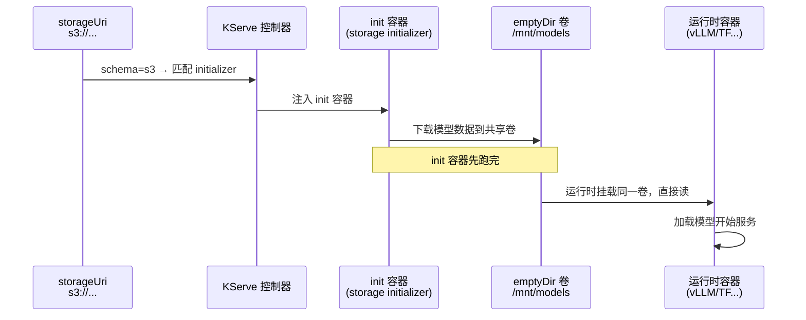

你还能用 KServe 的 **ClusterStorageContainer** 资源**自定义**存储初始化器。抄录 **Example 2-11**（加 `model-registry://` schema 支持）：

```yaml
apiVersion: serving.kserve.io/v1alpha1
kind: ClusterStorageContainer
metadata:
  name: model-registry-storage
spec:
  container:
    name: storage-initializer
    image: kubeflow/model-registry-storage-initializer   # ① 执行初始化逻辑的镜像
  supportedUriFormats:
    - prefix: model-registry://                           # ② 注册这个 URL schema
```

- ① 指向一个 OCI 镜像，里面是初始化器的逻辑。
- ② 注册 `model-registry://` 前缀，之后 InferenceService 就能用这种 URI。

### 💡 背景：Init 容器 vs Sidecar

原书专门 sidebar 讲这对 K8s 模式（本章后面反复用到）：

| 模式 | 何时运行 | 干什么 |
|---|---|---|
| **Init 容器** | **主容器之前**，先跑完 | 一次性初始化，如**往共享卷填充数据** |
| **Sidecar** | 与主容器**并行**运行 | 辅助功能：日志、数据处理、跨容器数据共享 |

### KServe 开箱支持的存储初始化器（Table 2-2）

| Schema | 说明 | 示例 |
|---|---|---|
| `gs` | 从 Google Cloud Storage 下载 | `gs://kfserving-examples/models/sklearn/1.0/model` |
| `s3` | 从 S3 桶下载 | `s3://kserve-examples/mnist` |
| `https` | 用 HTTP 下载模型数据 | `https://huggingface.co/meta-llama/Llama-3.2-3B` |
| `hdfs` `webhdfs` | 从 Hadoop 分布式文件系统访问 | `hdfs://path/to/model` |
| `pvc` | 从 PVC 引用的 PersistentVolume 拷贝 | `pvc://${PVC_NAME}/export` |
| `oci` | 拉 OCI 镜像并经 modelcar 直接访问 | `oci://quay.io/rhuss/kserving-example-sklearn:1.0` |
| `model-registry` | 访问 Kubeflow 注册中心里注册的模型 | `model-registry://iris/v1` |
| `hf` | 直接从 Hugging Face Hub 下载 | `hf://meta-llama/Llama-2-7b-chat-hf` |

### emptyDir：容器间共享数据的基石

原书点出 K8s 里的常见模式：**用节点本地卷在容器间共享数据**。大多数存储初始化器把模型下到**节点本地目录**，再由 LLM 运行时挂载读取。这靠 **`emptyDir`** 卷类型实现：

- K8s 把它初始化为一个**空目录**；
- 同一 Pod 内**所有容器都能挂载**它（包括先跑的 init 容器和后跑的应用容器）；
- init 容器往里下数据，运行时容器挂载来读——**数据就"交接"了**。

> ⚠️ **emptyDir 的代价**：它是**节点本地**的，意味着**每个 Pod 实例都要拷一份模型数据**。跑一个副本没问题，跑几十个副本时，重复拷贝就成了浪费——这直接引出下一节的 PersistentVolume。

---

## 2.5 💾 用 PersistentVolume 共享存储

### 是什么 & 为什么

前面的方案要么**远程下载新副本**，要么**打进 OCI 镜像**。**PersistentVolume（PV）**提供第三条路：**一份共享的模型数据，同时被多个 Pod 访问。**

原书强调三大优势：

1. **存储成本节省**：跑几十个副本时，存一份而非几十份。
2. **关注点分离**：数据科学家在外部管理模型，K8s 只负责消费。
3. **简化更新**：改一个中央位置即可更新模型。

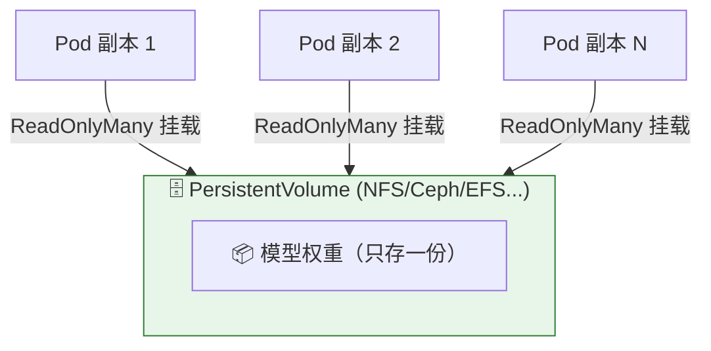

### 抄录 Example 2-12（PV + PVC 配置）

```yaml
apiVersion: v1
kind: PersistentVolume
metadata:
  name: llama-3-8b-pv
spec:
  capacity:
    storage: 20Gi                          # ① PV 总容量
  accessModes:
    - ReadOnlyMany                         # ② 允许多 Pod 同时只读挂载
  persistentVolumeReclaimPolicy: Retain    # ③ PVC 删除时保留数据（防误删模型）
  nfs:                                     # ④ 这里用 NFS 举例
    server: nfs-server.example.com
    path: /exports/models/llama-3-8b
---
apiVersion: v1
kind: PersistentVolumeClaim
metadata:
  name: llama-3-8b-pvc
  namespace: default
spec:
  accessModes:
    - ReadOnlyMany                         # ⑤ PVC 请求的访问模式必须与 PV 兼容
  resources:
    requests:
      storage: 20Gi
```

逐条讲解：

- ① `storage: 20Gi` —— PV 声明的容量。
- ② `ReadOnlyMany`（缩写 **ROX**）—— **允许多个 Pod 同时以只读方式挂载**，这是模型共享的关键访问模式。
- ③ `persistentVolumeReclaimPolicy: Retain` —— PVC 被删时**保留数据**（对比 `Delete` 会连底层存储一起删）。对宝贵的模型权重，`Retain` 防误删。
- ④ NFS 只是举例；Ceph、AWS EFS、Azure Files、Google Cloud Filestore 等分布式文件系统同理。
- ⑤ **PVC 请求的访问模式必须与 PV 兼容**，否则绑定失败。

> 🔬 **第一性原理 · 为什么模型天生适合 ReadOnlyMany？**
>
> 推理引擎**只读权重、从不修改**（服务过程中权重不变）。这个"只读"特性带来两个免费的性能红利：
> 1. **激进的文件系统缓存**：操作系统知道数据不会变，可以放心大胆地缓存；
> 2. **无锁竞争**：多个副本并发读同一文件，没有读写锁的协调开销。
>
> 配置只读发生在**两个层次**：PV 层的 `ReadOnlyMany` 允许多 Pod 同时读挂载；Pod 层再设 `readOnly: true` 加固约束、拿到上述性能好处。

### PVC 与其他方式的本质不同：直接挂载，零拷贝

抄录 **Example 2-13**（InferenceService 用 PVC）：

```yaml
apiVersion: serving.kserve.io/v1beta1
kind: InferenceService
metadata:
  name: llama-pvc
spec:
  predictor:
    model:
      modelFormat:
        name: pytorch
      storageUri: pvc://llama-3-8b-pvc/    # 按名引用 PVC
```

原书点破关键区别：

> "Unlike storage initializers that download from remote sources like `s3://` or `gs://`, the `pvc://` scheme works differently.（不像从远程下载的初始化器，`pvc://` 的工作方式不同。）"

- KServe 创建一个 PVC 支撑的卷（名为 `kserve-pvc-source`），**直接把 PVC 挂载进模型容器的 `/mnt/models`**。
- **没有拷贝步骤**：运行时直接从挂载的 PVC 读文件。
- 存储初始化器**仍会运行，但对 PVC URI 基本是空操作（no-op）**——数据访问由卷挂载搞定。

> 💡 **对比记忆**：
> - `s3://`/`gs://` → 下载 + 拷贝到 emptyDir → 运行时读**本地副本**（节点本地 I/O，快，但要拷）。
> - `pvc://` → **直接挂载网络文件系统** → 运行时**像读本地一样读**，但每次读都走网络（有网络延迟）。

### ⚠️ 性能与规模：PV 的甜区和天花板

原书对 PV 的规模边界讲得很实在：

| 维度 | 本地访问（init拷贝/modelcar/OCI卷）| PV（网络后端）|
|---|---|---|
| 访问速度 | **最快**（节点本地 I/O）| 每次读有**网络延迟** |
| 启动 | 需拷贝 → 慢 | **快**（只建网络挂载，无拷贝）|
| 存储效率 | 低（每 Pod/节点一份）| **最高**（只存一份）|
| 规模甜区 | —— | GPU 推理 **10–20 副本**（GPU 成本自然限规模）|

**扩不上去的警告信号**：存储后端磁盘压力、I/O 等待时间增加、响应延迟不稳定。**瓶颈来源**：网络饱和、NFS 服务器负载上限、并发读竞争。

> ⚠️ **"太多 Pod 共享一个 PVC" 是公认的问题类别**（虽然没有权威阈值）。高性能存储（Ceph、AWS EFS、Azure Files）能扛更多并发；基础 NFS 则容易先撑不住。**高规模或高吞吐场景，考虑节点本地方案（如 OCI 卷）。**

> ⚠️ **scale-to-zero 的软肋**：PV 启动快（挂载无需拷贝），但在**缩容到零再唤醒**时，**每次 Pod 重启都要重新走网络挂载**，且**跨重启没有本地缓存收益**。频繁冷启动的场景，这点要掂量。

---

## 2.6 📦 用 OCI 镜像存储模型数据

### 是什么：复用 Docker 的分层魔法

原书从 Docker 2013 年发明的**分层格式（layered format）**讲起。核心思想：

- 镜像由**只读层堆叠**而成，加上顶部一个**读写层（union filesystem 联合文件系统）**；
- **多个容器可以共享相同的底层层**；
- **每个只读层可以独立缓存**——只有变化的层需要重新分发。

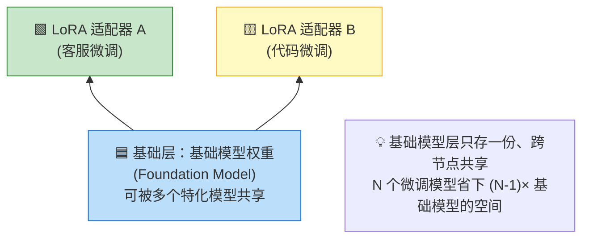

> 🔬 **第一性原理 · 为什么分层特别适合 LoRA？**
>
> **LoRA（Low-Rank Adaptation，低秩适配）**是在基础模型上叠加一小组微调参数的技术。这恰好和 OCI 分层的"堆叠"完美对应：
> - **基础模型 → 存在基础层（base image）**，能被集群节点上所有特化模型**共享**；
> - **各 LoRA 适配器 → 各自作为上层**。
>
> 结果：跑 10 个基于同一基础模型的微调模型，基础模型层**只需存一份**，磁盘占用大幅下降。最后所有层打包成一个 tar 归档存进 OCI Registry。

Docker 的成功催生了 **OCI 镜像规范标准化**，以及一整套工具生态（**skopeo**、**oras** 用于检查/管理 OCI 镜像）。把 LLM 放进 OCI 镜像 = **白嫖这套成熟基础设施**。

### 方式一：init 容器拷贝（Example 2-14）

这是"把 OCI 镜像里的模型数据搬出来"最直白的方式：

```yaml
kind: Deployment
apiVersion: apps/v1
metadata:
  name: vllm
spec:
  replicas: 1
  template:
    spec:
      initContainers:
      - name: copy-model-data
        image: quay.io/rhuss/qwen2.5-0.5b-instruct:latest   # ① 装模型的 OCI 镜像
        command:
        - "sh"
        - "-c"
        - "cp -a /models/. /mnt/models"                     # ② 从镜像目录拷到共享卷
        volumeMounts:
        - name: models
          mountPath: /mnt/models                            # ③ init 容器挂载共享卷
      containers:
      - name: vllm
        image: vllm/vllm-openai:latest
        args:
        - "--served-model-name"
        - "Qwen/Qwen2.5-0.5B-Instruct"
        - "--model"
        - "/mnt/models"                                     # ④ vLLM 从这读模型
        volumeMounts:
        - name: models
          mountPath: /mnt/models                            # ⑤ 应用容器挂同一卷
      volumes:
        - name: models
          emptyDir: {}                                      # ⑥ 节点本地空目录
```

逐条：① 装 Qwen 2.5 模型（`/models` 目录）的镜像；② `cp -a` 把数据从镜像目录**拷贝**到 emptyDir 卷；③ init 容器挂载点；④ vLLM 从 `/mnt/models` 加载；⑤ 应用容器挂同一卷读 init 容器拷好的数据；⑥ emptyDir 声明节点本地空目录。

> ⚠️ **这个"拷贝步骤"很贵**：原书明说 KServe 的存储初始化器（Table 2-2）都用这套 init 容器方式。**每次 Pod 启动都要拷一遍 GB 级数据**——这就是接下来 modelcar 和 OCI 卷要消灭的痛点。

> 💡 **背景 · CNCF ModelPack**：CNCF Sandbox 项目（2025 年 5 月入选），扩展 OCI 镜像规范以打包分发 AI 模型（权重+元数据+配置），定义新的注解类型，目标是标准化模型存储、跨运行时兼容。它与后面的 modelcar、OCI 卷互补。

---

## 2.7 🚗 Modelcars：零拷贝的巧技

### 为什么：消灭拷贝步骤

Example 2-14 的痛点：**把所有模型数据拷进中间存储**，慢且占空间。理想是**直接访问 OCI 镜像里的模型数据，不拷贝**。好处：镜像只需下一次却能被多个 Pod 同时用；LoRA 微调模型还能共享基础层，大幅省磁盘。

K8s 长期缺这个能力（GitHub issue 831 记录了 10 多年）。**从 K8s 1.35 起可用原生 image volume mounts**（下节讲），但那还在实验阶段。**Modelcar 是 KServe 在旧版本 K8s 上实现同样效果的过渡技术。**

抄录 **Example 2-15**（KServe 用 modelcar，极简）：

```yaml
apiVersion: serving.kserve.io/v1beta1
kind: InferenceService
metadata:
  name: "sklearn-iris-oci"
spec:
  predictor:
    model:
      modelFormat:
        name: sklearn
      storageUri: "oci://rhuss/kserving-example-sklearn:1.0"   # oci:// 触发 modelcar
```

`oci://` 是 KServe 特定语法，引用装模型数据的 OCI 镜像，**数据不经预拷贝直接访问**。对大数据集能显著加速运行时启动。

### 🔬 深挖：shareProcessNamespace + /proc 的魔法

> 原书注明这部分技术细节比全书大多数地方都深，可跳过。但它揭示的模式在处理大数据时很有用，值得一看。

**关键机制 `shareProcessNamespace`（共享进程命名空间）**：默认容器间互相看不见对方进程（`ps aux` 只见自己的）。设为 `true` 后，容器能**"看见"其他容器的进程，还能通过 `/proc` 文件系统访问其他容器的文件系统**。

抄录 **Example 2-16 → 关键实验结果**：`shareProcessNamespace: true` 后，在 busybox 容器里 `ps` 能看到 httpd 容器的进程；更神奇的是：

```bash
# 通过 /proc 访问另一个容器（PID 7 是 httpd）的根文件系统里的文件
$$ head -3 /proc/7/root/usr/local/apache2/conf/httpd.conf
#
# This is the main Apache HTTP server configuration file. ...
```

**`/proc/<PID>/root/`** 指向该进程的根文件系统——**这就是跨容器读文件的入口**。

### Modelcar 怎么工作

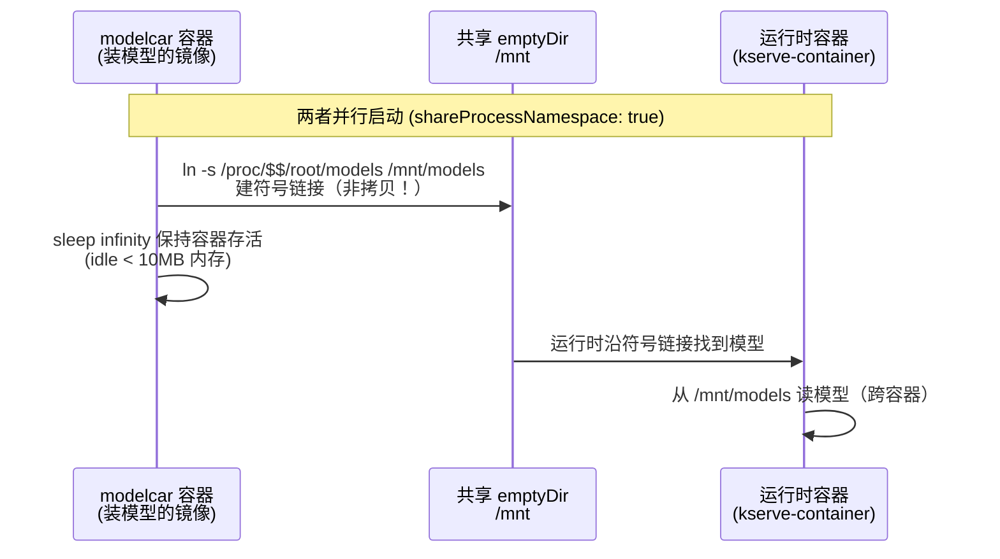

原书原话：**"no data is copied over; just a symbolic link is created（没有拷贝任何数据，只是建了个符号链接）"**，让运行时在固定位置（`/mnt/models`）找到模型。链接操作是 modelcar 启动命令的一部分，**idle 状态少于 10 MB 内存**。

抄录 **Example 2-17** 生成的 Pod（核心 `ln -s`）：

```yaml
apiVersion: v1
kind: Pod
spec:
  shareProcessNamespace: true                    # 开启进程命名空间共享
  containers:
  - name: kserve-container
    image: kserve/sklearnserver                  # 运行时
    args:
    - --model_name=sklearn-iris-oci
    - --model_dir=/mnt/models
    volumeMounts:
    - mountPath: /mnt
      name: kserve-provision-location            # 挂共享卷
  - name: modelcar
    image: rhuss/kserving-example-sklearn:1.0    # 装模型数据的镜像
    args:
    - sh
    - -c
    - ln -s /proc/$$$$/root/models /mnt/models && sleep infinity   # 建链 + 睡眠
    volumeMounts:
    - mountPath: /mnt
      name: kserve-provision-location
  volumes:
  - name: kserve-provision-location
    emptyDir: {}                                 # 共享的 emptyDir（只放符号链接）
```

- `ln -s /proc/$$$$/root/models /mnt/models` —— 在 YAML 里 `$$$$` 被替换成 `$$`（shell 里代表**当前 shell 进程 ID**）。所以链接 `/mnt/models` 指向 **modelcar 自己根文件系统里的 `/models`**（经 `/proc/<自己PID>/root/` 访问）。建完链，modelcar `sleep infinity` 保活。
- 注意：**emptyDir 里只放一个符号链接**，不放几十 GB 的模型数据——这是 modelcar 省空间的精髓。

### ⚠️ Modelcar 的四大坑

原书诚实列出缺点：

| 坑 | 问题 | 缓解 |
|---|---|---|
| **启动顺序** | modelcar 和运行时**并行启动**，运行时可能在模型就绪前就启动 | 用 K8s **sidecar 支持**（1.28+ 可选特性）让运行时等 modelcar 就绪；或用 init 容器**预拉镜像** |
| **安全** | `shareProcessNamespace` 让**所有容器的进程和文件系统互相可见**。有其他 sidecar 时尤危险 | ⚠️ 典型例子：**Istio** sidecar 假设自己完全隔离，不加密本地配置，其上游 daemon 访问配置**可被轻易利用**。用 Istio/Knative 等做 sidecar 注入时务必理解后果 |
| **启动时间不均** | 镜像已在节点则快，否则要从注册中心下大镜像可能几分钟。scale-to-zero 时尤其影响可预测性 | **镜像预取（prefetching）** |
| **多架构** | modelcar 需要一个活进程保活，该进程**绑定特定 CPU 架构**。多架构就要为每种架构复制镜像，浪费资源 | BuildKit、umoci、skopeo 造**多架构镜像（manifest list）**：架构无关层（模型数据）共享，只复制架构相关的可执行层。利用 OCI 内容寻址存储自动去重 |

> 💡 所有这些坑，**真正的 OCI image volume mounts 都能解决**——modelcar 是过渡桥梁，有平滑升级路径。

---

## 2.8 🎯 OCI Image Volume Mounts：K8s 原生方案

### 是什么

**从 K8s 1.31 起**，Pod 可以**直接把 OCI 容器镜像当作卷挂载**，无需先拷贝模型数据。相比 modelcar 的优势：**不需要符号链接、不需要进程命名空间共享**，模型数据直接从镜像层作为挂载卷读取，还能享受底层 **OCI 镜像层缓存**。

抄录 **Example 2-18**（vLLM 直挂 OCI 镜像卷）：

```yaml
apiVersion: v1
kind: Pod
metadata:
  name: llm-server
spec:
  containers:
  - name: main
    image: vllm/vllm-openai:latest        # ① 运行时镜像
    args:
      - "--served-model-name"
      - "meta-llama/Meta-Llama-3-8B"
      - "--model"
      - "/mnt/models"                      # ② vLLM 从挂载路径读
    volumeMounts:
      - name: model-volume
        mountPath: /mnt/models             # ③ 把镜像内容挂到这
        subPath: models                    # ④ 只挂镜像里的 models 子目录
  volumes:
  - name: model-volume
    image:                                 # ⑤ 卷类型 = OCI 镜像
      reference: quay.io/meta-llama/meta-llama-3.2-8b
      pullPolicy: IfNotPresent             # ⑥ 拉取策略
```

逐条：① vLLM 运行时；② 启动参数指向挂载路径；③ 把镜像挂到 `/mnt/models`；④ **`subPath: models`** —— 只挂镜像里的 `models` 子目录而非整个根，**匹配 modelcar 的典型镜像结构，提供前向兼容**；⑤ **`image:` 是新的卷类型**——直接指定 OCI 镜像，沿用常规镜像拉取语义（`latest` 标签总拉，否则节点没有才拉）；⑥ 也可显式指定拉取策略。

> 💡 **面试高频 · subPath 的妙用（迁移路径）**：把模型数据放在镜像的 `/models` 子目录，用 `subPath: models` 挂载。这样**同一个镜像既能用 modelcar 方式、又能用原生 OCI 卷方式**，实现从 modelcar 到原生卷的**平滑迁移，无需重建镜像**。

### ⚠️ 截至 2026 年初的限制

原书列出这个 beta 特性的现状边界：

| 限制 | 细节 |
|---|---|
| **容器运行时支持** | CRI-O v1.33+ 完整支持；containerd 需 v2.2.0+（基础支持 v2.1.0+）|
| **Feature gate** | 必须显式开启（默认仍关闭）|
| **只读** | 不支持可写层，卷保持只读 |
| **只能挂目录** | 不能直接挂单个文件 |

社区正在攻关：签名验证、压缩层、读写支持都在路线图上。**这个特性最终会成为 K8s 上服务 LLM 的首选方式，取代 modelcar。** 在它成熟前，modelcar 是可靠的直接访问方案。

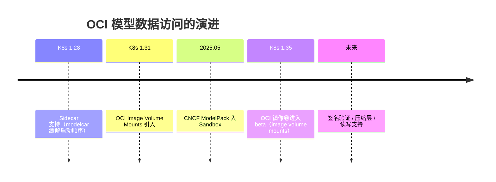

---

## 2.9 🧭 决策矩阵 Lessons Learned

本章的落脚点：五种模型数据访问策略，本质是在**存储效率、访问速度、运维复杂度**间做权衡。原书 **Table 2-3** 的精炼版：

| 方案 | 存储效率 | 访问速度 | 启动时间 | 最适合 |
|---|---|---|---|---|
| **Init 容器拷贝** | 低 | **快** | 慢 | 单副本/低并发、延迟敏感、要峰值推理性能 |
| **PersistentVolume** | **最高** | 中（网络延迟）| 快 | 多副本共享同模型、存储成本优先、数据科学家外部管理 |
| **Modelcar** | 高 | 快 | 中 | 多副本、共享层高效存储、旧版 K8s |
| **OCI Volume Mount** | 高 | 快 | 中 | 多副本、K8s 原生集成（新版 K8s）|

### 逐一给出选型建议

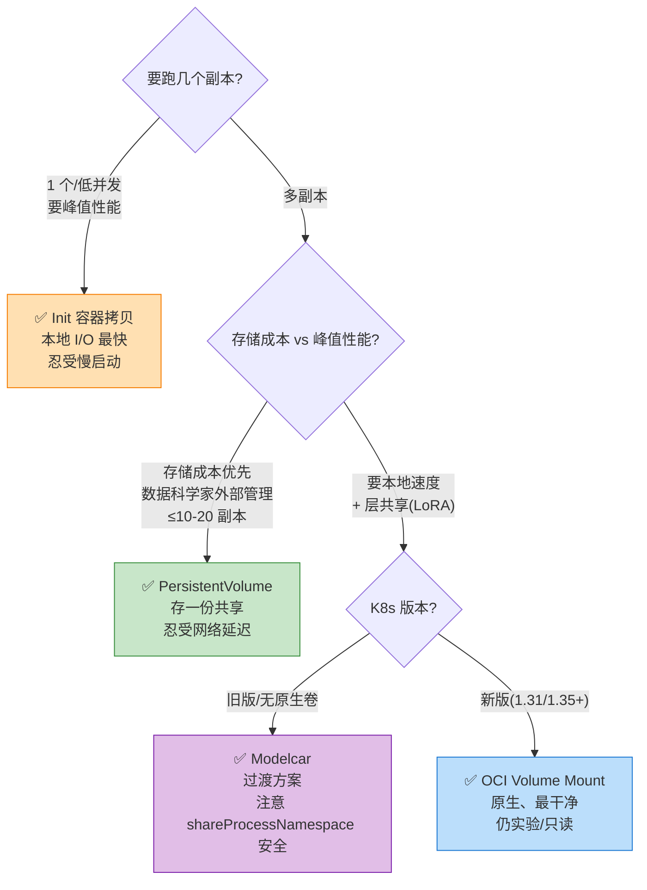

- **Init 容器拷贝**：节点本地 I/O，**推理性能最快**，延迟敏感首选。但多副本时每节点各存一份**浪费存储**。适合**单副本/低并发**，用慢启动换峰值性能。
- **PersistentVolume**：**存储效率最高**（存一份跨副本共享），代价是**每次读文件的网络延迟**。**几十副本没问题，几百副本会遇到后端饱和和网络竞争**。存储成本比峰值性能更重要、或数据科学家通过分布式文件系统外部管理模型时选它。
- **OCI 镜像方案（modelcar + 卷挂载）**：折中——**层共享带来高存储效率 + 快速本地访问**。作为标准格式，OCI 让模型分发和发现跨注册中心无缝。**modelcar** 立即可用但需进程命名空间共享（有安全考量）；**OCI 卷挂载**集成更干净（K8s 原生）但截至 1.33 仍实验性。两者在**跑多个共享同一基础模型的微调模型**时都很出色（公共层跨实例共享）。

### 💡 混合策略（Hybrid）

原书建议复杂环境用混合策略：

- **开发环境**用 PersistentVolume（方便更新模型）；
- **生产部署**用 OCI 卷（性能和可靠性）；
- **不同模型分级**：高频访问的模型放 OCI 镜像求速度，次要模型共享 PV 求成本。

**随着 OCI 卷挂载成熟、运行时广泛支持，它很可能成为大多数部署的首选方式。**

---

## 📌 小结

```mermaid
mindmap
  root((模型数据<br/>Model Data))
    格式 Formats
      仅权重(.pt/.ckpt/.npy)
      Safetensors(安全零拷贝多分片)
      GGUF(量化单文件)
      ONNX(通用蓝本缺tokenizer)
      "没有完全自包含格式(2026)"
    发现 Registry
      HF Hub(公开GitHub of models)
      MLflow(数据科学实验)
      Kubeflow(K8s原生CRD)
      OCI Registry(存完整数据)
    访问 Access
      storageUri+初始化器
      init容器+emptyDir(拷贝)
      PV/PVC(ReadOnlyMany共享)
      Modelcar(proc符号链接零拷贝)
      OCI卷挂载(K8s原生1.31+)
    权衡 Trade-off
      存储效率
      访问速度
      启动时间
```

**十条带走的核心结论**：

1. **模型体积是第一性约束**：记住 "每 10 亿参数 ≈ 2 GB（FP16）"，量化到 4-bit 能压到 1/4。
2. **格式分两类**：仅权重（运行时须预知架构）vs 自包含；但**截至 2026 年没有真正完全自包含的格式**。
3. **`tokenizer.json` + `config.json` 是 LLM 的两把钥匙**：一个看懂输入、一个搭好网络，缺一不可。
4. **Safetensors** 靠"只存张量+零拷贝"解决了 pickle 的安全和性能问题，成 HF 默认权重格式；**GGUF** 靠量化+单文件让 LLM 在 CPU/边缘也能跑。
5. **注册中心通常只存元数据和引用，权重在外部对象存储**——唯 **OCI Registry** 存完整模型数据本身。
6. **storageUri 的 schema 触发存储初始化器**，它落地成 Pod 的 **init 容器**，把数据下到 **emptyDir** 共享卷。
7. **PV/PVC + ReadOnlyMany** 让多副本共享一份模型（存储效率最高），代价是网络读延迟，甜区约 10–20 GPU 副本。
8. **OCI 分层 + LoRA** 天作之合：基础模型层跨微调模型共享，省下大量磁盘。
9. **Modelcar** 用 `shareProcessNamespace` + `/proc` 符号链接实现**零拷贝**（过渡技术，注意 Istio 类安全坑）；**OCI Image Volume Mounts**（K8s 1.31+，1.35 beta）是它的原生替代品。
10. **选型看副本数与优先级**：单副本要速度→init 拷贝；多副本省存储→PV；要本地速度+层共享→OCI 方案。复杂场景用混合策略。

> 🎯 **一句话收束**：本章教会你把"几十上百 GB 的权重"当作**可管理、可发现、可高效分发的工程产物**，而不是压垮集群的死重。这为下一部分（GPU 管理、生产化、可观测性）打好了数据地基。

---

## 🔗 延伸阅读

- **原书交叉引用**：第 1 章（服务运行时 KServe/vLLM）、第 6–7 章（GPU 训练/微调、LoRA 细节）、第 8 章（数据流水线）。
- **格式规范**：
  - Safetensors（Hugging Face）—— 零拷贝张量序列化。
  - GGUF/GGML（llama.cpp，Georgi Gerganov）—— 量化推理格式。
  - ONNX（微软/Facebook 2017）—— 框架无关互操作。
  - **CNCF ModelPack**（2025.05 入 Sandbox）—— OCI 之上的 AI 模型打包标准。
- **注册中心**：Hugging Face Hub、MLflow（Linux 基金会）、Kubeflow（CNCF）、OCI Registry（OCI 1.1 artifacts）。
- **K8s 机制**：`ClusterStorageContainer`（KServe CRD）、init 容器与 sidecar 模式（《Kubernetes Patterns》一书的 immutable configuration / init container / sidecar 模式）、`shareProcessNamespace`、image volume mounts（K8s 1.31+）。
- **工具链**：`skopeo`、`oras`（检查/管理 OCI 镜像）、`umoci`、BuildKit（多架构镜像）、`podman`/`docker`（构建模型镜像）、Git LFS（大文件）。

---

> 📖 本篇为《Generative AI on Kubernetes》第 2 章逐章精讲，对应原书 p.88–158。下一章进入 **Part II 生产就绪**：Kubernetes 与 GPU。
