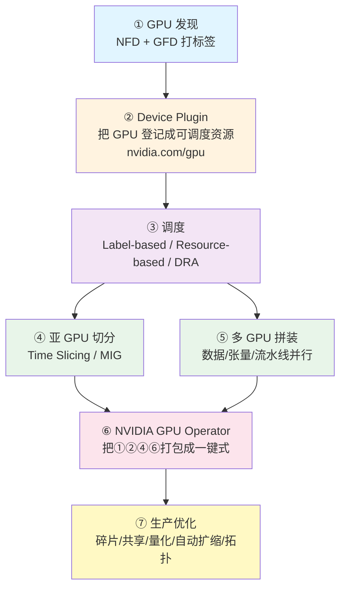
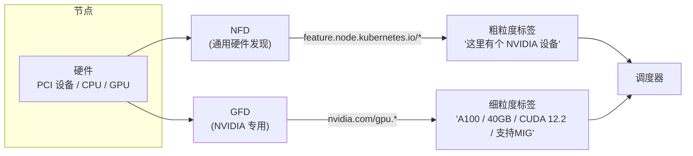
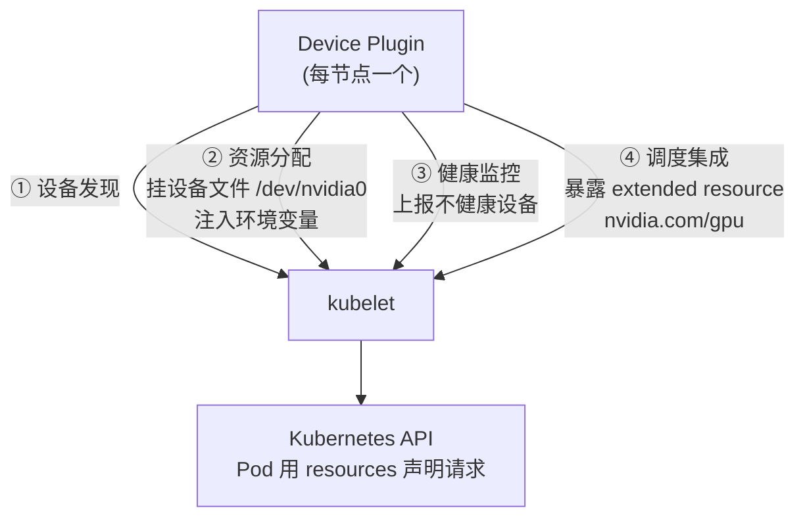
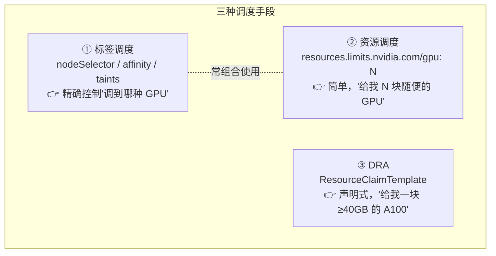
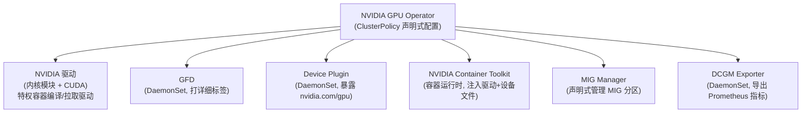
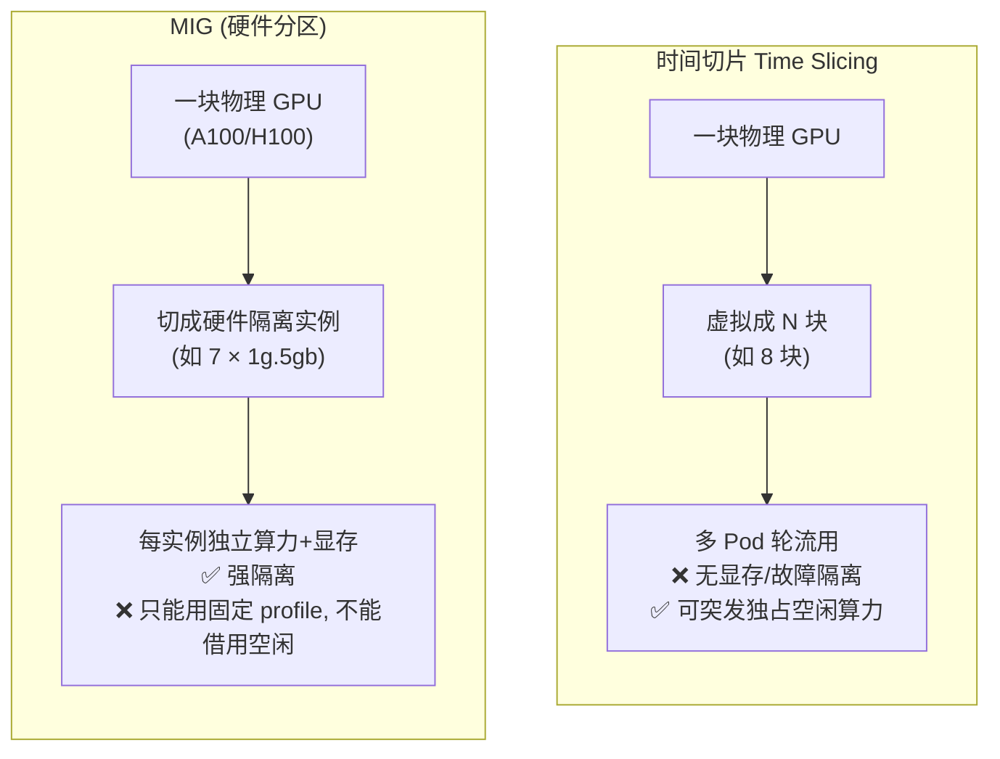
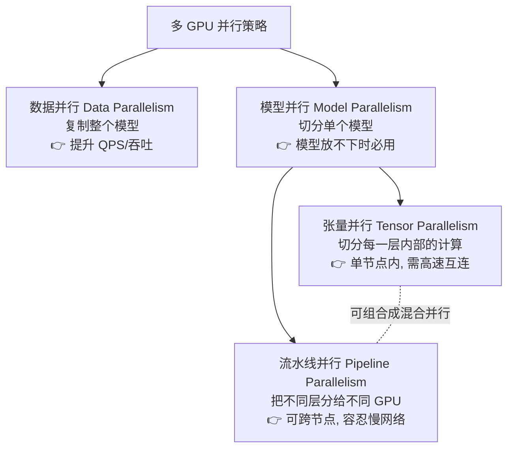
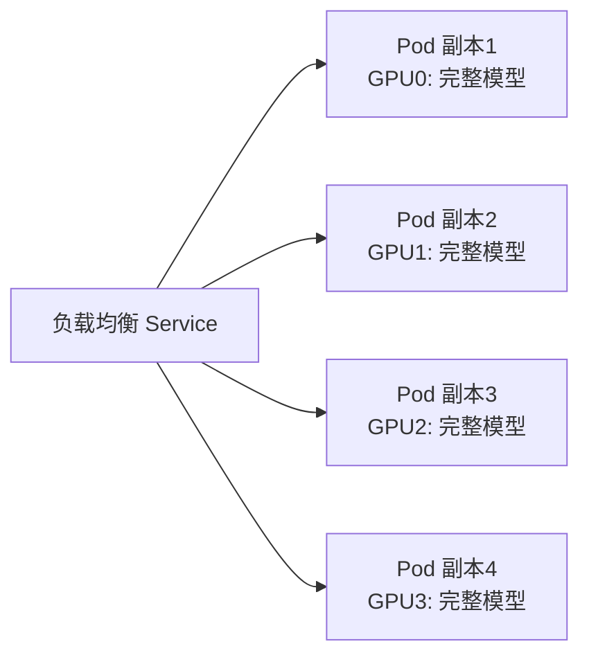
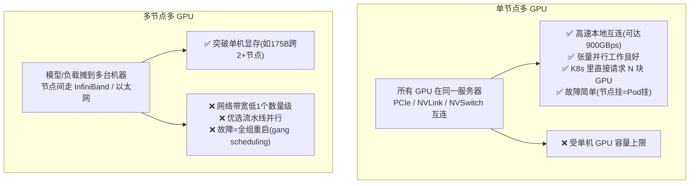
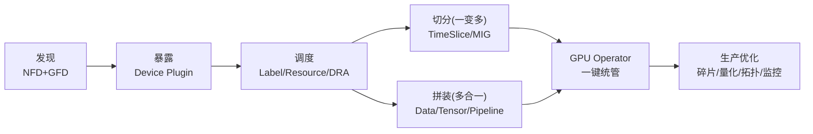

# 第 3 章 · Kubernetes 与 GPU 🎮

> 对应原书 *Generative AI on Kubernetes*（Roland Huss / Daniele Zonca）第 3 章 "Kubernetes and GPUs"，PDF 第 159–210 页。
> 本篇是**逐章精讲**：把书里的每一个概念、每一段 YAML、每一张图都拆开、讲透、补上第一性原理与实战坑。

---

## 🗺️ 本章地图

生成式 AI 的本质是**海量线性代数**（张量乘法为主），这对算力和显存是"变态级"的需求。GPU 凭借大规模并行架构成了事实标准（NVIDIA 一家独大，AMD / Intel 跟随，Google TPU 局限于自家生态，Cerebras/Graphcore ASIC 与 FPGA 仍属小众）。但问题在于——**Kubernetes 原生只认识 CPU 和内存，它根本不知道 GPU 是什么。**

于是本章要回答一条完整的链路："K8s 怎么发现 GPU → 怎么把 GPU 变成可调度资源 → 怎么把 Pod 调到合适的 GPU 上 → 怎么把一块 GPU 切给多个负载 / 把多块 GPU 拼起来跑一个大模型 → 怎么把这一切用一个 Operator 管起来 → 生产上怎么榨干每一分显存"。



| 小节 | 关键问题 | 关键组件 / 术语 |
|------|----------|----------------|
| GPU 发现 | 哪台节点有 GPU？什么型号？ | NFD、GFD、PCI vendor/class ID |
| Device Plugin | 怎么让 K8s "看见" GPU？ | Device Plugin 框架、`nvidia.com/gpu`、DRA |
| 工作负载调度 | 怎么把 Pod 调到对的 GPU？ | nodeSelector、affinity、taints、资源请求 |
| 亚 GPU 分配 | 一块卡怎么切给多人？ | Time Slicing、MIG |
| GPU Operator | 怎么一键管理这一切？ | ClusterPolicy、DCGM Exporter |
| 多 GPU 推理 | 一个大模型放不下怎么办？ | 数据/张量/流水线并行、NVLink、NCCL |
| 资源优化 | 怎么榨干 GPU、省钱？ | 碎片整理、量化、拓扑亲和 |

> 🔬 **第一性原理**：整章的底层矛盾只有一句话——**"GPU 是离散、昂贵、异构、且必须软硬一体（驱动+CUDA+容器运行时）才能用的资源"**，而 Kubernetes 的调度器天生假设资源是"可无限细分的连续量"（如 CPU 的 millicore）。本章所有机制，都是在弥合这条鸿沟。

---

## 一、GPU 发现（GPU Discovery）🔍

在 K8s 能"管理"GPU 之前，必须先**可靠地识别出哪些节点有 GPU、能力如何**。集群里节点几乎从不是同构的——云上、混合、裸金属混布，型号五花八门。调度的第一步是把硬件能力"翻译"成 K8s 能理解的东西：**节点标签（node labels）**。

发现分两层，层层递进：



### 1.1 Node Feature Discovery（NFD）—— 通用硬件探子

**是什么**：K8s SIG 的一个通用项目，用 **DaemonSet** 在每个节点上跑一个 agent，探测硬件/软件特征（CPU 细节、网卡、PCI 设备等），然后把结果作为标签打到节点上。

**怎么用**——最简单的方式是 Kustomize 或 Helm（书中 Example 3-1）：

```bash
NFD_REPO=https://github.com/kubernetes-sigs/node-feature-discovery
kubectl apply -k $NFD_REPO/deployment/overlays/default
```

生产环境更推荐 **NFD Operator**，它借助 Kubernetes Operator 模式帮你打理整个生命周期。

装完后，检查节点被打了哪些标签（Example 3-2）：

```bash
kubectl get node <node-name> -o yaml | yq .metadata.labels
```

输出（关键行）逐行解读：

```yaml
feature.node.kubernetes.io/pci-0300_1d0f.present: "true"   # ← ①
feature.node.kubernetes.io/pci-0302_10de.present: "true"   # ← ②
feature.node.kubernetes.io/cpu-hardware_multithreading: "true"
feature.node.kubernetes.io/cpu-model.family: "6"
feature.node.kubernetes.io/cpu-model.id: "85"
feature.node.kubernetes.io/cpu-model.vendor_id: Intel
feature.node.kubernetes.io/kernel-selinux.enabled: "true"
feature.node.kubernetes.io/kernel-version.full: 5.14.0-427.62.1.el9_4.x86_64
```

- **① `pci-0300_1d0f`**：`0300` 是 PCI class（VGA 兼容显示控制器），`1d0f` 是 vendor ID = **AWS**。这是 EC2 节点里典型的 AWS 显示控制器。
- **② `pci-0302_10de`**：`0302` 是 PCI class（3D 控制器，即真正的 GPU），`10de` 是 vendor ID = **NVIDIA**。这一行就是"这台节点有一块 NVIDIA GPU"的铁证。

**标签命名规约**：`feature.node.kubernetes.io/` 前缀 + 硬件类别 + 特征细节，默认格式 `<class>_<vendor>`。

| PCI class | 含义 | 常见 vendor ID |
|-----------|------|----------------|
| `0300` | VGA 兼容显示控制器 | — |
| `0302` | 3D 控制器（GPU） | `10de`=NVIDIA、`1002`=AMD、`8086`=Intel |

> ⚠️ **常见坑 · NFD 只告诉你"有没有"，不告诉你"是什么"**：NFD 标签只表明"某类硬件存在"，**不含** GPU 型号、显存大小、CUDA 能力这类细节。想按"A100 且 ≥40GB"调度，光靠 NFD 不够——这正是 GFD 存在的理由。

### 1.2 GPU Feature Discovery（GFD）—— NVIDIA 专用放大镜

**是什么**：NVIDIA GPU Operator 的一部分（后面第五节详讲），也是一个跑在 GPU 节点上的 **DaemonSet**。它用 `nvidia-smi` 等工具深挖每块 GPU 的详细信息（型号、显存、CUDA 版本、MIG 能力……），然后打成 `nvidia.com/*` 系列标签。

书中 **Table 3-1** 列出的关键标签（我按"用途"重排，方便记忆）：

| 标签 | 含义 | 示例 |
|------|------|------|
| `nvidia.com/gpu.count` | 节点上 GPU（或 MIG 实例）数量 | `4` |
| `nvidia.com/gpu.product` | 型号 / MIG profile；MIG 模式含 profile，时间切片模式带 `-SHARED` 后缀 | `A100-SXM4-40GB` |
| `nvidia.com/gpu.memory` | 每块 GPU / MIG 实例的显存（MiB） | `40537` |
| `nvidia.com/gpu.family` | GPU 架构家族 | `ampere` / `hopper` / `turing` |
| `nvidia.com/cuda.driver-version.full` | 已装 NVIDIA 驱动完整版本 | `525.105.17` |
| `nvidia.com/cuda.runtime.version.full` | 可用 CUDA 运行时版本 | `12.2` |
| `nvidia.com/mig.capable` | 该 GPU 是否支持 MIG | `true` |
| `nvidia.com/mig.strategy` | MIG 切分策略 | `single` / `mixed` / unset |
| `nvidia.com/gpu.replicas` | 开启时间切片后，每块物理 GPU 的虚拟 GPU 数 | `8` |
| `nvidia.com/mig-<profile>.count` | 某种 MIG profile 的分区数（mixed 策略下出现） | `2`（如 `nvidia.com/mig-1g.5gb.count`） |
| `nvidia.com/gpu.machine` | GPU 节点的机型标识 | `dgx-a100` |
| `nvidia.com/gpu.compute.major` | CUDA 计算能力主版本号 | `8` |
| `nvidia.com/gpu.compute.minor` | CUDA 计算能力次版本号 | `0` |

**这些标签能干什么？** 举两个立竿见影的例子：

- 想只调度到**时间切片模式**的 GPU：`nodeSelector: nvidia.com/gpu.product: A100-SXM4-40GB-SHARED`（注意 `-SHARED` 后缀）。
- 想要**独占**完整 GPU：反过来**避开**带 `-SHARED` 后缀的节点。

> 💡 **实战 / 面试高频**：书里点出一个重要的"分工哲学"——**这些细粒度标签，绝大多数时候是 GPU Operator 内部组件（尤其是 device plugin）自己用的**；普通用户通常**只需在 Pod 里写 `resources.limits.nvidia.com/gpu: 1`**，剩下的交给平台。理解标签，是为了看懂复杂部署，而不是每次都要手写它们。这就是"抽象层"的价值。

---

## 二、Kubernetes GPU Device Plugin 🔌

标签解决了"发现"，但发现≠可用。**Device Plugin 框架**负责把 GPU 变成**可调度、可分配（schedulable & allocatable）的资源**，纳入 K8s 的资源模型。

### 2.1 为什么需要 Device Plugin？

K8s 从设计之初就是可扩展的：CPU / 内存原生支持，但对 GPU、TPU、FPGA 这类专用硬件，它提供了一个**标准化的插件接口**。插件在每个节点上**向 kubelet 注册**，上报设备可用性和健康状态，从而实现资源感知调度与负载隔离。

这个接口支持的硬件很广：FPGA、网络加速器、存储控制器、加密模块、多媒体处理器、机器人硬件……对生成式 AI 最关键的，当然是 **GPU 与各类 AI 加速器**。

### 2.2 Device Plugin 的四大核心职责



| 职责 | 干了什么 |
|------|----------|
| **① 设备发现（Device discovery）** | 探测节点上的设备，把清单报给 kubelet |
| **② 资源分配（Resource allocation）** | 负载需要 GPU 时，独占式分配；搭好运行时环境、暴露设备文件、注入环境变量 |
| **③ 健康监控（Health monitoring）** | 持续监测设备健康，让 K8s 感知坏卡以便调度决策 |
| **④ 调度集成（Scheduler integration）** | 把硬件暴露为标准的 **extended resource**（如 `nvidia.com/gpu`），Pod 在 `resources` 里显式请求 |

### 2.3 主流厂商的 Device Plugin

| 插件 | 覆盖硬件 | 备注 |
|------|----------|------|
| `nvidia-device-plugin` | CUDA GPU | 官方，AI 负载必备；GPU Operator 会自动部署 |
| `amd-device-plugin` | ROCm GPU | 官方，HPC / AI |
| `intel-gpu-plugin` | Intel 集显 + 独显 | — |
| `google-cloud-tpu-device-plugin` | TPU | 仅限 GKE |

### 2.4 Device Plugin 的两大天生局限

> ⚠️ **常见坑 · Device Plugin 的"静态且独占"**：书里明确点出两个短板——
> 1. **独占分配**：设备通常被**整块独占**给单个 Pod → 常导致资源利用率低下。
> 2. **静态分配**：分配在**调度那一刻**就定死了 → 对需求动态变化的负载不够灵活；且调度器**无法区分不同设备**（V100 和 A100 长得一样）。

正是这两个短板，催生了下面的 **DRA**。

> 🔬 **第一性原理 · 为什么坏卡会让 Pod 卡在 Pending**：K8s 的调度依据是 device plugin 上报的**数量**。如果 device plugin 没跑、或挂了，K8s 就认为"这台节点上可用 GPU = 0"，于是所有请求 GPU 的 Pod 全部 **Pending**。所以 device plugin 是"关键路径组件"，它一挂，整条 GPU 供给链断裂。

---

## 三、GPU 工作负载调度（GPU Workload Scheduling）🎯

K8s 提供三种互补的 GPU 调度手段：**标签调度（label-based）**、**资源调度（resource-based）**、以及新兴的 **DRA**。



### 3.1 标签调度（Label-Based Scheduling）

当集群里 GPU 型号混杂、或想把 GPU 节点"围起来"专供 GPU 负载时，标签就是"方向盘"。三种机制，控制力度递增：

#### （a）nodeSelector —— 最直接

**思路**：给节点打固定标签，Pod 里用相同的 key-value 精确匹配。可以直接复用 NFD/GFD 自动打的 GPU 标签，不用自己造。

书中 Example 3-3：

```yaml
apiVersion: v1
kind: Pod
metadata:
  name: t4-inference
spec:
  containers:
  - name: server
    image: myrepo/llm-server:latest
  nodeSelector:
    # 只选被标记为 Tesla T4 GPU 的节点
    nvidia.com/gpu.product: Tesla-T4
```

- **优点**：极简，一行钉死目标节点池，零额外调度开销。
- **缺点**：规则是**绝对的**——标签缺失或拼错，Pod 直接不调度；且**无法表达"或"**，只能"T4 或什么都不要"（"T4 or nothing"）。

#### （b）Node Affinity —— 更丰富、支持软偏好

**思路**：在 nodeSelector 的基础上增加表达力。`required*` 相当于加强版选择器（硬约束），`preferred*` 让你"温柔地"推动调度器（软偏好）。

书中 Example 3-4（依赖 GFD 标签），逐块解读：

```yaml
apiVersion: v1
kind: Pod
metadata:
  name: a100-preferred
spec:
  containers:
  - name: llm
    image: myrepo/mt-server:latest
    resources:
      limits:
        nvidia.com/gpu: 4          # 要 4 块 GPU
  affinity:
    nodeAffinity:
      requiredDuringSchedulingIgnoredDuringExecution:   # ← 硬约束
        nodeSelectorTerms:
        - matchExpressions:
          - key: nvidia.com/gpu.memory
            operator: Gt
            values: ["40000"]        # 显存必须 > 40000 MiB（约 40GB）
      preferredDuringSchedulingIgnoredDuringExecution:  # ← 软偏好
      - weight: 1
        preference:
          matchExpressions:
          - key: nvidia.com/gpu.family
            operator: In
            values: ["hopper"]       # 优先 Hopper(H100)，但没有也行
```

- **硬约束**：节点 GPU 显存必须 `> 40000`（Gt = greater than）。
- **软偏好**：**优先 Hopper（H100）**，但如果没有空闲 H100，K8s 会退而调度到满足显存要求的 Ampere（A100）节点上。
- **缺点**：啰嗦。冗长的 matchExpressions 会让 manifest 变脏；硬约束堆太多可能"饿死"负载（找不到满足全部条件的节点）。

#### （c）Taints & Tolerations —— 反向"围栏"

**思路**：翻转模型——把某些节点标记为"默认禁入"，只有显式带**容忍（toleration）**的 Pod 才能进来。管理员加的 **taint 排斥所有 Pod**，只有带匹配 toleration 的能调度。

书中 Example 3-5，给所有带 `nvidia.com/gpu.count` 标签的节点打 taint：

```bash
# 需要 cluster-admin 权限
kubectl taint nodes -l nvidia.com/gpu.count nvidia.com/gpu=true:NoSchedule
```

书中 Example 3-6，让 Deployment 容忍这个 taint：

```yaml
apiVersion: apps/v1
kind: Deployment
metadata:
  name: gpu-serving
spec:
  replicas: 2
  template:
    spec:
      containers:
      - name: tgi
        image: ghcr.io/huggingface/tgi:latest
        resources:
          limits:
            nvidia.com/gpu: 1          # ← 请求一块 GPU（由 device plugin 提供）
      tolerations:
      - key: "nvidia.com/gpu"          # ← 容忍 nvidia.com/gpu taint
        operator: "Exists"             #    Exists = 不管 value 是什么都容忍
        effect: "NoSchedule"
```

**taint 的典型用途**：把昂贵的 GPU 节点**专供**给 GPU 负载；或在维护时"隔离（cordon）"节点。它常与 affinity/selector 搭配：**taint 把普通 Pod 挡在外面，affinity 再决定在剩下的 GPU 节点里选最优的那一台**。

#### 三种标签调度的选型

| 手段 | 最适合场景 |
|------|-----------|
| **nodeSelector** | 小型、同构 GPU 集群，一个标签就够 |
| **Node affinity** | 一旦混入不同代际、不同显存、不同可用区 |
| **Taints** | 集群层面保护 GPU 池，天然与前两者配对做精细放置 |

> ⚠️ **三者共同的软肋**：都依赖**静态标签**——要么管理员手动维护，要么靠 NFD/GFD 这类发现型 Operator 打上。标签一旦滞后或错漏，调度就出问题。

### 3.2 资源调度（Resource-Based Scheduling）—— 最省心

**思路**：直接在负载里声明"我要 GPU"。device plugin 一跑起来，就把每块 GPU 广播成 extended resource（一般是 `nvidia.com/gpu`）。

书中 Example 3-7：

```yaml
resources:
  limits:
    nvidia.com/gpu: 1
```

调度器只看 device plugin 上报的**数字可用量**，把 Pod 绑到有空闲 GPU 的节点；kubelet 授予容器**独占**一块 GPU。**没有标签要管、没有 selector 要记、没有额外控制器要装**——用起来就像申请 CPU/内存，只是资源名不同。

- **最大优点**：极简。一个字段就能在设备文件层面隔离 GPU、防止其他 Pod 触碰、让 CUDA 应用零配置跑起来。单一 GPU 类型的小集群、或"随便什么 GPU 都行"的开发环境，通常够用。
- **最大缺点**：**缺乏精度**。所有 GPU 在调度器眼里长得一样——哪怕集群里混着 V100 / A100 / 消费级卡。一个模型在 80GB A100 上跑得舒舒服服，塞进 16GB T4 就爆显存，但 `nvidia.com/gpu: 1` 对它们一视同仁。也**没法**请求特定 compute capability、限定 MIG 模式、或按互连拓扑要多块卡。

> 💡 **实战 · 精度问题怎么绕**：团队常用的 workaround——把资源请求 + `nodeSelector`/`nodeAffinity` 组合起来。要么用 device plugin 打的标签（如 `nvidia.com/gpu.product`），要么给节点打自定义标签（如 `gpu-type=A100`），然后把负载"引导"到兼容硬件上。代价是**节点清单和负载定义之间要额外协调**。

### 3.3 Dynamic Resource Allocation（DRA）—— 声明式的未来

**是什么**：DRA 是让 K8s 设备调度更**灵活、可组合、动态**的努力，自 **Kubernetes 1.34 起成为核心稳定特性（GA，默认开启）**。它把关注点从"要几块（how many）"转向"要什么样（what kind）"，灵感来自 K8s 的**卷（volume）供给模型**——你描述想要的资源，让平台去解析满足。

**怎么用**：负载通过 `ResourceClaimTemplate` 声明设备需求（"意图声明"），控制面 + DRA driver 在**调度时（just-in-time）**解析。

书中 Example 3-8，定义一个模板：

```yaml
apiVersion: resource.k8s.io/v1beta1
kind: ResourceClaimTemplate
metadata:
  name: a100-claim-template
spec:
  spec:
    devices:
      requests:
        - name: high-memory-gpu
          deviceClassName: gpu.nvidia.com/a100   # ← 请求 A100 类设备（逻辑设备类）
          allocationMode: ExactCount
          count: 1                                # ← 要 1 块
          parameters:
            minMemory: "40Gi"                     # ← 至少 40Gi 显存
            migMode: "disabled"                   # ← 显式关闭 MIG，独占整块卡
```

书中 Example 3-9，Deployment 引用该模板：

```yaml
apiVersion: batch/v1
kind: Deployment
metadata:
  name: inference-server
spec:
  template:
    spec:
      containers:
      - name: model-runner
        image: myorg/llm-inference:latest
        resources:
          claims:
          - name: high-memory-gpu        # ← 容器引用下面的 claim
      resourceClaims:
      - name: high-memory-gpu
        resourceClaimTemplateName: a100-claim-template   # ← 指向 Example 3-8
```

> 🔬 **第一性原理 · DRA 强在哪**：**声明与实际分配的分离**。K8s 只在调度时、且仅当某节点确有匹配设备时才真正分配。这让 driver 能做"更聪明的分配"——不再是"抓第一块空闲 GPU"，而是可以综合考虑**当前使用率、功耗、显存压力**等节点级约束。对 LLM 推理（需要特定 GPU 如 80GB A100）尤其对味：你直接声明"就要这个配置"，不再依赖节点标签或手动放置。

> ⚠️ **常见坑 · DRA 还没到生产级（截至 2026 年初）**：核心 DRA API 虽已 GA 且默认开启（1.34+），但**生态还在追赶**：
> - **NVIDIA GPU DRA driver 仍是 technical preview，不建议生产用**。
> - 部分 GPU 请求、细粒度 MIG 分区、拓扑感知调度等特性仍不成熟，且**依赖 driver 和平台**。
> - 与 cluster autoscaler、配额（quota）的集成还有限。
>
> **结论**：DRA 是明确的未来方向，但**在它成熟之前，"资源请求 + 标签调度"仍是 GPU 调度的生产标准**。

---

## 四、NVIDIA GPU Operator 🛠️

前面每个组件（device plugin、GFD、驱动、运行时……）都能手动装，但那是运维噩梦。**NVIDIA GPU Operator** 把这一切打包成**一个声明式接口**，装驱动、装容器运行时钩子、装监控 agent、还提供两种亚 GPU 共享机制。

### 4.1 GPU Operator 包含哪些组件



| 组件 | 作用 | 关键细节 / 坑 |
|------|------|--------------|
| **NVIDIA 驱动**（内核模块 + CUDA） | GPU 启用的核心。用**特权驱动容器**给每个 GPU 节点部署驱动：为节点内核编译，或拉预编译版 | ⚠️ 节点最好**同一 OS 内核版本**才能依赖 Operator 的驱动容器；混版可能得手动预装驱动 |
| **GPU Feature Discovery** | 前述 GFD，Operator 以 DaemonSet 部署，免手动装 | — |
| **Device Plugin** | 前述 device plugin，DaemonSet 部署，引入 `nvidia.com/gpu`，支持亚 GPU 分配 | ⚠️ **关键组件**：它没跑/坏了，Pod 会一直 Pending（K8s 以为没资源） |
| **NVIDIA Container Toolkit（运行时）** | CRI-O / containerd 的扩展，请求 GPU 时把驱动和设备文件**注入容器**，让 `/dev/nvidia0` 和驱动可见 | ⚠️ 容器**镜像里仍必须自带应用所需的 CUDA 库**，运行时只注入驱动/设备 |
| **MIG Manager** | 在 MIG 能力卡（A100/H100）上监控并按期望状态重配 MIG 分区，开机/变更时自动应用 | 没它就得远程登录节点手动 `nvidia-smi` 建分区；有它则 MIG 保持声明式 |
| **DCGM Exporter** | Data Center GPU Manager，DaemonSet；轮询每块 GPU 的利用率、显存压力、ECC 错误、温度、功耗等，转成 **Prometheus 指标** | 通常用集群 Prometheus 抓取，Grafana 出图（详见原书第 5 章） |

### 4.2 用 Helm 安装（Example 3-10）

```bash
helm repo add nvidia https://helm.ngc.nvidia.com/nvidia
helm repo update
helm install gpu-operator nvidia/gpu-operator \
  --namespace gpu-operator \
  --create-namespace
```

> 在 OpenShift 上，GPU Operator 开箱即用（OperatorHub 目录里）；标准 K8s 用 Helm chart 或 NVIDIA 提供的清单。

### 4.3 用 ClusterPolicy 配置（Example 3-11）

`ClusterPolicy` 这个 CR 掌控 Operator 所有组件——device plugin 配置、开启时间切片、配置 MIG 策略等。它可引用自定义 ConfigMap 来微调 device plugin 行为。

```yaml
apiVersion: nvidia.com/v1
kind: ClusterPolicy
metadata:
  name: gpu-cluster-policy
spec:
  gfd:
    enabled: true                 # ① 开启 GPU Feature Discovery
  devicePlugin:
    config:
      name: gpu-sharing-config    # ② 指向存放额外配置(如时间切片)的 ConfigMap
      default: sharing            # ③ 引用 ConfigMap 里的某个 key 作为默认
  mig:
    strategy: mixed               # ④ MIG 策略设为 mixed（详见第五节）
```

- **③ `default` 的语义**：它引用 ConfigMap 里的一个 key。若设为空字符串，则**无默认**——节点必须手动打标签 `nvidia.com/device-plugin.config=<configmap-key>` 才能拿到对应的 device plugin 配置。这给了"不同节点用不同共享策略"的灵活性。

> 💡 **面试高频 · Operator 解决了什么**：把"GPU 软件栈"（驱动+运行时+插件+发现+监控）从**手动、易漂移、跨节点不一致**，变成**一个 CR 声明、自动收敛、全集群一致**。这就是 Operator 模式（"把运维知识编码进控制器"）在 GPU 领域的落地。

---

## 五、亚 GPU 分配（Sub-GPU Allocation）✂️

一块 GPU 太贵，能不能切给多个负载？GPU Operator 支持两种模式（还能组合）：**时间切片（Time Slicing）** 和 **MIG**。

> 📌 书里坦率地提醒：**亚 GPU 分配对"运营 LLM"这件事本身相关性不大**——因为 LLM 通常大到要吃满整块卡的物理显存。但理解它对**优化 GPU 使用**仍然重要（多小模型、推理服务、实验环境）。



### 5.1 时间切片（Time Slicing）—— 时间维度的超卖

**是什么**：默认一个 Pod 请求 GPU 就独占一整块物理卡。时间切片允许**超卖（oversubscription）**——把一块物理 GPU 广播成**多块虚拟 GPU**，让调度器把多个 Pod 放到同一块卡上。这些 Pod 的 GPU 任务在时间上**交错（interleave）**执行。

> 🔬 **第一性原理 · 类比 CPU 分时**：就像 16 核 CPU 上跑超过 16 个 CPU 密集进程——靠上下文切换，各拿一片时间。没人能同时满速跑，但整体吞吐可能更高。GPU 时间切片是一个道理。

**怎么配**（Example 3-12，ConfigMap）：

```yaml
apiVersion: v1
kind: ConfigMap
metadata:
  name: gpu-sharing-config
  namespace: gpu-operator-resources
data:
  sharing: |
    version: v1
    sharing:
      timeslicing:
        renameByDefault: true      # ① 把 nvidia.com/gpu 改名为 nvidia.com/gpu.shared
        resources:
        - name: nvidia.com/gpu
          replicas: 8              # ② 超卖倍数：每块物理 GPU 提供 8 块虚拟 GPU
```

- **① `renameByDefault: true`**：把资源名从 `nvidia.com/gpu` 改成 `nvidia.com/gpu.shared`，方便区分"共享实例"和"独占实例"。
- **② `replicas: 8`**：超卖等级。设 8，则每块物理 GPU 暴露 8 个可调度单元；节点的 `nvidia.com/gpu` 数值显示总虚拟数（1 块卡→8，10 块卡→80），并会额外打上 `gpu.replicas=8` 标签。

> ⚠️ **致命坑 · 时间切片下请求多块 GPU 毫无意义（书中 WARNING）**：Pod 写 `nvidia.com/gpu: 2`（共享模式下）**不会给你两倍性能**——它拿到的是**两块不同物理 GPU 上的份额**，每块还都和别人共享，基本没用。为避免混淆，可配置 device plugin **拒绝共享模式下 >1 GPU 的请求**。**时间切片的正确姿势：每个 Pod 只请求 1 块 GPU，且清楚这"1 块"只是物理 GPU 的一小片。多 GPU 负载请用独占或 MIG。**

> ⚠️ **时间切片没有隔离**：与 MIG 不同，**时间切片不提供显存隔离也不提供故障隔离**。同一物理 GPU 上的所有 Pod 共享**全部显存**和**同一故障域**。后果：
> - 一个进程搞崩 GPU（如非法内存访问触发 GPU reset），**其他负载一起遭殃**。
> - 一个 Pod 抢走大部分显存，其他 Pod 可能**分配不到内存而失败**。
> - 时间切片只保证**算力时间份额**，不保证显存配额 → 你必须**手动确保这些负载加起来能塞进 GPU 显存**。

**适用场景**：突发型或轻量型负载（大量小推理任务、交互式 notebook）。老卡（T4/V100，不支持 MIG）也能靠它共享。**但对 LLM 意义不大**——LLM 通常大到要吃满整块物理显存。

### 5.2 Multi-Instance GPU（MIG）—— 硬件级切分

**是什么**：NVIDIA Ampere 及更新架构（A100、A30、H100、Blackwell B100/B200）支持 MIG——把一块物理 GPU 切成若干**硬件隔离的实例**。每个实例（MIG slice）有**专属计算核心、独立显存切块、甚至独立引擎上下文**——像一张卡里装了多块小 GPU。

例：**A100 40GB 最多切成 7 个 MIG 实例**，最小配置 `1g.5gb`（1 个 GPU slice + 5GB 显存）。每个 MIG 设备像个"迷你 GPU"，有**保证的显存**和**隔离的 SM（Streaming Multiprocessor）资源**。

**Device plugin 暴露 MIG 的两种策略**：

| 策略 | 如何暴露 | 例子 | 特点 |
|------|----------|------|------|
| **Single** | 所有 MIG 实例统一用 `nvidia.com/gpu` 广播（像普通 GPU），假设每块 GPU 切法相同 | 每块 A100 切成 7×5GB，2 块 A100 的节点报 `nvidia.com/gpu: 14`；Pod 请求 1 个 GPU 实际拿到 1 个 5GB MIG slice；标签变成 `gpu.product=...-MIG-1g.5gb`、`gpu.count=14` | 对用户简单，但**要求全节点同构切法** |
| **Mixed** | MIG 实例按 profile 起名暴露成**不同资源类型**：`nvidia.com/mig-1g.5gb`、`nvidia.com/mig-4g.20gb`…… | Pod 请求 `nvidia.com/mig-2g.10gb: 1` 拿到约 10GB 的 MIG 实例 | 更灵活（一节点内可切法各异、甚至保留整卡），但用户**需知道该请求哪种 MIG 类型** |

两种策略下，GPU Operator 的 **MIG Manager** 都会按 ClusterPolicy 里的 `mig.strategy` 自动建分区。若 MIG 模式关闭（`none`），GPU 完全不切分。

> 🔬 **MIG vs 时间切片 · 本质区别**：
> - **MIG 强隔离**：每个实例有**固定显存份额**，用不了更多 → 防止一个负载偷走别人的显存；**故障隔离**也更好，一个实例崩了/reset 了，其他不受影响。适合多租户/生产。
> - **代价 = 粒度 + 开销**：只能用 NVIDIA 定义的**固定 profile**（做不出任意 6GB 切片）；且**无法借用别人闲置的算力**——被硬限制在自己的份额里。
> - 反观时间切片：一个 Pod 在别人空闲时**可以突发独占整块 GPU**（没东西拦着它抓更多显存/算力）。
>
> 一句话：**MIG 给你隔离与可预测；时间切片给你灵活与（负载不满时的）更高利用率。**

**MIG 对 LLM 的适用性**：
- 大模型（需 >40GB）→ MIG 帮不上，你需要整卡或多卡。
- 托管**多个小模型**（如 7 个各需 ~5GB 的语言模型）→ MIG 很香，等于给每个模型一块"有保证显存的虚拟 GPU"。

**MIG + 时间切片可以叠加**：把 GPU 切成 2 个 MIG 实例，再对每个实例用时间切片超卖 2 倍 → 每卡 4 个可调度单元（两者都开时 MIG 设备 product 标签会加 `-SHARED`）。但这属于高级角落场景，多数情况**要么 MIG 要么时间切片**，不同时用（管理性能太复杂）。

**总结对比表**：

| 维度 | MIG | 时间切片 |
|------|-----|----------|
| 切分方式 | 硬件分区，固定显存+算力 | 整卡当一个池，轮流用 |
| 显存隔离 | ✅ 有 | ❌ 无 |
| 故障隔离 | ✅ 有 | ❌ 无（共享故障域）|
| 借用空闲算力 | ❌ 不能（硬限份额） | ✅ 能突发独占 |
| 硬件要求 | Ampere+（A100/H100…） | 任意卡（含老卡 T4/V100） |
| 典型用途 | 严格多租户、生产 QA | 开发环境、非关键批处理超卖 |
| 对 LLM | 多小模型服务有用；大模型无用 | 相关性低（LLM 要吃满显存） |

> 💡 **实战 · 常见组合模式**：**生产/多租户用 MIG，开发环境或超卖非关键批处理用时间切片**。LLM **训练**（吃满整卡或多卡）通常**两者都不用**，直接独占分配。

### 5.3 诊断利器：nvidia-smi

**是什么**：NVIDIA System Management Interface，实时监控/管理 GPU——利用率、显存、温度、功耗、活跃进程。
- 一次快照：`nvidia-smi`
- 持续监控：`nvidia-smi -l 5`（每 5 秒刷新）
- 排查用途：性能问题、确认应用真在用 GPU、检测热降频（thermal throttling）、异常显存占用。

**在 K8s 节点上直接跑 nvidia-smi（Example 3-13）**——用 kubectl 起一个临时 Pod 并注入 GPU：

```bash
patch=$(cat <<EOT
[{
  "op":"add",
  "path":"/spec/containers/0/resources",
  "value":{"limits":{"nvidia.com/gpu":1}}
}]
EOT
)

kubectl run --rm -it gpu-pod \
  --image=nvidia/cuda:12.8.1-base-ubi9 \
  --restart=Never \
  --overrides=$patch --override-type=json -- nvidia-smi
```

> 这段用 JSON Patch 给容器注入 `nvidia.com/gpu: 1`，跑完 `--rm` 自动清理，是**快速验证节点 GPU 可用性**的顺手技巧。

---

## 六、多 GPU 推理（Multi-GPU Inference）🔗

亚 GPU 分配是"把一块卡切给多人"；多 GPU 推理是**反向问题**——**把一个负载摊到多块卡上**。原因很直接：LLM 太大，最大的卡也装不下，你只能"分而治之"。

书中 **Figure 3-1** 给出并行策略的分类学：



### 6.1 数据并行（Data Parallelism）—— 提吞吐

**是什么**：跑多份**完整模型副本**，每块 GPU 持有整个模型，并发服务不同请求。模型太大装不下时，"一组用模型并行拼起来的 GPU"也能作为一个独立副本再复制。

- **效果**：**不降低单请求延迟**，但让更多请求并行处理，**拉高 QPS**。
- 例：4 块 GPU + 一个能装进单卡的中等 LLM → 部署 4 个模型实例，每卡跑一个，扛 4 倍流量。
- **K8s 原生做法**：跑多个副本 Pod，每个请求 1 块 GPU，前面挂一个 Service 做负载均衡（自动分发）。

书中 **Figure 3-2**（吞吐扩展）的思路：



- **适用**：需要服务大量并发用户/API 请求，且**模型能装进单卡**。例：7B 模型量化到 8GB，塞进 16GB 卡，8 卡跑 8 副本扛并发聊天。
- **局限**：① **不降单请求延迟**（一个超大请求单卡要 10 秒，加卡也快不了这一个）；② **显存开销线性增长**——N 副本 = N 份权重。请求率低时多余 GPU 会闲置。

> 💡 **实战 · 数据并行的替代：动态批处理**。有些框架支持在单实例上做多流批处理（如 **vLLM 能把多个进来的请求动态 batch 到一块 GPU**），提升利用率，是"全量复制"之外的选择。低请求率时也可用时间切片/MIG 把多模型共卡；动态负载则用 **K8s 自动扩缩（HPA/KEDA/Knative）** 按需调副本数。

### 6.2 模型并行（Model Parallelism）—— 装下大模型

**是什么**：**切分单个模型**跨多 GPU。现代 LLM 动辄几百亿参数，超出单卡显存时必用。因为 LLM 是**分层架构**（一串顺序的 transformer 层），可以两种方式切：

- **张量并行（tensor parallelism）**：把**每层内部的计算**切到多 GPU（单节点内）。
- **流水线并行（pipeline parallelism）**：把**不同层**分给不同 GPU（可跨节点）。

模型并行**降低每卡显存占用、可能降延迟**，代价是**GPU 间频繁通信**。所以**高带宽互连（NVLink / NVSwitch）**往往是关键，否则通信会成瓶颈。

#### NVLink 与 NVSwitch（书中 sidebar）

| 技术 | 是什么 | 关键数字 |
|------|--------|----------|
| **NVLink** | 高速点对点互连，服务器节点内 GPU 直连 | NVLink 5.0（Blackwell）：单 GPU 高达 **1.8 TBps** 双向（18 链路 × 100GBps）；是 NVLink 4.0（H100，900GBps）的 2 倍，是 PCIe Gen5 的 14 倍+；现代可扩到 576 GPU，但实际部署通常每节点 8 GPU |
| **NVSwitch** | 高性能交换网络，把 NVLink 扩展成**全连接无阻塞 mesh**，任意 GPU 可同时满带宽互通 | NVSwitch 4.0（Blackwell）：单芯片 72 个 NVLink 5.0 端口；双芯片 switch tray 144 端口、14.4 TBps 交换容量；GB200 NVL72 机架用 NVLink Switch 连 72 GPU、总带宽 130 TBps |

**关键区分**：NVLink 提供**物理链路**，NVSwitch 提供**交换基础设施**把这些链路扩展到很多 GPU。跨节点则组合"节点内 NVLink/NVSwitch + 节点间 InfiniBand / RoCE"；**GPUDirect RDMA** 桥接两层，让跨网络的 GPU 到 GPU 直传绕开 CPU。

> ⚠️ **成本警告**：NVSwitch 系统可达**数百万美元**，还要巨量供电与散热。但对训练 LLM 和跑超单卡显存的推理，NVLink/NVSwitch 的带宽与低延迟往往是达到可接受性能的**必需品**。

#### 张量并行（Tensor Parallelism）

**是什么**：把每层内部计算切到多 GPU（书中 Figure 3-3）。每块 GPU 持有该层权重的一个**分片**（比如把大权重矩阵按行/列切），处理一部分输入，然后 GPU 间**交换部分结果**拼出该层完整输出。

- **优点**：所有 GPU 同时忙于同一层（**降每 token 延迟**）；有效倍增可用显存带宽。例：70B 模型切到 2~4 卡，每卡只持 35B~17.5B 参数。
- **代价**：**频繁通信开销**——GPU 每处理完一层/一个注意力头就要同步。互连不够快时，**通信可占推理时间的 50~70%**（切分不当的情况下）。

> ⚠️ **张量并行的黄金法则**：**只在单节点内、有高速链路（NVLink/NVSwitch）时用**。跨节点用标准网络做细粒度张量并行**极不推荐**（延迟代价太高）。实践中张量并行度上限常等于**一台服务器的 GPU 数**（如 4 卡节点做 4 路张量并行）；再大就换机器或改用流水线并行。

#### 流水线并行（Pipeline Parallelism）

**是什么**：按层"纵向"切模型（书中 Figure 3-4），把**连续的若干层**分给不同 GPU。GPU0 处理前几层 → 把中间激活传给 GPU1 处理后续层 → 依次流过所有 stage，像**流水线/装配线**。

- **关键优点**：**最小化 GPU 间通信频率**——每个 stage 每次前向**只交接一次激活**（而非张量并行的每层都通信）。因此**更容忍慢互连**，适合 GPU 跨服务器、或没有 NVLink 的场景。能把模型摊到超过单节点总显存（如 175B 摊到两节点）。
- **代价**：**不降单请求延迟**（甚至因顺序处理而增加）；引入**流水线气泡（idle time）**——下一个 GPU 得等上一个处理完才能开工，朴素流水线会让多卡利用率低下。

> 💡 **实战 · 用 microbatching 填气泡**：框架用**微批（microbatching）**/调度技巧缓解——把进来的 batch/序列切成微批，错峰喂入，让所有 stage 都忙起来。NVIDIA FasterTransformer、vLLM 都实现了带自动微批调度的流水线。**流水线并行擅长多节点扩展和高吞吐批处理**（单请求延迟不那么要紧时）。

#### 混合并行（Hybrid Parallelism）

生产大部署常**组合两者**：**节点内张量并行 + 节点间流水线并行**。用快速本地链路做层内切分，用流水线 stage 跨机器且不产生过量跨节点通信。

> **经验法则**：网络慢时——**跨节点流水线、节点内张量**；节点间互连极快时——张量并行也可跨节点延伸。

无论哪种，分布式推理都需**协调**：GPU 用集合通信原语（all-reduce、all-gather、send/recv 等）交换中间结果，一般走 **NVIDIA NCCL 库**（over 高速链路）。

> ⚠️ **模型并行没有优雅容错**：模型并行组里**任一 GPU/节点挂掉，整个推理就失败**——因为模型分片不完整。所以在 K8s 里跑模型并行推理，要用 **pod affinity/anti-affinity**（共置 GPU 或隔离故障域）+ 合适的健康检查，一旦某部分死掉就**重启整组**。

#### 控制多 GPU 负载的 Pod 放置（书中 sidebar）

| 机制 | 作用 | 用于 |
|------|------|------|
| **Affinity（亲和）** | 把 Pod 共置到同节点/机架/可用区 | 模型并行推理——GPU 需频繁通信，张量并行 Pod 挤在同节点走 NVLink 最小化延迟 |
| **Anti-affinity（反亲和）** | 把 Pod 分散到不同节点/区 | 吞吐扩展——独立副本应避免单点故障，一节点宕机其余继续服务 |

两者都支持**硬约束**（不满足不调度，用于正确性——如确保模型分片落在一起）和**软约束**（尽量满足，用于优化性能但允许回退）。

### 6.3 单节点 vs 多节点推理

选好并行策略后，还有个**独立的拓扑决策**：GPU 全放一台节点，还是摊到多台？



**单节点多 GPU**：
- 所有 GPU 在同一服务器，走 PCIe（高端服务器还有 NVLink/NVSwitch）。DGX 级节点用 NVSwitch 连 8 GPU，**intra-node 高达 900 GBps**，远快于网络。
- **频繁通信的策略（张量并行）在单节点内非常好用**。
- K8s 里很简单：Pod 请求 N 块 `nvidia.com/gpu`，调度器找有 N 块空闲卡的节点。容器能看到分给它的所有 GPU（如通过 `CUDA_VISIBLE_DEVICES` 环境变量），推理服务据此初始化模型并行（书中 Figure 3-5）。

**多节点多 GPU**：
- 模型大到**没有单节点显存够用**时才用（如 175B+ 摊到 2+ 个各带 8×A100 80GB 的节点）。
- 节点间走 InfiniBand 或以太网。**100Gbit 以太网 ≈ 12.5 GBps，比 intra-node NVLink（900 GBps）慢一个数量级** → **跨节点优选流水线并行**（大块少发）。
- 推荐用最快的网络，并让 **NCCL 尽量走 RDMA**。NCCL 可走 socket 或 InfiniBand；K8s 里还要确保 Pod 能互相发现地址（有时用 Service IP 或 host networking 求性能）。

#### NCCL 与 RDMA（书中 sidebar）

- **NCCL**（NVIDIA Collective Communication Library）：多 GPU/多节点高效通信库，提供 all-reduce、broadcast、reduce-scatter、all-gather 等集合原语，是张量/流水线并行同步的基础。**用户一般不直接用它**——vLLM、PyTorch 等在底层调用它。高级用户在分布式 K8s 里可能要调 NCCL 参数（如 `NCCL_SOCKET_IFNAME`）来指定网络接口。
- **RDMA**（Remote Direct Memory Access）：可用时让 NCCL **绕过 CPU 直接访问远端节点的 GPU 显存**，大幅降延迟、提带宽。需专用加速网卡（InfiniBand 或 RoCE）。

**多节点编排的两种典型做法**：

| 运行时 | 编排方式 |
|--------|----------|
| **vLLM** | 多节点部署用 **Ray**（分布式计算框架，自带调度器）；K8s 上 Ray 跑在 **KubeRay operator** 管理的 Pod 里——K8s 负责调度/重启 Pod，Ray 运行时协调跨节点的 vLLM worker（任务放置、节点发现、部分容错） |
| **Hugging Face TGI** | 靠 K8s 原生构件（StatefulSet / Deployment），一个 Pod 当协调者（**"rank-0"**），管理各 Pod 上模型分片间的通信 |

书中 **Figure 3-6** 展示多节点架构：多节点、每节点多 GPU，由 vLLM 编排推理。

> ⚠️ **多节点的三个坑**：
> 1. **扩展效率下降**：节点内近线性（4 GPU ≈ 3.5 倍单卡吞吐），跨节点若网络成瓶颈则**收益递减**。
> 2. **最慢节点定节奏**：集合操作（all-reduce）需跨节点同步，一个节点慢一点（网络延迟高、GC 停顿）就拖慢所有节点，性能**难以预测**。
> 3. **全或无（all-or-nothing）语义**：多节点模型并行，任一 Pod 挂 = 整个推理任务崩（模型分片不完整），恢复要**重启整组**——这就是 **gang scheduling**（详见原书第 7 章）。`PodDisruptionBudget` 帮助降低计划维护时的中断；高级场景可用 checkpoint（但对无状态推理少见，多用于训练，见第 6 章）。

**结论**：**单节点部署对模型并行推理更优**（复杂度低、效率高）。只有模型确实大到需要多节点、或需流水线并行/专家并行（MoE）时才上多节点，并配 Ray.io 等健壮编排。

> 🔬 **第一性原理 · 一张"何时用什么"决策表**：

| 情况 | 推荐策略 |
|------|----------|
| 模型能装进单卡，要提吞吐 | **数据并行**（多副本 + Service）|
| 模型装不下单卡，节点内有 NVLink | **张量并行**（单节点内）|
| 模型装不下单节点，或网络慢 | **流水线并行**（跨节点）|
| 超大生产部署 | **混合**（节点内张量 + 节点间流水线）|
| LLM 训练 | 通常**独占整卡/多卡**，不切分 |

---

## 七、GPU 资源优化（GPU Resource Optimizations）⚡

GPU 是昂贵资源，**最大化利用率、避免闲置显存**是生产 LLM 推理的关键。本节汇总书中的最佳实践。

### 7.1 显存碎片整理（GPU memory defragmentation）

**问题**：模型反复加载/卸载、动态负载分配显存（如变长序列）→ 显存分配器**碎片化**：空闲显存散成许多小块而非一大块连续块 → 大模型装不进、或明明总量够却因不连续而 **OOM**。

**对策**：
- **预分配大块**（启动时加载全部权重、用内存池做临时空间），避免堆碎片。
- PyTorch 的 caching allocator 有帮助，但长跑 Pod 仍会碎片累积。
- 症状（多请求后可用显存下降/OOM）出现时，**定期重启 Pod** 清碎片。
- PyTorch 的 **"expandable segments"** 特性通过扩展已有段（而非新建段）减少碎片。
- 推理侧：**vLLM 的 PagedAttention 本质就是 KV cache 的碎片整理技术**。
- **前提**：得有像样的**监控**才能发现碎片（"服务很多请求后可用显存下降"就是信号）。

### 7.2 GPU 共享与合并（sharing & consolidation）

**原则**：**让 GPU 忙起来——闲置的 GPU 就是烧钱**。若 LLM 只用 GPU 30% 的算力和显存，考虑在同卡上跑多个模型实例或其他负载：
- 支持的硬件用 **MIG** 做清晰隔离（如两个 6B 模型放一块 80GB A100，各占 40GB MIG slice），或用**时间切片**。
- 或跑**多模型服务器**（一块 GPU 加载多个模型、路由请求）：如 **NVIDIA Triton**、**AWS Multi-Model Server** 支持每 GPU 多模型，可动态卸载不常用模型。
- **最佳实践 = 剖析用量**：模型只用 50% 显存 → 剩下 50% 可托另一个小模型或第二副本翻倍吞吐。但**留余量**（驱动开销+碎片会吃掉几个百分点）。
- ⚠️ K8s **不知道** GPU "只用了一半"——**得你自己用 MIG 或多 Pod 共节点来聪明地装箱（bin-pack）**。

### 7.3 量化与编译（Quantization & compilation）

**优化模型本身可减少 GPU 需求**：4-bit / 8-bit 量化大幅削减每副本显存（略损精度）。16-bit → 8-bit 若质量几乎无损，就可能**减半 GPU 数**。

书中的显存账（**必背**）：

$$
\text{显存} \approx \text{参数量} \times \text{每参数字节数}
$$

- **70B 全精度（4 字节/参数）**：$70\text{B} \times 4 = 280\text{ GB}$ → 需要一堆卡。
- **70B 4-bit（0.5 字节/参数）**：$70\text{B} \times 0.5 = 35\text{ GB}$ → **单块 48GB 卡就够**！

vLLM、TGI 都支持加载量化模型。再配优化运行时提速——**更快的模型 = 同样硬件扛更多负载 = 利用率更高**。

### 7.4 自动扩缩（Autoscale）

- **模型并行部署的扩缩很棘手**：模型切到 4 卡，你**不能缩到 2 卡、也不能扩到 6 卡**——必须**按整副本单元扩缩**（要么撤掉整组 4 卡，要么再加整组 4 卡）。
- **吞吐扩展**则很有效：用 KEDA / HPA / Knative，按 RPS、并发或延迟自动扩缩副本数（详见原书引用的 *Kubernetes Patterns* 弹性伸缩模式）。

### 7.5 放置与拓扑亲和（Placement & affinity）

**多 GPU 节点要懂拓扑**：8 卡服务器上，不是所有 GPU 都直连——可能是 mesh 或分组（DGX A100 是 NVSwitch 全互联，但有些机器是两组各 4 卡）。若模型并行用 4 卡，**这 4 卡都在同一 NVLink 组内性能更好**。

- 用 `nvidia-smi topo -m` 查看 mesh 分组。
- K8s **不会自动考虑拓扑**，但你可用节点硬件知识 + device plugin 能力**按 index 指定具体 GPU**（如钉到同一 NVSwitch cluster 里的 GPU0-3）。
- ⚠️ **手动选 GPU index 是高级优化**——多数情况让 K8s 随便给 4 块即可；只有在意 intra-node 延迟时才手动 pin。

### 7.6 优化 I/O 与初始化 + 监控健康

- **优化加载**：大模型从磁盘/网络加载到显存耗时长；频繁扩缩就反复付这个成本。尽量**保持 Pod 温热（keep warm）**摊薄（优化加载技术见原书第 2 章）。
- **监控 GPU 健康**：GPU 会遇 ECC 错误、高温降频。要有节点级监控告警。⚠️ **K8s 不会因 GPU 报错（但没崩）而自动重调度 Pod**——可能需要一个 daemon 用 `nvidia-smi` 查错误，然后 taint 节点或重启 Pod。跑 **NVIDIA DCGM** 并接入 K8s 节点健康有帮助。**模型并行组里一块坏卡会导致错误结果或崩溃**，务必及时捕捉硬件问题。

> 💡 **面试高频 · 一句话总结优化哲学**：**碎片整理 + 聪明共享 GPU + 善用扩缩与优化工具 + 严密监控**——四管齐下，才能在 K8s 上为多 GPU LLM 推理拿到高利用率和高可靠性。

---

## 📌 小结（Lessons Learned）

本章讲清了 Kubernetes 如何通过 **device plugin + 特征发现 + 高级管理**，把 GPU 这一"异构、离散、软硬一体"的资源纳入调度体系。核心脉络：

1. **发现**：K8s 超越原生 CPU/内存调度，靠 **device plugin 框架**扩展。**NFD**（通用硬件发现）+ **GFD**（NVIDIA 细粒度标签）自动检测并标注 GPU 能力（型号、驱动版本、硬件特性），为简单的资源调度和复杂的拓扑感知放置打地基。

2. **调度**：GPU 调度不同于普通负载。**资源调度**把 GPU 当可数单元分配（`nvidia.com/gpu: N`）；**标签调度**（nodeSelector / affinity / taints）按 GPU 特征精确放置。新兴的 **DRA** 更灵活（声明式"要什么样的卡"），但**截至 2026 年初，device plugin 仍是生产标准**（DRA 的 NVIDIA driver 还是 technical preview）。

3. **亚 GPU 分配**：当整卡分配超出需求时，**时间切片**（时间维度共享，无隔离、可突发）和 **MIG**（硬件分区，强隔离、固定份额）各有取舍。对 LLM 相关性有限（LLM 常吃满整卡），但对多小模型/推理服务有用。

4. **多 GPU 推理**：模型超单卡显存时必用。**数据并行**（复制模型提吞吐）、**张量并行**（切层内计算，需高带宽 NVLink/NVSwitch，单节点内）、**流水线并行**（切层，容忍慢网络，可跨节点）——K8s 提供调度原语，运行时框架（vLLM+Ray、TGI）处理协调逻辑。单节点优于多节点（复杂度低、效率高），跨节点走 NCCL+RDMA。

5. **GPU Operator**：用**一个 Operator + ClusterPolicy**声明式部署 device plugin、GFD、DCGM 监控、运行时组件，保证全集群 GPU 栈一致，大幅降低运维复杂度。

> 🔑 **一图收束整章**：



原书下一章（第 4 章 "Running in Production"）将在这些 GPU 与基础设施之上，进一步讲**生产就绪**——部署策略、扩缩模式、性能优化、运维最佳实践（模型/运行时调优、自动扩缩、vLLM 启动优化、LLM 感知路由、解耦服务等）。

---

## 🔗 延伸

- **原书章节**：第 2 章（模型加载优化）、第 4 章（生产运行）、第 5 章（可观测性/DCGM+Prometheus+Grafana）、第 6 章（训练/checkpoint）、第 7 章（作业调度/gang scheduling）。
- **NFD**：`github.com/kubernetes-sigs/node-feature-discovery`
- **NVIDIA GPU Operator**：Helm repo `https://helm.ngc.nvidia.com/nvidia`；`ClusterPolicy` CR 文档。
- **DRA**：Kubernetes `resource.k8s.io` API（1.34 GA）；NVIDIA GPU DRA driver（technical preview）。
- **诊断**：`nvidia-smi`（`-l 5` 持续、`topo -m` 看拓扑）；DCGM Exporter。
- **推理运行时**：vLLM（PagedAttention、动态批处理、Ray/KubeRay 多节点）、Hugging Face TGI（rank-0 协调）、NVIDIA Triton / FasterTransformer。
- **互连与通信**：NVLink / NVSwitch、InfiniBand / RoCE、GPUDirect RDMA、NCCL（`NCCL_SOCKET_IFNAME` 等调优）。
- **术语速查**：MIG profile（`1g.5gb`/`2g.10gb`/`4g.20gb`…）、SM（Streaming Multiprocessor）、PCI vendor ID（`10de`=NVIDIA / `1002`=AMD / `8086`=Intel）、GiB vs GB（40GB ≈ 37.25GiB，80GB ≈ 74.5GiB）、专家并行（Expert Parallelism，MoE 专用，超出本书范围）。

> 💡 **面试自测清单**：① NFD 和 GFD 分别解决什么、区别是什么？② device plugin 挂了会怎样、为什么？③ nodeSelector / affinity / taint 三者选型？④ MIG vs 时间切片在隔离性和"借用空闲算力"上的本质差异？⑤ 张量并行 vs 流水线并行——谁通信频繁、谁容忍慢网络、各自单/多节点适配？⑥ 为什么多节点模型并行是 all-or-nothing、要 gang scheduling？⑦ 70B 模型 4-bit 量化后显存大概多少、怎么算？⑧ DRA 相比资源请求 + 标签的优势与当前生产可用性？
