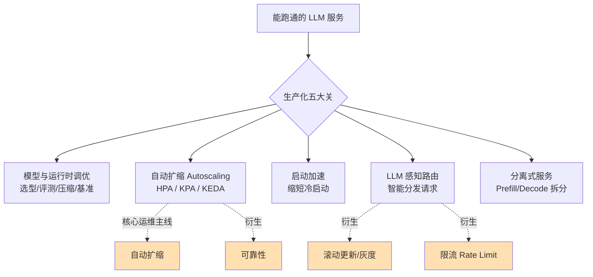
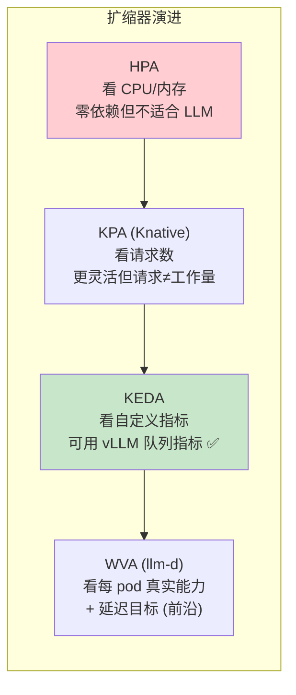
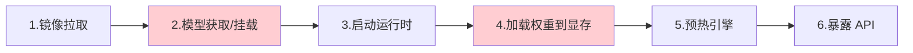
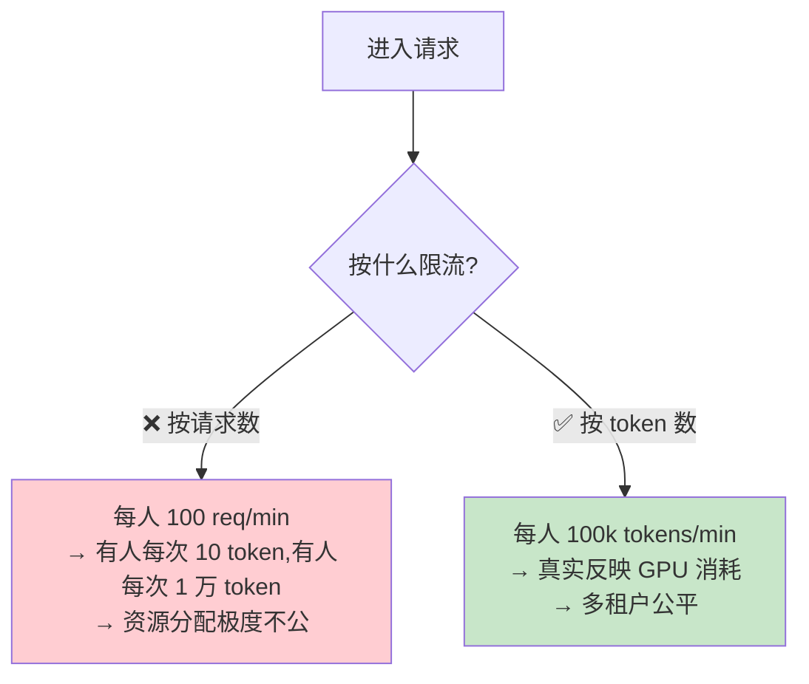
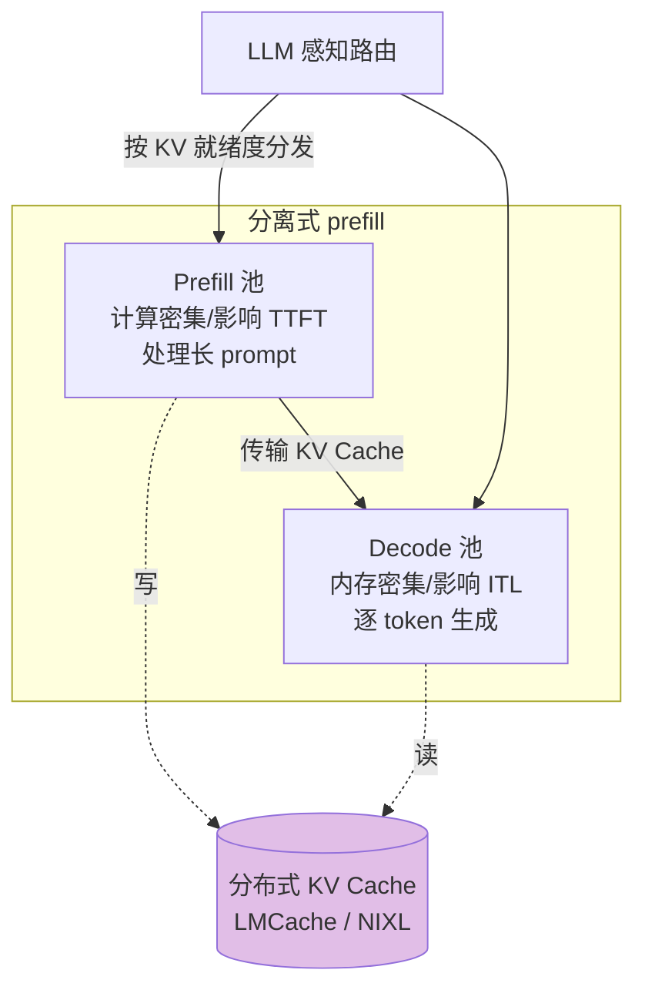
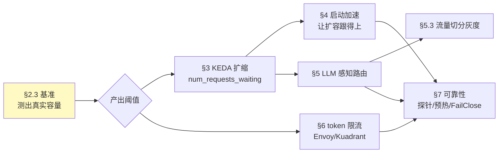

# 第 4 章 · 生产环境运行(Running in Production)

> 对应原书 *Generative AI on Kubernetes* 第 4 章「Running in Production」(PDF 第 211–258 页)。
>
> 一句话主旨:**把一个"能跑通的"LLM 推理服务,变成"在高并发、真实流量、成本约束下长期稳定运行"的生产系统。** 能响应一次请求不叫生产;在负载下**持续、可扩、可控**地响应,才叫生产。

---

## 🗺️ 本章地图

原书这一章围绕五大主题展开,本讲义按照任务要求,把重心放在**自动扩缩 / 滚动更新 / 可靠性 / 限流**这四条"运维主线",同时把书里其余内容(模型选型评测、压缩量化、vLLM 参数调优、启动加速、LLM 感知路由、分离式服务)作为支撑背景讲透。



| 小节 | 你将学到 | 关键词 |
|---|---|---|
| §1 为什么 LLM 生产不一样 | GenAI 工作负载的三大"反常识"特性 | 变动的请求成本 / GPU 不等于 CPU / 慢启动 |
| §2 铺垫:模型调优与内存规划 | 选型评测、量化压缩、vLLM 显存/参数调优 | MMLU、量化、`gpu-memory-utilization` |
| §3 **自动扩缩(HPA / KPA / KEDA)** | 三种扩缩器为何、怎么选、怎么配 | `vllm:num_requests_waiting` |
| §4 **启动加速** | 为什么扩缩离不开冷启动优化 | 预热副本、模型缓存、Model Streamer |
| §5 **LLM 感知路由 + 滚动更新** | 智能分发、灰度发布、金丝雀 | Gateway API 推理扩展、流量切分 |
| §6 **限流(Rate Limiting)** | 为什么按 token 而非按请求限流 | Envoy AI Gateway、Kuadrant |
| §7 **可靠性** | 就绪探针、抢占、优先级、副本下限 | `/health`、`failureMode`、优先级 |
| §8 分离式服务(进阶) | 大规模部署的终极形态 | Prefill/Decode 分离、分布式 KV Cache |
| 📌 小结 / 🔗 延伸 | | |

---

## 1️⃣ 为什么 LLM 的生产化和普通服务不一样

> **是什么**:把大模型当成"普通容器"来运维——设几个资源上限、暴露一个 Service、收工——是很诱人的做法。但 GenAI 工作负载有三个独特属性,直接把 Kubernetes 的默认假设**打穿**。

原书开篇点出:GenAI 负载有独特特征(**巨大的模型体积、变动巨大的单请求成本、GPU 密集型运算**),需要专门配置。下面这张表是理解整章的"钥匙":

| 反常识特性 | 普通微服务 | LLM 推理服务 | 带来的运维后果 |
|---|---|---|---|
| **单请求成本** | 大致均匀(每个 HTTP 请求耗时/资源差不多) | 天差地别:一个请求可能生成 10 个 token,下一个生成 10000 个 | 按"请求数"扩缩/限流会严重失真 |
| **资源信号** | CPU / 内存能代表负载 | 压力在 **GPU** 上,CPU/内存利用率与真实负载不相关 | 默认 HPA(看 CPU/内存)近乎失效 |
| **启动时间** | 秒级甚至毫秒级 | 分钟级(大模型加载权重到显存要几分钟,最大的模型光存储就近 1TB) | Scale-to-zero 不现实,弹性扩容跟不上流量峰值 |

> 🔬 **第一性原理:LLM 服务是"有状态的 GPU 计算",不是"无状态的 CPU 转发"**
> 传统 Web 服务的心智模型是"请求进来 → CPU 算一下 → 返回",无状态、成本均匀、可瞬间水平扩展。LLM 推理的物理本质是:**海量权重常驻显存 + 逐 token 自回归生成 + KV Cache 复用历史**。这意味着 (1) 副本"重"(启动慢),(2) 请求"不等价"(生成长度不可预测),(3) 有"记忆亲和性"(同一会话路由到同一个 cache 热的副本才划算)。整章所有技巧,都是在补偿这三条物理事实。

> ⚠️ **常见坑**:直接把 `imagePullPolicy: Always` + 默认 HPA(CPU 阈值)+ round-robin 负载均衡套到 vLLM 上,然后奇怪"为什么扩容不及时、GPU 预算烧得飞快、延迟抖动"。本章后面逐个拆解这三个坑。

---

## 2️⃣ 铺垫:模型与运行时调优(为扩缩打地基)

自动扩缩之前,先得有一个**调好的单副本**。如果单副本本身没榨干 GPU、显存规划错误,那多加副本只是加倍浪费。这一节浓缩原书 §Model and Runtime Tuning。

### 2.1 模型选型与评测(Language Model Evaluation)

- **是什么**:传统预测式 AI 模型为单一任务训练,用准确率就能横向比较;LLM 在海量数据上训练、能做多种任务,**必须先确定你的关键任务,再选对应的准确率指标**。
- **怎么用**:
  - 先用**在线排行榜(leaderboard)**做初筛,产出一个短名单。原书推荐 Hugging Face 上按类目(数学能力、模型安全)分组的排行榜,如 **Open LLM Leaderboard**,横跨 MMLU(知识)、HellaSwag(常识推理)、TruthfulQA(真实性)等基准。
  - 再**本地复跑**验证。最常用的评测套件是 EleutherAI 的 **`lm-evaluation-harness`**(开箱 100+ 任务)。**MMLU**(Massive Multitask Language Understanding)覆盖抽象代数、欧洲史、政治等海量多选题;多模态版是 **MMMU**。
  - 针对生产场景的专项评测:**Ragas**(评 RAG 的上下文相关性 / 答案忠实度 / 检索准确率)、**NVIDIA garak**(漏洞扫描,探测 prompt 注入、越狱、有害输出)。

> ⚠️ **常见坑**:排行榜数字有"信任问题"——不本地复跑就无法验证真伪。原书明确建议:排行榜只用于**初筛**,决策前务必本地评测。

> 💡 **面试高频**:"你怎么评估一个 LLM 是否适合上线?"标准答法三段——① 明确关键任务并选对应指标;② 排行榜初筛短名单;③ 用领域数据集本地评测(通用基准会掩盖领域准确率差异,见本章 Lessons Learned)。

### 2.2 模型压缩:量化(Quantization)

模型选定后、上线前,通常要**压缩**以提升吞吐、降低成本。

- **是什么**:以 `Meta-Llama-3.1-8B-Instruct` 为例,80 亿参数,每个参数默认 16 bit,**最小加载显存 = 16 bit × 8B = 16 GB**;再加激活值(activation,逐层中间输出)、KV Cache、输出张量,才是真实显存占用。**量化(Quantization)** 就是用更低精度表示(如 FP8 或 INT8)来压缩这份占用。
- **为什么不是简单四舍五入**:量化是一整套**专门补偿执行误差**的技术,不是砍小数位。
- **关键点(易错)**:光压模型不够!**如果运行时没有原生量化支持,推理时它会把压缩模型转回 16 bit 来算**,白压。真正的甜点区是"**运行时有优化过的量化 GPU kernel,能端到端处理量化数据**"。**vLLM 原生支持大多数量化技术**——压缩侧用 `llmcompressor`,运行时侧检测到量化模型会自动启用优化 kernel。

原书 Example 4-1 用 `llmcompressor` 做 INT8 量化(逐行讲解):

```python
from llmcompressor.modifiers.quantization import GPTQModifier
from llmcompressor.modifiers.smoothquant import SmoothQuantModifier
from llmcompressor.transformers import oneshot

# 选择量化算法。这里:
#   * 用 SmoothQuant 让激活值更"好量化"
#   * 用 GPTQ 把权重量化到 int8(静态、逐通道)
#   * 把激活值量化到 int8(动态、逐 token)
recipe = [
    SmoothQuantModifier(smoothing_strength=0.8),
    GPTQModifier(scheme="W8A8", targets="Linear", ignore=["lm_head"]),
]

# 用内置 open_platypus 数据集做校准量化
oneshot(
    model="TinyLlama/TinyLlama-1.1B-Chat-v1.0",
    dataset="open_platypus",            # 校准数据集(必需)
    recipe=recipe,
    output_dir="TinyLlama-1.1B-Chat-v1.0-INT8",
    max_seq_length=2048,
    num_calibration_samples=512,
)
```

| 代码要点 | 含义 |
|---|---|
| `recipe` | 定义要应用的量化流水线(可组合多种技术) |
| `scheme="W8A8"` | **W**eight 8 bit + **A**ctivation 8 bit |
| `dataset` | **校准(calibration)** 必须指定数据集,让量化"见过"真实分布 |
| `output_dir` | 输出目录含 `config.json`/`tokenizer.json` 等全部文件,vLLM 无需自定义参数即可加载 |

> 💡 **实战数据**:恰当量化到 FP8/INT8,模型体积可缩到**不足原来一半**,同硬件吞吐**翻倍到三倍**,而**恢复 > 99% 原始准确率**。

> ⚠️ **常见坑(原书 TIP)**:压缩风险很大,量化不当会导致准确率暴跌、幻觉、错误输出。两条现实建议:① 压缩后**必须重新评测**(压缩非无损);② 没有专业能力就直接用**已被专业压缩并验证过的模型**(如 Red Hat AI 在 Hugging Face 发布的预压缩模型),把压缩集成进 MLOps/LLMOps 流水线。

### 2.3 性能基准(Benchmark):一切扩缩/限流决策的前提

> **为什么放在扩缩之前**:配置扩缩阈值、限流额度、API 网关容量,**前提都是先测出"系统在不同负载下的真实行为"**。没有基准数字,阈值全是拍脑袋。

原书列出几款专用基准工具:

| 工具 | 定位 |
|---|---|
| **GuideLLM** | 专为 LLM 部署优化打造;能模拟同步 / 固定并发 / 泊松分布等多种速率场景,产出延迟分布报告 |
| **MLPerf Inference** | MLCommons 联盟的行业标准,数据中心 / 边缘配置定期公布结果 |
| **Inference Perf** | Kubernetes WG-Serving 孵化,专为 GenAI,可指定任意数据集,假设被测服务暴露 OpenAI 兼容 API |
| **vLLM benchmark suite** | vLLM 官方每晚跑的基准脚本集 |

原书 Example 4-2 展示 GuideLLM 命令行:

```bash
guidellm benchmark \
  --target http://127.0.0.1:8000 \                      # 待测模型必须先部署
  --model mistralai/Mistral-7B-Instruct-v0.2 \
  --output-path output_file.json \                      # 结果存 JSON
  --rate-type sweep \                                    # 默认 sweep:一次覆盖多种速率场景
  --data 'prompt_tokens=256,output_tokens=128' \        # 输入/输出长度要贴近生产
  --max-seconds 400 \
  --warmup-percent 0.2
```

> 💡 **实战关键**:基准环境必须**等价于生产集群**——尤其是**模型本身**和**部署的 GPU 数量**。把基准测试集成进 CI/CD,存下结果,才能做容量规划、学到容量上限,进而配置限流和 API 网关。

### 2.4 vLLM 显存规划与参数调优

vLLM 的设计哲学是"**贪婪地占满可用资源以最大化吞吐**",所以给它越多资源越好。理想情况:显存够装权重 + 够放激活值 + 够放 KV Cache,永不需要驱逐重算。

**显存怎么算(原书 sidebar 精华)**:

$$
\text{总显存} \approx \underbrace{P \times B}_{\text{权重基线}} + \underbrace{\text{infra kernel}}_{0.3\text{–}2\text{GB}} + \underbrace{\text{activation}}_{\text{随序列长度平方增长}} + \underbrace{\text{output tensor}}_{\text{词表}\times\text{序列}\times\text{batch}}
$$

其中 $P$=参数量,$B$=每参数字节数(float16=2 字节,量化后 FP8/INT8=1 字节)。原书 8B/float16/2048 上下文/batch=1 的例子:

| 组成 | 大小 |
|---|---|
| 权重基线 | 8B × 2 字节 ≈ **16 GB** |
| infra kernel | ≈ 1 GB |
| 激活值(hidden=4096) | ≈ 900 MB |
| 输出层 | ≈ 400 MB |
| **合计** | **≈ 17.3 GB** |

> ⚠️ **关键坑**:仅把 **batch size 从 1 提到 10**,显存需求几乎翻倍到 **> 28 GB**!激活值随序列长度**平方增长**,batch 越大 KV Cache 越大。这就是为什么 batch 参数既是吞吐旋钮,也是显存炸弹。

**读懂 vLLM 启动日志(原书 Example 4-3)**——判断是否需要调优的第一手证据:

```text
INFO [model_runner.py:1097] Loading model weights took 14.9888 GB        # ① 权重大小
INFO [worker.py:241] total_gpu_memory (79.14GiB) x gpu_memory_utilization (0.90) = 71.22GiB  # ② vLLM 可用总量
INFO [worker.py:241] model weights take 14.99GiB; non_torch_memory 0.12GiB;
     PyTorch activation peak memory 1.19GiB; rest reserved for KV Cache is 54.93GiB.  # ③④⑤ 剩余给 KV Cache
WARNING [scheduler.py:1057] Sequence group 0 is preempted by PreemptionMode.SWAP
     mode because there is not enough KV cache space. ...                 # ⑥ KV Cache 不足,被迫 SWAP!
```

⑥ 这条 WARNING 是**性能告警**:KV Cache 空间不够,vLLM 只能把部分值 swap 出显存,伤害端到端性能。**偶发一次不致命,反复出现就该调优**。日志已给出建议:增大 `gpu_memory_utilization` 或 `tensor_parallel_size`。

**核心调优参数(原书完整列表)**:

| 参数 | 默认 | 作用 / 何时调 | 代价 |
|---|---|---|---|
| `gpu-memory-utilization` | 0.9 | vLLM 可用显存百分比;新版更稳,常可提到接近 1.0 拿回那 10% | 早期版本超限会 OOM |
| `max-model-len` | — | 上下文长度(输入 prompt + 生成),直接决定 KV Cache 大小;必须按用例配 | 设太小 → 回答被截断(RAG 尤其吃亏) |
| `max-num-seqs` / `max-num-batched-tokens` | — | 批大小;高并发下延迟影响很小 | 越大 KV Cache 越大;可调小省显存 |
| `tensor-parallel-size` | 1 | **切分权重**到多 GPU,每卡腾出更多 KV Cache 空间 | **需要额外硬件**;同节点内跨卡通信一般不是瓶颈(有高速互联) |
| `pipeline-parallel-size` | 1 | 按**层**切分到多 GPU;和 tensor 并行可叠加 | 需多 GPU;单节点多卡更常用 tensor 并行 |
| `data-parallel-size` | 1 | 数据分组并行,支持**跨服务器多节点** | 引入多节点复杂度,需专用互联 |
| `cpu-offload-gb` | 0 | 把部分模型卸到 CPU,让 > 显存的模型也能跑 | **生产强烈不推荐**:吞吐暴跌,且丢失 GPU 专用 kernel 优化 |

> 💡 **面试高频**:"vLLM 报 KV Cache 抢占(preemption)怎么办?" → 先看日志确认是 KV Cache 不足;方案按代价从低到高:① 调大 `gpu-memory-utilization`;② 调小 `max-num-seqs`/`max-model-len`;③ 加 GPU 上 `tensor-parallel-size`;④ 再不够才考虑 LLM 感知路由/分离式服务(见 §5、§8)。**`cpu-offload-gb` 是最后手段,生产禁用。**

---

## 3️⃣ 自动扩缩(Autoscaling)⭐核心

> **场景切入**:你把单副本调到最优了,但生产要面对**变动的流量**——峰值来了,一个副本扛不住,需要多副本。实时推理看 **TTFT(首 token 时间)/ ITL(token 间延迟)**;离线批处理则调 batch size 和吞吐。

Kubernetes 原生支持水平 Pod 自动扩缩(HPA),但如 §1 所述,LLM 有三大反常识特性,让通用扩缩器水土不服。原书给出三条主线扩缩方案:



### 3.1 三种扩缩器逐个拆解

**① HPA(Horizontal Pod Autoscaler)——开箱即用,但不适合 LLM**

- **是什么**:Kubernetes 原生水平扩缩,零额外依赖。
- **为什么不适合**:它**主要监控 CPU 和内存**。而 LLM 压力主要在 **GPU** 上,CPU/内存利用率与真实负载不相关(§1 表)。所以默认 HPA 对 LLM 几乎失效,需要更灵活的方案。

**② KPA(Knative Pod Autoscaler)——看请求数,比 HPA 好但仍有硬伤**

- **是什么**:Knative Serving 提供,**基于请求数(并发)** 做决策。默认 "stable" 模式用**时间窗口**算并发;还有 "panic" 模式用**更短窗口**快速反应突变。
- **优点**:比 HPA 更适合 LLM,与 KServe(Knative 部署模式)原生集成。
- **两个硬伤**:
  1. KPA 为**微服务**设计,假设 pod 扩缩很快;而 LLM 是复杂、依赖 GPU 的部署,按模型大小**加载要好几分钟**,没有大量调优就不实用(见 §4 启动加速)。
  2. 更重要:**请求数不等于运行时工作量**——一个请求可能产出很多 token,下一个只产出几个。按请求数扩缩,信号本身就失真。

**③ KEDA(Kubernetes Event-driven Autoscaling)——看自定义指标,LLM 首选 ✅**

- **是什么**:KEDA 本为**事件驱动**负载(请求不是 HTTP,而是队列里的消息)设计。它要解决的难题——"有很多种事件技术,需要灵活 API 来配置如何取压力指标"——**恰好和 LLM 扩缩同构**。
- **为什么天然契合 vLLM**:KEDA 的解法是"**配置一个基于指标的查询来指导扩缩**"。这和 vLLM 完美匹配,因为 vLLM 会发布这些指标:

| vLLM 指标 | 含义 | 扩缩用途 |
|---|---|---|
| `vllm:num_requests_waiting` | 还有多少请求在排队等待处理 | **最直接的压力信号** |
| `vllm:num_requests_running` | 正在运行的请求数 | 反映当前并发负载 |
| `vllm:time_to_first_token_seconds` | 首 token 时间(TTFT) | 反映实时延迟 SLA |
| `vllm:time_per_output_token_seconds` | 每个输出 token 耗时(TPOT/ITL) | 反映解码阶段延迟 |

- **和 KServe 的关系**:KServe 在 **Knative 部署模式**下用 KPA;在 **Standard 部署模式**下支持 KEDA。KEDA 在 `InferenceService` 里配置查询,可从 **PodMetric(直连 pod)** 或 **External(外部源如 Prometheus)** 取指标。

> 🔬 **第一性原理:为什么"排队等待数"是最好的扩缩信号?**
> 扩缩的本质是"当系统压力超过承受阈值时增加算力"。对 LLM,"压力"既不是 CPU(在 GPU 上),也不是请求数(每请求工作量差异巨大),而是"**有多少活儿排着队没干完**"。`num_requests_waiting` 直接度量这个积压,它天然把"请求数量 × 每请求工作量"折叠成了单一的、可比较的压力标量。这就是它优于 HPA(看 CPU)和 KPA(看请求数)的根本原因。

### 3.2 实战:KServe + KEDA 配置(原书 Example 4-4 逐行讲解)

```yaml
apiVersion: serving.kserve.io/v1beta1
kind: InferenceService
metadata:
  name: Meta-Llama-3-8B
  annotations:
    serving.kserve.io/deploymentMode: Standard          # ① 用 KEDA 必须 Standard 模式(Knative 模式用的是 KPA)
    serving.kserve.io/autoscalerClass: "keda"            # ② 启用 KEDA 扩缩器
    sidecar.opentelemetry.io/inject: "Meta-Llama-3-8B"   # ③ 注入 OpenTelemetry sidecar 采集 pod 本地指标
spec:
  predictor:
    model:
      modelFormat:
        name: huggingface
      args:
        - --model_name=llama3
        - --model_id=meta-llama/meta-llama-3-8b
    minReplicas: 1                                        # 副本下限(见 §7 可靠性,别设 0)
    maxReplicas: 5                                        # 副本上限
    autoScaling:
      metrics:
        - type: PodMetric                                # ④ 直接查询 pod 采集指标
          podmetric:
            metric:
              backend: "opentelemetry"                   # ⑤ 必须指定 backend(OTel 与 Prometheus 协议有别)
              metricNames:
                - vllm:num_requests_running
              query: "vllm:num_requests_running"         # ⑥ 决策查询,可为单值或复杂 PromQL
            target:
              type: Value
              value: "4"                                 # ⑦ 阈值:vLLM 中已有 ≥4 个请求在跑就扩容(在 1–5 范围内)
#        - type: External                                # ⑧ 另一种方式:从外部源查询
#          external:
#            metric:
#              backend: "prometheus"
#              serverAddress: "http://prometheus.url:9092"  # ⑨ External 时必须给服务器地址
#              query: "vllm:num_requests_running"
```

| 编号 | 要点 |
|---|---|
| ① | `Standard` 是用 KEDA 的前提;Knative 模式默认用 KPA |
| ②③ | 注解开启 KEDA + 用 OTel sidecar 采本地指标 |
| ④ vs ⑧ | **PodMetric(直连 pod)** vs **External(外部源)**:若查询只涉及 pod 本地 vLLM 指标,两者等价,但直连 pod **延迟更低、更灵敏**;External 更**灵活**(可跨多个 vLLM 副本聚合、做更复杂 join 查询) |
| ⑦ | 阈值 `4` 来自**前期基准测试**——测出并发升到某数后延迟分布开始劣化,就以此为扩容触发点。**呼应 §2.3:阈值不是拍的,是测出来的。** |

> ⚠️ **常见坑**:直连 pod(PodMetric)时,如果 vLLM 副本在扩缩过程中来回启停,pod 级指标源也在抖;若要跨副本聚合稳定信号,用 External + Prometheus 更稳。

### 3.3 前沿:面向 LLM 的新一代扩缩

原书指出扩缩仍在演进,两个方向值得关注:

- **分离式 prefill 的"运行时控制器"**:不同于传统扩缩器,它更像一个**观察系统状态、自动再平衡副本角色 / 调整各角色副本数**的控制器(详见 §8)。
- **llm-d 的 WVA(Workload Variant Autoscaler)**:专为 LLM 设计。**不看 CPU 或请求数,而看每个 pod 到底能扛多少、考虑不同请求工作量不同(有的产很多 token 有的很少),按你真实的延迟目标扩缩**。好处:在**满足性能目标的前提下把集群跑到更高利用率**才加 pod,省钱。

---

## 4️⃣ 启动加速:让扩缩真正"跟得上"

> **为什么这一节紧跟扩缩**:配了再智能的扩缩器,如果**启一个新副本要好几分钟**,动态扩缩就形同虚设——峰值早过去了,新副本才起来。原书直言:LLM 的体积把 Kubernetes 的核心设计原则拉伸到了极限(最大的模型光存储就近 1TB)。

vLLM 从"创建 Deployment"到"就绪服务"的**六个阶段**,以及各自的优化点:



| 阶段 | 瓶颈与优化 |
|---|---|
| **1. 镜像拉取** | vLLM 镜像不小(< 5GB,大头是 CUDA 等 GPU 框架,删不掉)。**关键:`imagePullPolicy` 千万别用 `Always`**(每副本/每次部署都重下)!生产用 `IfNotPresent`(仅首次下)或 `Never`(预拉到节点)。**并用固定版本 tag(`vllm/vllm-openai:v0.12.0`),甚至用 digest 摘要锁定**(`vllm/vllm-openai@sha256:abc123...`),别用 `latest` |
| **2. 模型获取/挂载** ⚠️最大瓶颈之一 | 四种存储方式:HuggingFace 直下 / S3 / **PVC 挂载** / **OCI 镜像**。前两者低效(要传输+本地复制,常需几分钟);**PVC 和 OCI 直接挂载卷,避免本地复制**。若必须用 HF/S3,强烈建议开 **KServe 本地模型缓存**(以 `storageUri` 为 key,配 NVMe SSD 快存),让 HF/S3 性能追平 PVC |
| **3. 启动运行时** | vLLM 本身启动通常 ≤ 1 秒,不是瓶颈 |
| **4. 加载权重到显存** ⚠️最大瓶颈之二 | 大部分时间花在这:把权重拷进 GPU 显存。物理上限是 **I/O 带宽到显存**,但无优化的加载离物理极限还很远。基础设施层可用 **NVIDIA GPUDirect Storage**(NVMe↔显存直连,绕过 CPU);vLLM 三个加载扩展见下 |
| **5. 预热引擎** | 权重就位后,预分配 KV Cache 内存池 + profiling;把成千上万个 GPU kernel 启动捕获成可复用序列(**CUDA Graph / HIP Graph**),消除 CPU 瓶颈。这步是高吞吐必需,但增加就绪时间 |
| **6. 暴露 API** | 加载完暴露 OpenAI 兼容 API,含 **`/health` 端点**——正是配置 **readiness probe(就绪探针)** 的推荐做法(见 §7) |

**三个加载加速扩展(原书 sidebar)**:

| 扩展 | 特点 | 适用 |
|---|---|---|
| **Run:ai Model Streamer** | 高并发加载,支持 safetensor 等多格式,**无需重打包模型** → **最易上手** | 想快速试验 |
| **CoreWeave Tensorizer** | 需用专用序列化格式预处理模型,采用率高 | 愿意重打包换更快加载 |
| **fastsafetensor** | 专为从 NVMe 设备加载优化,需设额外环境变量 | NVMe 存储 |

原书 Example 4-5(Model Streamer,无需换格式):

```bash
vllm serve \
 --port=8080 \
 --model=/mnt/models \
 --served-model-name=meta-llama/Meta-Llama-3-8B \
 --load-format runai_streamer \                          # 启用 Model Streamer(无需专用序列化格式)
 --model-loader-extra-config '{"concurrency":16}'        # 16 并发线程并行加载
```

> 💡 **实战收益**:把上述建议(避免 `Always`、PVC/OCI 挂载、NVMe 快存、Model Streamer 加载扩展)全用上,可把 vLLM 扩容时间**从几分钟压到几十秒**。

> 💡 **面试高频 / Lessons Learned**:"LLM 服务能 scale-to-zero 吗?" → **实践中不行**——模型加载是分钟级不是秒级,冷启动会毁掉用户体验。正确做法是**预热副本(pre-warm)+ 设保守的最小副本数(minReplicas)**,防止冷启动延迟尖峰。

---

## 5️⃣ LLM 感知路由 + 滚动更新(灰度/金丝雀)⭐

有了多副本,新问题来了:**怎么把请求分发到这些副本?** 以及运维刚需——**怎么安全地滚动更新模型版本?**

### 5.1 为什么默认的 round-robin 负载均衡不够

Kubernetes 默认按 **round-robin(轮询)** 均匀分发,这对"CPU/内存能代表负载"的微服务够用。但对 LLM,原书列出**必须考虑的多个路由因素**:

| 路由因素 | 为什么轮询失效 | 智能路由怎么做 |
|---|---|---|
| **每个请求不同** | 输入 prompt 大小与产出 token 数无关联,生成可持续数秒,单请求对副本的冲击不可预测 | 用 `vllm:num_requests_waiting` 感知副本真实积压,分发到最空闲副本 |
| **批处理(Batching)** | 批不总能填满 | 路由器可混合离线推理与实时请求来填满批 |
| **Prefill/Decode 负载** | prefill 直接正比于 prompt 大小 | 可设专用 vLLM 实例做大 prompt 的 prefill(分离式,§8) |
| **KV Cache 复用** | 模型无记忆,聊天/Agent 每次都要重新 prefill 整段历史 | **前缀感知路由(prefix-aware)**:把请求路由到 KV Cache 已就绪的副本,避免 cache miss |
| **不同 SLA** | 实时请求优先级高于批;不同用户更复杂 | 容量紧张时可**丢弃非关键请求** |
| **LoRA 适配器** | 一个 endpoint 对多个微调模型,打破"一模型一端点"映射 | LoRA 感知路由:按副本已加载哪些 adapter 分发 |

> 🔬 **第一性原理:LLM 路由是"亲和性调度"而非"负载均衡"。** 传统均衡追求"平均分摊";LLM 路由要追求"**让请求去到最能便宜处理它的副本**"——KV Cache 热的副本、已加载对应 LoRA 的副本、当前积压最少的副本。本质是把无状态均衡升级成了带状态感知的调度。

### 5.2 从 API 网关到 AI 网关

传统 API 网关为**无状态微服务**设计(请求独立、资源消耗均匀)。**AI 网关**在此之上扩展了 LLM 专属能力,支撑 **MaaS(Model as a Service)** 架构——把推理能力作为受管 API 暴露给多团队/多租户,配置资源配额、访问控制、用量追踪。

AI 网关的演进能力:

- **语义路由(Semantic routing)**:按请求**语义内容**路由——代码生成请求→代码专用模型,普通对话→通用 LLM,兼顾成本与质量。
- **混合路由(Hybrid routing)**:按当前负载/可用性/SLA,动态在**本地模型**与**云端模型**间路由。例如峰值时把溢出流量导到云端推理,把延迟敏感请求留在本地。
- **模型编排(Model composition)**:链式串联多模型,一个模型输出作下一个输入,实现如 RAG 的复杂工作流。

### 5.3 Gateway API 推理扩展(GIE)与滚动更新

Kubernetes WG-Serving 孵化的 **Gateway API Inference Extension(GIE,又称 Inference Gateway)** 扩展了 Kubernetes Gateway API,带来三大能力:

1. **模型感知路由**(按模型名而非仅 URL 路径路由);
2. **服务优先级**;
3. **⭐增量模型上线(incremental model rollouts)通过流量切分(traffic splitting)** ——这正是**滚动更新/金丝雀发布**的机制。

> **滚动更新/灰度怎么做**:GIE 支持**流量切分**做增量上线。你可以把 v2 模型作为新副本池上线,先切 5% 流量过去(金丝雀),观察指标 OK 后逐步提到 100%,期间 v1 仍承接主流量——出问题秒回滚。这比 Kubernetes 原生 Deployment 的滚动更新更精细,因为它能按**模型名**和**权重百分比**切,而非只按 pod 逐个替换。

```mermaid
flowchart LR
    subgraph 灰度发布 (流量切分)
    GW[AI 网关<br/>Gateway + HTTPRoute] -->|95%| V1[InferencePool v1<br/>稳定版]
    GW -->|5% 金丝雀| V2[InferencePool v2<br/>新版本]
    end
    EPP[Endpoint Picker<br/>按 KV cache/队列长度选副本] -.评分.-> V1
    EPP -.评分.-> V2
    style V2 fill:#fff9c4
```

**核心资源(原书 Example 4-7 精讲)**:

- **`InferencePool`(v1 稳定)**:代表一组共享同一算力配置、加速器类型、基座模型的 pod。平台管理员可基于 **KV cache 利用率、队列长度、模型特征**等指标配置智能路由。
- **`InferenceObjective`(alpha)**:定义服务目标与优先级,给不同工作负载差异化服务级别(它替代了早期的 `InferenceModel` 资源)。

```yaml
apiVersion: inference.networking.k8s.io/v1                # InferencePool 用稳定 v1 API
kind: InferencePool
metadata:
  name: vllm-llama3-8b-instruct
spec:
  targetPorts:
    - number: 8000                                        # 模型服务 pod 暴露的端口(数组,最多 8 个)
  selector:
    app: vllm-llama3-8b-instruct                          # 用标签选中属于本池的 pod(这些 pod 用 --enable-lora 同时服务基座+LoRA)
  endpointPickerRef:
    name: vllm-llama3-8b-epp                              # 引用 Endpoint Picker 服务(实现智能选副本)
    port: 9002
    failureMode: FailClose                                # ⚠️ 见 §7 可靠性:EPP 挂了就关闭(而非放行)
---
apiVersion: inference.networking.x-k8s.io/v1alpha2        # InferenceObjective 仍是 alpha
kind: InferenceObjective
metadata:
  name: high-priority-inference
spec:
  priority: 1                                             # 优先级(值越高越关键,优先处理)
  poolRef:
    group: inference.networking.k8s.io
    name: vllm-llama3-8b-instruct
---
apiVersion: inference.networking.x-k8s.io/v1alpha2
kind: InferenceObjective
metadata:
  name: standard-inference
spec:
  priority: 2
  poolRef:
    group: inference.networking.k8s.io
    name: vllm-llama3-8b-instruct
```

**Endpoint Picker(EPP)是怎么工作的?**

GIE 底层用 **Envoy proxy**,通过其 **External Processing(ext_proc)** gRPC 协议插入自定义处理逻辑。GIE 把这套概念定义为 **Endpoint Picker 协议(EPP)**:一个 EPP 能从 `InferencePool` 里**挑一个 endpoint**。最有意思的实现是 **llm-d 项目的 inference-scheduler**——支持多种 filter 和 scoring,例如抓取各 vLLM 实例的 `vllm:num_requests_waiting`,**挑排队最少的副本**。

> 💡 **生态全景**:GIE 不是唯一选择。**Envoy AI Gateway**(复用 GIE 并加 token 限流、安全)、**vLLM Production Stack**(可共享的外部 KV Cache 存储)、**llm-d**(深度集成 vLLM,含分布式共享 KV Cache 和分离式 prefill,当前最先进的大规模方案)。而 **KServe 的 `LLMInferenceService` API** 提供更高层抽象,自动管理底层网关组件,把 InferencePool/EPP 的复杂度藏起来。

---

## 6️⃣ 限流(Rate Limiting)⭐

> **为什么 LLM 限流是个独立难题**:传统 API 以**请求**为计量单位,一次请求 ≈ 一份成本。但 LLM 以 **token** 为计算单位——**一个请求可能生成 10 个 token,也可能 10000 个,消耗的 GPU 资源和时间天差地别**。所以**传统的按请求限流对 LLM 完全失效**。

### 6.1 核心洞见:按 token 限流,而非按请求

原书点明:多租户环境下服务 LLM,用户追踪对**公平访问和配额管理**至关重要。计量单位必须从"请求"换成"**token**"。



### 6.2 两个 token 限流方案(原书)

| 方案 | 能力 | 特点 |
|---|---|---|
| **Envoy AI Gateway** | 按用户 / API key **追踪并限制 token 消耗** | 让共享同一模型部署的多租户公平分配资源 |
| **Kuadrant** | 与 Kubernetes 原生策略管理集成的 token 限流 | 平台管理员可**按生成的 token 数(而非请求数)** 定义配额 |

> 💡 **面试高频**:"为什么 LLM 网关要按 token 限流?" → 因为 LLM 的计算成本正比于 token 数,而非请求数;单请求的 token 数可差 1000 倍。按请求限流会让"短请求用户"和"长请求用户"付出同样"配额"却消耗天差地别的 GPU,既不公平也无法保护后端。**正确单位是 token/时间窗。**

> ⚠️ **常见坑**:很多团队第一版限流直接抄微服务的 `requests per minute`,上线后发现少数发长 prompt / 要长输出的用户就能打爆 GPU,而限流器还显示"没超请求配额"。根因就是**计量单位错了**。

### 6.3 限流 → 拒绝:优雅降级

限流不只是"挡",还包括**容量不足时怎么优雅拒绝**。原书在多处呼应:

- 反应要快:通过配置 **扩缩、限流,甚至用合适的错误信息拒绝新请求** 来解决延迟问题(§2.3)。
- 调度逻辑可在**容量不足(排队请求数 + KV Cache 大小低于阈值)时丢弃非关键请求**(§5.1 SLA)。
- EPP 甚至能**基于优先级和当前负载拒绝请求**(§5.3)。

> 🔬 **第一性原理:限流是"背压(backpressure)"。** 当下游(GPU)吞吐有物理上限,上游流量超限时,系统要么排队(延迟爆炸)、要么丢弃(优雅降级)。好的限流是主动施加背压——**用一个明确的 4xx/429 错误快速拒绝,好过让所有请求一起慢死**。这也是为什么限流阈值必须来自 §2.3 的真实基准。

---

## 7️⃣ 可靠性(Reliability)⭐

原书没有单列"可靠性"一节,但把可靠性要素散布全章。这里系统性收拢成一张"生产可靠性清单"。

### 7.1 就绪探针(Readiness Probe):别在没准备好时收流量

- **是什么**:§4 提到 vLLM 暴露 **`/health` 端点**,正是配置 readiness probe 的**推荐做法**。
- **为什么关键**:LLM 加载要几分钟(§4)。如果没配就绪探针,Kubernetes 会在权重还没加载完时就把流量路由过来 → 请求全部失败。**就绪探针确保"模型真正 ready 才收流量"**,这对滚动更新和扩容期间尤其重要。

```yaml
readinessProbe:
  httpGet:
    path: /health          # vLLM 暴露的健康端点
    port: 8000
  initialDelaySeconds: 60   # 给模型加载留足时间(按模型大小调)
  periodSeconds: 10
```

### 7.2 副本下限与预热:防冷启动尖峰

- 呼应 Lessons Learned:**scale-to-zero 对多数 LLM 不现实**(加载分钟级)。
- 对策:**预热副本 + 设保守的 `minReplicas`**(如 §3.2 里 `minReplicas: 1` 而非 0),防止冷启动延迟尖峰毁掉用户体验。

### 7.3 失败模式(Failure Mode):FailClose vs FailOpen

- §5.3 的 `InferencePool` 里 `endpointPickerRef.failureMode: FailClose`。
- **含义**:当 Endpoint Picker(智能路由组件)不可用时,`FailClose` = **关闭(拒绝请求)** 而非盲目放行。
- **为什么**:对 LLM,盲目放行可能把请求打到 KV cache 冷、已过载或加载了错误 LoRA 的副本,造成延迟灾难或错误输出。**宁可明确失败,不要静默劣化**——这是可靠性设计的经典权衡。

### 7.4 抢占/驱逐监控:KV Cache 不足的告警

- §2.4 的 `PreemptionMode.SWAP` WARNING:KV Cache 空间不足时 vLLM 被迫 swap,伤害端到端性能。
- **可靠性动作**:把这条日志/对应指标接入监控告警,**反复出现就触发调优或扩容**(而非等用户投诉延迟)。

### 7.5 优先级与 SLA 分级

- §5.3 的 `InferenceObjective.priority`:给关键请求更高优先级,容量紧张时优先保障。
- 配合 §6.3 的优雅降级,构成"**过载时保关键、弃非关键**"的可靠性策略。

### 7.6 镜像可复现性

- §4:用**固定版本 tag 或 digest 摘要**锁定镜像,确保所有环境部署**完全一致的镜像版本** → 消除"在我这能跑"的环境漂移,这是可靠性的地基。

> 📋 **生产可靠性 Checklist**
>
> - [ ] readiness probe 指向 `/health`,`initialDelaySeconds` 覆盖模型加载时间
> - [ ] `minReplicas ≥ 1`(禁止 scale-to-zero),关键服务预热副本
> - [ ] `imagePullPolicy: IfNotPresent`/`Never` + 固定 tag/digest
> - [ ] `failureMode: FailClose`(路由组件失败时明确拒绝)
> - [ ] KV Cache 抢占(preemption)接入告警
> - [ ] 关键流量配 `InferenceObjective` 高优先级
> - [ ] 限流阈值来自真实基准(§2.3),配优雅拒绝(429)
> - [ ] 滚动更新用流量切分金丝雀(§5.3),而非一刀切替换

---

## 8️⃣ 分离式服务(Disaggregated Serving)——进阶终局

> 当延迟/扩展要求最严苛时,配置会复杂到接近"**appliance(专用设备)**"而非传统 Kubernetes 部署,专为**极大规模、单集群只服务少数模型**的场景设计。

**核心思想**:把 LLM 服务拆开——LLM 感知路由 + 分布式 KV Cache + 分离式 prefill。代表项目:**NVIDIA Dynamo**(深度绑定 NVIDIA 硬件)和 **llm-d**(支持多硬件、复用开源生态)。

### 8.1 前提:专用高带宽网络

分离式服务把 KV Cache 跨部署共享,**网络带宽成为瓶颈**:

| | 带宽 |
|---|---|
| 传统 pod 网络(以太网) | 10–20 Gbps |
| 分离式服务的**需求** | ≈ 500–600 Gbps(高一个数量级!) |

解法:NVIDIA **NVLink/NVSwitch**(可破 Tbps);非 NVIDIA 用 **RDMA / RoCE**(达 800 Gbps);**InfiniBand**(经典 RDMA,源自 HPC 超算)。

### 8.2 两大优化



**① 分布式 KV Cache**:把 KV 块存到外部缓存并复用。两大好处:实例 KV Cache 不再受单机显存限制;可跨副本共享块。前提是块传输极快(毫秒级)。项目:**LMCache**(自称 "Redis for LLMs")、**NVIDIA NIXL**(加速 AI 运行时点对点通信,抽象 GPU/CPU 内存与存储)。对长 prompt(如 RAG)收益最大——避免每次重复 prefill。

**② 分离式 prefill**:prefill(计算密集,影响 TTFT)和 decode(内存密集,影响 ITL)**拆成两个独立实例池**,可**各自独立扩缩调优**(如长 prompt 多的场景就给 prefill 池多加副本)。挑战:prefill 初始化的 KV Cache 必须传给 decode 实例才能继续生成——这正好用①的分布式 KV Cache 解决。

> 💡 该拓扑最早由 **Mooncake** 项目提出,后被 NVIDIA Dynamo 和 llm-d 采用——开源协作的力量。整栈(Gateway API → llm-d 组件 → vLLM,由 KServe `LLMInferenceService` 管理生命周期)见原书 Figure 4-4。

> ⚠️ **代价**:分离式服务引入高组件耦合和运维复杂度,更像分布式训练而非无状态服务,需要 `LeaderWorkerSet`、拓扑感知调度、高带宽网络(见原书第 7 章)。**别为了炫技上分离式——只有极大规模、SLA 极严时才值得。**

---

## 📌 小结(Lessons Learned)

原书章末"Lessons Learned"的核心结论,配合本章四条运维主线:

| 主题 | 一句话本质 |
|---|---|
| **模型选型** | 不能只看参数量或通用基准;**用领域数据集做任务专项评测**,通用排行榜会掩盖领域准确率差异 |
| **压缩** | 量化/剪枝降显存、提吞吐,但质量退化因架构而异;**上线前用你自己的负载做基准** |
| **自动扩缩** ⭐ | LLM 扩缩与传统应用**根本不同**:用 **token 指标(TTFT/TPOT)和 KV Cache 利用率**做信号,优于请求率/CPU;`vllm:num_requests_waiting` 是首选;**KEDA > KPA > HPA** |
| **滚动更新** ⭐ | 用 **GIE 流量切分**做增量上线/金丝雀,按模型名+权重百分比灰度,比原生 Deployment 滚更精细 |
| **可靠性** ⭐ | **scale-to-zero 不现实**(加载分钟级);预热副本 + 保守 `minReplicas` 防冷启动尖峰;`/health` 就绪探针、`FailClose`、优先级、抢占告警缺一不可 |
| **限流** ⭐ | LLM 必须**按 token 限流**(单请求 token 数可差 1000 倍),Envoy AI Gateway / Kuadrant;配优雅拒绝(背压) |
| **启动加速** | 模型缓存到 PVC、优化镜像、init 容器、Model Streamer,把初始化**从分钟压到秒**;在滚动更新/扩缩/故障恢复时复利生效 |
| **路由** | Cache 感知路由把相似请求导向同一副本,最大化 KV Cache 命中;分离式服务分离 prefill/decode,独立扩缩计算密集与内存密集负载 |

**一图总览四条主线如何互相咬合**:



**贯穿全章的一句话**:LLM 生产化的一切技巧,都是在补偿三条物理事实——**副本重(启动慢)、请求不等价(token 数不可预测)、有记忆亲和性(KV Cache 要复用)**。看懂这三条,扩缩/更新/可靠/限流的每个设计都顺理成章。

下一章(第 5 章)将回答:"这些优化到底有没有生效?"——LLM 工作负载的**可观测性**(metrics/logs/traces)。

---

## 🔗 延伸阅读

**评测与压缩**
- EleutherAI `lm-evaluation-harness`(100+ 评测任务);Open LLM Leaderboard(MMLU/HellaSwag/TruthfulQA)
- **Ragas**(RAG 评测)、**NVIDIA garak**(安全漏洞扫描);TrustyAI `LMEvalJob` CRD
- `llmcompressor`(量化 + 内置校准);Red Hat AI on Hugging Face(预压缩验证模型)

**基准工具**
- **GuideLLM**(部署优化专用)、**MLPerf Inference**(MLCommons)、**Inference Perf**(WG-Serving)、vLLM benchmark suite

**扩缩与网关**
- **KEDA**(事件驱动扩缩)、**KServe**(Standard 模式接 KEDA)、Knative KPA
- **llm-d WVA**(Workload Variant Autoscaler,按 pod 真实能力+延迟目标扩缩)
- **Gateway API Inference Extension(GIE)**:`InferencePool`(v1)、`InferenceObjective`(alpha)、Endpoint Picker(EPP)/Envoy ext_proc
- **Envoy AI Gateway** / **Kuadrant**(token 限流)、**vLLM Production Stack**、**KServe `LLMInferenceService`**

**启动加速**
- Run:ai Model Streamer、CoreWeave Tensorizer、fastsafetensor;NVIDIA GPUDirect Storage;vLLM CUDA Graphs 文档
- 显存计算:TitanML Model Memory Calculator;Alexander Smirnov 博客、EleutherAI 博客

**分离式服务**
- **NVIDIA Dynamo**、**llm-d**、**Mooncake**(首提分离式 prefill 拓扑)
- **LMCache**("Redis for LLMs")、**NVIDIA NIXL**;NVLink/NVSwitch、RDMA/RoCE、InfiniBand

**内部交叉引用(原书)**:第 2 章(模型打包)、第 5 章(可观测性)、第 7 章(分布式训练/拓扑感知调度/网络优化)、第 8 章(RAG)、"Understanding LLM Fundamentals"(KV Cache/prefill/decode 基础)、"Tuning a Model"(LoRA/微调)。
