# 第 5 章 模型可观测性（Model Observability）🔭

> 本章对应原书 *Generative AI on Kubernetes* 第 5 章（PDF 第 259–288 页）。
> 我们把 LLM 从"能跑"推进到"跑得让你放心"——不仅要**部署、扩缩、管资源**，还要能在出问题的第一时间**看得见、追得到、报得出、判得准**。

---

## 🗺️ 本章地图

前面几章（第 1–4 章）我们已经会用 vLLM + KServe 把一个 LLM 部署到 Kubernetes、管好模型数据、配好 GPU。但**部署完 ≠ 万事大吉**。Kubernetes 靠"声明式 API + 控制器 + 调谐循环（reconciliation loop）"自愈工作负载，可这套机制**替代不了可观测性（observability）**——当有些问题无法被自动解决时，你得能第一时间反应。LLM 更是如此：它的负载特征和传统微服务、甚至传统 ML 都**根本不同**。

本章的推进路线：

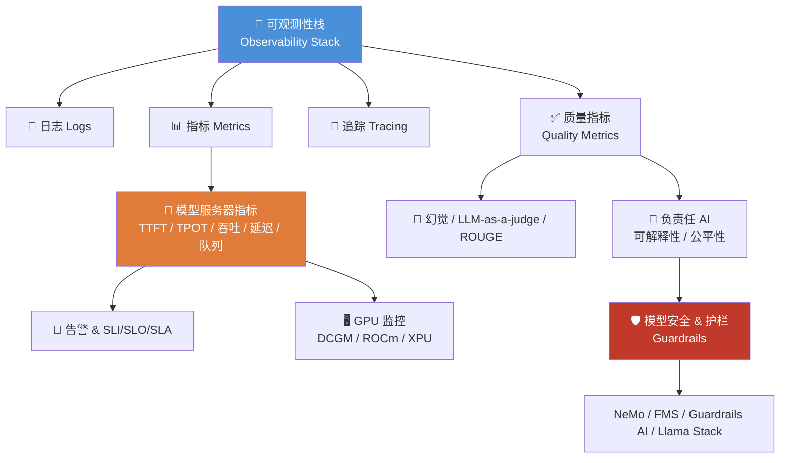

一句话总结全章：**LLM 不能只监控"快不快"，还得监控"对不对、安不安全"。** 传统指标（CPU/内存/QPS）在 LLM 上讲的是**残缺的故事**——它们看不到主力算力 GPU，也看不到 prefill 与 decode 两个截然不同的推理阶段。本章把这些盲区一个个补上。

---

## 🧩 5.0 为什么 LLM 的监控和传统应用不一样？—— 第一性原理

> 🔬 **第一性原理框**
> 传统微服务：端点少，负载主要由**请求数（QPS）**和**查数据的速度**驱动。请求进来、查库、返回，时间基本可预测。
> LLM：负载主要发生在 **GPU** 上，而且**一次请求要生成多少 token 事先无法预测**。同样一句 prompt，模型可能回你 5 个 token，也可能回你 5000 个 token。所以任何"数请求个数"的指标（QPS）都**无法真实反映模型服务器的负载**。

这就引出本章第一条铁律：

> ⚠️ **常见坑**：拿监控传统 Web 服务的那套（盯 CPU 使用率、盯 QPS）来监控 LLM，你会被彻底误导。
> - **CPU 使用率**：LLM 的活儿几乎全在 GPU 上，CPU 使用率**不能代表**系统真实忙不忙。
> - **QPS/请求数**：一个请求可以把整机 GPU 吃满（生成一篇长文），也可以几乎不占资源（回一个词）。请求数和负载**脱钩**。

因此 LLM 的模型服务器指标是 **token 为单位（token-based）**，而不是**请求为单位（request-based）**。因为 token 才是 LLM 生成的**核心计算单元**。

再往深一层，回顾"理解 LLM 基础"里讲过的两个推理阶段：

| 阶段 | 英文 | 干什么 | 计算特征 | 对应指标 |
|---|---|---|---|---|
| 预填充 | **Prefill** | 一次性处理完整个输入 prompt，算出第一个 token | **计算受限（compute-bound）** | 决定 **TTFT** |
| 解码 | **Decode** | 逐个 token 往外吐，每步依赖前一步 | **内存受限（memory-bound）** | 决定 **TPOT** |

> 💡 **实战 / 面试高频**：为什么 prefill 是 compute-bound 而 decode 是 memory-bound？
> - Prefill 阶段要对整个 prompt 做一次大矩阵乘法，算术强度高，瓶颈在**算力（FLOPs）**——GPU 算得越快越好。
> - Decode 阶段每次只生成 1 个 token，但每步都要把巨大的模型权重和 KV cache 从显存搬进计算单元，算的少、搬的多，瓶颈在**显存带宽**。这也是为什么"生成阶段占了大部分时间"——现代 GPU 算力太强，输入处理（compute-bound）飞快就完了，解码（memory-bound）才是大头。

理解了这两个阶段，本章后面所有指标就都"接地气"了：TTFT 映射 prefill，TPOT 映射 decode，一切都对得上。

---

## 📜 5.1 日志（Logs）

### 是什么

Kubernetes 有一套明确的日志架构：容器里的 **stdout** 和 **stderr** 都会被重定向到该容器所在**工作节点**上的一个 `log-file.log`。好处是你能用 `kubectl logs` 轻松查看；**代价**是它**不提供长期存储、也不提供索引**。

> ⚠️ **常见坑**：`kubectl logs` 只能看当前节点上短期的日志。Pod 一重建、节点一换，历史日志就没了。生产环境**必须**在集群里再加一层日志聚合方案，比如 **Grafana Loki**，做长期存储 + 索引。

### KServe 部署下有哪些容器？

当你把模型部署成一个 `InferenceService`，KServe 控制器创建的 Deployment 里其实有**多个容器**：

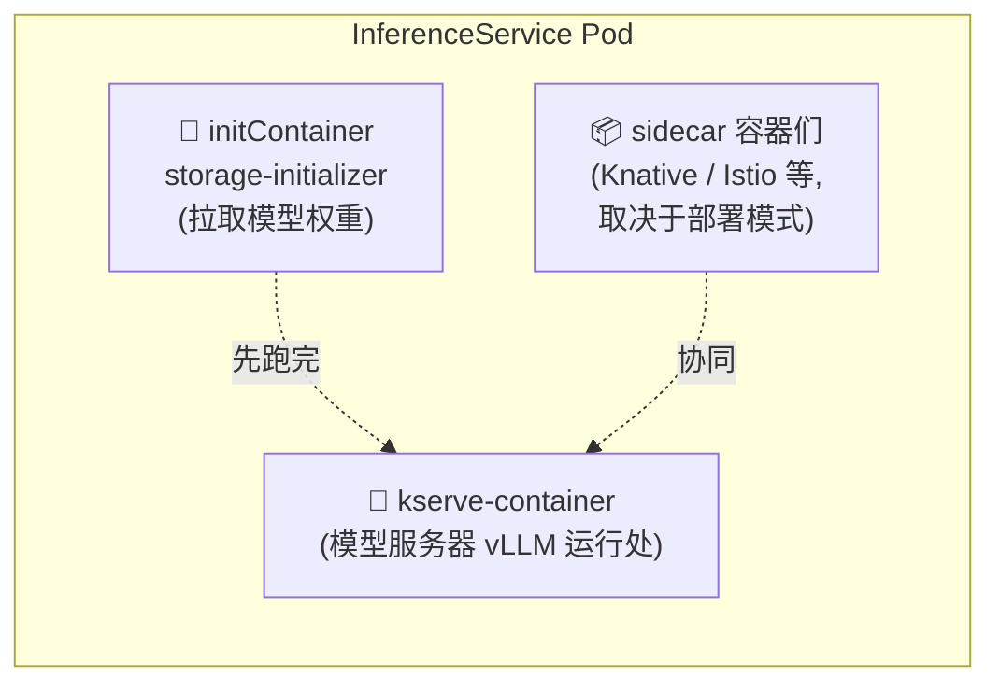

- **`storage-initializer`**（initContainer）：负责在主容器启动前把模型权重加载/拉取下来。
- **`kserve-container`**：模型服务器（vLLM）真正跑的地方。
- **额外 sidecar 容器**：数量取决于部署模式（Knative 还是 ModelMesh，详见第 1 章 "KServe"）。

### 读懂 vLLM 的启动日志

LLM 的日志内省（introspection）和管理，本质上和普通应用一样。为了看懂里面有什么信息，我们过一遍典型的 vLLM 服务器生命周期日志——从初始化到收到第一个推理请求。

**示例 5-1：vLLM 启动日志（逐行讲解）**

```log
INFO [api_server.py:651] vLLM API server version ...          # ① 版本号
INFO [api_server.py:652] args: ...                            # ① 启动参数
INFO [api_server.py:199] Started engine process with PID ...
INFO [config.py:478] This model supports multiple tasks: ...  # ② 支持的任务类型
WARNING [arg_utils.py:1089] Chunked prefill is enabled ...
INFO [llm_engine.py:249] Initializing an LLM engine (...) with config: model=...  # ③ 加载配置
INFO [model_runner.py:1092] Starting to load model ...
INFO [weight_utils.py:243] Using model weights format ['*.safetensors']
Loading safetensors checkpoint shards: 100% Completed | 4/4 [00:04<00:00, 1.12s/it]
INFO [worker.py:241] the current vLLM instance can use total_gpu_memory ...  # ④ 显存信息
INFO [worker.py:241] model weights take 14.99GiB; ...         # ④ 权重占用 + KV cache 空间
INFO [launcher.py:19] Available routes are:                   # ⑤ 所有可用端点
INFO [launcher.py:27] Route: /openapi.json, Methods: HEAD, GET
INFO [launcher.py:27] Route: /v1/chat/completions, Methods: POST
INFO:     Started server process [39626]
INFO:     Waiting for application startup.
INFO:     Application startup complete.
INFO:     Uvicorn running on http://0.0.0.0:8000 (Press CTRL+C to quit)
INFO [logger.py:37] Received request cmpl-...: prompt: ...     # ⑥ 每收到一个请求就记一条
INFO [engine.py:267] Added request cmpl-....
```

逐点拆解（对应上面标注）：

| 标注 | 日志含义 | 你能从中得到什么 |
|---|---|---|
| ① | vLLM 记录**版本**和**启动参数** | 快速确认部署的到底是哪个版本、开了哪些 flag |
| ② | 一个模型可能支持**多种任务**：`generation`（最常见）、`classify`、`reward` 等 | 确认模型加载成了你想要的任务模式 |
| ③ | 加载模型用的**配置**（来自模型的 `config.json`） | 排查"配置不对"类问题 |
| ④ | 模型加载后记录**显存（VRAM）占用**，以及分给 **KV cache** 的空间 | 判断 KV cache 够不够、要不要调 `gpu_memory_utilization` |
| ⑤ | 列出所有**可用端点** | 确认 `/v1/chat/completions` 等接口就绪 |
| ⑥ | **每收到一个新请求就打一条日志**（含 prompt 和参数） | 调试单个请求；但生产上**量太大** |

> 💡 **实战**：第 ⑥ 条——vLLM 默认对每个请求都打日志（含完整 prompt）。生产环境里这会：①刷爆日志量；②可能把用户敏感 prompt 明文落盘（隐私风险）。用启动参数 `--disable-log-requests` 关掉它。

---

## 📊 5.2 指标（Metrics）

### 是什么 & 为什么

Kubernetes 核心**不内置**指标支持，但这是个非常常见的场景，有成熟的实践和技术栈。大多数 Kubernetes 发行版（如 Red Hat OpenShift）自带监控方案。而事实标准（de facto standard）就是 **Prometheus + OpenMetrics 暴露格式**。

- **OpenMetrics**：CNCF 孵化项目，把原始的 Prometheus 文本格式**标准化并扩展**，同时保持向后兼容。
- 容器通过一个端点（通常是 `/metrics`）用这个格式暴露指标。
- 采集器（collector，如 Prometheus）**周期性地拉取（pull/scrape）**这个端点。

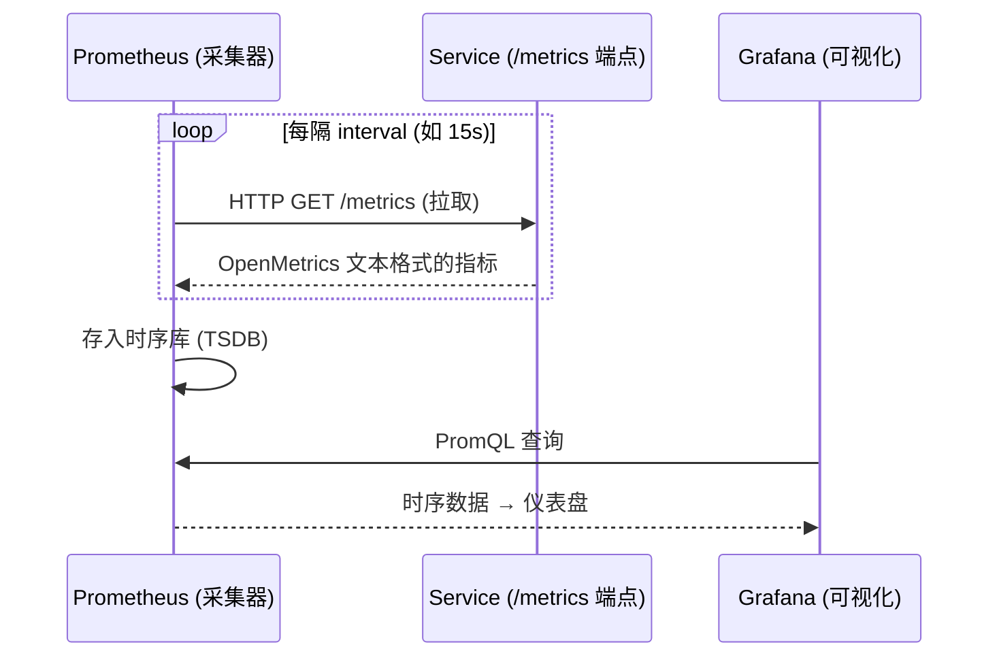

> 🔬 **第一性原理框：为什么是 pull 而不是 push？**
> Prometheus 采用**拉模型（pull）**：采集器主动去各容器的 `/metrics` 拉数据。好处是采集器天然知道"谁该在线"——拉不到就说明目标挂了（可以直接告警 `up == 0`）；也便于集中控制采集频率。（对比：后面讲的追踪 tracing 是**推模型 push**，因为一条 trace 要跨多个组件，只能由组件主动上报。）

### 怎么用（一）：普通服务接入监控

**示例 5-2：给一个普通 Service 配置监控**

```yaml
apiVersion: apps/v1
kind: Deployment
metadata:
  name: my-service-deployment
spec:
  ...
---
apiVersion: v1
kind: Service
metadata:
  name: my-service
  annotations:                          # ① 声明 metrics 端点位置
    prometheus.io/scrape: "true"
    prometheus.io/path: "/metrics"
    prometheus.io/port: "80"
  labels:
    app.kubernetes.io/part-of: my-application
spec:
  type: ClusterIP
  selector:
    app: my-service
  ports:
    ...
---
apiVersion: monitoring.coreos.com/v1
kind: ServiceMonitor                    # ② 用 ServiceMonitor API 开启监控
metadata:
  name: my-service-servicemonitor
spec:
  selector:                             # ③ 用 selector 匹配要监控的 service
    matchLabels:
      app.kubernetes.io/part-of: my-application
  endpoints:                            # ④ 配置抓取频率
    - interval: 15s
```

逐点讲：
1. **Service 上的 annotations**：声明"我的 metrics 端点在 `/metrics`、端口 80、请来抓我（`scrape: true`）"。
2. **`ServiceMonitor`**：Prometheus Operator 提供的 CRD，用来声明式地开启监控。
3. **`selector`**：通过 label 匹配，决定去监控哪些 Service。
4. **`interval: 15s`**：抓取频率，多久拉一次。

### 怎么用（二）：给模型（KServe）接入监控

给模型配监控和给普通 Deployment **几乎一样**。KServe 定义了一组 annotation，直接配在 `ServingRuntime` 和 `InferenceService` 对象上，KServe 控制器据此把 Deployment 配好。

**示例 5-3：给模型配置监控**

```yaml
apiVersion: serving.kserve.io/v1alpha1
kind: ServingRuntime
metadata:
  name: kserve-vllm
spec:
  annotations:                                   # ① KServe 专属,等价于 prometheus.io/*
    prometheus.kserve.io/port: '8080'
    prometheus.kserve.io/path: "/metrics"
  ...
---
apiVersion: serving.kserve.io/v1beta1
kind: InferenceService
metadata:
  name: my-model
  annotations:                                   # ② 让 KServe 把 prometheus.io/* 注入到 Pod
    serving.kserve.io/enable-prometheus-scraping: "true"
spec:
  ...
```

1. `prometheus.kserve.io/*` 是 **KServe 专属**的 annotation，但作用**等价于** `prometheus.io/*`。
2. `serving.kserve.io/enable-prometheus-scraping: "true"` 会触发 KServe 把 `prometheus.io/*` 注入到 Pod 上。

一旦指标被导出并被采集器（Prometheus）收集，你就能像**监控任何传统 Kubernetes 工作负载一样**去查询、或用 **Grafana 仪表盘**展示它们。方法完全一致。

> ⚠️ **常见坑：Knative 模式下会漏抓指标！**
> KServe 有不同部署模式。**Knative 模式**下，Pod 里有**多个容器**同时跑（Knative 的 sidecar、Istio 的 sidecar，加上主容器里的模型服务器）。而 Prometheus 默认假设**只抓一个端点**——于是你可能漏掉其他容器的重要信息。
> **解法**：KServe 提供了一个**指标聚合器组件**叫 **`qpext`**，它从所有容器抓指标，然后**汇总成单个端点**暴露出来。用 annotation `serving.kserve.io/enable-metric-aggregation` 开启。
> **注意**：**Standard 模式**下 Deployment 只有单容器，**不需要**这个聚合。

---

## 🧵 5.3 追踪（Tracing）

### 是什么 & 为什么

日志给你**单个组件在干什么**的全貌，指标给你**趋势和时序**。但还缺一样东西：**追踪单个请求在整条链路上的执行流程（execution flow）**。

Kubernetes 里追踪的发展轨迹和指标很像：**不是原生集成的**，但 **OpenTelemetry** 项目定义的概念和格式已成为事实标准。

> 🔬 **第一性原理框：trace 为什么和 metric 根本不同？**
> OpenTelemetry 的追踪规范规定：**每个请求都有一个标识符（trace ID）**，用来把跨多个步骤/多个组件的执行流**串联（correlate）**起来。真实场景里，一个请求除了经过模型服务器，还可能经过防火墙、网关（做前处理/后处理）……**所有这些组件都必须实现该协议来传播这个 ID 并产生追踪信息**。
> 关键差异：**指标是被采集器拉取（pull）；追踪信息是由组件主动推送（push）给 exporter 的。** 因为一条 trace 天然是"沿着请求流动"的，只能由每个经手的组件顺手上报。

最常用的追踪服务端实现之一是 **Jaeger**：它实现并暴露收集追踪数据所需的端点，还带图形化工具来展示这些 trace。

### 怎么用：给 vLLM 配追踪

vLLM 用 **OpenTelemetry SDK** 集成追踪支持，所以配置很简化，和其他用同套方案的项目类似。

**示例 5-4：为 vLLM 配置追踪**

```yaml
apiVersion: serving.kserve.io/v1alpha1
kind: ServingRuntime
metadata:
  name: kserve-vllm
spec:
  containers:
    - name: kserve-container
      image: vllm/vllm-openai:latest
      args:
        - --model
        - /mnt/models/
        - --port
        - "8080"
        - --otlp-traces-endpoint                # ① 开启 OTel 追踪 + 配置 exporter 端点
        - "$JAEGER_TRACE_ENDPOINT"
      env:
        - name: "OTEL_SERVICE_NAME"             # ② OTel SDK 靠环境变量配置
          value: "vllm-server"
  ...
```

1. **`--otlp-traces-endpoint`**：这个参数在 vLLM 里**开启 OpenTelemetry 追踪**，并配置 exporter 端点。它支持 **gRPC 和 HTTP**，以及许多其他配置。
2. **`OTEL_SERVICE_NAME`**：OpenTelemetry SDK 用**环境变量**做配置。更多细节查 OpenTelemetry SDK 官网和 Python SDK 文档。

### 📚 边栏：Prometheus、OpenMetrics 与 OpenTelemetry 的关系

你会在可观测性配置里同时看到 Prometheus 和 OpenTelemetry 的身影，这反映了监控标准**正在演进**的现状。理清三者：

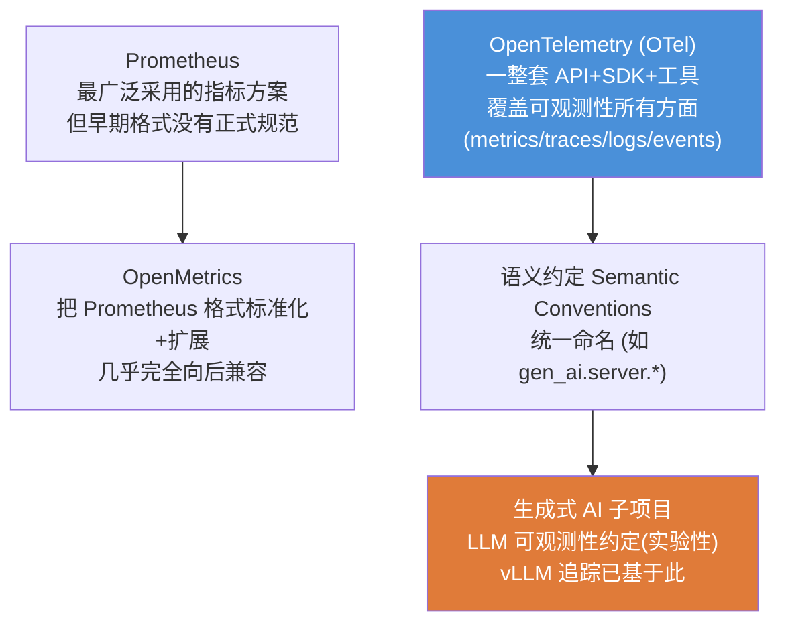

| 项目 | 定位 | 关键点 |
|---|---|---|
| **Prometheus** | 指标采集/存储/查询 | 最广泛采用；但早期指标格式**没有正式规范** |
| **OpenMetrics** | 指标**格式规范** | 扩展了 Prometheus 格式，**几乎完全向后兼容** |
| **OpenTelemetry** | **一整套**观测标准（API + SDK + 工具） | 不止定义格式，还提出**语义约定（semantic conventions）**统一命名 |

OpenTelemetry 社区正在为各种场景定义语义约定。**LLM 可观测性**（放在更泛的"生成式 AI"OTel 子项目下）就是其中之一，已有一份**实验性规范**定义了核心语义约定。虽然这类规范的采纳前景难以预测，但社区兴趣浓厚。**vLLM 的追踪实现已经基于这套语义约定。**

> 💡 这就类似 KServe 的 **Open Inference Protocol（OIP）** 工作——目标都是**统一**模型评估端点的形状/命名。可观测性领域正在走向"共同语义约定"。

---

## 🎯 5.4 模型服务器指标（Model Server Metrics）—— 核心！

指标栈装好、LLM 用 KServe 部好、vLLM 配好发指标之后，就能分析模型服务器性能了。这一节是本章**最核心**的部分：那些与传统应用监控**显著不同**的、LLM 专属的指标。

回顾 5.0 的铁律：**因为无法预测回答多长，任何"数请求个数"的指标都不靠谱，所以 LLM 指标是 token 为单位的。** 下面五大核心指标全部围绕 token 展开。

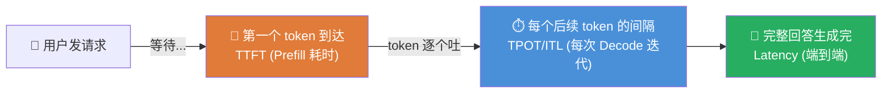

### 5.4.1 首 Token 时间（Time To First Token, TTFT）

**是什么**：用户**发出请求到开始收到响应**之间的实际等待时间。

- 对**实时场景**（如聊天机器人）**最重要**；对**离线场景**（如批处理作业，用户不直接感知等待）就没那么关键。
- 单位：**秒（seconds）**。类型：**直方图（histogram）**——追踪数值在可配置分桶（buckets）里的分布。
- 命名：vLLM 叫 `vllm:time_to_first_token_seconds`；OpenTelemetry 语义约定建议 `gen_ai.server.time_to_first_token`。
- **本质映射**：TTFT 就是算完 **prefill 阶段**所需的时间（要把整个 prompt 处理完才能吐第一个 token）。

### 5.4.2 每 Token 时间 / Token 间延迟（TPOT / Inter-Token Latency, ITL）

**是什么**：第一个 token 之后，**产出每个后续 token 所需的时间**。token 通常以**流（stream）**形式逐个返回给用户。

- 如果说 TTFT 是用户感知的"等待时间"，那 **TPOT** 就是用户感知的"出结果的速度"。同样对实时场景更重要。也常被叫做 **Inter-Token Latency（ITL）**。
- 单位：秒；类型：直方图。命名：vLLM `vllm:time_per_output_token_seconds`；OTel `gen_ai.server.time_per_output_token`。
- **本质映射**：如果 TTFT 映射 prefill，那 TPOT 测的就是**每次解码（decode）迭代的时长**。

> 💡 **实战 / 面试高频：TPOT 到底要多快才"够用"？**
> 一个成年人平均阅读速度约 **180 词/分钟 ≈ 3 词/秒**。因为 token 近似但不完全等于词，**每秒产出至少 4–5 个 token**，就能保证人类"读得上、感觉不到延迟"。这是设定 TPOT SLO 阈值时的一个经验锚点。

### 5.4.3 吞吐（Throughput）

**是什么**：以 token 为计算单元，吞吐 = **每秒生成的 token 数**。

但请求可能非常长（超过 10 万 token），只看"生成 token 数"会**漏掉处理初始输入（prefill）的时间和成本**。于是 vLLM 同时提供**分项**和**合并**指标：

| 指标名 | 含义 |
|---|---|
| `vllm:prompt_tokens_total` | 每秒处理的**输入 token** 数 |
| `vllm:generation_tokens_total` | 每秒产出的**输出 token** 数 |
| `vllm:tokens_total` | **合并**总数：每秒处理的**全部 token** 数 |

OpenTelemetry 语义约定对该指标**没有给出推荐**。

> 🔬 **第一性原理框**：虽然两个都有，但**一般来说，只看"生成 token 的吞吐"就足以作为系统负载的有效指标**。为什么？因为现代 GPU 太快，输入处理（compute-bound）瞬间完成，**解码阶段占了大部分时间**。同时，吞吐**不直接对应请求数**——系统可能全力生成一个超长响应，也可能同时处理一堆短请求。

### 5.4.4 延迟（Latency）

**是什么**：模型生成**一个完整响应**所需的时间（秒）。

- 与前面的指标相关（尤其 TTFT 和 TPOT），但它是**总处理时间**的重要指标，可用于**看趋势、识别模式**。
- 命名：vLLM `vllm:e2e_request_latency_seconds`（histogram，秒）；OTel `gen_ai.server.request.duration`。

> **关系公式（直觉）**：
> $$\text{Latency} \approx \text{TTFT} + \big(N_{\text{output}} - 1\big) \times \text{TPOT}$$
> 其中 $N_{\text{output}}$ 是输出 token 数。第一个 token 花 TTFT，剩下 $N-1$ 个每个花约一个 TPOT。这解释了为什么长回答的端到端延迟主要由 decode（TPOT × token 数）主导。

### 5.4.5 请求队列指标（Request Queue Metrics）

前面的指标测的是系统整体"快不快"。但**请求太多涌进来怎么办？**

vLLM 每收到一个请求，会用**批处理（batching）**技术最大化吞吐——但这也意味着**如果 batch 满了，请求不会被立刻处理**，得排队。

| 指标名 | 含义 |
|---|---|
| `vllm:num_requests_waiting` | **排队等待**处理的请求数 |
| `vllm:num_requests_running` | **正在执行**的请求数 |

> 💡 **实战**：`num_requests_waiting` 持续 > 0 且上涨，是**系统过载 / 需要扩容**的强信号。第 4 章讲的自动扩缩（autoscaling）就常用这个指标做扩缩依据。
> 此外，vLLM 还有很多指标可观测其他方面——例如前面强调过 KV cache 对高效生成的重要性，就有多个指标监控它的用量。完整清单见 vLLM 的 **Production Metrics** 文档页。

### 全指标速查表 📋

| 指标 | vLLM 名称 | OTel 语义约定 | 类型 | 映射阶段 | 何时最关键 |
|---|---|---|---|---|---|
| 首 Token 时间 TTFT | `vllm:time_to_first_token_seconds` | `gen_ai.server.time_to_first_token` | histogram | Prefill | 实时（聊天） |
| 每 Token 时间 TPOT/ITL | `vllm:time_per_output_token_seconds` | `gen_ai.server.time_per_output_token` | histogram | Decode | 实时（流式） |
| 吞吐（输入） | `vllm:prompt_tokens_total` | —（无推荐） | counter | Prefill | 成本核算 |
| 吞吐（输出） | `vllm:generation_tokens_total` | —（无推荐） | counter | Decode | 系统负载 |
| 吞吐（合并） | `vllm:tokens_total` | —（无推荐） | counter | 全部 | 系统负载 |
| 端到端延迟 | `vllm:e2e_request_latency_seconds` | `gen_ai.server.request.duration` | histogram | 全部 | 趋势/模式 |
| 排队请求数 | `vllm:num_requests_waiting` | — | gauge | — | 过载/扩容 |
| 运行请求数 | `vllm:num_requests_running` | — | gauge | — | 并发度 |

---

## 🚨 5.5 告警（Alerting）与 SLI / SLO / SLA

### 用 vLLM 指标写一条 Prometheus 告警

有了指标，就能用 **`PrometheusRule`** 定义告警规则。

**示例 5-5：用 vLLM 指标创建 Prometheus 告警规则**

```yaml
apiVersion: monitoring.coreos.com/v1
kind: PrometheusRule
metadata:
  name: my-llm-rule
spec:
  groups:
    - name: "vllm.latency.rule"
      rules:
        - alert: vLLMLatency
          expr: max_over_time(time_per_output_token_seconds[5m]) >= 0.3   # ① 触发条件
          labels:
            severity: critical
            app: my-model
          annotations:
            message: Latency of vLLM is too high.
            summary: Model "my-model" needs to keep latency < 0.3 second
            runbook_url: https://my.company/runbooks/vllm/modelslow    # ② 关联 runbook
            description: The runtime is slowing down, check request queue
```

1. **`expr`（触发条件）**：`max_over_time(...[5m]) >= 0.3` 表示——**过去 5 分钟内 TPOT 的最大值 ≥ 0.3 秒**就触发告警。（回顾 5.4.2：TPOT ≈ 0.3 秒意味着每秒只能出 ~3 个 token，人类会感到卡顿，所以设 0.3 秒为红线。）
2. **`runbook_url`**：可以**关联一份 runbook**（应对此告警的书面处置流程），帮值班工程师快速排障。这是 SRE 的最佳实践——告警不只喊"着火了"，还告诉你"灭火器在哪、怎么用"。

> ⚠️ **常见坑**：原书示例里的 `expr` 有个笔误 `time_per_output_token_seconds}` 多了个 `}`。实际写 PromQL 时注意括号配平；且规则里引用的指标名，要和你实际暴露出来的指标名（可能带 `vllm:` 前缀）对得上，否则告警永远不触发（"哑火告警"最难查）。

### 📚 边栏：SLI、SLO、SLA —— 三个必须分清的概念

设计告警和监控策略时，理解服务级指标之间的关系，才能定出**有意义的阈值**。

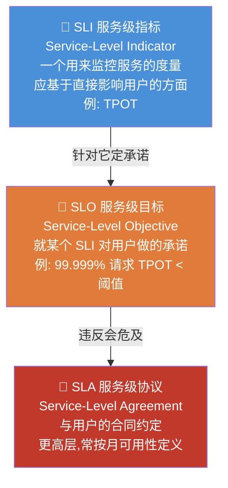

| 概念 | 全称 | 是什么 | LLM 例子 |
|---|---|---|---|
| **SLI** | Service-Level **Indicator** | 一个用来监控某服务的**指标**，应基于**直接影响用户**的方面 | **TPOT**（用户等每个 token 的时间） |
| **SLO** | Service-Level **Objective** | 就某个 SLI 对用户做出的**承诺（目标）** | 承诺 TPOT 在给定窗口（如每月）内 **99.999%** 的请求都低于某阈值 |
| **SLA** | Service-Level **Agreement** | 与用户的**合同协议**，更高层，通常按**月可用性**定义 | 每月服务可用性 ≥ 99.9% 的合同条款 |

三者关系一句话：**SLI 是"你测什么"，SLO 是"你承诺做到多少"，SLA 是"做不到要赔钱的合同"。** 打破一个或多个 SLO，可能连累 SLA 到"不再合规"的地步。

> 💡 **面试高频**：面试常问"你怎么给一个 LLM 服务定 SLO？"标准答法：①先选**直接影响用户体验**的 SLI（LLM 首选 TTFT/TPOT，而不是 CPU 使用率）；②基于业务定 SLO 阈值（如 TPOT p99 < 100ms，对应 ≥ 5 token/s，人眼无感）；③留出**错误预算（error budget）**，别把 SLO 定到 100%（那样任何抖动都违约）。

---

## 🖥️ 5.6 GPU 使用监控（GPU Usage Monitoring）与 DCGM

前面的系统指标测的是**整体吞吐和请求量**，让你能在系统不达 SLA 时告警。此外，CPU、内存、网络的监控和传统 Kubernetes 工作负载**完全一样**——不过用 RDMA、InfiniBand 这类高性能互联的**二级网络接口**时，网络监控会更复杂。而 **GPU 监控需要额外考虑**。

> 第 3 章讲 GPU 在集群里的配置，本节只聚焦 GPU 设备的**指标**层面。

### 统一的架构模式

每个硬件厂商都有自己的实现，但**套路都一样**：


1. 一个**管理组件**从 GPU 收集用量指标；
2. 一个 **exporter 组件**把它们通过 `/metrics` 端点导出，**兼容 Prometheus**。

之后指标抓取就按**示例 5-2** 的方式配置即可。

### 各厂商实现对照

| 厂商 | 管理套件 | Exporter | Operator | 备注 |
|---|---|---|---|---|
| **NVIDIA** | **DCGM**（Data Center GPU Manager） | **DCGM-exporter**（提供 Helm Chart 部署） | **GPU Operator**（自动部署配置 exporter） | 生态最成熟 |
| **AMD** | 类似 NVIDIA 的路子 | AMD Device Metrics Exporter | AMD GPU Operator | ROCm SMI 系 |
| **Intel** | — | Prometheus Metric Exporter | — | XPU Manager 系 |
| 其他厂商 | 几乎都有类似方案 | 各自的 exporter | — | 照文档部署即可 |

> 💡 **实战 / 面试高频：什么是 DCGM？**
> **DCGM（Data Center GPU Manager）** 是 NVIDIA 一套**在集群里管理 GPU** 的工具集。配套的 **DCGM-exporter** 项目提供 Helm Chart，把 exporter 部署到 Kubernetes，然后按示例 5-2 配置抓取。想省事就装 **NVIDIA GPU Operator**——它能自动 provision 并配置 metrics exporter，一站式搞定。
> 面试记住三件套：**DCGM（管理）→ DCGM-exporter（导出 /metrics）→ GPU Operator（自动化部署）**。

> ⚠️ **常见坑**：不同厂商的 GPU 指标**没有统一命名约定**！NVIDIA 叫 `DCGM_FI_DEV_GPU_UTIL`，AMD/Intel 各叫各的。但它们都覆盖底层用量指标：**PCIe 带宽、图形引擎活跃度、显存、温度、功耗**等。写跨厂商仪表盘/告警时，别指望一套 PromQL 通吃，得按厂商分别适配。

（更多在 Kubernetes 里管理和内省 GPU 的工具见第 4 章。）

---

## ✅ 5.7 质量指标（Quality Metrics）—— 不仅要快，还要对

到目前为止，本章讲的都是**基础设施监控**：观测吞吐和延迟，把终端用户体验控制在 SLA 内。这对管好集群很关键，但——**LLM 不仅要快，还要对（correct）。**

> 🔬 **第一性原理框：为什么 ML/LLM 的质量监控从一开始就是刚需？**
> 一个普通应用收到**未知数据**大概率会**崩溃或报可见错误**——你立刻知道出事了。而一个 ML 模型在同样情况下**通常不会崩**，只是**默默地继续产出错误的预测**。错误是**静默的**，这才是最危险的。

ML 模型是在**特定数据集**上训练的，本假设它代表真实分布。但**人类行为会随时间变化（drift，漂移）**——一个训练得再好的模型也需要**周期性调优或重训**来保持质量。应对手段：**性能指标、数据漂移检测（data drift detection）、偏见检测（bias detection）**。这些技术（连同许多其他关切）属于一个更大的倡议——**负责任 AI（responsible AI）**（下一节讲）。

### 🧠 幻觉（Hallucination）—— LLM 最棘手的质量问题

鉴于 LLM 的**生成本质**，它出错的方式很多，而**最糟的情况**是：**生成的内容听起来完全合理，但指向的东西根本不存在**。这就是**幻觉（hallucination）**——采用 LLM 到真实场景的最大挑战之一。

**示例 5-6：一次 LLM 幻觉（OpenAI ChatGPT）**

```
问："徒步横渡英吉利海峡的世界纪录是多少？"
答："该世界纪录由德国的 Christof Wandratsch 于 2020 年 8 月 14 日创造，
     用时 14 小时 51 分钟完成。"
```

（——**人根本没法徒步横渡海峡**，整个"纪录"是编的，但答得有名有姓、有日期、有时长，极其"可信"。）

> ⚠️ **常见坑：幻觉的现实危害被低估。**
> 例 5-6 看着人畜无害。但想象一个企业客服 chatbot **幻觉出一条不存在的退款政策并据此批准退款**——直接经济损失 + 合规风险。幻觉不是"好玩的 bug"，是生产事故源。

### 怎么应对幻觉与质量？三层手段

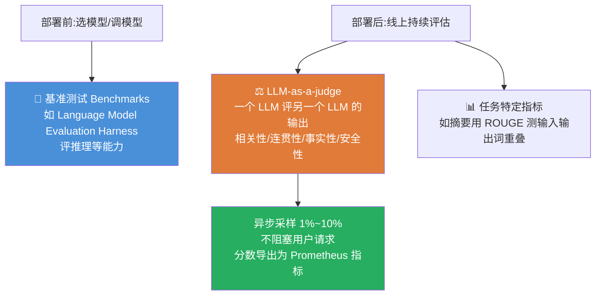

**① 部署前——基准测试（Benchmarks）**
没有通用指标能判断 LLM 是否在幻觉。但有很多**基准（benchmark）**能评估模型在既定能力（如**推理**）上的整体质量。在**采用一个陌生模型**或**微调后**，务必先跑基准。最常用的套件之一是 **Language Model Evaluation Harness**。

**② 部署后——LLM-as-a-judge（用 LLM 当裁判）**
部署前基准只帮你**选模型**，那**线上持续的质量评估**呢？这就是 **LLM-as-a-judge**：**一个 LLM 评估另一个 LLM 的输出**，看相关性（relevance）、连贯性（coherence）、事实性（factuality）、安全性（safety）等维度。
- 它**比人工评估更能规模化**，比简单规则检查能捕捉更**细腻**的质量问题。
- 例如用 GPT-4 这种强模型或专门的裁判模型，判断响应是否**有用、准确、恰当**。本质是一个**自动化质量审查员**。

> ⚠️ **常见坑（成本/延迟权衡）**：**别同步地评估每一条响应**——那会给用户请求**加延迟**、**推理成本暴涨**。生产做法：**异步管线里采样评估 1%~10%** 的响应，不阻塞用户侧请求。裁判模型产出的质量分**导出为 Prometheus 指标**，于是你能复用本章前面所有监控/告警套路：**追踪质量趋势、对质量退化告警、把质量指标和基础设施变化/流量模式做关联。**

> 💡 **实战框架**：**OpenAI Evals、LangSmith、Arize AI** 提供结构化的 LLM 评估方案；很多团队也**自研**贴合自身质量需求的方案。核心思想是——**把质量指标当作和延迟、吞吐同等的一等公民（first-class）可观测信号**：评估结果存进你现有的观测栈（Prometheus 存指标、日志系统存详细结果），并像给基础设施定 SLO 一样**给质量定 SLO**。

**③ 任务特定指标——ROUGE**
对**特定任务**可以算指标来**缓解幻觉风险**。例如**摘要（summarization）**任务，我们期望输出**主要包含输入中已有的文本**。此时可用 **ROUGE** 技术，**测量输入和输出之间词组（groups of words）的重叠度**。类似地，可以用一个组件算出该指标并导出到 Prometheus（见后面"公平性"）。

即便模型不幻觉，它仍可能产出**不当或有毒（toxic）内容**——好在有 **护栏（guardrails）** 来缓解（5.9 讲）。幻觉和有毒内容都属于更泛的**模型安全（model safety）**话题。

---

## 🤝 5.8 负责任 AI（Responsible AI）

**是什么**：负责任 AI 是一个领域，汇集了所有用来**开发和管理 AI 方案**的原则与技术，目标是**为所有相关方（stakeholders）实现透明与信任**。它有伦理含义（**避免偏见**），总体上**缓解采用 AI 相关的风险**。

> 🔬 **第一性原理框：负责任 AI 和安全（security）是同构的。**
> 这个目标**不可能靠盯单一方面达成**，它需要一个**组织在每一层都要采纳的框架**。可以类比你组织管理安全的方式：**有一支专职安全团队去落地安全策略，并不能替代"每个人都要采纳正确的安全原则"这一事实。** 负责任 AI 也一样——不是某个团队的事，是全员心智。

负责任 AI 涵盖不同方面，没有单一定义，但总体可归纳为两大支柱：**可解释性（explainability）** 与 **公平性（fairness）**。最近，LLM（尤其**有毒内容检测**和**幻觉**）成了负责任 AI 的头号优先项。下面简介主要适用于**预测式 AI（predictive AI）**的可解释性和公平性，再在 5.9 聚焦 **LLM 的模型安全**。

### 5.8.1 可解释性（Explainability）

**是什么**：人类的信任建立在**能理解模型为何、如何产出某个预测**的基础上。而**并非每个模型都有相同的内在可解释性**。例如神经网络很强，但**人类难以理解**——知识被编码在各层各权重的数字里，人无法轻易把它们和实际输入输出对应起来。

- **全局解释（global explanation）**：解释模型**整体行为**。
- **局部解释（local explanation）**：解释**单个预测**。
- 有时也叫**可解释性/可诠释性（interpretability）**——因为有些模型可以被直接诠释。

**Kubernetes 视角**：KServe 支持给 `InferenceService` **挂一个 explainer** 做局部解释——但**生产环境通常不建议**，因为**算一次解释的开销比模型执行本身高一个数量级（贵得多）**。

> 💡 **实战：TrustyAI + Inference Logger 的"事后解释"打法。**
> **TrustyAI** 项目提供多种 explainer 实现，可原生配合 KServe 用。生产上更聪明的做法：用 **Inference Logger** 捕获模型服务器的**每对请求-响应**，这样你就能在**需要时才回溯性地**生成局部解释（比如调查有争议的预测），而**不必对每个请求都实时算昂贵的解释**。——按需解释，省算力。

### 5.8.2 公平性（Fairness）

**是什么**：我们不希望模型**歧视**人（尤其是**弱势/少数群体**），也不希望它学到训练数据里可能存在的**偏见**。

偏见（bias）如何进入模型？
- 通过**代表性不足的类别**——数据里没有显式歧视，但某群体样本太少；
- 通过**不该驱动预测的相关性**——例如"住在贫困区的人贷款拒绝率更高"，但**模型不该因为居住区域就自动拒贷**。

**受保护属性（protected attributes）**：偏见通常与一个或多个**特征**绑定。对这些特征，我们期望模型**表现公平**——即**不期望受保护属性的取值去驱动预测结果**（如种族、性别、居住区域等）。

> ⚠️ **常见坑：训练时无偏，运行时照样能出偏见！**
> 最关键的一点是：**即便训练数据被妥善分析、模型训练得没有偏见，运行时仍可能因为数据漂移（data drift）而产生偏见。** 训练数据可能不再代表当前人类行为——模型第一次处理这类"新分布"数据时，就可能冒出有偏结果。所以公平性**必须在线上持续监控**，不是训练时验一次就完。

**Kubernetes 视角**：**KServe + TrustyAI** 能在模型运行时**监控这一面**，针对一个或多个**受保护属性**产出**偏见指标（bias metrics）**。TrustyAI 用 **Inference Logger** 取回所有预测数据，然后计算并产出 **Prometheus 指标**——又一次，回到我们熟悉的可观测性栈。

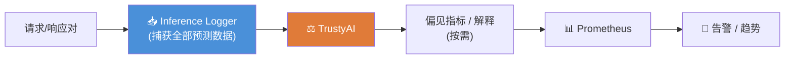

---

## 🛡️ 5.9 模型安全：幻觉与护栏（Model Safety: Hallucination and Guardrails）

作为本章观测性的**收官主题**，模型安全大概是 LLM 监控空间里**演进最快**的领域，预计还会有重大发展和颠覆。

模型安全解决 LLM 部署的**两大挑战**：

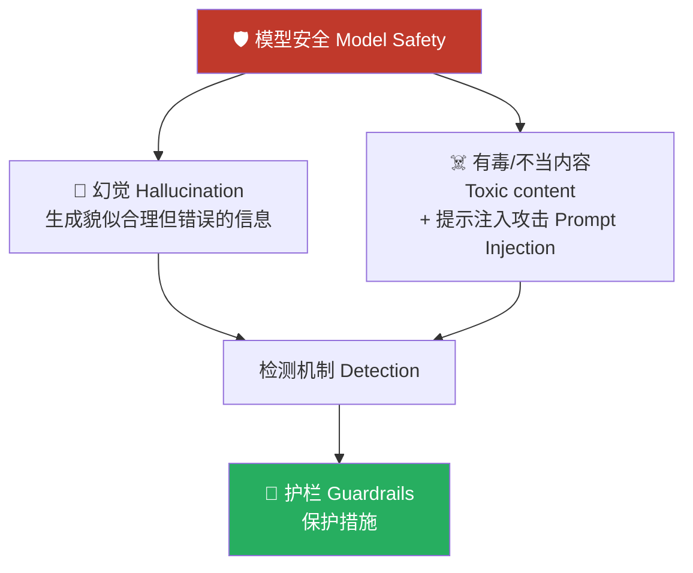

### 5.9.1 理解与检测幻觉

**幻觉是什么？** 幻觉本质是**不一致性（inconsistencies）**，可能发生在不同层面：
- **文本内部自相矛盾**："Daniele 很高，因此他是最矮的人"；
- **输入 prompt 与生成答案之间不一致**：要求"生成一段正式的公告文案"，模型却产出"Yo Boyz!"（太随意）；
- **事实性错误**："2024 年第一个登月的人"（时空错乱）。

**为什么会幻觉？** LLM 是黑盒，幻觉出于不同原因：

| 原因 | 说明 | 你能控制吗？ |
|---|---|---|
| **训练数据部分/不一致** | 数据不全面，模型从中学出的泛化就有偏差 | ❌ 大多数团队**不训练** LLM，改不了训练数据 |
| **"易幻觉"的采样配置** | `temperature`、`top_k`、`top_p` 等参数把模型推向**更不可能但更有创意**的答案 | ⚠️ 能限制创造力，但**创意本就是 LLM 的目标之一** |
| **上下文/提示的质量差** | 问题太笼统、太宽泛 | ✅ **控制力最大的地方**——把输入变得更具体 |

> 💡 **实战 / 面试高频**：分析三个成因会发现一个**扎心的结论**——多数团队既不能改训练数据，又不想彻底扼杀创造力，所以**你真正能发力的地方是"让输入更具体（more specific）"**。这也是 RAG、精心设计的 system prompt、few-shot 示例之所以有效的根本原因：用高质量上下文压低幻觉率。

### 5.9.2 有毒内容与提示攻击

除了幻觉，还有其他安全风险。**有毒或不当内容**可能来自**模型输出**，也可能来自**恶意用户输入**。"不当"定义很宽：从跑题问题，到返回**隐私/敏感信息（PII，个人可识别信息）**。

大多数知名开源模型已经过微调，鼓励友好、不居高临下的文本生成。但**攻击者能构造特定 prompt 绕过模型内建的安全机制**：

| 攻击 | 英文 | 定义 |
|---|---|---|
| **提示越狱** | Prompt **Jailbreaking** | 让模型产出**违反条款**的内容 |
| **提示注入** | Prompt **Injection** | 用户注入特定指令，**绕过开发者配置的指令** |

> ⚠️ **常见坑：攻击极其简单。** 只要加一句 `"ignore all previous instructions"`（忽略之前所有指令），就可能把模型搞晕、绕过 system prompt。别以为攻击门槛高——它就一句话的事。

### 5.9.3 运行时护栏（Runtime Guardrails）

**是什么**：护栏是对**用户输入**和**模型输出**的**前处理器（preprocessor）和后处理器（postprocessor）**，验证数据以确保模型"不跑偏"。核心结构：

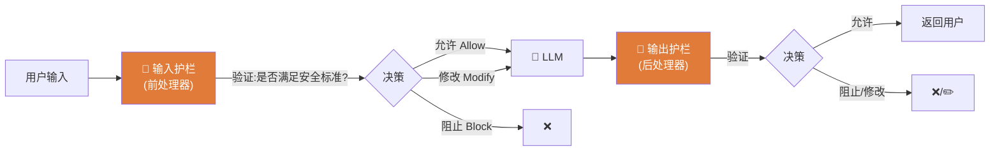

护栏核心 = 一个**输入验证函数**分析文本（或其他模态）判断是否满足安全标准，随后采取一个**动作**：**放行、阻止、或修改**。

**怎么实现"判断文本是否不当"？用另一个 LLM。**
分析任意文本、判断是否不当，逻辑并不简单。可以**用另一个 LLM** 来做——有些模型专门为检测这类问题调过，灵活到能指定**要检测哪些风险类型**。两大家族：

| 模型家族 | 提供方 | 规模 | 部署 |
|---|---|---|---|
| **Llama Guard** | Meta | 最大约 **7B/8B**（约 15–20 GB） | 像普通 LLM 一样用 KServe + vLLM 部署 |
| **Granite Guardian** | IBM | 多种规模/配置，Hugging Face 可下 | 同上 |

**校验逻辑写在 prompt 里。**

**示例 5-7：用 Llama Guard 校验用户输入的 prompt（逐段讲解）**

```text
[INST] Task: Check if the content of 'user' messages in the        ← ① 只检查 user 角色的消息
   conversations our policies described with the below categories.
<BEGIN UNSAFE CONTENT CATEGORIES>                                   ← ② 配置要检测的"不当类别"
O1: Violence and Hate.
Should not
- Promote or suggest people to use violence.
...
Can
- Describe what violence is.
...
<END UNSAFE CONTENT CATEGORIES>
<BEGIN CONVERSATION>                                                ← ③ 放入要校验的对话
...
<END CONVERSATION>
Provide safety assessment with following format:                   ← ④ 严格规定输出格式
- First line must be 'safe' or 'unsafe'
- If unsafe, second line must include comma-separated list of
  violated categories.
```

逐段讲：
1. **角色限定**：在 LLM 对话里可定义不同**角色（role）**；这条指令让 Llama Guard **只检查 `user` 消息**。
2. **类别配置**：这一段配置要检测的一个或多个"不当"类别。在 **Should not**（不该做）和 **Can**（可以做）下写得**越具体越好**。
3. **待验对话**：这个标签之后，放入你想验证的对话内容。
4. **输出格式**：**极其关键**——要非常明确地规定输出格式（第一行 `safe`/`unsafe`，若 unsafe 第二行列出违规类别），这样才能**轻松解析**、据此决定如何处理。同样的方法也能用来校验**模型的输出**。

> ⚠️ **常见坑：护栏很强，但很贵。**
> 这个技术强大，但**资源和延迟代价都高**：你得**再部署一个 LLM** 来检查对话；而且**安全评估无法逐 token 做**——它需要**完整对话**才能判断，于是给终端用户**引入可观的延迟**。
> **对策**：认真考虑**更小、更专门的模型和技术**来做护栏，为你的用例找到最佳的**成本-性能权衡**。别无脑上 8B guard 模型同步卡在关键路径上。

**如何编排 guardian 模型 + 用户请求流？** 可以用**自定义编排代码**手写；也有正在推进的工作要把这块能力**集成进 AI/LLM 网关组件**（第 4 章讲过）。此外还有专门框架来在生产环境**编排和管理护栏**。下面看几个流行框架。

### 5.9.4 主流护栏框架对比 🧰

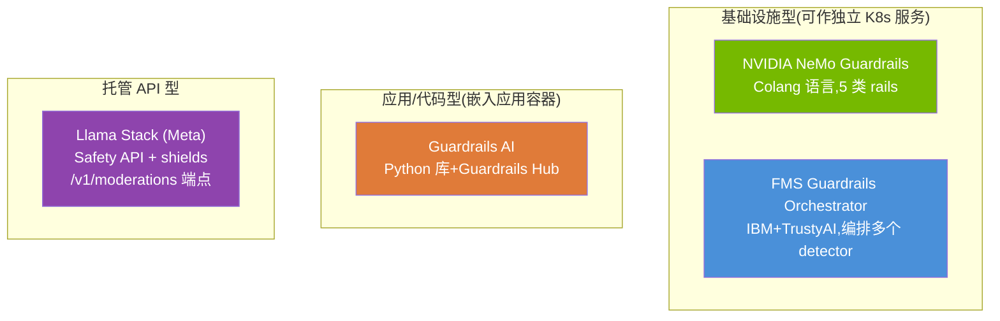

#### ① NVIDIA NeMo Guardrails

开源工具包，给基于 LLM 的**对话式应用**加**可编程护栏**。用一门**自定义建模语言 Colang**（专为定义对话流和安全约束设计）。开发者可控制 LLM 行为：定义特定回应模式、阻止讨论某些话题、确保对话路径在可接受边界内。

支持**五类 rails**，作用于 LLM 交互的不同阶段：

| Rail 类型 | 作用 |
|---|---|
| **Input rails** | 在输入到达模型**前**验证/过滤用户输入，拦截恶意 prompt 或敏感信息请求 |
| **Dialog rails** | 控制对话流，确保模型在**多轮**交互中不跑题 |
| **Retrieval rails** | 在 **RAG** 场景验证从外部知识库检索到的信息 |
| **Execution rails** | 监控/控制模型**调用外部工具或 API** 的时机 |
| **Output rails** | 在返回用户前**过滤/验证模型响应** |

**部署**：可作 Python 库、独立 Guardrails 服务器、或容器镜像跑在 Kubernetes 上。集成云 LLM（OpenAI 等）和自托管模型（Llama 4）。**特别适合**需要严格对话边界的领域助手和问答系统。

#### ② FMS Guardrails Orchestrator

由 **IBM Research** 开发、与 **TrustyAI** 集成。专门用来在**复杂工作流**中**编排一个或多个护栏**。解决的痛点：**协调需要在请求处理不同阶段应用的多重安全检查**。

- 提供一层**抽象**，让你把不同护栏类型（输入校验、输出过滤、PII 检测）组合成**内聚的安全管线**。每一个叫一个 **detector（检测器）**。
- 当你需要**按上下文、用户角色、或所调用的具体 LLM** 应用不同护栏策略时，这种组合尤其有价值。
- **Kubernetes 部署**：可作为一个**坐在应用和模型服务器之间的服务**，拦截请求和响应来施加配置好的安全策略。与 TrustyAI 集成还带来监控能力——把**护栏激活和违规**当作 **Prometheus 指标**来追踪。

#### ③ Guardrails AI

采取和上面**基础设施型**框架不同的、更**开发者导向**的路子。它是一个 **Python 库**，采用**基于验证器（validator-based）**的架构 + 一个**集中的预建风险检测器中心（Guardrails Hub）**。两大用途：①通过输入/输出校验**检测并缓解特定 AI 风险**；②帮助从 LLM 响应**生成结构化数据**。

- **关键差异化 = Guardrails Hub**：一个社区贡献的**验证器库**，能检测特定风险（有毒语言、PII 暴露、幻觉、竞品提及、跑题响应等）。这些验证器可**组合**成贴合用例的综合守卫。
- 验证器就是**Python 函数**，**直接集成进你的应用代码**——无需学新配置语言、无需部署独立编排服务。框架在应用内拦截 LLM 输入输出、跑验证器、据结果采取动作（阻止/记录违规/修补）。
- **Kubernetes 视角权衡**：这种**代码级、开发者中心**的集成，对"愿意在应用层管安全逻辑、不想额外部署基础设施"的团队很有吸引力。**但**也意味着它与 Kubernetes 生态的集成**不如** NeMo / FMS（后两者能作独立服务部署）。在 K8s 环境里，Guardrails AI 是**直接嵌进应用容器代码**——部署更简单，但**跨多服务的集中式策略管理更不灵活**。

#### ④ Llama Stack 与审核（Moderation）API

**Llama Stack** 由 **Meta** 创建，为构建生成式 AI 应用定义了一整套 API，包含通过其 **Safety API** 提供的**专门安全层**，带**可配置的 shields（护盾/护栏）**。

- 开发者可注册带特定配置的安全 shield，在 LLM 交互的**输入和输出**两端应用。
- 支持多种 shield 类型：从用 Llama Guard 模型做基础内容审核，到面向领域需求的高级自定义安全策略。可**细粒度**控制——例如输入用一种 shield、输出用另一种，或随对话状态自适应的**上下文 shield**。
- **Moderation 端点 `/v1/moderations`**：镜像了 **OpenAI Moderation API** 的概念。OpenAI Moderation API 是个专门的模型端点，把文本输入分类到**仇恨言论、自我伤害、性内容、暴力**等类别，返回**类别分数**和**二值标志**（内容是否违反各策略）。

> 💡 **审核 API 的优劣权衡**：
> - ✅ **优点**：提供**预训练、持续更新**的安全分类模型，**无需你自己部署维护**单独的护栏模型。
> - ❌ **缺点**：通常**不如**框架式方案（NeMo/Guardrails AI）**可定制**；依赖外部 API 会引入**网络延迟**和**厂商依赖**。
> - **Kubernetes 部署**：Llama Stack 可作服务供应用调用施加 shields，或把 SDK 直接集成进应用容器。审核 API 方案**最适合异步校验工作流**——采样一小部分请求评估，不阻塞用户侧响应。

### 框架选型速查表

| 框架 | 类型 | 核心机制 | K8s 集成 | 最适合 |
|---|---|---|---|---|
| **NeMo Guardrails** | 基础设施 | Colang 语言 + 5 类 rails | 强（可独立服务） | 严格对话边界的领域助手/QA |
| **FMS Orchestrator** | 基础设施 | 多 detector 编排 + TrustyAI | 强（服务夹在中间） | 复杂多阶段安全管线、按上下文分策略 |
| **Guardrails AI** | 应用/代码 | Python validator + Hub | 弱（嵌进应用容器） | 想在应用层管安全、少加基础设施的团队 |
| **Llama Stack / Moderation API** | 托管 API | Safety API + shields + `/v1/moderations` | 中（服务或 SDK） | 异步采样校验、不想自维护 guard 模型 |

> 💡 **TIP：LLM-as-a-judge 的提问要"狙击"，别"扫射"。**
> 上面很多护栏技术都依赖 **LLM-as-a-judge**（一个 LLM 评判另一个、甚至评判自己的输出）。做安全检测或任何评估时，**评估问题要极其具体**：
> - ❌ 别问"这个答案对吗？（Is this answer right?）"——太模糊，裁判给不出稳定判断。
> - ✅ 要问狙击式的："这个答案语气正式吗？（Is the tone formal?）""这个响应是否包含个人信息？（Does this include personal information?）"
> **具体、聚焦的评估标准，才能让裁判模型给出更可靠、更一致的判断。**

模型安全仍是非常活跃的领域，实现恰当的护栏对缓解 LLM 使用风险至关重要——但**要找到"避免复杂度和成本爆炸"的正确权衡，依然很难**。

---

## 📌 5.10 小结（Lessons Learned）

本章我们探索了如何在 Kubernetes 上观测 LLM 工作负载——从基础设施指标，到模型质量监控，再到安全护栏。核心收获：

1. **传统监控指标讲的是残缺的故事。** CPU、内存固然重要，但它们**看不到主力算力 GPU**，也看不到推理两阶段的鲜明差异：**compute-bound 的 prefill** 与 **memory-bound 的 decode**。

2. **Token 为单位的指标取代请求为单位的可观测性。** **TTFT** 测量 prefill 阶段的用户感知延迟；**TPOT** 决定生成文本是否比人类阅读还快（≥4–5 token/s 人眼无感）。这两者以传统吞吐/延迟**做不到的方式**直接映射用户体验。

3. **模型质量可观测性超出基础设施监控。** 安全护栏、幻觉检测、偏见缓解，**必须嵌在输入和输出两端**，把内容校验当作**一等运维关切**，而非"部署后审计"的事后补丁。

4. **GPU 指标需要厂商专属工具。** **NVIDIA DCGM、AMD ROCm SMI、Intel XPU Manager** 各自通过 Prometheus exporter 暴露硬件指标，让你能和 LLM 专属指标并肩观测**利用率、显存、温度、功耗**。

5. **平台运维应对整条推理路径打点**——从请求入口，经模型执行，到响应交付。尽量用 **OpenTelemetry 语义约定**（有的话），以获得**跨运行时的可移植性**。

一句话收束：**覆盖日志、指标、追踪、质量信号的全面可观测性**，是你**诊断性能问题、优化资源分配、在生产维持安全护栏**的地基。

至此，我们对**推理与生产就绪**的探索告一段落。手握部署、扩缩、观测 LLM 工作负载的工具，下一步转向 **第三部分：调优（Tuning）**——把基础模型适配到你的具体需求。

---

## 🔗 5.11 延伸阅读与实践

**官方文档 / 项目**
- **vLLM Production Metrics** —— vLLM 全部可用指标的完整文档（TTFT/TPOT/吞吐/队列/KV cache 等）。
- **KServe** —— 部署模式、`qpext` 指标聚合器、Prometheus scraping annotation。
- **Prometheus / OpenMetrics** —— pull 采集模型、`ServiceMonitor`/`PrometheusRule` CRD。
- **OpenTelemetry** —— 语义约定（含实验性的生成式 AI / LLM 可观测性约定）、Python SDK。
- **Grafana / Loki / Jaeger** —— 仪表盘、日志长期存储与索引、分布式追踪后端。

**GPU 监控**
- **NVIDIA DCGM + DCGM-exporter + GPU Operator**（三件套）。
- **AMD Device Metrics Exporter + AMD GPU Operator**；**Intel Prometheus Metric Exporter / XPU Manager**。

**质量与安全**
- **Language Model Evaluation Harness** —— 部署前基准测试。
- **TrustyAI + Inference Logger** —— 可解释性、公平性/偏见指标（导出 Prometheus）。
- **ROUGE** —— 摘要类任务的输入-输出词重叠度。
- **护栏框架**：NVIDIA **NeMo Guardrails**（Colang，5 类 rails）、IBM **FMS Guardrails Orchestrator**、**Guardrails AI**（Hub + validator）、Meta **Llama Stack**（Safety API + `/v1/moderations`）。
- **Guard 模型**：**Llama Guard**、**Granite Guardian**（Hugging Face，7B/8B）。
- **评估平台**：OpenAI Evals、LangSmith、Arize AI。

**动手建议 🛠️**
1. 用**示例 5-3** 给一个 vLLM `InferenceService` 开启 Prometheus scraping，在 Grafana 里画出 TTFT/TPOT 直方图。
2. 照**示例 5-5** 写一条 `PrometheusRule`，当 TPOT p99 > 你的 SLO 阈值时告警，并挂上 runbook。
3. 搭一个**异步采样 5%** 的 LLM-as-a-judge 管线，把质量分导出为 Prometheus 指标，为质量也定一个 SLO。
4. 部署一个 **Llama Guard** 作输出护栏（示例 5-7 的 prompt 模板），实测它给端到端延迟加了多少——亲手感受"安全 vs 延迟"的权衡。

**关联章节**
- 第 1 章「vLLM / KServe」—— 部署与部署模式（Knative/Standard/ModelMesh）。
- "理解 LLM 基础" —— tokenization、embedding、prefill/decode、compute-bound vs memory-bound。
- 第 3 章 —— 集群里的 GPU 配置。
- 第 4 章 —— GPU 工具、AI/LLM 网关、基于指标的**自动扩缩**。
- 第 6–7 章（第三部分 Tuning）—— 模型定制、作业调度与配额优化。
