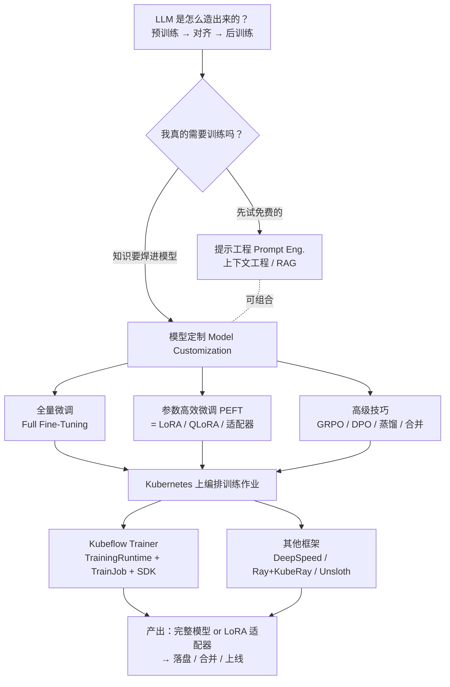
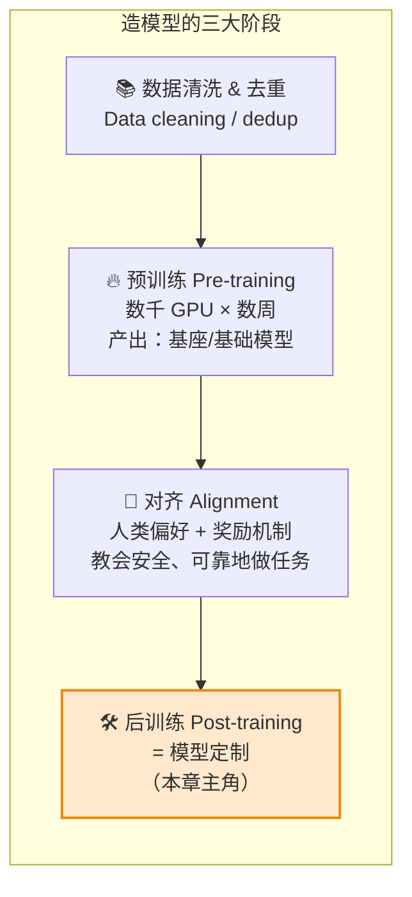
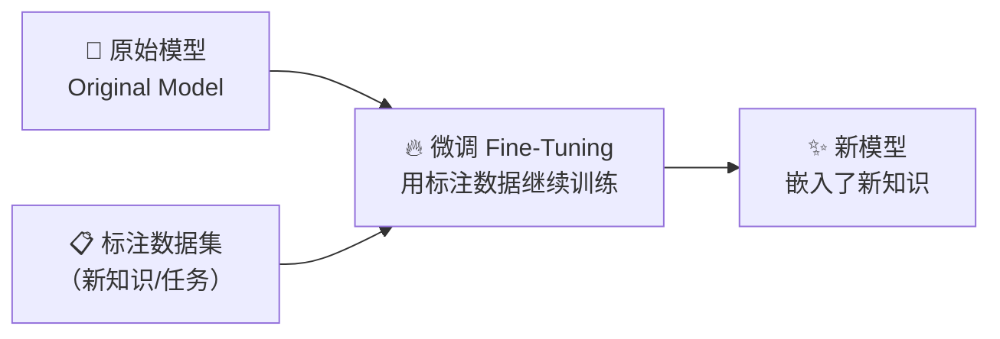
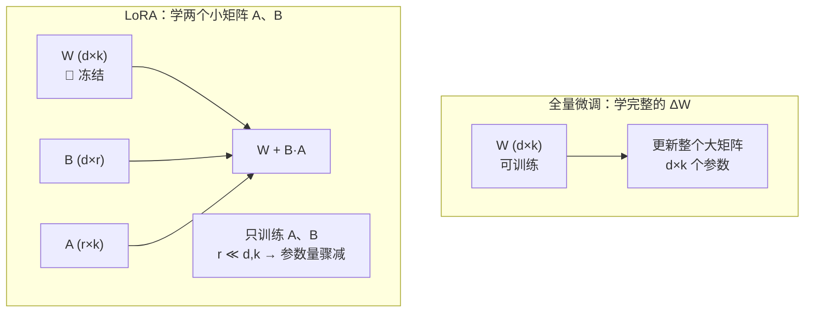
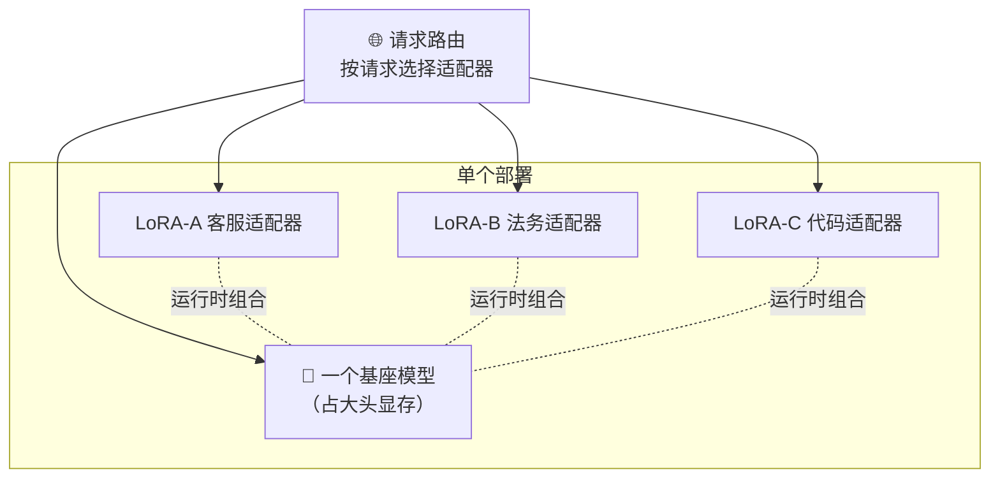
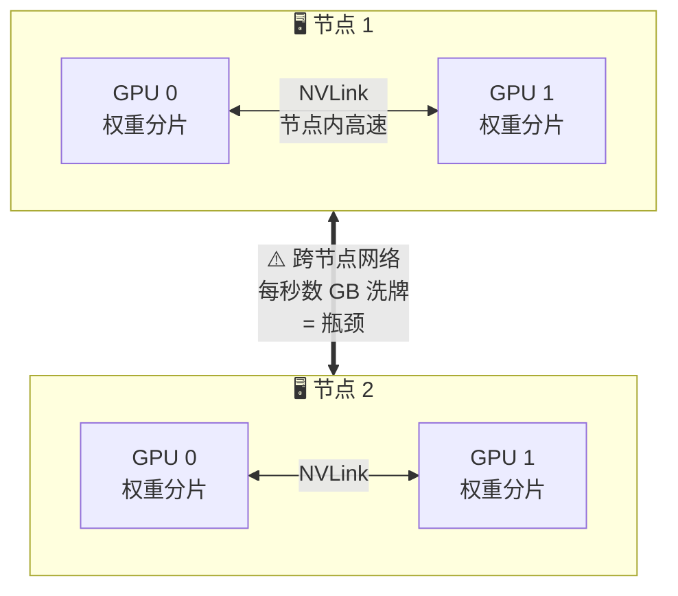
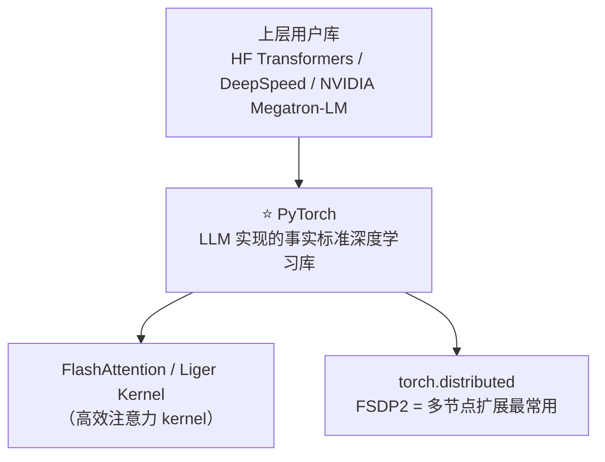
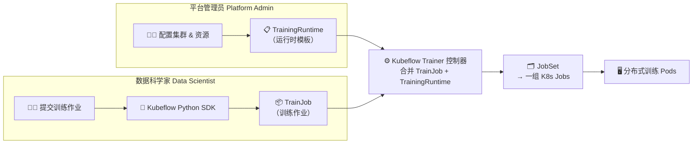
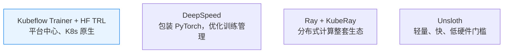
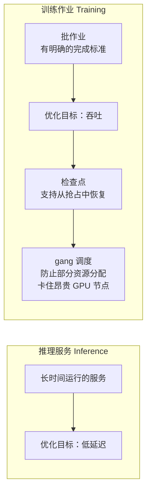

# 第 6 章 · 模型定制（Model Customization）🛠️

> 对应原书 *Generative AI on Kubernetes*（Roland Huß & Daniele Zonca, O'Reilly 2026）第 6 章「Model Customization」，印刷页 289–325。
>
> 本章是全书第三部分 **Tuning（调优）** 的开篇。前面两部分讲的是「怎么把别人训好的模型跑起来（Inference）」和「怎么把它跑得稳、跑得省（Production Readiness）」；从这一章开始，我们要回答一个更进阶的问题：**当现成模型不够用时，如何把它「改造」成更适合你业务的模型，并且这一切都在 Kubernetes 上工程化地跑起来。**

---

## 🗺️ 本章地图

本章有一条非常清晰的主线：**先想清楚要不要训 → 想清楚了要怎么训 → 训练怎么在 K8s 上跑起来。** 一路从「便宜简单」走到「昂贵复杂」，你可以随时在合适的地方停下。



| 小节 | 核心问题 | 关键词 |
|---|---|---|
| 6.1 LLM 是怎么造出来的 | 定制到底在整条流水线的哪一步？ | 预训练 / 对齐 / 后训练 |
| 6.2 提示工程与上下文工程 | 不训练能不能解决？ | Prompt / System Prompt / RAG |
| 6.3 什么时候该做模型定制 | 训练相比 RAG 的性价比拐点在哪？ | 上下文成本 / SLM / 蒸馏 |
| 6.4 微调一个模型 | 三种训练法各自的代价与产物 | SFT / Full FT / PEFT / LoRA |
| 6.5 在 Kubernetes 上跑训练作业 | 训练与推理在平台上有何本质不同 | 多机多卡 / 网络瓶颈 / FSDP |
| 6.6 Kubeflow Trainer | K8s 原生的训练编排怎么落地 | TrainingRuntime / TrainJob / SDK |
| 6.7 其他框架 | 除了 Kubeflow 还有什么选择 | DeepSpeed / Ray / Unsloth |
| 6.8 小结 | 运维视角的一句话总结 | 批作业 / 检查点 / gang 调度 |

> 💡 **一句话抓住本章**：这本书**不教你怎么从零训一个 LLM**（那需要绝大多数组织都没有的算力和专家），而是教你**把一个已经对齐好的现成模型，用最小的代价改造成你要的样子，并把训练这件事在 K8s 上工程化。**

---

## 6.1 LLM 是怎么造出来的：定制在哪一步？🧬

要理解「模型定制」，先得知道它在整条 LLM 生产线上的位置。原书用一张 **图 6-1（LLM creation pipeline）** 把整个流程串起来，我们用 mermaid 复刻它：



### 三个阶段逐个讲透

**① 预训练（Pre-training）——最贵、最耗时的一步**

- **是什么**：用海量文本，让模型学会「预测下一个词」。
- **代价**：书里原话——「processing all data using thousands of GPUs for many weeks」（数千块 GPU 跑好几周）。这是整条流水线里花掉绝大部分时间和金钱的地方。
- **产物**：一个**基座模型 / 基础模型（base / foundation model）**。⚠️ 注意它此时**只会续写文本，并不理解「任务」，也没有「内容边界」的概念**——你问它一个问题，它可能给你续写十个问题，而不是回答。

**② 对齐（Alignment）——教它「怎么做人」**

- **是什么**：教会模型**安全、可靠地按人类偏好完成任务**。
- 原书打了一个很妙的比方：这一步就像阿西莫夫（Isaac Asimov）的「机器人三定律」——机器人需要核心准则才能安全地与人类相处，LLM 也需要**行为边界**才能在不造成伤害的前提下完成任务。
- **怎么做**：需要**精心标注的数据（curated labeled data）** + **奖励机制（reward mechanism）**——由人类或专门的奖励模型来评价模型的回答好不好。

**③ 后训练（Post-training）= 模型定制——本章主角**

- 你在网上下载到的绝大多数模型（Llama、Qwen、Mistral……）**都已经过了对齐**，开箱即可用于一整套任务。
- **模型定制（也叫 post-training）就是在一个已经对齐好的模型之上，继续注入新的知识或策略。** 它可以**反复施加多次**，一次次增量地往模型里注入新政策或新知识。

> 🔬 **第一性原理：为什么本书从「推理」开始讲，而不是「训练」？**
> 原书点破了 LLM 区别于传统预测式 AI（predictive AI）的**本质特征——通用性（versatility）**。一个传统机器学习模型只会干一件事（比如判断垃圾邮件），而**一个 LLM 能干无数种任务**。正因如此，你**常常不训练、只调整输入，就能让一个现成 LLM 适配全新用例**。所以这本书的顺序是：先榨干「不训练」的可能（推理 + 提示工程），实在不够了才动训练的刀。

> ⚠️ **常见坑：术语混用**。原书专门用一个 sidebar 澄清三个词，面试和实战中经常被混淆：
>
> | 术语 | 精确含义 |
> |---|---|
> | **模型调优 Model Tuning** | 泛指各种微调技术，**不限于 LLM**，传统预测式 AI 也用这个词 |
> | **模型定制 Model Customization** | 更宽的概念，**涵盖所有修改 LLM / 教它新任务的手段**，其中一些方法与传统微调不同，可能需要多步骤、甚至人类参与 |
> | **后训练 Post-training** | 特指 LLM 生产流水线里「模型定制发生」的那个**阶段** |
>
> 书里坦承：这三个词在书中经常**互换使用**，因为它们本质上都是「改一个模型」，在 K8s 平台上都会带来相似的运维挑战。本讲义也遵循这个约定。

---

## 6.2 提示工程与上下文工程：先别急着训练 🎯

在动训练的刀之前，原书花了整整一节强调：**很多需求根本不需要训练**。这些「不训练」的替代方案不仅更简单，往往还是**更正确的选择**。

### 提示工程（Prompt Engineering）

- **是什么**：精心撰写详细、具体的指令（prompt），引导 LLM 输出。
- 有效的提示工程**不只是描述任务**，还要描述：

| 要素 | 例子（原书举的航空客服例子） |
|---|---|
| **场景 Scenario** | "This is an airline company named ABC"（这是一家叫 ABC 的航空公司） |
| **角色 Role** | "You are an AI-assistant chatbot to help customers"（你是帮助客户的 AI 助手） |
| **任务边界 Boundaries** | "You can only reply about our company and if you are sure about the answer"（只回答本公司相关、且你确信的问题）——用来**减少幻觉、约束行为** |

- 这类由服务提供方设定、对终端用户隐藏的提示，就叫 **系统提示（System Prompt）**。

> ⚠️ **安全高频坑：系统提示不是安全护栏！**
> 原书明确警告：**System prompts should not be relied upon as security controls**。它们可以被**提示注入（prompt injection）** 或**越狱（jailbreaking）** 绕过。生产系统若有安全需求，必须在**应用层**额外加：输入校验（input validation）、输出过滤（output filtering）、内容审核（content moderation）。这是面试里问「怎么防 prompt injection」的标准答案骨架。

- 提示工程还有一个重要用途：**把额外数据塞进 prompt**，强迫模型在生成时使用这些信息（因为每个 LLM 的训练数据虽大但有限）。这就自然引出了下面的 RAG。

### 上下文工程（Context Engineering）与 RAG

基础的手工提示工程，已经演化成了一套成熟的模式——甚至能让模型**动态调用工具**去检索信息或执行动作。这是 **AI 智能体（AI Agent）** 的核心原理，通常称为**上下文工程（Context Engineering）**：真正的工程工作在于**为 LLM 构造输入上下文**，这是一个复杂、多组件、迭代的过程。

其中最广泛采用的模式就是 **检索增强生成（RAG，Retrieval-Augmented Generation）**。用 mermaid 复刻原书 **图 6-2** 的 RAG 流水线：

```mermaid
flowchart LR
    subgraph 离线：知识入库
    KB["📄 外部/私有数据"] --> EMB1["🔢 嵌入模型<br/>Embedding Model"]
    EMB1 --> VDB[("🗄️ 向量数据库<br/>Vector DB")]
    end
    subgraph 在线：请求时检索
    U["🙋 用户问题"] --> EMB2["🔢 嵌入模型"]
    EMB2 --> Q["相似度搜索<br/>近似最近邻 ANN"]
    VDB --> Q
    Q --> CTX["📎 相关上下文"]
    U --> PR["📝 拼接 Prompt"]
    CTX --> PR
    PR --> LLM["🤖 LLM 生成回答"]
    end
```

**RAG 的工作机制（逐步拆解）：**

1. **离线阶段**：用专门的**嵌入模型（embedding model）** 把额外数据变成**嵌入向量（embedding vectors）**，灌进**向量数据库**。
2. **在线阶段**：用户请求到达时，先对向量库做一次查询，用**相似度搜索算法**（如**近似最近邻 approximate nearest neighbors, ANN**）找出与用户输入**语义最接近**的内容。
3. 把这段额外上下文拼进 prompt，交给模型作答。

**RAG 解决了什么问题？**

- 注入**训练时没有的外部/最新知识**：私有数据、或训练截止日之后才发布的信息。
- 虽然每个模型的**上下文窗口（context window）有限**，RAG 的巧妙之处在于——**只筛出与问题最相关的那一小块**塞进去，而不是把整个知识库都塞进上下文。

> 💡 **实战要点：RAG 和微调不是「二选一」**。原书反复强调：所有提示/上下文工程技术，**对通用模型和微调后的模型都适用**，你完全可以「RAG + 模型定制」组合拳。真正的问题不是「用哪个」，而是——
>
> > **"which combination gives you the best balance of performance, cost, and maintainability?"**
> > （哪种组合能在性能、成本、可维护性之间取得最佳平衡？）

RAG 的灵活性让它越来越流行——**几分钟就能更新向量库、刷新方案的知识**。这个趋势加上智能体 AI 的兴起，正在**吞噬模型定制的大片领地**。

> 📌 **本书对 RAG 只做高层介绍**，完整的 RAG 实现模式与最佳实践在后续「Retrieval-Augmented Generation」章节。本章的重点是**当 RAG 不够时该怎么训练**。

---

## 6.3 什么时候该做模型定制？💰

RAG 和提示工程很强，但**它们不总是最划算的方案**。模型定制的价值在于——**当你需要把知识或行为直接焊进模型本身时**。

### 核心判据：上下文成本

> 🔬 **第一性原理：为什么「焊进模型」能省钱？**
> 回忆前面第 4 章「vLLM Runtime Parameters Tuning」里的结论：**更大的上下文窗口，在推理时需要更多 GPU 显存**（因为 KV Cache 随上下文线性增长）。
>
> 于是逻辑就清楚了：如果某些知识**又核心、又稳定、又几乎不变**，那与其**每一次请求都把它塞进上下文**（每次都付一遍显存和算力的账），不如**一次性把它训进模型权重里**。模型定制因此成了**控制推理成本的关键工具**。

**原书的银行例子（值得记住）：**

> 一家银行可以定制一个模型，把关于**贷款、交易、信用风险**的领域知识嵌进去。这些知识**不常变**，所以焊进模型比每次请求都塞进上下文更合理。结果就是：**更低的推理成本 + 可能更好的性能。**

### 顺带引出：小模型（SLM）与蒸馏

同样的道理也适用于**模型尺寸**：

- 一个**小而专（small, specialized）** 的模型，可以做到**和一个大而未调（larger, untuned）** 的模型一样好、甚至更好。
- 这尤其适用于 **小语言模型（SLM，Small Language Model）**——它们服务时所需资源更少。
- 原书给了 SLM 的**经验规模**：**通常在 80 亿到 160 亿参数之间（8B–16B）**，这个规模非常适合在**受限的时间和资源**下做微调。

**模型蒸馏（Model Distillation）** 是另一条路：用一个大的**教师模型（teacher model）** 去训练一个更小、更高效的 SLM，让小模型**继承教师的知识**，同时只需更少的算力。

| 你的处境 | 更推荐 |
|---|---|
| 知识变化快、几分钟就要更新 | ✅ RAG |
| 只是想约束角色/风格/边界，且怕外部攻击绕过 | ✅ 轻量微调（PEFT） |
| 核心、稳定、不变的领域知识，且想省推理成本 | ✅ 模型定制（焊进权重） |
| 想用小模型顶替大模型省资源 | ✅ 蒸馏 + SLM 微调 |
| 既要新知识又要稳知识 | ✅ RAG + 微调 组合 |

---

## 6.4 微调一个模型 🔧

搞清了「要不要训」，现在讲「怎么训」。原书用 **图 6-3（Fine-tuning concept）** 表达了核心思想：**在原模型基础上继续训练，把新知识嵌进去。**



**代价先摆在前面**：微调虽然比预训练**便宜一个数量级**，但仍可能跑**数小时甚至数天**。

### 先理解「监督式微调（SFT）」

原书用一个 sidebar 澄清了一个常被省略的字：**SFT = Supervised Fine-Tuning（监督式微调）**。「监督」二字通常被省略，因为业内默认微调就是监督式的。

> 🔬 **第一性原理：LLM 的「标注」长什么样？**
> 传统分类任务里，标签是**离散类别**（垃圾/非垃圾）。但对 LLM 来说，**标签是完整的期望输出文本**。训练对（training pair）是**输入-输出序列**：
>
> | 输入 | 输出（标签） |
> |---|---|
> | `Translate to French: Hello` | `Bonjour` |
> | `Summarize: [article]` | `The article discusses X, Y, and Z.` |
>
> 训练时，模型在输出序列的**每一步预测下一个词**，预测错了就调整。两者都叫「监督」，因为都提供了正确答案；区别在于——**生成任务预测的是 token 序列，分类任务预测的是单个类别。**

> ⚠️ **成本坑**：监督式输入数据集的**构造是一件昂贵的事**（需要人或模型逐条标注）。因此这些精心整理的数据集，比无监督预训练用的数据集**小好几个数量级**。这也是为什么全量微调「至少要几十万条新样本」听起来吓人的原因。

原书指出：无论全量微调还是 PEFT，Hugging Face 都提供了 **TRL（Transformer Reinforcement Learning）库**，其中的 **`SFTTrainer`** 是一个工具类，能加载模型并执行各种微调技术，还包含一个计算准确率的评估步骤。

### 6.4.1 全量微调（Full Fine-Tuning）

- **是什么**：**改动模型的全部参数**，产出一个**全新的、独立的模型**——虽然源于原模型，但已被新数据完全改造。
- **代价（从 K8s 平台视角看，样样都贵）：**

| 维度 | 代价 |
|---|---|
| 数据 | 需要**大量标注数据**——至少几十万条新样本 |
| 训练算力 | 训练阶段需要**很多 GPU** |
| 推理算力 | **没有高效方式把它和原模型「叠加/合并」**，所以要**专用 GPU 单独部署**这个新模型 |
| 风险 | **灾难性遗忘（catastrophic forgetting）**——模型可能丢掉之前学会的知识 |
| 时间 | 数天到数周 |

> ⚠️ 原书点评：全量微调是**预测式 AI 的主流做法**，但在**生成式 AI 里更棘手**——数据集准备贵、训练和推理算力贵、还有灾难性遗忘的风险。

**原书代码 · 例 6-1：用 `SFTTrainer` 做监督式微调**

```python
from datasets import load_dataset
from trl import SFTTrainer
from transformers import AutoModelForCausalLM

train_dataset = load_dataset("json", data_files="my_file.json")   # ①
original_model = AutoModelForCausalLM.from_pretrained(...)        # ②
trainer = SFTTrainer(
    model=original_model,
    train_dataset=train_dataset,
)
trainer.train()
trainer.save_model("target_location")
```

**逐行讲解：**

- **① `load_dataset(...)`**：加载**要让模型学习的新内容**。可以是 Hugging Face 上的公开数据集，也可以是本地文件（这里用 `"json"` + `data_files` 加载本地 JSON）。
- **② `AutoModelForCausalLM.from_pretrained(...)`**：⭐ 关键洞察——**加载模型用的函数，和推理时是同一个**！模型可以现下现用，但**通常先下载到本地**。
- `SFTTrainer(...)`：传入模型和数据集即可，注意此处**没有 `peft_config`**——这正是「全量微调」的标志。
- `trainer.train()` 启动训练，`trainer.save_model(...)` 把**完整新模型**存到目标位置。

### 6.4.2 参数高效微调（PEFT）

**PEFT（Parameter-Efficient Fine-Tuning）** 换了个思路：**原模型保持不变**，而是**组合上新的层（layers）**，在**推理运行时**去影响它的行为。

> 🔬 **PEFT 与提示工程的异同（原书原话）**：两者都在**不完全重训**的情况下影响模型行为；不同的是——**PEFT 把学到的参数直接嵌进模型架构里**，而不是像提示工程那样在运行时依赖文本提示。

**从 K8s 平台视角，PEFT 好管太多了：**

| 维度 | PEFT 的优势 |
|---|---|
| 数据量 | 只需 **100–1000 条**标注样本 → 训练作业更短、更省硬件 |
| 训练 | 作业更短、硬件强度更低 |
| 服务 | ⭐ 基座模型可以在**同一个部署里、运行时动态组合一个或多个微调层** |
| 影响范围 | 只改动**极小一部分参数**（LoRA 对 Llama 3.1 8B **可能不到 1%**）|

**唯一主要缺点**：PEFT 对模型的**影响比全量微调有限**——毕竟只动了很小一部分参数。

原书提到：Hugging Face 建了一个叫 **`peft`** 的库来收集各种 PEFT 算法，并**原生集成进 `SFTTrainer`**。

**原书代码 · 例 6-2：用 `SFTTrainer` 做 LoRA 微调**

```python
from datasets import load_dataset
from trl import SFTTrainer
from peft import LoraConfig                              # 新增：引入 PEFT
from transformers import AutoModelForCausalLM

train_dataset = load_dataset("json", data_files="my_file.json")
original_model = AutoModelForCausalLM.from_pretrained(...)
lora_config = LoraConfig(...)                            # ① 初始化 LoRA 配置
trainer = SFTTrainer(
    model=original_model,
    train_dataset=train_dataset,
    peft_config=lora_config,                             # ② 把 LoRA 配置传进去
)
trainer.train()
trainer.save_model("target_location")
```

**逐行对比（对照例 6-1）：**

- **① `lora_config = LoraConfig(...)`**：与全量微调**唯一的差别**，就是多了这一句 PEFT 配置的初始化（这里是 LoRA）。参数很多，细节查 Hugging Face PEFT 文档。
- **② `peft_config=lora_config`**：要启用 PEFT，你只需要把这个 `lora_config` 实例作为 `peft_config` 参数传进去——**就这么简单**。

> 💡 **面试高频对比：Full FT vs PEFT**
>
> | 维度 | 全量微调 Full FT | PEFT（如 LoRA） |
> |---|---|---|
> | 改动参数 | 100% | < 1%（LoRA/Llama-8B） |
> | 数据量 | 数十万条 | 100–1000 条 |
> | 训练时长 | 数天–数周 | 数小时 |
> | 产物 | 一个完整新模型 | 一个小小的适配器 |
> | 服务 | 需专用 GPU 单独部署 | 一个基座 + N 个适配器共享部署 |
> | 影响力 | 强 | 有限 |
> | 遗忘风险 | 高 | 低（基座冻结） |

### 6.4.3 低秩适配（LoRA）——最重要的 PEFT 技术

LoRA（Low-Rank Adaptation）值得单独深入讲，因为它**是最广泛使用的 PEFT 技术**。

**核心机制：**

> LoRA **冻结原模型权重**，只在微调数据集上训练**相对少量的新参数**。这些新参数被组织成一些**更小的矩阵，叫适配器（adapters）**。这些**低秩矩阵**学习「更新量」，它们的**乘积**再与原权重结合。

> 🔬 **第一性原理：为什么「低秩分解」能让训练快这么多？**
>
> 传统微调要学一个**全尺寸的权重更新矩阵** $\Delta W$（形状 $d \times k$）。LoRA 的洞察是——**这个更新矩阵其实是「低秩」的**，不需要那么多自由度。于是它**不直接学 $\Delta W$，而是学两个更小的低秩矩阵** $A$ 和 $B$，用它们的乘积去**近似**这个更新：
>
> $$ W' = W + \Delta W \approx W + B A $$
>
> 其中 $W \in \mathbb{R}^{d\times k}$（冻结不动），$B \in \mathbb{R}^{d\times r}$，$A \in \mathbb{R}^{r\times k}$，而**秩 $r \ll \min(d,k)$**。
>
> **参数量对比**：原本要学 $d\times k$ 个数，现在只需学 $d\times r + r\times k = r(d+k)$ 个数。当 $r$ 很小（比如 8、16）时，参数量**断崖式下降**——这就是「significantly more efficient」的数学来源。

用 mermaid 复刻原书 **图 6-4（LoRA 分解 vs 全量微调对比）**：



**LoRA 的变体（原书点名两个）：**

| 变体 | 特化场景 |
|---|---|
| **X-LoRA** | 把 LoRA 扩展到 **混合专家（MoE，Mixture-of-Experts）** 架构 |
| **QLoRA** | 引入**量化（quantization）** 来**降低微调的显存占用** |

**LoRA 的两大好处：**

1. **训练更便宜**（时间和硬件都比全量微调省）。
2. **推理更高效**：⭐ 因为**基座模型没被改动**，适配器可以在**运行时**与它组合。两个小矩阵 A、B 加起来**通常只有原模型体积的 1–10%**——这意味着你可以**用只够跑一个基座模型的硬件，同时服务一个基座 + 很多个 LoRA 微调模型**！

用 mermaid 复刻原书 **图 6-5（LoRA 适配器的服务方式）**：



> 💡 **实战洞察：LoRA 适配器 = 可插拔的「技能包」**。一个基座 + 一堆小适配器，配合现代推理引擎（如 vLLM 的 multi-LoRA），就能用一份硬件服务几十个「专业版模型」。这正好呼应第 2 章「OCI Image for Storing Model Data」（高效存储适配器）和第 4 章「LLM-Aware Routing」（按请求路由到对应适配器）。

**为测试而合并（原书代码见 6.6 的例 6-8）**：虽然 LoRA 的常规用法是运行时组合，但**为了测试**，你也可以把适配器**合并（merge）** 进基座，得到一个独立模型。原书还推荐了 Sebastian Raschka 的博文《Practical Tips for Finetuning LLMs Using LoRA》做延伸阅读。

### 6.4.4 高级调优技术（点到为止）

原书用一个 sidebar 列了一批更复杂的技术，但**明确表示不深入展开**（每个都是一整个复杂话题）：

| 技术 | 一句话 |
|---|---|
| **GRPO**（Group Relative Policy Optimization） | DeepSeek 团队的创新（强化学习类） |
| **DPO**（Direct Preference Optimization） | 直接偏好优化，对齐用 |
| **模型蒸馏** Model Distillation | 大模型教小模型 |
| **模型合并** Model Merging | 把多个模型融为一体 |
| **奖励建模** Reward Modeling | 训练评判回答好坏的奖励模型 |

这些高级方法有个共同特点：**往往是多步骤工作流（multistep workflows），而非单个训练循环**——甚至会用到**前一轮迭代产出的合成数据（synthetic data）**。原书还点了 IBM Research 的 **InstructLAB**（一套完整的对齐调优方法论）和 Hugging Face 的 **TRL 库**（用专门的 trainer 类收集了很多这类技术）。

> 📌 **本书的定位**：它关心的是**运维挑战**，不是算法细节。从 K8s 平台视角，这些调优方法都表现为——**长时间运行、多部署拓扑（multideployment topologies）**，大部分组件需要**专用 GPU**，并且要能**安全通信**（生产环境里这个通信安全至关重要，见后续「Training Job Security」）。

---

## 6.5 在 Kubernetes 上跑训练作业 🚢

到这里，视角从「算法实现细节」正式切到 **「平台需求」**。这是本章工程含量最高的部分。

### 训练 vs 推理：平台视角的本质差异

所有这些调优技术，**至少都有一个需要 GPU 来扩展的训练阶段**。前面第 3 章讲的 GPU 管理原则（发现、调度）**大体仍然适用**。但训练带来了一个推理没有的**新的大挑战——网络极易成为系统瓶颈。**

> 🔬 **第一性原理：为什么训练的网络压力远大于推理？**
>
> 原书说得很直白：**一个调优作业 ≠ 一个推理请求**。即便是 SLM，**训练的硬件需求也大于服务**。作业很可能需要**同一节点上的多块 GPU，甚至跨多个节点**。
>
> 关键在于**权重分片（sharded weights）**：在这种分布式场景里，系统在模型执行的**每一个「step」之前**（具体说，是**每一层的前向和反向传播**）都要把**分散在所有 GPU 上的权重分片汇集起来**。这个动作需要**在 GPU 之间持续不断地「洗牌」数据**——根据模型大小和 GPU 数量，可以产生**每秒好几 GB 的流量**。
>
> **带宽因此成了首要的可扩展性挑战。**

用 mermaid 复刻原书 **图 6-6（多节点训练作业）** 的核心思想：



**为了不被带宽卡死，整个栈都要优化：**

- **专用网络接口和协议**（如 RDMA / InfiniBand）；
- **更高效的 kernel 实现** 和**专门的 GPU 指令**。原书点名两个训练侧的高效 kernel：**Liger Kernel**（为 Triton 优化）和 **FlashAttention**。

### 库栈：所有路最后都通向 PyTorch

注意力 kernel 是核心组件，通常被封装进**更上层的、面向终端用户的库**里：



> 📝 **NOTE（原书原文要点）——关于 PyTorch：**
> - 开源机器学习库，最初由 Meta 创建，现归 **PyTorch Foundation**（隶属 Linux 基金会）所有。
> - 在 LLM 开发语境里，它是**核心深度学习库**；像 HF Transformers 这样的上层库都基于 PyTorch，并已**弃用对 TensorFlow、JAX 的支持**。
> - PyTorch 有很多包：从核心神经网络实现、编译器，到专门支持分布式训练的分布式包。其中 **FSDP2（Fully Sharded Data Parallel，全分片数据并行）** 是**在多节点上扩展作业最常用的库**。

> ⚠️ 原书坦言：软硬件栈**演进极快**，希望很多复杂性最终能变成平台层的实现细节而对用户透明。但**网络栈优化是绕不过去的挑战**（后续「Network Optimization for Distributed Training」专门讲）。

**核心诉求**：管理这种规模的复杂度，需要**专门的工具，把分布式训练基础设施从数据科学家那里抽象掉**——让他们专注于模型开发。这就是 Kubeflow Trainer 登场的理由。

---

## 6.6 Kubeflow Trainer：K8s 原生的训练编排 🎛️

**Kubeflow Trainer 是 Kubeflow 生态里专门管理「LLM 微调的扩展与分发」的组件。** Kubeflow 项目的目标是成为「K8s 上 AI 平台的基石」，正从预测式 AI 的老本行**演进到支持生成式 AI**（第 2 章介绍过它的另一个组件 Kubeflow Model Registry）。

### 🎭 核心设计：为两类「人设（persona）」而设计

这是理解 Kubeflow Trainer 的**钥匙**——它把职责按角色一刀切开：



| 角色 | 用什么 | 关心什么 |
|---|---|---|
| **平台管理员** | `TrainingRuntime` | 集群配置、可用资源、镜像、集群策略 |
| **数据科学家 / AI 工程师** | `TrainJob`（经 Python SDK） | 训练函数、数据集、超参、资源请求 |

> 💡 **关键抽象**：因为这两类角色技能和工具都不同，Kubeflow Trainer 提供一个 **Python Kubeflow SDK**，把 `TrainJob` 的创建抽象掉——**数据科学家完全不用直接碰 Kubernetes 资源、不用写 YAML。**

### 三个核心概念

**① `TrainingRuntime` / `ClusterTrainingRuntime`（运行时模板）**

- 类比：它相当于推理侧 KServe 的 **`ServingRuntime`**（第 1 章讲过）。
- 是一个**模板**，声明某个运行时（如 PyTorch）的可用性，包括**容器镜像**和其他选项。
- **作用域**：`TrainingRuntime` 只在**创建它的命名空间**可见，TrainJob 必须在同命名空间才能用它；`ClusterTrainingRuntime` 则**全集群可见**。
- **多框架支持**：Kubeflow Trainer 支持 **PyTorch、DeepSpeed、MLX、MPI**。正因如此，`TrainingRuntime` 必须带一个**强制标签 `trainer.kubeflow.org/framework`**——SDK 靠这个标签应用正确的框架配置（如 `torch` 对应 PyTorch）。

**② Trainer（训练器）：BuiltinTrainer vs CustomTrainer**

trainer 代表「用框架来定义和执行训练作业的那个库」，有两种：

| 类型 | 特点 | 何时用 |
|---|---|---|
| **BuiltinTrainer**（如 **TorchTune**） | 预定义的训练脚本，只需传数据集和 LoRA 配置等参数；**灵活性低但上手快** | 常见场景，如标准 LLM 微调 |
| **CustomTrainer** | 让你**用一个 Python 函数定义整个训练过程**；**最大灵活性** | 需要完全掌控训练逻辑时 |

**③ `TrainJob`（训练作业）**

- 定义训练代码 + 引用一个 TrainingRuntime。
- SDK 简化了配置，数据科学家不用手写。
- **合并机制**：TrainJob 创建后，Kubeflow Trainer 控制器把它和 TrainingRuntime **合并**，产出一个 **`JobSet`** 和对应的 K8s Jobs。

> 📝 **什么是 JobSet？** 一个 K8s 自定义资源，表示**一组 K8s Jobs**。它来自一个独立的 JobSet 项目，目标是**统一「在 K8s 上部署 HPC（高性能计算）和 AI/ML 训练工作负载」的 API**。

### 落地：从安装到跑起来（原书完整代码走一遍）

**📦 例 6-3：安装 Kubeflow Trainer**

```bash
export VERSION=v2.1.0                                                    # ① 要装的版本
export URL="https://github.com/kubeflow/trainer.git/manifests/overlays"
kubectl apply --server-side -k "${URL}/manager?ref=${VERSION}"          # ② 装控制器
kubectl apply --server-side -k "${URL}/runtimes?ref=${VERSION}"         # ③ 装内置运行时（可选）
```

- **①** 替换成你要装的版本（如 `v2.1.0`）。
- **②** 安装控制器本体（像装任何 K8s 控制器一样直接）。
- **③** 安装一批**内置的 `ClusterTrainingRuntime`**，用来简化上手体验。⚠️ 但原书明确说：**生产环境里，管理员应该定义自己精挑细选的运行时列表**——这个内置安装步骤**可以跳过**，用自定义运行时替代。

**📋 例 6-4：自定义一个 `ClusterTrainingRuntime`（管理员的活）**

```yaml
apiVersion: trainer.kubeflow.org/v1alpha1
kind: ClusterTrainingRuntime                       # ① 改成 TrainingRuntime 即为命名空间级
metadata:
  name: my-torch-distributed-runtime               # ② 数据科学家用这个名字选运行时
  labels:
    trainer.kubeflow.org/framework: torch          # ③ SDK 靠这个标签决定配置
spec:
  mlPolicy:
    numNodes: 1                                     # ④ 默认值：本作业只能用一个节点
    torch:
      numProcPerNode: auto
  template:
    spec:
      replicatedJobs:
        - name: node
          template:
            metadata:
              labels:
                trainer.kubeflow.org/trainjob-ancestor-step: trainer
            spec:
              template:
                spec:
                  containers:
                    - name: node
                      image: pytorch/pytorch:2.7.1-cuda12.8-cudnn9-runtime   # ⑤ GPU 专用镜像
```

**逐点讲解（对应原书标注）：**

- **① `kind`**：写 `ClusterTrainingRuntime` 是全集群可见；换成 `TrainingRuntime` 就是**命名空间级**。
- **② `name`**：**数据科学家就是用这个名字来选运行时**（后面例 6-6 里 `get_runtime("my-torch-distributed-runtime")`）。
- **③ `framework: torch` 标签**：**SDK 用它来指导 TrainJob 的配置**。
- **④ `numNodes: 1`**：`spec` 可以为大多数值设默认——这里意味着该作业**只能用一个节点**。
- **⑤ `image`**：管理员可能想**控制集群里用哪个镜像**，替换成定制镜像。镜像是 **GPU 特定的**，这里是 NVIDIA CUDA 版。

到此**管理员的活干完了**。接下来是数据科学家。

**🐍 例 6-5：用 HF TRL 写一个 `CustomTrainer` 训练函数（数据科学家的活）**

```python
def my_custom_trainer(**kwargs):
    from datasets import load_dataset                       # ① 导入必须在函数体内！
    from transformers import AutoTokenizer, set_seed
    from trl import SFTTrainer
    # 固定随机种子不是强制的，但有助于可复现
    set_seed(kwargs["seed"])
    # 加载分词器
    tokenizer = AutoTokenizer.from_pretrained(              # ② 与被微调模型配套
        ...,    # kwargs[...]
        use_fast=True
    )
    # 加载数据集
    train_dataset = load_dataset(                           # ③ 新知识所在
        ...,    # kwargs[...]
    )
    # 初始化 Trainer
    trainer = SFTTrainer(                                   # ④ 与例 6-2 完全一致
        model=...,
        args=...,
        train_dataset=train_dataset,
        eval_dataset=...,
        peft_config=...,                                    # ← 配 PEFT（如 LoraConfig）
        processing_class=tokenizer,
    )
    trainer.train()                                         # ⑤ 启动训练
    trainer.save_model(
        ...,    # kwargs[...]
    )
```

**逐点讲解：**

- **① 自包含（self-contained）是硬性要求**：`import` 必须写在**函数体内部**。⭐ 注意——**这里没有任何 Kubeflow Trainer 特有的代码**！它就是一个**普通的 Python 训练函数**，可以直接被调用。
- **② tokenizer 与被微调模型配套**：一定要用 **fast tokenizer**（并发工作），否则会拖慢训练。
- **③ dataset**：装着模型要学的新知识，可以是公开集，但大概率是你自定义的。
- **④ SFTTrainer 初始化**：和前面例 6-2 一模一样——选模型、指定数据集、配 PEFT 技术。
- **⑤ `train()`**：启动训练。⚠️ **注意这里没有指定任何硬件配置**（GPU 数、worker 数）——这些**留到创建作业时才定**（见例 6-6）。

> 🔬 **NOTE（原书原文，非常重要）——SDK 是怎么把你的函数送上集群的？**
>
> 当你调用 `client.train(func=my_custom_trainer)`，SDK 会**序列化你的 Python 函数**，把它**嵌进 TrainJob 自定义资源**里。TrainingRuntime 的**基础容器镜像**（预装了 PyTorch、Transformers、PEFT）在运行时**反序列化并执行你的函数**。
>
> ⭐ **这和传统 K8s 工作流截然不同**：你**永远不用 build 或 push 自定义镜像**——改了函数只需**重跑一遍 SDK 命令**！
>
> ⚠️ **代价（两个约束）**：
> 1. **基础镜像必须已经包含你所有的依赖**；
> 2. **你的函数必须可序列化**——`import` 必须引用已安装的包，**不能有复杂的闭包（closures）**。

**🚀 例 6-6：用 Kubeflow Python SDK 创建 TrainJob（数据科学家提交作业）**

```python
from kubeflow.trainer import CustomTrainer, TrainerClient      # ①
client = TrainerClient()
torch_runtime = client.get_runtime("my-torch-distributed-runtime")
job_name = client.train(
    trainer=CustomTrainer(
        func=my_custom_trainer,          # ← 把上面的自定义函数注入进来
        func_args=...,                   # load_args()
        num_nodes=8,                     # ② 硬件需求在这里指定！
        resources_per_node={
            "cpu": 4,
            "memory": "64Gi",
            "nvidia.com/gpu": 1,
        },
    ),
    runtime=torch_runtime,
)
client.wait_for_job_status(name=job_name, status={"Running"})  # ③ 阻塞等待状态
_ = client.get_job_logs(job_name, follow=True)
# 也能拿到每一步的状态：
# steps = client.get_job(name=job_name).steps
# client.delete_job(job_name)                                  # ④ 谨慎删除
```

**逐点讲解：**

- **①** 用上一步定义的自定义函数创建 `CustomTrainer`，再由 `TrainerClient` 提交 TrainJob。
- **② 硬件需求在提交时指定**：`num_nodes` 和 `resources_per_node`。硬件需求**直接取决于模型大小和调优类型**。原书说：这个例子里的配置，是用来**对 `Meta-Llama-3.1-8B-Instruct` 做 PEFT LoRA 定制**的。
- **③ `wait_for_job_status`**：可以等待特定状态，这是**阻塞调用**——例子里等到「Running」为止。你也能拉日志，或配置用 **TensorBoard**（源自 TensorFlow 的可视化工具，现兼容 PyTorch 等多个库）。
- **④ `delete_job`**：⚠️ 随时可删（哪怕还在跑），但这**也会连带删掉 TrainJob 对象及其元数据**。原书提醒：**如果你没用外部实验追踪系统，考虑保留已完成的作业**，以留存训练记录。

> 💡 **旁注（原书 sidebar · 例 6-7）——「一点 YAML 魔法」`yamlmagic`**
> 一个训练作业参数经常**超过 10 个**。如果你在 Jupyter Notebook（可能用 Kubeflow Notebooks 组件）里写作业创建代码，可以用 **`yamlmagic`** 库简化：`pip install yamlmagic` 后 `%load_ext yamlmagic`，然后用 `%%yaml training_config` 起头的代码块，块内每一行都会被解析成 YAML，最后变成一个可直接用的 Python 字典。示例：
>
> ```python
> %load_ext yamlmagic
>
> %%yaml training_config
> model_name: meta-llama/Llama-3.2-3B
> dataset: openai/gsm8k
> num_epochs: 3
> learning_rate: 2.0e-4
> output_dir: /mnt/models/llama-gsm8k
>
> # 然后把配置喂给 Kubeflow SDK
> from kubeflow.trainer import TrainingClient
> client = TrainingClient()
> client.train(
>     name="llama-math-tuning",
>     model=training_config["model_name"],
>     dataset=training_config["dataset"],
>     num_epochs=training_config["num_epochs"],
>     learning_rate=training_config["learning_rate"],
>     output_dir=training_config["output_dir"]
> )
> ```

### LoRA 的产物：适配器，以及「为测试而合并」

原书特别提醒：在 LoRA 例子里，**训练过程不会产出一个完整的新模型**。相反，**每个保存的检查点（checkpoint）都是一个 LoRA 适配器**，可以在运行时与基座动态组合（正是图 6-5 的高效多模型服务）。

但**为了测试**，你可以把适配器合并进基座，做出一个独立模型：

**🔗 例 6-8：把 LoRA 适配器与基座模型合并**

```python
from peft import PeftModel
from transformers import AutoModelForCausalLM

base_model = AutoModelForCausalLM.from_pretrained(        # ① 先加载基座
    ...,
    device_map="cuda"
)
finetuned_path = "/opt/app-root/Meta-Llama-3.1-8B-Instruct/checkpoint-100/"   # ② 适配器路径
model = PeftModel.from_pretrained(base_model, finetuned_path)
merged_model = model.merge_and_unload()                   # ③ 合并并卸载
merged_model.save(...)
```

**逐点讲解：**

- **① 先加载基座**：`device_map="cuda"` 让模型**直接加载到 GPU 上**。
- **② 适配器路径**：需要 LoRA 微调模型的存储路径。**每训完一个 epoch 就产生一个新检查点（即模型候选）**，例子里选了第 100 号检查点。
- **③ `merge_and_unload()`**：基座和微调层一起加载后，**合并**得到新模型。

> ⚠️ **重要基建坑：检查点需要持久化存储！**
> 例子里的路径 `/opt/app-root/.../checkpoint-100/` **需要持久化存储基础设施，才能在短命的训练作业生命周期结束后存活下来**。训练 Pod 是临时的，一旦作业结束 Pod 被回收，如果检查点只在 Pod 本地 emptyDir 里，就全丢了。存储方案（PersistentVolumes、对象存储、分布式文件系统）在后续「Storage for Training」详解。

### 平台侧还没完：gang 调度预告

> 从平台视角，调度这些**长时间、资源密集**的作业还需要额外优化，来保证**集群公平使用**、防止硬件（尤其 GPU）**利用率低下**。
>
> 一个本章未覆盖的重大挑战是 **gang 调度（gang scheduling）**：分布式作业常常要求系统**同时部署它所有的 Pod** 才能正确运行——这是一种 **「全有或全无（all-or-nothing）」的语义**。第 7 章会专门讲这些平台优化，其中就有一节专讲 gang 调度。

> 💡 **TIP（原书）——Kubeflow 全家桶**：Kubeflow 有一堆组件覆盖整个 MLOps/LLMOps 生命周期。数据科学家还能借力两个组件：
> - **Kubeflow Notebooks**：管理 Jupyter 等 Web IDE 的基础设施，让数据科学家自助开环境、试用 Trainer SDK。
> - **Kubeflow Pipelines**：实验定型后，把 Notebook 转成**可复现的流水线**，让训练逻辑能反复执行（用于重训模型）。

---

## 6.7 其他框架：DeepSpeed / Ray / Unsloth 🧰

Kubeflow Trainer 覆盖了大多数用例，但生态里还有几个值得考虑的替代方案。它们各有专精，主要围绕**效率、速度、资源管理**做优化。



### 6.7.1 DeepSpeed

**DeepSpeed 是一个深度学习优化库，它包装（wrap）了 PyTorch 来简化训练作业管理。** 和 Kubeflow Trainer 一起用非常简单——只需**选一个 DeepSpeed 兼容的 TrainingRuntime**（如默认的 DeepSpeed 分布式运行时），再更新自定义训练逻辑即可。

**🔥 例 6-9：用 DeepSpeed 的训练函数（关键行讲解）**

```python
def my_custom_deepspeed_trainer(**kwargs):
    from transformers import AutoModelForCausalLM, AutoTokenizer, set_seed
    from datasets import load_dataset
    from torch.utils.data import DataLoader
    from torch.utils.data.distributed import DistributedSampler
    import deepspeed
    # 初始化 DeepSpeed 分布式训练
    deepspeed.init_distributed(dist_backend="nccl")          # ① 必须先初始化分布式
    local_rank = int(kwargs["local_rank"])
    set_seed(kwargs["seed"])
    tokenizer = AutoTokenizer.from_pretrained(..., use_fast=True)
    train_dataset = load_dataset(...).with_format("torch")   # ② HF 数据集转 PyTorch
    train_loader = DataLoader(
        dataset, batch_size=16, sampler=DistributedSampler(dataset)
    )
    ds_config = { ... }                                       # DeepSpeed 配置
    model_engine, _, _, _ = deepspeed.initialize(            # ③ 引擎初始化返回多个值
        model=model,
        config=ds_config,
        model_parameters=model.parameters(),
    )
    num_epoch = int(...)
    for epoch in range(num_epoch):                            # ④ 训练循环是「显式」的
        for batch_idx, batch in enumerate(train_loader):
            for key in batch.keys():
                batch[key] = batch[key].to(local_rank)
            outputs = model_engine(batch)
            loss = outputs.loss
            model_engine.backward(loss)
            model_engine.step()
    model_engine.module.save_pretrained(...)
    tokenizer.save_pretrained(...)
```

**逐点讲解：**

- **① `deepspeed.init_distributed(dist_backend="nccl")`**：**必须先初始化分布式训练**。`nccl` 用于 NVIDIA CUDA 硬件；`local_rank` 是作为参数传给训练脚本的**环境变量**。
- **② `.with_format("torch")`**：用 HF `datasets` 加载后，可轻松转成 PyTorch 数据集。
- **③ `deepspeed.initialize(...)`**：引擎初始化**返回多个变量**，本例只需要 `model_engine`。
- **④ 显式训练循环**：⭐ 与前面 `SFTTrainer` 帮你隐藏一切不同，这里**训练循环是显式写出来的**——你能清楚看到**前向传播（`model_engine(batch)`）→ 算 loss → 反向传播（`backward`）→ 更新（`step`）** 的全过程。这就是「更底层、更可控」的体现。

### 6.7.2 Ray + KubeRay

Kubeflow Trainer 的灵活性足够应付大多数定制技术，但它不是 K8s 上分布式计算的唯一选择——**Ray 项目是个有力的替代**（第 1 章「Ray Serve and KubeRay」介绍过）。

- Ray 的核心概念如 **RayCluster** 是通用的，同样适用于训练。
- K8s 集成由 **KubeRay** 负责，提供必要的 API。流程：部署一个 **RayCluster** → 提交一个 **RayJob** 做长时间多节点计算。
- **和 Kubeflow Trainer 的过程相似**：写训练脚本 → 实例化 RayCluster（**这一步是 Kubeflow Trainer 不需要的**）→ 部署作业。

> ⭐ **代码交付方式的关键区别（面试常问）：**
>
> | | Kubeflow Trainer | Ray (KubeRay) |
> |---|---|---|
> | 代码怎么上集群 | **序列化并注入 Python 函数** | 脚本**打进容器镜像**或放**远程位置**（Git 仓库/挂载卷），RayJob CR **引用脚本路径** |
> | 改了代码怎么办 | **重跑 SDK 命令即可**，无需重建镜像 | **需要重建容器**（container rebuilds） |
> | 适合谁 | 快速实验、迭代 | 已在用 Ray 生态的团队 |
>
> 原书还提到一个用 DeepSpeed + Ray 微调 LLM 的完整例子在 `opendatahub-io` 仓库，用 **CodeFlare SDK** 以编程方式配置 KubeRay 资源。

> ⚠️ **WARNING（原书）——别把 Ray Tune 和「LLM 模型调优」搞混！**
> **Ray Tune** 是做**超参数调优与优化（hyperparameter tuning）** 的模块，主要用于**预测式 AI**，**不是** LLM 模型定制。Kubeflow 社区里的对应项目是 **Kubeflow Katib**。（不过用 Ray Tune 配 HF transformers 做超参优化如 PBT 是可以的。）

### 6.7.3 Unsloth

**Unsloth 专门针对 LLM 定制过程**，目标是**又易、又快、硬件门槛低**。社区很大很活跃。

- **不是为 K8s 大规模基础设施设计**的，但**上手极易**——像普通 Python 包一样本地装：`pip install unsloth`。
- 原书类比：它**之于微调，就像 Ollama 或 llama.cpp 之于本地推理**——都是让「本地个人玩」变简单的工具。
- 虽为本地库设计，但可以通过 **AIKit 项目**部署到 K8s 上。

| 框架 | 一句话定位 | 代码交付 | 适合 |
|---|---|---|---|
| **Kubeflow Trainer** | K8s 原生、平台中心 | 序列化注入函数 | 平台团队 + 数据科学家协作、快速迭代 |
| **DeepSpeed** | 包装 PyTorch、优化训练 | 配合 KF Trainer 用 | 需要底层控制、极致训练效率 |
| **Ray + KubeRay** | 分布式计算整套生态 | 镜像/远程脚本 | 已用 Ray 生态的团队 |
| **Unsloth** | 轻量本地、上手快 | pip 本地装 | 个人/小规模、快速起步 |

---

## 6.8 📌 小结（Lessons Learned）

本章从提示工程一路走到全量微调，再讲了怎么在 K8s 上跑训练作业。原书的收尾总结，浓缩成几条**运维视角**的硬核结论：

**① 定制从「已对齐的基座」开始，不是从零训。**
绝大多数组织没有从头训基础模型的资源。模型定制**始于已经理解任务和安全边界的对齐基座模型**，再通过后训练技术去特化。选提示工程、PEFT 还是全量微调，取决于**数据集大小、算力预算、需要改变多少模型行为**这三件事。

**② 全量微调 = 一个独立的部署制品，样样都重。**
改动全部参数、产出独立模型，训练和推理**都要专用 GPU**。需要**几十万条标注样本**、在多卡上跑**数天到数周**、还冒着**灾难性遗忘**的风险。从运维看，**每个微调模型都是一套独立的服务基础设施**。

**③ PEFT/LoRA = 可共享、可动态选择的适配器。**
LoRA 只改**不到 1%** 的参数，创建的**适配器层在推理时与基座组合**。只需 **100–1000 条**样本、**几小时**搞定。**多个 LoRA 适配器能共享一个基座部署**，省显存，还能按请求路由动态选适配器。

**④ Kubeflow Trainer 提供 K8s 原生 API，把角色职责切干净。**
`TrainJob` 处理分布式训练协调，配合 TRL 的 `SFTTrainer` 和 HF PEFT 库实现声明式配置。**交接工作流很清晰**：平台工程师预配 `TrainingRuntime`（镜像、集群策略、资源）作为集群级模板；数据科学家用 Python SDK 提交作业（给出训练函数、数据集、超参、资源请求），**SDK 把 Python 调用翻译成 TrainJob CR，全程不用写 YAML、不用懂 K8s 原语**。

**⑤ 训练作业 ≠ 推理服务，运维模式根本不同。**



- 训练是**批作业（batch workloads）**，有**明确完成标准**，不是长跑服务；
- 资源分配**偏向吞吐而非延迟**；
- **检查点管理**让作业能从抢占（preemption）中恢复；
- **gang 调度**防止「部分资源分配」白白占着昂贵 GPU 节点却跑不起来。

这些运维模式的**生产级解法**（gang 调度、拓扑感知放置、配额管理、网络优化）正是**下一章（第 7 章）** 的主题。

---

## 🔗 延伸阅读与关联

**本章内部关联的其他章节：**

| 主题 | 去哪看 |
|---|---|
| GPU 发现与调度基础 | 第 3 章「Kubernetes and GPUs」 |
| 上下文窗口与显存的关系 | 第 4 章「vLLM Runtime Parameters Tuning」 |
| LLM-Aware Routing（多适配器路由） | 第 4 章「LLM-Aware Routing」 |
| 适配器的高效存储 | 第 2 章「OCI Image for Storing Model Data」 |
| Kubeflow Model Registry | 第 2 章「Kubeflow Model Registry」 |
| KServe ServingRuntime（TrainingRuntime 的类比） | 第 1 章「KServe」 |
| Ray Serve / KubeRay | 第 1 章「Ray Serve and KubeRay」 |
| **gang 调度、拓扑感知、网络优化、训练存储、训练安全** | **第 7 章「Job Scheduling Optimization」**（本章多次预告）|

**书外延伸：**

- 📄 Sebastian Raschka，《Practical Tips for Finetuning LLMs Using LoRA (Low-Rank Adaptation)》——原书推荐的 LoRA 实践博文。
- 🔧 Hugging Face **TRL**（Transformer Reinforcement Learning）库——收集 SFT / DPO / GRPO 等多种 trainer。
- 🔧 Hugging Face **`peft`** 库——LoRA / QLoRA / X-LoRA 等 PEFT 算法集合。
- 🔧 **Kubeflow Trainer**（`kubeflow/trainer`）、**JobSet** 项目、**Kubeflow Katib**（超参优化）。
- 🔧 **DeepSpeed**、**NVIDIA Megatron-LM**、**PyTorch FSDP2**、**Liger Kernel**、**FlashAttention**。
- 🔧 **Ray / KubeRay / CodeFlare SDK**、**Unsloth / AIKit**。
- 📄 论文延伸：LoRA 原始论文（Hu et al., 2021）、QLoRA（Dettmers et al., 2023）、DeepSeek GRPO、IBM InstructLAB。

> 💡 **一句话记住本章**：**能不训就别训（RAG/提示优先）；要训就先试 LoRA（1% 参数、几小时、可共享）；训要上规模就交给 Kubeflow Trainer（管理员配 Runtime、科学家提 TrainJob、SDK 抹平 YAML）；而训练在平台上的本质是「多机多卡的批作业」——网络是瓶颈、检查点要持久化、gang 调度不能少。**
