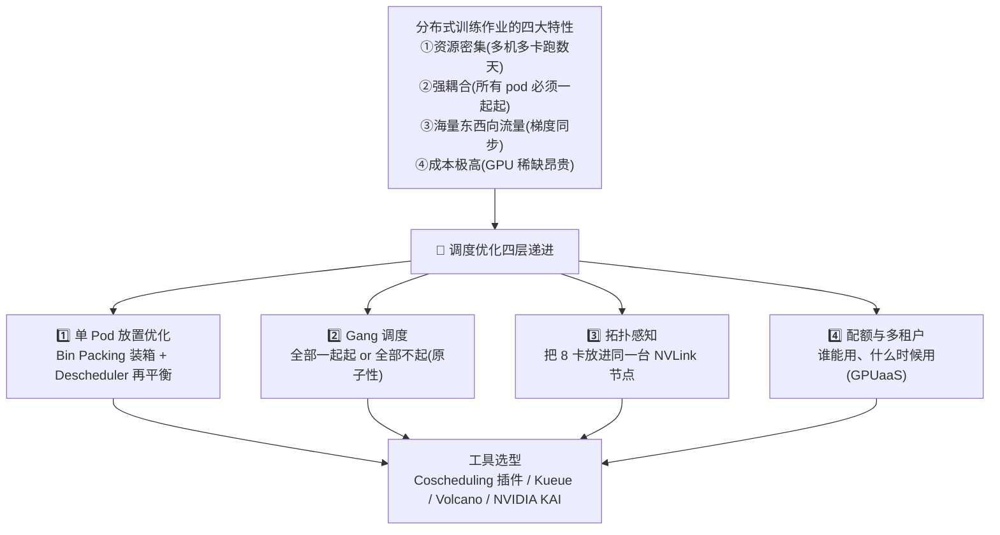
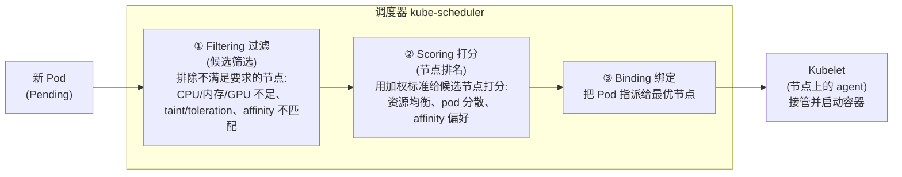
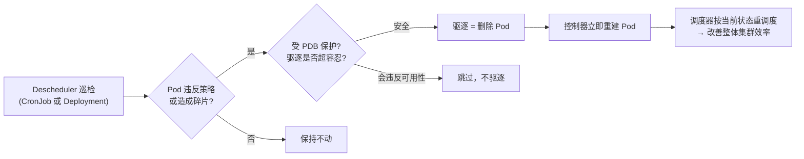
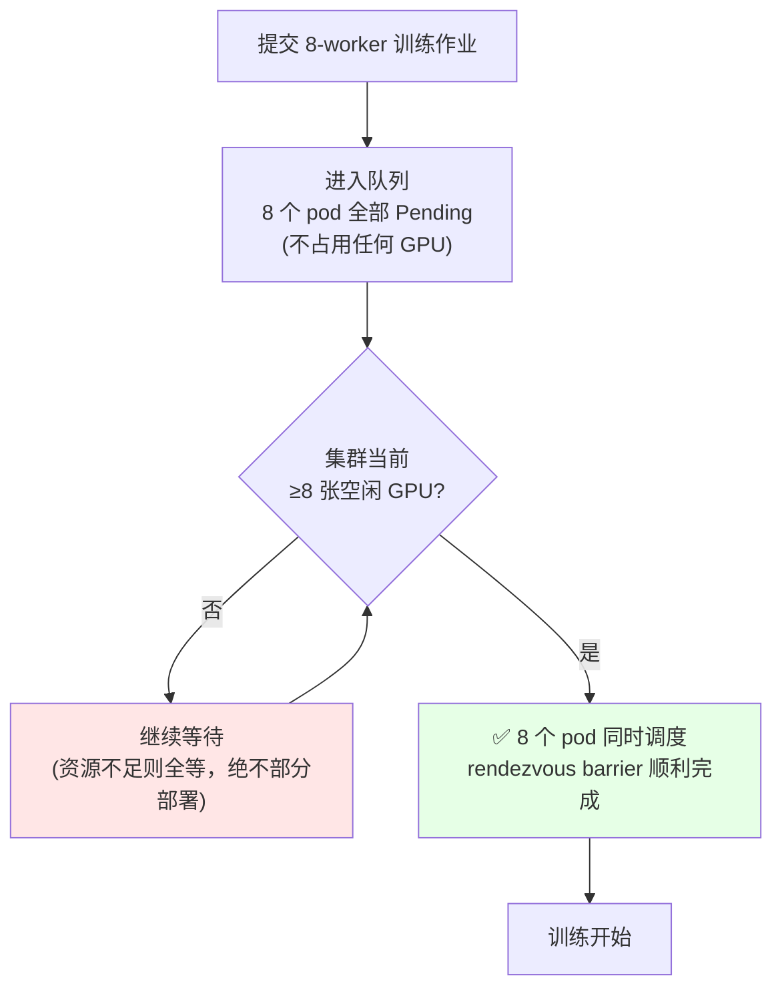
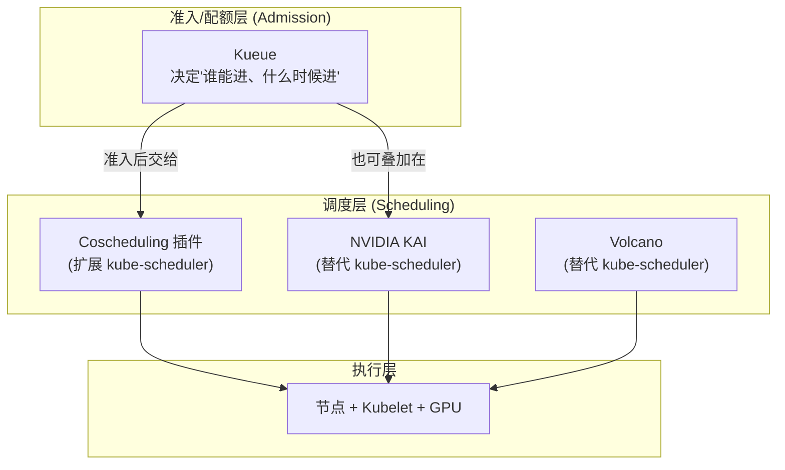
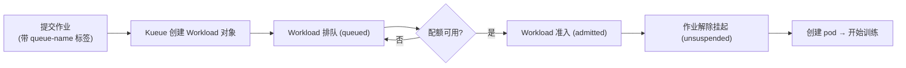
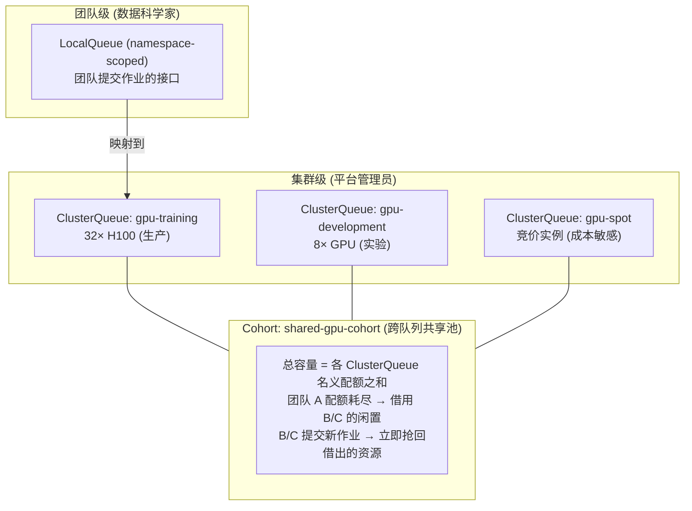
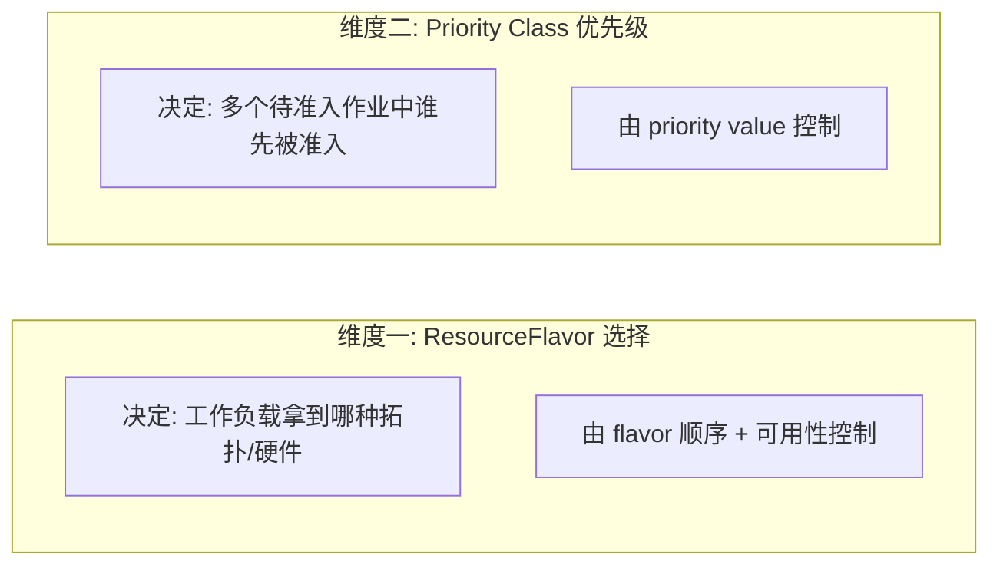

# 第 7 章 作业调度优化 · Job Scheduling Optimization 🎛️

> 对应原书 *Generative AI on Kubernetes*（Roland Huss / Daniele Zonca 著）第 7 章 "Job Scheduling Optimization"，PDF 第 326–409 页。
> 本篇聚焦"**作业调度优化**"这条主线：**Gang 调度 / 队列 / 优先级 / 抢占 / 拓扑感知 / 批作业调度器（Volcano、Kueue、KAI）**。网络优化、存储、安全、可观测性属于本章后半段的运维专题，本篇末尾会给出"🔗延伸"索引，不在此展开。

---

## 🗺️ 本章地图

上一章我们学会了用 Kubeflow Trainer 把一个 LLM 微调作业"跑起来"。但把作业**跑起来**和把成百上千张 GPU 的共享集群**运营好**，是两件完全不同的事。这一章站在**平台管理员（Platform Administrator）**的视角，回答一个核心问题：

> 当多个团队、多个分布式训练作业同时抢占稀缺又昂贵的 GPU 时，调度器要怎么做，才能既**不死锁**、又**高利用率**、还**公平**？



学习路线：

| 小节 | 关键词 | 解决什么问题 |
| --- | --- | --- |
| §7.1 K8s 调度器基础 | filtering / scoring / binding | 默认调度器怎么工作，为什么它对训练作业不够用 |
| §7.2 Bin Packing 装箱 | `MostAllocated` | 把 pod 塞满少数节点，让空节点被 autoscaler 回收省钱 |
| §7.3 Descheduler 再平衡 | 驱逐 + 重调度 | 装箱会随时间"退化"，需要动态纠偏（配 PDB 保护） |
| §7.4 Gang 调度 | 原子性 / rendezvous | 分布式训练"7/8 卡起来了但死锁"的根治方案 |
| §7.5 调度器选型 | Coscheduling / Kueue / Volcano / KAI | 四种 Gang 调度实现的取舍 |
| §7.6 拓扑感知 | NVLink / InfiniBand / NUMA | 保证 8 卡落在互联最快的节点上 |
| §7.7 配额与多租户 | ClusterQueue / cohort / 抢占 | GPU-as-a-Service：借用 + 抢占 + 公平 |

---

## 🧨 7.0 为什么训练作业需要"特殊调度"？—— 第一性原理

> 🔬 **第一性原理**：Kubernetes 的默认调度器是为**无状态微服务**设计的——每个 Pod **独立**调度，彼此**无依赖**，挂了随时重建。而分布式训练作业恰恰相反：它是一个**强耦合的原子整体**，任何一个 worker 缺席，整个作业就在同步屏障（barrier）上**死锁**并**烧钱**。

原书开篇点出，模型定制（微调）类工作负载与传统 K8s 应用有五点根本不同：

| # | 特性（英文） | 含义 | 对调度的冲击 |
| --- | --- | --- | --- |
| 1 | Resource intensive | 多机多卡，跑数天甚至数周 | 长时间占用稀缺硬件 |
| 2 | Strong interdependencies | 所有 pod 必须**一起**被调度（Gang） | 默认"逐 Pod"模型失效 |
| 3 | Massive data over network | 梯度同步产生海量东西向流量 | 网络成为瓶颈，位置很重要 |
| 4 | Considerable cost | 时间 + 资源都极贵 | 利用率必须高，不能浪费 |
| 5 | GPUs are scarce & expensive | GPU 是集群里最稀缺资源 | 需要精细配额 + 公平调度 |

> 💡 **本章的"训练作业（training job）"是个统称**：原书在 NOTE 里明确，本章说的 "training job" 涵盖所有 LLM 定制形式（fine-tuning、LoRA 等），因为它们共享同一套平台需求：Gang 调度、高性能网络、GPU 资源管理、可观测性。传统预测模型（分类/回归/时序）通常小到单卡就能训，不需要本章这套重型基础设施。

---

## 🧩 7.1 Kubernetes 调度器基础：filtering → scoring → binding

要理解怎么"优化"调度，先得知道默认调度器**怎么调度**。K8s 调度器对**每个 Pod 独立**执行一个两阶段决策，之后交给 Kubelet 落地。



**逐阶段讲透**：

| 阶段 | 英文 | 干什么 | 一句话本质 |
| --- | --- | --- | --- |
| ① 过滤 | Filtering / candidate selection | 淘汰**不能满足** Pod 需求的节点 | 硬性资格审查，做减法 |
| ② 打分 | Scoring / node ranking | 给剩下的候选节点**加权打分**排名 | 从合格者里挑"最优"，做排序 |
| ③ 绑定 | Binding | 把 Pod 指派到得分最高的节点 | 拍板，调度阶段结束 |

绑定完成后，调度阶段结束，节点上的 **Kubelet**（每个节点都运行的 agent）接管，按控制平面下发的规格启动容器。

> ⚠️ **关键洞察**：整个流程是"**逐 Pod、独立**"的。调度器**根本不知道**某 8 个 Pod 属于同一个训练作业。这正是后面 Gang 调度要解决的病根。

> 💡 **面试高频**："K8s 调度分几个阶段？" 标准答案：**Filtering（过滤/预选）→ Scoring（打分/优选）→ Binding（绑定）**。K8s 调度器采用**可插拔（pluggable）**架构，上面每一步都可以通过 plugin 框架扩展——这也是 Coscheduling、Volcano、KAI 等方案能存在的技术前提。

---

## 📦 7.2 装箱策略（Bin Packing）：把 Pod 塞满，省钱

### 是什么 & 为什么

默认调度器倾向于把 Pod **分散（spread）**到不同节点，以提升可用性。但 GPU 训练平台常常需要**相反**的做法——**装箱（bin packing）**：把 Pod 紧紧塞进**尽量少**的节点。

> 🔬 **为什么反着来？** 因为 GPU 节点极贵——原书给的数字是**每小时 $10–30**。如果作业稀疏分布，每个节点都"半满"，那么**没有一个节点是空的**，autoscaler 就无法安全地缩容删除任何节点。反之，把作业塞满少数节点，就能腾出**完全空闲**的节点，让 autoscaler 安全地 drain 并删除，直接省钱。

### 怎么用：`MostAllocated` 打分策略

装箱通过调度器的 `NodeResourcesFit` 打分插件实现。核心是把默认的 `LeastAllocated`（谁空就往谁那放 → 分散）换成 `MostAllocated`（谁满就往谁那放 → 集中）。

**Example 7-1. 装箱调度器配置（逐行讲解）**

```yaml
apiVersion: kubescheduler.config.k8s.io/v1
kind: KubeSchedulerConfiguration
profiles:
- schedulerName: binpack-scheduler          # ← ① 自定义调度器名，训练作业引用它即启用装箱
  pluginConfig:
  - name: NodeResourcesFit
    args:
      scoringStrategy:
        type: MostAllocated                  # ← ② 已分配越多的节点得分越高 → 偏向集中(装箱)
        resources:
        - name: nvidia.com/gpu
          weight: 5                          # ← ③ GPU 权重最高(5)，优先按 GPU 装箱
        - name: cpu
          weight: 1
        - name: memory
          weight: 1
```

| 标号 | 配置 | 讲解 |
| --- | --- | --- |
| ① | `schedulerName: binpack-scheduler` | 自定义调度器 profile 名。训练作业在 Pod spec 里写 `schedulerName: binpack-scheduler` 就用这套装箱行为，**不影响**其他工作负载 |
| ② | `type: MostAllocated` | 装箱的灵魂。节点已分配资源越多 → 得分越高 → 偏向把新 Pod 塞到"已经很满"的节点 |
| ③ | `weight: 5`（GPU） | GPU 权重（5）远高于 CPU/内存（各 1），**优先按 GPU 装箱**，因为 GPU 更贵更稀缺 |

### 代价：可用性 vs 成本的权衡

> ⚠️ **常见坑：装箱不是免费的午餐**。原书明确指出装箱的三重代价：
> 1. **单点故障放大**——一个节点挂了会同时影响**更多**训练作业（因为都挤一起）。
> 2. **资源争抢**——即使 GPU 够，CPU/内存/网络也可能成为瓶颈（大家挤在一台机器上抢带宽）。
> 3. 所以**生产训练平台常用多个调度器 profile**：给实验性作业用装箱（省钱、可容忍中断），给关键作业用分散（要韧性）。

> 💡 **实战选型**：装箱**特别适合**"成本敏感 + 可容忍中断"的批量训练——因为这类作业本来就有 **checkpoint/resume（检查点/恢复）**机制兜底，被打断了从检查点续跑即可。

---

## ♻️ 7.3 动态再平衡：Descheduler（重调度器）

### 为什么需要它

装箱只优化了**初始放置**。但集群是活的——作业不断结束、新作业不断到来，速率还各节点不一。**随着时间推移，当初的装箱优化会"退化（degrade）"**，出现资源碎片。

> 🔬 **调度器 vs 重调度器的本质区别**：
> - **Scheduler（调度器）**：**被动**——响应"新 Pod 创建"事件才动作。
> - **Descheduler（重调度器）**：**主动**——持续巡检**已存在**的 Pod，发现违反放置策略或造成碎片的，就**驱逐（evict）**它，触发重新调度。

Descheduler 是**单独安装**的组件，通常部署为：
- **CronJob**：周期性优化（比如只在维护窗口跑）。
- **Deployment**：持续监控（追求极致效率）。

它通过 `DeschedulerPolicy` 自定义资源配置一组**策略插件**来挑选驱逐对象。**驱逐 = 直接删除 Pod**；Pod 的控制器（ReplicaSet / StatefulSet / 或训练作业里的 Kubeflow Trainer）会立即重建它，调度器再按**当前**策略和集群状态重新放置。



### PodDisruptionBudget（PDB）：保护 Gang 作业的护身符

驱逐-重调度循环会**尊重 PodDisruptionBudgets（PDB）**，确保 descheduler 永远不违反可用性约束。这使得 **PDB 成为保护 Gang 调度训练作业免遭过早驱逐的首要机制**。

**Example 7-2. 用 PDB 保护 Gang 调度训练作业（逐行讲解）**

```yaml
apiVersion: policy/v1
kind: PodDisruptionBudget
metadata:
  name: llm-training-pdb
spec:
  # 确保所有 worker 同时保持运行(这是 Gang 调度的硬性要求)
  minAvailable: 4                            # ← 至少 4 个 pod 必须始终可用
  selector:
    matchLabels:
      # 属于同一训练作业的所有 pod
      scheduling.x-k8s.io/pod-group: llm-training-group
```

`minAvailable: 4` 的含义：这个 pod-group 里**至少 4 个 pod 必须始终可用**。如果驱逐某个 pod 会导致可用数跌破 4，descheduler 就**不驱逐**——从而保护整个 Gang 作业不被拆散。

### Descheduler 策略清单（Table 7-1）

| 策略 Strategy | 行为 Behavior | 必须搭配的调度策略（否则驱逐死循环）|
| --- | --- | --- |
| **HighNodeUtilization** | 从**利用率低**的节点驱逐 pod，把工作负载**集中**到更少节点 | 必须搭 `MostAllocated`（装箱）|
| **LowNodeUtilization** | 从**利用率高**（超阈值）的节点驱逐 pod，转移到**低利用率**（低于阈值）节点，实现节点缩容 | 必须搭 `LeastAllocated`（分散）|
| **RemovePodsViolatingNodeAffinity** | 驱逐 node affinity 规则已**不再匹配**当前节点的 pod | 与任意调度器兼容，强制声明式约束 |
| **RemovePodsViolatingInterPodAntiAffinity** | 驱逐违反反亲和规则的 pod，达成预期分散 | 与任意调度器兼容，纠正次优初始放置 |

### 💥 头号大坑：驱逐死循环（Eviction Loop）

> ⚠️ **WARNING（原书原文级警告）**：Descheduler 的策略**必须与调度器的放置策略对齐**，否则系统进入**驱逐死循环**——descheduler 驱逐 pod，调度器立刻又把它放回同一个节点，然后又被驱逐……无限循环。
>
> **对齐铁律**：
> - 用 `HighNodeUtilization` → 调度器必须用 `MostAllocated`（装箱）。
> - 用 `LowNodeUtilization` → 调度器必须用 `LeastAllocated`（分散）。
> - **绝不能同时开启** `HighNodeUtilization` 和 `LowNodeUtilization`——它们目标相反，必然冲突。
> - **靠监控验证**：如果驱逐计数持续上升但节点合并没有进展，八成就是死循环，需要修正策略。

> ⚠️ **再平衡的头号风险 = 作业中断**。驱逐长跑的 LLM 训练 pod，会强制昂贵的 checkpoint-and-resume 循环，可能把训练完成时间拖延**数小时甚至数天**。三大缓解手段：
> 1. **部署频率**——只在维护窗口偶尔跑 descheduler（而非持续跑）。
> 2. **PDB**——保护关键作业不被驱逐。
> 3. **命名空间分区**——排除生产训练命名空间，只优化实验命名空间。
>
> 组织应验证：**优化收益（更好装箱省下的节点成本）> 中断成本（checkpoint 损失的训练时间）**，才值得开启。

---

## 🔗 7.4 Gang 调度（Gang Scheduling / 协同调度 Coscheduling）

### 病根：7/8 卡起来了，然后死锁

前面的装箱和再平衡解决的是"单个 pod 怎么放、怎么维持"。但分布式训练引入了一个**根本不同**的挑战：**必须保证一个多 pod 作业的所有组件作为一个原子单元被一起调度。**

> 🔬 **第一性原理：为什么会死锁？**
> 默认逐 Pod 模型下，调度器可能成功放置 **8 个 worker 中的 7 个**——占住了 7 张 GPU，然后作业**卡死等待**那个因资源耗尽而无法调度的第 8 个 worker。这就是**资源碎片（resource fragmentation）**。
>
> 大规模 LLM 训练需要**全有或全无（all-or-nothing）**，因为：
> - **PyTorch** 用 **rendezvous（汇合）机制**——所有 worker 必须先互相发现、在一个 barrier（屏障）上同步，训练才能开始。
> - **DeepSpeed** 等框架在**每次训练迭代**都建立通信屏障来协调梯度同步。
>
> 只要缺一个 worker，rendezvous barrier 就无法完成，**整个作业死锁**，同时**已调度的 worker 还在烧 GPU 钱**。

### 什么是 Gang 调度

> **Gang 调度（又叫 coscheduling / 协同调度）**：确保属于同一分布式作业的所有 pod **作为单一原子单元一起被调度**——**要么全部同时调度，要么一个都不调度**。

技术实现：用一个**队列（queue）**。pod 保持 **Pending** 状态、**不占用资源**，直到调度器能**保证**集群里有足够资源满足**整个作业**的需求，才一次性全部放下去。



### PyTorch Rendezvous 机制详解

原书拆解了 PyTorch 分布式训练启动时，所有 worker 连到 rendezvous 后端（通常是基于 TCP 的 KV store 或 etcd）做的四件事：

1. **发现**训练作业里所有其他 worker。
2. **达成**完整参与者集合的共识，并分配 rank（0 到 `world_size-1`）。
3. **在 barrier 上同步**——没有 worker 会先行，直到所有 worker 都到齐。
4. **交换**点对点通信的连接信息。

> 这个 rendezvous barrier 是**原子且阻塞**的：放了 7/8，第 8 个因碎片起不来，那 7 个就在 barrier 上**无限等待**——7 张 GPU 被占着**空转**，只烧钱不产出。Gang 调度就是让 8 个 worker 要么同时起、要么都不起，从根上杜绝这种"部分部署导致 rendezvous 死锁"。

> 💡 补充：PyTorch 的**弹性训练**（`torch.distributed.elastic`）能处理动态 worker 集合，但**大多数 LLM 训练用静态配置**——worker 数固定，必须全部到齐。所以 Gang 调度是刚需。

> 💡 **面试高频**：Gang 调度不是 K8s 或分布式训练独有的新问题（HPC 领域早就有），但它对训练作业**影响更大**，就因为 **GPU 的稀缺与昂贵**。K8s 设计成可插拔的，所以有多种项目来解决它——这就引出下一节的选型。

---

## 🧰 7.5 Gang 调度方案选型：Coscheduling / Kueue / KAI / Volcano

四种主流方案，运行在栈的**不同层**，服务不同场景。

### 全景对比（Table 7-2）

| 方案 | 主要目标 | 架构层级 | 社区 | 最适合 |
| --- | --- | --- | --- | --- |
| **Coscheduling 插件**（PodGroup CRD） | 在默认 K8s 调度器里加入 Gang 调度语义 | 调度器**扩展**（用 plugin 框架扩展 kube-scheduler） | Kubernetes SIGs | 需要全有或全无调度的**通用**批作业（训练、Spark） |
| **Kueue** | 作业级资源管理 + 准入控制 | **准入控制器 + 队列管理**（在调度层**之上**） | Kubernetes SIGs | 多租户、需配额管理、优先级队列、资源借用、公平调度 |
| **NVIDIA KAI Scheduler** | 面向 AI/ML 的 GPU 优化调度器 | **替代调度器**（专为 GPU 集群设计） | NVIDIA 生态（源自 run:ai）| 大规模 GPU（数千节点）、动态分配、分层队列、公平 |
| **Volcano** | 带高级作业管理的批调度系统 | **替代调度器**（替换或补充 kube-scheduler） | CNCF sandbox | 原为 HPC 高性能批调度设计；HPC + AI/ML + 高级调度策略 + 共享 + 装箱 |



> 💡 **社区动向（KEP-4671）**：K8s 社区正在做**原生 Gang 调度**——引入一个新的核心 `Workload` 类型，直接在 K8s 调度器里实现"全有或全无"语义。一旦落地，Volcano、KAI 等替代调度器需要更新实现来支持这个标准化的 `Workload` API。届时**基础 Gang 调度**不再需要外部插件或自定义调度器，但现有方案在生产上依然有价值（高级队列管理、GPU 专项优化）。

---

### 7.5.1 Coscheduling 插件（PodGroup CRD）—— 最轻量的入门路径

**是什么**：提供了给**现有 K8s 集群**加 Gang 调度的**最直接路径**——**扩展**默认调度器，无需整个替换。

**怎么装**（三步）：
1. 安装 `scheduler-plugins` 包，在 kube-scheduler 配置里启用 coscheduling 插件。
2. 定义一个 `PodGroup` 对象，代表调度单元。
3. 给同一训练作业的所有 pod 打标签 `scheduling.x-k8s.io/pod-group: <groupId>`，使它们被当作单一调度单元管理。

> 优点：**对非 Gang 工作负载保留原有调度行为**，只在需要的地方加协同调度能力 → **采纳容易，对生产集群冲击小**。

**Example 7-3. PodGroup 配置（逐行讲解）**

```yaml
apiVersion: scheduling.x-k8s.io/v1alpha1
kind: PodGroup
metadata:
  name: llm-training-group
spec:
  minMember: 4                               # ← ① 调度器必须一起调度的最小 pod 数
  scheduleTimeoutSeconds: 300                # ← ② 等待所有 pod 可调度的最长时间
---
apiVersion: v1
kind: Pod
metadata:
  name: llm-training-0                        # ← ③ 第一个工作负载 pod
  labels:
    scheduling.x-k8s.io/pod-group: llm-training-group   # ← ④ 同 group 标签 = 同一原子调度单元
    job-role: leader                          # ← ⑤ 非 PodGroup 设计的一部分，但是好实践
spec:
  ...
```

| 标号 | 字段 | 讲解 |
| --- | --- | --- |
| ① | `minMember: 4` | 必须一起调度的**最小 pod 数**。分布式训练常有 driver + workers，**这个值要把两者都算进去**。因为每个 pod 独立创建，这个值告诉调度器"这个组预期的最小规模" |
| ② | `scheduleTimeoutSeconds: 300` | 等所有 pod 变得可调度的**最长等待时间** |
| ③ | `name: llm-training-0` | 第一个工作负载 pod，其他 pod 沿用相同模式、相同 pod-group 标签 |
| ④ | `scheduling.x-k8s.io/pod-group` | **所有相同 pod-group 标签值的 pod 被当作单一原子调度单元**，同时保留各自独立的部署 spec |
| ⑤ | `job-role: leader` | **不是** PodGroup 设计的一部分，但**最佳实践**——用来标明每个 pod 扮演的角色 |

> ⚠️ **PodGroup 的天花板**：它提供的是**很简单**的抽象，用来把不同 deployment 分组，但**仍是低层抽象**——**无法**管理作业级配额、优先级或任何高级调度策略。要那些能力，就得上 Kueue。

---

### 7.5.2 Kueue —— 作业级准入控制与配额（本章后半段的核心）

**是什么**：Kueue 运行在**比调度器插件更高的抽象层**，提供**作业级准入控制（admission control）**——基于可用配额和队列优先级，决定集群**是否应该准入**某个工作负载。当 Kueue 准入一个作业时，它确保所有所需资源都存在，与底层保证原子调度的 Gang 机制**互补**。

> 🎯 **Kueue 最大价值 = 多租户资源管理**：分层资源配额、基于优先级的排队、团队间资源借用、防止任何单一租户垄断集群的公平策略。**共享训练集群 + 多团队**时首选 Kueue，因为它提供了一个**策略层（谁在什么时候拿资源）**，实现更通用的 **GPU-as-a-Service** 用例。

**集成生态**：Kueue 与 Kubeflow Trainer、RayJob 等无缝集成，是实现训练作业编排的自然选择。

**端到端流程与两种角色（persona）**：
- **平台管理员**：配置全局规则 `ClusterQueue`，并创建 `LocalQueue`。
- **数据科学家**：用 `LocalQueue` 访问分配的配额、提交工作负载。

当你用 `kueue.x-k8s.io/queue-name` 标签提交作业时，Kueue **自动创建**一个 `Workload` 类型的自定义资源来管理准入控制。这个 `Workload` 对象与你实际的作业（TrainJob、Job 等）**分离**，跟踪资源需求和准入状态。



**提交后如何查状态**：

| 步骤 | 命令 | 看什么 |
| --- | --- | --- |
| 1 | `kubectl get workloads -n <ns>` | 作业是**已准入**还是**排队中** |
| 2 | `kubectl get trainjob <name> -n <ns>` | 作业状态——在 Kueue 准入前会**一直 suspended** |
| 3 | 理解整个流 | 提交 → Kueue 建 Workload → 排队 → 配额可用 → 准入 → 解除挂起 → 建 pod |

**Example 7-4. Kueue Workload 对象的状态（逐段讲解）**

```yaml
status:
  conditions:
  - type: Admitted
    status: "True"
    reason: "QuotaReserved"                   # ← 准入成功: "配额已预留"
    message: "The workload is admitted and quota is reserved"
  admission:
    clusterQueue: "ai-training-cluster-queue"
    podSetAssignments:
    - count: 1
      flavors:
        nvidia.com/gpu: gpu-training-flavor   # ← head 分到的 GPU flavor
      name: head
    - count: 1
      flavors:
        nvidia.com/gpu: gpu-training-flavor   # ← worker 分到的 GPU flavor
      name: worker
```

> 💡 状态里的 `reason` 字段是排障利器：准入成功显示 **"QuotaReserved"**，排队中会显示 **"InsufficientQuota"**——一眼看出作业为什么还没跑。

---

### 7.5.3 NVIDIA KAI Scheduler —— GPU 原生优化的替代调度器

**是什么**：run:ai（被 NVIDIA 收购）核心调度引擎的开源版。**只支持 NVIDIA 硬件**，走**集中式管理**路线，聚焦 GPU 感知优化：

- **分数分配（fractional allocation）**——一张卡切给多个作业。
- **时间切片（time slicing）**。
- **分层队列 + 公平策略**。
- 这些再结合 **Gang 调度 + GPU 拓扑感知放置（NVLink 连通性）**，把分布式训练作业**协同定位（co-locate）**。

> KAI 支持 Gang 调度，但通常通过与某个**聚合部署 API**（如 Kubeflow Trainer / PyTorchJob）的**显式集成**来做，而不是靠聚合独立 pod。它是**替代调度器**，主目标是**最小化 GPU 空闲成本**，内建 Kubeflow 集成。

**Example 7-5. KAI Scheduler + Gang 调度（PyTorchJob，逐行讲解）**

```yaml
# 带 GPU 配额的 project
apiVersion: kai.run.ai/v1
kind: Project
metadata:
  name: ml-team-a
spec:
  gpuQuota: 8                                 # ← ① project 级 GPU 配额(共 8 卡)，用于公平分享调度
---
# 带 Gang 调度的分布式训练作业
apiVersion: kubeflow.org/v1
kind: PyTorchJob
metadata:
  name: llm-training
  namespace: ml-team-a
  annotations:
    kai.run.ai/project: ml-team-a             # ← ② 注解把作业绑定到上面的 project 做配额核算
spec:
  pytorchReplicaSpecs:
    master:
      replicas: 1
      template:
        spec:
          schedulerName: kai-scheduler        # ← ③ spec 里指定 KAI，提供 GPU 感知放置 + Gang 调度
  ...
```

| 标号 | 配置 | 讲解 |
| --- | --- | --- |
| ① | `gpuQuota: 8` | project 级 GPU 配额（8 卡），用于公平分享调度 |
| ② | `kai.run.ai/project` 注解 | 把作业绑定到上面定义的 project，做配额核算 |
| ③ | `schedulerName: kai-scheduler` | 必须在 spec 里指定 KAI，才能获得 GPU 感知放置 + Gang 调度 |

> 💡 **NOTE（TrainJob vs PyTorchJob）**：本章示例用 Kubeflow Training Operator 的 `PyTorchJob`（`kubeflow.org/v1`）来演示 K8s 资源层的调度/网络配置。上一章介绍的更高层 `TrainJob` 抽象（`trainer.kubeflow.org/v1alpha1`）**同样适用**这些概念——TrainJob 内部创建 JobSet 工作负载，调度配置（调度器选择、Kueue 标签、网络注解、NCCL 环境变量）写在 `ClusterTrainingRuntime` / `TrainingRuntime` 模板里。这样**平台管理员在运行时模板里配生产优化，数据科学家通过 SDK 专注训练逻辑**。

---

### 7.5.4 Volcano —— 一体化批调度系统

**是什么**：CNCF sandbox 项目，最初由**华为**创建。为 HPC、AI/ML、大数据（如 Apache Spark）提供**全面的批调度系统**，**完全替换 kube-scheduler**，是个**单体（monolithic）**方案。它把**队列管理、Gang 调度、拓扑感知放置**整合在一起。

Volcano 引入三个 CRD：`Queue`、`PodGroup`、`Job`，用来描述和处理高级调度算法，以及用于抢占低优先级作业的 **reclaim（回收）策略**。适合运行复杂批工作流的生产环境，覆盖 TensorFlow、PyTorch、Apache Spark 等主流框架。

> ⚠️ **Volcano 的代价 = 侵入性强**：采纳 Volcano 需要**完全替换**默认 K8s 调度器，比"Kueue 叠加在 kube-scheduler + coscheduling 插件上"**更侵入**。因此它可能**不适用**于已有传统工作负载的现存生产集群。

---

### 7.5.5 如何做正确选择？—— 组合才是王道

> 💡 **实战：现实生产集群常常组合多种方案**。原书推荐的一个常见（且推荐）组合：
> **Kueue（准入控制 + 配额管理） + AI 专用部署 API（PyTorchJob / LeaderWorkerSet）**。
> 例如：**NVIDIA KAI Scheduler 替换默认调度器**提供 GPU 感知优化，**同时仍用 Kueue 层**做准入管理。

**关于 LeaderWorkerSet（LWS）的补充**：

> 💡 LWS 项目可与专用调度器**一起用**，因为它解决**不同的问题**：管理**天然具有 leader-worker 拓扑**的工作负载，而不只是保证原子调度。
> - LWS **假设** Gang 调度语义（组内 pod 全起或全不起），但它的**核心价值**是提供一个**理解 leader-worker 模式**的工作负载 API——leader pod 协调、分发工作给 worker pod，两者必须协同定位或高效联网。这使 LWS 比更通用的 PodGroup API **更专精 AI/ML**。
> - 关键区别：**PyTorchJob 专精分布式训练**，而 **LWS 主目标是分布式推理**——尤其是**多主机推理**（LLM 被切分、跨多节点多设备运行）。这个场景与分布式训练面临**同样的 Gang 调度挑战**。

**决策速查表**：

| 你的处境 | 推荐方案 |
| --- | --- |
| 想保留默认 kube-scheduler、云原生、GPU 厂商无关 | **Kueue**（准入控制 + 配额，与 Kubeflow 无缝集成） |
| GPU 密集（数千卡）、需要分数分配 + 拓扑放置带来可衡量的效率提升 | **NVIDIA KAI Scheduler**（替换调度器换取 GPU 专项优化） |
| 愿意替换 kube-scheduler，换取 Gang 调度 + 配额管理"一体化" | **Volcano** |
| 已有集群、想最小改动地加 Gang 调度 | **Coscheduling 插件**（扩展而非替换） |
| 多团队共享 + 想要 GPU-aware 调度 | **Kueue 叠加在 KAI 之上**（Kueue 管准入配额，KAI 管 GPU 放置） |

> 🔬 **核心设计哲学 = 策略（policy）与机制（mechanism）分离**：
> - **Kueue = 策略层**（谁拿资源、什么时候拿）——准入控制器，与任意底层调度器配合。
> - **调度器（kube-scheduler / KAI / Volcano）= 机制层**（Pod 具体放哪个节点）。
> - 这种分离让你能"给 KAI/Volcano 加一层 Kueue 管准入，同时让专用调度器优化 GPU 放置"——既灵活又强大。

---

## 🌐 7.6 拓扑感知调度（Topology-Aware Scheduling）

### 为什么 Gang 调度还不够

> 🔬 **两种失败模式对比**：
> - **没有 Gang 调度**：可能**部分部署**作业 → 浪费昂贵 GPU（7/8 死锁）。
> - **没有拓扑感知**：把 worker **分散到不同节点** → 被迫用慢几个数量级的网络连接做 GPU 间通信 → 训练时间**剧增**。

**拓扑感知（topology-aware）**指的是 **GPU 之间的物理互联架构**：GPU 是在**单节点内**通过 NVLink/PCIe 连接，还是**跨节点**通过 InfiniBand/RoCE 这类高速 fabric，还是走**标准以太网**。带宽和延迟差异巨大：

| 互联技术 | 范围 | 带宽 | 延迟 |
| --- | --- | --- | --- |
| **NVLink 4.0**（H100 同节点内）| Intra-node GPU↔GPU | 高达 **900 GBps** 双向 | 微秒级 |
| **InfiniBand**（跨节点）| Inter-node RDMA | **200–400 GBps** | 亚微秒级 |
| **标准以太网** | Inter-node TCP/IP | 仅 **10–100 GBps** | 更高 |

> 💡 **TIP：什么是 fabric（网络织物）？** 在网络术语里，fabric 指提供多节点/多设备之间**互联通信路径**的底层网络基础设施。与传统分层网络不同，fabric 提供**网状（mesh）拓扑**——端点之间存在多条路径，实现高带宽低延迟。GPU 计算里的 fabric（如 InfiniBand、NVSwitch）就是让 GPU 高效通信的高速互联基础设施：既可在**单服务器内**（NVSwitch fabric 连 8–16 卡），也可**跨多服务器**（InfiniBand fabric 连数百节点）。

### 拓扑对不同并行策略的敏感度

> **拓扑感知调度 = 在放置决策中考虑硬件拓扑约束**，扩展了 Gang 调度。一个需要 8 卡的作业，若 8 卡全在**同一台 8 卡 NVLink 节点**上，会比分散到 8 台**单卡节点走以太网**快得多。

原书专门用一个 sidebar 讲**分布式训练的通信模式**，不同并行策略敏感度天差地别：

| 并行策略 | 通信模式 | 每次迭代传输量 | 对网络的敏感度 |
| --- | --- | --- | --- |
| **数据并行 Data Parallelism** | 每卡复制完整模型，每步后同步梯度 | LLM 数十亿参数 → 每次迭代传输数十 GB 梯度 | 需要高效梯度同步（较不敏感）|
| **张量并行 Tensor Parallelism** | 把单个层切到多卡，前/后向传播都要传激活值 | 每次矩阵乘的激活张量跨卡传递 | **对延迟极敏感**（细粒度通信）|
| **FSDP（全分片数据并行）** | 参数/梯度/优化器状态分片到所有卡，即时 all-gather 后丢弃 | 频繁 all-gather + reduce-scatter | **对带宽和延迟都极敏感** |

> ⚠️ **关键权衡**：因为拓扑对性能影响巨大，平台管理员必须**平衡拓扑感知与资源利用率**。一个作业**可能一直排队**，即使集群总 GPU 容量够——只因为这些 GPU **不在偏好的拓扑里**。这是**故意的**：避免调度出带巨大瓶颈的作业。

### 拓扑感知方案对比（Table 7-3）

| 方案 | 拓扑感知能力 | 实现方式 | 最适合 |
| --- | --- | --- | --- |
| **Coscheduling 插件** | **无原生拓扑感知** | 靠默认 K8s 节点标签 + pod affinity/anti-affinity 提供基础放置提示 | 简单拓扑、手动打标签够用；复杂场景需配合其他方案 |
| **Kueue** | 基于 **ResourceFlavor** 的拓扑感知 | 用节点标签 + tolerations 按拓扑特征（NVLink、InfiniBand、机架）定义 GPU "flavor" | 多层 GPU 拓扑，需要把工作负载路由到特定互联类型/故障域 |
| **NVIDIA KAI** | GPU 拓扑感知放置**集成到 Gang 调度里** | 原生理解 NVLink 连通性、NVSwitch fabric、InfiniBand 拓扑 | GPU 密集集群，互联拓扑直接影响训练性能 |
| **Volcano** | 内建拓扑插件 | 拓扑感知插件理解 GPU 和网络拓扑，按作业需求自动优化放置 | 复杂 HPC 式异构互联（NVLink + InfiniBand + Ethernet）|

### Kueue 的 ResourceFlavor 实战（Example 7-6/7/8）

Kueue 通过 `ResourceFlavor` 机制做拓扑感知——把 GPU 资源按拓扑特征定义成多种"口味"。概念基于**节点标签**（管理员手工配，或用 NVIDIA GPU Feature Discovery 自动化）。

**Example 7-6. 定义两种 ResourceFlavor（高端 vs 标准）**

```yaml
# 高端 GPU 节点: NVLink + InfiniBand
apiVersion: kueue.x-k8s.io/v1beta1
kind: ResourceFlavor
metadata:
  name: gpu-nvlink-infiniband
spec:
  nodeLabels:
    gpu-interconnect: nvlink                  # 选 GPU 通过 NVLink 连接的节点
    network-fabric: infiniband                # 选节点间走 InfiniBand 的节点
    gpu-type: nvidia-h100
---
# 标准 GPU 节点: PCIe + 以太网
apiVersion: kueue.x-k8s.io/v1beta1
kind: ResourceFlavor
metadata:
  name: gpu-standard-ethernet
spec:
  nodeLabels:
    gpu-interconnect: pcie
    network-fabric: ethernet
    gpu-type: nvidia-h100
```

**Example 7-7. ClusterQueue + LocalQueue（带 flavor 回退）**

```yaml
apiVersion: kueue.x-k8s.io/v1beta1
kind: ClusterQueue
metadata:
  name: topology-aware-cluster-queue
spec:
  namespaceSelector: {}
  resourceGroups:
  - coveredResources: ["cpu", "memory", "nvidia.com/gpu"]
    flavors:
    - name: gpu-nvlink-infiniband             # ← 高端 flavor 列在前，Kueue 优先尝试
      resources:
      - name: nvidia.com/gpu
        nominalQuota: 16
    - name: gpu-standard-ethernet             # ← 高端配额耗尽后，回退到这个标准 flavor
      resources:
      - name: nvidia.com/gpu
        nominalQuota: 32
  flavorFungibility:
    whenCanBorrow: TryNextFlavor              # ← 即使能借用，也先试下一个 flavor(偏好名义配额)
    whenCanPreempt: Preempt
---
apiVersion: kueue.x-k8s.io/v1beta1
kind: LocalQueue
metadata:
  name: team-queue
spec:
  clusterQueue: topology-aware-cluster-queue
```

**Example 7-8. PyTorchJob 集成 Kueue（一行标签接入）**

```yaml
apiVersion: kubeflow.org/v1
kind: PyTorchJob
metadata:
  name: llm-training
  labels:
    kueue.x-k8s.io/queue-name: team-queue     # ← 这行标签触发 Kueue 准入控制器，绑定到指定队列
spec:
  ...
```

> 🔬 **本质**：`flavor` 的**列表顺序 = 偏好顺序**——高端拓扑在前，标准拓扑作回退。Kueue 选定 flavor 后，会**把该 flavor 的 nodeLabels 注入为 node selector**，确保 pod 只调度到拓扑合适的节点上。这就是"应用无感知、Kueue 在准入层搞定拓扑感知"的机制。

### 节点内拓扑：Kubernetes Topology Manager（NUMA 对齐）

调度器管的是**跨节点**放置，但**节点内部**的 CPU 与设备局部性也影响性能。K8s 用 **Topology Manager** 组件（Kubelet 的一部分）解决这个。

> 🔬 **NUMA 问题**：现代多路服务器采用 **NUMA（非统一内存访问）**架构——每个 CPU socket 有自己的本地内存，访问**别的 socket** 的内存延迟更高。在 Topology Manager 出现前，K8s 的 CPU Manager 和 Device Manager **各自独立**做分配，可能把一个 socket 的 CPU 和**另一个** socket 的 GPU 分给同一个 pod，**强制跨 NUMA 内存流量**，严重降速。

Topology Manager 让 CPU 和设备（含 GPU）**拓扑感知**，确保分给同一 pod 的 CPU 和 GPU 是 **NUMA-local** 的。三种策略：

| 策略 | 行为 | 权衡 |
| --- | --- | --- |
| `best-effort` | **尝试** NUMA 对齐，但不强制 | 最灵活，但不保证 |
| `restricted` | 只在资源能正确对齐时**才准入** pod | 中等 |
| `single-numa-node` | 要求 pod 所有资源来自**单个 NUMA 节点** | **最严**，保证最优局部性，但资源紧张时降低调度灵活性 |

### 拓扑感知的正确选择

> 💡 **推荐架构 = Kueue 准入 + 拓扑感知调度器（Volcano/KAI）分层**：
> - **Kueue** 在**作业级准入层**通过 ResourceFlavor 做拓扑选择（"请求高端互联的作业必须有对应配额"）。
> - **底层调度器**（Volcano/KAI）做**详细的拓扑优化 pod 放置**。
> - 这种**关注点分离**让管理员在准入层强制拓扑策略，把放置优化委托给有深度拓扑理解的专用调度器。
> - 各 GPU 厂商提供工具简化打标签（rack ID、fabric 类型、互联能力），其中 **NVIDIA 套件最先进全面**。

---

## 🏦 7.7 配额管理与多租户：GPU as a Service（GPUaaS）

### 传统 K8s 配额为什么不够用

前面解决了"作业**怎么**执行"，但没解决"**谁**能用 GPU"。运营共享 GPU 集群作为多租户平台，需要精细配额管理——这是**标准 K8s ResourceQuota 无法胜任**的。

> 🔬 **传统 ResourceQuota 的死穴**：它在**命名空间**级别用**硬性上限**——配额耗尽就阻止作业启动。这对**固定且稀缺**的资源导致**极差的 GPU 利用率**：
> - 团队 A 有闲置配额（数据科学家没在跑实验），
> - 团队 B 的作业**无限排队**（明明有紧急训练截止日），
> - **昂贵的 GPU 就那么空着**——只因为配额边界阻止了动态共享。

### GPUaaS 的解法：分层配额 + 借用 + 抢占 + 公平

> **GPU as a Service（GPUaaS）**架构用**分层配额管理**解决——加上**借用（borrowing）、抢占（preemption）、公平（fairness）**策略，让团队在集群有余量时**突破**其保证额度，同时确保供不应求时**没有团队能垄断**资源。核心目标：**用机会主义方式最大化 GPU 使用率，同时在被索要时保证设计的配额。**

### 三方案对比（Table 7-4）

| 方案 | 配额管理能力 | 多租户方式 | 实现方式 |
| --- | --- | --- | --- |
| **Kueue** | 分层配额 + 借用 + 抢占 | 命名空间级 LocalQueue 映射到集群级 ClusterQueue；基于 cohort 的跨团队共享；优先级类 | 准入控制器 + ClusterQueue/LocalQueue 模型 + cohort 借用 + 优先级抢占 |
| **NVIDIA KAI** | 基于 project 的 GPU 配额 + 公平算法 | Project CRD 隔离团队（专属 GPU 配额）；分层队列建模部门/团队；公平分享防垄断 | 集成调度器 + Project CRD 做配额分配 + 公平调度 + GPU 专项优化 |
| **Volcano** | 基于队列的配额 + 按比例分配 | 多队列独立资源上限；队列级优先级；命名空间映射到队列做隔离 | Queue CRD + 资源上限 + 权重比例分享 + reclaim 抢占策略 |

### Kueue 两层架构详解

Kueue 实现**两层架构**，把**集群级资源治理**与**团队级队列管理**分离：



- **ClusterQueue（集群级）**：定义资源池的配额上限（CPU/内存/GPU）+ 多团队竞争时的分配策略。每个 ClusterQueue 指定：
  - **nominal quota（名义配额）**——保证可用的资源。
  - **borrowing limit（借用上限）**——空闲时可临时从其他队列借的最大量。
- **LocalQueue（团队级）**：团队提交作业的**面向接口**，映射到特定 ClusterQueue，命名空间内提交，自动配额执行。
- **Cohort（队列组）**：实现资源借用的关键。把多个 ClusterQueue 分组，**总容量 = 各队列名义配额之和**。团队 A 配额耗尽时借 B/C 的闲置，**B/C 一提交新作业就立即抢回**。

**Example 7-9. Kueue 配额管理（cohort + 优先级类，逐段讲解）**

```yaml
apiVersion: kueue.x-k8s.io/v1beta1
kind: ClusterQueue
metadata:
  name: team-a-queue
spec:
  cohort: shared-gpu-cohort                   # ← ① 多个 ClusterQueue 属同一 cohort，实现跨团队借用
  resourceGroups:
  - coveredResources: ["cpu", "memory", "nvidia.com/gpu"]
    flavors:
    - name: default-flavor
      resources:
      - name: nvidia.com/gpu
        nominalQuota: 10                       # 名义配额: 保证 10 卡
        borrowingLimit: 22                     # 借用上限: 最多再借 22 卡
  queueingStrategy: BestEffortFIFO            # ← ② 先到先服务 + 尽力高效装箱
  preemption:
    reclaimWithinCohort: Any                  # ← ③ 任意团队可抢回借出的资源(要回名义配额时)
    withinClusterQueue: LowerPriority         # ← ④ 同队列内高优先级可抢占低优先级
---
apiVersion: kueue.x-k8s.io/v1beta1
kind: WorkloadPriorityClass
metadata:
  name: production-priority
spec:
  value: 10000                                # ← 高数值 = 高优先级
  description: "High priority for production training jobs"
---
apiVersion: kubeflow.org/v1
kind: PyTorchJob
metadata:
  name: production-llm-training
  namespace: team-a
  labels:
    kueue.x-k8s.io/queue-name: team-a-training-queue
    kueue.x-k8s.io/priority-class: production-priority   # ← ⑤ 生产作业用高优先级，可抢占实验作业
```

| 标号 | 配置 | 讲解 |
| --- | --- | --- |
| ① | `cohort: shared-gpu-cohort` | 多个 ClusterQueue 属于同一 cohort，实现**跨团队资源借用**。总容量 = 属于此 cohort 的各 ClusterQueue 配额之和 |
| ② | `BestEffortFIFO` | 按**先进先出**处理，同时尽力高效装箱。有配额时按提交顺序准入 |
| ③ | `reclaimWithinCohort: Any` | 允许**任意团队**在需要拿回名义配额时，抢占被借出的资源 |
| ④ | `withinClusterQueue: LowerPriority` | 同一 ClusterQueue 内，**高优先级**可在配额耗尽时抢占**低优先级** |
| ⑤ | `priority-class: production-priority` | 这个生产作业用高优先级 → Kueue 会在实验作业**之前**准入它，必要时**抢占**它们 |

> 💡 **TIP：Kueue 的公平算法（fair-share）** 考虑每个团队的**历史资源消耗**和当前队列深度，**优先照顾近期消耗更少、或等待更久**的团队。它平衡**公平**（所有团队都有机会）与**效率**（偏好准入能有效利用资源的大作业）。优先级类让紧急生产作业抢占低优先级实验作业，实现 SLA——某些团队/作业类型在高峰期获得优先访问，其他时段仍共享容量。

### 深挖：ResourceFlavor 选择 vs 优先级类（两个正交维度）

原书用一个 sidebar 特别澄清了这两个**极易混淆**的概念——它们服务**完全不同**的目的：



**Kueue 按 flavor 列表顺序求值的完整流程**：

1. **首次尝试**：试列表里第一个 flavor（如 `gpu-nvlink-infiniband`）。名义配额够就准入到这个 flavor。
2. **自动回退**：第一个 flavor 配额耗尽 → 自动试下一个（如 `gpu-standard-ethernet`）。
3. **借用行为**（由 `flavorFungibility.whenCanBorrow` 控制）：
   - `MayStopSearch`（默认）：当前 flavor 能借用就用它（停止搜索其他 flavor）。
   - `TryNextFlavor`：即使当前能借用，也**继续**评估下一个 flavor——**偏好名义配额而非借来的资源**。
4. **注入 node selector**：一旦选定 flavor，Kueue 把该 flavor 的 nodeLabels 注入为 node selector，确保 pod 只调度到拓扑合适的节点。

**优先级（Priority）如何决定准入顺序**：
- **高优先级**：配额可用时**先准入**。
- **抢占**：高优先级作业可**驱逐**运行中的低优先级作业，回收配额。
- **同优先级**：同级内 **FIFO**。
- **公平分享**：基于历史资源使用排序，给消耗较少的队列优先，确保繁忙集群里低使用团队也能推进。

> ⚠️ **常见坑（面试高频）**：ResourceFlavor 选的是"**拿什么硬件**（拓扑）"，Priority 选的是"**谁先拿**（顺序）"。二者**正交、不可混为一谈**。一个作业可以"用高端 flavor + 低优先级"，也可以"用标准 flavor + 高优先级"——两个旋钮独立。

### 三方案的最终选择

| 你的处境 | 推荐 |
| --- | --- |
| 云原生、偏好保留默认 kube-scheduler、GPU 厂商无关、与 Kubeflow 集成 | **Kueue**（久经考验的准入控制，策略/机制清晰分离） |
| GPU 密集（数千卡）、分数分配 + 拓扑放置带来可衡量效率 | **NVIDIA KAI**（值得替换调度器） |
| 愿意替换 kube-scheduler，换取 Gang 调度 + 配额一体化 | **Volcano** |
| 想兼顾灵活性 | **Kueue 叠加在选定调度器之上**（Kueue 管准入，调度器管 GPU 放置） |

---

## 🧭 7.8 全景决策流程图：一个训练作业的完整调度旅程

把四层调度优化串成一张图，作为本章的"总回顾"：

```mermaid
flowchart TD
    START["数据科学家提交<br/>8-worker LLM 训练作业<br/>(带 queue-name + priority-class 标签)"] --> KUEUE

    KUEUE["① Kueue 准入控制<br/>创建 Workload 对象"] --> Q1{"② 配额检查<br/>名义配额够? 能借用?"}
    Q1 -->|不够且不能借| WAIT1["排队 (InsufficientQuota)<br/>作业保持 suspended"]
    WAIT1 --> Q1
    Q1 -->|够/可借| PRIO{"③ 优先级 & 公平<br/>该我先被准入吗?"}
    PRIO -->|更高优先级作业插队| PREEMPT["可抢占低优先级借用者"]
    PRIO -->|轮到我| FLAVOR["④ ResourceFlavor 选择<br/>高端(NVLink+IB)→标准(以太网)<br/>注入 nodeLabels 为 node selector"]

    FLAVOR --> GANG["⑤ Gang 调度<br/>(Coscheduling/Volcano/KAI)<br/>8 个 pod 全 Pending 排队"]
    GANG --> TOPO{"⑥ 拓扑感知放置<br/>8 卡能否落进同一 NVLink 节点?"}
    TOPO -->|能| PLACE["✅ 8 pod 同时绑定<br/>NUMA 对齐(Topology Manager)"]
    TOPO -->|不能(要跨节点走以太网)| WAIT2["继续排队<br/>避免调度出带瓶颈的作业"]
    WAIT2 --> TOPO
    PLACE --> RENDEZ["rendezvous barrier 顺利完成<br/>训练开始"]

    RENDEZ --> RUN["长跑训练 (数天~数周)<br/>PDB 保护免遭 descheduler 驱逐"]

    style WAIT1 fill:#ffe6e6
    style WAIT2 fill:#ffe6e6
    style PLACE fill:#e6ffe6
    style RENDEZ fill:#e6ffe6
```

---

## 📌 小结

本章站在**平台管理员**视角，把"在共享 GPU 集群上高效、公平地跑分布式训练作业"这个大问题，拆成了**四层递进**的调度优化：

1. **单 Pod 放置优化**
   - **Bin Packing（装箱）**：用 `MostAllocated` 把 pod 塞满少数节点，腾空节点让 autoscaler 回收，省下 $10–30/小时的 GPU 成本。代价是单点故障放大 + 资源争抢。
   - **Descheduler（再平衡）**：装箱会随时间退化，用驱逐-重调度动态纠偏。头号坑是**驱逐死循环**（策略必须对齐：High↔MostAllocated、Low↔LeastAllocated，绝不同开）；靠 **PDB** 保护 Gang 作业。

2. **Gang 调度（协同调度）**——本章的灵魂
   - 病根：默认逐 Pod 模型下"7/8 卡起来但死锁"（PyTorch rendezvous barrier / DeepSpeed 通信屏障）。
   - 解法：**全有或全无**——所有 pod 在队列里保持 Pending 不占资源，直到能保证整组资源，才一次性全放。
   - 四种实现：**Coscheduling 插件**（最轻量，扩展 kube-scheduler，但只能分组无高级策略）、**Kueue**（准入控制+配额，最推荐的多租户策略层）、**NVIDIA KAI**（GPU 原生优化的替代调度器）、**Volcano**（一体化批调度，但需完全替换 kube-scheduler）。

3. **拓扑感知调度**
   - Gang 保证"一起起"，拓扑保证"起在对的地方"——8 卡进同一 NVLink 节点（900 GBps）远胜分散走以太网（10–100 GBps）。
   - 张量并行、FSDP 对延迟/带宽**极敏感**；作业宁可排队也不接受坏拓扑。
   - Kueue 用 **ResourceFlavor**（准入层）、KAI/Volcano 集成到调度决策；节点内用 **Topology Manager** 做 NUMA 对齐。

4. **配额与多租户（GPUaaS）**
   - 传统 ResourceQuota 硬上限 → GPU 空转。GPUaaS 用**分层配额 + 借用 + 抢占 + 公平**。
   - Kueue 两层架构：**ClusterQueue**（集群级治理，名义配额 + 借用上限）+ **LocalQueue**（团队接口）+ **Cohort**（跨队列共享池，借出资源可被抢回）。
   - **正交两维**：ResourceFlavor 决定"拿什么硬件"，Priority 决定"谁先拿"——切勿混淆。

> 🎯 **一句话记住整章**：**策略与机制分离**——用 **Kueue** 当策略层（谁在什么时候拿多少），用 **调度器**（kube-scheduler + Coscheduling / KAI / Volcano）当机制层（Gang 一起起 + 拓扑放对地方）。生产上最常见的组合就是 **Kueue（准入配额）+ 专用调度器（GPU 放置）+ PyTorchJob/LWS（部署 API）**。

---

## 🔗 延伸

**本章后半段（原书 pp. 374–407，属运维专题，本篇未展开）**：

| 专题 | 一句话 | 关键点 |
| --- | --- | --- |
| **网络优化**（pp. 373–393）| 分布式训练是**东西向流量怪兽**，梯度同步动辄数百 Gbps | all-reduce/all-gather/broadcast 集合通信；NVLink/NVSwitch（节点内）↔ InfiniBand/RoCE/以太网（跨节点）；**GPUDirect RDMA** 降延迟 40–60%；用 **Multus + NAD** 挂 InfiniBand 二级网络（`rdma/hca` + `IPC_LOCK`）；调 **NCCL** 拓扑文件 |
| **Slurm 与 Slinky**（pp. 394–395）| HPC 世界的 Slurm 与 K8s 的融合 | AI 训练日益像 HPC 批作业，两个生态互相学习 |
| **存储**（pp. 395–398）| checkpoint/resume 的生存线 | 需要 **RWX** 共享存储（多 worker 跨节点访问共享状态）；NFS / CephFS / 对象存储（S3/GCS）组合；容量估算经验公式 **2 × base_model_size + checkpoint_overhead** |
| **安全**（pp. 399–403）| Ray 与 PyTorch 分布式**默认零鉴权** | "谁能连上就能执行任意代码"；默认不加密、接受任意来源连接 → 靠 **NetworkPolicy** 做网络隔离（PyTorch 无内建 TLS，网络隔离是唯一有效控制）|
| **可观测性**（pp. 404–407）| 长跑作业（数小时~数周）需三维观测 | 应用级训练指标（loss/收敛，TensorBoard/MLflow/W&B）+ 作业级（pod 状态/replica）+ 基础设施级（GPU 利用率）；**结构化日志**（JSON，含 `job_name/worker_rank/step_number` 等）+ Fluent Bit/Fluentd；只看 rank-0 日志 |

**外部资料**：
- Kubernetes Scheduler Framework 官方文档（filtering/scoring/binding、plugin 机制）
- `scheduler-plugins` 项目（Coscheduling / PodGroup CRD）—— Kubernetes SIGs
- **Kueue** 官方文档（ClusterQueue / LocalQueue / Cohort / ResourceFlavor / WorkloadPriorityClass）
- **Volcano** 官方文档（Queue / PodGroup / Job CRD，CNCF sandbox）
- **NVIDIA KAI Scheduler**（源自 run:ai，GPU 分数分配 / MIG / 拓扑感知）
- **Kubernetes Descheduler** 项目（DeschedulerPolicy、各驱逐策略）
- **KEP-4671**：Kubernetes 原生 Gang 调度提案（新的核心 `Workload` 类型）
- Kubernetes **Topology Manager**（NUMA 对齐，`single-numa-node` 等策略）
- **LeaderWorkerSet（LWS）** 项目（多主机推理的 leader-worker 拓扑）

**上下游章节**：
- ⬅️ **上一章**：模型定制（Kubeflow Trainer、分布式微调作业）—— 本章优化的对象就是它产出的训练作业。
- ➡️ **下一部分（Part IV）**：AI-Driven Apps —— 从"训练/服务单模型"转向"编排 LLM + 向量数据库 + 工具调用 + Agentic 工作流"的完整 AI 应用（含 RAG）。
