# 第 8 章 🤖 AI 驱动的应用（AI-Driven Applications）

> 逐章精讲 ·《Generative AI on Kubernetes》（Roland Huss & Daniele Zonca 著）
> 对应原书 pp. 410–473
> 本章主题：**从"部署单个模型"跃迁到"架构完整的 AI 应用"** —— RAG / 推理应用的编排（Orchestration）、网关（Gateway）、缓存与状态（State/Cache）、多模型路由（Multi-model Routing），以及 Agentic 工作流在 Kubernetes 上的落地。

---

## 🗺️ 本章地图

前面几章我们学会了在 Kubernetes 上部署 vLLM 这类模型服务器、打包模型数据、把推理规模化。但**一个模型服务本身"够不着"数据库，也不会自己去调工具**——它只负责"生成"和"推理"。真正的产品是把 LLM 包在一层"应用逻辑"里：应用去取业务上下文、调内部系统、写状态，LLM 只是众多组件中的**一个**。本章就讲这层"应用架构"怎么设计、怎么映射到 K8s 原语。

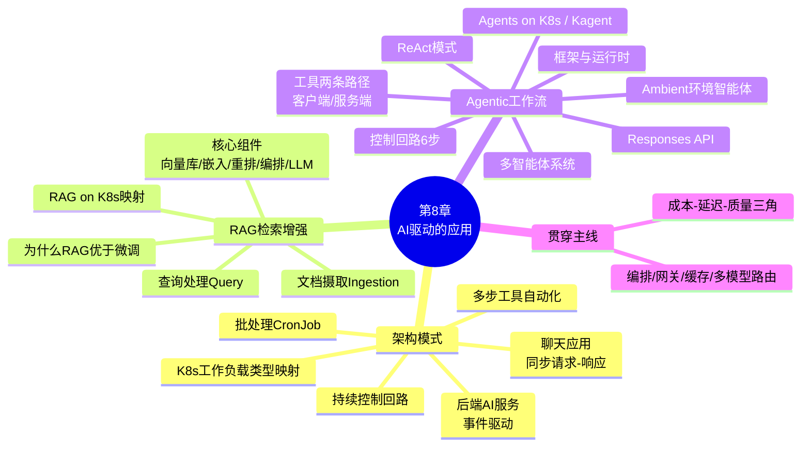

一句话主线：**"应用做主，LLM 打工"**（The application is in charge and uses the LLM）。你会看到：什么时候用检索（retrieval）来"接地气"（grounding）、什么时候编排工具调用（tool calls）、如何跨轮次维护状态（state）而不失控于成本、延迟、质量这三个维度。

---

## 8.1 🏗️ 架构模式（Architectural Patterns）

### 8.1.1 先复习：Kubernetes 工作负载类型与 AI 角色的映射

在讲 AI 应用架构前，先把最重要的 K8s 工作负载原语（workload primitives）和 AI 应用里的角色对上号。**把每个职责映射到正确的 K8s 原语，才能让各组件"生命周期解耦、发布节奏各走各的"**（decoupled lifecycles and release cadences）。

> 🔬 **第一性原理：为什么要解耦？**
> LLM 推理服务器通常要吃 GPU、更新缓慢（换模型才动）；而应用逻辑（prompt、工具集成）几乎天天在变。如果把两者塞进一个进程，你每改一句 prompt 就得重启一个占着 GPU、加载着几十 GB 权重的巨无霸——这是灾难。**分开部署 = 各自独立扩缩容、独立升级、互不干扰**，这正是微服务最佳实践（microservice best practices）应用到 LLM 时代的体现。

| K8s 原语 | 用途（Stateless/Stateful/Batch） | AI 应用里的角色 | 对应 K8s Patterns |
|---|---|---|---|
| **Deployment** | 无状态、常驻运行 | AI Orchestrator（编排器）、LLM 推理服务器（常带 GPU 请求）；两者可**独立扩缩容** | Declarative Deployment |
| **StatefulSet** | 有状态、需稳定身份/持久存储 | 数据库、缓存、向量库（vector store，存 embedding 和上下文）；重启后数据不丢 | Stateful Service |
| **Job / CronJob** | 一次性 / 定时任务 | 离线摄取（offline ingestion）、报表生成、周期维护；跑完即释放资源 | Batch Job / Periodic Job |
| **Ingress / Gateway** | 集群入口 | 把外部客户端请求路由到对应服务；AI 感知路由见"LLM-Aware Routing" | Service Discovery |

> 💡 **实战要点（网关/多模型路由的第一处伏笔）**
> 原书 NOTE 强调：**LLM 服务不一定跑在同一个集群**——它可以在另一个集群，或干脆用托管云服务（OpenAI、Anthropic、Google Vertex AI）。这种解耦在生产中非常常见（因为 GPU 稀缺）。关键武器是 **AI 网关（AI Gateway，第 4 章）**：它给自托管模型和云端模型提供**统一接口**，让你**不改应用代码就能在它们之间切换**。这就是"多模型路由"的骨架——应用只认网关这一个地址，网关背后接谁由它决定。

分清这些工作负载类型，本质上是在系统里**画出生命周期边界（lifecycle boundaries）**：

- 无状态逻辑（Deployment）→ 可独立更新和扩缩
- 有状态数据（StatefulSet）→ 保持连续性
- 临时/定时工作（Job）→ **只在需要时才产生成本**

这些边界还暗示了不同的 **SLA 和成本画像**：会话 API 需要低延迟高可用，而夜间汇总 Job 可以慢悠悠地跑。

---

### 8.1.2 聊天应用（Chat Applications）—— 同步请求-响应

最流行的 AI 应用类别，就是 ChatGPT 这样"面向 UI 的聊天应用"。用户对着 Web/移动端 UI 说话，UI 调一个"会话后端"（conversational backend），后端**编排整个流程**：

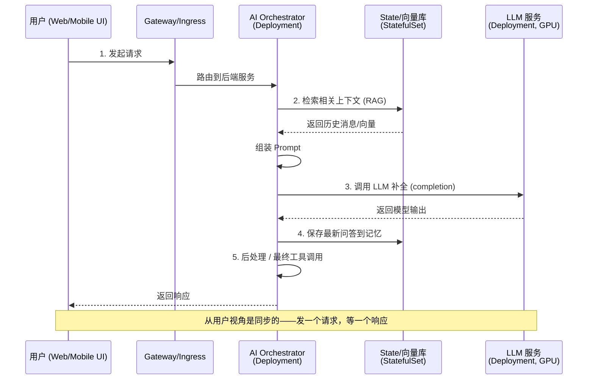

一次典型用户查询的时序（括号里是 K8s 工作负载类型）：

1. **Gateway/Ingress** 把用户请求路由到后端服务。
2. **AI Orchestrator（Deployment）** 收到请求，控制聊天逻辑：检索相关上下文（做 RAG）、组装 prompt、调 LLM 拿补全。如果是 agentic 工作流，它还会**根据 LLM 输出去调工具**，在一个循环里发起多次 LLM 调用。这个组件就是聊天应用的**"大脑"**——常用 LangChain 之类框架在其代码内管理 prompt、记忆、工具。
3. **LLM 服务（Deployment）** 做推理返回输出。编排器调的是这个内部服务（也可能是 OpenAI 这样的外部 API）。**把 LLM 隔离成独立服务，就能独立于应用逻辑去扩缩容或更新模型**。管理员通常用 GPU 节点部署它并配自动扩缩容应对波动负载。
4. **State 管理（StatefulSet + PersistentVolume）** 提供会话记忆或检索索引：可以是 Redis/Postgres 存聊天历史，或向量库存 embedding。编排器读取历史消息或向量放进上下文（"检索"），LLM 回答后再把最新问答存回去。
5. **返回客户端**，可能带后处理或最终工具调用。

> ⚠️ **常见坑：整条链是"单次同步请求周期"，低延迟是第一优先级**
> 为满足 SLO（比如亚秒级或几秒级响应），K8s 里要**让 orchestrator 和 LLM 的 pod 一直运行、随时就绪**。可以用自动扩缩容应对突发，但**绝不能为每个请求从零冷启动一个 pod**——加载几十 GB 权重的启动时间会毁掉延迟。这就是"预热 pod（pre-warmed）"策略。

聊天架构的两大好处：

- **安全设置更简单**：面向用户的架构容易参与 OAuth2 这种涉及浏览器重定向到认证服务器的分布式认证流程。
- **关注点分离（separation of concerns）**：会话逻辑（prompt、工具集成变得频繁）与 LLM 模型服务（换模型才变）**解耦**，数据库当作很少变的外部依赖。每块都能独立升级、按用量独立扩缩。

---

### 8.1.3 后端 AI 服务（Backend AI Services）—— 事件驱动

第二种模式：LLM 驱动的服务作为**更大系统的一部分**运行，**没有直接 UI、也不直接被用户请求**，而是被**其他服务的事件或调用**触发。

原书的例子是**电商平台的订单风险分析（order risk analysis）**：

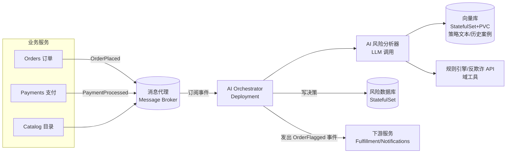

事件驱动架构的步骤：

1. **消息代理（Message Broker）** 收到 `OrderPlaced`、`PaymentProcessed` 等业务事件。AI 编排器服务**订阅**相关事件。K8s 本身不原生提供消息队列，但很多云原生系统跑在 K8s 上，或用 **Knative Eventing / Dapr pub-sub** 组件。关键是 AI 服务被**异步触发**，而非通过 HTTP 请求。
2. **AI Orchestrator（Deployment）** 在相关事件上"醒来"：比如 `OrderPlaced` 事件，它去多源取数据（订单详情、支付历史、商品信息），再调"AI 风险分析器"评估欺诈风险。分析器内部用 LLM + 向量库（策略文档、历史欺诈案例）+ 可能的非 AI 工具（规则引擎、第三方反欺诈 API）。**这可以看作一个封装在单个微服务里的 agent 工作流**。
3. **LLM 与工具服务** 作为独立 Deployment 或外部 API。向量库是带 PVC 的 StatefulSet，充当"知识库"给 LLM 决策接地气。域工具（如规则引擎）是独立服务，通过各自 API 访问。有时工具甚至可以是触发一个 K8s Job（比如计算密集的异步数据处理）。**与聊天线性模式的关键区别：这些调用不是用户直接发起的，而是后端流程的一部分。**
4. **State 输出**：决策（approve/flag、风险分数）写入风险数据库（另一个 StatefulSet），并产出 `OrderFlagged` 事件给下游服务。
5. **下游服务**（Fulfillment、Notifications）响应，比如暂停履约或触发人工复核。

> 🔬 **第一性原理："短 think-act-observe 回路" + 幂等性**
> 这个架构遵循**"感知输入事件 → 用 LLM 规划并可能采取行动 → 更新状态 → 等下一个输入"**的短回路。它本质上是微服务生态里的一个**自主 agent**，但运行在明确的护栏（guardrails）内、产出可审计（auditable）结果。
> **两个必须处理的工程问题**：
> - **幂等性（idempotency）**：因为是事件驱动，必须优雅处理**重复事件**或失败。K8s Job 适合可重试任务；如果 orchestrator 崩溃或升级，**消息队列可以缓冲事件**直到新 pod 就绪。
> - **顺序性**：如果事件必须按序处理，水平扩容时需要协调。

**成本对比（贯穿本章的成本-延迟权衡）**：

| 维度 | 聊天应用（同步） | 后端 AI 服务（事件驱动） |
|---|---|---|
| 延迟 | 最重要，需预热 pod | 可容忍轻微延迟、最终一致性 |
| 耦合 | 较紧（同步调用链） | 松耦合（事件 schema/API 契约） |
| 吞吐扩展 | 按会话数扩 LLM/DB | 事件多则水平扩 orchestrator |
| 成本 | pod 常驻 = 持续成本 | **无事件时不干活，可用 KEDA/Knative 缩容到零** |

---

### 8.1.4 三种"无头"异步变体（Headless Variations）

后端 AI 服务还有几种**不依赖即时外部刺激**的变体，都能异步自行运行或作为更大后台工作流的一部分。

#### 变体 A：定时批处理任务（Scheduled Batch Jobs）

用 **CronJob** 触发摄取、夜间汇总、周期微调。经典例子就是 RAG 的**文档摄取阶段**——用 CronJob 周期性处理新文档、生成 embedding、更新向量库，而**不是把这些放进请求路径**，从而让面向用户的部分保持快速。

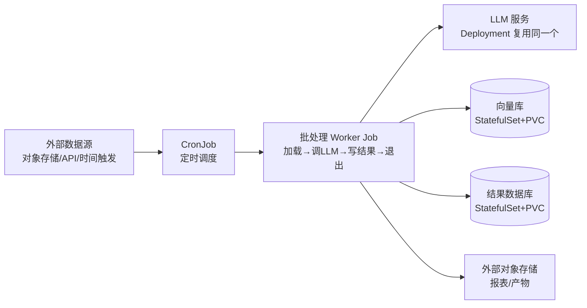

要点：批处理 Job 调**同一个** LLM Deployment（保证模型服务一致）；因为**没有用户在等**，可以排在**低峰时段或低优先级节点**降本；Job 跑完释放资源。CronJob/Job 天然提供失败重试、每次运行的日志、按运行隔离资源——比如给夜间 Job 单独分配更大内存或 GPU，而不用全天占着。

#### 变体 B：持续控制回路（Continuous Control Loops）

不同于时间触发，控制回路**持续运行**，监视某些条件或迭代处理任务。典型是 **ambient agent（环境智能体，见 8.3.9）**：监控数据流（日志、社媒、IoT 传感器），一发现异常或关键词就用 LLM 分析、可能触发告警。**它是轮询（poll）拉取工作**，而非响应推送的事件。

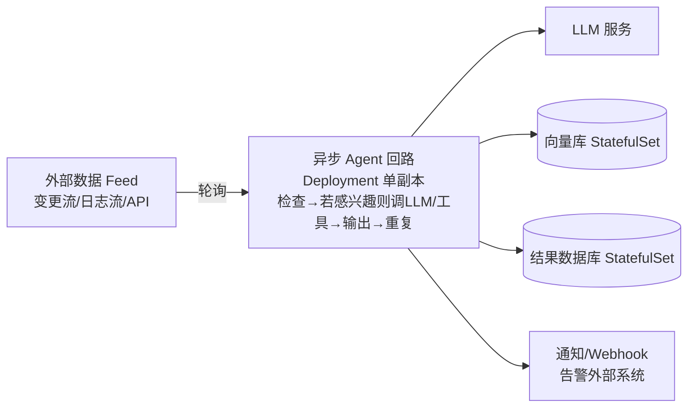

> 💡 **面试高频：常驻 agent 为什么用 Deployment 而不是别的？**
> 常驻 agent 用 **Deployment（副本数=1）** 最合适——即便只要一个副本，也能白拿"失败自动重启"。它**概念上就像一个 K8s 控制器**（持续调和回路 reconciliation loop），只不过决策过程里塞了个 LLM。
> **如果绝不能跑超过一个副本**：可以用 leader-election 逻辑或 singleton 模式，最简单就是 `replicas: 1` 且**关掉自动扩缩容**；另一个办法是 size=1 的 StatefulSet（但它的主要好处"稳定网络身份"通常这里用不上）。

#### 变体 C：多步工具自动化（Multistep Tool Automation）

异步工作流也能**无人干预地完成复杂多步目标**。例子：一个 agent 被要求"生成并发送每周汇总邮件"——被触发后它会规划这些步：查数据库 → 让 LLM 汇总要点 → 用绘图工具生成图表 → 通过 SMTP 服务发邮件。

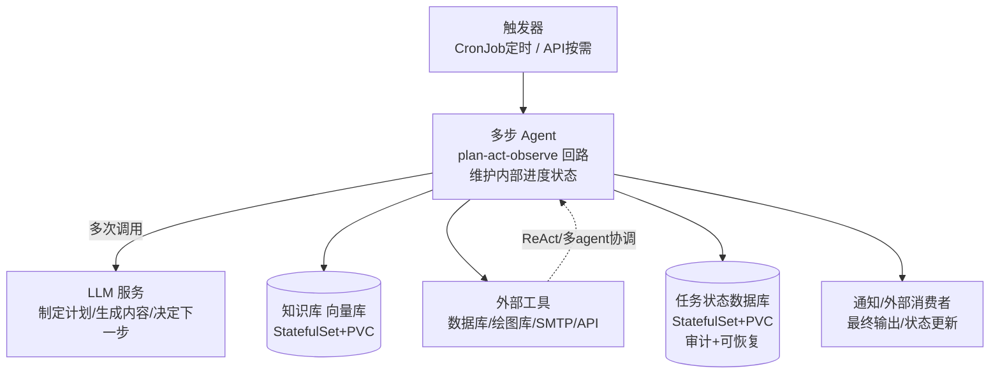

多步 agent 用 **plan-act-observe 回路** 编排整个工作流，维护内部进度状态，迭代地决定下一动作、执行、观察结果、更新计划。可实现为一个封装所有步骤的 **Job**（run-to-completion 逻辑更简单）或临时 Deployment。ReAct 模式和多 agent 协调（8.3）都属于这里——它们是你编排服务内部的**应用级控制流**。

> ⚠️ **关键坑：同步 vs 异步，是必须"刻意"做的决定**
> 这些 agent **不映射到独立的 K8s 资源类型**——你把它们跑在 Deployment 或 Job 里。架构上你必须决定：每个多步流程是**同步**（占着用户请求不放）还是**异步**（离开请求路径）。**长多步 agent 通常异步更安全**，跑完再通知用户/系统。
> **成本-延迟经典权衡**：
> - **常驻 agent（always-on）** = pod 持续运行 = 持续成本，但延迟低（模型常驻内存）。
> - **事件触发的 Job** = 按次计费，但有冷启动延迟。
> 你要**刻意设置生命周期边界**：哪些进程能按需拉起（省钱，可用 spot 实例/闲时算力跑非关键 LLM Job），哪些必须预热等待（满足延迟目标，比如监控安全入侵的关键 ambient agent）。

---

## 8.2 📚 检索增强生成（Retrieval-Augmented Generation, RAG）

### 8.2.1 什么是 RAG，为什么它比微调更受企业欢迎

**RAG 是一种设计模式：在推理时（inference time）抓取相关信息塞进 prompt，从而把 LLM 的输出"接地气"到外部数据上。** 相当于在问答时给模型一本**"开卷书"（open book）**，而不是只靠它训练时的固定知识。结果是：**更少幻觉、答案反映最新的领域知识**，哪怕基础模型的训练数据已经过时。

**RAG vs 微调（Fine-tuning）—— 互补而非互斥：**

| 维度 | 微调（Fine-tuning） | RAG |
|---|---|---|
| 机制 | 更新模型**权重**，把知识"焊进"模型 | 查询时**注入**知识，走 prompt 接口 |
| 适合 | 风格、语气、稳定的领域模式 | 动态知识库、快速变化的内容、用户特定数据 |
| 更新新数据 | **重训**（资源密集、慢，每有新数据都要重来） | 更新向量库即可，**下一个查询立即用上** |
| 代价 | 训练算力大 | 每次查询多一次检索 + 更长的 prompt |

> 🔬 **第一性原理：为什么两者可以并用？**
> - **核心、很少变的知识** → 用微调焊进一个较小的模型，**减小 prompt 体积**（大上下文窗口有内存和延迟成本，见第 5 章）。
> - **当前的/用户特定的事实** → 用 RAG 在查询时拉进来。
> 很多团队两者结合："把长寿知识烘焙进微调模型，用 RAG 供给动态或用户特定事实"，在准确性和效率间取平衡。
> **关键洞察**：RAG **对任何基础模型都有效**（原始的或微调的），因为它**纯粹通过 prompt 接口工作**。所有基于 prompt 的技术（RAG、工具使用）都兼容微调后的 LLM 后端。

### 8.2.2 RAG 的两个阶段

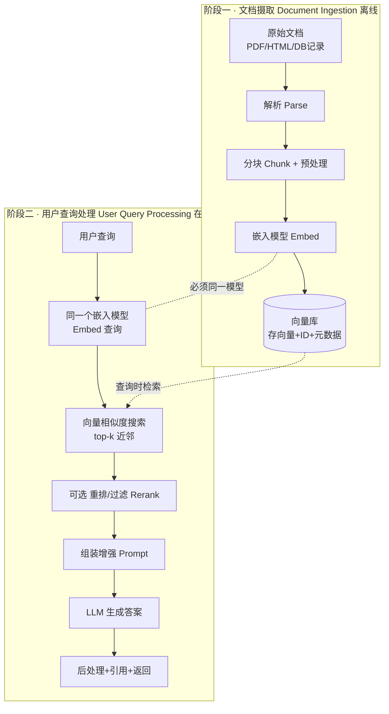

**两阶段各自独立、异步、无阻塞关系**：用户可以在摄取 Job 运行时照常查询，新文档一旦 embedding 写入存储就立即可检索。K8s 里摄取用 **Job/CronJob** 批量处理。

### 8.2.3 RAG 的核心组件

| 组件 | 是什么 | 关键点 |
|---|---|---|
| **向量数据库（Vector DB）** | 存高维向量（embedding）的专用数据存储，支持快速最近邻搜索 | RAG 系统的**"记忆"**，返回与查询向量最相似的文档片段 |
| **嵌入模型（Embedding Model）** | 把文本/多模态转成 embedding 向量 | ⚠️ **摄取和查询必须用同一个嵌入模型**；可以与生成用的 LLM 不同（常用小的专用嵌入模型 + 大 LLM）；**换嵌入模型就得重新 embed 所有文档** |
| **重排器（Reranker，可选）** | 第二阶段模型/启发式，对向量搜索初结果重新排序或过滤 | 简单可按相似度分数/元数据（新鲜度、来源信任度）；高级用 cross-encoder 或 LLM 自己打分。**代价：额外复杂度和延迟**，视需求决定用不用 |
| **AI Orchestrator（编排器）** | RAG 系统的**"胶水"**，处理整个查询工作流 | 调嵌入模型 embed 查询 → 向量库相似搜索 → 可选重排 → 构造增强 prompt → 调 LLM → 后处理返回。还实现护栏、**来源归因（source attribution）/引用追踪**。可以是自写 REST 服务、Llama Stack 这类 API 层、或 LangChain |
| **LLM 服务** | 最终生成答案的组件 | 在 RAG 里 LLM 的职责**被约束为生成**，不需要内部拥有所有知识，靠提供的上下文取事实。当作任何依赖服务对待 |

> 🔬 **第一性原理：向量数据库与余弦相似度（Cosine Similarity）**
> 文档和查询被嵌入模型映射到**高维空间的单个向量**，语义相邻的落在一起，相似度通常用**余弦相似度**打分。
> 余弦相似度衡量两个向量**方向**有多一致：同向 = 1.0，垂直 = 0.0，反向 = −1.0。**它只看方向不看长度**——这对文本嵌入很有用，因为**缩放一个向量不改变它的语义**，而方向保留语义。
> - **混合搜索（Hybrid Search）**：把稠密向量匹配 + 词法排序（如 BM25）结合，既抓语义相关又抓精确 token 信号（对罕见词、标识符、精确短语特别有用）。
> - **近似最近邻（ANN）索引**：HNSW 图、FAISS 让十亿级相似搜索可行——**用"完美准确"换"速度"**，返回近似正确结果。
> 常见选择：开源 Milvus / Weaviate / Qdrant；托管 Pinecone；PostgreSQL 的 pgvector；Elasticsearch 的稠密向量。

### 8.2.4 文档摄取（Document Ingestion）—— 离线建索引

摄取是**离线**过程，把原始文档转成 embedding 存进向量库，"建你的应用日后查询的知识索引"。可以一次性（应用上线前索引大语料）也可以持续（新数据到来时）。

四个步骤：

1. **收集并解析文档（Collect and parse）**：从文本、PDF、DB 记录、网页、转录等取源，解析成纯文本。原书推荐开源工具 **Docling**——为 AI 工作流设计的文档解析框架，吃 PDF/Word/HTML/扫描图，产出结构化机读文本并保留标题、页码等元数据。
2. **分块与预处理（Chunk and preprocess）**：很少整篇 embed（太长/多主题）。按段落/标题切，或用语义/句边界等高级策略避免"半句断上下文"。用 Docling 可直接从文档结构派生 chunk（句子、段落、章节标题、表格、标题都是一等元素），支持 overlap 和最大尺寸控制。**不同分块策略配不同意图**：小的句级 chunk 适合 FAQ 式查找，大的标题对齐段适合策略/手册这类需要更宽上下文的。同时发出稳定标识符和干净元数据（source、timestamp、version、section、page），保留出处、支持查询时精确过滤。
3. **嵌入 chunk（Embed）**：每个 chunk 用嵌入模型转成高维向量。比如 `all-MiniLM-L6-v2`（sentence transformers）或 OpenAI 的 `text-embedding-ada-002`。实践中**批量跑**（比如一次 1000 个 chunk）用 GPU/并行加速。
4. **存向量入库（Store）**：每个向量带 ID 和元数据插入向量库。ID 链回原文档/chunk。**存储策略权衡**：有的只存 ID 按需取文本（省存储），有的直接存文本 payload（快检索）——看你的延迟/存储权衡。

> 💡 **实战：摄取是持续的（continuous ingestion）**
> 向量库内容**不是静态**的，要随数据演进。用 K8s **CronJob** 周期抓新/变文档、生成 embedding、**upsert**；也可以**事件驱动重索引**（文档一变就触发）。运营要点：你的平台要包含管理这种演进的 Job/流程。生命周期管理还包括文档变化时**失效或重新 embed**，保持向量库一致。

### 8.2.5 用户查询处理（User Query Processing）—— 在线服务

每来一个问题就跑一次的推理时流水线。步骤：

1. **用户查询到达**：如"我怎么重置设备？"打到应用 API，编排器接管。
2. **嵌入查询（Embed the query）**：编排器用**与摄取相同的嵌入模型**把查询编码成向量（同一向量空间）。通常很快。
3. **向量搜索相关文档**：用查询 embedding 做相似搜索，返回 **top-k 近邻**（按余弦相似度/距离），常带元数据和存储文本 payload。可加元数据过滤或混合检索。
4. **重排或过滤（可选）**：重排器在查询语境下给每个 chunk 打分，在 prompt 预算内只留最好的几个。简单启发式（最小相似度阈值、新鲜度加成）也有用。延迟预算紧时很多系统单靠向量搜索就够好。
5. **用检索到的上下文构造 prompt**：把检索文本和问题插进模板。看原书 **Example 8-1**：

```text
Use the following context to answer the question.
If the context doesn't have the answer,
say you don't know.

Context:
{retrieved_text}      ← 占位符，替换为从向量库检索到的文档

Question: {user_question}   ← 参数，替换为实际用户查询

Answer:
```

**逐行讲解**：
- `Use the following context to answer the question.` —— 指令：让模型**只依据下面给的上下文**回答。
- `If the context doesn't have the answer, say you don't know.` —— **反幻觉护栏**：上下文没答案就说"不知道"，别瞎编。这一句是 RAG prompt 的灵魂。
- `Context: {retrieved_text}` —— 把检索到的文档段（如手册里讲重置步骤的段落）填进来，这就是"接地气"的事实。
- `Question: {user_question}` —— 填入用户真实问题。
- `Answer:` —— 引导模型开始生成。

6. **LLM 生成答案**：编排器把组好的 prompt 发给 LLM 推理服务器。因为塞进了相关片段，**模型不用发明事实，只需用自然语言把答案讲清楚**。输出可能是"要重置设备，先按住电源键 10 秒直到 LED 闪烁……"，镜像了文档。
7. **后处理并返回**：格式化、附上来源引用（从元数据）、执行护栏、截断到尺寸上限，最终答案经 API/UI 送回。

> ⚠️ **关键坑：没找到强上下文时要"优雅弃权"（abstain gracefully）**
> 从用户视角这条流水线是隐形的——他们只是得到一个引用了正确信息的有用答案。**向量搜索通常够快，延迟主要由 LLM 生成主导**，所以实现良好的 RAG 仍感觉像实时。**如果没找到强上下文，AI Orchestrator 应优雅弃权，而不是冒险给幻觉答案。**

### 8.2.6 RAG on Kubernetes —— 组件映射

生产级 RAG 栈 = 一组有各自生命周期和 SLO 的协作服务，干净地落进 Deployment、StatefulSet、Service、Job。

**原书 Table 8-1（RAG 组件 K8s 部署总览）：**

| 组件 | K8s 原语 | 类型 | 资源需求 |
|---|---|---|---|
| **向量数据库** | StatefulSet + PVC | Stateful | 高 RAM/CPU、快速卷 |
| **嵌入模型** | Deployment / Sidecar / In-process | Stateless | 轻模型用 CPU；GPU 可选 |
| **Orchestrator/API** | Deployment + Service (+ Ingress) | Stateless | CPU + 中等 RAM |
| **摄取（Ingestion）** | CronJob / Job | Batch | CPU，GPU 可选 |

各组件 K8s 支持细节：

- **向量数据库**：放 **StatefulSet + 每副本 PVC**，让分片有稳定身份、数据跨重启持久。有供应商 operator 就用（封装集群搭建和升级）；把内存调大让热索引常驻，同时启用 **ANN 索引**扩规模。用 cluster-internal Service 暴露，用 **NetworkPolicy 限制哪些 pod 能连**，像对待关键数据库一样做快照和演练恢复。（Stateful Service + Service Discovery）
- **嵌入服务**：三种部署方式（见下图）。最常见是**轻量模型服务器打成 Deployment**（可独立扩缩、按需给 CPU/GPU）；小而高效的模型可直接**进程内（in-process）嵌进编排器**（省一次网络跳、延迟低）；折中是编排器 pod 里的 **sidecar**（共命运但模型独立版本化）。有些数据库能在写/查时**库内生成 embedding**（如 Weaviate vectorizer 模块、pgvector + SQL 触发器），保持编码器对齐但增加数据库与模型选择的耦合。**无论哪种，摄取时和查询时必须强制用同一个嵌入模型和配置。**
- **AI Orchestrator**：无状态 **Deployment**，通过 ClusterIP Service 暴露；面向终端用户则走 Ingress/API 网关。**要仔细埋点**：跨调用传播 trace context 以测端到端延迟、定位瓶颈。prompt 模板、阈值、检索参数等放 **ConfigMap**（不改代码就能调），凭证从 **Secret** 挂载。用 HPA 应对稳态负载，用 **Knative/KEDA** 应对事件突发或空闲路径的**缩容到零（scale-to-zero）**。
- **重排器（可选）**：精度重要时把 cross-encoder 或重型重排器跑成独立 Deployment，**只对高风险查询选择性调用**以平衡成本和延迟。简单启发式留在编排器里；独立服务让你能独立调资源和发布节奏。
- **批量摄取 Job**：文档摄取是**持续过程**，K8s 很适合后台跑。用 **CronJob** 周期抓新/更新源、parse/chunk/embed、upsert 进向量库；近实时可用文件上传/DB 更新触发的**事件驱动 Job**（可建模为 Knative Eventing 的 Event Mesh 端点）。**用 resource requests/limits 避免摄取饿死面向用户的服务**，需要更强隔离就分 namespace 或 node pool。

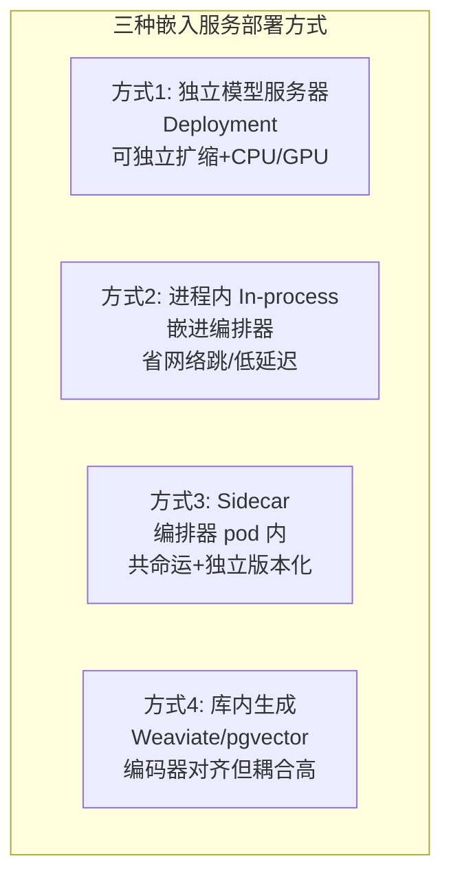

---

## 8.3 🧠 Agentic 工作流（Agentic Workflows）

### 8.3.1 Agentic 控制回路

**Agentic 应用把对模型的推理调用包在一个小控制回路里**，它能规划、调工具、观察结果、迭代，直到目标达成。

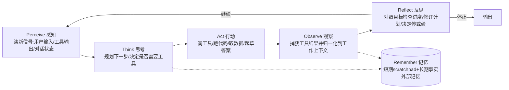

六步：**Perceive（感知）→ Think（思考）→ Act（行动）→ Observe（观察）→ Reflect（反思）→ Remember（记忆）**。这是众所周知的 **ReAct 回路的一个精化版**，适用于简单 agent，也是多 agent（8.3.8）和 ambient agent（8.3.9）等复杂场景的基础。

> 🔬 **第一性原理：ReAct 回路（The ReAct Loop）**
> ReAct 模式**交织"链式思考（CoT）推理"和"工具行动"**，让模型能在紧凑回路里思考、行动、观察、重复。由 Yao 等人在论文《ReAct: Synergizing Reasoning and Acting in Language Models》提出，证明了**模型在推理和调外部源（如搜索 API）之间交替时，能减少幻觉、提升成功率**。
> ReAct agent 里，LLM 发出中间"想法（thought）"，需要时发一个带 JSON 参数的"行动（action）"；工具执行、观察结果被追加进上下文，模型继续直到停止条件。
> ⚠️ **生产坑**：**不要把 CoT 暴露给用户**——保留内部 trace 或用摘要替换，但控制流不变。**把每个 thought/action/observation 记成结构化记录**，方便日后调试行为、把成本和质量关联起来。

### 8.3.2 Act 的关键：工具（Tools）的两条执行路径

Act 是允许"引入非训练数据信息"（太新或域特定）的关键步。这些行动统称**工具（tools）**，从简单网搜到 API 调用到企业内部后端服务。工具使用有**两条执行路径**，可在一个工作流里混用：

| 执行路径 | 谁执行工具 | 特点 |
|---|---|---|
| **客户端执行的函数工具**（Client-executed function tools） | 模型发出带 JSON 参数的函数调用，**你的客户端代码执行动作**，用 `call_id` 回传结果 | 可移植的基线，细粒度控制和审计留在你的控制平面。**需要 agentic 流有状态**（保对话历史）。⚠️ 很脆弱——**每个框架期望的工具调用格式都不同** |
| **服务端执行的工具**（Server-executed tools） | agent 运行时（LangChain、CrewAI 等框架）**替你执行工具**，包括远程 **MCP** 服务器 | MCP（Model Context Protocol）是当今**事实标准**，把工具调用和发现大幅搬到服务端，比客户端调用能更好地把域知识集成进 agent 流 |

原书 **Example 8-2（用 OpenAI Responses API 做客户端函数调用）** 展示了请求-响应流：

```bash
# 初始请求，包含可用工具的描述
curl https://api.openai.com/v1/responses \
  -d '{
    "input": [
      {"role": "user", "content": "Do I need an umbrella in Berlin today?"}
    ],
    "tools": [
      {
        "type": "function",                          # ← 定义一个客户端工具
        "name": "get_weather",
        "description": "Get the weather information for a city and ISO date.",
        "parameters": {
          "type": "object",
          "properties": {
            "city": { "type": "string" },
            "date": { "type": "string", "format": "date" }
          },
          "required": ["city", "date"],
          "additionalProperties": false
        },
        "strict": true
      }
    ],
    "tool_choice": "auto"
  }'
```

```json
// 返回响应的一部分，服务器要求客户端调工具
{
  "output": [
    {
      "type": "function_call",       // ← 服务器要求客户端调工具
      "call_id": "call_wx_1",        // ← 关联 ID，连接工具调用响应和它的请求
      "name": "get_weather",
      "arguments": "{\"city\":\"Berlin\",\"date\":\"2025-09-20\"}"
    }
  ],
  "status": "incomplete"
}
```

```bash
# 第二次客户端请求，携带工具调用的结果
curl https://api.openai.com/v1/responses \
  -d '{
    "input": [
      {
        "type": "function_call_output",
        "call_id": "call_wx_1",       # ← 用同一个 call_id 关联回去
        "output": "{\"precipitation_chance\":0.80,
                    \"summary\":\"Heavy rain expected in the afternoon.\"}"
      }
    ]
  }'
```

**逐段讲解**：
1. **初始请求**带用户问题 + 工具目录（含 JSON Schema）。`tool_choice: "auto"` 让模型自己决定用不用工具。
2. **服务器回 `function_call`**：`status: "incomplete"` 表示"还没完，我需要你去调 `get_weather`"。`call_id` 是**关联 ID**，把这次工具调用请求和它的结果对上。
3. **客户端执行工具后**（真去查天气），把结果作为 `function_call_output` 用**相同的 `call_id`** 回传，模型继续推理并完成回答。

> 💡 这就是"客户端工具调用需要有状态"的原因——多轮交互要保对话历史，服务器靠 `call_id` 把跨轮的请求和响应缝合起来。

### 8.3.3 Agentic 框架与运行时（Frameworks and Runtimes）

从零搭 agentic 工作流很难，框架和运行时简化了它。**核心分类维度：agent 的编排器（orchestrator）跑在哪。**

| 类别 | 代表 | 特点 |
|---|---|---|
| **客户端 agentic 框架**（Client-side） | **LangChain**（Python/JS，prompt/memory/工具抽象，生态广）、**LangChain4j**（Java，集成进 Quarkus）、**LangGraph**（把 agent 步建模成图，分支/并发子任务显式可观测）、**CrewAI**（角色制多 agent 协作，但实现自定义 REST 端点，模糊了客户端/服务端界限） | 在**你自己的应用内**跑回路，**完全控制、易调试**，代价是自己管编排。生产中即便"客户端"框架通常也跑在 K8s 容器化微服务里，同样受打包/扩缩/可观测约束 |
| **服务端 agentic 运行时**（Server-side） | **OpenAI Responses API**（有状态多轮、集成工具、结构化输出、事件流、human-in-the-loop 的暂停-恢复）、**Llama Stack**（开源可自托管，Agents API + OpenAI 兼容端点 + Responses 风格流）、**vLLM**（OpenAI 兼容服务器 + 工具调用 + 结构化输出） | 把回路**藏在 API 后**，客户端发一个请求，后端做多轮推理和工具使用，**简化客户端代码、集中扩缩和治理** |

> 💡 **实战：两者可混用**
> 在你的 app 里用 LangChain，同时把 Llama Stack 后端作为推理和服务端工具的目标；或者即便规划在服务端做，工具仍作为客户端执行函数保留在本地。**实用区别在于 agent 编排器跑在哪**——服务端运行时把回路藏在网络 API 后（简化客户端、集中治理），客户端框架把逻辑留本地（最大化定制和组合）。

### 8.3.4 OpenAI 的 Responses API 与"可移植性"（Portability）

Responses API 为 agentic 工作流设计，**在单个有状态 API 调用里**搞定：跨轮自动对话状态、结构化输出、集成工具使用、中间工具事件流、内建错误处理。你发用户输入 + 带 JSON Schema 的工具目录，服务能**自主编排工具调用序列**、把观察喂回模型、返回最终答案。两条执行路径可共存（服务端工具含 MCP、客户端函数工具）。

> 💡 **面试高频：为什么 Responses API 关乎"多模型路由"和"可移植性"？**
> Responses 接口正**迅速成为事实标准**，被 **Open Responses initiative** 形式化为开放规范。已有多个后端实现兼容端点：
> - **Meta Llama Stack**：OpenAI 兼容接口 + Responses 实现，可在 K8s 自托管 agent 运行时**而不改客户端代码**。
> - **vLLM**：在 OpenAI 兼容服务器里引入了 Responses 入口点（2026 年初进展迅速）。
> - **LiteLLM**：提供代理，暴露 `/responses` 端点并**路由到多个提供商**，给团队一个兼容层。
>
> **要点是可移植性（portability）**：你可以把客户端代码标准化到 Responses API，同时**选择在哪跑 agentic 回路**——OpenAI 云、自托管 Llama Stack、或集群上的 vLLM 服务——并随运营需求演进而切换。**这正是"多模型路由"在 agentic 层的体现：统一契约 + 后端可替换。**

**Human-in-the-loop（人在回路）**天然融入这个流：可在模型请求的动作上暂停，问用户批准、收集额外输入、或升级给审核者再恢复；可对敏感工具**强制审批门（approval gates）**。通过 MCP 用远程提供商时，API 能**显式浮现审批请求**，给你一个副作用发生前的可审计检查点。

### 8.3.5 Agents on Kubernetes —— Kagent 与声明式 agent

K8s 是 agentic 系统的天然家园，因为它给编排器、工具、记忆提供了可组合的构建块。**Kubernetes-native 集成**通过 CRD（自定义资源定义）和控制器把 agent 带进控制平面。

2026 年初较成熟的项目是 **Kagent**（Solo.io 发起，成长于 CNCF 社区）——一个 K8s-native operator，让你把 agent、工具、暴露模式声明为自定义资源，然后**调和（reconcile）成可运行的 pod**。它拥抱工具和 agent-to-agent 交换的协议兼容性（注册 MCP 兼容工具服务器、暴露 A2A 技能），你用**和 Deployment/Job 一样的 GitOps 和安全实践**管理 agent。

原书 **Example 8-3（Kagent agent 定义）**：

```yaml
apiVersion: kagent.dev/v1alpha2
kind: Agent
metadata:
  name: k8s-a2a-agent
  namespace: kagent
spec:
  description: An example agent
  declarative:
    modelConfig: default-model-config    # ← 引用 agent 配置（模型配置）
    systemMessage: |
      You are a helpful Kubernetes agent. # ← 系统提示 (System prompt)
    tools:                                # ← 要用的工具列表
      - type: McpServer                   # ← 工具类型为 MCP 服务器
        mcpServer:
          name: kagent-tool-server
          kind: RemoteMCPServer           # ← 引用在别处声明的 RemoteMCPServer 资源
          toolNames:
            - k8s_get_resources
  a2aConfig:                              # ← 配置通过 Google A2A 协议连接
    skills:
      - id: get-resources
        name: Get Resources
        inputModes: ....
        outputModes: ....
```

**逐段讲解**：`declarative` 里定义推理回路（模型配置 + 系统提示）；`tools` 通过 MCP 挂工具（这里挂一个远程 MCP 服务器上的 `k8s_get_resources`）；`a2aConfig` 发布一个 A2A 技能。**operator 负责 pod、配置、状态**——你只声明"意图"。

> 💡 **新兴实验（Emerging Experiments）**
> - **Kubernetes 社区 agent sandbox**：探索控制器 + 自定义资源，做隔离的、有状态的、singleton 式运行时，带更强边界、持久身份、休眠与恢复（hibernation/resume），支持交互式或不受信 agent 工作负载（VM 式隔离但保持 pod 形态可管理）。
> - **Kagenti**：定位为框架中立（framework-neutral）中间件，带 operator 和统一表面，标准化身份、配置、暴露，桥接 MCP 和 A2A 协议。
> 都在活跃开发中——评估其 API 和对你环境的运营契合度。**Llama Stack** 是个不用 CRD 的例子：通用 API 层，靠自定义配置文件配后端系统。

**大多数 agentic 平台在 K8s 上趋同于相似概念**（括号是对应 Kubernetes Patterns）：

| 关注点 | K8s 落地方式 | Patterns |
|---|---|---|
| **声明式管理** | CRD + 控制器把 agent 建模为资源，用 GitOps 管理；控制器调和成 pod/service | Controller, Operator, Declarative Deployment |
| **长寿有状态 pod** | agent 常作 singleton Deployment 或单副本 StatefulSet 保会话状态；需扩展时分片会话或外部化状态 | Singleton Service, Stateful Service |
| **批处理卸载** | agent 需生成报表/处理大数据集时提交 K8s Job 并等结果，自动重试+资源隔离 | Job, Periodic Job |
| **事件驱动（EDA）** | ambient agent 作为监听器响应 Kafka topic / K8s 事件 / webhook；配 Knative Eventing 或 KEDA **空闲缩容到零、突发爆发** | Elastic Scale |
| **工具集成** | 工具作独立 Deployment + ClusterIP Service，agent 按 DNS 名调；用 MCP 标准化接口，任何 MCP 兼容工具配任何兼容框架 | Service Discovery, Declarative Deployment |
| **记忆持久化** | 长期记忆的向量库作 StatefulSet，对话历史存带 PV 的数据库，让**短命 agent pod 支撑有状态 AI 过程** | Stateful Service |
| **原生安全** | ServiceAccount 限权、NetworkPolicy 沙箱网络、Secret 最小权限挂凭证、Namespace 隔离多租户、admission controller 强制配额与策略 | Process Containment, Secure Configuration, Access Control, Network Segmentation |
| **可观测性** | 把 agent 当可测量服务：暴露 token 计数/工具调用指标、流式详细推理日志、为重要动作生成 K8s Events，让 SRE 用同一套仪表盘监控 | — |

### 8.3.6 多智能体系统（Multiagent Systems）

**多智能体系统装配几个专门化 agent 协作**，达成任一单 agent 都办不到的目标。每个 agent 是自主服务，有自己的 prompt、工具、护栏，通过远程 API 访问一或多个 LLM。类比软件团队：planner 拆分工作、coder 起草改动、tester 验证行为、reviewer 最终签字。

> 🔬 **第一性原理：为什么专门化能提升准确率？**
> **每个专家用的工作上下文（working context）远小于单个巨无霸 agent 处理整个问题所需的上下文**，这**聚焦了 prompt、减少 token 使用、提升准确率**。agent 被限定到独立任务，职责清晰、耦合低；它们通过显式控制流协调，让部分结果组合成连贯结果。

两种协调模式：

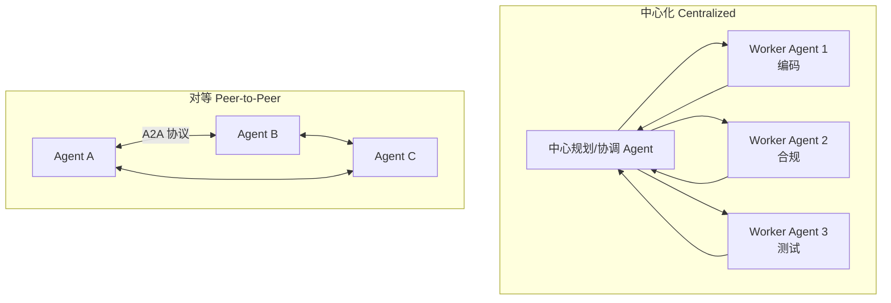

- **中心化（Centralized）**：一个中心编排器把工作分给角色 agent 并聚合结果（crew 式框架里 facilitator 把编码问题路由给编码 agent、合规问题路由给策略 agent）。
- **对等（Peer-to-peer）**：agent 直接互发消息、动态发现能力、无中心枢纽地升级或委派。**Google 的 A2A 协议**标准化了这种风格——通过 **agent card** 做发现和能力交换、任务生命周期、跨 agent 边界的产物流式传输，实现跨团队跨厂商互操作。

> 💡 **两种模式的共同真理**：系统的成败取决于其**消息的纪律（discipline of its messages）**——共享什么、何时共享、有什么保证——而非任何单个 prompt。

**在 K8s 上**：通常把每个 agent 建模为 service-backed Deployment，同步用 HTTP/gRPC 连、或异步用 pub/sub 消息织物连。多 agent 也可跑在**单个 pod** 里（框架进程内协调对话），简化跨 agent 状态共享、降延迟，**但耦合了生命周期和扩缩（所有 agent 一起扩），限制弹性，仅适合小或紧耦合团队**。**共享记忆后端**是协作的胶水：向量库、文档库、或黑板（blackboard），agent 在上面贴发现、待办任务、产物供他人消费。

> ⚠️ **多 agent 的复杂度与 Saga 模式**
> 多 agent 引入"确保所有 agent 和谐、不互相踩脚"的复杂度。需精心设计角色、通信通道、fail-safe（比如两个 agent 意见不一致怎么办？）。分布式系统的 **Saga 模式**很有用：处理带补偿逻辑（compensation logic）的长运行工作流——若某 agent 中途失败，一个补偿 agent 可回滚或清理部分工作，就像 Saga 管理分布式事务。**这给你显式回滚路径，而不是把系统留在不一致状态。**
> 具体例子：客服自动化——一个 agent 监控进来的工单，委派给合适的专门 agent（`NetworkTroubleshooter` 或 `BillingInquiry`），最后 `Summary` agent 编译报告。协调逻辑决定哪个专家参与、何时结束。

### 8.3.7 环境智能体（Ambient Agents）

**Ambient agent 在后台持续运行，响应环境信号而非等待交互式 prompt。** 它们与你的系统并存，触发器一响就行动：新文件出现、某行变化、传感器越阈值、定时器到点。**平时被动，需要时才动**——不主动开对话（但**可以**在行动前问人）。

原书例子：**Kubernetes caretaker（集群管家）**——监控集群健康信号（crash loop、CPU 压力），立即查日志、比对近期指标调查；若匹配已知模式就尝试针对性修复（重启 Deployment、回滚配置、扩容服务），只在自动化行动失败或策略标记为高风险时才升级给人。

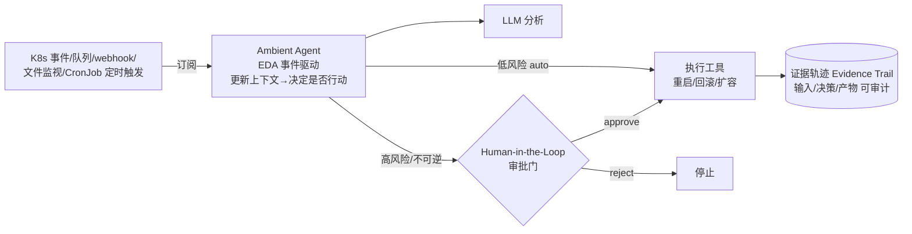

Ambient agent 建在**事件驱动架构（EDA）**上：订阅队列、webhook、文件监视器、定时触发器（如 CronJob）；更新工作上下文；决定是否行动；再调工具。例子：每日规划 agent 每早 2 点跑，分析昨天活动、生成当日计划、邮件发出或贴到通知频道给人复核。

> 💡 **自主性可按策略调（tune autonomy by policy）**
> - **recommend only（仅建议）**
> - **approve to act（批准才行动）**
> - **auto（低风险自动）**
> 还可用**确定性预算（determinism budget）**约束变化，让重放和重试行为可预测。输出侧，**每个行动都应留证据轨迹**（输入、决策、产物）以保持可审计。

> 🔬 **第一性原理：Human in the Loop（HITL）是什么、何时用**
> HITL 是个**刻意的检查点**：人复核 agent 的计划或结果并**显式授权**下一步，agent 才继续。用于**高风险或不可逆**动作、策略要求人工监督、或信号模糊置信度低时。典型例子：推生产 hotfix、回滚可能致停机的配置、批准大额金融交易、发高量客户通知。
> **实现方式**：通过 Slack/Teams 收集反馈（agent 贴提议计划等 approve/reject 回复）；更解耦的模式是在消息总线上带 correlation ID 发审批请求，再听对应决策事件（可能由专用 UI 发出）。为可审计，agent 应附上其理由（rationale）和 diff、记录审批人和决策、执行后贴最终结果。

**Ambient agent 的平台关注点**和任何分布式系统相同：服务发现、重试与退避、断路器、幂等处理器、配置和 secret 的清晰归属。**最佳实践 = 融合三门纪律**：可靠的事件处理 + 幂等动作、对不可逆改动的显式人工检查点、清晰的 K8s 归属边界（扩缩和安全）。这让 ambient agent 像任何微服务一样可预测，同时给你"规模化主动运营"的超能力。

---

## 8.4 🧵 贯穿主线回看：编排、网关、缓存、多模型路由

把本章要点收拢到题目要求的四个维度：

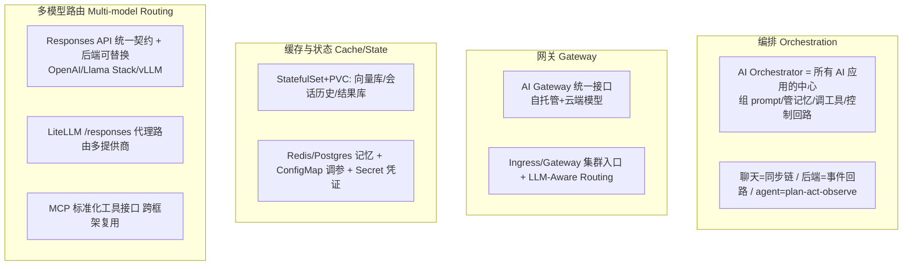

| 维度 | 本章给的答案 | 关键组件/技术 |
|---|---|---|
| **编排（Orchestration）** | AI Orchestrator 是所有 AI 应用的"大脑/胶水"，负责检索、组 prompt、调 LLM/工具、控制回路、后处理、护栏、引用归因 | Deployment + Service；LangChain/LangGraph/CrewAI/Llama Stack；plan-act-observe 回路 |
| **网关（Gateway）** | 统一接口让自托管和云端模型可互换、应用不改代码；集群入口 + AI 感知路由 | AI Gateway（第 4 章）、Ingress/Gateway、LLM-Aware Routing |
| **缓存与状态（Cache/State）** | 会话记忆、检索索引、决策审计都要持久化；配置和凭证外部化 | StatefulSet + PVC（向量库/结果库）、Redis/Postgres、ConfigMap、Secret；外部化状态让短命 agent pod 可有状态 |
| **多模型路由（Multi-model Routing）** | 标准化客户端契约 + 后端可替换 = 可移植性；标准化工具接口 = 跨框架复用 | Responses API（Open Responses 规范）、LiteLLM `/responses` 代理、MCP、A2A |

---

## 8.5 🧪 场景速查：五种架构怎么选

| 场景 | 推荐架构 | K8s 组合 | 优化重点 |
|---|---|---|---|
| 面向用户的对话助手 | 聊天应用（同步） | Deployment(orch+LLM 预热) + StatefulSet(记忆) + Ingress | 低延迟、OAuth2 认证 |
| 电商订单风险分析 | 后端 AI 服务（事件驱动） | Message Broker + Deployment(orch) + StatefulSet(向量/结果库) | 幂等、松耦合、缩容到零 |
| 夜间文档索引/汇总 | 定时批处理 | CronJob + Job + StatefulSet(向量库) | 低峰运行、资源隔离、不饿死用户流量 |
| 日志/安全流监控告警 | 持续控制回路（ambient） | Deployment(单副本) + Webhook + StatefulSet | 常驻/预热、HITL 审批门、证据轨迹 |
| 每周报表自动化 | 多步工具自动化 | Job(plan-act-observe) + 外部工具(SMTP/绘图) + StatefulSet(任务状态) | 异步、可恢复、审计 |

---

## 📌 小结（Lessons Learned）

本章从"部署单模型"跃迁到"架构完整 AI 应用"，核心结论：

1. **应用架构分两大主导模式，运营特征不同**：
   - **交互式聊天式应用**跑同步请求路径，**延迟最重要**——需要预热 LLM、精简 orchestrator、最少往返。
   - **后端事件驱动服务**在微服务网格里异步跑，**幂等性、缓冲、最终一致性比原始响应时间更重要**。
   - 批处理 Job、持续控制回路、工具驱动自动化坐在这两个核心旁边，**把非紧急工作移出热路径以降本**。

2. **RAG 在摄取和查询时流水线保持一致性和可观测性时效果最好**：
   - **两阶段用同一个嵌入模型**；选匹配内容的分块策略；存出处（provenance）以支持有信心的引用和过滤。
   - **向量库放 StatefulSet** 并配快照和恢复计划；摄取跑 Job/CronJob 且**不饿死用户流量**。
   - 重排器能提升高风险查询精度，但**应保持可选**，按路由权衡成本与质量。

3. **Agentic 工作流在模型周围加显式控制回路，把工具变成一等公民**：
   - **风险动作的人在回路审批门是必需，不是事后补丁**。
   - **捕获理由和产物，让每一步可审计**；用 MCP 这类标准提升可移植性。
   - 多 agent = 协作智能：组合小而锐的 agent + 协调层（中心化/对等）+ 保上下文和证据的共享记忆。
   - Ambient agent = 主动运营：融合可靠事件处理、显式人工检查点、清晰 K8s 归属边界。

4. **一切都是"成本-延迟-质量"三角的权衡**：常驻 pod（低延迟高成本）vs 事件触发 Job（低成本有冷启动）；用向量搜索单跑 vs 加重排器；小微调模型 + RAG 动态事实的组合。**刻意设置生命周期边界**是这一章反复出现的方法论。

> 💡 **一句话记住本章**：**"应用做主，LLM 打工"** —— 把 LLM 隔离成可替换的独立服务，用 orchestrator 编排检索与工具，用 K8s 原语（Deployment/StatefulSet/Job/CronJob）画出生命周期边界，用网关和 Responses/MCP 标准换取可移植性和多模型路由能力。

---

## 🔗 延伸（下一章预告 & 参考）

- **下一章（第 9 章）**：把这些高层设计变成生产指南，展示如何在 K8s 上立起 agentic 应用，并深入**保护 MCP 和 A2A 通信**等更棘手的挑战。
- **本章引用的关键项目/协议**：
  - **RAG 生态**：Milvus / Weaviate / Qdrant / Pinecone / pgvector / Elasticsearch；Docling（文档解析）；HNSW / FAISS（ANN 索引）；`all-MiniLM-L6-v2`、`text-embedding-ada-002`（嵌入模型）。
  - **Agentic 框架**：LangChain / LangChain4j / LangGraph / CrewAI（客户端）；OpenAI Responses API / Llama Stack / vLLM / LiteLLM（服务端/兼容层）。
  - **K8s-native agent**：Kagent（CNCF）、Kagenti、Kubernetes agent sandbox。
  - **协议**：MCP（Model Context Protocol，工具调用事实标准）、A2A（Agent-to-Agent，Google 对等协调协议）、Open Responses（开放规范）。
  - **论文**：Yao et al.《ReAct: Synergizing Reasoning and Acting in Language Models》。
- **相关 K8s Patterns**（原书反复引用）：Declarative Deployment、Stateful Service、Batch Job、Periodic Job、Service Discovery、Elastic Scale、Singleton Service、Controller、Operator、Secure Configuration、Access Control、Network Segmentation、Process Containment。
- **可扩展弹性**：KEDA / Knative Eventing（事件驱动 + 缩容到零）；HPA（水平 pod 自动扩缩）。
