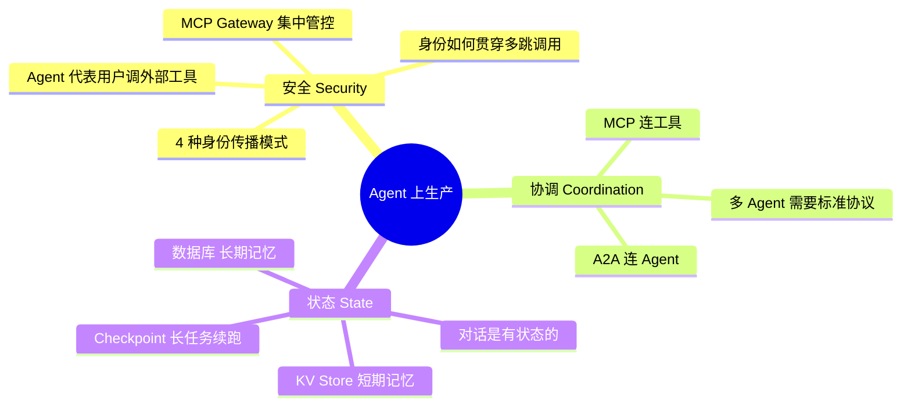
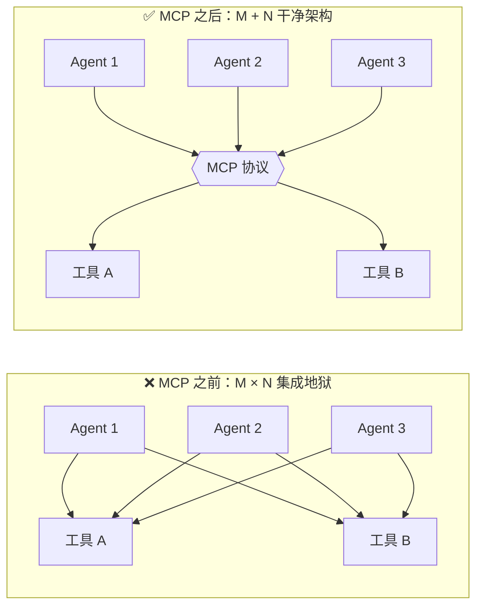
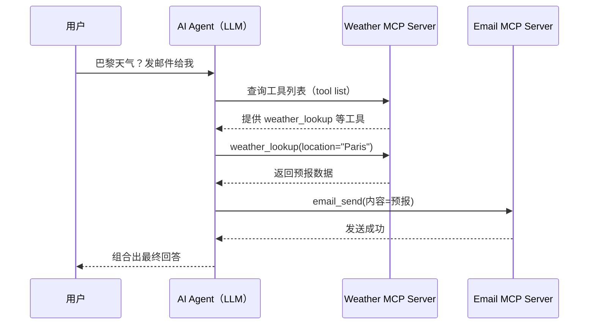
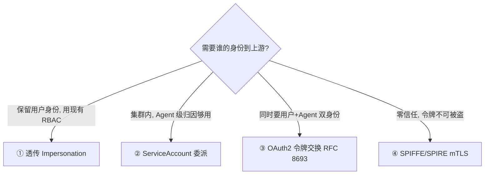
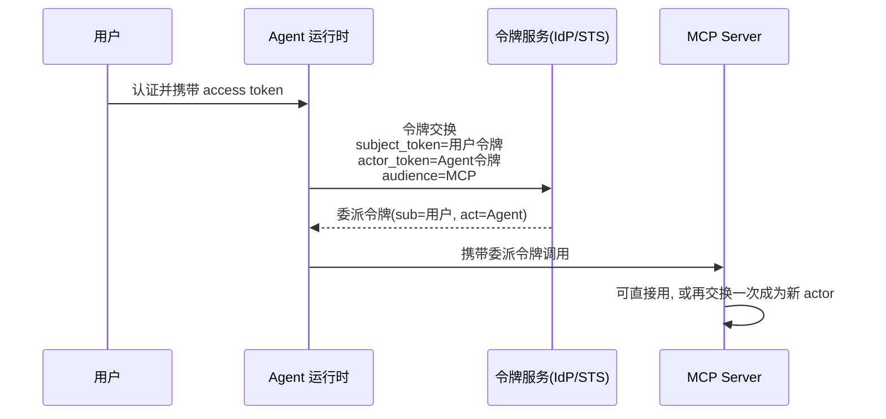
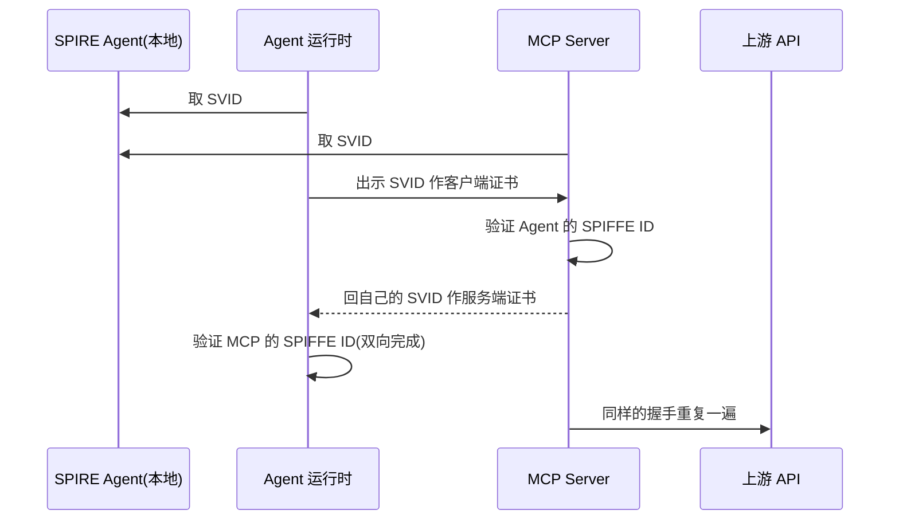
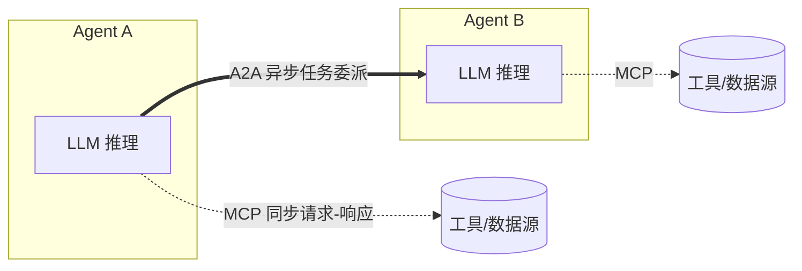
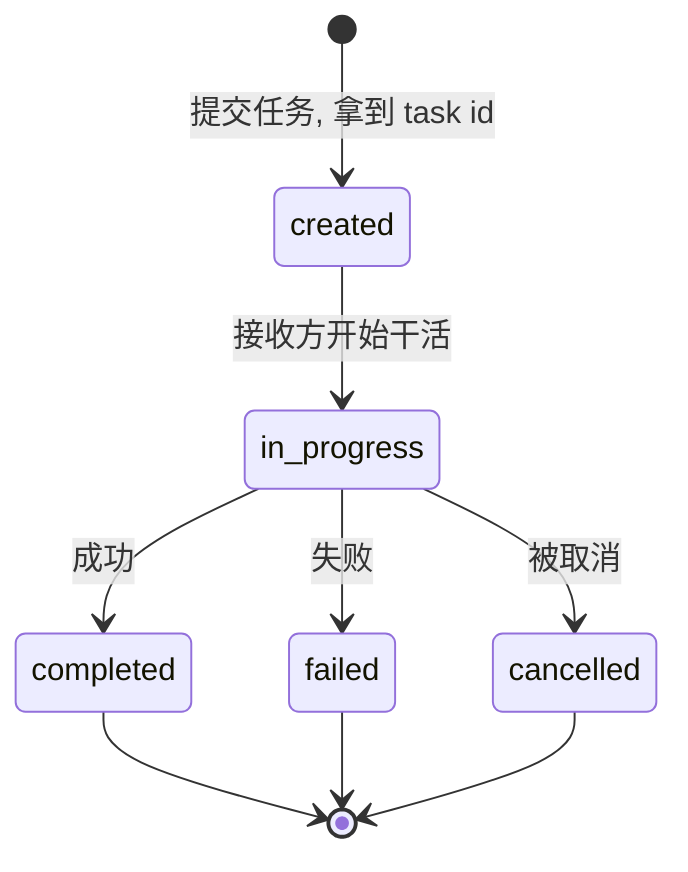
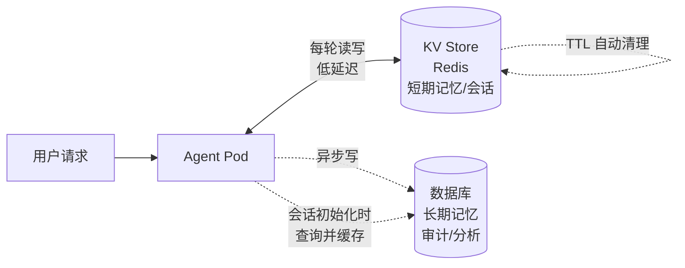
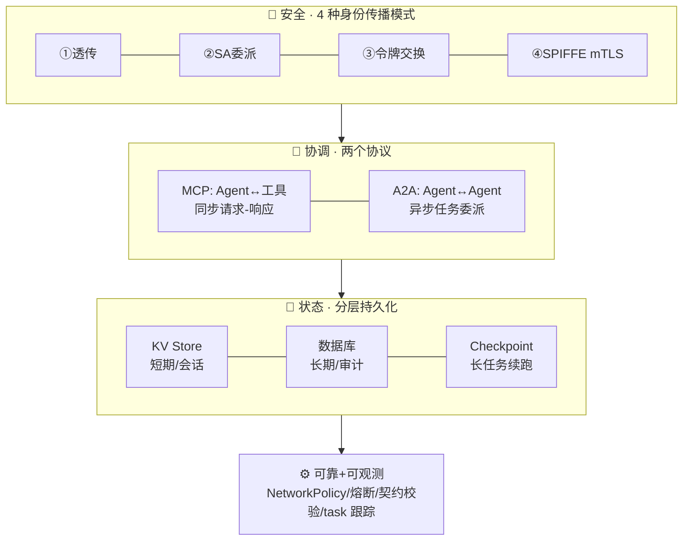

# 第 9 章 · 生产中运行 Agent 应用（Running Agentic Applications in Production）

> 对应原书 *Generative AI on Kubernetes*（Roland Huss、Daniele Zonca 著）第 9 章，PDF 第 474–525 页。
>
> 第 8 章讲的是「架构模式」——在概念层面认识 Agent 工作流；本章则从架构**下沉到运维**：当这些会推理、会自己调工具、会互相协作的系统真正跑在 Kubernetes 上时，你要面对的是身份、协议、状态、可靠性、可观测这一堆硬骨头。

---

## 🗺️ 本章地图

作者在开篇就把「Agent 上生产」拆成**三大核心挑战**，全章都在回答这三个问题：



| 挑战 | 一句话本质 | 本章给的答案 |
|---|---|---|
| **安全 Security** | Agent 常代表用户去调外部工具/数据，需要在**多跳调用**里保住用户上下文，同时给 Agent 自主权 | MCP 授权 4 模式：透传 / ServiceAccount 委派 / OAuth2 令牌交换 / SPIFFE mTLS |
| **协调 Coordination** | 多 Agent 系统需要标准的**通信协议**：能互相发现能力、委派任务、跟踪进度 | **MCP**（Agent↔工具）+ **A2A**（Agent↔Agent） |
| **状态 State** | Agent 不像无状态 REST，它要跨多轮记住对话；生产要求状态能**扛住 Pod 重启 + 水平扩容** | KV Store（短期）+ 数据库（长期）+ Checkpoint |

> 🔬 **第一性原理｜为什么这一章不列框架、只讲模式**
> 作者在开篇明说：2026 年的 AI 生态变化太快，「几个月内技术细节就会过时」。所以他刻意**不去编目那些可能明天就消失的框架**，而是聚焦「跨工具、跨标准都成立的运维模式」。这正是本章的价值：**框架会换，但安全通信、标准协调、持久状态这三件事永远需要。** 我们读这一章，学的是"骨架"而不是"皮肤"。

---

## 0️⃣ 一个前置背景：AAIF 与两个事实标准

在深入之前，作者先交代了协议的"户口"。2024 年底，两个协议成为**事实标准（de facto standard）**：

- **MCP（Model Context Protocol，模型上下文协议）**：标准化 **Agent↔工具** 的通信。
- **A2A（Agent-to-Agent，智能体到智能体协议）**：标准化 **Agent↔Agent** 的协调。

这俩不是某个官方标准组织拍脑袋定的，而是 OpenAI、Google、Microsoft、AWS 和开源社区**自发汇聚（converged）**出来的。2025 年成立的 **AAIF（Agentic AI Foundation，智能体 AI 基金会）** 给它们提供了一个中立的家。

> 💡 **面试高频｜AAIF 是什么？**
> AAIF 是 2025 年在 Linux 基金会下成立的项目，8 个白金创始成员：AWS、**Anthropic**、Block、Bloomberg、Cloudflare、Google、Microsoft、OpenAI。它启动时带了三个项目：
> - **MCP** —— 定义 LLM 应用如何连接外部数据源和工具（通过 JSON Schema 发现函数、用 JSON-RPC 调用）。
> - **goose** —— 一个能装包、跑 shell、改文件、执行测试的开源 Agent（直接动手干，而不是像补全工具那样只给建议）。
> - **AGENTS.md** —— 一种文件格式规范，告诉 AI 编码 Agent 如何与代码库交互（目录结构、构建、测试约定、偏好工作流）。
>
> 关键点：**它在 Linux 基金会治理下，技术决策走指导委员会，而非被任何单一公司控制。** 这正是"事实标准"能被大家信任的制度保障。

---

## 1️⃣ MCP：给 Agent 一个"标准插座"

### 1.1 是什么 / 为什么

**MCP（Model Context Protocol）** 是一个开放协议，让 AI Agent 以一致、结构化的方式连接外部工具、数据源和服务。Anthropic 在 2024 年底提出，比喻为 **"AI 应用的 USB-C"**。

它解决的痛点是**集成爆炸**：



| 对比 | MCP 之前 | MCP 之后 |
|---|---|---|
| 集成复杂度 | **M × N**（每个 Agent 都要为每个工具写适配） | **M + N**（Agent 和工具各实现一次协议即可） |
| 集成方式 | ad hoc API 调用、私有插件 | 统一 JSON-RPC 消息 + JSON Schema 元数据 |
| 上下文传递 | 脆弱、易错（brittle & error-prone） | 结构化、可追溯 |

> 🔬 **第一性原理｜MCP 抄了谁的作业？**
> MCP 的设计灵感来自 **LSP（Language Server Protocol，语言服务器协议）**——就是让 VS Code 一套接口接所有语言（Python/Go/Rust…）的那个协议。LSP 把"编辑器 × 语言"的 M×N 变成 M+N；MCP 把"Agent × 工具"的 M×N 变成 M+N。**把一个 Agent 想象成操作系统，MCP Server 就是它的一组 syscall（系统调用）。** 工具用「名字 + 描述 + 输入 schema」来自描述，LLM 据此决定何时调用哪个。

### 1.2 怎么用：一次典型交互

书里给的例子非常直观。用户问：*"巴黎天气如何？顺便把预报邮件发给我。"*



关键在于：**LLM 根据工具描述和元数据，自己构造一串工具调用序列**，选工具、填参数。MCP 保证这些调用是结构化、可追溯的，而不是靠脆弱的 prompt 文本硬拼。

### 1.3 MCP Server 在 Kubernetes 上怎么跑

一个 MCP Server 本质就是一个**微服务**，通过 MCP 协议对外暴露一个或多个工具。在 K8s 上：

- 每个 MCP Server 跑成一个 **Deployment**，容器里带好运行时。
  - 例：想给 Agent 提供 PostgreSQL 查询工具？部署官方 Postgres MCP Server 容器，把数据库连接串用**环境变量或 Secret** 注进去。
- 需要并发时，MCP Server **水平扩容**，藏在 K8s Service 后面。
- 虽然 MCP 协议本身维护会话状态，但**大多数实现会把状态外置到数据库/缓存**，让单个 Server 实例在请求处理上无状态 → 于是可以照常用 K8s 的扩缩容和调度策略（定义 requests/limits，负载波动就上 **HPA**）。

| 部署形态 | 何时选它 | 代价 |
|---|---|---|
| **独立 Service**（一个 MCP 共享给多 Agent） | 通用工具、无强数据耦合 | 无 |
| **Sidecar**（和 Agent 同 Pod） | 工具与 Agent 数据强耦合（如文件系统工具要操作 Agent 看到的同一批文件） | 低延迟本地调用、共享卷；但**资源重复 + 生命周期耦合**（每个 Agent Pod 一份） |

> ⚠️ **常见坑｜工具太多，发现与选择会失控**
> 当 MCP Server 数量爆炸，管理和发现它们的 endpoint URL 会很痛。书里给的现实做法：
> 1. **服务注册表 / 命名约定** —— 因为 MCP Server 自描述工具，Agent 理论上能查中央目录找工具。
> 2. **把相关工具打包进一个 MCP Server** —— 减少服务数量。**但这招有上限**：Agent 能同时"考虑"的函数数量是有限的（喂太多工具描述，LLM 反而选不准）。
> 3. **新兴高级技巧**：基于 RAG 的相似度检索来选工具、或让 Agent **写代码**去程序化地浏览工具目录。

---

## 2️⃣ MCP 安全：4 种身份传播模式（本章的重头戏）

这是全章篇幅最大的部分。核心难题是：**Agent 代表用户去调工具时，身份到底怎么传？**

### 2.0 为什么 Agent 的授权比传统微服务难

作者点出两个**结构性新难题**：

1. **不确定性（Nondeterminism）**：普通微服务是确定的，但 Agent 的行为由 LLM 推理决定——你**没法预测它会调哪些工具、以什么顺序调**。传统那套"服务 A 可以调 endpoint B"的授权策略，在"A 是个可能根据 prompt 调 10 个工具的 Agent"面前直接失效。
2. **身份歧义（Identity ambiguity）**：Agent 代表用户调工具时，上游 API 应该看到**用户身份**（好按用户配额/权限管控）还是**Agent 身份**（好追踪 Agent 行为、限 Agent 级速率）？答案取决于合规要求，但**这个问题本身就比传统流程难回答**。

于是你被迫**显式地**做出身份传播选择。四种模式代表了 **安全性 / 运维简单度 / 与现有基础设施集成** 三角上的不同取舍：



> 📌 作者注：这四种模式受 Christian Posta 的文章《MCP Authorization Patterns for Upstream API Calls》启发并与之互补。

### 2.1 ① 透传 / Agent 假冒（Token Passthrough / Impersonation）

**思路**：Agent 把**用户的 access token 原样往下传**，MCP Server 拿它去调上游 API。上游看到的请求"来自用户"，不是来自 Agent。概念上等同 OAuth2 token passthrough。

**书里的医疗例子**：护士 Alice 通过医疗助手 Agent 查病历。她先用 **OIDC** 认证到 Agent 运行时，令牌一路透传下去。最终**患者病历 API 执行它自己既有的用户级权限检查**——"这个护士能不能读 4711 号患者的病历"——审计日志记录的是 **"护士 Alice 访问了 4711 号患者的化验结果"**，而不是模糊的"某个 Agent 访问了"。

| ✅ 优点 | ⚠️ 代价 |
|---|---|
| **不用改现有 RBAC** | **令牌生命周期问题**：用户令牌通常几分钟到几小时就过期；Agent 任务跑得久就会调用失败，除非实现 refresh 逻辑 |
| 审计日志天然记录"哪个用户访问了哪个数据"，一举满足合规 | **Scope 爆炸**：用户令牌必须对 Agent 可能调的**每一个**上游 API 有效 → 往往要给用户授过宽的 OAuth scope，违反最小权限原则 |
| 能按用户配额/限速 | **凭证被盗风险**：MCP Server 被攻破 → 攻击者能窃取并重放用户令牌 |

**K8s 落地**：常用 **ingress controller** 在边缘认证用户、把令牌注入 header。可选 Traefik、NGINX + oauth2-proxy，或 Istio 的 `RequestAuthentication`。

> ⚠️ **常见坑｜别以为透传了令牌就不用 mTLS**
> 即使你在传用户令牌做授权，**仍然要用 mTLS**（直接用或经 Istio/Linkerd 服务网格）来加密 MCP Server ↔ 上游 API 的流量，并验证流量确实来自授权的工作负载。授权 ≠ 传输安全，两码事。

### 2.2 ② ServiceAccount 委派（K8s 原生工作负载身份）

**适用场景**：Agent 和上游服务**都在同一个 K8s 集群里**，且 **Agent 级归因就够了**（不需要精确到人）。好处是**不依赖外部令牌服务器**，纯用 K8s 内建原语，运维负担小。

**核心：ServiceAccount（SA）= Pod 的命名空间身份**

- 每个 Pod 都有 SA（你指定的或 namespace 的 default）。这身份**绑工作负载而非人**，天生适合服务间认证。
- K8s 自动把 SA 令牌挂到 Pod 的 `/var/run/secrets/kubernetes.io/serviceaccount/token`——一个由 API Server 私钥签名的 **JWT**，含 SA 名字、namespace、唯一 ID。
- 通过 Pod spec 的 `serviceAccountName` 字段分配。

> ⚠️ **常见坑（书里反复强调）｜SA 令牌会自动轮转，别缓存！**
> K8s 会周期性轮转 SA 令牌。**任何读令牌的代码都必须每次用时重新从文件系统读**，绝不能缓存在内存里，否则你会拿着过期令牌调用失败。书里的 Example 9-2 就为这一点存在：
>
> ```python
> from pathlib import Path
> def get_serviceaccount_token() -> str:
>     """每次调用都从文件系统读当前 SA 令牌。"""
>     token_path = Path("/var/run/secrets/kubernetes.io/serviceaccount/token")
>     return token_path.read_text().strip()   # ← 每次都读，不缓存
> ```

#### 两种子模式：Server 身份 vs Agent 身份

ServiceAccount 委派根据"上游看到谁"分成两条流：

| 子模式 | 谁的令牌到上游 | 何时用 |
|---|---|---|
| **Server 身份** | MCP Server 用**自己的** SA 令牌调上游 | 所有用这个 MCP 的 Agent 对上游资源**权限一致**时（更简单） |
| **Agent 身份** | Agent 把**自己的** SA 令牌发给 MCP，MCP 验证后**转发**给上游 | 不同 Agent 需要**不同权限级别**时 |

> 💡 **决策要点**：唯一的判断依据是**粒度**。所有 Agent 权限相同 → Server 身份；需要区分 Agent 权限 → Agent 身份。

#### RBAC：用"自定义虚拟资源"而非 K8s 原生资源

> 🔬 **第一性原理｜为什么不能用 K8s 的 Service 资源来授权？**
> 书里有个关键区分：**保护对 K8s `Service` 资源的访问，并不等于保护对该服务 endpoint 的访问。** 一个对 service 有 `get` 权限的 SA，只能读 service 的元数据，**不能调用真正的服务**。所以正确做法是：定义**应用级的自定义资源**（如 `customer-queries`、`medical-records`、`support-tickets`）来表达应用级权限。

Example 9-1 的 RBAC 骨架（`ServiceAccount` + `Role` + `RoleBinding`）：

```yaml
apiVersion: v1
kind: ServiceAccount
metadata:
  name: customer-support-mcp
  namespace: agents
---
apiVersion: rbac.authorization.k8s.io/v1
kind: Role
metadata:
  namespace: data-platform
  name: customer-data-reader
rules:
- apiGroups: ["agents.example.com"]   # ← 用应用专属 API group
  resources: ["customer-queries"]     # ← 自定义资源名，代表应用级权限
  verbs: ["get", "list"]
---
apiVersion: rbac.authorization.k8s.io/v1
kind: RoleBinding
metadata:
  name: customer-support-mcp-binding
  namespace: data-platform
roleRef:
  apiGroup: rbac.authorization.k8s.io
  kind: Role
  name: customer-data-reader
subjects:
- kind: ServiceAccount
  name: customer-support-mcp
  namespace: agents   # ← 把 agents 命名空间的 SA 绑到 data-platform 里的 Role
```

> 💡 **实战亮点｜这些自定义资源不用注册成 CRD！**
> `customer-queries` 这类资源**不需要**在 K8s API Server 上注册为 CRD（Custom Resource Definition）。它们只存在于 RBAC 规则里，纯粹用于 `SubjectAccessReview` 的授权检查。这让你**零 CRD 管理开销**就拿到细粒度、应用专属的权限。这是个很妙的技巧。

#### 用 TokenReview 验证令牌（认证）

当 MCP Server（Agent 身份模式）收到 Agent 的 SA 令牌，**信任前必须验证**。K8s 提供 **TokenReview API**：输入令牌，返回是否有效 + 它代表的身份。Example 9-4 关键片段：

```python
from kubernetes import client, config
config.load_incluster_config()
auth_v1 = client.AuthenticationV1Api()

async def validate_agent_runtime_token(token: str) -> dict:
    token_review = client.V1TokenReview(
        spec=client.V1TokenReviewSpec(token=token))
    result = auth_v1.create_token_review(token_review)   # 提交给 API Server
    if not result.status.authenticated:                  # 检查签名有效 + 未过期
        raise ValueError("Token validation failed")
    username = result.status.user.username               # system:serviceaccount:ns:name
    if not username.startswith("system:serviceaccount:agents:"):  # 命名空间白名单
        raise ValueError(f"Token from unauthorized namespace: {username}")
    return {"username": username, "uid": result.status.user.uid,
            "groups": result.status.user.groups}
```

- **关键价值**：调 TokenReview 就是让 MCP Server 确认"这令牌确实是 K8s API Server 签发并签名的"。
- **白名单检查**：`system:serviceaccount:agents:` 前缀过滤，是最基本的访问控制——只接受 `agents` 命名空间的 SA，挡住无关命名空间的 Pod。

> 💡 **优化提示**：TokenReview 有小延迟。可以**用令牌哈希做 key、短 TTL 缓存验证结果**降低开销，但**缓存必须尊重令牌过期时间**。

#### 用 SubjectAccessReview 检查权限（授权）

**验证令牌只证明了身份（谁），不代表它有权做某事。** 授权用 **SubjectAccessReview API**——它问 API Server：*"这个 SA 能不能对这个资源做这个动作？"* 它尊重所有 RBAC 策略。Example 9-5：

```python
from kubernetes import client
authz_v1 = client.AuthorizationV1Api()

async def check_agent_permission(username, namespace, api_group, resource, verb) -> bool:
    sar = client.V1SubjectAccessReview(
        spec=client.V1SubjectAccessReviewSpec(
            user=username,                    # 来自 TokenReview 的 SA 用户名
            resource_attributes=client.V1ResourceAttributes(
                namespace=namespace,
                group=api_group,              # 如 agents.example.com
                resource=resource,            # 如 customer-queries
                verb=verb,                    # get/list/create/update/delete
            )))
    result = authz_v1.create_subject_access_review(sar)
    return result.status.allowed
```

> 🔬 **第一性原理｜认证 vs 授权，两个 API 各司其职**
> - **TokenReview** = **认证（Authentication）**："你是谁？令牌真吗？" → 拿到身份。
> - **SubjectAccessReview** = **授权（Authorization）**："你能干这事吗？" → 复用集群 RBAC 给出定论。
> 这套组合让你**无需自建授权系统**，直接把应用级权限焊在 K8s RBAC 上。

#### 集群外验证：OIDC / JWT

有时你要在**集群外**验证 SA 令牌（调支持 OIDC 联邦的云厂商 API、或混合架构里集群外服务要信任集群身份）。K8s 能把 SA 令牌暴露成 **OIDC 兼容的 JWT**，任何 OIDC-aware 服务都能验证：

- API Server 暴露 OIDC 发现端点 `<cluster-url>/.well-known/openid-configuration`，发布 issuer URL 和 **JWKS**（JSON Web Key Set，签名公钥集）的位置。
- 外部服务拉 JWKS → 用公钥验签 → 校验 `exp`、`aud` 等标准 JWT claim。

Example 9-6 用 `PyJWKClient` 从发现端点拉 JWKS 并 `jwt.decode(...)` 验证。为让它工作，令牌里必须带 **audience（`aud`）claim**：

- 默认情况下集群用自己的 issuer URL 作 audience（`--service-account-issuer` 启动参数）。
- 可用 `--api-audiences` 传逗号分隔的 audience 列表覆盖默认。
- 也可在 **Pod 级别**用 **projected volume** 声明 audience（Example 9-7）：

```yaml
volumes:
- name: oidc
  projected:
    sources:
    - serviceAccountToken:
        path: token
        audience: "https://my.service.example"   # ← 写进 JWT 的 aud claim
        expirationSeconds: 3600
```

需要多个 audience（调不同上游）？要么声明多个 `serviceAccountToken` 条目（各挂到不同文件），要么用 **TokenRequest API** 铸造一个面向多 audience 的令牌。

### 2.3 ③ OAuth2 令牌交换（Token Exchange, RFC 8693）

**前两种模式的遗憾**：透传保留了用户上下文但有令牌生命周期和 scope 爆炸问题；SA 委派运维简单但**丢了按用户归因**。**令牌交换两者兼得**——标准化地保留用户身份，同时让调用方（服务）身份对上游可见。

> 🔬 **第一性原理｜双身份令牌是怎么回事**
> 交换后的令牌在 claim 里**同时携带两个身份**：
> - `sub`（subject）= **代表谁**在干活，如 `alice@example.com`
> - `act`（actor）= **当前实际执行者**，如 `customer-support-agent` 或 `customer-data-mcp-server`
>
> 这让上游能强制**复合策略（composite policy）**：*"仅当用户有权限**且**服务被授权执行此操作时才放行。"*

**令牌交换可发生在 MCP 工作流的两个点**（机制完全相同，只是 `act` 里的 actor 身份变了）：
1. Agent 运行时把用户令牌换成"面向 MCP Server"的令牌（标识 用户 + Agent）。
2. MCP Server 再把自己的令牌换成"面向上游 API"的令牌（标识 用户 + MCP Server）。



**回到医疗例子**：护士 Alice 查病历时，Agent 运行时把她的令牌换成一个**同时标识 medical-assistant Agent 和 Alice** 的委派令牌。上游病历 API 执行复合策略：*"仅当 Agent 是 medical-assistant 且 Alice 有权访问该患者时才放行。"* 两个身份都在**一个加密签名的令牌**里。

Example 9-8 的核心 payload（RFC 8693）：

```python
payload = {
    "grant_type": "urn:ietf:params:oauth:grant-type:token-exchange",  # RFC 8693 授权类型
    "subject_token": user_token,                                       # 用户令牌(代表谁)
    "subject_token_type": "urn:ietf:params:oauth:token-type:access_token",
    "requested_token_type": "urn:ietf:params:oauth:token-type:access_token",
    "audience": upstream_audience,                                     # 目标服务, 限定令牌作用域
    "actor_token": agent_token,                                        # Agent 令牌(实际执行者)
    "actor_token_type": "urn:ietf:params:oauth:token-type:access_token",  # 有 actor_token 时必填
}
# 返回的委派令牌里: 用户在 sub, Agent 在 act
```

> 💡 **实战｜哪些场景该用它 + 需要什么基础设施**
> - **适用**：合规要求**同时知道 who（用户）和 what（Agent）** 访问了数据，且你的 IdP 支持令牌交换。
> - **支持 RFC 8693 的现代 IdP**：Keycloak（内建）、Auth0、Azure AD。
> - **多 Agent 不同 scope 时**：令牌交换能做细粒度 scoping，不用给每个 Agent 建单独用户账号。

> ⚠️ **常见坑｜令牌交换的缓存是个技术活**
> 代价是额外复杂度：你要运营一个令牌交换端点、处理交换错误、**缓存交换后的令牌**（否则每次 Agent 调用都加一次交换延迟）。书里给了细致的缓存规则：
> - **缓存 key** = `(user_subject, agent_identity, audience)` 三元组，隔离不同上下文的令牌。
> - **TTL** = `exp - 当前时间 - 安全余量`，安全余量取 **30–60 秒**（吸收时钟偏移和网络延迟）。
> - **绝不**把 TTL 设得比令牌真实寿命还长——陈旧缓存令牌会被上游拒绝，白白浪费缓存和一次失败 API 调用。
> - 高并发下同一元组可能触发并行交换：用 **cache-aside + 短锁**，或干脆**接受偶发重复交换**，而不是引入复杂的分布式锁。

**顺带一提：MCP 与 OAuth2 的关系**（书中侧栏）——MCP 规范用 **OAuth 2.1** 做授权，MCP Server 扮演 **OAuth Resource Server**。MCP 客户端要实现 **RFC 8414（授权服务器元数据）** 来发现端点、建议支持 **RFC 7591（动态客户端注册）**、且**所有客户端必须对授权码流用 PKCE**（Proof Key for Code Exchange）。

### 2.4 ④ SPIFFE/SPIRE mTLS（零信任）

> 🔬 **第一性原理｜Bearer 令牌的致命弱点：能被偷**
> 无论是 OAuth2 令牌、K8s SA 令牌还是 API key，**所有 Bearer 令牌都有同一个根本弱点——能被窃取**。攻击者一旦截获或外泄令牌，就能在令牌过期前一直冒充合法调用方。**SPIFFE/SPIRE 的破解思路：把身份用密码学绑定到工作负载本身，让凭证不偷走整个 Pod 就无法窃取。**

**SPIFFE**（Secure Production Identity Framework for Everyone）+ **SPIRE**（SPIFFE Runtime Environment）通过**自动签发、轮转、验证的证书**提供工作负载身份，让 Agent、MCP Server、上游 API 全用 **mTLS 互认**，且**不用管理任何 secret**。默认凭证 TTL 1 小时，在 50% TTL 处轮转（约每 30 分钟一次）。

**两个核心概念：**
- **SPIFFE ID**：工作负载的唯一身份，形如 URI `spiffe://example.com/ns/agents/sa/customer-support`（把它当作工作负载的"名字"）。
- **SVID**（SPIFFE Verifiable Identity Document）：一张 **X.509 证书**，SPIFFE ID 写在 **SAN（Subject Alternative Name）** 字段里（把它当作密码学签名的"身份证"）。

**架构组件：**

| 组件 | 部署形态 | 职责 |
|---|---|---|
| **SPIRE Server** | StatefulSet | 充当 **CA**，通过 **attestation（证明）** 验证工作负载身份后签发 SVID；是**信任根** |
| **SPIRE Agent** | DaemonSet（每节点一个） | 通过 Unix socket `/run/spire/sockets/agent.sock` 暴露 **Workload API**；本地验证调用进程后交付 SVID |

在 K8s 上，attestation 通常意味着**校验 Pod 的 SA 令牌**against K8s API。工作负载把 socket 的 hostPath 挂成卷来取 SVID——**无网络调用、无需挂 secret，就一个本地 API**。

**完整认证链**（Agent → MCP → 上游，每一跳都是 mTLS 双向验证）：



**K8s 部署要点**：
- SPIRE Agent DaemonSet 需要 `hostPID: true`（基于 cgroup 的工作负载 attestation 要读 `/proc` 识别调用进程），挂 `/run/spire/sockets`（交付 SVID 的 socket）和 SA 令牌（agent 向 server 认证）。
- **注册工作负载**（Example 9-10）：把 K8s 的 namespace + SA 名 selector 映射到 SPIFFE ID：
  ```bash
  spire-server entry create \
    -spiffeID spiffe://example.com/ns/mcp/sa/customer-support \
    -parentID spiffe://example.com/spire-agent \
    -selector k8s:ns:mcp -selector k8s:sa:customer-support
  ```
- **规模化**：几百上千工作负载时手动注册不现实 → 用 **SPIRE Controller Manager**（Helm 装），它监听 K8s 资源、根据注解或 `ClusterSPIFFEID` 自定义资源**自动注册**新 Pod。

**代码侧**：Python 用 `py-spiffe` 库的 `WorkloadApiClient` 取 SVID 建 mTLS（Example 9-11）；验入站连接时，从客户端证书 SAN 提取 SPIFFE ID 比对**白名单**（Example 9-12）。**SVID 自动每小时轮转，库在后台透明续期，应用无需 reload 或重启。**

> ⚠️ **常见坑｜SPIFFE 认工作负载，不认人**
> SPIFFE 认证的是**工作负载（Pod/容器）**，不是终端用户。要做用户级归因时，**组合使用**：Agent 用 SPIFFE ID 建 mTLS 通道，同时把用户上下文放在 `X-User-ID` header 或 JWT claim 里。MCP Server 先验 SPIFFE ID 信任工作负载，再用用户 ID 做授权和审计。

| ✅ SPIFFE/SPIRE 的收益 | ⚠️ 代价 |
|---|---|
| **彻底消灭 secret 蔓延**——没有 API key/令牌/client secret 要管 | **运维投入巨大**：SPIRE Server 是信任根 = 关键基础设施 |
| 自动每小时轮转，无需重启 | 需专用 namespace + 严格 NetworkPolicy、限制 RBAC 给小团队、持久卷定期备份 |
| 有服务网格的话可让它复用 SPIRE 作 CA，统一工作负载身份 | 升级要小心；要监控 SVID 签发异常、对异常 SPIFFE ID 告警 |
| **凭证无法被外泄，彻底消除凭证盗用攻击** | **学习曲线比 Bearer 令牌陡** |

### 2.5 MCP Gateway：集中式策略执行点（书中侧栏）

不想在**每个** MCP Server 里都实现一遍安全逻辑？部署一个 **MCP Gateway**——坐在 Agent 运行时和 MCP Server 之间的**反向代理**，在**单一位置**集中做认证、授权、限速、审计。

| Gateway 实现 | 特色能力 |
|---|---|
| **Microsoft MCP Gateway** | 会话感知的有状态路由、K8s 生命周期管理、OAuth 2.0 + RBAC |
| **IBM ContextForge** | 跨多网关联邦、虚拟服务组合（把多个 MCP 打包成一个逻辑端点）、stdio/SSE/HTTP 协议转换 |
| **Envoy AI Gateway** | 扩展 Envoy，MCP 代理处理 JSON-RPC 多路复用、集成 Envoy 安全扩展 |
| **Solo.io agentgateway** | 自动 MCP Server 发现、跨工具服务器多路复用成单端点、集成的 metrics/logging/tracing |

- **集中的能力**：与 Keycloak 等 IdP 的 SSO 集成、用 **OPA 或 Cedar** 策略引擎做细粒度访问控制。
- **代价**：运维复杂度 + 延迟。Gateway 成了**单点故障**，需要多副本高可用 + 负载均衡；每个请求都加一层延迟（取决于策略复杂度）。
- **决策**：MCP Server 多、多租户、复杂授权 → Gateway 划算；小部署 → 把安全逻辑直接嵌进 MCP Server、或靠服务网格更合适。

### 2.6 如何选安全模式？——纵深防御，不是二选一

作者的总结非常重要：**没有一种模式适配所有场景**，选择取决于组织安全成熟度、合规要求、现有基础设施、运维能力。

| 模式 | 简单度 | 安全深度 | 何时选 |
|---|---|---|---|
| ① 透传 Impersonation | 高 | 中 | 需要用户级归因、现有 RBAC 够用 |
| ② SA 委派 | 高 | 中 | **同时掌控 Agent 和 API**、合规允许 Agent 级归因 |
| ③ 令牌交换 | 中 | 高 | 需要用户 + Agent 双身份归因 |
| ④ SPIFFE/SPIRE | 低（陡） | **极高** | 零信任环境 |

> 💡 **面试高频｜生产里怎么组合？——纵深防御（defense in depth）**
> 生产系统很少单用一种。常见组合：**SPIFFE/SPIRE 做工作负载 mTLS + 用户身份放在请求元数据里**。Agent 用 SPIFFE ID 建加密互认通道，用户身份塞进 `X-User-ID` header 或交换后令牌的 claim。MCP Server 验 SPIFFE ID 信任工作负载，再提取用户身份做授权和审计。这样既有 SPIFFE 的密码学工作负载身份、自动轮转、防盗用，又保住了合规和调试要的按用户归因。
> 更进一步：用 **OPA（Open Policy Agent）** 做复合授权——*"仅当调用工作负载是 customer-support-mcp **且** 用户有权访问该客户记录时才放行。"* 这防住被攻破的工作负载访问任意数据。

---

## 3️⃣ A2A：Agent 之间怎么协作

MCP 解决了"Agent 连工具"，但当你有**多个专业 Agent 要协作**时（规划 Agent 拆需求 → 委派给编码 Agent → 交给测试 Agent 验证），它们怎么通信？大多数框架各造各的协调机制，重演了 MCP 之前的碎片化问题。**A2A（Agent-to-Agent）协议**就是来标准化跨 Agent 协调的。

> ⚠️ **常见坑｜框架锁定（framework lock-in）**
> 截至 2026 年初，多数多 Agent 框架还在用各自的内部机制：**LangGraph** 用进程内 Python 函数调用传控制、**CrewAI** 用自定义 REST 端点。后果：你**没法轻易把 LangGraph 的 planner 接到 CrewAI 的 coder**，也没法监控或对框架内部抽象里发生的 Agent 交互施加策略。这正是需要标准协议的原因。
>
> 补充史料：2025 年 8 月，IBM 的 **ACP**（Agent Communication Protocol）**合并进 A2A**（Linux 基金会下），ACP 带来了 RESTful 风格（补充 MCP 的 JSON-RPC），整合后 A2A 成为统一标准。

### 3.1 A2A 与 MCP 互补（关键区分）



| 维度 | **MCP** | **A2A** |
|---|---|---|
| 连接对象 | Agent ↔ **工具/数据源** | Agent ↔ **另一个 Agent** |
| 对方是什么 | 被动的工具 | **自主系统**（能拆解请求、调自己的工具、自己决策） |
| 交互模式 | **同步请求-响应** | **异步任务委派 + 生命周期跟踪** |
| 典型用途 | 把 Agent 接入周边操作环境 | 把需要推理/规划/迭代的活委派给另一个推理系统 |

> 🔬 **第一性原理｜为什么不能拿 MCP 当 A2A 用？**
> 你确实可以把另一个 Agent 建模成"MCP 工具"，简单场景能用。但 MCP 缺三样 A2A 必需的东西：
> 1. **能力发现**：MCP 没有 Agent 能力发现概念——你没法程序化地找"具备某技能的 Agent"。
> 2. **任务生命周期跟踪**：MCP 没有任务生命周期——你没法监控长任务、也没法取消不再需要的任务。
> 3. **中间步骤流式**：MCP 作为"确定性 API 的前端"设计，不支持流式返回中间推理步骤——你看不到 Agent 执行多步计划的进度。
>
> **最佳实践：A2A 做跨 Agent 编排，MCP 做每个 Agent 内部的工具集成。** 这种关注点分离让架构可组合——你能独立升级/替换/扩容单个 Agent，不影响工具集成；也能改工具实现，不影响 Agent 协调。

### 3.2 A2A 三大核心概念

A2A 建在标准 Web 协议上：**HTTP 传输 + JSON 数据 + JSON-RPC 结构化方法调用**，对熟悉 REST 的团队很友好。

**① Agent Card（智能体名片）** —— 一份描述"这个 Agent 能干什么"的 JSON 文档，列出技能、接受的输入格式、产出的输出格式、支持的协议版本。**作用等同 REST API 的 OpenAPI 规范。** Example 9-13（代码评审 Agent）：

```json
{
  "agent_id": "code-reviewer",
  "input_modes": ["text/plain", "application/json"],
  "output_modes": ["application/json"],
  "protocols": ["a2a/v1"]
}
```

当 planner 要委派代码评审，它可以**查发现服务**找提供 `code_review` 技能的 Agent、取其 Agent Card、确认对方接受自己要发的输入格式。

**② Task Lifecycle（任务生命周期）** —— 跟踪委派工作的**状态机**：



请求方可**轮询 `/task` 端点查状态**，或**订阅推送**（若对方支持 push notification）。这模型优雅地处理长任务并提供清晰可见性。

**③ Artifact Streaming（工件流式）** —— 在 Agent 间传递大的或增量结果而**不阻塞**。例：文档 Agent 生成多段报告时，可以**每完成一段就流式发回**，让下游 Agent 早早开始处理前面章节，同时后面章节还在生成。**降低端到端延迟 + 提供进度可见性。**

> 💡 **关键洞见｜任务生命周期独立于 HTTP 请求**
> Planner 可以提交任务后**断开连接**，稍后**重连查进度**。这种解耦让 A2A 在网络分区或 Agent 重启的分布式环境里很健壮。

### 3.3 A2A 在 Kubernetes 上（可靠性视角）

从 K8s 视角，A2A 让**每个 Agent 跑成独立 Deployment + 自己的 Service 端点**——正是本书一直在用的微服务模式，现在扩展到自主推理系统：

| 运维能力 | 怎么实现 | 收益 |
|---|---|---|
| **独立扩容** | 高请求量的 code reviewer 比低并发的 planner 多副本 | 按各自负载特性扩 |
| **独立发布节奏** | 改 reviewer 不碰 planner/tester | 迭代解耦 |
| **网络隔离** | **NetworkPolicy** 限制哪些 Agent 能互相通信 | 多 Agent 系统的纵深防御 |
| **弹性/优雅降级** | 服务网格策略里的**熔断器（circuit breaker）** | Agent 不健康时防级联故障 |
| **契约校验** | **部署时校验 Agent Card 兼容性** | 若新 reviewer 砍掉 `text/plain` 输入而 planner 都发纯文本 diff，**部署前就抓到不兼容**，而非生产才发现 |
| **可观测** | 监控栈跟踪 task 生命周期——哪些 task 卡在 `in_progress` 太久、哪些 Agent 失败率高、多步流程瓶颈在哪 | 调试和优化 Agent 系统的关键 |

---

## 4️⃣ Agent 状态管理

MCP 和 A2A 都假设 Agent 本身是**无状态、可水平扩容**的服务。但现实是——**Agent 天生有状态**。

### 4.1 为什么状态是第一个撞上的墙

不同于每个请求独立的传统 REST API，**Agent 是对话式的**：它要记住用户三轮前问了啥、已经检索过哪些文档、得出过哪些中间结论。

**书里的例子**：客服 Agent 帮用户排查数据库连接问题——第一轮识别数据库类型、第二轮要错误日志、第三轮**基于前两轮的上下文**建议具体配置改动。这种累积记忆是 Agent 能提供有用帮助的根本。

由此引出运维问题：**状态存哪？怎么跨重启保持？每个实例都要访问对话历史时怎么水平扩容？**

### 4.2 状态存储模式：短期记忆 vs 长期记忆



| 记忆类型 | 存什么 | 访问特性 | 典型存储 |
|---|---|---|---|
| **短期记忆** | 当前会话的活跃对话上下文 | 需低延迟 | **KV Store（Redis）** |
| **长期记忆** | 用户偏好、历史交互、学到的模式（跨会话） | 支持分析、个性化、审计 | **数据库** |

**演进三阶段：**

**阶段 1 · 内存（仅开发）**：Agent 维护一个 `session_id → 对话历史` 的字典存在 Pod 的 RAM 里。开发测试时很美好，因为无依赖。

> ⚠️ **常见坑｜内存状态一上生产必死**
> Pod 一旦重部署、节点故障、资源压力被驱逐——**所有对话状态全丢**，用户对话中途"失忆"从头开始。而且**无法水平扩容**：每个 Pod 状态孤立，负载均衡把同一用户的连续请求发到不同 Pod，上下文就跟丢了。

**阶段 2 · KV Store（生产短期记忆首选）**：用 Redis 这类**分布式 KV Store**。模式很直接——用户开始对话时生成 `session_id` 作 key，每轮后序列化对话状态存回，配 **TTL** 匹配会话过期策略。

K8s 侧：状态存储通常部署成 **StatefulSet + PersistentVolume**，好处：
- 状态**扛住 Pod 重启**（数据已持久化）。
- Agent Pod **可水平扩容**（都连同一个状态存储）。
- **TTL 自动清理**闲置会话，无需人工干预。

### 4.3 KV Store 还是数据库？——两层并用

生产系统常**两者组合**，映射到两种记忆：

| 需求 | 用哪个 | 原因 |
|---|---|---|
| 纯对话 Agent、每会话独立、无需跨会话查询 | **仅 KV Store 短期记忆足矣** | 别过度工程 |
| 跨会话分析（"上周所有提到定价顾虑的对话"、"多少比例升级到人工"） | **SQL 数据库** | KV 的 key-value 模型做不了这种查询 |
| 合规/审计（"证明 6 个月前 Agent 给了什么建议"） | **数据库**（有备份、可查询、有保留策略） | 需要持久性和不可变性 |

**生产成型的两层模式：**
1. **每个请求**都通过 KV Store 读写短期记忆（会话状态）。
2. 要持久化到长期记忆（审计日志、用户偏好、分析洞见）时写数据库——**通常异步**，不阻塞用户响应。
3. Agent 需要过去会话的上下文时，在**会话初始化**时查数据库、把结果**缓存进短期记忆**。

> 💡 **这套分层给你速度 + 可查询性**：分析团队跑报表理解 Agent 行为；合规团队按保留策略审计对话日志；工程团队用 SQL 查生产数据调试；用户拿到快响应（关键路径留在内存）。**从简单 Agent（内部工具/开发环境/纯临时对话）起步，只用 KV Store；撞上合规/跨会话查询需求时再加数据库。**

### 4.4 Checkpoint：长任务的续跑保命符

有些 Agent 的工作流**跑几小时甚至几天**（研究 Agent 审阅几百份文档再综合报告；测试 Agent 跑一套实验再出建议）。这类长任务需要**Checkpoint（检查点）**。

> 🔬 **第一性原理｜Checkpoint 为什么在 K8s 上尤其重要**
> 思路极简：每完成一个主要步骤，Agent 就存一个含当前状态和进度的检查点。Pod 被驱逐或崩溃时，**从最近检查点恢复而非从头再来**。这在 K8s 上特别有价值——**Pod 是短暂的（ephemeral），随时可能被重新调度。**

Example 9-14 的基本实现（检查点存在挂到 `/data` 的 PersistentVolume 上）：

```python
import json
from pathlib import Path

def save_checkpoint(step: int, state: dict):
    checkpoint_dir = Path("/data/checkpoints")   # 存在 PersistentVolume 上
    checkpoint_dir.mkdir(exist_ok=True)
    # 用带序号的文件名存 JSON 状态
    (checkpoint_dir / f"step_{step:03d}.json").write_text(json.dumps(state))

def load_latest_checkpoint() -> tuple[int, dict]:
    checkpoint_dir = Path("/data/checkpoints")
    checkpoints = sorted(checkpoint_dir.glob("step_*.json"))  # 按文件名排序
    if not checkpoints:
        return 0, {}                                          # 无检查点则从头开始
    latest = checkpoints[-1]
    step = int(latest.stem.split("_")[1])
    return step, json.loads(latest.read_text())
```

**K8s Job manifest 配法**：`restartPolicy: OnFailure` + 挂 PVC 到 `/data`。Pod 启动调 `load_latest_checkpoint()` 决定从哪续；每个重要步骤后调 `save_checkpoint()` 记录进度。Pod 失败/被驱逐 → K8s 重启 → Agent **精确从断点续跑**。

> 💡 **实战｜Checkpoint 目录还是绝佳的调试工具**
> 你能**检查中间状态**理解 Agent 每一步在"想"什么。如果最终输出出乎意料，可以**沿检查点回溯**定位推理在哪一步跑偏了。对于决策链可能几十步的复杂 Agent，这种可见性至关重要。

---

## 5️⃣ 经验教训（Lessons Learned）

作者用一组**运维原则**收尾。核心心态转变：**把 Agent 当作会推理、迭代、基于自然语言输入做决策的自主系统对待**——它们有不确定性、多跳推理流、涌现行为，需要不同于确定性微服务的运维方法。

> 💡 **面试高频｜为什么要在"线级（wire level）"理解 MCP 和 A2A？**
> 作者强调：把 MCP/A2A 理解到**协议线级**（而非仅仅当框架抽象），能让你**调试生产问题、实现自定义安全策略、构建强制组织级管控的平台服务**。这就是本章不讲框架、讲协议本质的回报。

| 原则 | 要点 |
|---|---|
| **按合规要求选安全模式，别图方便** | 需用户级归因 → 用透传或令牌交换（无视复杂度）；零信任 → 投 SPIFFE/SPIRE（哪怕曲线陡）；只有**同时掌控 Agent 和 API 且合规允许**时才用 SA 委派 |
| **一开始就外置状态** | 内存状态在你水平扩容或 Pod 重启的**那一刻**就失败。会话用 KV Store、长任务用 Checkpoint。**扩到生产后再改状态管理会很痛** |
| **善用 K8s 原语** | Deployment、Service、NetworkPolicy、RBAC、StatefulSet、Job 都是身经百战的模式，对 Agent 工作负载和传统微服务一样好使 |
| **从简单起步** | 先把 Agent 部署成标准 Deployment，**再**引入服务网格或自定义 Operator。撞上**具体限制**才叠复杂度，别因为架构在白板上"看起来优雅"就加 |

> 🔬 **第一性原理｜什么会变，什么不变**
> 作者的收尾金句：*"协议会变，但对**安全通信、标准化协调、持久状态**的需求会永恒不变。"* 而且书里还补了一句前瞻（脚注）：截至 2026 年初，MCP 已加入异步任务执行，进一步缩小与 A2A 的功能差距；两协议都在 Linux 基金会治理下，**MCP 的采用优势最终可能吸收 A2A 的功能**——这提醒我们，即便"事实标准"也仍在流动。

---

## 📌 小结

本章围绕 **Agent 上生产的三大挑战——安全、协调、状态**展开，可浓缩成下面这张全景图：



一页速记：

1. **安全**——Agent 的不确定性和身份歧义让授权变难。四模式各有取舍：**透传**（保用户身份、复用 RBAC，但 scope 爆炸 + 令牌可盗）、**SA 委派**（K8s 原生、TokenReview 认证 + SubjectAccessReview 授权 + 自定义虚拟资源，但只到 Agent 级）、**令牌交换 RFC 8693**（`sub`+`act` 双身份、复合策略，但要运营交换端点 + 精细缓存）、**SPIFFE/SPIRE**（密码学工作负载身份、自动轮转、凭证不可盗，但运维重、曲线陡）。生产用**纵深防御**组合，可加 **MCP Gateway** 或 **OPA** 集中管控。
2. **协调**——**MCP** 连工具（M+N、USB-C、同步）；**A2A** 连 Agent（Agent Card 发现能力、Task Lifecycle 跟踪、Artifact Streaming 流式，异步）。**A2A 编排、MCP 集成**，关注点分离保可组合。
3. **状态**——Agent 天生有状态。**内存仅开发**；生产用 **KV Store（短期）+ 数据库（长期）**两层；长任务用 **Checkpoint** 在 PV 上续跑。**从一开始就外置状态。**
4. **可靠 + 可观测**——每个 Agent 独立 Deployment/Service；**NetworkPolicy** 隔离、**熔断器**优雅降级、**Agent Card** 部署时契约校验、**task 生命周期**驱动监控（卡住的任务、高失败率、瓶颈）。
5. **心法**——按**合规**而非方便选模式；**尽早外置状态**；**善用 K8s 原语**；**从简单起步**、撞上真实限制再加复杂度。

---

## 🔗 延伸阅读

- **协议规范**：MCP（Anthropic，2024 年底提出，"AI 的 USB-C"，OAuth 2.1 授权 / RFC 8414 / RFC 7591 / PKCE）；A2A（HTTP + JSON + JSON-RPC，2025.08 合并 IBM ACP）。
- **身份标准**：OAuth2 令牌交换 **RFC 8693**（`grant-type:token-exchange`、`subject_token` / `actor_token`）；**SPIFFE/SPIRE**（SPIFFE ID、SVID、Workload API）；K8s **TokenReview** / **SubjectAccessReview** / **OIDC 发现端点 + JWKS**。
- **书中引用**：Christian Posta《MCP Authorization Patterns for Upstream API Calls》（四模式灵感来源）；Gary Archer 等《Cloud Native Data Security with OAuth》（O'Reilly，OAuth2 安全与委派全解）；《Kubernetes Patterns》的 Access Control 模式（RBAC 设置）。
- **组织**：**AAIF（Agentic AI Foundation）**，Linux 基金会 2025 年项目，8 白金成员（AWS、Anthropic、Block、Bloomberg、Cloudflare、Google、Microsoft、OpenAI），初始项目 MCP / goose / AGENTS.md。
- **MCP Gateway 生态**：Microsoft MCP Gateway、IBM ContextForge、Envoy AI Gateway、Solo.io agentgateway；策略引擎 **OPA / Cedar**。
- **前后章衔接**：第 8 章（AI 应用架构模式、多 Agent 系统、Agentic Workflow、RAG）为本章概念铺垫；全书四部分——推理基础 / 生产就绪（GPU/指标/扩缩容）/ 模型定制优化（微调/LoRA/训练调度）/ AI 驱动应用（RAG + 本章 Agent）。

> 🧭 **一句话记住这一章**：*框架年年换，但「安全把身份贯穿多跳、标准化协调用 MCP+A2A、状态外置到 KV+DB+Checkpoint」这三件事，是 Agent 上 K8s 生产永远绕不开的地基。*
