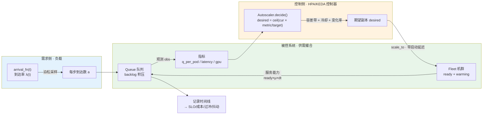
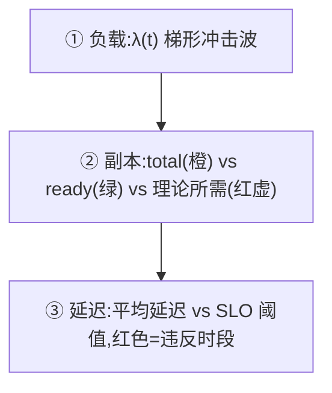

# 🚀 项目 01 · K8s 自动扩缩容(HPA / KEDA 式)仿真

> 配套《Generative AI on Kubernetes》的**本机可跑**实战项目 —— 用纯 Python 从零手写一个
> "到达流 → 队列 → Pod 机群 → 自动扩缩容控制器"的闭环仿真,定量回答一个大模型上线时
> 天天要面对的问题:**"我到底该开多少个 Pod?开多了烧钱,开少了破 SLO,这个平衡怎么找?"**

- 🧩 **主题**:Horizontal Pod Autoscaler(HPA)/ KEDA 式自动扩缩容,基于**队列长度 / 延迟 / GPU 利用率**触发,带**冷却(cooldown)**与**启动延迟(pod warmup)**。
- 🎯 **产出**:SLO 满足率、pod·小时成本、过冲(overshoot)、抖动(flapping)四大指标 + 三张时间线图。
- 💻 **环境**:Python 3.13 · numpy · matplotlib · pytest。**离线、无 GPU、无网络、无需任何 key**。
- ✅ **已自测**:`python -m pytest -q` → **19 passed**;`python run_demo.py` → 3 张图正常出。

---

## 📖 目录

1. [为什么要仿真自动扩缩容?](#1-为什么要仿真自动扩缩容)
2. [K8s 自动扩缩容是什么(HPA vs KEDA)](#2-k8s-自动扩缩容是什么hpa-vs-keda)
3. [仿真架构总览(mermaid)](#3-仿真架构总览mermaid)
4. [第一性原理:把 HPA 看成一个反馈控制器](#4-第一性原理把-hpa-看成一个反馈控制器)
5. [四大模块逐行讲解](#5-四大模块逐行讲解)
6. [控制器核心公式与代码](#6-控制器核心公式与代码)
7. [四大评估指标:SLO / 成本 / 过冲 / 抖动](#7-四大评估指标slo--成本--过冲--抖动)
8. [如何运行](#8-如何运行)
9. [读懂三张图](#9-读懂三张图)
10. [测试讲解:我们到底在验证什么](#10-测试讲解我们到底在验证什么)
11. [💡 面试高频题](#11--面试高频题)
12. [⚠️ 常见坑](#12--常见坑)
13. [📌 小结 & 🔗 延伸](#13--小结--延伸)

---

## 1. 为什么要仿真自动扩缩容?

**是什么**:自动扩缩容(autoscaling)= 让 Kubernetes 根据实时负载,自动增减服务副本(Pod)数量。

**为什么在大模型时代尤其重要**:
- LLM 推理服务**单副本极贵**(一张 A100/H100 每小时 $2~$10),多开一个是真金白银;
- 但 LLM 请求**极其突发(bursty)**(一条爆款推文能把 QPS 顶上 10 倍),开少了直接排队超时;
- 更要命的是 GPU Pod **冷启动慢**(拉几十 GB 镜像 + 加载模型权重,动辄 30s~几分钟),
  等你反应过来扩容,**新 Pod 还在启动,SLO 已经破了**。

**为什么要仿真而不是直接上真集群**:
| 直接上真集群 | 本仿真 |
|---|---|
| 一次实验烧几十刀 GPU 费 | 0 成本,毫秒级跑完 |
| 改一个参数等几分钟看效果 | 改一行跑一遍 <0.1s |
| 突发流量难复现 | 任意负载曲线一键复现 |
| 看不清"为什么破 SLO" | 每一步的队列/延迟/副本全透明可打印 |

> 💡 **实战价值**:上线前用仿真扫一遍 `minReplicas / target / cooldown` 的组合,
> 找到"成本-SLO 甜点",再把参数写进真实 HPA YAML —— 这就是 SRE/平台工程师的日常。

---

## 2. K8s 自动扩缩容是什么(HPA vs KEDA)

### HPA(Horizontal Pod Autoscaler)—— K8s 原生

HPA 是 K8s 内置控制器,每隔一个**同步周期(sync period,默认 15s)**:
1. 采样 Pod 的指标(默认 CPU / 内存利用率);
2. 按官方公式算出**期望副本数**;
3. 受 `minReplicas / maxReplicas` 和 `behavior`(冷却窗口、变化率)约束后,改 Deployment 的副本数。

一份典型 HPA YAML(和本项目参数一一对应):

```yaml
apiVersion: autoscaling/v2
kind: HorizontalPodAutoscaler
spec:
  minReplicas: 2                 # ← SimConfig.min_replicas
  maxReplicas: 60                # ← SimConfig.max_replicas
  metrics:
  - type: Resource
    resource:
      name: cpu
      target:
        type: Utilization
        averageUtilization: 70   # ← SimConfig.target_metric(利用率语义)
  behavior:
    scaleUp:
      stabilizationWindowSeconds: 0    # ← SimConfig.scale_up_cooldown(扩容要快)
    scaleDown:
      stabilizationWindowSeconds: 300  # ← SimConfig.scale_down_cooldown(缩容要稳)
```

### KEDA(Kubernetes Event-Driven Autoscaling)—— 把触发源"插件化"

HPA 原生只认 CPU/内存,但 LLM 服务真正该看的是**队列积压 / GPU 利用率 / Kafka lag**。
KEDA 就是干这个的:它把**任意外部指标**包装成 HPA 能吃的形式,于是你能写:

```yaml
# KEDA ScaledObject:按"每副本队列长度"扩缩(本项目的默认 metric="queue")
triggers:
- type: prometheus
  metadata:
    query: sum(queue_length)     # 队列长度
    threshold: "5"               # ← SimConfig.target_metric=5(每 Pod 排 5 个就扩)
```

> 🔬 **第一性原理**:HPA 提供"控制回路(control loop)",KEDA 提供"指标源(metric source)"。
> 本项目的 `metric` 参数(`queue`/`latency`/`gpu`)正是在模拟 KEDA 的**可插拔触发器**。

---

## 3. 仿真架构总览(mermaid)



**闭环的一步(每 Δt)按此顺序推进**:

```mermaid
sequenceDiagram
    participant S as Autoscaler 控制器
    participant F as Fleet 机群
    participant Q as Queue 队列
    Note over S,Q: t 时刻,dt=1s
    S->>S: 读上一步观测,算 ratio = metric/target
    S->>S: 容差带?冷却期?变化率限制?边界钳制?
    S->>F: scale_to(desired) 新 Pod 进 warming(带启动延迟)
    F->>F: tick(dt) 启动中的 Pod 倒计时,到点转 ready
    Note over Q: 生成本步到达数 a ~ Poisson(λ·dt)
    Q->>Q: backlog += a;served = min(backlog, ready×μ×dt)
    Q->>S: 产出 obs(backlog/latency/q_per_pod) 供下一步
```

---

## 4. 第一性原理:把 HPA 看成一个反馈控制器

> 🔬 **本质**:自动扩缩容不是玄学,它就是**离散时间的比例反馈控制(discrete-time proportional feedback)**。

把系统抽象成控制论的语言:

| 控制论概念 | 自动扩缩容里的对应物 |
|---|---|
| 被控变量(输出 y) | 当前指标 `currentMetric`(队列长度 / 延迟 / GPU 利用率) |
| 设定值(setpoint r) | 目标指标 `targetMetric` |
| 误差 e = r − y | `1 − currentMetric/target`(或其比值) |
| 控制量(输入 u) | 副本数 `replicas` |
| 执行器(actuator) | 创建/删除 Pod —— **带启动延迟的滞后执行器** |
| 采样周期 | HPA sync period(本项目 `dt`) |

HPA 的控制律是**比例控制的乘性形式**:

$$
\text{desiredReplicas} = \left\lceil \text{currentReplicas} \times \frac{\text{currentMetric}}{\text{targetMetric}} \right\rceil
$$

直觉:如果当前每 Pod 队列是目标的 2 倍,就把副本翻倍(2 倍供给去消化 2 倍需求)。

**为什么这个"看似简单"的控制器会出问题?** 因为执行器有**两个致命非理想特性**:
1. **滞后(dead time / startup delay)**:你下令扩容,新 Pod 要 15s~几分钟才上线。控制论告诉我们——**回路里的时滞是振荡与失稳的头号来源**。
2. **量化(quantization)**:副本是整数,`ceil` 会引入取整误差,小抖动会被放大。

这就是为什么真实 HPA 要加**容差带(tolerance)**、**冷却窗口(stabilization window)**、**变化率限制** —— 它们本质上都是**给反馈回路加阻尼(damping),防止在时滞下振荡**。本项目把这些全部实现了,你能亲眼看到加/不加的差别(见 `test_cooldown_reduces_flapping`)。

---

## 5. 四大模块逐行讲解

代码在 [`autoscale_sim.py`](autoscale_sim.py),共四块。下面挑最关键的逐行讲。

### 5.1 `Fleet` 机群 —— 处理"启动延迟"(最容易被忽略、影响最大)

```python
@dataclass
class Fleet:
    ready: int                       # 已就绪(能干活)的 Pod
    startup_delay: float             # 启动延迟(秒)
    warming: List[List[float]] = field(default_factory=list)  # [[剩余启动时间, 数量], ...]
```

- `ready`:**现在就能处理请求**的 Pod。队列只被这些 Pod 消化。
- `warming`:**已创建但还没就绪**的 Pod(在拉镜像 / 加载权重 / 等 readinessProbe)。它们**已经在计费**(占了资源),但**还不能干活**。这就是 GPU 服务扩容"钱先花了、活还没干"的痛点。

```python
def scale_to(self, target: int) -> None:
    cur_total = self.total()
    if target > cur_total:                       # 扩容
        add = target - cur_total
        if self.startup_delay <= 0:
            self.ready += add                    # 无延迟:立即就绪
        else:
            self.warming.append([self.startup_delay, float(add)])  # 有延迟:进 warming 排队
    elif target < cur_total:                     # 缩容
        remove = cur_total - target
        while remove > 0 and self.warming:       # ★ 优先砍 warming(还没干活,砍了不亏)
            ...
        if remove > 0:                           # warming 砍完还不够,再砍 ready
            self.ready = max(0, self.ready - remove)
```

> ⚠️ **坑**:很多人写仿真时让扩容"瞬间生效",于是结论过于乐观 —— 真实世界正是**启动延迟窗口内 SLO 被击穿**。本项目的 `tick()` 用倒计时精确建模了这一点:

```python
def tick(self, dt: float) -> None:
    still_warming = []
    for rem_t, n in self.warming:
        rem_t -= dt
        if rem_t <= 1e-9:
            self.ready += int(n)                 # 启动完成,加入就绪
        else:
            still_warming.append([rem_t, n])
    self.warming = still_warming
```

### 5.2 `Queue` 队列 —— 流体近似的排队模型

```python
def step(self, arrivals, ready_pods, per_pod_capacity, dt):
    self.backlog += arrivals                                   # 新到达入队
    capacity = ready_pods * per_pod_capacity * dt              # 本步服务能力(请求数)
    served = min(self.backlog, capacity)                       # 能处理多少处理多少
    self.backlog -= served
    service_rate = max(ready_pods * per_pod_capacity, 1e-9)    # 服务速率(请求/秒)
    latency = self.backlog / service_rate                      # ★ 利特尔法则即时近似
    q_per_pod = self.backlog / max(ready_pods, 1)              # 每 Pod 队列(KEDA 指标)
    return {"arrivals": arrivals, "served": served, "backlog": self.backlog,
            "latency": latency, "q_per_pod": q_per_pod}
```

- **服务能力** = `就绪副本 × 每Pod速率 × Δt`。**只有 ready 的 Pod 算数**(warming 的不算!)。
- **延迟估计**用**利特尔法则(Little's Law)** 的即时版本:$L = \lambda W \Rightarrow W = L/\lambda$,这里 $W(\text{延迟}) = \dfrac{\text{队列长度}}{\text{服务速率}}$。这不是精确的 M/M/c 排队论(见面试题),但对"宏观扩缩容行为"足够真实,而且**透明、无随机噪声掩盖控制逻辑**。

> 💡 **为什么用流体近似而非事件驱动仿真?** 因为 HPA 本身就是按固定周期采样的离散控制器;固定步长 Δt 推进最贴近其真实语义,代码也更好读、好测。精确到每个请求的离散事件仿真(DES)会引入大量随机性,反而不利于**看清控制器本身的行为**。

### 5.3 负载发生器 —— 三种典型到达流

```python
def trapezoid_load(t, base=20, peak=260, ...):  # 梯形:低→爬升→高原→回落→低(营销冲击波)
def spiky_load(t, base=30, spikes=[...]):        # 尖峰:平时低 + 若干瞬时尖峰(暴露启动延迟破口)
def diurnal_load(t, base=40, amp=120, ...):      # 昼夜正弦:潮汐流量(考验缩容不过度 + 长期成本)
```

三种形状各有考点:梯形考**爬坡扩容速度 + 回落缩容稳定性**;尖峰考**启动延迟下的 SLO 破口**;正弦考**长期成本-SLO 权衡**。

---

## 6. 控制器核心公式与代码

`Autoscaler.decide()` 是整个项目的心脏。它严格照抄 K8s HPA 官方算法,再叠加防抖机制:

```python
def decide(self, t, obs, ready):
    cur = self.current
    metric = self._current_metric_per_pod(obs, ready)   # 取出 queue/latency/gpu 指标
    ratio = metric / max(self.cfg.target_metric, 1e-9)  # 比值 = 当前/目标

    # ① 容差带:接近目标就不动(HPA tolerance,默认 0.1)—— 防"地毯式微抖动"
    if abs(ratio - 1.0) < self.cfg.tolerance:
        return cur

    # ② HPA 核心公式:desired = ceil(current × ratio)
    desired = int(np.ceil(cur * ratio))

    # ③ 变化率限制:扩容别暴涨(限倍率),缩容别狂砍(限步长)
    if desired > cur:
        desired = min(desired, int(np.ceil(cur * self.cfg.max_scale_up_rate)))
        desired = max(desired, cur + 1)
    else:
        desired = max(desired, cur - self.cfg.max_scale_down_step)
        desired = min(desired, cur - 1)

    # ④ 边界钳制:min ≤ desired ≤ max
    desired = int(np.clip(desired, self.cfg.min_replicas, self.cfg.max_replicas))
    if desired == cur:
        return cur

    # ⑤ 冷却窗口:同向动作必须间隔够久(缩容尤其要稳)
    if desired > cur:
        if t - self.last_scale_up_t < self.cfg.scale_up_cooldown:
            return cur                                  # 还在扩容冷却里,忍住
        self.last_scale_up_t = t
    else:
        if t - self.last_scale_down_t < self.cfg.scale_down_cooldown:
            return cur                                  # 还在缩容冷却里,忍住
        self.last_scale_down_t = t

    self.current = desired
    return desired
```

**五道闸门(gate)** 的作用一览:

| 闸门 | 作用 | 对应 HPA/KEDA 概念 | 不加会怎样 |
|---|---|---|---|
| ① 容差带 tolerance | 指标接近目标就不动 | HPA `tolerance`(默认 0.1) | 指标微抖就疯狂扩缩 |
| ② 核心公式 | 按比例算期望副本 | HPA 官方算法 | —— |
| ③ 变化率限制 | 限扩容倍率/缩容步长 | `behavior.scaleUp/Down.policies` | 一步扩到 max / 一步缩到 min |
| ④ 边界钳制 | 卡在 [min, max] | `minReplicas/maxReplicas` | 缩到 0 或扩爆预算 |
| ⑤ 冷却窗口 | 同向动作限频 | `stabilizationWindowSeconds` | 抖动(flapping)剧增 |

> 💡 **面试高频**:"HPA 扩容和缩容的冷却时间为什么默认不一样?"
> 答:**扩容要快(默认 0s)**——晚一秒就多破一秒 SLO;**缩容要慢(默认 300s)**——快速缩容遇到流量回弹会立刻再扩,来回抖动(flapping)且每次扩容都吃启动延迟。**"急着救火、慢着撤火"**是自动扩缩容的黄金法则。本项目默认 `scale_up_cooldown=0, scale_down_cooldown=60` 正是这个哲学。

---

## 7. 四大评估指标:SLO / 成本 / 过冲 / 抖动

`compute_metrics()` 把整条时间线压成几个能上汇报 PPT 的数字:

| 指标 | 定义 | 越好的方向 | 代价/权衡 |
|---|---|---|---|
| **SLO 满足率** `slo_ok_ratio` | 延迟 ≤ 阈值 的时间步占比 | ↑ 越高越好 | 提高它要多开 Pod → 更贵 |
| **成本** `cost` | `Σ total_pods × dt / 3600 × 单价` | ↓ 越低越好 | 降它要少开 Pod → SLO 差 |
| **平均过冲** `avg_overshoot` | 平均(总副本 − 理论所需)的正部分 | ↓ 越低越省 | 降它易在启动延迟下破 SLO |
| **抖动** `flaps` | 期望副本序列"方向反转"的次数 | ↓ 越低越稳 | 降它要加冷却 → 缩容变慢多花钱 |

关键实现细节:

```python
# 成本:注意用 total_pods(含 warming!),因为"占用即计费"
pod_hours = float(np.sum(total_pods) * dt / 3600.0)
cost = pod_hours * cfg.pod_cost_per_hour

# 过冲:理论所需就绪副本 ≈ ceil(λ / per_pod_capacity)(把负载正好压住的下界)
need = np.clip(np.ceil(lam / cfg.per_pod_capacity), cfg.min_replicas, cfg.max_replicas)
overshoot = float(np.mean(np.clip(total_pods - need, 0, None)))

# 抖动:方向反转次数(先扩后缩、先缩后扩 各算一次)
diff = np.diff(desired); sign = np.sign(diff); sign = sign[sign != 0]
flaps = int(np.sum(sign[1:] != sign[:-1])) if sign.size > 1 else 0
```

> 🔬 **第一性原理 · "不可能三角"**:**低成本、高 SLO、低抖动** 三者不可兼得。
> 想省钱(少 Pod)必伤 SLO;想稳(重冷却)必增成本(缩容慢);想 SLO 满分必过量配置(高成本+高过冲)。
> 自动扩缩容调参的本质,就是在这个三角里,**根据业务把权重定下来**。

---

## 8. 如何运行

```bash
# 进入项目目录
cd book-genai-on-kubernetes/projects/01_k8s_autoscale_sim

# (可选)装依赖 —— 本机已装可跳过
pip install -r requirements.txt

# 1) 跑测试(必过:19 passed)
python -m pytest -q

# 2) 出图 + 打印指标(生成 figures/*.png)
python run_demo.py

# 3) 直接跑一条默认仿真看摘要
python autoscale_sim.py
```

**自定义实验**(3 行代码扫参数):

```python
from autoscale_sim import SimConfig, simulate, spiky_load

cfg = SimConfig(
    metric="gpu",            # 换成 GPU 利用率触发
    target_metric=0.7,       # 目标 70% GPU 利用率
    pod_startup_delay=30.0,  # 模拟 LLM 大镜像冷启动 30s
    scale_down_cooldown=180, # 缩容冷却 3 分钟
    arrival_fn=spiky_load,   # 尖峰负载
)
out = simulate(cfg)
print(out["metrics"])        # → SLO / 成本 / 过冲 / 抖动
```

---

## 9. 读懂三张图

`run_demo.py` 出三张图到 `figures/`。

### 图 1 · `fig_timeline.png`(核心叙事图,三联)



**看点(结论就藏在这三张图里)**:
- **② 里橙线冲到 60、绿线滞后** → 这就是**过冲 + 启动延迟**:控制器为压住暴涨的队列狂扩到 60 个,但 ready 副本要等启动延迟才跟上;橙色阴影区就是**多花的钱(overshoot)**。
- **③ 里唯一一根红色延迟尖峰出现在 t≈130(负载刚爬坡时)** → 这是**启动延迟窗口内 SLO 被击穿**的铁证:load 涨了,新 Pod 还在 warming,队列瞬间堆高。这正是"扩容要快"的现实理由。
- **负载 t≈380 回落后,绿线缓慢下台阶** → **保守缩容**:`max_scale_down_step=4 + cooldown=60` 让副本慢慢降,代价是回落段一直在**多花钱**(换来的是**不抖 + 抗回弹**)。

### 图 2 · `fig_tradeoff.png`(成本-SLO 权衡曲线)

扫 `target ∈ {1,2,3,5,8,12,18,25}`,横轴越往右越激进(每 Pod 扛越满、副本越少)。实测:

| target(每Pod队列) | 1 | 2 | 3 | 5 | 8 | 12 | 18 | 25 |
|---|---|---|---|---|---|---|---|---|
| SLO 满足率 | 100% | 100% | 99.5% | 97.7% | 97.7% | 97.2% | 96.5% | **89.7%** |
| 成本 | 17.0 | 16.7 | 16.7 | 15.8 | 15.8 | 15.7 | 15.4 | **15.0** |

**读法**:**左上=贵而稳,右下=省而险**。曲线的"膝盖(knee)"就是选型甜点 —— 例如 `target=5` 用 93% 的成本换来 97.7% 的 SLO,通常是不错的平衡点。

### 图 3 · `fig_metric_compare.png`(queue / latency / gpu 三种触发对比)

在**尖峰负载**下对比三种 KEDA 触发指标的扩容行为与延迟表现,直观看到:**用什么指标触发,决定了你对突发的反应速度和最终账单**。

---

## 10. 测试讲解:我们到底在验证什么

`python -m pytest -q` → **19 passed in 0.11s**。测试**不测"某数字恰好等于几",而测控制器的定性行为契约**(更抗随机噪声、更贴工程):

```
tests/test_autoscale.py::test_high_load_scales_up ..................... PASSED   # 高负载→必扩容
tests/test_autoscale.py::test_high_load_meets_capacity ............... PASSED   # 扩容后积压被压下去
tests/test_autoscale.py::test_low_load_scales_down .................. PASSED   # 低负载→必缩容
tests/test_autoscale.py::test_never_below_min_replicas ............. PASSED   # 永不低于 min
tests/test_autoscale.py::test_cooldown_reduces_flapping ........... PASSED   # 冷却→抖动不增反降
tests/test_autoscale.py::test_tolerance_band_suppresses_micro_scaling  PASSED  # 容差带抑制微抖
tests/test_autoscale.py::test_cost_slo_tradeoff .................. PASSED   # 保守更贵但 SLO 更好
tests/test_autoscale.py::test_more_pods_lower_latency ........... PASSED   # 副本越多延迟越低
tests/test_autoscale.py::test_pod_startup_delay_is_real ........ PASSED   # 启动延迟真的生效
tests/test_autoscale.py::test_scale_down_prefers_warming_pods . PASSED   # 缩容优先砍 warming
tests/test_autoscale.py::test_queue_drains_with_enough_capacity  PASSED   # 容量足→队列清空
tests/test_autoscale.py::test_queue_builds_when_underprovisioned PASSED   # 容量不足→积压上升
tests/test_autoscale.py::test_replicas_within_bounds[trapezoid]  PASSED   # 副本恒在 [min,max]
tests/test_autoscale.py::test_replicas_within_bounds[spiky] .... PASSED
tests/test_autoscale.py::test_replicas_within_bounds[diurnal] .. PASSED
tests/test_autoscale.py::test_metric_gpu_and_latency_modes_run . PASSED   # 三种触发都能跑
tests/test_autoscale.py::test_determinism_with_seed ........... PASSED   # 同种子→可复现
tests/test_autoscale.py::test_slo_ratio_is_fraction .......... PASSED   # SLO∈[0,1]
tests/test_autoscale.py::test_zero_load_costs_min ........... PASSED   # 零负载不乱扩
```

**四个核心测试(对应任务要求)对应的工程含义**:
1. **高负载扩容** `test_high_load_scales_up`:200 rps 恒定负载(每 Pod 仅 10 rps)→ 峰值副本 ≥18,证明供不应求时能顶上去。
2. **低负载缩容** `test_low_load_scales_down`:先 200 后 10 rps → 结束副本 < 峰值的一半,证明供大于求时能降下来。
3. **冷却防抖** `test_cooldown_reduces_flapping`:对锯齿负载,加长缩容冷却后 `flaps` 不增(通常大降),证明冷却窗口确实是抗抖动的关键阻尼。
4. **成本-SLO 权衡** `test_cost_slo_tradeoff`:保守(target=2)vs 激进(target=15)→ 保守更贵但 SLO 不差,证明"不可能三角"在仿真里成立。

---

## 11. 💡 面试高频题

<details>
<summary><b>Q1:HPA 的期望副本数是怎么算的?为什么用乘法而不是加法?</b></summary>

`desiredReplicas = ceil(currentReplicas × currentMetric / targetMetric)`。
用**乘性(比例)**而非加性,是因为它自带**归一化 + 快速收敛**:如果每 Pod 负载是目标的 3 倍,直接 ×3 一步到位;加法则要一个个试,收敛慢。乘性也让"当前副本数"信息进入了决策(副本多时同样比例意味着加更多绝对数量)。
</details>

<details>
<summary><b>Q2:为什么扩容快、缩容慢?flapping 是什么?</b></summary>

**flapping(抖动)** = 短时间反复扩了又缩。快速缩容遇到流量回弹会立刻再扩,而**每次扩容都要吃启动延迟**,来回折腾既破 SLO 又费钱。所以缩容加长冷却窗口(HPA 默认 300s)当阻尼;扩容保持快(默认 0s)以救火。本项目 `test_cooldown_reduces_flapping` 就是量化这个效应的。
</details>

<details>
<summary><b>Q3:启动延迟(pod warmup)对自动扩缩容有什么影响?LLM 服务为什么尤其严重?</b></summary>

启动延迟是**执行器的时滞(dead time)**,是回路失稳与 SLO 破口的头号来源。你下令扩容时,新 Pod 要 `startup_delay` 后才分担负载,这段"空窗期"队列疯涨。LLM 服务尤其严重:镜像几十 GB、模型权重要 load 进显存、还要 warmup CUDA kernel,冷启动 30s~几分钟很常见。**缓解手段**:预留 buffer 副本、预热池(warm pool / over-provision)、更激进的扩容触发、用 KEDA `activationThreshold` 提前扩。
</details>

<details>
<summary><b>Q4:本仿真的延迟模型用了利特尔法则,和精确 M/M/c 排队论差在哪?</b></summary>

利特尔法则 $L=\lambda W$ 是**任何稳态排队系统都成立的恒等式**,我们用它的即时版 $W=\text{队列}/\text{服务率}$ 做流体近似。精确 M/M/c 会用 Erlang-C 公式算排队概率,考虑到达/服务的指数分布随机性。差别:**流体近似不建模"随机波动导致的短暂排队"**,在利用率接近 1 时会低估延迟。但对"宏观扩缩容行为"研究足够,且透明无噪声。生产中要更准可换成离散事件仿真(DES)。
</details>

<details>
<summary><b>Q5:队列长度触发 vs GPU 利用率触发 vs 延迟触发,各有什么优劣?</b></summary>

- **GPU 利用率**:最直接反映资源饱和度,但**利用率高 ≠ 延迟差**(批处理可以高利用率低延迟),且利用率是滞后信号。
- **队列长度(KEDA 常用)**:领先信号,队列刚开始堆就能扩,反应快;但需要能观测到队列(如 Kafka lag、请求 backlog)。
- **延迟**:最贴近 SLO(用户真正感知的),但**延迟是最滞后的信号**——等延迟涨上来,SLO 已经在破了。
实践中常**队列/GPU 触发扩容(领先)、延迟做兜底告警(滞后)**。
</details>

<details>
<summary><b>Q6:如果让你把这个仿真接到真实集群,还缺什么?</b></summary>

缺:(1) 真实指标采集(Prometheus + metrics-server / KEDA scaler);(2) Pod 调度延迟与节点扩容(Cluster Autoscaler / Karpenter,Pod 无处可调时要先加节点,延迟更大);(3) 请求级负载均衡与 Pod 就绪探针;(4) 有状态/KV-cache 迁移成本(LLM 缩容要考虑正在处理的长请求)。本仿真聚焦控制回路本身,这些是工程化的下一层。
</details>

---

## 12. ⚠️ 常见坑

| # | 坑 | 后果 | 本项目怎么处理 |
|---|---|---|---|
| 1 | **matplotlib 中文乱码 / 负号变方块** | 图上全是 □□□ | `rcParams["font.sans-serif"]=["Microsoft YaHei","SimHei"]` + `axes.unicode_minus=False` |
| 2 | **无显示环境画图报错** | `run_demo` 崩溃 | `matplotlib.use("Agg")` **必须在 import pyplot 之前** |
| 3 | **成本只算 ready、漏了 warming** | 低估成本(warming 也在计费) | `cost` 用 `total_pods`(含 warming) |
| 4 | **让扩容瞬间生效** | 结论过于乐观,掩盖 SLO 破口 | `Fleet` 用倒计时精确建模启动延迟 |
| 5 | **queue-per-pod 指标 + 慢启动 → 运行时暴冲** | 副本一步冲到 max、过冲巨大 | 用 `max_scale_up_rate` 限倍率 + 合理 `target` |
| 6 | **缩容不加冷却** | flapping,来回抖 | `scale_down_cooldown` 默认 60s(生产建议 300s) |
| 7 | **`ceil` 取整导致卡住不动** | 该扩不扩 | 扩容强制 `≥ cur+1`,缩容 `≤ cur-1` |
| 8 | **随机到达不设种子** | 结果不可复现,测试 flaky | `rng_seed` + `np.random.default_rng` |
| 9 | **Windows PowerShell 下中文输出乱码** | 终端摘要看不清 | 不影响图片;终端可 `chcp 65001` 或直接看 PNG |

> ⚠️ **最隐蔽的坑(#5)**:如果你把 `target_metric` 设得太大(比如每 Pod 队列 20)且 `per_pod_capacity` 小,那么**等指标涨到触发点时,队列已经堆得很高**,控制器一看比值巨大就 `ceil` 到 max,造成剧烈过冲。教训:**触发阈值要留出"启动延迟 × 到达率"的提前量**,别等火烧眉毛才扩。

---

## 13. 📌 小结 & 🔗 延伸

### 📌 小结

- **自动扩缩容 = 带时滞的离散比例反馈控制**。HPA 给控制回路,KEDA 给可插拔指标源。
- 核心公式一行:`desired = ceil(cur × metric/target)`,再叠**容差带 / 变化率 / 冷却 / 边界**四道阻尼闸门。
- **启动延迟**是 LLM 服务自动扩缩容的头号敌人:钱先花(warming 计费)、活后干(ready 滞后),SLO 破口都在这个窗口。
- 存在**低成本 / 高 SLO / 低抖动 的"不可能三角"**;调参就是在三角里按业务定权重,用仿真扫出甜点。
- 本项目 4 大指标(SLO / 成本 / 过冲 / 抖动)+ 3 张图 + 19 个行为测试,把上面每个论断都**可复现地量化**了。

### 🔗 延伸

- **官方**:[Kubernetes HPA 算法文档](https://kubernetes.io/docs/tasks/run-application/horizontal-pod-autoscale/) · [KEDA 文档](https://keda.sh/docs/)
- **进阶方向**(可在本仓库继续做):
  - `02_*`:接入 **Cluster Autoscaler / Karpenter** 层(Pod 无处调度时先扩节点,双层时滞)。
  - 把延迟模型从**流体近似**换成 **M/M/c Erlang-C** 或**离散事件仿真(DES)**,对比结论差异。
  - 加 **predictive autoscaling**(用历史负载预测未来,提前扩容抵消启动延迟)。
  - 加 **LLM 特有约束**:KV-cache 显存占用、长请求缩容时的优雅排空(graceful drain)。
- **书本对应**:《Generative AI on Kubernetes》自动扩缩容章 —— 本项目是它的"能跑的沙盘"。

---

> 🧪 **可复现性声明**:本项目完全离线,不下载任何模型 / 不访问网络 / 不需要 GPU 或 API key。
> 所有随机性由 `rng_seed` 控制,`python -m pytest -q` 稳定 **19 passed**,`python run_demo.py` 稳定出 3 张图。
