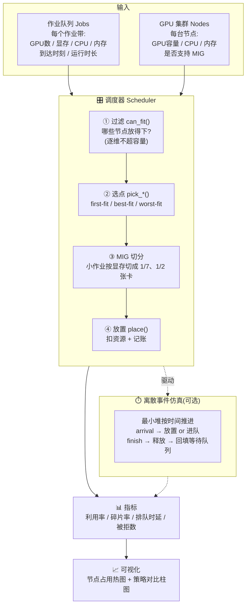
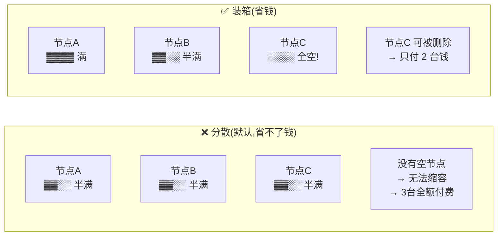
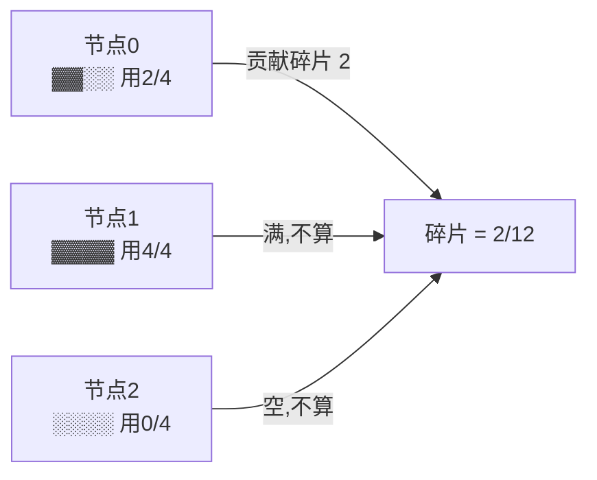
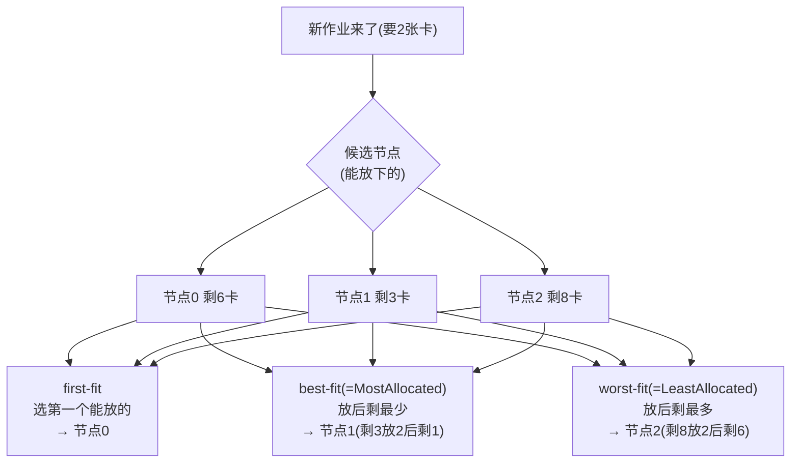
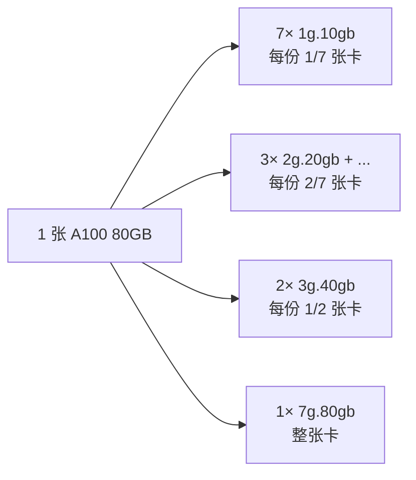
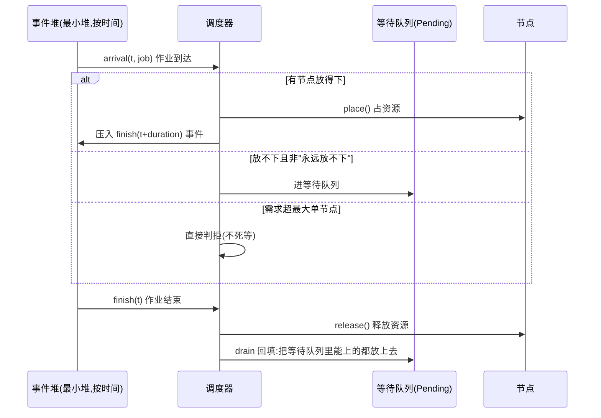
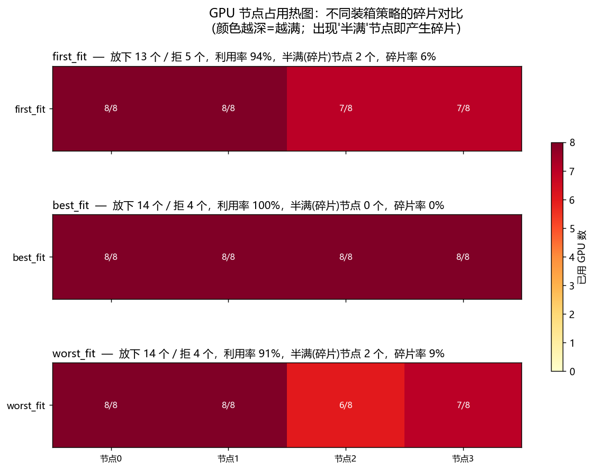
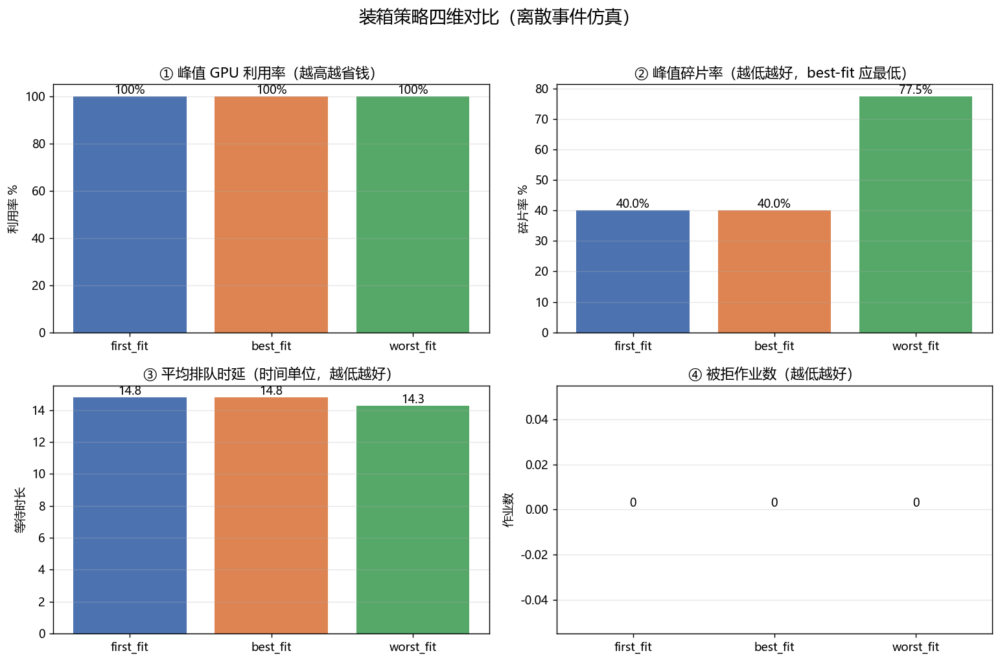

# 🧩 项目 02：GPU 装箱调度仿真（GPU Bin-Packing Scheduler）

> 配套《**Generative AI on Kubernetes**》（Roland Huss / Daniele Zonca 著）第 7 章「作业调度优化 · Job Scheduling Optimization」§7.2 **Bin Packing（装箱）** 与 NVIDIA KAI 的 **MIG（Multi-Instance GPU）切分**。
>
> 本项目用**纯 Python**（零 GPU、零网络、零 K8s 集群）在本机复刻真实 GPU 集群调度器的**核心决策逻辑**，让你把「装箱 / 碎片 / 利用率 / 排队 / 被拒 / MIG」这几个抽象概念，变成**能跑、能测、能画图**的代码。

---

## 📋 目录

- [🎯 这个项目解决什么问题](#-这个项目解决什么问题)
- [🗺️ 全景图](#️-全景图)
- [🔬 第一性原理：为什么 GPU 调度要"反着来"装箱](#-第一性原理为什么-gpu-调度要反着来装箱)
- [📐 核心概念逐个讲透](#-核心概念逐个讲透)
- [🏗️ 代码架构与逐行讲解](#️-代码架构与逐行讲解)
- [🎛️ 三种放置策略 first-fit / best-fit / worst-fit](#️-三种放置策略-first-fit--best-fit--worst-fit)
- [🍰 MIG 切分：把一张大卡切成 7 份](#-mig-切分把一张大卡切成-7-份)
- [⏱️ 离散事件仿真：作业会到达、运行、结束、释放](#️-离散事件仿真作业会到达运行结束释放)
- [🚀 如何运行](#-如何运行)
- [📊 结果解读](#-结果解读)
- [🧪 测试怎么设计的](#-测试怎么设计的)
- [💡 面试高频题](#-面试高频题)
- [⚠️ 常见坑合集](#️-常见坑合集)
- [📌 小结](#-小结)
- [🔗 延伸阅读](#-延伸阅读)

---

## 🎯 这个项目解决什么问题

在一个共享 GPU 集群里，**一堆作业**（训练 / 微调 / 推理）带着各自的 **GPU / 显存 / CPU / 内存**需求排队等着上机。调度器要决定：**每个作业该放到哪台节点上？**

这个决定看似简单，却直接决定了四个昂贵的指标：

| 指标 | 英文 | 一句话 | 谁付账 |
| --- | --- | --- | --- |
| 🔋 集群利用率 | Utilization | 有多少 GPU 真在干活 | 越低越烧钱 |
| 🧩 碎片率 | Fragmentation | 有多少空闲 GPU「够不着」，放不下大作业 | 隐形浪费 |
| ⏳ 排队时延 | Queueing delay | 作业从到达到开跑等了多久 | 用户体验 |
| 🚫 被拒作业 | Rejected jobs | 有多少作业压根放不下 | SLA 违约 |

> 🔬 **本质**：GPU 调度是一个**在线多维装箱问题（online multi-dimensional bin packing）**——箱子 = 节点，物品 = 作业，维度 = GPU/显存/CPU/内存。装箱问题是 **NP-hard**，所以现实中都用**启发式（heuristic）**：first-fit、best-fit（K8s 的 `MostAllocated`）等。本项目就是把这些启发式**跑起来、量出来、画出来**。

**你将得到**：
- `scheduler.py`：一个能读懂的调度引擎（节点/作业模型 + 三种策略 + MIG + 指标 + 离散事件仿真）。
- `tests/test_scheduler.py`：26 个单元测试，覆盖「不超容量 / best-fit 碎片≤first-fit / 利用率 / MIG / 排队 / 被拒」。
- `run_demo.py`：一键出两张图（节点占用热图 + 策略四维对比）。

---

## 🗺️ 全景图



**一句话流水线**：作业进队 → 调度器过滤出能放的节点 → 按策略选一个 →（可选 MIG 切分）→ 放置扣资源 → 到时释放 → 全程记账出指标 → 画图。

---

## 🔬 第一性原理：为什么 GPU 调度要"反着来"装箱

Kubernetes 的**默认**调度器是给**无状态微服务**设计的，它倾向于把 Pod **分散（spread）**到不同节点——因为微服务要**高可用**：鸡蛋不放一个篮子，一台机器挂了还有别的副本顶上。

但 **GPU 训练平台常常需要完全相反的做法——装箱（bin packing）**：把作业**紧紧塞进尽量少的节点**。

> 🔬 **为什么反着来？** 原书给的关键数字：**GPU 节点每小时 $10–30**。
>
> - 如果作业**稀疏分布**，每台节点都"半满"，那么**没有一台节点是空的**，autoscaler（自动伸缩器）就**无法安全地缩容删除**任何节点 → 你为一堆"半空"的机器**付满价**。
> - 反之，把作业**塞满少数节点**，就能腾出**完全空闲**的节点，让 autoscaler 安全地 drain（排空）并删除 → **直接省钱**。



在 K8s 里，这个"反着来"是通过把调度器打分插件 `NodeResourcesFit` 的策略从默认的 `LeastAllocated`（谁空往谁放 → 分散）换成 **`MostAllocated`**（谁满往谁放 → 集中）实现的。

> 💡 **`MostAllocated` ↔ 本项目的 `best_fit`**：`MostAllocated` 给"已分配越多"的节点打越高分，本质就是**best-fit**——挑放下后剩余最少的节点。本项目的 `worst_fit` 则对应默认的 `LeastAllocated`（分散），作为**对照组**存在，用来直观展示"分散会制造多少碎片"。

> ⚠️ **装箱不是免费午餐**（原书明确的三重代价）：
> 1. **单点故障放大**——一台节点挂了会同时影响**更多**作业（都挤一起）。
> 2. **资源争抢**——就算 GPU 够，CPU/内存/网络带宽也可能成瓶颈。
> 3. **所以生产平台常用多个调度器 profile**：实验性/可容忍中断的作业用装箱（省钱），关键作业用分散（要韧性）。装箱**尤其适合**有 checkpoint/resume 兜底的批量训练——被打断了从检查点续跑即可。

---

## 📐 核心概念逐个讲透

每个概念都按「**是什么 / 为什么 / 怎么用 / 代价**」四问讲。

### 1️⃣ 节点 Node（箱子）

- **是什么**：集群里一台物理机，有固定的 GPU/CPU/内存**容量**，和当前**已用**量。
- **为什么**：调度的本质是往箱子里塞物品，节点就是箱子。
- **怎么用**：`可用量 = 容量 - 已用`；`can_fit(job)` 检查放不放得下；`place/release` 加减资源。
- **代价**：多维度让"能不能放"变复杂——**任何一维超了都不能放**（下面第 4 点）。

### 2️⃣ 作业 Job（物品）

- **是什么**：一个待调度单元（K8s 的 Pod / PodGroup），带 GPU/显存/CPU/内存需求 + 到达时刻 + 运行时长。
- **为什么单列"显存"**：因为 **MIG 切分的本质就是按显存把一张卡切成几份**。只看"要几张卡"看不出能不能切。
- **怎么用**：`wait_time = start_time - arrival` 就是排队时延。
- **代价**：需求维度越多，装箱越难，碎片越容易产生。

### 3️⃣ 利用率 Utilization

$$
\text{集群 GPU 利用率} = \frac{\sum_{\text{节点}} \text{已用 GPU}}{\sum_{\text{节点}} \text{总 GPU}}
$$

- **是什么**：有多少 GPU 真在干活（0~1）。
- **为什么**：GPU 每小时 $10–30，利用率每低 10% 就是白烧几百刀/天。
- **怎么用**：见 `cluster_gpu_utilization()`。
- **代价**：一味追求高利用率会挤爆节点、放大故障（见装箱三重代价）。

### 4️⃣ 碎片率 Fragmentation（本项目最核心的指标）

$$
\text{碎片率} = \frac{\sum_{\text{节点}} [\,0 < \text{已用} < \text{容量}\,] \cdot \text{空闲 GPU}}{\sum_{\text{节点}} \text{总 GPU}}
$$

- **是什么**：**「非空但未满」节点上的空闲 GPU**占总 GPU 的比例。
- **为什么这么定义**：一张卡如果散落在很多"半满"节点上，就算总空闲很多，也**放不下一个需要整节点的大作业**——这些"够不着的空闲"就是碎片。
  - **完全空**的节点**不算碎片**（它随时能被大作业整块使用，或被缩容删除）。
  - **完全满**的节点没有空闲，也不算碎片。
  - 只有**"用了一半、卡在中间"**的节点贡献碎片。
- **怎么用**：见 `fragmentation()`。
- **代价 / 卖点**：**best-fit 的核心价值就是——在典型负载下碎片率 ≤ first-fit**，因为它总把作业往最满的节点塞，尽量不去"开新的半满节点"。



> 上图对应测试 `test_fragmentation_definition`：3 节点各 4 卡，node0 半满贡献 2 碎片，node1 满、node2 空都不贡献 → 碎片率 = 2/12。

### 5️⃣ 排队时延 & 被拒

- **排队时延**：作业**到达**到真正**开跑**之间等了多久。资源不够就得排队，等别的作业跑完释放了资源才轮到它。
- **被拒**：作业**永远放不下**（需求超过最大单节点容量），或时间线结束仍等不到资源。

---

## 🏗️ 代码架构与逐行讲解

```
02_gpu_binpacking_scheduler/
├── scheduler.py          # 核心引擎（数据模型 + 策略 + MIG + 指标 + 仿真）
├── run_demo.py           # 出图 Demo（Agg 后端 + 中文字体）
├── requirements.txt      # 依赖（纯 CPU，可离线）
├── tests/
│   └── test_scheduler.py # 26 个单元测试
├── node_occupancy_heatmap.png   # 运行 run_demo 后生成
└── strategy_compare.png         # 运行 run_demo 后生成
```

### 🧱 数据模型：`Node` 与 `Job`（`@dataclass`）

用 Python 的 `@dataclass` 定义，一行 = 一个字段，可读性拉满。核心是 `Node` 的三个"可用量"属性和 `can_fit / place / release`：

```python
@dataclass
class Node:
    node_id: int
    gpus: int                       # 物理 GPU 张数（容量）
    cpu: float                      # CPU 核数（容量）
    mem_gb: float                   # 主存 GB（容量）
    gpu_mem_gb: float = 80.0        # 单卡显存（默认 A100 80GB）
    mig_enabled: bool = False       # 是否支持 MIG 切分
    used_gpus: float = 0.0          # 已用 GPU（MIG 下可能是小数）
    used_cpu: float = 0.0
    used_mem_gb: float = 0.0
    job_ids: list[int] = field(default_factory=list)

    @property
    def free_gpus(self) -> float:
        return self.gpus - self.used_gpus      # 可用 = 容量 - 已用
```

> 💡 **注意 `used_gpus` 是 `float` 而不是 `int`**——因为 MIG 下一个作业可能只占 **0.5 张**或 **1/7 张**卡。这个小小的类型选择，是"支持 MIG"的关键前提。

**`can_fit` —— "装箱不超容量"这条铁律的落点**：

```python
def can_fit(self, job: Job) -> bool:
    gpu_need = _gpu_demand_on(job, self)       # ① 先算 MIG 切分后的等效卡数
    return (
        gpu_need   <= self.free_gpus  + 1e-9   # ② GPU 维不超
        and job.cpu    <= self.free_cpu    + 1e-9   # ③ CPU 维不超
        and job.mem_gb <= self.free_mem_gb + 1e-9   # ④ 内存维不超
    )
```

逐行讲：
- **①** `_gpu_demand_on` 把「作业要几张卡 + 每卡显存」翻译成「在这台节点上等效占几张物理卡」（MIG 节点上可能是小数）。
- **②③④** **逐维检查**——这是多维装箱的核心：**只要有一维放不下，整个作业就放不下**。三个 `and` 缺一不可。
- **`+ 1e-9`**：浮点容差。MIG 切分产生 `1/7 ≈ 0.142857...` 这种无限小数，直接比较会因浮点误差误判"放不下"。加个 epsilon 兜底。

> ⚠️ **常见坑**：很多人写调度只检查 GPU 维，忘了 CPU/内存。真实集群里**CPU 或内存先耗尽**导致 GPU 空着却放不下作业，是"GPU 利用率上不去"的经典元凶。测试 `test_can_fit_each_dimension` 专门守这条。

**`place` —— 放置 + 记账 + 防超卖断言**：

```python
def place(self, job: Job, now: float) -> None:
    gpu_need = _gpu_demand_on(job, self)
    assert self.can_fit(job), f"Node{self.node_id} 放不下 Job{job.job_id}（违反容量约束）"
    self.used_gpus   += gpu_need               # 扣 GPU
    self.used_cpu    += job.cpu                 # 扣 CPU
    self.used_mem_gb += job.mem_gb             # 扣内存
    self.job_ids.append(job.job_id)            # 记账：这个作业落在我这
    job.node_id = self.node_id                 # 回填：作业记住自己在哪
    job.start_time = now                       # 回填：记录开跑时刻(算排队时延用)
```

> 💡 那句 `assert self.can_fit(job)` 是**契约式编程**——即使调度逻辑有 bug，也会在放置的瞬间**炸给你看**，绝不静默超卖。测试 `test_place_rejects_overcommit_assertion` 就是故意去撞它。

**`release` —— 归还资源 + 浮点兜底**：

```python
def release(self, job: Job) -> None:
    gpu_need = _gpu_demand_on(job, self)
    self.used_gpus   -= gpu_need
    self.used_cpu    -= job.cpu
    self.used_mem_gb -= job.mem_gb
    self.used_gpus   = max(0.0, self.used_gpus)   # ⚠️ 浮点漂移兜底,防负数
    ...
```

> ⚠️ **坑**：反复加减 `1/7` 这类无限小数，浮点误差会累积，可能让 `used_gpus` 变成 `-1e-16` 这种**负数**。`max(0.0, ...)` 把它夹回 0。测试 `test_capacity_never_exceeded_simulation` 里有 `used_gpus >= -1e-9` 这条断言守着。

---

## 🎛️ 三种放置策略 first-fit / best-fit / worst-fit

「过滤出能放的节点」之后，要从中**挑一个**。这就是策略的战场。



### first-fit（最朴素基线）

```python
def pick_first_fit(nodes, job):
    for node in nodes:
        if node.can_fit(job):
            return node          # 从头扫,遇到第一个放得下的就放
    return None
```

- **优点**：O(N) 最快，实现最简单。
- **缺点**：不挑肥拣瘦，容易把小作业撒到很多节点 → 碎片偏多。

### best-fit（≈ K8s `MostAllocated`，装箱主角）

```python
def pick_best_fit(nodes, job):
    best, best_leftover = None, float("inf")
    for node in nodes:
        if not node.can_fit(job):
            continue
        leftover = node.free_gpus - _gpu_demand_on(job, node)  # 放置后剩余GPU
        if leftover < best_leftover - 1e-9:                     # 越小越好
            best_leftover, best = leftover, node
    return best
```

- **打分键 = 放置后的剩余 GPU**，越小越好——"谁最满往谁塞"。
- **为什么省钱**：把作业塞进"已经很满"的节点，就能让另一些节点保持**完全空闲**，autoscaler 才能安全缩容删除 → 省钱。

### worst-fit（≈ K8s 默认 `LeastAllocated`，对照组）

```python
def pick_worst_fit(nodes, job):
    # 挑"放置后剩余最多"的节点 —— 追求负载均衡/高可用,代价是没有空节点、无法缩容
    ...
```

**三者对比表**：

| 策略 | 选点规则 | K8s 对应 | 碎片 | 成本 | 韧性 |
| --- | --- | --- | --- | --- | --- |
| first-fit | 第一个能放的 | —（朴素基线） | 中 | 中 | 中 |
| **best-fit** | 放后**剩最少** | **`MostAllocated`** | **低** ✅ | **低** ✅ | 低（挤一起） |
| worst-fit | 放后剩最多 | `LeastAllocated`（默认） | 高 | 高 | 高 |

> 💡 **面试点**：装箱（best-fit / MostAllocated）用**低成本 + 低碎片**换取**低韧性**；分散（worst-fit / LeastAllocated）反之。没有银弹，**生产环境按作业类型分 profile**。

---

## 🍰 MIG 切分：把一张大卡切成 7 份

**MIG（Multi-Instance GPU）** 是 NVIDIA A100/H100 的硬件特性：把**一张物理 GPU 按显存/算力切成多个物理隔离的小实例**。一张 A100 80GB 可切成 1/2/3/7 份。

> 🔬 **第一性原理**：MIG 不是"软件超卖"，而是硬件把 **SM（流处理器）/ 显存 / L2 cache** 按固定 **profile** 物理隔离。所以你**不能随便切**——需要 15GB 显存，也得占用 20GB 那一档（`2g.20gb`），多出来的 5GB 就是**切分粒度带来的内部碎片**。



代码里用一张档位表 + "向上取档"函数：

```python
MIG_PROFILES = {
    10.0: 1.0 / 7,   # 1g.10gb  → 占 1/7 张卡
    20.0: 2.0 / 7,   # 2g.20gb  → 占 2/7 张卡
    40.0: 1.0 / 2,   # 3g.40gb  → 占 1/2 张卡（近似）
    80.0: 1.0,       # 7g.80gb  → 占整张卡
}

def mig_fraction(gpu_mem_gb, card_mem_gb=80.0):
    if gpu_mem_gb <= 0:
        return 0.0
    scale = card_mem_gb / 80.0
    for tier_mem in sorted(MIG_PROFILES):          # 10, 20, 40, 80 从小到大
        if gpu_mem_gb <= tier_mem * scale + 1e-9:  # 第一个 >= 需求的档
            return MIG_PROFILES[tier_mem]
    return 1.0                                     # 超过整卡 → 占满
```

> `mig_fraction(15) == 2/7`：15GB 向上取到 20GB 档。这正是"内部碎片"的来源。测试 `test_mig_fraction_tiers` 把每个档位都验了一遍。

**什么时候才切？** 只对"要不到一整张卡"的**小作业**有意义：

```python
def _gpu_demand_on(job, node):
    if (node.mig_enabled                       # ① 节点开了 MIG
        and job.gpus == 1                      # ② 作业只要 1 张卡
        and 0 < job.gpu_mem_gb < node.gpu_mem_gb):  # ③ 且只要一部分显存
        return mig_fraction(job.gpu_mem_gb, node.gpu_mem_gb)
    return float(job.gpus)                      # 否则:整数张卡(最常见)
```

> ⚠️ **坑**：一个要 4 张卡的分布式训练**谈 MIG 切分毫无意义**（它本来就吃满整卡甚至跨卡）。所以只在 `gpus == 1 且显存 < 整卡` 时才切。测试 `test_mig_demand_on_node` 验证了"多卡作业在 MIG 节点也不切"。

**收益有多大？** run_demo 的输出：

```
关闭 MIG: 8 张卡放下  8/48 个 10GB 作业，GPU 利用率 100%
开启 MIG: 8 张卡放下 48/48 个 10GB 作业，GPU 利用率  86%
→ MIG 把 8 张整卡切成 56 个 1/7 实例，小作业密度提升 7 倍。
```

> 💡 **本质**：不开 MIG，一个只要 10GB 的小推理服务也要**独占一整张 80GB 的卡**——浪费 87.5% 显存。开 MIG，7 个这样的作业挤一张卡。**这就是 GPU-as-a-Service 平台把小作业密度做上去的关键手段。**

---

## ⏱️ 离散事件仿真：作业会到达、运行、结束、释放

前面的"静态装箱"（`schedule_static`）假设作业永不结束，适合教学快照。真实集群是**活的**——作业陆续到达、跑一段时间、结束释放资源。`simulate()` 用**离散事件仿真（discrete-event simulation）**还原这个过程。



核心是一个**最小堆**按时间推进，两类事件：

```python
heap = []  # (time, seq, kind, job)  —— seq 做稳定排序,避免直接比较 Job 对象
for job in jobs:
    heapq.heappush(heap, (job.arrival, seq, "arrival", job))

while heap:
    t, _, kind, job = heapq.heappop(heap)
    if kind == "arrival":
        if not try_place(job, t):              # 尝试放置
            if _impossible_anywhere(nodes, job):
                rejected_ids.append(job.job_id) # 永远放不下 → 拒
            else:
                waiting.append(job)             # 暂时放不下 → 排队
    else:  # finish
        nodes[job.node_id].release(job)         # 释放资源
        drain_waiting(t)                        # 唤醒等待队列重试
```

逐点讲：
- **`(time, seq, kind, job)` 里的 `seq`**：堆按元组逐项比较，如果 `time` 相同就会去比 `kind`、再比 `job`——而 `Job` 是 dataclass，两个 Job 无法比大小会**报错**。塞一个自增 `seq` 在中间，保证永远比得出大小（稳定排序）。⚠️ **这是用堆调度的经典坑**。
- **`_impossible_anywhere`**：作业需求若**超过最大单节点容量**（比如要 8 卡但每台只有 4 卡），它**永远进不去**，直接判拒，避免在等待队列里**死等**。
- **`drain_waiting`**：每次有作业结束释放资源，就把等待队列里**能上的都放上去**（FIFO 回填），并用 `max_requeue` 守护防止极端情况下无限循环。
- **排队时延**：`try_place` 里 `waits.append(job.wait_time)`，而 `wait_time = start_time - arrival`。

> 💡 **这就是真实调度器的骨架**：`Pending 队列 + 资源事件 + 回填重试`。K8s 调度器、Volcano、Kueue 的内核都是这个模式的工业级放大版。

---

## 🚀 如何运行

### 前置

- Python 3.9+（本机实测 3.13）。
- 装依赖：

```bash
pip install -r requirements.txt
# 或最小集： pip install numpy matplotlib pytest
```

> 💡 `scheduler.py` **核心引擎只用标准库**（`dataclasses`/`heapq`/`typing`），连 numpy 都不强依赖。numpy 只在 `run_demo.py` 造随机负载时用。**完全离线，不联网、不下模型、不需 key。**

### 跑测试（必过）

```bash
python -m pytest -q
```

预期输出：

```
..........................                                               [100%]
26 passed in 0.04s
```

### 跑 Demo 出图

```bash
python run_demo.py
```

会在项目目录生成两张 PNG，并打印指标汇总表 + MIG 收益演示。

### 冒烟自测核心引擎

```bash
python scheduler.py       # 打印三策略的 placed/util/frag 对比
python -m doctest scheduler.py -v   # 跑 mig_fraction 的 doctest
```

---

## 📊 结果解读

### 图一：节点占用热图（静态装箱，逼近满载）



**负载**：18 个作业、总需求 47 张 GPU，集群 4 节点 × 8 卡 = 32 张（**故意让需求超容量**，逼出策略差异）。

| 策略 | 放下 | 拒 | 半满节点 | 碎片率 |
| --- | --- | --- | --- | --- |
| first-fit | 13 | 5 | 2（7/8、7/8） | 6% |
| **best-fit** | **14** | **4** | **0** | **0%** ✅ |
| worst-fit | 14 | 4 | 2（6/8、7/8） | 9% |

> 🎯 **一图看懂 best-fit 的价值**：best-fit 把 4 个节点全压到 **8/8**（0 碎片），**多放下了 1 个作业**；first-fit 留下两个 7/8 的半满节点（6% 碎片）；worst-fit 分散得最狠（9% 碎片）。**碎片直接转化成"少放一个作业"**——这就是钱。

### 图二：策略四维对比（离散事件仿真）



**负载**：50 个作业流，集群 5 节点 × 8 卡。四个子图分别是峰值利用率 / 峰值碎片率 / 平均排队时延 / 被拒数。

> 🎯 **关键观察**：在**动态作业流**里，best-fit 与 first-fit 的碎片非常接近（都靠回填队列把节点填满了），但 **worst-fit（分散）峰值碎片率 77.5% vs 40%**——分散策略在任何负载下都是碎片大户。**这印证了原书：默认 `LeastAllocated` 对 GPU 平台不友好，要换 `MostAllocated`。**

> ⚠️ **诚实提示**：first-fit 和 best-fit 在"动态流 + 回填队列"下常常打平，best-fit 的优势在**静态批 / 高负载瞬时快照**里最明显（见图一）。装箱是 NP-hard，**没有一种启发式在所有序列上都最优**——这正是测试 `test_bestfit_frag_le_firstfit_randomized` 只断言"**平均**碎片 best ≤ first"而非"每次都严格更优"的原因。

---

## 🧪 测试怎么设计的

`tests/test_scheduler.py` 共 **26 个测试**，对应任务要求的四条主线 + 回归：

| # | 测试 | 守什么 |
| --- | --- | --- |
| 1 | `test_capacity_never_exceeded_static/simulation` | **装箱不超容量**（静态 + 仿真，三策略全覆盖） |
| 2 | `test_place_rejects_overcommit_assertion` | 硬撞 `place()` 断言，验证防超卖 |
| 3 | `test_can_fit_each_dimension` | **逐维**检查（GPU/CPU/内存任一超都拒） |
| 4 | `test_bestfit_frag_le_firstfit` | **best-fit 碎片 ≤ first-fit**（手工构造的典型场景，严格成立） |
| 5 | `test_bestfit_frag_le_firstfit_randomized` | 40 个随机种子的**统计验证**：平均碎片 best ≤ first |
| 6 | `test_utilization_*`（空/满/半） | **利用率计算正确** |
| 7 | `test_fragmentation_definition` | 碎片率定义：只有"非空非满"节点贡献碎片 |
| 8 | `test_mig_fraction_tiers` | **MIG 档位向上取整**正确 |
| 9 | `test_mig_demand_on_node` | MIG 节点按比例占卡、非 MIG 占整卡、多卡不切 |
| 10 | `test_mig_packing_more_jobs` | 7 个 10GB 作业刚好占满 1 张 A100 |
| 11 | `test_mig_no_overcommit_on_node` | MIG 切分也不能超容量 |
| 12 | `test_queueing_delay_in_simulation` | **排队时延**算得对（第二个作业等 10） |
| 13 | `test_rejected_job_too_big` | **超大作业被拒**（不死等） |
| 14 | `test_simulation_releases_resources` | 仿真结束集群清空（释放正确） |
| 15 | `test_pick_*` | 三种选点策略各自的选择逻辑 |

> 💡 **测试设计哲学**：像 `test_bestfit_frag_le_firstfit` 这种"策略优劣"断言，**不能拿随机负载碰运气**（bin packing 是 NP-hard，随机序列 first-fit 可能碰巧更好）。正确做法是：**手工构造一个能确定性拉开差距的场景**做严格断言，再用**大量随机种子的平均值**做统计验证。两条一起上，既严谨又反映真实规律。

---

## 💡 面试高频题

> 🎤 把这些当八股背下来，都是国内外 AI-Infra / K8s 岗高频。

**Q1：K8s 调度分几个阶段？**
A：**Filtering（过滤/预选）→ Scoring（打分/优选）→ Binding（绑定）**。调度器是**可插拔（pluggable）**架构，每步都能用 plugin 扩展——这是 Coscheduling、Volcano、KAI 能存在的前提。本项目 `can_fit`=Filtering，`pick_*`=Scoring+Binding。

**Q2：GPU 训练平台为什么要装箱（bin packing）而不是分散？**
A：GPU 节点每小时 $10–30。分散会让每台节点半满、没有空节点、autoscaler 无法缩容 → 全额付费。装箱把作业塞满少数节点，腾出**完全空闲**的节点让 autoscaler 删除 → 省钱。代价是单点故障放大 + 资源争抢，所以关键作业仍用分散。

**Q3：K8s 里怎么开启装箱？**
A：把 `NodeResourcesFit` 打分插件的 `scoringStrategy.type` 从默认 `LeastAllocated` 改成 **`MostAllocated`**，并给 `nvidia.com/gpu` 设最高 `weight`（如 5）——"已分配越多的节点得分越高"，即 best-fit。

**Q4：什么是碎片（fragmentation）？怎么量化？**
A：散落在"半满"节点上、够不着的空闲 GPU。就算总空闲很多，也放不下需要整节点的大作业。量化：**非空非满节点的空闲 GPU / 总 GPU**（本项目定义）。best-fit 靠紧凑装箱把碎片压到最低。

**Q5：MIG 是什么？解决什么问题？**
A：Multi-Instance GPU，把一张 A100/H100 **硬件级**切成多个隔离实例（1/2/3/7 份）。解决"小作业独占大卡浪费显存"的问题——一个 10GB 推理服务不必独占 80GB 整卡。代价：按固定 profile 切，向上取档产生内部碎片；实例间性能隔离但不能跨实例通信。

**Q6：装箱是什么复杂度的问题？为什么用启发式？**
A：（多维）装箱是 **NP-hard**。求全局最优不现实，所以用 first-fit / best-fit（`MostAllocated`）等**多项式时间启发式**，牺牲最优性换实时性。这也是为什么没有一种策略在所有作业序列上都最优。

**Q7：装箱只优化初始放置，之后碎片退化怎么办？**
A：用 **Descheduler（重调度器）**——主动巡检已运行的 Pod，驱逐（evict）造成碎片的，触发重新调度。要配 **PodDisruptionBudget（PDB）** 保护，避免驱逐破坏可用性。（本项目的 `simulate` 用"释放 + 回填"近似了这种动态纠偏。）

**Q8：分布式训练作业调度和微服务有什么本质不同？**
A：微服务**逐 Pod 独立**调度、彼此无依赖；训练作业是**强耦合原子整体**——8 个 worker 必须**一起**起（Gang 调度），差一个就在同步屏障（barrier）上死锁烧钱。默认调度器不知道"这 8 个 Pod 是一个作业"，所以需要 Gang 调度（Volcano/Coscheduling/KAI）。

---

## ⚠️ 常见坑合集

| # | 坑 | 后果 | 本项目怎么防 |
| --- | --- | --- | --- |
| 1 | 只检查 GPU 维，忘了 CPU/内存 | CPU/内存先耗尽，GPU 空着却放不下作业 | `can_fit` **逐维**检查 + `test_can_fit_each_dimension` |
| 2 | 浮点比较不加容差 | `1/7` 无限小数导致误判"放不下" | 处处 `+ 1e-9` |
| 3 | 反复加减小数导致 `used` 变负 | 利用率算出诡异负值 | `release` 里 `max(0.0, ...)` |
| 4 | 用堆调度时元组能比到 `Job` 对象 | dataclass 无法比较 → 运行时报错 | 元组塞自增 `seq` 做稳定排序 |
| 5 | 超大作业进等待队列 | 永远等不到 → 死循环/假死 | `_impossible_anywhere` 直接判拒 |
| 6 | 回填队列可能无限重试 | 极端负载下卡死 | `max_requeue` 守护 |
| 7 | matplotlib 无头环境 import pyplot 前不设 Agg | 报 `no display` 崩溃 | `matplotlib.use("Agg")` 在最前 |
| 8 | 中文标题变方块、负号变框 | 图不可读 | `font.sans-serif=[YaHei,SimHei]` + `axes.unicode_minus=False` |
| 9 | 拿随机负载断言"best-fit 一定更优" | 偶发失败（NP-hard 本质） | 手工构造严格场景 + 随机种子测**平均** |
| 10 | 多卡作业也去做 MIG 切分 | 逻辑错误、占用算错 | `_gpu_demand_on` 只在 `gpus==1 且显存<整卡` 才切 |

---

## 📌 小结

- **GPU 调度 = 在线多维装箱问题**（NP-hard），现实用启发式：first-fit / best-fit（`MostAllocated`）/ worst-fit（`LeastAllocated`）。
- **装箱（best-fit）反着微服务的"分散"来做**：把作业塞满少数节点，腾出空节点让 autoscaler 缩容 → **省 $10–30/节点·小时**。代价是韧性下降，故生产按作业类型分 profile。
- **碎片率**是核心指标：非空非满节点的空闲 GPU。best-fit 在典型/高负载下碎片 ≤ first-fit；worst-fit（分散）永远碎片最多。
- **MIG** 把一张大卡硬件级切成 1/2/3/7 份，让小作业密度提升数倍，是 GPUaaS 的关键手段；代价是向上取档的内部碎片。
- **离散事件仿真**（最小堆 + Pending 队列 + 释放回填）是真实调度器的骨架，也让我们能量出**排队时延 / 被拒数**。
- 工程上处处是坑：**逐维检查、浮点容差、堆排序稳定性、无头 matplotlib、中文字体**——本项目 26 个测试逐一守住。

**这个项目对应到真实世界**：你在 K8s 里写的 `scoringStrategy: MostAllocated`、你在 A100 上跑的 `nvidia-smi mig`、Volcano/Kueue/KAI 里的 GPU 分数分配——底层决策逻辑就是本项目这几十行纯 Python。**看懂它，就看懂了 GPU 集群"怎么把钱花在刀刃上"。**

---

## 🔗 延伸阅读

- 📖 本仓库 `book-guide/07_作业调度优化.md`——原书第 7 章全解（装箱 / Descheduler / Gang 调度 / 拓扑感知 / 配额多租户）。
- 📘《Generative AI on Kubernetes》第 7 章 §7.2 Bin Packing、§7.3 Descheduler。
- 🔧 **Kubernetes 调度器**：`NodeResourcesFit` 插件、`MostAllocated`/`LeastAllocated` 打分策略、`KubeSchedulerConfiguration`。
- 🔧 **NVIDIA MIG**：A100/H100 Multi-Instance GPU 官方文档（profile 档位 `1g.10gb`…`7g.80gb`）。
- 🔧 **批调度器**：Volcano（CNCF sandbox，Queue/PodGroup/Job）、Kueue（ClusterQueue/Cohort/ResourceFlavor）、NVIDIA **KAI Scheduler**（源自 run:ai，GPU 分数分配 / MIG / 拓扑感知）。
- 🔧 **Kubernetes Descheduler**：`DeschedulerPolicy` 与各驱逐策略、配 PDB 保护。
- 🧠 **算法背景**：Bin Packing Problem（NP-hard）、first-fit / best-fit / first-fit-decreasing 的近似比。
- ➡️ **上游**：模型定制（Kubeflow Trainer、分布式微调作业）——本项目优化的调度对象。
- ➡️ **下游**：Gang 调度（原子性 all-or-nothing）、拓扑感知（NVLink/InfiniBand/NUMA）、配额与多租户（GPU-as-a-Service）。

---

> 🛠️ **本机环境**：Windows 11 · Python 3.13.3 · numpy 2.3.0 · matplotlib 3.10.8 · 全程离线 · 无 GPU 依赖。
> ✅ `python -m pytest -q` → **26 passed**；`python run_demo.py` → 生成 2 张 PNG。
