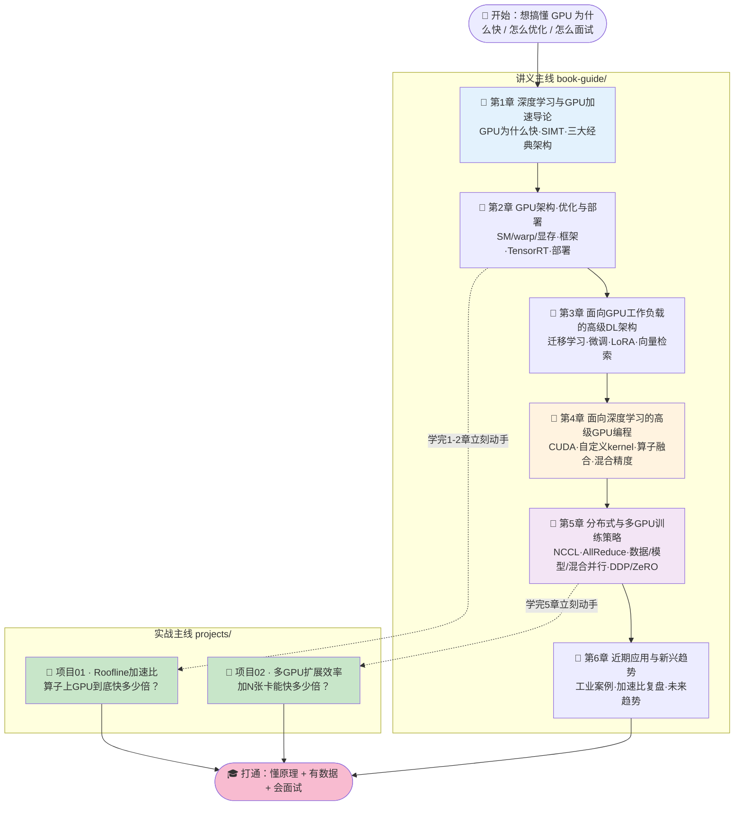

# 📕 《GPU-Accelerated Deep Learning》中文逐章精讲 + 实战合集 🚀

> 配套书籍：**《GPU-Accelerated Deep Learning: Essential GPU Ideas, Deep Learning Frameworks, and Optimization Approaches》**（Mangrulkar & Chavan, Apress 2025）。
>
> 本仓库是一套**从零基础到 AI-Infra 面试**的完整学习资料，包含两部分：
>
> 1. **`book-guide/` — 6 章逐章精讲讲义**：忠实抄录并翻译原书公式与代码，再把每个概念讲透 **「是什么 / 为什么 / 怎么用 / 代价」**，并补齐原书略过的硬件地基（SM/warp/显存层级、SIMT、Roofline……），每章配 mermaid 地图 + 面试题库。
> 2. **`projects/` — 2 个可跑实战项目**：**全程离线、纯 CPU、不需 GPU/CUDA/联网/key**，用「和真实 GPU 完全一致的方法论」把书里的核心结论（加速比、扩展效率）**跑出真实数字 + 出图 + pytest 全绿**。
>
> 🎯 **一句话定位**：读讲义懂「为什么」，跑项目验「是多少」，把「会用框架」升级到「懂底层、能优化、能面试」。

---

## 🗺️ 学习路径（Learning Path）



**建议节奏**：
- 🐣 **零基础**：`第1章 → 第2章 → 跑项目01`，先建立「GPU 为什么快 + 加速比从哪来」的世界观。
- 🚀 **进阶/调优**：`第3章 → 第4章`，吃透微调/LoRA/CUDA kernel/算子融合/混合精度。
- 🏗️ **分布式/面试冲刺**：`第5章 → 跑项目02 → 第6章`，掌握多卡并行 + 扩展效率 + 工业落地全景。

---

## 📚 目录一：逐章精讲讲义（`book-guide/`）

> 每篇都是「精讲」而非「翻译」：原书公式/代码全保留，另补第一性原理推导、mermaid 图、实战踩坑与面试题库。

| # | 章节讲义（点击进入） | 对应原书 | 一句话简介 |
|---|---|---|---|
| 1️⃣ | [第1章 · 深度学习与GPU加速导论](book-guide/01_深度学习与GPU加速导论.md) | Ch.1 (pp.1–32) | 全书地基：**GPU 为什么快**（第一性原理）、SIMT/SM/线程并行、从神经元到 DNN（NumPy 手写回归）、CNN/RNN/LSTM 三大经典架构。 |
| 2️⃣ | [第2章 · GPU架构、优化与部署](book-guide/02_GPU架构_优化与部署.md) | Ch.2 (pp.48–68) | 先补 **SM/warp/显存层级** 硬件地基，再讲框架、CUDA/cuDNN 环境、混合精度、多 GPU、显存优化、**TensorRT 推理加速**、部署与基准测试。 |
| 3️⃣ | [第3章 · 面向GPU工作负载的高级DL架构](book-guide/03_面向GPU工作负载的高级DL架构.md) | Ch.3 (pp.69–84) | 回答「有卡该选什么结构才榨干硬件」：**迁移学习 / 微调 / 冻结底层 / PEFT / LoRA / Prompt Tuning / GPU 向量检索**（IVF-Flat/IVF-PQ/CAGRA），本质都是「大矩阵乘 + 批处理」。 |
| 4️⃣ | [第4章 · 面向深度学习的高级GPU编程](book-guide/04_面向深度学习的高级GPU编程.md) | Ch.4 (pp.85–108) | **AI-Infra 面试绝对高频区**：CUDA 编程模型（grid→block→thread）、`__global__/__device__`、内存合并、占用率、以及 DL 四大杀手锏——**分块矩阵乘 / 梯度检查点 / 混合精度 / 算子融合**。 |
| 5️⃣ | [第5章 · 分布式与多GPU训练策略](book-guide/05_分布式与多GPU训练策略.md) | Ch.5 (pp.109–134) | 单卡装不下怎么办：**NCCL / AllReduce / NVLink** 通信基石，**数据并行 / 模型并行 / 混合并行**，PyTorch DDP·TorchRun·**DeepSpeed ZeRO**·Horovod，监控/剖析/踩坑。 |
| 6️⃣ | [第6章 · 近期应用与新兴趋势](book-guide/06_近期应用与新兴趋势.md) | Ch.6 (pp.135–147) | 落地与展望：**六个工业案例复盘**（欺诈检测 8.2×、药物筛选、自动驾驶感知、边缘视频、天气大涡模拟 256 GPU 弱扩展）+ 三大量化指标 + 未来趋势研判。 |

---

## 🧪 目录二：实战项目（`projects/`）

> 两个项目都强调**「用和真实 GPU 完全一致的方法论，在本机 CPU 上跑出真实数字」**——不联网、不下模型、不需 CUDA、不需 key，`pytest` + `run_demo.py` 开箱即跑。

| # | 项目（点击进入） | 对应章节 | 一句话简介 | 如何跑 ▶️ |
|---|---|---|---|---|
| 🧪 01 | [`projects/01_gpu_speedup_roofline`](projects/01_gpu_speedup_roofline) | 第 1–2 章 | **DL 算子 GPU vs CPU 加速比 + Roofline 屋顶线**：在本机实测两条硬件上限（峰值算力、峰值带宽），画出 Roofline，再用解析模型回答「大 GEMM 为什么快 200×、而 ReLU 只快 50×」。 | `cd projects/01_gpu_speedup_roofline`<br/>`pip install -r requirements.txt`<br/>`python -m pytest -q` → **30 passed**<br/>`python run_demo.py` → 出 3 张图 |
| 🧪 02 | [`projects/02_multigpu_scaling_efficiency`](projects/02_multigpu_scaling_efficiency) | 第 5 章 | **多 GPU 扩展效率模型**：用 **Amdahl 定律 + 通信开销** 定量建模「N 张卡训练同一模型能快多少」，揭示通信占比如何限制强扩展（strong scaling）。 | `cd projects/02_multigpu_scaling_efficiency`<br/>`pip install -r requirements.txt`<br/>`python -m pytest -q` → **404 passed**<br/>`python run_demo.py` → 出 3 张图 |

### 📂 项目产物一览

| 项目 | 核心代码 | 测试 | 出图 |
|---|---|---|---|
| 01 Roofline | `roofline.py` | `tests/test_roofline.py`（30 passed） | `roofline_cpu.png`、`roofline_gpu_compare.png`、`speedup_bars.png` |
| 02 Scaling | `scaling_model.py` | `tests/test_scaling_model.py`（404 passed，`parametrize` 组合爆炸） | `figures/fig1_speedup.png`、`fig2_efficiency.png`、`fig3_dashboard.png` |

> 💡 每个项目自带一份**超详细 `README.md`**（含逐行代码讲解、公式推导、场景手册、面试要点、常见坑），进入目录即可精读。

---

## 🎯 面试 & 实战用法

### 🧑‍💼 面试冲刺（AI-Infra / 大模型 Infra / 推理优化岗）

| 高频考点 | 去哪学 |
|---|---|
| GPU 为什么比 CPU 快？SIMT / warp / SM 是什么 | 第1章、第2章、第4章 |
| Roofline 模型 / 算术强度 / 内存墙 / 「这算子能快几倍」 | 第2章 + **跑项目01**（能报真实数字最加分） |
| CUDA 编程模型、自定义 kernel、内存合并、占用率 | 第4章 |
| 混合精度 / 梯度检查点 / 算子融合 / 分块矩阵乘 | 第4章（DL 四大杀手锏） |
| LoRA / PEFT / 微调 / 迁移学习 为什么适配 GPU | 第3章 |
| 数据并行 vs 模型并行、AllReduce、DDP、ZeRO | 第5章 + **跑项目02** |
| 「加 8 张卡是不是快 8 倍」/ 强扩展 / Amdahl | **项目02**（现场画效率曲线，秒杀） |

> ✅ **面试增分技巧**：不要只背概念。把项目跑出的**图 + 数字**（「我在本机实测算力/带宽两条屋顶，GEMM 落在算力屋顶下、加速比 ~200×；ReLU 卡带宽、只有 ~50×」）讲给面试官，立刻从「读过书」升级到「动过手」。

### 🛠️ 实战用法

1. **选型 / 估算**：接新任务先跑 **项目01** 估算「这个算子/模型上 A100/H100 大概快几倍、卡在算力还是带宽」；再跑 **项目02** 估算「该买几张卡、扩展效率会掉到多少」。
2. **调优对照**：讲义第2/4章的每个优化手段（混合精度、算子融合、TensorRT）都标注了「省什么、代价是什么」，可作为调优 checklist。
3. **对接真实测量**：项目02 的 `README` 末尾给出了**从解析模型对接 PyTorch DDP 真实计时**的方法，可把模型参数校准到你自己的集群。

---

## 🚀 快速开始（Quick Start）

```bash
# 1) 读讲义（任意 Markdown 阅读器 / VS Code / Obsidian）
book-guide/01_深度学习与GPU加速导论.md   # 从第1章开始

# 2) 跑项目01：Roofline 加速比
cd projects/01_gpu_speedup_roofline
pip install -r requirements.txt
python -m pytest -q        # → 30 passed
python run_demo.py         # → 生成 3 张 PNG

# 3) 跑项目02：多GPU扩展效率
cd ../02_multigpu_scaling_efficiency
pip install -r requirements.txt
python -m pytest -q        # → 404 passed
python run_demo.py         # → figures/ 下生成 3 张 PNG
```

> 🌐 **全程离线**：两个项目仅依赖 `numpy` / `matplotlib`，**不需要 GPU、CUDA、联网或 API key**——在任何一台笔记本上都能复现真实结论。

---

## 📌 仓库结构

```
book-gpu-accelerated-dl/
├── README.md                      # 👈 你在这里（总览 + 学习路径）
├── book-guide/                    # 📚 6 章逐章精讲讲义
│   ├── 01_深度学习与GPU加速导论.md
│   ├── 02_GPU架构_优化与部署.md
│   ├── 03_面向GPU工作负载的高级DL架构.md
│   ├── 04_面向深度学习的高级GPU编程.md
│   ├── 05_分布式与多GPU训练策略.md
│   └── 06_近期应用与新兴趋势.md
└── projects/                      # 🧪 2 个可跑实战项目
    ├── 01_gpu_speedup_roofline/       # Roofline 加速比（30 passed + 3 图）
    └── 02_multigpu_scaling_efficiency/ # 多GPU扩展效率（404 passed + 3 图）
```

---

## 🎓 你将收获

- ✅ **原理**：从第一性原理讲清 GPU 为什么快、快在哪、代价是什么。
- ✅ **代码**：CUDA kernel、混合精度、算子融合、DDP/ZeRO 都能看懂能写。
- ✅ **数据**：亲手跑出加速比 & 扩展效率曲线，面试有图有真相。
- ✅ **落地**：六个工业案例 + 未来趋势，知道这些技术真在哪儿赚钱。

> 📖 建议配合原书阅读；讲义已把原书公式/代码忠实保留，可作为中文精读 + 面试速查 + 动手验证的一站式资料。祝学习愉快！🚀
