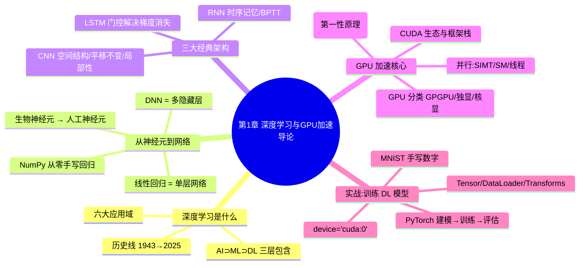
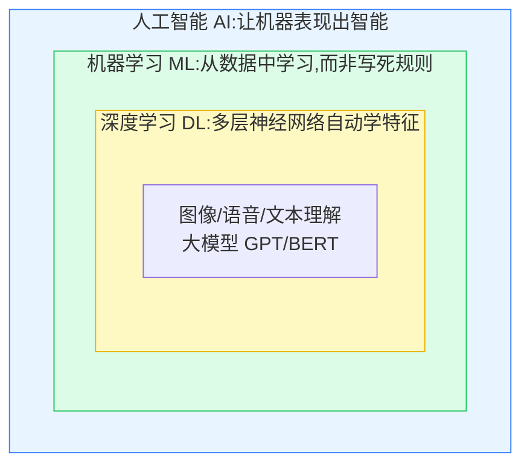
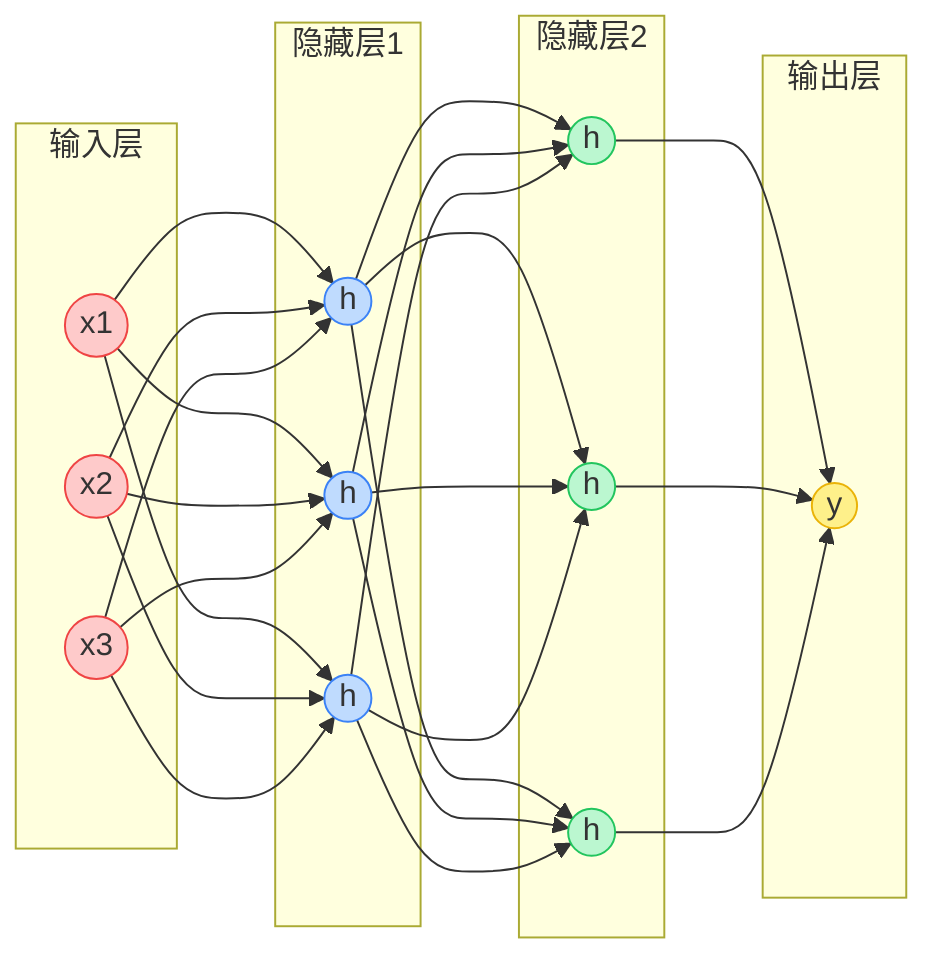
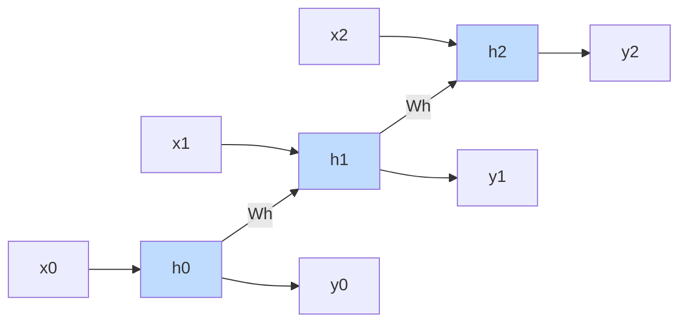
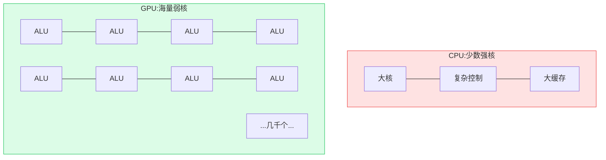
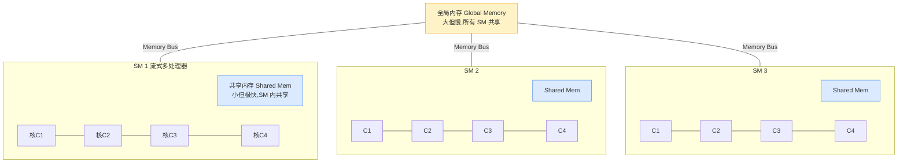
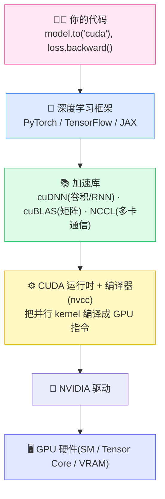

# 第 1 章 深度学习与 GPU 加速导论 🚀

> 逐章精讲《GPU-Accelerated Deep Learning: Essential GPU Ideas, Deep Learning Frameworks, and Optimization Approaches》(Mangrulkar & Chavan, Apress 2025)第 1 章 *Introduction to Deep Learning and GPU Acceleration*(原书 pp. 1–32 / PDF 16–47)。
>
> 本篇在忠实抄录、翻译原书公式与代码的基础上,把每个概念讲透"是什么 / 为什么 / 怎么用 / 代价",并把原书略过的**"GPU 为什么快、怎么快、生态与框架长什么样"**这条主线补齐——这是全书后续所有优化技术(第 2 章起的 CUDA、cuDNN、混合精度、分布式)的地基。

---

## 🗺️ 本章地图



**阅读收益**:读完本章你能回答——① 深度学习凭什么在 2012 年后爆发?② 一个"深"网络到底"深"在哪、多出来的隐藏层带来什么代价?③ CNN 的平移不变性和局部性如何把参数从"十亿级"砍到"几百个"?④ **GPU 为什么比 CPU 快几十倍训练神经网络,它的并行到底并行在何处?**⑤ CUDA / cuDNN / PyTorch / TensorFlow 这一整套生态各自扮演什么角色?⑥ 如何用 PyTorch 在 GPU 上从零跑通 MNIST 分类。

---

## 1.1 深度学习:AI 王冠上的明珠 💎

### 1.1.1 一句话定义与三层包含关系

原书开篇引用 Yann LeCun 的名言,值得抄录并玩味:

> **"Deep learning is not just a tool, it's a new way of programming computers."**
> ——深度学习不只是一个工具,它是一种全新的"给计算机编程"的方式。 ——Yann LeCun

**是什么**:深度学习(Deep Learning, DL)是机器学习(Machine Learning, ML)的一个分支,核心是**带多个隐藏层的人工神经网络(Artificial Neural Network, ANN)**,用来在数据中分析、解读复杂模式。原书用经典的"三个嵌套方块"图(Fig. 1.1)刻画三者关系:



| 层级 | 关注点 | 典型方法 | 特征来自哪 |
|---|---|---|---|
| **AI** | 让机器"看起来聪明" | 专家系统、搜索、逻辑推理 | 人写规则 |
| **ML** | 从数据自动学规律 | 决策树、SVM、随机森林 | **人工设计特征** |
| **DL** | 多层网络自动抽特征 | CNN、RNN、Transformer | **网络自己学** |

> 🔬 **第一性原理:DL 与传统 ML 的本质分野=特征工程的归属**
> 传统 ML 里"特征"由人设计(比如给图像手工提 SIFT/HOG),模型只负责在特征上分类。深度学习的革命在于**把特征提取本身也变成可学习的参数**——网络越深,越能自动学出从"边缘→纹理→部件→物体"的层级特征(hierarchical features)。这就是 LeCun 说"新的编程方式"的深意:你不再写"如何识别猫"的规则,而是**用数据+梯度下降,让网络自己写出这套规则**。

### 1.1.2 历史线:从 1943 到 2025 📜

原书 §1.1.1 给了一条清晰的时间线,我整理成表并补上"为什么重要":

| 年份 | 里程碑 | 为什么是转折点 |
|---|---|---|
| **1943** | McCulloch–Pitts 神经元模型 | 首次用数学(阈值逻辑)模拟神经元,DL 的"原点" |
| 1958 | 感知机 Perceptron(Rosenblatt) | 第一个能学习的神经网络,但只能线性可分 |
| 1980s | **反向传播 Backpropagation** | 让多层网络可训练,是至今仍在用的核心算法 |
| 1990s | RNN、CNN(LeCun 1995) | 分别攻克序列与图像 |
| **2006** | 深度置信网络 DBN(Hinton) | "深度学习"一词走红,预训练破解深层难训问题 |
| **2012** | AlexNet 在 ImageNet 夺冠 | **GPU + 大数据 + CNN 三合一**,DL 大爆发的引爆点 |
| **2014** | 生成对抗网络 GAN | 开启"生成式 AI"时代 |
| **2017–2019** | Transformer / BERT / GPT | 重塑 NLP,为大模型铺路 |
| 2020–2025 | 多模态、RLHF、AI 监管 | GPT/BERT 普及,DL 进入千行百业 |

> 💡 **面试高频:深度学习为什么在 2012 年后才"突然"爆发?**
> 三大要素同时成熟——**① 算力**:NVIDIA GPU 让训练从"几周"缩到"几天";**② 数据**:ImageNet(百万级标注图)等大规模数据集出现;**③ 算法**:ReLU、Dropout、更好的初始化让深层网络可训。原书反复强调"increased computational power and access to large datasets",而算力这一维正是本书的主角——**没有 GPU,就没有深度学习的今天**。

### 1.1.3 应用全景:六大战场 🌐

原书 Fig. 1.2 把 DL 应用画成中心辐射图,核心是"Deep Learning Applications",连向六个领域。结合正文,归纳为:

| 领域 | 代表任务 | 主力架构 |
|---|---|---|
| 👁️ 计算机视觉 | 目标检测、图像分类、人脸识别、自动驾驶感知 | CNN |
| 🗣️ 自然语言处理 | 机器翻译、情感分析、文本生成、AI 助手 | Transformer/RNN |
| 🏥 医疗健康 | 医学影像、疾病诊断、药物发现、个性化治疗 | CNN + 多模态 |
| 🚗 自动系统/机器人 | 自动驾驶、无人机导航、机器人流程自动化 | 深度强化学习 |
| 💰 金融/商业智能 | 欺诈检测、算法交易、风险评估、异常检测 | RNN + Transformer |
| 🔒 网络安全 | 威胁检测、恶意软件分析、入侵防御 | 混合架构 |

2020–2025 的新趋势(原书特别点名):**多模态 AI**(整合视觉/文本/语音)、**生成式 AI**(逼真图像视频)、**元宇宙/AR**、**气候科学**,以及对**可解释性、公平性、能耗、AI 治理**的重视。

---

## 1.2 从神经元到深度网络 🧠

### 1.2.1 生物神经元 → 人工神经元

原书 §1.1.4 从生物学讲起(Fig. 1.5 是一个带轴突、树突的神经元,虽然图里有不少拼写错误如 "Somre"/"Anrona")。核心类比表:

| 生物神经元 | 功能 | 人工神经元对应 |
|---|---|---|
| 树突 Dendrites | 输入端子 | 输入 $x_1, x_2, \dots$ |
| 细胞核/胞体 Nucleus/Soma | "CPU",整合信号 | 加权求和 $\sum w_i x_i + b$ |
| 轴突 Axon | 输出导线 | 激活值向下传 |
| 轴突末梢 + 突触 Synapse | 输出连接 | 连接权重 $w$ |

> 🔬 **第一性原理:一个人工神经元=加权和 + 非线性**
> $$\text{output} = f\!\left(\sum_i w_i x_i + b\right)$$
> 其中 $w_i$ 是可学习权重(决定某个输入"影响力"多大),$b$ 是偏置,$f$ 是激活函数(如 ReLU)。**权重 $w$ 就是网络的"记忆"**——训练就是不断调整这些 $w$ 让输出逼近目标。原书原话:"These weights determine the extent to which one neuron's activation influences another(权重决定一个神经元的激活对另一个的影响程度)。"

### 1.2.2 线性回归 = 最简单的单层神经网络

原书 §1.1.4 有个漂亮的洞见(Fig. 1.4):**线性回归可以看成一个单层神经网络**——每个输入特征是一个输入神经元,全部直连到一个输出神经元。

$$\hat{y} = w_1 x_1 + w_2 x_2 + w_3 x_3 + b$$

这正是一个"无隐藏层、无激活函数(或说激活是恒等函数)"的神经网络。原书借此点明:**线性回归虽早于计算神经科学,却为人工神经元提供了基础模型**(可追溯到 McCulloch & Pitts)。

### 1.2.3 深度神经网络(DNN):"深"在哪?

**是什么**:原书 §1.1.3.1 定义——DNN 是浅层网络的扩展,区别在于**有多个隐藏层(multiple hidden layers)**。Fig. 1.3 画了一个五层网络:输入层(3 红点)→ 3 个隐藏层(蓝/绿/紫各 3 点)→ 输出层(1 黄点),层间全连接。

**为什么要"深"**:原书原话——"The term *deep* originates from the presence of multiple hidden layers, which enhance the network's ability to capture complex relationships and hierarchical features(深度一词源于多个隐藏层,它增强了网络捕捉复杂关系和层级特征的能力)。"

**代价 ⚠️**:原书也诚实指出——层数增加能提升性能,**但需要小心调参以避免过拟合(overfitting)**,且隐藏层数量要依问题复杂度和数据规模来选。深了不一定好,深了更难训、更易过拟合、更耗算力——**这正是后面需要 GPU 的原因之一**。



---

## 1.3 手把手:用 NumPy 从零实现回归网络 🛠️

原书 §1.1.4 给了一段**纯 NumPy 从零实现的前馈网络**,做的是回归任务。结构:输入层 1 特征 → 隐藏层 10 神经元(ReLU)→ 输出层 1 神经元(线性),MSE 损失 + 梯度下降。这段代码是理解"前向传播+反向传播"的黄金例子,我逐段抄录并讲解。

### 1.3.1 造数据 + 初始化参数

```python
import numpy as np
import matplotlib.pyplot as plt

# 生成合成数据
np.random.seed(42)
X = 2 * np.random.rand(100, 1)              # 100 个样本,单特征
y = 4 + 3 * X + np.random.randn(100, 1)     # y = 4 + 3X + 噪声

# 初始化网络参数
input_dim  = 1     # 一个输入特征
hidden_dim = 10    # 隐藏层 10 个神经元
output_dim = 1     # 单输出神经元

W1 = np.random.randn(input_dim, hidden_dim)   # 输入→隐藏 权重 (1×10)
b1 = np.zeros((1, hidden_dim))
W2 = np.random.randn(hidden_dim, output_dim)  # 隐藏→输出 权重 (10×1)
b2 = np.zeros((1, output_dim))
```

**逐行讲解**:
- 真实规律是 $y = 4 + 3X$,加了高斯噪声 `np.random.randn`。原书点明加噪声的目的:**让网络学到可泛化的规律,而不是死记输入输出映射**。
- `W1` 形状 $(1,10)$、`W2` 形状 $(10,1)$——权重矩阵的形状永远是 `(上一层维度, 本层维度)`。这是初学者最易错的地方 ⚠️。
- 偏置初始化为 0,权重用标准正态随机初始化(打破对称性,否则所有神经元学到一样的东西)。

### 1.3.2 前向传播 + 损失

```python
def relu(Z):
    return np.maximum(0, Z)                  # ReLU: max(0, z)

def relu_derivative(Z):
    return (Z > 0).astype(float)            # ReLU 导数: z>0 时为1,否则0

def forward_pass(X):
    Z1 = X.dot(W1) + b1     # 隐藏层线性变换
    A1 = relu(Z1)           # 隐藏层激活(引入非线性!)
    Z2 = A1.dot(W2) + b2    # 输出层线性变换(回归,不加激活)
    return Z1, A1, Z2

def compute_loss(y_true, y_pred):
    return np.mean((y_true - y_pred) ** 2)  # 均方误差 MSE
```

**关键点**:$A1 = \text{ReLU}(Z1)$ 这一步是整个网络的灵魂——**如果没有非线性激活,多层线性变换叠加还是线性的**,再深也等价于单层。原书原话:"the ReLU activation function introduces nonlinearity(ReLU 引入非线性)"。

前向传播的数学形式:
$$Z_1 = XW_1 + b_1,\quad A_1 = \text{ReLU}(Z_1),\quad \hat{y}=Z_2 = A_1 W_2 + b_2$$
$$\mathcal{L} = \frac{1}{m}\sum_{i=1}^{m}(y_i - \hat{y}_i)^2$$

### 1.3.3 反向传播(梯度下降)——最硬核的一段

```python
def backward_pass(X, y, Z1, A1, Z2, learning_rate):
    global W1, b1, W2, b2
    m = len(y)
    # 计算梯度(链式法则)
    dZ2 = 2 * (Z2 - y) / m               # ∂L/∂Z2
    dW2 = A1.T.dot(dZ2)                  # ∂L/∂W2
    db2 = np.sum(dZ2, axis=0, keepdims=True)
    dA1 = dZ2.dot(W2.T)                  # 误差回传到 A1
    dZ1 = dA1 * relu_derivative(Z1)      # 穿过 ReLU
    dW1 = X.T.dot(dZ1)                   # ∂L/∂W1
    db1 = np.sum(dZ1, axis=0, keepdims=True)
    # 更新参数(沿负梯度方向走一步)
    W1 -= learning_rate * dW1
    b1 -= learning_rate * db1
    W2 -= learning_rate * dW2
    b2 -= learning_rate * db2
```

**逐步推导**(这就是"反向传播"的全部秘密——链式法则):

1. **输出层梯度**:$\mathcal{L}=\frac{1}{m}(Z_2-y)^2$,对 $Z_2$ 求导得 $\dfrac{\partial \mathcal{L}}{\partial Z_2}=\dfrac{2(Z_2-y)}{m}$ → 代码 `dZ2`。
2. **权重 $W_2$ 梯度**:因 $Z_2=A_1 W_2+b_2$,故 $\dfrac{\partial \mathcal{L}}{\partial W_2}=A_1^\top \cdot dZ_2$ → 代码 `dW2 = A1.T.dot(dZ2)`。
3. **误差回传到隐藏层**:$dA_1 = dZ_2 \cdot W_2^\top$ → 代码 `dA1`。
4. **穿过 ReLU**:$dZ_1 = dA_1 \odot \text{ReLU}'(Z_1)$——ReLU 导数是"开关",$Z_1>0$ 才让梯度通过 → 代码 `dZ1`。
5. **权重 $W_1$ 梯度**:$dW_1 = X^\top \cdot dZ_1$。
6. **更新**:$W \leftarrow W - \eta \cdot dW$,$\eta$ 是学习率(learning rate),控制步长。

> 🔬 **第一性原理:反向传播=链式法则 + 复用中间结果**
> 反向传播的高效之处在于:它**从输出端往输入端逐层复用梯度**(先算 `dZ2`,再用它算 `dA1`,再算 `dZ1`……),避免了对每个参数单独求导的天文数字计算量。梯度告诉你"损失对每个参数的敏感度",负梯度方向就是"让损失下降最快的方向"。

### 1.3.4 训练循环与结果

```python
epochs = 500
learning_rate = 0.01
loss_history = []

for epoch in range(epochs):
    Z1, A1, Z2 = forward_pass(X)                # 前向
    loss = compute_loss(y, Z2)                  # 算损失
    loss_history.append(loss)
    backward_pass(X, y, Z1, A1, Z2, learning_rate)  # 反向+更新
    if epoch % 50 == 0:
        print(f"Epoch {epoch}: Loss = {loss:.4f}")
```

原书 Fig. 1.6/1.7 展示结果:红色拟合线紧贴蓝色训练点(说明学到了 $y\approx 4+3X$),损失曲线(绿线)从约 140 陡降到接近 0(说明收敛)。**这个 500 轮、单特征的小网络在 CPU 上瞬间跑完——但真实的深度网络参数动辄上亿,前向/反向里全是巨型矩阵乘法,CPU 就吃不消了,这就自然引出 GPU。**

---

## 1.4 三大经典架构速览 🏛️

原书在进入 GPU 之前,快速过了 CNN 与 RNN。虽然本章重心是 GPU,但这两个架构是理解"为什么需要并行算力"的载体,这里精炼讲解。

### 1.4.1 卷积神经网络 CNN:用"结构先验"砍掉天量参数

**动机(原书 §1.2.1 的经典算账)**:假设做猫狗分类,用 100 万像素(1 兆像素)图像 → 输入 100 万特征。即使隐藏层只有 1000 个神经元,全连接层的参数量 $\approx 10^6 \times 10^3 = 10^9$(**十亿级**),训练在计算上根本不可行。

CNN 靠两个"结构先验(inductive bias)"破局:

#### ① 平移不变性(Translation Invariance)

原书从全连接的四阶权重张量出发:
$$h_{i,j} = \sum_{k,l} W_{i-k,\,j-l}\, x_{k,l} + b \tag{1.1}$$

**核心洞察**:平移输入图像,隐藏表示也应等量平移 → 权重必须**与绝对位置 $(i,j)$ 无关**。于是权重从 $W_{i-k,j-l}$ 简化为 $W_{k,l}$:
$$h_{i,j} = \sum_{k,l} W_{k,l}\, x_{i-k,\,j-l} + b \tag{1.2}$$

这就是**卷积**!参数量从"依赖图像大小"降到只有 $k \times l$(卷积核大小),这叫**权重共享(weight sharing)**。

#### ② 局部性(Locality)

原书 §1.2.4:决定 $(i,j)$ 处值的信息主要来自其邻域 → 超出范围 $K, L$ 的权重设为 0:
$$h_{i,j} = \sum_{|k|\le K,\ |l|\le L} W_{k,l}\, x_{i-k,\,j-l} + b \tag{1.3}$$

**效果**:参数量从 $m^2$ 降到 $(2K+1)(2L+1)$——原书原话:"an enormous reduction … often by **four orders of magnitude**(常常降低四个数量级)"。以前一个全连接层要数十亿参数,现在**只需几百个**,还保持了输入输出维度。

| | 全连接层(FC) | 卷积层(Conv) |
|---|---|---|
| 参数量 | $\propto$ 图像大小(十亿级) | $\propto$ 核大小(几百个) |
| 空间结构 | 丢失(拉平成 1D) | 保留 |
| 关键机制 | 每像素独立 | 权重共享 + 局部连接 |
| 代价 ⚠️ | 参数爆炸、易过拟合 | 特征被迫平移不变、每层只看局部 |

#### 卷积的数学定义与"错位真相"

原书 §1.2.5 抄录连续卷积定义:
$$(f * g)(t) = \int_{-\infty}^{\infty} f(\tau)\,g(t-\tau)\,d\tau \tag{1.4}$$
离散化后:$(f*g)_i = \sum_j f_j\, g_{i-j}$,二维推广即式 (1.6)。

> ⚠️ **常见坑:深度学习里的"卷积"其实是"互相关"**
> 原书明确指出:式 (1.3) 严格说是**互相关(cross-correlation)**而非数学意义的卷积——真正的卷积要把核先"翻转(flip)"再滑动。但由于核是学出来的,翻不翻转只是符号约定,不影响结果,所以框架(PyTorch 的 `nn.Conv2d`)里叫"卷积",实为互相关。面试被问到别答错。

原书还给了一段 **PyTorch 代码对比 FCNN vs CNN 处理灰度图**(Fig. 1.8),核心是:`nn.Linear` 拉平图像丢空间信息 → 输出杂乱;`nn.Conv2d(1,1,kernel_size=3,padding=1)` 保留空间结构 → 输出连贯。

```python
import torch.nn as nn
# 全连接:先 flatten,丢掉空间关系
class FullyConnectedNN(nn.Module):
    def __init__(self, input_size, hidden_size):
        super().__init__()
        self.fc = nn.Linear(input_size, hidden_size)
    def forward(self, x):
        x = x.view(1, -1)     # 拉平成 1D → 空间信息丢失
        return self.fc(x)

# 卷积:3×3 核 + padding,保留空间结构
class ConvolutionalNN(nn.Module):
    def __init__(self):
        super().__init__()
        self.conv = nn.Conv2d(in_channels=1, out_channels=1,
                              kernel_size=3, padding=1)
    def forward(self, x):
        return self.conv(x)
```

### 1.4.2 循环神经网络 RNN:给网络装上"记忆"

**是什么**:RNN 专为**序列数据**设计,引入"记忆机制"让信息跨时间步保留(原书 §1.3),适合语音识别、时序预测、NLP。

**数学表示**(原书 §1.4)——隐藏状态更新方程:
$$h_t = f(W_h h_{t-1} + W_x x_t + b) \tag{1.7}$$
$$y_t = W_y h_t + b_y \tag{1.8}$$

其中 $h_t$ 是 $t$ 时刻隐藏状态(携带历史信息),$h_{t-1}$ 是上一步状态,$f$ 常用 $\tanh$ 或 ReLU。**关键:同一组权重 $W_h, W_x$ 在所有时间步复用**——这是 RNN 版的"权重共享"。

**展开(Unrolling)**(原书 §1.5):把序列 $x_1,\dots,x_T$ 沿时间展开成一条链:
$$h_1 = f(W_h h_0 + W_x x_1 + b),\ \dots,\ h_T = f(W_h h_{T-1} + W_x x_T + b)$$
$h_0$ 通常初始化为零向量。



**挑战:梯度消失/爆炸**(原书 §1.6.1)——BPTT(随时间反向传播)时,长序列的梯度连乘会指数级缩小或放大:
$$\frac{\partial \mathcal{L}}{\partial W_h} = \sum_{t=1}^{T}\left(\frac{\partial \mathcal{L}}{\partial h_t}\prod_{k=t}^{1} W_h f'(h_k)\right) \tag{1.13}$$
若 $W_h$ 的特征值 $<1$,梯度指数衰减 → **梯度消失**,网络学不到远距离依赖。

**LSTM 解药**(原书 §1.6.2)——引入记忆单元 $C_t$ 和三个门控:
$$
\begin{aligned}
f_t &= \sigma(W_f x_t + U_f h_{t-1} + b_f) &&\text{遗忘门:丢弃多少旧记忆} \tag{1.14}\\
i_t &= \sigma(W_i x_t + U_i h_{t-1} + b_i) &&\text{输入门:写入多少新信息} \tag{1.15}\\
\tilde{C}_t &= \tanh(W_c x_t + U_c h_{t-1} + b_c) &&\text{候选记忆} \tag{1.16}\\
C_t &= f_t\, C_{t-1} + i_t\, \tilde{C}_t &&\text{更新记忆单元} \tag{1.17}\\
o_t &= \sigma(W_o x_t + U_o h_{t-1} + b_o) &&\text{输出门} \tag{1.18}\\
h_t &= o_t \tanh(C_t) &&\text{输出隐藏状态} \tag{1.19}
\end{aligned}
$$

> 🔬 **第一性原理:门控为何能救梯度消失?**
> 记忆单元 $C_t = f_t C_{t-1} + i_t \tilde{C}_t$ 提供了一条"信息高速公路"——当遗忘门 $f_t \approx 1$ 时,$C_t \approx C_{t-1}$,梯度可以近乎无损地一路回传,不再被反复乘以 $<1$ 的因子。门控用 sigmoid($\sigma$,输出 0~1)当"阀门",学习该记住什么、遗忘什么。

**RNN 应用**(原书 §1.7):NLP(机器翻译/文本生成/情感分析)、语音识别、时序预测(股市/天气)、视频分析(动作识别)。

---

## 1.5 GPU 加速:本书的心脏 ❤️‍🔥

前面铺垫的一切——深层 DNN、亿级参数 CNN、长序列 RNN——归结为同一件事:**海量的矩阵/张量运算**。这正是 GPU 的主场。原书 §1.8 正式进入 GPU 加速,本节在忠实原书的基础上,把"GPU 为什么快、怎么快"这条最重要的主线讲透。

### 1.5.1 GPU 加速是什么

原书 §1.8.1 定义:**GPU 加速**指用图形处理单元(Graphics Processing Unit, GPU)比传统中央处理器(CPU)更高效地完成计算。GPU 专为**需要高强度数学计算的并行任务**设计,因而是深度学习、科学模拟、数据分析的理想选择。

### 1.5.2 🔬 第一性原理:为什么 GPU 适合深度学习?

这是本章、也是全书最该刻进脑子的一节。原书说 GPU"擅长成千上万并行线程(thousands of parallel threads)",但没深挖为什么。下面从硬件哲学讲透:

#### 核心矛盾:延迟优化 vs 吞吐优化

| 维度 | CPU(延迟机器) | GPU(吞吐机器) |
|---|---|---|
| 设计目标 | 让**单个任务尽快完成**(低延迟) | 让**大量任务总量最大**(高吞吐) |
| 核心数 | 几个~几十个强核 | 几千个弱核(如 A100 有 6912 CUDA 核) |
| 单核能力 | 强(大缓存、乱序执行、分支预测) | 弱(简单、无复杂控制逻辑) |
| 芯片面积分配 | 大量给控制单元 + 缓存 | 绝大多数给算术逻辑单元 ALU |
| 擅长 | 串行、分支多、逻辑复杂的任务 | **同一操作作用于海量数据**(SIMD/SIMT) |



#### 为什么这恰好匹配深度学习?

深度学习的计算 **99% 是矩阵乘法(GEMM)和卷积**,而矩阵乘法有一个致命特点:**天然可并行、无数据依赖**。

考虑 $C = AB$,其中 $C_{ij} = \sum_k A_{ik} B_{kj}$。每个输出元素 $C_{ij}$ 的计算**互相独立**——算 $C_{00}$ 不需要 $C_{01}$ 的结果。于是一个 $1024\times 1024$ 的输出矩阵,理论上可以让 **100 万个线程同时各算一个元素**。

> 🔬 **第一性原理一句话**:深度学习=海量"相同操作、不同数据"的运算(SIMT, Single Instruction Multiple Threads),而 GPU 生来就是干这个的。CPU 用 4 个快核串行算 100 万个乘加要循环 100 万/4 次;GPU 用几千个核一次并行推进,**吞吐量差几十倍**。这就是原书说 GPU 训练深度模型远快于 CPU 的物理本质。

#### 数字直觉

- 一个 ResNet-50 单次前向约 **40 亿次浮点运算(4 GFLOPs)**;训练要跑数百万次迭代。
- CPU 峰值约几百 GFLOPS,GPU(如 A100)峰值 **312 TFLOPS(FP16)**——差约三个数量级。
- 原书 §1.9 的 MNIST 例子输出里那句 `device='cuda:0'` 就是"计算跑在 GPU 上"的铁证。

> 💡 **面试高频:GPU 一定比 CPU 快吗?什么时候 CPU 更好?**
> **不一定。** GPU 只在"高度并行、计算密集、数据量大"时才碾压 CPU。若任务是**串行、分支密集、数据量小、依赖复杂**(如解析 JSON、跑单条 if-else 逻辑),CPU 反而更快——因为 GPU 启动 kernel、CPU↔GPU 数据搬运(过 PCIe)都有开销。原书 §1.8.2.1 也承认:"not all applications can be easily adapted to benefit from GPU acceleration(并非所有应用都能轻易受益于 GPU 加速)"。

### 1.5.3 GPU 的并行架构:SM、线程、内存层级

原书 Fig. 1.11 给了 GPGPU 架构图:顶部是**全局内存(Global Memory)**,下面是多个**流式多处理器(Streaming Multiprocessor, SM)**,每个 SM 含**共享内存(Shared Mem)**和若干执行单元(C1~C4),通过**内存总线(Memory Bus)**相连。我把这套层级讲清楚(这是第 2 章 CUDA 编程的地基):



| 层级 | 容量 | 速度 | 作用范围 | 类比 |
|---|---|---|---|---|
| 寄存器 Register | 极小 | 最快 | 单线程 | 手边草稿纸 |
| 共享内存 Shared Mem | 几十 KB/SM | 很快 | SM 内所有线程 | 办公室白板 |
| 全局内存 Global Mem(VRAM) | 几十 GB | 慢(相对) | 全 GPU | 公司档案室 |

> 💡 **实战:GPU 优化的核心=减少访问慢的全局内存**
> 后续章节所有优化技巧(kernel fusion、tiling、用好 shared memory、混合精度)本质都在做一件事——**让数据尽量待在快的内存里,少来回搬**。因为现代 GPU 的瓶颈往往不是算力,而是**内存带宽(memory bandwidth)**。记住这句话,后面学 FlashAttention 之类会秒懂。

### 1.5.4 GPU 加速的四种类型

原书 §1.8.2 分了几类,整理成表:

| 类型 | 是什么 | 特点 | 适用场景 |
|---|---|---|---|
| **GPGPU**(通用 GPU) | 本为图形渲染,进化到能跑非图形通用计算 | 靠 CUDA/OpenCL 编程,擅长上千并行线程、大矩阵运算 | AI、科学模拟、金融建模 |
| **独立 GPU**(Dedicated) | 有**自己独立显存(VRAM)**的独立硬件 | 性能最强,带 Tensor Core、光追、高带宽;但功耗高、发热大 | **深度学习训练**、游戏、专业渲染 |
| **集成 GPU**(Integrated / iGPU) | 与 CPU 同一芯片,**共享内存** | 省电省空间但性能受限 | 网页、办公、媒体播放、轻度任务 |

> ⚠️ **常见坑:训练深度模型一定要用独立 GPU**
> 原书明确:集成 GPU 共享系统内存,处理大数据集会有瓶颈;独立 GPU 的**专用 VRAM** 才能高效处理大 batch。搞深度学习别指望核显,显存(VRAM)大小往往是能不能训某个模型的硬门槛——比如 24GB 显存才装得下某些大模型的训练。

原书特别提到独立 GPU 的关键武器:**Tensor Core(张量核心)**——专门加速深度学习矩阵运算的硬件单元;**高内存带宽**;以及连接 CPU 的 **PCIe 接口**(Fig. 1.12)。

### 1.5.5 CUDA 生态与深度学习框架栈 🏗️

原书提到 GPGPU 的突破来自 **NVIDIA CUDA 和 OpenCL** 这类编程框架,但没展开整个生态。这一节是理解全书"框架"部分的关键——**从底层硬件到你写的 `model.to('cuda')`,中间隔着好几层**:



| 层 | 组件 | 干什么 | 类比 |
|---|---|---|---|
| 应用层 | 你的训练脚本 | 描述模型和训练逻辑 | 点菜 |
| **框架层** | PyTorch / TensorFlow | 自动微分、张量抽象、调度 | 厨房总管 |
| **加速库** | cuDNN / cuBLAS / NCCL | 手写高度优化的算子 | 大厨的独门菜谱 |
| **CUDA** | nvcc 编译器 + Runtime | 让你能写/运行 GPU 并行程序 | 灶台与火 |
| 驱动 | NVIDIA Driver | 操作系统与 GPU 通信 | 燃气管道 |
| 硬件 | GPU 芯片 | 真正干活 | 火焰 |

**几个必须认识的名字**:

- **CUDA**(Compute Unified Device Architecture):NVIDIA 2007 年推出的**并行计算平台+编程模型**,让开发者用类 C++ 写 GPU 程序。它是整个 NVIDIA 深度学习帝国的护城河。
- **cuDNN**(CUDA Deep Neural Network library):专为深度学习优化的库,卷积、池化、RNN、归一化等算子的极致实现。你调 `nn.Conv2d`,底层大概率走 cuDNN。
- **cuBLAS**:GPU 版的 BLAS(基础线性代数),矩阵乘法(GEMM)的核心。
- **NCCL**:多 GPU / 多机之间的高效通信库(后面分布式训练章会重逢)。
- **OpenCL**:开放标准的替代品,跨厂商(AMD/Intel 也支持),但生态和性能通常不及 CUDA。

> 💡 **面试高频:为什么深度学习几乎被 NVIDIA 垄断?**
> 不只是硬件强,更是**软件生态(CUDA + cuDNN + 框架深度集成)**十几年积累的护城河。竞品(AMD ROCm、Intel oneAPI)硬件不弱,但生态成熟度、框架支持、社区调优远不及 CUDA。这也是"卖铲子的最赚钱"的经典案例。

> ⚠️ **常见坑:版本地狱(version hell)**
> 实战里最折磨人的不是写模型,而是 **CUDA 版本 ↔ cuDNN 版本 ↔ 驱动版本 ↔ PyTorch 版本**要严格对应,错一个就报 `CUDA error` 或装不上。建议用官方 Docker 镜像或 conda 一键装配套版本,别手动一个个装。

---

## 1.6 实战:在 GPU 上训练 MNIST 手写数字分类 🔢

原书 §1.9 用 PyTorch 走完一个完整的训练流程。这是把前面所有概念(网络、张量、GPU)串起来的收官实战。

### 1.6.1 问题与数据

**任务**:识别 MNIST 手写数字(0–9),$28\times28$ 灰度图,共 **70,000 张**(60,000 训练 + 10,000 测试)。原书点出为什么传统编程搞不定图像分类:光照、角度、笔迹千变万化,**不可能手写规则穷举所有情况**——必须让模型从数据里学。

> 💡 MNIST 的历史意义:原书原话"If a model struggles with MNIST, it is unlikely to succeed on more complex datasets(连 MNIST 都做不好,就别指望更复杂的数据集了)"。它是计算机视觉的"Hello World",也是调试新架构的试金石。

### 1.6.2 数据工程:Tensor / Transforms / DataLoader

**① 张量(Tensor)**(原书 §1.9.4):$n$ 维数组,推广了向量(1D)和矩阵(2D)。一张 RGB 图是 3D 张量(宽×高×通道)。**GPU 天生擅长处理张量,因为它和图形处理里的矩阵运算高度相似**——这句话再次呼应了 §1.5.2 的第一性原理。用 `ToTensor` 把 PIL 图转成张量。

**② 变换(Transforms)**(原书 §1.9.5):用 `Compose` 串联多个预处理:
```python
import torchvision.transforms as transforms
trans = transforms.Compose([transforms.ToTensor()])  # 图 → 张量
# 赋给 dataset.transform,访问时自动转换
```

**③ DataLoader**(原书 §1.9.5.1):定义数据如何喂进模型。**不是一次性喂全部(太耗内存),而是分小批(mini-batch)**。

| 数据 | 是否 shuffle | 原因 |
|---|---|---|
| 训练集 | ✅ 打乱 | 随机化,防止模型学到样本顺序的偏差 |
| 验证集 | ❌ 不打乱 | 验证时模型不学习,顺序无所谓 |

> ⚠️ batch size(如 32/64)是权衡:太大爆显存,太小训练慢且梯度噪声大。原书:"balances efficiency and performance"。

### 1.6.3 建模:三层全连接网络

原书 §1.9.6 逐步搭建。最终结构:

```python
n_classes = 10
layers = [
    nn.Flatten(),                    # 28×28 图 → 784 维向量
    nn.Linear(input_size, 512),      # 输入层 → 512
    nn.ReLU(),                       # 激活
    nn.Linear(512, 512),             # 隐藏层 512 → 512
    nn.ReLU(),                       # 激活
    nn.Linear(512, n_classes)        # 输出层 → 10 类
]
```

**逐行讲解**:
- `nn.Flatten()`:把 $28\times28$ 图像拉平成 784 维(注意:这里用的是全连接网络,不是 CNN,所以牺牲了空间结构——但 MNIST 简单,够用了)。
- 每个 `nn.Linear(in, out)` 的输入维度必须等于上一层的输出维度,层层咬合。
- **输出层 10 个神经元**对应 10 个数字类别,且**输出层不加 ReLU**——原书明确:输出层不激活,后面直接接损失函数。哪个神经元值最高,就预测哪个数字。

### 1.6.4 编译、训练与评估

**优化器**(原书 §1.9.7):用 **Adam**——能动态调整学习率、加速收敛:
```python
from torch.optim import Adam
optimizer = Adam(model.parameters())
```

**准确率**(原书 §1.9.8):损失值难直观理解,所以用准确率(正确分类数 / 总预测数)当辅助指标,逐 batch 累加。

**训练循环**(原书 §1.9.9):
```python
epochs = 5
for epoch in range(epochs):
    print('Epoch: {}'.format(epoch))
    train()       # 训练一轮
    validate()    # 验证一轮
```

原书给出的真实训练日志(可看到 loss 下降、accuracy 上升):

| Epoch | Train Loss | Train Acc | Valid Loss | Valid Acc |
|---|---|---|---|---|
| 0 | 376.37 | 0.9384 | 29.93 | 0.9702 |
| 1 | 160.32 | 0.9743 | 22.72 | 0.9774 |
| 2 | 109.31 | 0.9814 | 25.30 | 0.9761 |
| 3 | 84.93 | 0.9857 | 23.77 | 0.9786 |
| 4 | 67.80 | 0.9887 | 24.58 | **0.9797** |

5 轮就到约 **98% 验证准确率**——这在 GPU 上几秒到几十秒就跑完。

### 1.6.5 推理:GPU 上的一次预测

原书 §1.9 结尾展示单样本预测,**注意 `device='cuda:0'`——数据和模型都在 GPU 上**:

```python
prediction = model(x_0_gpu)
# tensor([[-21.67, -15.04, -17.42,  11.68, -19.43,
#           19.10, -16.99, -19.25, -17.16,  -8.81]],
#         device='cuda:0', grad_fn=<CompiledFunctionBackward>)

prediction.argmax(dim=1, keepdim=True)   # 取最大值的索引
# tensor([[5]], device='cuda:0')

y_0   # 真实标签
# 5   ✅ 预测正确!
```

**逐行讲解**:
- 模型输出 10 个"置信分数",每个对应一个数字。**索引 5 的值最高(19.10)** → 预测为 5。
- `argmax(dim=1)` 取出最高分的位置索引 = 5。
- 真实标签 `y_0` 也是 5,**分类正确**。
- `device='cuda:0'` 全程可见——这就是本书标题"GPU-Accelerated"最直观的体现:**同一段 PyTorch 代码,`.to('cuda')` 一句话就把上亿次乘加从 CPU 甩给了几千个 GPU 核并行完成**。


---

## 📌 本章小结

本章是全书地基,把"深度学习是什么"与"GPU 为什么/怎么加速它"两条线拧成一股绳:

1. **深度学习的定位**:AI ⊃ ML ⊃ DL 的三层包含;DL 的革命在于**特征自动学习**;2012 年 AlexNet(GPU+大数据+CNN)引爆,2017 后 Transformer 主导——**算力(GPU)是三大引爆要素之一**。
2. **从神经元到深网**:人工神经元=加权和+非线性;线性回归=单层网络;DNN=多隐藏层,代价是难训、易过拟合、耗算力。NumPy 从零实现回归讲透了**前向传播 + 反向传播(链式法则)**。
3. **三大架构**:CNN 靠**平移不变性 + 局部性(权重共享)**把参数从十亿级砍到几百个;RNN 靠隐藏状态引入时序记忆,但有**梯度消失**问题,LSTM 用**门控 + 记忆单元**破解。
4. **GPU 加速(核心)**:
   - 🔬 **第一性原理**——CPU 是"延迟机器"(少数强核),GPU 是"吞吐机器"(几千弱核);深度学习=海量"相同操作不同数据"的矩阵运算(SIMT),**天然可并行、无依赖**,恰好是 GPU 的主场。
   - **架构**:SM(流式多处理器)+ 三级内存层级(寄存器/共享内存/全局显存),优化的本质是**减少慢速全局内存访问、榨干内存带宽**。
   - **分类**:GPGPU(通用) / 独立 GPU(带 VRAM + Tensor Core,训练首选) / 集成 GPU(核显,轻度任务)。
   - **生态栈**:你的代码 → 框架(PyTorch/TF)→ 加速库(cuDNN/cuBLAS/NCCL)→ CUDA → 驱动 → 硬件;**CUDA 生态是 NVIDIA 的护城河**。
5. **MNIST 实战**:Tensor/Transforms/DataLoader → 三层全连接网 → Adam + 反向传播 → 5 轮达 98% → `device='cuda:0'` 全程可见,一句 `.to('cuda')` 完成 CPU→GPU 加速。

一句话记住本章:**深度学习提供了"要算什么"(海量矩阵运算),GPU 提供了"怎么快速算"(海量并行核 + CUDA 生态),两者相遇成就了现代 AI。**

---

## 🔗 延伸阅读

- **本书后续**:第 2 章起将深入 CUDA 编程模型(线程/块/网格)、GPU 内存优化、cuDNN 与混合精度、多卡分布式训练——本章埋的每个概念(SM、内存层级、Tensor Core、生态栈)都会在那里被展开。
- **经典教材**:
  - 《Dive into Deep Learning》(李沐 d2l.ai)——本章的 CNN 平移不变性/局部性推导即源自此书风格,中英双版免费在线。
  - Goodfellow《Deep Learning》——反向传播、CNN、RNN 的权威数学处理。
- **NVIDIA 官方**:CUDA C++ Programming Guide、cuDNN Developer Guide——想真正吃透 GPU 优化必读一手文档。
- **动手**:PyTorch 官方 60-min Blitz 教程 + `torch.cuda` 文档;跑通本章 MNIST 后,试着把全连接换成 CNN(`nn.Conv2d`)对比准确率与速度。
- **面试向**:补齐"CPU vs GPU 架构差异""为什么矩阵乘法适合并行""CUDA/cuDNN/PyTorch 各层职责""显存瓶颈 vs 算力瓶颈"这几个高频问答。

---

> 📖 *本篇对应原书 Chapter 1(pp. 1–32 / PDF 16–47)。公式编号、代码、图表描述均忠实抄录自原书,中文讲解与 🔬/💡/⚠️ 小框为精讲补充,重点补齐了原书对"GPU 为什么快、CUDA 生态"这条主线的留白。*
