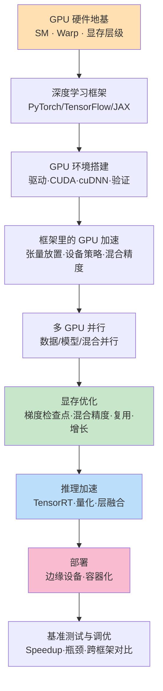
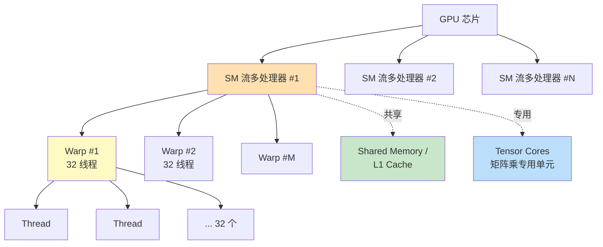
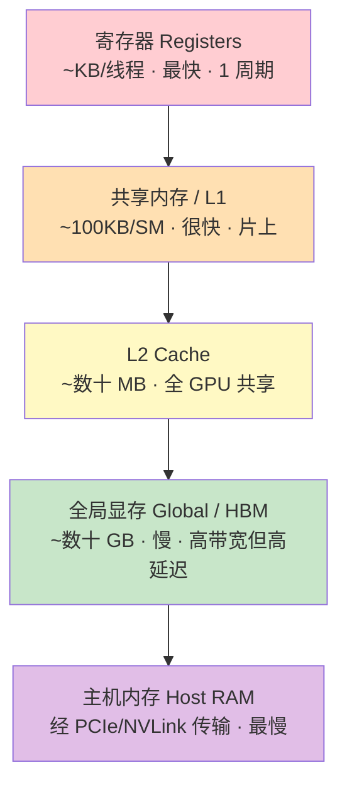
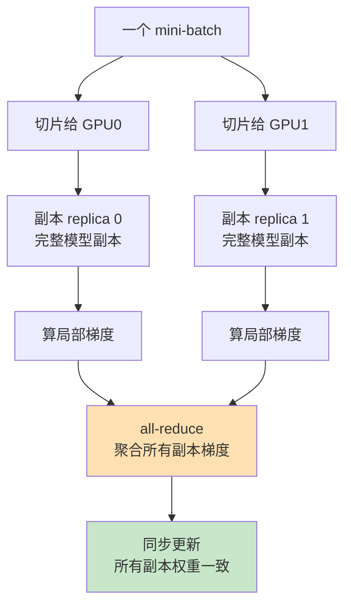
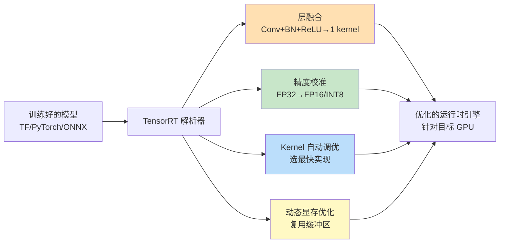
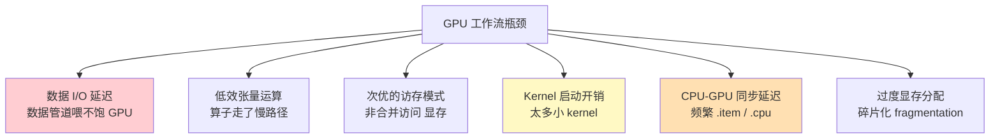

# 第 2 章 · GPU 架构、优化与部署 🚀

> 对应原书 *GPU-Accelerated Deep Learning*（Mangrulkar & Chavan, APress 2025）第 2 章 "GPU Architectures, Optimizations, and Deployment"（PDF 第 48–68 页）。
>
> 原书这一章的落点其实非常"工程":从深度学习框架讲起，一路串到 GPU 环境搭建、TensorFlow 加速、多 GPU 并行、显存优化、TensorRT 推理加速、部署与基准测试。但它的**标题**里有 "Architectures" 一词，而正文对硬件层（SM / warp / 显存层级）着墨不多。本讲义会**先补齐这块硬件地基**（🔬第一性原理小节），再逐节讲透书里的工程内容——这样你既知道"怎么调"，也知道"为什么这样调"。

---

## 🗺️ 本章地图



一句话概括本章的主线逻辑：**先有硬件（SM/warp/显存）→ 用框架抽象它 → 把环境接通 → 让张量跑在 GPU 上 → 扩到多卡 → 抠显存 → 优化推理 → 部署上线 → 用数据说话地调优。**

---

## 🔬 2.0 硬件地基：SM、Warp 与显存层级（第一性原理）

> 这一节是本讲义为你补的"前置课"。原书标题喊了 "Architectures"，但要真正理解后面每一个优化技巧（为什么混合精度快、为什么 warp 会拖后腿、为什么要把张量搬到同一设备），你必须先在脑子里建立起 GPU 的**物理结构模型**。

### 2.0.1 CPU vs GPU：为什么 GPU 适合深度学习？

- **是什么**：CPU 是"少数几个非常聪明的核"（几个到几十个核，单核很强、缓存巨大、擅长复杂分支和低延迟串行任务）；GPU 是"成千上万个不太聪明的核"（数千个 CUDA Core，单核弱、但数量碾压，擅长同一套指令同时作用在海量数据上）。
- **为什么**：深度学习的本质是**大规模矩阵乘法 + 逐元素运算**（$Y = W \cdot X$、激活、归一化）。这类计算的特点是"同一个操作重复几百万次、彼此独立"。这正是 GPU 的主场——**SIMT（Single Instruction, Multiple Threads，单指令多线程）**。
- **代价**：GPU 单个线程延迟高、控制逻辑弱，遇到大量 `if/else` 分支（发散）会严重掉速；数据要先从 CPU 内存搬到 GPU 显存（PCIe 传输是常见瓶颈）。

> 💡 **第一性原理**：深度学习之所以"吃 GPU"，不是因为 GPU"更快"，而是因为它的算力是**并行铺开**的。当你的问题能被切成上万个独立小任务时，GPU 的吞吐（throughput）就碾压 CPU；当你的问题是"一步接一步、必须等上一步"的串行逻辑时，GPU 反而不如 CPU。

### 2.0.2 硬件层级：从 GPU 到 CUDA Core

一块 NVIDIA GPU 的物理组织，可以画成一棵"三层树"：



| 硬件单元 | 英文 | 是什么 | 类比 |
|---|---|---|---|
| **GPU** | Graphics Processing Unit | 整块芯片 | 一整座工厂 |
| **SM** | Streaming Multiprocessor（流多处理器） | GPU 的基本调度/执行单元，一块 GPU 有几十到上百个 SM | 工厂里的一条条流水线车间 |
| **CUDA Core** | — | SM 内做整数/浮点标量运算的最小算术单元 | 车间里的一个工人 |
| **Tensor Core** | — | 专门做 $4\times4$（或更大）矩阵乘加的硬件单元，混合精度的关键 | 车间里的"矩阵专用机床" |
| **Warp** | — | **32 个线程绑在一起、同步执行同一条指令**的最小调度粒度 | 32 人一组、听同一个口令齐步走 |

> ⚠️ **常见坑**：很多人以为"线程"是 GPU 调度的最小单位。**错**。GPU 调度的最小单位是 **warp（32 线程）**。你启动 33 个线程，硬件也会分配 2 个 warp（第二个 warp 里 31 个线程空转）。这就是为什么 block 大小最好是 **32 的整数倍**。

### 2.0.3 Warp 与 Warp 发散（Divergence）

- **是什么**：一个 warp 里的 32 个线程**共享同一个程序计数器**——它们在同一时刻执行同一条指令，只是作用在不同数据上（这就是 SIMT）。
- **为什么会掉速**：如果 warp 内出现分支，比如：

  ```cuda
  if (threadIdx.x % 2 == 0)  A();   // 偶数线程走这条
  else                        B();   // 奇数线程走这条
  ```

  那么这 32 个线程**没法同时执行 A 和 B**。硬件只能：先让走 A 的线程干活、走 B 的线程"挂起"；再反过来。两条分支**串行执行**，等效算力直接砍半。这就叫 **warp divergence（warp 发散）**。
- **怎么用（怎么避）**：让同一个 warp 内的线程尽量走**同一条分支**（比如按 warp 边界对齐数据、避免依赖 `threadIdx` 的细粒度分支）。深度学习框架的算子（cuDNN kernel）早就替你做好了这层优化，所以你写 PyTorch 时一般感受不到——但当你自己写 CUDA kernel，或者调 batch/维度导致 kernel 走了慢路径时，就会撞上它。

> 💡 **面试高频**：`Q: 为什么 GPU 的 block 线程数常设成 128/256？` `A: ① 必须是 warp(32) 的整数倍以免线程空转；② 要足够多以隐藏访存延迟（latency hiding）——SM 靠在多个 warp 间快速切换来"藏住"某个 warp 等显存的时间；③ 又不能太多以免超出 SM 的寄存器/共享内存预算导致 occupancy（占用率）下降。128/256 是这三者的常见折中。`

### 2.0.4 显存层级（Memory Hierarchy）——**本章后续所有优化的物理根源**

GPU 的存储不是一块铁板，而是一座"金字塔":越靠上越快越小、越靠下越慢越大。



| 层级 | 容量量级 | 相对延迟 | 谁能访问 | 深度学习里的角色 |
|---|---|---|---|---|
| **寄存器** | 每线程几十个 | 1（最快） | 单个线程私有 | 存循环变量、临时中间值 |
| **共享内存 / L1** | 每 SM ~100 KB | ~10× | 同一 block 内线程 | 手写 kernel 里做 tiling（分块）缓存 |
| **L2 Cache** | 几十 MB | ~30× | 全 GPU | 自动缓存热点数据 |
| **全局显存 (HBM)** | 几十 GB | ~200–400× | 全 GPU + Host | **存放你所有的模型权重、激活、梯度** |
| **主机内存 (RAM)** | 上百 GB | 经 PCIe，最慢 | CPU | 数据集原始存放地，需搬到显存 |

> 🔬 **第一性原理 — 这张表解释了整章 90% 的优化**：
> - 为什么会 **OOM（Out Of Memory）**？→ 全局显存（几十 GB）装不下"模型权重 + 所有中间激活 + 梯度 + 优化器状态"。→ 这就催生了 **§2.5 梯度检查点、混合精度、层级复用**——全都是在跟"全局显存不够大"较劲。
> - 为什么 **数据要放同一设备**（§2.3.1）？→ CPU↔GPU 走 PCIe（金字塔最底层，最慢），一次跨设备搬运可能比计算本身还贵。
> - 为什么 **混合精度快**（§2.3.3/§2.5.2）？→ FP16 权重只占 FP32 一半的显存和带宽，且能喂给 **Tensor Core** 这种专用矩阵单元，吞吐直接翻倍。
> - 为什么 **多 GPU 通信是瓶颈**（§2.4）？→ 梯度同步（all-reduce）要在多块卡的全局显存之间倒腾数据，走 NVLink/PCIe，是"金字塔最底层的多机版"。

**把这张显存金字塔记牢，后面每一个优化技巧你都能自己推出来它到底在省哪一层。**

---

## 🧰 2.1 深度学习框架（Deep Learning Frameworks）

### 2.1.1 什么是深度学习框架？

原书用了一个很萌的比喻：想教机器人从照片里认出猫🐱，你可以从零手写全部指令——但那会**慢到天荒地老且极其复杂**。深度学习框架就是来救场的。

> **原书定义**：*A deep learning framework is a software library that provides tools and interfaces to design, train, and deploy deep neural networks efficiently, often with support for GPU acceleration.*
>
> （深度学习框架是一个软件库，提供工具和接口来高效地设计、训练和部署深度神经网络，且通常自带 GPU 加速支持。）

- **是什么**：框架 = 一套"乐高积木"🧱。它把深度学习的底层数学（求导、矩阵运算）和硬件细节（CUDA kernel、显存管理）**抽象封装**起来，给你现成的**层（layers）、激活函数（activation）、损失函数（loss）、优化器（optimizer）**。
- **为什么**：让你专注于**设计模型、做实验**，而不用操心底层的数学与计算细节。
- **怎么用**：像搭积木一样组合这些组件（见后面各框架的步骤）。

原书 Fig 2.1 把框架拆成几个组成部分，我用表格重画：

| 组成部分 | 说明 |
|---|---|
| Neural Networks（神经网络） | 核心建模对象 |
| Layers（层） | Dense / Conv2D / LSTM 等预制积木 |
| Optimization Techniques（优化技术） | SGD / Adam 等 |
| High-Level Interface（高层接口） | Keras、`nn.Module` 这类易用 API |
| **GPU Acceleration（cuDNN, NCCL）** | ⭐ 与本章紧密相关：框架靠这些库把算子跑到 GPU 上 |
| Popular（TensorFlow, PyTorch, MXNet） | 主流实现 |

> 💡 **实战**：`cuDNN` 是 NVIDIA 的深度神经网络专用库（卷积、RNN、attention 的高度优化 kernel）；`NCCL`（NVIDIA Collective Communications Library）负责**多 GPU 之间的集合通信**（如 all-reduce）；`cuBLAS` 负责基础线性代数（矩阵乘）。你写的 `torch.matmul` 最终就是落到 cuBLAS/cuDNN 上跑的。

### 2.1.2 为什么要用框架？（原书列的优势）

- 用现成组件而非事事手写 → **加速开发、减少 bug**。
- 能处理海量数据、胜任语音识别/图像分析/机器翻译等高性能任务。
- 从简单原型到前沿 AI 系统都支持，新手老手通吃。
- 提供预制库来定义网络层、类型（CNN、RNN）和常见架构。
- 覆盖 CV、语音、NLP 等广泛应用。
- 提供 Python/C/C++/Scala 等熟悉语言的接口。
- 很多框架用 NVIDIA 的 **cuDNN / NCCL / cuBLAS** 深度优化，确保高效的 GPU 加速训练。

### 2.1.3 三大主流框架

#### 🔶 TensorFlow（Google）

以**可扩展性、生产就绪、同时支持高层与低层 API** 著称，尤其擅长**移动端和嵌入式部署**。原书 Fig 2.2 描述其架构分层：Client（客户端）→ Core（核心）→ Execution Engine（执行引擎）→ Abstraction Layer（抽象层，含 **CPU / GPU / TPU** 三个后端）。

**使用步骤（原书 8 步）**：

| 步骤 | 操作 | 关键 API |
|---|---|---|
| 1 安装 | `pip install tensorflow` | — |
| 2 导入 | `import tensorflow as tf` | — |
| 3 备数据 | 支持 NumPy / Pandas / 内置数据集 | `tf.data`, `tf.keras.datasets` |
| 4 建模型 | 用 Keras 高层 API 搭网络 | `tf.keras`（`Dense`/`Conv2D`/`LSTM`） |
| 5 编译 | 指定损失/优化器/评估指标 | `model.compile()` |
| 6 训练 | 拟合训练数据、多轮监控 | `model.fit()` |
| 7 评估/预测 | 测新数据、做预测 | `model.evaluate()` / `model.predict()` |
| 8 保存部署 | 保存并部署到移动/嵌入/云 | `model.save()` |

#### 🔥 PyTorch（Facebook / Meta AI）

开源框架，最大特点是**动态计算图（dynamic computation graph）**——网络结构在**运行时**构建，可以边跑边改、边跑边看，因此**调试直观、极适合研究与实验**。语法自然、贴近标准 Python，学习曲线平缓，是学术界和开发者的宠儿。

**使用步骤（原书 9 步，精讲）**：

```python
# 1. 安装：按官网选 CUDA 版本   2. 导入
import torch
import torch.nn as nn

# 3. 创建张量（PyTorch 的核心数据结构）
x = torch.tensor([1.0, 2.0])        # 也可 torch.zeros / torch.ones
# 4. 张量运算：加、乘、reshape……全都支持

# 5. 定义模型：继承 nn.Module，__init__ 里建层，forward() 里写前向
class Net(nn.Module):
    def __init__(self):
        super().__init__()
        self.fc = nn.Linear(2, 1)
    def forward(self, x):
        return self.fc(x)

model = Net().to('cuda')            # ⭐ 把模型搬上 GPU（呼应 §2.3.1）

# 6. 损失函数 + 优化器
criterion = nn.CrossEntropyLoss()
optimizer = torch.optim.SGD(model.parameters(), lr=0.01)

# 7. 训练循环：喂数据 → 算 loss → 反传 → 更新
for epoch in range(epochs):
    optimizer.zero_grad()
    output = model(x.to('cuda'))    # 数据也要在 GPU 上（同设备原则）
    loss = criterion(output, target)
    loss.backward()                 # 自动求导（autograd）
    optimizer.step()                # 更新权重

# 8. 评估：关梯度省显存/提速
with torch.no_grad():
    ...                             # 用验证/测试集评估

# 9. 保存 / 加载
torch.save(model.state_dict(), 'm.pt')
model.load_state_dict(torch.load('m.pt'))
```

> ⚠️ **常见坑**：`loss.backward()` 之前一定要 `optimizer.zero_grad()`，否则 PyTorch 的梯度会**累加**（这是它的设计，不是 bug），不清零你的梯度会越滚越大、训练直接崩。

#### ⚡ JAX（Google）

高性能数值计算库，把 **Python + NumPy 的灵活性**和**自动微分 + 硬件加速**融合。核心特性：

- **`jax.numpy`（`jnp`）**：NumPy 的"即插即用"替代品，代码看起来跟 NumPy 一样。
- **自动微分**：`grad`（标量输出求梯度）、`jacfwd`/`jacrev`（复杂雅可比）。
- **XLA（Accelerated Linear Algebra）编译**：把代码编译优化后跑在 CPU/GPU/TPU 上。
- **`@jit`**：即时编译（JIT），大幅提速。
- **`vmap`**：自动向量化（批处理），`pmap`：多设备并行。
- **函数式风格**：强调不可变、纯函数，天然契合 Flax / Haiku 这类现代 ML 库。

> 💡 **实战直觉**：PyTorch 是"命令式、边写边跑，调试爽"；JAX 是"函数式 + 编译，写完 `@jit` 一编译，XLA 帮你把一堆算子融合（fusion）成一个大 kernel，跑得飞快，但报错栈更难读"。选谁取决于你更看重**灵活调试**还是**极致吞吐**。

### 2.1.4 三大框架对比（原书 Table 2.1）

| 特性 | 🔥 PyTorch | 🔶 TensorFlow | ⚡ JAX |
|---|---|---|---|
| 出身 | Facebook | Google | Google |
| 主要场景 | 深度学习 | 深度学习 | 高性能数值计算 + ML 研究 |
| 自动微分 | Autograd | GradientTape | Autograd |
| 硬件加速 | CPU, GPU | CPU, GPU, **TPU** | CPU, GPU, TPU（经 XLA） |
| 编程范式 | **命令式（Imperative）** | **声明式（Declarative）** | **函数式（Functional）** |
| 生态 | torchvision / torchaudio… | Keras / TFX / TF Lite… | Flax / Haiku / Objax… |
| 性能特点 | 动态图下高性能 | 静态图高性能 | XLA 编译 + 优化高性能 |

> 💡 **一句话选型**：
> - **研究/快速试错** → PyTorch（动态图 + 直观）
> - **规模化生产/多平台部署** → TensorFlow（静态图 + TF Lite/TFX 生态）
> - **极致吞吐/TPU/科学计算** → JAX（函数式 + XLA fusion）

---

## 🔧 2.2 搭建 GPU 支持（Setting GPU Support）

要让框架跑到 GPU 上，是一条**环环相扣的依赖链**，任何一环版本对不上就报错。原书给出的搭建顺序：


> ⚠️ **最大的坑：版本矩阵地狱**。驱动版本必须兼容 CUDA 版本，CUDA 版本必须匹配框架编译时的版本，cuDNN 又要匹配 CUDA。四者形成一个"版本矩阵"，错一个就是 `Could not load dynamic library` 或 `CUDA error`。装之前先查官方兼容表。

### 2.2.1 NVIDIA GPU 驱动要求

- **是什么**：驱动是**操作系统与 GPU 硬件之间的翻译官**，让框架能调用 GPU 算力。
- **为什么**：驱动版本必须与所装 CUDA 版本**兼容**；NVIDIA 会定期更新驱动以支持新 CUDA、提升性能与稳定性。
- **怎么用**：
  - 先查你的 **GPU 型号 + 操作系统**，去 NVIDIA 官网下对应驱动。
  - **Linux**：推荐用包管理器或 NVIDIA 的 runfile 安装。
  - **Windows**：用 NVIDIA 提供的 exe 安装器。
  - 装完**重启**，用 `nvidia-smi` 验证——它会显示驱动版本、GPU 状态、CUDA 兼容性。

### 2.2.2 安装 CUDA 与 cuDNN

- **CUDA**（Compute Unified Device Architecture）：NVIDIA 的**并行计算平台 + API 模型**，是你调 GPU 的底层通道。
- **cuDNN**（CUDA Deep Neural Network library）：**面向深度神经网络的 GPU 加速库**（高度优化的卷积、RNN 等 kernel）。
- **怎么用**：官网下匹配你 GPU 和 OS 的版本 → 按说明安装 → **配好环境变量**：Linux 上是 `PATH` 和 `LD_LIBRARY_PATH`，Windows 上是系统路径 → 跑示例程序或框架命令验证。

### 2.2.3 验证 GPU 可用性

搭完环境，**必须验证**加速器是否被框架识别。各框架都有内置检测函数：

```python
# PyTorch
import torch
print(torch.cuda.is_available())        # True 才算通
print(torch.cuda.device_count())        # 有几块卡
print(torch.cuda.get_device_name(0))    # 卡型号

# TensorFlow
import tensorflow as tf
print(tf.config.list_physical_devices('GPU'))   # 列出可见 GPU
```

原书强调：要**监控显存使用与设备放置**，确保资源用得高效；多 GPU 系统还能上分布式/并行来进一步提速。

### 2.2.4 管理 GPU 显存使用与可见性

这是本节最实用的部分，原书给了几招：

| 策略 | 做什么 | 解决什么问题 |
|---|---|---|
| **按需分配（memory growth）** | 用多少要多少，**不一次性预占全部显存** | 多个应用/模型共享一块 GPU 时更省 |
| **设显存上限 / 逻辑分区** | 给进程限额或切逻辑分区 | 多用户/多模型环境里**公平共享或隔离** |
| **`nvidia-smi` 实时监控** | 看显存占用、利用率、活跃进程 | 诊断瓶颈、确认计算真跑在 GPU 上 |
| **`CUDA_VISIBLE_DEVICES`** | 限制应用能看到哪些 GPU | 多卡系统里**手动分配**卡 |

```bash
# 实时看 GPU 状态（显存/利用率/进程）
$ nvidia-smi

# 只让脚本看到 0 号 GPU（多卡系统手动指派）
$ CUDA_VISIBLE_DEVICES=0 python your_script.py
```

> 💡 **面试高频**：`Q: 训练时另一个同事的任务把整块卡的显存占满了，你怎么办？` `A: ① 用 nvidia-smi 定位是哪个 PID 占的；② 自己的任务用 memory growth / 显存上限避免独吞；③ 用 CUDA_VISIBLE_DEVICES 把两人的任务分到不同卡上物理隔离。`

> ⚠️ **TensorFlow 的坑**：TF **默认会一上来就占满整块 GPU 的显存**（贪婪预分配）。所以在共享机器上，第一件事往往是开 memory growth（见 §2.5.4 代码），否则你会莫名其妙地把别人的任务挤 OOM。

---

## ⚙️ 2.3 TensorFlow 中的 GPU 加速

TensorFlow 对 GPU 支持很到位：**默认自动检测可用 GPU 并尝试用它计算**。大矩阵运算和深度网络在 GPU 上远快于 CPU。它支持单卡和多卡；除非你显式指定，否则**有 GPU 就自动把算子放 GPU**。

### 2.3.1 GPU 兼容的张量与运算

要吃到 GPU 加速，**张量和运算都必须"住在 GPU 上"**：

- **GPU 兼容张量**：数据结构驻留在**GPU 显存**里，才能高速并行计算。
- 张量在 GPU 上时，矩阵乘、卷积、反向传播等会被优化——底层靠 **cuDNN / CUDA** 实现高性能。

**实践三原则（原书）**：

1. **需要时显式创建/搬运张量到 GPU**（PyTorch: `.to('cuda')`）。
2. **参与同一运算的所有张量必须在同一设备上**——否则会触发 CPU↔GPU 之间**多余的数据传输开销**（呼应 §2.0.4：PCIe 是金字塔最底层，最慢）。
3. **确认所选运算 GPU 支持**——有些算子会默默回落到 CPU。

> ⚠️ **经典报错**：`RuntimeError: Expected all tensors to be on the same device, but found at least two devices, cuda:0 and cpu!` —— 这就是原则 2 被违反：模型在 GPU、输入数据还在 CPU。修法：`data = data.to('cuda')`。

### 2.3.2 自动 vs 手动设备放置（Device Placement）

| | 自动放置（Automatic） | 手动放置（Manual） |
|---|---|---|
| **谁决定** | 框架按可用性/兼容性自动选设备 | 开发者用设备作用域/API 显式指定 |
| **优点** | 简单、可移植，抽象掉硬件管理 | 精确控制、可优化显存与执行流 |
| **适合** | 新手、快速原型 | 性能敏感、多 GPU、需精调 |
| **典型手段** | 框架默认行为 | 指定 device scope / `.to(device)` |

原书给了手动放置的两个价值场景：
- 把**模型不同部分放到不同 GPU**上 → 提升并行度（这就是模型并行的雏形，见 §2.4.2）。
- 把**频繁使用的数据留在同一设备**上 → 减少通信开销。

> 结论：**自动放置重"易用+可移植"，手动放置重"精度+优化"**。两者都懂，才能设计出可扩展又高效的工作流。

### 2.3.3 启用混合精度训练（Mixed-Precision Training）

- **是什么**：混合精度 = **同时用 16 位（FP16）和 32 位（FP32）浮点**计算。很多神经网络运算**并不需要完整的 32 位精度**，在合适的地方用 16 位即可。
- **为什么快**：FP16 数据占**一半的显存和带宽**，且能喂给现代 GPU 上的 **Tensor Core（张量核心）**专用硬件 → 计算更快、吞吐更高。
- **怎么用**：主流框架都内置支持，**自动管理**各运算/变量的精度，通常只需改极少代码。
- **代价 / 注意**：
  - 硬件必须**支持半精度运算**（有 Tensor Core 的卡，如 Volta 及以后）。
  - 必须用 **loss scaling（损失缩放）**保证数值稳定——FP16 表示范围小，小梯度容易**下溢（underflow）归零**。

> 🔬 **第一性原理 — loss scaling 为什么必要**（结合 §2.5.2 的公式）：FP16 能表示的最小正数远大于 FP32，训练后期的小梯度在 FP16 里会被直接舍成 0。解法：反传前把 loss 乘上一个大的缩放因子 $s$，让梯度整体"抬高"到 FP16 能表示的区间，更新权重前再除回 $s$：
> $$\frac{\partial \mathcal{L}}{\partial \theta} = \frac{1}{s} \cdot \frac{\partial \hat{\mathcal{L}}}{\partial \theta}$$
> 现代框架用**动态 loss scaling**——自动调 $s$，遇到溢出就调小、平稳就调大。

### 2.3.4 用 MirroredStrategy 做多 GPU 训练

`MirroredStrategy` 是 TensorFlow 提供的高层 API，用于**单机多卡的同步训练**：



- **工作原理**：在每块 GPU 上**复制一份模型**（称为 replica，副本）；每个副本并行处理**输入数据的一部分**；反传后**跨副本聚合梯度**再统一更新参数。
- **好处**：所有 GPU 平等贡献学习；**改动极小**即可扩展；无需手动设备放置或自定义并行逻辑；在性能与易用间取得平衡。
- **本质**：这正是**数据并行**的 TensorFlow 实现（见下一节）。

---

## 🔀 2.4 多 GPU 训练策略（Multi-GPU Training Strategies）

当单卡装不下模型、或训练太慢时，就把计算**分摊到多块 GPU**。三大策略：**数据并行、模型并行、混合并行**。

### 2.4.1 数据并行（Data Parallelism）

**思路**：**整个模型复制到每块 GPU**，每块卡处理**不同的 mini-batch**。

设数据集 $D = \{x_1, x_2, \dots, x_n\}$，共 $k$ 块 GPU。把数据切成 $k$ 份（每份约 $n/k$）。第 $i$ 块 GPU $G_i$ 对自己那份算梯度 $\nabla_i \mathcal{L}(\theta)$，然后**同步步骤聚合梯度**（原书公式 2.1）：

$$\nabla \mathcal{L}(\theta) = \frac{1}{k} \sum_{i=1}^{k} \nabla_i \mathcal{L}(\theta)$$

用这个聚合梯度更新参数 $\theta$。TensorFlow 的 `MirroredStrategy` 和 PyTorch 的 `DistributedDataParallel (DDP)` 用 **all-reduce** 高效管理这次同步。

> 💡 **all-reduce 是什么**：一种集合通信原语——每块卡把自己的梯度贡献出去，最终**每块卡都拿到"全体梯度的和/均值"**。NCCL 负责在 GPU 间高效实现它（利用 NVLink 环状拓扑）。这就是 §2.1.1 里 NCCL 的用武之地。

- **适合**：**中小模型**（模型能塞进单卡）。
- **优点**：**扩展效率高**，尤其数据集大时。
- **代价**：每步训练后要跨卡同步梯度 → **中等通信开销**。

### 2.4.2 模型并行（Model Parallelism）

**思路**：**把模型本身切开**，每块 GPU 负责一部分层。用于**模型太大、单卡装不下**的情况。

设神经网络 $f(x) = f_k \circ f_{k-1} \circ \dots \circ f_1(x)$，其中每个 $f_i$ 是一块层。模型并行把每个 $f_i$ 分到不同 GPU：**前向传播时数据依次流过各 GPU，反向传播时梯度反向流回**。

- **适合**：**超大模型**。
- **优点**：突破单卡显存限制。
- **代价**：**通信开销高**——中间激活（activations）必须在设备间来回传；且各层计算量可能不均衡，**扩展效率一般低于数据并行**。

> ⚠️ **朴素模型并行的坑：GPU 空闲（idle）**。因为前向是 $z_1 = f^{(1)}(x) \to z_2 = f^{(2)}(z_1) \to \dots$ 串行的，GPU0 算第一段时 GPU1/2/3 全在等。真实系统用 **pipeline parallelism（流水线并行）** 把 batch 再切成 micro-batch 来填满空档——原书这里只讲了朴素版，进阶时要知道有流水线这一层。

### 2.4.3 混合并行（Hybrid Parallelism）

**思路**：**数据并行 + 模型并行结合**，专治**极大模型**（Transformer、GPT 类），单用任一种都不够。

设有 $K = D_p \times M_p$ 块 GPU，其中：
- $D_p$ = **数据并行组数**（模型副本数）；
- $M_p$ = 每个副本内的**模型并行分区数**。

每个数据并行组处理数据的**不相交子集**（原书公式 2.3）：
$$D = \bigcup_{i=1}^{D_p} D_i, \quad D_i \cap D_j = \emptyset \quad (i \neq j)$$

每个副本的模型被切成 $M_p$ 段，GPU $G_{i,j}$（$i$=数据并行组，$j$=模型分区）持有子模型 $f^{(j)}$：
$$f(x) = f^{(M_p)} \circ f^{(M_p-1)} \circ \dots \circ f^{(1)}(x)$$

**三个关键步骤**：

1. **前向传播**：组内输入 $x \in D_i$ 依次穿过 $M_p$ 块 GPU：
   $$z_1 = f^{(1)}(x),\quad z_2 = f^{(2)}(z_1),\ \dots,\quad \hat{y} = f^{(M_p)}(z_{M_p-1})$$
2. **反向传播**：梯度逆序跨模型分区回传：
   $$\frac{\partial \mathcal{L}}{\partial z_{M_p}} \to \frac{\partial \mathcal{L}}{\partial z_{M_p-1}} \to \dots \to \frac{\partial \mathcal{L}}{\partial x}$$
3. **梯度同步**：每次反传后，跨 $D_p$ 个副本用 all-reduce 同步（公式 2.7）：
   $$\nabla \mathcal{L}(\theta) = \frac{1}{D_p} \sum_{i=1}^{D_p} \nabla_i \mathcal{L}(\theta)$$

> 💡 **直觉**：把 GPU 排成一个 $D_p \times M_p$ 的**网格**。**每一列**（模型并行）合起来装下一整个大模型；**每一行**（数据并行）是这个大模型的一份副本，各喂不同数据。这正是训练 GPT-3 那种千亿模型的骨架（现实中还会叠加流水线并行、张量并行、ZeRO 等）。

### 2.4.4 三种策略对比（原书 Table 2.2）

| 策略 | 适合的模型规模 | 扩展效率 | 通信开销 |
|---|---|---|---|
| **数据并行** | 小到中 | **高** | 中（梯度同步） |
| **模型并行** | 很大 | 中 | **高**（层间数据传输） |
| **混合并行** | 极大 | **高** | **很高**（需精细调优） |

**选择逻辑（原书总结）**：取决于**模型规模、资源多少、以及你愿意在"性能 vs 复杂度"间做怎样的取舍**。
- 数据并行：整个模型复制到每卡，数据集大时扩展效率高，同步带来中等通信开销。
- 模型并行：适合装不下单卡的大模型，缓解显存压力，但中间激活跨设备传输带来高通信开销，且层间负载可能不均。
- 混合并行：GPT-3 / 大视觉 Transformer 这类超大规模的标配，扩展效率高但通信开销很高、需要专用框架与硬件精细协调。

---

## 💾 2.5 GPU 显存优化技术（Memory Optimization）

> 高效利用显存是训练的命门——尤其大架构、高分辨率数据、或硬件有限时。优化不当就会 **OOM（Out Of Memory，显存溢出）**。所有技巧的本质，都是在 §2.0.4 那座"显存金字塔"里省地方。

### 2.5.1 梯度检查点 / 重计算（Gradient Checkpointing）

- **是什么**：**用计算换存储**。前向传播时**不存整张计算图**，只存少数"检查点（checkpoint）"；中间激活先丢掉，反传需要时再**重新算出来**。
- **为什么有效**：正常反传要用到每层的中间输出 $z_i = f_i(z_{i-1})$：
  $$\frac{\partial \mathcal{L}}{\partial z_i} = \frac{\partial \mathcal{L}}{\partial z_{i+1}} \cdot \frac{\partial z_{i+1}}{\partial z_i}$$
  所以正常要把**所有** $z_i$ 都存着——显存复杂度 $\mathcal{O}(n)$。检查点法只存每隔 $k$ 层的输出，其余反传时重算，把显存降到约 $\mathcal{O}(\sqrt{n})$（Chen 等人 *"Training Deep Nets with Sublinear Memory Cost"* 的经典结论）。
- **代价**：**多花一次前向的计算量**（重算），换来显存大降。典型代价约 +20~30% 训练时间，换来能塞下更深的模型。

> 💡 **实战**：PyTorch 用 `torch.utils.checkpoint.checkpoint(fn, x)` 一行包住某段子网络即可开启。训练大 Transformer 撞 OOM 时，这是**第一个该试的招**。

### 2.5.2 混合精度训练（Mixed-Precision）

用 **FP16 代替 FP32** 存权重和激活，砍一半显存、提速计算；但某些操作（如 loss 累加）必须留在高精度以防数值不稳。

设权重 $\mathbf{W} \in \mathbb{R}^{m \times n}$、激活 $\mathbf{X} \in \mathbb{R}^{n \times b}$（$b$ 是 batch size）用 FP16 表示，输出 $\mathbf{Y} = \mathbf{W} \cdot \mathbf{X}$ 由 **Tensor Core** 算出；再配合**动态损失缩放因子 $s$** 防下溢：
$$\mathcal{L} = \hat{\mathcal{L}}/s, \qquad \frac{\partial \mathcal{L}}{\partial \theta} = \frac{1}{s} \cdot \frac{\partial \hat{\mathcal{L}}}{\partial \theta}$$

（与 §2.3.3 呼应——那里讲"怎么启用"，这里讲"数学上省在哪"。）

### 2.5.3 层级内存复用（Layer-Wise Memory Reuse）

- **是什么**：顺序模型中，**早期层的显存一旦不再需要就释放**；有些框架会**复用缓冲区**给生命周期不重叠的中间输出。
- **适合**：ResNet、Transformer block 这类**前馈架构**——反传开始前，很多中间输出可以先释放或复用。
- **代价**：几乎无额外计算代价，属于框架自动做的"顺手优化"，节省潜力中等。

### 2.5.4 显存增长与垃圾回收（Memory Growth & GC）

TensorFlow 可开启 **memory growth**，避免一上来预占整块显存：

```python
# 按需分配显存，不一次性吃满整块 GPU
tf.config.experimental.set_memory_growth(gpu, True)
```

用**动态计算图**时，某些框架还能**显式触发垃圾回收**，训练中回收无用显存。

> ⚠️ **常见坑**：这招节省潜力"低到中等"，别指望它救大模型 OOM——它主要解决"**多任务共享一卡**"和"**别一开始就把别人挤爆**"的问题，不改变你模型峰值显存的量级。真要降峰值，靠 §2.5.1 检查点和 §2.5.2 混合精度。

### 2.5.5 五种显存优化对比（原书 Table 2.3）

| 技术 | 做什么 | 省显存潜力 | 代价 |
|---|---|---|---|
| **梯度检查点** | 反传时重算中间激活 | **高** | 多一次前向计算 |
| **混合精度** | FP16 存权重/激活 + 缩放 loss | **中到高** | 需硬件支持 + loss scaling |
| **层级内存复用** | 层执行时释放/复用缓冲区 | 中等 | 几乎无 |
| **显存增长控制** | 按需分配，不预占全部 | 低到中 | 几乎无 |
| **垃圾回收** | 手动/自动释放无用张量 | 低 | 几乎无 |

> 💡 **实战组合拳**：撞 OOM 时的推荐顺序 → **① 开混合精度（几乎白送的一半显存 + 提速）→ ② 开梯度检查点（换来能塞更深的网络）→ ③ 减小 batch size / 用梯度累加 → ④ 再不行才上模型并行**。前两招组合起来，常能让你在同一块卡上训练大约 2–4 倍规模的模型。

### 2.5.6 TensorRT：推理加速

> ⚠️ 注意本节从**训练**优化切到了**推理（inference）**优化。TensorRT 只在部署阶段用，不参与训练。

**TensorRT** 是 NVIDIA 的**高性能深度学习推理引擎**，专门把训练好的模型转成**优化后的运行时引擎**，做一系列图级和 kernel 级优化。核心技术：



| 优化技术 | 做什么 | 省在哪 |
|---|---|---|
| **层融合（Layer Fusion）** | 把 卷积+BN+ReLU 这类序列**合成一个 kernel** | 减少显存带宽 + kernel 启动开销 |
| **精度校准（Precision Calibration）** | FP32 → FP16 或 INT8，精度损失极小 | 减半/减 3/4 的计算和带宽 |
| **Kernel 自动调优** | 对 GEMM/卷积**基准测试多种实现**选最快 | 针对目标硬件榨性能 |
| **动态张量显存优化** | 复用生命周期不重叠的缓冲区 | 降推理显存占用 |

**INT8 量化的数学**（原书）：一个 FP32 乘法 $y = w^\top x$（$w,x \in \mathbb{R}^n, y \in \mathbb{R}$）可以用带**标定缩放因子**的 INT8 版本替代：
$$\tilde{y} = S_w \cdot w_q^\top \cdot S_x \cdot x_q = S_y \cdot y_q$$
其中 $w_q, x_q, y_q$ 是量化后的整数，$S_w, S_x, S_y$ 是校准阶段确定的缩放因子。

**模型导入**：TensorRT 支持从 TensorFlow / PyTorch / **ONNX** / Keras 导入，典型流程是**先导出成 ONNX 格式 → 用 TensorRT 解析器生成优化引擎**。引擎针对目标 GPU 定制，推理低延迟。

**性能实测（原书 Table 2.4，ResNet-50）**：

| 模型 / 引擎 | 精度 | 延迟 (ms) | 吞吐 (FPS) |
|---|---|---|---|
| ResNet-50（TensorFlow） | FP32 | 12.3 | 80 |
| ResNet-50（TensorRT） | **FP16** | 6.1 | 160 |
| ResNet-50（TensorRT） | **INT8** | **3.8** | **230** |

> 🔬 **核心论证**：从 FP32→FP16→INT8，延迟从 12.3ms 一路降到 3.8ms（约 **3.2× 加速**），吞吐从 80→230 FPS（约 **2.9×**），且**无需重新训练原模型**。原书结论：整合 TensorRT 可获得 **3–5× 推理加速**，特别适合**自动驾驶、实时视频分析、嵌入式系统**这类延迟敏感场景。

> ⚠️ **INT8 的代价**：不是白拿的——INT8 需要一个**校准数据集（calibration dataset）**来确定缩放因子 $S$，且某些对精度敏感的任务会掉点。上线前必须在验证集上对比 INT8 引擎和 FP32 原模型的精度差。

---

## 🚢 2.6 部署考量（Deployment Considerations）

把模型推到生产环境，要综合权衡：**延迟、算力、显存占用、可移植性、平台支持**。原书讲两大目标：**边缘设备**与**容器化环境**。

### 2.6.1 边缘设备（Edge Devices）

- **是什么**：在**本地硬件**上跑模型——手机、嵌入式系统、无人机、IoT 设备、自动驾驶车。
- **优点**：**低延迟、离线推理、数据隐私更好**（数据不出设备）。
- **约束**：显存、算力、能耗都**受限**。
- **怎么优化**：
  - **模型剪枝（pruning）**：删掉不重要的权重/通道。
  - **量化（quantization）**：FP32 → INT8（呼应 §2.5.6）。
  - **推理引擎**：TensorRT、**TensorFlow Lite**、**ONNX Runtime**。
  - **硬件专用后端**：GPU / DSP / **NPU** 加速器，确保高效执行。

### 2.6.2 容器与虚拟环境（Containers & Virtual Environments）

| | 虚拟环境（venv/conda） | 容器（Docker/K8s） |
|---|---|---|
| **打包什么** | 隔离 Python 依赖 | **整个运行时**（依赖+库+配置） |
| **解决什么** | 项目间依赖冲突 | 跨系统**可复现**、易扩展 |
| **适合** | 开发、实验、研究 | **可扩展的云/分布式生产部署** |
| **典型工具** | `conda`, `venv` | `Docker`, `Kubernetes` |

- **容器化**：Docker 把运行环境封装成可移植容器 → **可复现、易扩展、支持 CI/CD 持续部署**。Kubernetes 做编排（orchestration）。
- **服务形态**：容器 + 编排可实现健壮的模型服务——**REST API、gRPC 端点、批量推理管线**。

> 💡 **实战：GPU 容器化的隐藏细节**。普通 Docker 容器**看不到 GPU**，必须用 **NVIDIA Container Toolkit**（`nvidia-docker` / `--gpus all`）把宿主机的 GPU 驱动透传进容器。基础镜像通常直接用 `nvidia/cuda` 官方镜像（已装好 CUDA + cuDNN），省掉 §2.2 那套版本地狱。这是原书没展开、但生产中必踩的点。


---

## 📊 2.7 基准测试与性能调优（Benchmarking & Tuning）

基准测试和调优帮你**定位瓶颈、量化改进、指导设计决策**。

### 2.7.1 度量加速比与显存利用

性能提升通常用这些指标衡量：**训练速度、推理延迟、吞吐（samples/sec）、显存使用**。

**加速比（Speedup）**（原书公式 2.8）：
$$\text{Speedup} = \frac{T_{\text{baseline}}}{T_{\text{optimized}}}$$

即"优化前耗时 ÷ 优化后耗时"。比如从 12.3ms 优化到 3.8ms，加速比 = $12.3/3.8 \approx 3.2\times$。

**显存追踪指标**：峰值显存、显存带宽、分配模式。工具：**TensorFlow Profiler**、PyTorch 的 `torch.cuda.memory_summary()`。

### 2.7.2 GPU 工作流常见瓶颈

即便 GPU 算力强，性能也可能被这些拖后腿：



原书列的瓶颈：**数据 I/O 延迟、低效张量运算、次优访存模式、kernel 启动开销、CPU-GPU 同步延迟、过度分配导致碎片化**。定位它们往往需要对**主机（CPU）和设备（GPU）**活动做**细粒度 profiling**。

> ⚠️ **最隐蔽的坑：数据 I/O 才是最常见瓶颈**。很多人以为慢是 GPU 不够强，实际是**数据管道喂不饱 GPU**——GPU 算得飞快但一直在等 CPU 读盘/预处理。这时 `nvidia-smi` 会显示 GPU 利用率忽高忽低（时而 0%）。解法：多 worker 的 DataLoader、预取（prefetch）、`pin_memory`。

> 💡 **面试高频**：`Q: GPU 利用率只有 30%，怎么排查？` `A: ① 先看是不是数据 I/O 瓶颈（利用率波动大→加 DataLoader worker/prefetch）；② 看 batch 是否太小喂不满 SM（occupancy 低）；③ 看是否有频繁的 .item()/.cpu() 触发 CPU-GPU 同步；④ 用 profiler 看 kernel 时间线找空档。`

### 2.7.3 跨框架对比训练时间

TensorFlow / PyTorch / JAX 的训练性能会因**计算图、显存管理、后端优化**不同而差异显著：
- **JAX**：靠 XLA 编译做**激进的算子融合（fusion）**。
- **PyTorch**：**eager execution（即时执行）** + CUDA Graph 支持。

要**公平对比**，必须**标准化**这些变量：

| 控制变量 | 说明 |
|---|---|
| 模型架构 + 数据集 | 完全相同 |
| Batch size + epoch 数 | 完全相同 |
| 硬件配置 | GPU 型号、RAM、存储一致 |
| 精度 | FP32 / FP16 / INT8 统一 |

控制好这些变量后，才能真实分析各框架行为、选出最适合你应用的那个。

---

## 📌 小结

本章从"能跑"到"跑得好"再到"上得了线"，走完了 GPU 深度学习的完整工程链条：

1. **🔬 硬件地基（本讲义补充）**：GPU 由 **SM（流多处理器）**组成，SM 调度以 **warp（32 线程）**为最小单位，warp 发散会砍半算力；**显存金字塔**（寄存器→共享内存→L2→全局显存 HBM→主机 RAM）是理解后续所有优化的物理根源——越靠下越大越慢。**记住这座金字塔，本章 90% 的技巧都能自己推出来。**
2. **🧰 框架**：PyTorch（动态图、研究友好）、TensorFlow（静态图、生产/移动端）、JAX（函数式、XLA、极致吞吐），底层都靠 cuDNN/NCCL/cuBLAS 吃 GPU。
3. **🔧 环境搭建**：GPU→驱动→CUDA→cuDNN→框架 GPU 版→验证，一条环环相扣的**版本矩阵**依赖链；`nvidia-smi`、`CUDA_VISIBLE_DEVICES`、memory growth 管好显存与可见性。
4. **⚙️ 框架内加速**：张量与运算必须**同在 GPU**；自动 vs 手动设备放置；**混合精度**（FP16 + Tensor Core + loss scaling）几乎白送一半显存和提速。
5. **🔀 多 GPU**：**数据并行**（复制模型切数据，中小模型首选）、**模型并行**（切模型装大模型）、**混合并行**（GPT 级超大模型的 $D_p \times M_p$ 网格）；all-reduce 是梯度同步的核心。
6. **💾 显存优化**：梯度检查点（$\mathcal{O}(n)\to\mathcal{O}(\sqrt{n})$，用计算换存储）、混合精度、层级复用、显存增长；**推荐组合拳：混合精度 + 检查点**。
7. **🚀 推理加速**：**TensorRT** 通过层融合 + 精度校准（INT8）+ kernel 自动调优，实现 **3–5× 推理加速**无需重训。
8. **🚢 部署**：边缘设备（剪枝/量化 + TF Lite/ONNX Runtime）与容器化（Docker/K8s + NVIDIA Container Toolkit）。
9. **📊 调优**：$\text{Speedup} = T_{\text{baseline}}/T_{\text{optimized}}$；警惕 **数据 I/O 瓶颈**（最常见）；跨框架对比必须**控制变量**。

---

## 🔗 延伸

- **原书对应练习（第 68 页 Exercise 1–10）**：建议自测——框架对比、GPU 环境搭建步骤、TensorFlow 加速、三种并行对比、显存优化、TensorRT、边缘/容器部署、基准测试、显存管理挑战、跨框架训练时间分析。
- **想深入硬件层**：NVIDIA CUDA C++ Programming Guide（SM/warp/occupancy/coalesced access 的权威定义）；本仓库 `cuda-mastery/` 目录有逐章精讲与算子实战。
- **想深入并行训练**：Megatron-LM（张量并行）、DeepSpeed ZeRO（优化器状态分片）、PyTorch FSDP——它们是本章"混合并行"在千亿模型上的工业级延伸。
- **想深入推理部署**：TensorRT 官方文档、ONNX Runtime、Triton Inference Server（把 §2.6 的容器化服务落地）。
- **本章与前后章**：上承第 1 章 GPU 计算基础，下启后续章节的具体模型/算子实现——把这章的**显存金字塔 + 并行策略 + 混合精度**当成贯穿全书的三条主线来记。

> 💡 **一句话带走**：**GPU 深度学习优化的一切，本质都是在跟"显存金字塔"和"warp 并行"这两个物理约束博弈——省显存（检查点/混合精度/并行）、喂满并行（大 batch/避免发散/藏延迟）、别让数据搬运（PCIe/同步）成为瓶颈。**
