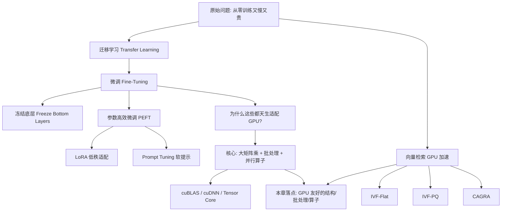
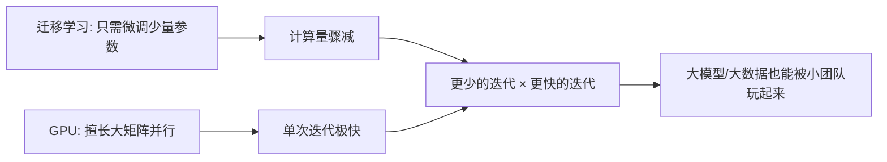
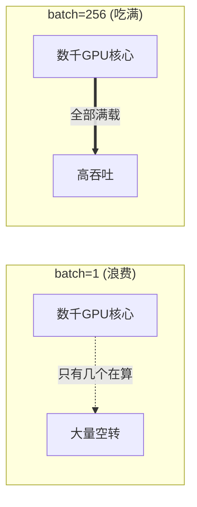
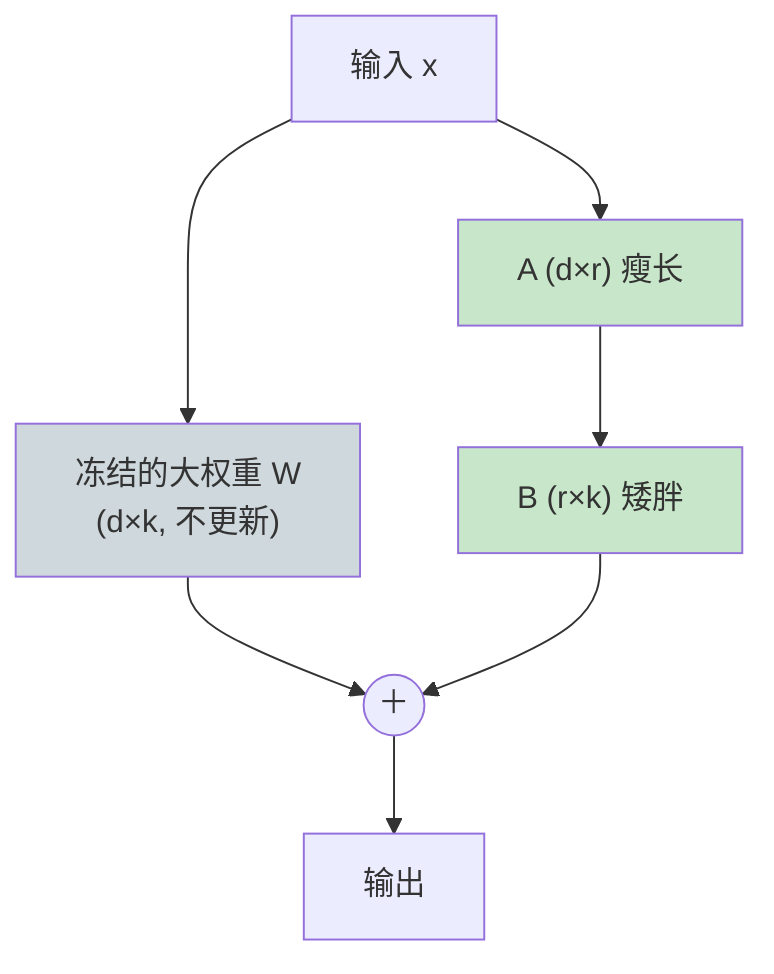
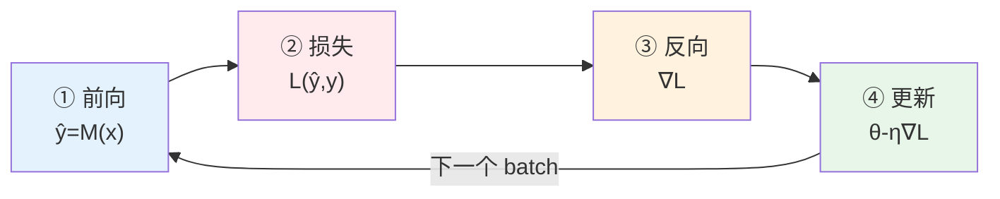
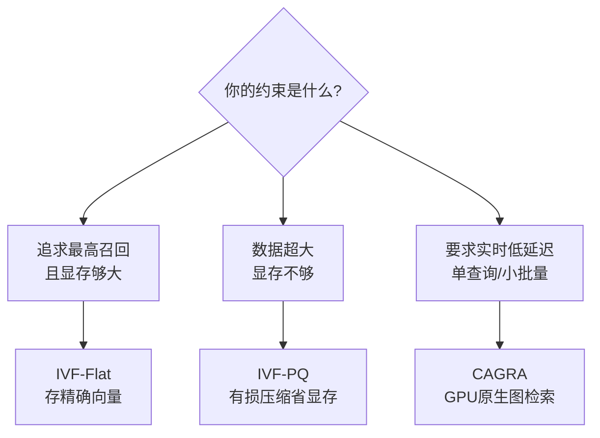

# 第 3 章 · 面向 GPU 工作负载的高级深度学习架构

> 对应原书 *GPU-Accelerated Deep Learning*（Mangrulkar & Chavan, APress 2025）第 3 章 **Advanced Deep Learning Architectures for GPU Workloads**（PDF 第 69–84 页 / 书内页码 55–70）。
>
> 本章不是又一遍讲"卷积怎么算"，而是回答一个更工程、更值钱的问题：**当你手里已经有一块（或一堆）GPU 时，应该选什么样的模型结构、怎么组织批处理、把哪些算子交给 GPU，才能把这块昂贵的硬件榨到极致？** 这正是面试官问"你怎么优化训练/微调"时想听到的东西。

---

## 🗺️ 本章地图

**一句话主线**：本章讲的所有"高级架构"（迁移学习、微调、LoRA、向量检索），本质上都是在做同一件事——**把工作负载转化成大规模、可并行、批量化的矩阵/张量运算**，因为这正是 GPU 唯一真正擅长的东西。谁越贴近这个本质，谁在 GPU 上就越快。

我把本章按"**面向 GPU 的三要素：模型结构 / 批处理 / 算子**"这条主线来讲透：

| 三要素 | 本章对应内容 | 为什么和 GPU 强相关 |
|---|---|---|
| 🧱 **模型结构** | 迁移学习、冻结层、LoRA、Prompt Tuning、Transformer | 决定了"有多少矩阵乘、能不能并行、显存放不放得下" |
| 📦 **批处理 (Batching)** | 大 batch、批并行、向量批量检索 | GPU 靠"同一条指令喂海量数据"才不空转 |
| ⚙️ **算子 (Operators)** | `Z=WX+b`、softmax、注意力、距离计算 | 落到 cuBLAS/cuDNN/Tensor Core 的具体 kernel |

---

## 3.1 为什么"从零训练"是 GPU 时代的浪费 —— 迁移学习登场

### 3.1.1 是什么：迁移学习 (Transfer Learning)

前面几章我们从零手搓过卷积神经网络（CNN），确实能学到特征。但原书一针见血地指出问题所在：

> "improvements could be pursued through extensive experimentation… modifying the number of layers, adjusting the learning rate… **However, such trial-and-error approaches are often labor-intensive and time-consuming.**"
>
> 想靠调层数、调学习率、调神经元个数来提升，代价是极其费人费时的反复试错。

**迁移学习**就是那个"更聪明的替代方案"：

> "utilizing **pretrained models**—those that have already learned meaningful patterns (weights) from large-scale datasets—and adapting them to a **new but related problem**."

用大白话说：

- **别人（或你自己）在海量数据（如 ImageNet、整个互联网文本）上已经训练好了一个模型**，它学到的权重 = 学到的知识。
- 你把这个模型**搬过来**，只在你自己的小数据上稍微改改，就能解决一个"相关但不同"的新问题。

原书总结的两大好处：
1. **复用被验证过的架构**（known to perform well）——不用自己发明轮子。
2. **复用学到的表示（representations）**——用很少的自定义数据就能拿到高性能。

### 3.1.2 为什么它和 GPU 是天作之合

这是本章第一个关键论证，务必记牢：

> "Pretrained models can be **fine-tuned significantly faster on GPUs** due to their ability to perform **parallel computation on large matrix operations.**"

迁移学习 + GPU 的协同效应（synergy）：

> ⚠️ **常见坑**：很多初学者以为"迁移学习省的是数据"。其实它同时省**数据、时间、算力**三样。而后两样正是靠 GPU 的并行放大的——**迁移学习负责减少要算的量，GPU 负责把剩下的量算得飞快**，两者相乘才有 10×–100× 的加速。

### 🔬 第一性原理：迁移学习到底"迁移"了什么？

从第一性原理看，一个深度网络的前几层学的是**通用、任务无关**的特征（边缘、纹理、形状），后几层学的是**专用、任务相关**的语义（这是猫的耳朵、这是肿瘤区域）。既然前几层是"通用地基"，那对一个新任务而言，**地基根本不用重砌，只需要重装上层的房间**。这就是迁移学习省算力的物理来源——你把网络里"最贵、最难学"的那部分（大量底层卷积核）直接冻结复用了。

---

## 3.2 迁移学习的数学模型（逐符号讲透）

原书 3.1.2 给了一套形式化定义，很多同学一看符号就跳过——但这套记号是理解 LoRA、PEFT 的地基，我们逐个啃。

### 3.2.1 符号表

| 符号 | 含义（英文） | 直白解释 |
|---|---|---|
| $\mathcal{D}_S, \mathcal{D}_T$ | Source / Target **domains** | 源域、目标域（数据长什么样） |
| $\mathcal{T}_S, \mathcal{T}_T$ | Source / Target **tasks** | 源任务、目标任务（要预测什么） |
| $f(x;\theta)$ | Neural network function | 参数为 $\theta$ 的网络 |
| $\mathcal{L}$ | Loss function | 损失函数 |
| $\varOmega(\cdot)$ | Regularization | 正则项 |
| $\sigma$ | Activation | 激活函数（ReLU/sigmoid） |
| $\theta = \{W_i, b_i\}$ | Model parameters | 所有权重和偏置 |
| $\nabla_\theta \mathcal{L}$ | Gradient w.r.t. params | 损失对参数的梯度 |

### 3.2.2 "域"和"任务"的四元定义

原书把源/目标各拆成"域 + 任务"：

- **源域** $\mathcal{D}_S = \{\mathcal{X}_S, P_S(X)\}$ —— 特征空间 $\mathcal{X}_S$ + 数据分布 $P_S(X)$
- **源任务** $\mathcal{T}_S = \{\mathcal{Y}_S, f_S(\cdot)\}$ —— 标签空间 $\mathcal{Y}_S$ + 预测函数 $f_S$
- **目标域** $\mathcal{D}_T = \{\mathcal{X}_T, P_T(X)\}$
- **目标任务** $\mathcal{T}_T = \{\mathcal{Y}_T, f_T(\cdot)\}$

迁移学习的目标（原书公式 3.1）：**在 $\mathcal{D}_T$ 上学出 $f_T(\cdot)$，哪怕**

$$\mathcal{D}_S \ne \mathcal{D}_T \quad \text{或} \quad \mathcal{T}_S \ne \mathcal{T}_T$$

> 💡 **实战理解**：ImageNet（自然照片）→ 医学影像（CT/X 光），这是 **域**不同（$\mathcal{D}_S\ne\mathcal{D}_T$）；ImageNet 分类（1000 类物体）→ 你只做"良性/恶性"二分类，这是 **任务**不同（$\mathcal{T}_S\ne\mathcal{T}_T$）。迁移学习厉害就厉害在，即便这两者都不同，源模型的底层特征照样能帮上忙。

### 3.2.3 网络的分层表示与"冻结-微调"

一个深网络就是一串函数的复合（原书公式 3.2）：

$$f(x;\theta) = f_n \circ f_{n-1} \circ \cdots \circ f_1(x)$$

其中每一层是经典的"仿射变换 + 激活"：

$$f_i(x) = \sigma(W_i x + b_i)$$

**迁移学习的核心操作**（原书原话）：

> "we typically **freeze layers 1 through $k$** and **fine-tune layers $k+1$ through $n$**."

即：把第 1 到第 $k$ 层的权重**冻住（不更新）**，只训练第 $k+1$ 到 $n$ 层。目标是最小化目标任务上的损失（原书公式 3.3）：

$$\min_{\theta_T} \; \mathcal{L}_T\big(f_T(x;\theta_T), y_T\big) + \lambda \cdot \varOmega(\theta_T)$$

- $\mathcal{L}_T$：目标任务损失（如交叉熵 cross-entropy）
- $\varOmega(\theta_T)$：正则项（如 $\|\theta_T\|_2^2$，即 L2 权重衰减）
- $\lambda$：正则强度

### 🔬 第一性原理：为什么这个式子直接决定了 GPU 能不能吃满？

关键在于 $\theta_T$ 的规模。如果你 fine-tune 全部参数，$\theta_T$ 有几千万上亿个，每一步都要算这么多梯度、更新这么多权重，显存和带宽都吃紧。如果你**只**训练 $k+1\ldots n$ 层（甚至只训练最后一层分类头），$\theta_T$ 骤减，反向传播时**冻结层不需要计算权重梯度**（但仍需前向计算与激活梯度以传播回去）——这直接减少了 GPU 要吞的运算和要存的中间量。**结构决定了工作量，工作量决定了 GPU 利用率**。

---

## 3.3 GPU 加速的算子本质：一切都是 `Z = WX + b`

这是整章、乃至整本书最需要刻进脑子里的一个式子。原书公式 3.4：

$$Z = WX + b$$

| 张量 | 形状 | 角色 |
|---|---|---|
| $W$ | $\mathbb{R}^{m\times d}$ | 权重矩阵 |
| $X$ | $\mathbb{R}^{d\times n}$ | **一个 batch 的输入**（注意 $n$ 是 batch 维！） |
| $b$ | $\mathbb{R}^{m}$ | 偏置向量 |
| $Z$ | $\mathbb{R}^{m\times n}$ | 激活前的输出 |

原书紧接着点题：

> "GPUs accelerate training through libraries like **cuBLAS** and **cuDNN** by performing matrix multiplications and activations **in parallel**."

### 🔬 第一性原理：为什么大矩阵乘 = GPU 的主场

一个 $m\times d$ 乘 $d\times n$ 的矩阵乘法，要算 $m\times n$ 个输出元素，**每个元素之间完全独立**——第 (1,1) 个结果和第 (5,7) 个结果谁先算完毫无所谓。GPU 有数千个核心，正好一人算一个（或一小块）。这种"海量独立的乘加"就是 GPU 的天生猎物。反观 CPU 只有几个/几十个核心，只能排队算。

> 💡 **面试高频**：被问"为什么深度学习用 GPU 不用 CPU"，标准答案就是这一句 + 这个式子：**深度学习 99% 的计算是大矩阵乘和逐元素激活，二者都是大规模数据并行（data-parallel）问题，而 GPU 的 SIMT 架构（数千核同时执行同一指令）正是为数据并行而生。** 把 $Z=WX+b$ 画出来，面试官就知道你懂本质了。

### 📦 批处理为什么关键：看那个 $n$

注意 $X\in\mathbb{R}^{d\times n}$ 里的 $n$ 就是 **batch size**。

- $n=1$（一次一个样本）：矩阵乘退化成"矩阵 × 向量"，GPU 数千核心大部分在**空转**。
- $n=256$（批量喂）：一次就是实打实的大矩阵乘，GPU 核心全员上岗。

**这就是"批处理"对 GPU 至关重要的物理原因**：GPU 的算力是"宽"的（并行度极高），你必须一次喂给它足够宽的数据（大 batch），它才不亏本。原书 3.6 节专门把 "Support for Large Batch Sizes" 列为 GPU 微调的核心收益之一。

> ⚠️ **常见坑**：batch 不是越大越好。大 batch 收益是"喂满 GPU + 训练更稳"，代价是①**显存爆炸**（激活值随 batch 线性增长）；②有时**泛化变差**（大 batch 容易收敛到 sharp minima）。工程上要在"显存能装下"和"精度能接受"之间调，这也是本章末尾 exercise 反复强调的 batch size tuning。

### 3.3.1 一个完整的迁移学习算子流水线

原书用 ResNet-50 → 医学影像举了个四步例子，把上面的符号全串起来了：

1. **拿 ImageNet 上预训练的 ResNet-50**：$f_S(x;\theta_S)$
2. **迁到小数据的医学影像集**：$\mathcal{D}_T$
3. **冻结基座、只微调最后的分类头**：
   $$\hat{y} = \text{softmax}(W_T h + b_T), \quad h = f_k(x;\theta_S)$$
   这里 $h$ 是冻结基座输出的特征（feature），$W_T, b_T$ 是新加的、要训练的分类头。
4. **用交叉熵损失**：
   $$\mathcal{L} = -\sum_{i=1}^{C} y_i \log(\hat{y}_i)$$

原书 3.1.3 给出结论性数字：

> "Using GPU-enabled libraries (e.g., cuDNN, cuBLAS), the training and fine-tuning process becomes **10× to 100× faster** compared to CPU-only environments."

---

## 3.4 微调 (Fine-Tuning)：把"通用大模型"改造成"你的专用模型"

### 3.4.1 是什么 & 和"训练"有何不同

原书 3.2 节定义微调是"transfer learning 的一个具体落地"：把预训练模型（LLM / CNN / ViT）**继续训练一小会儿**，让它适配一个具体任务。为避免混淆，从零训练那一步专门叫 **Pretraining（预训练）**。

原书 Table 3.1 的对比极其经典，我整理成中文表（**面试必背**）：

| 对比维度 | 预训练 Pretraining | 微调 Fine-Tuning |
|---|---|---|
| **定义** | 在超大数据集上初次训练，学通用表示 | 在小的、任务专用数据集上继续训练 |
| **数据需求** | 需要大规模、常为**无标注**数据 | 需要小规模、常为**有标注**的任务数据 |
| **起点状态** | 从**随机权重**开始（无先验） | 从**预训练学到的权重**开始 |
| **目的** | 学"能迁移到很多任务"的通用知识 | 适配到某个具体场景/领域 |
| **训练成本** | **极高**（大数据 + 长训练） | **较低**（训练短、数据少） |
| **过拟合风险** | 低（数据大兜底） | **高**（数据小时若不正则化易过拟合） |
| **典型场景** | 造基础模型、通用 LLM、ViT | 领域客服 bot、定制图像分类器 |

### 3.4.2 微调的五条黄金法则（原书 3.2.2）

原书列了微调的标准做法，每条我都补上"为什么"：

1. **初始化新模型**：特征提取器（encoder）用预训练参数初始化；**输出层（分类头）随机初始化**——因为新任务标签空间通常不同。
2. **从局部极小值附近出发**（Start from a Local Minimum）：因为起点已经是"学过的好参数"，离一个不错的解很近 → **收敛快**。
3. **用小学习率**（Small Learning Rate）：只做"微小、可控"的更新，**别把预训练学到的知识冲掉**。
4. **只训几个 epoch**：模型已经会通用表示了，不用练很久。
5. **正则化搜索空间**：weight decay / dropout / 冻结早层，防止小数据上过拟合。

> ⚠️ **常见坑**：微调时把学习率设得和从零训练一样大（比如 1e-3），一两步就把预训练权重"抹平"，模型直接退化。经验值：微调 LLM 常用 1e-5 ~ 5e-5，比预训练小 1–2 个数量级。这就是法则 3 的实操含义。

### 🔬 第一性原理：微调本质是"在好起点上小步走"

从损失地形（loss landscape）看：从零训练是把你空投到一片荒漠里找最低点，可能要走很远、还可能掉进烂坑。微调是**直接把你放在一个已知的好山谷附近**，你只需小碎步往谷底挪几步（小学习率 + 少 epoch）。既然要走的路短、步子小，**要算的迭代次数就少，GPU 几分钟就干完了**——这是微调比预训练便宜几个数量级的根本原因。

---

## 3.5 冻结底层：结构层面最直接的 GPU 减负

原书 3.2.2.1 讲了微调最基础的招——**冻结底层（Freezing Bottom Layers）**。

### 3.5.1 层级学习的本质

原书用一行公式概括这个结构：

$$\text{Input} \xrightarrow[\text{Frozen (1 to } L-1)]{} \text{Features} \xrightarrow[\text{Trainable Output}]{} \text{Predictions}$$

- **底层（靠近输入）**：学**低级、通用**特征——边缘、纹理、简单形状。**数据无关**，是视觉理解的"积木"。
- **上层（靠近输出）**：学**高级、任务专用**模式——物体部件、语义类别。任务之间**差异巨大**。

### 3.5.2 冻结底层的三大收益

原书明确列出：

1. **大幅减少可训练参数** → 收敛更快、算力成本更低。
2. **天然的正则化**（effective regularization）→ 小数据也不容易过拟合。
3. 当新任务和原任务**高度相关**时，迁移最高效。

> 💡 **和 GPU 的关系**：冻结底层 = 反向传播时那些层**不算权重梯度**、优化器不用为它们维护状态（Adam 每个参数要存两份 moment）。这直接省**计算**和**显存**。所以"冻结"不只是精度技巧，更是**给 GPU 减负的结构手段**——本章三要素里的"模型结构"直接决定了 GPU 的负载。

---

## 3.6 参数高效微调 (PEFT)：把 GPU 显存压力降到极致

当模型来到 LLM 尺度（70 亿、700 亿参数），连"微调最后几层"都嫌贵，尤其是**显存**。原书 3.2.2.2 引出 **PEFT（Parameter-Efficient Fine-Tuning）**。

### 3.6.1 PEFT 解决的四个痛点

原书列出 PEFT 相对全量微调的优势：

1. **算力/存储开销小**——只更新一小撮参数，适合资源受限环境部署 LLM。
2. **缓解灾难性遗忘**（catastrophic forgetting）——全量微调容易把旧知识冲掉，PEFT 冻住主干所以不会。
3. **低数据场景更强**——全量微调在小数据上易过拟合/不稳定。
4. **对域外任务泛化更好**（out-of-domain）。

### 3.6.2 ⭐ LoRA：低秩适配（本章技术核心）

这是全章最重要、面试最高频的技术点，原书讲得很清楚，我们完整推一遍。

**问题**：标准微调要为权重矩阵 $W$ 算一个更新量 $\varDelta W$（原书公式 3.6）：

$$W_{\text{updated}} = W + \varDelta W$$

如果 $W$ 有**70 亿**个参数，那 $\varDelta W$ 也有 70 亿个元素——存它、算它都要海量显存。

**LoRA 的洞见**：这个更新量 $\varDelta W$ 其实"信息含量很低"，可以用两个**又瘦又小**的矩阵的乘积来近似（原书公式 3.7）：

$$\varDelta W \approx AB, \quad A \in \mathbb{R}^{d\times r}, \; B \in \mathbb{R}^{r\times k}$$

其中 $r \ll \min(d,k)$ 是**秩（rank）超参数**，控制"性能 ↔ 省显存"的权衡。

于是前向传播时，保持 $W$ **冻结**，把 $AB$ 注入进去（原书公式 3.8）：

$$W_{\text{updated}} = W + AB$$

### 🔬 第一性原理：LoRA 到底省了多少？

假设 $W$ 是 $d\times k = 4096\times 4096$，那 $\varDelta W$ 有 $4096^2 \approx 1678$ 万个可训练参数。

用 LoRA，取秩 $r=8$：
- $A$ 是 $4096\times 8 = 32768$ 个参数
- $B$ 是 $8\times 4096 = 32768$ 个参数
- 合计 $65536$ 个 —— **只有原来的 0.39%！**

$$\frac{\text{LoRA 参数}}{\text{全量参数}} = \frac{r(d+k)}{d\cdot k} = \frac{8\times 8192}{4096\times 4096} \approx 0.0039$$

| 方案 | 可训练参数（单个 4096² 层） | 相对占比 |
|---|---|---|
| 全量微调 | ~16.78 M | 100% |
| LoRA (r=8) | ~0.066 M | **0.39%** |
| LoRA (r=16) | ~0.131 M | 0.78% |

**为什么这对 GPU 是革命性的**：优化器状态（Adam 的两份 moment）只需为这 0.39% 的参数维护 → 显存需求断崖式下降 → **一块 24GB 消费级显卡就能微调 70 亿参数的模型**，而全量微调可能需要几块 A100。这就是为什么 LoRA 被原书称为 "cornerstone of modern PEFT"。

> 💡 **面试高频**：被问"LoRA 为什么能省显存"，要点是——①冻结 $W$ 意味着**不为 $W$ 存优化器状态**（省的是优化器状态和权重梯度，不是 $W$ 本身，$W$ 照样要在显存里做前向）；②只训练两个低秩小矩阵 $A,B$；③秩 $r$ 是核心旋钮，$r$ 越大越接近全量微调、越占显存。别答成"LoRA 减少了模型大小"——模型 $W$ 一点没变小。

### 3.6.3 Prompt Tuning：连权重都不碰，只学"软提示"

原书 3.2.2.3 讲了另一种 PEFT——**Prompt Tuning（提示微调）**。它比 LoRA 更极端：**连 $A,B$ 都不训练，只训练几个塞在输入前面的向量**。

**做法**：给定输入 token 序列 $X=[x_1,\ldots,x_n]$，其嵌入为 $E_X=[e_1,\ldots,e_n]$（每个 $e_i\in\mathbb{R}^d$）。引入一小组**可学习的软提示向量** $P=[p_1,\ldots,p_m]$（原书说通常 **20~100 个**），拼到输入嵌入前面（原书公式 3.9）：

$$\tilde{X} = [\,p_1,\ldots,p_m,\; e_1,\ldots,e_n\,]$$

训练时**只更新 $P$**，模型主干 $\theta_{\text{frozen}}$ 全冻（原书公式 3.10）：

$$\theta_{\text{frozen}} \cup \{P\} \xrightarrow{\text{train}} \theta_{\text{frozen}} \cup \{P^*\}$$

> 💡 **和"离散提示词"的区别**：你平时写的 prompt（"请用专业语气回答…"）是**离散的、人类可读的**词。软提示 $P$ 是**连续的、可微的向量**，不对应任何真实单词，直接在嵌入空间里被梯度优化出来——所以它能表达人类语言表达不出的"最优引导信号"。

**优势**（原书）：可训练参数**极少** → 多任务/多域场景下无需为每个任务存一整个微调模型，**任务切换只需换一小组 $P$**，实验迭代飞快。

### 3.6.4 三种微调策略横向对比

| 维度 | 全量微调 | 冻结底层 | LoRA | Prompt Tuning |
|---|---|---|---|---|
| 训练什么 | 全部权重 | 只上层 | 低秩 $A,B$ | 软提示 $P$ |
| 可训练参数量 | 100% | 中 | ~0.1%–1% | **极小(20–100 向量)** |
| 显存压力 | 最高 | 中 | 低 | **最低** |
| 单卡能否搞定大模型 | 难 | 一般 | ✅ 常见 | ✅ 最易 |
| 任务切换成本 | 存整个模型 | 存上层 | 存小 $A,B$ | **只存 $P$** |
| 表达能力 | 最强 | 中 | 强 | 相对弱 |
| 典型场景 | 数据充足、追极致 | 任务相近 | LLM 主流方案 | 多任务快速切换 |

---

## 3.7 微调的 GPU 执行流程：前向 → 损失 → 反向 → 更新

原书 3.2.4–3.2.11 用一个手算的迷你例子把整个训练环打通了，非常适合零基础建立"每一步 GPU 在算什么"的直觉。

### 3.7.1 四步循环（原书公式 3.11–3.14）

给定模型 $\mathcal{M}_\theta$：

$$
\begin{aligned}
\textbf{① 前向 Forward:} \quad & \hat{y} = \mathcal{M}_\theta(x) \\
\textbf{② 损失 Loss:} \quad & \mathcal{L}(\theta) = \ell(\hat{y}, y) \\
\textbf{③ 反向 Backprop:} \quad & \nabla_\theta \mathcal{L} = \frac{\partial \mathcal{L}}{\partial \theta} \\
\textbf{④ 更新 Update (SGD):} \quad & \theta_{t+1} = \theta_t - \eta \cdot \nabla_\theta \mathcal{L}
\end{aligned}
$$

其中 $\eta$ 是学习率。常见损失：回归用 MSE，分类用交叉熵。

### 3.7.2 手算走一遍（原书 3.2.7–3.2.11）

设一个只有一个输入一个输出神经元的线性模型 $\hat{y}=w\cdot x + b$，已知：

$$w=0.5,\quad b=0.1,\quad x=2.0,\quad y=1.5,\quad \eta=0.1$$

**① 前向**：
$$\hat{y} = 0.5\times 2.0 + 0.1 = 1.1$$

**② 损失（MSE）**：
$$\mathcal{L} = \tfrac{1}{2}(y-\hat{y})^2 = \tfrac{1}{2}(1.5-1.1)^2 = \tfrac{1}{2}(0.4)^2 = 0.08$$

**③ 反向（求梯度）**：
$$\frac{\partial \mathcal{L}}{\partial \hat{y}} = \hat{y}-y = 1.1-1.5 = -0.4$$
$$\frac{\partial \mathcal{L}}{\partial w} = \frac{\partial \mathcal{L}}{\partial \hat{y}}\cdot x = -0.4\times 2.0 = -0.8$$
$$\frac{\partial \mathcal{L}}{\partial b} = \frac{\partial \mathcal{L}}{\partial \hat{y}}\cdot 1 = -0.4$$

**④ 更新（SGD, $\eta=0.1$）**：
$$w_{\text{new}} = 0.5 - 0.1\times(-0.8) = 0.58$$
$$b_{\text{new}} = 0.1 - 0.1\times(-0.4) = 0.14$$

> 🔬 **把这个玩具例子放大到 GPU**：真实模型里，$x$ 是一个 batch（矩阵），$w$ 是权重矩阵，上面每一步（前向的乘加、反向的链式求导、更新的减法）都变成**大矩阵运算**。GPU 做的就是把这四步里的每个矩阵操作**同时对成千上万个样本、成千上万个参数并行执行**。玩具例子里你手算一步要几秒，GPU 对整个网络做一步要几毫秒——**流程一模一样，只是规模和并行度天差地别**。

---

## 3.8 计算机视觉中的微调 & 深度网络调优的 GPU 加速

### 3.8.1 CV 里的迁移（原书 3.3）

原书强调 CV 是迁移学习的"最佳受益者"：像 ImageNet 这种大规模标注数据集训出的模型，其学到的边缘/纹理/形状特征，可以复用到目标检测、分割、专用分类——而目标数据集往往**小 10–100 倍**。

### 3.8.2 深度网络调优的 GPU 加速要点（原书 3.4）

原书点名的加速手段（**这些是本章"算子/批处理"的具体武器**）：

| 手段 | 英文 | 作用 |
|---|---|---|
| **CUDA / cuDNN 抽象** | CUDA / cuDNN | 帮你管内存分配、kernel 调度、设备级优化 |
| **混合精度训练** | Mixed-Precision | 用 FP16/BF16 算，省显存、提吞吐 |
| **批并行** | Batch Parallelism | 一次处理大批数据，喂满 GPU |
| **具体硬件** | A100 / RTX 4090 | 大幅缩短每 epoch 时间 |

> 💡 **实战**：混合精度（mixed-precision）是现代训练标配。核心思想是：大部分矩阵乘用 FP16/BF16（快、省一半显存），少数对精度敏感的累加用 FP32（防数值溢出）。现代 GPU 的 **Tensor Core** 专为 FP16/BF16 矩阵乘设计，速度是普通 FP32 通路的数倍。这是"算子层面"榨 GPU 的头号技巧，也是本章末尾 exercise 9 的考点。

---

## 3.9 GPU 加速的向量检索：批处理思想的另一个战场

原书 3.5 节转向一个看似不同、实则同源的话题——**向量检索（Vector Search / ANN）**。随着 embedding 模型和向量数据库兴起，**近似最近邻搜索（Approximate Nearest Neighbor, ANN）** 成了关键计算环节。NVIDIA 的 **RAPIDS cuVS** 库提供了三种 GPU 优化索引。

### 🔬 为什么向量检索也归 GPU？

一次 ANN 查询本质是：**拿一个查询向量，和库里成百上千万个向量算距离，取最近的 K 个**。"和海量向量批量算距离"——这又是一个大规模、可并行、批量化的运算，和 $Z=WX+b$ 是同一类猎物。所以它天然属于 GPU。这印证了本章主线：**只要能表达成"大批量并行算子"，就是 GPU 的菜。**

### 3.9.1 三种 cuVS 索引对比

原书逐个介绍了 IVF-Flat、IVF-PQ、CAGRA，我整理成对照表：

| 索引 | 全称 | 核心机制 | 关键参数 | 优势 | 代价 |
|---|---|---|---|---|---|
| **IVF-Flat** | Inverted File + Flat | k-means 分成 $n_{\text{lists}}$ 个簇，**存精确向量**；查询时只查最近的 $n_{\text{probes}}$ 个簇 | `n_lists`（簇数）、`n_probes`（查几个簇） | **高召回**、GPU 算距离快 | 要求索引**能整个塞进显存** |
| **IVF-PQ** | Inverted File + Product Quantization | 在 IVF-Flat 上加**有损压缩**（乘积量化） | `pq_dim`（降维后维数）、`pq_bits`（每维比特数，通常 4–8） | **最省显存**，能索引超大数据集 | 有损 → 精度略降（可用 refinement 重排补回） |
| **CAGRA** | CUDA Accelerated Graph Retrieval Algorithm | **GPU 原生图检索**，建固定度 k-NN 图，把图子结构映射到 GPU 线程块 | `graph_degree`、`intermediate_graph_degree`、`itopk_size`/`search_width`/`iterations` | **超低延迟**、GPU 利用率稳定，适合实时/交互 | 建图有额外开销 |

### 3.9.2 三者怎么选

原书补充：cuVS 是 NVIDIA 开源的（GitHub 可得），能和 **FAISS、Milvus** 等主流向量检索平台无缝集成。

> 💡 **实战 & 面试**：这正是当下 RAG（检索增强生成）系统的底座。LLM 应用里，"把百万文档 embedding 存进向量库、查询时毫秒级召回相关片段"就是靠这类 GPU 索引。被问 RAG 检索怎么加速，答"IVF-PQ 压显存 / CAGRA 降延迟 / cuVS 接 FAISS-Milvus"就很专业。

### 3.9.3 深网络调优的 GPU 架构（原书 3.5.4 & 3.6）

原书最后从硬件角度收口，点出 GPU 为什么是调优的地基：

- **数千小核组织成流式多处理器（SM, Streaming Multiprocessors）** → 大批数据上并行执行矩阵/张量运算。
- **Tensor Core** → 加速矩阵乘（配合混合精度）。
- **高带宽显存（HBM）+ 共享内存 + L2 缓存** → 快速存取模型参数和中间激活。
- **软件栈 CUDA/cuDNN + PyTorch/TensorFlow/JAX** → 抽象底层，自动做内存管理、kernel 调度、并行优化。

原书 3.6 节把 GPU 微调的收益归纳为 6 条（**面试可直接背诵**）：

| # | 收益 | 一句话解释 |
|---|---|---|
| 1 | **训练更快** | 数千操作并行，反向传播/梯度更新时间骤降 |
| 2 | **支持大 batch** | 高带宽高容量显存 → 更稳更快收敛 |
| 3 | **高效资源利用** | 微调数据小，GPU 上快速迭代、调超参 |
| 4 | **框架开箱即用** | PyTorch/TF/JAX 自带 GPU 加速、自动微分、混合精度 |
| 5 | **可扩展** | 支持多 GPU / 分布式，撑起更大模型 |
| 6 | **能效比高** | 并行计算下，每训练周期比 CPU 更省电 |

---

## 3.10 把本章拧成一句话：GPU 友好的三要素落地清单

回到本章的主线——"**适合 GPU 的模型结构、批处理、算子**"。本章讲的每一项技术，都能对应到这三要素里的某一格：

| 三要素 | 本章给出的具体做法 | 榨 GPU 的机理 |
|---|---|---|
| 🧱 **模型结构** | 迁移学习复用架构、冻结底层、LoRA 低秩化、Prompt Tuning、Transformer + Tensor Core | 减少可训练参数/优化器状态 → 省显存；结构可并行 → 喂满核心 |
| 📦 **批处理** | 大 batch（$Z=WX+b$ 里的 $n$）、批并行、向量批量检索（IVF/CAGRA） | 一条指令喂海量数据，GPU 数千核不空转 |
| ⚙️ **算子** | 大矩阵乘、softmax、交叉熵、距离计算，全交给 cuBLAS/cuDNN/Tensor Core；混合精度 | 落到高度优化的 GPU kernel，逐元素/逐块完全并行 |

**记住这条因果链**（本章的灵魂）：

**结构 → 工作量 → 批处理 → 并行宽度 → GPU 利用率 → 速度。** 想让 GPU 快，就在每一环上向"更少参数、更大 batch、更并行的算子"靠拢。

---

## 📌 小结

- **迁移学习**是 GPU 时代的默认起手式：复用预训练权重，把"从零训练"的巨额成本降到微调级别。其数学核心是**冻结 1~$k$ 层、微调 $k+1$~$n$ 层**，最小化目标任务损失 $\mathcal{L}_T + \lambda\varOmega$。
- **一切算子的本质是 $Z=WX+b$**：大矩阵乘 + 激活是完全数据并行的，正是 GPU（SIMT、数千核）的天生猎物；式子里的 $n$ 就是 **batch size**，批处理越大 GPU 越不空转。
- **微调 vs 预训练**：预训练大数据从零学通用知识（贵）；微调小数据从好起点小步适配（便宜、少 epoch、小学习率、要正则）。
- **冻结底层**：底层学通用特征（边缘纹理），上层学专用语义；冻底层 = 减参数 + 天然正则 + 给 GPU 反向传播减负。
- **PEFT 三件套**：
  - **LoRA** 用 $\varDelta W\approx AB$ 把更新量低秩化，可训练参数降到 ~0.1%–1%，**优化器状态显存断崖式下降**，单卡微调大模型的基石。
  - **Prompt Tuning** 更极端，只训练 20–100 个软提示向量，主干全冻，任务切换只换 $P$。
- **训练四步环**：前向 $\hat y=\mathcal{M}_\theta(x)$ → 损失 → 反向 $\nabla_\theta\mathcal L$ → 更新 $\theta_{t+1}=\theta_t-\eta\nabla_\theta\mathcal L$；玩具例子（$w:0.5\to0.58$）和真实大模型流程完全同构，区别只在规模和并行度。
- **GPU 加速向量检索**（cuVS）：IVF-Flat（高召回/吃显存）、IVF-PQ（最省显存/有损）、CAGRA（超低延迟/图检索）——同样是"批量并行算距离"，是 RAG 的检索底座。
- **GPU 架构地基**：SM + Tensor Core + HBM + CUDA/cuDNN/PyTorch，配合混合精度和批并行，让大模型微调从"不可能"变"几分钟"。

---

## 🔗 延伸阅读与练习

**原书章末 Exercise（预告下一章 CUDA 编程，值得提前思考）**：

1. 定义 CUDA 编程模型，解释它如何支持深度学习的异构计算（heterogeneous computing）。
2. 描述 **SIMT**（单指令多线程）架构，它和传统 CPU 执行模型有何不同？
3. GPU 有哪几类内存？理解**内存层级（memory hierarchy）**如何提升深度学习性能？
4. 解释**分块矩阵乘（tiled matrix multiplication）**及其对 GPU 上深度学习算子的优化作用。
5. 区分**线程级**与**指令级**优化，各举例说明。
6. 什么是 CUDA 里的**异步执行（asynchronous execution）**？重叠计算与通信如何提升 GPU 利用率？
7. 描述 **NVIDIA Nsight / nvprof** 等 profiling 工具的用途。
8. 讨论**梯度检查点（gradient checkpointing）**：为什么它对在显存受限 GPU 上训练大模型很重要？（提示：用重算换显存）
9. 解释**混合精度训练**的优势，Tensor Core 如何支持它？
10. 评估优化矩阵乘 kernel 对 GPU 编程的影响，高吞吐的最佳实践有哪些？

**主题延伸**：
- **深挖 LoRA**：原论文 *LoRA: Low-Rank Adaptation of Large Language Models*（Hu et al., 2021），以及后续的 **QLoRA**（4-bit 量化 + LoRA，把单卡微调推向 65B 级）。
- **PEFT 工具**：HuggingFace `peft` 库，一行代码给任意模型套上 LoRA / Prompt Tuning。
- **混合精度**：PyTorch `torch.cuda.amp`（自动混合精度）、NVIDIA Apex。
- **向量检索**：RAPIDS **cuVS** 官方文档与 benchmark、**FAISS**、**Milvus**——搭一个自己的 RAG demo 最能打通本章。
- **承上启下**：本章从"结构/批处理/算子"三个层面告诉你**为什么**要贴近 GPU；下一章 CUDA 编程会告诉你**怎么**在底层亲手实现这些并行 kernel。
