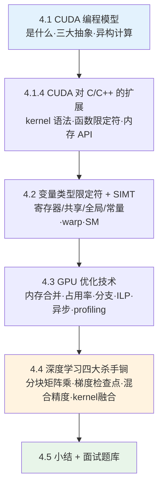
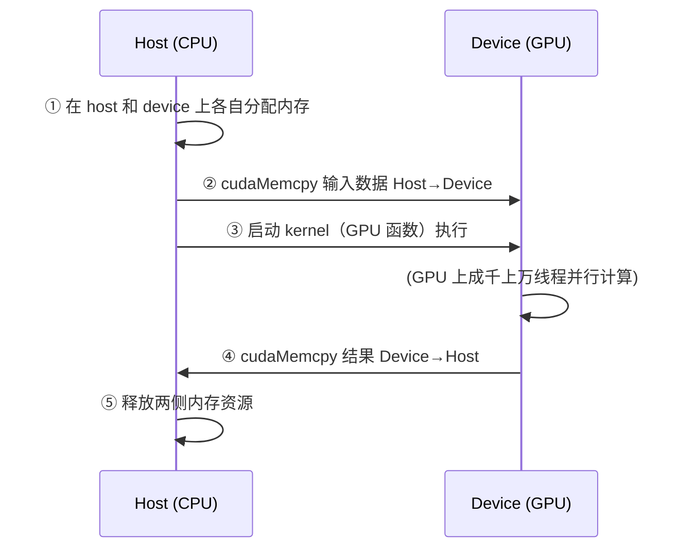
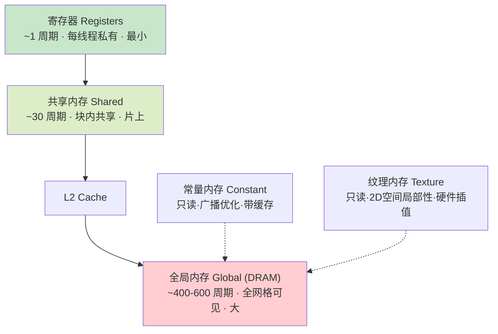
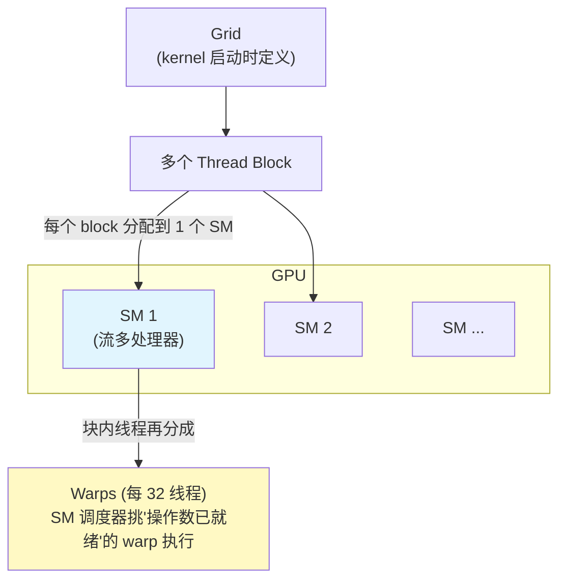
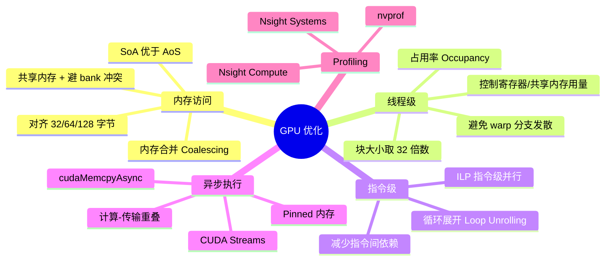
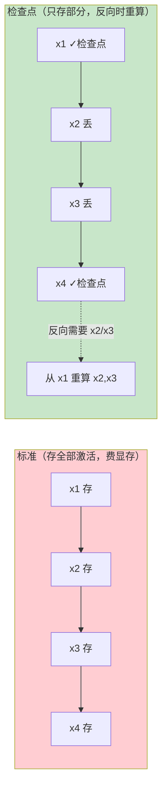
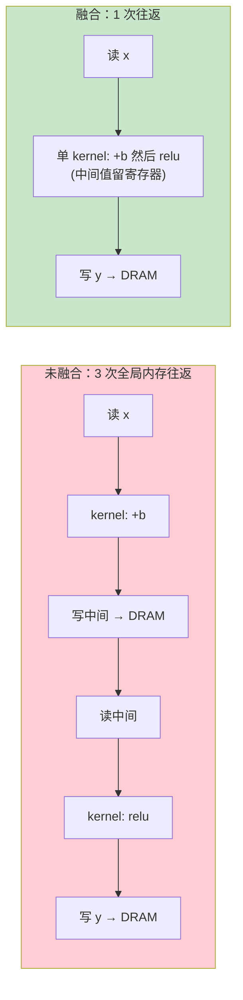
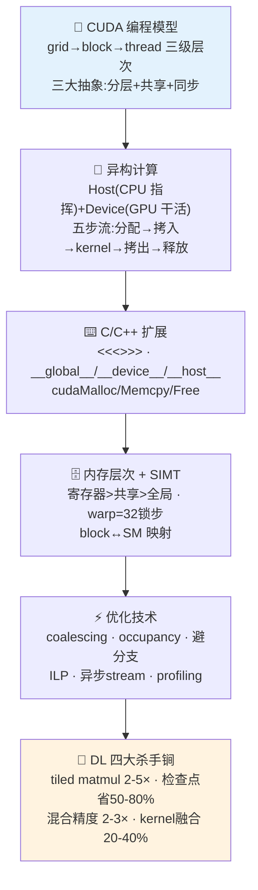

# 🚀 第 4 章 · 面向深度学习的高级 GPU 编程（Advanced GPU Programming for Deep Learning）

> 对应原书 *GPU-Accelerated Deep Learning*（Mangrulkar & Chavan, APress 2025）第 4 章，PDF 第 85–108 页。
> 本章从 CUDA 编程模型讲到自定义 kernel、内存优化、算子融合与混合精度——这是把「会用框架」升级到「懂底层、能优化」的分水岭，也是 AI-Infra 面试的绝对高频区。

---

## 🗺️ 本章地图

这一章的内在逻辑是一条**从抽象到硬件、再从硬件回到深度学习优化**的链路。先建立"CPU+GPU 协同"的世界观，再讲 GPU 上代码怎么写（kernel/限定符/内存），然后讲 GPU 上代码怎么跑得快（SIMT/occupancy/coalescing），最后把这些底层能力落到深度学习的四大杀手锏（分块矩阵乘、梯度检查点、混合精度、算子融合）。



| 小节 | 主题 | 一句话本质 | 面试权重 |
|---|---|---|---|
| 4.1 | CUDA 编程模型 | 用 grid→block→thread 三级层次表达并行 | ⭐⭐⭐ |
| 4.1.3 | 异构计算 | Host(CPU) 指挥 + Device(GPU) 干活 | ⭐⭐⭐ |
| 4.1.4 | C/C++ 扩展 | `<<<>>>`、`__global__/__device__/__host__` | ⭐⭐⭐⭐ |
| 4.2 | 变量限定符 + SIMT | 内存层次决定性能；warp=32 线程锁步 | ⭐⭐⭐⭐⭐ |
| 4.3 | 优化技术 | coalescing / occupancy / 少分支 / async | ⭐⭐⭐⭐⭐ |
| 4.4 | DL 高级优化 | tiled matmul / 检查点 / 混合精度 / 融合 | ⭐⭐⭐⭐⭐ |

---

# 4.1 CUDA 编程模型（CUDA Programming Model）

## 4.1.1 什么是 CUDA？

**是什么**：CUDA（Compute Unified Device Architecture，统一计算设备架构）是 NVIDIA 开发的**并行计算平台 + 编程模型**，让「计算密集、可并行」的算法直接跑在 GPU 上，而不是 CPU 上，从而拿到巨大的性能提升。

- **诞生**：2007 年随 NVIDIA Tesla 架构一起推出，如今已是高性能计算（HPC）的基石。
- **应用领域**：科学计算、深度学习、图像/信号处理、大规模仿真。
- **编程接口**：主要通过对 C / C++ / Fortran 的**扩展**来写；Python 侧则有 **PyCUDA**（用 Python 语法写 GPU 代码）等高层接口。

> 🔬 **第一性原理：为什么 GPU 快？**
> CPU 是「少数几个强壮核心 + 大缓存 + 复杂控制逻辑」，为**低延迟**串行任务优化；GPU 是「成千上万个弱核心 + 极高内存带宽」，为**高吞吐**并行任务优化。一句话：**CPU 优化的是"一件事做得快"，GPU 优化的是"一万件事一起做"**。深度学习恰恰是"对海量数据做同样的矩阵运算"——这正是 GPU 的主场。

CUDA 建立在**三大基础抽象**之上，让开发者能表达并行、管理硬件资源：

| 抽象 | 英文 | 作用 |
|---|---|---|
| ① 线程组层次 | Hierarchy of Thread Groups | 线程(thread)→块(block)→网格(grid)，同时表达数据级与任务级并行 |
| ② 共享内存 | Shared Memory | 每个 block 有一块**片上高速共享内存**，块内线程借它通信/共享数据 |
| ③ 屏障同步 | Barrier Synchronization | `__syncthreads()` 让块内线程"到齐再走"，避免竞态 |

> 💡 **记忆锚点**：三大抽象 = **分层 + 共享 + 同步**。这三样是理解后面所有内容的骨架——分层决定"谁算什么"，共享内存决定"数据放哪最快"，同步决定"怎么保证正确"。

## 4.1.2 CUDA 编程模型：三步设计范式

CUDA 用一套**三步走**的模式来分解并行问题，对应"粗粒度→中粒度→细粒度"的层层拆解：


1. **把问题划分为粗粒度子问题**：拆成彼此**独立**、可各自计算的大块（通常对应一"块数据"）。
2. **把子问题分配给 thread block**：block 是 CUDA 的**逻辑执行单元**，由 GPU 独立调度；多个 block 可在不同的多处理器上并行——这层是**块间粗粒度并行**。
3. **把每个子问题拆成细粒度任务**：块内再分成更小的工作项，交给单个 thread 执行；同块线程可用**共享内存**通信、可**同步**——这层是**线程级细粒度并行**。

图 4.1（原书）展示了 **grid → block → thread** 的层次模型，让开发者同时利用**块间并行（interblock）**与**块内并行（intrablock）**，实现高效可扩展的执行。

> ⚠️ **常见坑**：初学者最容易搞混"逻辑层次"和"物理层次"。grid/block/thread 是**逻辑**的（你写代码时的组织方式）；warp/SM 是**物理**的（硬件真正如何执行）。二者的映射关系（见 4.2.1）才是性能的关键。

## 4.1.3 异构计算（Heterogeneous Computing）

**是什么**：异构计算指系统里用**不止一种处理器**协同完成任务，取长补短。CUDA 语境下就是 **CPU + GPU** 搭档：

### 4.1.3.1 主机（Host）
= **CPU + 主机内存（host memory）**。负责通用计算：程序控制流、任务调度、内存管理；它**初始化程序、准备数据、发起 GPU 计算**，并管理主机与设备之间的通信与数据传输。

### 4.1.3.2 设备（Device）
= **GPU + 设备内存（device memory）**。擅长高度并行任务，为"同时执行成千上万个线程"而优化；天然适合矩阵运算、图像处理、深度学习这类数据并行、计算密集的负载。

### 4.1.3.3 主机与设备如何交互——五步工作流



> 💡 **实战 & 面试高频**：这"五步流"是所有 CUDA 程序的骨架，面试让你"描述一次 GPU 计算的完整流程"，照这五步答即可满分：**分配 → 拷入 → 启动 kernel → 拷出 → 释放**。核心矛盾是——**Host↔Device 之间的数据传输（PCIe）很慢**，是常见瓶颈。后面 4.3.4 的异步执行 & pinned memory 就是专治这个。

### 📝 原书代码精讲：一维 Stencil（模板计算）

原书用一个"一维 stencil"（每个输出 = 相邻若干输入之和）例子，把上述五步 + 共享内存 + 同步全串起来。逐段拆解：

**① Host 侧串行代码（分配 + 拷入）**
```cpp
int *in, *out, *d_in, *d_out;
int size = (N + 2*RADIUS) * sizeof(int);   // 两端各留 RADIUS 个"光环"元素
in  = (int *)malloc(size); fill_ints(in,  N + 2*RADIUS);   // 主机分配 + 填充
out = (int *)malloc(size); fill_ints(out, N + 2*RADIUS);
cudaMalloc((void **)&d_in,  size);         // 设备分配（对应五步的①）
cudaMalloc((void **)&d_out, size);
cudaMemcpy(d_in,  in,  size, cudaMemcpyHostToDevice);  // 拷入（②）
cudaMemcpy(d_out, out, size, cudaMemcpyHostToDevice);
```
- `RADIUS`：模板半径，每个输出要看左右各 `RADIUS` 个邻居，所以数组两端要各留 `RADIUS` 个"边界光环（halo）"元素，防止越界。
- `d_` 前缀是社区约定，表示 **device 指针**（指向 GPU 显存）。`d_in`/`in` 一定要分清，混用会直接 segfault 或读到垃圾。

**② Device 侧并行 kernel（共享内存 + 同步）**
```cpp
__global__ void stencil_1d(int *in, int *out) {
    __shared__ int temp[BLOCK_SIZE + 2 * RADIUS];   // 块内共享内存缓冲区
    int gindex = threadIdx.x + blockIdx.x * blockDim.x;  // 全局索引
    int lindex = threadIdx.x + RADIUS;                    // 本地索引(留出左侧光环)

    temp[lindex] = in[gindex];              // 每个线程搬 1 个自己的元素进共享内存

    if (threadIdx.x < RADIUS) {             // 前 RADIUS 个线程额外搬"光环"
        temp[lindex - RADIUS]     = in[gindex - RADIUS];
        temp[lindex + BLOCK_SIZE] = in[gindex + BLOCK_SIZE];
    }

    __syncthreads();                        // ★ 屏障：确保共享内存全部装好再往下算

    int result = 0;
    for (int offset = -RADIUS; offset <= RADIUS; offset++)
        result += temp[lindex + offset];    // 从"快"的共享内存读，而非慢的全局内存

    out[gindex] = result;
}
```
- **为什么用共享内存？** 朴素写法里，每个输出要读 `2*RADIUS+1` 个全局内存元素，相邻线程大量重复读同一批数据。先把整块数据**一次性搬进共享内存**，之后所有累加都从"快 100 倍"的片上内存读——这就是内存优化的核心思想（后面 4.4.1 分块矩阵乘是同一招）。
- **`__syncthreads()` 为什么不可省？** 线程 A 可能已经算完，但线程 B 还没把它负责的元素搬进 `temp`。如果不同步，A 会读到还没写入的垃圾值。这个屏障保证"所有线程都装好共享内存，才一起进入计算阶段"。⚠️ **漏掉 `__syncthreads()` 是 CUDA 头号 bug**，而且往往"偶尔对、偶尔错"，极难调试。

**③ 启动 kernel + 拷出 + 释放**
```cpp
stencil_1d <<<N / BLOCK_SIZE, BLOCK_SIZE>>>(d_in + RADIUS, d_out + RADIUS);  // 启动
cudaMemcpy(out, d_out, size, cudaMemcpyDeviceToHost);   // 拷出（④）
free(in); free(out);                    // 释放主机（⑤）
cudaFree(d_in); cudaFree(d_out);        // 释放设备（⑤）
```
- `<<<N/BLOCK_SIZE, BLOCK_SIZE>>>`：启动 `N/BLOCK_SIZE` 个 block，每个 block `BLOCK_SIZE` 个线程——这就是著名的**三尖括号语法**（下节细讲）。
- `d_in + RADIUS`：指针偏移，让 kernel 从"真正的第一个数据元素"开始，跳过左边的光环。

**④ 常量与主函数**
```cpp
#define N 1024          // 数据规模
#define RADIUS 3        // 每边看 3 个邻居 → 每个输出是 7 个数之和
#define BLOCK_SIZE 16   // 每块 16 个线程
```

> 🔬 **本例第一性原理**：这个小例子浓缩了 GPU 编程的三大主题——**（1）数据并行**（每个线程算一个输出）、**（2）内存层次**（把慢内存的数据搬到快内存复用）、**（3）同步**（用屏障保证协作正确）。看懂它，后面 tiled matmul 只是"二维加强版"。

---

## 4.1.4 CUDA 对 C/C++ 的扩展

CUDA 给 C/C++ 加了一批**新语法、关键字、API**，支持 kernel 并行、内存管理、线程组织。这是本章的"语法基础包"。

### 4.1.4.1 函数启动与 kernel 执行——三尖括号
运行在 GPU 上的函数叫 **kernel**，从 host 用**三尖括号**语法启动：
```
kernelName<<<gridDim, blockDim>>>(arguments);
```
含义：GPU 用 `gridDim` 个 block、每个 block `blockDim` 个线程来执行这个 kernel。每个线程跑**同一份代码**，但操作**不同的数据**——这就是数据并行（data-parallel）。

### 4.1.4.2 / 4.1.4.7 / 4.1.4.8 函数限定符（Function Qualifiers）⭐核心⭐

CUDA 用三个限定符规定函数"在哪执行、能从哪调用"：

| 限定符 | 声明什么 | 在哪执行（Executed on） | 可从哪调用（Callable from） |
|---|---|---|---|
| `__global__` | **kernel 函数** | Device（GPU） | **Host**（用 `<<<>>>` 启动） |
| `__device__` | 设备函数 | Device（GPU） | Device（只能被 GPU 侧函数调） |
| `__host__` | 主机函数（默认） | Host（CPU） | Host |

**逐条本质**：
- **`__global__`**：GPU 上执行、Host 用 `<<<...>>>` 启动的 kernel。**返回值必须是 `void`**（原书例子里都是），结果只能通过指针参数写回。
- **`__device__`**：既在 GPU 上跑、也只能被 GPU 侧（`__global__` 或其他 `__device__`）调用；**CPU 直接够不着它**。相当于"GPU 内部的辅助函数"。
- **`__host__`**：CPU 上跑、被其他 host 函数调用；**默认行为**——不写任何限定符的普通 C++ 函数就是 host 函数。

> 💡 **面试高频**：`__global__` vs `__device__` 区别是什么？答：都在 GPU 执行，但 **`__global__` 是"入口"（能被 CPU 启动、必须 void、用 `<<<>>>`）**，**`__device__` 是"内部工具函数"（只能被 GPU 侧调、可有返回值）**。还可以补一句：一个函数可同时标 `__host__ __device__`，让同一份代码 CPU/GPU 都能编译（写库时常用）。

### 4.1.4.3 内存管理 API
Host 和 Device 是**两块独立的内存空间**，必须显式搬运：

| API | 作用 |
|---|---|
| `cudaMalloc()` | 在 GPU 上分配内存 |
| `cudaMemcpy()` | 在 host↔device 之间拷贝数据（方向由参数指定） |
| `cudaFree()` | 释放 GPU 内存 |

> ⚠️ **常见坑**：`cudaMalloc` 返回的指针**不能在 CPU 上解引用**（它指向显存），反之 `malloc` 的指针也不能传给 kernel。混用是新手最常见的崩溃来源。

### 4.1.4.4 内存声明限定符

| 限定符 | 变量放在哪 | 谁能访问 |
|---|---|---|
| `__shared__` | 片上共享内存 | 同一 block 内所有线程 |
| `__device__` | 设备内存（全局） | 所有线程 |
| `__constant__` | **只读**常量内存 | 所有线程（广播优化） |
| `__local__` | 线程私有（存于 DRAM，隐式分配） | 单个线程 |
| `__global__` | 标记 kernel 函数 | — |

### 4.1.4.5 特殊指令（同步 & 内存序）
- `__syncthreads()`：同步一个 **block 内**所有线程（前面 stencil 已用）。
- `__threadfence()` / `__threadfence_block()`：保证跨线程/跨块的**内存操作顺序**（内存栅栏）。
- 当多线程协作、共享数据时，这些原语是保证正确性的关键。

### 4.1.4.6 线程/块识别关键字
CUDA 提供内建变量，让每个线程知道"我是谁、我在哪"：

| 变量 | 含义 | 维度 |
|---|---|---|
| `threadIdx` | 线程在其 block 内的索引 | 3D 向量 (.x/.y/.z) |
| `blockIdx` | block 在 grid 内的索引 | 3D 向量 |
| `blockDim` | 一个 block 的维度（含多少线程） | 3D 向量 |
| `gridDim` | grid 的维度（含多少 block） | 3D 向量 |

**万能全局索引公式**（一维）：
$$\text{gindex} = \text{threadIdx.x} + \text{blockIdx.x} \times \text{blockDim.x}$$

这行代码你会在**每一个** CUDA kernel 里见到——它把"块内局部编号"翻译成"全局唯一编号"，从而让第 `gindex` 个线程去处理第 `gindex` 个数据元素。

### 4.1.4.10 原书完整示例：三种限定符协作
```cpp
__device__ float square(float x) {       // GPU 内部辅助函数
    return x * x;
}

__global__ void squareKernel(float* d_out, float* d_in) {   // kernel 入口
    int idx = threadIdx.x;
    d_out[idx] = square(d_in[idx]);       // ★ kernel 里调用 __device__ 函数
}

__host__ void launchKernel(float* h_in, float* h_out, int size) {  // CPU 侧编排
    float *d_in, *d_out;
    cudaMalloc(&d_in,  size * sizeof(float));      // 分配
    cudaMalloc(&d_out, size * sizeof(float));
    cudaMemcpy(d_in, h_in, size * sizeof(float), cudaMemcpyHostToDevice);  // 拷入
    squareKernel<<<1, size>>>(d_out, d_in);        // 启动（1 个 block，size 个线程）
    cudaMemcpy(h_out, d_out, size * sizeof(float), cudaMemcpyDeviceToHost); // 拷出
    cudaFree(d_in);  cudaFree(d_out);              // 释放
}
```
- 这段把三个限定符**串成一条完整链路**：`__host__` 负责内存管理和启动 → `__global__` 是 GPU 入口 → `__device__` 是入口内部调用的工具。正好对应五步工作流。

---

# 4.2 CUDA 变量类型限定符与内存层次

## 变量存哪 = 决定性能

原书给出变量→内存→作用域→生命周期的对照表（本章最重要的表之一）：

| 声明写法 | 存储在（Memory） | 作用域（Scope） | 生命周期（Lifetime） |
|---|---|---|---|
| `int localVar;` | **寄存器 Register** | Thread | Thread |
| `__device__ __local__ int localVar;` | Local（在 DRAM，线程私有） | Thread | Thread |
| `__device__ __shared__ int sharedVar;` | **Shared 共享内存** | Block | Block |
| `__device__ int globalVar;` | Global 全局内存 | Grid | Application |

**逐条要点**：
- **无限定符的自动变量 → 寄存器**：最快的内存，生命周期只在单个线程内。
- **函数内的局部数组 → local memory**：虽名"local"，其实**物理上在全局内存（DRAM）里**，只是线程私有。原因：数组通常超过寄存器容量，只能"溢出"到 DRAM——所以**局部大数组很慢**，要警惕。
- **`__shared__` → 共享内存**：block 内所有线程可见，比全局内存**延迟低得多**，是块内通信/临时缓存的利器。
- **文件作用域的 `__device__`（无其他限定符）→ 全局内存**：所有线程可访问，**存活整个应用生命周期**。
- **指针只能指向全局内存空间**：不能指向别的线程的寄存器/local memory。这个限制保证了跨线程访问的一致性。

> 🔬 **第一性原理：内存层次就是"速度 vs 容量"的取舍**
> GPU 内存是一座金字塔：越靠近计算核心（寄存器/共享内存），**越快但越小**；越远（全局内存 DRAM），**越大但越慢**。优化 GPU 程序的本质，就是**把数据尽量搬到金字塔上层复用**——这是本章 90% 优化技巧的共同内核。



## 4.2.1 SIMT 架构（Single Instruction, Multiple Threads）

**是什么**：SIMT（单指令多线程）是现代 GPU 的核心设计原则。多个线程**并发执行同一条指令、但作用于不同数据**，从而榨干 GPU 的并行硬件。

**SIMT vs SIMD（面试常考对比）**：

| 维度 | SIMD（单指令多数据） | SIMT（单指令多线程） |
|---|---|---|
| 代表 | CPU 的向量指令（AVX 等） | GPU（CUDA） |
| 向量宽度 | 开发者**必须**知道并显式管理 | **对开发者透明**，硬件抽象掉了 |
| 编程模型 | 要手写向量化代码 | 写"标量式"代码，自动扩展到上千核 |
| 灵活性 | 严格锁步 | 多线程 + 每线程独立 PC，**允许分支发散** |

**关键机制——warp（线程束）**：
- 一组线程（**通常 32 个**）组成一个 **warp**，它们**锁步（lockstep）执行**同一指令。
- 但每个线程有**自己的程序计数器（PC）和寄存器状态**，因此允许不同的控制流（分支发散，divergent control flow）。
- 好处：开发者写"标量式代码"即可自动扩展到成千上万核，**无需知道确切核数**，只关注问题的数据并行本质。

> 💡 **一句话记忆**：SIMD 让你"管向量"，SIMT 让你"写线程、硬件管向量"。warp=32 这个数字是 CUDA 面试必背常识——所以 block 大小几乎总取 **32 的倍数**（见 4.3.2 occupancy）。

### 4.2.1.1 块与线程如何映射到硬件



- kernel 启动定义了一个 **grid of thread blocks**，必须映射到 GPU 硬件资源。
- **每个 block 分配给一个 SM（Streaming Multiprocessor，流多处理器）**——SM 是 GPU 的基本计算单元。
- block 内所有线程在**同一个 SM 上并发执行**，可用共享内存 + 内部同步，实现高效块内协作。
- 只要资源（寄存器、共享内存）够，**一个 SM 可同时驻留多个 block**。block 执行完，CUDA 运行时**动态调度**新 block 到空出来的 SM——持续到所有 block 完成，保证高占用率。

### 4.2.1.2 GPU 上的线程生命周期
1. kernel 启动 → 创建含多个 block 的 grid。
2. block 被**串行分配**到可用 SM（资源够时一个 SM 可host 多个 block）。
3. block 内线程再组织成 **warp（通常 32 线程）**。
4. 两级并行：**块间并行**（不同 block 跨不同 SM）+ **块内并行**（多个 warp 在同一 SM 内）。
5. SM 调度器**动态挑选"操作数已就绪"的 warp** 来执行——这正是 GPU **隐藏内存延迟**的秘密：一个 warp 等数据时，SM 立刻切到另一个就绪 warp，让计算单元永不空闲。

## 4.2.2 – 4.2.4 设备内存管理与内存层次

### 内存的四种类型（Global / Shared / Constant / Texture）

| 类型 | 位置 | 特性 | 最佳用途 |
|---|---|---|---|
| **Global 全局** | 片外 DRAM | 所有线程可访问、延迟高、跨 kernel 持久 | 存大数据集 |
| **Shared 共享** | 片上、每 block | 低延迟高带宽、`__shared__` 声明 | 块内协作、数据复用缓存 |
| **Constant 常量** | 只读、带缓存 | 所有线程读**同一地址时**极快（广播） | 查找表、常量参数 |
| **Texture 纹理** | 只读、带缓存 | 为 **2D 空间局部性**优化、硬件插值 | 图像处理 |

- global / constant / texture 三种内存**跨同一应用内多次 kernel 启动持久**，可复用而无需重新分配，减少 host-device 通信开销。

### 4.2.4.2 内存增长、垃圾回收与逐层复用（深度学习关键）
- **CUDA 没有自动垃圾回收（GC）**。开发者可自建**内存池（memory pool）**高效分配/复用缓冲区，避免反复 `cudaMalloc`/`cudaFree`（这俩很贵）。
- **逐层内存复用（layer-wise memory reuse）**：神经网络的中间激活值只在前向+反向中用；**不并发访问时可跨层复用同一块内存**。PyTorch/TensorFlow 内部靠**内存规划器（memory planner）**自动做这件事。
- `__syncthreads()` 协调共享内存的时序共享；`atomicAdd()` 等原子指令防止并发更新的竞态。
- **Host-Device 同步**保证 GPU 算完 host 才读结果——kernel 结束时通常**隐式同步**；用异步 stream 时才需显式管理。

### 4.2.4.3 高效内存访问与合并（Coalescing）
- **内存合并（coalescing）**：一个 warp 里**相邻线程访问连续内存地址**时，硬件可用**一次内存事务**服务整个 warp——大幅降延迟、榨干带宽。
- 反之，**散乱/非合并访问**触发多次内存事务 → 性能暴跌。
- **共享内存 bank 冲突（bank conflict）**：多线程同时访问**同一个 bank** 时冲突，被串行化。靠**巧妙索引 + padding（填充）**避免。
- Host↔Device 传输应**最小化**，或用**异步 stream 与计算重叠**来隐藏。

---

# 4.3 GPU 上的优化技术 ⭐面试核心区⭐

GPU 为大规模并行而生，但要**充分**发挥算力必须用对优化策略：**降延迟、提吞吐、榨硬件**。下面五大类是 AI-Infra 面试的高频考点。



## 4.3.1 内存访问优化

**内存合并（Memory Coalescing）** 的最佳实践：
1. **数据用 SoA（Structure of Arrays）而非 AoS（Array of Structures）** —— 让同类字段连续排布，相邻线程访问连续地址。
2. **线程索引与内存地址线性对应**。
3. **数据结构对齐到 32 / 64 / 128 字节边界**，触发合并访问。
4. **善用共享内存**：把频繁访问的数据装进共享内存；**避免 bank 冲突**（让线程访问不同 bank）；**加 padding** 防止多线程争抢同一 bank。

> 💡 **SoA vs AoS 一图胜千言**：
> AoS：`[{x,y,z}, {x,y,z}, ...]` → 想让 warp 读所有 `x` 时，地址是跳跃的（stride 访问）→ 非合并。
> SoA：`{[x,x,x,...], [y,y,y,...], [z,z,z,...]}` → warp 读所有 `x` 时地址连续 → 完美合并。
> 深度学习里张量天然是 SoA 风格，这也是为什么框架内存布局对性能影响巨大。

## 4.3.2 线程级优化

### 4.3.2.1 占用率优化（Occupancy）
**定义**：Occupancy = **SM 上活跃 warp 数 / SM 支持的最大 warp 数**。

$$\text{Occupancy} = \frac{\text{活跃 warp 数（active warps per SM）}}{\text{SM 支持的最大 warp 数}}$$

- **高占用率有助于隐藏内存延迟**（一个 warp 等数据，切另一个上）。
- **调优手段**：
  1. **每 block 线程数取 32 的倍数**（因为 warp 是 32 线程一组）——选合适 block size 确保有足够 warp 塞满 SM 让流水线不空转。
  2. **控制寄存器和共享内存用量**：单线程/单块用太多这些**有限资源**，会减少能并发启动的线程数，**降低占用率**。要写"寄存器友好、内存节俭"的 kernel，让更多 block 同驻一个 SM。
  3. **用工具**：`cudaOccupancyMaxPotentialBlockSize()` 和 NVIDIA 的 **Occupancy Calculator** 能分析 kernel 资源用量、给出最优 block size 与启动配置。

> ⚠️ **常见坑：占用率不是越高越好**。高占用率≠高性能——它只是"能隐藏延迟"的必要条件，不是充分条件。有时用更多寄存器（降低占用率）反而因 ILP 更高而更快（这是著名的 "Volkov 反直觉"）。占用率是"够用即可"，别盲目冲 100%。

### 4.3.2.2 避免线程分支发散（Thread Divergence）
- **是什么**：同一 warp 内线程因**条件语句**走上不同执行路径 → 硬件只能**串行执行各分支** → 性能下降。
- **为什么**：warp 是锁步执行的，`if/else` 让一部分线程走 if、另一部分走 else，硬件只能**先跑 if（else 线程闲置）、再跑 else（if 线程闲置）**，等于把并行变串行。
- **怎么办**：
  1. **减少 warp 内条件判断**；
  2. **按相似控制流分组线程**（让同一 warp 的线程尽量走同一路径）；
  3. 用 **warp 投票（warp voting）** 和 **谓词执行（predicated execution）** 高效处理常见条件，让 warp 内线程都保持活跃。

## 4.3.3 指令级优化（ILP）
- **ILP（Instruction-Level Parallelism）**：让单个线程内**多条独立指令同时执行**。
- **手段**：
  1. **重排指令**，让一条指令不依赖另一条的结果（打破指令间依赖）；
  2. **循环展开（loop unrolling）**：暴露更多操作给调度器，同时减少循环控制开销；
  3. 把复杂任务拆成更小的**独立**单元，改善流水线利用。

## 4.3.4 异步执行与重叠（Async & Overlapping）
现代 GPU 支持**异步执行**：用 **CUDA streams** 让**内存传输**与 **kernel 执行**并发进行，靠减少空闲时间大幅提速。

| 技术 | 作用 |
|---|---|
| **多个 CUDA streams** | 让 host↔device 数据搬运与 GPU 计算**重叠** |
| **`cudaMemcpyAsync()`** | 非阻塞内存传输——发起拷贝后不等它完成就能启动 kernel |
| **Pinned（page-locked）内存** | 页锁定内存，允许 GPU 直接访问，绕开可分页内存的开销，加速传输 |

```mermaid
gantt
    title 单 Stream（串行） vs 多 Stream（重叠）
    dateFormat X
    axisFormat %s
    section 单 Stream
    拷入 H2D    :0, 2
    Kernel 计算 :2, 4
    拷出 D2H    :4, 6
    section 多 Stream（重叠）
    S1 拷入 :0, 1
    S1 计算 :1, 2
    S1 拷出 :2, 3
    S2 拷入 :1, 2
    S2 计算 :2, 3
    S2 拷出 :3, 4
```



> 💡 **实战**：这三招合起来就是"隐藏 PCIe 传输延迟"的标准打法——把大 batch 切成小块，用多 stream 流水线化，第 2 块在拷入的同时第 1 块在计算。深度学习数据加载 pipeline（`DataLoader` + `pin_memory=True` + `non_blocking=True`）背后就是这套。

## 4.3.5 Profiling 与分析工具
性能调优必须**靠 profiling 指导**，别拍脑袋优化：

| 工具 | 层级 | 用途 |
|---|---|---|
| **Nsight Compute** | kernel 级 | 单个 CUDA kernel 执行的深度剖析 |
| **Nsight Systems** | 系统级 | 分析 CPU-GPU 交互、时间线行为 |
| **nvprof / CUDA Profiler API** | 计数器级 | 访问性能计数器、内存吞吐数据 |

**关键指标**：内存吞吐（memory throughput）、占用率（occupancy rate）、**warp 执行效率**（warp execution efficiency）、内存访问模式（全局 & 共享）。

## 4.3.6 核心优化清单（背下来！）
> 🎯 **原书总结的黄金七条**：
> 1. **少用全局内存，多用共享内存**（低延迟高吞吐）
> 2. **保证内存访问合并**（coalesced）→ 提升带宽利用
> 3. **用 occupancy calculator** 调 thread/block 配置
> 4. **避免 warp 内分支发散** → 保持 warp 执行效率
> 5. **用异步 stream** 重叠计算与传输 → 减少 GPU 空闲
> 6. **持续 profiling** → 定位并解决瓶颈
> 7. （贯穿）在开发生命周期里持续做基于数据的调整

---

# 4.4 GPU 优化技术——深度学习四大杀手锏

这一节把前面的底层能力落到深度学习的具体优化上。原书给了一张**极重要的对比表**（Table 4.2），把各技术的方法与性能收益量化了——**面试报数字最有说服力**：

## 📊 Table 4.2 · GPU 优化技术对比（含性能收益）

| 技术 | 方法 | 性能影响 |
|---|---|---|
| **分块矩阵乘 Tiled MatMul** | 把大矩阵分成小 tile 装进共享内存，减少全局内存访问 | **相比朴素实现快 2–5×** |
| **梯度检查点 Gradient Checkpointing**（重计算） | 前向只存部分激活，反向时重算其余，省内存 | **省内存 50–80%**，小幅计算开销 |
| **混合精度训练 Mixed-Precision**（+ Tensor Cores） | FP16/BF16 计算 + FP32 主权重，用 loss scaling 稳住 | **训练快 2–3×，省 50% 内存** |
| **循环展开 Loop Unrolling** | 展开循环减少控制开销、暴露更多 ILP | **提速 10–30%**（视循环深度/依赖） |
| **Kernel 融合 Kernel Fusion** | 合并多个 GPU kernel，减少全局内存搬运和启动开销 | **内存受限负载提速 20–40%** |
| **内存合并 Memory Coalescing** | 让 warp 内线程访问连续地址，减少内存事务 | 带宽效率关键，**最差→最好可达 10×** |
| **避免 warp 发散** | 按相似执行路径分组线程 / 用谓词 | 提升 warp 执行效率，避免串行化 |
| **异步执行 & streams** | 用 CUDA streams 重叠 kernel 与传输 | 计算-通信重叠，**提速 1.5–2×** |

> 💡 **面试高频**：被问"你会用哪些手段优化深度学习训练？"时，**按"算力/内存/带宽"三个瓶颈分类作答**：
> - **算力瓶颈** → 混合精度 + Tensor Cores（2-3×）、tiled matmul（2-5×）
> - **内存瓶颈** → 梯度检查点（省 50-80%）、逐层复用、内存池
> - **带宽瓶颈** → kernel 融合（20-40%）、coalescing（可达 10×）、异步 stream

## 4.4.1 分块矩阵乘（Tiled Matrix Multiplication）

**问题**：矩阵乘是深度学习的核心操作，但**朴素实现**因**过多全局内存访问**而成为瓶颈——计算 C 的每个元素都要反复从慢速全局内存读 A 的一行、B 的一列。

**核心思想**：把输入矩阵切成小的**子块（tile）**，装进**片上共享内存**里复用。
- 每个 block 负责算输出矩阵的一个 tile。
- block 内线程**协作**把 A、B 的对应 tile 从全局内存搬进共享内存。
- 每个线程算一个**部分积**（相关行列的内积），跨所有 phase（按内维 K 分阶段）**累加**到寄存器。
- 全部 phase 完成后，把结果写回全局内存。
- **收益**：大幅减少冗余全局内存访问 + 榨干共享内存高带宽 → **2-5× 加速**。**cuBLAS 等 GPU 库正是用它**。

### 📐 原书 Algorithm 1：Tiled Matrix Multiplication
```
输入：矩阵 A(M×K)、B(K×N)、tile 尺寸 TILE_WIDTH
输出：矩阵 C(M×N)

1: for 分配给某 thread block 的每个 tile 对索引 (i,j) do
2:     初始化 C_sub ← 0
3:     for 每个 phase p = 0 到 K/TILE_WIDTH - 1 do
4:         把 tile A_tile ← A[i][p·TILE_WIDTH + tx] 载入共享内存
5:         把 tile B_tile ← B[p·TILE_WIDTH + ty][j] 载入共享内存
6:         同步块内线程          ← __syncthreads() 确保 tile 装满
7:         for k = 0 到 TILE_WIDTH - 1 do
8:             C_sub ← C_sub + A_tile[ty][k] × B_tile[k][tx]   ← 从共享内存算内积
9:         end for
10:        同步块内线程          ← __syncthreads() 确保算完再载下一 tile
11:    end for
12:    把 C_sub 写回 C[i][j]
13: end for
```

### 📝 原书 Algorithm 4：CUDA 风格 kernel 实现
```cpp
// Require: A[M][K], B[K][N]  Ensure: C[M][N]
#define TILE_WIDTH 16
__shared__ float As[TILE_WIDTH][TILE_WIDTH];   // A 的 tile 缓存
__shared__ float Bs[TILE_WIDTH][TILE_WIDTH];   // B 的 tile 缓存

int row = threadIdx.y + blockIdx.y * TILE_WIDTH;   // 该线程负责的输出行
int col = threadIdx.x + blockIdx.x * TILE_WIDTH;   // 该线程负责的输出列
float Cvalue = 0;

for (每个 K 维度上的 tile t) {
    // ① 协作装载：每个线程搬一个 A、一个 B 元素进共享内存
    As[threadIdx.y][threadIdx.x] = A[row][t*TILE_WIDTH + threadIdx.x];
    Bs[threadIdx.y][threadIdx.x] = B[t*TILE_WIDTH + threadIdx.y][col];
    __syncthreads();                            // ② 等全组装完

    // ③ 从"快"的共享内存做部分内积
    for (int k = 0; k < TILE_WIDTH; k++)
        Cvalue += As[threadIdx.y][k] * Bs[k][threadIdx.x];
    __syncthreads();                            // ④ 算完再进下一 tile
}
C[row][col] = Cvalue;                           // ⑤ 写回全局内存
```

**逐点讲解**：
- **两次 `__syncthreads()` 缺一不可**：第一次保证"共享内存装满才开算"（否则读到垃圾）；第二次保证"这一 tile 全算完才覆盖装下一 tile"（否则数据被提前冲掉）。
- **数据复用倍数**：一个 `TILE_WIDTH×TILE_WIDTH` 的 tile 装进共享内存后，被 block 内的线程复用 `TILE_WIDTH` 次——全局内存访问量降为原来的 `1/TILE_WIDTH`。这就是 2-5× 加速的数学来源。

> 🔬 **第一性原理：为什么分块能加速？**
> 朴素矩阵乘的**计算访存比（arithmetic intensity）**很低——每次乘加都要从全局内存读数据，被内存带宽卡死。分块把数据**先搬进共享内存复用**，用一次全局读换来 `TILE_WIDTH` 次计算，把 kernel 从"内存受限（memory-bound）"推向"计算受限（compute-bound）"。这是 GPU 优化最本质的一招：**提高数据复用率**。

## 4.4.2 梯度检查点 / 重计算（Gradient Checkpointing）

**问题**：大模型（尤其 transformer）反向传播时要**存下每层的中间激活**以复用，深模型/大 batch 会**迅速耗尽显存**。

**核心思想（用计算换内存）**：前向时**只存一部分激活（检查点 checkpoints）**，反向需要用到某激活时，**从最近的检查点重新算出来（recompute on-the-fly）**。

- **收益**：省内存 **50-80%**，代价是小幅计算开销（多算一次前向）。
- 让**更深/更大 batch** 的模型能塞进受限显存，尤其利于大 transformer。
- **框架支持**：PyTorch `torch.utils.checkpoint`、TensorFlow 内建。

### 📐 原书 Algorithm 2：梯度检查点
```
输入：L 层模型、输入 x    输出：损失值 + 反向所需梯度

1:  选择检查点层集合 C ⊆ {1,2,...,L}
2:  初始化激活缓冲区，只存检查点
3:  for l = 1 到 L do                    ← 前向
4:      if l ∈ C then
5:          算 x_l = f_l(x_{l-1}) 并存入缓冲区    ← 检查点层：存
6:      else
7:          算 x_l = f_l(x_{l-1}) 并丢弃 x_{l-1}  ← 非检查点层：算完即扔
8:      end if
9:  end for
10: 从最终输出 x_L 计算损失
11: for 反向 l = L 到 1 do
12:     if 激活 x_{l-1} 不可用 then
13:         从最近的更早检查点重算 x_{l-1}       ← 重计算
14:     end if
15:     计算梯度 ∂L/∂x_{l-1}
16: end for
17: return 用于参数更新的梯度
```



> 💡 **实战**：一行代码开启——`from torch.utils.checkpoint import checkpoint`，把 `output = block(x)` 改成 `output = checkpoint(block, x)`。经验法则：**每 √L 层设一个检查点，显存开销从 O(L) 降到 O(√L)**，额外计算约 +33%。训 LLM 时几乎是标配。

## 4.4.3 混合精度训练与 Tensor Core（Mixed-Precision Training）

**背景**：现代 GPU（NVIDIA **Volta、Ampere、Hopper**）内置专用硬件 **Tensor Cores**，为**低精度**矩阵运算（FP16/BF16）提供超高吞吐。

**核心机制**：
- **权重主副本存 FP32（单精度）** 保证数值稳定，但**前向/反向计算用 FP16 或 BF16**——大幅降低内存带宽与存储需求。
- **问题**：低精度会引发**数值下溢（underflow）**，尤其在梯度计算时（小梯度变成 0）。
- **解法——损失缩放（loss scaling）**：反向前把 loss **乘一个缩放因子 S**（放大梯度使其不下溢），更新前再**除以 S 还原（unscale）**。
- **框架支持**：PyTorch/TF 的 **AMP（Automatic Mixed Precision）**、NVIDIA **Apex**，自动管理精度转换、缩放、内存。
- **收益**：吞吐 **2-3×**（相比纯 FP32）+ 能塞更大模型/batch，是 SOTA 深度学习的**标准做法**。

### 📐 原书 Algorithm 3：混合精度训练
```
输入：网络、输入 batch x、目标 y    输出：用混合精度更新后的参数

1:  初始化 FP32 主权重 + FP16/BF16 模型副本
2:  设损失缩放因子 S
3:  for 每次训练迭代 do
4:      把输入 x 转成 FP16/BF16
5:      用 FP16/BF16 做前向，得预测 ŷ
6:      用 FP16/BF16 算损失 L(ŷ, y)
7:      损失 × 缩放因子 S              ← loss scaling 防下溢
8:      反向传播算出【缩放后的】梯度
9:      梯度 ÷ S 还原（unscale）
10:     检查梯度溢出（可选）
11:     if 无溢出 then
12:         用优化器更新 FP32 主权重
13:         把更新后的权重复制回 FP16/BF16 模型
14:     end if
15: end for
```

> ⚠️ **FP16 vs BF16 的坑（面试延伸）**：FP16 尾数多、动态范围小，**必须配 loss scaling** 防下溢/溢出；BF16 动态范围和 FP32 一样大（指数位相同）、尾数少，**通常不需要 loss scaling**，更稳但精度略低。Ampere 之后 BF16 成主流，训练大模型更省心。这就是为什么算法里写"FP16/BF16"并把 loss scaling 标为处理 FP16 下溢的手段。

> 🔬 **为什么 FP32 主权重不能省？** 优化器更新是 `w -= lr * grad`，当 `lr*grad` 相对 `w` 极小时，在 FP16 下这个更新会因精度不足被"舍入吞掉"（"swamping"）。保留 FP32 主权重让微小更新能被累积——这就是"计算用低精度、存储主权重用高精度"的深层原因。

## 4.4.4 Kernel 融合（Kernel Fusion，本章"融合"主题）

虽然原书正文对 kernel 融合着墨在 Table 4.2，但它是"融合"这一核心主题，值得展开：

**是什么**：把**多个连续的 GPU kernel 合并成一个**，减少全局内存往返和 kernel 启动开销。
- **收益**：**内存受限负载提速 20-40%**。

**为什么有效**——看一个典型例子 `y = relu(x + b)`：

| 方式 | 全局内存往返 |
|---|---|
| **不融合**（3 个 kernel：加法、relu、可能的 scale） | 每个 kernel 都要**读一遍 x、写一遍中间结果** → 大量冗余 DRAM 读写 |
| **融合**（1 个 kernel 里 `x+b` 后立即 `relu`） | x **只读一次**，中间结果**留在寄存器**不落地，**只写一次** y |



> 💡 **实战 & 前沿**：kernel 融合是当今推理/训练加速的重头戏——
> - **PyTorch 2.x 的 `torch.compile`**（TorchInductor）会自动融合逐元素算子。
> - **FlashAttention** 本质就是把 attention 的 QK^T→softmax→×V 全**融合进一个 kernel**，让中间的巨大注意力矩阵**永不落地到 DRAM**，既省显存又提速——这是"融合 + 分块"思想的巅峰应用。
> - 面试若问"为什么 element-wise 算子适合融合？"答：它们是**内存受限（memory-bound）**的，计算量小但读写量大，融合能把多次 DRAM 读写压成一次。

---

# 📌 4.5 本章小结

本章从**抽象到硬件、再回到深度学习优化**走了一条完整链路：



**一句话核心**：GPU 优化的第一性原理只有一条——**尽量减少慢速全局内存的访问，把数据搬到快内存（寄存器/共享内存）复用**。本章几乎所有技巧都是它的变体：
- **tiled matmul** = 把矩阵块搬进共享内存复用；
- **coalescing** = 让全局内存访问一次到位；
- **kernel fusion** = 让中间结果不落地 DRAM；
- **混合精度** = 用更少字节表示数据（间接省带宽）；
- **梯度检查点** = 用重算换取不占内存。

**面试记忆卡（背下来）**：

| 关键数字 | 值 |
|---|---|
| warp 大小 | **32 线程** |
| block size 取值 | **32 的倍数** |
| 内存层次速度序 | 寄存器 > 共享 > L2 > 全局(DRAM) |
| tiled matmul 加速 | 2–5× |
| 梯度检查点省内存 | 50–80% |
| 混合精度加速 / 省内存 | 2–3× / 50% |
| kernel 融合加速 | 20–40%（内存受限） |
| coalescing 极端加速 | 可达 10× |

**三个限定符对照**：`__global__`（GPU 执行 / Host 用 `<<<>>>` 启动 / 返回 void）、`__device__`（GPU 执行 / 只 GPU 侧可调 / 可返回值）、`__host__`（CPU 执行 / 默认）。

---

# 🔗 延伸阅读

- **官方权威**：*CUDA C++ Programming Guide*（NVIDIA）——三尖括号、限定符、内存模型的第一手资料；*CUDA C++ Best Practices Guide*——coalescing/occupancy 的官方调优手册。
- **经典教材**：*Programming Massively Parallel Processors*（Kirk & Hwu，PMPP）——tiled matmul、warp、occupancy 讲得最透，公认 GPU 编程"圣经"。
- **混合精度**：NVIDIA AMP 文档 + 论文 *Mixed Precision Training*（Micikevicius et al., 2017，loss scaling 的出处）。
- **梯度检查点**：*Training Deep Nets with Sublinear Memory Cost*（Chen et al., 2016，O(√L) 内存的理论来源）。
- **融合前沿**：*FlashAttention*（Dao et al., 2022）——kernel 融合 + 分块的巅峰之作；PyTorch `torch.compile` / Triton 文档——现代自动融合工具链。
- **本仓库配套**：`llm-action/ai-infra/` 与 `enigneer-infra/cuda-mastery/`（CUDA 逐章精讲 + 6 个算子实战），以及 `mylife` 中手写 FlashAttention 专题，可与本章互为印证。
- **动手练习**：书末 15 道 Exercise 涵盖 CUDA 优势、异构计算、函数限定符、SIMT vs SIMD、内存层次、coalescing、分支发散、ILP、异步执行、profiling 工具、tiled matmul、混合精度——建议逐题作答巩固。

> 🎓 **学完自测**：能不能不看书，画出 grid→block→thread→warp→SM 的映射图？能不能说清"为什么 tiled matmul 快 2-5×"的数学原因？能不能解释"混合精度为什么要保留 FP32 主权重"？三个都能答，这章就真正吃透了。
