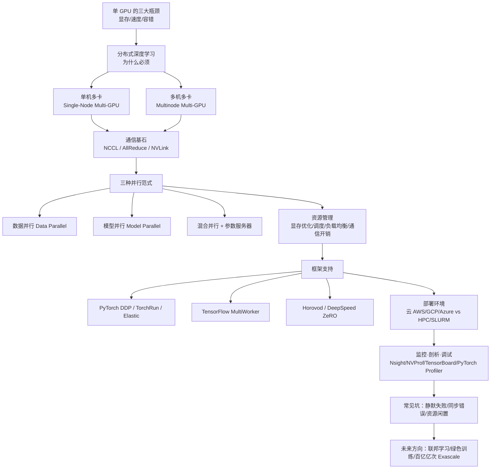
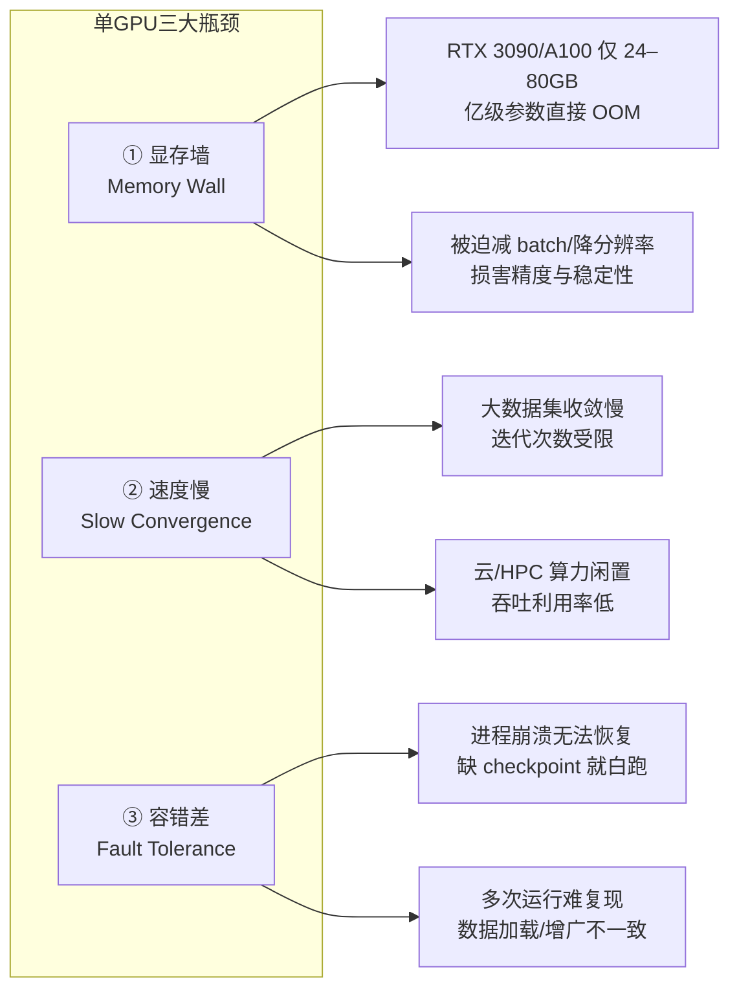
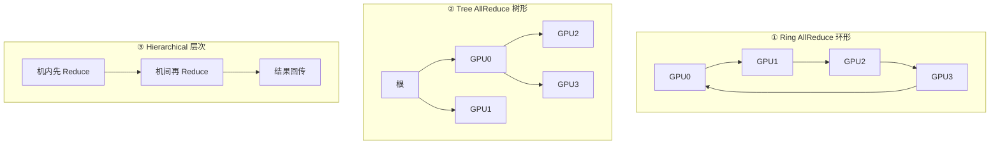
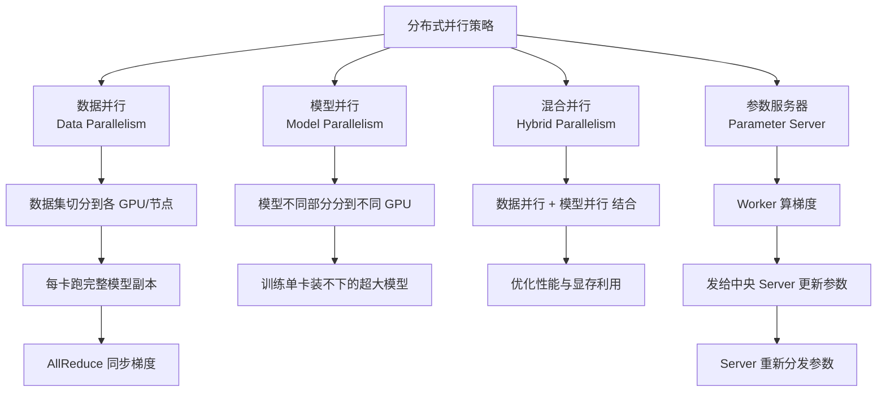
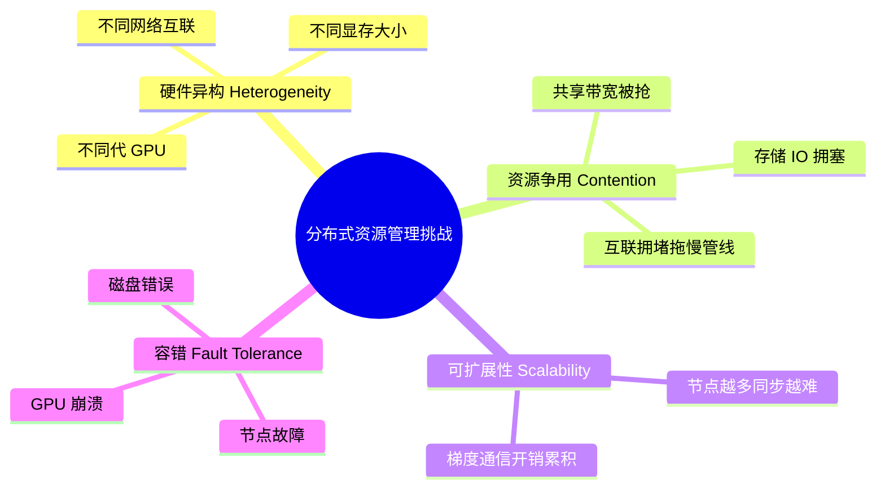
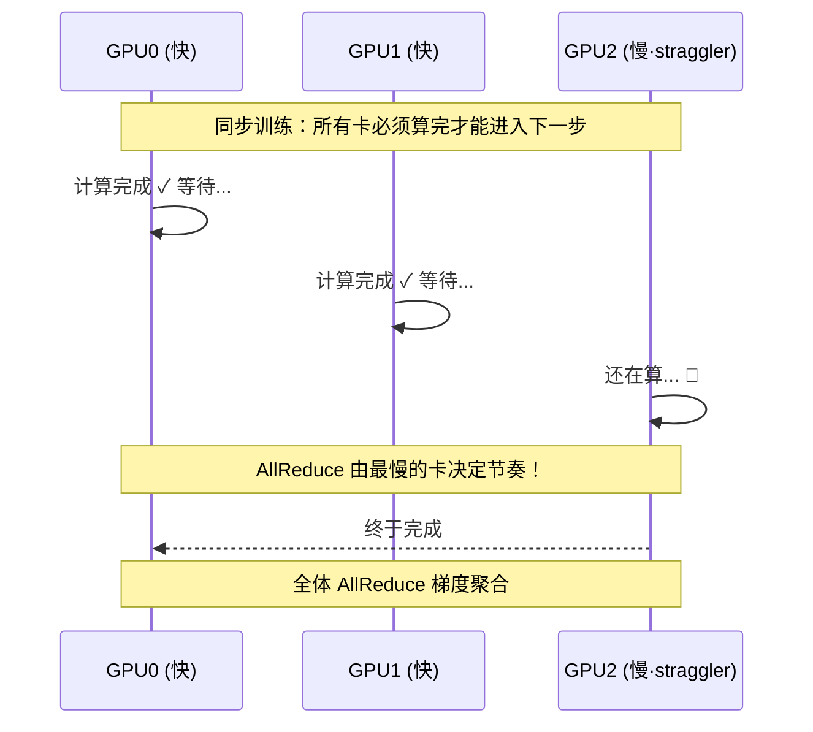
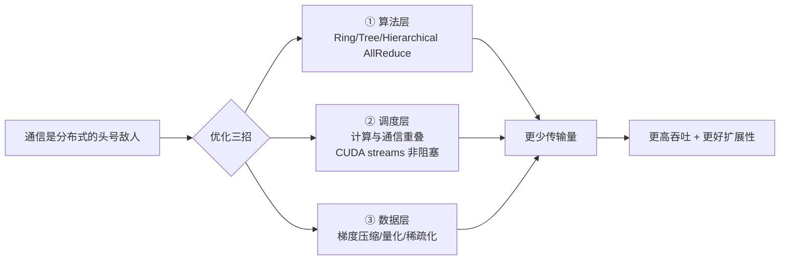
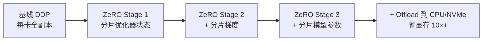
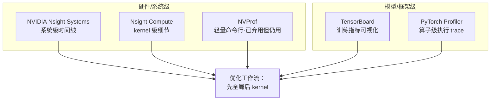

# 第 5 章 分布式与多 GPU 训练策略（Distributed and Multi-GPU Training Strategies）

> 对应原书 *GPU-Accelerated Deep Learning*（Mangrulkar & Chavan, APress 2025）第 5 章，PDF 第 109–134 页。
> 本篇是"逐章精讲"讲义：先把书里每个概念/公式/代码吃透，再用零基础到进阶的方式讲清楚**是什么 / 为什么 / 怎么用 / 代价**，并补充大量 llm-action 风格的实战、面试与踩坑经验。

---

## 🗺️ 本章地图

这一章回答一个核心问题：**当一块 GPU 装不下、算不动一个模型时，怎么把训练"摊开"到多卡、多机上，还保证结果正确？**



**阅读路线建议**：
- 只想搞懂"数据并行 vs 模型并行"→ 直接看 §3、§4。
- 要动手写多卡训练脚本 → 重点看 §7（PyTorch DDP）。
- 准备面试 → 全程留意 💡**面试高频** 小框，尤其 AllReduce、DDP vs DataParallel、ZeRO 三阶段。

---

## 1️⃣ 为什么单块 GPU 不够用？——分布式训练的起点

### 1.1 现代模型的算力饥渴

书中开篇给出一个朴素但重要的判断：**模型越来越大，单卡已经喂不饱。** 举的例子横跨三大领域：

| 领域 | 代表模型 | 特点 |
|---|---|---|
| 自然语言处理 NLP | GPT-3 | 千亿参数，单卡显存远远不够 |
| 计算机视觉 CV | EfficientNet、ViT（Vision Transformer） | 高分辨率 + 深层，激活值爆炸 |
| 生成式学习 | Diffusion Models（扩散模型） | 迭代采样，计算密集 |

> 🔬 **第一性原理：训练时间 ≈ 创新速度 × 成本**
> 书里有一句话点破了分布式的商业本质：*"Reducing training time directly correlates with innovation velocity and cost efficiency."*（缩短训练时间直接关系到创新速度和成本效率。）
> 单卡上要跑几天的任务，用分布式可能几小时甚至几分钟搞定。**省下来的不是电费，是"这周能试几个想法"的实验带宽。** 分布式让团队能探索更广的超参、架构、损失函数组合——这才是它真正的价值。

### 1.2 单 GPU 的三大硬伤

书中 §5.1.1 系统列举了单卡的局限。我把它整理成"三座大山"：



逐条讲透：

1. **显存墙（Memory Wall）——最直接的瓶颈**
   书中原话：主流 GPU 如 NVIDIA RTX 3090 或 A100 提供 **24–80 GB** 显存。对亿级/十亿级参数模型，或高分辨率图像 + 深 batch 流水线来说完全不够。
   - 后果：**OOM（Out-Of-Memory，显存溢出）错误**，或被迫用"减小 batch size / 缩小输入尺寸"这类低效变通手段。
   - ⚠️ **代价**：减小 batch 会让梯度估计噪声变大、训练不稳定、精度下降。所以"减 batch"不是免费午餐，它是在拿模型质量换显存。

2. **速度慢（Slow）——收敛与实验的双重拖累**
   单卡处理大数据集慢，收敛时间长，一天能跑的迭代次数有限。慢训练直接扼杀"快速试错"这个现代 AI 研发的基石。而且无法横向扩展到多设备，意味着云/HPC 里昂贵的算力**被闲置**，整体吞吐上不去。

3. **容错与可复现（Fault Tolerance & Reproducibility）——工程稳定性问题**
   单卡管线对硬件故障几乎没有抵抗力：**训练跑到一半进程崩了，如果没有定期 checkpoint（检查点），就得从头再来。** 而且如果数据加载、增广（augmentation）、batch 处理没有为大规模优化，多次运行的结果很难保持一致。

> 💡 **实战提醒**：新手最常犯的错是"等 OOM 了才想办法"。正确姿势是**训练一开始就设好 checkpoint 策略**（比如每 N 步存一次 + rank 命名），并用 `torch.cuda.max_memory_allocated()` 提前压测显存峰值。宁可先在小 batch 上确认能跑通再放大。

---

## 2️⃣ 两种物理拓扑：单机多卡 vs 多机多卡

分布式训练在硬件层面只有两种基本形态，理解它们的**互联方式**是理解一切通信开销的前提。

### 2.1 单机多卡（Single-Node Multi-GPU）

多块 GPU 装在**同一台物理机**里，共享 CPU 和系统内存（如书中 Fig 5.1）。互联靠：

- **PCIe（PCI Express）**：通用总线，带宽较低。
- **NVLink**：NVIDIA 专有高速互联，**带宽更高、延迟更低**——对同步参数和梯度特别有利。

> 🔬 **为什么单机多卡是"首选起点"？**
> 书中明确：单机多卡设计直白、通信开销相对低，是扩展深度学习负载的**首选起点（preferred starting point）**。它天然适合**数据并行**：每块 GPU 存一份完整模型副本，各自处理不同的 mini-batch；反向传播后，用 **AllReduce** 这类集合操作聚合梯度，由 **NCCL** 高效管理。没有跨机网络、没有分布式存储的复杂度——先在单机跑通，再考虑扩到多机。

### 2.2 多机多卡（Multinode Multi-GPU）

当一台机器的显存或算力都不够时，把负载摊到**多台机器**上，每台配一块或多块 GPU（书中 Fig 5.2）。关键区别在**跨机通信**：

- 不再享受本地高速互联，而是依赖网络：**高带宽以太网（Ethernet）** 或 **InfiniBand**。
- 带来新的复杂度：机器间同步、分布式数据分片（sharding）、更高的通信延迟管理。
- 系统效率**强烈依赖网络拓扑与互联技术**——它们决定了梯度聚合和参数同步能用的带宽与延迟。

### 2.3 一张表看清区别（书中 Table 5.1）

| 对比维度 | 单机多卡 Single-Node | 多机多卡 Multinode |
|---|---|---|
| **硬件设置** | 所有 GPU 在同一台机器 | GPU 分布在多台互联的机器（节点）上 |
| **通信开销** | 低延迟（NVLink/PCIe 机内互联） | 高延迟（Ethernet/InfiniBand 网络通信） |
| **可扩展性** | 受单机 GPU 数上限限制 | 加节点可扩到成百上千 GPU |
| **成本与维护** | 成本低、维护简单，只管一台机器 | 成本高、复杂，需维护多机 + 网络 |
| **适用场景** | 单机内存/带宽装得下的中小模型 | 超大模型/数据集，超出单机容量 |
| **示例应用** | 中等数据集的图像分类、目标检测 | 大规模 NLP、海量推荐系统、科学模拟 |

> 💡 **面试高频**：面试官常问"什么时候上多机？"标准答案：**先穷尽单机多卡**（8 卡 A100 已能撑很多任务），只有当"单机装不下模型 / 数据集"或"需要成百上千卡的吞吐"时，才付出多机的网络与运维复杂度。过早上多机是典型的过度工程。

---

## 3️⃣ 通信基石：NCCL、AllReduce 与互联拓扑

分布式训练的性能，**七成看通信**。这一节讲清楚数据在卡间是怎么"对齐"的。

### 3.1 NCCL 与 CUDA-Aware 集合通信

**NCCL（NVIDIA Collective Communications Library，读作 "nickel"）** 是深度学习框架做机内通信的标准选择。它提供高度优化的**集合操作（collective operations）** 原语：

| 集合操作 | 作用（一句话） | 训练中的用途 |
|---|---|---|
| **AllReduce** | 汇总所有设备的值再把结果发回每个设备 | **梯度同步的主力** |
| **Broadcast** | 把一个设备的数据广播给所有设备 | 初始化时同步权重 |
| **AllGather** | 收集所有设备的分片拼成完整数据 | ZeRO 参数聚合 |
| **ReduceScatter** | 归约后把结果分片散给各设备 | ZeRO 梯度分片 |

NCCL 的两大杀手锏（书中原文）：
- 利用硬件特性 **NVLink** 和 **GPUDirect RDMA**，实现低延迟、高吞吐通信。
- 支持 **ring-based（环形）** 和 **tree-based（树形）** 算法，**根据 GPU 数量和互联拓扑动态优化**通信模式。
- 与 PyTorch `DistributedDataParallel`、TensorFlow `tf.distribute` 深度集成，**大幅提升吞吐、减少 CPU 参与通信**，让计算与传输能重叠（overlap）。

**CUDA-Aware 集合通信**再进一步：允许 **GPU 到 GPU 直接内存交换，不经过主机内存中转（no staging through host memory）**。这让它能和 cuDNN、cuBLAS 无缝配合，端到端 GPU 训练管线更快更可扩展。

> 🔬 **第一性原理：为什么"不经过 CPU/主机内存"这么重要？**
> 传统路径是 GPU0 → 主机内存 → GPU1，数据要跨越 PCIe 两次并占用 CPU。CUDA-Aware + GPUDirect RDMA 让数据在 GPU 显存之间直接搬运。这省掉的不只是一次拷贝，更是把 CPU 从通信循环里解放出来——CPU 腾出手去做数据加载、增广，实现真正的**计算/通信/预处理三重重叠**。

### 3.2 AllReduce 算法家族——分布式训练的心脏

书中 §5.3.3.1 说得很直白：**AllReduce 处于数据并行训练的核心（at the heart）。** 每块 GPU 算自己 mini-batch 的梯度，然后必须和其他卡聚合梯度，才能更新参数。三种主流算法：



| 算法 | 通信步数 | 特点 | 适用 |
|---|---|---|---|
| **Ring AllReduce** | 随 GPU 数**线性增长** | **带宽最优（bandwidth-optimal）**、模式可预测、简单 | 中小规模，数据并行标配 |
| **Tree AllReduce** | **对数级（logarithmic）** | 层次化 reduce + broadcast，步数少 | 大集群更高效 |
| **Hierarchical AllReduce** | 混合 | 机内（intranode）先聚合，机间（internode）再聚合，**减少跨机流量** | 多机多卡最佳实践 |

实现库：**NVIDIA NCCL、Intel oneCCL、Horovod**，各自带硬件专属优化。

> 💡 **面试高频：为什么 Ring AllReduce 被广泛采用，但大集群又要换掉它？**
> Ring 的妙处在于**带宽最优**——每块 GPU 每步只和相邻两卡通信，总通信量与 GPU 数无关（是 $2(N-1)/N$ 倍数据量，接近常数）。但它的**步数随 GPU 数线性增长**（$2(N-1)$ 步），卡多了延迟累积就成瓶颈。所以超大集群改用**树形**（步数降到 $\log N$）或**层次化**（先机内后机间）。记住这个权衡：**Ring 省带宽但费步数，Tree 省步数但通信模式更复杂。**

### 3.3 GPU 拓扑：PCIe vs NVLink 的实战考量

书中 §5.2.2 强调**物理排布决定通信效率**。常见拓扑：linear（链）、mesh（网格）、fully-connected NVLink（全连接）。

- **NVLink**：最新型号聚合带宽可达 **600 GB/s**，延迟远低于 PCIe。适合**高同步频率**或**大模型状态传输**的场景。
- **PCIe 系统**：可能出现 **NUMA（Non-Uniform Memory Access，非一致内存访问）** 特性——数据传输速度随 GPU 位置和插槽配置而变。
- **诊断工具**：`nvidia-smi topo --matrix` 查看 GPU 互联拓扑矩阵，帮助优化 GPU 放置和线程亲和性（thread affinity）。
- **顶配方案**：NVIDIA **DGX 系列**专门用优化的 NVLink 拓扑实现 GPU 间**全互联（all-to-all）**。没有 DGX 时，只能靠软件层的**拓扑感知调度**和**手动亲和性调优**部分弥补 PCIe 机器的互联短板。

> ⚠️ **常见坑：忽视 NUMA 亲和性**
> 在双路 CPU 的 PCIe 服务器上，如果一个训练进程绑定在 CPU0，但用的 GPU 挂在 CPU1 的 PCIe 通道下，每次数据搬运都要跨 QPI/UPI 总线，性能悄悄打折且很难察觉。**上大任务前务必跑一次 `nvidia-smi topo --matrix`**，看 GPU 间是 `NV#`（NVLink）、`PIX`（同 PCIe 桥）还是 `SYS`（跨 NUMA），据此排布进程。

### 3.4 网络互联：Ethernet vs InfiniBand（多机专属）

| 互联类型 | 带宽 | 延迟 | 关键能力 | 适用 |
|---|---|---|---|---|
| **Ethernet 以太网** | 1–100 Gbps | 较高 | 便宜、易部署 | 同步不频繁的负载 |
| **InfiniBand** | 高达 **400 Gbps**（HDR/NDR） | 极低 | 支持 **RDMA**，GPU 跨节点直连、不经 CPU | HPC / AI 集群首选 |

书中结论：对大规模训练（数据中心、云集群），**InfiniBand 因其卓越的通信特性通常是首选**。互联的选择直接影响**收敛时间、扩展效率、网络争用**。

### 3.5 延迟 vs 带宽：一对永恒的矛盾

书中 §5.3.3.2 提炼出通信开销的两个基本量：

$$\text{通信时间} \approx \underbrace{\alpha}_{\text{延迟 latency}} + \underbrace{\frac{n}{\beta}}_{\text{数据量}/\text{带宽 bandwidth}}$$

- **延迟（latency）**：发起一次传输的固定时间 $\alpha$。**小张量传输是延迟敏感型（latency-sensitive）。**
- **带宽（bandwidth）**：单位时间能传多少数据 $\beta$。**大梯度张量是带宽受限型（bandwidth-bound）。**

两者常此消彼长，需要平衡：

- **降延迟**：**计算/通信重叠**——反向传播还没跑完就开始同步梯度。用 **CUDA streams** 和非阻塞（nonblocking）通信原语，无需等整个反向传播完成就发起集合操作。
- **降带宽压力**：**压缩技术**——8-bit 量化、梯度稀疏化（sparsification），大幅减少传输数据量，但要**小心收敛稳定性**。
- **硬件级**：机内用 NVLink，机间用带 RDMA 的 InfiniBand；配合拓扑感知的集合算法、梯度张量的自适应分块（adaptive chunking）。

---

## 4️⃣ 三种并行范式：数据 / 模型 / 混合

这是全章最核心的知识点，也是面试必考。书中 Fig 5.3 画了这张全景流程图，我用 mermaid 重绘并逐一讲透。



### 4.1 数据并行（Data Parallelism）——最常用

**是什么**：数据集切分给各 GPU/节点，**每卡运行一份完整的模型副本**，各自处理不同 mini-batch；用 **AllReduce** 同步梯度，保证更新一致。

**为什么好用**：模型能装进单卡时，数据并行几乎是"免费加速"——加卡就加吞吐，代码改动最小。

**代价**：模型必须能装进单卡显存。参数、梯度、优化器状态在每张卡上**冗余存储**（这正是后面 ZeRO 要解决的痛点）。

### 4.2 模型并行（Model Parallelism）——为超大模型而生

**是什么**：把**模型的不同部分**分到不同 GPU 上。比如一个 100 层的网络，前 50 层放 GPU0，后 50 层放 GPU1。

**为什么需要**：书中原话——它能训练**单卡显存装不下的超大模型（huge models that cannot fit in a single GPU's memory）**。这是模型并行存在的唯一理由。

**代价**：GPU 之间要传递中间激活值（activation），存在**串行依赖**——GPU1 得等 GPU0 算完前 50 层才能开工，容易产生"流水线气泡（bubble）"，利用率低。

### 4.3 混合并行（Hybrid Parallelism）——两者结合

**是什么**：合并数据并行 + 模型并行，**同时优化性能与显存利用**。例如：机内用模型并行拆分大模型，机间用数据并行复制多份加速。现代千亿模型（如 Megatron、GPT）几乎都是混合并行 + 流水线并行（pipeline parallelism）的组合。

### 4.4 参数服务器（Parameter Server）——中心化更新

**是什么**：Worker 节点算梯度，发给**中央服务器（centralized server）** 统一更新参数，再重新分发给各 Worker。

**特点**：架构中心化，Server 易成瓶颈；但天然支持**异步更新**，容忍慢节点。早期 TensorFlow 用得多，现在数据并行场景大多被 AllReduce 取代（去中心化、无单点瓶颈）。

> 💡 **面试高频：数据并行 vs 模型并行，一句话区分**
> **数据并行 = 拆数据，模型不动（每卡全模型）；模型并行 = 拆模型，数据不动（每卡半个模型）。** 判据：**模型装得下单卡 → 数据并行；装不下 → 模型并行（或 ZeRO/混合）。** 例子：ResNet 做图像分类用数据并行；GPT-3 用混合并行（模型并行 + 数据并行 + 流水线并行）。

> 🔬 **第一性原理：为什么 AllReduce 数据并行取代了参数服务器？**
> 参数服务器有个死穴：所有 Worker 都要和中央 Server 通信，Server 的网络带宽是**硬瓶颈**，$N$ 个 Worker 就有 $N$ 倍压力压在 Server 上。而 Ring AllReduce 是**去中心化**的——没有中心节点，通信量均摊到每条链路，总带宽需求与 $N$ 无关。这就是"民主"胜过"中央集权"的工程体现。

---

## 5️⃣ 资源管理：显存优化、调度、负载均衡

分布式集群往往是**异构**的（不同代 GPU、不同显存、不同网络），管好资源是性能的前提。书中 §5.3 系统讲了四大主题。

### 5.1 分布式资源管理的四大挑战



**编排工具（Orchestration Tools）** 应对这些挑战：

| 工具 | 定位 | 特点 |
|---|---|---|
| **Kubernetes** | 容器编排 | 容器化部署、自动扩缩容、健康检查；插件 Kubeflow / Volcano 扩展 AI 能力 |
| **SLURM** | HPC 老牌调度器 | 细粒度 GPU/CPU 分配、作业排队、多用户公平性 |
| **Ray** | 动态任务调度 | 资源感知的作业放置，适合需要灵活性和低延迟扩展的 DL 任务 |

**资源优化技术**（书中列举）：数据/模型并行、**梯度累积**（省显存换大 batch）、**混合精度训练**（FP16 代替 FP32，省显存 + 加速，尤其在 Tensor Core GPU 上）、优先级队列/公平算法、抢占（preemption）+ 定期 checkpoint。

**监控与剖析工具**：GPU 级用 NVIDIA **DCGM** 和 `nvidia-smi`；训练级用 **TensorBoard、Weights & Biases**；集群级用 **Prometheus + Grafana**；细粒度调试用 PyTorch/TensorFlow 内置 profiler。

### 5.2 GPU 显存优化四板斧

这是本章最实用的工程干货。书中 §5.3.1 给出四个技术，我按"省多少 / 代价"整理：

| 技术 | 核心思想 | 省显存 | 代价 |
|---|---|---|---|
| **梯度累积** Gradient Accumulation | 大 batch 拆成多个小 mini-batch，梯度累加 N 次再更新一次 | 峰值显存降到 1/N | 训练步数增多，吞吐略降 |
| **激活检查点** Activation/Gradient Checkpointing | 前向只存部分激活，反向时**重算**其余 | 显著（深模型可减 √N 倍） | 额外重算开销（约多 33% 计算） |
| **张量分片** Tensor Sharding (ZeRO) | 参数/优化器状态/梯度**分片**到多卡，不复制 | 极大（可减 10×+） | 需要卡间通信聚合，实现复杂 |
| **内存复用** Memory Reuse | 复用 buffer、算子融合、原地计算 | 减少碎片 | 需框架/手动优化 |

**① 梯度累积（Gradient Accumulation）**
书中原理：不在一次前向-反向里处理大 batch，而是拆成小 mini-batch，梯度**累加多次迭代**，等累积够了 optimizer 才更新一次——效果**等同于**处理了整个大 batch。既降低峰值显存，又保留大 batch 的好处（更好的梯度估计、训练稳定）。

```python
# 梯度累积伪代码：等效 batch = micro_batch × accum_steps
accum_steps = 4
optimizer.zero_grad()
for i, (x, y) in enumerate(loader):
    loss = model(x, y) / accum_steps   # ⚠️ 关键：loss 要除以累积步数
    loss.backward()                    # 梯度累加到 .grad，不清零
    if (i + 1) % accum_steps == 0:
        optimizer.step()               # 累够了才更新
        optimizer.zero_grad()          # 更新后才清零
```

> ⚠️ **常见坑**：忘了给 loss 除以 `accum_steps`，会让等效学习率被放大 N 倍，训练发散。另外注意与 BatchNorm 的交互——BN 统计量还是按 micro-batch 算的，等效 batch 变大不代表 BN 行为一致。

**② 激活检查点（Activation Checkpointing）**
标准反向传播要存下前向的**所有中间激活**以便反向复用，深模型下显存爆炸。检查点**只选择性存一部分激活**，反向时按需**重算**其余。这是**拿计算换显存**的经典权衡。

**③ 张量分片 / ZeRO**
把模型参数、优化器状态、梯度**分片（shard）到多卡**而非每卡复制一份。也叫**模型并行**或 **ZeRO（Zero Redundancy Optimization，零冗余优化）**。DeepSpeed、FairScale 实现了它，能把模型训练扩展到**几千亿参数**（详见 §7.3）。

**④ 内存复用（Memory Reuse）**
聚焦减少**显存碎片（fragmentation）**、最大化 buffer 复用。PyTorch/TensorFlow 内部有显存分配器管理动态分配，但自定义策略（复用 buffer、融合算子、原地计算）能进一步减少冗余，尤其在大规模数据 + 密集计算叠加时避免 OOM。

### 5.3 调度与负载均衡

**核心目标**：均匀分配负载、优化资源利用、最小化空闲时间。

**① 批大小与动态分配（Batch Sizing and Dynamic Allocation）**
数据并行下每个 batch 拆成小 mini-batch 分给各 GPU，**必须均衡**——否则快卡先算完就空转等慢卡，拉低整体吞吐。**动态分配**在运行时根据各 GPU 的实测算力、显存、当前负载调整分配：快卡多分点、慢卡/显存紧张的卡少分点。甚至可以用**强化学习或基于剖析的反馈回路**实时调整。

**② 掉队者效应（Straggler Effect）——同步训练的心病**



书中定义：同步训练里所有 GPU 必须算完各自 mini-batch 才能进下一轮迭代，**慢卡（straggler）拖累全局**——因为集合操作（如 AllReduce）需要跨设备协调，**最慢的参与者决定同步节奏（the slowest participant dictates the pace）**。

缓解策略：
- 计算/通信重叠、**异步训练（asynchronous training）**、流水线、投机执行（speculative execution）。
- **梯度陈旧容忍（gradient staleness tolerance）**：允许快节点不等每个 straggler 就先走。
- 硬件感知调度 + GPU 亲和性调优：把计算密集的活放高吞吐设备，轻任务给慢卡。
- 用剖析工具 + 实时遥测识别并动态重分配负载。

> 💡 **面试高频：同步 vs 异步训练的本质权衡**
> **同步**：所有卡步调一致，梯度精确、收敛好，但被 straggler 拖累。**异步**：快卡不等慢卡，吞吐高，但用的是"陈旧梯度（stale gradient）"，可能损害收敛质量。工业界主流是同步（配合计算/通信重叠隐藏开销），因为收敛的可靠性通常比那点吞吐更重要。

---

## 6️⃣ 通信开销的系统治理

书中把通信开销单列一节（§5.3.3），因为它**常常主导总训练时间**。前面 §3 已讲了 AllReduce 算法和延迟/带宽权衡，这里补一个整体心智模型：



**记住一句话**：分布式扩展的天花板不是算力，而是**通信**。当你加卡却不加速（甚至变慢）时，几乎一定是通信没优化好——梯度同步吃掉了增加的算力。

---

## 7️⃣ 框架级支持：PyTorch / TensorFlow / Horovod / DeepSpeed

理论讲完，看框架怎么把这些能力封装成几行代码。

### 7.1 PyTorch 分布式训练

PyTorch 因模块化架构、动态计算图、强大的分布式支持，成为分布式训练的**头牌平台**。

#### 7.1.1 DistributedDataParallel（DDP）——首选且最高性能

**是什么**：DDP 在每块 GPU 上**复制模型**，反向传播时用高性能集合操作（AllReduce）**同步梯度**。每个进程独立在本地数据分片上做前向/反向，DDP 通过每次迭代后聚合梯度保证更新一致。

**为什么比老的 DataParallel 强**：

| 对比 | DataParallel（旧，已不推荐） | DistributedDataParallel（DDP，推荐） |
|---|---|---|
| 进程模型 | **单进程多线程** | **多进程**（通常一进程一 GPU） |
| CPU 开销 | 高（梯度 gather 走 CPU，GIL 争用） | 低 |
| 扩展性 | 差，卡间争用严重 | **好** |
| 多机支持 | ❌ 不支持 | ✅ 支持 |
| 通信后端 | — | NCCL / Gloo / MPI |

> ⚠️ **常见坑：`nn.DataParallel` 是新手陷阱**
> `DataParallel` 用起来最简单（一行 `model = nn.DataParallel(model)`），所以新手爱用。但它单进程多线程、受 Python GIL 限制、梯度聚合走 CPU，**多卡加速比经常还不到 2×**。PyTorch 官方明确推荐**任何情况下都用 DDP**。别被 API 简单骗了。

**关键 API**：
- `torch.distributed.init_process_group(backend="nccl")`——初始化进程组。
- `torch.nn.parallel.DistributedDataParallel(model)`——包装模型。
- 通信后端选择：NVIDIA 硬件多 GPU 用 **NCCL**；CPU-only 或异构环境用 **Gloo**。

```python
import torch, os
import torch.distributed as dist
from torch.nn.parallel import DistributedDataParallel as DDP
from torch.utils.data.distributed import DistributedSampler

def setup():
    dist.init_process_group(backend="nccl")     # 初始化进程组
    local_rank = int(os.environ["LOCAL_RANK"])   # torchrun 自动设好
    torch.cuda.set_device(local_rank)            # ⚠️ 每进程绑定一块 GPU
    return local_rank

def main():
    local_rank = setup()
    torch.manual_seed(42)                        # ✅ 每进程同一 seed，保证可复现
    model = MyModel().cuda(local_rank)
    model = DDP(model, device_ids=[local_rank])  # 包装成 DDP

    # ✅ DistributedSampler 保证每卡看到不同的数据分片
    sampler = DistributedSampler(dataset)
    loader = DataLoader(dataset, sampler=sampler, batch_size=32)

    for epoch in range(epochs):
        sampler.set_epoch(epoch)                 # ⚠️ 每 epoch 换 shuffle 种子
        for x, y in loader:
            loss = model(x.cuda(local_rank), y.cuda(local_rank))
            loss.backward()                      # DDP 在这里自动 AllReduce 梯度
            optimizer.step(); optimizer.zero_grad()
    dist.destroy_process_group()
```

#### 7.1.2 TorchElastic 与 TorchRun——大规模与容错

- **TorchElastic**：**弹性容错训练**——运行中可动态增删 worker，无需重启作业。特别适合**可抢占环境**（如云上 spot 实例），资源可用性会波动。
- **TorchRun**（`torchrun` CLI）：简化分布式作业启动，**取代旧的 `python -m torch.distributed.launch`**。它管理进程生命周期，**自动设置 `RANK`、`WORLD_SIZE` 等环境变量**，支持通过 SSH 跨多节点启动，并集成 TorchElastic 实现失败 worker 的恢复与重新加入。

```bash
# 单机 4 卡启动
torchrun --nproc_per_node=4 train.py

# 多机：2 节点，每节点 8 卡
torchrun --nnodes=2 --nproc_per_node=8 \
         --rdzv_backend=c10d --rdzv_endpoint=MASTER_IP:29500 train.py
```

#### 7.1.3 最佳实践与调试

书中 §5.4.1.3 的清单，条条是血泪经验：

| 实践 | 具体做法 | 为什么 |
|---|---|---|
| **一进程一 GPU** | `torch.multiprocessing.spawn` 或 TorchRun 启动 | 避免设备争用 |
| **绑定单卡** | `CUDA_VISIBLE_DEVICES` 或 `torch.cuda.set_device()` | 防止进程抢同一块卡 |
| **正确 seeding** | 每进程 `torch.manual_seed()` 用**同一 seed** | 可复现 |
| **数据分片** | `DistributedSampler` | 保证每卡看**不同**数据分片 |
| **剖析调试** | PyTorch Profiler、NVIDIA NSight、`nvidia-smi` | 定位瓶颈 |
| **rank 化日志** | 按 rank 命名 checkpoint、隔离错误到具体 rank | 分布式 debug 必备 |
| **后端与网卡** | NCCL（NVIDIA）/ Gloo（CPU/异构）；设 `NCCL_SOCKET_IFNAME` | 影响性能与稳定性 |

> ⚠️ **踩坑记：`NCCL_SOCKET_IFNAME` 是多机训练最隐蔽的坑之一**
> 多机训练时，机器往往有多张网卡（管理网、存储网、计算网）。如果 NCCL 自动选到了慢的管理网卡，训练会诡异地卡住或极慢。**显式设置 `NCCL_SOCKET_IFNAME=eth0`（或你的高速网卡名）** 往往能救命。同理调试时可开 `NCCL_DEBUG=INFO` 看 NCCL 到底走了哪条路。

### 7.2 TensorFlow MultiWorker 策略

TensorFlow 通过高层 `tf.distribute` API 支持分布式。两个最常用策略：

| 策略 | 适用 | 通信 | 关键配置 |
|---|---|---|---|
| **MirroredStrategy** | **单机多卡** | AllReduce（PCIe/NVLink） | 无需额外配置 |
| **MultiWorkerMirroredStrategy** | **多机多卡** | NCCL / gRPC | 需 `TF_CONFIG` |

**MirroredStrategy**：单机多卡，每 GPU 建模型副本，用 AllReduce 同步。机内低延迟高带宽互联下高效。

**MultiWorkerMirroredStrategy**：多机（worker）环境，每 worker 跑相同模型 + 数据分片，TF 用 NCCL/gRPC 协调通信。优势是**跨节点可扩展**。但 API 相似的代价是**需要额外配置**：

**集群设置与角色配置**——`TF_CONFIG` 环境变量：
- 定义每个节点的角色：**chief**（首席，负责 checkpoint、日志、协调）、**worker**（实际训练）、可选 **evaluator**。
- 每个节点要有自己的 `TF_CONFIG`，标明集群所有节点的 IP 和端口；`task` 字段定义本节点的角色和索引。

> ⚠️ **常见坑：`TF_CONFIG` 配错 = 死锁**
> 书中明确警告：`TF_CONFIG` 配置错误会导致**死锁、worker 无响应、模型更新不一致**，是分布式 TF 训练**最关键**的组件之一。多机 TF 调不通，八成先查 `TF_CONFIG` 的 IP/端口/角色索引是否每台都正确且一致。

**TensorBoard 监控**：MultiWorker 下各 worker 把日志写到共享目录（通常在网络文件系统上），chief 常负责 summary 写入。TensorBoard 可视化 loss/accuracy/学习率/硬件利用率，帮助发现**不均衡、掉队者、意外停顿**。

### 7.3 Horovod 与 DeepSpeed——大规模利器

#### 7.3.1 Horovod——框架无关，改几行代码就扩展

- **出身**：Uber 开源，**框架无关（framework-agnostic）**，支持 PyTorch、TensorFlow、MXNet。
- **核心**：用 NCCL/MPI 抽象分布式通信；引入**单个 optimizer wrapper**，用 AllReduce 处理跨 worker 梯度平均。
- **易用性**：只需改**几行代码**即可扩展；用 `horovodrun` 或 `mpirun` 启动协调进程，内部处理 rank 分配、环境设置、梯度同步。
- **生态**：兼容 Keras、Hugging Face Transformers；支持弹性训练、TensorBoard 集成、timeline 追踪；支持 FP16 和稀疏化等梯度压缩。

#### 7.3.2 DeepSpeed 与 ZeRO——训练万亿参数模型

**DeepSpeed**（微软出品）专为在普通硬件上训练**数十亿到数万亿参数**的巨型模型设计。核心创新是 **ZeRO（Zero Redundancy Optimizer，零冗余优化器）**。

> 🔬 **第一性原理：ZeRO 到底"零"掉了什么冗余？**
> 传统数据并行下，每张卡都存一份**完整的**参数、梯度、优化器状态（Adam 的动量和方差是参数的 2 倍大小）。$N$ 张卡就有 $N$ 份完全相同的拷贝——这就是"冗余"。ZeRO 的洞见是：**这些状态没必要每卡都存，分片存就行，用到时再通过 AllGather 临时聚合。** 用一点通信换巨量显存。

**ZeRO 三阶段（分阶段实现）**：



| 阶段 | 分片对象 | 累计省显存 |
|---|---|---|
| **Stage 1** | 优化器状态（optimizer states） | 中 |
| **Stage 2** | + 梯度（gradients） | 大 |
| **Stage 3** | + 模型参数（parameters） | 极大 |

书中强调：这种分层方式让用户按**硬件约束和模型大小**选择优化级别。配合**激活检查点**和**offloading**（把优化器状态/激活移到 CPU 或 NVMe 存储），DeepSpeed 可实现 **10× 以上的显存节省**。

**其他能力**：混合精度（Apex 或原生 AMP）、梯度累积、**流水线并行（pipeline parallelism）**、通过 **Megatron-DeepSpeed** 支持模型并行；完全兼容 PyTorch，支持静态和动态图。

> 💡 **面试高频：ZeRO 三阶段能背下来吗？**
> 记忆口诀：**"优 → 梯 → 参"**（Stage 1 优化器状态，Stage 2 加梯度，Stage 3 加参数）。追问"ZeRO 是数据并行还是模型并行？"——答：**它是"披着数据并行外衣的显存优化"**，计算流程仍是数据并行（每卡处理不同数据），但状态像模型并行一样分片存储，兼具两者优点。

---

## 8️⃣ 云与 HPC 部署考量

模型和脚本准备好了，在哪跑？两大阵营：公有云 vs HPC 超算。

### 8.1 公有云分布式训练（AWS / GCP / Azure）

三大云都提供按需 GPU 实例（A100/V100/H100）、预配置镜像、可扩展存储。

**搭建云上 GPU 集群**：
- 开 GPU 加速的 VM 实例配成集群（AWS `p4d`、GCP `a2-highgpu` 等）。
- 用 SSH、Docker、Kubernetes、Ansible 配环境、装框架、初始化节点间通信。
- **网络配置**：安全组、防火墙规则、内部 IP；专用互联如 AWS **EFA（Elastic Fabric Adapter）** 或 GCP **placement groups** 提供低延迟高带宽。

**托管服务（Managed Services）**——降低运维门槛：

| 服务 | 云 | 亮点 |
|---|---|---|
| **SageMaker** | AWS | 支持 `data_parallel` / `model_parallel` 模式，集成 Spot 实例省钱 |
| **Vertex AI** | GCP | 支持 TF/PyTorch/XGBoost/sklearn，自动调参、实验追踪、**TPU 支持** |
| **Azure ML** | Azure | 自动扩缩容、日志监控、成本优化 |

### 8.2 平台对比（书中 Table 5.2）

| 平台 | 成本 | 延迟 | 编排工具 | GPU 可用性 |
|---|---|---|---|---|
| **AWS** | 按量付费，GPU 密集型可能贵 | 同区域低，跨区域高 | SageMaker、ParallelCluster、EKS | V100/A100/H100 等广谱 |
| **GCP** | 有持续使用折扣，价格有竞争力 | 区域内极低，跨区 VPC peering | Vertex AI、AI Platform、GKE | T4/V100/A100，还有 **TPU** |
| **Azure** | 灵活的预留 + spot 定价，长期用有折扣 | 可用区内低，全球走 Azure 骨干网 | Azure ML、AKS | V100/A100/H100 |
| **HPC**（自建/超算） | **前期资本高**，充分利用后单作业成本低 | **极低**（InfiniBand/自定义互联） | SLURM、PBS、自定义 MPI | 依集群，常是顶配 A100/H100 且数量大 |

### 8.3 在 HPC 基础设施上运行

HPC 系统多部署于学术/政府研究机构，为**大规模紧耦合计算**优化，提供高性能互联（InfiniBand）、大型 GPU 集群、作业调度器和共享文件系统。

**SLURM 与 MPI**：
- **SLURM**（Simple Linux Utility for Resource Management）负责资源分配和作业排队。DL 作业写成 SLURM 脚本，定义节点数、GPU 分配、内存需求、执行命令。
- **MPI**（Message Passing Interface）常配合 SLURM 管理节点间分布式通信。
- Horovod 和 PyTorch DDP 通过 `srun` / `mpirun` 集成 SLURM/MPI。很多 HPC 中心提供优化好的 PyTorch/TensorFlow/CUDA/NCCL 模块。

**GPU 节点供给与排队系统**：
- HPC 的核心差异是**排队式资源分配**——提交作业到队列，等满足配置的节点空出来。这引入**训练开始前的延迟**，需要仔细的作业规划。
- 好处：访问高性能 GPU 节点、多机通信 fabric、高吞吐并行文件系统（**Lustre、GPFS**）。
- 作业脚本里指定资源约束：节点数、每节点 GPU 数、运行时限、内存；还能设作业优先级和依赖关系。

```bash
#!/bin/bash
#SBATCH --job-name=ddp_train
#SBATCH --nodes=2                  # 2 个节点
#SBATCH --ntasks-per-node=8        # 每节点 8 个任务（对应 8 GPU）
#SBATCH --gres=gpu:8               # 每节点申请 8 块 GPU
#SBATCH --time=12:00:00            # 运行时限
#SBATCH --mem=256G

module load pytorch cuda nccl      # 加载 HPC 中心预置模块
srun torchrun --nnodes=2 --nproc_per_node=8 train.py
```

> 💡 **云 vs HPC 怎么选？**
> **云**：弹性、开箱即用、按需付费——适合初创、突发任务、需要快速起步。缺点是长期跑 GPU 账单可能吓人。
> **HPC**：极低延迟互联、顶配 GPU、单作业成本低——适合有稳定大算力需求、能接受排队的机构。缺点是前期资本高、要排队。**判据：短期弹性 → 云；长期高强度 → 自建 HPC。**

---

## 9️⃣ 监控、剖析与调试工具

分布式训练是"correctness × speed × scalability"的持续平衡。看不见就管不好，这一节讲四大工具和常见坑。

### 9.1 四大工具分工



**NVIDIA Nsight 套件**（面向 CUDA）：
- **Nsight Systems**：**系统级视角**，交互式时间线展示 CPU/GPU 活动。发现"GPU 空闲间隔"这类瓶颈（数据喂送延迟或同步低效导致）。
- **Nsight Compute**：**kernel 级性能**，测线程占用率（occupancy）、指令吞吐、内存访问效率。定位未合并内存访问（uncoalesced memory access）、寄存器压力过大等。
- **Nsight Graphics**：图形负载（OpenGL/Vulkan），通用 CUDA 开发中作用较小。

**NVProf**（NVIDIA Visual Profiler）：早于 Nsight，**官方已弃用（deprecated）** 但仍在用——轻量、命令行、无图形界面时快速性能检查。产出简洁摘要：kernel 时序、内存传输时长、API 调用开销。

**典型优化工作流**（书中给的黄金流程）：
1. **Nsight Systems** 抓整体性能 trace，发现 GPU 活动与 CPU 调度错位的地方。
2. **Nsight Compute** 钻进 kernel 细节，挖出未合并访存、寄存器压力等问题。
3. **NVProf** 作为迭代测试的低开销快速替代，尤其早期开发阶段。
> **从全局模式到 kernel 精调，系统化地榨干硬件。**

**TensorBoard + PyTorch Profiler**（模型开发者视角）：
- **TensorBoard**：起初为 TF 设计，现已无缝集成 PyTorch。实时可视化 loss 曲线、accuracy 趋势、学习率调度、自定义标量。诊断收敛慢、梯度不稳、优化异常的利器。
- **PyTorch Profiler**：记录详细执行 trace，可直接在 TensorBoard 里看。检查单个算子的时序、找出拖慢计算的层、观察显存分配/释放。多步 tracing 可选择性分析前向/反向/优化器更新——**分布式场景尤其有用，此时通信延迟可能与计算时间不相上下**。

> ⚠️ **剖析本身有开销**：书中提醒，profiling 通常只对**短的、有代表性的区间**开启，而非整个训练。日志再拿到 TensorBoard 看高层摘要 + 详细时间线。别傻乎乎全程开 profiler，那会显著拖慢训练。

### 9.2 分布式训练的常见坑（面试宝库）

书中 §5.6.3 系统列举了分布式独有的坑，全是面试高频。

| 坑 | 表现 | 根因 | 应对 |
|---|---|---|---|
| **负载不均衡** Workload Imbalance | 快卡等慢卡，资源闲置 | 数据分片不均、处理速度差、模型分段不均 | 均衡分片、动态分配、亲和性调优 |
| **通信开销** Communication Overhead | 梯度聚合拖累性能 | 带宽不足、通信模式低效 | 梯度压缩、计算/通信重叠、NVLink/InfiniBand |
| **同步错误** Synchronization Errors | 结果悄悄变差 | 竞态、延迟更新、节点间不一致 | 仔细日志、剖析、内置分布式调试工具 |
| **显存问题** Memory Issues | 长跑中 OOM | 大 batch、参数冗余复制、检查点低效 | 定期剖析显存分配模式 |

书中还单独深挖了三类"隐形杀手"：

**① 静默失败（Silent Failures）**——最阴险
> 书中定义：**不产生崩溃、警告或明显指示，却导致性能下降或结果错误**的失败。可能源于硬件故障、驱动不匹配、微妙的数值不稳定。
> **典型场景**：临时网络中断导致某节点丢了梯度更新，模型悄悄收敛到次优解，开发者根本不知道根因。这种坑**浪费大量算力还产生误导性的评估指标**。
> **缓解**：严格的验证检查、周期性跨多次运行对比结果、加入 sanity test 在训练各阶段验证模型输出。

**② 错误的同步（Incorrect Synchronization）**
> 同步机制实现不当（barrier 放错位置、缺集合通信调用、遗漏事件等待），会引发竞态、陈旧参数更新、模型状态不一致。
> **例子**：在所有节点的前向完成前就发起反向 → 梯度不匹配；权重更新后没同步 → 某些 worker 用旧参数继续训练。
> **避免**：精确放置同步原语 + 能暴露详细执行时间线的剖析工具。

**③ 资源利用不足（Resource Underutilization）**
> 硬件（GPU/高速互联）在执行中闲置或未充分利用。原因：负载分配不均、CPU 喂数据不及时、通信模式没吃满带宽、I/O 瓶颈。
> **应对**：针对性剖析找空闲期、优化输入管线提高吞吐、尽可能重叠计算与通信。

> 💡 **面试高频：列举三个分布式训练的坑并给对策**（对应书末习题 7）
> 标准答案模板：① **负载不均衡** → 均衡数据分片 + 动态分配；② **通信开销** → 梯度压缩 + 计算通信重叠 + 高速互联；③ **静默失败** → sanity check + 跨运行对比。能说出"静默失败"会显著加分，因为它体现了对生产环境的理解。

---

## 🔟 未来方向与研究机会

书中 §5.7 展望三大前沿：

### 10.1 联邦与去中心化学习（Federated & Decentralized Learning）
- **范式转变**：不把数据集中，而是在**分布式设备/节点本地训练**，只共享模型更新或参数。解决**数据隐私、合规、数据搬运成本高**的痛点。
- **联邦学习**：中央服务器协调模型聚合。**去中心化学习**：靠**点对点（P2P）协议**，无单点协调。
- **研究机会**：通信高效的聚合算法、对 **non-IID 数据**（非独立同分布）的鲁棒性、防对抗更新的安全协议、面向异构设备（边缘传感器到数据中心 GPU）的硬件感知优化。

### 10.2 能效多 GPU 训练（Energy-Efficient Training）
- **动机**：模型和数据集增长使训练的**能耗**成为重要考量。大规模集群持续运行是巨大的电力消费者。
- **技术**：**DVFS**（动态电压频率调节）、自适应批大小、混合精度、考虑热和功耗约束的调度、减少 GPU 空闲的异步执行、把训练对齐到低成本/低碳电力时段、集成可再生能源。
- **意义**：不仅降运营成本，更让大规模 AI 开发**可持续**。

### 10.3 百亿亿次系统上的 AI 训练（Exascale）
- **定义**：Exascale = 每秒超过 $10^{18}$ 次浮点运算的系统，将重新定义 AI 训练的极限。
- **机遇**：训练**万亿参数模型**、并行执行海量超参搜索。
- **挑战**：算法/框架需高效扩展到**百万核 + 数千 GPU**，缓解通信瓶颈、保证容错。
- **研究方向**：**通信规避（communication-avoiding）** 优化算法、层次化并行策略、硬件故障下无缝续训的韧性机制，以及让 AI 研究者无需深厚 HPC 底层专长就能用上 exascale 硬件的软件抽象。

---

## 📌 小结（Summary）

本章按"为什么 → 怎么摊 → 怎么通信 → 怎么管 → 用什么框架 → 在哪跑 → 怎么调 → 往哪走"的主线，讲透了分布式与多 GPU 训练：

1. **动机**：单 GPU 有显存墙、速度慢、容错差三大硬伤；分布式的本质价值是**缩短训练时间 = 提升创新速度与成本效率**。
2. **两种拓扑**：单机多卡（NVLink/PCIe，低延迟，首选起点）vs 多机多卡（Ethernet/InfiniBand，可扩展但复杂）。
3. **通信基石**：NCCL 提供 AllReduce/Broadcast/AllGather/ReduceScatter；**AllReduce 是数据并行的心脏**，有 Ring（带宽最优）/Tree（步数对数级）/Hierarchical（机内+机间）三种算法；延迟 vs 带宽是永恒权衡。
4. **三种并行**：**数据并行**（拆数据，每卡全模型）、**模型并行**（拆模型，训练超大模型）、**混合并行**（两者结合）、参数服务器（中心化，渐被 AllReduce 取代）。判据是"模型装不装得下单卡"。
5. **资源管理**：显存优化四板斧（梯度累积/激活检查点/张量分片 ZeRO/内存复用）；调度要防**掉队者效应**；同步 vs 异步的权衡。
6. **框架**：PyTorch **DDP**（首选，远胜 DataParallel）+ TorchRun/Elastic；TensorFlow MultiWorker（当心 `TF_CONFIG`）；Horovod（改几行代码）；**DeepSpeed ZeRO 三阶段**（优→梯→参，省显存 10×+，训万亿参数）。
7. **部署**：云（AWS/GCP/Azure + 托管服务，弹性）vs HPC（SLURM/MPI，极低延迟，排队）。
8. **监控调试**：Nsight（系统→kernel）、NVProf、TensorBoard、PyTorch Profiler；警惕**静默失败、错误同步、资源闲置**三大隐形坑。
9. **未来**：联邦/去中心化学习（隐私）、能效训练（可持续）、Exascale（万亿参数）。

**一句话记住整章**：*分布式训练的天花板不是算力，是通信*——所有优化（AllReduce 算法、计算通信重叠、ZeRO 分片、NVLink/InfiniBand）本质都在和通信开销作斗争。

### ✅ 实战检查清单（Setup Checklist）

- [ ] 先穷尽单机多卡再上多机；跑 `nvidia-smi topo --matrix` 确认拓扑
- [ ] 用 **DDP** 不用 DataParallel；一进程一 GPU + `set_device`
- [ ] `DistributedSampler` + 每 epoch `set_epoch`，保证数据分片正确
- [ ] 每进程同 seed，rank 化命名 checkpoint，定期存盘防崩溃
- [ ] 多机设 `NCCL_SOCKET_IFNAME` 指定高速网卡；调试开 `NCCL_DEBUG=INFO`
- [ ] 显存紧张按需上：梯度累积 → 激活检查点 → 混合精度 → ZeRO
- [ ] profiler 只在短代表区间开，避免全程拖慢
- [ ] 加 sanity check 跨运行对比，防静默失败

---

## 🔗 延伸阅读

**官方文档**
- PyTorch DDP 教程：`pytorch.org/tutorials/intermediate/ddp_tutorial.html`
- PyTorch Distributed Overview + `torchrun`（TorchElastic）文档
- TensorFlow `tf.distribute` 策略指南（MirroredStrategy / MultiWorkerMirroredStrategy）
- NVIDIA NCCL 文档；`nvidia-smi topo` 与 DCGM 使用指南

**大规模训练库**
- **DeepSpeed**：`deepspeed.ai` — ZeRO 论文《ZeRO: Memory Optimizations Toward Training Trillion Parameter Models》(Rajbhandari et al., 2020)
- **Horovod**：Uber 开源，《Horovod: fast and easy distributed deep learning in TensorFlow》(Sergeev & Del Balso, 2018)
- **Megatron-LM / Megatron-DeepSpeed**：张量并行 + 流水线并行的工业级实现
- **FairScale**：Meta 的 ZeRO/分片实现

**经典论文与延伸主题**
- Ring AllReduce 原理（Baidu《Bringing HPC Techniques to Deep Learning》）
- 混合精度训练《Mixed Precision Training》(Micikevicius et al., 2018)
- 流水线并行 **GPipe**《GPipe: Easy Scaling with Micro-Batch Pipeline Parallelism》
- 联邦学习《Communication-Efficient Learning of Deep Networks from Decentralized Data》(McMahan et al., 2017)

**本书内关联**
- 第 4 章（GPU 内存与优化）——梯度累积/混合精度的显存基础
- 第 6 章（后续）——推理与部署时的多 GPU 考量

> 📝 **书末习题自测**（对应 §5.8 Exercise）：能独立回答"数据并行 vs 模型并行何时用"、"单机 vs 多机架构差异"、"三个资源管理挑战及对策"、"三个分布式坑及预防"、"ZeRO 三阶段"这几题，本章就算过关。
