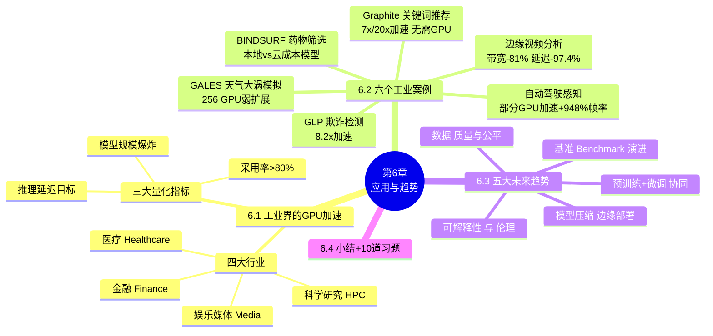
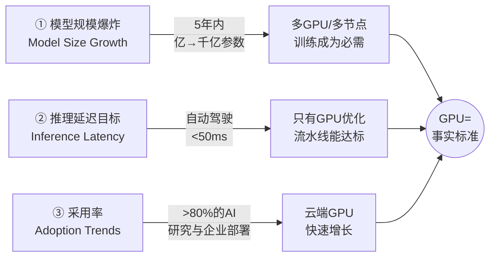
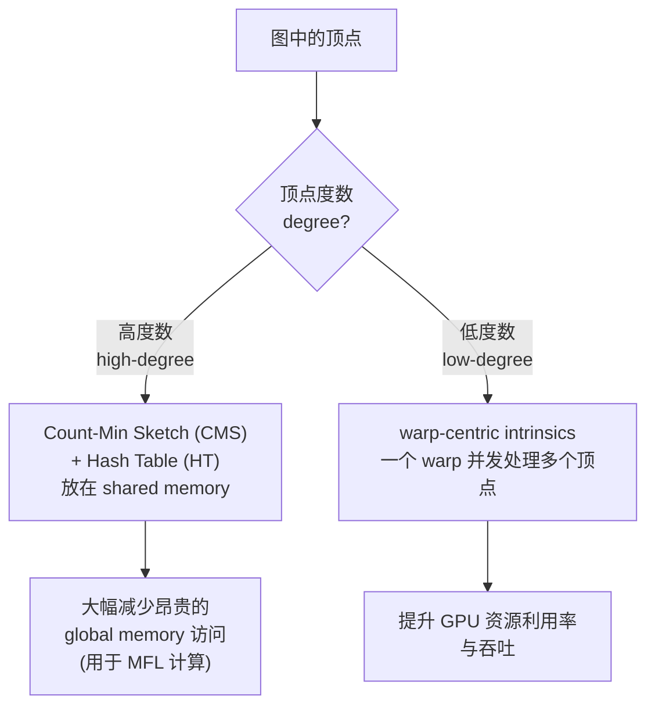
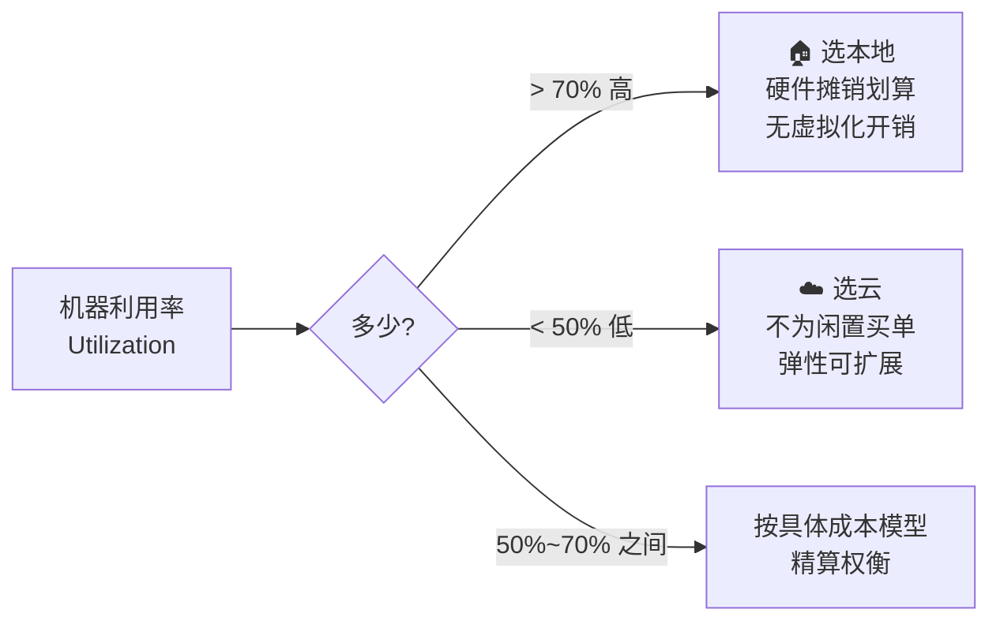
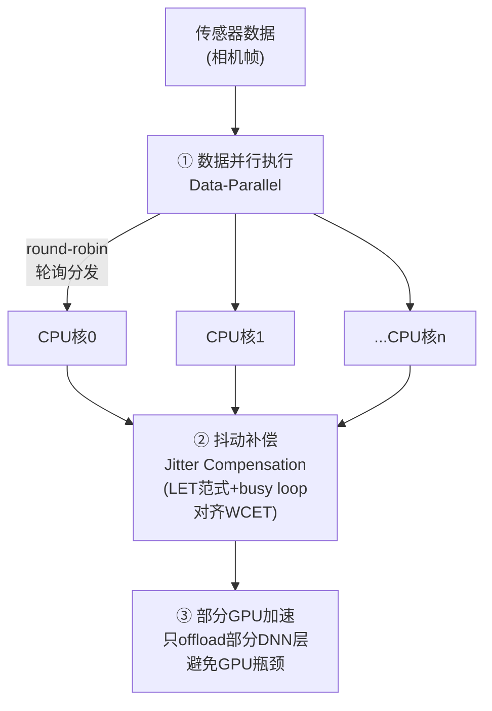
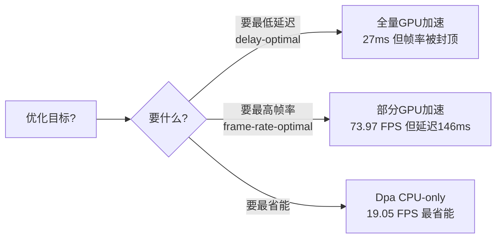
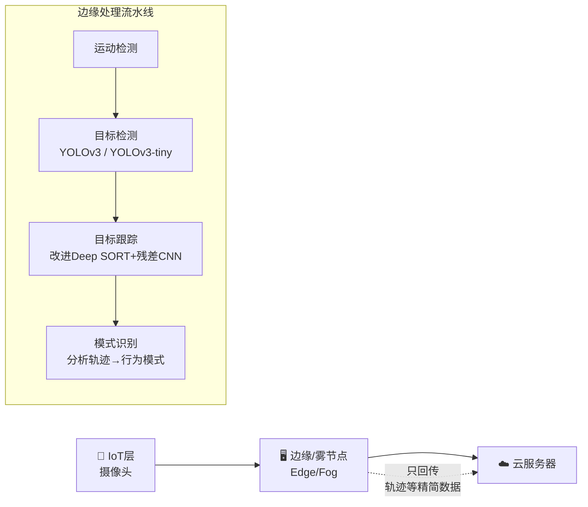
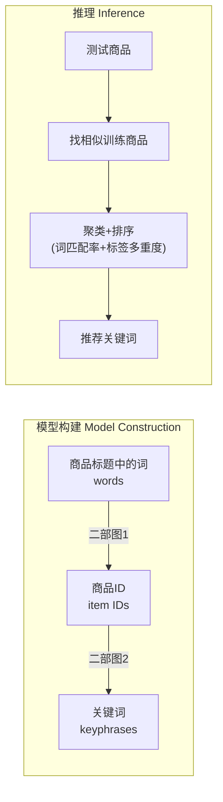
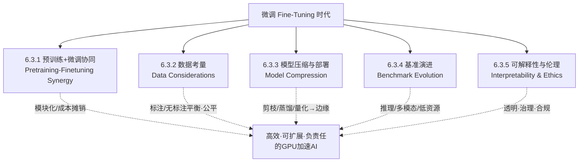

# 第 6 章 近期应用与新兴趋势(Recent Applications and Emerging Trends)

> 对应原书 pages 135–147(Chapter 6)。本章是全书的"落地与展望"篇:前五章讲的是 GPU 的**原理、框架与优化手段**,这一章回答两个终极问题——
> **① 这些技术真的在产业里跑起来了吗?带来了多大收益?**(6.1–6.2 工业案例)
> **② 接下来往哪走?**(6.3 未来趋势)
> 与前几章"讲代码、讲公式"不同,本章是**综述 + 案例复盘 + 趋势研判**,所以我们的分析框架从"第一性原理推导"切换为 **🔬核心论证拆解**:每个案例都问清楚"问题是什么 / 为什么 GPU 能解 / 怎么解 / 收益多少 / 代价与边界在哪"。

---

## 🗺️ 本章地图

**读这一章你会得到什么?**
- 一份"GPU 到底解决了产业里哪些真痛点"的**可引用案例库**(带真实数字:$25M/年、8.2×、948%、-97.4%…),面试聊"你怎么理解 GPU 的商业价值"时直接能用。
- 一套判断"该不该上 GPU / 上本地还是上云 / 全量还是部分加速"的**决策直觉**。
- 对"大模型时代下一步往哪走"的五个方向(压缩、微调、基准、数据、伦理)的系统认知。

---

## 6.1 🏭 GPU 在工业界的加速(GPU Acceleration in Industry)

### 6.1.1 一句话主线:从"画图卡"到"AI 引擎"

原书开篇的定调很精炼,值得逐句拆:

> *"Over the past decade, graphics processing units (GPUs) have transitioned from a niche hardware for graphics rendering to indispensable engines for large-scale artificial intelligence workloads."*
> (过去十年,GPU 从一个"画图形的小众硬件"变成了大规模 AI 工作负载**不可或缺的引擎**。)

**为什么会发生这个转变?** 书里给了三个合力(convergence of three forces):

| 力量 | 英文原文 | 白话解释 | 对应前几章 |
|---|---|---|---|
| 高吞吐并行 | high-throughput parallelism | 几千个核心同时算,天生适合矩阵/张量运算 | 第 1–2 章 SIMT、warp |
| 优化的软件框架 | optimized software frameworks | cuDNN / TensorRT / PyTorch 把底层复杂度封装掉 | 第 3–4 章 框架 |
| 可扩展互联 | scalable interconnects | NVLink / InfiniBand 让多卡多机能协同 | 第 5 章 分布式/优化 |

> 🔬 **核心论证:三力缺一不可**
> 只有强算力(裸 GPU)而没有好框架,普通工程师用不起来;有了框架但卡与卡之间带宽是瓶颈,大模型也训不动。正是**硬件 + 软件 + 互联三者同时成熟**,GPU 才成为"de facto standard(事实标准)"。这也解释了为什么 2012(AlexNet)之后 GPU 才真正引爆——不是单点突破,而是**系统级成熟**。

### 6.1.2 四大行业:GPU 加速的相关性版图

原书列了四个横跨的领域,我把它整理成"痛点 → GPU 怎么帮"的对照表:

| 行业 | 典型场景 | 核心痛点 | GPU 带来什么 |
|---|---|---|---|
| 🏥 医疗 Healthcare | 医学影像实时诊断(CNN)、大规模基因组分析 | 影像/基因数据量巨大,诊断要快 | 快速**推理**+加速**训练**,直接影响患者结局(patient outcomes) |
| 💰 金融 Finance | 高频交易、欺诈检测流水线、风险建模 | 毫秒级延迟约束(millisecond-level latency) | GPU 加速推理满足实时性 |
| 🎬 娱乐媒体 Media | 实时渲染、视频分析、生成式内容创作 | 计算 + 创意双重负载 | 兼顾算力与创作工作流 |
| 🔬 科学研究 HPC | 气候模拟、天体物理数据分析、蛋白质结构预测 | 前所未有的规模(unprecedented scales) | HPC 集群配 GPU,推动大科学 |

> 💡 **实战提示**:面试被问"举例说明 GPU 在你不熟悉领域的应用",不要只会背"训练大模型"。上面四行任选一个展开(比如"高频交易里欺诈检测要在 1.5 秒内 → 200 毫秒完成拦截"),立刻显得有产业视野。

### 6.1.3 三大量化指标:GPU 为什么"必需"而非"可选"

书里给了三个硬指标来论证 GPU 的**必要性(necessity)**,这比"GPU 很快"这种模糊说法有力得多:

逐条讲透:

1. **模型规模增长(Model Size Growth)**:SOTA 语言模型在**不到五年**里从"数亿参数"长到"数千亿参数"。
   - 🔬 **为什么这必然导致 GPU**:参数量 × 训练数据量 = 算力需求。千亿参数一张卡的显存根本装不下(权重 + 梯度 + 优化器状态),必须**多 GPU、多节点(multi-GPU and multinode)**切分。这直接呼应第 5 章的数据并行/模型并行。

2. **推理延迟目标(Inference Latency Targets)**:自动驾驶要求推理 **< 50 ms**。
   - 🔬 **为什么 CPU 不行**:50 ms 内要跑完一个感知网络的前向传播,CPU 的串行/低并行度做不到,只有 GPU 优化流水线(GPU-optimized pipelines)能达标。50 ms ≈ 20 FPS,是"人眼可接受实时"的下限。

3. **采用趋势(Adoption Trends)**:据行业调查,**超过 80%** 的 AI 研究与企业部署流水线依赖 GPU,云端 GPU 采用快速增长。
   - 💡 这个 80% 是很好的"论据数字",说明 GPU 不是学术玩具,而是产业主流基础设施。

> ⚠️ **常见坑**:很多人以为"推理不需要 GPU,CPU 就够了"。这在**离线、低 QPS、宽松延迟**场景成立,但一旦有**实时(<50ms)或高吞吐(百万 TPS)**约束,CPU 就撞墙了。下面 6.2.1 的欺诈检测案例就是活生生的例子。

---

## 6.2 📚 工业案例研究(Industrial Case Studies)

这一节是本章的**主体和精华**——六个来自真实生产环境的案例。原书的叙述模板高度统一,每个案例都是 **Methodology(方法)→ Results(结果)→ Key Takeaways(要点)** 三段式。

我们先用一张"总览表"建立全局印象,再逐个深挖。

| # | 案例 | 领域 | 硬件/框架 | 核心技术 | 招牌收益 | 反直觉之处 |
|---|---|---|---|---|---|---|
| 6.2.1 | **GLP** 欺诈检测 | 金融/图分析 | NVIDIA A100 + TensorRT | GPU 标签传播(CMS+HT / warp-centric) | 8.2× 加速;$25M/年防损 | 图算法也能极致 GPU 化 |
| 6.2.2 | **BINDSURF** 药物筛选 | 生物信息 | NVIDIA Tesla + CUDA | 盲式虚拟筛选(并行 docking) | 建立本地 vs 云成本模型 | GPU 不总选云,看利用率 |
| 6.2.3 | **自动驾驶感知** | 自动驾驶 | Jetson AGX Orin + Darknet | 数据并行 + **部分** GPU 加速 | 帧率 +948%;可调折中 | "全量 GPU 加速"反而不是最优 |
| 6.2.4 | **边缘视频分析** | 智慧城市 | 边缘-云混合 + YOLO/DeepSORT | 多阶段降维流水线 | 带宽 -81%,延迟 -97.4% | 处理在边缘,只回传轨迹 |
| 6.2.5 | **GALES** 天气模拟 | 气象/HPC | 256 GPU + CUDA/C++ | GPU 常驻大涡模拟(LES) | 近乎完美弱扩展 | 分辨率 100m 全球化可行 |
| 6.2.6 | **Graphite** 关键词推荐 | 电商 NLP | C++/OpenMP(**无 GPU**) | 二部图 + CSR + XML 分类 | 7×/20× 加速,模型小 30% | 反例:有时**不用** GPU 更好 |

> 🔬 **核心论证:这六个案例其实在讲同一件事的六个侧面**——
> "GPU 加速不是无脑上卡,而是**在正确的地方、用正确的方式、加速正确的瓶颈**。" 案例 6.2.3(部分加速最优)和 6.2.6(压根不用 GPU 更好)是全章最反直觉、也最有价值的两个,专门用来打破"GPU 越多越好"的迷思。

---

### 6.2.1 💳 金融实时欺诈检测:GLP(GPU-accelerated Label Propagation)

#### 背景与痛点

原书先给了一个总纲数字,再深入到具体框架:

> 某跨国大银行把 **NVIDIA A100** GPU 接入欺诈检测流水线,用深度学习模型每秒处理**数百万笔交易**。把 CPU-only 换成 **GPU + TensorRT** 推理后,欺诈检测延迟从 **1.5 秒降到 200 毫秒以内**,实现了**实时交易拦截**,每年估计防止 **$2500 万** 的欺诈损失。

然后聚焦到淘宝(TaoBao)的欺诈检测流水线,核心算法是**标签传播(Label Propagation, LP)**:在用户交互图里识别"可疑聚簇"。关键洞察:

> LP 占了整个流水线运行时间的 **75%**,是实时检测的**瓶颈**。

> 🔬 **核心论证:为什么盯住 LP?** 这是经典的**阿姆达尔定律(Amdahl's Law)直觉**——优化要打在占比最大的部分。LP 占 75%,把它加速 10 倍,整体就能接近 4 倍(1/(0.25+0.75/10)≈3.1×);去优化那剩下的 25% 收益极其有限。所以作者提出 GPU 框架 **GLP** 专门攻 LP。

#### 方法(Methodology):GLP 解决两个根本挑战 + 两个 GPU 优化

GLP 的设计目标(书里叫"two fundamental challenges"):

| 挑战 | 英文 | GLP 怎么应对 |
|---|---|---|
| **可编程性** | programmability | 提供富有表达力的 API,数据工程师无需大改代码就能实现/适配演进中的 LP 变体,适合动态、实验性的图挖掘 |
| **效率** | efficiency | 靠 GPU 并行在**十亿级(billion-scale)**图上做到实时;超出显存时支持 **CPU-GPU 混合执行(hybrid execution)** |

两个 GPU 中心的优化策略(这是精髓,**按顶点度数分而治之**):

逐点讲透:

- **高度数顶点(high-degree vertices)**:一个顶点连着成千上万条边,统计"最频繁标签(Most Frequent Label, MFL)"需要海量计数。直接用 global memory 会被**访存**拖死。GLP 在 **shared memory** 里用 **Count-Min Sketch(一种概率计数草图)+ Hash Table** 组合:CMS 用极小空间近似高频项计数,HT 精确记录,二者结合大幅减少 global memory 访问。
  - 🔬 **第一性原理**:shared memory 延迟 ≈ 几十个周期,global memory ≈ 几百个周期(第 2 章讲过)。把最热的计数放进片上 shared memory,就是把"慢内存"换成"快内存"。
- **低度数顶点(low-degree vertices)**:每个顶点只有几条边,一个线程处理一个太浪费。GLP 用 **warp-centric intrinsics**——**一个 warp(32 线程)并发处理多个顶点**,填满 GPU 的执行单元,避免线程闲置。

这套架构支持多种 LP 变体:**经典 LP、分层 LP(Layered LP, LLP)、说者-听者 LP(Speaker-Listener LP, SLP)**,兼顾性能与算法灵活性。

#### 结果(Results)

> - GLP 相比淘宝**自研分布式方案**取得最高 **8.2×** 加速;
> - 相比 SOTA 的 CPU/GPU LP 框架(**Ligra、G-Hash、G-Sort**),在运行时效率和内存利用上持续领先;
> - 两大优化(高度数 CMS+HT、低度数 warp-centric)被证明是**降低 global memory 开销、拉满 GPU 吞吐**的关键。

#### 要点(Key Takeaways)

- GLP 是企业级、实时欺诈检测的**可扩展且高性价比**方案。
- 模块化、可定制的 API 设计**降低了 GPU 编程门槛**,数据工程师能低成本地实现/适配 LP 变体。
- 强性能 + 高性价比 → 适合生产部署,那里**高吞吐 + 低基础设施成本**至关重要。

> 💡 **面试高频**:被问"图算法能不能上 GPU?"——很多人以为图算法访存不规则、天生不适合 GPU。GLP 恰恰是反例:**按度数分治(high/low degree)+ 片上内存缓存热点 + warp 级并行**,不规则图算法也能拿到 8× 加速。这是"针对负载特征定制并行策略"的教科书案例。

---

### 6.2.2 💊 药物发现的 GPU 虚拟筛选:BINDSURF

#### 背景与痛点

**BINDSURF** 是一个基于 GPU 的**盲式虚拟筛选(blind Virtual Screening, VS)**方法,用来在目标蛋白**整个表面**上识别结合位点。它用 CUDA GPU 做**大规模并行分子对接(docking)模拟**,能快速筛选海量配体(ligand)数据库。

> 🔬 **为什么这里 GPU 天然适合**:虚拟筛选本质是"把成千上万个配体分别去和蛋白表面各处试着对接"——这是**天生数据并行(embarrassingly parallel)**:每个配体、每个位点的对接计算彼此独立,正好铺满 GPU 的几千个核心。

本案例的独特之处:它**不比拼谁更快,而是比拼"本地物理机 vs 亚马逊 EC2 云"的性能与成本**。用 NVIDIA Tesla GPU,评估了执行时间、能耗、总成本。

#### 方法(Methodology):建立性能/成本模型

作者为两种基础设施建了**详细的性能/成本模型**:

| 基础设施 | 成本构成 |
|---|---|
| **本地(local)** | 能耗 + 硬件摊销(amortization)+ 机房托管(collocation)+ **空闲时间(idle-time)成本** |
| **云(cloud)** | 按 EC2 GPU 实例**小时计费(hourly usage)** |

实验设计:对**三种化学性质各异的配体(A/B/C)**做对接,蒙特卡洛模拟步数从 **5 到 50,000** 变化;记录执行时间与功耗,拟合数学模型来预测不同扩展场景下的性能与成本。

#### 结果(Results)——一张"何时选本地、何时选云"的决策表

| 发现 | 含义 |
|---|---|
| 本地执行时间**略快** | 少了虚拟化开销(virtualization overhead) |
| 云成本**更高** | 小时计费 + 向上取整(rounding up)计时 |
| **利用率 > 70%** → 本地更划算 | 高利用率下本地硬件摊销被充分利用 |
| **利用率 < 50%** → 云更经济 | 低利用率下不必为闲置硬件买单 |
| BINDSURF 处理了 **6000 个配体 × 5000 蒙特卡洛步** | 展示了跨平台的可扩展性与成本敏感性 |

#### 要点(Key Takeaways)

- **基础设施选择**在 GPU 加速的生物信息应用里至关重要。
- 本地集群:**高利用率下性能和成本更优**;云平台:**为零散(sporadic)负载提供弹性与可扩展性**。
- 作者的性能/成本模型让"部署 GPU 密集药物发现流水线"的决策**有据可依**,平衡速度、成本、资源可用性。

> 💡 **实战提示**:这个案例的价值不在"BINDSURF 多快",而在给了一条**朴素但常被忽视的经济学规律**——买卡还是租卡,看**利用率拐点**(这里约 50–70%)。这跟企业里"自建 GPU 集群 vs 上云"的真实决策完全一致。面试聊 MLOps/成本优化时是硬货。

> ⚠️ **常见坑**:云 GPU 的"小时向上取整"计费很容易被忽略——跑 61 分钟按 2 小时算。低利用率、突发短任务用云,长期满载用自建,才是省钱姿势。

---

### 6.2.3 🚗 自动驾驶的数据并行感知 + 部分 GPU 加速

这是全章**最反直觉、技术含量最高**的案例,一定要吃透。

#### 背景与硬件

在 **NVIDIA Jetson AGX Orin** 平台上实现的实时感知系统:**11 个专用 CPU 核** + 一个集成的 **Ampere GPU**。目标:**最大化帧率(frame rate)、最小化感知延迟(perception delay)**。做法是从传统的**任务并行(task-parallel)**架构转向新颖的**数据并行(data-parallel)**架构,并采用**部分 GPU 加速(partial GPU acceleration)**——只选择性优化部分 DNN 层。

#### 方法(Methodology):三个关键创新

逐个讲透三个创新:

1. **数据并行执行(Data-Parallel Execution)**:传统做法是把**固定的流水线阶段**分给固定 CPU 核(task-parallel)。新做法是把进来的传感器数据(如相机帧)以 **round-robin(轮询)** 方式分发到**所有 CPU 核**。
   - 🔬 **核心论证**:这是**时间并行(temporal parallelism)**——第 N 帧给核 N,第 N+1 帧给核 N+1……于是**帧率随核数线性扩展(linear scalability)**。而 task-parallel 会卡在最慢的那个阶段(流水线木桶效应)。

2. **抖动补偿(Jitter Compensation)**:为应对**不可预测的内存竞争延迟(memory contention delays)**,系统用 **逻辑执行时间(Logical Execution Time, LET)范式**——通过**忙等循环(busy loops)**把每次执行时间**强制拉到恒定值**,对齐**最坏情况执行时间(Worst-Case Execution Time, WCET)**。
   - 🔬 **为什么要故意"变慢到 WCET"**:自动驾驶要的是**确定性(determinism)**而非平均速度。如果每帧耗时忽快忽慢(抖动 jitter),控制系统就不稳定。LET 让每帧**都用满 WCET**,牺牲一点平均速度换来**可预测性**——这是实时系统(real-time system)的经典权衡。

3. **部分 GPU 加速(Partial GPU Acceleration)**:**不是**把所有 DNN 层都丢给 GPU,而是**只 offload 一部分层**。
   - 🔬 **反直觉的关键**:全量 GPU 加速会造成 **GPU 串行化(GPU serialization)**——所有帧都排队等这一个 GPU,反而成了瓶颈,帧率被"卡住(capped)"。只加速部分层,让 CPU 和 GPU **并行流水**,反而能拿到更高帧率。**全量加速留给"延迟最优(delay-optimal)"场景,部分加速用于"帧率最优(frame rate-optimal)"场景。**

实现:用 **Darknet 框架**,评估网络是 **DenseNet-306** 分类网络。

#### 结果(Results):三种架构对比

对比三种架构:**Sequential(Seq,单线程)/ Task-Parallel(Tpa,固定阶段-核映射)/ Data-Parallel(Dpa,提出的轮询分发)**。

| 指标 | Seq | Tpa | Dpa(CPU-only) | Dpa(+部分GPU) |
|---|---|---|---|---|
| **帧率 Frame Rate** | 基准 | — | **19.05 FPS(+948% vs Seq)** | **73.97 FPS** |
| **感知延迟 Delay** | 497 ms | **978 ms(流水线停顿)** | 577 ms(接近最优) | 146 ms(部分加速) |
| **能效** | — | — | CPU-only 模式**最省能** | 部分GPU反而**更耗能**(CPU+GPU全开) |
| **延迟最优** | — | — | — | **全量 GPU:27 ms**(但帧率被 GPU 串行化封顶) |

关键权衡总结(书里的原话精神):

> - **帧率**:Dpa 比 Seq 提升 **948%**,CPU-only 就达 19.05 FPS;加部分 GPU 加速到 **73.97 FPS**。
> - **感知延迟**:Dpa 保持接近最优的 577 ms,而 Tpa 因流水线停顿高达 978 ms。
> - **能效**:Dpa 在 CPU-only 模式最省能;但部分 GPU 加速因 CPU+GPU 全负荷而**增加能耗**。
> - **优化折中**:**全量 GPU 加速把延迟压到 27 ms(最低),但因 GPU 串行化封顶了帧率**;**部分加速优化了帧率但增加了延迟(146 ms)**。

#### 要点(Key Takeaways)

- 数据并行架构 + 部分 GPU 加速可**显著增强**自动驾驶实时感知。
- 通过**选择性 DNN 层加速**平衡帧率与延迟,提供针对应用需求的**灵活配置**。
- 该方法还改善能效与资源利用,**适合硬件受限的嵌入式平台**。

> 🔬 **本案例的第一性原理精华**:"资源不是越多越好,而是要匹配瓶颈"。全量 GPU 加速看似最强,却因为**串行化**在帧率上翻车。真正的高手是根据你要优化的目标(延迟 vs 帧率 vs 能耗)**动态选择加速比例**。这就是"没有银弹,只有权衡(trade-off)"。

> 💡 **面试高频**:"为什么有时候用了 GPU 反而更慢/帧率更低?"——答案就在这里:**GPU 串行化 + CPU-GPU 数据搬运开销**。如果只有一个 GPU 而所有请求都排队等它,GPU 就从加速器变成了瓶颈。

---

### 6.2.4 🏙️ 智慧城市的边缘视频分析(Edge-Based Video Analytics)

#### 背景与痛点

为解决**基于云的视频分析**的高延迟、高带宽消耗问题,研究者提出**边缘-云混合架构(hybrid edge–cloud architecture)**做智慧城市监控。系统把视频分析拆成子任务——**运动检测、目标检测、跟踪、模式识别**——分布在边缘层和云层执行。用 **CNN 目标检测(YOLO)+ 跟踪(改进的 Deep SORT)**实现,用 **iFogSim** 仿真评估。

> 🔬 **核心论证:为什么要"边缘"?** 把每一帧原始视频都上传到云,带宽爆炸、延迟高、成本高。核心思路是——**在边缘就地处理,只把"精华"(如轨迹 trajectory)回传云端**。这是典型的"**把计算搬到数据附近**"(compute near data),而不是"把数据搬到计算附近"。

#### 方法(Methodology):多阶段降维流水线

四个关键机制:

- **降维(Dimensionality Reduction)**:每个阶段都缩小数据量,最小化带宽和处理负载。
- **目标检测(Object Detection)**:按边缘设备能力选 **YOLOv3** 或 **YOLOv3-tiny**,聚焦车辆检测以提效。
  - 💡 tiny 版是"小模型",在算力弱的边缘设备上跑;这是**模型压缩思想**(和 6.3.3 呼应)的实战应用。
- **目标跟踪(Object Tracking)**:用改进的 **Deep SORT + 残差 CNN 架构**,提升跟踪精度和速度。
- **模式识别(Pattern Recognition)**:从跟踪得到的**轨迹**用机器学习分析,识别行为模式。

系统三层:**IoT 设备(摄像头)→ 边缘/雾节点 → 云服务器**;视频帧在边缘处理,只把**精简数据(如轨迹)**送到云。

#### 结果(Results):一组亮眼的效率数字

| 指标 | 结果 |
|---|---|
| 跟踪精度 Tracking Accuracy | 实时车辆跟踪 **> 98%** |
| 执行时间 Execution Time | YOLOv3-tiny 把检测时间从 **320s 降到 80s**(同等视频规模,**4× 提速**) |
| 带宽使用 Bandwidth | **-81%** |
| 资源利用 Resource Utilization | **+88.3%** |
| 延迟 Latency | **-97.4%** |

仿真:iFogSim 模拟三种场景——**edge+cloud、edge-only、cloud-only**——证明**混合和纯边缘配置性能更优**。

#### 要点(Key Takeaways)

- 边缘视频分析**显著增强**智慧城市监控。
- **本地处理 + 只传必要信息** → 降低延迟、带宽、资源成本。
- 模块化流水线 + CNN 跟踪 → 可扩展 + 高精度。
- 仿真验证了混合架构的有效性,是**实时城市监控的有前景方案**。

> ⚠️ **常见坑**:纯云(cloud-only)在"每帧上传"下延迟和带宽都最差。别默认"上云 = 更好"。对**高数据量、低延迟**场景,**边缘优先(edge-first)**往往是正解。-97.4% 的延迟改善说明差距是**数量级**级别的。

---

### 6.2.5 🌦️ 天气预报的 GPU 大涡模拟:GALES

#### 背景与痛点

代尔夫特理工(Delft)和荷兰皇家气象研究所开发了 **GALES**——一个 **GPU 常驻(GPU-resident)** 的大气**大涡模拟(Large-Eddy Simulation, LES)**模型,用于探索高分辨率天气预报。借助现代 GPU,他们在大区域上模拟湍流云动力学,证明了未来**全球尺度、能解析湍流**的模型的可行性。

> 🔬 **LES vs NWP 的核心区别**:传统数值天气预报(Numerical Weather Prediction, NWP)在粗网格上**参数化(parameterize)**云和湍流(即用近似公式代替真实物理);LES 则**直接解析(resolve)**大尺度湍涡。分辨率越高越接近真实物理,但计算量爆炸——这正是需要 GPU 的地方。

#### 方法(Methodology):四个要点

| 要点 | 说明 |
|---|---|
| **LES 扩大化(LES Enlargement)** | 不是去精细化传统 NWP,而是**扩大 LES 覆盖的区域**,同时保持高分辨率(**100 m**) |
| **GPU 优化** | 用 **CUDA + C++** 实现,在 **CURIE 超算**上高效并行,扩展到多达 **256 个 GPU** |
| **域嵌套(Domain Nesting)** | LES 嵌套在 **RACMO 区域气候模型**里,提供真实的边界条件 |
| **模拟场景** | 三种典型天气——**晴天积云、云街(cloud streets)、雷暴**——在 **400 × 400 km²** 域上模拟 |

技术细节:用了**非弹性近似(anelastic approximation)**、简单冰微物理方案、周期性边界条件;因缺 GPU 加速的辐射模块,辐射效应用 RACMO 的倾向(tendencies)建模。

#### 结果(Results)

| 发现 | 数据/含义 |
|---|---|
| **高保真(High Fidelity)** | 模拟云场与卫星图像高度吻合,捕捉云-辐射-地表的细尺度相互作用 |
| **可扩展性(Scalability)** | 在数百 GPU 上展示**近乎完美的弱扩展(near-perfect weak scaling)**,暗示全球模拟可行 |
| **计算成本(Cost)** | 当前"**模拟 1 小时需要计算 4 小时**",说明业务化预报还需 **10–100×** 的算力提升 |
| **维度可达(Dimensional Reach)** | 用 Titan 超算的 GPU 容量,**3200 × 3200 km²、100m 分辨率**的域已技术可行 |

> 🔬 **弱扩展(weak scaling)是什么?** 弱扩展 = "问题规模和处理器数**同比例增大**时,单位工作的耗时保持不变"。"近乎完美弱扩展"意味着:加一倍 GPU 就能算一倍大的区域而不变慢——这是分布式 HPC 的**理想状态**,说明 GALES 的通信开销极低、几乎没有扩展瓶颈。对比第 5 章讲的分布式训练扩展效率,这是同一个概念。

#### 要点(Key Takeaways)

- GPU 加速的 LES 模型在天气预报里有**变革性潜力**:全球解析云尺度湍流可消除传统 NWP 的许多偏差(biases)。
- 仍有挑战:地形建模、数据同化(data assimilation)、压力求解器。
- 但 LES 方法非常契合未来超算平台,为**未来十年内的全球高分辨率天气模拟**提供了有力的概念验证。

> 💡 **实战提示**:注意那句"模拟 1 小时需算 4 小时"——这说明**能跑 ≠ 能业务化**。天气预报必须**比真实时间快**(否则预报出来天气已经过去了),所以还差 10–100× 算力。这是"科研可行性"和"生产可用性"之间的鸿沟,是评估任何 HPC/AI 项目落地性的关键问题。

---

### 6.2.6 🏷️ Graphite:图结构的极端多标签分类器(反例:不用 GPU 更好!)

这是本章**最特别的一个案例**——它是"**不用 GPU**"的成功故事,专门用来平衡"GPU 万能论"。

#### 背景与痛点

**Graphite** 是一个**基于图的分类器**,用于在**资源受限环境**下为电商列表实时推荐关键词(keyphrase)。它把问题重构为**极端多标签(eXtreme Multilabel, XML)短文本分类**任务,并**避开深度学习模型的计算开销**,靠**二部图(bipartite graph)结构**解决。

> 🔬 **核心论证:为什么反而不用 GPU / 深度学习?** 在**资源受限、要实时、标签空间极大(XML)**的电商生产环境里,深度学习模型部署成本高、推理慢、可解释性差。Graphite 证明:用轻量的**图 + 稀疏矩阵**方法,在 CPU 上就能又快又准又可解释。这是对"任何问题都上大模型"的清醒纠偏。

#### 方法(Methodology):两阶段 + CSR

Graphite 架构分两个阶段:

- **模型构建(Model Construction)**:建两个二部图——① 商品标题里的**词 → 商品 ID**;② 商品 ID **→ 关键词**。这个结构让"检索相关标签"变得高效。
- **推理(Inference)**:对测试商品,找相似训练商品,用基于**词匹配率(word match ratio)**和**标签多重度(label multiplicity)**的聚类+排序策略给关键词打分。

实现:**C++ + OpenMP 多线程 + Python 绑定**,快训快推、**无需 GPU 依赖**;用**压缩稀疏行(Compressed Sparse Row, CSR)** 格式高效存储和操作图。

> 💡 **CSR 是什么**:一种只存非零元的稀疏矩阵格式。图邻接矩阵天然稀疏(大部分商品不含大部分词),CSR 省内存又快。这是"用对数据结构"而非"堆硬件"的典范。

#### 结果(Results):碾压式的性价比

在 **40 个 eBay 专有商品类目**上评测,对比 **fastText** 和 **Astec**:

| 指标 | Graphite 表现 |
|---|---|
| 精度/召回 | 全类目**超越 fastText**:**Precision@1 最高 +210%,Recall@10 +270%** |
| 模型大小 & 推理时间 | 比 fastText **平均小 30%**,推理**快 7×**;比 Astec **快 20×** 且更可扩展 |
| 训练时间 | Graphite **分钟级**训练完;fastText 要数小时;Astec 在大数据集上因内存崩溃(failed) |
| AI 评估 | **GPT-4** 评估显示 Graphite 预测更契合人类判断:相关性最高 **61.2%**,fastText 仅 30.6% |
| 商业影响 | eBay 部署后,独特关键词覆盖 **+6%**,卖家接受率比 fastText **高 3%** |

#### 要点(Key Takeaways)

- Graphite 为电商关键词推荐提供**可扩展、可解释、高效**的方案。
- 图结构设计使其**无需 GPU 即可实时推理**,非常适合生产环境。
- 在精度、召回、可解释性上全面领先,展示了**替代传统神经网络 XML 分类器**的潜力。

> 🔬 **本章最重要的一课**:Graphite 和前面五个案例形成鲜明对比——**GPU 加速很强大,但它是手段不是目的**。当问题结构允许(稀疏、图、可解释),一个精心设计的 CPU 算法可能**更小、更快、更省、更可解释**。判断"要不要上 GPU"的正确姿势是:先看问题本质,再选工具。

> 💡 **面试高频**:如果面试官问"是不是所有 AI 任务都该上 GPU?"——用 Graphite 反例回答:**不是**。对稀疏图结构、极端多标签、资源受限的实时场景,轻量 CPU 方案(图+CSR+OpenMP)可能全面胜出。这体现你有"工具理性"而非"技术崇拜"。

---

## 6.3 🔮 未来趋势(Future Trends)

前面讲"已经落地的",这一节讲"接下来往哪走"。原书把趋势聚焦在**微调(fine-tuning)时代**的五大议题上。

开篇定调:

> 微调已成为深度学习的**变革性技术**,能用**相对适度的算力**把大型预训练模型适配到具体下游任务。SQuAD、GLUE、ImageNet 等基准上的成功证明了其实用性。但对微调的日益依赖也引出关于**基准设计、模型可解释性、大规模预训练可持续性**的问题。随着模型和数据继续扩展,社区必须应对**领域漂移(domain shift)、能耗、伦理数据实践**的挑战。

五大趋势总览:

### 6.3.1 预训练与微调的协同(Pretraining and Fine-Tuning Synergy)

**核心主张**:未来模型将保持**预训练**和**微调**两阶段的**清晰分离**,强化开发流水线的**模块化(modularity)**。

- 大规模基础模型(foundational models)继续作为**通用起点(versatile starting points)**,跨广泛任务和领域复用。
- 这种分离带来的好处:
  - **成本摊销(cost amortization)**:昂贵的预训练只做一次,摊到多个应用上。
  - **聚焦创新**:研究者专注于特定问题的微调,不用重复烧钱预训练。
  - **快速适配**:对需要快速响应需求变化的行业尤其有利,缩短交付周期,降低算力和财务门槛。
- 更进一步:催生**通用、领域无关(domain-agnostic)**的模型,用**少量任务特定数据**就能高效专化。一个预训练骨干(backbone)支撑多个微调模型 → **灵活的 AI 生态**、增强可扩展性、**可持续 AI**(最大化预训练资源利用、减少冗余计算、延长基础模型生命周期)。

> 💡 **这跟 GPU 有什么关系?** 预训练是**最烧 GPU** 的阶段(千卡训练数周);微调只需**很少 GPU**。"预训练一次、微调多次"正是把稀缺的大规模 GPU 算力用在刀刃上的经济学——这也是为什么 LoRA/QLoRA 等**参数高效微调(PEFT)**如此火热(本书虽未展开,但正是这一趋势的技术兑现)。

### 6.3.2 数据考量:标注 vs 无标注,以及公平性(Data Considerations)

**核心议题**:标注数据(labeled)与无标注数据(unlabeled)的**平衡**是微调演进的关键。

- 现代范式:**海量无标注数据做预训练**(学广义、领域无关的表征)+ **少量高质量标注数据做微调**(拿到任务性能)。
  - 好处:大幅减少对昂贵、耗时的大规模标注语料的依赖;既用上现成的无标注数据,又享受标注数据的精确可靠。
- **但数据质量、代表性、公平性挑战依然严峻**:
  - **众包标注(crowdsourced labeling)**虽便宜,却可能引入**不一致、文化偏见、人口统计学上的代表性不足**,这些会传导进模型行为。
  - 若不加缓解,模型可能**固化有害刻板印象**或对少数群体表现差。
- **未来研究方向**:严格的**数据审计(data auditing)**、**平衡采样(balanced sampling)**、**透明的文档实践(documentation)**。

> ⚠️ **常见坑**:"数据越多越好"是错的。**有偏的数据 → 有偏的模型**。垃圾进、垃圾出(garbage in, garbage out)在公平性上尤其致命——它不只影响准确率,还带来法律和伦理风险。

### 6.3.3 模型压缩与部署效率(Model Compression and Deployment Efficiency)

随着模型变大变复杂,**压缩技术**的需求越来越关键。书里列了四大主流手段:

| 压缩技术 | 英文 | 一句话原理 | 代价 |
|---|---|---|---|
| **知识蒸馏** | Knowledge Distillation | 用大模型(teacher)的输出训练小模型(student) | 需要教师模型 + 额外训练 |
| **权重剪枝** | Weight Pruning | 删掉不重要的权重/连接 | 可能损失精度,需微调恢复 |
| **量化** | Quantization | 用低比特(如 INT8)代替 FP32 | 精度损失,需校准 |
| **低秩分解** | Low-Rank Factorization | 把大矩阵拆成两个小矩阵乘积 | 表达能力可能受限 |

- **为什么关键**:特别适合把大模型部署到**边缘设备(edge devices)**——那里内存、功耗、算力都严重受限。压缩直接影响**运营成本**:降低推理延迟和能耗,让支撑**数十亿用户**的可扩展 AI 服务成为可能。
- **未来方向**:**混合压缩流水线(hybrid compression pipelines)**——组合多种技术、**动态适配部署环境**的模型容量、在资源受限下仍保持高精度。

> 🔬 **第一性原理:压缩为什么可行?** 大模型通常是**过参数化(over-parameterized)**的——很多权重对最终输出贡献极小。剪枝去掉冗余权重、量化降低数值精度、蒸馏把"知识"浓缩进小模型,本质都是在**逼近同一个函数但用更少的比特**。这是"精度 vs 效率"权衡的又一体现,和第 5 章的混合精度训练一脉相承。

> 💡 **实战提示**:6.2.4 的 YOLOv3-tiny 就是压缩思想的实战——tiny 版是精简结构,让检测能在弱边缘设备上跑。压缩不是纸上概念,是边缘部署的刚需。

### 6.3.4 基准演进(Benchmark Evolution)

**问题诊断**:当前基准往往**过度偏向本就适合微调的任务**——标注数据充足、评估指标清晰的那类。像 **GLUE、SQuAD、ImageNet** 主要衡量**静态输入、明确目标**的任务性能。

> ⚠️ **风险**:这种狭窄聚焦会导致模型**为刷分而过拟合(over-optimizing for benchmark-specific performance)**,忽视对复杂真实场景的泛化。(这就是"Goodhart 定律"——当指标成为目标,它就不再是好指标。)

**未来基准应该怎么设计**:

| 新方向 | 说明 |
|---|---|
| 更多样、更难的任务 | 需**多步推理(multistep reasoning)**、**时间与因果理解(temporal and causal understanding)**、**低资源/领域漂移**适应 |
| 多模态基准 | 组合**文本、视觉、音频、结构化数据**,反映 AI 的跨域本质 |
| 质性维度 | 纳入**公平性、可解释性、能效**,确保微调不只提性能,还要负责任、可持续 |

### 6.3.5 可解释性与伦理(Interpretability and Ethics)

**核心主张**:在商业、科学、敏感领域部署微调模型,**可解释性(interpretability)** 至关重要——那里的决策可能有重大**法律、财务、社会**后果。

- **透明架构、可解释 AI(XAI)技术、基于图的表征**可能优于纯黑盒神经网络,让决策路径对人类利益相关者更可理解。
  - 呼应 6.2.6 Graphite:图结构天生比深度网络更可解释。
- **事后解释方法(Post hoc)**:如**显著性图(saliency maps)**、**注意力可视化(attention visualization)**,可辅助审计模型输出——但要小心使用,避免制造误导性或过度简化的"模型行为叙事"。
- **伦理关切**必须主动应对:
  - **算法偏见(algorithmic bias)、错误信息放大(misinformation amplification)、潜在滥用(misuse)**——尤其当模型在全球、文化多样的用户群上大规模部署时。
  - 不仅需要**技术防护**(公平感知训练 fairness-aware training、偏见检测工具),还需要**制度化流程**:监督(oversight)、问责(accountability)、透明(transparency)。
  - 需要**稳健的治理框架 + 持续监控**,确保模型与社会价值观和监管要求一致。

> 🔬 **核心论证:为什么伦理是"技术问题"而非"额外附加"?** 微调让大基础模型能被**快速适配**到各种领域——能力扩散得越快,滥用和偏见传播的风险也越大。所以治理不是事后补丁,而必须**内建(built-in)**在开发流程里。这与"负责任 AI(Responsible AI)"的全球共识一致。

---

## 6.4 📌 本章小结

这一章把全书从"技术"拉到了"应用与未来"。一句话总纲:

> **GPU 通过大规模并行、高内存吞吐、高效 AI 工作负载,已在金融、医疗、自动驾驶、智慧城市、科学计算中实现变革;而未来则由压缩、微调、基准、数据、伦理五大趋势共同定义。**

### 六个案例回顾(一表打尽)

| 案例 | 变革性收益 | 给你的一句话启示 |
|---|---|---|
| GLP 欺诈检测 | 8.2× 加速,$25M/年防损 | 图算法也能极致 GPU 化(按度数分治) |
| BINDSURF 药物筛选 | 建立本地 vs 云成本模型 | 买卡还是租卡,看利用率拐点(50–70%) |
| 自动驾驶感知 | 帧率 +948%,可调折中 | 全量 GPU 加速≠最优,警惕串行化 |
| 边缘视频分析 | 带宽 -81%,延迟 -97.4% | 把计算搬到数据附近(边缘优先) |
| GALES 天气模拟 | 256 GPU 近乎完美弱扩展 | 能跑 ≠ 能业务化(还差 10–100×) |
| Graphite 关键词推荐 | 7×/20× 加速,无需 GPU | GPU 是手段不是目的(有时 CPU 更好) |

### 五大未来趋势回顾

1. **预训练+微调协同** → 模块化、成本摊销、可持续。
2. **数据考量** → 标注/无标注平衡 + 质量、代表性、公平性审计。
3. **模型压缩** → 蒸馏/剪枝/量化/低秩,面向边缘部署的混合流水线。
4. **基准演进** → 从静态刷分走向推理、多模态、低资源、质性维度。
5. **可解释性与伦理** → 透明架构 + 治理框架,负责任 AI 内建。

### 🎯 本章最该记住的三条"元认知"

1. **优化要打在瓶颈上**(GLP 盯 75% 的 LP;自动驾驶只加速部分层)——阿姆达尔定律的产业演绎。
2. **没有银弹,只有权衡**(延迟 vs 帧率 vs 能耗;本地 vs 云;精度 vs 压缩)。
3. **GPU 是强大的手段,但不是目的**(Graphite 反例)——先看问题本质,再选工具。

### 📝 课后习题(原书 Exercises,附思路提示)

1. 解释 GPU 加速如何改善 AI 欺诈检测系统的吞吐与延迟。 → 提示:GLP,CMS+HT / warp-centric,1.5s→200ms。
2. 描述 GPU 加速虚拟筛选在药物发现中的关键优势。 → 提示:BINDSURF,天生数据并行的 docking。
3. 讨论部分 GPU 加速在自动驾驶感知流水线中的作用及其权衡。 → 提示:避免 GPU 串行化,帧率 vs 延迟。
4. 概述在智慧城市边缘部署 GPU 视频分析的收益与挑战。 → 提示:带宽/延迟大降 vs 边缘算力受限。
5. GPU 如何让天气预报的大涡模拟比纯 CPU 更快? → 提示:弱扩展 + 256 GPU 并行解析湍流。
6. Graphite 如何(不)利用 GPU 做极端多标签分类? → 提示:反例,图+CSR+OpenMP,无需 GPU。
7. 对比预训练+微调协同与传统模型训练。 → 提示:模块化、成本摊销、复用骨干。
8. 为什么剪枝、蒸馏等压缩技术对部署越来越关键? → 提示:边缘设备资源受限,降本降延迟。
9. 提出两条让 AI 基准更贴近真实挑战的改进。 → 提示:多步推理 + 多模态/低资源。
10. 讨论大规模部署 GPU 加速 AI 时可解释性与伦理的重要性。 → 提示:法律/社会后果 + 治理内建。

---

## 🔗 延伸阅读与关联

- **回看第 1–2 章**:本章案例反复用到 shared memory vs global memory 延迟差(GLP)、warp 级并行(GLP/自动驾驶)——底层原理都在那两章。
- **回看第 5 章**:GALES 的"弱扩展"、预训练的多 GPU 训练,都是第 5 章分布式/优化的产业验证。
- **技术兑现的方向**(书外补充,顺着 6.3 的趋势):
  - 参数高效微调 **PEFT / LoRA / QLoRA** —— 6.3.1 "预训练一次、微调多次" 的具体技术。
  - **TensorRT / ONNX Runtime / vLLM** —— 6.2.1 提到的 TensorRT 推理加速,是压缩+部署(6.3.3)的工业工具链。
  - **边缘推理框架**(TensorRT-LLM、TFLite、NCNN)—— 6.2.4 / 6.3.3 边缘部署的落地载体。
- **横向对照**:本章"GPU 是手段不是目的 / 优化打在瓶颈上 / 没有银弹"的元认知,与 AI-Infra 面试中"系统设计的权衡意识"高度一致,是很好的面试谈资素材。

> 💡 **一句话收尾**:这一章告诉我们——**GPU 加速深度学习早已不是"能不能"的问题,而是"在哪、怎么、值不值"的工程与经济问题**。掌握了这六个案例和五大趋势,你就有了判断任何 GPU/AI 项目落地价值的完整框架。🚀
