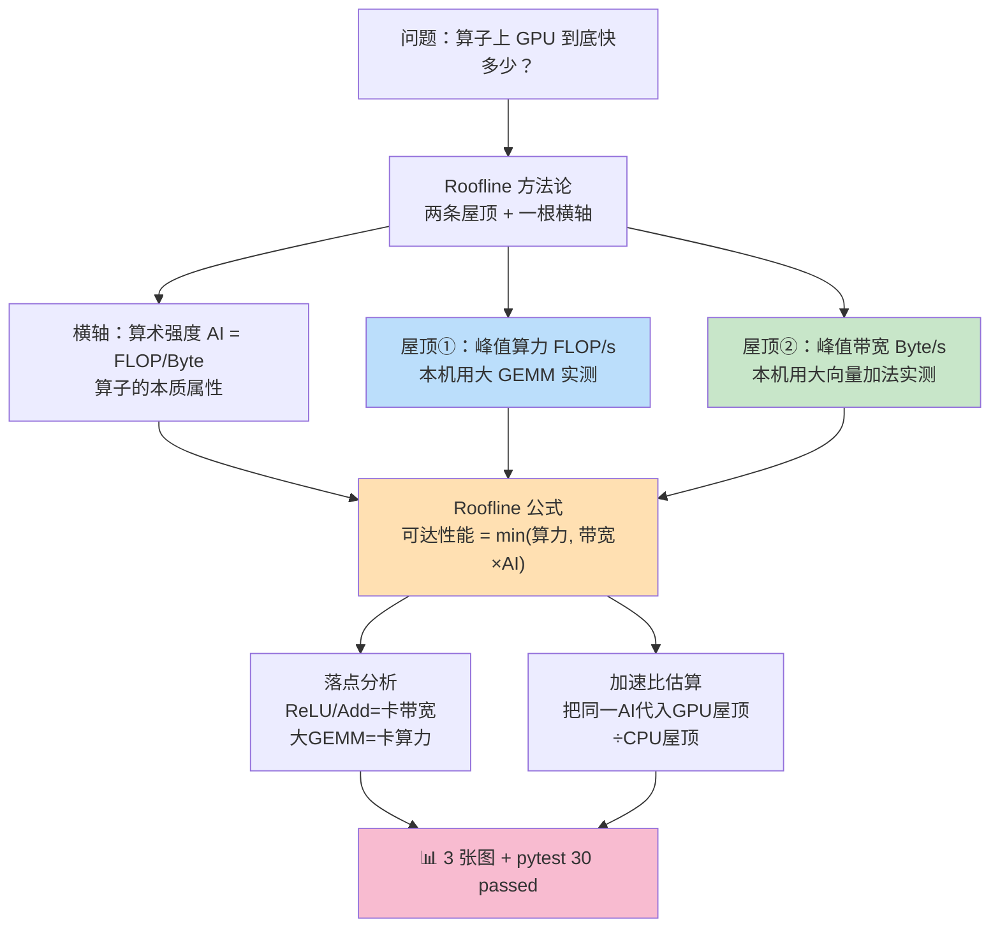
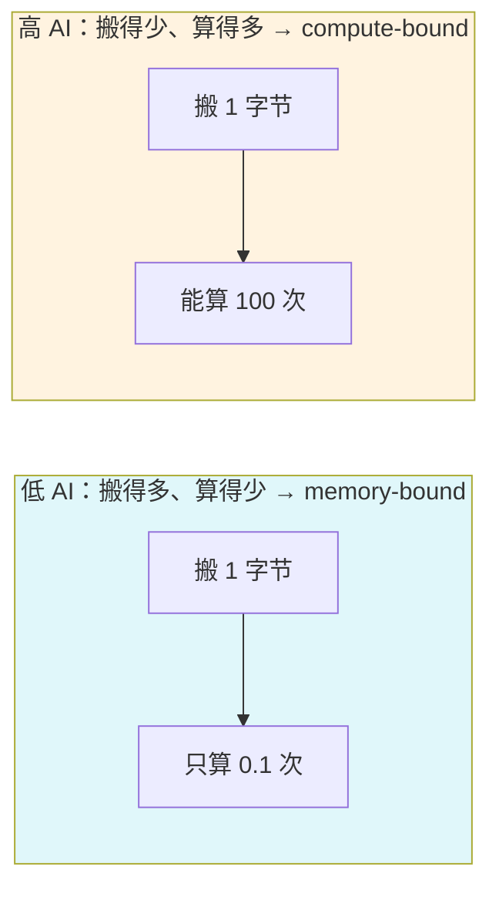
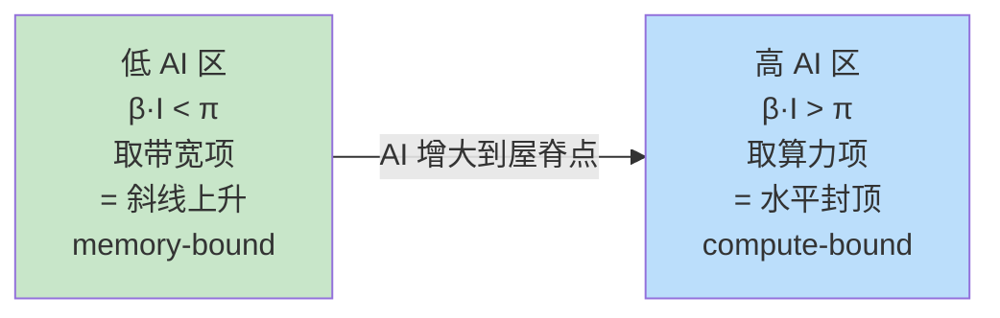
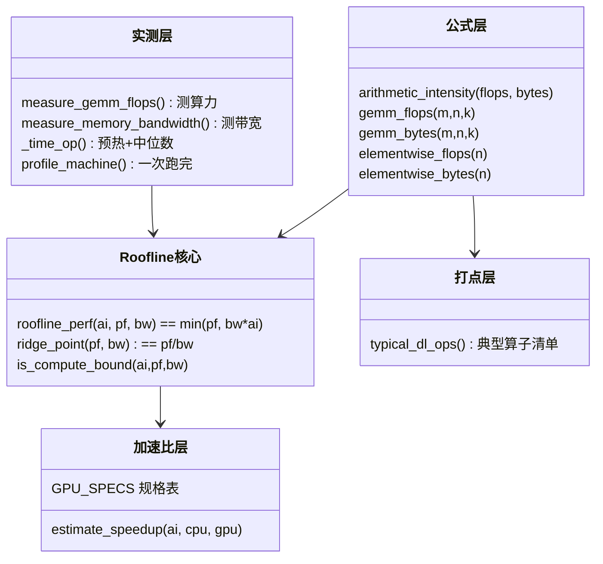

# 项目 01 · DL 算子 GPU vs CPU 加速比 + Roofline 屋顶线模型 🚀

> 配套书籍：*GPU-Accelerated Deep Learning*（Mangrulkar & Chavan, APress 2025）第 1–2 章「深度学习与 GPU 加速导论 / GPU 架构、优化与部署」。
>
> **一句话**：本项目在**没有 GPU 的本机 CPU 上**，用**和真实 GPU 完全一致的方法**实测两条硬件上限（峰值算力、峰值带宽），把它们画成 Roofline 屋顶线；再用**解析模型**回答那个每个 AI 工程师都要会的问题——「这个算子搬到 A100/H100 上，到底能快多少倍？为什么大矩阵乘快 200 倍、而 ReLU 只快 50 倍？」
>
> **全程离线**：不联网、不下模型、不需要 key、不需要 CUDA。`python -m pytest -q` 与 `python run_demo.py` 开箱即跑。

---

## 🗺️ 本项目地图



**主线逻辑**：算子有个本质属性叫「算术强度 AI」→ 硬件有两条屋顶（算力、带宽）→ 把 AI 代进 `min(算力, 带宽×AI)` 就知道这个算子在这块硬件上的性能天花板 → CPU 天花板和 GPU 天花板一比，就是加速比 → 加速比是大是小，**完全取决于算子落在哪条屋顶下面**。

---

## 📦 目录结构

```
01_gpu_speedup_roofline/
├── README.md                    ← 你正在读（极详讲义）
├── roofline.py                  ← 核心库：公式 + 实测 + 加速比估算
├── run_demo.py                  ← 一键演示：实测 + 出 3 张图
├── requirements.txt             ← 依赖（本机已装）
├── tests/
│   └── test_roofline.py         ← 30 个单元测试（公式/边界/实测健全性）
├── roofline_cpu.png             ← [产物] 本机实测 Roofline + 算子打点
├── speedup_bars.png             ← [产物] 各算子在不同 GPU 的加速比柱状图
└── roofline_gpu_compare.png     ← [产物] CPU vs 三块 GPU 屋顶线对比
```

---

## 🚀 如何运行（30 秒上手）

```bash
# 1. 进入项目目录
cd C:/Users/jianm/Desktop/llm-action/book-gpu-accelerated-dl/projects/01_gpu_speedup_roofline

# 2. 跑测试（必须全绿）
python -m pytest -q
#  → 30 passed in 0.3s

# 3. 跑演示（实测本机屋顶 + 出 3 张 PNG）
python run_demo.py
#  → 打印本机实测算力/带宽/屋脊点 + 算子落点表 + 加速比表
#  → 生成 roofline_cpu.png / speedup_bars.png / roofline_gpu_compare.png

# 4.（可选）直接看本机屋顶
python roofline.py
```

**本机实测样例输出**（Python 3.13 + numpy 2.3 + 某笔记本 CPU，你的数字会不同）：

```
[1/3] 正在实测本机屋顶（大 GEMM 测算力 + 大向量加法测带宽）...
      实测峰值算力 :    775.0 GFLOP/s  (来自 GEMM 2048x2048, AI=341, compute-bound)
      实测峰值带宽 :     28.9 GB/s      (来自 Add n=16777216, AI=0.083, memory-bound)
      本机屋脊点   :     26.4 FLOP/Byte  (AI 高于它=卡算力，低于它=卡带宽)

[2/3] 典型 DL 算子落点分析（本机）:
      算子               AI(FLOP/Byte)        瓶颈     可达(GFLOP/s)
      ReLU (1M)                  0.125      memory             3.6
      Add (1M)                   0.083      memory             2.4
      LayerNorm (1M)             0.625      memory            18.1
      GEMM 512                  85.333     compute           775.0
      GEMM 4096                682.667     compute           775.0
      Attn QK^T                 28.444     compute           775.0

[3/3] 若搬到 GPU 的解析加速比（TF32 算力 / 实测 CPU）:
      算子                A100-40GB      H100-SXM      RTX-4090
      ReLU (1M)                 54x         116x          35x
      Add (1M)                  54x         116x          35x
      LayerNorm (1M)            54x         116x          35x
      GEMM 512                 174x         375x         108x
      GEMM 4096                205x         649x         108x
      Attn QK^T                 57x         123x          37x
```

看这张表就懂了 Roofline 的全部精髓：**同样一块 H100，加速 ReLU 只有 116x，加速大 GEMM 却有 649x**。差别 5 倍多，纯粹因为 ReLU 卡带宽、GEMM 卡算力，而 GPU 相对 CPU 的算力优势远大于带宽优势。下面我们把这件事从第一性原理讲透。

---

## 🔬 第一性原理：任何计算都逃不出「算」和「搬」两件事

在讲公式之前，先建立最底层的世界观。一段代码在硬件上跑，时间花在两个地方：

1. **算（compute）**：算术逻辑单元（ALU / FMA / Tensor Core）做浮点运算，速率上限叫**峰值算力**（peak FLOP/s）。
2. **搬（memory）**：把数据从内存搬进寄存器、算完再搬回去，速率上限叫**峰值带宽**（peak Byte/s）。

这两件事在硬件上是**并行**的（一边搬一边算）。所以一段程序的耗时不是「算的时间 + 搬的时间」，而是 **`max(算的时间, 搬的时间)`** —— 被慢的那一头卡住。

- 如果「算」慢 → **compute-bound（算力受限）**：ALU 满载，内存还很闲。
- 如果「搬」慢 → **memory-bound（访存受限）**：内存总线满载，ALU 在干等数据。

> 🔬 **这就是 Roofline 的全部出发点**。Roofline 不是什么高深理论，它只是把「一段程序到底卡在算还是卡在搬」这件事，画成了一张一眼能看懂的图。理解了这句话，后面所有公式都是它的自然推论。

那怎么判断一个算子是卡算还是卡搬？答案是看它的「算术强度」。

---

## 📐 核心概念一：算术强度 Arithmetic Intensity（AI）

### 是什么

> **算术强度 AI = 浮点运算次数 / 搬运字节数（FLOP / Byte）。**

直觉：**每从内存搬 1 个字节，能顺带做多少次浮点运算。** 它是算子的**本质属性**，只跟算法有关，跟硬件无关。



### 为什么它决定一切

因为 AI 直接告诉你「算和搬的比例」。回到上一节：

- AI 很小 → 相对于要搬的数据，没多少算要做 → 内存跟不上 → **memory-bound**。
- AI 很大 → 每个字节能榨出很多算 → 内存搬得慢也没关系，反正算得更慢 → **compute-bound**。

### 怎么算（本项目 `roofline.py` 的实现）

**GEMM 通用矩阵乘 `C[m,n] = A[m,k] · B[k,n]`：**

```python
def gemm_flops(m, n, k):
    return 2.0 * m * n * k          # 输出 m*n 个元素，每个是长 k 的点积 ≈ 2k FLOP

def gemm_bytes(m, n, k, dtype_bytes=4):
    return (m*k + k*n + m*n) * dtype_bytes   # 读A + 读B + 写C
```

- **逐行讲**：`2*m*n*k`——输出有 `m*n` 个元素，每个元素是两个长度 `k` 的向量点积，点积要 `k` 次乘 + `k` 次加 ≈ `2k` FLOP，所以总量 `2·m·n·k`。工业界惯例把「一次乘加 MAC」记 2 FLOP。
- 字节数：理想情况下 A、B 各读一遍、C 写一遍，就是 `(mk+kn+mn)` 个元素乘每元素字节数（fp32=4）。

**方阵 GEMM 的 AI 有个漂亮结论**（测试 `test_gemm_ai_grows_linearly_with_n` 验证过）：

$$
\text{AI}_{\text{GEMM}}(n) = \frac{2n^3}{3n^2 \cdot 4} = \frac{n}{6} \quad (\text{FLOP/Byte, fp32})
$$

**AI 随边长 `n` 线性增长！** 矩阵越大越 compute-bound。这就是为什么大模型都想把计算凑成大 GEMM——大 GEMM 才能喂饱 GPU 的算力。

**逐元素算子 `ReLU` / `Add`：**

```python
def elementwise_flops(n, ops_per_elem=1.0):
    return n * ops_per_elem                     # ReLU: 1 op/elem

def elementwise_bytes(n, n_read=1, n_write=1, dtype_bytes=4):
    return (n_read + n_write) * n * dtype_bytes # ReLU: 读x+写y = 2*n*4
```

ReLU 的 AI = `n / (2·n·4) = 1/8 = 0.125` FLOP/Byte，**是个和 `n` 无关的小常数**。

> 🔬 **关键洞察**：逐元素算子的 AI 永远是个很小的常数（0.1 量级），无论张量多大都改变不了它 memory-bound 的命运。**这正是「算子融合 kernel fusion」如此重要的根本原因**——把 `LayerNorm → Linear → GELU` 融成一个 kernel，中间结果不落回显存，等效于把多个低 AI 算子的字节流量合并，AI 立刻上去了。FlashAttention 的本质也是如此：不落回巨大的注意力矩阵。

> 💡 **面试高频**：「为什么 element-wise 算子在 GPU 上加速比不高？」——因为它 memory-bound，加速比≈带宽比，而 GPU 相对 CPU 的带宽优势远小于算力优势。「怎么优化？」——kernel fusion 提高有效 AI，把它从带宽斜坡往算力屋顶推。

---

## 📐 核心概念二：Roofline 屋顶线公式

### 公式（一行就是全部）

> **可达性能 = min( 峰值算力,  峰值带宽 × 算术强度 )**
>
> $$\text{Attainable FLOP/s} = \min\big(\underbrace{\pi}_{\text{算力屋顶}},\ \underbrace{\beta \cdot I}_{\text{带宽斜坡}}\big)$$
>
> 其中 π=峰值算力(FLOP/s)，β=峰值带宽(Byte/s)，I=算术强度(FLOP/Byte)。

出处：Williams, Waterman, Patterson, *"Roofline: An Insightful Visual Performance Model for Multicore Architectures"*, CACM 2009——被引上万次的经典。

```python
def roofline_perf(ai, peak_flops, peak_bw):
    return min(peak_flops, peak_bw * ai)   # 就这一行
```

### 逐点讲这个 `min` 为什么成立

- **带宽项 `β·I`**：如果你 1 秒能搬 `β` 字节，而每字节能做 `I` 次运算，那 1 秒最多做 `β·I` 次运算。这是**内存喂数据的速率上限**换算成的算力。
- **算力项 `π`**：ALU 本身 1 秒最多做 `π` 次运算，这是**硬上限**。
- 两者取 `min`：你既受制于「内存喂多快」，又受制于「ALU 算多快」，实际能达到的是两者里更小的那个。

画出来就是一条「先斜后平」的折线（见 `roofline_cpu.png`）：



- **斜坡段（左）**：性能随 AI 线性上升，斜率就是带宽 β。此处「搬得越多算得越多」，但一直在等内存。
- **水平段（右）**：性能被算力 π 封顶，AI 再大也没用，ALU 已打满。

（测试 `test_roofline_memory_bound_is_linear_in_ai` / `test_roofline_compute_bound_is_flat` 分别验证了这两段的斜率与平坦性。）

### 屋脊点 Ridge Point：两段的分界线

> **屋脊点 AI\* = 峰值算力 / 峰值带宽 = π / β。**

```python
def ridge_point(peak_flops, peak_bw):
    return peak_flops / peak_bw
```

在屋脊点处，`β·AI* = π`，两条屋顶正好相交（测试 `test_ridge_point_is_crossover`）。它的意义：

- **AI < AI\*** → 算子在斜坡上 → **memory-bound**。
- **AI > AI\*** → 算子在水平段下 → **compute-bound**。
- **AI\* 越大 → 这块硬件越难喂饱**。它的算力很猛但带宽跟不上，你得拿 AI 很高的算子（大 GEMM）才能打满算力。

> 💡 **面试高频**：「什么是内存墙 memory wall？」——过去十年 GPU 算力涨了几十倍，带宽只涨了几倍，导致屋脊点 AI\* 越来越高。A100 的 fp32 屋脊点约 12.5，而 H100 的 TF32 屋脊点高达约 147（测试 `test_gpu_ridge_point_high_for_h100` 验证 H100 的 TF32 屋脊点显著高于 fp32）。这意味着**越新的卡，越多算子会掉到 memory-bound**，越依赖 fusion / 低精度 / 大 batch 来提 AI。

---

## 🧪 核心概念三：怎么在没有 GPU 的机器上「实测」两条屋顶？

这是本项目最硬核、也最实用的部分。**Roofline 的方法论在 CPU 和 GPU 上一模一样**，我们就在 CPU 上把它完整跑通。

### 测峰值算力：跑一个大 GEMM

```python
def measure_gemm_flops(n=2048, repeats=5, dtype=np.float32):
    a = np.random.rand(n, n).astype(dtype)
    b = np.random.rand(n, n).astype(dtype)
    def op():
        return a @ b                 # numpy @ 底层调 OpenBLAS/MKL，多线程+SIMD+分块
    sec = _time_op(op, repeats)      # 预热 + 取中位数
    flops = gemm_flops(n, n, n)      # 2*n^3
    return BenchResult(..., achieved_flops=flops/sec, ...)
```

**为什么用大 GEMM 测算力？**（这是方法论精髓，务必理解）

- 方阵 GEMM 的 AI = `n/6`，`n=2048` 时 AI≈341，**远超 CPU 屋脊点（约 26）→ 铁定 compute-bound**。既然 compute-bound，那计时算出的 `FLOP/耗时` 就是**算力屋顶**，而不是被带宽拖住的假值。这就是「拿一个高 AI 算子去顶到水平段，读出水平段的高度」。
- `a @ b` 底层是高度优化的 BLAS（OpenBLAS/MKL），做了多线程、SIMD 向量化、cache 分块（tiling），是 CPU 上极少数能真正打满算力的算子——和 GPU 上用 cuBLAS 测算力是同一个道理。

### 测峰值带宽：跑一个超大向量加法

```python
def measure_memory_bandwidth(n=1<<24, repeats=5, dtype=np.float32):
    x = np.random.rand(n).astype(dtype)
    y = np.random.rand(n).astype(dtype)
    z = np.empty_like(x)             # 预分配输出，避免把分配开销掺进计时
    def op_add():
        np.add(x, y, out=z)          # z=x+y：读x + 读y + 写z = 3 股 DRAM 流量
        return z
    sec = _time_op(op_add, repeats)
    bytes_moved = 3 * n * 4          # 3 个数组 × n 元素 × 4 字节（STREAM Add 口径）
    return BenchResult(..., achieved_bw=bytes_moved/sec, ...)
```

**为什么用逐元素加法测带宽？**

- 逐元素加法 AI = `1/(3·4)` ≈ 0.083，**远低于屋脊点 → 铁定 memory-bound**。此时计时算出的 `Byte/耗时` 就是**带宽屋顶**（内存喂数据的速率上限），而不是被算力限制的假值。这是「拿一个低 AI 算子去顶到斜坡最左，读出斜坡的斜率」。
- 字节口径 `3n`：读 x、读 y、写 z——这是内存基准测试界经典的 **STREAM Add** 口径，字节数和代码一一对应，最干净不含糊。

> ⚠️ **大坑①：数组必须远大于 cache，否则测的是缓存带宽（虚高 5~10 倍）。** `n = 2^24` ≈ 1678 万元素 ≈ 64 MB/数组，远超 CPU 的 L3 cache（几十 MB），保证真的在打主存 DRAM。如果你把 `n` 设小到能塞进 L2/L3，测出来的「带宽」会高得离谱，因为根本没碰主存——这是新手做带宽测试最常翻的车。

> ⚠️ **大坑②：一定要预热 + 取中位数。** 第一次调用会触发内存分配、cache 冷启动、numpy 内部线程池初始化，耗时虚高。`_time_op` 先跑一次丢弃（warm-up），再跑多次取**中位数**（比最小值更稳健，抗 OS 调度抖动）。

```python
def _time_op(op, repeats=5):
    op()                              # warm-up，丢弃
    samples = []
    for _ in range(repeats):
        t0 = time.perf_counter()      # 高精度计时器
        op()
        samples.append(time.perf_counter() - t0)
    samples.sort()
    return samples[len(samples)//2]   # 中位数
```

> 💡 **实战**：这套「大 GEMM 测算力 + STREAM 测带宽 + 预热取中位数」的流程，就是 NVIDIA `nsight compute`、`cutlass profiler`、以及各种 MLPerf 基准测试的底层做法。你在本机跑通了它，换到 GPU 上（把 `numpy` 换成 `cupy`/`torch.cuda`、把计时换成 `torch.cuda.Event`）方法完全不变。

---

## 🎯 核心概念四：GPU vs CPU 加速比估算（不需要真 GPU）

有了两条屋顶，估算加速比就是**把同一个算子的 AI，分别代进 CPU 和 GPU 的 Roofline，取比值**：

```python
def estimate_speedup(ai, cpu_pf, cpu_bw, gpu_pf, gpu_bw, op_name="op"):
    cpu_perf = roofline_perf(ai, cpu_pf, cpu_bw)   # min(cpu算力, cpu带宽*ai)
    gpu_perf = roofline_perf(ai, gpu_pf, gpu_bw)   # min(gpu算力, gpu带宽*ai)
    speedup = gpu_perf / cpu_perf
    ...
```

**这个简单的比值抓住了全部精髓**，因为它自动按算子类型选对了「该比什么」：

| 算子类型 | 落在哪条屋顶 | 加速比约等于 | 为什么 |
|---|---|---|---|
| 大 GEMM（高 AI） | 两边都在算力段 | **算力比** `π_gpu/π_cpu` | compute-bound，比的是 ALU 峰值 |
| ReLU/Add（低 AI） | 两边都在带宽段 | **带宽比** `β_gpu/β_cpu` | memory-bound，比的是内存带宽 |

（测试 `test_speedup_compute_bound_uses_flops_ratio` 与 `test_speedup_memory_bound_uses_bw_ratio` 分别验证了这两个方向。）

**而 GPU 相对 CPU 的算力比 ≫ 带宽比！** 用本项目 GPU 规格表算一下（相对本机实测 CPU ~775 GFLOP/s / ~29 GB/s）：

| 目标 GPU | 算力(TF32) | 算力比≈ | 带宽 | 带宽比≈ |
|---|---|---|---|---|
| A100-40GB | 156 TFLOP/s | ~200x | 1555 GB/s | ~54x |
| H100-SXM | 494 TFLOP/s | ~640x | 3350 GB/s | ~116x |
| RTX-4090 | 82.6 TFLOP/s | ~108x | 1008 GB/s | ~35x |

**所以在 H100 上，大 GEMM 加速 ~640x，而 ReLU 只加速 ~116x。** 差距 5 倍多，纯由算子的 AI 决定。这就是本项目 `speedup_bars.png` 那张柱状图讲的故事，也是 Roofline 模型最有用的一个预测。

> 🔬 **第一性原理小结**：加速比不是一个「硬件属性」，而是「硬件 × 算子」的联合属性。同一块卡，加速不同算子快慢差好几倍。**评估「上不上 GPU / 上哪块卡」时，必须先看你的算子是 compute-bound 还是 memory-bound**——这决定了你该盯着算力峰值还是带宽峰值去选卡。一个全是小 element-wise 算子的 workload，买 H100 是浪费钱（它的算力优势用不上，只吃到带宽优势）。

> ⚠️ **坑③：这是理论上限，实测打不满。** 解析加速比假设两边都跑到 Roofline 屋顶，但真实世界：kernel launch 开销、访存不连续、warp divergence、CPU-GPU 之间 PCIe 数据搬运（小算子上 GPU 甚至因为搬数据反而更慢！）都会让实测加速比低于理论值（常打 30%~70%）。**本项目给的是「天花板」，用来做上卡前的可行性排序，而不是承诺。**

---

## 📊 三张产出图详解

运行 `python run_demo.py` 会生成：

### 1. `roofline_cpu.png` — 本机实测 Roofline + 算子打点

- 红色折线：本机实测屋顶线（先斜后平）。
- 蓝色虚线：算力屋顶（水平段高度）。绿色点线：屋脊点 AI\*。
- **青色点**（ReLU/Add/LayerNorm）落在**斜坡段** → memory-bound。
- **橙色点**（GEMM 512/4096、Attn QK^T）落在**水平段** → compute-bound。
- 一眼看清：哪些算子卡带宽、哪些卡算力。

### 2. `speedup_bars.png` — 各算子在不同 GPU 的加速比

- 每组柱子是一个算子，颜色区分 A100/H100/4090。
- 对数纵轴。**你会看到大 GEMM 的柱子远高于 ReLU/Add** —— 核心洞察可视化。

### 3. `roofline_gpu_compare.png` — CPU vs 三块 GPU 屋顶线对比

- 把本机 CPU 和三块 GPU 的屋顶线叠在一起。
- **GPU 的水平段（算力）高出 CPU 几十倍，斜坡段（带宽）只高几倍** —— 屋脊点右移，直观呈现「内存墙」。

---

## 🧬 代码全景：`roofline.py` 模块结构



关键数据类：

- `BenchResult`：一次实测的结果（耗时、FLOP、Byte，自动算出 `gflops`/`gbps`/`arithmetic_intensity`）。
- `MachineProfile`：本机画像（`peak_flops`/`peak_bw`/`ridge`）——两条屋顶的容器。
- `SpeedupEstimate`：一次加速比估算（含 CPU/GPU 各自 bound 类型）。
- `OpPoint`：一个待打点算子（名字 + FLOP + Byte → 自动算 AI）。

---

## ✅ 测试说明（`tests/test_roofline.py`，30 passed）

测试分 8 组，覆盖「公式正确 + 边界行为 + 方法论自洽 + 实测健全」：

| 组 | 测什么 | 代表用例 |
|---|---|---|
| 1 | 算术强度 AI | 零字节返回 0；AI==flops/bytes |
| 2 | GEMM/逐元素 FLOP·Byte | `2mnk`；fp16 字节是 fp32 一半；方阵 AI=n/6 |
| 3 | Roofline `min` 语义 | 低 AI 取带宽、高 AI 取算力；斜坡线性、平段恒定 |
| 4 | 屋脊点 & bound 判定 | AI\*=π/β；交点两屋顶相等；边界 `>=` |
| 5 | 加速比方向性 | compute-bound→算力比；memory-bound→带宽比 |
| 6 | GPU 规格表 | 全为正；H100 TF32 屋脊点 > fp32 屋脊点 |
| 7 | 典型算子清单 | AI 谱系横跨 memory→compute |
| 8 | **本机实测健全性** | 算力/带宽为正且落在合理物理量级；大 GEMM 确实 compute-bound、Add 确实 memory-bound |

> 💡 第 8 组尤其关键——它验证了**方法论自洽性**：`test_gemm_is_compute_bound_bandwidth_is_memory_bound` 断言「用来测算力的大 GEMM 的 AI 确实高于屋脊点、用来测带宽的 Add 的 AI 确实低于屋脊点」。如果这条挂了，说明你的测量方法用错了算子，测出来的屋顶是假的。

运行结果：

```
$ python -m pytest -q
..............................                                           [100%]
30 passed in 0.3s
```

---

## 🧯 常见坑总结（⚠️ 血泪清单）

| # | 坑 | 后果 | 解法 |
|---|---|---|---|
| 1 | 带宽测试数组塞进了 cache | 带宽虚高 5~10 倍 | 数组必须 ≫ L3，用 `n=2^24`(64MB) |
| 2 | 没预热 / 用最小值计时 | 首次抖动污染、乐观偏差 | 预热丢弃 + 取中位数 |
| 3 | 用低 AI 算子测算力（或反之） | 测出的是错误的那条屋顶 | 算力用大 GEMM、带宽用逐元素 |
| 4 | 把分配开销掺进计时 | 带宽偏低 | 输出数组 `np.empty_like` 预分配 |
| 5 | 以为加速比是硬件属性 | 选卡决策错误 | 加速比 = 硬件 × 算子，先分清 bound |
| 6 | 拿理论加速比当承诺 | 上卡后大失所望 | 理论是天花板，实测打 30~70% |
| 7 | 小算子无脑上 GPU | PCIe 搬数据反而更慢 | 小/低 AI 算子留 CPU 或做 fusion |
| 8 | Windows 控制台 GBK 编码 | emoji 打印 `UnicodeEncodeError` | `sys.stdout.reconfigure(encoding="utf-8")` |
| 9 | matplotlib 中文乱码/方框 | 图不可读 | `rcParams["font.sans-serif"]=["Microsoft YaHei","SimHei"]` + `axes.unicode_minus=False` |

---

## 💡 面试高频问答速查

1. **Roofline 模型是什么？一句话。**
   把「一段程序卡在算(compute)还是搬(memory)」画成一张图：可达性能 = min(算力峰值, 带宽×算术强度)。

2. **算术强度 AI 怎么定义？为什么重要？**
   AI = FLOP/Byte，每搬一字节能做多少运算。它决定算子是 compute-bound 还是 memory-bound，是 Roofline 的横轴、算子的本质属性。

3. **为什么大矩阵乘上 GPU 加速惊人、ReLU 加速一般？**
   GEMM 高 AI，compute-bound，加速比≈算力比（GPU 高几十倍）；ReLU 低 AI，memory-bound，加速比≈带宽比（GPU 只高几倍）。

4. **什么是屋脊点？内存墙？**
   屋脊点 AI\*=算力/带宽，是斜坡与平段的分界。GPU 算力涨得比带宽快 → AI\* 越来越高 → 越来越多算子掉到 memory-bound，这就是内存墙。

5. **element-wise 算子怎么优化？**
   kernel fusion 把多个逐元素算子合并，省掉中间结果读写，提高有效 AI，把算子从带宽斜坡推向算力屋顶。FlashAttention 同理（不落回注意力矩阵）。

6. **怎么实测一块硬件的算力和带宽？**
   算力：跑高 AI 的大 GEMM（顶到算力段），FLOP/耗时。带宽：跑低 AI 的大 STREAM（顶到带宽段，数组要 ≫ cache），Byte/耗时。都要预热 + 取中位数。

7. **为什么小算子上 GPU 可能更慢？**
   kernel launch 开销 + CPU↔GPU 的 PCIe 数据搬运，对小/低 AI 算子来说这些固定开销超过了计算收益。

8. **低精度（fp16/bf16/TF32）为什么快？从 Roofline 角度。**
   一是算力峰值更高（Tensor Core），抬高算力屋顶；二是每元素字节减半，同样 FLOP 下字节减半 → AI 翻倍 → 算子向右移，更容易进 compute-bound 吃满算力。

---

## 📌 小结

- **一个横轴**：算术强度 AI = FLOP/Byte，算子的本质属性，决定卡算还是卡搬。
- **两条屋顶**：峰值算力（水平段）、峰值带宽（斜坡段）。本项目在 CPU 上用「大 GEMM 测算力 + STREAM 测带宽 + 预热取中位数」实测出来——**方法与真实 GPU 完全一致**。
- **一个公式**：可达性能 = `min(算力, 带宽×AI)`。屋脊点 AI\* = 算力/带宽 是分界。
- **一个结论**：加速比 = 硬件 × 算子。大 GEMM(compute-bound) 加速≈算力比、element-wise(memory-bound) 加速≈带宽比，而 GPU 算力优势 ≫ 带宽优势 → **不同算子加速差好几倍**。
- **产出**：`roofline.py`(核心) + `run_demo.py`(3 张图) + `tests/`(30 passed)，全离线可跑。

---

## 🔗 延伸

- **原始论文**：S. Williams et al., *"Roofline: An Insightful Visual Performance Model..."*, Communications of the ACM, 2009.
- **官方工具**：NVIDIA Nsight Compute 内置 Roofline 分析；Intel Advisor 也有 Roofline 视图。
- **进阶：Hierarchical Roofline**：把 L1/L2/HBM 各层带宽都画进去（多条斜坡），更精细地定位瓶颈在哪一级 cache。
- **动手扩展本项目**（不改核心，追加即可）：
  1. 把 `measure_gemm_flops` 里的 `numpy` 换成 `torch`（CPU），对比两套 BLAS 的实测算力。
  2. 加一个 fp16/bf16 版本的 GEMM 实测，观察 AI 翻倍后落点右移。
  3. 把典型算子换成你真实模型里的算子（用 `torch.profiler` 抓 FLOP/Byte），画出你自己模型的 Roofline。
  4. 实现 kernel fusion 对比：`relu(x)+relu(y)` 分开做 vs 融合做，实测带宽流量差异。
- **配套章节**：见 `../../book-guide/01_深度学习与GPU加速导论.md`、`../../book-guide/02_GPU架构_优化与部署.md`。
- **姊妹项目**：`../02_multigpu_scaling_efficiency/`（多 GPU 扩展效率，把单卡 Roofline 推广到多卡通信瓶颈）。

---

> 📝 **给读者**：Roofline 是性能优化的「地图」。拿到任何一个慢算子，第一步永远是——**算它的 AI，找它的 bound**。是 memory-bound 就去做 fusion / 提精度 / 增大 tile；是 compute-bound 就去用 Tensor Core / 低精度 / 更大 batch。先看图，再动手，别瞎调。
