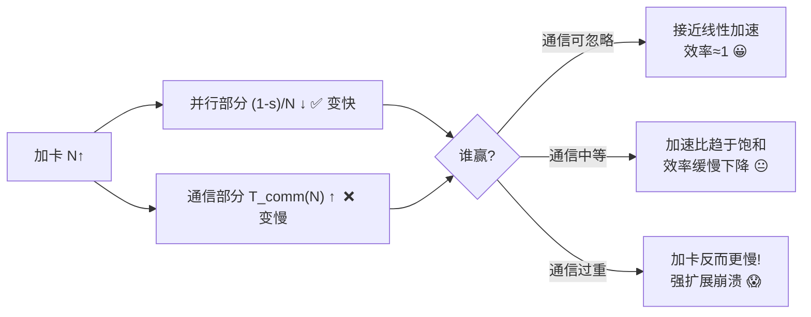
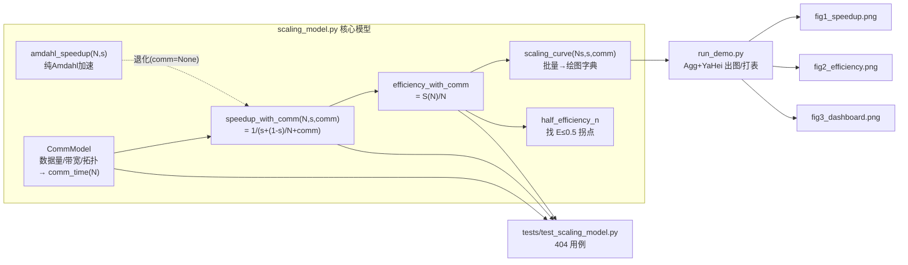
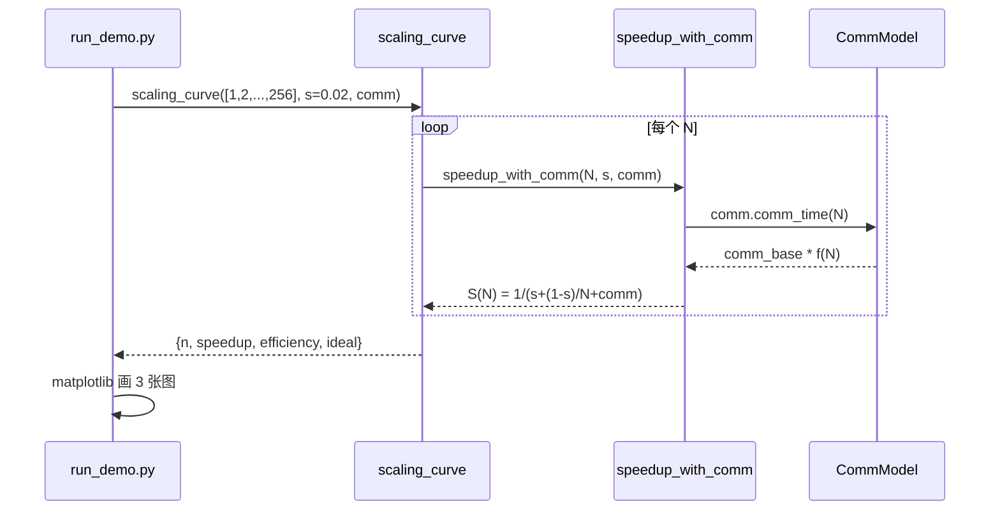

# 🚀 多 GPU 扩展效率模型(Multi-GPU Scaling Efficiency Model)

> 《GPU-Accelerated Deep Learning》配套实战项目 · 02
> **主题**:用 **Amdahl 定律 + 通信开销** 定量建模「N 张卡训练同一个模型能快多少」,
> 揭示**通信占比如何限制强扩展(strong scaling)**。
> **本机可跑**:纯 `numpy` / `matplotlib`,CPU 即可,不联网、不下模型、不需 key。

---

## 📑 目录

- [0. 这个项目在解决什么问题?](#0-这个项目在解决什么问题)
- [1. 一分钟跑起来](#1-一分钟跑起来)
- [2. 核心直觉:为什么加卡不等于加速](#2-核心直觉为什么加卡不等于加速)
- [3. 第一性原理:三个公式](#3-第一性原理三个公式)
- [4. 系统结构与数据流(mermaid)](#4-系统结构与数据流mermaid)
- [5. 代码逐行讲解 · scaling_model.py](#5-代码逐行讲解--scaling_modelpy)
- [6. 可视化 · run_demo.py 出的三张图](#6-可视化--run_demopy-出的三张图)
- [7. 测试怎么设计的 · tests/](#7-测试怎么设计的--tests)
- [8. 参数怎么调 · 场景手册](#8-参数怎么调--场景手册)
- [9. 💡 面试高频 & 实战要点](#9--面试高频--实战要点)
- [10. ⚠️ 常见坑](#10-️-常见坑)
- [11. 🔬 第一性原理:效率 ∈ (0,1] 的证明](#11--第一性原理效率--01-的证明)
- [12. 从模型到真实测量:对接 PyTorch DDP](#12-从模型到真实测量对接-pytorch-ddp)
- [📌 小结](#-小结)
- [🔗 延伸阅读](#-延伸阅读)

---

## 0. 这个项目在解决什么问题?

你手上有一个深度学习训练任务,单卡要跑 100 小时。老板问你:

> 「我买 8 张卡,是不是就能 12.5 小时跑完?买 64 张呢?」

**直觉上**答案是「除以卡数」,但**现实里几乎从来不是**。真实世界里:

- 有一部分代码**天生串行**(数据预处理的某些步骤、参数更新的规约、日志/checkpoint……),
  它**拿再多卡也快不了**——这是 **Amdahl 定律(Amdahl's Law)**。
- 多卡之间每一步都要**同步梯度(all-reduce)**,这份**通信开销**会随卡数增长,
  卡越多,通信越贵,最终甚至**加卡反而更慢**——这是 **通信墙(communication wall)**。

这个项目就是把上面两件事**写成可计算的公式**,做成一个**手算/绘图工具**,
让你在真的去买卡、真的去写分布式代码**之前**,先回答:

| 问题 | 本项目给出的量 |
|---|---|
| N 卡比单卡快几倍? | **加速比 Speedup** `S(N)` |
| 这 N 张卡利用率多高? | **扩展效率 Efficiency** `E(N)=S(N)/N ∈ (0,1]` |
| 加到多少卡就"不值"了? | **半效率卡数** `half_efficiency_n`(E 跌破 0.5 的拐点) |
| 理论上最多快几倍? | **Amdahl 天花板** `1/s` |

> 这是 AI-Infra / HPC 岗位**容量规划(capacity planning)**的基本功,
> 也是面试里"聊分布式训练"绕不开的定量话题。

---

## 1. 一分钟跑起来

```bash
# 进入项目目录
cd book-gpu-accelerated-dl/projects/02_multigpu_scaling_efficiency

# (可选)装依赖 —— numpy / matplotlib / pytest,本机通常已有
pip install -r requirements.txt

# 跑测试(必过)
python -m pytest -q
# → 404 passed in 0.24s

# 跑演示:打印对照表 + 在 figures/ 下出 3 张图
python run_demo.py

# 只看核心模型的自测小表
python scaling_model.py
```

跑完 `run_demo.py` 会在 `figures/` 下得到:

| 文件 | 内容 |
|---|---|
| `fig1_speedup.png` | 卡数 vs **加速比**,含理想线性线 + Amdahl 天花板 |
| `fig2_efficiency.png` | 卡数 vs **扩展效率**,含半效率线 E=0.5 |
| `fig3_dashboard.png` | 上面两张并排的**仪表盘大图** |

文件树:

```
02_multigpu_scaling_efficiency/
├── README.md            # 你正在读的这份(极详)
├── scaling_model.py     # 核心模型:Amdahl + 通信开销
├── run_demo.py          # 出图 + 打表(Agg 后端 + 中文字体)
├── requirements.txt     # 依赖
├── figures/             # run_demo 生成的 PNG
│   ├── fig1_speedup.png
│   ├── fig2_efficiency.png
│   └── fig3_dashboard.png
└── tests/
    └── test_scaling_model.py   # 404 个 pytest 用例
```

---

## 2. 核心直觉:为什么加卡不等于加速

先建立**画面感**,再上公式。把单卡跑一步的时间**归一化为 1**,拆成两块:

```
单卡一步:  |■■■■■■■■■■■■■■■■■■■■|  = 1
            └── 串行 s ──┘└─ 并行 (1-s) ─┘
```

- **串行块 s**:比如占 5%。这块**永远是 5%**,加多少卡都不变。
- **并行块 (1-s)**:比如 95%。这块**能被 N 张卡平摊**,变成 `(1-s)/N`。

用 4 卡:

```
4 卡一步:  |■■■■■□□□□□|                = s + (1-s)/4
            └串行┘└并行/4┘
```

**但是!** 多卡还要**同步梯度**,于是多出一块**通信**,而且它**随卡数变大**:

```
4 卡(含通信): |■■■■■□□□□□▓▓|          = s + (1-s)/4 + T_comm(4)
                └串行┘└并行/4┘└通信↑┘
```

卡越多,并行块 `(1-s)/N` 越小(好事),但**通信块越大**(坏事)。
两股力量拉锯,于是出现三种命运:



> **一句话本质**:**强扩展的天花板不是算力,而是串行占比 `s` 和通信占比 `comm_base`。**
> 这也是为什么 Ring-AllReduce、梯度压缩、更快的 NVLink/InfiniBand 这么重要——
> 它们都在**压低通信项**。

---

## 3. 第一性原理:三个公式

### 3.1 公式一:Amdahl 加速比(理想上界,无通信)

$$
S_{\text{Amdahl}}(N) = \frac{1}{\,s + \dfrac{1-s}{N}\,}
$$

- $N$:卡数;$s$:串行占比 $\in[0,1]$;$1-s$:并行占比。
- **推导**:总时间归一化为 1 = $s + (1-s)$。N 卡时并行块被平摊,总时间变成
  $s + \frac{1-s}{N}$;加速比 = 老时间 / 新时间 = $1 / (s + \frac{1-s}{N})$。

**天花板**:$N\to\infty$ 时 $\frac{1-s}{N}\to 0$,于是

$$
S_{\max} = \lim_{N\to\infty} S_{\text{Amdahl}}(N) = \frac{1}{s}
$$

> 💡 **震撼结论**:哪怕只有 **5% 串行**($s=0.05$),**堆无限张卡最多也只快 20 倍**。
> 这就是"降低串行占比比买卡更值钱"的数学根据。

### 3.2 公式二:通信开销(∝ 数据量 / 带宽,且随 N 增长)

把「一次通信相对一次计算」的成本记为**基准通信占比**:

$$
\text{comm\_base} = \frac{\text{message\_bytes}}{\text{bandwidth}}
$$

（数据量越大越贵、带宽越高越便宜——最朴素的第一性原理。）
通信总时间还要乘上一个**随卡数增长的因子** $f(N)$,不同 all-reduce 拓扑不同:

$$
T_{\text{comm}}(N) = \text{comm\_base}\cdot f(N),\qquad
f(N)=\begin{cases}
0 & N=1 \ (\text{单卡不通信})\\[4pt]
N & \text{linear}(\text{参数服务器,最差})\\[2pt]
\log_2 N & \text{log}(\text{树形/递归折半})\\[2pt]
\dfrac{N-1}{N} & \text{ring}(\text{Ring-AllReduce,近似常数,最好})
\end{cases}
$$

> 🔬 **为什么 Ring-AllReduce 是 $(N-1)/N$ 这么好?**
> Ring 把梯度切成 N 段,每张卡在环上传 $N-1$ 步,但每步只传 $1/N$ 的数据,
> 于是**每张卡的通信量 ≈ 常数**(与 N 几乎无关)。这就是它成为工业标准的原因。

### 3.3 公式三:含通信的真实加速比与效率

$$
\boxed{\,S(N) = \frac{1}{\,\underbrace{s}_{\text{串行}} + \underbrace{\dfrac{1-s}{N}}_{\text{并行/N}} + \underbrace{\text{comm\_base}\cdot f(N)}_{\text{通信↑}}\,}\,}
$$

$$
\boxed{\,E(N) = \frac{S(N)}{N}\in(0,1]\,}
$$

- $N=1$ 时:分母 $= s + (1-s) + 0 = 1$,故 $S(1)=1,\ E(1)=1$。✅
- 通信项 $\text{comm\_base}\cdot f(N)$ 是**反派**:它随 $N$ 增大,
  最终让分母掉头变大 ⇒ $S(N)$ **达到峰值后下降** ⇒ 强扩展崩溃。

三条曲线的定性对比:


---

## 4. 系统结构与数据流(mermaid)

模块之间的关系:



一次「算一条曲线」的调用时序:



---

## 5. 代码逐行讲解 · scaling_model.py

只挑**最核心、最容易被问**的几段。完整文件见 `scaling_model.py`。

### 5.1 纯 Amdahl 加速比

```python
def amdahl_speedup(n: int, serial_fraction: float) -> float:
    _check_n(n)                              # ① 校验:n 必须是整数且 >=1
    _check_fraction(serial_fraction, "serial_fraction")  # ② s ∈ [0,1]
    p = 1.0 - serial_fraction                # ③ 并行占比 p = 1 - s
    return 1.0 / (serial_fraction + p / n)   # ④ S(N)=1/(s + (1-s)/N)
```

- **① / ②**:防御式校验。分布式性能模型里,**非法输入(如 s=1.2、N=0)** 会让公式给出
  荒谬结果,提前 `raise` 比"静默算错"安全得多(⚠️坑见第 10 节)。
- **③**:显式写出并行占比,**可读性 > 省一行**。
- **④**:就是公式一。注意分母 `serial_fraction + p/n`:
  - `n=1` → `s + (1-s) = 1` → `S=1`(自洽);
  - `s=0` → `1/(1/n) = n`(完美线性);
  - `n→∞` → `1/s`(天花板)。

### 5.2 通信模型 CommModel(dataclass)

```python
@dataclass
class CommModel:
    message_bytes: float = 1.0e8   # 每步同步的梯度字节数
    bandwidth: float = 1.0e10      # 互联带宽(字节/单位时间)
    scaling: str = "ring"          # 通信随卡数的增长模式

    @property
    def comm_base(self) -> float:
        return self.message_bytes / self.bandwidth   # 一次通信 vs 一次计算

    def growth(self, n: int) -> float:
        if n == 1:
            return 0.0                     # ★ 单卡不需要跨卡通信
        if self.scaling == "linear":
            return float(n)                # 参数服务器:随 N 线性增长(最差)
        if self.scaling == "log":
            return float(np.log2(n))       # 树形:随 log2(N) 增长
        return (n - 1.0) / n               # ring:(N-1)/N,近似常数(最好)

    def comm_time(self, n: int) -> float:
        return self.comm_base * self.growth(n)
```

- **`@dataclass`**:自动生成 `__init__`/`__repr__`,把「数据量 / 带宽 / 拓扑」这三个**旋钮**
  打包成一个对象,传起来干净。
- **`comm_base` 用 `@property`**:它是**派生量**(数据量/带宽),不该被单独存储,
  用 property **随取随算**,避免"改了 bytes 忘了同步 base"的一致性 bug。
- **`growth(1)==0` 是全项目的枢纽**:它保证 `T(1)=1`、`S(1)=1`、`E(1)=1`,
  也是很多测试(`test_single_gpu_*`)的基石。**单卡没有"跨卡"通信,天经地义。**
- **三种拓扑**对应真实世界的三代 all-reduce 实现,增长速度 `linear > log > ring`,
  所以**相同数据量下加速比 `ring ≥ log ≥ linear`**(测试 `test_topology_ordering_ring_best`)。

### 5.3 含通信的加速比(全项目的心脏)

```python
def speedup_with_comm(n, serial_fraction, comm=None) -> float:
    _check_n(n); _check_fraction(serial_fraction, "serial_fraction")
    p = 1.0 - serial_fraction
    comp_time = serial_fraction + p / n           # 计算 = 串行 + 并行/N
    comm_t = 0.0 if comm is None else comm.comm_time(n)  # 通信(可选)
    total = comp_time + comm_t                    # 总时间(归一化)
    return 1.0 / total                            # S(N) = T(1)/T(N)
```

- **`comm=None` 退化为纯 Amdahl**:同一个函数覆盖"理想"和"现实"两种情形,
  接口最小化。`run_demo.py` 的"无通信"曲线就是靠 `comm=None` 画的。
- **`total` 恒为正**:`n≥1` ⇒ `p/n≥0`;`serial≥0`;`comm≥0`;且 `n=1` 时 `total=1`。
  所以**永远不会除零**,即使把通信设成天文数字(测试 `test_speedup_positive_even_when_comm_dominates`)。
- 这行 `1.0 / total` 就是**公式三**。**通信越大 → total 越大 → S 越小**,
  这正是"通信限制强扩展"的代码级体现。

### 5.4 半效率拐点

```python
def half_efficiency_n(serial_fraction, comm=None, n_max=100_000):
    for n in range(2, n_max + 1):
        if efficiency_with_comm(n, serial_fraction, comm) <= 0.5:
            return n            # 第一个效率跌破 50% 的卡数
    return None                 # 扩展性极好:始终 >50%
```

- **工程意义**:超过这个 N,**一半以上的钱被浪费**在串行 + 通信上。
  容量规划里常把它当"该不该再加卡"的红线。
- **返回 `None`** 表示在 `[2, n_max]` 内效率从未跌破 0.5(比如 `s=0, comm=None` 的完美情形),
  由 `test_half_efficiency_n_none_for_perfect` 守护。

---

## 6. 可视化 · run_demo.py 出的三张图

### 6.1 关键设置(离线出图 + 中文不乱码)

```python
import matplotlib
matplotlib.use("Agg")                       # ★ 无界面后端:CI/服务器/纯离线都能出图
import matplotlib.pyplot as plt
plt.rcParams["font.sans-serif"] = ["Microsoft YaHei", "SimHei"]  # 中文字体
plt.rcParams["axes.unicode_minus"] = False  # 负号正常显示(否则显示成方框)
```

> ⚠️ **顺序很重要**:`matplotlib.use("Agg")` 必须在 `import matplotlib.pyplot` **之前**,
> 否则后端可能已被锁定。详见第 10 节坑 3。

### 6.2 fig3_dashboard.png(仪表盘)

固定串行占比 `s=2%`,扫 4 种通信强度(`comm_base` = 0 / 0.01 / 0.05 / 0.20),
横轴用 **log2 卡数**(1→256):

- **左图(加速比)**:所有真实曲线都被压在灰色"理想线性 S=N"之下;
  通信越重,越早"躺平"。**重通信(红)在 8 卡后几乎不再增长**——加卡纯浪费。
- **右图(效率)**:效率从 1 单调下滑;**通信越重,越早跌破红色半效率线 E=0.5**。

真实数字(`run_demo.py` 控制台输出,`s=2%`,Amdahl 天花板 = 50):

| N | 无通信 | 轻(0.01) | 中(0.05) | 重(0.20) |
|--:|--:|--:|--:|--:|
| 8   | 7.02x / 88% | 6.61x / 83% | 5.37x / 67% | 3.15x / 39% |
| 32  | 19.75x / 62% | 16.58x / 52% | 10.09x / 32% | 4.09x / 13% |
| 128 | 36.16x / 28% | 26.61x / 21% | 12.94x / 10% | 4.42x / 3% |

**半效率卡数(E 跌破 50% 的第一个 N)**:

| 场景 | 无通信 | 轻(0.01) | 中(0.05) | 重(0.20) |
|---|--:|--:|--:|--:|
| half-efficiency N | 51 | 35 | 16 | **6** |

> 💡 **一眼读懂**:同样只有 2% 串行,通信从"轻"变"重",**能"划算"用的卡数从 35 张暴跌到 6 张**。
> 这就是"通信占比限制强扩展"最直白的证据。

---

## 7. 测试怎么设计的 · tests/

`python -m pytest -q` → **404 passed**(大量用 `@pytest.mark.parametrize` 组合爆炸)。
覆盖需求点如下:

| 需求 | 测试(节选) | 断言 |
|---|---|---|
| **通信为 0 → 线性** | `test_no_comm_zero_serial_is_linear` | `S(N)==N` 且 `E(N)==1` |
| **通信增大 → 效率降** | `test_more_comm_lowers_efficiency` | `E_low > E_mid > E_high` |
| **效率 = 加速比/N** | `test_efficiency_equals_speedup_over_n` | `E == S/N`(105 组参数) |
| **效率 ∈ (0,1]** | `test_efficiency_in_zero_one` | `0 < E <= 1`(189 组参数) |
| **边界:单卡** | `test_single_gpu_speedup_is_one` | `S(1)==1, E(1)==1` |
| **边界:全串行** | `test_fully_serial_no_speedup` | `s=1 → S(N)==1` |
| **Amdahl 天花板** | `test_amdahl_ceiling` | `N 大 → S→1/s` 但不超 |
| **拓扑排序** | `test_topology_ordering_ring_best` | `ring ≥ log ≥ linear` |
| **通信 ∝ 数据量、∝ 1/带宽** | `test_comm_time_proportional_to_bytes` 等 | 翻倍/减半关系精确成立 |
| **异常输入** | `test_invalid_*` | `N<1`/`s越界`/`带宽≤0`/`非法拓扑` 都 `raise` |

**设计哲学**:

- **性质测试 > 数值测试**。我们主要断言**关系**(单调、恒等、上下界),
  而不是硬编码一堆魔法数——这样即使调整常数,测试依然守护正确性。
- **参数化组合**把 `N × s × 拓扑` 全排列,一次覆盖上百种情形,
  把"某个角落算错"的概率压到极低。
- **浮点比较**一律用 `pytest.approx`,并给 `E<=1` 留 `1e-12` 容差(见坑 5)。

---

## 8. 参数怎么调 · 场景手册

想模拟不同硬件/模型?改这几个旋钮即可(在 `run_demo.py` 顶部或自己写脚本):

| 想模拟 | 怎么调 | 现象 |
|---|---|---|
| **更好的实现** | `SERIAL` ↓(如 0.02→0.005) | 天花板 `1/s` 抬高,曲线整体上移 |
| **更大的模型** | `message_bytes` ↑ | `comm_base` ↑,效率更早崩 |
| **换更快互联(NVLink→InfiniBand→PCIe)** | `bandwidth` ↑/↓ | 带宽越高通信越便宜,效率越好 |
| **换 all-reduce 拓扑** | `scaling="ring"/"log"/"linear"` | ring 最抗压,linear 最快崩 |
| **梯度压缩/混合精度** | `message_bytes` ↓ | 通信量减半 ≈ 效率明显回升 |

一个自己动手的小实验:

```python
from scaling_model import scaling_curve, CommModel, half_efficiency_n

# 100MB 梯度、10GB/s 带宽、Ring
comm = CommModel(message_bytes=1e8, bandwidth=1e10, scaling="ring")
c = scaling_curve([8, 16, 32, 64], serial_fraction=0.02, comm=comm)
print(c["speedup"])       # 各卡数加速比
print(c["efficiency"])    # 各卡数效率
print(half_efficiency_n(0.02, comm))   # 拐点卡数
```

---

## 9. 💡 面试高频 & 实战要点

> 这些几乎是 AI-Infra / HPC / 分布式训练岗位的**必考题**,建议能**手推 + 举例**。

**💡 Q1. Amdahl 定律说什么?为什么加卡有天花板?**
A. $S(N)=1/(s+(1-s)/N)$。串行部分 $s$ 不缩,当 $N\to\infty$ 时 $S\to 1/s$。
所以哪怕 5% 串行,最多也只快 20 倍。**优化串行占比往往比堆卡更划算。**

**💡 Q2. 强扩展(strong scaling)vs 弱扩展(weak scaling)?**
A. 强扩展:**问题规模固定**,加卡求更快——受 Amdahl + 通信双重限制,最难。
弱扩展:**每卡问题规模固定**,加卡求解更大问题——通信占比相对稳定,好扩得多。
本项目建模的是**强扩展**(最考验通信)。相关的经验修正是 **Gustafson 定律**。

**💡 Q3. 为什么 Ring-AllReduce 比参数服务器好?**
A. 参数服务器通信量随 N **线性增长**(中心节点是瓶颈);
Ring 把梯度切成 N 段环形流水,**每卡通信量 ≈ 常数** $(N-1)/N\cdot\frac{1}{N}$-ish,
与 N 几乎无关。本项目用 `scaling="ring"` 的 $(N-1)/N$ 因子近似这一点。

**💡 Q4. 扩展效率 E=S/N 有什么用?为什么落在 (0,1]?**
A. E 是"每张卡的平均利用率"。E=1 是完美线性;E<0.5 意味着一半算力被浪费。
上界 1 因为**通信/串行只会拖慢**;下界 >0 因为分母有限(证明见第 11 节)。
工业界用 E 做**该不该加卡**的判据(常以 E=0.5 或 0.7 为红线)。

**💡 Q5. 通信占比大了怎么办?(给一串真实手段)**
A. ①梯度压缩/量化(降 message_bytes);②更快互联 NVLink/InfiniBand(升 bandwidth);
③计算-通信重叠(overlap,backward 一边算一边 all-reduce);④梯度累积(减少同步频率);
⑤换更优拓扑(ring/tree/hierarchical);⑥换并行策略(数据并行→张量/流水/ZeRO 混合)。

**💡 Q6. 数据并行 / 张量并行 / 流水线并行,通信各在哪?**
A. 数据并行:每步 all-reduce **整个梯度**(本模型建的就是它);
张量并行:层内切矩阵,**每层前后各一次** all-reduce/all-gather,通信极频繁(需高带宽域内);
流水线并行:切层,**相邻 stage 传激活**,通信量小但有 pipeline bubble(另一种"串行")。

---

## 10. ⚠️ 常见坑

**⚠️ 坑 1:把"效率 <1"当成 bug。**
效率 E<1 是**物理规律**不是 bug。只有 `s=0 且无通信`才可能 E=1。
测试 `test_efficiency_in_zero_one` 明确允许 `E<=1`,并给浮点留了 `1e-12` 容差。

**⚠️ 坑 2:忘了单卡通信为 0,导致 S(1)≠1。**
如果 `growth(1)` 不特判返回 0,单卡也会被算上"通信",于是 `S(1)<1`——荒谬。
`CommModel.growth` 里的 `if n == 1: return 0.0` 就是防这个,`test_single_gpu_*` 守护它。

**⚠️ 坑 3:matplotlib 中文乱码 / 无后端报错。**
- 中文变方框 → 没设 `font.sans-serif`;负号变方框 → 没设 `axes.unicode_minus=False`。
- 服务器/CI 报 `no display` → 没设 `matplotlib.use("Agg")`,**且必须在 import pyplot 之前**。
- 本项目 `run_demo.py` 三件套全齐:Agg + YaHei + unicode_minus。

**⚠️ 坑 4:带宽/数据量单位不一致。**
`comm_base = bytes / bandwidth` 只在**单位自洽**时有意义。本项目把计算时间归一化为 1,
`comm_base` 是**无量纲的相对成本**——务必理解它是"一次通信 vs 一次计算"的比值,
而不是秒数。对接真实测量时(第 12 节)要自己标定这个比值。

**⚠️ 坑 5:浮点直接 `==` 比较。**
`E == S/N`、`S==N` 这类断言一律用 `pytest.approx`。浮点运算 `s+(1-s)/n` 可能引入
$10^{-16}$ 级误差,直接 `==` 会偶发失败。

**⚠️ 坑 6:把这个模型当"精确预言机"。**
它是**一阶近似**:真实系统还有 pipeline bubble、负载不均、内存墙、NUMA、
计算-通信重叠等。本模型用来**建立直觉、做数量级估算、指导实验**,
最终数字**必须用真实测量(第 12 节)校准**。

---

## 11. 🔬 第一性原理:效率 ∈ (0,1] 的证明

要证:对任意 $N\ge 1,\ s\in[0,1]$,通信项 $c(N)=\text{comm\_base}\cdot f(N)\ge 0$,有

$$
0 < E(N) = \frac{S(N)}{N} \le 1.
$$

记分母 $D(N)=s+\dfrac{1-s}{N}+c(N)$,则 $S(N)=1/D(N)$,$E(N)=\dfrac{1}{N\,D(N)}$。

**下界 $E>0$**:$N\ge1$,$s\ge0$,$\frac{1-s}{N}\ge0$,$c(N)\ge0$,故 $D(N)\ge \frac{1-s}{N}>0$
(当 $s<1$)或 $D(N)=s=1>0$(当 $s=1$)。总之 $D(N)>0$ 且有限,所以 $E>0$。

**上界 $E\le1$**:需证 $N\,D(N)\ge 1$,即

$$
N\Big(s+\frac{1-s}{N}+c(N)\Big) = \underbrace{Ns}_{\ge s} + (1-s) + N\,c(N) \ge s+(1-s)=1.
$$

因为 $N\ge1\Rightarrow Ns\ge s$,且 $N\,c(N)\ge0$。于是 $N D(N)\ge 1\Rightarrow E\le1$。$\blacksquare$

**等号 $E=1$ 何时取到?** 需要 $Ns=s$ 且 $N c(N)=0$,即 $N=1$(任何 $s$),
或 $s=0$ 且 $c(N)=0$(完全并行且无通信)。这正是代码里 `test_no_comm_zero_serial_is_linear`
和 `test_single_gpu_*` 覆盖的两种"完美"情形。

> 🔬 **这就是"用数学给代码上锁":** 测试断言的 `0 < E <= 1` 不是拍脑袋,
> 而是上面这条不等式的直接推论。测试与证明**互为镜像**。

---

## 12. 从模型到真实测量:对接 PyTorch DDP

本项目是**性能模型**,不做真实分布式训练。但同一套"加速比 / 效率"指标,
可以直接套在真实测量上。**思路(仅参考,不在本项目运行)**:

```python
# 伪代码:真实测 speedup(需要多卡环境,本机无 GPU 时仅作示意)
import time, torch
import torch.distributed as dist
from torch.nn.parallel import DistributedDataParallel as DDP

# 1) 单卡基线:测 T(1) —— 跑固定 step 数,计时
# 2) N 卡 DDP:torchrun --nproc_per_node=N,同样固定 step,测 T(N)
# 3) 实测加速比 = T(1) / T(N);实测效率 = 该值 / N
# 4) 把实测点画在 fig1/fig2 上,和本模型的理论曲线对比:
#    - 实测低于理论 → 有额外开销(数据加载/负载不均/未 overlap 通信)
#    - 拟合出的 s 和 comm_base → 反推你的"串行占比"和"通信占比"
```

**标定建议**:先用少量卡数(1/2/4/8)实测,用 `scaling_model` 里的公式**反拟合** $s$ 与 $\text{comm\_base}$,
再用拟合出的模型**外推**到你买不起的卡数(64/128),做**预算决策**。
这就是把"教学模型"变成"生产工具"的正确姿势。

> 本机 CPU / 无 GPU 环境下,上面这段**不会运行**,仅作为"下一步怎么落地"的路标。
> 本项目所有可运行代码(`scaling_model.py`/`run_demo.py`/`tests/`)**全部纯 CPU、离线可跑**。

---

## 📌 小结

| 你学到的 | 一句话 |
|---|---|
| **Amdahl 定律** | $S=1/(s+(1-s)/N)$,天花板 $1/s$;串行占比才是硬约束 |
| **通信开销** | $\propto$ 数据量/带宽,且随 N 增长;拓扑决定增速(ring 最优) |
| **真实加速比** | $1/(s+(1-s)/N+\text{comm}\cdot f(N))$;通信让曲线先饱和后可能下降 |
| **扩展效率** | $E=S/N\in(0,1]$,是"该不该加卡"的判据;半效率卡数是拐点 |
| **强扩展为何难** | 串行 + 通信双杀,买卡边际收益递减,甚至变负 |
| **工程手段** | 降串行、压梯度、升带宽、优拓扑、算通信重叠、混合并行 |

**跑一遍记住结论**:`python -m pytest -q`(404 passed)+ `python run_demo.py`(看 `figures/`)。

---

## 🔗 延伸阅读

- **Amdahl, G. (1967).** *Validity of the single processor approach to achieving large scale computing capabilities.* — Amdahl 定律原始出处。
- **Gustafson, J. (1988).** *Reevaluating Amdahl's Law.* — 弱扩展视角的经典修正。
- **Baidu / Uber Horovod:** *Ring-AllReduce* 在深度学习里的工程化,理解 $(N-1)/N$ 因子的来源。
- **NVIDIA NCCL 文档:** all-reduce / all-gather / reduce-scatter 的真实带宽模型与拓扑。
- **PyTorch DDP & FSDP 文档:** 数据并行 + ZeRO 分片,如何把"通信项"进一步压小。
- **Megatron-LM / DeepSpeed 论文:** 张量并行 / 流水线并行 / 3D 并行下通信模式的差异。
- 本仓库姊妹项目:`projects/01_*`(单卡吞吐 roofline)与本项目(多卡扩展)互补,
  合起来就是"单卡打满 + 多卡扩展"的完整性能画像。

---

> 🧪 **验证记录**:本机 Python 3.13 + numpy 2.3 + matplotlib 3.10。
> `python -m pytest -q` → **404 passed**;`python run_demo.py` → 正常出 3 张图(中文正常、无乱码)。
