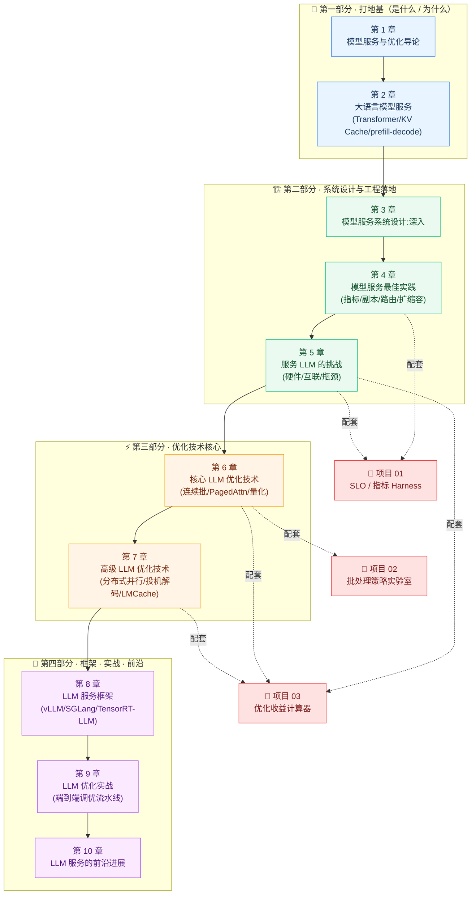

# 📚 《Hands-On LLM Serving and Optimization》中文逐章精讲 + 实战合集

> 原书：**Hands-On LLM Serving and Optimization: Hosting LLMs at Scale**（Chi Wang、Peiheng Hu 著，O'Reilly）
> 本仓库目录是对全书 **10 章** 的中文**逐章精讲**（零基础到进阶，把每个组件、每段代码、每张图讲透，并补数值/对比表/mermaid/第一性原理），外加 **3 个可本机跑通的实战项目**（纯 CPU、零网络、零模型权重、`pytest` 全绿、`run_demo` 秒级出图）。
>
> 🎯 一句话定位：**「怎么把训练好的大模型稳定、快速、便宜地送到用户面前」** —— 从概念、系统设计、最佳实践，到核心/高级优化技术、主流框架，再到端到端调优实战与前沿进展。

---

## 🗺️ 学习路径图



**怎么读**：
- ⏩ **想快速上手推理优化** → 直接 2 → 6 → 7 → 9，再回补 3/4/5。
- 🧑‍🎓 **零基础系统学** → 按 1→10 顺序读，每章配套项目边读边跑。
- 🎤 **面试速通** → 精读 2/5/6/7 + 跑完 3 个项目（下方「面试/实战用法」）。

---

## 📖 讲义逐章目录（`book-guide/`）

| # | 章节（点开精讲） | 一句话讲什么 |
|---|---|---|
| 01 | [模型服务与优化导论](book-guide/01_模型服务与优化导论.md) | 🧭 全书总纲：什么是模型服务、常见服务范式，以及「为什么 LLM 非优化不可」（成本/延迟/吞吐）。 |
| 02 | [大语言模型服务](book-guide/02_大语言模型服务.md) | 🚀 从最小可运行代码出发拆开 Transformer：自回归本质、**KV Cache**、**prefill / decode** 两阶段——全书概念地基。 |
| 03 | [模型服务系统设计：深入](book-guide/03_模型服务系统设计：深入.md) | 🏗️ 从零手写单模型 / 多模型服务，把 batching、streaming、HTTP 封装一路实现透。 |
| 04 | [模型服务最佳实践](book-guide/04_模型服务最佳实践.md) | 📊 生产工程：如何**测性能**（TTFT/TPOT/p99）、副本、路由、自动扩缩容、可观测性。 |
| 05 | [服务 LLM 的挑战](book-guide/05_服务%20LLM%20的挑战.md) | ⚠️ 硬件与互联（GPU 显存/带宽、NVLink/PCIe）、算术强度，定位服务的真正**瓶颈**。 |
| 06 | [核心 LLM 优化技术](book-guide/06_核心%20LLM%20优化技术.md) | ⚡ 生产引擎每天在用的四大招：**连续批处理**、**PagedAttention**、前缀缓存、**量化**、chunked prefill。 |
| 07 | [高级 LLM 优化技术](book-guide/07_高级%20LLM%20优化技术.md) | 🧨 单卡装不下时的重装武器：张量/流水线/专家**并行**、投机解码、LMCache/KV 卸载。 |
| 08 | [LLM 服务框架](book-guide/08_LLM%20服务框架.md) | 🧰 主流框架横评：**vLLM / SGLang / TensorRT-LLM** 各自的定位、取舍与选型。 |
| 09 | [LLM 优化实战](book-guide/09_LLM%20优化实战.md) | 🔧 收官实战：用真实模型（Qwen3-14B）+ vLLM + 真实硬件，把单点技术拧成**端到端调优流水线**。 |
| 10 | [LLM 服务的前沿进展](book-guide/10_LLM%20服务的前沿进展.md) | 🔭 全书收官：解耦式服务、KV 池化、Agentic/长上下文等**前沿方向**与趋势。 |

---

## 🛠️ 实战项目目录（`projects/`）

> 三个项目全部：**纯 Python / 纯 CPU、零 GPU、零网络、不下模型权重、不需 API key**；解析公式 + 离散事件仿真；`pytest` 全绿，`run_demo.py` 秒级出 PNG。**先跑起来看图，再回讲义找原理。**

| 项目 | 一句话 & 配套章节 | 怎么跑 |
|---|---|---|
| [🎯 01 · 服务 SLO / 指标 Harness](projects/01_serving_slo_harness/) | 给 LLM 服务写一台「体检仪」：喂一条仿真到达流，量出 **p50/p95/p99 延迟、吞吐、goodput、GPU 利用率**，画「延迟-吞吐曲线」找容量**拐点**。配套 **第 4/5 章**。 | `cd projects/01_serving_slo_harness`<br/>`pip install -r requirements.txt`<br/>`python run_demo.py` → 出 `latency_throughput.png` / `slo_attainment.png`<br/>`pytest -q` 验证 |
| [🚀 02 · 批处理策略对比实验室](projects/02_batching_lab/) | 离散事件仿真器，把**不批 / 静态批 / 动态批 / 连续批**放同一负载上对拍，量化吞吐、尾延迟、GPU 空闲，看清**为什么连续批处理是现代引擎默认**。配套 **第 6 章**。 | `cd projects/02_batching_lab`<br/>`pip install -r requirements.txt`<br/>`python run_demo.py` → 出 `batching_timeline.png` / `batching_metrics.png`<br/>`pytest -q` 验证 |
| [🧮 03 · 优化技术收益计算器](projects/03_optimization_impact_calculator/) | 给「模型 + 一张卡 + 一组优化开关（量化位宽 / 连续批 / KV 量化）」，用**解析公式**算出**省多少显存、快多少吞吐、降多少延迟**，画**优化叠加瀑布图**。配套 **第 5/6/7 章**。 | `cd projects/03_optimization_impact_calculator`<br/>`pip install -r requirements.txt`<br/>`python run_demo.py` → 出 `waterfall_throughput.png` / `memory_batch_ceiling.png`<br/>`pytest -q` 验证 |

> 💡 每个项目目录内都有**独立的详细 README**（含目录、第一性原理、代码逐行精讲、结果解读、面试高频 & 常见坑），点项目名即可进入。

---

## 🎤 面试 / 实战用法

把「读讲义 + 跑项目」拧成一条能拿去面试和落地的动线：

| 你的目标 | 建议路径 |
|---|---|
| 🧩 **搞懂 LLM 推理本质** | 精读 **第 2 章**（KV Cache / prefill-decode）→ 能徒手画出「为什么 decode 是访存瓶颈、prefill 是算力瓶颈」。 |
| 📏 **会量化性能 & 定 SLO** | 读 **第 4/5 章** + 跑**项目 01**：说清 TTFT / TPOT / E2E / 吞吐 / **goodput** 的区别，并画出尾延迟起飞的**拐点**。 |
| ⚡ **讲透批处理** | 读 **第 6 章** + 跑**项目 02**：一句话答「连续批处理 vs 静态/动态批省在哪」，并用图佐证 GPU 空转的差异。 |
| 🧮 **估算优化收益** | 读 **第 6/7 章** + 跑**项目 03**：面试必问「量化 + 连续批 + KV 量化叠起来到底赚多少、各自贡献多少」——用瀑布图回答。 |
| 🚀 **框架选型 & 端到端调优** | 读 **第 8/9 章**：能对比 vLLM / SGLang / TensorRT-LLM，并复述「拿到一台 GPU 后怎么设计压测、读指标、逼近最优配置」的流程。 |
| 🔭 **聊趋势 / 拔高** | 读 **第 10 章**：解耦式服务、KV 池化、长上下文与 Agentic 服务等前沿，用来在面试尾声「拔高」。 |

**推荐节奏**：每读完一章配套项目就 `python run_demo.py` 出图 + `pytest -q` 跑绿，把图和数字记进脑子——面试时**能画图、能报数、能讲取舍**，比背概念强十倍。

---

## 📂 目录结构

```
book-hands-on-llm-serving/
├── README.md                  ← 你在这里
├── book-guide/                ← 10 章中文逐章精讲（.md）
│   ├── 01_模型服务与优化导论.md
│   ├── 02_大语言模型服务.md
│   ├── …
│   └── 10_LLM 服务的前沿进展.md
├── projects/                  ← 3 个可跑实战项目
│   ├── 01_serving_slo_harness/            (SLO / 指标 Harness)
│   ├── 02_batching_lab/                   (批处理策略实验室)
│   └── 03_optimization_impact_calculator/ (优化收益计算器)
└── figures/                   ← 配图资源
```

---

> 📌 本合集是 **llm-action** 中文精讲系列的一部分，面向国内 AI-Infra / LLM 推理优化方向的学习与面试备战。**读讲义建立心智模型，跑项目把数字刻进直觉。** 祝服务丝滑、延迟到底、成本减半 🎉
