# 第 1 章 · 模型服务与优化导论（Introduction to Model Serving and Optimization）

> 对应原书：《Hands-On LLM Serving and Optimization: Hosting LLMs at Scale》Chapter 1（PDF 第 21–50 页）
> 作者：Chi Wang、Peiheng Hu（O'Reilly）

---

## 🗺️ 本章地图：这一章在全书的位置

这本书讲的是一件事：**怎么把训练好的大模型（LLM）稳定、快速、便宜地送到用户面前**。整本书的结构可以理解成一条"从概念到落地再到极致优化"的路：

```mermaid
flowchart LR
    C1["第1章<br/>导论·概念地基<br/>(本章)"] --> C2["第2章<br/>LLM 服务原理<br/>Transformer/KV Cache"]
    C2 --> C3["第3章<br/>服务系统设计<br/>从零搭建"]
    C3 --> C4["第4章<br/>服务最佳实践<br/>Agent/企业栈/指标"]
    C4 --> C5["第5章<br/>服务 LLM 的挑战<br/>GPU/瓶颈分析"]
    C5 --> C6["第6章<br/>核心优化技术<br/>批处理/量化/缓存"]
    C6 --> C7["第7章<br/>高级优化<br/>投机解码/并行/PD 分离"]
    C7 --> C8["第8章<br/>服务框架<br/>vLLM/TRT-LLM/SGLang"]
    C8 --> C9["第9章<br/>优化实战<br/>Qwen3-14B 端到端"]
    C9 --> C10["第10章<br/>前沿进展<br/>语义缓存/多模态/RL"]
    style C1 fill:#ffe4b5,stroke:#d2691e,stroke-width:3px
```

**本章（第 1 章）是整本书的"地基"**。它不讲任何一行 GPU kernel、不讲注意力怎么算，而是回答四个最根本的问题：

1. **模型到底是什么？**（不是一堆死数据，而是可执行程序）
2. **什么是"模型服务"（model serving）？** 它和训练有什么本质区别？
3. **为什么要专门学服务、还要费劲优化？**（尤其对 LLM）
4. **有哪几种服务范式（paradigm）？** 各自的取舍在哪？

**读完本章你能会什么 👇**

- 用工程师的视角把模型拆成 **架构 / 数据 / 执行代码** 三块，不再被"模型文件"这个模糊概念绕晕；
- 说清 **在线推理（online inference）vs 离线批处理（offline batch）** 的区别，知道什么场景用哪个；
- 掌握贯穿全书的 **延迟 / 吞吐 / 成本"三角"**，以及 **SLO / SLA、p50 / p95 / p99** 这套衡量语言；
- 画出 **模型服务栈全景**（模型 → 运行时 → 批处理 → 硬件），并解释**为什么 LLM 服务特别难**；
- 分清 **端侧（on-device）、单模型（single-model）、多模型（multi-model）、服务平台（platform）** 四种范式的适用边界。

> 💡 **一句话抓住本章精髓**：训练是"造出一个聪明的大脑"，服务是"让这个大脑 7×24 小时、几百万人同时用、还不能太贵"。后者是**系统工程（systems engineering）**，不是算法研究——这是本书和大多数"炼丹"教程最不同的地方。

---

## 🧬 一、模型的解剖学（Anatomy of a Model）：模型是"程序"不是"数据"

### 1.1 学术定义 vs 工程视角

书里给了两个定义，**这两句话的对比就是整章的世界观转折点**：

- **学术定义**：机器学习模型是一种"从数据中学习规律、无需显式编程即可做预测/决策"的**数学表示或算法**。
- **工程/运维视角**：我们更关心**怎么用模型**，而不是怎么训练它。所以大多数时候，我们把模型当成一个**黑盒（black box）**——一堆由训练过程产出的**可执行文件**。

> 🔬 **第一性原理：为什么要"黑盒化"？**
> 训练模型的人和用模型的人，关心的东西完全不同。训练要关心 loss 曲线、梯度、超参；服务只关心"给我输入、还我输出、要快要便宜要稳"。把模型当黑盒，意味着服务工程师可以**不懂 Transformer 内部**也能把它跑起来（靠 vLLM、TensorRT-LLM 这类框架）。**但是——**（书里专门加了个框强调）对 LLM 而言，你**必须**懂一点 Transformer 原理，因为所有 LLM 服务优化技术都是在"绕开 LLM 执行的瓶颈"，不懂原理就没有优化的直觉。这也是本书第 2 章要补的课。

### 1.2 模型 = 三块文件

书里把模型拆成**三种文件**（对应原书 Figure 1-1）：

| 组成部分 | 英文 | 是什么 | 举例 |
|---|---|---|---|
| **模型数据** | Model Data | 权重（weights）、偏置（bias）、配置（config） | 训练学到的参数 + embedding、label 类别、`max_batch_size`、输入输出张量的元数据 |
| **模型架构** | Model Architecture | 模型的结构设计：有几层、什么类型的层、层间怎么连、做什么运算 | 卷积层、全连接层的定义 |
| **模型执行代码** | Model Execution Code | 真正"跑"模型的代码：初始化架构 → 加载权重 → 跑预测 | `model.eval()` + `model(inputs)` |

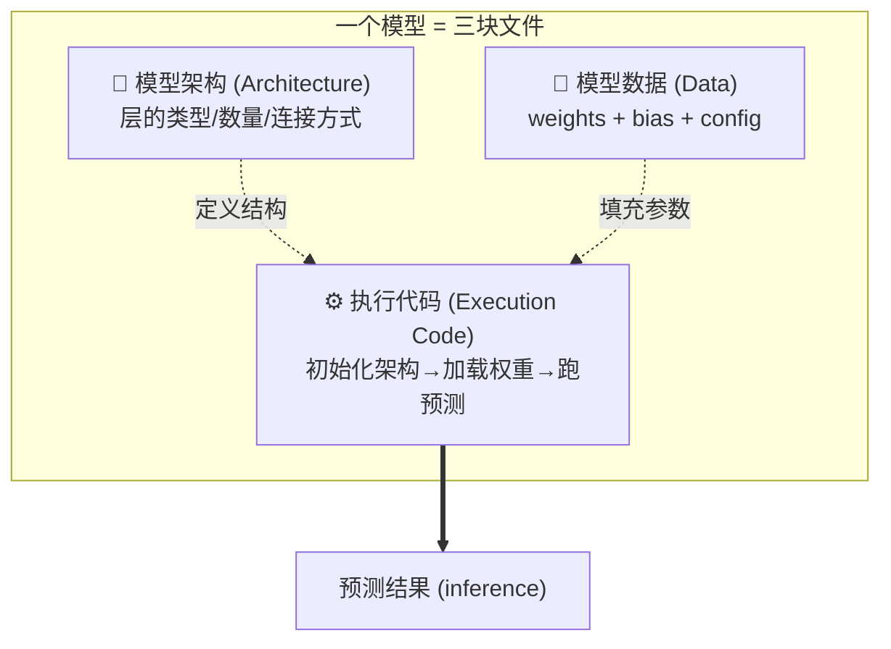

> 💡 **本质洞察（书里的重点框）：模型是可执行程序，不是静态数据。**
> 很多人误以为模型只是"被动的数据文件"，但实际上它还包含**执行逻辑、元数据**等组件，定义了它如何运作。模型是**动态程序**——能处理输入、做决策、随时间演化——而不是一坨死档案。这个认知很重要：正因为它是"程序"，我们才需要"运行时（runtime）"来跑它，才有后面一整套服务栈。

### 1.3 用 PyTorch 例子看三块文件（逐行讲解）

书里用 PyTorch 官方教程"Saving and Loading Models"的例子来演示。我们逐段拆开。

**① 模型架构（Architecture）——定义结构的类**

```python
class TheModelClass(nn.Module):            # 继承 nn.Module，这是所有 PyTorch 模型的基类
    def __init__(self):                    # 构造函数：在这里"声明"模型有哪些层
        super(TheModelClass, self).__init__()   # 调用父类构造，注册模块（必须写，否则参数不被追踪）
        self.conv1 = nn.Conv2d(3, 6, 5)    # 第1个卷积层：输入3通道(RGB)，输出6通道，卷积核5×5
        self.pool  = nn.MaxPool2d(2, 2)    # 最大池化层：2×2窗口、步长2，把特征图长宽各缩一半
        self.conv2 = nn.Conv2d(6, 16, 5)   # 第2个卷积层：输入6通道，输出16通道，核5×5
        self.fc1   = nn.Linear(16*5*5, 120)# 第1个全连接层：把展平后的 16*5*5=400 维 → 120 维
        self.fc2   = nn.Linear(120, 84)    # 第2个全连接层：120 → 84
        self.fc3   = nn.Linear(84, 10)     # 第3个全连接层：84 → 10（最终10类输出）

    def forward(self, x):                  # 前向传播：定义"数据怎么流过这些层"
        x = self.pool(F.relu(self.conv1(x)))  # 卷积1 → ReLU激活 → 池化
        x = self.pool(F.relu(self.conv2(x)))  # 卷积2 → ReLU激活 → 池化
        x = x.view(-1, 16*5*5)             # 把多维特征图"拉平"成一维向量（-1 让 batch 维自适应）
        x = F.relu(self.fc1(x))            # 全连接1 → ReLU
        x = F.relu(self.fc2(x))            # 全连接2 → ReLU
        x = self.fc3(x)                    # 全连接3（输出层，通常不加激活，留给损失函数）
        return x                           # 返回10维的"打分"（logits）
```

**逐行要点**：`__init__` 只是**声明层**（相当于列清单），`forward` 才定义**数据流动的顺序**（相当于流水线）。这段代码通常是训练代码里那个模型类的**副本**，服务时原样搬过来用。

**② 模型数据（Data）——保存学到的权重**

```python
# PyTorch 里，可学习参数(权重和偏置)都存在 "state_dict" 里
torch.save(model.state_dict(), "model_weights.pt")   # 只存参数，不存结构
```

**要点**：`state_dict` 是一个"参数名 → 张量"的字典。这里**只存数据、不存架构**——为什么要分开存？下面就讲。

**③ 模型执行代码（Execution Code）——真正跑起来**

```python
model = TheModelClass(*args, **kwargs)               # ①初始化模型：按架构类"搭骨架"(此时参数是随机的)
model.load_state_dict(                               # ②加载权重：把训练好的参数"灌"进骨架
    torch.load("model_weights.pt", weights_only=True))
model.eval()                                         # ③切到"评估模式"：关掉 dropout/固定 BN，保证推理稳定
pred = model(inputs)                                 # ④跑预测：给输入，拿输出(这一步就是"推理/inference")
```

**逐行要点**：注意这个顺序——**先搭骨架（架构）、再灌参数（数据）、切评估模式、最后推理**。`model.eval()` 这一步在服务里**绝对不能忘**：训练模式下 dropout 会随机丢神经元、BatchNorm 用 batch 统计量，会导致**同样的输入每次输出不一样**，服务上就是灾难。

> ⚠️ **常见坑：忘记 `model.eval()`**
> 这是新手部署最常见的 bug 之一。模型"能跑"但结果飘忽、和线下评估对不上，十有八九是忘了切 eval 模式。LLM 场景下对应的是"采样温度/随机种子"没固定，会让结果不可复现。

> 💡 **为什么书里建议"架构和数据分开存"？**
> 虽然可以 `torch.save(model, "model.pt")` 把整个模型存成一个文件，但**分开存更灵活**：当模型架构在不同版本间**微调**时，checkpoint 里有些参数可能对不上新结构（叫 **nonmatching keys / 不匹配的键**）。这时 PyTorch 支持**部分加载（partial loading）**——匹配的参数照常加载，不匹配的跳过。这在**微调、给模型加层、增量更新架构（不用从头重训）** 时极其常用。这个设计思想在 LLM 时代同样成立：权重（safetensors）和配置（config.json）本来就是分开的文件。

---

## 🔄 二、模型的生命周期：从训练到服务（Model Lifecycle）

在讲服务之前，先"拉远镜头"看看服务在整个 ML 生命周期里的位置。书里强调一句话，值得刻在脑子里：

> **模型的价值，只有在它被部署、可靠地服务、并高效地大规模运行时，才真正实现。**（训练只是旅程的一部分）

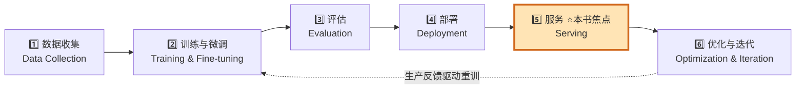

| 阶段 | 英文 | 干什么 |
|---|---|---|
| ① 数据收集 | Data Collection | 从用户交互、传感器、日志、文档、第三方等收集原始数据，清洗、标注、整理成训练/评估集 |
| ② 训练与微调 | Training & Fine-tuning | 学习规律。现代系统常是"预训练大基座 + 领域数据微调" |
| ③ 评估 | Evaluation | 用离线指标（准确率、loss、benchmark）验证模型是否够格上生产 |
| ④ 部署 | Deployment | 把模型打包发布到生产环境，此时模型变成一个需要**版本化、测试、集成**的软件制品 |
| ⑤ **服务** ⭐ | **Serving** | **让部署的模型对应用/用户可访问（通常通过 API），对新数据实时或批量出预测** |
| ⑥ 优化与迭代 | Optimization | 持续优化服务的性能、可靠性、成本；生产反馈又驱动新的微调/重训，循环重启 |

> 🔬 **第一性原理：训练 ≠ 运行。** 书里点破一句关键——"一旦模型开始服务真实用户，约束、目标、工程挑战都会**剧烈改变**。" 训练时你在意"模型学得好不好"；服务时你在意"响应快不快、扛不扛得住并发、一个月烧多少钱"。这是两个完全不同的工程世界。

---

## 🎯 三、什么是模型服务（What Is Model Serving）？

### 3.1 定义

> **模型服务 = 把 ML 模型部署到生产环境，让它能处理新数据、生成预测。** 这需要搭好软硬件基础设施，确保模型能**高效、可扩展、可靠地**接收输入、执行推理、返回结果。

书里反复用一个绝妙的比喻：**模型服务是一种"供应链（supply chain）"**。一个训练好的模型，如果不能以**合适的延迟、可靠性、成本**送到用户手里，它就毫无商业价值。就像制造商追求高效低成本的供应链，AI 公司追求高效地利用模型和硬件。

**服务中断 = 业务停摆**。书里给的真实例子：

- **亚马逊/Netflix**：用户浏览时实时更新推荐；
- **银行**：在线支付结账时实时拦截欺诈交易；
- **航空聊天机器人**：即时提供航班更新和改签。

这些公司的模型服务一旦宕机，业务就停了。

### 3.2 服务可以发生在三个地方

| 场景 | 位置 | 例子 |
|---|---|---|
| **端侧（on-device）** | 本地设备 | 仓库机器人上跑 YOLO 目标检测（树莓派 + Coral TPU），实时自主决策 |
| **本地集群（on-premises）** | 公司内部集群 | 用 Sentence-BERT 给内部文档建语义搜索索引，数据不出公司保证合规 |
| **云端（on-cloud）** | 远程/厂商 | 客服聊天机器人把问题发给远程 LLM（如 SageMaker Inference、OpenAI） |

### 3.3 服务工程师真正关心的 8 件事

书里列了服务视角下最需要盯的维度（注意：**几乎不关心模型内部架构/训练方法**，因为 vLLM、TensorRT-LLM 这类框架已经把执行的复杂度封装好了）：

| 关注点 | 英文 | 含义 |
|---|---|---|
| 部署 | Deployment | 选对硬件，把模型从训练流水线/开源渠道接过来消费输入、返回预测 |
| 可扩展性 & 可用性 | Scalability & Availability | 从几千到几百万请求都能高效处理，体验一致 |
| **延迟** | Latency | 快速出预测——实时场景要**毫秒级** |
| 监控 | Monitoring | 追踪模型性能、数据漂移（data drift）、系统健康 |
| 版本管理 | Versioning | 更新和回滚模型时不打断客户端 |
| 安全 | Security | 保护敏感数据，控制模型访问权限 |
| **服务成本** | Cost-to-serve | **最决定性的因素**——用它来评估不同服务方案和取舍 |

> 💡 **面试高频：服务工程师和算法工程师的分工是什么？**
> 书里总结得很到位：服务工程"更少依赖发明新的学习算法，更多依赖**系统工程、基础设施设计、跨软硬件栈的端到端性能优化**"。一句话——**算法工程师让模型更聪明，服务工程师让模型更能打（快/稳/便宜）。** LLM 是个例外，服务它必须懂算法（Transformer）。

---

## 🤔 四、为什么要学模型服务？（三个灵魂拷问）

书里用作者十多年一线经验，回答了三个最常被质疑的问题。这部分是**决策思维**，面试和实际工作都极有用。

### 拷问 1：我们直接用云厂商（SageMaker/Bedrock/Azure ML），为啥还要学自己搭？

**答**：云服务很方便（帮你管硬件、打补丁、快速做 POC），但你**不能不动脑子地直接消费**：

1. **产品/功能太多**，难选最合适的（光 SageMaker 就有单模型、多模型端点等多种选项，各有定制度、取舍、成本）；
2. **和现有基础设施、客户端集成**往往需要额外工程量；
3. 常常需要**针对你的业务场景做优化和调参**。

**核心结论**：懂服务系统怎么搭、怎么运维，才能**用好**云厂商的选项，不至于选错方案导致成本飙升或灵活性受限。

### 拷问 2：基座 LLM 这么强，我们直接调 OpenAI/DeepSeek/Anthropic 不就行了？

**答**：真正落地业务时有大量 nuance（微妙之处）：

- **成本考量**：企业几乎从不用单一 LLM 解决所有问题。真实做法是**能用小模型、便宜模型就用，复杂请求才上 LLM**。用量上来后，自建更省——书里给了硬数字：
  > **在 AWS EC2 上跑开源 LLM（如 DeepSeek），比用托管方案（如 SageMaker）便宜 30%–60%；如果预留（reserve）EC2 实例，还能再拿约 70% 折扣。**
- 典型聊天机器人栈：**小的意图分类模型**做分诊 + **embedding 模型**编码问题做检索 + **LLM** 拆解请求、调后端 API、生成人性化回复。
- **数据隐私与安全**：处理敏感/专有数据时，可能被迫用内部方案避免泄露和合规问题。
- **微调模型的服务**：多数基座厂商**要么不支持**服务你的微调模型，**要么加价很多**——书里数据：
  > **2025 年初，OpenAI 服务微调模型要多收 50%。**

### 拷问 3：自建自维护这么贵，凭什么值得？

**答**：书里给了两个真实场景来说明"何时该从外包转向自建"：

- **教育 A 轮创业公司**：用 LLM 批改作业、生成个性化学习计划。一开始用 OpenAI 快速验证商业模式很好，**但用量一涨，服务成本变得不可持续** → 迁到定制方案（开源 LLM + 优化框架 + 微调推理性能），大幅降本同时保住体验。
- **CRM 公司**：用 LLM 处理邮件/Slack/客户笔记（文本）、语音搜索（音频）、结构化 CRM 库（历史销售）给销售建议。**推理量大 + 敏感客户数据** → 完全外包有数据安全风险、成本高 → 自建并优化内部栈，降低单次推理成本、合规（GDPR/HIPAA）、更好的性能和延迟控制。

**但自建的代价**：需要**前期硬件的大额资本投入** + **持续投入懂部署/维护/优化的工程师**。所以 **build vs buy** 的决策取决于：安全隐私需求、项目成熟度、预期规模、组织能否长期承受运维复杂度。

> 💡 **书里的金句（"没有万能方案"框）**：作者干了十多年，从完全外包（OpenAI）、自管本地（TF Serving/TorchServe/Triton/Ray）、全托管云（Bedrock）到深度定制（SageMaker）都做过，结论是——**没有一劳永逸、"永恒"的架构**。模型算法和服务技术一直在演进，企业必须跟上。**不要被任何框架或厂商锁死**，要能快速理解并采纳新技术。

---

## ⚡ 五、为什么要优化服务（尤其是 LLM）？

### 5.1 "能跑" ≠ "跑得起"

书里点破一个残酷现实：模型部署成功后**看起来"完事了"**（能出正确结果、能响应请求），**但对 LLM，天真部署的服务系统在实践中很快就崩**：

- 负载一大，**延迟疯涨（latency grows under load）**；
- **吞吐远低于硬件极限就见顶（throughput plateaus far below hardware capacity）**；
- **成本随用量线性甚至更差地增长（cost scales linearly—or worse）**。

**很多在 demo/试点里好用的方案，真实用户一来就在经济上或运维上不可行了。**

### 5.2 优化的定义与三个核心问题

> **模型服务优化 = 改善服务性能的过程**：降低服务延迟、提高吞吐、优化资源利用。目的是在**控制成本**的前提下最大化服务效率。

关键三问：

1. 能不能在**更划算的硬件**上跑？
2. 能不能**不升级基础设施**就提高吞吐、降低延迟？
3. 能不能**充分利用**云厂商的 LLM 服务？

**先厘清两个基础概念（贯穿全书）**：

- **吞吐（throughput）**：单位时间处理的预测数量（越高越好）；
- **延迟（latency）**：处理**单个**预测所花的时间（越低越好）。

> ⚠️ **成本框（书里的重点数据）**：Alphabet 董事长 John Hennessy 2023 年对路透社说——
> **"跑一次 LLM 请求，可能比传统关键词搜索贵 10 倍，可能带来数十亿美元的额外成本。"**
> 所以对 LLM，**优化几乎是必须的**：降本、更快响应改善体验、比别人更便宜/更快就是竞争优势。

### 5.3 训练框架 ≠ 服务框架（一张关键对比表）

常见误区："训练和服务不都是跑同一个模型吗，为啥不用一套？"——**技术上部分正确**（都要加载模型、执行架构），**但目标和需求完全不同**（原书 Table 1-1）：

| 维度 | 模型训练（Training） | 模型服务（Serving） |
|---|---|---|
| **生命周期阶段** | 准备模型 | 部署到生产 |
| **目标** | 跑模型来**学参数**：在训练数据上最小化 loss | 跑模型来**高效地对新输入出预测** |
| **计算** | 极度计算密集：迭代更新权重（含反向传播 + 梯度更新） | 只做**高效前向传播**（无反向、无参数更新） |
| **吞吐与延迟** | 偏好**高吞吐**（每秒多样本），大 batch 并行以打满 GPU | 优化**单请求低延迟**，常在单条或小 batch 上跑 |
| **资源需求** | 需强大 GPU/TPU + 分布式框架（FSDP、DeepSpeed）。例：Llama3 405B 用了 **16,384 张 H100** | 优化低延迟、省资源，常跑在 CPU / 边缘 / 推理专用 GPU（TensorRT、ONNX Runtime） |

**结论**：用训练框架来服务是**低效的**。要用**服务专用框架**：NVIDIA Triton、vLLM、SGLang 等。

### 5.4 实战案例：用 vLLM 把 LLM 吞吐拉起来

书里举了 vLLM 的例子。先看一条真实的启动命令（逐行注释）：

```bash
python -m vllm.entrypoints.openai.api_server \   # 启动 vLLM 的 OpenAI 兼容 API 服务器
  --model openai/gpt-oss-20b \                    # 要服务的模型（这里是 200亿参数的 gpt-oss-20b）
  --dtype bf16 \                                  # 计算精度用 bfloat16（省显存、够精度，比fp32快)
  --gpu-memory-utilization 0.9 \                  # 允许 vLLM 用到 90% 的 GPU 显存（留 10% 余量）
  --max-num-seqs 16 \                             # 最大并发序列数=16(同时处理的请求批大小上限)
  --max-num-batched-tokens 16384 \               # 一个 batch 里最多打包 16384 个 token
  --tensor-parallel-size 2                        # 张量并行度=2：把模型切到 2 张 H100 上一起算
```

**逐行要点**：这条命令在 H100 80GB 上跑，每个参数都是一个**优化旋钮（knob）**——`dtype` 控精度/显存、`gpu-memory-utilization` 控显存占用、`max-num-seqs` 控并发批大小、`tensor-parallel-size` 控多卡切分。（vLLM 默认就开了 **PagedAttention** 来管 KV Cache。这些第 6、7 章会细讲，现在不懂没关系。）

**优化效果有多猛？** vLLM 团队 2023 年实验（Llama-7B on A10G、Llama-13B on A100 40GB）：

| 对比基线 | 吞吐提升 |
|---|---|
| vs HuggingFace Transformers | **最高 24 倍**（原书正文/图分别提到 8.5×–15× 与"最高 24×"两个口径） |
| vs HF Text Generation Inference (TGI) | **最高 3.5 倍**（3.3×–3.5×） |

> ⚠️ **配置就是性能（书里的震撼案例）**：作者实测用 vLLM 托管 DeepSeek R1，**只做两件事**——启用 FP8 的 MLA kernel + 增大 batch size——吞吐就从 **38 TPS 飙到 600 TPS，暴涨 15 倍**（TPS = tokens per second，每秒 token 数）。

> 💡 **本质**：书里强调——对生产 LLM 系统，优化**不是**为了"多榨一点性能"，而是"**在可持续成本下达到业务 SLA 的延迟和吞吐要求**"。在昂贵的 GPU 上，不加任何基础设施成本就拿到 6× 吞吐、3× 更低延迟，是**game-changer（游戏规则改变者）**。

---

## 📊 六、贯穿全书的度量语言：延迟 / 吞吐 / 成本"三角" + SLO/SLA + 百分位

> 这一节是本教程为**打通"要点"**做的深化。书里第 1 章埋下了 latency/throughput/cost 三个词，第 4 章"Measuring Performance in LLM Serving"会系统展开。这里先把这套**度量语言**讲透，因为它是你读后面所有优化章节的"坐标系"。

### 6.1 为什么是"三角"而不是"三个独立指标"？

延迟、吞吐、成本**互相拉扯，按下葫芦浮起瓢**——这就是它构成"三角（trade-off triangle）"的原因：

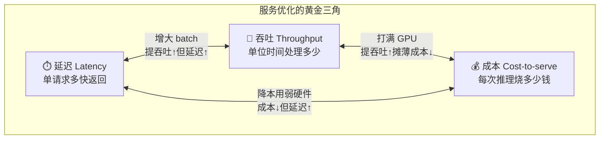

**三条边的物理含义**（LLM 场景）：

- **延迟 ↔ 吞吐**：增大 batch size 能一次处理更多请求（吞吐↑），但每个请求要等凑够 batch、排队更久（延迟↑）。经典矛盾。
- **吞吐 ↔ 成本**：把 GPU 打满（吞吐↑）能把每次推理的固定硬件成本摊薄（单位成本↓）。空转的 GPU 是最贵的浪费。
- **成本 ↔ 延迟**：为省钱用更弱的硬件/更激进的量化（成本↓），往往牺牲延迟或质量（延迟↑）。

> 🔬 **第一性原理**：三角的根源是"**资源是有限的、且被瓶颈约束**"。LLM 推理里，decode 阶段是**显存带宽瓶颈（memory-bandwidth bound）**，prefill 阶段是**算力瓶颈（compute bound）**（第 5 章会用 arithmetic intensity 严格分析）。你没法同时把三个角都推到最优，只能根据业务**选一个主目标、约束另外两个**。

### 6.2 延迟不是一个数：p50 / p95 / p99（百分位）

**新手最大的误区：用"平均延迟"衡量服务。** 平均值会被少数快请求拉低，掩盖尾部（tail）的糟糕体验。工业界用**百分位（percentile）**：

| 指标 | 读作 | 含义 | 直觉 |
|---|---|---|---|
| **p50** | 中位数 | 50% 的请求比这快 | "典型"用户的体验 |
| **p95** | 95 分位 | 95% 的请求比这快（最慢的 5% 除外） | 大多数人的"最差可接受"体验 |
| **p99** | 99 分位 | 99% 的请求比这快（最慢的 1% 除外） | **尾部延迟（tail latency）**，最难搞、最影响口碑 |

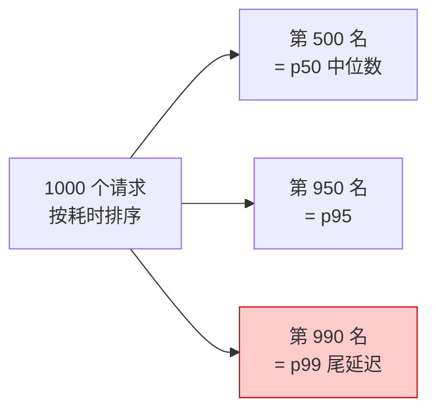

> 💡 **面试高频：为什么盯 p99 而不是平均？**
> 举例：p50=200ms、p99=5s。平均可能只有 300ms 看着很美，但**每 100 个用户就有 1 个等 5 秒**——在高并发下这是天天发生的、会流失用户的真实体验。**尾延迟是分布式/高并发系统的核心敌人。** 而且请求越多、越容易踩中尾部（一个页面调 10 个服务，命中 p99 的概率约 1−0.99¹⁰≈10%）。

**LLM 特有的延迟指标**（第 4 章会讲，这里先建立概念）：

| 指标 | 英文 | 含义 | 为什么重要 |
|---|---|---|---|
| 首 token 时间 | TTFT (Time To First Token) | 从发请求到吐出第一个字的时间 | 决定"感知响应速度"，聊天体验的关键 |
| token 间延迟 | TPOT / ITL (Time Per Output Token / Inter-Token Latency) | 相邻两个 token 之间的间隔 | 决定"打字机效果"流不流畅 |
| 端到端延迟 | E2E Latency | 整个请求从头到尾 | ≈ TTFT + 输出长度 × TPOT |

> ⚠️ **常见坑：LLM 是流式的，"一个延迟数"没意义。** 传统模型输入→输出是一次性的；LLM 是**逐 token 生成（autoregressive）**，用户第 1 个字很快看到（TTFT）但整段话要等很久。所以 LLM 必须**分开量 TTFT 和 TPOT**，不能只报一个 E2E。

### 6.3 SLO vs SLA vs SLI：承诺的三层语言

| 概念 | 全称 | 是什么 | 例子 |
|---|---|---|---|
| **SLI** | Service Level **Indicator** | 你**测量**的具体指标（客观数字） | "p99 延迟 = 850ms" |
| **SLO** | Service Level **Objective** | 你给自己定的**目标**（内部约束） | "p99 延迟 < 1s，成功率 ≥ 99.9%" |
| **SLA** | Service Level **Agreement** | 你和客户签的**合同承诺**（违约要赔钱） | "月可用性 ≥ 99.9%，否则退费 10%" |

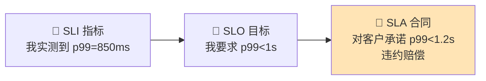

> 💡 **记忆口诀**：SLI 是**尺子**（量什么），SLO 是**自己定的及格线**（比 SLA 更严），SLA 是**签给客户的军令状**（违了要赔）。工程上通常让 **SLO 比 SLA 更紧**，留出安全缓冲——比如对外承诺 p99<1.2s（SLA），内部按 p99<1s（SLO）来运维。书里也把满足业务 **SLA** 作为"优化到底为了啥"的最终答案。

---

## 🏗️ 七、模型服务栈全景 & 为什么 LLM 服务这么难

### 7.1 服务栈全景图（模型 → 运行时 → 批处理 → 硬件）

把前面所有概念串起来，一个完整的 LLM 服务栈自底向上长这样：

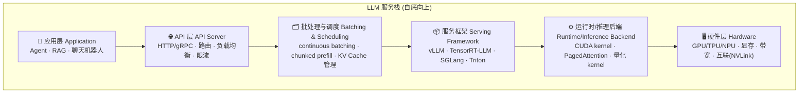

对照书里第 1 章讲的单模型服务容器（原书 Figure 1-6），一个容器内部有三大组件：

| 组件 | 英文 | 职责 |
|---|---|---|
| API 服务器 | API-Server | 用 HTTP/gRPC 暴露推理接口，接外部请求 |
| 模型管理 | Model Management | 下载模型、解压到本地、加载进推理后端；检测新版本自动刷新 |
| 推理后端 | Inference Backend | 真正执行模型，底层用 vLLM/TensorRT-LLM/TF Serving/TorchServe |

> 💡 **书里的重点框：容器化是现代模型服务的地基。** 服务端模型执行**几乎都在容器里跑**——把模型管理、资源管理、执行逻辑封进 Docker 容器（或 K8s Pod），通过 gRPC/HTTP 暴露预测接口。好处：**在开发笔记本、测试机、生产环境行为一致**。Docker 是书里全程用的容器技术。

### 7.2 在线推理 vs 离线批处理（Online vs Offline Batch）

书里在讲吞吐/延迟时反复触及这个区分，这是**服务模式的顶层分叉**：

| 维度 | 在线推理（Online / Real-time） | 离线批处理（Offline / Batch） |
|---|---|---|
| **触发方式** | 用户请求实时到达，逐条/小批处理 | 攒一大批数据，定时/一次性跑完 |
| **首要目标** | **低延迟**（p99、TTFT） | **高吞吐 / 低单位成本** |
| **batch 大小** | 小（受延迟约束） | 大（尽量打满 GPU） |
| **典型场景** | 聊天机器人、实时推荐、欺诈拦截 | 批量文档摘要、离线打标、embedding 全量重算、评测集跑分 |
| **SLA 形态** | "p99<1s" 这类延迟承诺 | "今晚跑完 1000 万条"这类完成时间 |
| **成本策略** | 常需预留算力保证随时可用（贵） | 可用抢占式/spot 实例、错峰跑（便宜） |

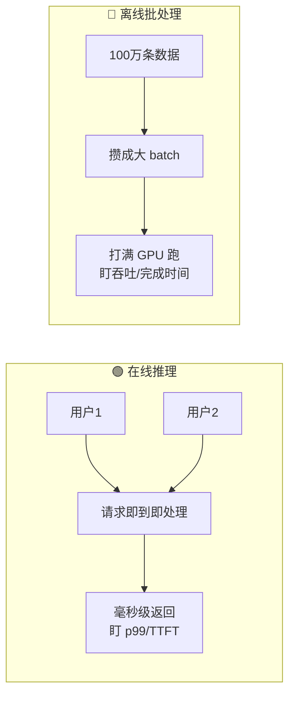

> 💡 **实战**：真实系统常**混用**——在线路径保证交互体验，离线路径省成本做重活。比如一个客服系统：用户实时提问走**在线** LLM（低延迟），而每晚把当天对话批量做**离线**质检打分（高吞吐）。书里第 2 章会讲 LLM 的 streaming serving（流式，服务在线）和 batch serving（批量）两种基础模式。

### 7.3 为什么 LLM 服务特别难？（本章的"灵魂问题"）

综合全章，LLM 服务比传统模型难，难在这几点：

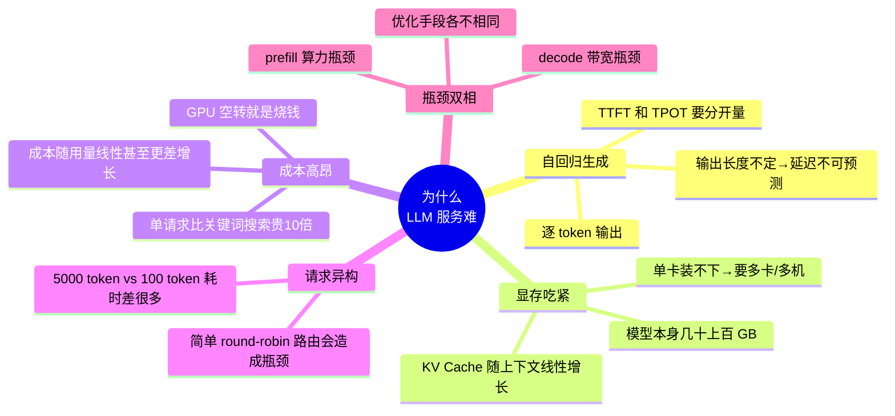

书里第 1 章明确点到的几个"难点"：

1. **天真部署很快就崩**：负载一大延迟疯涨、吞吐早早见顶、成本线性恶化。
2. **请求异构导致路由难**：一个 5000-token 的 LLM 请求比 100-token 的慢得多；简单 round-robin 会把请求塞给还在忙的容器 c1，造成瓶颈（书里给的原例）。所以要用**加权轮询、最少连接、最短响应时间、动态负载均衡**等更聪明的路由。
3. **模型太大单机装不下**：GPT-4、Llama-2-70B 这类，单机显存不够，要**纵向扩展（vertical scaling / scale up）**——上更强 GPU（H100/A100）+ **分布式服务**跨多卡多机切分。而**横向扩展（horizontal scaling / scale out）** 则是多加容器实例扛并发（K8s HPA 自动伸缩）。
4. **成本高得离谱**：LLM 请求比传统搜索贵约 10 倍，优化不是加分项而是**生存必需**。

> ⚠️ **书里的重要经验（多卡优先同机）**：**优先"节点内服务"（一机多卡 / intra-node）而非"跨节点服务"（多机 / inter-node）**。跨节点引入网络开销，增加延迟和同步复杂度。能塞进单机就尽量塞进单机，最大化效率。这条经验第 7 章多机推理会展开。

---

## 🧩 八、四种模型服务范式（Serving Paradigms）

书里把服务设计**由简到繁**递进介绍。理解每种的**适用边界和取舍**，是本章最实用的产出。

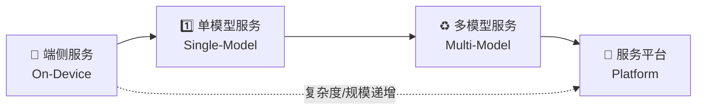

### 8.1 端侧服务（On-Device / Edge Serving）

**是什么**：模型直接跑在用户端设备上（手机、无人机、机器人、摄像头、VR 头显），本地处理数据，不依赖远程服务。

**四大好处**：

| 好处 | 英文 | 含义 | 例子 |
|---|---|---|---|
| 划算 | Cost-effective | 减少对云的依赖，砍掉持续的 API 费用 | 智能音箱本地做语音识别 |
| 高效 | Efficient | 本地算更快、更省电（尤其 AI 专用硬件） | 手机照片增强 App 实时出结果 |
| 隐私 | Private | 数据不离开设备 | 健康 App 本地分析生物特征 |
| 个性化 | Personalized | 用用户数据在设备上持续微调，不上传 | 输入法学习你的打字风格 |

**端侧 App 的两个核心组件**（原书 Figure 1-4）：

- **模型运行时（Model Runtime）**：专门在不同硬件上高效执行模型的软件框架，是"训练好的模型"和"设备硬件"之间的**中间层**，做硬件特定的优化和加速。常支持 **delegate（委托）**——把计算密集的算子从 CPU 卸载到 GPU 等专用硬件。主流运行时：**LiteRT、ONNX Runtime (ORT)、Core ML**。
- **模型包装器（Model Wrapper）**：应用开发者写的组件，封装"怎么和运行时交互"（预处理输入 → 加载模型 → 执行 → 后处理输出），给应用逻辑提供推理接口。

**部署流程**（原书 Figure 1-4b）：训练好 → **转换格式**（如用 `ai_edge_torch.convert(resnet18.eval(), sample_input)` 把 PyTorch 转成 LiteRT 的 `.tflite`）→ **数值精度验证**（同样输入在服务器和设备各跑一遍比对差异）→ **性能测量** → **打包进 App** 发布。（Qualcomm AI Hub 这类工具能自动化编译/优化/验证。）

**什么时候该用端侧**：隐私优先负载（生物认证、健康数据）、超低延迟（手势识别、机器人控制环、AR/VR）、断网/弱网环境（工业设备、远程传感器、车辆、无人机）、IoT/智慧城市/机器人。

**约束（不是"劣势"，但强烈影响可行性）**：算力和存储受限（大模型难跑，虽有 Gemma 3 270M 这类端侧模型）、功耗（跑深度网络费电，如实时视频超分就不本地做）、更新维护难（每台设备都要推更新）、硬件碎片化（有的有 NPU 有的只有 CPU，苹果 Neural Engine 优化的模型在高通骁龙上不一定高效）。

### 8.2 单模型服务（Single-Model Service）——默认起点

**是什么**：**每个模型、每个版本**都部署成一个**独立的 web 服务**，通过 HTTP/gRPC 暴露预测 API。标准的**微服务（microservices）** 设计——前面一个 API 组件收请求、路由到后端 worker/容器，后端执行模型返回结果。

**路由选择**（书里的经典问题）：最简单是 **round-robin（轮询）**——请求依次发给 c1、c2、c3 再循环。**但轮询有致命缺陷：不考虑请求处理时间的差异**。5000-token 的 LLM 请求比 100-token 慢得多；c1 还在处理大请求、c2 已经空了，下一个请求却还塞给 c1，造成瓶颈。更聪明的路由：

| 路由策略 | 英文 | 逻辑 |
|---|---|---|
| 加权轮询 | Weighted round robin | 权重高（更大）的服务器收更多请求 |
| 最少连接 | Least connections | 发给活跃连接最少的服务器 |
| 最短响应时间 | Least response time | 发给响应时间最低的服务器 |
| 动态负载均衡 | Dynamic load balancing | 用 CPU/GPU/内存/队列长度等指标分配 |

**扩展方式**：

- **横向扩展（Horizontal / Scale out）**：多加容器实例分散到多机，扛更多并发。生产上开 **autoscaling**——监控 CPU/内存/延迟/活跃请求，超阈值自动加实例（K8s 的 **HPA / Horizontal Pod Autoscaling**）。
- **纵向扩展（Vertical / Scale up）**：大模型（GPT-4、Llama-2-70B）单机显存不够，上更强 GPU + 分布式跨多卡多机切分。vLLM 一行搞定：

```bash
python -m vllm.entrypoints.api_server \
   --model meta-llama/Llama-2-13b-hf \
   --tensor-parallel-size 4     # 张量并行度=4，把模型切到 4 张 GPU 上
```

**为什么单模型服务是默认首选**（书里的偏爱）：性能最好（无资源争抢、低延迟）、易扩展（每个模型独立伸缩）、部署调试简单（日志/指标/更新隔离）、更可靠（一个模型崩不影响其他）、每模型可配专用硬件（好控成本）。

**短板**：资源效率和成本。书里的经典反例——**Agent 平台**：100 个客户各部署 10 个模型 = **1000 个独立服务**。维护/打补丁/部署/监控这么多服务**根本不可扩展**，而且很多上传的模型**从没被用过**，白白占算力烧钱。→ 引出多模型服务。

### 8.3 多模型服务（Multi-Model Service）——最省成本

**是什么**：**在一个服务容器里同时托管多个模型**，共享 GPU/CPU/内存，并根据流量**动态加载/卸载**模型。适合"要服务大量模型、但不需要同时全装进内存"的场景。

回到 Agent 平台例子：不用把 1000 个模型全塞进显存，而是**按需（on-demand）**——客户请求某模型时才加载，不活跃或需要腾内存时就卸载。大幅降低基础设施成本、提升资源利用率。

**比单模型容器多的两个组件**（原书 Figure 1-7）：

- **模型服务器推理后端（Model Server Inference Backend）**：黑盒方式处理**多种类型**的模型。内部含多个推理后端，每个处理一类（TensorFlow / ONNX / PyTorch）。**不用从头造**——用 **NVIDIA Triton Inference Server** 这类成熟开源方案。
- **模型缓存管理（Model Cache Management）**：① 从存储加载模型进后端；② 维护 **LRU（最近最少使用）缓存**，资源紧张时卸载最少用的模型，防止过载。

**端到端按需流程**（请求命中模型 A 时）：

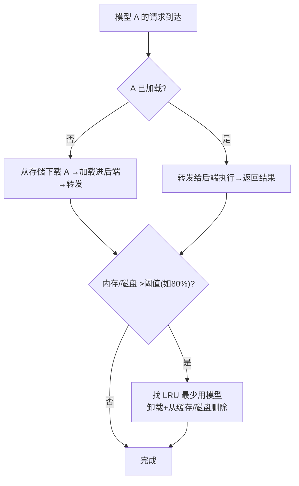

> 💡 **Triton 框（书里的推荐）**：NVIDIA Triton Inference Server 是最流行的开源服务方案之一，也是作者多模型场景的**首选工具**。它能管理和服务**任意数量/混合类型**的模型（只受磁盘和内存限制），在 TensorRT、TensorFlow、ONNX、PyTorch、Caffe2 等多种格式之上提供统一 API。

**路由和伸缩的新挑战**（原书 Figure 1-8/1-9）：

- **问题 1：请求路由**。模型可能在任何容器里，要把请求路由到**已加载该模型的容器**，否则会有**冷启动（cold start，等模型加载）** 或**模型换入换出（swapping）** 的额外延迟。
- **问题 2：按模型伸缩（per-model scaling）**。不同模型流量不均，"热"模型要更多实例。

**解法**：在前端 API 路由层加两个东西——① 给模型元数据加 **replica（副本数）** 属性（定义该模型在后端托管几个实例）；② 加 **route map（路由表）** 记录"某模型请求该发给哪些容器"。例：模型 A 副本数=2，路由逻辑选 C1、C3 托管，之后所有 A 请求在 C1/C3 间均分；路由器还能实时调整副本数匹配流量（选容器托管新实例，像**装箱问题 bin packing**）。

**什么时候多模型服务会吃力**（该退回单模型）：

- 模型太大装不下单 GPU（没空间共享或频繁卸载→大量加载开销和冷启动延迟）；
- 单个模型高流量、要求低延迟、必须常驻——**单模型更好**；
- 模型有不同的安全策略；
- 运维复杂度太高（模型缓存管理、按模型路由伸缩、模型兼容性、依赖冲突太多）。

> 💡 **单模型 vs 多模型是互补的**：实践中平台会**组合多种方式**在同一屋檐下应对不同用例。

### 8.4 模型服务平台（Model Serving Platforms）

**是什么**：业务增长后，简单把单模型+多模型堆一起不够了，面临两大挑战——① 很多任务需**多模型协作**（如 Siri 要串联语音识别→NLP→推荐→语音合成才能回应一句话）；② 大量 AI 应用同平台跑时，**优化计算资源**（合理分配 GPU/CPU/内存、保证可扩展和成本、减少争抢）成关键。

**平台设计**（原书 Figure 1-10）：

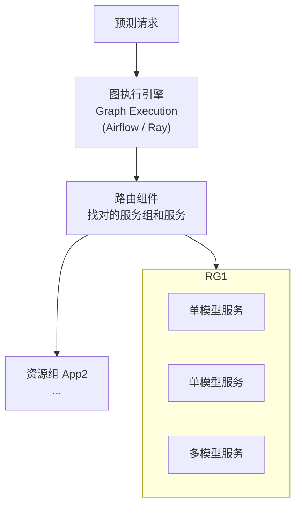

两个核心设计：

1. **资源组（resource groups）**：为不同应用/业务场景隔离预测负载。每组分配自己的 CPU/GPU/内存配额（按业务需求优化性能和成本）。例：App1 资源组里有两个单模型服务 + 一个多模型服务。
2. **图执行组件（graph execution，如 Airflow/Ray）**：支持**多步推理工作流**。每个 App 团队定义自己的推理流程部署上去；预测时图引擎接请求、跑预定义工作流，每一步调路由组件找对的服务组和服务执行。

> ⚠️ 书里提醒：真实平台**复杂得多**——还要有安全和访问控制、指标监控、部署 DevOps 集成等。图里省略这些非核心组件，聚焦服务概念。

**四种范式对比一览**：

| 范式 | 核心卖点 | 最适合 | 主要短板 |
|---|---|---|---|
| 端侧 On-Device | 低延迟/离线/隐私/省云费 | 隐私敏感、超低延迟、弱网、IoT | 算力存储功耗受限、更新难、硬件碎片化 |
| 单模型 Single-Model | 简单/隔离/性能最好 | 任意模型的默认起点、高流量常驻模型 | 模型多时资源浪费、成本高 |
| 多模型 Multi-Model | 最省成本/共享资源/按需加载 | 海量模型、流量不均、大量冷模型 | 大模型装不下、冷启动、运维复杂 |
| 服务平台 Platform | 多模型编排/资源隔离/统一治理 | 业务规模大、多应用、多步工作流 | 系统复杂、需完整治理配套 |

---

## 📌 小结（Summary）

本章是全书的概念地基，我们从工程视角走完了模型服务的全景：

1. **模型的解剖学**：模型是**可执行程序**（架构 + 数据 + 执行代码三块文件），不是静态数据。记住 `搭骨架→灌权重→eval→推理` 的顺序和 `model.eval()` 这个坑。

2. **模型服务的定义**：把模型部署到生产、对新数据出预测的**系统工程**。它像"供应链"——模型不能以合适的延迟/可靠性/成本送达用户就没有商业价值。三种位置：**端侧 / 本地 / 云端**。

3. **为什么学、为什么优化**：即使用云厂商或基座 LLM，也要懂服务才能用好、控成本、保合规。对 LLM，**优化是生存必需**（一次 LLM 请求比关键词搜索贵约 10 倍；vLLM 靠 PagedAttention/RadixAttention 能拿 **6× 吞吐、1/3 延迟**，不加基础设施成本）。**训练框架 ≠ 服务框架**（目标、计算、资源需求都不同）。

4. **度量语言（贯穿全书的坐标系）**：**延迟/吞吐/成本"三角"**互相拉扯；延迟要用 **p50/p95/p99** 而非平均值，尤其盯**尾延迟 p99**；LLM 要分开量 **TTFT / TPOT**；用 **SLI（测）/ SLO（内部目标）/ SLA（对客户合同）** 三层语言管理承诺。

5. **服务栈全景与 LLM 之难**：栈自底向上是**硬件 → 运行时 → 框架 → 批处理调度 → API → 应用**，全程跑在**容器**里。LLM 服务难在：自回归逐 token 生成、显存吃紧（模型+KV Cache）、成本高昂、请求异构、prefill/decode 双相瓶颈。

6. **四种服务范式**：**端侧 → 单模型（默认起点）→ 多模型（最省成本）→ 服务平台（统一治理）**，复杂度和规模递进，各有适用边界和取舍——**没有万能方案，别被框架/厂商锁死**。

> 🎯 **本章的世界观**：模型服务是**工程驱动的学科**，聚焦"高效地把模型部署、集成进真实应用"，而不是训练的炼丹术或算法设计。接下来第 2、3 章将动手实战，看 LLM 服务到底怎么搭、怎么跑。

---

## 🔗 延伸阅读

**本书内部（顺着地基往深挖）**：

- **第 2 章 · 大语言模型服务**：补 Transformer/自回归/KV Cache 的算法课，理解本章说的"LLM 服务必须懂原理"；讲 prefill/decode 两阶段、streaming（在线）与 batch（离线）两种基础模式。
- **第 3 章 · 服务系统设计深潜**：从零手搭在线 LLM 服务，把本章的单模型/多模型/批处理落成代码。
- **第 4 章 · 服务最佳实践**：系统展开本章埋下的**延迟指标（TTFT/TPOT）与吞吐指标**、SLA、性能测量最佳实践；讲 Agent/RAG/企业级服务栈。
- **第 5 章 · 服务 LLM 的挑战**：用 GPU 规格、arithmetic intensity 严格分析本章说的"prefill 算力瓶颈 / decode 带宽瓶颈"，估算模型大小和 KV Cache 大小。
- **第 6、7 章 · 核心/高级优化**：本章多次预告的 PagedAttention、量化、continuous batching、投机解码、多卡并行、PD 分离等"降本增效"的真招式。
- **第 8 章 · 服务框架**：深入 vLLM / TensorRT-LLM / SGLang / llama.cpp，教你按本章的取舍原则**选对框架**。
- **第 9 章 · 优化实战**：Qwen3-14B 端到端优化，把三角、SLO、量化、分布式全串起来跑一遍。

**仓库内既有教程（配套加深）**：

- `llm-inference/`：本仓库的 LLM 推理专题，可与本书第 2/5/6/7 章对照阅读，看中文社区对 KV Cache、continuous batching、量化的讲法。
- `ai-infra-architecture/` / `ai-infra/`：AI 基础设施架构，对应本章的"服务栈全景、横向/纵向扩展、容器化、K8s HPA、资源组"等系统工程视角。
- `llm-interview/`：LLM 面试题库，本章的"训练 vs 服务框架差异、p50/p95/p99、SLO vs SLA、单模型 vs 多模型取舍、为什么 LLM 服务难"都是高频考点。
