# 第 2 章 · 大语言模型服务(Large Language Model Serving)🚀

> 逐章精讲 ·《Hands-On LLM Serving and Optimization: Hosting LLMs at Scale》(Chi Wang, Peiheng Hu)
> 对应原书 **第 51–84 页 / Chapter 2**

---

## 🗺️ 本章地图(在全书的位置 + 读完能会什么)

第 1 章讲的是"模型服务(model serving)"这个通用概念:什么是模型、什么是服务、有哪些常见服务范式。那是**通用 ML 服务**的世界。从**第 2 章**开始,焦点收窄到一个特定物种——**大语言模型(LLM)** 的服务。

作者的教学策略非常克制:**从最小可运行代码出发,自底向上建立心智模型(mental model)**。不堆系统架构、不上来就讲监控/扩缩容/CI-CD,而是先让你亲手把一个 LLM "跑起来、逐 token 生成出来",看清它在推理时**到底在干什么**,再解释为什么服务 LLM 有独一无二的挑战。这一章是全书的**地基章(foundational chapter)**,后面第 3 章(包成 Web 服务)、第 6/7 章(性能优化)全都建立在本章的概念之上。

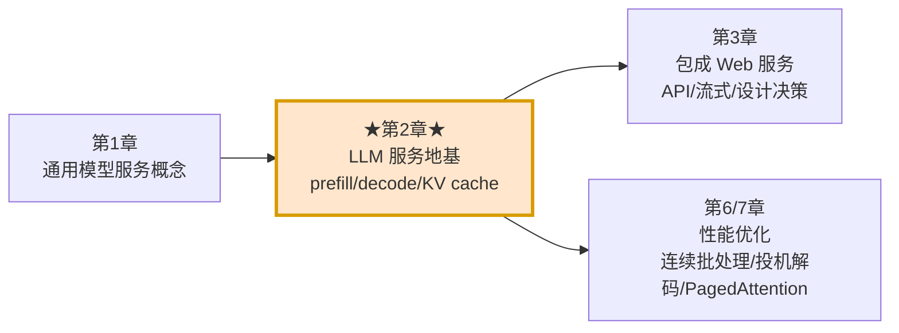

**读完这一章,你将能够:**

- ✅ 用一句话讲清 Transformer 的**自回归(autoregressive)**本质:一次生成一个 token,每个新 token 都依赖之前所有 token。
- ✅ 拆解 decoder-only Transformer 的三大件:**tokenizer + 若干 Transformer block + LM head**,并能读懂 Qwen 2.5 的真实结构。
- ✅ 亲手写出"逐 token 生成"的循环,理解为什么**不加优化**时,每个 token 越生成越慢。
- ✅ 讲透 **KV cache(键值缓存)**:它省了什么、代价是什么、为什么是"用显存换算力"。
- ✅ 区分 **prefill(预填充)与 decode(解码)** 两阶段的截然不同的计算特征(一个吃算力、一个吃显存带宽),并知道该针对哪个阶段做优化。
- ✅ 理解请求生命周期与 **token 流式返回(streaming)**、**批处理(batching)** 为什么是生产级性能的关键。
- ✅ 说清 LLM 服务相对普通 ML 服务的三大独特挑战:**变长、状态(KV)、显存压力**。

> 💡 **一句话定位**:本章不教你训练 Transformer 的数学,而是给你一副**服务视角(serving-oriented)的眼镜**——看清 LLM 推理时的执行模式(execution pattern),因为**这个执行模式驱动了 LLM 服务系统里几乎所有的设计决策**。

---

## 一、走进 Transformer 的"大脑" 🧠

### 1.1 LLM 简史:为什么架构演进值得服务工程师关心

很多人觉得"历史"只是背景知识,可有可无。但作者强调:**LLM 的演进史,直接解释了今天模型的设计选择、架构模式和执行行为**——而这些正是推理与优化工作的根基。

| 年代 | 里程碑 | 关键突破 | 对"服务"的含义 |
|------|--------|----------|----------------|
| 2013 | **Word2Vec**(Google, Mikolov 等) | 把词映射成连续空间里的稠密向量(embedding),捕捉语义关系 | 引入了"embedding 层"这个至今仍在的组件 |
| 2013 | **RNN** 流行 | 用循环结构建模序列的时序依赖 | ⚠️ 只能**顺序处理**,一步一个时间步,天然难并行 |
| 2014 | **LSTM / GRU** | 门控机制 + 记忆单元,缓解长程依赖 | 仍难并行,GPU 利用率上不去 |
| 2017 | **Transformer**(《Attention Is All You Need》) | 用**自注意力(self-attention)+ 位置编码**替换循环层 | 🔑 **可并行处理** + 高效捕捉长程依赖——这是 GPU 时代 LLM 得以规模化的根本原因 |
| 2018 | **BERT / GPT** 分家 | 预训练(pre-training)范式:先在海量无标注文本上自监督学习,再微调 | BERT=双向 encoder(擅长理解);GPT=单向 decoder(擅长生成) |
| 2018→今 | **规模化(scaling)** | GPT-1(1.17 亿)→ GPT-3(1750 亿)→ DeepSeek R1(6710 亿) | 参数量爆炸 → "大"语言模型这个词由此而来;显存/算力压力随之而来 |

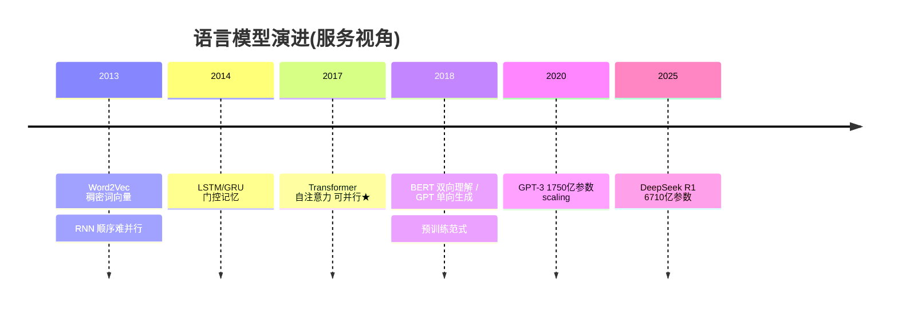

> 🔬 **第一性原理:为什么 Transformer 能"赢"?**
> RNN 的致命伤是**串行**——第 $t$ 步的计算必须等第 $t-1$ 步算完。这在训练时意味着无法把整条序列铺给 GPU 并行算。Transformer 用自注意力一举打破串行:**一整条输入序列的所有 token 可以同时计算注意力**。这不是"效果更好一点点",而是**把序列建模从 O(串行) 变成 O(可并行)**,直接契合 GPU 的大规模并行硬件。理解这点,你才能理解后面 prefill 为什么"吃算力"(它就是在并行处理整条 prompt)。

> ⚠️ **常见坑 / 术语约定**:本书里 **LLM 和 Transformer 特指 decoder-only 架构**(只用了原始 Transformer 的 decoder 栈,由 OpenAI 2018 年 GPT 论文发扬光大),如 GPT、Llama、Qwen。**不是** encoder-decoder(翻译/摘要那类)。全书还把 `input text / input sequence / prompt` 当同义词,把 `token` 和 `word` 混用——但严格说 token 由分词器(tokenizer)算法决定,可能是整词、子词甚至标点,**英文里平均 1 token ≈ 0.75 个词**。

### 1.2 自回归(Autoregressive)本质:一次一个 token

这是理解 LLM 服务的**第一块基石**。LLM 的定义性特征就是**自回归**:一次生成一个 token,每个新 token 都基于**之前所有 token**(prompt + 已生成的部分)来预测。

用书里那个经典例子:prompt = "Write a short introduction about the US capital city"

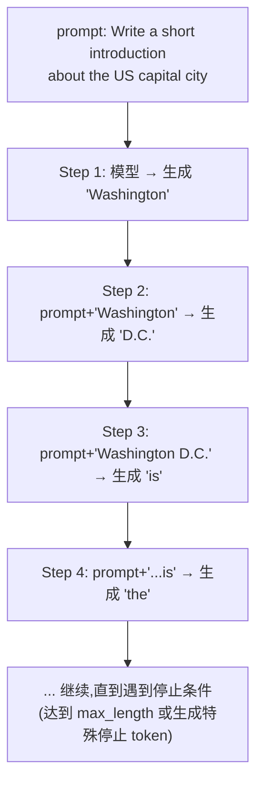

- **Step 1**:模型收到初始 prompt,生成第一个 token:`Washington`。
- **Step 2**:把 `Washington` **追加**回输入序列,再喂给模型,生成 `D.C.`。
- **Step 3**:输入现在含 `Washington D.C.`,生成 `is`。
- **Step 4**:序列加上 `is`,生成 `the`。
- ……如此往复,**每一步都把上一步的输出拼回输入**,直到遇到停止条件。

> 💡 **这个"拼回去再喂"的动作,是本章后面所有性能问题的源头**。记住它:序列会**越长**,每步要处理的上下文就**越多**。

### 1.3 Decoder-only Transformer 架构:三大件

现在打开"Transformer LLM 盒子",看内部。作者把 decoder-only 模型概念性地拆成三个关键组件:

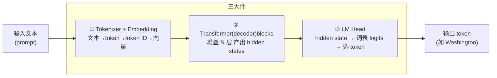

**① Tokenizer 与 Embedding(第一步)**
- **切词**:按固定词表(vocabulary)把原始文本切成离散 token。
- **转 ID**:把 token 转成 token ID(数值表示),这些 ID 映射到词表里的实际文本。
- **查表成向量**:通过 embedding 层把 token ID 映射成向量嵌入(vector embedding),给后续 Transformer block 准备好可处理的输入。

  书里的具体例子(用 OpenAI tokenizer 工具):输入 "Write a short introduction about the US capital city" 被切成 **11 个 token**:`["\"", "Write", "a", "short", "introduction", "about", "US", "capital", "city", "\""]`,对应 token ID `[1100, 10930, 261, 4022, 22575, 1078, 290, 2952, 9029, 5030, 693]`,再各自映射成一个向量,例如 token ID 1100 → `[-0.12, 0.55, 0.98, ...]`。

**② Transformer(decoder)blocks(第二步)——计算的心脏 ❤️**
- 这是**绝大部分计算(和学习)发生的地方**。多个 decoder block **堆叠**(如 12、24 层甚至更多),让模型逐 token 建立起对 prompt 和已有输出的丰富上下文理解,再预测下一个。
- 输出是 **hidden states(隐状态)**——输入 token 的"带上下文的表示",本质是形状为 **[N, d]** 的张量:$N$ = 序列 token 数,$d$ = 隐状态维度(如 768、2048、4096,视模型而定)。
- 这些 hidden states 传给下一个组件 LM head。**大多数情况下,只有最后一个 token 对应的最终 hidden state 被用来预测下一个 token**。(记住这句,它解释了 decode 阶段的计算特征)

**③ Language Modeling(LM)Head(第三步)**
- **映射到 logits**:把 Transformer 出来的 hidden state 映射到**词表 logits**——即词表里每个 token 的一个(未归一化的)概率分布。
- **选 token**:根据 logits 选出输出 token。通常选概率最高的那个。例如书里图中 LM head 选了 `Washington`,备选还有 `London / New York / Cat`。

#### 🔍 读懂真实模型:Qwen 2.5 配置

作者给出了检查真实模型配置的代码,这是**上手任何 LLM 前的推荐实践**:

```python
model_name = "Qwen/Qwen2.5-0.5B"
# 加载 Qwen2.5
model = AutoModelForCausalLM.from_pretrained(
    model_name,
    trust_remote_code=True,   # 允许执行模型仓库自带的自定义代码
    device_map="auto"         # 自动把模型分配到可用设备(GPU/CPU)
)

config = model.config          # 拿到配置对象
print(f"Hidden size: {config.hidden_size}")            # 隐藏层维度 d
print(f"Number of layers: {config.num_hidden_layers}") # decoder block 层数 N_layers
print(f"Number of attention heads: {config.num_attention_heads}")  # 注意力头数
print(f"Intermediate size: {config.intermediate_size}")# MLP 中间层维度
print(f"Vocabulary size: {config.vocab_size}")         # 词表大小
print(f"Maximum position embeddings:{config.max_position_embeddings}") # 最大序列长度
```

**逐行拆解**:`from_pretrained` 下载并加载权重;`config` 是模型的"身份证";逐个打印架构超参。跑出来的 Qwen 2.5-0.5B 真实数字:

| 参数 | 值 | 服务含义(💡为什么工程师要看它) |
|------|-----|-------------------------------|
| Hidden size `d` | **896** | 决定每个 hidden state 向量的大小,直接影响 **KV cache 每 token 的显存占用** |
| Number of layers | **24** | 层数越多,KV cache 要为**每一层**都存 K、V,显存 ×24 |
| Attention heads | **14** | 多头注意力的并行度 |
| Intermediate size | **4864** | MLP(FFN)中间层维度,FFN 是显存/算力大户 |
| Vocab size | **151936** | 词表越大,LM head 的 logits 越大,embedding 表越大 |
| Max position embeddings | **32768** | 支持的最大上下文长度(32K),超了会出问题 |
| **Total parameters** | **494,032,768**(约 4.94 亿) | 直接决定权重占用的显存基线 |

> 💡 **实战 / 面试高频**:面试官爱问"上线一个模型前你会先看什么?"——标准答案就是**先 inspect config**。配置里的层数、hidden 维度、头数、词表大小,能让你**估算 GPU 显存需求、选服务策略(量化/批处理)、规划优化(层级并行/模型分片)**。这不是走过场,是省钱省事故的第一步。

#### Transformer block 内部:自注意力 + FFN

再放大一个 decoder block,里面是两个主要组件:

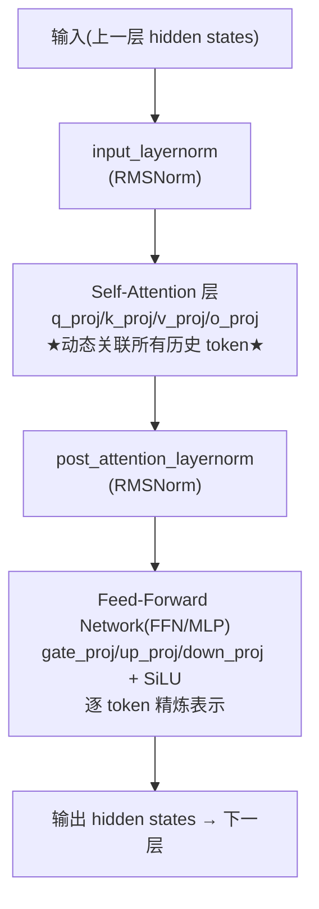

- **自注意力层(Self-attention)**:Transformer 的**灵魂组件**。它通过按含义和相对位置**动态关联输入 token**,把上下文信息融进来。直白说:生成下一个词时,让模型**回看 prompt 里所有之前的 token,并给每个赋予不同的重要性权重**。上下文能消歧、能保证连贯理解——例如 "I saw a dog chasing a squirrel, and **it** climbed up the tree",没有上下文你都不知道 `it` 指狗还是松鼠。
- **前馈神经网络(FFN)**:把某个 token 的理解**精炼成更强的表示**——通常是稠密的高维向量(如 768 或 4096 维)。它做**逐 token 的变换**,利用注意力层给的上下文,叠加训练中学到的全部知识,在预测前给出精炼后的 token 表示。

Qwen 2.5 的真实 decoder 层结构(书里代码打印出来的):
```
0: Qwen2DecoderLayer
   self_attn: Qwen2Attention
      q_proj / k_proj / v_proj / o_proj: Linear     # Q/K/V 投影 + 输出投影
   mlp: Qwen2MLP
      gate_proj / up_proj / down_proj: Linear        # 门控 MLP
      act_fn: SiLU                                    # 激活函数
   input_layernorm / post_attention_layernorm: Qwen2RMSNorm  # 归一化
```

> 💡 **为什么要知道这个结构?** 因为**注意力密集(attention-heavy)的 block 能从融合注意力核(fused attention kernel)或自定义 CUDA 实现中受益**——后续章节的优化,靶子就在这里。你不知道 q_proj/k_proj/v_proj 长什么样,就无从谈 KV cache、无从谈算子融合。

### 1.4 注意力计算:Q、K、V 一图讲透

自 2017 年《Attention Is All You Need》后,自注意力就成了 Transformer 让每个 token "看向"其他 token、权衡相关性来算自身表示的主要机制。

书里用 `capital` 这个 token 举例:处理 prompt 时,在 `capital` 处,自注意力让模型:
- **回看 `US`** → 明白 `capital` 指"国家的首都",不是"金融资本(financial capital)"。
- **参考 `introduction`** → 知道要写得简洁、概括。
- **用 `Write`** → 知道整体任务是"指令式写作"。

**计算过程(一句话版)**:对每个 token,LLM 算出三个向量——**query(Q)、key(K)、value(V)**。某 token 的注意力分数 = 用它的 Q 与序列中**所有** token 的 K 做点积 → 缩放 → softmax 得权重 → 用权重对 V 做加权和。这个结果就是该 token **融入了全序列上下文**后的更新表示。公式:

$$
\text{Attention}(Q, K, V) = \text{softmax}\!\left(\frac{Q K^{\mathsf{T}}}{\sqrt{d_k}}\right) V
$$

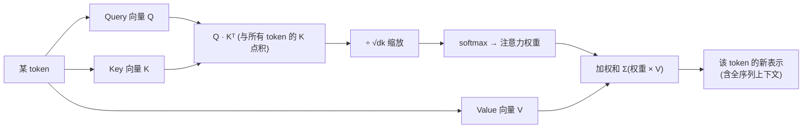

**多头注意力(Multi-head attention)**:不是对每个 token 只做一次注意力,而是做**多次(每个称一个 head)**,每个 head 有自己的 Q/K/V 投影。这让模型**并行**捕捉不同类型的关系(句法的、位置的、语义的)。各 head 的输出**拼接**后过一个线性层,得到最终注意力输出。

> 🔬 **第一性原理:为什么注意力是"平方复杂度"的元凶?**
> 因为每个 token 的 Q 要和**所有** token 的 K 点积。序列长 $N$,那就是 $N \times N$ 次点积 → **$O(N^2)$** 的计算与内存。这是 prefill 阶段"吃算力"的数学根源,也是长文本(比如 500 页 PDF)推理为什么这么贵的原因。序列翻倍,注意力开销**翻四倍**。

> ⚠️ **常见坑:别被数学吓退**。作者反复强调——**对做 LLM 服务的工程师,概念性理解注意力就够了,不必啃矩阵推导**。你真正需要记住的只有两点:① 注意力**计算密集**,尤其在 prefill 阶段;② 它的**内存和延迟随输入序列长度增长**。有了这两点,你就能调推理性能、实现 KV cache、跨 GPU 分配负载。想深入可看《The Illustrated Transformer》博客,或《Hands-On Large Language Models》《Build a Large Language Model (From Scratch)》两本书。

---

## 二、逐步实操 LLM 生成:看清引擎盖下面 🔧

这一节是本章的**动手核心**。目标不是教 Transformer 理论,而是建立一个**面向服务的心智模型**——因为这个执行模式驱动几乎所有 LLM 服务系统的设计决策。

> ⚠️ **注意**:演示代码是**单请求、单序列**的,仅供教学,**不建议用于生产**。生产环境会用批处理、流式、优化过的框架来跑同样的执行模式。

### 2.1 最简单的跑法:Hugging Face pipeline

```python
# 初始化文本生成 pipeline —— 用 LLM 最简单的方式
generator = pipeline('text-generation', model='Qwen/Qwen2.5-0.5B')
prompt = "Write a short introduction about the US capital city."
# 生成文本,最多 50 token,返回 1 条序列
generated_text = generator(prompt, max_length=50, num_return_sequences=1)
print(generated_text[0]['generated_text'])
```
`pipeline` 对象把底层复杂度全抽象掉了,给你一个直白的 `generator()` API。方便,但**看不到内部**。所以下面要拆开看。

### 2.2 逐行手写 token 生成(Example 2-1,无 KV cache)

改用 `AutoModelForCausalLM` 手动加载,**完全掌控**生成配置、输入和解码策略:

```python
# (1) 加载分词器和模型
model_name = "Qwen/Qwen2.5-0.5B"
tokenizer = AutoTokenizer.from_pretrained(model_name, trust_remote_code=True)
model = (
    AutoModelForCausalLM.from_pretrained(model_name, trust_remote_code=True,)
    .to("cuda" if torch.cuda.is_available() else "cpu")   # 有 GPU 用 GPU
)

# (2) 定义输入 prompt(书里是一段关于人类通信史的长文)
prompt = """The history of human … How might the next wave of
communication tools shape our relationships, societies, and sense of identity?"""

# (3) 分词:把 prompt 转成模型能懂的 input_ids
max_new_tokens = 100
idx = tokenizer(prompt, return_tensors="pt").input_ids.to(model.device)
start_time = total_time = time.time()
times = []

# (4) 主生成循环 —— 一个一个地生成 token
for _ in range(max_new_tokens):
    # (A) 设置当前上下文:注意 idx_cond = idx 是【整条序列】
    idx_cond = idx
    with torch.no_grad():                 # 推理不需要梯度,省显存
        # (B) 前向:给整条 idx_cond 生成下一 token 的候选
        outputs = model(idx_cond)
        logits = outputs.logits           # 原始预测分数

    # (C) 从预测里选下一个 token
    logits = logits[:, -1, :]             # ★只取【最后一个 token】位置的 logits
    probas = torch.softmax(logits, dim=-1)# logits → 概率分布
    idx_next = torch.multinomial(probas, num_samples=1)  # 按概率采样一个 token
    print("Next Token is:", tokenizer.decode(idx_next[0]))
    time_cost = time.time() - start_time
    times.append(time_cost)

    # (D) 把新 token 追加回输入序列 ★关键:序列变长了
    idx = torch.cat((idx, idx_next), dim=1)

    # (E) 若生成了结束符 EOS,则停止
    if idx_next.item() == tokenizer.eos_token_id:
        print("\n[Generation completed - EOS token reached]")
        break

# (5) 解码整条生成序列
generated_text = tokenizer.decode(idx[0], skip_special_tokens=True)
```

**逐行讲透关键点**:
- **(A) `idx_cond = idx`**:每一轮都把**整条(不断变长的)序列**当输入——这是"无 cache"的标志。
- **(B) `outputs = model(idx_cond)`**:一次前向传播,对序列里**每个位置**都算了 logits。
- **(C) `logits[:, -1, :]`**:但我们**只要最后一个位置**的 logits(下一个 token 的预测)。前面那些位置的计算……在这一步被丢掉了(伏笔!)。
- **`softmax` + `multinomial`**:把分数变概率,再**采样**(不是永远取 argmax,采样带来随机性/多样性)。
- **(D) `torch.cat`**:把新 token **拼回** `idx`,序列 +1。**下一轮 (A) 又要处理更长的序列。**

**实测结果**:生成 100 token 用了 **9.1205 秒**,平均约 **0.09 秒/token**。而且书里的图 2-8 显示一个规律:**除第一个 token 外,每 token 的生成时间逐渐变长**。

> 🔬 **第一性原理:为什么越生成越慢?**
> 因为 (D) 每步把新 token 拼回去,序列越来越长;(A)(B) 每步都对**整条更长的序列**重新做前向、重新算注意力。序列长 $N$,注意力是 $O(N^2)$,$N$ 一步步涨,每步都在**重算所有之前 token 的注意力**——这些历史 token 的 K、V 上一轮明明算过!这就是图 2-9 揭示的**巨大浪费**:重复计算已知 token 的注意力,昂贵且不必要。

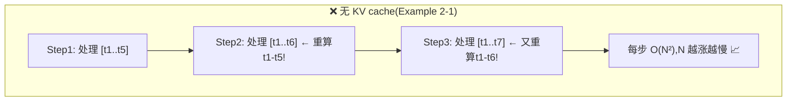

一个 ML 工程师看到这里的自然反应:**能不能别重算,只算新 token?** —— 这就引出 KV cache。

### 2.3 KV Cache:用显存换算力 💾

**核心想法**:如果能把之前所有 token 算出的 **key 和 value 向量缓存下来**,那每生成一个新 token,就**只需处理新加的这个 token**,而不必对整条序列重算注意力。

**KV cache 做的就是这件事**:它**逐层**存下之前已生成 token 的注意力 keys 和 values,让模型在解码(decode)时**跳过冗余计算**。

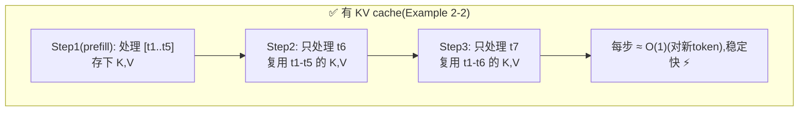

代码(Example 2-2,启用 KV cache):

```python
# (1) 定义 KV cache,初始为空
past_key_values = None
for _ in range(num_interations):
    print("input_ids size: " + str(input_ids.size()))  # 注意观察:它会一直是 1!
    with torch.no_grad():
        outputs = model(
            input_ids=input_ids,
            past_key_values=past_key_values,  # (2) 传入上一轮的 KV cache
            use_cache=True,                   # (2) 开启 KV 缓存
            max_new_tokens=100, min_new_tokens=100)
        logits = outputs.logits
        # (3) 更新 KV cache —— 把这一轮新算的 K,V 存起来
        past_key_values = outputs.past_key_values
        torch.cuda.synchronize()

    logits = logits[:, -1, :]
    probas = torch.softmax(logits, dim=-1)
    generated_token_id = torch.multinomial(probas, num_samples=1)

    # (4) ★关键★ 输入只用【新生成的那一个 token】,不再拼接整条历史
    input_ids = generated_token_id
    idx = torch.cat((idx, generated_token_id), dim=1)  # idx 仅用于最后拼输出文本

    if generated_token_id.item() == tokenizer.eos_token_id:
        print("\n[Generation completed - EOS token reached]")
        break
```

**Example 2-1 vs 2-2 的三处核心差异**:

| # | 无 cache(2-1) | 有 cache(2-2) |
|---|----------------|----------------|
| 输入 | `idx_cond = idx`(**整条**变长序列) | `input_ids = generated_token_id`(**仅新 token**) |
| 传参 | `model(idx_cond)` | `model(input_ids=..., past_key_values=past_key_values, use_cache=True)` |
| 状态 | 无 | 每轮 `past_key_values = outputs.past_key_values` **更新缓存** |

**实测对比**:同样生成 100 token,**无 cache 9.12 秒 → 有 cache 3.14 秒**(约 **2.9×** 加速)。而且无 cache 时间**稳步上升**(序列越长越慢),有 cache 时间**第一个 token 后趋于平稳**。

> 💡 **KV cache 的本质是一笔交易:用增加的显存,换取巨大的算力节省。** 把"全序列重算"变成"增量式、缓存增强"的工作流。这是 LLM 服务里**最重要、最基础的优化**,没有之一。

> ⚠️ **常见坑:KV cache 不是免费午餐**。它把显存吃掉了。KV cache 的大小 ≈ `2(K和V) × 层数 × 序列长度 × 注意力维度 × batch × 精度字节数`。序列越长、并发越多,KV cache 越可能**撑爆显存**——这正是本章末尾要讲的"显存压力"挑战,也是第 6/7 章 PagedAttention 等技术要解决的问题。

> 🔬 **第一性原理:为什么缓存 K、V,不缓存 Q?**
> 注意力里,新 token 需要用**它自己的 Q** 去和**所有历史 token 的 K** 点积、再对**所有历史 token 的 V** 加权。历史 token 的 K、V **每轮都一样**(它们的表示不再变),所以能缓存复用;而新 token 的 Q 每轮都不同、且只需要当前这一个,没必要缓存。所以是 **KV** cache,不是 QKV cache。

### 2.4 Prefill 与 Decode 两阶段:最重要的一对概念 ⚖️

有了 KV cache,自然就把生成劈成了两个**计算特征截然不同**的阶段。这对术语在 LLM 服务领域**无处不在**,尤其在性能优化和可扩展性讨论里。

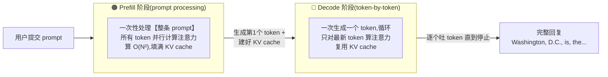

**Prefill 阶段(预填充 / prompt processing)**
- 模型**一次性处理整条输入 prompt**。
- **计算密集(compute-intensive)**:因为要对 prompt 里**所有 token**并行地算注意力,复杂度**随序列长度平方增长($O(N^2)$)**。
- 好处是能**利用并行**——所有 prompt token 同时算,相对高效地占满 GPU 算力。产出第一个 token,同时把 KV cache 填好。

**Decode 阶段(解码 / token-by-token generation)**
- 模型**一次生成一个 token**,循环往复,序列增长。
- 计算通常**只聚焦最新那一个 token**(靠 KV cache 复用历史)。
- **内存密集(memory-intensive / 显存带宽受限)**:主要瓶颈是**频繁加载模型权重**和**不断增长的 KV cache**。每生成一个 token 都要把整套权重从显存读一遍,而实际算的却只有一个 token —— 算力闲着,带宽跑满。

**实测印证**(书里图 2-13,开了 KV cache):第一根柱子(生成第 1 个 token = prefill)**明显更耗时**(要处理整条 prompt);后续柱子(decode)**又短又稳**(靠缓存,每次只生成一个)。

#### 两阶段特征对比表(⭐面试必背)

| 维度 | 🟠 Prefill(预填充) | 🔵 Decode(解码) |
|------|--------------------|------------------|
| 处理对象 | 整条 prompt(N 个 token) | 每次 1 个新 token |
| 并行度 | 高(所有 token 齐算) | 低(串行,一个接一个) |
| 计算复杂度 | $O(N^2)$,随 prompt 长度 | 每步 ≈ $O(N)$(与历史长度)但每步只 1 token |
| **瓶颈类型** | **计算密集(compute-bound)** | **显存带宽密集(memory-bound)** |
| 主要开销 | 注意力大矩阵乘 | 反复加载权重 + KV cache 增长 |
| 产出 | 第 1 个 token + 填满 KV cache | 第 2、3、…、N 个 token |
| 典型耗时 | 首 token 慢(TTFT 主要来源) | 每 token 快而稳(TPOT / ITL) |

> 💡 **为什么区分两阶段如此关键?** 因为**优化靶子完全不同**:
> - **长 prompt、短生成**场景(如处理 500+ 页 PDF、RAG 塞一大堆上下文)→ **prefill 是瓶颈** → 优化方向:chunked prefill、并行、更强算力。
> - **短 prompt、长生成**场景(如聊天机器人回复、故事生成)→ **decode 是瓶颈** → 优化方向:KV cache 管理、连续批处理、投机解码、更高显存带宽。
> 知道哪个阶段主导你的负载,才能**对症下药**。第 6/7 章专门讲各阶段的优化技术。

> 💡 **面试高频**:很多推理系统(如 vLLM、SGLang,以及 PD 分离架构)的核心设计,都建立在"prefill 计算密集、decode 显存带宽密集"这一认知上。**PD 分离(Prefill-Decode Disaggregation)** 就是干脆把两阶段放到不同 GPU 池上跑,各自用最适合的硬件和批处理策略。能把这套讲清楚,推理岗面试基本稳了。

---

## 三、用服务框架跑 LLM:vLLM 登场 🏭

手写推理帮你理解原理,但真实应用**不会**用自建推理管线。生产环境靠**服务框架(serving framework)**,如 **vLLM** 和 **SGLang**——专门为加载预训练模型、通过 API(通常 REST 或 gRPC)对外提供实时/批量推理而设计。

**训练框架(PyTorch/TensorFlow)** 关注模型开发和基于梯度的学习;**服务框架**则为**高效、可扩展、低延迟的推理**而优化。它们提供的远不止"能跑推理":

- ✅ 高效解码,**KV-cache 复用**
- ✅ **请求调度**(如批处理 / 微批处理 micro-batching)
- ✅ **多用户并发**支持
- ✅ **Token 流式(streaming)、取消(cancellation)、中断处理**

好的服务框架(如 vLLM)还会**持续集成最新研究优化**——如 **PagedAttention(分页注意力)**、**speculative decoding(投机解码)**——同时把底层基础设施细节抽象掉,让你专注建应用,而不是为每种模型架构重写推理逻辑、追每一篇优化论文。

### 3.1 vLLM 基础用法

```python
import time
from vllm import LLM, SamplingParams

model_name = "Qwen/Qwen2.5-0.5B"
llm = LLM(model=model_name, dtype="float16")   # float16 半精度,省一半显存

prompt = """You are an expert AI historian writing a detailed chapter ..."""
# 采样参数:温度、核采样、最大生成 token
inference_params = SamplingParams(temperature=0.8, top_p=0.95, max_tokens=128)
outputs = llm.generate([prompt], inference_params)   # 一行搞定生成
for output in outputs:
    print(f"Generated text: {output}")
```
`LLM()` 和 `generate()` 把复杂度全抽象掉了。虽然简单,vLLM 却提供大量配置项来精调性能:

```python
model = LLM(
    model="Qwen/Qwen-7B",
    # —— 显存管理 ——
    swap_space=16,               # CPU 交换空间(GB),显存不够时换出到内存
    max_model_len=4096,          # 最大模型长度
    # —— PagedAttention 设置 ——
    block_size=16,               # 分页注意力的块大小(像 OS 内存分页)
    enable_prefix_caching=True,  # 前缀缓存:相同前缀的请求复用 KV
    # —— KV cache 管理 ——
    max_num_sequences=256,       # 最大并发序列数
    max_sequence_length=4096,
    # —— 性能优化 ——
    enable_chunked_prefill=True, # 分块预填充:把长 prompt 的 prefill 切块
    enable_cuda_graph=True,      # CUDA graph:减少内核启动开销
    # —— 系统设置 ——
    worker_use_ray=False,        # 是否用 Ray 做分布式服务
    disable_custom_all_reduce=False,
)

sampling_params = SamplingParams(
    temperature=0.7,   # 随机性:0.0=确定性(总取最高概率)
    top_p=0.9,         # 核采样(nucleus sampling)
    top_k=50,          # top-k 采样
    max_tokens=100,
    stop=["\n", "###"],# 停止序列:遇到就停
    frequency_penalty=0.1,  # 频率惩罚:抑制高频重复
    presence_penalty=0.1,   # 存在惩罚:鼓励谈新话题
    repetition_penalty=1.1, # 重复惩罚
    skip_special_tokens=True,
)
```

> 💡 vLLM **遵循 OpenAI 文本补全 API 的参数约定**,所以上手极快,迁移无痛。

### 3.2 性能对比:vLLM vs Hugging Face Transformers 📊

作者做了一个同 prompt、同模型的直接对比:

| 方式 | 单 prompt 耗时 | 相对 |
|------|---------------|------|
| Hugging Face `.generate()`(pipeline) | **19.58 秒** | 1× |
| **vLLM** | **1.12 秒** | **≈ 17× 更快** ⚡ |

而且许多基准测试里 vLLM 比 HF 的 `.generate()` 吞吐**高 10~20 倍**——**并发或批量推理时差距还会拉得更大**。

> 💡 **最佳实践:先简单,再优化(Start Simple, Then Optimize)**。真实开发里,团队可以**先用 Hugging Face Transformers 快速原型**(易用),再**迁移到 vLLM 上生产**,精调服务配置获得更好的延迟/吞吐/并发。vLLM 让你用最小工程开销拿到企业级性能。

---

## 四、请求生命周期与两大生产技术:流式 & 批处理 🌊📦

### 4.1 一个 LLM 请求的完整生命周期

把前面所有概念串起来,一个请求从进到出经历了什么:

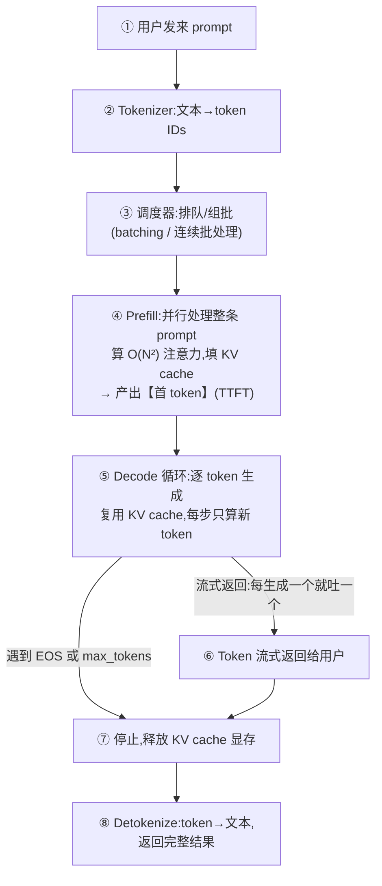

关键指标(生产必看):**TTFT(Time To First Token,首 token 延迟)** 主要由 prefill 决定;**TPOT / ITL(每 token 时间 / token 间延迟)** 由 decode 决定;**Throughput(吞吐,token/s 或 req/s)** 由批处理效率决定。

### 4.2 流式服务(Streaming):别让用户干等 ⏳

在前面 vLLM 的例子里,`llm.generate([prompt], inference_params)` **要等整个输出全生成完才返回**。在 Web 服务(如聊天机器人)里,这意味着用户要**等好几秒甚至几分钟**才看到任何回应——取决于输出长度。

对话式界面(聊天机器人)或需要实时反馈的场景(直播字幕、实时摘要),这种延迟会**严重伤害用户体验**:慢响应会让人烦躁、降低留存、最终砸了业务目标。

**解决方案:LLM 流式(streaming)**——既然 decode 阶段本来就是一个个顺序生成 token,那就**每生成一个 token 就立刻返回它**,而不是等全部完成。

```python
# 初始化 vLLM 异步流式引擎参数
engine_args = AsyncEngineArgs(
    model="Qwen/Qwen2.5-0.5B", dtype="float16", ...
)
# ★用 AsyncLLMEngine(异步引擎),而非普通 LLM 类★
engine = AsyncLLMEngine.from_engine_args(engine_args)

async def generate_text(prompt: str, max_tokens: int = 100):
    try:
        sampling_params = SamplingParams(
            temperature=0.0, max_tokens=max_tokens, stop=["\n"],
        )
        request_id = "test-request"       # 每个请求的唯一 ID(取消时要用)
        # generate() 返回一个【异步流对象】AsyncStream
        results_generator = engine.generate(
            prompt=prompt, sampling_params=sampling_params, request_id=request_id
        )
        final_output = None
        # ★用 async for 逐个拉取新生成的 token★
        async for request_output in results_generator:
            final_output = request_output
            for chunk in request_output.outputs:
                print(chunk.text, end="", flush=True)
                # 若是 Web 服务,这里可以 yield 返回这个 token chunk
        return final_output
```

**核心差异**:用 **`AsyncLLMEngine`** 而不是普通 `LLM` 类。它的 `generate()` 返回一个**异步流对象(AsyncStream)**,让你用 `async for` 循环**一个个拉出新 token**。

> 💡 **流式的另一大红利:中途取消(cancellation)**。用户发现输出跑偏了,可以随时叫停——vLLM 里调用 `engine.abort(request_id)` 即可。这既改善体验(不看无关/错误的补全),又**节省算力**——在讲究效率和成本控制的生产环境尤其重要。第 3 章会演示怎么在 Web 服务里落地流式。

### 4.3 批处理(Batching):榨干 GPU 吞吐 📦

到目前所有例子都是**一次一个 prompt**。原型阶段没问题,但高吞吐场景就成了瓶颈——比如**摘要 10 万篇文档、索引 5000 个 PDF、服务 2 万并发聊天用户**。一次处理一个,**根本扛不住**。

**批处理(batching)**:把多个输入请求**打成一组,在模型的单次前向传播里一起处理**。不再一次一个,而是让模型**并行**为多个 prompt 生成输出,显著提升吞吐。

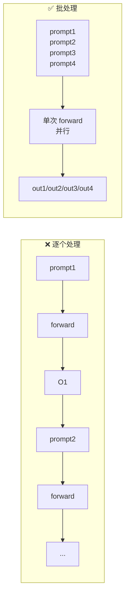

**为什么 LLM 特别适合批处理?** 因为 Transformer 的计算(矩阵乘、注意力)**能跨序列并行**。加上**共享的模型权重**和 **GPU 的并行算力**,批处理能以极小开销同时处理多个请求。(还记得 decode 是"显存带宽密集、反复加载权重"吗?批处理让**这一次加载的权重服务于整批请求**,摊薄了成本 —— 这是批处理提吞吐的本质。)

```python
prompts = [   # 4 条输入序列
    "What is the meaning of life?",
    "Write a short story about a robot learning to love.",
    "Explain quantum physics in simple terms.",
    "Translate 'Hello, world!' into Spanish."
]
sampling_params = SamplingParams(temperature=0.8, top_p=0.95, max_tokens=100)

start_time = time.time()
vllm_outputs = llm.generate(prompts, sampling_params)  # ★4 条打成一批一起处理★
batch_time = time.time() - start_time

start_time = time.time()
for prompt in prompts:                                 # 对照:一条条处理
    vllm_outputs = llm.generate([prompt], sampling_params)
onebyone_time = time.time() - start_time
```

**实测**:一批 4 个 prompt 用 **1.0626 秒**;逐个处理 4 个共 **2.3865 秒**。批处理带来 **2.2× 吞吐提升**。

> 💡 **还能更快:连续批处理(Continuous Batching)**。上面是"静态批处理"(等一批凑齐才开跑,还要等最长的那条结束)。**连续批处理**动态地在有请求完成时**立刻插入新请求**,不让 GPU 空转。2023 年 Anyscale 的研究显示,连续批处理可把 LLM 推理吞吐**提升高达 23 倍**,同时显著降低 p50 延迟。第 6 章详讲。

---

## 五、总纲:LLM 服务的三大独特挑战 🎯

把整章串成一条主线——**为什么服务 LLM 比服务普通 ML 模型难这么多?** 根本原因是三个 LLM 独有的特性:

```mermaid
mindmap
  root((LLM 服务<br/>三大挑战))
    变长 Variable-length
      prompt 长度千差万别
      输出长度事先不可知
      O(N²) 注意力随长度爆炸
      静态批处理难对齐 → 需连续批处理
    状态 Stateful KV
      自回归 → 必须维护 KV cache
      每个请求带着自己的缓存状态
      不是无状态请求,难简单扩缩容
      前缀共享/复用是优化点
    显存压力 Memory Pressure
      权重占显存基线
      KV cache 随序列/并发线性增长
      decode 是显存带宽受限
      OOM 风险 → PagedAttention 救场
```

### ① 变长(Variable-length)

普通 ML 模型输入形状固定(比如一张 224×224 图片)。LLM 的 **prompt 长度千差万别**,更要命的是**输出长度事先不可知**(生成到哪个 token 停,取决于内容)。这带来:

- 注意力的 $O(N^2)$ 开销随长度剧烈变化,**长 prompt(如 500 页 PDF)让 prefill 极贵**。
- 一批请求里各序列**长短不一**,静态批处理会因"等最长的那条"而浪费——这直接催生了**连续批处理**。

### ② 状态(Stateful — KV cache)

普通 ML 推理是**无状态**的:一个请求进、一个结果出,请求间互不相关,扩缩容简单。但 LLM 因为**自回归**,每个请求在生成过程中都携带着**自己不断增长的 KV cache 状态**:

- 请求**不是无状态的**,不能随便把中途的请求踢到另一台机器。
- 但状态里也藏着机会:**相同前缀(system prompt、few-shot 示例)的请求可以共享/复用 KV**(prefix caching)。

### ③ 显存压力(Memory Pressure)

这是三者里最"硬"的约束:

- **权重**占据显存基线(0.5B 模型约 1GB@fp16,7B 约 14GB,70B 约 140GB)。
- **KV cache** 随**序列长度 × 并发数**线性增长,长上下文 + 高并发下,KV cache 能**吃掉比权重还多的显存**。
- decode 阶段**显存带宽受限**,权重反复搬运,带宽成瓶颈。
- 一旦显存不够 → **OOM(Out Of Memory)崩溃**。这正是 **PagedAttention(把 KV cache 像操作系统内存那样分页管理)** 要解决的核心问题。

> 💡 **面试高频总结句**:"服务普通 ML 模型是**无状态、定长、算力受限**;服务 LLM 是**有状态(KV)、变长、显存与带宽受限**。所以 LLM 服务系统的三板斧是:**KV cache 管理(PagedAttention)、连续批处理、prefill/decode 感知的调度**。"背下这句,面试时能瞬间拉满印象分。

---

## 📌 本章小结

| 概念 | 一句话本质 | 为什么重要 |
|------|-----------|-----------|
| **自回归生成** | 一次一个 token,新 token 拼回输入再生成下一个 | LLM 一切性能问题的源头 |
| **三大件架构** | Tokenizer+Embedding → N 个 decoder block → LM head | 看懂真实模型(Qwen)、估显存、定优化靶 |
| **注意力 O(N²)** | 每 token 的 Q 和所有 token 的 K 点积 | prefill 计算密集、长文本昂贵的数学根源 |
| **KV cache** | 缓存历史 token 的 K、V,用显存换算力 | 最基础的优化,~3× 加速;也带来显存压力 |
| **Prefill 阶段** | 并行处理整条 prompt,**计算密集** | 决定 TTFT;长 prompt 场景的瓶颈 |
| **Decode 阶段** | 逐 token 生成,**显存带宽密集** | 决定 TPOT;长生成场景的瓶颈 |
| **服务框架(vLLM)** | KV 复用+调度+并发+流式,比 HF 快 ~17× | 生产标配,别自建推理管线 |
| **流式 streaming** | 每生成一个 token 立刻返回 + 可中途取消 | 对话式体验的生命线 |
| **批处理 batching** | 多请求单次前向并行,摊薄权重加载成本 | 提吞吐;连续批处理可达 ~23× |
| **三大挑战** | 变长 · 状态(KV) · 显存压力 | LLM 服务区别于普通 ML 服务的根本 |

**读完这章,你已经拥有了推理 LLM 性能、排查瓶颈、设计服务管线所需的核心心智模型。** 你能看着一个负载说出"这是 prefill-bound 还是 decode-bound",能解释 KV cache 省了什么又吃了什么,能讲清为什么要流式和批处理。**这就是后续所有优化章节的地基。**

---

## 🔗 延伸阅读

### 本书其它章节(承上启下)
- **第 1 章 · 模型服务导论** —— 通用 ML 服务的概念与范式(本章的上游)。
- **第 3 章 · 把 LLM 包成 Web 服务** —— 把本章的流式/批处理能力落地为真实 Web 服务,讲 API 结构、设计决策、运维最佳实践。
- **第 6 / 7 章 · 性能优化** —— 深入 KV cache 优化、**连续批处理(continuous batching)**、**投机解码(speculative decoding)**、**PagedAttention**、chunked prefill,以及 prefill/decode 各阶段的专项优化。

### 本仓库相关教程(强烈推荐配套阅读)
- 📂 [`llm-inference/KV-Cache优化.md`](../../llm-inference/KV-Cache优化.md) —— KV cache 的进阶管理与压缩技术,承接本章 §2.3。
- 📂 [`llm-inference/PD分离.md`](../../llm-inference/PD分离.md) —— Prefill/Decode 分离部署,把本章 §2.4 的两阶段思想落到集群架构。
- 📂 [`ai-infra-architecture/01_PD分离架构_Prefill_Decode_Disaggregation.md`](../../ai-infra-architecture/01_PD分离架构_Prefill_Decode_Disaggregation.md) —— PD 分离架构的系统级讲解。
- 📂 [`ai-infra-architecture/07_KVCache深入_PagedAttention_前缀缓存_量化压缩.md`](../../ai-infra-architecture/07_KVCache深入_PagedAttention_前缀缓存_量化压缩.md) —— PagedAttention / 前缀缓存 / KV 量化,对症本章"显存压力"挑战。
- 📂 [`ai-infra-architecture/09_推理引擎架构_连续批处理_调度_投机解码_chunked_prefill.md`](../../ai-infra-architecture/09_推理引擎架构_连续批处理_调度_投机解码_chunked_prefill.md) —— 连续批处理、调度、投机解码、chunked prefill,直接延续本章 §4.3。
- 📂 [`attention-optimization/`](../../attention-optimization/) —— FlashAttention 等注意力算子优化,深化本章 §1.4。
- 📂 [`llm-inference/`](../../llm-inference/)(README + 各引擎目录:vllm / lmdeploy / lightllm / tgi 等)—— 各主流推理框架实战。

### 经典外部资料(书中点名推荐)
- 📄 《Attention Is All You Need》(2017)—— Transformer 原始论文,§3.2.1 有 Scaled Dot-Product Attention 细节。
- 📄 《A Survey of Large Language Models》—— LLM 历史与发展的综述。
- 📝 《The Illustrated Transformer》博客 —— 非数学、直觉式讲透注意力计算。
- 📚 《Hands-On Large Language Models》/《Build a Large Language Model (From Scratch)》—— Transformer 与注意力的深入讲解。
- 🔧 [OpenAI Tokenizer Viewer](https://platform.openai.com/tokenizer) —— 直观看文本如何被切成 token。

---

> *本文为《Hands-On LLM Serving and Optimization》第 2 章(原书 pp.51–84)的逐章精讲。术语中英并列、从零基础到进阶,配数值实测、对比表、mermaid 图与代码逐行解读。下一章我们把这些服务能力包装成真实的 Web 服务。*
