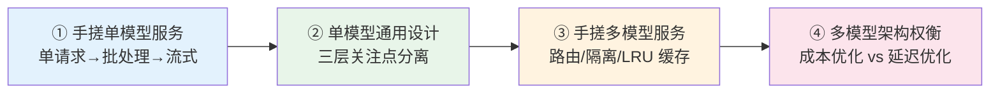
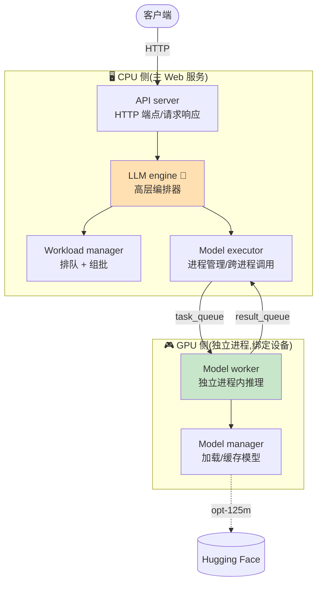
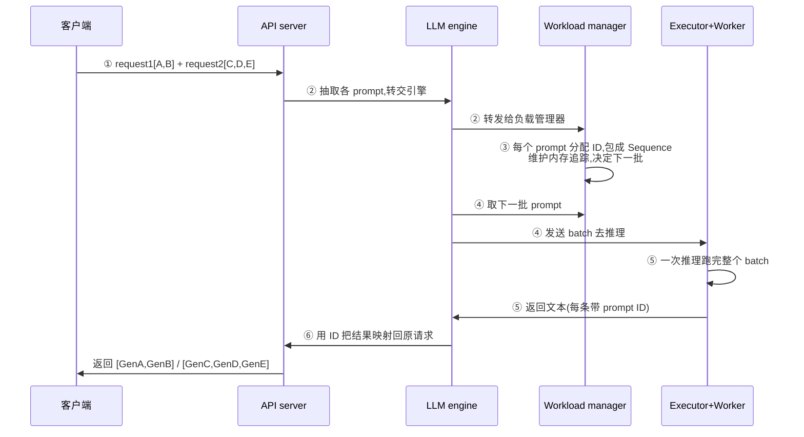
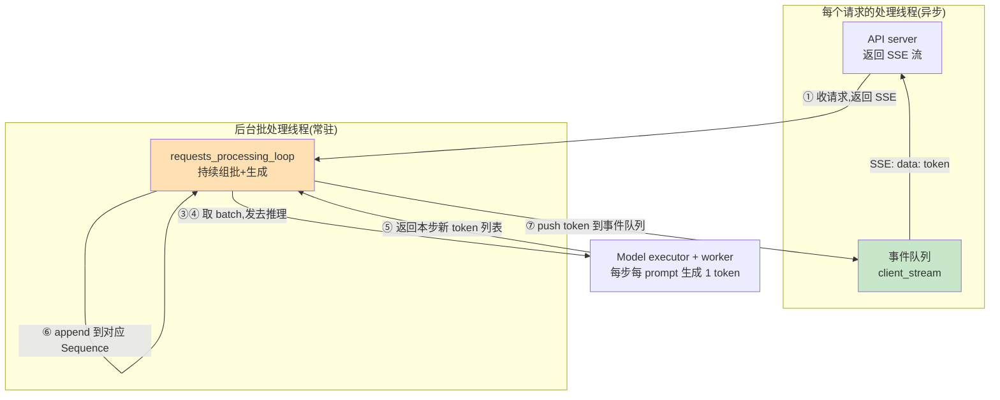
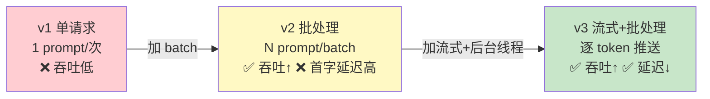
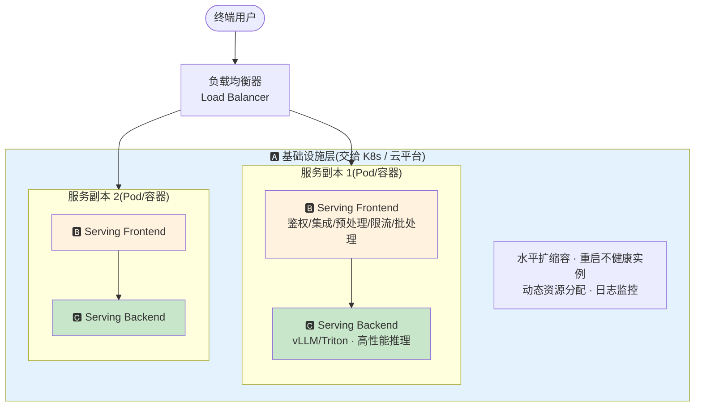
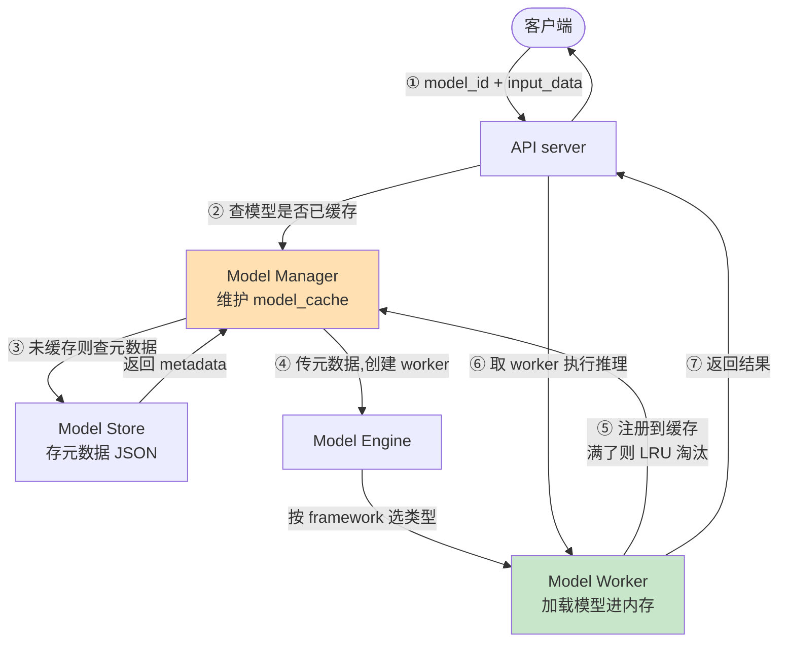
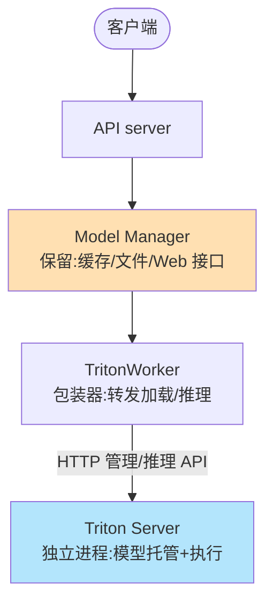
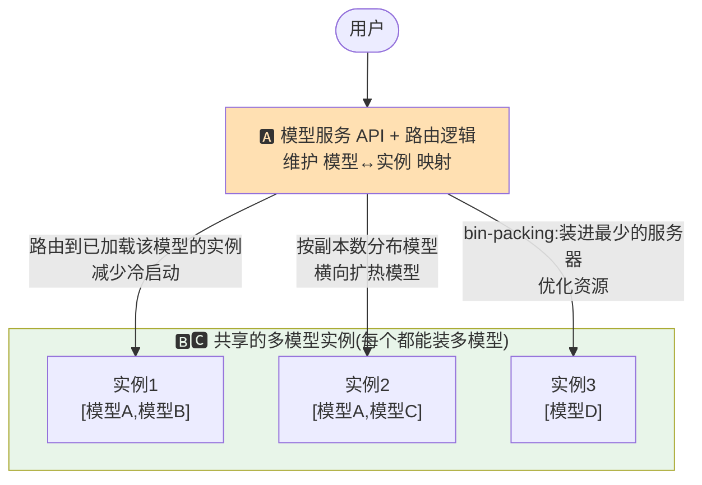
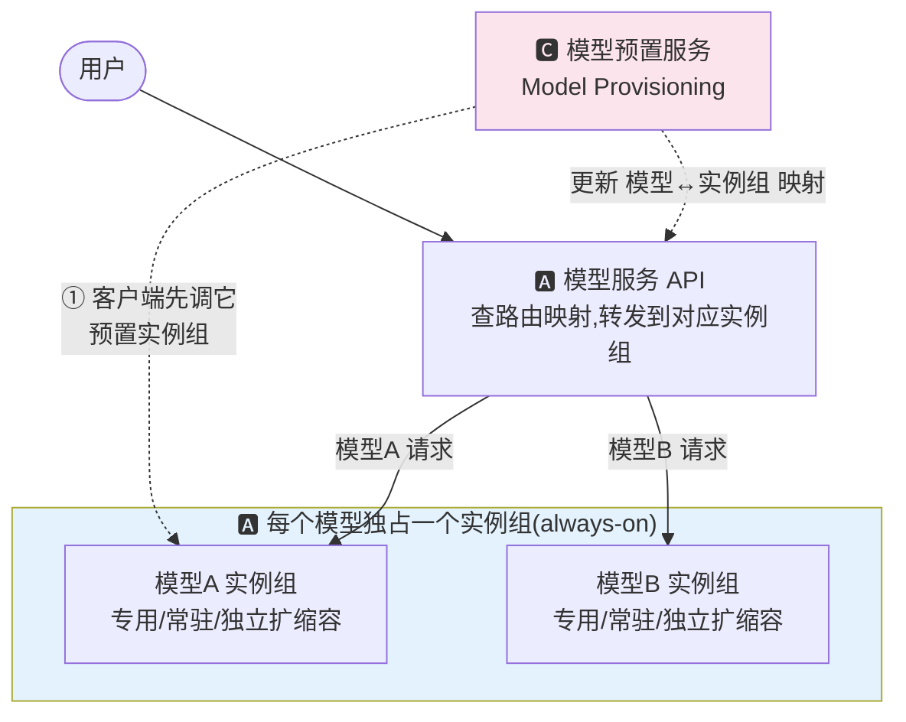

# 第 3 章 · 模型服务系统设计:深入 🏗️

> 对应原书 *Hands-On LLM Serving and Optimization*（Chi Wang, Peiheng Hu 著）第 3 章 **"Model Serving System Design: A Deep Dive"**（PDF 第 85–126 页）。
> 本篇是 llm-action 中文精讲系列的一章,面向"零基础到进阶"读者,把书里的每一个组件、每一段代码、每一张图讲透,并补充数值、对比表、mermaid 图与第一性原理。

---

## 🗺️ 本章地图:这一章在全书的位置

这本书的脉络是**从模型内部 → 到系统外部 → 到工程落地**:

| 章 | 主题 | 视角 |
|---|---|---|
| 第 1 章 | 模型服务范式导论(on-device / 单模型 / 多模型 / 平台) | 概念、范式 |
| 第 2 章 | LLM 如何做推理生成(Transformer / KV Cache / prefill-decode) | **模型层** |
| **第 3 章(本章)** | **如何把模型组织成一个完整的在线服务系统** | **系统层** ⬅️ 你在这里 |
| 第 4 章 | 服务最佳实践(Agent / 云 vs 开源 / 性能度量) | 落地、选型 |
| 第 5–7 章 | 瓶颈分析 + 核心/高级优化技术(批处理、量化、并行、PD 分离) | 优化 |
| 第 8 章 | 主流框架深挖(vLLM / TRT-LLM / SGLang / llama.cpp) | 框架 |

第 2 章告诉你"一个模型怎么吐 token",但一个真实的线上服务要面对**成千上万个并发用户、变长的输入输出、要流式、要高吞吐、要能扩缩容**。本章就是那座**从"模型"通向"生产系统"的桥**。

作者的教学策略非常清晰——**不从任何具体框架(vLLM/Triton)讲起,而是带你从零手搓两个"最小可用"的服务系统**,吃透第一性原理后,再看框架如何把这些机制"工业化"。

### 读完这一章,你能会什么 ✅

1. 说清一个单模型 LLM 在线服务的 **6 大核心组件**(API server / LLM engine / workload manager / model executor / model worker / model manager)各自负责什么、为什么这样切。
2. 亲手实现三件事:**单请求推理 → 批处理(batching)→ 流式+批处理(streaming with batching)**,并理解每一步为什么要引入新组件。
3. 理解 **为什么模型执行要放到独立进程**(CPU–GPU 隔离)、**为什么每个 prompt 要单独追踪**(Sequence 抽象)。
4. 掌握单模型服务的**通用三层设计**(基础设施 / 业务逻辑 / 推理性能 的关注点分离)。
5. 手搓一个**多模型服务**(路由、隔离、LRU 缓存、按需加载、跨框架),并会用 **NVIDIA Triton** 替换后端。
6. 讲清多模型服务的两种架构权衡:**成本优化型 vs 延迟优化型**,以及冷启动、热模型扩缩容这两大痛点。

---

## 0️⃣ 开篇:为什么"手搓"比"直接用 vLLM"更值得学?

> 🔬 **第一性原理**:框架(vLLM、Triton)把复杂度**抽象**掉了,但抽象同时也把**关键的架构权衡藏了起来**。当你要 tune 性能、控成本、做扩容决策时,如果不懂底层机制,就只能瞎调参数。作者原话:"those abstractions also hide important architectural trade-offs"。

书中把整章拆成四大块,我们逐块精讲:



⚠️ **注意作者的定位**:书里这些实现是**故意简化**的教学代码(只在 CPU 上跑单个 `facebook/opt-125m`),**不是要替代 Triton / vLLM**,而是要暴露它们背后自动化掉的那些部件。你要学的是"骨架和思路",不是"抄一份生产代码"。

---

## 1️⃣ 从零构建在线单模型 LLM 服务

### 1.1 设计目标(Design Goals)

书里给这个练习定的目标是:**启动时加载一个 LLM,支持并发的生成请求,同时支持批量(batch)和流式(streaming)两种模式**。

虽然只跑一个能在 CPU 上运行的小模型,但它覆盖了未来扩展到"多节点、生产级、带高级优化"所需的**全部核心组件**。作者列出了这个练习要帮你理解的关键点:

- Web API 如何设计来处理生成请求(含批处理和流式)
- 一个典型的 LLM 请求处理流程长什么样
- 服务内部如何组织,才能灵活支持不同的 LLM 模型
- 并发请求如何被分组、如何按 batch 处理
- 流式生成在底层是怎么工作的
- 批处理和流式如何在同一个系统里共存
- **性能瓶颈通常出现在哪里**

### 1.2 服务架构:6 大核心组件 🧩

这是本章最重要的一张"零件清单"。请务必记牢这 6 个组件和它们的职责:

| 组件 | 英文名 | 职责(一句话) | 类比 |
|---|---|---|---|
| API 服务器 | API server | 处理 HTTP 端点、请求/响应 | 前台接待 |
| **LLM 引擎** | **LLM engine** | **高层编排器,端到端驱动整个推理** | **乐队指挥** 🎼 |
| 工作负载管理器 | Workload manager | 请求排队 + 批次管理 | 调度室 |
| 模型执行器 | Model executor | 管理进程、协调 worker 执行 | 车间主任 |
| 模型工作进程 | Model worker | 在**独立进程**里真正跑推理 | 一线工人 |
| 模型管理器 | Model manager | 加载并缓存模型 | 仓库管理员 |

> 💡 **面试高频**:被问"设计一个 LLM 推理服务",能顺畅地把这 6 层职责说清、并解释**为什么 model worker 要独立进程**,基本就赢了。

书中原文的一个绝妙比喻:**LLM engine 像乐队指挥(orchestra conductor)**——它初始化所有组件(包括加载模型),然后指挥每一个生成请求怎么被处理。

我们用一张架构图把它们串起来(对应书中 Figure 3-1):



#### 🔬 第一性原理:为什么 model worker 要放到独立进程?

这是全章最深刻的一个设计决策,书里花了整整一段解释,值得逐句拆解:

> "It's a standard practice to **isolate model execution in dedicated processes bound to specific GPU devices**. Meanwhile, the main web service remains on the CPU."

**原因链**:
1. **GPU 很贵** → 你绝不希望 GPU 空转等 CPU 干杂活。
2. CPU 要干的"杂活"包括:输入预处理、输出后处理、**tokenization / de-tokenization**、并发请求管理。
3. 如果把这些 CPU 任务和 GPU 推理放在**同一个进程**里,Python 的 GIL 和阻塞调用会让 GPU 频繁等待。
4. 于是:**所有计算密集型任务搬到独立进程**,主 Web 进程留在 CPU 上专心做"请求编排 + CPU–GPU 交互"。
5. 结果:**GPU 利用率(GPU utilization)最大化**。

⚠️ **常见坑**:初学者会觉得"一个进程搞定不就好了,搞多进程是过度设计"。但作者点破了——**真实生产系统里 LLM 跑在 GPU 上,这个多进程隔离是标准做法,不是 overkill**。这也是 vLLM 采用多进程 worker 架构的根本原因(第 8 章会深挖)。

---

### 1.3 实现 · 单请求处理(一次一个 prompt)

先从最简单的"一次处理一个请求"做起。书中的代码分四块,我们逐块逐行讲。

#### ① LLMEngine 初始化 —— 指挥就位

```python
class LLMEngine:
    def __init__(self):
        self.model_executor = ModelExecutor()      # 创建执行器
        self.workload_manager = WorkloadManager()  # 创建负载管理器
        self.max_tokens = 20                        # 每次最多生成 20 个 token

        # 初始化并启动 model worker,加载 opt-125m
        self.model_executor.setup_worker("facebook/opt-125m")
```

**逐行讲**:
- `model_executor` / `workload_manager`:LLM engine 在构造时就把两个下属组件建好(指挥进场,先把乐手安排好)。
- `max_tokens = 20`:限制单次生成长度,教学用,防止 CPU 上跑太久。
- `setup_worker(...)`:关键一步——**在启动阶段就把模型 worker 拉起来、模型加载好**。这样后续请求进来时模型已在内存,不用现加载。

> 💡 **实战要点**:"启动时加载模型(load at startup)"是所有在线服务的铁律。绝不能在请求到来时才加载几十 GB 的权重——那会带来几秒到几十秒的延迟。

#### ② ModelExecutor —— 用两个队列跨进程通信

```python
class ModelExecutor:
    def __init__(self):
        self.task_queue = mp.Queue()    # 模型请求队列(主进程 → worker)
        self.result_queue = mp.Queue()  # 模型结果队列(worker → 主进程)

    def setup_worker(self, model_name: str):
        self.worker_process = mp.Process(         # 创建单个 worker 进程
            target=ModelWorker.run,               # 进程入口函数
            args=(model_name, self.task_queue, self.result_queue)
        )
        self.worker_process.start()               # 启动 worker 进程
```

**逐行讲**:
- `mp.Queue()`:`mp` 是 Python 的 `multiprocessing`。**两个队列是主进程和 worker 进程之间唯一的通信桥梁**——这就是"进程间通信(IPC)"的最朴素实现。
  - `task_queue`:主进程往里塞 prompt。
  - `result_queue`:worker 把生成结果放进去,主进程来取。
- `mp.Process(...)`:创建一个真正独立的操作系统进程。`target=ModelWorker.run` 指定进程启动后执行哪个函数,`args` 把模型名和两个队列传进去。
- `.start()`:进程正式跑起来,开始 while 循环等待任务。

> 🔬 **第一性原理**:为什么用队列而不是直接函数调用?因为 worker 在**另一个进程**里,你不能像调用普通函数那样调用它。队列是"生产者-消费者(producer-consumer)"模式的经典实现:主进程是生产者(投喂 prompt),worker 是消费者(取出、推理、回填结果)。这套模式天然支持**异步**和**解耦**。

#### ③ ModelWorker + ModelManager —— 真正干活的工人

```python
class ModelWorker:
    def __init__(self, model_name: str):
        self.device = "cuda" if torch.cuda.is_available() else "cpu"
        self.model, self.tokenizer = ModelManager().load_model(model_name)

class ModelManager:
    def load_model(self, model_name: str = "facebook/opt-125m"):
        model = AutoModelForCausalLM.from_pretrained(model_name)   # 加载权重
        tokenizer = AutoTokenizer.from_pretrained(model_name)      # 加载分词器
        return model, tokenizer
```

**逐行讲**:
- `self.device = "cuda" if ... else "cpu"`:有 GPU 用 GPU,没有就退回 CPU(本例在 CPU 上跑)。
- `ModelManager().load_model(...)`:**model manager 的唯一职责就是"加载并缓存模型"**。它用 Hugging Face 的 `AutoModelForCausalLM`(因果语言模型,即 decoder-only 的 LLM)和 `AutoTokenizer` 把模型和分词器都取回来。

worker 的主循环:

```python
class ModelWorker:
    @staticmethod
    def run(model_name: str, task_queue: mp.Queue, result_queue: mp.Queue):
        worker = ModelWorker(model_name)      # 进程内实例化 worker(触发模型加载)
        while True:                            # 无限循环,常驻服务
            logger.debug("Waiting for batch from queue...")
            request = task_queue.get()         # 阻塞等待任务(队列空则挂起)
            result_queue.put(('complete', worker.generate(request)))  # 推理并回填
```

**逐行讲**:
- `@staticmethod def run(...)`:这是新进程的入口。它先在**新进程内部**实例化 worker(所以模型是在 worker 进程里加载的,不占主进程内存)。
- `while True`:worker 是一个**常驻的服务循环**,一旦启动就一直等活干。
- `task_queue.get()`:**阻塞式取任务**。队列为空时,这行会挂起等待,不消耗 CPU;有任务了立刻返回。
- `result_queue.put(('complete', worker.generate(request)))`:调用 `generate` 做推理,把 `('complete', 结果)` 元组塞回结果队列。

#### ④ 把 Web API 接起来 —— 完整的请求链路

```python
@app.post("/basic_generate", response_model=GenerateResponse)
async def basic_generate(request: GenerateRequest,
                         llm: LLMEngine = Depends(get_llm)):
    generated_text = llm.basic_generate(request.prompt)
    return GenerateResponse(generated_text=generated_text)

class GenerateRequest(BaseModel):
    prompt: str

class GenerateResponse(BaseModel):
    generated_text: str
```

**逐行讲**:
- `@app.post("/basic_generate")`:这是 FastAPI 的路由装饰器,定义了一个 POST 端点。
- `Depends(get_llm)`:FastAPI 的**依赖注入**——把全局唯一的 `LLMEngine` 实例注入进来(单例,模型只加载一次)。
- `GenerateRequest` / `GenerateResponse` 继承自 Pydantic 的 `BaseModel`:**自动做请求/响应的数据校验和序列化**。请求体只有一个 `prompt: str`,响应体只有一个 `generated_text: str`。

LLM engine 的编排逻辑:

```python
class LLMEngine:
    def basic_generate(self, prompt: str) -> str:
        sequence = Sequence(str(uuid.uuid4()), prompt, None, None)  # 包成 Sequence
        results = self.model_executor.execute(sequence)             # 交给执行器
        return results[0]['generated_text']

class ModelExecutor:
    def execute_batch(self, prompt: str):
        self.task_queue.put((prompts, False))   # 把 prompt 塞进 task 队列
        results = self.result_queue.get()        # 从 result 队列取结果(阻塞)
        return results
```

**逐行讲**:
- `Sequence(str(uuid.uuid4()), prompt, None, None)`:**给每个 prompt 分配一个全局唯一 ID(UUID),包装成 `Sequence` 对象**。这个 `Sequence` 抽象在后面批处理时会大放异彩——它是"追踪每个 prompt 执行状态"的载体。
- `model_executor.execute(...)`:引擎把 Sequence 交给执行器。
- `task_queue.put(...)` → `result_queue.get()`:执行器把任务投进队列,然后**阻塞等待**结果。这是一次完整的跨进程往返(round-trip)。

最后 worker 的推理实现:

```python
class ModelWorker:
    def generate(self, prompt: str):
        outputs = self.model.generate(...)                  # 模型生成(启动时已加载)
        generated_text = self.tokenizer.decode(outputs[0], …)  # token ids → 文本
        return {
            'request_id': prompt_data.id,      # 带上请求 ID,便于映射回去
            'generated_text': generated_text
        }
```

**逐行讲**:
- `self.model.generate(...)`:Hugging Face 的标准生成接口,把 prompt 喂进模型自回归地吐 token。
- `self.tokenizer.decode(...)`:**de-tokenization**——把模型输出的 token id 序列还原成人类可读文本。
- 返回时带上 `request_id`:**这是后面批处理能"把结果映射回正确用户"的关键**。

#### ⚠️ 这个版本的致命问题:吞吐太低

书中一针见血:如果你就这样上线,**第一个撞上的问题就是低吞吐(low throughput)**。因为用户一次只能发一个 prompt,worker 一次推理也只处理一个 prompt。

> 🔬 **第一性原理**(呼应第 2 章):LLM 推理是**内存带宽受限(memory-bandwidth bound)**的。加载一遍模型权重的成本很高,但一次只算一个 prompt,权重"读进来只用一次就扔了",算力被严重浪费。**把多个 prompt 组成一个 batch 一起算,权重读一遍能服务 N 个请求**,吞吐直接翻倍。这就是下一节要做批处理的根本动机。

---

### 1.4 批处理(Batching)—— 吞吐的第一次飞跃 🚀

#### 新 API:一次收一批 prompt

```python
@app.post("/generate", response_model=BatchGenerateResponse)
async def generate(request: BatchGenerateRequest):
    generated_texts = llm.generate(request.prompts)
    return BatchGenerateResponse(generated_texts=generated_texts)

class BatchGenerateRequest(BaseModel):
    prompts: List[str]              # 一次收一个 prompt 列表

class BatchGenerateResponse(BaseModel):
    generated_texts: List[str]      # 返回顺序与输入一一对应
```

**关键约定**:返回的 `generated_texts` 顺序必须和输入 `prompts` **严格一一对应**。

#### 批处理要解决的两个核心难题

书里用一个具体例子说明:假设收到两个请求——
- `request1` 含 2 个 prompt(promptA、promptB)
- `request2` 含 3 个 prompt(promptC、promptD、promptE)

要处理它们,必须解决两件事:

1. **跨请求组批**:把来自**不同请求**的 prompt 合并成大 batch,让 LLM 按大 batch 执行(而不是按请求执行),最大化资源利用。
2. **结果精确映射**:生成完后,要能把每个输出**准确映射回它原来所属的请求和顺序**,才能把结果返回给正确的用户。

#### 引入两个新武器:`Sequence` 对象 + `WorkloadManager`

为支持批处理,这一版引入了:
- 一个追踪数据结构 **`Sequence`**(每个 prompt 一个)
- 一个新组件 **`WorkloadManager`**
- 并给 LLM engine 加了额外职责

批处理的 6 步工作流(对应书中 Figure 3-3):



#### 核心代码 · WorkloadManager 的组批逻辑(Example 3-1)

```python
class Sequence:
    def __init__(self, seq_id: str, prompt: str, client_stream, loop):
        self.id = seq_id       # 唯一 ID
        self.prompt = prompt   # 原始 prompt
        self.output = []        # 输出缓冲区(存生成的 token)
        # ...

class WorkloadManager:
    self.batch_size = 4   # 一批最多 4 个 prompt

    def add_request(self, prompt: str) -> str:
        request_id = str(uuid.uuid4())                 # 分配唯一 ID
        sequence = Sequence(request_id, prompt, None, None)  # 包成 Sequence
        self.incoming_queue.put(sequence)              # 进入"待处理队列"
        self.sequence_map[request_id] = sequence       # 存进"ID→Sequence"映射表
        return request_id

    def get_next_batch(self) -> List[Sequence]:
        # FIFO 策略:从队头取,直到凑满 batch_size 或队列空
        while len(self.active_sequences) < self.batch_size \
              and not self.incoming_queue.empty():
            sequence = self.incoming_queue.get()
            self.active_sequences.append(sequence)
        return self.active_sequences
```

**逐行讲透**:
- `Sequence` 有三个关键字段:`id`(身份)、`prompt`(内容)、`output`(输出缓冲区)。**它是整个服务里"管理 LLM 执行工作负载"的最小单元**。
- `add_request`:做三件事——分配 UUID、包成 Sequence、同时放进 `incoming_queue`(排队用)和 `sequence_map`(通过 ID 快速查找用)。
- `get_next_batch`:两个关键设计——
  1. **FIFO(先进先出)策略**:谁先进队谁先被选进 batch。
  2. **batch 上限 = 4**:一次最多攒 4 个 prompt。

> 💡 **面试高频**:书里明确点出批处理的两个关键参数——**批处理策略(batching strategy)** 和 **batch size**。它们对吞吐影响巨大,而且要根据"具体模型、prompt 特征、流量形态、硬件"反复调优。本例用最简单的 FIFO 只是为了建立直觉,真实系统用的是 **动态批处理(dynamic batching)** 和 **连续批处理(continuous batching)**(第 6、7 章详解)。

#### 核心代码 · LLMEngine 的结果映射(Example 3-2)

```python
class LLMEngine:
    def generate(self, prompts: List[str]) -> List[str]:
        # 1) 把每个 prompt 注册到 workload manager,记下所有 ID
        prompt_ids = []
        for prompt in prompts:
            prompt_id = self.workload_manager.add_request(prompt)
            prompt_ids.append(request_id)

        # 2) 不断执行 batch,直到本请求的所有 prompt 都完成
        while not self._is_batch_finished(request_ids):
            sequences = self.workload_manager.get_next_batch()
            results = self.model_executor.execute_batch(sequences)
            self.workload_manager.update(results)

        # 3) 用 prompt_id 取回对应的生成文本
        generated_texts = []
        for prompt_id in prompt_ids:
            generated_texts.append(
                self.workload_manager.get_sequence(prompt_id).output[0])
            self.workload_manager.remove_finished_sequence(request_id)
        return generated_texts
```

**逐行讲透**:
- **第 1 步**:收集这个请求里所有 prompt 的 ID。
- **第 2 步(while 循环)**:反复"取下一批 → 执行 → 更新状态",直到本请求的所有 prompt 都生成完。注意:一个请求的 prompt 可能被分散到**多个 batch** 里跑,而每个 batch 里也可能混着**别的请求**的 prompt——这就是"跨请求组批"。
- **第 3 步**:用第 1 步记下的 `prompt_id`,精确地把结果取回来、按原顺序拼好。

> ⚠️ **批处理的代价(trade-off)**:书中原话——"batching may introduce latency for individual requests"。因为某些 prompt 得**等着**凑够一批才能跑。**批处理是用"单个请求的延迟"换"整体的吞吐"**。这是所有批处理策略永恒的张力。

#### 一个至关重要的抽象:逐 prompt 追踪(Tracking Every Prompt)

书里专门用一个框强调了这个思想,它是理解现代 LLM 服务的钥匙:

> "Tracking each prompt individually... **decouples the user's web request from the actual model execution**, allowing the system to reorganize prompts for more efficient processing in the backend."

**为什么这么重要?** 因为一旦把"用户请求"和"模型执行"解耦:
- 后端可以自由地**重组** prompt(把不同用户的、不同请求的 prompt 混在一起跑)。
- 这为**动态批处理、优先级调度(prioritization)** 等高级优化打开了大门(第 6 章)。

每个 prompt = 一个 `Sequence` 对象 = 管理执行工作负载的**基本单元**。请把这句话刻进脑子里。

---

### 1.5 流式 + 批处理(Streaming with Batching)—— 延迟的飞跃 ⚡

#### 为什么要流式?

上一版的批处理有个体验硬伤:**必须等整批全部生成完才返回结果**,用户要干等好久。

而 LLM 是**一次生成一个 token**的(第 2 章)。所以最佳体验是:**token 一生成出来就立刻推给用户**,同时后端仍然在每个生成步做批处理。这样"高吞吐"和"低延迟响应"就能兼得。

书中用一张时间线表(Table 3-1)把这个体验讲得极清楚,我们重画一遍:

| 时刻 | 事件 | 后端当前 batch | 流式推给用户的 token |
|---|---|---|---|
| T0 | 用户 A 的 prompt 到达 | [P1] | P1: "a" |
| T1 | 用户 B 的 prompt 到达 | [P1, P2] | P1: "a","student" · P2: "see" |
| T2 | 用户 C 的 prompt 到达 | [P1, P2, P3] | P1: "a","student","[end]" · P2: "see","a" · P3: "eat" |
| T3 | A 完成,D 加入 | [P2, P3, P4] | P2: "see","a" · P3: "eat" · P4: "success" |

**关键观察**:
- batch 的成员是**动态变化**的——完成的(P1 在 T2 结束)被移出,新来的(P4 在 T3)加入。
- **这正是"连续批处理(continuous batching)"的雏形**!新请求无需等旧 batch 跑完就能加入。作者在这里埋下了通往第 6 章的伏笔。

#### 相比纯批处理版,做了 5 处改动

书中明确列出:
1. 生成 API 变**异步(async)**,用户能边生成边收 token。
2. `ModelWorker` 每步只生成**一个 token**(而非一次吐完整段)。
3. `WorkloadManager` 追踪**部分输出**,实时更新每个 prompt 的新 token。
4. 每个 prompt 有了自己的**事件队列(event queue)**,用来把 token 从 worker 高效传到异步 API 层。
5. `LLMEngine` 里多了一个**专门的后台批处理线程**,在 prompt 之间做 token 级推理编排。

#### 流式的 7 步工作流(对应 Figure 3-4)



关键机制:**后台线程负责"组批+生成"(生产者),每个请求线程从自己的事件队列取 token(消费者),两者通过事件队列解耦**。

#### 核心代码 · 后台批处理循环(Example 3-3)

```python
class LLMEngine:
    def requests_processing_loop(self):    # 跑在后台线程里
        while True:
            # 取下一批 prompt(流式模式)
            active_sequences = self.workload_manager.get_next_batch(is_streaming=True)
            prompts = [{'prompt': seq.prompt, 'request_id': seq.id}
                       for seq in active_sequences]
            # 调用 worker,为这一批每个 prompt 各生成 1 个 token
            tokens = self.model_executor.execute_forward_batch(prompts)

            # 把 token 分发回各自的客户端
            for token in tokens:
                seq = self.workload_manager.get_sequence(token['request_id'])
                if result['is_finished'] or seq.token_count > self.max_tokens:
                    # 生成结束:往事件队列推一个 None 作为结束信号
                    asyncio.run_coroutine_threadsafe(
                        seq.client_stream.put(None), seq.loop)
                    seq.finished = True
                    self.workload_manager.remove_finished_sequence(token['request_id'])
                else:
                    # 未结束:把新 token 推进事件队列
                    asyncio.run_coroutine_threadsafe(
                        seq.client_stream.put(
                            json.dumps({"token": token['token'],
                                        "sequence_id": token['request_id']})),
                        seq.loop)
                    self.workload_manager.update_sequence_output(
                        token['request_id'], token['token'])
```

**逐行讲透**:
- `while True`:后台线程死循环,持续"组批 → 生成 1 个 token → 分发"。
- `execute_forward_batch(prompts)`:**注意 forward——这里每次只做一次前向传播,为 batch 里每个 prompt 各产出 1 个 token**。这是与纯批处理版最本质的区别。
- `asyncio.run_coroutine_threadsafe(...)`:**跨线程调度协程**的关键 API。因为后台是**普通线程**,而事件队列是 asyncio 的异步队列(在请求线程的事件循环 `seq.loop` 里),所以必须用这个线程安全的桥来 `put`。
- **结束判定**:`is_finished` 或 `token_count > max_tokens` 时,往队列推 `None` 作为"流结束"的哨兵,并把这个 Sequence 移出 batch(**腾位置给新请求——连续批处理的精髓**)。
- **未结束**:把新 token 打包成 JSON 推进队列,并更新 Sequence 的输出缓冲。

#### 核心代码 · 每个请求线程的 token 生成器

```python
async def event_generator(self, loop, prompt: str):
    queue = asyncio.Queue()   # 为这个客户端建一个事件队列
    # 把 prompt + 事件队列注册给 workload manager
    seq_id = self.workload_manager.add_streaming_request(prompt, queue, loop)
    while True:
        data = await queue.get()   # 异步等待队列里的下一个 token
        if data is None:            # 收到 None → 流结束
            break
        yield f"data: {data}\n\n"   # SSE 格式:data: <内容>\n\n
```

**逐行讲透**:
- `queue = asyncio.Queue()`:**每个客户端请求都有自己独立的事件队列**——这就是隔离不同用户 token 流的核心。
- `add_streaming_request(prompt, queue, loop)`:把 prompt、队列、事件循环三者一起注册,后台线程才知道该往哪个队列推 token。
- `await queue.get()`:**异步阻塞**,队列空时挂起(不占线程),有 token 立刻醒。
- `yield f"data: {data}\n\n"`:**SSE(Server-Sent Events)的标准格式**——每条消息以 `data: ` 开头、以两个换行 `\n\n` 结尾。这是浏览器 EventSource 能识别的协议。

#### 核心代码 · 暴露 SSE 端点

```python
@app.post("/generate_stream")
async def generate_stream(request: GenerateRequest, llm: LLMEngine = Depends(get_llm)):
    async def event_generator():
        loop = asyncio.get_event_loop()
        async for token in llm.event_generator(loop, request.prompt):
            yield token
    return StreamingResponse(
        event_generator(),
        media_type="text/event-stream"   # ← SSE 的 MIME 类型
    )
```

**逐行讲透**:
- `StreamingResponse(...)`:FastAPI 的流式响应,不会等函数返回完才发,而是**边 yield 边发**。
- `media_type="text/event-stream"`:告诉客户端"这是一条 SSE 流",浏览器会持续接收而不断开连接。

> 💡 **实战:SSE vs WebSocket**。LLM 流式输出**几乎都用 SSE 而非 WebSocket**——因为 token 是**单向**(服务器 → 客户端)推送,SSE 更轻量、基于 HTTP、自动重连、无需握手。OpenAI、Anthropic 的流式 API 底层都是 SSE(`data: {...}\n\n`,以 `data: [DONE]` 收尾)。

#### 阶段小结:三步演进的本质



到这里,你已经手搓出了一个**单模型服务的全部关键能力**:单请求推理、批处理、流式。作者感叹:让 LLM 能以"通用且可扩展"的方式服务终端用户,背后是**巨大的工程量**(线程管理、事件队列、进程间通信、跨架构处理)——这正是 vLLM 这类框架存在的意义。

---

### 1.6 用 vLLM 做批处理 —— 框架如何"工业化"这一切

作者接着展示:同样的批处理问题,**生产级框架 vLLM 只需 10 行代码**。

```python
class LLMEngine:
    def __init__(self):
        self.vllm_model = VLLM(model="facebook/opt-125m")   # 一行初始化 vLLM

    def generate_vllm(self, prompts: List[str]) -> List[str]:
        sampling_params = SamplingParams(     # 配置采样参数
            temperature=0.7,                   # 温度:控制随机性
            top_p=0.95,                        # 核采样:累积概率阈值
            max_tokens=self.max_tokens         # 最大生成 token 数
        )
        outputs = self.vllm_model.generate(prompts, sampling_params)  # 批量生成
        generated_texts = [output.outputs[0].text for output in outputs]
        return generated_texts
```

**逐行讲透**:
- `VLLM(model=...)`:一行就把模型加载 + 内存管理 + 动态批处理 + 调度 全部搞定。
- `SamplingParams`:采样参数——`temperature`(越高越随机)、`top_p`(核采样,只从累积概率 0.95 的候选里采)、`max_tokens`(输出上限)。
- `self.vllm_model.generate(prompts, ...)`:**一次传入整个 prompt 列表,vLLM 内部自动做连续批处理和调度**。你之前手搓的 workload manager、executor、worker、事件队列……全被这一行吃掉了。

对比一下架构(Figure 3-6):`LLMEngine` 只需初始化 vLLM 并把请求直接转发过去,**所有重活都交给 vLLM**。

#### ⚠️ 但作者强调:懂底层才能真正用好框架

书里给了三条极其重要的忠告:

1. **"你仍然需要定制它,除非你能接受默认值。"** 框架抽象了复杂度,但默认参数几乎不可能对你的场景最优。
2. **第 6、7 章的很多优化技术,直接对应 vLLM 的配置项**。懂了 batching 如何影响延迟/吞吐,你才知道怎么调 `max_batch_size`、`max_num_seqs` 来平衡实时性和批效率。
3. **懂了 decoding 如何复用 prompt(KV cache),你才知道怎么优化 GPU 显存分配以支持更多并发用户。**

> 💡 **面试高频金句**:"知道模型服务系统如何工作,才能**释放框架的全部潜力(unlock the full potential)**,并针对你的系统需求、流量形态、SLO/SLA 做精细调优。"—— 这句话解释了为什么这一章要"先手搓再用框架"。

#### 📎 补充:框架的两种部署形态

书里的一个补充框指出,vLLM、SGLang 等框架有**两种部署方式**:

| 形态 | 说明 | 优点 | 场景 |
|---|---|---|---|
| **库(library)嵌入** | 作为库嵌进你自己的服务应用 | 紧耦合、对执行流控制力强 | 本章示例采用此法(简单易演示) |
| **独立 Web 服务器** | 单独跑一个进程,暴露 REST/流式 API | 解耦、可被多服务调用 | **真实生产多用此法** |

---

## 2️⃣ 单模型 LLM 服务的通用设计

手搓完实现,作者上升到**抽象设计层面**——一个不依赖任何具体工具/平台的高层设计,能广泛适用于私有基础设施或公有云。

### 2.1 生产级服务的通用要求

任何生产级模型服务系统都必须满足(**这是一张"需求 checklist",面试常考**):

| 要求 | 英文 | 含义 |
|---|---|---|
| 低延迟 | Low latency | 快速返回,维持用户参与度 |
| 高吞吐 | High throughput | 用 QPS/TPS 衡量,扛住高并发,降低单位成本 |
| 可扩展性 | Scalability | **水平扩展**,高峰扩容、低谷缩容 |
| 可靠性/可用性 | Reliability & availability | 高可用、容错,不中断 |
| 资源效率/成本管理 | Resource efficiency & cost | 高效利用 CPU/GPU/内存,压低每次查询成本 |
| 可观测性 | Observability | 监控延迟/吞吐/错误率等 KPI,定位瓶颈,达成 SLO |

### 2.2 LLM 服务**额外**的独特挑战 🎯

除了上面这些通用要求,LLM 还带来几个别的模型没有的难题:

| 挑战 | 为什么棘手 |
|---|---|
| **超大模型 + 显存占用** | 动辄几十到几百 GB,GPU 资源和显存分配必须精细管理 |
| **KV cache 管理** | 为支持长上下文和高效有状态解码,必须跨请求、跨会话高效管理 KV cache |
| **流式响应** | 交互式应用必须逐 token 流式返回 |
| **变长工作负载的并发+批处理** | LLM 请求的输入/输出长度千差万别,要智能组批和调度这些异构负载 |

> 🔬 **第一性原理**:书里点破了传统 ML 服务和 LLM 服务的**本质差异**——传统深度学习服务相对稳定,模型可当"黑盒",用标准工程手段解决延迟/扩展。而 **LLM 服务需要"模型感知(model-aware)"的动态处理**:KV cache 行为随输入大小和注意力机制(MHA vs MQA)变化,需求还随模型架构快速演进。
>
> **由此推出一条黄金设计原则**:**把"快速演进的组件"与"稳定的基础设施"隔离开**——既给模型特定需求留灵活性,又保证核心服务逻辑的健壮性。这就是下面三层设计的思想源头。

### 2.3 通用设计:三层关注点分离 🏛️

作者的核心设计思想:**把服务需求分成三个独立领域,各自解决**。

| 领域 | 关注点 | 对应下图 |
|---|---|---|
| **服务基础设施管理** | 扩缩容、可用性、监控、资源分配 | Part A |
| **业务逻辑处理** | 客户用例集成、请求批处理、流式响应 | Part B |
| **模型服务性能** | 延迟、吞吐、LLM 特定优化 | Part C |

对应书中 Figure 3-7 的架构:



#### 🅰️ Part A · 基础设施管理层

- 把模型服务逻辑打包成**可复制的单元**(Docker 容器 / K8s Pod)。
- 把"基础设施级职责"**下放给分布式计算系统**:水平扩缩容、重启不健康实例、动态分配资源、暴露日志监控。
- 这些能力是 K8s、AWS、Azure 等平台的**标准功能**,你不用自己造。
- **用户不直接访问单个实例**,而是通过**负载均衡器(load balancer)** 分发流量——对用户隐藏了内部扩缩容的复杂度,实现弹性。

> 💡 这就是本章要点里的"多副本 + 自动扩缩容 + 负载均衡"的落地方式:**交给编排平台(Kubernetes),而不是自己在应用里写扩缩容逻辑**。这是云原生时代的关注点分离。

#### 🅱️ Part B · 业务逻辑层(Serving Frontend)

每个服务实例内部,前端组件负责 Web 接口和业务逻辑:
- 鉴权/授权(authentication / authorization)
- 集成外部/内部系统(用户数据、模型元数据、审计日志、支付系统)
- 下载和设置模型
- 管理模型配置和运行时上下文
- 预处理推理请求(校验、归一化、批处理逻辑)
- 流量控制(限流 rate limiting、日志)

**它是"面向客户的接口"和"后端推理引擎"之间的中间层**,把客户逻辑和后端推理干净地隔离开。

#### 🅲 Part C · 推理性能层(Serving Backend)

- 真正做模型推理的地方,**通常跑在独立进程**里,只有前端能访问它。
- 专注于高性能模型执行,支持多种模型架构和优化策略。
- 实践中直接用成熟框架 **vLLM / Triton**,它们提供:
  - 面向 LLM 的高吞吐低延迟推理引擎
  - 量化、KV cache 管理、变长序列的连续批处理
  - 高效 GPU 利用
  - 持续演进 + 强社区支持

**这三层分离的价值**:模块化、可扩展,把"业务逻辑"和"推理性能"彻底解耦。回到 2.2 的黄金原则——**Part C(快速演进)与 Part A(稳定基础设施)被 Part B 隔开了**。

---

## 3️⃣ 从零构建多模型服务

### 3.1 为什么需要多模型服务?

单模型服务的前提是"一个服务托管一个模型、流量可预测、硬件独占"。但真实系统里这个假设常常失效:

- 应用变大,你需要**同时服务多个模型**(不同大小、不同版本、不同任务:分类/嵌入/生成)。
- 给每个模型都开一个独立服务 → **资源利用率低、成本高、运维复杂**。
- 有些模型流量低时 GPU 空转,有些又成瓶颈。

**这时多模型服务从"可选"变成"必需"**。它能在**共享基础设施**上动态管理和路由请求到多个模型,尤其适合服务"许多小模型或微调模型"的场景。

### 3.2 设计目标

书里的示例托管 **3 个模型**:2 个 Transformer 语言模型 + 1 个图像分类模型,全在 CPU 上跑。要帮你理解三个关键点:

| 关键点 | 含义 |
|---|---|
| **跨框架支持** | 不同 ML 框架(PyTorch / ONNX)、不同架构(NLP / Vision)如何统一托管 |
| **统一 API 接口** | 单一服务如何对不同类型模型暴露一致的 REST API(无论是文本生成还是图像分类) |
| **资源管理** | 单实例托管多模型时如何管理有限的 CPU/内存/GPU——含**懒加载(lazy loading)** 和 **LRU 淘汰** |

### 3.3 服务架构:5 大核心组件

⚠️ **注意**:多模型服务的组件与单模型**不同**(别搞混)!

| 组件 | 职责 |
|---|---|
| API server | 暴露 HTTP 端点、处理请求/响应 |
| **Model manager** | **管理模型缓存 + 协调 worker 生命周期(核心)** |
| Model store | 存取模型**元数据** |
| Model engine | 根据元数据创建 model worker 实例 |
| Model worker | 把模型加载进内存、执行推理 |

多模型服务的 7 步工作流(对应 Figure 3-8):



**7 步详解**:
1. **客户端请求**:带 `model_id` 和 `input_data`(如 `"This movie was great!"`)。
2. **模型查找**:API server 转给 ModelManager,看模型是否已在缓存。
3. **元数据获取(未缓存时)**:向 ModelStore 查元数据——它定义了"怎么加载和托管这个模型"。
4. **创建 worker**:ModelManager 把元数据给 ModelEngine,后者创建 ModelWorker 加载模型。
5. **worker 注册**:注册进缓存;**缓存满则淘汰最久未用(LRU)的 worker**。
6. **推理执行**:取出合适的 worker 做推理。
7. **返回响应**。

> 🔬 **多模型服务的核心工程难点**:书里点破——工作流本身"概念上很直白"(收请求→按需加载→推理),真正的难点在于**构建统一接口来托管不同架构/框架的模型**,以及**高效管理模型缓存来优化资源**。

### 3.4 核心实现

#### API 层 · 处理预测请求

```python
class PredictionRequest(BaseModel):
    model_config = ConfigDict(protected_namespaces=())
    model_id: str        # 指定要用哪个模型
    input_data: Any      # 通用输入(文本、图像张量……都行)

@app.post("/predict")
async def predict(request: PredictionRequest):
    worker = model_manager.get_model_worker(request.model_id)  # 拿到对应 worker
    try:
        result = worker.predict(request.input_data)            # 执行推理
        return result
```

**关键点**:`input_data: Any` —— **用通用类型接收任意输入**,这是"统一 API 接口"的实现方式。文本、图像张量都能进来。

#### 核心 · ModelManager 的 LRU 缓存管理

```python
class ModelManager:
    def __init__(self, model_store: ModelStore, max_models: int = 2):
        self.model_store = model_store
        self.max_models = max_models
        self.model_cache = OrderedDict()   # model_id → worker(有序字典,记录使用顺序)
        self.model_engine = ModelEngine()

    def get_model_worker(self, model_id: str) -> Optional[ModelWorker]:
        # 1) 命中缓存
        if model_id in self.model_cache:
            self.model_cache.move_to_end(model_id)   # 移到末尾 = 标记"最近使用"
            return self.model_engine.get_worker(model_id)

        # 2) 未命中:查元数据
        model_metadata = self.model_store.get_model(model_id)
        if not model_metadata:
            return None

        # 3) 缓存满:淘汰最久未用(LRU)
        if len(self.model_cache) >= self.max_models:
            id, model_worker = self.model_cache.popitem(last=False)  # 弹出队头(最旧)
            self.model_engine.delete_worker(id)                       # 释放其资源

        # 4) 创建并缓存新 worker
        self.model_cache[model_id] = self.model_engine.create_worker(model_metadata)
        return self.model_cache[model_id]
```

**逐行讲透 LRU 的精髓**:
- `OrderedDict()`:**有序字典**是实现 LRU 的经典数据结构。它记住键的插入/移动顺序:**队头 = 最久未用,队尾 = 最近使用**。
- `move_to_end(model_id)`:缓存命中时,把该模型移到末尾——**"我刚被用过,别淘汰我"**。
- `popitem(last=False)`:缓存满时,`last=False` 表示从**队头**弹出——**淘汰最久未用的那个**。这就是 LRU(Least Recently Used)。
- `delete_worker(id)`:淘汰不只是从字典删除,还要**真正释放 worker 占用的内存/显存**。

> 💡 **面试高频**:"用 `OrderedDict` 实现 LRU"是经典题。命中 `move_to_end`,淘汰 `popitem(last=False)`。Python 3.7+ 里 `OrderedDict` 就是为这类场景设计的(也可用 `functools.lru_cache` 但那是函数级缓存,不适合这里)。

#### ModelEngine · 按框架选择 worker 类型

```python
class ModelEngine:
    def create_worker(self, model_metadata: ModelMetadata) -> ModelWorker:
        if model_metadata.id not in self.workers:
            if model_metadata.framework == "transformers":
                self.workers[model_metadata.id] = TransformerWorker(model_metadata)
            elif model_metadata.framework == "torchvision":
                self.workers[model_metadata.id] = TorchVisionWorker(model_metadata)
            elif ...:
                ...
        return self.workers[model_metadata.id]
```

**这就是"跨框架支持"的实现方式**:根据元数据里的 `framework` 字段,**多态地**选择不同的 worker 子类。`transformers` → NLP worker,`torchvision` → Vision worker。

#### TransformerWorker · 具体的加载与推理

```python
class TransformerWorker(ModelWorker):
    def _load_model(self):
        if self.model is None:   # 懒加载:只在第一次真正需要时加载
            self.model = AutoModelForSequenceClassification.from_pretrained(
                self.model_metadata.name)
            self.tokenizer = AutoTokenizer.from_pretrained(self.model_metadata.name)

    def predict(self, input_data: Any) -> Dict[str, Any]:
        inputs = self.tokenizer(input_data, return_tensors="pt",
                                padding=True, truncation=True)   # 分词
        with torch.no_grad():                                    # 关闭梯度,省显存提速
            outputs = self.model(**inputs)                       # 前向
        predictions = torch.softmax(outputs.logits, dim=-1)      # logits → 概率
        return {"predictions": predictions.tolist()}
```

**逐行讲**:
- `if self.model is None`:**懒加载(lazy loading)**——只有第一次用到才加载,避免启动时把所有模型一股脑塞进内存。
- `torch.no_grad()`:推理时不需要反向传播,关掉梯度追踪能**省显存、提速**。这是推理代码的标配。
- `torch.softmax(outputs.logits, dim=-1)`:分类模型把 logits 转成各类别的概率分布。

#### 模型元数据(ModelMetadata + ModelStore)

```python
class ModelMetadata(BaseModel):
    id: str; name: str; type: str
    framework: str; version: str; description: str

class ModelStore:
    def __init__(self, config_path: str):
        self.models: Dict[str, ModelMetadata] = {}
        self._load_config(config_path)   # 从本地 JSON 加载(生产环境用远程数据库)
```

一条元数据长这样:

```json
{
  "id": "550e8400-e29b-41d4-a716-446655440000",
  "name": "distilbert-base-uncased-finetuned-sst-2-english",
  "type": "text",
  "framework": "transformers",
  "version": "1.0.0",
  "description": "Sentiment analysis model"
}
```

> ⚠️ **实战提醒**:书里明确说,生产环境里模型元数据**存在远程数据库或专门的模型元数据服务**里,这里用本地 JSON 只是为了简化演示。真实系统还要考虑元数据的版本管理、并发访问、线程安全。

#### 三大设计要求如何被满足(书中总结)

| 要求 | 实现方式 |
|---|---|
| **支持多种模型** | 实现不同的 `ModelWorker` 子类,各自处理特定类型的加载/执行 |
| **适配不同输入格式** | `predict` 用**通用输入输出结构**,与具体模型无关;**假定客户端负责预处理输入、解释输出** |
| **资源管理** | 按需(收到请求时)加载模型进内存;用 **LRU 缓存**管理内存,超阈值就淘汰最久未用的 |

---

### 3.5 用 NVIDIA Triton 做后端

书里接着展示:把自研的 `ModelEngine` + `ModelWorker` **替换成 NVIDIA Triton Inference Server**。

#### Triton 是什么?

- 最流行的多模型服务方案之一,提供标准化、高性能的方式来服务**不同格式**的模型:PyTorch、TensorFlow、ONNX、TensorRT。
- 通过一致的 **HTTP/gRPC API** 暴露。
- 暴露两类 API:**模型管理 API**(加载/卸载/配置模型)和**模型推理 API**(发预测请求)。

Triton 用起来就四步:

```bash
# ① 把模型(Triton 支持的格式)拷进模型仓库目录
#    如 /models/densenet_onnx/

# ② 用管理 API 加载模型
curl -X POST http://localhost:8000/v2/repository/models/densenet_onnx/load

# ③ Triton 从仓库加载该模型(若存在且配置正确)

# ④ 用推理 API 发预测请求
curl -X POST http://localhost:8000/v2/models/densenet_onnx/infer
```

#### 集成后的架构:引入 TritonWorker + TritonServer



**分工的智慧**:
- **交给 Triton**:模型托管、执行(核心推理负载)。
- **保留在多模型服务层**:模型缓存管理、模型文件处理、外部 Web 接口、资源管理(内存、CPU/GPU)、模型文件生命周期。

书里点破这是一个**极常见的生产模式**:**用一个 wrapper 服务处理客户端 Web 请求、集成依赖系统、管资源和文件生命周期,而把核心推理负载卸载给 Triton**。

#### TritonWorker 核心代码

```python
class TritonWorker(ModelWorker):
    def __init__(self, model_metadata):
        self.triton_url = "0.0.0.0:8009"                       # Triton 服务地址
        self.client = httpclient.InferenceServerClient(url=self.triton_url)

    def _load_model(self):
        """通过 Triton 管理 API 加载模型"""
        load_url = f"http://{self.triton_url}/v2/repository/models/{self.model_metadata.name}/load"
        response = requests.post(load_url)                     # 发 load 请求
```

推理(注意 numpy 张量的构造):

```python
def predict(self, input_data: Dict[str, Any]) -> Dict[str, Any]:
    inputs = []
    for name, data in input_data.items():
        if not isinstance(data, np.ndarray):
            shape = data["shape"]; content = data["data"]
            array = np.array(content, dtype=np.float32).reshape(shape)  # 转 float32
        else:
            array = data.astype(np.float32)
        input_tensor = httpclient.InferInput(name, array.shape, "FP32") # 声明输入张量
        input_tensor.set_data_from_numpy(array)
        inputs.append(input_tensor)

    output_name = "fc6_1"   # DenseNet 模型的输出名(硬编码演示)
    response = self.client.infer(                              # 发推理请求
        model_name=self.model_metadata.name,
        inputs=inputs,
        outputs=[httpclient.InferRequestedOutput(output_name)])
    predictions = {output_name: response.as_numpy(output_name).tolist()}
    return predictions
```

**逐行要点**:
- `dtype=np.float32` / `"FP32"`:Triton 对数据类型**极其严格**,输入张量必须精确匹配模型配置里声明的 dtype。这是集成时的常见坑。
- `httpclient.InferInput(name, shape, "FP32")`:按 Triton 的协议声明输入张量的名字、形状、类型。
- `self.client.infer(...)`:一次远程推理调用。

资源清理(**多模型服务的关键一环**):

```python
def __del__(self):
    """worker 销毁时卸载模型,回收资源"""
    try:
        unload_url = f"http://{self.triton_url}/v2/repository/models/{self.model_metadata.name}/unload"
        requests.post(unload_url)
```

> ⚠️ **常见坑**:多模型服务**最容易被忽视的是"卸载/清理"**。只加载不卸载,内存/显存很快耗尽。书里强调:资源清理是任何多模型系统的关键部分,它让你能回收有限的计算和内存资源,腾给其他模型。`__del__` 在 worker 被 LRU 淘汰时触发卸载。

> 💡 **何时该用 Triton 而非自研?** 书里的判断标准:当"支持加载执行多种模型、管理元数据配置、协调线程安全与并发"变得复杂易错时,就**把这些职责委托给专门的多模型服务框架**,让自己专注于业务集成。

---

## 4️⃣ 多模型服务设计的权衡:成本 vs 延迟 ⚖️

这是本章最有"架构师味道"的一节。作者深挖两种多模型设计:**成本优化型** 和 **延迟优化型**。

### 4.1 多模型服务的两大痛点(都在用户体验上)

多模型服务共享 GPU/CPU/内存、按流量动态加载卸载,能显著省成本。**特别适合"造了很多模型但不需要同时用"的场景**:
- 例:每天只跑 3–4 小时的定时任务 → 按需加载、跑完卸载,腾资源给别的。
- 例:给 1000 个客户训了 1000 个模型 → 限制同时最多托管 200 个,按请求到来时按需加载。

但省成本的代价是**两大真实世界痛点**:

| 痛点 | 描述 | 后果 |
|---|---|---|
| **冷启动延迟**<br/>Cold start latency | 请求到来时模型没加载 → 得下载模型文件、加载进内存、可能还要淘汰别的模型 | 几秒到几十秒延迟;高流量下大量模型冷启动 → **请求超时 + 下游级联失败** |
| **热模型扩缩容**<br/>Hot model scaling | 某个模型突然高流量,延迟随负载上升 | 扩容困难——**每个实例有独立的模型缓存**,跨实例复制模型 + 更新路由层很复杂,行为不确定 |

> 🔬 **第一性原理**:书中金句——"There is no one-size-fits-all solution. **As engineers, we constantly make trade-offs**." 下面两种设计,一种优化成本、一种优化延迟,是同一枚硬币的两面。

### 4.2 成本优化型设计(Cost-Optimized)



**核心机制**——Part A 的模型服务 API + 路由逻辑维护"模型↔实例"映射,能做到:
- **路由到已加载该模型的实例**,最小化冷启动。
- **跟踪每个模型的副本数、把模型分布到多个实例**,横向扩展热模型。
- **bin-packing(装箱)策略**:把模型装进**最少数量**的服务器,优化资源利用(经典的装箱优化问题)。

**代价 / 挑战**:
- 系统是**反应式(reactive)** 的——流量出现后才调整,**永远在追赶需求**,突发流量时延迟不可避免地上升。
- 管理路由逻辑、扩缩容决策、跨实例的缓存状态 → **复杂,难运维、难调试、难维护**。

### 4.3 延迟优化型设计(Latency-Optimized)

**核心思路**:分布式系统工程里的经典权衡——**用容量换性能**。不再让多模型共享资源,而是**给每个模型独占一组专用资源(dedicated resource group)**。



**两处关键改动**:
1. 用**每模型一个专用单模型实例组**替换掉共享的多模型实例。
2. 模型**不再按需加载,而是预先由"模型预置服务(model-provisioning service)"预置**。客户端发预测请求前,必须先调预置服务创建目标模型的实例组;预置完成后更新路由映射。

**优点**:
- **延迟和扩展性极佳**,尤其对热模型——每个模型有自己专用、常驻的资源池,**没有冷启动延迟**,可独立扩缩容。
- 可为不同模型定义独立的资源策略,运维更灵活。
- 架构更简单(没有 cache-heavy 的动态逻辑),**更易维护和排障**。

**代价**:**成本效率**。很多时候难以预测哪些模型会高流量,结果可能**为低利用率的模型过度预置(overprovisioning),浪费算力**。适合"服务多个需求稳定可预测的模型"的场景。

### 4.4 两种设计的正面对比 📊

| 维度 | 成本优化型 | 延迟优化型 |
|---|---|---|
| **资源** | 多模型**共享**实例 | 每模型**独占**实例组 |
| **模型加载** | 按需加载(on-demand) | 预置(pre-provisioned)、常驻 |
| **冷启动** | ❌ 有(几秒~几十秒) | ✅ 无 |
| **热模型扩容** | ❌ 复杂(缓存状态跨实例) | ✅ 独立扩缩容 |
| **成本** | ✅ 低(bin-packing 装满少量机器) | ❌ 高(可能过度预置) |
| **架构复杂度** | ❌ 高(路由/缓存/扩缩容都要管) | ✅ 低(简单,好维护) |
| **响应模式** | 反应式(reactive) | 预置式(proactive) |
| **适用场景** | 大量模型、间歇性/波动流量、成本敏感 | 高需求热模型、流量稳定可预测、延迟敏感 |

> 💡 **面试高频**:被问"多模型服务怎么设计",要能画出这两种架构、并说清**成本 vs 延迟的取舍点**——冷启动、热模型扩容、bin-packing、过度预置。这几个词是加分项。作者的落脚点:**理解了服务基础原理,你就能按自己的目标(成本/性能/运维简单)定制架构。**

### 4.5 多模型范式同样适用于 LLM 🔥

虽然 LLM 服务通常用**单模型**方式(因为计算和显存需求巨大),但多模型范式对很多 LLM 场景仍高度相关:

| LLM 场景 | 多模型服务如何帮上忙 |
|---|---|
| **前缀缓存 + 路由**<br/>Prefix caching & routing | 共享 prompt 前缀的请求可路由到**已populate对应 KV cache 的副本**,减少冗余计算,同时提升吞吐和延迟(第 7 章) |
| **多 LoRA 支持**<br/>Multi-LoRA | 在共享基座模型上动态管理/加载多个 **LoRA 适配器**,实现跨租户/用例的可扩展、内存高效的个性化(第 10 章) |

> 🔬 **本质联系**:多 LoRA 服务本质就是"多模型服务"——一个基座 + N 个轻量适配器,和 3.3 节的"一个实例托管多模型"是同构的,只不过共享了绝大部分权重,内存效率极高。这是把本章的多模型思想迁移到 LLM 的绝佳例子。

---

## 📌 本章小结

这一章带你**从零手搓了两个模型服务系统**,建立了从"模型"到"生产系统"的完整直觉:

1. **单模型服务(6 组件)**:API server / LLM engine(指挥) / workload manager / model executor / model worker(独立进程) / model manager。三步演进:
   - **单请求** → 吞吐低。
   - **批处理** → 引入 `Sequence` 抽象 + `WorkloadManager`,跨请求组批,用 ID 精确映射结果;用延迟换吞吐。
   - **流式 + 批处理** → 后台线程逐 token 生成,每 prompt 一个事件队列,SSE 推送;吞吐和延迟兼得。这就是**连续批处理的雏形**。

2. **两条黄金原则**:
   - **CPU–GPU 隔离**:模型执行放独立进程绑定 GPU,主 Web 服务留 CPU,最大化 GPU 利用率。
   - **解耦用户请求与模型执行**:逐 prompt 追踪(`Sequence`),后端才能自由重组、批处理、优先级调度。

3. **单模型通用设计**:三层关注点分离——基础设施(A,交给 K8s/云)/ 业务逻辑(B,frontend)/ 推理性能(C,vLLM/Triton backend)。核心是**把快速演进的组件与稳定基础设施隔离**。

4. **多模型服务(5 组件)**:model manager(LRU 缓存核心)/ model store(元数据)/ model engine(按框架选 worker)/ model worker。用 `OrderedDict` 实现 LRU 按需加载淘汰;用 Triton 替换后端时保留缓存/文件/接口、卸载推理负载。

5. **多模型两种架构权衡**:
   - **成本优化型**:共享实例、按需加载、bin-packing;省钱但有冷启动、反应式、复杂。
   - **延迟优化型**:每模型独占实例组、预置常驻;无冷启动、好维护但可能过度预置。
   - 二者是"成本 vs 延迟"这枚硬币的两面。

6. **框架的价值**:vLLM 10 行代码搞定手搓一整章的东西;但**懂底层才能 unlock 框架全部潜力**,把第 6/7 章的优化技术对应到配置项上精细调优。

> 🎯 **一句话记住本章**:模型服务系统 = **把"模型执行"包进"编排、批处理、流式、缓存、路由、扩缩容"这层工程外壳**,而所有设计最终都归结为几组权衡:**吞吐 vs 延迟、成本 vs 性能、共享 vs 独占、简单 vs 灵活**。

---

## 🔗 延伸阅读

### 本书内部链接
- **第 2 章 · LLM 服务基础**:KV Cache、prefill/decode 两阶段、batch serving basics——本章批处理的动机("LLM Batch Serving Basics" p.61)就来自这里。
- **第 4 章 · 服务最佳实践**:把本章设计落地到真实案例——公有云 vs 开源栈的 6 种部署选项、Agent 场景、延迟/吞吐度量指标(TTFT、TPOT、QPS)。
- **第 6 章 · 核心优化技术**:本章埋的伏笔在此展开——**动态批处理、连续批处理、chunked prefill、量化、前缀缓存**,以及它们对应的 vLLM 配置项。
- **第 7 章 · 高级优化技术**:**投机解码、张量/流水线/专家并行、PD 分离(prefill-decode disaggregation)、前缀缓存(RadixAttention)**——对应本章 4.5 节的 LLM 多模型场景。
- **第 8 章 · LLM 服务框架**:深挖 **vLLM 架构、多进程 worker、调度器**——本章手搓的 6 组件在 vLLM 里的工业化对应物。
- **第 10 章 · 多 LoRA 服务**:本章 4.5 节多模型范式在 LLM 上的直接应用。

### llm-action 仓库内既有资料
- `llm-inference/` —— vLLM / TensorRT-LLM / TGI 等推理框架的实战与源码解析,与本章"框架如何工业化"直接呼应。
- `ai-infra-architecture/`(及仓库内 AI-Infra 架构相关目录)—— 分布式服务、K8s 编排、负载均衡、自动扩缩容的工程实践,对应本章 2.3 节 Part A 基础设施层。
- `llm-interview/` —— 面试题库,本章的"6 组件设计""LRU 实现""批处理 vs 流式权衡""成本 vs 延迟架构"都是高频考点。

### 站在更高处
本章是**系统设计层**的地基。往下(第 5–7 章)是**优化层**(怎么让每张 GPU 榨出更多吞吐),往上(第 4 章)是**落地层**(云上/开源怎么部署)。三层合起来,才是一个完整的"LLM Serving 工程师"知识版图。
