# 第 4 章 · 模型服务最佳实践（Model Serving Best Practices）

> 对应原书 *Hands-On LLM Serving and Optimization*（Chi Wang & Peiheng Hu, O'Reilly）第 4 章，PDF 第 127–176 页。

---

## 🗺️ 本章地图：这一章在全书的位置

前三章我们一路"往下钻"：
- **第 1 章** 讲清"模型服务是什么、为什么要优化"；
- **第 2 章** 把一个 Transformer 拆开，看 prefill / decode、KV Cache 是怎么跑的；
- **第 3 章** 从零手写了单模型 / 多模型服务，把 batching、streaming 都实现了一遍。

到第 3 章为止，你已经会"**怎么造**"一个推理服务了。但真实世界的 LLM 应用，**几乎从来不是"一次请求 → 一次模型调用 → 返回"这么简单**。模型被嵌进 agent 工作流、企业平台、层层叠叠的生产系统里。这一刻，模型服务就**从一个"推理问题"变成了一个"系统架构问题"**。

> 🔬 **第一性原理**：单次推理的性能，取决于 GPU 算力和显存带宽（第 5 章会算）。但**生产系统**的性能，取决于你怎么组织"很多次推理 + 检索 + 工具调用 + 排队 + 缓存 + 路由 + 降级"。前者是物理，后者是工程。第 4 章讲的全是后者。

**读完这一章，你能会：**

| 能力 | 对应本章小节 |
|---|---|
| 看懂 agentic 工作流如何"放大"服务压力（token 暴涨、尾延迟被链式累加） | Model Serving in an Agentic World |
| 掌握一套**企业级分层参考架构**，知道 API / 编排 / 分布式 / 推理 / 优化各层各自扛什么 | Enterprise Systems Overview |
| 用开源栈（K8s + FastAPI + Ray Serve + vLLM）**亲手搭一套**含鉴权、限流、自动扩缩、灰度的服务 | Open Source Stack |
| 在"自建 vs 买云"这条**光谱**上，用决策树做出情境化选择（六种云上部署方式） | Cloud Vendor / Build or Buy |
| 用对的指标（E2E / TTFT / TPOT / RPS / TPS）**科学地量化**服务性能，避免自欺欺人 | Measuring Performance |

本章是"架构 + 运维"的一章，是后面**优化章节（5–9 章）的坐标系**——所有优化最终都要用本章的指标来验收。

本篇按老师要求把要点讲透，脉络是：**部署 → 健康检查 → 灰度/金丝雀 → 回滚 →（缓存/超时/重试/降级）→ 观测 → 容量规划**。这些主题在原书里分散在"分层架构、开源栈、云选项、性能度量"四大块里，我会**忠实抄录书中代码并逐行讲解**，同时把生产运维的血泪经验补齐。

---

## 1️⃣ 为什么"最佳实践"这一章要从 Agent 讲起？

### 1.1 是什么：Agentic 世界重塑了服务需求

原书开篇一句话点题：

> *"Modern LLM applications rarely consist of a single request–response model invocation. Instead, models are embedded inside agentic workflows... model serving stops being just an inference problem—it becomes a system architecture problem."*

翻译过来：**现代 LLM 应用极少是"一问一答"。模型被塞进 agent 工作流里，一次用户交互可能触发多次 LLM 调用、检索、工具执行、迭代推理。** 于是"服务"不再只是"高效跑模型"，还要支持**编排（orchestration）、内存管理、系统级协调**。

原书对 agent 的定义（记住这五条，面试常问"什么是 Agent"）：

> Agent = 一个**自主的、LLM 驱动**的系统，能够：
> 1. 理解高层目标（high-level goals）
> 2. 推理如何达成
> 3. 选择并调用外部工具 / 数据源
> 4. 根据中间结果适应与迭代
> 5. 最终在极少或无人干预下产出结果

### 1.2 为什么：Agent 对"服务"是四重放大器

这是本章要从 agent 讲起的**真正原因**。原书原话：

> *"Agents increase token usage, amplify tail latency across chained calls, introduce dynamic compute patterns, and require orchestration across models and tools."*

我把它拆成一张表，这是理解后面所有优化的动机：

| Agent 带来的变化 | 对服务的冲击 | 后续哪一章来救 |
|---|---|---|
| 🔺 **Token 用量暴涨** | 一次交互 = 规划 + 检索 + 分析 + 总结，多轮 LLM 调用，输入上下文越来越长 | 第 6/7 章：Prefix Cache、KV Cache 复用 |
| 🔺 **尾延迟被"链式累加"** | 3 步串行，每步 P99 都慢一点，端到端 P99 就爆炸（1s×3 但 P99 可能 5s+） | 本章度量 + 第 6 章 batching |
| 🔺 **动态计算模式** | 流量忽高忽低、输入输出长度分布极宽 | 第 6 章 Continuous Batching |
| 🔺 **需要跨模型/工具编排** | 推理、embedding、视觉、工具模型混跑 | 本章分层架构 + Model Selection |

> 💡 **实战直觉**：为什么"尾延迟被放大"这么致命？假设单次调用有 5% 概率慢（落在 P95 之外）。一次 agent 交互串 3 次调用，"至少一次慢"的概率 = 1 − 0.95³ ≈ **14.3%**。串 10 次就是 1 − 0.95¹⁰ ≈ **40%**。**链越长，用户"感觉卡"的概率指数上升**。这就是为什么 agent 时代 TTFT 和尾延迟优化如此关键。

### 1.3 一个具体的 Agent：Knowledge Agent 内部工作流

原书用了一个查询 PDF 的 **Knowledge Agent** 做例子，它由两个 OpenAI 模型驱动：`text-embedding-3-small`（做 embedding）+ `gpt-4.1-nano`（做推理/生成）。核心组件：

- **Orchestrator（编排器）**：中央控制器
- **RAG 系统**：处理 PDF、生成 embedding、做向量检索
- **Planner（规划器）**：用 LLM 生成执行计划
- **Actions（执行器）**：查询、总结、分析等具体动作

它处理一个复杂问题（"详细对比数据库查询优化与数据结构优化"）的内部流程，我用 mermaid 还原：

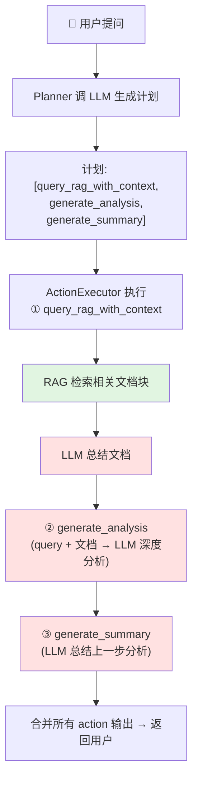

**注意红色的三个框都是 LLM 调用**——你数一下：一次用户提问，触发了 **1（规划）+ 1（RAG 内总结）+ 1（分析）+ 1（总结）= 4 次 LLM 调用**，外加 1 次 embedding 调用。这就是"token 用量暴涨"和"尾延迟放大"的来源。

原书给出的 **Planner** 核心代码（我逐行讲）：

```python
def create_plan(self, query: str) -> Dict[str, Any]:
    """用 OpenAI 为给定 query 生成执行计划"""
    logger.info(f"Creating plan for query: {query}")

    # ① 构造"规划提示词"：把用户问题 + 可用动作列表塞进 prompt
    planning_prompt = self.llm_manager.create_planning_prompt(
        query, self.available_actions)

    # ② 调 LLM 拿计划。temperature=0.3 → 低温，让计划更确定、可复现
    plan_response = self.llm_manager.generate_response(
        planning_prompt, temperature=0.3)

    # ③ 把 LLM 返回的文本解析成 JSON（计划是结构化的动作序列）
    plan = self._parse_plan_response(plan_response)
    logger.info(f"Created plan: {plan}")
    return plan
```

- **第 ①行**：`create_planning_prompt` 把"问题 + 可用动作"拼成提示词。**关键点：动作是"可复用的离散操作"**（summarize / query / analyze），LLM 只是在这些积木里挑选和排序。
- **第 ②行**：`temperature=0.3`——为什么是低温？因为**规划要稳定**。如果每次规划都不一样，系统行为就不可预测、难以调试。生成阶段可以高温有创意，**规划阶段要低温求确定**。
- **第 ③行**：解析成 JSON。LLM 返回的计划长这样：

```json
{
  "plan": ["query_rag_with_context", "generate_analysis", "generate_summary"],
  "reasoning": "先检索上下文以全面理解两个主题，再生成分析做对比，最后总结巩固要点……",
  "estimated_steps": 3
}
```

> ⚠️ **常见坑**：让 LLM 输出 JSON 却不做校验。生产里 `_parse_plan_response` 必须能容忍 LLM 偶尔吐出带 ```` ```json ```` 包裹、多逗号、截断的脏 JSON。**永远给 JSON 解析加兜底和重试**——这本身就是本章"重试/降级"主题的一个微缩案例。

### 1.4 RAG vs CAG：两种"喂知识"的方式（对服务的影响截然不同）

原书花了很大篇幅对比 **RAG（检索增强）** 和 **CAG（缓存增强）**，因为它们**在系统的不同层解决不同问题**，直接决定了你的服务形态。

**RAG（Retrieval-Augmented Generation）** 分两条工作流：

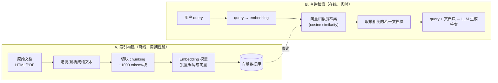

原书对**切块粒度**的权衡讲得很好，记成一张表：

| | 小块（Fine / Small chunk） | 大块（Coarse / Large chunk） |
|---|---|---|
| **精度** | ✅ 高（聚焦窄相关段落） | ❌ 可能被无关内容稀释 |
| **上下文** | ❌ 切太碎会丢上下文 | ✅ 上下文更丰富 |
| **结论** | chunk size 是**权衡**，取决于领域和 LLM 上下文窗口 | 同左 |

> 💡 **面试高频**：RAG 为什么要切块？原书答案很清晰——**LLM 有上下文窗口上限**（输入+输出 token 有限），所以只能挑几个"最相关"的块塞进去。切块既定义了检索粒度，也是**离线批量推理**发生的地方（提前算好所有块的 embedding，查询时才快）。

**CAG（Cache-Augmented Generation）** 是另一种思路。原书原话：

> *"CAG leverages the extended context windows of modern LLMs by preloading knowledge directly into the model's KV cache. Rather than performing retrieval at query time, CAG loads relevant resources in advance..."*

翻译：**随着上下文窗口暴涨**（书里举例 Claude Sonnet 4 支持 100 万 token 上下文），你不必再费劲挑"最相关的几篇"——**直接把整个知识库预加载进模型的 KV Cache**，查询时无需检索，直接基于缓存的上下文生成。

RAG 和 CAG 的本质对比（**这是全章最重要的对比表之一**）：

| 维度 | RAG | CAG |
|---|---|---|
| **解决什么** | 答案**质量**：检索外部知识、扩充 prompt 上下文 | 服务**效率**：复用已算好的上下文，减少重复 KV Cache 计算 |
| **知识何时进模型** | 查询时**实时检索** | **提前**预加载进 KV Cache |
| **延迟** | 有检索步骤 → 额外延迟 | ✅ 消除检索延迟 |
| **系统复杂度** | 高（embedding + 索引 + 向量库） | ✅ 低（去掉 RAG 组件） |
| **选它的场景** | 首要诉求是**知识准确性与新鲜度** | 首要诉求是**延迟/吞吐/成本** |
| **代价** | 多步骤、可能选错文档、维护搜索系统复杂 | 大上下文 → 内存/算力开销大（第 7 章优化） |

> 🔬 **第一性原理**：RAG 和 CAG **不是竞品**！原书反复强调："*RAG and CAG are not competing techniques—they solve different problems at different layers.*" 生产里常常**两者都用**：RAG 丰富输入，CAG 优化执行。CAG 本质是把"检索"这一步的成本，换成了"预填一大坨上下文进 KV Cache"的一次性成本——如果同一批知识被反复查询，这笔一次性成本就摊薄了（这就是第 6 章 **Prefix Caching** 的用武之地）。

### 1.5 Agent 如何"用"模型服务

原书收尾：一个 agent 通常要编排多种模型和工具——LLM（推理/规划）、embedding 模型（检索）、视觉/语音模型（多模态）、工具专用模型（代码/分类/总结），以及外部工具（API/数据库）。**所有这些都通过模型服务（HTTP / gRPC API）访问**。

**工具调用（Tool Calling）四步走**（面试高频）：

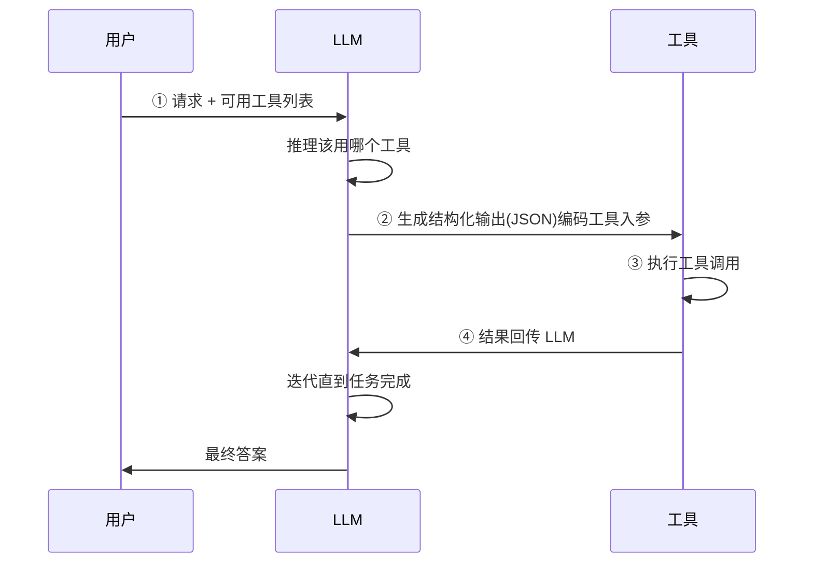

> 结论（原书原话）：*"Since agents operate interactively and often in real time, high-performance, low-latency, and cost-efficient serving is critical."* ——**agent 时代，低延迟、高性能、低成本的服务，是 agent 应用成败的关键。** 这句话就是全章的立论根基。

---

## 2️⃣ 企业级 LLM 服务：一套分层参考架构

### 2.1 是什么：从"业余栈"到"生产级系统"的分水岭

原书指出，真实的大规模部署，远不止"托管和执行模型"。OpenAI、Anthropic、Together AI 这些头部厂商，还必须解决：**认证、定价、资源管理、网络、优化、实验、可观测性、on-call 值班**——需要数百甚至上千工程师的多学科团队。

架构的挑战在于：让**很多个职责不同的团队**能共同贡献到**同一个演进中的系统**，而不产生瓶颈或过度耦合。答案就是**分层（layered architecture）**——**关注点分离**，每层独立优化。

### 2.2 七层参考架构（自顶向下）

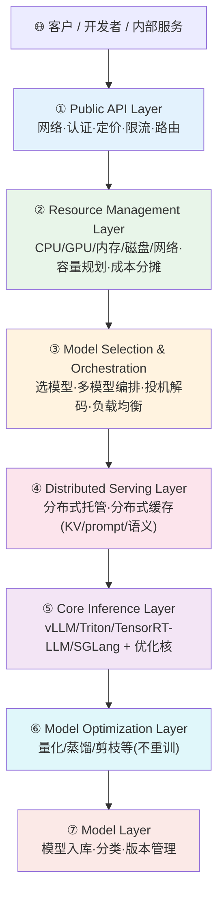

逐层拆解它**扛什么职责、面对什么挑战**（这张表值得背，是"设计一个 LLM 平台"这类系统设计题的标准答案骨架）：

| 层 | 职责 | 关键挑战 |
|---|---|---|
| **① Public API** | 对外唯一入口：网络、认证、定价、限流、请求路由 | **高并发**（百万级连接）、**公平用量与计费**（配额/防滥用/精确计费）、**低延迟全球接入**（geo-routing + 区域缓存）、**安全**（认证/租户隔离/防攻击） |
| **② Resource Management** | 管理跨区域的硬件资源，集成预算审查与成本分摊 | **容量规划**（预测需求又不过度配置）、**GPU 利用率**（异构 GPU 池维持高利用）、**客户优先级**（关键负载配额预留 + 低优抢占式调度） |
| **③ Model Selection & Orchestration** | 决定每个请求用哪个/哪些模型，权衡准确度/延迟/成本 | **成本-质量权衡**（不是所有任务都要最大模型，OpenAI 默认 gpt-4o-mini）、**负载均衡**（跨模型池分流）、**延迟敏感场景**（用更小/更快模型或投机解码） |
| **④ Distributed Serving** | 分布式模型托管（大模型）+ 分布式缓存（KV/prompt/语义） | **硬件限制**（模型超单卡显存）、**多 GPU/多节点协调**（高效共享上下文以保 SLA）、**缓存换效率**（KV-cache-aware 路由，减少重复推理） |
| **⑤ Core Inference** | **真正执行模型**：集成 vLLM/Triton/TensorRT-LLM/SGLang + FlashAttention/GEMM/PagedAttention，暴露为 web endpoint | （第 3 章详解） |
| **⑥ Model Optimization** | 不重训的前提下做优化（量化/蒸馏/剪枝） | （第 5/6/7/9 章详解） |
| **⑦ Model Layer** | 提供实际训练好的模型：入库、按能力/用途分类、版本追踪 | 从训练管线/外部源搬进生产、按能力(语音/推理/视频)与用途(sandbox/实验/生产)组织、随模型演进做版本管理 |

> 💡 **实战/面试高频**：被问"设计一个多租户 LLM 推理平台"，就照这七层答，并在每层点出 1–2 个挑战。面试官想听的正是"关注点分离 + 各层独立演进"这个架构思想。原书原话收尾：*"the layered architecture pattern... remains essential. It allows teams with different responsibilities to innovate and optimize independently."*

其中原书特别插了一段 **投机解码（Speculative Decoding）** 的旁注，因为它横跨"编排层"：

> 投机解码：让一个小的"草稿模型"提前预测若干 token，大的"目标模型"并行验证。草稿对了就接受，错了就纠正。**在不降质的前提下降低逐 token 延迟**。（第 7 章详解，原始论文 Leviathan et al., 2022）

---

## 3️⃣ 用开源栈搭一套（部署 · 鉴权 · 限流 · 自动扩缩 · 灰度 · 回滚）

**这是全章最"动手"的一节，也是老师要点"部署/健康检查/灰度/回滚/限流"的主战场。** 原书选的栈：

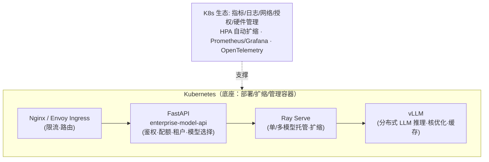

原书选 Kubernetes 做底座的理由：它是**部署、扩缩、管理容器化应用的开源平台**，且有庞大生态（指标、日志、网络、授权、硬件管理），是 AWS/GCP/Azure 和 OpenAI/Anthropic 的骨干。

### 3.1 部署与鉴权：FastAPI + 依赖注入

原书用 FastAPI 搭了一个 `enterprise-model-api`，暴露 `/v1/chat/completions`，并用 FastAPI 的**依赖注入 `Depends`** 把鉴权逻辑挂上去：

```python
@app.post("/v1/chat/completions")
async def chat(req: ChatReq, idp=Depends(require_auth)):
    await rate_limit(idp["tenant"])
    # 选模型、按租户信息路由流量
```

逐行讲：
- **`Depends(require_auth)`**：**请求进 `chat` 前，FastAPI 先跑 `require_auth`**。鉴权不通过就直接 401/403，根本进不到业务逻辑。这就是"依赖注入"的威力——**横切关注点（鉴权）与业务逻辑解耦**。
- **`await rate_limit(idp["tenant"])`**：鉴权返回的是**租户信息**，限流是**按租户**做的（多租户系统必须如此，否则一个大客户能把小客户挤死）。

鉴权本体 `require_auth`（同时支持 JWT 和 API Key）：

```python
async def require_auth(
    api_key=Depends(verify_api_key),
    claims=Depends(verify_jwt)):
    if not api_key and not claims:
        raise HTTPException(401, "Missing API key or JWT")   # 两种都没有 → 401
    tenant = claims.get("tenant") if claims else await \
        rds.hget(f"keys:{api_key}", "tenant")                # 从 JWT 或 Redis 拿租户
    if not tenant: raise HTTPException(403, "Unknown tenant") # 拿不到租户 → 403
    return {"tenant": tenant, "claims": claims, "api_key": api_key}
```

- **两级校验**：`verify_api_key` 和 `verify_jwt` 各自也是 `Depends`（依赖可以嵌套依赖）。
- **401 vs 403 的区别**（面试常问）：**401 Unauthorized = 没给身份 / 身份无效**（"你是谁？"）；**403 Forbidden = 身份有效但无权限 / 未知租户**（"我知道你是谁，但你不能进"）。原书这段代码把两者用得很标准。
- **`rds.hget(...)`**：API Key → 租户的映射存在 Redis（`rds`）里，`hget` 从哈希表取值。**为什么用 Redis？** 鉴权在每个请求的关键路径上，必须**亚毫秒级**查到，用内存 KV 存储。

JWT 验证细节 `verify_jwt`：

```python
async def verify_jwt(authorization: str):
    typ, token = authorization.split(" ", 1)      # 拆 "Bearer <token>"
    if typ.lower() != "bearer":
        raise HTTPException(401, "Bad auth type")  # 不是 Bearer → 401
    # 验证 JWT 并返回内容
    return jwt.decode(token,
        jwt.algorithms.RSAAlgorithm.from_jwk(json.dumps(key)),  # 用 JWK 公钥验签
        algorithms=[headers["alg"]],
        audience="api://llm",                       # 校验受众，防 token 被跨服务盗用
        options={"verify_exp": True})               # 校验过期时间
```

> ⚠️ **常见坑**：`options={"verify_exp": True}` 千万别关！很多人调试时图省事关掉过期校验，然后忘了打开就上线——**过期 token 永久有效 = 严重安全漏洞**。同理 `audience` 校验能防止 A 服务的 token 被拿去打 B 服务。

### 3.2 自动扩缩容（Horizontal Pod Autoscaler）——容量规划的执行者

原书用 K8s 的 **HPA** 做水平自动扩缩：当 `enterprise-model-api` 的平均 CPU 使用率超过 70%，K8s 自动加实例（3→15）：

```yaml
apiVersion: autoscaling/v2
kind: HorizontalPodAutoscaler
metadata: { name: enterprise-model-api-hpa }
spec:
  scaleTargetRef: { apiVersion: apps/v1,
      kind: Deployment, name: enterprise-model-api }   # 扩缩谁
  minReplicas: 3        # 下限：再空闲也保 3 个（防冷启动、保可用）
  maxReplicas: 15       # 上限：再忙也不超 15 个（防成本失控）
  metrics:
  - type: Resource
    resource: { name: cpu, target: { type: Utilization,
      averageUtilization: 70 } }                        # 目标：平均 CPU 70%
```

逐行讲：
- **`minReplicas: 3`**：**永远至少 3 个副本**。为什么不设 1？① 冷启动慢（加载模型要时间）；② 单点故障；③ 突发流量来了才扩太晚。**保底副本是"用少量常驻成本换可用性"**。
- **`maxReplicas: 15`**：**成本刹车**。没有上限的自动扩缩 = 成本炸弹（流量攻击时能把你账单打爆）。
- **`averageUtilization: 70`**：**为什么是 70% 不是 90%？** 留 30% 缓冲给"扩容还没生效的那几十秒"。HPA 反应有延迟，逼近 100% 才扩就晚了。

> 🔬 **第一性原理**：注意这里 HPA 盯的是 **CPU**。但**LLM 推理是 GPU 密集、显存受限的**，CPU 利用率往往不能反映真实压力！原书在"Option 6"里点了这个坑——真正生产级的 LLM 服务，应该基于**自定义指标**扩缩：**tokens per second（TPS）、GPU 利用率、排队深度**。CPU 扩缩只适合 API 网关这类无状态层。**这是 LLM 服务和普通 web 服务在容量规划上的根本区别。**

### 3.3 限流（Rate Limiting）——保护系统不被打垮

原书用 **Nginx Ingress** 限流（Envoy 也可）：

```yaml
apiVersion: networking.k8s.io/v1
kind: Ingress
metadata:
  name: api-ingress
  annotations:
    kubernetes.io/ingress.class: nginx
    nginx.ingress.kubernetes.io/limit-rps: "50"              # 每秒最多 50 请求
    nginx.ingress.kubernetes.io/limit-burst-multiplier: "5" # 允许瞬时突发到 50×5=250
    nginx.ingress.kubernetes.io/proxy-body-size: "8m"       # 请求体上限 8MB
spec:
  rules:
  - host: api.yourorg.example
    http:
      paths:
      - path: /
        pathType: Prefix
        backend: {service: { name: enterprise-model-api, port: { number: 80 } } }
```

- **`limit-rps: 50` + `burst-multiplier: 5`**：这是**令牌桶**思想。稳态每秒 50，但允许**短时突发到 250**（桶容量）。为什么要 burst？因为真实流量是**阵发的**——纯粹 50/s 硬砍会误杀正常的短促尖峰。
- **`proxy-body-size: 8m`**：**限制请求体大小**。为什么对 LLM 重要？超长 prompt = 超长 prefill = 巨额算力。不限制的话，一个恶意的百万 token 请求就能拖垮整个节点。**这是一道廉价但关键的防线。**

> 💡 **实战**：限流应该**分层**——Ingress 层做粗粒度（每秒总量），应用层 `rate_limit(tenant)` 做细粒度（每租户配额）。两道防线互补：Ingress 挡 DDoS，应用层保公平。

### 3.4 模型选择与路由：灰度/金丝雀（Canary）在这里落地！⭐

**这是老师要点"灰度/金丝雀/回滚"的核心代码。** 原书的 `choose_endpoint` 把**金丝雀发布**直接写进了路由逻辑：

```python
def choose_endpoint(model: str, tenant: str):
    cfg = load_routes()
    # 策略：租户白名单、成本等级、区域、金丝雀
    route = cfg["models"].get(model) or cfg["aliases"].get(model)
    if not route: raise HTTPException(404, f"Unknown model {model}")

    # ① 加权金丝雀：按 weight 概率把流量导到新版本
    if "canary" in route and random() < float(route["canary"]["weight"]):
        return route["canary"]["url"]

    # ② 租户覆盖：特定客户走特定 endpoint
    route_over = (route.get("tenants") or {}).get(tenant)
    if route_over: return route_over["url"]

    return route["url"]   # ③ 默认：走稳定版
```

逐行讲，这段代码信息量极大：

- **① 加权金丝雀**：`random() < weight`。假设 `weight=0.05`，则**约 5% 的流量**被随机导到金丝雀（新版本）endpoint，其余 95% 走稳定版。**这就是金丝雀发布的本质**——用一小撮真实流量验证新版本，出问题只影响 5% 用户。
- **② 租户覆盖**：某些大客户可能需要专属 endpoint（隔离、定制、SLA 更高）。租户级路由让你**给特定客户单独灰度或单独回滚**。
- **③ 默认稳定版**：兜底。

我把灰度发布的完整生命周期画出来：

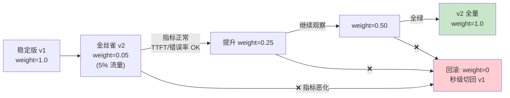

> 🔬 **第一性原理：为什么金丝雀 = 加权路由 + 配置化 weight？**
> 因为**回滚必须比部署更快**。如果新版本靠"重新部署"来发布，那回滚也要"重新部署"，慢。而金丝雀把版本切换降维成**改一个数字 `weight`**——**发布 = weight 从 0 慢慢调到 1，回滚 = weight 一把打回 0**。配置热加载（`load_routes()` 每次读最新配置）让这个动作**秒级生效、零重启**。这就是"配置驱动的渐进式发布"，是现代 SRE 的基石。

**灰度/金丝雀/回滚 三件套对照表：**

| 概念 | 是什么 | 怎么用（本书代码） | 代价 |
|---|---|---|---|
| **灰度/金丝雀 Canary** | 先放一小撮流量到新版本，验证无误再放大 | `random() < canary.weight` | 需同时维护两个版本、监控要跟上 |
| **加权发布** | weight 逐步 0.05→0.25→0.5→1.0 | 改配置里的 weight | 全量前窗口期长 |
| **回滚 Rollback** | 出问题立刻切回旧版本 | `weight = 0`，配置热加载秒级生效 | 需保证旧版本还在（别急着下线） |
| **蓝绿发布**（书未展开，补充） | 两套完整环境，流量整体切换 | 路由整体指向 blue 或 green | 双倍资源成本 |

> ⚠️ **常见坑**：① 金丝雀期间**不看指标**——那不叫金丝雀，叫"随机坑 5% 用户"。金丝雀的价值在于**观测**（见第 5 节）。② 新版本上线就**急着删旧版本**——回滚时发现旧版本没了，抓瞎。**旧版本至少保留到新版本全量稳定运行一段时间。** ③ 金丝雀流量太少导致**样本不足**——5% 流量若绝对值很小，统计不出问题，需要按绝对 QPS 而非纯比例来定。

### 3.5 模型选择里的投机解码分流

原书的 `chat` endpoint 还内置了一个**基于请求特征的模型选择**：

```python
@app.post("/v1/chat/completions")
async def chat(req: ChatReq, idp=Depends(require_auth)):
    await rate_limit(idp["tenant"])
    ep = choose_endpoint(req.model, idp["tenant"])   # 先选 endpoint（含金丝雀）
    # 简单分类器：长输出用投机解码，否则直连
    if req.model.draft_enabled and req.max_new_tokens > 1024:
        draft_ep = config.get_draft_endpoint(req.model)
        gen = speculative_decode(req,
                 endpoint_draft=draft_ep,     # 草稿模型（快、便宜）
                 endpoint_target=ep)          # 目标模型（准、验证）
    else:  # 简单透传流式
        gen = passthrough(ep)
```

- **`max_new_tokens > 1024`** 才启用投机解码：**因为投机解码有固定开销**（跑两个模型），只有输出足够长，"加速逐 token 生成"的收益才盖得过开销。**短输出直连更划算。** 这是一个漂亮的"按请求特征动态选策略"的例子。

### 3.6 用 Ray Serve 托管模型（单模型 + 多模型多路复用）

如果觉得自己管扩缩和网络太重，原书推荐 **Ray Serve**（框架无关的可扩展模型服务库）。

**单模型托管**——用 `@serve.deployment` 装饰器声明副本数和 GPU：

```python
@serve.deployment(
    name="qwen_vllm",
    num_replicas=3,                                       # 3 个服务实例
    ray_actor_options={"num_cpus": 0.5, "num_gpus": 1},  # 每实例独占 1 张 GPU
)
class QwenVLLM:
    def __init__(self):
        # 每个副本初始化一次 vLLM 异步引擎
        args = AsyncEngineArgs(
            model="Qwen3-Thinking-2507",
            tensor_parallel_size=1,
            trust_remote_code=True,
            max_num_batched_tokens=4096,      # 单批最大 token 数
            gpu_memory_utilization=0.9,       # 用满 90% 显存（留 10% 缓冲防 OOM）
        )
        self.engine = AsyncLLMEngine.from_engine_args(args)

    async def __call__(self, http_request: Request) -> str:
        body = await http_request.json()
        text = body["text"]
        max_new = body.get("max_new_tokens", 256)
        temp = body.get("temperature", 0.7)
        return await self.generate_text(text, max_new_tokens=max_new, temperature=temp)
```

- **`num_replicas=3` + `num_gpus=1`**：3 个副本、3 张卡。Ray 自动做资源调度和负载均衡。
- **`gpu_memory_utilization=0.9`**：为什么留 10%？**给 KV Cache 的峰值波动和 CUDA context 留缓冲**，避免长序列突然把显存打爆 OOM。
- **`__init__` 里初始化引擎**：**每个副本只加载一次模型**（重活只干一次），后续请求复用同一引擎。这是单模型服务的关键——**模型常驻**。

**多模型托管（Model Multiplexing）**——一个副本池服务多个模型：

```python
MODEL_REGISTRY = {   # model_id → HF 仓库（也可以是 S3 等存储）
   "distilbert-sst2": "distilbert-base-uncased-finetuned-sst-2-english",
   "bert-sst2":       "textattack/bert-base-uncased-SST-2",
   "roberta-sst2":    "roberta-base-openai-detector",
}

@serve.deployment(ray_actor_options={"num_cpus": 1})
class MultiModelService:
   @serve.multiplexed(max_num_models_per_replica=2)      # 每副本最多缓存 2 个模型
   async def load_model(self, model_id: str) -> Tuple[AutoTokenizer, torch.nn.Module]:
       """按 model_id 懒加载并缓存模型；超过上限时 Ray Serve 用 LRU 淘汰"""
       repo = MODEL_REGISTRY[model_id]
       tokenizer = await asyncio.to_thread(AutoTokenizer.from_pretrained, repo)
       model = await asyncio.to_thread(
              AutoModelForSequenceClassification.from_pretrained, repo)
       model.eval()
       return tokenizer, model
```

**单模型 vs 多模型的关键区别**（原书讲得很透）：

| | 单模型托管 | 多模型托管（多路复用） |
|---|---|---|
| **模型何时加载** | `__init__` 里**预加载**，常驻 | **每次请求实时加载**所需模型 |
| **延迟** | ✅ 低（模型已在显存） | ❌ 加载有额外延迟 |
| **缓解手段** | — | `@serve.multiplexed` 缓存 + LRU 淘汰 |
| **适用** | 单一高频模型 | 多个同类输入的模型共享实例池 |

调用时用 HTTP 头 `ray_serve_multiplexed_model_id` 指定模型：

```bash
curl -s -X POST "http://127.0.0.1:8000/SentimentService" \
  -H 'content-type: application/json' \
  -H 'ray_serve_multiplexed_model_id: distilbert-sst2' \
  -d '{"text":"I absolutely loved this!"}'
```

- **`max_num_models_per_replica=2`**：每个副本最多同时缓存 2 个模型，第 3 个进来就 **LRU 淘汰**最久没用的。**这是"内存 vs 延迟"的经典权衡**——缓存越多越快但越占显存。

> 💡 **实战**：多路复用特别适合 **Multi-LoRA 场景**（一个基座 + N 个轻量适配器），第 10 章会讲。基座常驻、LoRA 按需切换，成本极低。

原书对这一节的总结（值得引用）：*"Building Your Own Serving Stack Is Not Difficult"* ——K8s 管基础设施 + Ray Serve/Triton 托管模型 + vLLM 做分布式与优化，加上一点自研中间件，**完全可以自建企业级服务栈**。这些库都经过多年生产打磨，参考实现丰富，AI 编程助手还能帮你写样板代码。

---

## 4️⃣ 自建 vs 买云：一条光谱，不是一个开关

### 4.1 六种云上部署方式（以 AWS SageMaker 为例）

原书用 AWS SageMaker 展示了**从"全托管"到"全自建"的六个档位**（GCP/Azure 有对应组件）。这张对照表是本节精华：

| 选项 | 名称 | 你掌控什么 | 计费 | DevOps 负担 | 何时用 |
|---|---|---|---|---|---|
| **1** | **全托管基础模型**（Bedrock） | 只选模型 + 调 API | **按 token/请求** | **零** | 快速原型、集成现成大模型、不想碰基础设施 |
| **2** | **一键部署**（SageMaker JumpStart） | 选模型 + 实例类型 + 副本数 + 日志级别 | **按小时**（自己账户里托管） | 低 | 想在自己 AWS 里快速跑起知名预训练模型 |
| **3** | **自带模型**（DLC 预建容器） | 选容器/框架版本 + 部署步骤 | 按小时 | 中低 | 有训练好的模型 + 常见框架，无需写推理代码 |
| **4** | **自带代码**（Script Mode） | 写自己的加载/预测逻辑 | 按小时 | 中 | 需自定义预处理/后处理、非标准输入输出 |
| **5** | **自带镜像**（BYO Container） | 容器内**一切**（语言/框架/依赖） | 按小时 | 中高 | 用 SageMaker 不支持的栈、需系统级控制 |
| **6** | **自建基础设施** | **全部**（运行时/扩缩/安全/观测/成本） | 基础设施成本 | 高 | 需完全控制、极致成本/性能调优、强合规 |

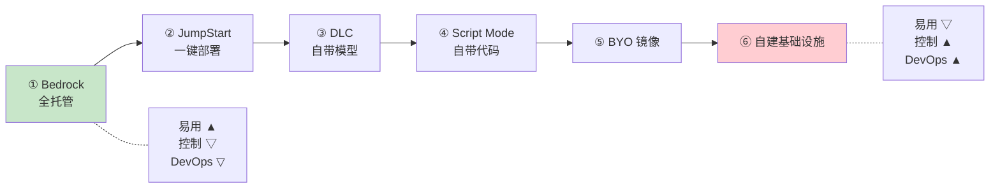

**每个档位的代表代码**（各抄一小段，看清"控制力"如何递增）：

**选项 1（Bedrock）**——最简单，三步：建 key → 选模型 → 调 API：
```python
os.environ['AWS_BEARER_TOKEN_BEDROCK'] = "..."
client = boto3.client(service_name="bedrock-runtime", region_name="us-west-2")
model_id = "us.anthropic.claude-3-5-sonnet-20240620-v1:0"
messages = [{"role": "user", "content": [{"text": "Hello! ..."}]}]
response = client.converse(modelId=model_id, messages=messages)
```
> 本质：像调外部 AI API（如 Claude/OpenAI），只是在你的 AWS 环境内。**零 DevOps，但只能用 AWS 提供的模型和配置**，不能改架构、不能部署自己的模型。

**选项 2（JumpStart）**——能配实例类型、副本数、日志级别：
```python
model = JumpStartModel(
   model_id="huggingface-llm-mistral-7b-instruct",
   instance_type="ml.g5.2xlarge",     # 能选实例了
   env={"SAGEMAKER_MODEL_SERVER_WORKERS": "1",
        "SAGEMAKER_CONTAINER_LOG_LEVEL": "20"})
predictor = model.deploy(initial_instance_count=1, endpoint_name="my-mistral-endpoint")
```

**选项 3（DLC）**——显式选容器镜像，部署自己的模型权重：
```python
baseimage = sagemaker.image_uris.retrieve(
        framework="pytorch", py_version="py310",
        image_scope="inference", version="2.0.1",
        instance_type="ml.g4dn.16xlarge")
# 或用 LMI 容器 + vLLM 跑开源 LLM：
model = DJLModel(model_id="meta-llama/Meta-Llama-3.1-8B-Instruct",
  env={"OPTION_TENSOR_PARALLEL_DEGREE": "4",   # 张量并行度
       "OPTION_SERVING_LOADER": "vllm",         # 指定 vLLM 做加载器
       "OPTION_MAX_ROLLING_BATCH_SIZE": "128"}) # 最大滚动批大小
```

**选项 4（Script Mode）**——写自己的 `model.py`，实现 `handle` 入口：
```python
def handle(inputs: Input) -> None:
    global model, tokenizer
    if not model:
        model, tokenizer = initialize(inputs.get_properties())   # 首次加载
    if inputs.is_empty():
        return None   # ⭐ 空调用 = 模型服务器的"预热(warmup)"探针
    data = inputs.get_as_json()
    res = run_inference(data["inputs"], model, tokenizer)
    return Output().add_as_json(res)
```
> ⚠️ 注意那个 `if inputs.is_empty(): return None`——**这是模型服务器启动时发的"预热空调用"**，让模型在真实流量到来前先在 GPU 上跑通一遍（避免第一个真实请求承受冷启动延迟）。这是"健康检查/预热"在推理侧的体现。

**选项 5/6 的关键约束**（原书反复强调的**契约**）：

> SageMaker 强制**固定端口和 HTTP 契约**：每个容器必须在 **8080 端口**暴露 web 服务，并实现 **`/invocations`（POST，推理）** 和 **`/ping`（GET，健康检查）**，默认响应超时（如标准响应 60 秒）。

> 🔬 **第一性原理：健康检查（Health Check）为什么是 `/ping`？**
> 编排系统（SageMaker / K8s）需要一个**统一、廉价、无副作用**的方式问容器："你还活着、能干活吗？" 这就是 `/ping`（K8s 里叫 **liveness/readiness probe**）。
> - **Liveness（存活探针）失败** → 容器被**杀掉重启**（治死锁/卡死）。
> - **Readiness（就绪探针）失败** → 容器**从负载均衡摘除**、不再收流量，但不重启（治"暂时忙/还在加载模型"）。
>
> 对 LLM 服务，**readiness 尤其关键**：模型加载可能要几十秒到几分钟，这期间容器"活着但没准备好"。如果 readiness 没配好，流量会打到还没加载完模型的实例上 → 大量 5xx。**健康检查是灰度、自动扩缩、回滚一切自动化的前提**——系统靠它判断"这个实例能不能收流量"。

### 4.2 成本的实际权衡：一个具体数字

原书给了一个非常接地气的成本迁移例子：

> 你可能先用 **Bedrock** 跑 Qwen3，费率 **$0.10 / 百万输入 token**。随着吞吐上升，迁到**选项 2/3**在自己账户托管 Qwen3，**$1.172 / 小时**（按小时计费，相比按 token 更便宜了）。业务再要更高吞吐/更低延迟，就转到**选项 4/5/6**做深度定制。

> 💡 **实战：按 token 计费 vs 按小时计费的盈亏平衡点。**
> 按 token（Bedrock）：**用多少付多少，零闲置成本**，但单价高——适合**低/波动流量**。
> 按小时（自托管）：**固定小时成本**，但单 token 便宜——适合**高/稳定流量**（把实例喂满，摊薄成本）。
> 盈亏平衡点：`月请求量 × 每请求 token × token 单价` vs `实例小时数 × 小时费率`。**流量爬过某个阈值，自托管就更省**。这就是原书说的"多数团队从最简单的选项验证想法，随着成熟再转向定制"。

### 4.3 Build or Buy：这是光谱，不是开关

原书两位作者（做了十多年模型服务）的核心观点：

> *"The choice between build and rent is a spectrum, not a switch!"* —— **自建 vs 租用是一条光谱，不是一个开关！**

**"即使你不打算自建，懂得怎么自建"的四大价值**（原书列举，面试可用）：

| 价值 | 含义 |
|---|---|
| **解码厂商功能** | 认得出哪个旋钮对应 batching/缓存/量化/适配器加载，天花板在哪 |
| **量化权衡** | 能在"自带模型 vs 自带代码"等厂商方案间做扎实的取舍分析 |
| **定制** | 80% 路径用厂商默认，**外科手术式**替换需要深控的 20% |
| **调试排障** | 厂商方案常是黑盒、文档有限、日志不全，懂原理才能快速定位修复 |

**作者的选型策略（Selection Strategy）**——一套可直接抄的决策口诀：

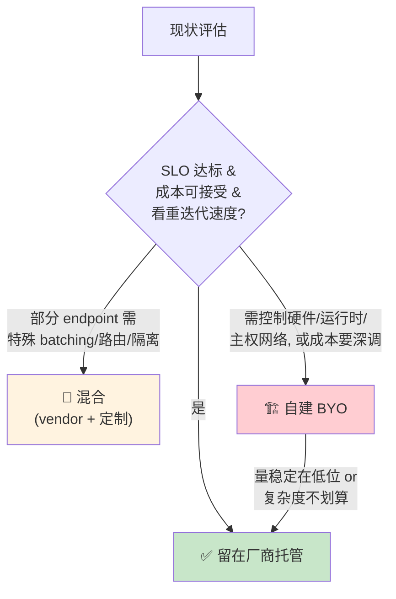

> 原书金句：*"The winning strategy is a dynamic one: keep a stable API and shared telemetry, customize where it pays off, and expect your position on the spectrum to change."* —— **制胜策略是动态的：保持稳定的 API 和共享的遥测（telemetry），在划算的地方定制，并预期你在光谱上的位置会随产品/流量/约束不断移动。** 注意"稳定 API + 共享遥测"——**这正好呼应下一节的可观测性和上文的灰度路由**：只要 API 稳定、遥测统一，你就能在底层自由切换实现而不惊动上游。

---

## 5️⃣ 观测（Observability）与容量规划

> 这一节是老师要点"观测（指标/日志/追踪）、容量规划"的落点。原书把它拆成两块：**度量指标**（这一章）+ **best practices**（下面第 6 节的一部分）。我先把可观测性的三支柱补全（原书在架构层反复提到 metrics/logging/monitoring/observability，第 6 章 Option 6 明确列出 Prometheus/Grafana/OpenTelemetry/Fluent Bit），再讲原书的核心指标。

### 5.1 可观测性三支柱：指标 · 日志 · 追踪

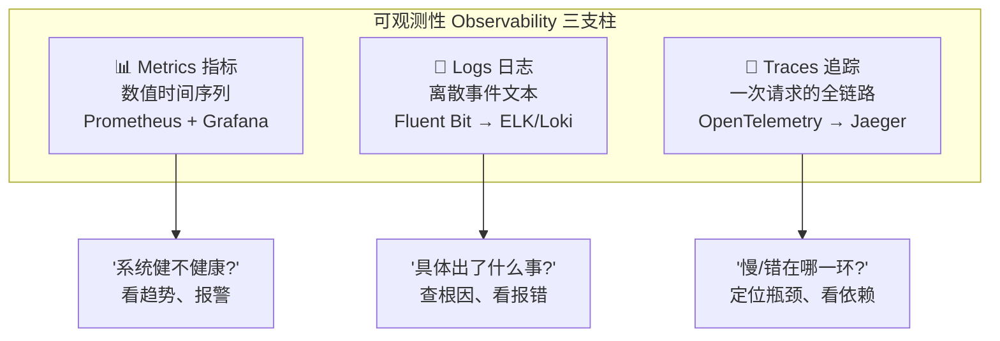

| 支柱 | 是什么 | 回答什么问题 | LLM 服务里的典型内容 | 工具（原书提及） |
|---|---|---|---|---|
| **Metrics 指标** | 可聚合的数值时间序列 | "健不健康？趋势如何？" | TTFT/TPOT 分位数、TPS、GPU 利用率/显存、队列深度、错误率、扩缩事件 | Prometheus + Grafana |
| **Logs 日志** | 带时间戳的离散事件 | "具体发生了什么？" | 请求 ID、租户、模型版本、报错栈、限流命中、金丝雀命中 | Fluent Bit → ELK/Loki |
| **Traces 追踪** | 单次请求跨服务的调用链 | "慢/错在哪一环？" | agent 的规划→检索→分析→总结每一跳的耗时 | OpenTelemetry → Jaeger |

> 💡 **面试高频**：三者的区别一句话——**Metrics 告诉你"出事了"，Traces 告诉你"在哪个环节出事"，Logs 告诉你"到底出了什么事"**。三者互补，缺一不可。
>
> ⚠️ **Agent 时代 Trace 尤其重要**：回到第 1 节——一次交互串 4 次 LLM 调用，端到端慢了，光看总延迟没用，**必须用分布式追踪看清是"规划慢"还是"某次检索慢"还是"总结那步 ITL 高"**。没有 trace，agent 系统的性能问题几乎无法定位。原书那句"keep a stable API and **shared telemetry**"里的 telemetry 就是指这套。

### 5.2 延迟指标：E2E / TTFT / TPOT（ITL）⭐

**这是全章最高频的面试知识点，必须刻进 DNA。** 原书列了三个最重要的延迟指标：

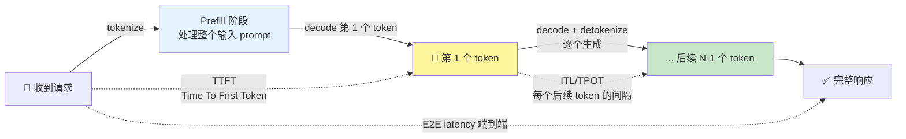

| 指标 | 全称 | 定义 | 对应阶段 | 谁最在乎 |
|---|---|---|---|---|
| **E2E latency** | 端到端延迟 | 从收到请求到生成**完整**响应的总时间；可含排队/网络/路由/扩缩等系统开销 | 全程 | **agent 工作流**（下游依赖完整输出） |
| **TTFT** | Time To First Token | 从收到请求到吐出**第 1 个 token** | **Prefill** | **聊天机器人**（对应"响应速度"，用户多快看到首字） |
| **ITL / TPOT** | Inter-Token Latency / Time Per Output Token | 生成**后续每个** token 的耗时 | **Decode** | **长输出场景**（ITL 高 → 感觉卡顿） |

原书给出的**精确公式**（假设 ITL 恒定，总生成 token 数为 N，忽略 tokenize/detokenize）：

$$
\boxed{\text{E2E latency} = \text{TTFT} + \text{ITL} \times (N - 1)}
$$

$$
\text{TTFT} = \underbrace{\text{tokenize input}}_{\approx 0} + \text{prefill} + \text{decode 首 token} + \underbrace{\text{detokenize}}_{\approx 0} \approx \text{prefill} + \text{decode 首 token}
$$

$$
\text{ITL} \approx \text{decode 一个新 token}
$$

> 🔬 **第一性原理：为什么 TTFT 对应 prefill、ITL 对应 decode？**（回顾第 2 章）
> - **Prefill**：把整个输入 prompt 一次性喂进模型、算出所有位置的 KV Cache、并 decode 出第一个 token。这是**计算密集（compute-bound）**的，prompt 越长越慢——所以 **TTFT ∝ 输入长度**。
> - **Decode**：之后每个 token 都要读一遍全部 KV Cache 才能算下一个，是**显存带宽密集（memory-bound）**的、每步耗时大致恒定——所以 **ITL 大致是常数**。
> 这也解释了公式里为什么是 `TTFT + ITL×(N−1)`：**第 1 个 token 走 prefill 路径（TTFT），剩下 N−1 个走 decode 路径（每个 ITL）。**

**三个指标的优先级随场景而变**（原书原话精华）：
- **Agent 工作流**（下游依赖完整输出）→ 首要优化 **E2E latency**。
- **聊天机器人**（流式返回）→ **TTFT** 最影响体验（首字响应速度）。
- **超长输出** → **ITL** 也变关键（ITL 高 = 响应"拖沓"）。

> ⚠️ **常见坑**：只报**平均延迟**。生产必须看**分位数（P50/P90/P99）**！平均值会被掩盖——P50 很美但 P99 是 10 秒，那 1% 用户体验极差，而 agent 链一放大（见 1.2 节），这 1% 会被急剧放大。**尾延迟（tail latency）才是用户体验的真相。**

### 5.3 吞吐指标：RPS/RPM 与 TPS

| 指标 | 全称 | 定义 | 适用 | ⚠️ 局限 |
|---|---|---|---|---|
| **RPS / RPM** | Requests Per Second/Minute | 单位时间处理的请求数 | 通用（ML/非 ML 都用） | **对 LLM 粒度太粗**：长输入/长输出会拖垮 per-request 性能 |
| **TPS** | Tokens Per Second | 单位时间生成的**输出** token 数（**只算输出，不算输入**） | LLM 专用、常用来算 per-token 成本 | **可被操纵**（见下） |

原书特别警告这两个指标的**陷阱**（非常重要，避免自欺欺人）：

**① RPS/RPM 对流量模式极度敏感**：长输入/长输出会显著拖累 per-request 性能。因此 RPS/RPM 高度依赖输入输出长度和并发数——**两个流量模式不同的负载，直接比 RPS/RPM 基本没意义**（不是同类对比）。

**② TPS 可以被"刷高"**（原书列举两种造假手法）：
- **缩短输入长度** → TTFT 降低 → per-request 工作量降低 → TPS 虚高。
- **加大 batch / 让批内输入输出长度一致** → GPU 利用率上升、空闲减少 → TPS 提高（这是真优化，但用于跨系统对比时就成了不公平比较）。

> 🔬 **第一性原理：为什么"只算输出 token"？**
> 因为**输入 token 走 prefill（一次性并行处理，很快），输出 token 走 decode（逐个串行，是真正的瓶颈）**。TPS 只算输出，正是想衡量"decode 这个瓶颈阶段的产出速率"。但也正因如此——**把输入缩短、TTFT 降低，就能让分母（时间）变小而虚高 TPS**。理解了 prefill/decode 的非对称性，就理解了 TPS 为什么能被操纵。

### 5.4 容量规划（Capacity Planning）

容量规划在原书的**资源管理层（第 2 层）**：**预测需求，同时避免代价高昂的过度配置**。这是 LLM 服务成本控制的核心。

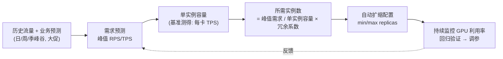

容量规划要素与 LLM 特殊性：

| 要素 | 普通 web 服务 | **LLM 服务的特殊性** |
|---|---|---|
| **单实例容量** | 按 QPS | 按 **TPS / 每卡吞吐**，且**强依赖输入输出长度分布** |
| **扩缩信号** | CPU | **GPU 利用率 / TPS / 队列深度**（CPU 会误导，见 3.2 节坑） |
| **冷启动** | 秒级 | **加载大模型可能几十秒到几分钟**，min replicas 要保底 |
| **峰谷** | 相对平缓 | agent 流量**动态性强**，需为突发留 headroom |
| **成本单元** | 实例小时 | **GPU 小时（昂贵）**，过度配置代价巨大 |

原书在资源管理层还提了两个高级手段：
- **客户优先级**：关键负载**配额预留**，低优任务**抢占式调度**（preemptible）——峰值时先保 VIP。
- **异构 GPU 池**：跨数据中心管理不同型号 GPU，维持高利用率。

> 💡 **实战/面试高频**：估算"服务 Qwn3-14B 需要几张卡"，思路是——① 基准测出**单卡在目标输入输出长度分布下的 TPS**；② 用**峰值 TPS 需求 ÷ 单卡 TPS** 得基础实例数；③ 乘一个**冗余系数**（1.2~1.5，覆盖突发和扩容延迟）；④ 设 min replicas 保底、max replicas 封顶。第 5 章会教你怎么**从显存和算力反推**单卡能装多大模型、能有多少 KV Cache。

---

## 6️⃣ 缓存 · 超时 · 重试 · 降级（可靠性四件套）

> 老师点名的"缓存/超时/重试/降级"。原书把它们**分散**在各处：缓存在"分布式服务层"和 CAG/Prefix Cache；超时在"云选项契约"（60 秒默认超时）；重试/降级散见于 agent 的健壮性和 best practices。我在这里**系统性收拢**，配上第一性原理。

### 6.1 缓存（Caching）：LLM 服务的多级缓存体系

原书在**分布式服务层**明确点出三类缓存 + CAG，我整理成一张"越靠上越省"的表：

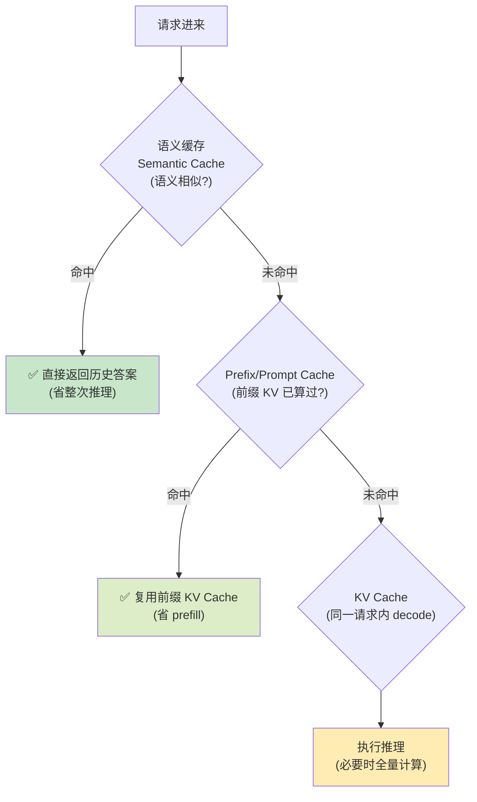

| 缓存类型 | 缓存什么 | 省掉什么 | 命中条件 | 原书出处 |
|---|---|---|---|---|
| **KV Cache** | 单次生成中已算的 K/V | decode 时重复计算历史 token | 同一请求内部 | 第 2 章 |
| **Prefix / Prompt Cache** | 共享前缀的 KV | **prefill 阶段的重复计算** | 多请求共享前缀（如同一 system prompt） | 第 6 章 RadixAttention |
| **Semantic Cache 语义缓存** | 历史"问→答"对 | **整次推理** | 新问题与历史问题**语义相似** | 第 10 章 |
| **CAG** | 整个知识库的 KV | 检索 + 重复 prefill | 知识库预加载在上下文 | 本章 1.4 |

原书在分布式服务层强调**KV-cache-aware 路由**：把请求路由到"已经缓存了相关 KV 的实例"，**避免重复推理**。这就是"缓存换效率"的路由策略。

> 🔬 **第一性原理：缓存的收益 = 命中率 × 单次省下的成本 − 缓存维护成本。**
> - **KV Cache**：命中率 100%（必用），是 LLM 推理的地基。
> - **Prefix Cache**：多用户共享 system prompt / few-shot 示例时命中率极高——**这就是为什么"把固定指令放前面"能省钱**（前缀能被缓存复用）。
> - **Semantic Cache**：收益最大（省整次推理）但最危险——**语义"相似"不等于"相同"**，答案可能不适用。需谨慎设相似度阈值 + 校验。
>
> ⚠️ **缓存的坑**：① 语义缓存的**过期与一致性**——知识更新了但缓存还是旧答案。② 缓存**污染**——把错误答案缓存了会反复返回错的。③ **多租户下的缓存隔离**——A 租户的答案不能命中给 B 租户（安全/隐私）。

### 6.2 超时（Timeout）：给每一环设死线

原书在**云选项契约**里点了硬性超时：SageMaker DLC **默认标准响应 60 秒超时**。这是"超时"这一主题在书里的直接落点。

> 🔬 **第一性原理：为什么必须有超时？**
> 没有超时的调用 = **无限期占用资源**。一个卡住的下游（模型 hang、网络断）会让**上游的连接、线程、GPU slot 被永久占用**，请求越堆越多，最终**级联雪崩（cascading failure）**——整个系统被少数卡死的请求拖垮。**超时是把"局部故障"限制在局部的第一道闸。**

LLM 服务超时的**特殊难点**（面试可展开）：

| 难点 | 说明 | 对策 |
|---|---|---|
| **生成时长天然不定** | 输出 100 token 和 4000 token 耗时差几十倍，固定超时会误杀长请求 | 按 `max_new_tokens` **动态设超时**，或用**流式**（首 token 一到就不算超时） |
| **TTFT vs E2E 双超时** | 首 token 迟迟不来（prefill 卡）和 生成太慢（decode 卡）是不同故障 | 分别设 **TTFT 超时** 和 **总超时** |
| **超时后的资源回收** | 超时了但 GPU 还在跑那个请求 | 必须**真正取消（cancel）**底层生成，而非只断开连接 |

> ⚠️ **常见坑**：只在最外层设一个大超时（比如 300 秒）。**超时应该分层且逐层收紧**：Ingress > API > 模型调用。内层超时必须**短于**外层，否则外层先超时了内层还在傻跑，资源白占。

### 6.3 重试（Retry）：把瞬时故障吞掉，但别放大风暴

重试在原书里体现于 agent 的健壮性（JSON 解析容错、工具调用迭代）和 best practices 的"防回归"思想。生产级重试有铁律：

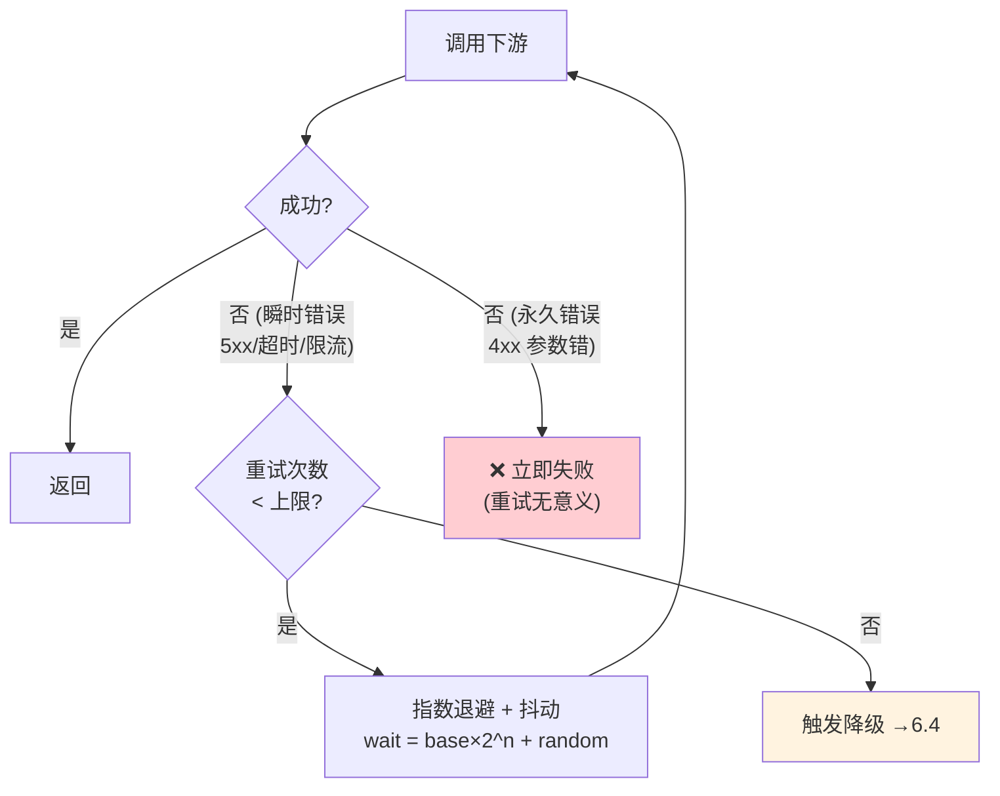

重试三铁律：

| 铁律 | 为什么 |
|---|---|
| **只重试瞬时错误** | 5xx/超时/429 可重试；**4xx（参数错、鉴权失败）重试是浪费**，结果一定还是错 |
| **指数退避 + 抖动**（exponential backoff + jitter） | 立即重试会**加剧拥塞**；退避给下游喘息；**抖动防"重试风暴"**（所有客户端同时重试导致二次雪崩） |
| **必须幂等** | 重试可能导致**重复执行**。生成类通常幂等（重生成一次而已），但**带副作用的工具调用**（扣款、发消息）绝不能盲目重试，需幂等键 |

> ⚠️ **常见坑：重试放大（retry amplification）**。系统 A→B→C 三层每层各重试 3 次，一个底层故障会被放大成 **3×3×3=27 次**调用，瞬间把已经过载的下游彻底打死。**对策：只在最外层或最靠近用户的一层重试，内层快速失败（fail fast）。** 这与 6.2 的"超时逐层收紧"是同一个哲学。

### 6.4 降级（Degradation / Fallback）：宁可差一点，不可挂

降级思想贯穿全书：模型选择层的"不是所有任务都要最大模型"（OpenAI 默认 gpt-4o-mini）、Build-or-Buy 的"回退到厂商托管"、金丝雀的"回滚到稳定版"——**本质都是降级**：在压力/故障下，主动牺牲一部分质量或功能，换取整体可用。

LLM 服务的降级阶梯（从轻到重）：

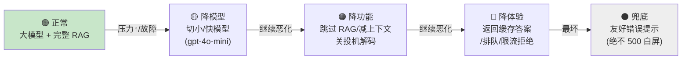

| 降级层次 | 手段 | 牺牲什么 | 保住什么 |
|---|---|---|---|
| **降模型** | 大模型→小/快模型 | 一点答案质量 | 延迟、可用性、成本 |
| **降功能** | 跳过 RAG、缩短上下文、关投机解码 | 知识丰富度 | 核心问答能力 |
| **降体验** | 返回语义缓存的近似答案 / 排队 / 优雅限流 | 答案新鲜度/即时性 | 系统不崩 |
| **兜底** | 返回友好提示、缺省回答 | 本次功能 | **绝不给用户 500 白屏** |

> 🔬 **第一性原理：降级 = 用"可控的、局部的、可预期的"损失，换掉"不可控的、全局的、雪崩式的"失败。**
> 一个没有降级的系统，在过载时是"**全有或全无**"——要么正常要么全挂。有降级的系统，在过载时能**平滑退化（graceful degradation）**——用户可能只是感觉"今天答得简略了点/慢了点"，而不是"完全用不了"。这就是**熔断器（circuit breaker）** 模式的价值：检测到下游频繁失败，就**主动断开**、直接走降级路径，给下游恢复时间，避免把它彻底压死。

> 💡 **实战：可靠性四件套是一个连续动作。** 一次请求的完整韧性链条：**先查缓存（命中就返回）→ 设超时（防卡死）→ 失败则重试（吞瞬时故障，指数退避）→ 重试耗尽则降级（切小模型/返回缓存/优雅失败）→ 全程被观测（指标/日志/追踪）捕获用于报警和容量规划**。这套组合拳才是"生产级"和"能跑"的分水岭。

---

## 7️⃣ 性能度量的最佳实践（原书 Best Practices 精华）

原书用一整节讲"怎样科学地度量"，全是血泪经验，逐条讲透（这些是**面试和实战都极高频**的"方法论"）：

| # | 最佳实践 | 核心要义 | 反面教材 |
|---|---|---|---|
| 1 | **识别延迟↔吞吐的权衡** | 提升一个常牺牲另一个。**离线批处理重吞吐（省成本）**，**交互式重延迟（重响应）** | 盲目追吞吐把聊天做卡 |
| 2 | **按场景设"够用"的延迟目标** | 聊天已到 1 秒，再压到 0.5 秒对体验无感，**该转去优化吞吐/成本** | 无止境抠延迟浪费资源 |
| 3 | **把 E2E 拆成 TTFT + ITL** | 拆开才看得清瓶颈在 prefill 还是 decode，做**定向优化** | 只看总延迟抓不到根因 |
| 4 | **尽量模拟真实流量** | 长输入短输出 vs 短输入长输出**行为迥异**；真实流量**从不均匀**（时段/季节/突发） | 用均匀假流量测，上线全变样 |
| 5 | **保持实验一致性** | **一次只调一个旋钮**，隔离每个优化的影响；请求模式/配置跨测试稳定 | 一次改一堆，无法归因 |
| 6 | **监控硬件利用率** | 跟踪 GPU/CPU/内存，判断瓶颈是**模型行为**还是**硬件极限** | 不看硬件盲目优化 |
| 7 | **不要操纵/注水指标** | TPS 能被刷高（见 5.3），注水会在上线时**反噬** | 为好看数字造假 |
| 8 | **生产持续监控** | 用户行为会随时间漂移，引发流量尖峰和失败 | 上线即不管 |
| 9 | **周期性跑测试套件** | 防回归、防退化；用 **A/B 测试**做数据驱动的对比再上线；模拟大促峰值 | 上线后不再测，悄悄退化 |

> 💡 **面试高频串讲**：这 9 条能串成一句话——"**度量要有粒度（拆 TTFT/ITL）、有真实性（模拟真实流量）、有公平性（一次一变量、不注水）、有持续性（生产监控 + 周期回归）**。" 原书原句：*"meaningful performance measurement requires a mix of granularity, realism, fairness, and ongoing vigilance."*（有粒度、真实、公平、持续警惕）

> ⚠️ 第 5 条"一次只调一个旋钮"值得单独强调：它**呼应了金丝雀发布**——为什么金丝雀一次只灰度一个变更？同样是为了**归因**。如果一次灰度改了 5 样东西，指标恶化了你根本不知道是哪样干的。**科学度量 = 控制变量，这是贯穿部署、灰度、调优的同一条方法论。**

---

## 📌 小结

第 4 章把我们从"会造推理服务"带到了"会运营生产级 LLM 平台"。核心脉络：

1. **Agentic 世界重塑服务**：现代 LLM 应用是 agent（规划+检索+工具+迭代），带来 **token 暴涨、尾延迟链式放大、动态计算、跨模型编排** 四重压力。**RAG**（提质量/新鲜度）和 **CAG**（提效率/降延迟）不是竞品，常常并用。这是后面所有优化的**动机**。
2. **企业级分层架构**：API → 资源管理 → 模型选择编排 → 分布式服务 → 核心推理 → 优化 → 模型，**七层各扛各的、独立演进**。这是系统设计题的标准答案骨架。
3. **开源栈动手搭**：K8s（部署/HPA 自动扩缩）+ Nginx Ingress（限流）+ FastAPI（鉴权/依赖注入/**金丝雀路由**）+ Ray Serve（单/多模型托管）+ vLLM。**灰度=加权路由、回滚=weight 归零热加载、健康检查=`/ping` readiness 探针**。
4. **自建 vs 买云是光谱**：SageMaker 六档从全托管（Bedrock，按 token）到全自建（按小时/基础设施）。**懂自建才能用好云**。选型策略是**动态**的：SLO 达标就留厂商，需特殊能力就混合，需深控/深调就 BYO。
5. **可观测性 + 容量规划**：**指标/日志/追踪三支柱**（agent 时代 trace 尤其关键）；**延迟三指标 E2E/TTFT/TPOT**（对应 prefill/decode，公式 `E2E=TTFT+ITL×(N−1)`）；**吞吐 RPS/TPS**（都有陷阱、TPS 可被刷高）；容量规划要用 **GPU/TPS 而非 CPU** 做信号。
6. **可靠性四件套**：**缓存**（KV/Prefix/语义/CAG 多级）、**超时**（分层收紧、动态设死线）、**重试**（只重瞬时错、指数退避+抖动、防放大）、**降级**（降模型→降功能→降体验→兜底，graceful degradation）。
7. **度量方法论**：有粒度、真实、公平、持续——**一次只调一个变量**贯穿灰度和调优。

**一句话总括**：模型服务在 agent 时代已从"推理问题"升维成"系统架构问题"，**架构的优雅必须用可度量的延迟/吞吐/成本来验收**——这正是通往第 5–9 章优化的坐标系。

---

## 🔗 延伸阅读

**本书内链：**
- 📖 [第 2 章 · 大语言模型服务](./02_大语言模型服务.md)：prefill/decode、KV Cache 的内部机制——本章 TTFT/ITL 公式的物理基础。
- 📖 [第 3 章 · 模型服务系统设计深潜](./03_模型服务系统设计.md)：从零手写单/多模型服务、batching、streaming——本章开源栈的底层实现（Figures 3-7/3-8）。
- 📖 [第 5 章 · 服务 LLM 的挑战](./05_服务LLM的挑战.md)：GPU 规格、模型/KV Cache 大小估算、算术强度——本章"容量规划"的定量工具。
- 📖 [第 6 章 · 核心优化技术](./06_核心LLM优化技术.md)：Continuous Batching、量化、**Prefix Caching/RadixAttention**——本章"缓存"主题的深化。
- 📖 [第 7 章 · 高级优化技术](./07_高级LLM优化技术.md)：**投机解码**、多 GPU/多节点、**Prefill-Decode 分离**、CAG 优化（LMCache）——本章编排层与 CAG 的延伸。
- 📖 [第 10 章 · LLM 服务的前沿进展](./10_LLM服务前沿进展.md)：**语义缓存**、性能剖析、**Multi-LoRA**（呼应 Ray 多路复用）、RL 服务。

**仓库既有资料：**
- 🗂️ `llm-inference/`：本仓库的 LLM 推理专题，vLLM/TensorRT-LLM 等框架实战——对应本章"核心推理层"。
- 🗂️ `ai-infra-architecture/`（若有）/ `ai-infra/`：AI 基础设施架构，K8s/资源调度/GPU 集群管理——对应本章"资源管理层/分布式服务层"。
- 🗂️ `llm-action` 主线教程：量化、并行策略、服务化部署等中文教程，与本章"模型优化层"和"分布式服务层"互补。

**原书引用的外部资料：**
- Gao et al., 2023, *"Retrieval-Augmented Generation for Large Language Models: A Survey"*（深入 RAG）
- Chan et al., 2024, *"Don't Do RAG: When Cache-Augmented Generation Is All You Need for Knowledge Tasks"*（CAG 范式）
- Leviathan, Kalman, Matias, 2022, *"Fast Inference from Transformers via Speculative Decoding"*（投机解码原始论文）
- *Kubernetes: Up and Running* & *Kubernetes Best Practices*（Brendan Burns et al., O'Reilly）

> 🎯 **面试速记卡**：`E2E = TTFT + ITL×(N−1)` | TTFT↔prefill(compute-bound)、ITL↔decode(memory-bound) | TPS 只算输出 token 且可被刷高 | 灰度=加权路由、回滚=weight归零 | 健康检查=`/ping`(readiness 尤重) | 重试要指数退避+抖动+防放大 | 降级要 graceful | 度量要"一次一变量" | 自建vs买云是光谱不是开关。
