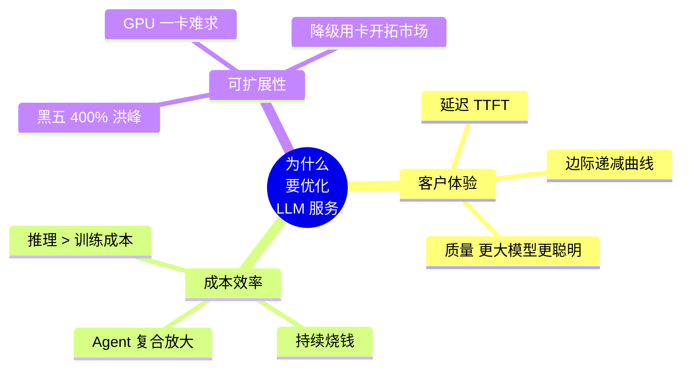
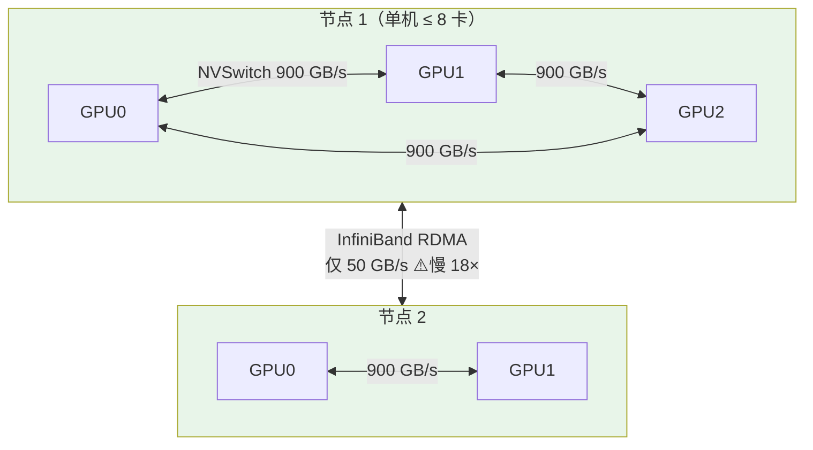
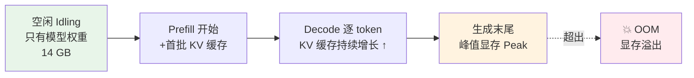
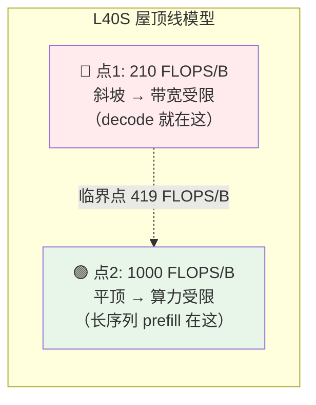
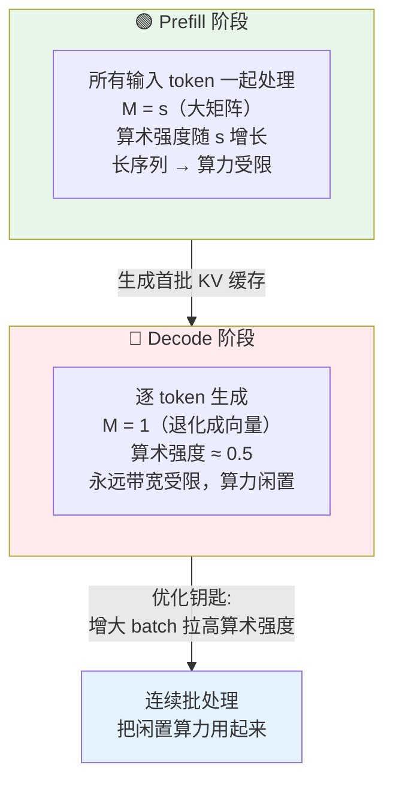
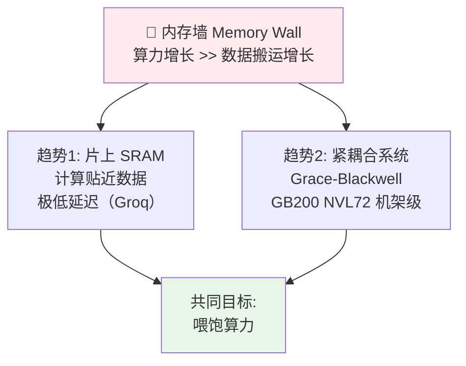

# 第 5 章 · 服务 LLM 的挑战（Challenges When Serving LLMs）

> 逐章精讲 ·《Hands-On LLM Serving and Optimization: Hosting LLMs at Scale》(Chi Wang, Peiheng Hu) · 对应原书第 5 章（PDF p.177–208）

---

## 🗺️ 本章地图：这一章在全书的位置

前面四章，作者已经带你走完了「模型服务（Model Serving）」的**通用**基础：

- 第 1 章 模型服务与优化导论 —— 什么是模型服务、为什么要优化。
- 第 2 章 大语言模型服务 —— Transformer 的自回归本质、KV 缓存、prefill/decode 两阶段。
- 第 3 章 服务系统设计深潜 —— 从零手写在线/多模型服务、批处理、流式。
- 第 4 章 模型服务最佳实践 —— Agent 世界里的服务、云上部署 6 种方案、延迟/吞吐指标。

**第 5 章是一道分水岭（bridge chapter）。** 前面讲的是「怎么把模型跑起来、跑得对」，从这一章开始，全书转向真正硬核、也是增长最快的领域：**为服务而优化 LLM（optimizing LLMs for serving）**。

作者的原话是：这一章要帮你建立**直觉（intuition）**。如果你不懂底层原理，优化 LLM 服务就会变成"令人疲惫的试错实验（tiring trial-and-error experiment）"——你可能瞎猫碰死耗子地卡在一个局部最优（local optima）里，还不自知；或者只知道"怎么做（how）"却不知道"为什么（why）"。

> 📖 **读完这一章，你能会什么？**
> 1. 说清楚**为什么**高效服务 LLM 直接决定业务成败（客户体验 / 成本 / 可扩展性）。
> 2. 看懂 **GPU 规格表**：算力 FLOPS、显存容量、显存带宽、互联（NVLink/NVSwitch/InfiniBand）、功耗，并据此选卡。
> 3. 亲手估算一个模型要占多少显存：**模型权重大小** + **KV 缓存大小**，并推导一张卡能跑多大 batch。
> 4. 掌握**算术强度（Arithmetic Intensity）** 与 **屋顶线模型（Roofline Model）** 这两把"手术刀"，判断某个负载到底是 **compute-bound（算力受限）** 还是 **memory-bandwidth-bound（带宽受限）**。
> 5. 理解为什么 **prefill 是算力受限、decode 是带宽受限**——这是后面所有优化技术（连续批处理、FlashAttention、PD 分离、投机解码……）的立论根基。
> 6. 认识 **"内存墙（Memory Wall）"** 这个贯穿整个 AI 硬件时代的根本矛盾，以及 NVIDIA 之外的加速器格局。

本章的叙事逻辑非常"第一性原理"：**先讲清楚硬件的物理边界，再把 LLM 放上去，看它撞到哪堵墙。** 撞墙的地方，就是后面每一章优化技术要解决的靶子。


---

## 🎯 一、为什么高效服务 LLM 如此重要（Why Optimizing LLM Serving is Important）

前几章解决的是"模型能不能正确跑起来（functionally operational）"。本节要回答的是另一半——"模型在生产环境里跑得**快不快、省不省**"。对 LLM 尤其致命，因为它对**算力和显存的需求是天量的**。

作者把关键因素归为三类，我们逐个讲透。

### 1.1 客户体验（Customer Experience）

**是什么**：客户体验和模型**响应延迟（latency）** 高度相关。

想象一下：你在 ChatGPT 里问一个问题，结果要等 **20 秒** 才蹦出第一个字。这种体验是灾难性的，用户分分钟就烦了、走了。如果我们能在**同样的硬件、同样的整体吞吐**下，把延迟从 20 秒压到 1 秒，那对产品就是"game-changer（改变游戏规则）"。

**但延迟不是越低越好——这是本节最反直觉的一点。**

如果把"首 token 时间（Time To First Token, TTFT）"从 0.1 秒压到 0.01 秒，差别小到人类根本感知不到。这时候聪明的做法是**反过来**：用一点延迟去换更高的吞吐——比如把 TTFT 从 0.01 秒"放松"回 0.1 秒，人感觉不出变慢，却能让机器同时服务更多人，**成本效率更高**。

> 🔬 **第一性原理：延迟 vs 满意度是"边际递减"曲线**
> 书里的图 5-1 说的就是这条曲线：延迟与满意度**负相关**，但不是线性的。
> - 延迟很高时（右侧），满意度接近 0，此时每降 1 秒延迟，满意度暴涨——**优化收益巨大**。
> - 延迟已经很低时（左侧），曲线趋于平坦，再降延迟几乎不涨满意度——**优化收益趋零**。
> 这条曲线告诉你：优化要花在"刀刃"上。在人类感知阈值（约 100~200ms）以下继续卷延迟，是在浪费算力；这些算力应该拿去换吞吐/省钱。

| 延迟区间 | 用户感受 | 该怎么做 |
|---|---|---|
| > 5 s 首 token | 明显卡顿、想放弃 | 拼命优化延迟，收益极大 |
| 0.5 ~ 2 s | 可接受，流式输出可掩盖 | 平衡延迟与吞吐 |
| < 0.1 s | 人类感知不到差异 | **别再卷延迟**，拿延迟换吞吐/省钱 |

**客户体验的另一半是"生成质量（generation quality）"。** 同一家族里，**更大的模型通常质量更高**（书中图 5-2 对比了 Llama-3-8B 与 70B 的榜单分数，70B 全面胜出）。

这里藏着一个优化的"隐藏红利"：
- **没优化前**：为了满足延迟要求，你可能只敢上 8B 模型。
- **深度优化后**：在**同样的硬件、同样的延迟和吞吐**下，你能塞进 32B 甚至 70B 的模型！

也就是说，优化不只是"省钱/提速"，它还能让你在不加钱的前提下**用上更聪明的模型**，直接拉高产品质量。这是一举两得的事。

### 1.2 成本效率（Cost Efficiency）

**是什么**：再牛的 AI 系统，如果规模化运营的成本高到离谱，就活不下去。

作者抛出一个反直觉的判断：**在 AI 的所有成本里，模型推理（inference）才是最贵的那一块，而不是训练（training）。**

很多人第一反应是"训练才贵啊，GPT-4 训练据说花了超过 5000 万美元"。但书里引用 Signal Integrity Journal 对 2024–2034 AI 芯片营收的预测（图 5-3）：**推理硬件的消耗今天就已经超过了训练，而且差距还在拉大。**

> 🔬 **第一性原理：为什么推理终将碾压训练成本？**
> - **训练是一次性前置投入（upfront）**：花一大笔钱训练好，之后只有零星的再训练/微调开销。
> - **推理是持续成本（continuous）**：模型一上线，**每一次查询、每一次交互都在烧钱**。用户越多、用得越频繁，成本累积得越快。
> - **雪上加霜的两个放大器**：
>   1. 绝大多数公司不自己训基础模型，而是**微调现有模型**或用 **RAG（检索增强生成）** ——训练成本被摊薄，推理成本却照跑不误。
>   2. **AI Agent 和复杂工作流的兴起**：一个工作流里往往要调用**多个 LLM + 多个 embedding 模型**，这种"复合效应（compounding effect）"把推理成本推得更高。

优化推理能省多少钱？作者给了两条路径：

| 优化路径 | 机制 | 省钱效果 |
|---|---|---|
| **提升吞吐** | 同样硬件、同样延迟，同时服务更多客户 | 水平扩容时需要的机器更少 → 省一大笔硬件钱 |
| **降级用卡** | 优化后的模型能在**低端芯片**上跑，而非昂贵高端卡 | 单卡成本骤降，且低端卡更好买 |

### 1.3 可扩展性、峰值处理与可行性（Scalability, Peak Load Handling, and Feasibility）

**是什么**：模型上生产后，GPU 需求随客户增长而膨胀。优化不仅省钱、提体验，它还直接**决定系统能不能在重压下扛住**——尤其在 GPU 一卡难求的当下。

作者给了一个非常真实的**突发流量（bursty traffic）** 案例，直接呼应了本章要点里的"突发流量/峰值处理"：

> 💡 **实战案例：黑五（Black Friday）的 400% 流量洪峰**
> 一个 LLM 驱动的销售 Agent，一年里大部分时间流量平稳。但到了黑色星期五，需求可能**暴涨 400% 甚至更多**。
> - **没优化好的系统**：难以扩容应对突增 → 出现瓶颈、延迟劣化、甚至**请求直接失败（request failures）**。
> - 作者强调这是他们**亲身踩过的坑**：要把峰值场景调对，需要大量的调优（tuning）和压测（performance testing），才能保证那段时间的服务可用性（availability）。

这就把本章要点里的几个"症状级"挑战串起来了——**突发流量、公平性、多租户、尾延迟**，本质上都源于同一个物理约束：**GPU 的算力和显存是有限且昂贵的，而请求是随机、突发、长短不一的。**

**"可行性（Feasibility）"这个词也大有讲究。** 就算你能用上 AWS / Google Cloud / Azure 这些大厂云，**高端 GPU 也不是每个区域随时都有货**。优化后的模型能在**更广泛的硬件**上跑，而不是被绑死在少数高端卡上——这本身就是业务能否**开拓新市场**的关键。作者说他们在全球部署应用时，"经常"遇到这个问题。

> ⚠️ **常见坑：把"可扩展"简单理解成"加机器"**
> 很多新手以为峰值来了加机器就行。现实是：(1) 高端 GPU 可能**根本买不到**；(2) 加机器需要时间（冷启动、加载模型权重动辄几十秒）；(3) 每台机器利用率低，加得越多越亏。真正的可扩展性来自**单机效率的极致优化**——把每张卡榨干，才是应对洪峰最经济的底气。



---

## 🖥️ 二、加速器芯片在 LLM 服务中的角色（The Role of Accelerator Chips）

选对加速器（accelerator）配置，是服务 LLM **最重要的决策之一**——因为硬件约束**直接决定**了系统的显存容量、算力和效率。

作者聚焦 NVIDIA GPU（截至 2026 年初，NVIDIA 的 GPGPU 方案仍然统治市场），并把令人眼花的规格表精简到**四个和 LLM 最相关的维度**：

1. **算力（Compute Power）** —— GPU 算得多快
2. **显存容量（Memory Capacity / VRAM）** —— 能装多大的模型
3. **显存带宽（Memory Bandwidth）** —— 数据搬得多快
4. **互联（Interconnects）** —— 多卡之间通信多快

### 2.1 读懂 GPU 规格表（Reading GPU Specs）

书里用 **H100 SXM vs H100 NVL** 两个版本做对比（表 5-1），我把关键行摘录出来：

| 规格 | H100 SXM | H100 NVL | 含义 |
|---|---|---|---|
| FP64 | 34 TFLOPS | 30 TFLOPS | 双精度算力 |
| TF32 Tensor Core | 989 TFLOPS | 835 TFLOPS | |
| **BF16 / FP16 Tensor Core** | **1979 TFLOPS** | 1671 TFLOPS | 半精度算力（LLM 常用） |
| **FP8 Tensor Core** | **3958 TFLOPS** | 3341 TFLOPS | 8 位算力（≈ FP16 的 2 倍） |
| INT8 Tensor Core | 3958 TOPS | 3341 TOPS | |
| **GPU 显存** | **80 GB** | **94 GB** | 装模型的容量 |
| **显存带宽** | **3.35 TB/s** | **3.9 TB/s** | 搬数据的速度 |

#### 🔹 算力属性（Compute）：TeraFLOPS 是什么

**FLOPS = Floating-point Operations Per Second（每秒浮点运算次数）**，衡量芯片**理论上**每秒能做多少次浮点运算（加法、乘法）。它是"理论上有多快"的度量。**Tera-（万亿）= 1,000,000,000,000 = 10¹²。**

所以 H100 SXM 在 FP16 精度下能做 `1979 × 10¹²` 次运算/秒。

> 💡 **关键点：低精度 ≈ 翻倍的速度**
> 表里 FP8 Tensor Core 是 3958 TFLOPS，**恰好是 FP16（1979）的两倍**。
> - **FP16**（half precision，半精度/16 位）、**FP8**（8 位）都是深度学习里的低精度数值格式。
> - **FP8 只有 FP16 一半的字节数，所以计算几乎能快一倍。**
> - 代价是**精度损失**（accuracy），这个 trade-off 第 6 章会深挖（量化）。

横向对比：H100 NVL 的 FLOPS 略低于 SXM。那 NVL 就一无是处吗？**未必**——继续看显存。

#### 🔹 显存属性（Memory）：容量 vs 带宽

- **显存容量（VRAM）**：能装多大的模型。H100 NVL 有 **94 GB** > SXM 的 80 GB。
- **显存带宽（Memory Bandwidth）**：GPU 计算时搬数据的速度。NVL 的 **3.9 TB/s** > SXM 的 3.35 TB/s。

于是矛盾来了：**SXM 算得更快（FLOPS 高），但 NVL 容量更大、带宽更高。怎么选？**

> 🍕 **第一性原理：披萨店比喻（贯穿全章的核心心智模型）**
> 把 GPU 想象成一个大披萨厨房，目标是**尽快做出披萨，服务尽可能多的客人**：
> - **算力（FLOPS）= 烤箱有多快多猛。**
> - **显存带宽（Bandwidth）= 你备料、把面团送进烤箱的速度。**
> - **显存容量（VRAM）= 冰箱能存多少面团。**
>
> 三者的相互作用：
> - **冰箱太小**（显存不够）→ 客人干坐着饿肚子（模型根本装不下）。
> - **烤箱超猛，但备料太慢**（高 FLOPS + 低带宽）→ 烤箱空转，算力白白浪费！
> - **备料飞快，但烤箱不给力**（低 FLOPS + 高带宽）→ 披萨烤半天，客人还是等。
>
> **结论：必须让"算力、容量、带宽"三者匹配你的负载，找到平衡。** 这个比喻会在第四节"算术强度"里被反复引用来判断瓶颈。

### 2.2 GPU 互联（Interconnects）：单卡装不下时

模型越来越大，一张卡已经装不下大多数模型了。这时你需要：
- **把一个大模型拆到多张卡**上，每张卡装一部分权重/层；或
- **延迟敏感场景**下，单卡不够快，让多卡协同加速。

这时**互联规格**就变得生死攸关。互联分**节点内（intra-node）** 和**节点间（inter-node）**。

#### 🔹 节点内互联（Intra-node）

书里用 H100 三个版本对比（表 5-2）：

| | H100 PCIe | H100 NVL | H100 SXM |
|---|---|---|---|
| 形态（Form factor） | PCIe | PCIe | SXM |
| NVLink 支持 | 无（可选） | NVLink Bridge | NVLink/NVSwitch |
| GPU-GPU 带宽 | **128 GB/s**（PCIe） | **600 GB/s**（桥接 2 卡） | **900 GB/s**（最多 8 卡） |

**逐条拆解：**

- **形态（Form Factor）** 定义了 GPU 的物理尺寸、功耗、散热设计，决定它怎么装进服务器。
  - **SXM**：直接焊在主板的定制插槽上，连接更快、供电更好、散热更强——适合重度多卡负载。
  - **PCIe**：插进标准 PCIe 插槽，**兼容性广、便宜，但性能弱**。

- **NVLink**：NVIDIA 的高速互联技术，让 GPU 之间**直连**高带宽通信。没有 NVLink 的版本，GPU 间通信只能退回到慢得多的 PCIe。

**三种拓扑（图 5-4 ~ 5-7）逐个看：**

1. **H100 PCIe（图 5-4）**：两卡走 PCIe，**128 GB/s**，最便宜。如果你不需要快速的卡间通信（比如两个小模型各占一卡独立运行），PCIe 足矣。

2. **H100 NVL + NVLink Bridge（图 5-5）**：桥接一对 NVL，**600 GB/s**。
   - **缺陷**：一次只能连**两张卡**。四卡场景下，GPU1-GPU2 桥接 600 GB/s，GPU3-GPU4 桥接 600 GB/s，但 **GPU1-GPU3、GPU2-GPU4 之间仍然只能走 128 GB/s 的 PCIe**。这是成本与性能的折中方案。

3. **H100 SXM + NVLink（图 5-6）**：单节点内最多 **8 张卡** 互联，每卡 **900 GB/s**。
   - ⚠️ **一个坑**：900 GB/s 要**平分给 7 条点对点连接**（连另外 7 张卡），`900 / 7 ≈ 128 GB/s` 每条。也就是说裸 NVLink 下，每对卡实际只有 ~128 GB/s。

4. **H100 SXM + NVSwitch（图 5-7）**：加入 4 个 NVSwitch 后，实现 **all-to-all 全互联的满 900 GB/s**。
   - **NVSwitch** 是一个独立、昂贵的高带宽交换芯片，把多个 NVLink GPU 全连起来。
   - **代价**：所有方案里**最贵**。如果你的负载没那么多卡间通信需求，就是**杀鸡用牛刀（overkill）**。

#### 🔹 节点间互联（Inter-node）

单节点通常**最多 8 卡**（受物理、供电、散热、软件支持限制）。模型再大，8 卡也不够，就得**跨节点分片**。

最佳方案之一是 **InfiniBand（IB） + GPUDirect RDMA**。
- **RDMA（Remote Direct Memory Access，远程直接内存访问）**：让跨节点的 GPU 之间**直接访问彼此显存**。
- **NDR 400G InfiniBand** 可达 **50 GB/s** 跨节点——但这**远慢于**节点内。

**关键的带宽层级表（表 5-3），务必背下来：**

| 通信场景 | 带宽 | 相对速度 |
|---|---|---|
| 节点内 · NVLink/NVSwitch | **900 GB/s** | 基准 1× |
| 节点内 · NVLink Bridge | 600 GB/s | 0.67× |
| 节点内 · PCIe | 128 GB/s | 0.14× |
| **跨节点（across node）** | **50 GB/s** | **仅 0.056×** |

> 💡 **实战/面试高频：为什么"尽量单节点、水平扩副本"？**
> 表 5-3 揭示了一条铁律：**跨节点通信（50 GB/s）比节点内满速（900 GB/s）慢了近 18 倍。**
> 所以业界主流做法是：每个**模型实例（副本 replica）** 尽量塞在**单节点 1~8 卡**内。用户流量涨了，就**水平增加副本数**（多加同样配置的机器），目标是**最小化不必要的跨节点通信**。
> 第 7 章会展开：张量并行（tensor parallelism）、流水线并行（pipeline parallelism）、以及 MoE 模型（如 DeepSeek V3/R1）用到的专家并行（expert parallelism）、数据并行（data parallelism），甚至把 prefill/decode 拆到不同 GPU（PD 分离）。



### 2.3 GPU 功耗（Power Consumption）：隐藏的第五要素

一个容易被忽略的约束：**芯片功耗**。
- 用 **瓦特（W）** 衡量，最常见的指标是 **TDP（Thermal Design Power，热设计功耗）**——持续满载下 GPU 设计能消耗的最大功率。
- 现代数据中心 GPU 从几百瓦到 **700W+** 不等。功率预算越高，算力密度和带宽越强，**但对散热、供电、系统集成的要求也越苛刻**。

功耗的重要性**强烈依赖部署环境**：

| 环境 | 功耗地位 | 说明 |
|---|---|---|
| **普通云用户** | 被抽象掉了 | 只管选实例、按时间/用量付费，功耗隐含在定价里 |
| **云厂商 / 私有数据中心** | 一等公民约束 | 供电和散热常常**限制每机架能塞几张卡**，"每瓦性能（performance per watt）"是关键指标 |
| **边缘 / 端侧** | 决定一切的约束 | 电池、散热、形态的硬限制，直接**塑造了模型架构、精度选择、执行策略** |

### 2.4 主流 GPU 规格对比与选卡（Comparing Popular GPUs）

规格懂了，怎么用来选卡？作者给出表 5-4（2026 春季价格，会变）：

| 规格 | H200 SXM | H100 SXM | A100 SXM | L40S | A10 |
|---|---|---|---|---|---|
| 显存（GB） | 141 | 80 | 80 | 48 | 24 |
| FP16/BF16 TFLOPS | 1979 | 1979 | 312 | 362 | 125 |
| 显存带宽（TB/s） | 4.8 | 3.35 | 1.935 | 0.864 | 0.6 |
| 支持 FP8 | ✅ | ✅ | ❌ | ✅ | ❌ |
| NVLink/NVSwitch | ✅ | ✅ | ✅ | ❌ | ❌ |
| 按需时价/卡 | ~$6.3 | ~$6.2 | ~$2.7 | ~$2.25 | <$1.25（或已停售） |

**通用原则**：越强的卡越贵，选卡取决于**你的模型能不能吃得下这张卡的性能/特性**。作者给了三档示例：

- **小模型（如微调后的 Llama-3-8B，延迟不敏感）→ A10**。显存够装够跑，最便宜，且是老一代卡、货源充足。
- **中模型（如 DeepSeek-R1-Distill-Qwen-14B，参数约 8B 的两倍）→ L40S**。支持 FP8，能力足够；单卡搞定、避免多卡开销；还剩不少显存去撑**长上下文、长生成、大 batch**。
- **大模型（如 DeepSeek-R1，671B 参数）→ 8×H200 + NVLink Switch**。单张 H200 也装不下、跑不动，需一机 8 卡 FP8 互联。（DeepSeek 用 MoE 架构，可进一步把专家分散到多卡/多节点。）

> ⚠️ **作者的忠告**：这个领域**技术迭代极快**，今天人人抢的最热芯片，明天就可能被新卡取代。但你建立的**基础概念和权衡直觉不会变**——这才是本章真正想教你的东西。

---

## 📦 三、模型加载的瓶颈（Bottlenecks in LLM Model Loading）

现在把 LLM 放上 GPU，看它怎么和硬件规格互动。第一步：**加载模型**。核心问题——**为什么模型必须待在 GPU 显存里？谁在吃显存？给定负载怎么估算显存需求？**

### 3.1 模型加载流程（The Model Loading Process）

高效服务的第一步：把模型权重加载并缓存进 GPU 显存。流程（图 5-8）：

**磁盘/远端 → CPU 内存（系统内存）→ GPU 显存**，加载完权重就**常驻 GPU 显存**，随时服务请求。

有人会问：**为什么不把模型缓存在更大的 CPU 内存里，或者请求来了再按需加载？** 答案在**数据传输速度**——硬盘和 CPU 内存搬权重都**太慢**，无法满足实时推理。

**关键带宽对比（表 5-5），刻进 DNA：**

| 存储介质 | 带宽 |
|---|---|
| 硬盘（SSD） | **0.5 ~ 14 GB/s** |
| CPU 内存 | **50 ~ 200 GB/s** |
| **GPU 显存** | **300 GB/s ~ 3 TB/s** |

> 🔬 **第一性原理：CPU 内存 vs GPU 显存，是两种不同的物理器件**
> - **CPU 内存 = DRAM**（动态随机存取存储器），为**容量和通用访问**优化。
> - **GPU 显存 = HBM**（High-Bandwidth Memory，高带宽内存），是 DRAM 的一种**特化形态**，为**海量并行数据搬运**优化。
> - 权重必须放在 GPU 显存里。如果放在 CPU 内存，每次都要**搬到 GPU** 才能算——这个额外步骤会带来**不可接受的服务延迟**。这就是"按需加载"行不通的根本原因。

### 3.2 估算模型大小（Estimating Model Size）

一个大模型要多少显存？**两个关键变量：参数量（parameter count）+ 精度（data type / precision）。**

- **参数量**：常常直接写在名字里。`Llama-2-7b` 就是约 **70 亿（7 billion）** 参数。
- **精度**：看 Hugging Face 仓库里 `config.json` 的 `torch_dtype` 字段。

书里抄录了 Llama-2-7b-chat 的 `config.json`（我保留关键行并逐行注释）：

```json
{
  "_name_or_path": "meta-llama/Llama-2-7b-chat-hf",
  "architectures": ["LlamaForCausalLM"],   // 架构：因果语言模型（自回归解码器）
  "hidden_size": 4096,                      // 隐藏维度 h = 4096（后面算 KV 缓存/算术强度要用）
  "intermediate_size": 11008,               // FFN 中间层维度
  "max_position_embeddings": 4096,          // 最大位置编码 = 支持的最长序列
  "num_attention_heads": 32,                // 注意力头数 = 32
  "num_hidden_layers": 32,                  // Transformer 层数 = 32（后面算 KV 缓存要用）
  "num_key_value_heads": 32,                // KV 头数 = 32（MHA：与注意力头数相等）
  "torch_dtype": "float16",                 // ★精度 = FP16 → 每参数 2 字节
  "use_cache": true,                        // 启用 KV 缓存
  "vocab_size": 32000                       // 词表大小
}
```

**精度与字节数的对应（表 5-6），背下来：**

| 精度 | 位数（bits） | 字节数（bytes） |
|---|---|---|
| FP32（单精度） | 32 | 4 |
| FP16 / BF16（半精度） | 16 | 2 |
| INT8 / FP8（1/4 精度） | 8 | 1 |

**一般规律**：精度从 FP32 → FP16 → INT8/FP8 越降，**模型越小、服务性能越好，代价是一些精度损失**（第 6 章深挖量化）。

**动手算 Llama-2-7b 的权重大小**（BF16，每参数 2 字节）：

```
~70 亿参数 × 2 字节/参数 = 140 亿字节 = 14 GB
```

实际看模型文件（`pytorch_model*.bin` 之和约 13 GB），验证了这个估算。**记住这个"经验公式"：**

> 📐 **模型权重大小 ≈ 参数量 × 每参数字节数**
> - FP16/BF16：`参数量(B) × 2` GB（7B → 14GB，13B → 26GB，70B → 140GB）
> - FP8/INT8：`参数量(B) × 1` GB（量化直接砍半！）

### 3.3 估算 KV 缓存大小（Estimating KV Cache Size）—— 本章的"炸弹"

**这是本章最重要、也最贴合"KV 爆炸"要点的一节。**

接上例：模型 14 GB。假设你有一张 **16 GB** 的卡。`16 > 14`，能装下！发一个短请求也跑得动。🎉 ……**但先别高兴。**

> ⚠️ **常见坑：显存"刚好够装模型"是灾难配置**
> 一张显存刚够装权重的卡，几乎**没法真正服务**。因为除了权重，你还要给 **KV 缓存（KV Cache）** 和**中间激活（activations）** 留地方。如果只留一丁点给 KV 缓存，你就被**死死限制**在极小的 batch size 和极短的上下文里——完全没法在生产里用。

**回顾第 2 章：KV 缓存是"用显存换速度"的优化。** 解码下一个 token 时，模型复用之前缓存的中间结果（K、V 张量），不必重算。GPU 显存里的布局（图 5-10）：**模型权重 + KV 缓存 + 一小块中间计算空间** 共存。

**KV 缓存的核心公式——每 token 的 KV 缓存大小：**

```
每 token KV 缓存 = 2 × 层数 × 注意力头数 × 头维度 × 精度字节数
```

> 🔬 **公式逐项拆解（第一性原理）**
> - **2** ：因为要同时缓存 **K（Key）和 V（Value）** 两个张量。
> - **层数（num_layers）**：每一层 Transformer 都有自己独立的 KV。
> - **注意力头数 × 头维度**：一层里所有头拼起来 = 隐藏维度 h。（`头维度 = h / 头数`）
> - **精度字节数**：FP16 = 2 字节。
> - 这里用的是最基础的 **多头注意力（MHA）**。后面章节会讲 **MQA / GQA / MLA**（DeepSeek V2/V3/R1 用的多头潜在注意力）等**压缩 KV 缓存**的技术。

**代入 Llama-2-7b**（32 层、32 头、头维度 = 4096/32 = 128、FP16 = 2 字节）：

```
每 token KV 缓存 = 2 × 32 × 32 × 128 × 2 = 524,288 字节 = 0.5 MB / token
```

**下一个问题：要缓存多少 token？**

```
最大 token 数 = 最大 batch size × 最大序列长度
总 KV 缓存 = 每 token KV 缓存 × 最大 token 数
          = 每 token KV 缓存 × (最大 batch size × 最大序列长度)
```

- **最大 batch size**：一个模型实例能同时处理多少个并行请求/用户。
- **最大序列长度**：输入 + 输出的总长度上限。

**代入长文摘要场景**（序列长 4096，batch = 16）：

```
总 KV 缓存 = 0.5 MB/token × 4096 token/请求 × 16 请求 = 32 GB
```

> 💥 **震撼结论：KV 缓存（32 GB）比模型本身（14 GB）还大！**
> 这就是本章要点里"**显存/KV 爆炸**"的定量证据。KV 缓存**随 batch size 和序列长度线性增长**——你处理的请求越多、prompt/生成越长，KV 缓存吃显存吃得越凶。**长上下文之所以是服务噩梦，根源就在这条线性膨胀公式。**

**用 KV 缓存反推"一张卡能跑多大 batch"（表 5-7），这是选卡的实战算法：**

| GPU（显存） | 装完权重剩余 | 最大可能 batch size | 按需时价/卡 |
|---|---|---|---|
| **A10（24 GB）** | 10 GB（24 − 14） | **4**（`10 × 1024 / (0.5 × 4096) ≈ 5`） | $2 |
| **L40S（48 GB）** | 34 GB（48 − 14） | **16**（`34 × 1024 / (0.5 × 4096) ≈ 17`） | $3.75 |

> 💡 **反直觉的成本结论：贵的卡反而更省钱**
> A10 只能并行 4 个请求，L40S 能并行 16 个。L40S 虽然贵（$3.75 vs $2），但吞吐是 A10 的 4 倍——**单请求成本反而更低，更具成本效率（cost-efficient）**。
> 这就是 1.2 节"提升吞吐 → 省钱"的量化印证：**不能只看单卡时价，要看"每请求成本 = 卡价 / 并发数"。**

> ⚠️ **坑：理论 batch 拿不满**
> 表里算出的是**理论最大值**。实际上还要给 **activations（中间步骤产生的张量）** 留空间，所以真实可用 batch 会比理论值小。

**显存从空闲到执行的动态变化（图 5-11）：**



**关键洞察**：执行期间 KV 缓存**随序列增长持续膨胀**，必须保证**峰值显存（生成末尾最大）之上还有余量**，否则报 **OOM（Out-Of-Memory，显存溢出）**。

> 📐 **黄金经验法则（Rule of Thumb）**
> 作者建议：估算模型显存需求时，**起步就按"模型大小的约 2 倍"来配 GPU 显存**，才能获得更好的并行度、榨出更多 GPU 性能。（后面 prefix caching 等技术可能需要更多空间来换极致 TTFT。）
> 即：14 GB 的模型，别买 16 GB 的卡，直接上 ~28GB+ 起步。

---

## ⚙️ 四、模型执行的瓶颈（Bottlenecks in LLM Model Execution）

模型已经完整加载进显存，可以服务了。现在直面**房间里的大象（the elephant in the room）**：

> **模型服务到底是被 GPU 算力（FLOPS）卡住，还是被显存带宽（bandwidth）卡住？**
> 用披萨比喻：我们需要的是**更快的烤箱**，还是**更快的备料速度**？

回答这个问题的工具，就是本章的两把手术刀：**算术强度（Arithmetic Intensity）** 和 **屋顶线模型（Roofline Model）**。

### 4.1 算力与带宽的边界：算术强度登场

**算术强度（Arithmetic Intensity）定义**：算法的**运算次数** 与 **访问字节数** 之比，即"每搬 1 字节数据，能做多少次浮点运算"，单位 **FLOPS/Byte**。

```
算术强度 = 运算次数（FLOPS） / 数据搬运量（Bytes）
```

- **低算术强度**：算得少、搬得多（数据密集）。
- **高算术强度**：搬得少、算得多（计算密集）。

> 🔬 **第一性原理：区分"模型加载"和"数据搬运（data movement）"**
> 这是极易混淆的一点：
> - **模型加载（loading）**：把权重从磁盘/CPU 搬进 GPU 显存（HBM）。**一次性**的事。
> - **数据搬运（data movement）**：**执行时**，权重已经在 HBM 里，还要从 **HBM → SRAM（片上）→ 寄存器（register）** 一路搬到计算单元旁边才能算（图 5-12）。**每次计算都在发生。**
>
> **两级显存的物理本质：**
> | | HBM（片外 GPU 显存） | SRAM（片上：L2/L1/共享内存） |
> |---|---|---|
> | 技术 | 特化 DRAM | 静态随机存储 |
> | 特点 | 大、便宜、**慢** | 小、贵、**快**，紧挨计算单元 |
> | 用途 | 存模型权重等大数据 | 支撑低延迟计算 |
> **一句话：SRAM 拿容量和成本换速度，HBM 拿速度换容量。** 因为 HBM 最慢，所以算数据搬运时，**用的就是 GPU 显存带宽这个数字**。（例外：如果权重/输出小到能巧妙塞进片上缓存——比如 FlashAttention——就不一样了，第 6 章讲。）

**用规格表算芯片的"临界算术强度"（以 L40S 为例，表 5-8）：**

L40S：FP16 Tensor Core = 362 TFLOPS，显存带宽 = 864 GB/s。

```
芯片算术强度 = 362 TFLOPS / 864 GB/s
            = (362 × 10¹² FLOPS) / (864 × 10⁹ B)
            ≈ 419 FLOPS/B
```

**这个 419 就是 L40S 的"临界点（crossover point）"。**

### 4.2 屋顶线模型（Roofline Model）：一张图看懂受限于谁

**屋顶线模型**是一个可视化的性能模型，把系统的**算力**和**带宽**画在一起，判断某个负载是 **compute-bound** 还是 **memory-bound**。

- **x 轴**：算术强度（FLOPS/B）。
- **y 轴**：可达算力（TFLOPS）。
- 曲线像一个"屋顶"：斜坡段（带宽决定）+ 平顶段（算力决定），转折点就是 419 FLOPS/B。

**判据（图 5-14）：**

| 数据点 | 算术强度 | 落在哪 | 结论 |
|---|---|---|---|
| 点 1 | ~210 FLOPS/B（临界点一半） | 斜坡上 | **带宽受限（memory-bound）**：算力有富余却用不上——"烤箱还空着，但面团供不上" |
| 点 2 | 1000 FLOPS/B | 平顶上 | **算力受限（compute-bound）**：已顶到最大算力——"面团供得飞快，但烤箱满了，得等出炉" |

> 🔬 **本质：临界点左边=带宽受限，右边=算力受限**
> - **算术强度 < 419**（斜坡）：无法用满 362 TFLOPS，被带宽拖住 → **memory-bandwidth-bound**。
> - **算术强度 > 419**（平顶）：已达算力天花板，再快搬数据也没用 → **compute-bound**。



### 4.3 矩阵乘法的算术强度（Arithmetic Intensity in Matmul）

LLM 主要由 Transformer 块组成，块内是**自注意力层**和**前馈层**，两者的绝大部分计算都是**矩阵乘法（matmul）**。（其它逐元素/归约操作算术强度低，但占比小。）所以我们先算 matmul 的算术强度。

**矩阵乘法**：`[M, K] × [K, N] = [M, N]`（图 5-15）。朴素三重循环（书中伪码，逐行注释）：

```python
for m in range(0, M):            # 遍历输出的每一行
    for n in range(0, N):        # 遍历输出的每一列
        for k in range(0, K):    # 对 K 维做累加（点积）
            Outputs[m][n] += Inputs[m][k] * Weights[k][n]  # 一次乘 + 一次加
```

**分子（运算次数）**：`M×N×K` 次乘法 + `M×N×(K−1)` 次加法，简化为：
```
运算次数 = 2 × M × N × K
```

**分母（数据搬运）**：读两个输入矩阵 + 写输出矩阵，半精度每值 2 字节：
```
数据搬运 = 2 × (M×K + K×N + M×N)
```

**所以：**
```
算术强度 = 2×M×N×K / [2 × (M×K + K×N + M×N)]
        = M×N×K / (M×K + K×N + M×N)
```

**令 M=N=K，看算术强度怎么随矩阵大小变（表 5-9）：**

| 矩阵大小 (M=N=K) | 算术强度 (FLOPS/Byte) | L40S 判据（临界 419） |
|---|---|---|
| 64 | 21 | **带宽受限** |
| 512 | 170 | **带宽受限** |
| **4096** | **1365** | **算力受限** |

> 🔬 **核心洞察：矩阵越大，算术强度越高，越容易变成算力受限**
> 小矩阵（64、512）算术强度只有 21、170，远低于 419 → 带宽受限。
> 大矩阵（4096）飙到 1365 → 算力受限。
> **那么问题来了：LLM 服务里的矩阵，够大吗？** 你可能以为模型那么大，矩阵肯定大——**不一定！** 下一节揭晓。

### 4.4 应用到 Prefill 和 Decode 两阶段（最精彩的部分）

**关键前提**：当 **batch size = 1**（一次只处理一个请求）时，情况会很不一样。

输入张量形状是三维：`[batch size, 序列长度, 隐藏维度]`。
- **batch size**：一次处理多少请求。
- **序列长度（sequence length）**：prompt 里的 token 数——从 "Hello" 到百万 token，**高度可变，完全由用户决定**。
- **隐藏维度（hidden dim）**：每个 token 向量的维数 h。

batch=1 时，三维张量退化成二维矩阵 `[序列长度, 隐藏维度]`。

**回顾两阶段（第 2 章）：**
- **Prefill（预填充）**：处理输入 prompt 的初始阶段。**所有输入 token 一起处理**，计算注意力 + 生成首批 KV 缓存。
- **Decode（解码）**：**逐个** 生成 token，复用已有 KV 缓存。

**把 M、N、K 换成 LLM 的实际形状（图 5-16）：**
- `h` = 隐藏维度（prefill/decode 都不变）。
- **Prefill**：所有 token 一起进，`M = s`（s = 序列长度，**很大**）。
- **Decode**：一次生成 1 个 token，`M = s_decode = 1`。

代入算术强度公式（`M×N×K / (M×K + K×N + M×N)`，其中 N=K=h）：

**Prefill**：`s×h×h / (s×h + h×h + h×h)`
**Decode**：`1×h×h / (1×h + h×h + h×h) ≈ h²/2h² = 0.5`

**逐序列长度对比（表 5-10，h=4096）：**

| 序列长度 s | Prefill 算术强度 | Decode 算术强度 | L40S 判据（临界 419） |
|---|---|---|---|
| 64 | 31 | 0.5 | 两者都**带宽受限** |
| 512 | 240 | 0.5 | 两者都**带宽受限** |
| **4096** | **1365** | **0.5** | **Prefill 算力受限，Decode 带宽受限** |

> 💥 **本章的"顶点结论"，务必彻底吃透：**
> - **Prefill 的算术强度随序列长度增长**：序列足够长时（如 4096），能飙到 1365，**打满 GPU 算力 → compute-bound**。
> - **Decode 的算术强度永远是 ~0.5**：无论序列多长，一次只生成 1 个 token，矩阵一维退化成 1，算术强度极低 → **永远 memory-bandwidth-bound**。

> 🔬 **为什么 Decode 永远带宽受限？（第一性原理）**
> Decode 阶段 batch=1 时，为了生成**这一个** token，要把**整个模型的权重**从 HBM 搬一遍到计算单元，但只做了一点点计算（一个 token 的前向）。搬得多、算得少 → 算术强度趋近于 0 → 被显存带宽死死卡住。
> **这解释了为什么单请求（batch=1）解码时，昂贵的 GPU 算力大量闲置——你花大钱买的"烤箱"在空转，全卡在"备料"上。**

> 💡 **面试高频 / 全书立论根基：这个结论如何驱动后面所有优化？**
> | 负载性质 | 优化方向 | 对应技术（后续章节） |
> |---|---|---|
> | **算力受限**（长 prefill） | 减少 FLOPS、优化数学计算 | 量化、稀疏、更高效的 attention |
> | **带宽受限**（decode） | 减少不必要的数据搬运、**提高 batch 把算术强度拉上去** | **连续批处理（continuous batching）**、FlashAttention、PagedAttention、投机解码、PD 分离 |
> **核心逻辑**：decode 天生带宽受限、算力闲置 → 那就**塞更多请求进来一起 decode（增大 batch）**，让同一次权重搬运服务更多 token，把算术强度从 0.5 拉高，把闲置的算力用起来。**这正是"连续批处理"能大幅提升吞吐的根本原因，也是"多租户/公平性/突发流量"调度的物理基础。**



---

## 🌐 五、其它 AI 加速器与趋势（Other AI Accelerators and Trends）

前面只讲 NVIDIA GPU，但模型加载/执行的**核心概念在其它芯片上一样成立**。

**竞争格局（截至 2026 初）：**

| 类别 | 代表 | 备注 |
|---|---|---|
| GPU 竞品 | AMD **MI300X**、Intel **Gaudi2** | 对标 H100/A100 |
| 云自研 | Google **TPU**、Amazon **Inferentia** | 基本只在自家云上可用 |
| 受限市场 | 华为 **Ascend NPU** | 在 NVIDIA 受限的市场尤其重要 |
| 初创 | **Groq、Cerebras、Untether AI、SambaNova、d-Matrix** | 很多主打 on-chip SRAM 超低延迟 |

**为什么 NVIDIA 仍然统治？（四条原因）**

1. **专用芯片的软肋**：一些芯片专为推理/matmul/Transformer 定制，架构更简单、更省成本和能耗，**但面对快速演进的模型架构常常吃力**（跟不上新架构）。
2. **CUDA 生态护城河**：NVIDIA 的 **CUDA** 生态极其成熟，训练推理通吃。定制芯片得用自家专有软件栈（AMD 的 **ROCm**、TPU 的 **JAX**、Inferentia 的 **Neuron**），**迁移成本高、社区支持弱**。
3. **SRAM 方案的成本问题**：靠片上 SRAM 能实现惊艳的超低延迟，但 **SRAM 太贵**、服务一个模型实例要的芯片数太多，**很少划算**。
4. **灵活性优势**：NVIDIA GPU 支持 FP8/FP4 多精度、高带宽、先进互联，能适配各种推理配置。

### 5.1 内存墙（The Memory Wall）—— 贯穿 AI 硬件时代的根本矛盾

> 🔬 **第一性原理：什么是"内存墙"？**
> 图 5-17 对比过去 20 年**算力 FLOPS、显存带宽、卡间带宽**的增长。结论触目惊心：**算力增长远远快于数据搬运（显存带宽和互联带宽）的增长。**
> 于是，**数据搬运的瓶颈**成了阻碍利用飞速增长算力的障碍——这就是业界说的 **"内存墙（Memory Wall）"**。
> 回到 4.4 节：decode 永远带宽受限，本质上就是内存墙在 LLM 服务上的具体投影。**算力越涨越猛，但喂不饱它，只能空转。**

**加速器设计者对抗内存墙的两大趋势：**

1. **把计算推向片上 SRAM**：用大量片上 SRAM，把模型参数和中间数据尽量贴近计算单元，大幅降低访存延迟。
   - **代价**：昂贵，但能实现**极低且可预测的延迟**，对延迟敏感的推理极有吸引力。
   - **例子**：Groq 与 NVIDIA 的近期合作，说明业界认识到——对某些推理负载，**极致低延迟比峰值吞吐更值钱**，哪怕要更高的硅成本和更精细的跨芯片模型切分。

2. **通过紧耦合多 GPU 系统扩展性能**：延伸到 CPU 层——如 NVIDIA **Grace CPU** 通过高带宽互联与 GPU 紧耦合，降低 CPU–GPU 数据搬运开销。
   - **代表：GB200 NVL72**（机架级架构）。逐字拆名字：
     - **B200**：Blackwell 代 GPU（"B" = Blackwell）。
     - **GB200**：Grace-Blackwell 积木，Grace CPU 通过 **NVLink-C2C** 与 Blackwell GPU 紧耦合。
     - **NVL72**：机架级系统，用 **NVLink Switch System** 把 **72 张 Blackwell GPU** 连成一个大 NVLink 域。
     - 整机：**36 个 Grace CPU + 72 个 Blackwell GPU**。
   - 与**分离式服务（disaggregated serving）** 结合服务大 MoE 模型时尤其强大（第 7 章讲）。目前只有少数超大规模玩家（Frontier Labs、大厂）在前沿采用。

**两条路殊途同归**：一个在**芯片内**用快速 SRAM 打内存墙，一个在**芯片间**用更紧、更高带宽的 GPU–GPU / CPU–GPU 互联打内存墙。



---

## 📌 小结（Summary）

本章是全书从"通用模型服务"转向"LLM 专用优化"的**枢纽章**。作者没有急着甩优化技巧，而是先扎扎实实建立**硬件直觉**，因为——**不懂 why，优化就是疲惫的试错。**

**一图串起本章逻辑链：**


**必须带走的 7 个硬核结论：**

1. **优化 = 业务生死线**：改善体验（延迟边际递减，别盲目卷）、省钱（推理成本已超训练且持续膨胀）、扛住峰值（黑五 400% 洪峰）、开拓市场（低端卡可行性）。
2. **GPU 四要素**：算力（FLOPS）、显存容量（装模型）、显存带宽（搬数据）、互联（NVLink 900 > Bridge 600 > PCIe 128 > 跨节点 50 GB/s）。外加隐藏的第五要素——功耗。记住**披萨店比喻**（烤箱/备料/冰箱）。
3. **模型权重大小 ≈ 参数量 × 每参数字节数**（FP16 × 2，FP8 × 1）。7B → 14GB。
4. **KV 缓存会爆炸**：`每 token = 2 × 层数 × 头数 × 头维度 × 字节`，Llama-2-7b = 0.5MB/token；总量随 **batch × 序列长度** 线性膨胀，能轻松超过模型本身（32GB > 14GB）。**长上下文的服务噩梦根源在此。**
5. **选卡看"每请求成本"不是"单卡时价"**：贵的 L40S（16 并发）比便宜的 A10（4 并发）单请求更省钱。显存起步按**模型大小 2 倍**配。
6. **算术强度 + 屋顶线** 是判断瓶颈的手术刀：`FLOPS/Byte`，低于芯片临界点（L40S=419）就是**带宽受限**，高于就是**算力受限**。
7. **Prefill 算力受限（长序列时）、Decode 永远带宽受限（≈0.5）**——这是后面**所有**优化技术（连续批处理、FlashAttention、PagedAttention、投机解码、PD 分离、量化……）的立论根基。**内存墙**是这一切的时代背景。

**作者的最后叮嘱**：这个领域技术迭代快到离谱，但你从分析中建立的**直觉不会过时**——哪怕换了新架构、转做视觉模型，"硬件规格 + 模型怎么跑在硬件上"的直觉永远值钱。

---

## 🔗 延伸阅读

**本书其它章节（承上启下）：**
- **第 2 章 大语言模型服务** —— 本章反复回顾的 KV 缓存、prefill/decode 两阶段、自回归本质的源头。
- **第 3 章 模型服务系统设计深潜** —— 批处理、流式、多模型服务的手写实现（本章"batch size"概念的来处）。
- **第 4 章 模型服务最佳实践** —— 延迟/吞吐指标（TTFT 等）、云上 6 种部署方案。
- **第 6 章 核心 LLM 优化技术** —— 本章埋下的靶子逐个击破：**连续批处理（continuous batching）+ chunked prefill**（解 decode 带宽受限）、**可扩展注意力 + FlashAttention 内核融合**（解数据搬运）、**量化**（FP8/INT8，解算力受限与显存压力）。
- **第 7 章 分布式与高级技术** —— 张量并行、流水线并行、专家并行、**PD 分离（prefill/decode 拆卡）**、MoE 分离式服务、GB200 NVL72 机架级架构。

**本仓库相关深度资料（llm-action）：**
- `llm-inference/KV-Cache优化.md` —— KV 缓存优化专题，接续本章 3.3 的"KV 爆炸"。
- `llm-inference/PD分离.md` & `llm-inference/Mooncake.md` —— prefill/decode 分离的工程落地（本章 4.4 结论的直接应用）。
- `llm-inference/Flash-Decoding.md` & `attention-optimization/` —— 打 decode 带宽受限的 attention 内核优化。
- `ai-infra-architecture/02_GPU结构_从SM到集群_全面本质.md` —— GPU 微架构深挖，接本章第二节"读懂 GPU 规格"。
- `ai-infra-architecture/04_内存模型_一致性_内存序_GPU与CPU.md` —— HBM/SRAM 内存层级，接本章 4.1"数据搬运"。
- `ai-infra-architecture/05_网络与通信_RDMA_NCCL_集合通信算法_拓扑.md` —— NVLink/NVSwitch/InfiniBand/RDMA 互联深挖，接本章 2.2。
- `ai-infra-architecture/07_KVCache深入_PagedAttention_前缀缓存_量化压缩.md` —— MQA/GQA/MLA、PagedAttention、前缀缓存（本章预告的 KV 压缩技术）。
- `ai-infra-architecture/08_量化与低精度_INT8_INT4_FP8_GPTQ_AWQ_SmoothQuant.md` —— FP8/INT8 量化（本章 3.2 精度表的展开）。
- `ai-infra-architecture/09_推理引擎架构_连续批处理_调度_投机解码_chunked_prefill.md` —— 连续批处理、chunked prefill、投机解码（打 decode 带宽墙的核心武器）。
- `llm-compression/` —— 量化/剪枝/蒸馏，从模型侧缓解显存与算力压力。

> 🧭 **学习建议**：本章是"理论地基"，务必先把 **KV 缓存估算** 和 **算术强度/屋顶线** 两套计算亲手推一遍（拿 Llama-2-7b 和 L40S 的真实数字），再进入第 6 章看优化技术——你会发现每一项技术都精准对应本章诊断出的某一堵墙。
