# 第 6 章 核心 LLM 优化技术（Essential LLM Optimization Techniques）

> 对应《Hands-On LLM Serving and Optimization: Hosting LLMs at Scale》(Chi Wang, Peiheng Hu, O'Reilly) 原书第 189–231 页（第 6 章 *Essential LLM Optimization Techniques*）。
>
> 本篇是「《Hands-On LLM Serving》逐章精讲」系列的第 6 篇。前面几章我们已经建立了**为什么要优化**（成本、延迟、吞吐）以及**优化的物理底座**（GPU 算力/带宽、算术强度、prefill/decode 两阶段）。本章是全书的**技术核心**：把当今生产级 LLM 推理引擎（vLLM / SGLang / TensorRT-LLM）里**每天都在用**的四大类优化，一个一个拆开讲透——它们**各省什么、代价是什么、怎么组合**。

---

## 🗺️ 本章地图：你现在走到哪了？

原书作者在开篇（p.189）明确说：

> 「在本章我们聚焦**基础（essential）**技术——学完它们，你就能理解大多数优化概念、达成大部分优化目标。更前沿的技术和行业趋势留到第 7 章。」

换句话说，**本章是"能让你今天就把单卡 LLM 服务跑好"的工具箱**，第 7 章（分布式、PD 分离、投机解码、MoE）才是"把大模型摊到多机多卡"的进阶。

本章覆盖四大板块，全书位置如下：

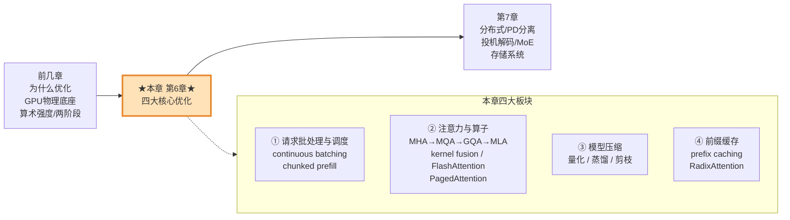

**读完本章你能做到什么？**

- 说清 static / dynamic / **continuous batching** 三者区别，并会调 `--max-num-seqs`、`--max-num-batched-tokens`；
- 理解 **chunked prefill** 用 TTFT 换 ITL 的权衡，知道什么场景该开；
- 分辨一个模型是 MHA / MQA / GQA（看 `config.json` 就行），理解 MLA 为什么强；
- 说清 **kernel fusion / FlashAttention / PagedAttention** 各自解决什么瓶颈（三者正交）；
- 会选量化策略：**W4A16（GPTQ/AWQ）** 还是 **W8A8（FP8）**，并解释为什么；
- 理解蒸馏、剪枝的定位与代价；
- 用 **prefix caching** 把多轮对话 / 长上下文的 TTFT 打下来，并会构造高命中率 prompt。

> 🔬 **第一性原理（贯穿全章）：LLM 推理是一台"内存墙"机器。**
> decode 阶段每生成 1 个 token，就要把**全部**几十亿到几千亿参数从 HBM 读一遍——算力单元大量空转。本章几乎所有技巧的本质，都是围绕两句话：**① 让每次读进来的权重被更多请求/token 复用（提高算术强度）；② 让每次读的数据更小或更少（减少访存）。** 记住这条主线，四大板块就串起来了。

---

# 📦 板块一：请求批处理与调度级优化（Request Batching and Scheduling）

## 6.1 为什么实时服务需要批处理（batching）？

先回顾第 2 章的两阶段（原书 p.190）：

| 阶段 | 干什么 | 并行性 | 算术强度 | 瓶颈 |
|---|---|---|---|---|
| **Prefill（预填充）** | 模型"读懂"输入 prompt | 所有输入 token 一次并行处理 | **高** | **compute-bound（算力受限）** |
| **Decode（解码）** | 自回归地一次生成 1 个 token | 一次只出 1 个 token | **低** | **memory bandwidth-bound（带宽受限）** |

🔬 **第一性原理：decode 为什么这么亏？**
decode 每一步要遍历模型**十亿级参数**，只为了产出**一个** token。这在 GPU 显存带宽（原书这里用 FLOPS 度量搬运效率）的角度极其低效——算力单元大部分时间在等数据。

**batching（批处理）就是治这个病的：** 把多个请求凑在一起一次送进模型。原书假设本节所有图 max batch size = 3：

- 拿 prompt1 / prompt2 / prompt3 三个输入拼成一个 batch；
- decode 一步仍然只出 1 个 token/请求，但因为批在一起，**一次迭代能出 3 个 token**（每个请求一个）；
- 关键：**权重只读了一次，却做了 3 倍的计算、出了 3 倍的 token**——这就是"人为拉高算术强度（arithmetic intensity）"。

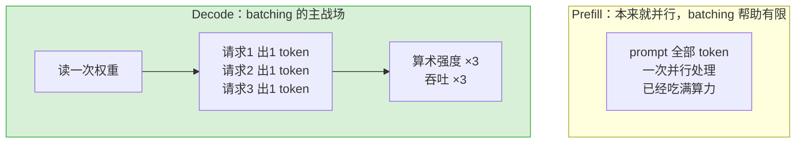

> 💡 **实战 / 面试高频：batching 对 prefill 和 decode 效果为何天差地别？**
> - **decode**：一次只出 1 token，算术强度极低，batching 直接把吞吐和 FLOPS 利用率拉起来——**收益最大**。
> - **prefill**：输入 token 已经在并行处理。原书给了个数量级（p.190）：**只要输入 prompt 不是特别短（比如小于 1,024 token），prefill 自己就能吃满 GPU 算力**，再加 batching 的额外并行几乎没用。
> 一句话记住：**batching 是给 decode 用的，prefill 基本用不上。**

---

## 6.2 在线推理的动态批处理（Dynamic Batching）

问题来了：实时在线推理时你**手里没有一批现成的 prompt**，请求是用户随机来的。怎么攒批？原书（p.191）给出演进链：

| 方式 | 做法 | 适合 | 问题 |
|---|---|---|---|
| **客户端批处理（client-side）** | 客户端自己攒够 batch size 再一起发 | 离线 | 在线不现实 |
| **静态批处理（static batching）** | 服务端**傻等**把 batch 填满才处理 | 离线 | ⚠️ 在线要命 |
| **动态批处理（dynamic batching）** | 按逻辑动态成组，平衡延迟与吞吐 | 传统 ML 在线 | LLM 场景仍有缺陷（见 6.3） |

⚠️ **static batching 在线的经典坑**：假设 batch size=10，前 9 个请求 1 秒内到齐，第 10 个 **5 分钟后**才来。那前 9 个就得**干等 5 分钟**才被处理——延迟爆炸。

**dynamic batching 的解法**是引入两个关键参数：

- **batch size**（又叫 max batch size / preferred batch size / max number of sequences）：一批最多攒多少请求。
- **max delay time（最大等待时间）**：已到请求最多等多久去凑满一批。

**触发规则（二选一，先到先发）**：
- 待处理请求数 **≥ max batch size** → 立刻发（即使没到 max delay time）；
- **到了 max delay time** → 立刻发（即使批里只有 1 个请求）。

### 🛳️ 渡船类比（原书 p.192，贯穿全章的好比喻）

想象你经营一条小渡船，每船最多载 10 人，乘客陆续到码头：

| 策略 | 渡船行为 | 体验 |
|---|---|---|
| 无批处理 | 一人一船，来一个送一个 | 乘客爽，但船队效率极低、成本爆炸 |
| static batching | 死等 10 人满员才开 | 效率高、零浪费，但第一个到的人可能等很久 |
| **dynamic batching** | 满 10 人立刻开 **或** 到 5 分钟上限就开（哪怕只有 8 人） | **延迟与吞吐的折中** |

> 💡 **两个参数怎么调？**（原书 p.192 的调参心法）
> - **总原则**：在满足延迟 SLA 的前提下，**batch size 越大越好**。但 batch 越大，单批处理延迟越高、显存占用越大，直到 OOM。
> - **max delay time**：太长 + 高 batch → 已到请求被迫久等；太短 → 攒不满批，实际发出的 batch 变小、吞吐降。

---

## 6.3 面向 LLM 在线推理的连续批处理（Continuous Batching）⭐

dynamic batching 对多数传统 ML 模型够用了，但 **LLM 有个独特的大坑**（原书 p.192）：

🔬 **第一性原理：LLM 请求的输入/输出长度差异巨大。**
dynamic batching 是**一批一批**处理的，一批的总耗时由**最长最慢的那个请求**决定（要等批里所有请求都完成才返回）。于是——**一个超长请求会拖着一整批一起空等，造成大量 GPU idle（空转）。**

渡船类比升级：假设船要把每个人**直接送到河对岸他家门口**，各人家的远近不同（=请求长短不同）。船必须先把住得最远的那个人送到，才能回码头接下一批——**回程时载客率越来越低，白跑。**

### continuous batching 登场（又名 in-flight / iterative batching）

核心改变（原书 p.193）：**不再一批一批地等，而是"在飞行中"动态换人。只要 batch 里有一个请求跑完，队列里的新请求立刻补进来。**

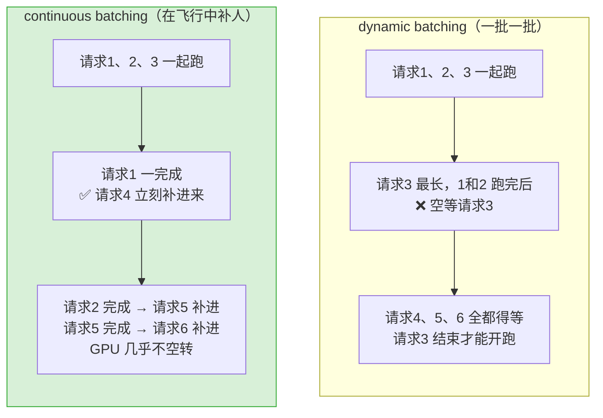

**渡船终极版**：把 1 条 10 人大船，换成 **10 条 1 人小船**。有人到就立刻发一条，送完回来接下一个——**无论各人家远近，都没有浪费。** 这就是 continuous batching 的精神。

> 💡 **面试高频对比：continuous batching 相比 dynamic batching 少了哪个参数？**
> continuous batching **不需要人为设 max delay time**了（因为不用等凑批，跑完一个补一个）。但 **max batch size 仍要管和调**——它现在只作为**上限**，防止超过绝对最大并发。

### 从"请求级"到"token 级"控制：max number of batched tokens

现代 LLM 引擎（vLLM/SGLang）在 max batch size 之外，又加了一个更细粒度的参数：**max number of batched tokens（最大批处理 token 数）**。原书（p.194）讲得很清楚：

🔬 **为什么光有请求级上限不够？** 因为 LLM 输入长度差异极大：
- 批 10 个请求、每个 20 token → 一种工作量；
- 批 2 个请求、每个 100,000 token → 完全不同的工作量！

只看请求数（max batch size）无法体现 token 长度差异，可能一批塞了太少或太多的实际计算量。于是引入 **token 级上限**：

| 参数 | 控制粒度 | 主要约束哪个阶段 |
|---|---|---|
| **max batch size**（`--max-num-seqs`） | 请求级：最多几个请求并行 | **decode**（并行度上限） |
| **max number of batched tokens**（`--max-num-batched-tokens`） | token 级：一次总共批多少 token | **prefill**（输入长，token 多） |

两者**同时满足**才能加入 batch。原书图 6-5 的关系（每个请求条的长度=token 数，须小于 max model length / 最大上下文）：

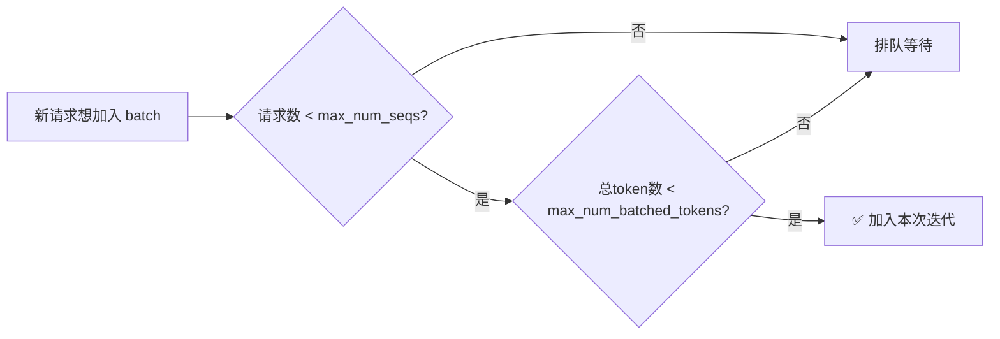

> ⚠️ **坑：max number of tokens 设太低会吃不满算力。** 原书（p.195）强调：prefill 阶段关键约束是 token 上限；如果它设太低，prefill 时送进 GPU 并行处理的 token 不够，**GPU 算力吃不满**。所以要设得足够高。

**Example 6-1（原书 p.195）—— vLLM 里配置这两个参数：**

```bash
vllm serve \
  Qwen/Qwen2.5-7B-Instruct \
  --max-num-batched-tokens 4096 \
  --max-num-seqs 128
```

**逐行讲解**：
- `vllm serve Qwen/Qwen2.5-7B-Instruct`：用 vLLM 起一个服务，模型是 Qwen2.5-7B-Instruct（HuggingFace ID，也可换成本地路径）。
- `--max-num-batched-tokens 4096`：一次迭代最多批 4096 个 token（**token 级**上限，主要卡 prefill）。
- `--max-num-seqs 128`：最多 128 个请求并行（**请求级**上限，主要卡 decode）。

---

## 6.4 带分块预填充的连续批处理（Continuous Batching with Chunked Prefill）⭐

continuous batching 解决了"请求长短不一"，但**还漏了一件事**（原书 p.195）：**prefill 和 decode 是两种完全不同的工作负载**，前面画图时我们把它俩抽象成一根根 bar 混为一谈了。现在必须分开看。

回顾：
- **prefill**：算术强度**高**，本身就能吃满 GPU，**不太需要 batching 帮忙**；
- **decode**：算术强度**低**，**很吃 batching 的红利**。

### 问题：decode 请求 撞上 新到的 prefill 请求，谁先？

原书举例（p.196）：请求 1 已经在 decode 了，请求 2、3 刚到要 prefill。三种做法都不理想：

**做法 A：不混批，优先 prefill（图 6-7）**
- 通常我们**优先 prefill**，因为 prefill 决定 **TTFT（time to first token，首 token 延迟）**——聊天机器人等交互场景的关键指标。
- ⚠️ 但请求 2、3 做 prefill 时（尤其 prompt 很长），**请求 1 完全空等**，严重伤害它的端到端延迟和 inter-token latency（ITL）。

**做法 B：prefill 与 decode 混批（图 6-8）**
- 把请求 1 的下一步 decode 塞进请求 2、3 的 prefill 那一迭代里一起跑。
- ⚠️ **帮助不大**：因为解码 1 个 token 比跑完一个（长）prefill 快得多，长 prompt 的 prefill 仍然拖后腿。

### 解法：chunked prefill（分块预填充）⭐

核心思想（原书 p.197，图 6-9）：**把长 prompt 的 prefill 切成若干小块（chunk），让每个小 prefill 块的处理时间和 decode 块差不多。**

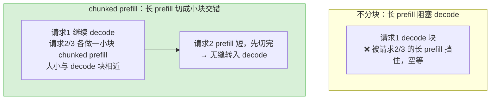

**chunked prefill 的收益与代价（原书 p.197，务必背下这张权衡表）：**

| 指标 | 变化 | 原因 |
|---|---|---|
| **ITL（inter-token latency）** | ✅ **改善** | decode 块不再被长 prefill 堵住 |
| **TTFT** | ❌ **变差** | prefill 被拆成多小步，增加了 prefill 工作量 |
| **端到端延迟** | ⚠️ 通常**略微变差** | 多个小 prefill 步的开销叠加 |
| **吞吐（throughput）** | ✅ 通常**改善** | 填补 GPU 空闲缝隙，batch 效率更高 |

> 💡 **实战判断：什么时候开 chunked prefill？**
> 它是 **用 TTFT 换 ITL** 的权衡，看你的 SLA：
> - 长上下文工作负载、更看重"生成过程流畅（ITL）"和整体吞吐 → **开**；
> - 极度看重首 token 快（TTFT），且 prompt 不长 → 谨慎。

**还要调一个参数：切成多小的块？** 原书（p.197）说这也算进 max number of batched tokens：
- 块太大（一路调到 max model length）= **等于没分块**；
- 块太小 = 开销大、每次迭代 batch 的 token 不够、吃不满 GPU；
- **理想是中间值**：既不小到开销爆炸，也不大到失去分块意义。

> 🔬 **承上启下**：原书这里点名——把 prefill 和 decode 彻底拆到**不同 GPU、甚至不同节点**的技术叫 **prefill–decode disaggregation（PD 分离）**，是更进阶的做法，留到第 7 章。continuous batching + chunked prefill 已经当了好几年的**生产标准**。

---

# 🧠 板块二：扩展注意力与算子优化（Scaling Attention and Kernel Optimization）

回顾第 2 章：Transformer block 两大件是**注意力（attention）**和**前馈层（FFN，又叫 MLP）**。本板块专攻 attention，路线（原书 p.199）：

1. **减小 KV cache 尺寸** → MHA → MQA → GQA → MLA；
2. **加速 attention 计算与访存** → kernel fusion → FlashAttention；
3. **优化 KV cache 内存管理** → PagedAttention。

🔬 **为什么死磕 KV cache 尺寸？**（原书 p.199）decode 阶段，KV cache 每步都要从 HBM 搬进片上寄存器/共享内存。KV cache 越小：
- ✅ 缓解**显存带宽**压力（decode 的命门）；
- ✅ 省**显存空间** → 能跑更大 batch（更高吞吐）、能服务更长上下文。

## 6.5 可扩展的注意力机制：MHA → MQA → GQA → MLA

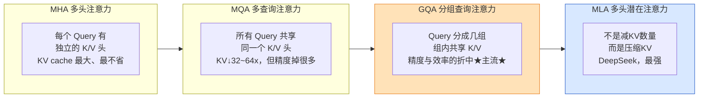

**逐个讲（原书 p.199–201）：**

- **MHA（multi-head attention，多头注意力）**：GPT-3 时代的原版。每个 query 都要一份独立的 key、value 头 → **KV cache 最大、最不高效**。

- **MQA（multi-query attention，多查询注意力）**：所有 query **共享单个 K/V 头**。
  - 数量级：7B 模型通常 32 个注意力头，70B 通常 64 个。MHA 就有 32/64 份 KV，MQA 只有 **1 份** → **KV cache 缩小 32~64 倍**，巨大收益。
  - ⚠️ 但太激进 → **精度显著下降**。

- **GQA（grouped-query attention，分组查询注意力）**⭐：把 query 头分成**多组**，每组共享一份 K/V。
  - 是 MHA（不够高效）与 MQA（精度掉太多）之间的**黄金折中**，**现在被大量模型采用**。

- **MLA（multi-head latent attention，多头潜在注意力）**：DeepSeek 提出。
  - 关键差异：**不是简单减少 KV 数量，而是用巧妙的方式压缩它们**。DeepSeek 原论文称其 KV cache **"相当于只有 2.25 组的 GQA，但性能比 MHA 更强"**。

> 💡 **实战 / 面试高频：怎么一眼看出模型用的是 MHA / MQA / GQA？——看 `config.json`！**（原书 p.200）
>
> **Llama2（MHA）**——KV 头数 = 注意力头数：
> ```json
> "num_attention_heads": 32,
> "num_hidden_layers": 32,
> "num_key_value_heads": 32
> ```
> **Llama3（GQA）**——`num_key_value_heads` 降到 8，即每个 KV 头被 32÷8 = **4 个注意力头共享**：
> ```json
> "num_attention_heads": 32,
> "num_hidden_layers": 32,
> "num_key_value_heads": 8
> ```
> 记忆法：`num_key_value_heads == num_attention_heads` → MHA；`== 1` → MQA；`1 < 它 < 注意力头数` → GQA。

> ⚠️ **重要认知（原书 p.201）**：MHA/MQA/GQA/MLA 都是**模型架构层面**的选择——你没法在服务时随便切换。选哪种注意力，其实和"选哪个模型家族"绑定，是个**整体决策**。这标志着大模型发展趋势的转变：**不再只追求模型质量，而越来越看重"可产品化"**——架构不仅要强，还要实用、可扩展、够便宜地服务。

---

## 6.6 算子融合与自定义注意力核（Kernel Fusion and Custom Attention Kernels）

**kernel（核）是什么？**（原书 p.201）就是在 GPU 上执行计算（矩阵乘、softmax 等）的小型专用程序。根据模型架构、硬件、工作负载选用**优化过的专用 kernel**，能显著提升 GPU 利用率、推理速度和吞吐。

### 6.6.1 kernel fusion（算子融合）

🔬 **第一性原理**：kernel fusion 把**多个独立算子**（比如一次乘法 + 一次加法）**融合成一个**，以**最小化"内存↔计算"之间的数据搬运开销**。它复用已在寄存器/共享内存里的数据，**省掉了"写回 GPU 全局内存、再读回来"的往返。**

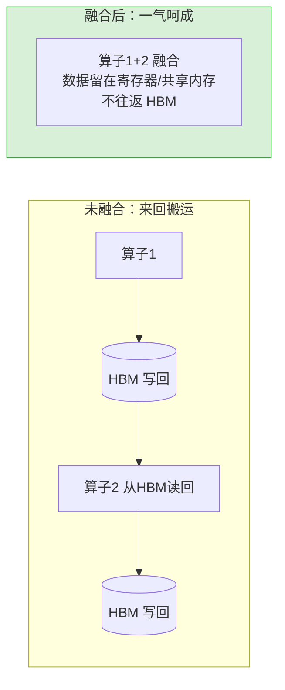

（原书图 6-11，改编自 He, 2022：融合把多次形状转换一次搞定，中间不写回/读回内存。）

### 6.6.2 FlashAttention ⭐

🔬 **核心思想**（原书 p.202）：**注意力被 GPU 显存带宽卡死**（频繁读写大矩阵）。FlashAttention 让算法**硬件感知（hardware-aware / memory I/O-aware）**，通过减少 I/O 来对抗带宽限制。

回顾第 5 章的 GPU 内存层级：**HBM（全局高带宽显存）最大但最慢**；SRAM / 寄存器很快但很小。

**FlashAttention 的做法：**
- **避免在慢速 HBM 里"落地"（materialize）那些巨大的中间矩阵**（N×N 的注意力分数矩阵）；
- 把大矩阵拆成小块 —— 这叫 **tiling（分块 / blocking）**；
- 让所有计算都在快速的 SRAM / 寄存器里完成，**只把最终输出写回 HBM**；
- kernel 内部**融合了所有注意力算子**，并配合 **online softmax（在线 softmax）** 等关键技巧。

```mermaid
flowchart TB
    subgraph OLD["朴素注意力"]
        o1["Q·Kᵀ 算出<br/>N×N 大矩阵"] --> o2[("写进 HBM")]
        o2 --> o3["softmax 再读回<br/>再乘 V<br/>反复往返 HBM 慢")]
    end
    subgraph FA["FlashAttention"]
        f1["把 Q/K/V 切成小 tile"] --> f2["逐块在 SRAM 里<br/>算 QKᵀ→online softmax→乘V"]
        f2 --> f3["N×N 大矩阵从不落地<br/>只把最终输出写回 HBM"]
    end
    style FA fill:#d8f0d8,stroke:#3a3
```

**FlashAttention 2 / 3 的演进**（原书 p.203）：保留核心思想，再加技巧——比如把 **GEMM（通用矩阵乘）计算与 softmax 计算重叠**，进一步提升 GPU 利用率，尤其在 H100 等新一代 GPU 上。

> ⚠️ **原书态度（p.203）**：kernel 优化是个大坑，需要 GPU 架构、CUDA、性能剖析、编译器等多领域功力，远超单章篇幅。**工程上的关键 takeaway 是：服务 LLM 时一定要用高效 kernel。** 其它优秀 kernel 还有 **FlashInfer、xFormers、Triton**（⚠️ 别和 Triton Inference Server 搞混，是完全不同的东西）。

**实操：在 vLLM 里换用 FlashInfer kernel**（原书 p.204）——

```bash
pip install vllm==0.8.5.post1
pip install flashinfer-python==0.2.2
export VLLM_ATTENTION_BACKEND=FLASHINFER
export VLLM_USE_FLASHINFER_SAMPLER=1
export VLLM_FLASHINFER_FORCE_TENSOR_CORES=1
```

**逐行讲解**：
- 前两行装 vLLM 和 FlashInfer 的 Python 包（版本锁定，避免兼容问题）；
- `VLLM_ATTENTION_BACKEND=FLASHINFER`：告诉 vLLM 注意力后端用 FlashInfer；
- `VLLM_USE_FLASHINFER_SAMPLER=1`：采样也走 FlashInfer；
- `VLLM_FLASHINFER_FORCE_TENSOR_CORES=1`：强制用 Tensor Core 做计算。

SGLang 里更简单，改个 flag：
```bash
--attention-backend {flashinfer|fa3|triton|torch_native|FlashMLA}
```

> 💡 **实战选择建议（原书 p.204）**：kernel/硬件/输入输出组合太复杂，很难给一刀切建议，通常要**做实验**。好在 vLLM、SGLang 都有**默认选核逻辑**：截至成书时，**SGLang 在非 Hopper（如 A100、A40）默认 FlashInfer，在 Hopper（H100、H200、H20）默认 FlashAttention3。** 实践上**先用推荐默认值**、把别的优化做完，再回来试不同 kernel 榨额外性能。

---

## 6.7 PagedAttention（分页注意力）⭐

**要解决的问题**（原书 p.204）：服务时系统不断创建/存储新 KV cache、驱逐旧的；KV cache 随长上下文越来越大；而且**输入长度因请求而异、输出长度事先未知**。传统做法会**预分配一大块内存**（按最坏情况），实际常常用不满 → **严重的内存碎片（memory fragmentation）、真实利用率很低。**

🔬 **灵感来自操作系统的分页（paging）**：OS 把内存切成固定大小的**页（page）**，让零散空闲空间也能被利用，且长序列不需要**连续**内存。PagedAttention 如法炮制（原书 p.204）：
1. 把 KV cache **切成固定大小的块（block）**；
2. 用一张**查找表（block table / lookup table）**把 query 的 key 映射到具体块；
3. → KV cache **不需要连续存储**，块可以散落在各处、按需单独访问。

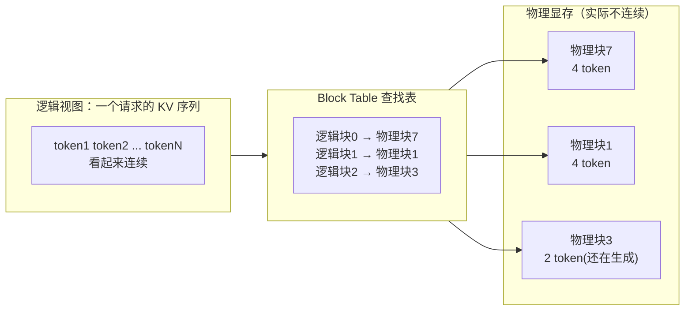

原书图 6-13 的例子：一个 prompt+completion **不是**存在连续物理内存里，而是散在 **block 7 → block 1 → block 3** 三个块；每块最多 4 个 token/词，最后一块只有 2 个（因为还在生成）。block table 就是那张"查物理块在哪"的查找表。

**效果（原书 p.205，务必记住这组数字）：**
> PagedAttention 原论文称：**没有它时，"只有 20.4%–38.2% 的 KV cache 内存真正用来存 token 状态"**（其余全被碎片浪费）；**用了它则"KV cache 内存接近零浪费（near-zero waste）"。**

> 💡 **面试高频：PagedAttention 和 FlashAttention 有什么关系？**
> **两者正交（orthogonal），解决不同问题**：
> - **FlashAttention** 优化的是**注意力的计算**（怎么算得快、少往返 HBM）；
> - **PagedAttention** 优化的是 **KV cache 的内存管理**（怎么存得省、少碎片）。
> 因为碎片改善太大，PagedAttention 及其变体已经和 continuous batching 一样，成为 LLM 服务**几乎默认开启的基础功能**（vLLM 正是构建在它之上）。

---

# 🗜️ 板块三：模型压缩（Model Compression）

LLM 太大 → 高端 GPU 又贵又难搞。要把大模型送到消费者手里，必须**聪明地把它变小**。原书（p.206）把模型压缩分三类：

| 技术 | 一句话 | 是否动训练流程 | 生产普及度 |
|---|---|---|---|
| **量化（Quantization）** | 把参数从高比特降到低比特 | **几乎不用改** | ⭐ **最实用、首选** |
| **蒸馏（Distillation）** | 大"教师"把知识教给小"学生" | 要训练新学生模型 | 潜力最大、成本最高 |
| **剪枝（Pruning）** | 外科手术式删掉冗余权重/头 | 需再训练恢复 | 最不成熟（2025 中） |

> 原书明确：**量化最实用**——快、有效、几乎不用改训练管线，是生产环境压缩加速 LLM 的**首选**，尤其在低延迟高吞吐、或边缘设备等资源受限场景。所以本节花最多篇幅讲量化。

## 6.8 量化（Quantization）

**定义（原书 p.206）**：把模型参数（weights 权重、activations 激活、KV cache）从高精度浮点（FP32、FP16/BF16）降到低比特表示（8-bit 的 FP8/INT8、4-bit 的 FP4/INT4）。本质是 **用一点精度损失，换更好的服务性能。**

### 6.8.1 量化误差：舍入 vs 截断（原书 p.207）

| 误差类型 | 何时发生 | 例子 |
|---|---|---|
| **舍入误差（rounding error）** | 数值无法在目标格式精确表示，四舍五入到最近可表示值 | FP32 的 7.6 → INT8 存不了小数 → 舍成 8，误差 = 8−7.6 = **0.4** |
| **截断误差（clamping error）** | 数值太大/太小，超出格式范围，只能钳到最大/最小可表示值 | FP8 范围假设是 −448~+448，数值 1000 太大 → 钳到 **448**（严重失真！） |

⚠️ **截断的失真可能极其严重**（比如 4096 → 448）。所以现代量化**尽量避免硬截断**，改用**缩放策略（scaling）**：乘一个 **scaling factor** 压缩原始数值范围，让更多值落进低精度格式的可表示范围内，而不是被粗暴钳掉。常见有**对称缩放（symmetric）**和**非对称缩放（asymmetric）**（原书引 Maarten Grootendorst 的《A Visual Guide to Quantization》）。

### 6.8.2 数值是怎么存的：浮点格式（原书 p.207–208）

浮点数结构：**总比特 = 1 符号位 + 尾数位 + 指数位**
- **符号位（sign, 1 bit）**：正还是负；
- **尾数 / significand**：控制**精度**（细节程度）；
- **指数（exponent）**：控制**范围/尺度**（能多大多小）。

**Table 6-1 常见浮点格式对比：**

| 格式 | 总位 | 符号 | 指数 | 尾数 | 近似范围 |
|---|---|---|---|---|---|
| **FP32** | 32 | 1 | 8 | 23 | ±10³⁸ |
| **FP16** | 16 | 1 | 5 | 10 | ±10⁻⁵（范围小） |
| **BF16** | 16 | 1 | 8 | 7 | ±10³⁸ |

> 🔬 **FP16 vs BF16 的取舍精髓（原书 p.208）**：两者都 16 位（FP32 的一半）。
> - **FP16**：指数 5 位、尾数 10 位 → **精度好、范围窄**；
> - **BF16**：指数 8 位、尾数 7 位 → **范围大（和 FP32 同为 8 位指数，范围一样）、精度差**。
> 关键推论：**BF16 和 FP32 指数位相同 → FP32→BF16 转换不会有截断风险**（只损失精度），比 FP32→FP16 更省心。深度学习训练更看重"动态范围"而非细粒度精度，所以 **BF16 特别适合训练**。当今 LLM checkpoint 大多是 FP16 或 BF16，FP32 已少见。

**量化格式：整数 vs 浮点（原书 p.209）**

| 类型 | 例子 | 数据点分布 |
|---|---|---|
| **整数型（integer）** | INT8、INT4 | **均匀**：数据点在整个范围内等间距，精度不随大小变 |
| **浮点型（floating-point）** | FP8、FP4 | **非均匀**：零附近点密、极大/极小处点稀 |

🔬 **为什么 FP 是非均匀的？** 因为 FP 值是**对数式**的。FP8 的值 = $(-1)^{\text{sign}} \times (1 + \text{mantissa}) \times 2^{\text{exponent} - \text{bias}}$。指数越大，相邻可表示数之间的**步长越大**：1.0~2.0 之间能表示很多值（1.01, 1.001…），但 1,000,000~2,000,000 之间最小步长可能已经 128 以上。

> 💡 **实战**：根据模型参数（权重、激活值）的**实际数据分布**来选整数还是浮点格式，以保留最佳精度。权重多集中在 0 附近 → FP 型往往更合适。

### 6.8.3 量化为什么能加速服务？（原书 p.209–210）三大机制

🔬 **① 数据体积（data size）** → 省显存、省 KV 空间、能单机装下
$$7\text{B 参数} \times 2\text{ 字节/参数（FP16）} = 14\text{ GB}$$
量化到 INT8（1 字节/参数）**直接砍半到 7 GB**。省下的显存还能腾给 KV cache，装更多并发请求 → 吞吐更高；甚至能把大模型塞进**一个节点**，省掉跨节点通信。

🔬 **② 数据搬运（data movement）** → 直接降 decode 延迟
第 5 章讲过：**GPU 显存带宽是命门**，尤其 decode 阶段数据搬运是瓶颈。模型变小 → 每步搬运的数据变少 → **推理延迟大降**。

🔬 **③ 计算速度（faster compute）** → 低精度 FLOPS 翻倍
**Table 6-2（H100 各精度算力）**——比特减半，FLOPS 通常翻倍：

| 精度 | H100 SXM 算力 |
|---|---|
| FP64 | 34 TFLOPS |
| FP32 | 67 TFLOPS |
| TF32 Tensor Core | 989 TFLOPS |
| BF16 / FP16 Tensor Core | 1979 TFLOPS |
| **FP8 Tensor Core** | **3958 TFLOPS**（翻倍！） |
| **INT8 Tensor Core** | **3958 TOPS**（翻倍！） |

**一句话总结**：量化同时 ① 减小模型体积、② 减少搬运、③ 加速计算。

### 6.8.4 权重量化 vs 权重+激活量化（原书 p.210–212）⭐

**记号约定**：`W4A16` = 权重 4-bit + 激活 16-bit；`W8A8` = 权重 8-bit + 激活 8-bit（W=weight，A=activation，activation 是中间层的输入输出）。

**两大策略：**

- **weight-only（仅权重量化）**：只量化权重，激活不量化。
  - ✅ 减小模型体积、减少搬运；
  - ❌ **不加速计算**——执行时低比特权重要**反量化（dequantize）回高比特**才能算，反而**多一点开销**。
  - 💡 **解法：混合精度 kernel**避免反量化——Ampere 用 **Marlin kernel**（A100），Hopper 用 **Machete kernel**（H100）。它们能**一次性**做 INT4 矩阵 × FP16 矩阵，无需先反量化。服务 weight-only 量化模型时很多人默认开这些 kernel。

- **weight-and-activation（权重+激活量化）**：
  - ✅ 减体积、减搬运，**还因为量化了激活 → 计算也能提 FLOPS**（compute-bound 场景受益）；
  - ⚠️ 更复杂：激活随输入实时变化，量化激活要选**何时算缩放因子**：
    - **动态缩放（dynamic scaling）**：推理时**边算边定**缩放因子 → 精度更好，但慢；
    - **静态缩放（static scaling）**：部署前用**校准数据集（calibration dataset）**预先算好 → 更快，精度略逊。

**生产主流选择**（原书 p.211）：
- weight-only 最常用 **W4A16**，方法用 **GPTQ 或 AWQ**；
- weight-and-activation 最常用 **W8A8**（以前 INT8，近来转向 **FP8**）。

**Table 6-3 —— W4A16 vs W8A8（核心决策表，背下来）：**

| 维度 | **W4A16** | **W8A8** |
|---|---|---|
| 模型体积/搬运 | ↓ **75%**（原大小 ÷4） | ↓ 50%（÷2） |
| 计算 FLOPS | **不变** | **×2** |
| prefill（compute-bound） | 不变 | ✅ 改善 |
| decode（bandwidth-bound） | ✅ 改善（**低 batch 更佳**） | ✅ 改善（**高 batch 更佳**） |
| **最适合** | **长生成、延迟敏感、低 batch** | **长上下文、高吞吐、高 batch** |

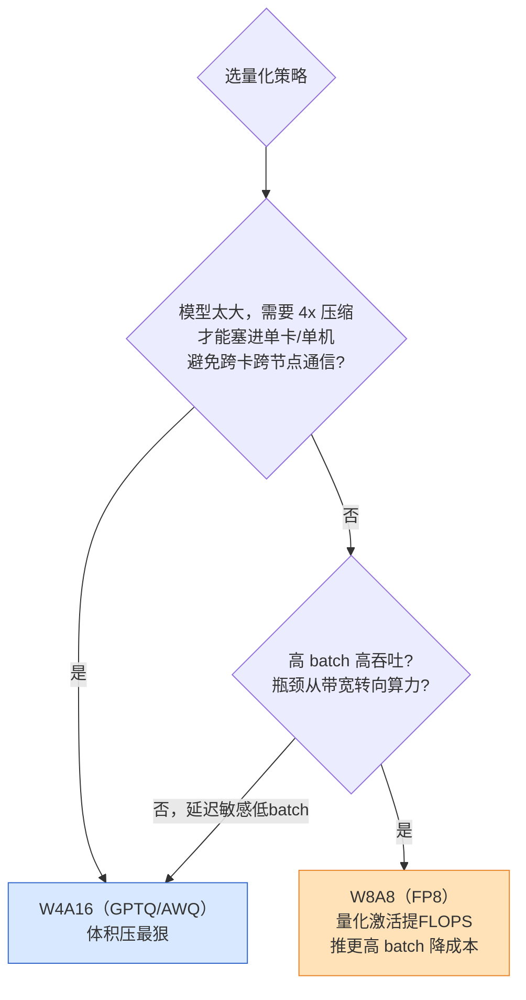

> 💡 **How to Choose（原书 p.212 侧栏）**：
> - 模型大、需 **4x 压缩塞进单卡**（省跨卡/跨节点通信）→ **W4A16**；
> - 高 batch 下，量化激活带来的**算力收益 > 显存收益**，瓶颈从带宽转算力 → **W8A8**；
> - 若 **W8A8 已能满足延迟 SLA**，就不用 W4A16，转而**推更高有效 batch、更高吞吐/实例**来降成本。

### 6.8.5 INT8 vs FP8，以及硬件门槛（原书 p.213）

W8A8 过去多用 **INT8**（权重和激活钳到固定 ±127 整数范围）；近来更多转 **FP8**（变体 E4M3、E5M2）。NVIDIA 2022 年论文提出 **FP8 E4M3**，展示它能提升服务性能、精度损失极小、**且不像 INT8 那样需要校准**。

**Table 6-4 —— FP8 两变体：**

| 格式 | 总位 | 符号 | 指数 | 尾数 | 用途 |
|---|---|---|---|---|---|
| **FP8 (E4M3)** | 8 | 1 | 4 | 3 | **推理常用**（精度高，范围小、可能需缩放） |
| **FP8 (E5M2)** | 8 | 1 | 5 | 2 | 范围大、精度低 |

> ⚠️ **FP8 并非哪都能用（原书侧栏）**：NVIDIA GPU 里**只有 Hopper 和 Blackwell 支持 FP8**。如果你只有 A100 或更老的卡，跑 FP8 拿不到预期的完整性能收益。

### 6.8.6 动手量化（原书 p.213–216）

**找现成量化模型**：很多热门基础模型的量化版**已在 HuggingFace 上传好**（图 6-16 右侧列出各量化变体），你不一定要自己量化。

**自己量化（GPTQ 示例，原书 p.214）：**
```python
from transformers import AutoModelForCausalLM, AutoTokenizer, GPTQConfig
tokenizer = AutoTokenizer.from_pretrained("Qwen/Qwen2.5-7B-Instruct")
dataset = [
    "Gptq is an easy-to-use model quantization library with user-friendly APIs, "
    "based on the GPTQ algorithm."
]  # 校准数据集 calibration dataset
gptq_config = GPTQConfig(bits=4, dataset=dataset, tokenizer=tokenizer)
quantized_model = AutoModelForCausalLM.from_pretrained(
    "Qwen/Qwen2.5-7B-Instruct",
    device_map="auto",
    quantization_config=gptq_config
)
```
**逐行讲解**：
- 载入分词器；
- `dataset`：**校准集**——GPTQ 需要少量代表性文本来估计缩放/量化参数；
- `GPTQConfig(bits=4, ...)`：目标 4-bit；
- `from_pretrained(..., quantization_config=gptq_config)`：加载并量化，`device_map="auto"` 自动分配设备。
- 其它常用量化库：**GPTQModel、AutoAWQ、LLMCompressor**。

**Performance analysis —— 三个变体的基准结果（原书 p.215–217，Qwen2.5-7B-Instruct）：**

| 并发场景 | 谁最强 | 原因 |
|---|---|---|
| **低并发 / 低 batch** | **GPTQ W4A16**（延迟/吞吐比原模型 **约 +300%**）；FP8 W8A8 +150% | 瓶颈在**显存带宽**；W4A16 把权重压到 INT4（小 4 倍）在这里最闪光 |
| **高并发 / 高 batch** | **FP8 W8A8** | W4A16 计算仍是 16-bit、**不省算力还有反量化开销**，TTFT 甚至比原模型更慢；FP8 激活也量化了 → 计算更快 |

> 💡 **面试高频结论**：
> - **低 batch（chatbot、agent 多次调用、聚合延迟关键）→ W4A16 weight-only。**
> - **高 batch 且 W8A8 已满足 SLA → 推更多并发、每实例服务更多请求来省成本。**
> ⚠️ 注意 W4A16 在**高并发 prefill** 的 TTFT 会**恶化甚至慢于原模型**——因为它不省计算，反而背了反量化开销。

### 6.8.7 其它量化：KV cache 量化、GGUF（原书 p.217）

- **KV cache / 注意力量化**：前面权重和激活量化主要针对 **FFN**（占大多数参数和计算）。但 **KV cache 也很占显存**。
  - ✅ 量化 KV cache → 腾显存 → 增大 batch → 提吞吐；也利于 **prefix caching**（能缓存更多前缀）。
  - ⚠️ 但通常**不显著降延迟**——如果注意力计算仍是高精度，量化 KV cache 只是让它变小，算的时候还得**反量化回来**，没多拿 FLOPS。要真正吃到红利，需**配合量化的注意力 kernel**。
  - 💡 实战顺序：先上 weight-only 或 weight+activation（如 FP8 W+A）；遇到**长上下文 + 有限显存**或**解码重负载要更高吞吐**时，再加 **FP8 KV cache 量化 + 启用 FP8 注意力 kernel**。

- **GGUF（GPT-Generated Unified Format）**：非常不同的一类量化，为**本地、便携、低资源**部署而生——主打在 **CPU 和/或 Apple Silicon（Metal）** 上跑 LLM（有 GPU 时可部分 offload），提供大量量化等级。常与 **llama.cpp** 搭配跑 HuggingFace 上的 GGUF 模型。

### 6.8.8 精度权衡与 QAT（原书 p.218–221）

🔬 **最大的权衡：模型精度 ↔ 服务性能。** 如果量化后精度撑不住质量，再好的性能收益也白搭（劣质产品无法上线）。好消息：**GPTQ W4A16、AWQ、FP8（W+A）在真实精度指标上损失极小**（图 6-20，Neural Magic 的 OpenLLM Leaderboard 数据）。有时量化的性能收益甚至让你**换用更大模型的量化版**：比如部署 **12B 的 FP8** 替代 **8B 的 FP16**，达到相当延迟、更高吞吐、更好精度。

**规律（原书 p.219）**：
- 模型**越大**，其精度对**权重和 KV cache 量化越敏感**；
- **KV cache 量化对精度侵入较小，但性能收益也不大**——若正为 KV 空间和 ITL 发愁它是好方法，但优先级较低。

**量化后验精度（原书 p.219）**——用 **LM Eval**：
```bash
lm_eval --model {hf|vllm|sglang} \
    --model_args Qwen/Qwen2-7B-Instruct \
    --tasks gsm8k_cot \
    --device cuda:0 \
    --batch_size auto
```
（选后端 → 指定模型 → 选评测任务 gsm8k_cot → 指定 GPU → 自动 batch。）

**趋势**：正朝 **FP4、FP6、W4A8**（Blackwell 代 GPU）推进。低比特保精度很难，但靠 **per-tensor / per-channel 缩放、离群值感知裁剪（outlier-aware clipping）** 等组合，未来可期。

**量化感知训练（QAT，Quantization-Aware Training）**⭐：
- 前面都是**训练后量化（PTQ，Post-Training Quantization）**——**不碰训练管线**，能量化你没参与训练的基础模型/自训模型，**易用又够准，实践中远比 QAT 流行**。
- **QAT** 在训练（尤其微调/对齐阶段）时做**假量化（fake quantization）**，让模型**在训练中调整权重来补偿精度损失** → 精度更优。对 **4-bit 级激进压缩**，QAT 往往是**唯一可靠**的选择（PTQ 简单舍入会让模型崩）。

**Table 6-5 —— PTQ vs QAT：**

| 维度 | **PTQ 训练后量化** | **QAT 量化感知训练** |
|---|---|---|
| 何时做 | 训练完，对静态权重 | 训练/微调时模拟量化效果 |
| 难度 | **低**（转换 + 校准） | **高**（额外训练算力） |
| 高比特(≥8bit)精度 | 好 | 好 |
| 低比特(≤4bit)精度 | **通常不可接受** | **更好、可接受** |
| 灵活性 | 高，易于不同硬件部署 | 绑定量化方案，再微调/换硬件不灵活 |

**QAT 真实案例：OpenAI 的 GPT-OSS（原书 p.221）**——用 **FP4 E2M1（MXFP4 格式）QAT** 激进压缩：
$$117\text{B} \times 0.5\text{ 字节/参数（FP4）} = 58.5\text{ GB} < 80\text{ GB（单卡）}$$
$$21\text{B} \times 0.5\text{ 字节/参数} = 10.5\text{ GB} < 16\text{ GB（边缘设备）}$$
（其实只有 **MoE 层**量化到 FP4，但 MoE 占 90%+ 参数，估算仍成立。）
- gpt-oss-120b 在核心推理基准接近 o4-mini，单张 80GB GPU 就能高效跑；gpt-oss-20b 接近 o3-mini，16GB 边缘设备可跑。
- ⚠️ **代价：硬件/推理栈必须原生支持 MXFP4。** Blackwell（B200）有专用 4-bit 浮点支持（NVFP4 E2M1、块缩放 MXFP4）；Hopper（H100/H200）围绕 FP8 Tensor Core（E4M3/E5M2）而非原生 FP4；**Ampere（A100/A10）或更老 → 建议干脆换架构**（如 Qwen）自己量化。

## 6.9 蒸馏（Distillation，原书 p.221–223）

🔬 **本质**：蒸馏**不缩小原模型，而是训练一个全新的小模型**——把大"教师（teacher）"里编码的知识**迁移**给小"学生（student）"，让学生模仿教师。作者认为它**三者中提升延迟/吞吐的潜力最大**。

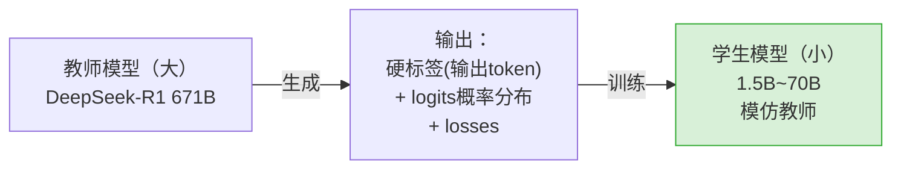

⚠️ 教师输出不只**硬标签（hard label，即输出 token）**，还包括**预测分布的 logits 和损失** → 所以蒸馏**需要对教师模型的完整访问权，不能只靠 API 调用拿输出 token**。

**案例（原书 p.222）**：DeepSeek-R1 原模型 671B（MoE），蒸馏出 1.5B~70B 的多个 Llama/Qwen 稠密学生模型 → **体积缩 10 倍以上**，延迟/吞吐大幅改善。

**Table 6-6 —— R1-671B vs 蒸馏 70B：**

| 基准 | R1-671B | R1-Distill-Llama-70B |
|---|---|---|
| MATH-500 pass@1 | 97.3 | 94.5 |
| GPQA Diamond pass@1 | 71.5 | 65.2 |
| LiveCodeBench pass@1 | 65.9 | 57.5 |

**Table 6-7 —— 量化 vs 蒸馏（选型指南）：**

| 维度 | **量化** | **蒸馏** |
|---|---|---|
| 精度下降 | 低（通常 ≤3%） | 明显高于量化 |
| 加速 | 1.5x~3x | 更多，但精度代价大 |
| 易用性 | **极易**（PTQ 只需原权重） | 难（若无现成蒸馏模型）；训练成本可达原模型 **10%**，通常由训原模型的研究者做 |

> 💡 **决策心法（原书 p.222）**：**先走低成本方案。** 若已有现成蒸馏模型（如 R1-Distill-70B）→ 先评测它，够用就用，还能在其上再量化进一步提速；若**没有现成蒸馏模型（现实中多数如此）→ 先量化**（蒸馏成本高、精度损失也更大）。

## 6.10 剪枝（Pruning，原书 p.223）

**本质**：模型通常**过参数化（overparameterized）**，剪掉冗余能压缩提速。是三者中**最不成熟**的（2025 中仍需更多研究才能生产可用）。

| 剪枝类型 | 做法 |
|---|---|
| **结构化（structured）** | 整段删除（整个头/层） |
| **非结构化（unstructured）** | 删单个权重，更灵活 |
| **半结构化 / 2:4 稀疏** | 每 4 个元素删 2 个（50% 稀疏） |

**2:4 结构化稀疏（图 6-22）**：每连续 4 个值置零 2 个 → 50% 稀疏，压缩后仍是**稠密矩阵**参与计算。**NVIDIA Ampere/Hopper 有稀疏 Tensor Core** 加速这类稀疏 → **50% 稀疏可直接让矩阵乘翻倍提速**。案例 **Neural Magic 的 Sparse Llama 3.1** 宣称仅靠稀疏就 **98% 精度恢复、+30% 吞吐、−20% 延迟**（vLLM 上）。

---

# 🔁 板块四：前缀缓存（Prefix Caching）

## 6.11 从请求缓存到前缀缓存（原书 p.223–225）

**缓存**是软件工程老技巧：把常访问数据放快速存储里降延迟。ML 里常缓存**相同请求的模型输出**（客户端/服务端/两者）。例如 **Triton Inference Server** 把每个推理请求（模型名/版本/输入张量等）**哈希后**与输出一起作为 KV 对缓存；新请求哈希命中就直接取输出、不跑模型。

🔬 **为什么对 LLM 效果差？** 请求缓存的原理是"存储比计算便宜"。但 **LLM 输入是自由形式的人类文本**——同一个问题有无数种问法，**朴素请求哈希的命中率极低**。

**解法：前缀缓存（prefix caching）**⭐——不匹配整个 prompt，而是匹配 prompt 的**前缀（prefix）**。若与之前处理过的某个 prompt 前缀匹配，**该前缀部分的 KV cache 就不用重算**，直接从（GPU）内存取回。

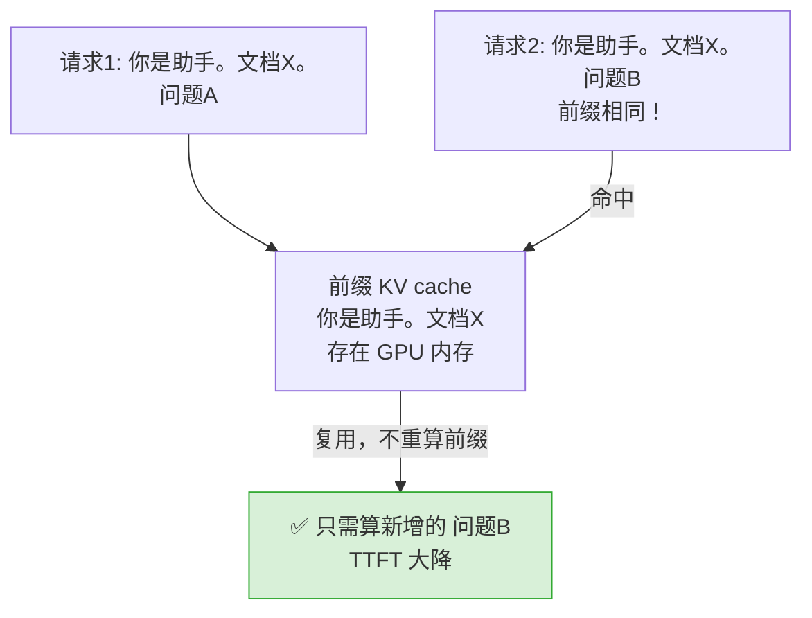

KV cache 也可 offload 到 CPU / 本地 SSD / 跨 GPU 分布 / 外部存储（复杂存储留第 7 章）。本章假设 KV 都在当前 GPU 内存：
- 不开前缀缓存：请求完成后，其 KV cache **全部清除**；
- 开前缀缓存：只要还有空间，KV cache **保留**在 GPU 内存；空间不够时用 **LRU（least recently used，最近最少使用）** 驱逐。

## 6.12 RadixAttention（原书 p.224）

**SGLang** 引入的著名前缀缓存方案，用 **radix tree（基数树，类似 trie / 前缀树）** 这种字符串索引查找结构来追踪各 KV cache 的前缀字符串；树太大时对叶节点**递归 LRU 驱逐**。

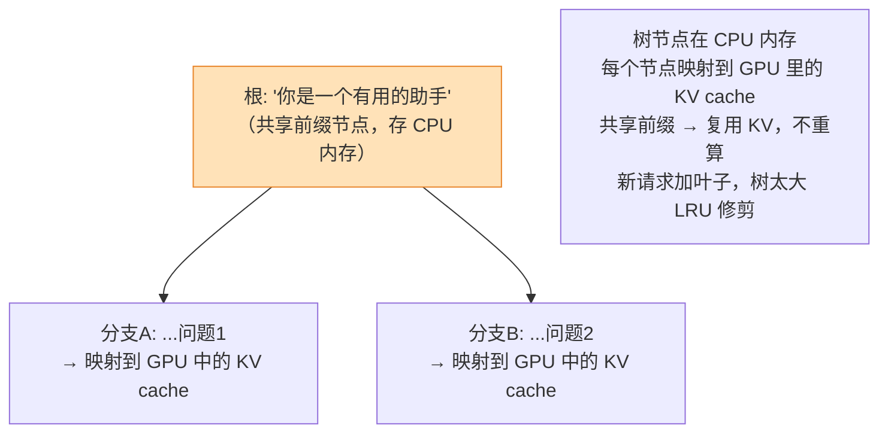

图 6-23 例子：两个请求共享头节点 `You are a helpful assistant`，之后各自分叉。树结构存 CPU 内存，每节点映射到 GPU 内存里的 KV cache → 命中就复用、零重算。

## 6.13 什么场景前缀缓存最有用？（原书 p.225–227）

先看命中规律（三个 prompt）：
```
Prompt 1: Hi, what is the weather like today?
Prompt 2: Hi, what is the weather like now?     ← 可复用 Prompt1 的 "Hi, what is the weather like…" 前缀
Prompt 3: What is the weather like today?        ← 开头没有 "Hi" → 完全重算
```

**两大黄金场景：**

| 场景 | 为什么前缀缓存威力大 |
|---|---|
| **① 多轮对话（Multiturn chat）** | 每轮新 prompt 都**拼接了完整历史**做上下文。不缓存则每次都重 prefill 前面所有历史；缓存则复用已处理部分。**对话越长，不缓存时 TTFT 增长越明显**——而 TTFT 主导 chatbot 体验。 |
| **② 长上下文服务（Long context）** | 上下文从 4K → 128K → 1M。长上下文 prefill 让 TTFT 巨长；前缀缓存把相关信息的 KV 都存下，只要用户**保持前缀不变**就能**每次命中**、免重算。 |

> 💡 **原书重要结论（p.227）**：前缀缓存**现在几乎默认对所有场景开启**，即使命中率和 TTFT 改善不如上述两场景。因为现代引擎开它**几乎零开销**——**基本没有坏处**。哪怕命中率只有 5%，那 5% 用户体验到的飞快 TTFT 也值得。

## 6.14 最佳实践：怎么提高命中率（原书 p.227–228）

🔑 **核心目标 = 提高 cache hit rate。首要原则：把 prompt 的静态部分（放前缀）和动态部分（用户输入放后缀）干净分离。**

**推荐模板**：
```
<system>
You are a helpful assistant.
<context>
Document: {每次放相关的静态上下文}
<user>
{用户的动态问题}
```

> ⚠️ **致命细节（原书原话）**：**哪怕把 `Document` 改成 `Documents`，多一个字母，就会 cache miss！** 所以务必**程序化、一致地**拼装 prompt。

**RAG 场景**——干净格式 + 排序好的文档块（下例是**正确**写法）：
```
Document 1: <retrieved_text_chunk_1>
Document 2: <retrieved_text_chunk_2>
Document 3: <retrieved_text_chunk_5>
Document 4: <retrieved_text_chunk_7>
```
⚠️ 两种会导致 miss 的**错误**写法：
- **格式不一致**：`Document1:`（少空格）、`Document 2:<chunk>`（冒号后少空格）——多余/缺失的空格造成 miss；
- **顺序不一致**：同样的 chunk 换了排列顺序 → miss。

> 💡 **要点**：保持**相同格式与结构**；**一致排序 + 去重**能让前缀命中**尽可能长**。即使前两个 chunk 不同、拿不到整段命中，也可能命中到 `…Document 3:` 为止——**仍是一个 win**。

## 6.15 扩展前缀缓存（Scaling Prefix Cache，原书 p.228–229）

**单实例**：KV cache 本就占大量显存（第 5 章图 5-11），开前缀缓存后更甚（缓存越多请求命中率越高）→ 必须**在 GPU 里预留足够空间缓存公共前缀**。

**多实例（横向扩展）的独特挑战**：前缀 KV cache 是**本地的**（存在某个实例的 GPU 里）。常见负载均衡：

| 负载均衡策略 | 做法 | 对前缀缓存友好吗 |
|---|---|---|
| round robin（轮询） | 顺序/轮转分发 | ❌ 不感知前缀 |
| least connection（最少连接） | 发给活跃连接最少的 | ❌ 不感知前缀 |
| **consistent hashing（一致性哈希）** ⭐ | 在**前缀与实例间建立亲和性（affinity）** | ✅ 路由到**已缓存该前缀**的实例 |

🔑 **需要一个"智能路由层（cache-aware routing）"**（图 6-24）：把请求路由到**已存有该前缀 KV cache 的实例**，而不是发给新实例从头 prefill。好处：**不是每个实例都要缓存所有前缀**，省显存、避免频繁驱逐重算。显存仍不够 → **offload KV cache 到 CPU 内存/SSD**（第 7 章）。

⚠️ **多租户安全坑（原书 p.229）**：LLM 常是**多租户**（不同客户共享同一端点/实例，能省成本）。但前缀缓存下，**客户 A 的前缀可能碰巧等于客户 B 的前缀** → A 可通过**观察延迟**（命中就快）**枚举推断出 B 处理过的数据**——**这是我们绝不想要的信息泄露！**

**解法：给每个客户注入唯一 ID 隔离前缀**（NVIDIA 技术博客做法）——在系统提示和 context 之间插入 user id / session id：
```
<system>
You are a helpful assistant.
<id> {user id or session id}
<context>
Document: {每次放相关的静态上下文}
<user>
{用户的动态问题}
```
这样不同客户**只能共享系统提示这段前缀**（因为 ID 不同），**context 不会跨客户共享**——既保留了系统提示的缓存红利，又杜绝了跨租户泄露。

---

# 📌 本章小结

原书 Summary（p.230–231）把四大板块串成一条"如何在真实部署里优化 LLM 服务性能"的主线：

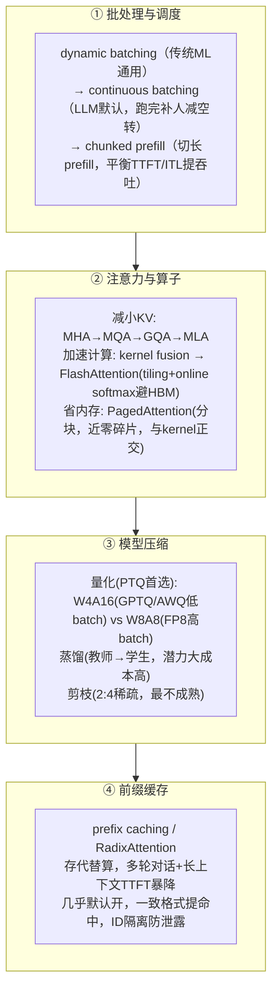

**一句话记住每种技术"省什么、代价、组合"：**

| 技术 | 省什么 | 代价 | 组合建议 |
|---|---|---|---|
| **continuous batching** | GPU 空转 → 吞吐↑ | 需管 max batch size | **默认开**，几乎无脑 |
| **chunked prefill** | ITL↓、吞吐↑ | **TTFT↑**、端到端略增 | 长上下文/看重流畅时开 |
| **MQA/GQA/MLA** | KV cache 尺寸 | 架构级、可能掉精度 | 选模型时就定 |
| **kernel fusion / FlashAttention** | HBM 往返 → 计算快 | 需匹配硬件的 kernel | **默认用引擎推荐 kernel** |
| **PagedAttention** | KV 内存碎片（近零浪费） | 几乎无 | **默认开**，与 kernel 正交叠加 |
| **量化 W4A16** | 体积/搬运 −75% | 高 batch prefill TTFT↑、不省算力 | 低 batch、延迟敏感 |
| **量化 W8A8(FP8)** | 体积 −50% + **算力 ×2** | 需 Hopper/Blackwell、激活量化更复杂 | 高 batch、高吞吐 |
| **蒸馏** | 体积缩 10x+ | 训练成本高、精度损失大 | 有现成学生模型才优先 |
| **剪枝(2:4)** | 矩阵乘 ×2（稀疏 Tensor Core） | 尚不成熟、需再训恢复 | 谨慎，生产前评估 |
| **prefix caching** | 重复 prefill 计算 → TTFT 暴降 | 占显存、需一致 prompt + ID 隔离 | **几乎默认开**，多轮/长上下文最香 |

学完本章，你已具备**高效服务 LLM（尤其单卡小模型）**的核心武器。原书预告：**第 7 章**进阶到**分布式**——把大模型摊到多机多卡、从"单副本优化"上升到"系统级优化"（PD 分离、投机解码、MoE、复杂 KV 存储）。

---

# 🔗 延伸阅读

**本书其它章（`book-hands-on-llm-serving/book-guide/`）：**
- 前置：第 2 章（prefill/decode 两阶段、offline/online 服务）、第 4 章（TTFT/ITL/TPOT 延迟指标）、第 5 章（GPU 算力/带宽、算术强度、内存层级、KV cache 占比）——本章大量引用其结论。
- 后续：**第 7 章**（分布式服务、**PD 分离**、投机解码、**MoE**、KV cache 多级存储/offload）——本章多处"留到下一章"的正是它。

**仓库既有相关目录（可与本章互相印证）：**
- `../../llm-inference/`：推理引擎实战合集
  - `KV-Cache优化.md`、`vllm/`（PagedAttention 源头）、`sglang/`（RadixAttention 源头）、`FlashInfer.md`、`PD分离.md`、`分离式推理架构.md`、`Mooncake.md`（KV 存储/传输）。
- `../../attention-optimization/`：注意力优化深挖
  - `01-attention-bottleneck.md`、`02-online-softmax.md`、`03-gpu-memory-hierarchy.md`、`04~06-flashattention-v1/v2/v3.md`、`07-flash-decoding.md`、`09-sliding-window-attention.md`——把本章 6.6 FlashAttention 讲到底层。
- `../../ai-infra-architecture/`：AI Infra 架构逐主题
  - `07_KVCache深入_PagedAttention_前缀缓存_量化压缩.md`（与本章板块二/四高度重合）、`08_量化与低精度_INT8_INT4_FP8_GPTQ_AWQ_SmoothQuant.md`（与 6.8 量化互补）、`09_推理引擎架构_连续批处理_调度_投机解码_chunked_prefill.md`（与 6.1~6.4 批处理互补）、`12_算子与编译_融合_Triton_torchcompile_图优化.md`（与 6.6 kernel fusion 互补）、`01_PD分离架构.md`（本章预告的第 7 章内容）。
- `../../ultra-scale-playbook/book-guide/09_深入GPU_融合_线程_混合精度_FlashAttention_融合核.md`：从**训练**视角讲同一批 kernel 技术（融合/tiling/混合精度/FlashAttention），与本章从**推理**视角互为镜像。

**外部经典（原书引用）：**
- vLLM 官方文档与博客（PagedAttention 动画、实现细节）；SGLang 文档（RadixAttention、attention-backend）。
- FlashAttention 论文（Dao et al., 2022）；kernel fusion（He, 2022）。
- Maarten Grootendorst《A Visual Guide to Quantization》（2024）——量化直觉可视化必读。
- Neural Magic OpenLLM Leaderboard（Kurtić et al., 2024）；DeepSeek MLA / R1 蒸馏论文；OpenAI GPT-OSS（MXFP4 QAT）技术文档。
