# 第 7 章 高级 LLM 优化技术（Advanced LLM Optimization Techniques）

> 对应《Hands-On LLM Serving and Optimization: Hosting LLMs at Scale》(Chi Wang, Peiheng Hu, O'Reilly) 原书第 253–290 页（Chapter 7 *Advanced LLM Optimization Techniques*）。
>
> 本篇是「《Hands-On LLM Serving》逐章精讲」系列。上一章（第 6 章）我们把**单卡**能用的招式全用了：连续批处理（continuous batching）、PagedAttention、前缀缓存（prefix caching）、量化、chunked prefill。但当模型大到**一张 GPU 装不下**（比如 >100B 参数）、或者延迟要求高到单卡扛不住时，就得请出本章这些"重装武器"。

---

## 🗺️ 本章地图：我们走到哪了？

整本书的服务优化是一条"从小到大"的路。前面的章节解决的是"**一个模型、一张卡怎么服务好**"；本章解决的是"**模型太大 / 负载太重，单卡救不了，怎么把它摊到多张卡、多台机器上，并且每一层都调到极致**"。

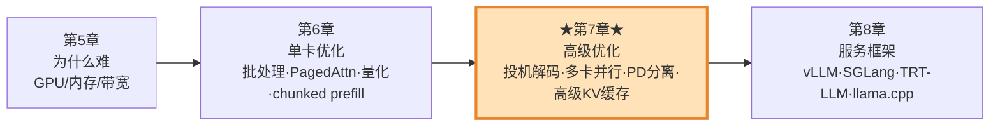

原书用一句话点明本章的定位：**上一章的招式适用于"能塞进单卡"的模型；本章面向"塞不进单卡 / 单卡不够快"的大模型和大规模服务系统。**

读完本章你会**彻底搞懂**这四件事：

| 小节 | 主题 | 一句话本质 | 主要改善的指标 |
|---|---|---|---|
| 7.1 | 投机解码 Speculative Decoding | 小模型"猜" K 个 token，大模型"一次并行验证" | ⬇️ ITL（token 间延迟），整体延迟 ↓2~3× |
| 7.2 | 多卡多机推理（DP/TP/PP/EP） | 把一个大模型沿宽度/深度/专家切开，摊到多卡多机 | 装得下大模型 + ⬇️ 延迟 + ⬆️ 吞吐 |
| 7.3 | PD 分离 Prefill-Decode Disaggregation | 把"算力密集的 prefill"和"带宽密集的 decode"拆到不同 GPU 上 | ⬇️ TTFT & ITL 可独立调 |
| 7.4 | 高级 KV 缓存 | KV Cache 分层卸载（GPU→CPU→SSD）+ 压缩 + 混合 | ⬇️ TTFT + ⬆️ 命中率 + ⬇️ 成本 |

> 💡 **贯穿全章的一条主线**：所有这些技术，本质都在权衡 **算力（FLOPs）· 显存（Memory）· 带宽（Bandwidth）· 通信（Interconnect）** 这四个资源。你每学一个技术，都问自己一句"它拿什么换什么？"——这是理解服务优化的第一性框架。

在动手之前，先把两个核心延迟指标钉死在脑子里（第 5 章已定义，这里复习）：

- **TTFT（Time To First Token，首 token 延迟）**：从收到请求到吐出第一个 token 的时间，主要由 **prefill 阶段** 决定。用户点回车后"转圈圈"多久，就是它。
- **ITL（Inter-Token Latency，token 间延迟）**：生成过程中相邻两个 token 之间的时间间隔，主要由 **decode 阶段** 决定。它决定了流式输出"打字机效果"的快慢。

🔬 **第一性原理：LLM 推理是"两阶段、两种脾气"的怪兽。**

- **Prefill（预填充）**：把整个输入 prompt 一次性喂进去，所有 token **并行**计算注意力，产出 KV Cache。矩阵很大很满，**算力密集（compute-bound）**，吃 FLOPs。
- **Decode（解码）**：一次只生成一个 token，每步都要把整个 KV Cache 读一遍。矩阵瘦长（只有 1 行），算力用不满，**带宽密集（memory-bound）**，吃显存带宽。

本章几乎每个技术都是围绕"这两个阶段脾气不同"做文章：投机解码专治 decode 的带宽瓶颈，PD 分离干脆把两阶段拆开各自优化。把这条主线记牢，后面就顺了。

---

## 🚀 7.1 投机解码（Speculative Decoding）

### 7.1.1 一个类比：先用"粗筛"，再用"精筛"

原书开篇给了一个绝妙的类比。在一个大型 ML 系统里（比如百万级候选的检索 / 推荐），常见做法是：**先用一个又小又快但没那么准的模型做第一轮粗筛**，把百万候选砍到大约一千个；**再用一个又大又准的模型**在这一千个上面做精排，得到最终结果。

投机解码干的是**一模一样的事，只不过发生在 token 级别**：

- 用一个**小模型（draft model，草稿模型）** 快速"猜"出接下来的候选 token；
- 让**大模型（target model，目标模型）** 去**验证**这些候选。如果小模型猜得不错，大模型就接受它，然后"跳着"往前走。

> 💡 **它到底加速了什么？** 只加速 **decode 阶段**。回想一下：decode 是 memory-bound 的——每生成 1 个 token，都要把整个模型权重 + KV Cache 从显存搬一遍，算力却用不满。投机解码的精髓是：**大模型"一次 forward"就能并行验证 K 个 token**，等于把"K 次串行的 memory-bound decode"压缩成"1 次 forward + K 个 token 产出"，把闲置的算力用起来去分摊访存开销。

### 7.1.2 一次迭代的四个步骤（拆解 Figure 7-1）

原书把一次投机解码迭代拆成四步。我用 mermaid 把它画出来：

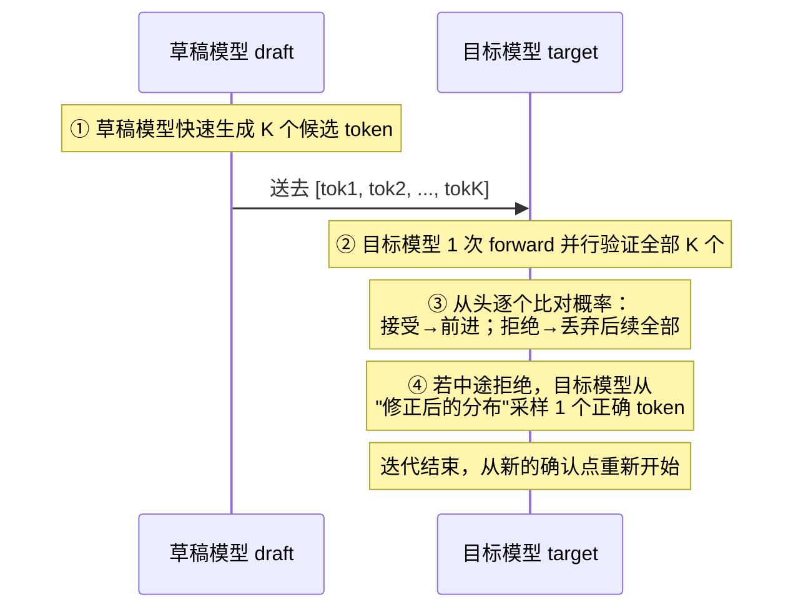

**第一步**：草稿模型快速生成 **K 个 token**。`K` 是"小模型一口气猜几个"的关键超参，需要调优（后面 7.1.5 详说）。

**第二步**：紧接着，目标模型做一次前向传播（forward pass），在这一次 forward 里**并行验证**所有草稿 token 是好是坏。

**第三步——验证逻辑（本节最核心）**。token 的生成本来就是带概率的。举原书的例子：给定短语 `The soccer team of the United`：

- 草稿模型猜下一个 token 是 `States`，概率 0.6；`Kingdom` 概率 0.3；`Nations` 概率 0.1。
- 现在看目标模型怎么想：
  - 如果目标模型认为 `States` 的概率是 **0.8**（比草稿的 0.6 还高）→ **直接接受**。
  - 如果目标模型认为 `States` 的概率是 **0.4**（比草稿的 0.6 低）→ **按概率接受**，接受概率 = 0.4 / 0.6 ≈ 0.67，即掷一次骰子，有 67% 概率接受。

  用公式写出来，接受概率是：

  $$
  p_{\text{accept}} = \min\left(1,\ \frac{p_{\text{target}}(x)}{p_{\text{draft}}(x)}\right)
  $$

  其中 $p_{\text{target}}$ 是目标模型给这个 token 的概率，$p_{\text{draft}}$ 是草稿模型给的。目标看得比草稿更靠谱（比值 ≥1）就必接受；否则按比值概率接受。

**第四步——拒绝后怎么办**。一旦某个 token 被拒绝，**它后面所有的草稿 token 全部丢弃**。为什么？因为生成是**自回归（autoregressive）** 的——后面的 token 依赖于前面被拒绝的那个，前面错了，后面全是无效推演。这时目标模型会**从自己"修正后的分布"里采样一个正确 token**（对应 Figure 7-1 里的 Token3），把这个错误纠正掉，然后从这个"新确认的点"重新开始下一轮。

### 7.1.3 🔬 第一性原理：为什么"不损失精度"？

这是投机解码最反直觉、也最精妙的地方：

> **投机解码的最终输出，和一个普通自回归模型（不用投机）生成的结果，在分布上完全一致。**

换句话说，你用了投机解码，**并没有变笨**，输出质量和原模型一模一样。这靠的就是第三、四步的**验证 + 修正采样**机制：

- 被接受的 token：因为按 $\min(1, p_t/p_d)$ 的概率接受，数学上等价于从目标分布采样；
- 被拒绝的 token：目标模型从**"扣掉被拒 token 后重新归一化的分布"**（modified distribution）里重新采一个。

两者叠加，可以严格证明**最终采样分布 = 目标模型自己的分布**。这个证明来自两篇奠基论文：Leviathan et al. 2022《Fast Inference from Transformers via Speculative Decoding》和 Chen et al. 2023《Accelerating LLM Decoding with Speculative Sampling》。

> ⚠️ **常见误区**：很多人以为"用小模型猜"会掉精度。**不会**。小模型只是"提议者"，最终拍板的永远是大模型的分布。小模型猜得准，你就快；猜得烂，你顶多是白算一场（浪费算力），但**质量绝不下降**。

### 7.1.4 三种"草稿"来源

书里讲了三大类产生候选 token 的方法，从"外挂小模型"到"完全不用小模型"：

#### ① 用一个现成的小模型（Standalone Draft Model）

选草稿模型的关键：**同时最大化"速度"和"接受率"**。原书给了几条实战建议：

- **用同一家族的小模型**：同 tokenizer、同预训练数据，接受率天然更高（比如目标是 Llama-70B，草稿用 Llama-8B/1B）。
- **对草稿模型激进量化**：因为你**永远有目标模型兜底**，草稿量化掉点也无妨——大不了它猜错，目标模型纠正。草稿越小越快，越划算。
- **如果你能训练，最好蒸馏（distill）一个专属草稿模型**：从目标模型蒸馏出来的草稿，和目标模型的"风格 / 领域"对齐得更好，接受率更高、更鲁棒。比单纯挑个现成小模型好。

#### ② 自草稿（Self-Drafting）：Medusa 与 EAGLE

更进一步的思路叫 **self-drafting（自草稿）**：**不用外挂小模型，让目标模型自己给自己出草稿**。好处是省 GPU 显存、部署简单、和目标模型天然对齐。

**Medusa（美杜莎，Cai et al. 2024）**：给目标模型加几个**轻量的预测头（prediction heads）**。看 Figure 7-2：

- 原始模型一次 forward 只能给出**第 1 个** token 的候选（图右上的 `It / I / As`）。
- Medusa 的每个额外"头"在**同一次 forward** 里，并行预测第 2、3、4 个后续 token 的候选。
- 这些跨位置的候选拼成很多条"候选序列"，从中挑出**最长的被接受序列**。
- 图里的例子：一次 forward 生成了 3 个 token（`It is difficult`）；而不用投机时，一次 forward 只能生成 1 个（`It`）。

**EAGLE（Li et al. 2025）**：和 Medusa 不同，**它不直接猜 token，而是猜"隐藏状态（hidden states）"**。它用一个小的辅助模块，训练去预测**目标模型未来的内部隐藏状态**，然后目标模型再从这些预测的隐藏状态里生成 token。好处是预测更稳、更准。演进路线：

- **EAGLE-2**：引入**动态草稿树（dynamic draft tree）**，根据当前文本"好不好猜"来自适应调整投机长度。
- **EAGLE-3**（Figure 7-3）：进一步**融合多层 LLM 的特征**作为输入，精度更高。

> 📌 原书写作时间（2025 年底）判断：**EAGLE 是当前性能最强的自草稿技术之一**，但代价是需要**额外的训练和调优**。

#### ③ N-gram：最简单、最先该试的方法

第三种方法既不用小模型也不用额外模块，就一个大白话：**从请求前面已经出现过的文本里，找一段 n 个相邻 token，做匹配来提议下一个 token**。它把历史 token 存成一张 **n-gram 表**。

原书的例子（trigram，n=3）：

```
An hour ago, a quick brown fox ran away and now, that quick brown [下一个 token]
```

现在要预测 `that quick brown` 后面是什么。查 n-gram 表（Table 7-1）：

| Trigram 表 (n = 3) | 下一个 token | 计数 |
|---|---|---|
| `a quick` | `brown` | 1 |
| `quick brown` | `fox` | 1 |

匹配到 `quick brown → fox`，于是**提议下一个 token 是 `fox`**，无需任何复杂预测，直接让原模型验证。

**N-gram 最擅长的两个场景**（原书特别强调）：

1. **生成结构化输出**（JSON、SQL 等）：生成模式高度确定、重复。
2. **改写 / 填模板类任务**：让 LLM 润色一段文字，或按预设模板填空——这时模型会**大量复用 prompt 里已有的 n-gram 片段**。

原书给了一个"确认邮件"的例子来说明这一点：prompt 里给了 `Subject: / Greeting: Hi <name>, / Body: ... / Closing: Best regards` 的模板，模型生成的回复里 `Hi Iris,` `confirm ... onboarding call on Tuesday at 2:00 PM` `Best regards` 这些片段，很多都能从 prompt 的模板结构里直接 n-gram 命中——**prompt 里预定义的结构越多，接受率越高，就能把 K 推得越大，延迟越低**。

> 💡 **原书的强烈建议**：因为 n-gram 开销极小（就查个表），**即使接受率不高也几乎稳赚不赔**。**它应该是你尝试投机解码时的第一个方法**，比外挂小模型简单多了。

### 7.1.5 调 K：草稿 token 数量这个关键旋钮

`K`（最多猜几个 token）是投机解码除了草稿方法之外的第二个关键旋钮：

| K 大小 | 优点 | 缺点 |
|---|---|---|
| **K 大** | 加速上限很高（一次能跳很远） | 接受率一低就白算很多，浪费严重 |
| **K 小**（如 2、4） | 性能可预测、稳定 | 可能没吃满投机的红利 |

原书给的经验区间：

- **稳妥的起点：K = 2 或 4**，作为基线往上加。
- **大多数情况最优 K 在 4~8 之间**。
- **对非常可预测的生成**（结构化输出、AI Agent 的 function calling），K 可以推到 **16 甚至 32**。

**看逐位置接受率来调 K**：很多框架能观测到每个位置的接受率。比如 K=6 时你可能看到：

```
[0.8, 0.7, 0.6, 0.5, 0.10, 0.02]
```

解读：第 1 个 token 接受率 80%，第 5、6 个 token 接受率已经掉到 10% 以下。**这说明后两个投机几乎白算，应该把 K 调小到 4。**

> 💡 **面试高频**："投机解码的 K 怎么定？" 标准答法：**从 K=2~4 起步，观测逐位置接受率，接受率跌破某阈值（如 10%~15%）的位置就是 K 的天花板；越可预测的任务（JSON/SQL/agent）K 可以越大**。同时点明 K 依赖于任务、目标模型、草稿方法的开销、以及你的 SLO。

### 7.1.6 ⚠️ 局限性：投机解码不是免费午餐

原书专门列了一节"Limitations"，非常重要，是面试和实战的高频坑：

1. **只帮 decode，不帮 prefill / TTFT**。投机解码优化的是 ITL；prefill 阶段它帮不上忙。
2. **接受率低时会产生"额外计算"**。草稿猜错就是白算，浪费 GPU/CPU 算力。
3. **prefill 已经算力密集时，投机可能没用**。如果你的场景 **input 上下文很长**，prefill 阶段模型**本来就 compute-bound（吃满 FLOPs）**了，投机解码没有空闲算力可用，收益消失。
4. **大 batch 会把瓶颈从 memory-bound 推向 compute-bound**。第 6 章讲过：高效批处理会把 decode 从"带宽卡"变成"算力卡"。一旦算力被打满，投机解码**虽然还能降延迟，但会伤整体吞吐**（因为它要额外算草稿）。
5. **产品化很棘手**。在共享 GPU 上高效地跑两个模型（目标+草稿）、维持高资源利用率，很难。**这正是投机解码近年更倾向 self-drafting 和 n-gram、而非外挂小模型的原因。** 另外静态的 K 抓不住动态变化的需求，学界在做自适应 K。

> 🔬 **一句话总结适用边界**：**当你的负载"延迟敏感"、且愿意用一点吞吐 / TTFT 去换更好的 ITL 和整体延迟时，投机解码最香。** 具体地说——当 **prefill:decode 的 token 比例低、真实 batch 又小**（也就是处在 GPU 显存带宽瓶颈里）时，用投机解码的"闪电速度"能显著改善用户体验。

### 7.1.7 🛠️ 动手：在 vLLM 里开投机解码

原书给了在 Colab 里用 vLLM 起 4 个变体的命令。逐块讲解（以 `Qwen/Qwen3-32B` 为目标模型）：

**① 原味 vLLM（baseline，基线）**：

```bash
nohup vllm serve Qwen/Qwen3-32B \
  --disable-log-requests \
  --max-model-len 2048 \
  --gpu-memory-utilization 0.95 \
  > vllm.log 2>&1 &
```

逐行看：`vllm serve Qwen/Qwen3-32B` 启动服务；`--disable-log-requests` 关掉逐请求日志（跑基准时减少噪音）；`--max-model-len 2048` 限制序列最大长度；`--gpu-memory-utilization 0.95` 让 vLLM 吃掉 95% 显存做 KV Cache；`nohup ... > vllm.log 2>&1 &` 后台跑并把日志重定向到文件。这是**没有任何投机**的对照组。

**② N-gram 投机**：

```bash
nohup vllm serve Qwen/Qwen3-32B \
  --speculative-config '{
    "method": "ngram",
    "num_speculative_tokens": 6,
    "prompt_lookup_min": 4,
    "prompt_lookup_max": 6
  }' \
  --disable-log-requests --max-model-len 2048 --gpu-memory-utilization 0.95 \
  > vllm.log 2>&1 &
```

关键就是多了 `--speculative-config`：`"method": "ngram"` 选 n-gram 方法；`"num_speculative_tokens": 6` 就是我们说的 **K=6**（一次猜 6 个）；`"prompt_lookup_min/max": 4/6` 表示匹配 n-gram 时用的**最小/最大匹配长度**（在 prompt 里回查 4~6 个 token 的片段来提议）。

**③ 改进版 N-gram**（目标是提升接受率、降低开销）：

```bash
  --speculative-config '{
    "method": "ngram",
    "num_speculative_tokens": 4,
    "prompt_lookup_min": 2,
    "prompt_lookup_max": 128
  }'
```

这里 K 降到 4（更稳），但 `prompt_lookup_max` 放宽到 **128**——允许匹配更长的历史片段，能命中更长的重复模式（对长模板/长重复文本更友好），而 `min=2` 又保留了短匹配的灵活性。

**④ EAGLE-3 投机**：

```bash
  --speculative-config '{
    "method": "eagle3",
    "model": "RedHatAI/Qwen3-32B-speculator.eagle3",
    "num_speculative_tokens": 3
  }'
```

`"method": "eagle3"` 选 EAGLE-3；`"model"` 指定训练好的 EAGLE-3 speculator 权重（注意它是**专门为这个目标模型训练**的配套模块）；K=3。

### 7.1.8 📊 基准结果解读（Figure 7-4/7-5）

原书跑了两组并发：**concurrency=1**（模拟低 RPS）和 **concurrency=16**（模拟高负载高 RPS）。

**总吞吐对比（tokens/s）：**

| 场景 | vanilla vLLM | n-gram | 改进 n-gram | EAGLE-3 |
|---|---|---|---|---|
| **并发=1（低负载）** | 28.9 | 略有提升 | +16% | **56.5（≈2×）** |
| **并发=16（高负载）** | 基准 | **比 vanilla 更差** | **比 vanilla 更差** | 仍领先，但**优势缩小** |

**核心洞察（务必吃透）：**

- **低并发下**，EAGLE-3 吞吐几乎翻倍（56.5 vs 28.9 tokens/s），n-gram 也有小幅提升。因为这时是典型的 memory-bound，有大量空闲算力给投机用。
- **高并发下情况反转**：两个 n-gram 变体都**比原味 vLLM 还慢**！原因就是 7.1.6 说的——**提议和验证新 token 的开销**（额外 CPU/GPU 计算）在高并发下被放大，而此时算力本就被 batch 打满了。EAGLE-3 虽然还领先，但优势明显缩水。

**TTFT vs ITL 的权衡（Figure 7-5，并发=16）：**

- n-gram 和 EAGLE-3 的 **ITL 都优于** vanilla（投机确实降了 token 间延迟）。
- 但 **EAGLE-3 的 TTFT 明显比 vanilla 更长**——因为额外的投机头 / 模块带来了 prefill 开销。
- **所以本质是一个 TTFT ↔ ITL 的取舍**：你要 TTFT 还是 ITL 优先，取决于你的 SLA / SLO。

> ⚠️ **实战结论**：投机解码在真实环境里**高度依赖数据集和负载**，必须**多跑几次、结合各 K 的接受率**，才能选对方法和最优 K。**没有"一把梭"的默认配置。**

---

## 🧩 7.2 多 GPU 与多节点推理（Multi-GPU and Multi-Node Inferencing）

现代 LLM 常常**塞不进单卡**，而且要低延迟、大规模服务远超单卡能力。解决办法是**分布式**：把负载摊到一台或多台机器的多张 GPU 上。原书讨论四种并行技术：

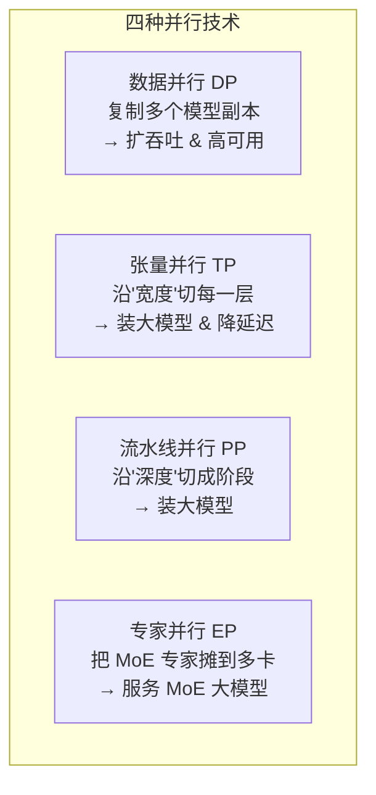

| 技术 | 切什么 | 解决什么问题 | 关键代价 |
|---|---|---|---|
| **DP** 数据并行 | 不切模型，**复制**整个模型 | 扩吞吐、高可用 | 每张卡都要装下完整模型 |
| **TP** 张量并行 | 沿**宽度**切每一层的大矩阵 | 装大模型 + 降延迟 | **每一层都要跨卡通信**，极吃互联带宽 |
| **PP** 流水线并行 | 沿**深度**把层分成连续阶段 | 装大模型 | **流水线气泡（bubble）**，卡会闲着 |
| **EP** 专家并行 | 把 MoE 的**专家**摊到多卡 | 服务 MoE 大模型 | 路由 + token 分发的复杂度 |

### 7.2.1 数据并行（DP，Data Parallelism）

**是什么**：和 Web 后端"请求太多就水平扩副本"一模一样。ML 世界里就是**复制多个模型实例（replica）**，每个实例处理一部分流量。

**怎么用**：一个负载均衡器 / 路由器（load balancer / router）把请求分给多个实例。Figure 7-6 的例子：9 个请求，3 个模型实例，每个分 3 个，谁都不过载。

**高可用**：某个实例挂了（Figure 7-7），路由器就不再往它发请求，转发给另外两个——天然容错。

**路由策略**（原书列了 4 种，从简单到复杂）：

| 策略 | 原理 | 优缺点 |
|---|---|---|
| **Round Robin 轮询** | 按固定顺序挨个发 | 最简单；但请求耗时差异大时会负载不均，有的实例闲有的忙 |
| **Least Connections 最少连接** | 发给当前活跃连接最少的实例 | 比轮询好，考虑了当前负载；但没考虑已在处理请求的复杂度/长度 |
| **Latency-based 基于延迟** | 持续监控每个实例的实时延迟，发给响应最快的 | 动态适应波动，能降**尾延迟（tail latency）** |
| **Cache-aware 缓存感知** | 把**相同前缀**的请求路由到**已持有该 KV 缓存**的实例 | 提高前缀缓存命中率、降 TTFT（呼应第 6 章 prefix caching） |

> 🔬 **为什么 LLM 的路由比传统 Web 值钱得多？** 原书点破本质：**LLM 请求彼此差异极大**（有的输入长有的短、有的生成多有的少），而**服务 LLM 的硬件极其昂贵**。所以"聪明路由"省下的钱，比传统 Web 应用大得多。现代 LLM 路由已经从"简单规则匹配"进化成**利用实时信号的复杂系统**：
> - KV 缓存的**局部性（locality）**
> - KV 缓存**命中百分比**（命中 token 数 / 总前缀长度）
> - 实例的 **KV 缓存空间使用率**
> - **原始输入长度**
> - 排队等待处理的请求数
> - 正在处理中（pending）的请求数
> - 已生成的 token 数
> - 请求的 **SLA/SLO 延迟预算**
>
> 想深入，原书推荐看 **NVIDIA Dynamo 的 KV Router** 和 **llm-d router** 文档，它们还支持 prefill/decode worker 路由和 KV 卸载。

### 7.2.2 张量并行 vs 流水线并行（TP vs PP）

**类比**：数据库太大放不下单机，就**分片（sharding）** 到多台机。大模型放不下单卡也一样，用 TP / PP 把**一个模型**切到多卡（单机多卡）或多机（多节点）。

**两种切法的本质区别（Figure 7-8）：**

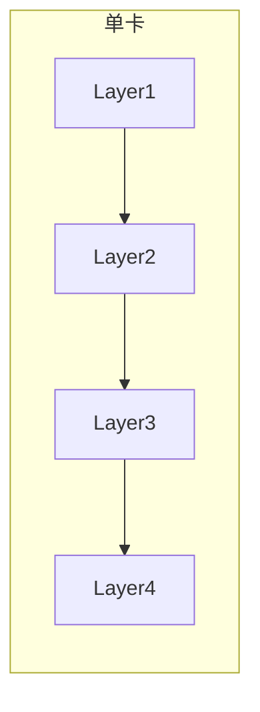

- **TP 沿"宽度"切**：把**每一层**的大权重张量**横向切开**，每张 GPU 拿一"片"，各算一部分（partial computation），最后合并成完整的层输出。图里 TP=2，每一层都劈成两半，分别在两张卡上跑。
- **PP 沿"深度"切**：**不切任何单层**，而是把**连续的若干层**分给不同 GPU。数据像**流水线 / 装配线**一样顺序流过：GPU1 算前几层 → 把中间结果传给 GPU2 → GPU2 算后几层 → 出结果。图里 4 层、PP=2：Layer 1&2 在 GPU1，Layer 3&4 在 GPU2。

**通信开销的关键差异（Figure 7-9）：**

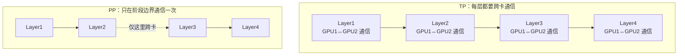

- **TP：每一层**都需要 GPU 间通信（把切开的部分结果合并），**通信极频繁**。
- **PP：只在跨阶段的边界**通信一次（Layer2→Layer3 这一处），**通信极少**。

**那 PP 是不是完胜？——不是。** PP 的致命弱点是 **流水线气泡（pipeline bubble）**：像装配线一样，如果某一段慢了（比如 Layer2 特别慢），后面的 Layer3、Layer4 就得**干等着**，设备闲置。结果可能是 GPU1 利用率爆满、GPU2 大部分时间在摸鱼。LLM 内部各层负载本来就不均，所以气泡很常见。

> 💡 **面试高频一句话**：**TP 用通信换均衡（无气泡但每层都通信）；PP 用气泡换省通信（几乎不通信但会闲等）。** 选哪个，取决于你的 GPU 之间是什么样的互联。

### 7.2.3 TP/PP 决策流程图（Figure 7-10 精讲）

原书用一张决策流程图讲清楚什么时候用什么。我把它翻译成 mermaid：

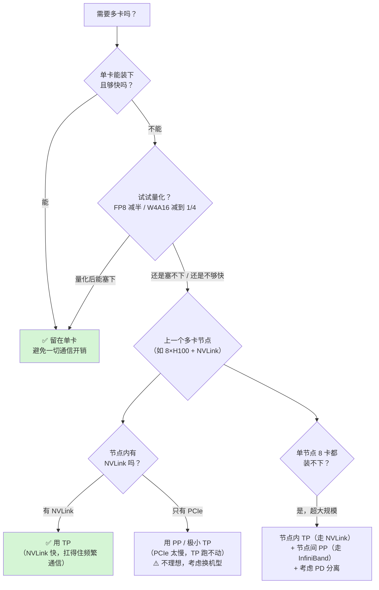

**逐步走一遍这张图，把每个决策点的"第一性原理"讲透：**

**决策 0：你真的需要多卡吗？** 第 5 章讲过一个关键数字：**GPU 显存带宽 ≫ GPU 互联带宽**。以 H100 为例：
- 显存 → 计算核：约 **3 TB/s**；
- 就算有 NVLink，跨卡也只有约 **900 GB/s**（慢约 3 倍）。

这个巨大落差导致三条铁律：

1. **能单卡就单卡**：无论有没有 NVLink，只要负载能塞进一张卡，就别拆——省掉所有通信开销。
2. **加卡不是线性加速**：加一张卡，显存和 FLOPs 翻倍，但性能**不会翻倍**——因为互联是瓶颈。
3. **宁可换更大的单卡，也别凑多张小卡**：很多时候买一张显存更大的高端卡（单卡装下模型），比买多张低端卡搞并行更划算。

**决策 1：先量化再说。** 别忘了量化（第 6 章）能省显存：**FP8 把模型缩到 FP16/BF16 的一半，W4A16 缩到四分之一**（前提是精度可接受）。量化后能单卡装下，就不用多卡。

**决策 2：选"单节点多卡"还是"多节点"？** 原书举了一个极其重要的例子，务必记牢：

> **一台 AWS P5.48xlarge = 8×H100，卡间用 NVLink 互联。**
> **一台 AWS P5.4xlarge = 1×H100。**
> 你可能以为"8 台 P5.4xlarge ≈ 1 台 P5.48xlarge"——**错！**
> 因为 P5.48xlarge 内部 8 卡走 **NVLink**（快）；而 8 台 P5.4xlarge 之间只能走 **InfiniBand 跨节点通信**（比 NVLink 慢好几倍）。

**决策 3：节点内选 TP 还是 PP？**

- **有 NVLink → 用 TP**。因为 TP 需要大量卡间数据传输，NVLink 够快扛得住。在 P5.48xlarge 上用 8 卡 TP 跑大模型是**非常常见的标配**。
- **没 NVLink（只有 PCIe）→ TP 跑不动**。PCIe 是为"设备↔主机"设计的，不是为高速 GPU 通信设计的，速度太慢。这时应该**换机型**，或者用 **PP / 极小的 TP**（TP=0 或很小以最小化卡间通信）。这种情况少见且不理想。

**决策 4：超大规模（Hyperscale）——模型连单节点 8 卡都装不下。** 这时上**多节点服务**，经典组合是：

> **节点内用 TP（走 NVLink，保证节点内快速卡间通信）+ 节点间用 PP（因为跨节点通信慢，而 PP 通信最少）。**

这正是 PP 大放异彩的地方——**它把跨节点的数据传输量降到最低**。Figure 7-11 展示了一个既沿宽度（TP=8）又沿高度（PP=2）切分的例子：两个节点、每节点 8 卡。更高级的 PD 分离在这里也很有用（下一节讲）。

**🛠️ 单节点 8 卡开 TP+PP 的命令（原书例子）：**

```bash
hf_model_id = "Qwen/Qwen2.5-7B-Instruct"
!vllm serve \
     --tensor-parallel-size 4 \
     --pipeline-parallel-size 2
```

`--tensor-parallel-size 4` 表示每层横切成 4 份（TP=4），`--pipeline-parallel-size 2` 表示层沿深度分成 2 个流水阶段（PP=2）。4×2=8，正好用满一台 8 卡节点。

> ⚠️ **跨节点跑 vLLM 更麻烦**，因为网络是瓶颈，用得也少。如果确实需要多节点，可以用 **Ray + vLLM**（Ray 是分布式计算框架，帮你管理跨节点的分布式任务执行）。

### 7.2.4 专家并行（EP，Expert Parallelism）—— 为 MoE 而生

现代 LLM 越来越多用 **MoE（Mixture-of-Experts，专家混合）** 架构：Mixtral 8×7B、DeepSeek-V3、GPT-OSS 都是。

**MoE 是什么**（Figure 7-12）：模型里有很多"专家"（expert，本质是 FFN 子网络），一个**路由器（router）** 为每个 token 动态选出少数几个专家来处理。**只激活少数专家 → 大幅减少推理时的计算量**，却能保持"超大稠密模型"级别的性能。

> 🔬 **MoE 的核心矛盾**：**计算省了，但显存没省。** 每个 token 只激活几个专家（省算力），**但所有专家的参数加起来太大，装不进单卡**（吃显存）。

**EP 就是来解决这个显存矛盾的**：把**专家们摊到多张 GPU 上**（Figure 7-13 展示 EP=2、4 个专家的例子），让路由和执行能横向扩展。EP 在实践中**和 TP、PP 配合使用**，把专家均匀分到各卡。对每个进来的 token，**只把它派发到"它选中的那几个专家所在的 GPU"**，避免在没被激活的专家上浪费计算。

> 💡 这一块和《Ultra-Scale Playbook》第 6 章 EP 讲得更深（本仓库有 `ultra-scale-playbook/book-guide/06_专家并行_EP_MoE.md`），想吃透 all-to-all 通信、专家负载均衡，可交叉阅读。

---

## ⚖️ 7.3 PD 分离（Prefill-Decode Disaggregation）

### 7.3.1 为什么需要 PD 分离？—— 两阶段"脾气不合"

TP / PP 解决的是"怎么把一个大模型塞进多卡、跑得快"，但它们**没解决推理"两阶段本质"带来的低效**。回顾第 5、6 章：

- **Prefill**：并行处理整个输入序列，**算力密集（compute-intensive）**。
- **Decode**：逐个生成 token，**显存带宽主导（memory-bandwidth dominated）**。

**问题在于**：到目前为止我们看到的所有方案，都是把这**两个阶段调度在同一批 GPU 上**（叫 **colocation / aggregated serving，聚合式服务**）。这意味着 GPU 处理一个阶段时，另一个阶段得等着。第 6 章的 **chunked prefill** 技术能缓解一点——把长 prompt 切成小块，让 decode 不至于被长 prefill 一直卡住（下面 7.3.2 专门讲）。

但根本矛盾还在：**两个阶段的资源利用画像天差地别**，放一起会**互相干扰（interference）**，很难同时把两者都优化好。

**解法就是把它们物理拆开**：

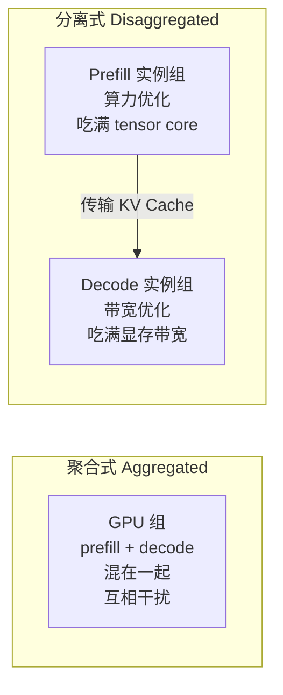

### 7.3.2 🔎 插叙：chunked prefill（分块预填充）到底做了什么？

原书在本章多次提到 chunked prefill（第 6 章详讲、本章作为 PD 分离的"前置缓解手段"再次点名），这里补齐它的原理，因为它和 PD 分离是"一对好搭档"。

**问题场景**：在聚合式服务里，一个很长的 prompt（比如 32K token）要 prefill。prefill 是一个大 forward，会**独占 GPU 很久**。这期间，正在流式生成的其他请求的 **decode 步全被卡住**——用户会感到"打字机突然卡顿"。

**chunked prefill 的做法**：**把长 prompt 的 prefill 切成若干小块（chunk）**，在连续批处理的每一步里，只做**一小块 prefill**，同时**捎带上若干 decode token**，二者拼进同一个 batch 一起算。

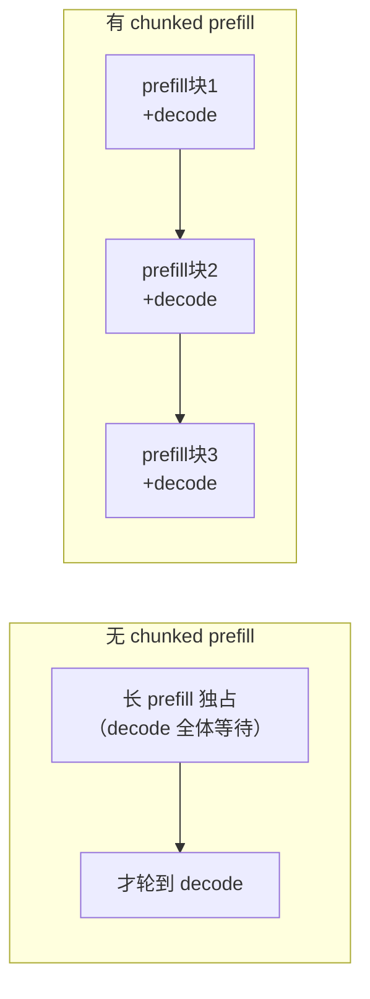

**收益**：decode 不再被长 prefill"饿死"，ITL 更平滑；同时把"瘦长的 memory-bound decode"和"肥满的 compute-bound prefill chunk"**混进一个 batch**，让 GPU 的算力和带宽都别闲着——这是一种"在单机上做的、轻量版的两阶段调和"。

> 💡 **chunked prefill vs PD 分离，一句话辨析**：**chunked prefill 是"在同一批 GPU 上把两阶段调和好"（省钱、简单，适合中小模型）；PD 分离是"干脆把两阶段拆到不同 GPU 上各自优化"（更强，但复杂、适合大模型大负载）。** 两者不冲突，PD 分离内部的 prefill 实例也可以再用 chunked prefill。

### 7.3.3 PD 分离的四大好处

把 compute-heavy 的 prefill 和 memory/bandwidth-heavy 的 decode **物理分离到不同 GPU**，原书列了四大好处：

**① 独立优化 TTFT 和 ITL（Figure 7-14）**

不同用例的输入/输出 token 比例差异巨大（Figure 7-14 展示了各种场景的 prefill:decode 比例）。PD 分离让你**非对称地**给两阶段配资源：
- 输入重、交互式负载 → **TTFT 是关键** → 给 prefill 加更多资源，长 prompt 更快完成，缩短首 token 等待。
- 之后如果 ITL 不够好，同样可以单独给 decode 加资源。
- 而且**没有了两阶段互相干扰，ITL 更稳定、更可预测**。

**② 独立优化两种工作负载 & 用不同 batch size**

高算力的 prefill 不用干等 memory-bound 的 decode 结束，反之亦然。还能给两阶段设**不同的 batch size**：
- **Prefill**：调 batch 让矩阵乘法足够大，**吃满 tensor core**。
- **Decode**：调 batch 大到"不再被显存带宽卡"，同时平衡 ITL 要求。
- 甚至可以用**异构并行策略**：给 prefill 和 decode 分别配不同的 TP/PP，互不影响。

**③ 开放更多硬件选择（这一点省钱效果惊人）**

prefill 和 decode 可以用**不同型号的 GPU**：
- **Prefill** 用**算力优化型** GPU（更多 FLOPS/成本）。
- **Decode** 用**显存优化型** GPU（更高带宽/成本）。

原书的绝妙例子：**H200 和 H100 的 FLOPS 规格相同**，但更贵的 H200 有**更大显存（141 GB vs 80 GB）和更高带宽（4.8 TB/s vs 3.35 TB/s）**。所以：
- **prefill 用 H100 更划算**（算力一样，便宜）；
- **decode 用 H200 更好**（带宽高，正好治 decode 的 memory-bound 病）；
- 如果 decode 不需要那么强，甚至可以用 **L40S**（显存不错、便宜很多）。

> 💡 **一个能省一大笔钱的组合**：**prefill 用 H100，decode 用 L40S**，就能拿到理想的 TTFT + 满意的 ITL，同时**省下一大笔硬件费**。这是 PD 分离最"接地气"的商业价值。

**④ 独立、非对称地弹性伸缩**

prefill 是请求入口、输入长度多变，**更突发（burst-driven）**，适合更激进的扩缩容策略；decode 生成周期长、**更可预测、更稳定**。两者独立伸缩，更能应对波动的需求。

### 7.3.4 整体架构（DistServe，Figure 7-15/7-16）

Figure 7-15 展示了 **DistServe（Zhong et al. 2024）** 的运行时架构：

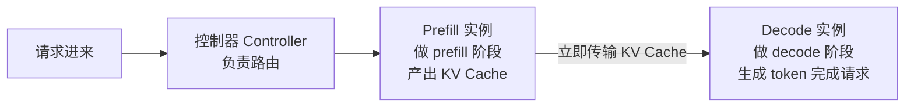

- 所有请求先到**控制器（controller）** 做路由；
- 先送到 **prefill 实例**做 prefill，**产出 KV Cache**；
- KV Cache **立即传输**到 **decode 实例**，由它生成 token 完成请求。

Figure 7-16 对比：**传统聚合式**——每个 GPU 实例都同时干 prefill 和 decode，不停在 compute-bound 和 memory-bound 之间平衡；**分离式**——GPU 实例分成两组，专职 prefill（最大化算力）和专职 decode（对付带宽）。

### 7.3.5 🔑 KV Cache 传输 —— PD 分离的成败命门

有一步之前没细讲，但 Figure 7-15/7-16 里都有：**KV Cache 传输**。原书强调：**高效地把 KV Cache 从 prefill 实例传到 decode 实例，是分离式服务成败的关键。PD 分离带来的收益，必须能盖过 KV Cache 传输的开销。**

**KV Cache 到底有多大？** 原书算了一笔账，务必跟着算一遍：

| 步骤 | 数值 |
|---|---|
| 一个常见 8B 模型、1024 输入 token 的 KV Cache | 约 **0.1 ~ 0.15 GB** |
| 输入长度放大 10 倍（10K token） | KV Cache 线性放大 → **1 ~ 1.5 GB / 请求** |
| 连续批处理下，一张 GPU 每秒可处理请求数 | 假设 **16 请求/秒** |
| **每秒需要传输的 KV Cache 总量** | 1.5 × 16 ≈ **接近 25 GB/s** |

> 🔬 **关键洞察**：KV Cache 大小**大致随输入长度线性增长**。单看一个请求 0.1 GB 不多，但**连续批处理把吞吐推高**后，一张 GPU 每秒处理几十个请求，再乘上真实场景里动辄 10K+ 的输入长度，传输需求瞬间飙到 **~25 GB/s**。这个数字决定了你能不能跨节点做 PD 分离。

**各种互联能扛多少？**（Table 5-3 对比）

| 互联方式 | 带宽 | 能否扛 25 GB/s |
|---|---|---|
| **NVLink（节点内）** | 900 GB/s+ | ✅ 绰绰有余 |
| **InfiniBand（节点间，带 RDMA）** | 50 ~ 100 GB/s | ✅ 可以（OK） |
| **PCIe（节点间，无 RDMA）** | ~10 GB/s | ❌ **超出上限，会成为瓶颈** |

**由此得出 GPU 分配的关键原则（Figure 7-17）**：

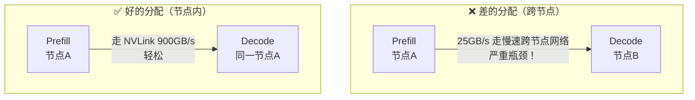

- **无 RDMA 时**：必须把同一请求的 prefill 和 decode 实例放在**同一台服务器节点内**，走 NVLink（右图）。放在不同节点（左图）会强迫巨大的 KV Cache 走慢速跨节点网络，**打满网络、拖垮整体吞吐**。

**但"强制同节点"也有代价**：它**逼你 prefill/decode 用同款 GPU 硬件**（就丢了 7.3.3-③ 用不同 GPU 省钱的好处），还**限制了模型并行**（比如 prefill 想用 8 卡 TP，同节点就腾不出手）。所以理想情况还是想跨节点，那就**必须上 RDMA（如 InfiniBand）**，并配合下面这些优化：

**⚡ KV Cache 传输的四大优化（把开销压到 <1%）：**

1. **分块流式传输（chunk）**：不等整个 KV Cache 算完才传，而是**切成小块像视频流一样边算边传**，块大小可调。
2. **异步非阻塞传输，计算/通信重叠（overlap）**：用异步操作，**prefill GPU 还在算的时候，传输就在后台偷偷进行**，让 decode GPU 更早开工——把传输**藏在**计算背后。
3. **逐层传输（layer by layer）**：KV Cache 是**逐层、层内局部**的，所以可以**一层算完就传一层**。prefill 算后面的层时，前面已算完层的 KV Cache 已经在传了，decode 那边可以先开始处理。
4. **压缩 / 缩小 KV Cache**（下一节详讲）。

```mermaid
flowchart LR
    subgraph 理想：传输藏在计算背后
    C1["Prefill 算 Layer1"] --> C2["Prefill 算 Layer2<br/>+ 同时传 Layer1 的 KV"] --> C3["Prefill 算 Layer3<br/>+ 同时传 Layer2 的 KV"]
    end
```

> 📌 原书结论（Wang et al. 2025）：把这些 KV Cache 传输优化 + 更好的调度都用上，**PD 分离的开销可以压到"每请求总延迟的 1% 以下"**（Figure 7-18 画了这种"传输被计算完全掩盖"的理想情形）。

### 7.3.6 ⚠️ 什么时候该用 PD 分离？

有这么多好处，是不是默认就该用？**原书明确回答：不。**（Figure 7-19 给了详细决策流程图。）

> **一句话准则：只有当"大模型 + 重负载 + 需要精细调 TTFT/ITL"三者齐备时才用 PD 分离；小模型就老老实实用简单的聚合式服务。**

因为 PD 分离引入了控制器、KV Cache 传输、双实例组管理等一堆复杂度，小模型 / 轻负载根本吃不回本。**先上 chunked prefill 这种轻量方案，扛不住了再考虑 PD 分离。**

> 💡 本仓库有一篇专门的 PD 分离深度讲解 `llm-inference/PD分离.md` 和 `ai-infra-architecture/01_PD分离架构_Prefill_Decode_Disaggregation.md`，以及 Mooncake（`llm-inference/Mooncake.md`，月之暗面的 PD 分离 + KV 池化系统）——想看工业级实现可交叉阅读。

---

## 💾 7.4 高级 KV 缓存（Advanced KV Caching）

到这里我们已经有了：投机解码（缩短 token 生成时间）、多种并行（多卡装大模型）、PD 分离（平衡两阶段）。最后一块拼图是**高级 KV 缓存管理**——尤其针对**长上下文**场景。

**动机**：现代应用越来越需要"在海量上下文上推理"：
- 编程 copilot 要跟踪几千行源代码；
- 对话 agent 要维持长交互历史 + 租户专属知识库；
- 企业平台要处理大量文档 / 交易历史。

### 7.4.1 长上下文服务：RAG vs CAG

**RAG（Retrieval-Augmented Generation，检索增强生成）**（第 4 章）：查询时**检索最相关的少量文档**塞进 prompt。好处：控制住了 context 长度和 prefill 的 TTFT，还能接入新鲜的、租户专属的知识。

**CAG（Cache-Augmented Generation，缓存增强生成）**（第 4 章）：**把大部分甚至全部相关上下文缓存成 KV Cache**，当成"可复用的知识"跨请求重用。

> 🔬 **前缀缓存（prefix caching）其实就是 CAG 的朴素版**：把所有相关知识当成输入的**静态前缀**，只把动态 prompt 作为后缀拼上去。LLM 就能复用前缀的 KV Cache，拿到极低的 TTFT。这个想法早就有，但直到最近才随长上下文模型火起来。

**两股趋势让长上下文 CAG 变得可行**：

1. **长上下文模型崛起**：窗口从 100K 拉到 **1M token**，能把租户的整个上下文直接塞进模型，不用反复靠检索注入。而且长上下文模型越来越强，正在解决 **"lost in the middle"（迷失在中间）** 问题——即 LLM 天然偏重开头和结尾、忽视中间信息的位置偏见。
2. **工程侧 KV 缓存管理成熟**：GPU 显存仍然紧张，但有了 **KV 缓存卸载（offloading 到 CPU 内存 / SSD / 远程存储）+ 跨副本路由**，现在把大量知识缓存成 KV Cache 复用已经很现实。

**CAG 的收益**：省掉实时检索流水线的复杂度，对海量输入推理更顺，很多时候回答更好；没有实时检索，**长上下文 CAG 能大幅减少冗余计算，TTFT 比 RAG 更快**。

### 7.4.2 💰 成本与延迟计算（Figure 7-20，跟着算一遍）

原书用一个具体例子对比 RAG 和长上下文 CAG 的输入 token。两者都有一个 500 token 的系统提示（可缓存）。

**RAG 服务的 prefill 输入拆解：**

```
系统提示 System prompt : 500          （已缓存 cached）
RAG 检索块 : 500 × 10 = 5000          （随用户 prompt 变，命中率极低）
用户 prompt : 500
─────────────────────────────
总缓存命中 : 500
总需重新 prefill（非缓存） : 5000 + 500 = 5500
```

**长上下文 CAG 服务的 prefill 输入拆解：**

```
系统提示 : 500                        （已缓存）
CAG 上下文 : 100,000                   （已缓存！这是关键）
用户 prompt : 500
─────────────────────────────
总缓存命中 : 100,500
总需重新 prefill（非缓存） : 500        （只有动态用户 prompt）
```

> 🔬 **本质对比**：CAG 只需要对 **1/10** 的输入做 prefill（500 vs 5500），所以 **TTFT 也相应缩短约 10 倍**。原书的说法：**如果 RAG 的 TTFT 是 5 秒，长上下文 CAG 能砍到约 0.5 秒**——很多生产场景里这是"天壤之别"。而且这还没算 RAG 那边的 embedding 时间和向量检索时间，真实差距更大。

**但是——CAG 更快，不代表更便宜！** 你得算缓存长上下文的**成本**。Table 7-2 给了 2025 年底各厂商的价格（美元/百万 token）：

| 厂商 | 常规输入 | 缓存输入 |
|---|---|---|
| **GPT-5** | 1.25 | 0.125 |
| **Gemini 2.5 Pro** | 1.25 | 0.31（+ 4.5/小时 存储费） |
| **Claude Sonnet 4** | 3 | 0.3（+ 3.25 首次写入费） |

> 💡 **规律**：缓存输入的价格通常是常规输入的 **10% ~ 25%**——便宜，但不是免费。

**用 GPT-5 价格算每请求成本：**

- **RAG**：`(500 缓存 × $0.125 + 5500 常规 × $1.25) / 10^6 = $0.007 / 请求`
- **长上下文 CAG**：`(500 缓存 × $0.125 + 100,500 常规 × $0.125) / 10^6 = $0.013 / 请求`

> ⚠️ **反直觉结论**：**长上下文 CAG 的成本几乎是 RAG 的两倍！** 因为 CAG 缓存了 10 万 token，而 RAG 只处理 5000 token 的检索输入。即便算上 RAG 的离线索引、存储、在线检索成本（这些通常远低于 LLM 调用），**这个假设场景里 RAG 仍然更便宜——尽管它的 TTFT 慢得多**。
>
> **一句话记住**：**CAG 用"更多缓存 token 的成本"换"更低的 TTFT"；RAG 用"更慢的 TTFT"换"更省钱"。** 没有银弹，看你的 SLA 和钱包。

### 7.4.3 自托管：让长上下文 CAG 又快又省

上面的算账都假设用**第三方 API**。如果你**自托管（self-host）**，就能用下面这些技术把长上下文 CAG 做得更快更便宜。

#### ① KV 缓存卸载（KV Cache Offloading）—— 分层存储

**核心思想**：KV Cache 不再是"藏在模型内部的实现细节"，而要**升格为服务栈里的一等公民**——像模型权重、输入数据一样被**存储、调度、跨设备搬运、按策略淘汰**。**LMCache** 就是围绕这个理念设计的系统。

**分层存储金字塔（Figure 7-21，以 AWS p5.48xlarge 为例）：**

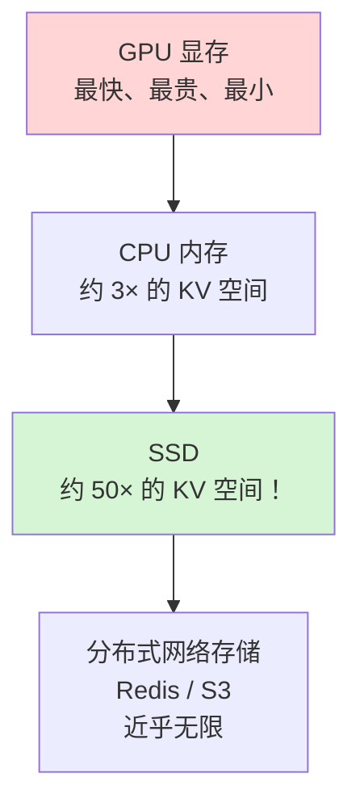

**卸载能带来多少空间**（Figure 7-22）：
- 卸载到 **CPU 内存** → 约 **3 倍** KV Cache 空间。
- 卸载到 **SSD** → **多达 50 倍**！意味着能缓存 50 倍的长上下文文档，或在一个实例里缓存多个租户的文档。
- **而且如果你本就在同一实例上自托管，这些额外空间基本是"白送"的**（复用现成的 CPU 内存 / 硬盘）。
- 还能加 **Redis / S3** 等分布式网络存储，空间几乎无限。

**卸载怎么省钱**（Figure 7-22 左右对比）：
- **左（纯前缀缓存）**：没有哪个模型实例的 GPU 显存能装下多于一个长上下文的 KV Cache，被迫**创建多个副本 + 路由层**来保证命中。
- **右（KV 卸载，仅用 CPU 内存 3 倍空间）**：**一个模型实例就能存下全部 4 个长上下文 KV Cache**，按请求前缀在 GPU/CPU 内存间高效换入换出。
- 如果单个长上下文/单租户的请求填不满一个实例，这直接意味着 **4 倍成本节省——每年省下数百万美元**。

#### ② KV 缓存压缩（KV Cache Compression）

高负载、传输带宽受限时，**压缩 KV Cache** 很有用。方法有两类：
- 传统的 **KV 缓存量化**；
- 更先进的 **CacheGen（LMCache 出品）**：根据 KV Cache 的**分布**把它编码成更紧凑的**比特流表示**，在保质量的同时大幅缩小体积。

**压缩的连锁好处**：更小的 KV Cache → 传输更快、网络延迟更小、解压时 GPU 开销也不大；配合卸载 → GPU 显存腾出更多空间 → 能上更大 batch（涨吞吐）、缓存更多上下文。

#### ③ KV 缓存混合（KV Cache Blending）—— 专治 RAG

**这些 KV 管理技术不代表 RAG 过时了。** 真实企业数据可能巨大、高度动态、范围无界，RAG 在"访问更大知识库、检索更新鲜信息、可解释可溯源引用"上仍有优势。

**CacheBlend（LMCache 支持）** 是一个 RAG 专用的巧思：**把不同 RAG 块的 KV Cache 合并**，减少"每次都从头重算所有 RAG 块"的开销。

**为什么不能简单拼接？（Figure 7-23，本节最需理解的地方）**

> 回想：**LLM 只能匹配前缀**。不同的 RAG 块、或者相同块的**不同顺序**，都会导致 KV Cache 未命中、被迫全量重算。

你可能想"那把各块的 KV Cache 直接**拼接（concatenate）**不就行了？"——**不行！** 原书讲透了原因：

🔬 **自注意力（self-attention）不只是"在每个缓存内部各算各的"，它还要学习缓存之间的"跨 token 交互"。** 简单拼接会**丢掉这些跨块关系**，破坏模型本可以学到的上下文依赖。Figure 7-23 的例子：把两个 query 拼在一起（b）完美工作，但把两个 KV Cache 拼在一起（c）就不行——因为后面的 token 必须能注意到**它之前的全部历史**。

**CacheBlend 的解法**：为了既复用非前缀的 KV Cache，又不破坏跨 token 关系，它**选择性地重算一小部分 KV Cache**（默认 **15%**，可用 `blend_recompute_ratios` 调）来恢复跨块关系。这样**避免了全量重算的成本，质量只掉一点点**。

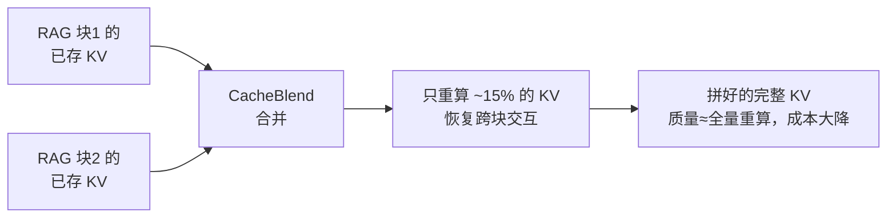

### 7.4.4 🛠️ 动手：LMCache + CPU 卸载

原书用 `Qwen/Qwen3-14B` 演示两种配置：vLLM + LMCache（本地 CPU 卸载）vs 原味 vLLM（默认前缀缓存）。

**开启 LMCache + CPU 卸载的命令：**

```bash
export LMCACHE_USE_EXPERIMENTAL=True
export LMCACHE_LOCAL_CPU=True
export LMCACHE_MAX_LOCAL_CPU_SIZE=150.0
# 取消注释可测试 SSD 卸载
# export LMCACHE_CHUNK_SIZE=2048
# export LMCACHE_LOCAL_DISK="local_kv_cache/"
# export LMCACHE_MAX_LOCAL_DISK_SIZE=120.0

# 启动 vllm server
nohup vllm serve Qwen/Qwen3-14B \
  --disable-log-requests \
  --kv-transfer-config '{
     "kv_connector": "LMCacheConnectorV1",
     "kv_role": "kv_both"
   }' \
  --max-model-len 40960 \
  --gpu-memory-utilization 0.9 \
> vllm.log 2>&1 &
```

逐行讲解：

- `LMCACHE_USE_EXPERIMENTAL=True`：开启 LMCache 实验特性总开关。
- `LMCACHE_LOCAL_CPU=True`：**启用本地 CPU 内存做 KV 卸载**。
- `LMCACHE_MAX_LOCAL_CPU_SIZE=150.0`：给 CPU 卸载分配 **150 GB** 空间（就是那个"3 倍空间"的来源）。
- 注释掉的三行是 **SSD 卸载** 的配置（chunk 大小、磁盘路径、磁盘上限 120 GB），想测 SSD 就取消注释。
- `--kv-transfer-config` 里 `"kv_connector": "LMCacheConnectorV1"` 让 vLLM 接入 LMCache；`"kv_role": "kv_both"` 表示这个实例既能读也能写 KV（收发两用）。
- `--max-model-len 40960`：支持约 40K 的长上下文（长上下文场景）。

### 7.4.5 📊 基准结果解读（Figure 7-24 ~ 7-27）

原书跑了两组基准，结论极具指导性。

**基准一：30 个顺序请求，各有唯一前缀，然后倒序再来一遍。**

| 阶段 | 现象 | 原因 |
|---|---|---|
| **首轮（全冷，0 命中）** | LMCache **总是比原味 vLLM 慢** | KV 缓存处理的额外开销，此时无命中可享 |
| **第二轮前 9 个请求** | 两者**不相上下** | 都还在 GPU 显存里，都命中 |
| **第二轮第 10 个请求起** | 原味 vLLM 延迟**飙回冷启动水平**（6~7 秒）；LMCache 只需 **~1 秒** | vLLM 的老缓存被 LRU 淘汰、被迫重新 prefill；LMCache 从 CPU 内存取回（比 GPU 慢，但远快于全量重算） |

> 💡 **第一条实战铁律**（Figure 7-24）：**冷启动 0 命中时，LMCache 反而更慢。所以除非你预期负载有大量 KV 缓存命中，否则前缀短或请求很随机时，用不带 LMCache 的原味 vLLM 更好，应作为默认。**

> 💡 **第二条实战铁律**（Figure 7-25）：**一旦缓存超出 GPU 显存容量，原味 vLLM 就得重算（6~7 秒），而 LMCache 从 CPU 取回只要 1 秒——这就是分层卸载的价值。**

**基准二：用 `vllm bench` CLI，20 个不同长上下文请求，分三波：全冷顺序 → 全部命中顺序 → 5 并发。**

- 因为有 **20 个不同前缀**，vLLM 存不下全部 → 它的**中位 TTFT 远高于 LMCache**（Figure 7-26）。
- 加到 **5 并发**时差距更大：vanilla vLLM 被 KV 缓存空间卡死（同一块 GPU 显存要同时装 5 个并发请求的 KV Cache + 激活），能存的 KV 更少。
- **吞吐上最夸张**（Figure 7-27）：vanilla vLLM 被卡在约 **4700 tokens/s**，而 **LMCache 轻松应对高负载——吞吐约为 vLLM 的 16 倍！**

> 🔬 **本质**：KV 缓存卸载把"能缓存的上下文量"从"GPU 显存大小"这个硬天花板里解放出来。当你的负载是**长上下文 + 高命中 + 高并发**时，分层卸载不是锦上添花，而是数量级的差距（16×）。

---

## 🏛️ 全章总览：LLM 服务已是一座"分层大厦"

原书在小结里画了一个极其重要的"分层优化栈"图，把现代 LLM 服务的全貌收束成一座大厦。这是理解本章、也是面试时展现全局观的杀器：

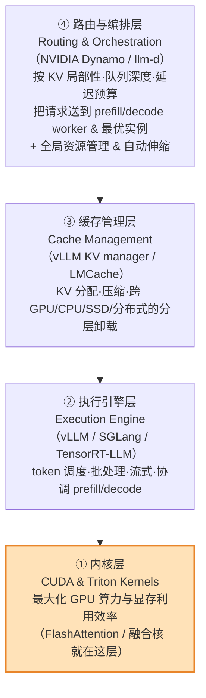

原书原话值得记住：

> **现代 LLM 服务早已超越"高效跑好单个模型实例"，而是一座层级化的栈。任何一层的瓶颈都会抹掉其他层的收益，所以要达到生产级性能，必须"各层协同调优"。** 对大规模运营 LLM 的组织而言，这种"系统级效率"不只是技术追求，它既是**用例的使能器**，也是**核心的经济护城河**。

### 补讲：FlashAttention / 内核级优化在服务里扮演什么角色？

原书把 **CUDA / Triton 内核层**放在大厦的**最底层**——它"最大化 GPU 算力与显存利用效率"，**FlashAttention 就活在这一层**。本章其他技术（投机解码、TP/PP、PD 分离、KV 卸载）都是"更高层"的编排与调度，但**它们最终都要落在这层内核上执行**。这里补齐"内核级优化如何服务于本章各技术"的连接：

🔬 **第一性原理：GPU 是"内存墙"机器，不是"算力墙"机器。** 一张 H100 的 BF16 算力约 990 TFLOPS，而 HBM 带宽约 3.35 TB/s——每从显存读 1 字节，硬件期望你做近 300 次浮点运算才能不让算力单元闲着。注意力的 softmax、逐元素操作等算子远达不到这个"算术强度"，于是被**带宽**卡死。内核级优化的本质就一句话：**减少对最慢那层内存（HBM）的往返。**

- **FlashAttention**：用 **tiling（分块）+ online softmax（在线 softmax）**，让注意力**永不把 N×N 的大注意力矩阵落地到 HBM**——只在片上高速 SRAM 里分块计算。**它是 prefill（长上下文）性能的命门**：本章 7.2.3 说"长上下文时 prefill 已经 compute-bound、投机解码没用"，而 FlashAttention 正是让这个 compute-bound 的 prefill 尽可能快的底层武器。
- **Flash-Decoding**：FlashAttention 的 decode 变体，把注意力沿 **KV 序列维度切分并行**，专治"decode 时 batch 小、KV 长、GPU 并行度不足"的问题——**直接服务于本章的 decode 阶段和 PD 分离里的 decode 实例**。
- **融合核（fused kernels）**：把多个逐元素算子塞进一个 kernel，省掉往返 HBM 的搬运——**KV 缓存量化/压缩的解压、投机解码的验证逻辑**，落地时都靠融合核减少访存。

> 💡 **一句话把本章和内核层缝起来**：**本章讲的是"怎么把大模型摊开、怎么调度两阶段、怎么管好 KV"——这些是"战略"；而 FlashAttention / Flash-Decoding / 融合核是"战术兵器"，是这些战略最终在单卡上高效落地的基础。任何一层拖后腿，上层再聪明也白搭。**

> 🔗 想深挖内核层，本仓库有完整的 `attention-optimization/`（FlashAttention v1/v2/v3、Flash-Decoding、online softmax、GPU 内存层级共 9 篇），以及 `ai-infra-architecture/12_算子与编译_融合_Triton_torchcompile_图优化.md`。这块内容之深，值得单独一个系列。

---

## 📌 小结

本章我们把 LLM 大规模服务的"重装武器"过了一遍，回到那条主线——**每个技术都在权衡「算力 · 显存 · 带宽 · 通信」**：

| 技术 | 用什么换什么 | 何时用 | 何时别用 |
|---|---|---|---|
| **投机解码** | 用空闲算力（草稿）换 ITL/整体延迟 | 延迟敏感、batch 小、memory-bound、可预测生成（JSON/agent 尤其配 n-gram） | 长 prefill 已 compute-bound、大 batch、追求吞吐时 |
| **DP** | 用"每卡装完整模型"换吞吐/高可用 | 请求量大、要横向扩 | 单实例已够 |
| **TP** | 用频繁卡间通信换"装大模型+低延迟" | 节点内有 NVLink | 只有 PCIe（跑不动） |
| **PP** | 用流水线气泡换"极少通信" | 跨节点（互联慢） | 节点内有 NVLink（TP 更优） |
| **EP** | 用路由/分发复杂度换"服务 MoE 大模型" | MoE 架构（DeepSeek-V3 等） | 稠密模型 |
| **chunked prefill** | 在单机上把两阶段调和 | 长 prompt、要平滑 ITL | 短 prompt |
| **PD 分离** | 用架构复杂度+KV 传输开销换"两阶段独立优化+省钱" | 大模型+重负载+精细调 TTFT/ITL | 小模型/轻负载 |
| **KV 卸载/压缩/混合** | 用 CPU/SSD 空间+少量重算换"缓存容量+低 TTFT+省钱" | 长上下文+高命中+高并发 | 冷启动/短前缀/随机请求（原味 vLLM 更好） |

**三条最该带走的直觉**：

1. **能不拆就不拆**：单卡 > 单节点多卡 > 多节点。因为"显存带宽 ≫ 互联带宽"，每一次跨越都在付通信税。先量化、先换大卡，实在不行再并行。
2. **两阶段脾气不同是万恶之源，也是优化之门**：prefill 算力密集、decode 带宽密集。chunked prefill 在单机调和它们，PD 分离干脆拆开它们。
3. **没有默认最优配置**：投机解码、LMCache、PD 分离**都可能在错误场景下更慢**。一切以你的数据集、负载、SLA/SLO 为准，**多跑基准、看逐位置接受率/命中率再决定**。

这也是全书 LLM 优化三章（第 5、6、7 章）的收官：从"为什么难"，到"单卡怎么优化"，再到"多层协同的大规模优化"。下一章（第 8 章）我们将钻进 **vLLM 等服务框架的内部**，看这座"分层大厦"在真实开源代码里是怎么搭起来的。

---

## 🔗 延伸阅读

**本书其它章（《Hands-On LLM Serving》系列）：**
- 第 4 章 —— RAG 与 CAG 的完整讲解（本章 7.4 的前置）
- 第 5 章 —— 为什么 LLM 服务难：GPU/显存/带宽、intra-node vs inter-node 带宽对比（Table 5-3）
- 第 6 章 —— 单卡优化：连续批处理、PagedAttention、前缀缓存、量化、chunked prefill
- 第 8 章 —— LLM 服务框架：vLLM / TensorRT-LLM / SGLang / llama.cpp 深剖（本章"分层大厦"的落地）

**本仓库既有教程（交叉印证 & 深挖）：**
- `llm-inference/PD分离.md`、`ai-infra-architecture/01_PD分离架构_Prefill_Decode_Disaggregation.md` —— PD 分离的工业级实现
- `llm-inference/Mooncake.md` —— 月之暗面 Mooncake：PD 分离 + KV Cache 池化的生产系统
- `llm-inference/KV-Cache优化.md`、`ai-infra-architecture/07_KVCache深入_PagedAttention_前缀缓存_量化压缩.md` —— KV Cache 卸载/量化/压缩的原理
- `attention-optimization/`（9 篇）—— FlashAttention v1/v2/v3、Flash-Decoding、online softmax、GPU 内存层级：本章"内核层"的深挖
- `llm-inference/Flash-Decoding.md`、`llm-inference/FlashInfer.md` —— decode 阶段的内核级加速
- `ai-infra-architecture/09_推理引擎架构_连续批处理_调度_投机解码_chunked_prefill.md` —— 投机解码 + chunked prefill 的引擎视角
- `ai-infra-architecture/12_算子与编译_融合_Triton_torchcompile_图优化.md` —— 融合核 / Triton / 图优化
- `ai-infra-architecture/05_网络与通信_RDMA_NCCL_集合通信算法_拓扑.md` —— NVLink / InfiniBand / RDMA：本章多卡多机通信的底座
- `ultra-scale-playbook/book-guide/03_张量并行_TP_序列并行_SP.md`、`05_流水线并行_PP_...md`、`06_专家并行_EP_MoE.md` —— TP/PP/EP 在**训练**侧的深度对照（本章是**推理**侧）
- `llm-inference/vllm/`、`llm-inference/sglang/`、`llm-inference/tensorrt-llm/` —— 三大框架源码级资料，衔接第 8 章
