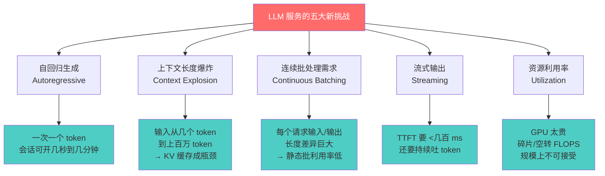
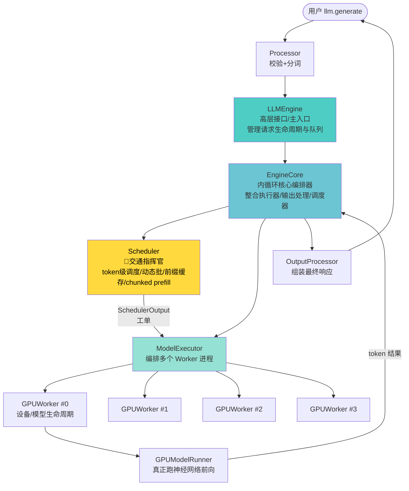
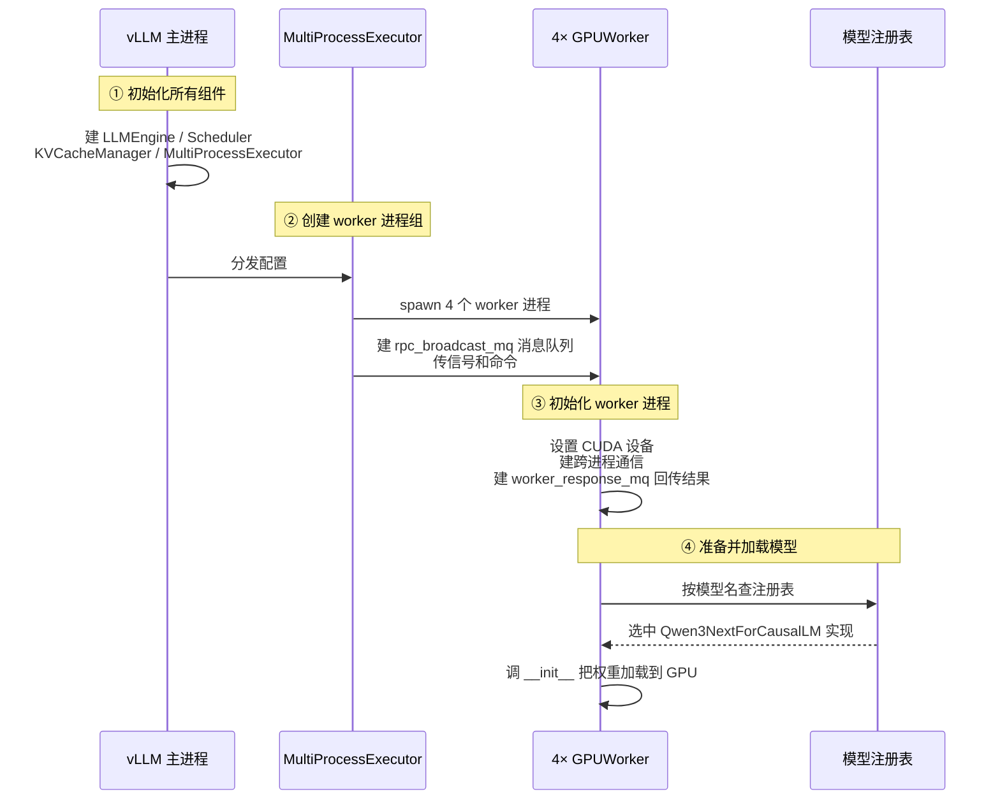
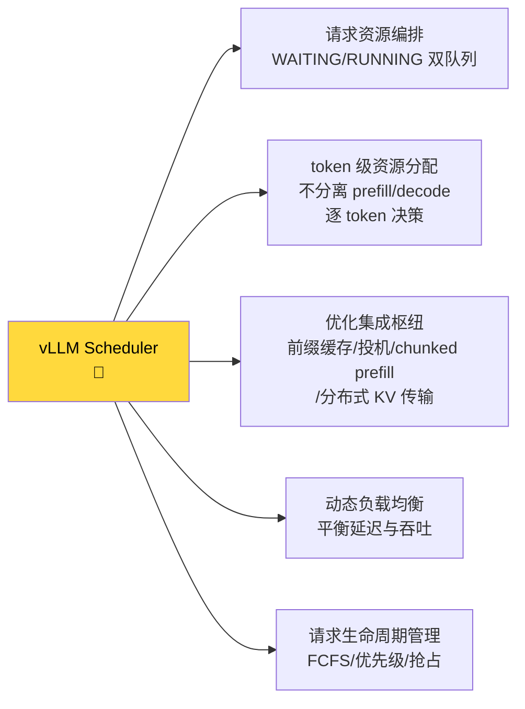
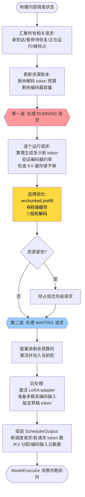
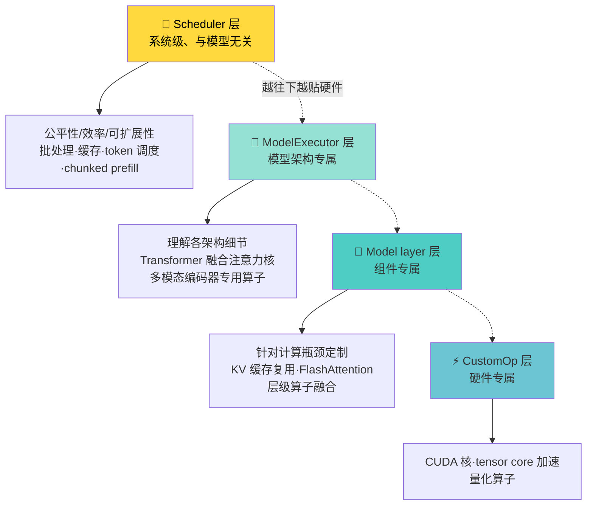
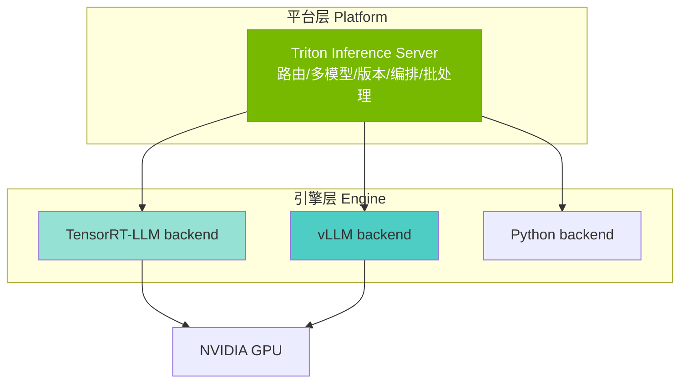
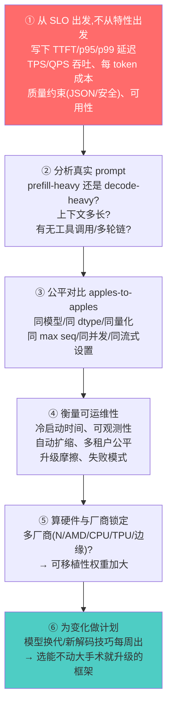

# 第 8 章 · LLM 服务框架（Serving Frameworks）🚀

> 本章对应《Hands-On LLM Serving and Optimization》原书第 8 章 "LLM Serving Frameworks"（PDF 第 291–312 页）。

---

## 🗺️ 本章地图：你在全书的哪个位置

前面几章我们像搭乐高一样，把 LLM 服务的"零件"逐个讲透了：

- **第 1~3 章** — 系统设计、服务实现（怎么把一个模型变成能接请求的 HTTP 服务）；
- **第 4~5 章** — 系统架构与部署（副本、路由、自动扩缩容）；
- **第 6~7 章** — 具体优化技术（**PagedAttention 分页 KV 缓存、连续批处理、量化、投机解码、chunked prefill、前缀缓存**……）。

本章是**"地基层"（foundation layer）**：把上面那些零件**真正落地执行**的软件——**服务框架（serving framework）**。你可以把前几章想成"发动机原理课"，本章就是"市面上有哪几款成熟发动机、各自怎么造、我该买哪款"。

原书聚焦四款主流开源框架：

| 框架 | 一句话定位 | 主战场 |
|---|---|---|
| **vLLM** | 应用最广、"开箱即用"的通用高吞吐引擎 | 云端在线服务（默认首选） |
| **TensorRT-LLM** | NVIDIA 官方、榨干 GPU 极限性能 | 全面押注 N 卡的生产集群 |
| **SGLang** | 结构化生成 + Agent + 多硬件 | JSON/正则约束、多步 Agent、多厂商机队 |
| **llama.cpp** | 极小体积、"哪都能跑"的本地推理 | 笔记本/边缘/隐私/离线 |

> ⚠️ 本章标题里提到的 **TGI（Text Generation Inference）** 和 **Triton Inference Server** 原书正文没有单列，但它们在工业界极其常见、面试也高频。本讲义会在原书四框架讲透之后，**额外补一节** 把 TGI / Triton 补齐，让你的对比表真正完整。这部分标注 🧩 表示"超出原书、由讲师补充"。

**读完本章你能会什么：**

1. 说清楚**为什么通用 ML 服务框架（TF Serving / TorchServe）伺候不了 LLM**——第一性原理级别。
2. **把 vLLM 的内部拆开讲**：LLMEngine → EngineCore → Scheduler → ModelExecutor → Worker → ModelRunner 一条链路，以及它的**四层优化哲学**。
3. 逐个说清 vLLM / TensorRT-LLM / SGLang / llama.cpp（+ TGI / Triton）在**调度、批处理、KV 设计**上的取舍。
4. 拿到一个真实业务，**按 SLO 而非 benchmark 选框架**，并知道怎么留"退出后路"。

下一章（第 9 章）会把这些优化技术和 vLLM 框架**真刀真枪调一遍**，本章是那一章的地基。

---

## 🔬 第一性原理：为什么 LLM 需要"专用"服务框架？

### 一、通用框架的世界观

在 LLM 出现之前，模型服务框架已经很成熟了——**TensorFlow Serving、TorchServe**，甚至通用推理平台 **NVIDIA Triton**。它们最初是为**图像识别、结构化数据推理**这类"传统深度学习负载"设计的。这类负载有三个特征：

- **输入短**（input size 小，一张图就那么大）；
- **张量形状固定**（fixed-shaped tensors，224×224 就是 224×224）；
- **延迟可预测**（一次前向传播，进去多久出来基本恒定）。

它们的**核心优化只有一招：批处理（batch processing）**——把 32 张图凑成一个 batch 一起算，摊薄开销。因为每张图算的步数一样多，凑批天然整齐。

### 二、LLM 把这三条假设全打破了

本书到这里你应该已经很清楚：**伺候 LLM 和伺候图像分类器是两个物种**。LLM 引入了一整套新挑战：



逐条拆解**是什么 / 为什么难**：

1. **自回归生成（Autoregressive generation）** — LLM **一次只吐一个 token**，下一个 token 依赖前面所有 token。图像模型进去一次就出结果；LLM 的一次"推理会话"可能持续**几秒到几分钟**。这意味着请求是**长命的、状态化的**，不是"一发子弹打完就走"。

2. **上下文长度爆炸（Context length explosion）** — 输入 prompt 从几个 token 到**几十万甚至上百万 token**。每个 token 在每层都会产生 Key/Value 向量并缓存起来（**KV cache**），供后续 token 做注意力。上下文越长，KV 缓存越吃显存——**KV 缓存的显存管理成了头号瓶颈**。

3. **连续批处理（Continuous batching）** — 请求之间输入/输出长度**天差地别**（有人问一句话，有人塞一篇论文）。传统的**静态批处理（static batching）**要等一个 batch 里所有请求都算完才能收下一批，短请求得陪着长请求空耗 → **GPU 严重欠利用**。

4. **流式要求（Streaming）** — 用户期待 **首 token 时间（TTFT, Time To First Token）在几百毫秒内**，而且要像打字机一样**连续吐字**。这是交互式产品的硬指标，传统"算完一次性返回"的模式不行。

5. **资源利用率（Resource utilization）** — GPU **极其昂贵**。因为显存碎片（fragmentation）或空闲 token 浪费掉的 GPU 浮点算力（FLOPS），在规模化时**完全不可接受**——一块 H100 一小时几美元，浪费 30% 就是烧钱。

> 🔬 **第一性原理总结**：传统框架的世界是"**同构、短命、无状态**"的批；LLM 的世界是"**异构、长命、有状态**"的流。前者只需批处理，后者需要**token 级调度 + 分页显存管理 + 流式执行**。这就是为什么必须有专用框架。

### 三、专用框架靠什么破局

为满足这些需求，涌现出一批**专用 LLM 服务框架**（vLLM / TensorRT-LLM / SGLang……），它们引入了前几章讲过的创新：

- **分页 KV 缓存（Paged KV Caching）** — 像操作系统虚拟内存那样把 KV 缓存切成固定大小的"页（block）"，消灭碎片；
- **连续批处理（Continuous Batching）** — 一个请求完成就立刻放它走、马上补新请求进来，GPU 永不空转；
- **LLM 专属量化（LLM-specific quantization）** — FP8/INT4 等；
- **投机解码（Speculative decoding）** — 用小模型"抢跑"生成草稿 token，大模型批量验证。

有了这些，我们能从现代加速器上**榨出更高吞吐、更低延迟**，效率远超通用框架——这就是它们成为主流的原因。

---

## 🌟 vLLM 深度拆解（原书重点）

原书之所以对 vLLM **单独深挖**，是因为它**应用最广**。理解 vLLM 的内部，你就有了评判所有其他框架的"标尺"。

### 8.1 vLLM 为什么这么火

vLLM 的核心是**分页 KV 缓存（paged KV caching）** + **连续批处理（continuous batching）**——两项创新**同时**大幅提升吞吐、降低延迟。此外它还支持量化、投机解码、流式响应、多卡与分布式执行。适配场景极广：交互式聊天机器人、RAG 系统、批量文本生成、多租户服务、实时应用。

大家喜欢 vLLM 的真正原因是它**"就是能跑"（just works）**：

- **久经沙场**（battle-tested）；
- **易集成**开源模型和自己微调的模型；
- **不需要深度系统调优**就能榨干 GPU 效率；
- **开箱即得**可预测的性能收益。

再加上**干净、可扩展的架构**——让它能快速吸收最新学术成果和工程优化——以及庞大活跃的社区，vLLM 不仅适配今天的挑战，也能随需求演进而进化。

> 💡 **实战心法**：很多团队的黄金组合是"**线上用 vLLM，本地开发用 llama.cpp**"。vLLM 是你 90% 情况下应该先试的默认选项。

### 8.2 两种使用方式：库模式 vs API 服务器

vLLM 为"单模型服务"优化——每个实例启动时加载**一个**模型。给你两种用法：

**① `LLM` 类（进程内库模式，in-process library）** — 纯 Python 本地接口，**离线推理**，不用单独起服务器或 Web API。适合你想把 vLLM 直接嵌进现有服务或批处理流程时。

```python
# 初始化 LLM 模型（库模式）
llm = LLM(
    model="Qwen/Qwen3-7B-Instruct",
    trust_remote_code=True,   # Qwen 使用自定义建模代码，必须允许远程代码
    dtype="float16",          # GPU 上用 float16 半精度
    max_model_len=32768,      # 最大上下文长度（prompt+生成 合计 token 上限）
    gpu_memory_utilization=0.8,  # 允许 vLLM 占用 80% 显存（其余留给激活/系统）
)
# 跑生成请求
outputs = llm.generate(prompts, sampling)
```

**逐行讲解：**
- `model=` 指定 HuggingFace 上的模型仓库名，vLLM 会自动下载。
- `trust_remote_code=True` — 有些模型（如 Qwen）带自定义 Python 建模代码，必须显式信任才会加载，**否则报错**。
- `dtype="float16"` — 权重和计算用半精度（16 位浮点），显存减半、速度更快。⚠️ 老一些的 Qwen 建议 bfloat16 更稳，float16 在极端值下可能溢出。
- `max_model_len=32768` — 这是**单请求 prompt + 输出的 token 总上限**，直接决定单条最大 KV 缓存需求。设太大浪费显存，设太小截断长文。
- `gpu_memory_utilization=0.8` — vLLM 启动时会**预分配**这个比例的显存做 KV 缓存池。设 0.9 能塞更多并发请求，但留给激活值和其他进程的余量变小，**OOM 风险升高**。

**② API Server（OpenAI 兼容）** — 独立 HTTP 服务器，用于多客户端、生产环境、流式，直接对接 Chat/Completions API。

```bash
# 启动 vLLM API 服务器
vllm serve Qwen/Qwen3-7B-Instruct \
  --trust-remote-code \
  --dtype bfloat16 \
  --max-model-len 32768 \
  --gpu-memory-utilization 0.8

# 用 OpenAI 兼容 API 调用（curl）
curl http://localhost:8000/v1/chat/completions \
  -H "Content-Type: application/json" \
  -d '{
    "model": "Qwen/Qwen3-7B-Instruct",
    "temperature": 0.7,
    "max_tokens": 256,
    "stream": true
  }'
```

**关键点**：`"stream": true` 开启**流式返回**——服务器会用 SSE（Server-Sent Events）一个 chunk 一个 chunk 地推 token，前端能做打字机效果，TTFT 体验大幅改善。库模式给你**精细控制、低开销、易集成自有服务栈**；API 服务器给你**开箱即用的网络端点**用于更广部署。

### 8.3 vLLM 内部架构：一条请求的完整旅程

vLLM 的内部组件可以画成这样一条链路（对应原书 Figure 8-1 / 8-2）：



逐个组件**是什么 / 干什么**：

#### 🔹 LLMEngine 与 EngineCore

- **LLMEngine** — vLLM 推理系统的**高层接口与主入口**。它是用户直接打交道的公共 API，内部协调所有底层组件。它把所有组件整合成一个数据流清晰的系统，处理**同步和异步**两种服务场景，管理整个请求生命周期（编排请求处理流水线、管理请求队列和配置）。

- **EngineCore** — 推理引擎的**中央编排器（central orchestrator）**。它整合了**模型执行器（ModelExecutor）、输出处理器（OutputProcessor）、调度器（Scheduler）**，是协调所有主组件、管理完整请求处理流水线的**"内循环"（inner loop）**。

> 💡 **类比**：LLMEngine 是"前台+总调度室"，EngineCore 是"发动机的曲轴"——你调 `generate()`，LLMEngine 收单排队，EngineCore 一圈一圈转，每转一圈就吐出一批新 token。

#### 🔹 Scheduler（调度器）——全章的灵魂

**Scheduler 是整条推理流水线的"交通指挥官"（traffic controller）**。它管理计算资源，编排跨请求的 token 计算。核心职责是：**在互相竞争的请求之间，高效分配有限的计算资源**（GPU 显存、KV 缓存块、处理能力），同时**最大化吞吐、维持公平访问**。

从优化视角看，**Scheduler 负责"系统级、与模型无关（model-agnostic）"的优化策略**：token 级调度、动态批处理、前缀缓存、chunked prefill。而**与模型有关（model-specific）的优化**放在 ModelExecutor 和 GPUWorker 里。

Scheduler 把它的执行计划打包成一个数据结构 **`SchedulerOutput`**，它就是调度器给执行器的**"工单（work order）"**，包含执行一批请求所需的全部信息。可以理解为它对 ModelExecutor 说：

> "这里有一批请求要处理。每个请求该算多少 token，它们的输入数据和参数是什么，给它们分配了哪些显存块，有什么特殊处理需求——都在这张工单上。"

ModelExecutor 拿到 `SchedulerOutput` 后，据此准备真正的 GPU batch（扁平化的 input IDs、注意力元数据、KV 缓存块），执行模型前向传播，再把结果送回调度器进入下一轮迭代。

#### 🔹 ModelExecutor / GPUWorker / GPUModelRunner——三层执行架构

因为 vLLM 把每个模型放在**独立进程（或进程组）**里跑，它用**三层架构**处理跨进程通信、编排分布式 worker 组、以及各种前向执行细节：

| 层级 | 角色 | 类比 |
|---|---|---|
| **ModelExecutor** | 编排、管理多个 worker 进程 | 车间主任 |
| **GPUWorker** | 每个 worker 进程里的接口，管设备/模型生命周期 | 工位班组长 |
| **GPUModelRunner** | 真正执行、运行神经网络 | 拧螺丝的工人 |

这种**关注点分离（separation of concerns）**让每层专注自己的职责，同时保持接口干净。

### 8.4 模型初始化流程（多进程 Worker）

因为 vLLM 支持单卡、单机多卡、多机集群多种执行方式，初始化逻辑看起来会有点复杂。原书用一个**最常见的生产配置**举例：多进程（MP）设置初始化一个 LLM。

```python
llm = LLM(
    model="Qwen/Qwen2.5-7B-Instruct",
    tensor_parallel_size=4,          # 指定 4 个 worker（张量并行切成 4 份）
    distributed_executor_backend="mp"  # 用多进程模型执行器（单机多卡）
)
```

> `tensor_parallel_size=4` 表示把模型的每一层**横切成 4 份**，分给 4 块 GPU 并行算（张量并行 Tensor Parallelism）。`mp` 后端用于**单机多卡**；如果要**跨机器**，改成 `"ray"` 后端。

初始化四步（对应原书 Figure 8-3）：



**逐步讲解：**

1. **在 vLLM 主进程初始化所有组件** — 创建 `LLM()` 实例时，传入定义模型配置、资源使用、服务优化参数。`LLM` 类在主进程里初始化所有主组件（LLMEngine、Scheduler、KVCacheManager、MultiProcessExecutor），并把配置分发到对应模块。

2. **创建 worker 进程组** — `MultiProcessExecutor` spawn 出 4 个 worker 进程做分布式执行，并建立 `rpc_broadcast_mq` 消息队列，向 worker 传递信号和命令。

3. **初始化 worker 进程** — 每个 worker 跑一个 `GPUWorker`，负责执行推理、与 executor 通信。GPUWorker 设置 CUDA 设备、建立跨进程通信、在本进程内加载并初始化模型。它维护一个 `worker_response_mq` 队列，把推理结果送回 ModelExecutor。

4. **准备并加载模型** — `GPUModelRunner` 按配置的模型名定位正确的模型实现。示例里它在 vLLM 内部**模型注册表（model registry）**中查 Qwen，选中 `Qwen3NextForCausalLM` 实现，调其 `__init__` 把权重加载到 GPU。

### 8.5 生成请求的执行流程

模型加载好后就能服务了。调 `llm.generate(prompts, sampling_params)` 时，vLLM 内部干这五件事（对应 Figure 8-4）：

1. **Processor** 校验并预处理原始输入，做成 `Request` 对象（含对 prompt 分词/tokenize）。
2. **LLMEngine** 跑一个执行循环，反复调用 **EngineCore** 处理请求。EngineCore 让 **Scheduler** 决定下一批要跑的请求和要处理的 token。Scheduler 在这一步应用大量优化（分页注意力、连续批处理）。
3. **EngineCore** 把 Scheduler 排好的 `SchedulerOutput` 传给 **MultiProcessExecutor**。
4. **MultiProcessExecutor** 把请求下发给 worker 进程，委托 GPU worker 跑模型前向、计算给定 token——**真正的模型执行发生在这里**。
5. **EngineCore** 把模型输出交给**输出处理器**，生成给用户的最终响应。

> 🔑 **关键洞察**：从这条流水线你能看清 vLLM 的分工——**实际模型执行和模型专属优化在 GPUWorker，通用的 LLM 服务规划和优化由 Scheduler 编排**。这个分工是理解整个框架的钥匙。

### 8.6 Scheduler 深入：token 级调度的精髓

Scheduler 是 vLLM 执行生成请求的中央交通指挥官。原书从**塑造它的五个关键考量**讲起：



逐条精讲：

1. **请求资源编排（Request resource orchestration）** — Scheduler 编排请求从到达到完成的整个生命周期。它把请求组织进 **WAITING（等待）** 和 **RUNNING（运行）** 两个队列，根据可用资源（GPU 显存、KV 缓存块、token 预算）**动态决定**派发哪些请求。它还要处理投机解码、前缀缓存、多模态输入等复杂资源分配挑战。目标：**最大化吞吐 + 维持并发公平**。

2. **token 级资源分配与调度（Token-level scheduling）** — 这是 vLLM 的**核心强项**。它用**统一的 token 级调度**，而**不分离 prefill 和 decode 阶段**。不像"请求级调度器"把每个请求当整体，vLLM 的调度器**逐 token 运作**：每个调度步，它决定**每个请求能处理多少 token**，同时遵守全局约束（最大 batch size、显存上限）。相比请求级调度，token 级提供**更细粒度的控制**，通过分配 token 预算来平衡各请求的竞争需求。

3. **优化集成枢纽（Optimization integration hub）** — Scheduler 是**与模型无关的性能优化**的中央集成点。它协调前缀缓存（复用已算状态）、投机解码（预测未来 token）、chunked prefill（高效处理长序列）、分布式 KV 缓存传输（多卡执行）。关键是它**自适应地决定何时、如何**应用这些优化——依据请求特征、资源可用性、整体系统状态，确保每项优化都提升性能而不引入冲突。

4. **动态负载均衡（Dynamic load balancing）** — 监控系统资源和请求特征，实时决策以平衡**延迟和吞吐**。它响应动态事件——到达、完成、抢占、资源受限——重新评估该跑哪些请求、处理多少 token、何时应用优化。

5. **请求生命周期管理（Request lifecycle management）** — 监控每个请求：从进入 WAITING 队列，到 RUNNING 队列执行，到最终完成。它应用高级调度策略如 **FCFS（先到先服务）** 或 **优先级排序**决定执行顺序。资源紧张时，可以**抢占（preempt）低优先级请求**，把容量重分配给高优先级任务。

#### 请求调度工作流

Scheduler 的核心任务：**为每个到来的生成请求确定合适的 token 数量，交给模型做前向传播**。整个逻辑（对应 Figure 8-5）：



**核心流程复述：**

- **构建初始调度状态** — 汇集新到达、待恢复、正在运行、被抢占的请求；更新资源账本（剩余解码 token 预算、剩余编码器容量）。这个初始状态**框定后续所有决策**。
- **两波分优先级派发算力**：
  - **先处理 RUNNING 请求** — 因为它们已占着 KV 缓存块、有活跃的生成时间线。逐个算需生成多少新 token、验证编码器约束、检查 KV 缓存够不够继续。这里应用 chunked prefill（不用一步编码完整个长 prompt）、前缀缓存（跨请求复用相同前缀的 KV 块）、投机解码（提前生成草稿 token）。资源受限就抢占低优先级工作。
  - **再处理 WAITING 队列** — 能塞进剩余 token 和编码器预算的请求被激活、并入当前执行批。它们优先级低，但同样享受上述优化。
- **后处理阶段** — 追踪每个请求要激活哪些 LoRA adapter、为多模态任务准备编码器输入、敲定投机解码的草稿 token。目标是把所有调度决策整合成一个干净、可执行的计划。
- **组装 `SchedulerOutput`** — 列出新调度的请求、每个请求分到的 token 数、整批的总 token 数，加上模型执行器需要的元数据（KV 缓存分配、编码器输入、多模态路由信息）。

#### 🔬 核心代码：闭合"计算差距"

原书给出了调度的**核心代码**。为支持与模型无关的 token 级调度，Scheduler 在 token 层运作：先遍历 running 队列、再遍历 waiting 队列，决定从哪个请求取多少 token 进下一次前向，同时保证总 token 数不超模型上限。

实现上，Scheduler 力图**最小化 `num_computed_tokens`（已处理 token 数）和 `num_tokens_with_spec`（要处理的总 token，含 prompt、输出、投机 token）之间的差距**。**这个"闭合差距"的目标，驱动了整条优化策略链**。

```python
while req_index < len(self.running) and token_budget > 0:
    request = self.running[req_index]
    num_new_tokens = (request.num_tokens_with_spec +
                      request.num_output_placeholders -
                      request.num_computed_tokens)
```

**逐行讲解：**
- `while req_index < len(self.running) and token_budget > 0:` — 只要 running 队列还有请求**且 token 预算没花光**，就继续分配。`token_budget` 是这一步全局能算的 token 总量，是硬约束。
- `request = self.running[req_index]` — 取当前请求。
- `num_new_tokens = num_tokens_with_spec + num_output_placeholders - num_computed_tokens` — 算这个请求**这一步需要新算多少 token**：目标总量（含投机 token 和输出占位）减去已经算过的。这个差值就是"还欠多少"。

> 📦 **分离优先级与优化（原书专门开框强调）**：在 vLLM 调度中，**请求队列决定处理顺序（谁先谁后）**，而 **`num_computed_tokens` 与 `num_tokens_with_spec` 的比较决定每个请求这步能执行多少 token（各分多少）**。这种**"请求优先级"与"token 级调度"的清晰分离**，让 Scheduler 能在统一框架里组合多样的优先级策略和 LLM 执行优化，既维持并发公平又高效用资源。

#### 应用模型优化技术：两个代码实例

调度期间 vLLM 整合了第 6、7 章的多项优化（chunked prefill、前缀缓存、引导解码/grammar-constrained FSM、PD 分离等）。原书给了两个片段：

**① Chunked prefill（分块预填充）** — 确保单个请求这步执行的新 token 数不超过配置的 prefill 分块大小：

```python
if (0 < self.scheduler_config.long_prefill_token_threshold \
                  < num_new_tokens):
   num_new_tokens = self.scheduler_config.long_prefill_token_threshold
```

**讲解**：如果一个长 prompt 的 `num_new_tokens` 超过阈值 `long_prefill_token_threshold`，就**把它砍到阈值大小**。这样超长 prompt 会被**切成几块、分多步 prefill**，避免一步吃满 GPU 把其他请求饿死——这正是 chunked prefill 的机制。

**② 前缀缓存（Prefix caching）** — 复用本地或远程缓存中已算好的 KV 块：

```python
# 获取已缓存的 token
if request.num_computed_tokens == 0:
    # 拿本地缓存 token
    new_computed_blocks, num_new_local_computed_tokens = \
          self.kv_cache_manager.get_computed_blocks(request)
    # 拿外部缓存 token
    if self.connector is not None:
        num_external_computed_tokens, load_kv_async = (
            self.connector.get_num_new_matched_tokens(
                request, num_new_local_computed_tokens))
```

**讲解**：`if request.num_computed_tokens == 0` 表示这是**全新请求**（一个 token 都没算过）。这时先问 `kv_cache_manager` **本地有没有算过相同前缀的 KV 块**（比如系统提示词大家都一样，第一次算完全存下，后面所有请求直接复用）。如果配了 `connector`（分布式 KV 连接器），再去**外部/远程缓存**匹配。命中就直接搬用，**跳过重复计算**——省下的 prefill 算力非常可观。

> 💡 **面试高频**：前缀缓存为什么值钱？多轮对话、共享系统提示、Few-shot 示例——这些**公共前缀**在海量请求里重复出现。缓存一次、复用千万次，直接砍掉大块 prefill FLOPS，TTFT 和吞吐双赢。

### 8.7 vLLM 的分层优化哲学 🏛️

原书点出 vLLM **最重要的优化哲学之一**：**优化必须发生在正确的层级（optimization must happen at the right level）**。

为什么？因为 **LLM 演进极快**——新架构、新注意力机制、硬件驱动的执行技巧**几乎每月出现**。一个像 vLLM 这样的系统**不能把优化硬编码**给某个模型家族或硬件类型；它必须提供**灵活又统一**的框架，支持任意架构和模型大小，同时仍能交付系统级吞吐、公平、资源效率。

难点在于：**没有单独哪一层能解决所有优化需求**。有些优化**通用于所有模型**（批处理、缓存），有些绑定**模型架构**（注意力核），有些甚至绑定**具体硬件指令**（tensor core）。

为化解这个张力，vLLM 用**四层优化策略**：



| 层 | 负责什么 | 例子 |
|---|---|---|
| **Scheduler** | 系统级、**与模型无关**的优化 | 公平性、效率、可扩展性；批处理、缓存、token 调度 |
| **ModelExecutor** | **模型架构专属**优化 | Transformer 的融合注意力核；多模态编码器的专用算子 |
| **Model layer** | **组件专属**优化（注意力层、FFN 块） | KV 缓存复用、FlashAttention、层级算子融合 |
| **CustomOp** | **硬件专属**优化 | CUDA 核、tensor-core 加速、量化算子 |

**这套分层策略的两大好处：**
1. **避免把模型细节塞进 Scheduler**，同时允许在需要处深度特化。
2. **让 vLLM 面向未来（future-proof）**：新架构或新硬件出现时，优化可以**塞进正确的层**，不用重设计整个系统。

> 🔬 **第一性原理**：这本质是**软件工程的"关注点分离"应用到性能优化**。把"变化速度不同"的东西隔离——系统调度逻辑稳定、模型架构月月变、硬件核年年更——各层独立演进，互不污染。这是 vLLM 能持续吸收新技术还不崩的根本原因。

---

## 🏭 TensorRT-LLM：NVIDIA 的极限性能方案

**TensorRT-LLM** 是 NVIDIA 官方的开源库，用于在 **NVIDIA GPU** 上做高性能 LLM 推理。

**工作方式**：从一个模型 checkpoint 出发，**构建高度调优的 TensorRT（TRT）引擎**，并提供 Python/C++ 运行时和现代服务能力：

- **in-flight batching**（TRT-LLM 版的连续批处理）；
- 分页 KV 缓存；
- 投机解码；
- **多精度量化（FP8/FP4/INT4/INT8）**；
- 张量并行 / 流水线并行。

它和 NVIDIA 服务生态**深度集成**——尤其是 **Dynamo** 和 **Triton**。

```python
llm = LLM(model="Qwen/Qwen3-7B")
# 示例 prompts
prompts = [
    "Hello, my name is",
    "The capital of France is",
    "The future of AI is",
]
# 采样参数
sampling_params = SamplingParams(temperature=0.8, top_p=0.95)
# 跑生成请求
for output in llm.generate(prompts, sampling_params):
    print(f"Prompt: {output.prompt!r}, Generated text: {output.outputs[0].text!r}")
```

> 注意这里的 `LLM` 高层 API 用起来**和 vLLM 几乎一模一样**——这是好事，说明高层接口正在收敛。差别全在底层：TRT-LLM 会先**编译出一个 TRT 引擎**（ahead-of-time 编译），这个编译过程较慢，但换来运行时的极致性能。

**核心目标**：**演示 NVIDIA GPU 对 LLM 的最大实用性能**，展示如何充分利用 Tensor Cores 和 CUDA 核。

**最适合谁**：**已经全面标准化到 NVIDIA 硬件和服务技术栈**、追求生产环境**顶级效率和吞吐**的组织。

> ⚠️ **常见坑**：TRT-LLM 的"引擎编译"是双刃剑。①换模型/换精度/换并行度都要**重新编译引擎**，迭代慢；②引擎和特定 GPU 型号、TRT 版本绑定，**换硬件要重编**。它是"用灵活性换极致性能"，和 vLLM"用一点性能换灵活性"是相反的取舍。

---

## 🧬 SGLang：结构化生成 + Agent + 多硬件

**SGLang** 是较新的入局者，瞄准**结构化生成（structured generation）和 Agent 应用**。它是开源、高性能的 LLM 和视觉语言模型（VLM）服务框架。

**设计哲学**：**协同设计（co-design）**——把快速的**后端运行时**（核、缓存、调度）和灵活的**前端语言与 API**（OpenAI 兼容 + 原生）一起设计，让生成**更快、更可控**。

**招牌特性**（GitHub 上可查）：

- **RadixAttention** — 用**基数树（radix tree）**做跨调用的前缀/KV 复用（比 vLLM 的前缀缓存更结构化）；
- 连续批处理；
- 分页注意力 / KV；
- **投机解码（EAGLE-2/3）**；
- chunked prefill；
- **结构化输出（JSON / regex / EBNF）**；
- **多 LoRA 批处理**；
- 并行模式（张量 / 流水线 / 专家 / 数据）。

```python
# 加载 Qwen3 模型
llm = sgl.Engine(model_path="Qwen/Qwen3-7B")
prompts = [
    "Hello, my name is",
    "The president of the United States is",
    "The capital of France is",
    "The future of AI is",
]
sampling_params = {"temperature": 0.8, "top_p": 0.95}
# 跑生成请求
outputs = llm.generate(prompts, sampling_params)
for prompt, output in zip(prompts, outputs):
    print("===============================")
    print(f"Prompt: {prompt}\nGenerated text: {output['text']}")
```

**硬件覆盖比 TRT-LLM 广得多**：官方文档和示例覆盖 **NVIDIA（H100/Blackwell）、AMD Instinct、CPU、TPU、Jetson Orin、Ascend（昇腾）** ——对**多厂商机队（multi-vendor fleets）**很有吸引力。

**功能定位**：可视为 **vLLM 的同级对手（peer）**——强调基础设施可移植性、广泛开源模型支持、激进的性能优化（连续批处理、投机解码、前缀/KV 复用）、横向扩展路由、以及对 **Agent 式多步 prompt** 的强支持。

**实战对比**：SGLang 性能**有竞争力**——**某些负载上甚至更好**；而 vLLM 目前**社区和生态更大**。

> 💡 **面试高频·RadixAttention**：vLLM 的前缀缓存是"精确前缀匹配"，SGLang 的 RadixAttention 用**基数树组织所有已缓存序列**，能自动发现并复用**任意公共前缀**（包括分叉的对话树）。在 Agent、多轮、树搜索类负载里，共享结构多，RadixAttention 复用率更高——这是 SGLang 主打 Agent 的技术根基。

---

## 💻 llama.cpp：哪都能跑的本地推理

**llama.cpp** 是精简的开源 **C/C++ 推理栈**，目标是在**几乎任何机器**上高效运行现代开源权重 LLM——从笔记本、工作站到本地服务器和边缘设备。

**关键设计：**

- 模型打包成 **GGUF 格式**（通常用仓库脚本从 HuggingFace checkpoint 转换）；
- 通过内置的 **OpenAI 兼容 HTTP 服务器**提供服务，或用小 CLI 工具做实验和 benchmark；
- **最小依赖、快速启动**；
- **激进的整数量化**（8/6/5/4 位，甚至 2 位）；
- **可移植的 CPU/GPU 后端**：CPU（带 SIMD 指令），加上可选加速器 Metal（Apple）、CUDA/ROCm、Vulkan。

**核心气质**："**runs anywhere**"（哪都能跑）+ **极小运维足迹**。它的首要目标是**最小配置**下交付最先进的本地推理，在**低成本/低功耗设备**上（离线和云端）都有扎实性能。

对比其他三个框架（vLLM/TRT-LLM/SGLang **首先为数据中心 GPU 的高吞吐低延迟优化**——多租户批处理、高级调度、大规模部署），**llama.cpp 优先考虑可移植性、简单性、成本效率，而非绝对峰值吞吐**。

```python
from llama_cpp import Llama

# 从 HuggingFace 加载 Qwen 模型（GGUF 格式），在 CPU 上跑
llm = Llama.from_pretrained(
    repo_id="Qwen/Qwen3-8B-GGUF",
    filename="*Q8_0.gguf",   # 选 8 位量化的 GGUF 文件
    verbose=False
)

# 高层 API 跑生成
output = llm(
    "Q: Name the planets in the solar system? A: ",  # prompt
    max_tokens=32,         # 最多生成 32 个 token
    stop=["Q:", "\n"],     # 遇到 "Q:" 或换行就停（避免模型自问自答）
    echo=True              # 输出里回显 prompt
)

# 聊天补全 API 示例
output = llm.create_chat_completion(
    messages=[
        {"role": "system",
         "content": "You are an assistant who perfectly describes images."},
        {"role": "user",
         "content": "Describe this image in detail please."},
    ]
)
```

**逐行要点：**
- `filename="*Q8_0.gguf"` — `Q8_0` 是**8 位量化**版本，精度损失极小、体积约为 FP16 的一半。想更小可选 `Q4_K_M`（4 位）等。
- `stop=["Q:", "\n"]` — **停止词**，模型生成到这些就立即停，防止它继续编下一个问题。
- `echo=True` — 把 prompt 一起返回，方便拼接完整对话。

**三大典型场景：**
1. **本地开发** — 在自己机器上跑内置 OpenAI 兼容服务器，复用现有客户端（如 RAG 和搜索系统）。
2. **私有 / 本地部署助手** — 数据**全留在 VPC 或设备边界内**，不出门。
3. **边缘推理** — 笔记本、台式机、Apple Silicon、小服务器——靠激进的 2~8 位量化和可移植 CPU/GPU 后端。

> 🔗 想把 llama.cpp 通过 REST API 暴露？可以用 **Ollama**——一个包在 llama.cpp（有时也包别的后端如 Mistral.cpp、RWKV runner）外面的高层框架，让本地 LLM 使用**简单、一致、对开发者友好**。

**为什么本地推理的目标不一样**：不是每个 LLM 应用都需要高吞吐服务。本地（设备端/本地边缘）推理时目标转向：

- 优化**延迟和响应性**，而非全机队 TPS；
- **低并发**（常常单用户）让大批处理和复杂调度器**价值降低**；
- **足迹和成本**（内存、算力、功耗）成为主要约束；
- **隐私和离线可靠性**是一等公民需求。

> 🔬 **第一性原理·为什么 llama.cpp 不需要复杂调度器**：连续批处理、token 级调度、抢占……这些都是为了**在多个竞争请求间高效分配 GPU** 而生的。单用户本地场景**没有竞争请求**——一次就一个人在用，凑批凑不起来、抢占没对象。所以 llama.cpp 果断砍掉这套复杂度，换来极小体积和"哪都能跑"。**架构复杂度应该匹配问题复杂度**，这是最优雅的工程判断。

---

## 🧩 补充：TGI 与 Triton（超出原书，讲师补齐）

> 本章标题点名了 TGI 和 Triton，但原书正文未单列。这两者在工业界极常见、面试高频，这里补齐让对比完整。仓库里也有对应目录：`llm-inference/huggingface-tgi/`、`llm-inference/triton/`。

### 🤗 TGI（Text Generation Inference）

**是什么**：HuggingFace 官方的生产级 LLM 服务框架，用 **Rust（路由/服务层）+ Python（模型层）** 写成。曾是 vLLM 之前的事实标准，现在也吸收了 PagedAttention、连续批处理、FlashAttention、投机解码等。

**取舍/定位：**
- 和 HuggingFace 生态**深度绑定**——`transformers`、`text-generation-inference` Docker 镜像开箱即用，模型下载/权重管理丝滑。
- Rust 写的路由层**并发和稳定性好**，生产可观测性（Prometheus/OpenTelemetry）齐全。
- ⚠️ 曾因**许可证变动**（一度改为限制商用的 HFOIL，后又改回 Apache-2.0）让部分团队观望；纯性能上现在**通常略逊于 vLLM/SGLang**，但胜在 HF 官方支持和生态一致性。

**选它的场景**：已重度使用 HuggingFace 全家桶、想要官方支持和最省心的模型接入。

### 🔷 Triton Inference Server

**是什么**：NVIDIA 的**通用推理服务器**——注意它**不是 LLM 专用框架**，而是一个**"服务外壳（serving shell）"**。它能挂载多种**后端（backend）**：TensorRT、TensorRT-LLM、Python、ONNX Runtime、PyTorch、vLLM……

**取舍/定位：**
- **多模型、多框架统一管理**：一个 Triton 实例可以同时服务多个模型、多个框架，做 **model ensemble（模型编排流水线）**、动态批处理、并发模型执行。
- 它是**"平台层"而非"引擎层"**——真正跑 LLM 时，Triton 底下常挂 **TensorRT-LLM backend** 或 **vLLM backend**。
- 提供企业级特性：模型版本管理、A/B、指标、gRPC/HTTP、K8s 集成。

> 💡 **关键辨析（面试常问）**：**Triton 和 vLLM 不是同一层的东西，别拿来直接比。** vLLM/TRT-LLM/SGLang/llama.cpp 是**推理引擎（engine）**——真正算模型的；Triton 是**服务平台（serving platform）**——负责路由、多模型、版本、批处理编排，底下挂引擎。生产里常见组合是 **"Triton（平台）+ TensorRT-LLM（引擎）"**。原书把 Triton 归到"通用平台"那一类正是这个道理。



---

## 📊 六大框架横向对比总表

把原书四框架 + 补充的 TGI/Triton 拉平了对比（⭐ 越多越强/越突出）：

| 维度 | **vLLM** | **TensorRT-LLM** | **SGLang** | **llama.cpp** | **TGI** 🧩 | **Triton** 🧩 |
|---|---|---|---|---|---|---|
| **层级** | 引擎 | 引擎 | 引擎 | 引擎（本地） | 引擎+服务 | **平台**（挂引擎） |
| **主语言** | Python | C++/Python | Python | C/C++ | Rust+Python | C++ |
| **KV 设计** | PagedAttention 分页 | 分页 KV | RadixAttention 基数树 | 连续 KV（无需分页） | PagedAttention | 依赖后端 |
| **批处理** | 连续批处理 | in-flight batching | 连续批处理 | 单/小批为主 | 连续批处理 | 动态批（编排层） |
| **调度粒度** | **token 级**（不分 prefill/decode） | in-flight | token 级 | 简单（低并发） | 迭代级 | 后端决定 |
| **量化** | AWQ/GPTQ/FP8/INT | **FP8/FP4/INT4/INT8** ⭐ | AWQ/FP8/EAGLE | **2~8 位 GGUF** ⭐ | bitsandbytes/GPTQ/AWQ | 依赖后端 |
| **结构化输出** | 支持（guided decoding） | 支持 | **JSON/regex/EBNF** ⭐ | 基础 | 支持 | — |
| **投机解码** | ✅ | ✅ | ✅ EAGLE-2/3 ⭐ | 部分 | ✅ | 依赖后端 |
| **硬件** | N卡为主 | **仅 NVIDIA** | **N/AMD/CPU/TPU/Jetson/昇腾** ⭐ | **几乎全平台** ⭐ | N/AMD/部分 | NVIDIA 生态 |
| **易用性** | ⭐⭐⭐⭐⭐ 开箱即用 | ⭐⭐ 需编译引擎 | ⭐⭐⭐⭐ | ⭐⭐⭐⭐⭐ 极简 | ⭐⭐⭐⭐ | ⭐⭐⭐ 需配置 |
| **峰值性能(N卡)** | ⭐⭐⭐⭐ | ⭐⭐⭐⭐⭐ ⭐ | ⭐⭐⭐⭐ | ⭐⭐（本地） | ⭐⭐⭐ | 取决后端 |
| **社区/生态** | ⭐⭐⭐⭐⭐ 最大 | ⭐⭐⭐⭐ | ⭐⭐⭐⭐ 快速增长 | ⭐⭐⭐⭐⭐ | ⭐⭐⭐⭐ HF 官方 | ⭐⭐⭐⭐ N 官方 |

### 调度 / 批处理 / KV 设计取舍一句话总结

- **vLLM**：token 级统一调度（不分 prefill/decode）+ PagedAttention 分页 KV。取舍 = **牺牲一点极致性能，换最大灵活性和易用性**。默认之选。
- **TensorRT-LLM**：ahead-of-time 编译成 TRT 引擎 + in-flight batching + 深度 CUDA/tensor-core 优化。取舍 = **牺牲灵活性和迭代速度，换 N 卡上的极致 token/美元**。
- **SGLang**：RadixAttention 基数树前缀复用 + 前后端协同设计。取舍 = **在结构化/Agent/多分叉负载上复用率更高，多硬件更可移植**。
- **llama.cpp**：砍掉复杂调度，连续 KV + 激进量化。取舍 = **放弃数据中心峰值吞吐，换"哪都能跑"和极小足迹**。
- **TGI**：迭代级批处理 + HF 生态深绑。取舍 = **性能略逊，换 HF 官方支持和最省心接入**。
- **Triton**：不是引擎是平台，挂载各种后端做多模型编排。取舍 = **多一层抽象和配置成本，换多模型/多框架的统一生产管理**。

---

## 🎯 怎么选框架：工作负载优先，不是 benchmark 优先

原书给出的核心原则振聋发聩：

> **选那个最匹配你的服务级目标（SLO）、硬件、运维现实的框架——不是 benchmark 最花哨的那个。一句话：workload first, not hype（工作负载优先，别追热点）。**

### 推荐的六步评估法



逐步拆解：

1. **从 SLO 出发，不从特性出发** — 先写下延迟目标（TTFT、p95/p99）、吞吐（TPS/QPS）、每 token 成本、质量约束（结构化 JSON、安全）、可用性。**指标先行，特性后置**。
2. **分析真实 prompt** — 弄清是 **prefill-heavy（输入长、prompt 重）** 还是 **decode-heavy（输出长、生成重）**；上下文多长；有没有工具调用和/或多轮链。这决定了哪些优化对你真正有用。
3. **做苹果对苹果的对比** — 各竞品用**同一模型、同 dtype/量化、同 max sequence、同 batch/并发、同流式设置**。⚠️ 否则 benchmark 全是噪声。
4. **衡量可运维性** — 冷启动时间、可观测性、自动扩缩行为、多租户公平、升级摩擦、失败模式。
5. **算清硬件和厂商锁定** — 如果用多厂商（NVIDIA/AMD/CPU/TPU/边缘），**可移植性权重很重**。
6. **为变化做计划** — 模型换代、新解码技巧**每周都在发生**，选那些**不用大手术就能升级**的框架。

### 原书的最终推荐（结论）

| 你的需求 | 选它 | 理由 |
|---|---|---|
| **最快上生产 + 广模型覆盖 + Python 原生** | **vLLM** | 强基线性能、连续批处理、最大社区生态 |
| **Agent/多步工作流 + 严格 JSON/regex 输出 + 多厂商可移植** | **SGLang** | 前缀/KV 复用、投机解码、横向扩展路由 |
| **全押 NVIDIA + 规模化追求 peak token/美元** | **TensorRT-LLM** | 一流 Triton/Dynamo 集成、深度 CUDA/tensor-core 优化 |
| **本地/私有/边缘 + 极小足迹 + 默认隐私** | **llama.cpp** | GGUF 2~8 位量化、可移植 CPU/GPU 后端 |

> 📌 **实战黄金组合**：很多团队**线上服务用 vLLM，本地开发用 llama.cpp**——覆盖 80% 场景。特殊需求（边缘部署 / N 卡极致优化 / 严格 grammar 输出 / Agent 管线）才导向 TRT-LLM 或 SGLang。

### ⚠️ 评估框架时保持开放心态（原书专门开框强调）

> LLM 服务**演进极快**——新架构、新核、新调度器、新量化方案、新运行时特性**每月落地**。框架必须同样快地适配。
>
> 作为服务工程师，我们**每 3~6 个月**重新评估各框架，选当前最合 SLO 和硬件现实的那个。我们还需要**建一个框架抽象层（framework abstraction layer）**，并**有清晰的退出计划（exit plan）**，让我们能换框架而不重写应用。
>
> 目标不是**加冕一个永久赢家**——而是保持灵活，让系统能**乘上下一波浪潮，而不是被它掀翻**。

> 💡 **面试高频·怎么答"你会选哪个框架"**：❌ 别说"vLLM 最快所以选它"。✅ 正确姿势——"**先看 SLO 和真实 prompt 特征，做 apples-to-apples 对比，再考虑硬件锁定和迭代成本；同时在应用和框架之间加一层抽象，保证 3~6 个月能无痛切换。**" 这才是资深工程师的答案。

---

## 📌 小结

本章我们完成了从"优化技术"到"落地引擎"的跨越：

1. **🔬 为什么需要专用框架** — 通用 ML 服务栈（TF Serving/TorchServe/Triton 原生）**伺候不了 LLM**，因为它们缺 LLM 专属能力：**token 级调度、KV 缓存管理、长上下文内存处理、流式优先执行**。LLM 是"异构、长命、有状态"的流，不是"同构、短命、无状态"的批。

2. **🌟 vLLM 深挖** — 架构链路（LLMEngine→EngineCore→Scheduler→ModelExecutor→Worker→Runner）、**请求调度与优先级**（WAITING/RUNNING 双队列 + token 级"闭合差距"调度 + 前缀缓存/chunked prefill 代码）、以及**四层优化哲学**（Scheduler/ModelExecutor/Model layer/CustomOp，把系统级调度和模型/核级特化分开）。

3. **🏭 三个互补框架** — **TensorRT-LLM** 在 N 卡上榨取峰值效率；**llama.cpp** 做轻量本地/私有/边缘；**SGLang** 做 Agent 多步工作流 + 结构化输出 + 多硬件。（+ 补充 **TGI** 和 **Triton**，辨清"引擎层 vs 平台层"。）

4. **🎯 选型核心** — **框架选择是上下文相关的（contextual）**。多数团队"线上 vLLM + 本地 llama.cpp"起步，特殊需求（边缘/N 卡优化/严格 JSON/Agent 管线）再导向 TRT-LLM 或 SGLang。随生态演进，**保持框架无关（framework-agnostic）**：定期做框架调研、偏好可移植接口、随时能换组件——让服务栈能适应变化的业务和技术需求。

**一句话记住整章**：优化技术是"招式"，服务框架是"内功心法把招式串起来"；而选框架的心法是——**workload first, not hype，并永远留一条退路。**

---

## 🔗 延伸阅读

**本书其它章节：**
- 第 6~7 章 · 优化技术（PagedAttention、连续批处理、量化、投机解码、chunked prefill、前缀缓存）——本章框架都是这些技术的载体。
- 第 9 章 · 用 vLLM 实战调优——把本章的框架和上面的优化技术**真刀真枪调一遍**，是本章的直接续集。

**仓库既有教程（可交叉印证）：**
- `llm-inference/vllm/` — vLLM 源码与实战。
- `llm-inference/tensorrt-llm/`、`llm-inference/tensorrt/` — TensorRT-LLM 与 TensorRT。
- `llm-inference/sglang/` — SGLang 实战。
- `llm-inference/huggingface-tgi/` — TGI 部署。
- `llm-inference/triton/` — Triton Inference Server。
- `llm-inference/lmdeploy/`、`llm-inference/lightllm/`、`llm-inference/RTP-LLM.md`、`llm-inference/NanoFlow.md` — 更多推理框架横向拓展。
- `llm-inference/KV-Cache优化.md`、`llm-inference/PD分离.md`、`llm-inference/Flash-Decoding.md`、`llm-inference/GuidedGeneration.md`、`llm-inference/Mooncake.md` — 本章涉及的关键技术专题。
- `ai-infra-architecture/09_推理引擎架构_连续批处理_调度_投机解码_chunked_prefill.md` — 推理引擎架构（连续批处理/调度/投机解码/chunked prefill）的架构级深挖。
- `ai-infra-architecture/07_KVCache深入_PagedAttention_前缀缓存_量化压缩.md` — PagedAttention 与前缀缓存原理。
- `ai-infra-architecture/08_量化与低精度_INT8_INT4_FP8_GPTQ_AWQ_SmoothQuant.md` — 各框架量化方案的底层原理。

**外部资源（原书推荐）：**
- Aleksa Gordić，《Inside vLLM: Anatomy of a High-Throughput LLM Inference System》——深挖 vLLM 内部的优秀博文。
- vLLM 官方仓库 `Scheduler.py`——想读懂 guided decoding、PD 分离等优化实现的最佳起点。
