# 第 9 章 · LLM 优化实战(LLM Optimization in Practice)

> 对应原书:*Hands-On LLM Serving and Optimization*（Chi Wang, Peiheng Hu）第 9 章，pp. 293–313。
> 本篇是「逐章精讲」系列的收官实战章。前面几章讲的是**单点技术**（量化、KV Cache、投机解码、分布式并行……），这一章把它们**拧成一条完整的优化流水线**，用真实模型（Qwen3-14B）、真实框架（vLLM）、真实硬件（AWS L40S / A100）跑出来给你看。

---

## 🗺️ 本章地图：你现在站在哪、读完能会什么

**这章在全书的位置**：全书前 8 章像是「兵器库」——第 5 章讲硬件与互联（NVLink/PCIe）、第 6 章讲量化、第 7 章讲 KV Cache / LMCache / 投机解码、第 8 章讲分布式服务。第 9 章不再引入新兵器，而是教你**当一个真正的调优工程师**：怎么拿到一台 GPU，怎么设计压测流量，怎么读懂指标，怎么一步步逼近「这台机器上这种流量的最优配置」。

**优化是一个移动的靶子（moving target）**。原书开篇第一句就点破了本章的世界观：

> *"Optimization is a moving target: in different environments, the 'best' strategy changes."*
> （优化是一个移动靶：环境不同，「最优」策略就不同。）

没有放之四海而皆准的「最优配置」。同一个模型，换一块 GPU、换一种流量，最优解可能完全相反（本章后面 g6e vs p4d 的反直觉结果就是活证据）。所以本章教的**不是一组魔法参数，而是一套方法论**。

**读完这章你将能够**：

1. 拿到一台陌生 GPU，用 `nvidia-smi` 3 秒读出它适不适合、瓶颈在哪；
2. 针对你的业务流量（chatbot / RAG / 批处理）设计**有代表性**的压测数据集；
3. 分清 TPS / TTFT / TPOT / ITL 这几个指标各自量的是什么、哪个对应 prefill、哪个对应 decode；
4. 用 `vllm bench serve` 跑出 baseline，再用量化 / chunked prefill / 投机解码逐个验证收益；
5. 判断「加卡到底有没有用」——什么时候该纵向扩展（分布式），什么时候该横向扩展（多副本）；
6. 记住 5 大权衡（trade-off）和一堆血泪踩坑，避免过度调参。

> 🔬 **第一性原理**：LLM serving 优化的本质，是在**固定的硬件预算**下，把「算力（FLOPs）」和「显存带宽（GB/s）」这两种稀缺资源，尽可能多地花在**真正产出 token** 上，而不是浪费在等待、重算、通信、padding 上。本章所有技巧都可以还原成这一句话。

---

## 🎯 9.0 先定目标：我们到底在优化什么？

在动手前，原书先钉死了一个**明确、可量化**的优化目标——这是整个方法论的第一课，也是最容易被新手跳过的一步。

**本实验的目标**：最大化 `Qwen/Qwen3-14B` 在**在线服务（online serving）**场景下的 **token 吞吐（token throughput）**，即单位时间内处理尽可能多的 token。

为什么选吞吐做目标？原书给了一个非常「工程 + 商业」的理由：

> *"Higher token throughput directly translates to lower serving costs, since processed tokens form the basis of most LLM pricing models."*

💡 **一句话说透**：几乎所有 LLM API 都按 token 计费（输入 token + 输出 token）。同一张卡，吞吐翻倍 = 单位 token 成本减半 = 你的毛利翻倍。所以吞吐不是虚指标，它**直接等于钱**。

### ⚠️ 吞吐 vs 延迟：不总是同向的

新手常有个误解：「优化就是让它更快，吞吐和延迟一起变好」。**大部分时候确实如此**（比如减少冗余计算、提高 batching 效率，两个指标一起改善），但在某些流量下，**峰值吞吐和最小延迟是天生冲突的**。

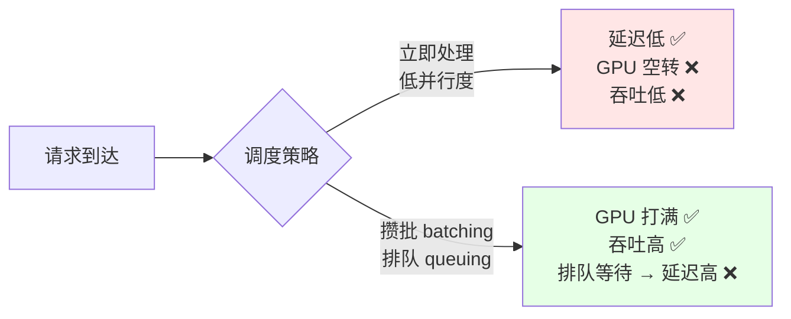

- **追吞吐**：靠 batching / 排队，把请求攒成大批喂给 GPU，硬件利用率高 → 但请求要排队等 → **单请求延迟上升**。
- **追延迟**：请求一到就处理，减少并行 → 硬件吃不饱 → **整体吞吐下降**。

原书给的实践准则（务必记住）：

> **优先提升吞吐，同时把延迟控制在可接受范围内。**（Prioritize throughput while keeping latency within an acceptable range.）

即：不是无脑追极限吞吐，而是「在延迟 SLA 不被打破的前提下，把吞吐拉到最高」。交互式应用（chatbot）更看重延迟，离线批处理更看重吞吐——这条主线会贯穿全章。

---

## 📋 9.1 优化计划总览：8 步走通一遍

原书把整个实战拆成 **8 个步骤**，这是本章的骨架。先鸟瞰全局，再逐个钻进去。

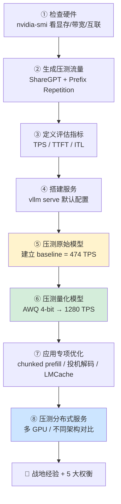

| 步骤 | 做什么 | 核心产出 |
|:---:|:---|:---|
| ① 检查硬件 | 看 GPU 显存、带宽、算力、NVLink | 知道这台机器的物理天花板 |
| ② 生成流量 | 设计代表性数据集 | 压测结果才有意义 |
| ③ 定义指标 | 选 TPS / TTFT / ITL | 不同配置可横向对比 |
| ④ 搭建服务 | `vllm serve` 起服务 | 确认模型能加载、KV Cache 有多大 |
| ⑤ 压 baseline | 默认配置跑一遍 | **基准线**（一切改进的参照系） |
| ⑥ 压量化模型 | AWQ 4-bit 再跑 | 量化对显存/吞吐的真实收益 |
| ⑦ 专项优化 | 按流量特征选技术 | prefill-heavy 用缓存，decode-heavy 用投机解码 |
| ⑧ 分布式 | 多卡对比 | 建立「加卡到底有没有用」的直觉 |

> 💡 **面试高频**：如果面试官问「给你一个新模型和一台 GPU，你怎么做 serving 优化？」——直接把这 8 步背出来，尤其强调「**先建 baseline 再谈优化**」和「**先搞清瓶颈再选技术**」。这两句话是资深工程师和调参侠的分水岭。

下面逐步钻进去。运行的例子是 `Qwen/Qwen3-14B` + vLLM，硬件是 AWS EC2 `g6e.2xlarge`（单张 NVIDIA L40S）。

---

## 🖥️ 9.2 Step 1：检查 GPU 硬件——`nvidia-smi` 是你的第一条命令

**是什么**：`nvidia-smi`（NVIDIA System Management Interface）是 NVIDIA 官方的命令行监控工具，实时查看 GPU 状态。**为什么第一步就是它**：在 benchmark 或部署前，它几乎总是你敲下的第一条命令——确认 GPU 被识别、配置正常、当前空闲。

它能告诉你 4 类信息：

- ✅ 可用 GPU、显存、温度
- ✅ GPU 利用率、正在跑的进程
- ✅ 驱动版本、CUDA 版本
- ✅ 诊断性能 / 资源瓶颈

### 🔍 nvidia-smi 输出里，资深工程师专盯这 4 处

原书用 Figure 9-1 圈出了关键字段，逐个讲透：

| 字段 | 看什么 | 为什么重要 |
|:---|:---|:---|
| **CUDA / 驱动版本** | 版本号 | 必须和你选的 serving 框架（vLLM）兼容，否则起不来 |
| **Performance State（性能态）** | `P8` = 空闲；`P0`/`P1` = 满速 | 跑起来后应看到 P0/P1；若还在 P8，说明 GPU 没吃到活 |
| **Power / GPU 利用率** | 功耗与 util% | 反映 serving 引擎「喂饱」GPU 的程度 |
| **Memory usage** | 已用/总显存，如 `0MiB / 46068MiB` | L40S 总显存约 **46 GB**，此时空闲 |

> 🔬 **第一性原理·怎么用功耗+利用率诊断瓶颈**（原书原话，极其精辟）：
> - **有负载但利用率低** → **batching 或调度效率低**（GPU 在等活干）。
> - **功耗高但吞吐低** → **显存带宽瓶颈 或 kernel 效率低**（GPU 在空转搬数据，没产出）。
>
> 这两句是「读 nvidia-smi 断病因」的黄金法则，值得刻进脑子。

### 只查你关心的字段

`nvidia-smi` 支持用 `--query-gpu` 精确输出：

```bash
nvidia-smi --query-gpu=name,compute_cap,memory.free,memory.used,memory.total \
   --format=csv
```

输出：

```
name,        compute_cap, memory.free [MiB], memory.used [MiB], memory.total [MiB]
NVIDIA L40S, 8.9,         45469 MiB,         0 MiB,             46068 MiB
```

**逐字段读**：
- `name = NVIDIA L40S`：本次实验的主角单卡。
- `compute_cap = 8.9`：计算能力（compute capability）8.9，对应 Ada Lovelace 架构，支持 FP8 等新特性——决定了你能用哪些加速 kernel。
- `memory.free = 45469 MiB`：约 44.4 GB 空闲。
- `memory.total = 46068 MiB`：约 **46 GB 总显存**。这个数字后面会反复用来算「模型 + KV Cache」的显存账。

💡 **实战**：脚本化部署时，用 `--query-gpu ... --format=csv` 把结果喂给自动化流程判断（够不够显存装模型），比人肉看输出可靠得多。

---

## 🚦 9.3 Step 2：生成压测流量——数据集选错，全盘皆输

**这一步是整章最容易被忽视、却最决定成败的一步**。原书原话:

> *"Dataset selection is critical to model serving optimization. ... the benchmark dataset must accurately reflect the expected usage patterns of the deployed model."*

### 🔬 为什么数据集这么关键？prefill-heavy vs decode-heavy

整个优化过程，本质是「针对特定流量把配置调到最优」。而**不同流量吃的资源完全不同**：

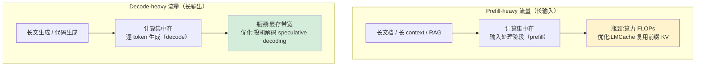

- **长输入为主（prefill-heavy）**：大部分算力花在读入 prompt。
- **长输出为主（decode-heavy）**：大部分算力花在一个个吐 token。

**两者的最优策略完全不同**。如果你拿一个 decode-heavy 的数据集去调 prefill-heavy 的服务，调出来的参数在真实流量上会翻车。所以：**压测数据集必须精确反映线上真实使用模式**。

### 本实验用的两个互补数据集

Qwen3 的目标场景是 **chatbot / 对话**，输入输出长度相对均衡，用户可能问重复/追问性问题。于是选了两个数据集：

| 数据集 | 性质 | 用来测什么 |
|:---|:---|:---|
| **ShareGPT** | 真实对话数据（用户与 LLM 的真实交互记录） | 逼近真实终端流量，测**交互式服务性能与用户体验** |
| **Prefix Repetition** | 合成数据（每条 prompt 以公共前缀开头 + 重复/相似后缀） | 测模型的**重复偏置**与服务系统的**缓存复用能力** |

**ShareGPT** 覆盖多样的对话结构和语言风格，是最接近「真实用户流量」的近似。
**Prefix Repetition** 是人造的、专为「测缓存」设计的：因为是合成的，你能**精确控制**前缀长度、后缀长度、唯一前缀的数量——**前缀越少 → prompt 之间重复越多 → 缓存复用压力越强**。

### 用 inspect_dataset.py 先看清数据长啥样

原书写了个辅助脚本 `inspect_dataset.py`，先「体检」数据集，再压测。这是好习惯——**你得先知道 prompt 有多长、输出有多长，才能解释后面的压测结果**。

```bash
# 从 ShareGPT 数据集抽 100 条来看统计
python3 inspect_dataset.py \
   --dataset-name sharegpt \
   --dataset-path ShareGPT_V3_unfiltered_cleaned_split.json \
   --model Qwen/Qwen3-14B \
   --num-prompts 100 \
   --save-samples
```

**逐参数讲解**：
- `--dataset-name sharegpt`：用哪个数据集。
- `--dataset-path ...json`：ShareGPT 原始 json 路径。
- `--model Qwen/Qwen3-14B`：用哪个模型的 tokenizer 来算 token 长度（不同模型分词不同，token 数会不一样）。
- `--num-prompts 100`：抽 100 条做统计样本。
- `--save-samples`：把样本存到 `sharegpt_samples.json` 方便检查。

输出的统计（**读懂这些数字，是解释后面吞吐的前提**）：

```
=== Prompt Length Distribution ===   （输入长度分布）
Min: 5    Max: 817    Mean: 232.60    Median: 141.50    Std: 241.42
=== Output Length Distribution ===   （输出长度分布）
Min: 4    Max: 771    Mean: 220.61    Median: 164.50    Std: 210.23
```

- **输入均值 ~233，输出均值 ~221**：输入输出长度**基本均衡**——正好符合对话场景，验证了数据集选得对。
- **均值 > 中位数（233 vs 141）**：分布右偏，有少量超长 prompt 拉高均值（Max 达 817）。
- **标准差很大（241）**：长度波动剧烈——这会让 batching 更难（长短请求混在一起，短的要等长的）。

原书还画了 prompt 长度直方图（histogram），一眼看出绝大多数 prompt 集中在 5–95 token 这个短区间，长尾稀疏：

```
   5-  95 tokens: *********************************************  ← 绝大多数在这里
  95- 185 tokens: ********
 185- 275 tokens: *********
 275- 365 tokens: **************
 ...
 726- 817 tokens: *******   ← 稀疏长尾
```

### 生成 Prefix Repetition 数据集

```bash
python inspect_dataset.py \
   --dataset-name prefix_repetition \
   --model Qwen/Qwen3-14B \
   --num-prompts 50 \
   --prefix-repetition-prefix-len 256 \    # 前缀长度 256 token
   --prefix-repetition-suffix-len 256 \    # 后缀长度 256 token
   --prefix-repetition-num-prefixes 5 \    # 只有 5 种唯一前缀 → 高重复度
   --prefix-repetition-output-len 128 \    # 输出固定 128 token
   --save-samples
```

**关键旋钮 `--prefix-repetition-num-prefixes 5`**：只用 5 种前缀，意味着 50 条 prompt 里同一前缀被大量复用 → 制造**强缓存复用**的流量。这就是「合成数据可精确控制」的威力。

### 用 vLLM 自带的 `bench serve` 发压测流量

真正发流量用的是 vLLM 官方压测工具 **`vllm bench serve`**。它能配：总 prompt 数、请求速率、流量爬升模式（ramp-up）、最大并发数，并**自动收集延迟和吞吐指标**。

```bash
vllm bench serve \
     --backend vllm \
     --base-url "http://localhost:8000" \
     --dataset-name sharegpt \
     --dataset-path ShareGPT_V3_unfiltered_cleaned_split.json \
     --num-prompts 2000 \        # 发 2000 条 prompt
     --request-rate 10 \         # 每秒 10 个请求（模拟中等负载）
     --burstiness 1.0 \          # 突发度=1.0，泊松到达（真实流量特征）
     --max-concurrency 10 \      # 最大并发 10
     --save-result --append-result \
     --result-filename test_serve_results.txt \
     --model Qwen/Qwen3-14B
```

**逐参数**：
- `--num-prompts 2000` + `--request-rate 10`：以 10 req/s 的速率发 2000 条，模拟真实对话流量下的中等负载。
- `--burstiness 1.0`：突发度。=1.0 表示请求到达服从**泊松分布**（真实世界流量的经典模型）；<1 更突发（成簇到达），>1 更均匀。
- `--max-concurrency 10`：同时最多 10 个请求在处理，限制并发以模拟真实客户端行为。

> ⚠️ **常见坑**：很多人压测时把 `request-rate` 设成无穷大（一次性灌满），得到的吞吐好看但**毫无意义**——线上流量不是这样来的。用 `--request-rate` + `--burstiness` 模拟真实到达模式，压测结果才能指导生产。

---

## 📊 9.4 Step 3：定义评估指标——你量的到底是什么？

指标是优化的「尺子」。**在跑压测前就把主指标钉死**，才能保证不同配置之间可**一致对比**。原书 Table 9-1 给了完整指标体系：

### 完整指标体系（Table 9-1）

| 类别 | 主要指标 |
|:---|:---|
| **吞吐 Throughput** | 总 token 吞吐 (TPS)、输出 token 吞吐 (TPS)、请求吞吐 (req/s) |
| **延迟 Latency** | TTFT、TPOT、ITL（均值 mean + 尾延迟 P99） |
| **资源利用** | GPU 利用率、显存占用 |
| **负载画像** | 输入/输出 token 比、并发数、请求速率 |
| **可靠性/成本** | 错误率、成本效率 |

本实验为了聚焦，只盯 **4 个指标**（2 个吞吐 + 2 个延迟）:

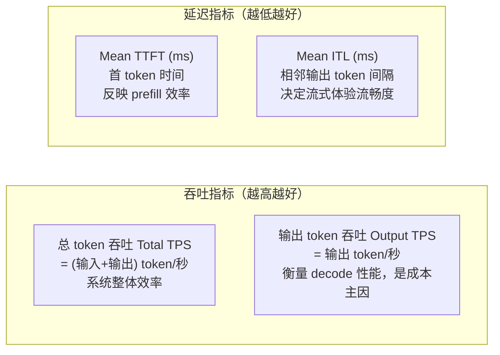

**逐个讲透**：

| 指标 | 全称 | 量的是什么 | 对应哪个阶段 |
|:---|:---|:---|:---|
| **Total TPS** | Total token throughput | 每秒处理的（输入+输出）总 token 数 | 系统整体效率的高层指标 |
| **Output TPS** | Output token throughput | 每秒生成的输出 token 数 | **decode 性能核心**，是 LLM 成本的主要驱动 |
| **Mean TTFT** | Time To First Token | 请求发出到吐出第一个 token 的平均耗时 | **prefill 效率**（受模型加载、分词、调度延迟影响）|
| **Mean ITL** | Inter-Token Latency | 相邻两个输出 token 之间的平均间隔 | 实时**流式体验**质量（chat / agent 关键）|

> 🔬 **第一性原理·两阶段对应两指标**：LLM 推理天然分两段——**prefill**（并行处理整个 prompt，算出第一个 token）和 **decode**（自回归地一个个吐 token）。**TTFT 量的是 prefill 那一下有多快，ITL 量的是 decode 每一步有多快**。把这两个指标和两阶段对应起来，你就能从数字反推是哪个阶段慢了。

💡 **补充：TPOT vs ITL**（原书 Table 9-1 提到 TPOT，正文用 ITL，二者常被混用，这里区分清楚）：
- **TPOT**（Time Per Output Token）= 生成阶段总时长 / 输出 token 数，是**平摊**到每个输出 token 的时间。
- **ITL**（Inter-Token Latency）= 实际观测到的**相邻 token 间隔**，是流式输出时用户真实感受到的「一个字一个字蹦出来」的节奏。
- 稳态下两者接近；但 ITL 能暴露抖动（jitter），P99 ITL 比均值更能反映体验最差的时刻。

⚠️ **务必看尾延迟（P99），不要只看均值**：均值会被大量正常请求「稀释」，掩盖掉那 1% 卡顿到爆的请求。P99 ITL / P99 TTFT 才是用户投诉的来源。

---

## 🏗️ 9.5 Step 4：搭建服务 + 算清显存账

用**默认配置**起 vLLM 服务，托管 Qwen3-14B，建立 baseline：

```bash
vllm serve Qwen/Qwen3-14B
# 或在 notebook 里
proc = start_vllm_serve(model="Qwen/Qwen3-14B")
```

启动时 vLLM 会在 `vllm.log` 里打印**显存分配明细**——这是本步骤最有价值的信息：

```
Loading weights took 4.47 seconds
Model loading took 27.5185 GiB and 5.265852 seconds     ← 模型权重占 27.5 GB
Available KV cache memory: 11.00 GiB                     ← KV Cache 只剩 11 GB
GPU KV cache size: 72,064 tokens                         ← 能缓存 72,064 个 token
Maximum concurrency for 40,960 tokens per request: 1.76x ← 最大并发仅 1.76 倍
```

### 🔬 算一笔显存账（本章最重要的直觉）

L40S 总显存 **46 GB**，vLLM 用掉了 **38.5 GB**，其中：

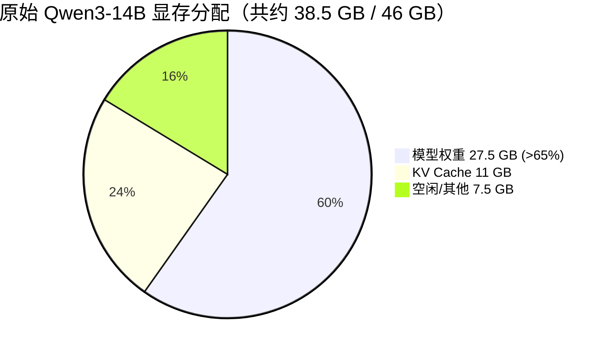

**关键洞察**（原书画重点）：
- 模型本身吃掉 **超过 65%** 的显存，留给 KV Cache 的空间**很小**（只有 11 GB / 72,064 token）。
- **KV Cache 容量直接限制 batching 和并发**。当缓存吃紧时，服务器只能：**要么缩小 batch，要么更频繁地驱逐（evict）缓存条目**——后者导致 decode 时更多**重算（recomputation）**。
- 结果：GPU 利用率变差，token 吞吐下降。
- `Maximum concurrency ... 1.76x` 意味着:在 40,960 token/请求的假设下，最多只能同时塞下 1.76 个请求的 KV——**并发能力被显存卡死了**。

> 💡 **这就引出了下一步的动机**：既然模型权重挤占了 KV Cache，那**把模型压小（量化）**，腾出的显存给 KV Cache，就能容纳更多 batch、跑更高并发、提升吞吐。这是 Step 6 的全部逻辑——**优化不是拍脑袋，而是顺着瓶颈往下推**。

---

## 📈 9.6 Step 5：压 Baseline——474 TPS 是我们的原点

对默认配置的 Qwen3-14B 发 ShareGPT 流量（2000 条，10 req/s），得到 baseline：

```
============ Serving Benchmark Result ============
Successful requests:                     2000
Benchmark duration (s):                  1810.09
Total input tokens:                      446619
Total generated tokens:                  412052
Request throughput (req/s):              1.10
Output token throughput (tok/s):         227.64
Total Token throughput (tok/s):          474.38    ← 【基准线】
---------------Time to First Token----------------
Mean TTFT (ms):                          104.15
Mean ITL (ms):                           43.24
Median ITL (ms):                         42.43
P99 ITL (ms):                            72.15
```

**读数**：
- **总吞吐 474 TPS**、输出吞吐 228 TPS——原书评价「a pretty good number」，作为原点很扎实。
- **Mean TTFT 104 ms**：首 token 100 毫秒出，交互体验良好。
- **Mean ITL 43 ms / P99 ITL 72 ms**：稳态每 43ms 吐一个 token（约 23 token/s 单请求），最差 72ms——流式很流畅。

### 缓存流量对比：同样的模型，吞吐能差 2.4 倍

接着换 **Prefix Repetition** 流量（1000 条，5 req/s，10 种前缀）再压一遍：

```
Total Token throughput (tok/s):          1123.13   ← 对比 ShareGPT 的 474！
Mean TTFT (ms):                          104.64
Mean ITL (ms):                           43.95
P99 ITL (ms):                            59.22
```

同时若在压测中跑 `nvidia-smi`，会看到 **GPU 利用率 97%**——GPU 被高度打满。

| 数据集 | 总吞吐 TPS | Mean TTFT | Mean ITL |
|:---|:---:|:---:|:---:|
| ShareGPT（真实对话） | 474 | 104.15 ms | 43.24 ms |
| Prefix Repetition（高重复） | **1123** | 104.64 ms | 43.95 ms |
| **差异** | **+137%** 🚀 | 几乎持平 | 几乎持平 |

> 🔬 **为什么同一个模型、同一份配置，吞吐能翻一倍多？**
> 因为 Prefix Repetition 流量里 prompt 高度重复，vLLM **自动**触发了一系列缓存与批处理优化:
> - **Prefix Caching（前缀缓存）**：相同前缀的 KV 只算一次，后续请求直接复用。
> - **Continuous Batching（连续批处理）**：请求随到随进 batch，GPU 不空转。
> - **Memory Block Sharing（显存块共享）**：多个请求共享同一段 KV 显存。
>
> 这三招让「相似输入」的重复计算被大量省掉。**关键 takeaway：吞吐不只取决于配置，更取决于流量本身的可缓存性**。这也再次印证了 Step 2 「数据集必须反映真实流量」的重要性——不同流量的天花板天差地别。

---

## 🗜️ 9.7 Step 6：量化模型——用 AWQ 把显存腾出来

**动机**（承接 Step 4 的显存账）：既然模型权重挤占了 KV Cache，那就用**量化**把权重压小。这里用 **AWQ**（Activation-aware Weight Quantization，激活感知权重量化）的 4-bit 版本 `Qwen/Qwen3-14B-AWQ`。

```bash
!pkill -f "vllm serve"                                # 先停掉旧服务
proc = start_vllm_serve(model="Qwen/Qwen3-14B-AWQ")   # 起量化版
```

### 显存账彻底翻转

看新的 `vllm.log`，对比原始版：

```
# 原始 Qwen3-14B（FP16）
Model loading took 27.5185 GiB ...
Available KV cache memory: 11.00 GiB
GPU KV cache size: 72,064 tokens
Maximum concurrency for 40,960 tokens per request: 1.76x

# AWQ 4-bit 量化版
Model loading took 9.3619 GiB ...                    ← 27.5 GB → 9.6 GB
Available KV cache memory: 29.15 GiB                 ← 11 GB → 29 GB
GPU KV cache size: 191,056 tokens                    ← 72K → 191K token
Maximum concurrency for 40,960 tokens per request: 4.66x  ← 1.76x → 4.66x
```

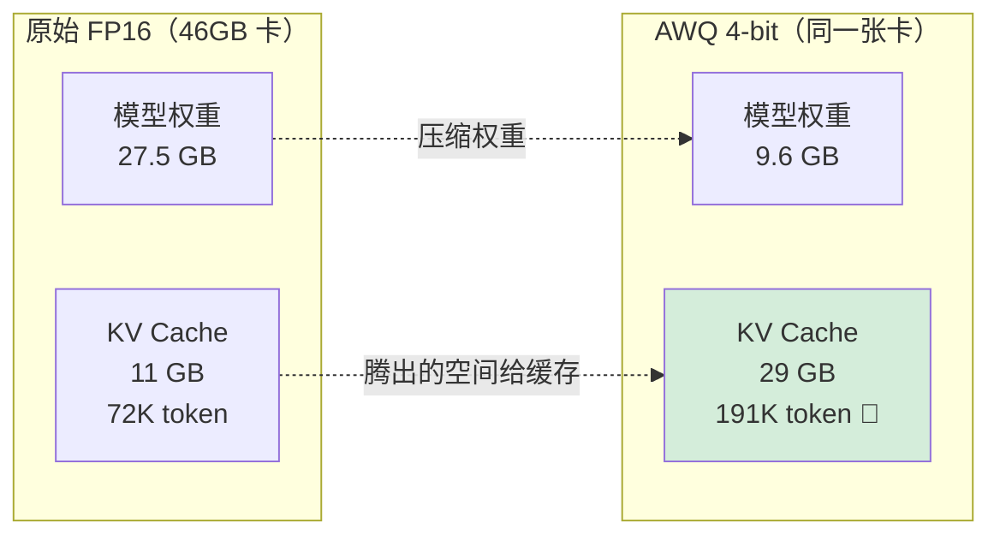

**逻辑链**（原书讲得极清楚）：
量化权重 → 模型从 27.5 GB 压到 9.6 GB → **腾出 17 GB** → 全给 KV Cache → 缓存从 72K token 涨到 **191K token（2.6 倍）** → 能装更多 batch、跑更高并发（1.76x → 4.66x）→ 减少前缀重算 → **吞吐大涨**。

### 量化后的压测结果

在 ShareGPT 流量下（原书 Figure 9-2）：

| 指标 | 原始 Qwen3-14B | AWQ 4-bit | 变化 |
|:---|:---:|:---:|:---:|
| 总吞吐 Total TPS | 474 | **1280** | **+170% (2.7×)** 🚀 |
| Mean TTFT | 103.61 ms | **59.29 ms** | **-42%** ⚡ |

Prefix Repetition 流量下（Figure 9-3）也观察到一致的改善——量化版**吞吐更高、延迟更低**。

> ⚠️ **常见坑·量化省的是「搬运」不是「算力」**：原书特别强调，本实验的 AWQ 主要展示的是 **weight quantization** 如何**减少 CPU↔GPU 的数据搬运和总显存占用**。如果你想**同时减少计算量**，需要的是 **activation quantization（激活量化）**——那属于第 6 章的内容。别把「权重量化」和「激活量化」混为一谈:前者主要省显存/带宽，后者才省算力。

> 💡 **面试高频**：为什么量化能让吞吐涨 2.7 倍，而不只是「模型小了跑得快一点」？答案是**二阶效应**——量化真正的杠杆不在权重本身变快，而在**腾出的显存转化成了 KV Cache 容量，从而放大了 batch 并发**。这个「显存→并发→吞吐」的传导链，是理解 serving 优化的核心。

---

## 🔧 9.8 Step 7：应用专项优化——按流量特征选武器

到这一步，服务通常**已经跑得不错了**。接下来是「精雕」：针对**特定流量或特定 GPU**，选专项技术并微调 vLLM 配置。

### 按流量类型选技术（决策树）

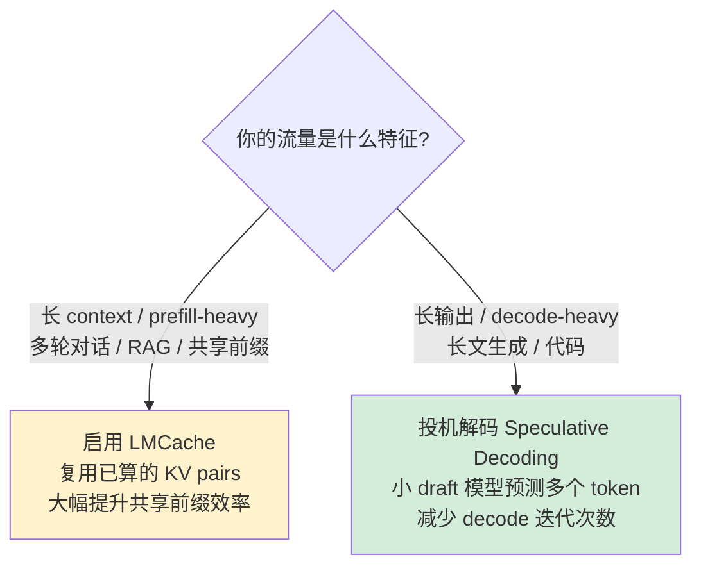

| 流量类型 | 计算集中在 | 推荐技术 | 原理 |
|:---|:---|:---|:---|
| **prefill-heavy**（长输入） | 输入处理阶段 | **LMCache** | 复用重复前缀已算好的 KV，对多轮 chat / RAG（大量共享 context）效率巨大 |
| **decode-heavy**（长输出） | 逐 token 生成 | **投机解码** | 用小 draft 模型一次预测多个 token，减少解码迭代，提吞吐 |

（LMCache 与投机解码的动手细节见**第 7 章**。）

### vLLM 的关键调优旋钮（knobs）

现代 serving 框架暴露大量旋钮，让你精细控制。原书给了两组：

**KV Cache / 缓存块管理**：
```bash
--gpu-memory-utilization 0.9    # 用 90% 显存给 KV Cache（默认更保守）
--max-model-len 4096            # 需要时增大上下文长度
--block-size 16                 # 更小的块 = 更好的缓存利用率（碎片更少）
```

**Batching / 批处理控制**：
```bash
--max-num-seqs 512              # 允许更多并发请求
--max-num-batched-tokens 16384  # 更大的 token 批
--max-paddings 256              # 允许更多 padding 以凑批
```

**逐旋钮讲解**：
- `--gpu-memory-utilization 0.9`：vLLM 会预留一部分显存防 OOM，默认较保守；调到 0.9 让更多显存用于 KV Cache（但太高有 OOM 风险）。
- `--block-size 16`：KV Cache 按「块（block）」分配。块越小，碎片越少、复用越灵活，但管理开销略增。
- `--max-num-seqs`：同时在处理的最大序列数（并发上限）。
- `--max-num-batched-tokens`：单个 batch 里最多多少 token——直接影响 prefill 批的大小。

### 一份调优后的完整启动脚本

```python
proc = start_vllm_serve(
   model="Qwen/Qwen3-14B-AWQ",
   extra_args=(
       "--quantization awq "              # 用 AWQ 量化
       "--gpu-memory-utilization 0.95 "   # 激进地用 95% 显存
       "--max-model-len 1024 "            # 上下文压到 1024（省 KV，适合短对话）
       "--block-size 16 "                 # 小块，好缓存
       "--enable-prefix-caching "         # 开前缀缓存
       "--max-num-seqs 8 "                # 并发 8（配合小 context 平衡延迟）
       "--max-num-batched-tokens 8192 "   # 单批 8192 token
       "--enable-chunked-prefill "        # 开 chunked prefill
   )
)
```

💡 **`--enable-chunked-prefill`（分块预填充）**是这里的点睛之笔：把长 prompt 的 prefill 拆成小块，和 decode 请求**交错调度**，避免长 prefill 独占 GPU 把所有 decode 请求「饿死」——显著改善混合流量下的 TTFT 与 ITL 平衡。

### ⚠️⚠️ 头号大坑:不要过度调参（Don't Overtune）

这是原书用整整一个 warning box 强调的、也是整章最重要的忠告之一：

> *"A configuration that's perfectly tuned for one GPU type or workload pattern may perform poorly—or even fail—on different hardware or with varied traffic."*

- 为**单一 GPU + 单一流量**调到极致的配置，换硬件 / 换流量可能**性能暴跌甚至直接跑不起来**。
- 过拟合（overfit）配置 → 系统**可移植性差、难维护**。
- **现代框架越来越智能**，能在启动时根据硬件和环境**自动推断**好设置。
- 原书作者的实践重心（原话）：**"we spend most of our effort identifying which optimization techniques to apply rather than chasing the perfect configuration."**（我们把大部分精力花在「选对技术」上，而不是「追完美配置」上。）

> 🔬 **第一性原理**：调参的边际收益递减，而可移植性的损失是阶跃式的。花一周把吞吐从 1280 抠到 1350（+5%），却让配置绑死在 L40S 上——一旦换成 A100 就要重调、甚至 OOM。**「选对技术」的收益是数量级的（量化 2.7×），「抠配置」的收益是个位数百分比的**。资源永远投在前者。

---

## 🌐 9.9 Step 8：分布式服务——加卡到底有没有用?

最后把实验扩展到**分布式服务（多 GPU）**。本节的结论**极其反直觉**，是全章最精彩的部分。

### 实验设置：两台机器、两种 GPU 架构

原书聚焦**单节点内多 GPU**（这是最常见的非超大规模场景；多节点建议用 prefill-decode 分离，见第 8 章）。用 AWQ 量化版 Qwen3-14B，在两台 EC2 上跑：

| 实例 | GPU | 数量 | 互联 |
|:---|:---|:---:|:---|
| **g6e.12xlarge** | NVIDIA **L40S** | 4 | **仅 PCIe**（无 NVLink）|
| **p4d.24xlarge** | NVIDIA **A100** | 8 | **NVLink**（高速低延迟）|

**关键背景**：单卡推理性能上，**L40S 通常强于 A100**。但分布式实验里，p4d（A100）的延迟反而**低于** g6e（L40S）——为什么？

### 起分布式服务（张量并行）

```bash
vllm serve Qwen/Qwen3-14B-AWQ --tensor-parallel-size 2 > vllm.log 2>&1 &
```

`--tensor-parallel-size 2`：vLLM 自动初始化跨 2 卡的分布式服务组，**内部处理通信和模型切分**——一行命令就把张量并行（tensor parallelism）跑起来了。

### 反直觉结果 1：g6e 上单卡最强

在 g6e（L40S）上跑 1 / 2 / 4 卡（Figure 9-4）：

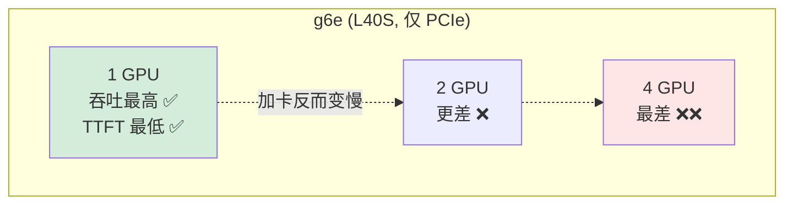

**单卡吞吐最高、延迟最低，碾压 2 卡和 4 卡配置**。加卡不但没提升，反而拖累！

### 反直觉结果 2：p4d 上多卡最强

在 p4d（A100）上跑 1 / 2 / 4 卡（Figure 9-5），结果**完全相反**：**4 卡吞吐最高、延迟最低**。TTFT 从 1 卡的 66 ms 降到 4 卡的 **33 ms（降近 50%）**。

### 🔬 第一性原理：答案在互联架构（GPU Interconnect）

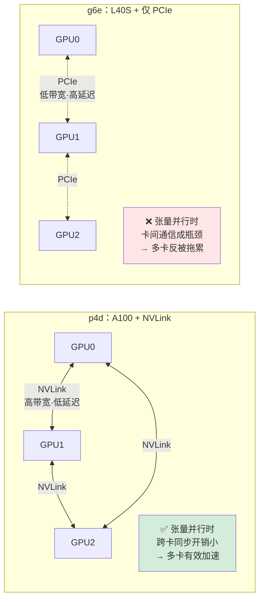

- **张量并行需要在每一层做跨卡同步**（all-reduce 通信）。这个通信量随并行度增加而增加。
- **A100 靠 NVLink 互联**：高带宽、低延迟，跨卡同步几乎「免费」→ 张量并行高效切分计算 → **多卡真加速**。
- **L40S 只有 PCIe 互联**：带宽显著更低、延迟更高 → 多卡配置被**卡间通信开销**拖垮 → **单卡反而整体最快**。

> 💡 **一句话记住**：**分布式加速的前提是「卡间互联够快」**。没有 NVLink（或同等高速互联），张量并行的通信开销会吃掉、甚至反超并行带来的算力收益。买多卡机器前，先问「这些卡之间怎么连的」。

### ⚠️⚠️ 大坑：分布式服务不保证更快

原书用一个专门的 box 破除迷信：

> *"A common misconception is that adopting distributed serving will always improve performance."*

而且**即使在 p4d 上 4 卡联合服务最优，这个优势也不是绝对的**——原书给了一个惊人对比：

| 部署方式 | 总吞吐 |
|:---|:---:|
| 4 卡**联合**跑 1 个分布式模型（张量并行）| 3,926 TPS |
| 4 卡各跑 1 个**独立**模型实例（4 副本）| **9,816 TPS** 🚀 |

**跑 4 个独立副本的总吞吐，几乎是 4 卡联合分布式的 2.5 倍！**

### 那分布式服务的真正价值在哪?

原书点破：**分布式服务的真正价值在「纵向扩展（vertical scaling）」——降低延迟 + 突破模型大小限制**：

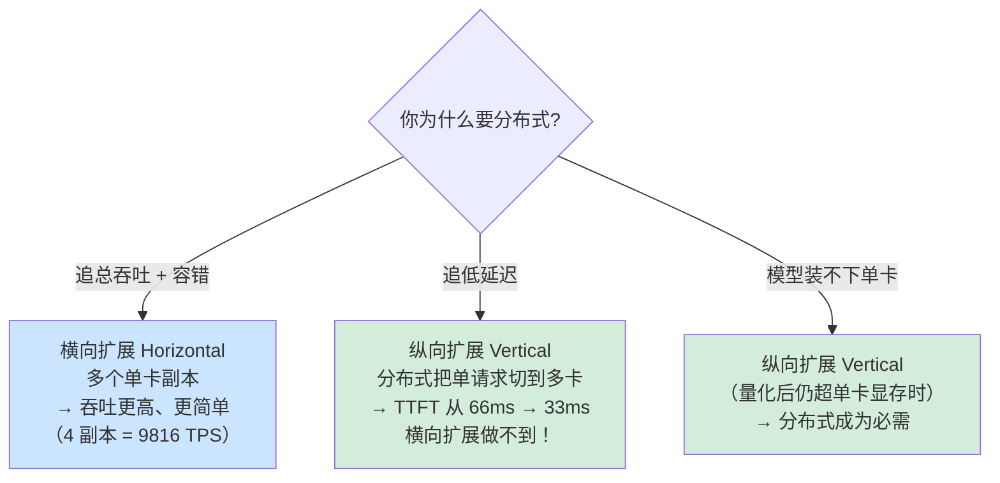

- **要低延迟** → 用分布式:把单请求的计算摊到多卡并行，TTFT 直接减半（66→33ms）。**这是横向扩展（加副本）永远做不到的**——加再多独立副本，单请求延迟也不会降。
- **模型太大装不下单卡**（即使量化后）→ 分布式成为**刚需**。
- **只要总吞吐** → 别用分布式，**多个单卡副本横向扩展**更香（吞吐更高、更简单、还容错）。

> 💡 **面试高频·横向 vs 纵向**：
> - **横向扩展（horizontal）** = 多个独立单卡副本 = 提升**总吞吐 + 容错**，生产系统大多靠这个。
> - **纵向扩展（vertical / 分布式）** = 多卡协同跑一个模型 = 降**单请求延迟** + 装**超大模型**。
> - 记住那组数字:4 副本 9816 TPS vs 4 卡分布式 3926 TPS。**要吞吐选横向，要低延迟或装大模型选纵向。**

---

## ⚖️ 9.10 五大优化权衡(Common Optimization Trade-offs)

原书总结了实战中反复权衡的 **5 个 trade-off**——这是整章方法论的浓缩。理解并因地制宜地适配它们，就是「真实 LLM serving 优化」的精髓。

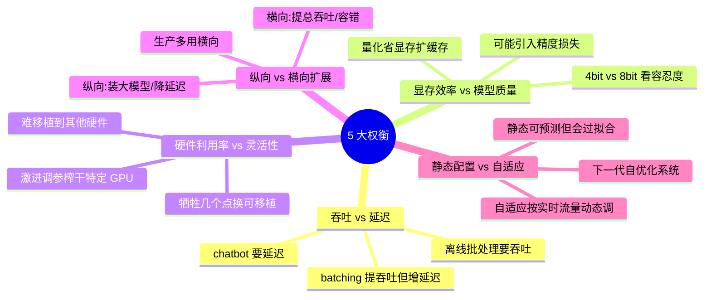

| # | 权衡 | 一端 | 另一端 | 怎么选 |
|:---:|:---|:---|:---|:---|
| 1 | **吞吐 vs 延迟** | batching/调度提吞吐 | 大 batch 增单请求延迟 | 交互应用（chatbot）选延迟；离线/批推理选吞吐 |
| 2 | **显存效率 vs 模型质量** | 量化/压缩省显存、扩 KV Cache | 可能带来小精度损失或 token 不稳定 | 看你对质量下降的容忍度（4-bit vs 8-bit）|
| 3 | **硬件利用率 vs 灵活性** | 激进调参榨干特定 GPU | 配置不通用、难移植 | 用几个百分点效率换可移植性和鲁棒性 |
| 4 | **纵向 vs 横向扩展** | 纵向(分布式):装大模型、降延迟 | 横向(多副本):提总吞吐、容错 | **生产系统大多聚焦横向扩展** |
| 5 | **静态优化 vs 自适应服务** | 静态配置可预测但会过拟合 | 自适应按实时流量/硬件动态调 batch/缓存/调度 | 自适应是**下一代 serving 框架**方向:自优化系统 |

> 🔬 **第一性原理·为什么是「权衡」而不是「最优」**：每个 trade-off 的两端都对应一种被稀缺化的资源（延迟预算、精度预算、显存预算、可移植性预算）。没有免费的午餐——你在一端多拿一点，必在另一端付出。**优化工程师的价值，不是找到「全都要」的魔法配置（不存在），而是精准判断「当前场景下哪一端更值钱」**。

---

## 📌 本章小结(Key Takeaways)

原书 Summary 用一句话定调:**优化不是找一个通用「最优」配置，而是搞懂你系统的主导瓶颈（dominant bottleneck），在合适的层级（硬件 / 模型 / 调度）用对技术。**

把整章方法论浓缩成一条可执行的清单:

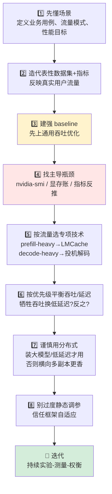

**逐条要点（原书 Summary 原文精炼）**：

1. **优化 ≠ 找通用最优配置**：而是理解**主导瓶颈**，在硬件/模型/调度的正确层级用对技术。
2. **从理解场景开始**：先明确业务用例、流量模式、性能目标，**再调参**。
3. **造有代表性的数据集和指标**:它们反映真实用户负载,是有意义优化结果的前提。
4. **先做通用吞吐优化**:用广谱效率技术（量化、连续批处理）建立强 baseline,再做流量专项调优。
5. **对特定流量用针对性技术**:长 context（prefill-heavy）用 LMCache;长输出（decode-heavy）用投机解码。
6. **按优先级平衡吞吐与延迟**:可通过「给每请求分更多显存 / 限制并发」牺牲吞吐换更低延迟。
7. **选择性使用分布式**:模型超单卡显存、或低延迟优先时,分布式才有价值。
8. **多数情况:单卡 + 横向多副本**,吞吐更高、更简单。
9. **避免过度特化的静态配置**:固定 KV 块大小、绑死硬件的参数会过拟合某种 GPU;信任现代框架的**自适应**能力。

> 💡 **贯穿全章的一句话**：**"Optimization Is Iterative."** 有效的 serving 优化来自**持续的实验、测量、和扎根真实用户场景的权衡分析**——不是一次调完就完事，而是随流量和硬件演进不断迭代的循环。

### 🧠 面试速答卡

| 问题 | 30 秒答案 |
|:---|:---|
| serving 优化的第一步是什么? | **建 baseline + 搞清主导瓶颈**,不是上来就调参 |
| 量化为什么能把吞吐提 2.7 倍? | 腾出的显存→更大 KV Cache→更高 batch 并发→吞吐,是「显存→并发」的二阶传导 |
| 加卡一定更快吗? | **不一定**。无 NVLink 时张量并行被 PCIe 通信拖垮,单卡反而最快 |
| 横向 vs 纵向扩展怎么选? | 要**总吞吐/容错**选横向(多副本);要**低延迟/装大模型**选纵向(分布式) |
| 最该避免的坑? | **过度调参**——配置过拟合特定 GPU/流量,不可移植;精力应花在「选对技术」上 |

---

## 🔗 延伸阅读

**本书内关联章节**（`book-hands-on-llm-serving/book-guide/`）：
- **第 5 章 · 硬件与互联**:NVLink vs PCIe 的带宽/延迟差异——本章 g6e vs p4d 反直觉结果的根因。
- **第 6 章 · 量化**:AWQ 权重量化 vs 激活量化的区别（本章只用了前者,省显存;后者省算力）。
- **第 7 章 · KV Cache / LMCache / 投机解码**:本章 Step 7 专项优化技术的动手细节。
- **第 8 章 · 分布式服务**:张量并行、prefill-decode 分离(多节点场景)的完整原理。

**仓库内相关目录**（`C:/Users/jianm/Desktop/llm-action/`）：
- [`llm-inference/`](../../llm-inference/) — LLM 推理优化总目录:vLLM、TensorRT-LLM、连续批处理、PagedAttention 深度剖析。
- [`ai-infra-architecture/`](../../ai-infra-architecture/) — AI 基础设施架构:GPU 集群、互联拓扑、多机多卡部署。
- [`llm-compression/`](../../llm-compression/) — 模型压缩专题:量化(AWQ/GPTQ/SmoothQuant)、剪枝、蒸馏的原理与实现。
- [`attention-optimization/`](../../attention-optimization/) — 注意力优化:FlashAttention、PagedAttention、prefix caching 底层机制。
- [`llm-maas/`](../../llm-maas/) — Model-as-a-Service:在线服务的成本模型、多副本调度、SLA 保障。
- [`scaling-book/`](../../scaling-book/) & [`ultra-scale-playbook/`](../../ultra-scale-playbook/) — 大规模训练/推理扩展:并行策略、通信优化的系统性论述。

---

> 🎓 **写在最后**:这一章是全书的「毕业设计」。前 8 章教你认识每一件兵器,这一章教你**在真实战场上,面对陌生的 GPU 和流量,冷静地测量、诊断、选择、验证、迭代**。记住那三个反直觉的数字——量化 **2.7×**、无 NVLink 时**单卡 > 多卡**、4 副本 **9816 vs** 4 卡分布式 **3926**——它们会在你未来每一次「要不要加卡 / 要不要调这个参」的决策里,提醒你:**先测量,再相信;优化是移动的靶子。**
