# 第 10 章 🚀 LLM 服务的前沿进展（Advancements in LLM Serving）

> 对应原书 *Hands-On LLM Serving and Optimization*（Chi Wang, Peiheng Hu 著）第 10 章 **Advancements in LLM Serving**，PDF 第 335–352 页。

---

## 🗺️ 本章地图（这一章在全书的位置）

如果你一路读到这里，恭喜——你已经走完了从"什么是模型服务范式"（第 1 章）到"如何为不同场景高效地服务 LLM"（第 9 章）的完整旅程。

**这是全书的收官章。** 前面九章解决的是"当下怎么把 LLM 服务做对、做快、做省"：

| 章节 | 主题 | 一句话 |
|------|------|--------|
| 第 1–2 章 | 服务范式 / LLM 推理原理 | 自回归、Prefill/Decode、KV Cache |
| 第 3–4 章 | 系统设计 / 最佳实践 | 单模型 / 多模型服务、Agent、企业架构 |
| 第 5 章 | 服务挑战 | GPU 规格、算术强度、瓶颈分析 |
| 第 6 章 | 基础优化 | 连续批处理、量化、前缀缓存 |
| 第 7 章 | 高级优化 | 投机解码、并行、**PD 分离**、高级 KV 缓存 |
| 第 8 章 | 服务框架 | vLLM / TensorRT-LLM / SGLang / llama.cpp |
| 第 9 章 | 实战优化 | Qwen3-14B 端到端调优 |
| **第 10 章（本章）** | **前沿进展** | **语义缓存、性能剖析、多模态、边缘、Multi-LoRA、RL 服务** |

本章不再是"把已知技术讲透"，而是**给你一张通往未来的地图**。作者的原话是：

> "我们的目标是介绍这些主要思想与框架，让你合上书本时，有能力把我们讲过的核心基础，和正在塑造下一代 LLM 服务系统的新思想连接起来。"

**读完这一章你能会什么：**

- 🎯 理解**语义缓存 / 语义路由（Semantic Caching / Routing）**为什么能省掉大量 LLM 调用，以及一个真实语义路由器内部的 5 步流水线（PII 脱敏 → Embedding → 向量检索 → 工具过滤 → 模型分类）
- 🔬 掌握**三层性能剖析（Profiling）**方法论：Serving 层 → Framework 层 → Runtime 层，以及 Nsight Systems / Nsight Compute / PyTorch Profiler 的分工与决策流程图
- 🖼️ 看懂**多模态服务（Multimodal / VLM）**如何把图像塞进语言模型，以及它带来的"CPU 前处理瓶颈"新问题（vLLM v0→v1 的进程分离）
- 📱 理解**边缘 AI（Edge AI）**的三大驱动力（延迟 / 数据本地性 / 成本）与五大使能技术（NPU、模型压缩、异构计算、温度感知调度、边云混合）
- 🧩 掌握 **Multi-LoRA 服务**：用一个基座模型 + 多个 LoRA 适配器把 N 张 GPU 压成 1 张，以及"什么时候该用、什么时候不该用"
- 🤖 理解**服务系统在强化学习（RL/RLHF）训练循环中的核心地位**——为什么推理引擎现在是训练的一部分，以及"确定性推理（Determinism）"为什么和吞吐同等重要

> 💡 **面试高频**：这一章几乎每一节都是 2025–2026 年 LLM Infra 面试的热点。语义路由、Multi-LoRA、PD 分离、RLHF 中的推理引擎、确定性推理——这些词一旦你能讲出"是什么/为什么/怎么用/代价"，面试官会立刻判定你在跟前沿。

下面逐节展开。

---

## 1️⃣ 语义缓存与语义路由（Semantic Caching & Routing）

### 1.1 是什么：从"副本级"到"端点级"的智能分发

回忆第 7 章的**数据并行（Data Parallelism）**：一个模型服务端点（endpoint）背后有多个模型副本（replica），前面挂一个**路由层（routing layer）**做负载均衡。当我们进一步引入**前缀缓存（Prefix Cache）**和 **KV-cache 利用率感知的负载均衡**时，路由的重要性陡增——因为把"同一个前缀的请求"打到"缓存里正好有这个前缀的副本"上，命中率会天差地别。

书里点出了一个正在发生的趋势：

> "越来越多的服务系统开始具备**语义感知（semantic-aware）**能力，并在整个生态更高的层级上运作。"

传统路由是**精确匹配**：完全一样的 prompt 才算命中缓存，路由只在"一堆模型副本"之间选。而**语义路由（Semantic Routing）**用 **Embedding + 向量搜索（vector search）**去识别"意图相同"的 prompt，于是路由从**副本级（replica-level）**升级到了**端点级（endpoint-level）**——它不再只是"选哪台机器"，而是"选哪个模型、要不要开推理（reasoning）、要不要走缓存"。

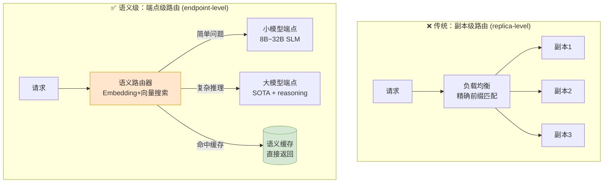

*（对应原书 Figure 10-1：端点级路由 vs 副本级路由）*

### 1.2 为什么：语义路由能带来的四个好处

作者给出了四个越来越强的动机，从"省钱"一路到"安全治理"：

#### ① 语义缓存：相似问题不重复调 LLM

最简单直接的理由——**避免对语义相同的 prompt 重复调用 LLM**。举例：

> - "How long is the flight from Seattle to Hawaii?"（西雅图到夏威夷飞多久？）
> - "Tell me how many hours it takes to fly from Seattle to Hawaii."（告诉我从西雅图飞到夏威夷要几个小时。）

这两句话字面不同，但意图完全一致。如果每次都重新调一次 LLM（尤其是**外部付费 LLM**），就是**纯粹的浪费钱 + 无谓的延迟**。语义缓存能识别"这俩是一回事"，把上一次的结果存下来直接返回。

> 🔬 **第一性原理**：LLM 调用的成本 = Token 数 × 单价 + 延迟成本。而"意图去重"本质是把一个昂贵的**生成问题**（generation）降维成一个廉价的**检索问题**（retrieval）。Embedding + 向量检索的成本比一次 LLM 生成低 2~3 个数量级。

#### ② 智能路由：不是每个问题都要大模型 + 推理

即使是一个没命中缓存的新 prompt，也**不是每个问题都需要大模型或开启 reasoning**。语义路由器可以调一个**轻量编码器模型**（如 **ModernBERT**）快速判断：这个 prompt 到底复杂不复杂，值不值得动用最强模型 / 开启推理。

#### ③ 小模型（SLM）替代：8B~32B 往往够用甚至更好

书里强调了一个越来越被认可的现实：

> "越来越多公司意识到，**任务特定、微调过的小语言模型（SLM，约 80 亿~320 亿参数）**，在可靠性和延迟（对 SLA/SLO 控制）上，往往能和巨型通用 LLM 打平甚至更好。"

语义路由器读懂 query 后，把请求**路由到最合适的模型端点**——简单问题给小模型，复杂问题给大模型。

#### ④ Agentic 场景：路由器承担工具过滤 + 安全治理

在 **Agent** 场景里，路由服务的职责远不止"转发请求"：

- **第一级工具过滤（tool filtering）**：不把**所有**可用工具都暴露给模型。现在越来越多通过 **MCP（Model Context Protocol，模型上下文协议）**实现——工具以结构化的 schema、权限、元数据注册。路由器根据用户请求，**只挑相关的工具子集**传给模型。这样做的好处：
  - ⬇️ 降低 prompt 开销（工具描述占 token）
  - ⚡ 改善延迟
  - 🛡️ 降低"意外调用不该调的工具"的风险
- **中央治理点**：路由服务还是**安全、策略、合规检查**的统一执行点。

### 1.3 怎么用：语义路由器内部的 5 步流水线（逐步拆解）

书里的 Figure 10-2 给了一个语义路由器的完整例子。我们按编号箭头一步步拆（这是本节最硬核、也最值得背下来的部分）：

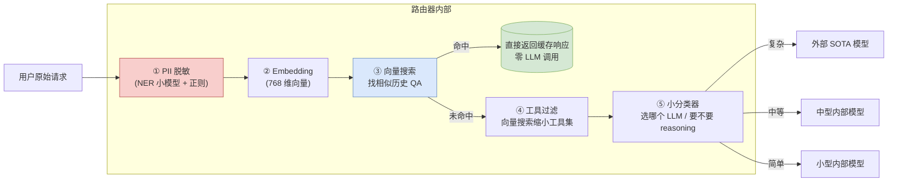

*（对应原书 Figure 10-2：一个语义路由器把请求路由到多个 LLM）*

**① PII 脱敏（Masking PII）— 通常是第一步**

用户原始输入常含敏感信息：姓名、地址、联系方式、信用卡号、健康信息。必须在**下游的日志、缓存、路由决策接触到数据之前**，把这些**个人可识别信息（PII，Personally Identifiable Information）**去掉或混淆。

- 做法：一个**小编码器模型**，针对隐私敏感实体做**命名实体识别（NER，Named Entity Recognition）**微调。
- 输出示例（书中原代码）：

```python
[
    {"start": 5,  "end": 13, "label": "PERSON",
     "text": "John Doe",     "confidence": 0.97},
    {"start": 66, "end": 81, "label": "EMAIL",
     "text": "john@abc.com",  "confidence": 0.95},
]
```

> **逐行讲解**：
> - `start` / `end`：这个实体在原文中的**字符起止位置**（下标 5~13 是 "John Doe"）。
> - `label`：实体类别（`PERSON` 人名、`EMAIL` 邮箱）。
> - `text`：识别出的原文片段。
> - `confidence`：置信度（0.97 = 97% 确信）。
>
> 有了"位置 + 类别"，我们就能回到原 prompt，把 PII token 替换成占位符：`John Doe → <NAME_1>`、`john@abc.com → <Email_1>`。
> 很多情况下还会用**正则（regex）**方法补充 NER 模型（比如信用卡号、身份证号有固定格式，正则比模型更稳）。

**② Embedding — 核心语义理解步**

调一个 **embedding 模型**，把每个 prompt 转成一串数字（一个**嵌入向量 / embedding vector**），长度比如 768。核心性质：

> **语义相近的 prompt，其 embedding 向量也相近。**

例如："forget my login"（忘了我的登录）和 "reset password"（重置密码）的向量很接近；而 "forget my login" 和 "create me a draft article"（帮我起草文章）的向量则相差很远。

> 🔬 **第一性原理**：Embedding 把离散的自然语言映射到连续的高维向量空间，"语义相似"变成了"几何距离近"（通常用余弦相似度 $\cos\theta = \frac{\vec{a}\cdot\vec{b}}{\|\vec{a}\|\|\vec{b}\|}$）。这就是为什么"意图去重"从一个 NLP 难题，变成了一个成熟的**向量检索工程问题**。

**③ 向量搜索（Vector Search）— 查缓存**

有了 embedding 向量，就去**向量搜索**历史存储的 (prompt, response) 对。如果找到**非常接近的匹配**，立即返回缓存响应，**零额外 LLM 调用**。

**④ 工具过滤（Tool Filtering）— Agentic 场景**

很多 Agentic 场景给 LLM 配了工具。当工具很多时，把**所有工具都发给 LLM 代价很大**（占 token、增延迟）。可以用向量搜索**缩小工具列表**——只留和当前请求相关的工具。

**⑤ 模型分类器（Classifier）— 选模型 + 决定要不要 reasoning**

embedding 向量还能喂给一个**小分类器**，由它决定"调哪个 LLM、要不要开推理"。根据输出标签：

- 复杂推理 → 调**外部 SOTA 模型**
- 特定任务 → 调**中型内部模型**
- 简单问题 → 调**小型内部模型**

> 💡 **实战**：这套语义路由 + 缓存架构，就是 2025 年起商业化的 "LLM Gateway / AI Gateway" 产品（如 LiteLLM Router、Portkey、Kong AI Gateway、Semantic Router 库）的核心逻辑。开源实现里，`semantic-router` + `GPTCache` 是最常见的组合。

> ⚠️ **常见坑**：
> 1. **语义缓存的"假命中"**：两个 prompt 向量很近≠答案可复用。"北京今天天气如何"和"上海今天天气如何"语义极近，但答案完全不同。**带时效性、带具体实体的查询要慎用语义缓存**，或在 key 里显式带上实体/时间戳。
> 2. **相似度阈值难调**：阈值太高→缓存几乎不命中；太低→返回错误答案。生产上通常需要按 domain 分别调阈值，并配一个"命中后二次校验"的兜底。
> 3. **PII 脱敏漏网**：NER 模型不是 100% 召回。合规场景下务必"NER + 正则 + 关键字黑名单"三重兜底，且对未识别兜底走"最保守路径"。

---

## 2️⃣ 性能剖析策略（Performance Profiling Strategies）

### 2.1 为什么剖析变得如此关键

书里开门见山：

> "因为 LLM 服务很贵，**工作负载剖析（workload profiling）**这门手艺变得越来越深。"

上一代预测型模型（predictive models）推理负载小，剖析没那么要紧。但今天 LLM 被部署到越来越多产品和组织里，**规模化服务意味着：哪怕 1 个百分点的性能提升，都可能省下数百万美元的基础设施成本**。那"最后几个百分点"不再是锦上添花的奢侈品，而是**运营刚需**。

> 💡 **面试高频**：面试官问"你怎么定位 LLM 服务的性能瓶颈？"——如果你只会说"看 GPU 利用率"，那是初级；能说出下面这套**三层剖析 + 决策流程图**，才是资深。

### 2.2 剖析的三个层次（自顶向下）

作者把剖析分成三层，从你最熟悉的顶层往下钻：

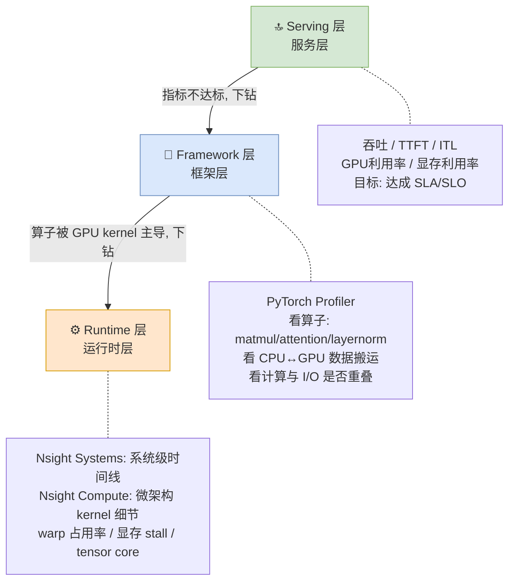

#### 🔝 Serving 层（Serving Layer）

这是你最熟的顶层。指标包括：**吞吐（throughput）、TTFT（首 token 时间）、ITL（token 间延迟）、GPU 利用率、显存利用率**。在这一层做调整，达成 SLA/SLO 目标。

> 📖 *回顾第 4 章的延迟/吞吐指标定义、第 9 章的实战调优。*

#### 🔧 Framework 层（Framework Layer）

在 PyTorch 这类深度学习框架内部，模型被表示成一张**算子图（graph of operations）**。工具如 **PyTorch Profiler** 能让你检查：

- **具体算子**（matmul 矩阵乘、attention 注意力、layernorm 层归一化 这些积木级计算）怎么执行的
- 数据如何在 **CPU 和 GPU 之间搬运**
- 流水线是否**高效重叠了计算和 I/O**

两个典型用法：

1. **算子执行时间线**能告诉你哪个具体算子在霸占 GPU 执行时间。然后你就能针对那个算子，换成不同的 kernel 实现。
2. 发现 **GPU 大量空闲、在等 CPU 干完活**。这时可以把尽可能多的 CPU 工作量挪到**异步进程**、移出关键路径，来提升 GPU 利用率。

#### ⚙️ Runtime 层（Runtime Layer）

当框架级剖析发现"最慢的算子是被 **GPU kernel 执行**主导"时，就得往运行时层钻。一个模型最终会被执行成**一串算子**，每个算子又会展开成**一个或多个 CUDA kernel**去做真正的数学运算。理解 kernel 内部发生了什么至关重要——因为这一层的低效，往往正是"某算子在框架层显得很贵"的根因。

- **NVIDIA Nsight Systems**：常见的起点，提供**系统级性能分析时间线**，定位主要瓶颈。
- **NVIDIA Nsight Compute**：相比之下提供**微架构视角**的 kernel 级细节。

两个具体例子（书中原例）：

- **例 1（Nsight Systems）**：即使 GPU 利用率看起来很高，Nsight Systems 可能揭示**kernel 之间被大段空闲缝隙隔开**。原因可能是 host 启动 kernel 太慢，或数据传输没和计算重叠。这时 GPU 基本是在 kernel 之间干等。修法：**让数据拷贝和计算重叠**（比如用多个 CUDA stream），把 GPU 喂饱。
- **例 2（Nsight Compute）**：当单个 kernel 是瓶颈、霸占了整体时间时，Nsight Compute 能解释"为什么"。常见原因：**线程占用率低（low thread occupancy）** 或 **频繁的显存 stall**。比如 attention softmax kernel 之所以最慢，是因为它反复从**全局显存（global memory）**加载大的中间张量，而不是留在**共享内存（shared memory）**里。知道这个后，你就能针对性优化它的内存访问模式、调块/网格配置，或换成更高效的**融合 kernel（fused kernel）**。

> 📖 *本书不深入写自定义 CUDA/Triton kernel，但强调理解"它们优化什么、剖析如何把系统级观察连到 kernel 级行为"是必备的。想深入 CUDA kernel 优化，可看仓库里的 `enigneer-infra/cuda-mastery/`（CUDA 编程逐章精讲 + 算子实战）。*

### 2.3 决策流程图：从症状到根因

书里最实用的是 Figure 10-3——一张**端到端性能剖析决策流程图**。真正的挑战不是"会用某个 profiler"，而是"知道**何时用哪个工具、如何从一层跳到下一层**"。我把它整理成 mermaid：

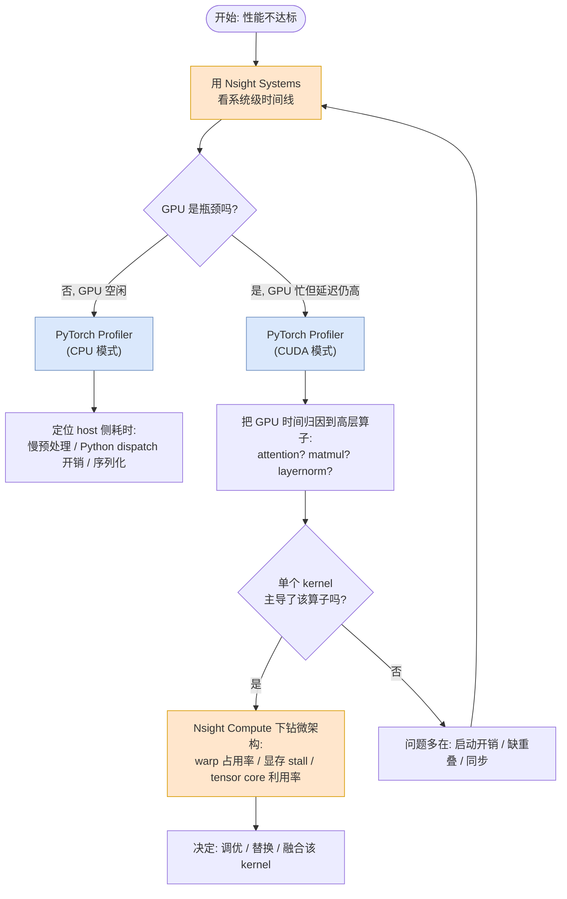

*（对应原书 Figure 10-3：端到端性能剖析决策流程图）*

**流程逐步讲解：**

1. **从 Nsight Systems 开始**（自顶向下的系统级时间线）：判断 GPU 到底是不是瓶颈，还是真正的问题在 **CPU 开销、数据加载、I/O**。
2. **若 GPU 利用不足** → 用 **PyTorch Profiler（CPU 模式）**，揭示 host 侧时间花在哪：慢的预处理、Python dispatch 开销、序列化。
3. **若 GPU 很忙但整体延迟仍异常高** → 下一步确定"哪个算子负责"。用 **PyTorch Profiler（CUDA 模式）**把 GPU 时间归因回高层 PyTorch 算子，锁定是 attention / matmul / layernorm 还是别的在霸占执行。
4. **锁定重算子后** → 问"是不是单个 kernel 占了它大部分时间"：
   - **是** → 用 **Nsight Compute** 钻微架构细节（warp 占用率、显存 stall、tensor core 利用率），据此决定该 kernel 是**调优、替换还是融合**。
   - **否** → 问题通常是**启动开销、缺重叠、或同步**，回到 Nsight Systems 的时间线重看。

> ⚠️ **常见坑**：新手最爱犯的错是"看到 GPU 利用率 99% 就以为没问题了"。利用率高≠高效——kernel 之间可能全是空隙（launch 太慢），或 tensor core 根本没用上（占用率高但都是内存搬运）。**利用率是"忙不忙"，不是"有没有干正事"。**

---

## 3️⃣ 多模态服务（Multimodal Serving）

### 3.1 是什么：VLM 与"输入多模态 vs 输出多模态"的关键区分

另一个前沿是把 LLM 扩展成**多模态模型**，如 **VLM（Vision Language Model，视觉语言模型）**，去处理图像、视频、音频。这些模型结合了视觉和文本推理，要求服务基础设施能高效处理**异构输入、大图像张量、跨模态注意力**。

作者特意澄清了一个**关键区分**：

| | 消费多模态**输入** | 生产多模态**输出** |
|---|---|---|
| 例子 | 看图说话的 VLM | Midjourney / Sora / Veo 生图生视频 |
| 架构 | 标准**自回归解码器**（本书讨论范围） | **扩散模型（diffusion-based）**等生成式架构 |
| 输出 | 仍然生成**文本 token** | 生成图像 / 视频 |
| 本书覆盖 | ✅ 是 | ❌ 否（架构完全不同） |

> **本书只讨论：接收多模态输入、但仍用标准自回归解码器生成文本 token 的语言模型。** 生成图像/视频的扩散模型架构完全不同，不在本书范围。

### 3.2 怎么用：图像是如何塞进语言模型的（逐步）

书里用一个例子展示视觉输入如何被并入语言模型。先看 prompt——`content` 里同时塞进图像和文本：

```python
messages = [
   {
       "role": "user",
       "content": [
           {"type": "image", "image": image},
           {"type": "text",  "text": "Describe this image."},
       ],
   }
]
```

> **逐行讲解**：
> - `role: "user"`：这是一条用户消息。
> - `content` 是一个**列表**，而不是一个字符串——这是多模态的关键：一条消息可以由**多个内容块**组成。
> - 第一块 `{"type": "image", "image": image}`：一张图像。
> - 第二块 `{"type": "text", "text": "Describe this image."}`：文本指令"描述这张图"。

应用 prompt 模板后，能看到第二行出现了图像段：

```text
<|im_start|>user
<|vision_start|><|image_pad|><|vision_end|>
Describe this image.<|im_end|>
<|im_start|>assistant
```

> **逐行讲解（这是 Qwen-VL 系列的特殊 token）**：
> - `<|im_start|>user` / `<|im_end|>`：一条消息的起止边界。
> - `<|vision_start|>` ... `<|vision_end|>`：**视觉段的起止标记**。
> - `<|image_pad|>`：**图像占位符**——注意这里只是一个占位 token，真正的图像信息还没进来。
> - 后面接文本 "Describe this image."，再接 `<|im_start|>assistant` 让模型开始生成。

它的 **input ID（token 序列）**长这样：

```python
[151644, 872, 198,            # <|im_start|>user
 151652,                      # <|vision_start|>
 151655, … (644 次) … , 151655,  # 图像 embedding 的占位符
 151653,                      # <|vision_end|>
 74785, 419, 2168, 13, 151645, 198,  # Describe this image. <|im_end|>
 151644, 77091, 198]          # <|im_start|>assistant\n
```

> **逐行讲解——这里藏着多模态服务的核心机制**：
> - `151644, 872, 198`：分别是 `<|im_start|>`、`user`、换行。
> - `151652`：`<|vision_start|>` 的 token id。
> - **`151655` 重复了 644 次**！这是最关键的一点：**一张图像被展开成了 644 个占位 token**。图像不是一个 token，而是一大片 token（数量取决于图像分辨率和 patch 划分）。这也解释了为什么多模态请求的 KV Cache 和 prefill 开销远大于纯文本。
> - `151653`：`<|vision_end|>`。
> - `74785, 419, 2168, 13`：文本 "Describe this image." 的 token。
> - `151645, 198`：`<|im_end|>` 和换行。
> - `151644, 77091, 198`：`<|im_start|>`、`assistant`、换行——生成从这里开始。

**最后一步：占位符如何被真图像替换？**

> 模型处理时，文本 token id 照常映射为文本 embedding；而**图像占位符会被 Vision Encoder（视觉编码器）产生的 embedding 替换掉**。视觉编码器把图像切成小块（patches），把每个 patch 投影到 LLM 的隐藏维度，让 patch 之间互相注意（attend），编码它们的全局空间和语义关系，得到最终的视觉 embedding。

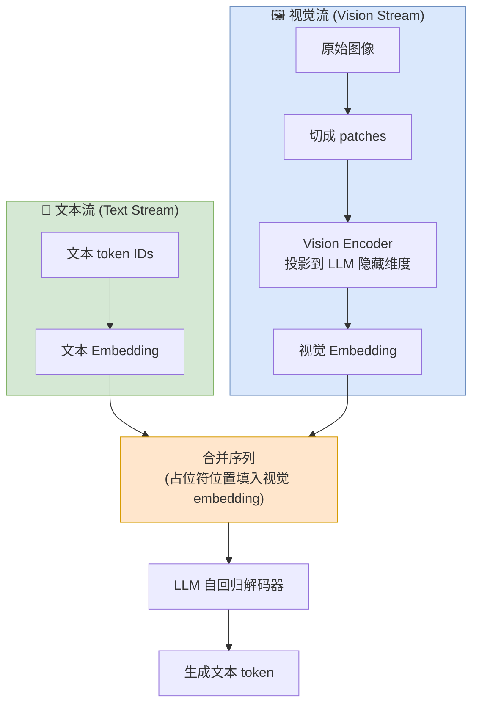

*（对应原书 Figure 10-4：VLM 中文本与视觉输入的双流处理）*

### 3.3 代价：多模态带来的"CPU 前处理瓶颈"新问题

多模态模型进生产后，**缓存、批处理、流式**这些原则都得从"纯文本"扩展开。而它带来一个**全新的系统瓶颈**：

- **文本分词很轻量**，通常不造成显著 CPU 开销。（唯一例外：非常快的 GPU 跑小模型 + 高 batch 时，CPU 开销才会显现。）
- **多模态输入却引入了一堆计算密集、CPU 重的预处理任务**：把高分辨率图像转成原始像素、裁剪、缩放、复杂张量变换——而且这些必须**顺序完成**才能让 LLM 开始。

结果就是**计算工作被"前置"（front-loaded）**，造成**早期 CPU 瓶颈**：

> "如果请求速率把 CPU 准备和喂大张量的能力打满了，那强大的 GPU 就只能空转。于是性能的主要约束发生了转移——**整体请求吞吐不再受限于 LLM，而是受限于最初那个 CPU 重的视觉预处理阶段的延迟和效率**。"

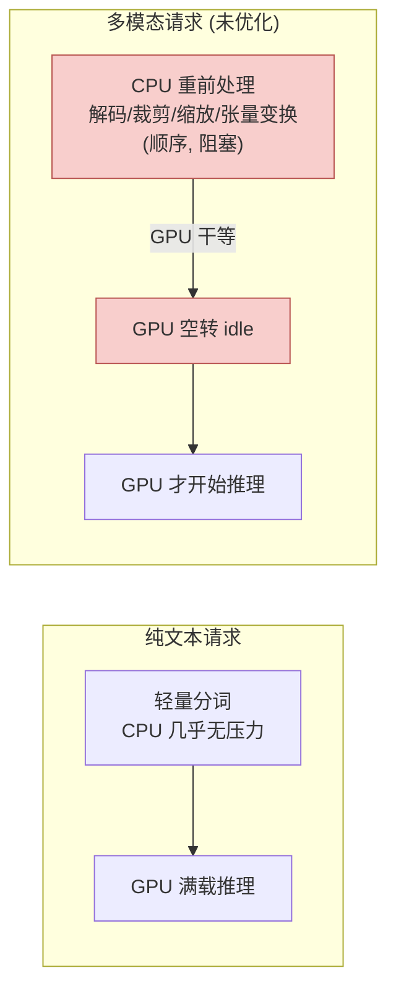

### 3.4 解法：vLLM v0 → v1 的进程分离（异步解耦）

书里用 **vLLM 从 v0 到 v1 的演进**作为如何缓解多模态瓶颈的绝佳案例：

> "V1 的核心改进是采用**完全异步的进程**来把 CPU 密集任务和 GPU 执行**解耦（decouple）**。在 V0 中，多模态输入预处理和 API server 开销常常**阻塞 CPU 操作**，导致 GPU 空闲。V1 把这些任务**卸载到独立的 CPU 进程**，与 GPU 的核心推理循环**并发运行**。这种解耦最小化了 CPU 开销，确保 GPU 被持续喂数据、以接近满利用率运转。结果是文本和多模态负载的吞吐都**显著提高**。"

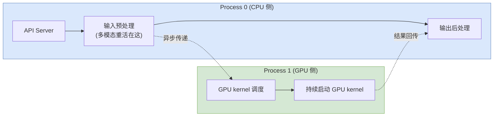

*（对应原书 Figure 10-5：vLLM V1 进程分离图，多模态输入预处理被拆成非阻塞的独立进程）*

> **逐步讲解**（Figure 10-5 的两个进程，虚线分隔）：
> - **Process 0（上半）**：负责 API server、输入预处理（多模态重活主要在这）、输出后处理。
> - **Process 1（下半）**：一个**完全独立的进程**，专门负责 GPU kernel 的调度和启动。
> - **关键**：这种分离确保**即使 Process 0 正忙于昂贵的多模态预处理，它也不会阻塞 Process 1 持续启动 GPU kernel**，从而降低整体 CPU 开销。

> 💡 **面试高频**："vLLM v1 相比 v0 最大的架构改进是什么？"——标准答案就是**进程分离 / API server 与 engine core 解耦的异步架构**，多模态是这个改进最受益的场景。

---

## 4️⃣ 边缘 AI：驱动力与使能技术（Edge AI: Drivers and Enablers）

本书大部分聚焦大规模云端服务，但作者点出一个重要的平行趋势：**越来越多 AI 负载被搬到边缘设备（edge devices）上服务。**

### 4.1 三大驱动力：为什么要把 AI 搬到边缘

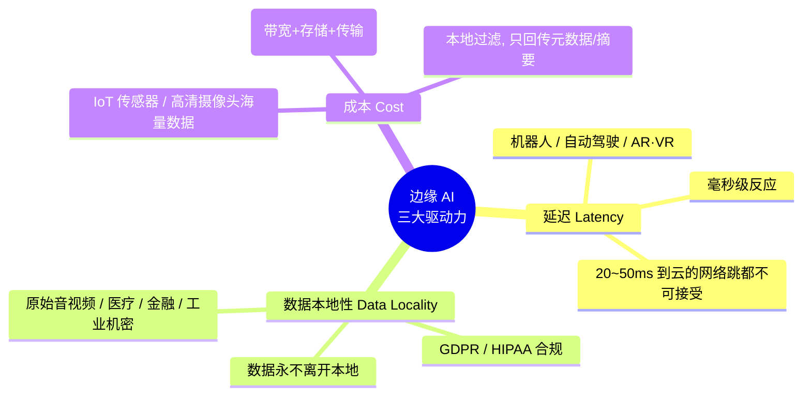

| 驱动力 | 核心痛点 | 典型场景 | 边缘 AI 的解法 |
|--------|----------|----------|----------------|
| ⚡ **延迟（Latency）** | 需毫秒级反应，连 20~50ms 的网络跳都不可接受 | 机器人、自动驾驶、AR/VR | 计算移到边缘，数据即时处理，实现安全攸关、时间敏感的实时决策 |
| 🔒 **数据本地性（Data Locality）** | 原始音视频、医疗/金融/工业机密数据传云有拦截和越权风险，且违反数据主权与隐私法规 | 医疗记录、财务、专有工业数据；受 GDPR/HIPAA 约束 | 在设备上本地处理，**原始数据永不离开现场** |
| 💰 **成本（Cost）** | IoT 传感器、高清摄像头产生海量数据，传云带宽和存储/传输成本极高 | 直播视频流上云处理 | 本地处理+过滤，**只回传元数据/摘要/必要更新**，大幅降带宽 |

> **一句话总结**：部署边缘 AI 不是简单地"把云模型缩小塞进设备"，而是**硬件进步 + 模型压缩 + 软件运行时 + 架构模式**共同收敛的结果，让实时智能在严苛的功耗和内存预算下变得可行。

### 4.2 五大使能技术（Enablers）

#### ① 专用低功耗硬件（Specialized Low-Power Hardware）

边缘 AI 之所以可行，是因为今天的硬件能用**极低功耗**做复杂 AI 任务。几年前在手机/嵌入式板上跑深度学习推理意味着：慢 CPU、有限内存、电池撑不住。

行业转向了 **AI 加速器**——专门的芯片，或 **SoC（片上系统）**里的专用模块，只把一件事做到极致：**高速、低精度的张量数学**。其中最重要的发展是 **NPU（Neural Processing Unit，神经处理单元）**：

- CPU 可能只有**几个强核**；
- NPU 由**成千上万个微小、高效的处理单元**齐步运作。

**边缘和云的目标指标完全不同**：

> "在数据中心，**原始性能是王（raw performance is king）**；在边缘，**效率才是君主（efficiency is the monarch）**。"

- 服务器：几乎无限的电力和散热。
- 电池供电、无风扇的边缘设备：**严格的功耗预算**。
- 所以边缘加速器的行业标准指标是 **TOPS/W（tera-operations per second per watt，每瓦特每秒万亿次操作）**——不是纯算力，而是**每瓦能算多少**。

> 🔬 **第一性原理**：云端优化目标函数是 `max(性能)`，边缘是 `max(性能/功耗) s.t. 功耗 ≤ 预算 且 温度 ≤ 阈值`。同一套模型压缩技术，在云端是"锦上添花提吞吐"，在边缘是"能不能跑起来"的前提条件。

#### ② 模型压缩与优化（Model Compression and Optimization）

如第 6 章详述，即使云端模型，模型压缩现在也是必备。而要把边缘 AI 模型塞进内存受限的设备，压缩**更加重要**：

> "云服务器用压缩主要是**优化吞吐、维持延迟**；而边缘设备常把压缩当作**功能可用的前提条件**。没有这些技术，现代深度学习模型根本装不进 on-device SRAM 或 flash 存储的紧约束里。"

除了前面讲过的**量化（quantization）、剪枝（pruning）、蒸馏（distillation）**，还有专为边缘定制的优化：**KV 缓存、投机解码（speculative decoding）、kernel 级优化**。

#### ③ 异构计算（Heterogeneous Compute）

早期边缘 AI 全跑在一个处理器上，慢且受热约束。今天 Apple、Qualcomm、Intel 的移动/嵌入式平台**本质上是异构的**：每个都含多个专用计算单元，处理工作负载的不同部分。**这本质上就是跨不同硬件和核的流水线并行（pipeline parallelism）**（类似第 7 章讲的）。

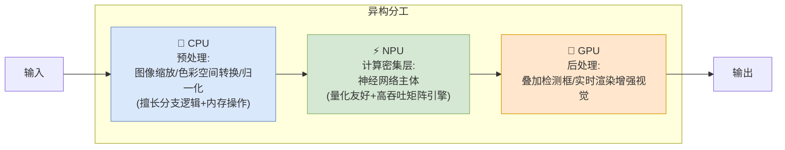

*（对应原书 Figure 10-6：CPU、GPU、NPU 异构计算的分工）*

- **CPU**：预处理（图像缩放、色彩空间转换、输入归一化）——这些涉及分支逻辑和内存操作，通用核擅长。
- **NPU**：执行神经网络的**计算密集层**，利用其量化友好、高吞吐的矩阵引擎。
- **GPU**：后处理（叠加边界框、实时渲染增强视觉）。

更先进的运行时甚至支持**子图划分（subgraph partitioning）**——把单个模型里的各层**动态分配**到不同加速器，以最大化吞吐、最小化停顿。但这引入了**同步、内存搬运、调度**的复杂挑战，是现代边缘 AI 最精巧的使能技术之一。

#### ④ 温度感知调度（Thermal-Aware Scheduling）

> "在云里，服务器热了，风扇转快点。在无风扇的边缘设备（小传感器、口袋里的手机）上，**热会杀死性能**。"

芯片过热会**降频（throttle）**，大幅变慢以防物理损坏。所以需要**智能调度器**实时监控温度：

- 温度接近/超过临界阈值时 → **动态切换到更小、精度更低的模型**，或**降低帧率**，抢在硬件降频之前。
- 必要时 → 把工作负载从热的**主核**迁到凉的**小核（little core）**几毫秒，让主核散热。

这体现的是"**系统稳定性优先于原始峰值性能**"的哲学。

#### ⑤ 边云混合计算（Edge–Cloud Hybrid Compute）

如今 AI 负载越来越依赖设备和云**协作**，而非孤立运行：

- **边缘处理**需要即时响应和严格隐私的任务：唤醒词检测（如 "Hey Siri"）、轻量图像预处理、本地视频编码、跑一个**微型 on-device LLM 做快速意图理解**。利用 NPU 和低功耗 GPU，避免把原始输入送云的延迟和数据暴露。
- 输入被过滤、特征被提取、embedding 被压缩后 → **云执行重量级组件（大模型）**。因为边缘已经预处理并浓缩了输入，云消耗更少资源、整体更快。

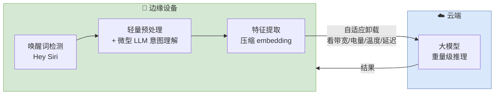

*（对应原书 Figure 10-7：边云混合推理架构）*

越来越多系统用**自适应卸载（adaptive offloading）**——根据带宽、电量、温度、延迟要求，**动态决定某一步在设备上跑还是在云里跑**。这种协作利用两个环境各自的强项：**实时、私密的计算在边缘；大规模智能在云端。**

> 💡 **实战**：这正是 Apple Intelligence（端侧小模型 + Private Cloud Compute 大模型）、Google Gemini Nano（端侧）+ Gemini Pro（云）的产品架构。理解"边云混合 + 自适应卸载"能帮你看懂 2025+ 消费级 AI 产品的系统设计。

---

## 5️⃣ Multi-LoRA 服务（Multi-LoRA Serving）

### 5.1 是什么：PEFT、LoRA 与 Multi-LoRA

接下来转向服务**微调过的模型**。**PEFT（Parameter-Efficient Fine-Tuning，参数高效微调）**不更新模型全部参数，而是**只调一小部分、冻结大多数**，让微调更快更省。

> **企业采用 LLM 的自然演进路径**：
> 1. 第一阶段——把专有/领域知识注入模型**上下文**，通常用 **RAG**。
> 2. 下一步自然是**微调**，追求更深的对齐：提升准确性、连贯性、grounding，匹配自己独特的数据、工作流、沟通风格。

**LoRA（Low-Rank Adaptation，低秩适配）**是 PEFT 里最流行的方法之一：往模型架构里**插入小的、可训练的低秩层**，让模型学到任务特定的适配，**而不改动原始权重**。结果是**更快、更便宜、更模块化**的微调方式。

> 🔬 **第一性原理**：LoRA 的核心洞察是"微调时权重的更新量 $\Delta W$ 是低秩的"。于是不训练完整的 $\Delta W \in \mathbb{R}^{d\times d}$，而是把它分解成 $\Delta W = BA$，其中 $B \in \mathbb{R}^{d\times r}$、$A \in \mathbb{R}^{r\times d}$，秩 $r \ll d$（常取 8/16/32）。参数量从 $d^2$ 降到 $2dr$，可能小几百倍。推理时 $y = Wx + BAx$。

**Multi-LoRA 服务**的定义：

> "把**多个 LoRA 适配器加载到 GPU 显存**里，让不同请求（对应不同 LoRA 适配器）**在一个模型服务实例上一起被服务**。"

有两个关键点：

1. **所有活跃的适配器都预先加载在 GPU 显存里、随时待命**（见 Figure 10-8），**不是一个一个临时加载**。不活跃（"冷"）的 LoRA 可以在需要时从 CPU 内存或磁盘加载。
2. 这些请求**仍然需要用连续批处理（continuous batching）**打包，以维持高 GPU 利用率和高吞吐（如第 6 章所学）。正因如此，专门的 kernel 如 **Punica kernel** 被开发出来——**同时处理主模型权重和多个不同的特定适配器的计算，再把结果全部合并**。

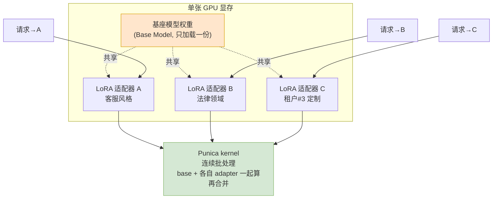

*（对应原书 Figure 10-8：多个 LoRA 适配器与主模型共同驻留在 GPU 显存）*

### 5.2 为什么：把 N 张 GPU 压成 1 张

核心收益：

> "**单个基座模型实例可以并发服务多个微调 LoRA 适配器**，减少所需 GPU 数量（见 Figure 10-9），同时仍支持领域特定行为或按租户定制。"

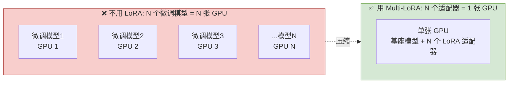

*（对应原书 Figure 10-9：左=不用 LoRA 服务 N 个微调模型需要 N 张 GPU；右=用 N 个 LoRA 适配器只需 1 张 GPU）*

**成本对比一目了然：**

| 方案 | GPU 数量 | 显存占用 | 适用场景 |
|------|----------|----------|----------|
| 每个微调模型独立部署 | N 张 | N × 完整模型 | 每个模型都有大流量 |
| Multi-LoRA（共享基座） | **1 张** | 1 × 基座 + N × 小适配器 | 每个适配器流量都不大 |

### 5.3 代价：什么时候**不**该用 Multi-LoRA？

书里提了一个很重要、也很容易被忽略的问题：

> "现在问题来了：服务微调模型时，是不是**总该**采用 Multi-LoRA？**不一定。**"

判断准则：

- **每个 LoRA 适配器流量都很大**、大到需要多个模型副本横向扩展（数据并行）→ 那你**不如把每个 LoRA 适配器合并（merge）进主模型、各自独立服务**。
- **Multi-LoRA 主要适用于**：**每个适配器的流量相对较低**、单独服务每个适配器都**喂不饱硬件**的情况。

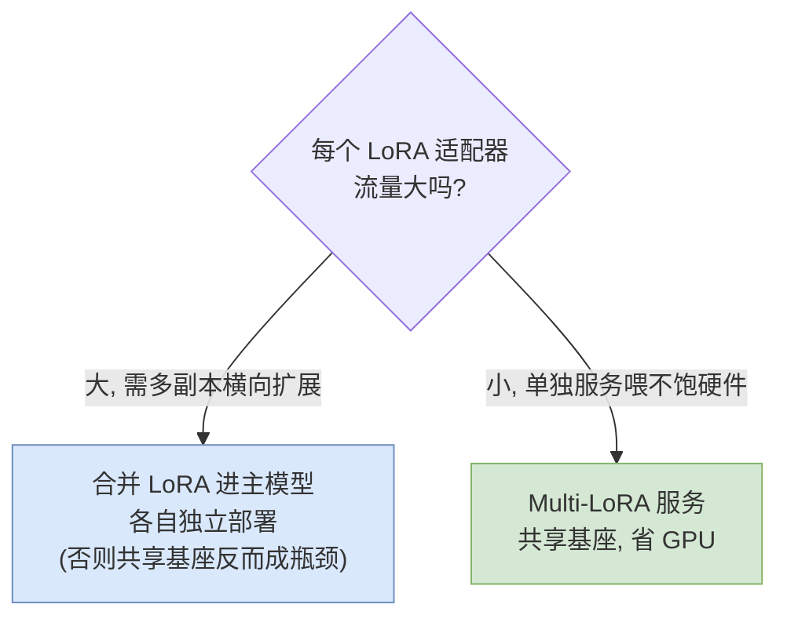

> 🔬 **第一性原理**：Multi-LoRA 的本质是**用共享基座换 GPU 数量**。当每个适配器都是"大户"时，共享基座反而成了瓶颈（所有大流量抢一份基座的算力），此时合并 + 独立扩展才对。**Multi-LoRA 是"长尾定制"的利器，不是"头部大流量"的银弹。**

> 💡 **实战**：vLLM、SGLang、TGI 都原生支持 Multi-LoRA。vLLM 里用 `--enable-lora --max-loras N --max-lora-rank R` 开启，请求里带 `lora_request` 指定用哪个适配器。典型用途：SaaS 多租户（每个客户一个 LoRA）、多领域客服（法律/医疗/金融各一个 LoRA）。

---

## 6️⃣ 强化学习中的模型服务（Model Serving in Reinforcement Learning）

### 6.1 是什么：RL/RLHF 为 LLM 打开的新前沿

PEFT 方法（如 LoRA）主要通过**监督训练**适配模型；而 LLM 强化学习的最新进展——如 **RLHF（Reinforcement Learning from Human Feedback，基于人类反馈的强化学习）**——打开了新前沿。

> RLHF 不是简单地在标注数据上训练，而是**融入人类偏好**来精炼模型的回应方式。最终产出的不只是一个"知道正确答案"的模型，而是**更有帮助、更礼貌、更安全、更贴合人类意图**的模型。RL 调优在**开放式生成任务**（正确性非常主观）里尤其有价值。

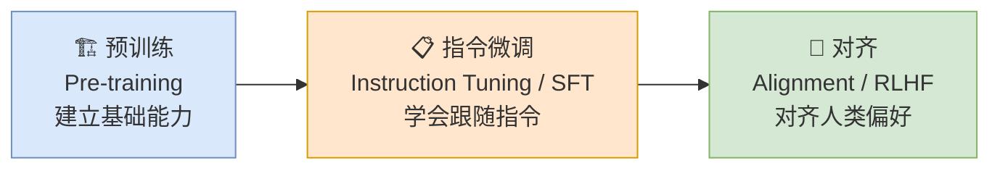

*（对应原书 Figure 10-10：LLM 训练的各阶段，从打基础到跟随指令到对齐人类）*

### 6.2 为什么：服务系统是 RLHF 训练循环的核心（80% 时间在这）

这是本节最颠覆认知的洞察——**推理引擎不再只是"训练完之后才用的东西"，它现在是训练本身的一部分**：

> "**OpenRLHF**（一个非常流行的开源 RLHF 框架）估计，**RLHF 训练时间的 80% 花在模型服务的采样生成阶段（sample-generation stage）**。"

也就是说，训练一个 RLHF 模型，八成时间不是在做梯度更新，而是在**用推理引擎（vLLM、SGLang）生成候选回复**。

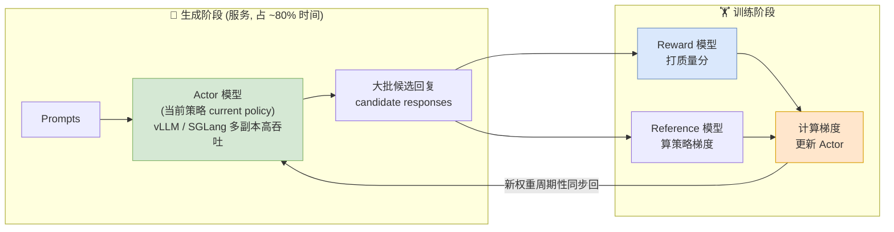

*（对应原书 Figure 10-11：RL 的生成（服务）阶段（左）和训练阶段（右））*

**逐步讲解这个循环：**

1. **生成阶段（左）**：prompts 被送给 **Actor 模型**——即 RLHF 中正在被优化的"当前语言模型版本"。用 RL 术语说，Actor 模型就是"**当前策略（current policy）**"。随训练推进，Actor 被反复更新，"当前策略"就是它**最新的参数集**。Actor 用**高吞吐服务系统跨多副本部署**，目标是高效生成大批候选回复供下游评估。
2. **训练阶段（右）**：生成的回复传给训练阶段——**Reward 模型（奖励模型）**给质量打分，**Reference 模型（参考模型）**帮助计算策略梯度。Actor 基于这些梯度更新，其**新权重周期性同步回服务副本**。

核心洞察：

> "这个架构凸显了：服务系统尽管最初是为**推理**而建的，如今已是 **RLHF 训练循环的有机组成部分**。它们支撑了跨数千并发请求、从大模型进行的**可扩展、低延迟采样**。"

> 💡 **面试高频**："RLHF 训练里为什么要用 vLLM 这样的推理引擎？"——因为 rollout（采样生成）占了 80% 的时间，而它本质是一个大规模推理任务；用高吞吐推理引擎能极大加速整个训练。这也解释了为什么 **veRL、OpenRLHF、TRL、NeMo-Aligner** 等 RL 框架都深度集成 vLLM/SGLang。

### 6.3 确定性：RL 服务里被低估的关键（Determinism）

在这些服务引擎里，**确定性（determinism）和吞吐、可扩展性同等关键**。

> "在 RLHF 里，**跨副本或跨运行的哪怕极小的非确定性，都会传播成不一致的奖励、不稳定的训练、不可复现的结果**。换句话说，**可复现的推理和性能一样重要**。"

书里引用了一个重要的近期工作：

> **Thinking Machines 的《Defeating Nondeterminism in LLM Inference》（战胜 LLM 推理中的非确定性）**表明：像 **batch-shape 变化（batch-shape variation，批形状变化）**这样微妙的实现细节，会引入**微小偏差**，这些偏差在**数千次 RLHF 迭代中累积**。在结合生成、奖励打分、策略更新的流水线里，这种漂移（drift）会**破坏奖励或梯度估计的稳定性**。

因此，现代用于 RL 的服务引擎，关注的不只是服务性能，还有 **batch-invariant 确定性推理（batch-invariant deterministic inference，批不变的确定性推理）**——确保**可复现的 token 输出**。

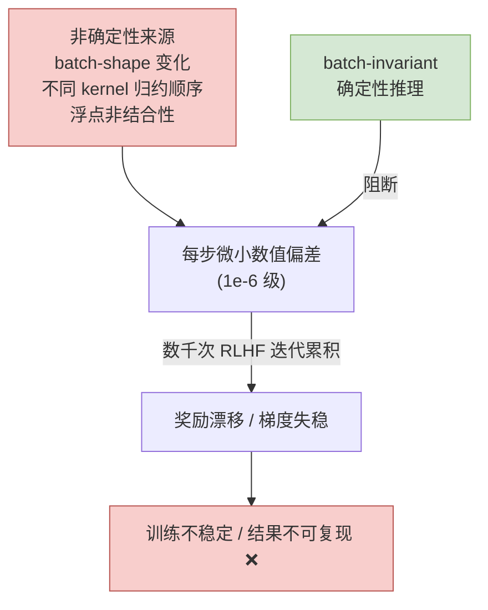

> 🔬 **第一性原理**：为什么"batch-shape 变化"会导致非确定？因为 GPU 上的浮点归约（reduction，如 softmax 分母求和、matmul 累加）**顺序不同结果就不同**（浮点加法**不满足结合律**：$(a+b)+c \neq a+(b+c)$ 在有限精度下）。当 batch size 变化时，kernel 会选不同的分块/归约策略，归约顺序变了，最后一个 bit 就可能不同。单次推理这点误差无所谓；但 RLHF 里它会沿着"生成→打分→梯度→更新"的链条被放大和累积。

> ⚠️ **常见坑**：很多人以为"设了随机种子（seed）就确定了"。种子只固定了采样的随机性，**固定不了浮点归约顺序**。真正的批不变确定性需要**专门实现批不变的 kernel**（对任意 batch size 都用相同的归约顺序），这正是 Thinking Machines 那篇工作的核心贡献。这是 2025 年 RL Infra 领域最前沿的话题之一。

---

## 📌 本章小结

本章覆盖了 LLM 服务中最具前瞻性的技术，它们共同反映了这个领域正**多快地超越纯文本、走向更丰富、更动态、更个性化的体验**：

| # | 前沿方向 | 一句话本质 | 核心代价/开放问题 |
|---|---------|-----------|-----------------|
| 1️⃣ | **语义缓存与路由** | 用 Embedding + 向量搜索识别"意图相同"，从副本级升级到端点级智能分发 | 假命中、阈值难调、PII 脱敏漏网 |
| 2️⃣ | **性能剖析** | Serving→Framework→Runtime 三层下钻，Nsight Systems/Compute + PyTorch Profiler 分工 | "利用率高≠高效"，需按决策流程图定位根因 |
| 3️⃣ | **多模态服务** | 图像被展开成数百个 token 塞进自回归解码器；输入多模态 ≠ 输出多模态 | CPU 前处理成新瓶颈，靠 vLLM v1 进程分离解耦 |
| 4️⃣ | **边缘 AI** | 延迟/数据本地性/成本三力驱动；NPU/压缩/异构/温控/边云混合五技术使能 | 云看性能、边看 TOPS/W 与温度，目标函数根本不同 |
| 5️⃣ | **Multi-LoRA** | 一个基座 + N 个 LoRA 适配器，把 N 张 GPU 压成 1 张 | 只适合"低流量长尾定制"，大流量应合并独立部署 |
| 6️⃣ | **RL 中的服务** | 推理引擎是 RLHF 训练循环的核心（占 80% 时间），是 Actor 采样的引擎 | 确定性和吞吐同等重要，batch-invariant 是前沿难题 |

**三条贯穿本章的主线（也是全书的收束）：**

1. 🧠 **服务系统在"变聪明"**——从"选哪台机器"（副本级）升级到"选哪个模型、要不要缓存、要不要推理、要不要开工具"（端点级、语义级）。
2. 🔀 **服务边界在"扩张"**——从纯文本到多模态、从云到边缘、从"一个模型"到"一个基座+N 个适配器"、从"推理"到"训练循环的一部分"。
3. 🎯 **优化的抓手在"下沉"**——从系统级指标下钻到 kernel 微架构，从"够快就行"到"最后 1% 也是数百万美元"，从"能跑"到"可复现"。

> 作者在全书结语里说：
> "LLM 服务的空间会持续飞速演进。**硬件架构会变、模型家族会增、新模态会涌现，但你在这里学到的原理会留存下来。** 工具已经在你手里了，下一代智能系统由你来构建。"

---

## 🔗 延伸阅读

### 📖 回顾本书相关章节

- **[第 1 章] 模型服务与优化导论**：服务范式（边缘/单模型/多模型/平台）——本章边缘 AI 与 Multi-LoRA 的多模型服务是它的延伸。
- **[第 4 章] 模型服务最佳实践**：Agent、RAG/CAG、MCP、企业系统架构——本章语义路由的工具过滤、Agentic 场景直接承接。
- **[第 5 章] 服务 LLM 的挑战**：GPU 规格、算术强度、其他 AI 加速器与趋势——本章边缘 NPU/TOPS-W 是它的边缘对照。
- **[第 6 章] 基础优化技术**：量化、剪枝、蒸馏、前缀缓存、连续批处理——本章 Multi-LoRA 的连续批处理、边缘压缩、语义缓存都建立在此。
- **[第 7 章] 高级优化技术**：数据/张量/流水线/专家并行、**PD 分离**、高级 KV 缓存（LMCache）——本章数据并行路由、异构流水线、KV 池化的思想源头。
- **[第 8 章] LLM 服务框架**：vLLM 架构与调度器深潜——本章 vLLM v0→v1 进程分离、Multi-LoRA、RL 集成的框架基础。
- **[第 9 章] 实战优化**：Qwen3-14B 端到端调优——本章性能剖析是它的"更深一层"。

### 🗂️ 仓库内相关目录（llm-action）

- `llm-inference/`：LLM 推理优化实践（vLLM、TensorRT-LLM、量化、并行）——对照本章性能剖析与 Multi-LoRA。
- `ai-infra-architecture/`：AI 基础设施架构——对照本章企业级语义路由、边云混合、RL 训练循环的系统设计。
- `enigneer-infra/cuda-mastery/`：CUDA 编程逐章精讲 + 6 个算子实战优化——本章 Runtime 层剖析（Nsight Compute、kernel 融合、shared memory）的动手补充。

### 🌐 本章点名的外部前沿工作（值得追踪）

- **OpenRLHF / veRL / TRL / NeMo-Aligner**：深度集成 vLLM/SGLang 的开源 RLHF 框架——理解"推理引擎作为训练组件"。
- **Thinking Machines《Defeating Nondeterminism in LLM Inference》**：batch-invariant 确定性推理的开创性工作——RL 服务确定性的必读。
- **Punica / S-LoRA**：Multi-LoRA 高效服务 kernel 与系统。
- **ModernBERT**：本章语义路由里做轻量分类/复杂度判断的编码器。
- **MCP（Model Context Protocol）**：Agentic 工具注册与过滤的协议标准。

---

*🎓 至此，《Hands-On LLM Serving and Optimization》全书精讲完结。从第 1 章的"什么是模型服务"，到第 10 章的"下一代服务系统"，愿这套讲义帮你把 LLM 服务从一个黑盒，变成一片可以尽情探索的工程风景。工具在你手里了，去构建吧。*
