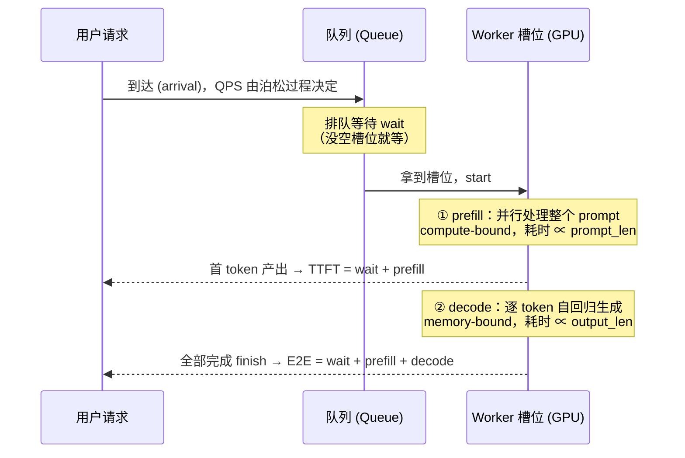
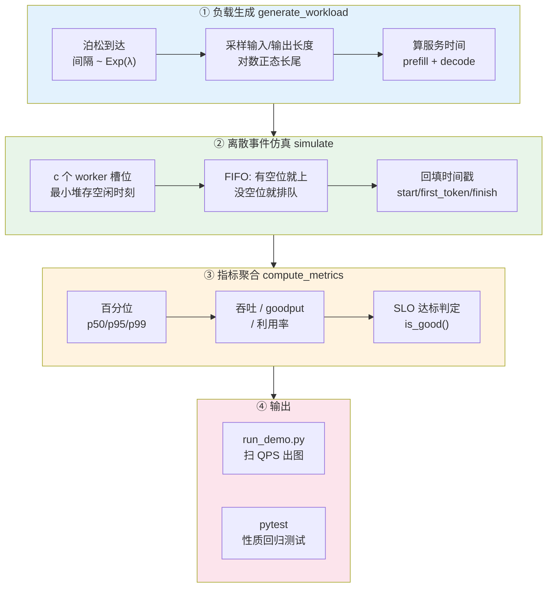
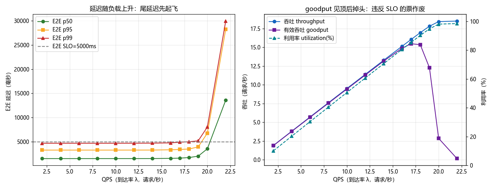
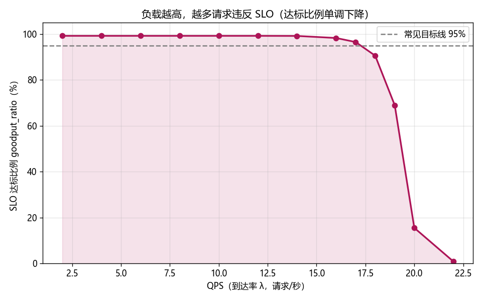

# 🎯 项目 01 · 服务 SLO / 指标 Harness（Serving SLO & Metrics Harness）

> 配套《Hands-On LLM Serving and Optimization: Hosting LLMs at Scale》(Chi Wang, Peiheng Hu) 第 4 章「模型服务最佳实践」的 *Measuring Performance* 一节 + 第 5 章「服务 LLM 的挑战」的瓶颈直觉。
>
> **一句话**：给一个 LLM 推理服务写一台「体检仪」——喂它一条仿真到达流（每个请求有 prefill + decode 两段耗时），量出 **p50/p95/p99 延迟、吞吐（throughput）、goodput（有效吞吐）、GPU 利用率**，并画出「延迟-吞吐曲线」，找到容量的**拐点（knee）**。
>
> 🖥️ **纯 CPU、零网络、零模型权重、秒级跑完、结果可复现**。这是所有 LLM 服务优化的**验收坐标系**——不会量，就无法优化。

---

## 📚 目录

1. [为什么要做这个项目：优化的前提是「会量」](#1)
2. [核心概念：TTFT / TPOT / E2E / 吞吐 / goodput / 利用率](#2)
3. [第一性原理：排队论 + prefill/decode 两阶段](#3)
4. [系统架构（mermaid）](#4)
5. [代码逐行精讲](#5)
6. [如何运行](#6)
7. [实验结果与解读（延迟-吞吐曲线）](#7)
8. [测试在测什么](#8)
9. [💡 面试高频 / ⚠️ 常见坑 汇总](#9)
10. [📌 小结 & 🔗 延伸](#10)

---

<a name="1"></a>
## 1️⃣ 为什么要做这个项目：优化的前提是「会量」

书里第 5 章开篇有一句话点破了整本书的动机：

> *如果你不懂底层原理，优化 LLM 服务就会变成「令人疲惫的试错实验」——你可能瞎猫碰死耗子地卡在一个局部最优里还不自知。*

而第 4 章的 *Measuring Performance* 一节告诉你：**所有优化最终都要用「指标」来验收**。你换了连续批处理、上了量化、做了 PD 分离……到底有没有变好？变好多少？代价是什么？——只有一台可靠的「体检仪」能回答。

> 🔬 **第一性原理：不可测量，则不可优化（If you can't measure it, you can't improve it）。**
> 但 LLM 服务的「测量」有个大坑：**平均值会骗人**。平均延迟 1 秒听起来很好，但如果 p99 是 20 秒，那就有 1% 的用户在疯狂等待、疯狂流失。LLM 服务是**尾延迟（tail latency）敏感**的，所以我们必须盯 **p95/p99**，而不是均值。

这个 harness 就是那台体检仪。它**不跑真模型**（真模型要 GPU、要几十 GB 显存），而是用一个**离散事件仿真（discrete-event simulation）** 复现「请求排队 → prefill → decode → 完成」的全过程，把指标的**定义**和**趋势**讲透。真实压测（用 vLLM / TGI 打真流量）用的是同一套指标，只是把「仿真的服务时间」换成「真实的 GPU 计时」而已。

| 你会造出的能力 | 对应文件 |
|---|---|
| 手写 **p99 百分位**（面试高频），并与 numpy 对拍证明正确 | `slo_harness.py::percentile` |
| 用**泊松过程**合成一条真实的到达流（长尾输入/输出） | `slo_harness.py::generate_workload` |
| 用**最小堆**实现一个 `c 服务台`离散事件仿真（M/G/c 排队） | `slo_harness.py::simulate` |
| 定义 **SLO** 并算出 **goodput / goodput_ratio / 利用率** | `slo_harness.py::SLO / compute_metrics` |
| **扫 QPS** 画出延迟-吞吐曲线，找容量拐点 | `run_demo.py` |
| 用 **pytest** 把「百分位正确、尾延迟单调、goodput 单调」焊成回归测试 | `tests/test_slo_harness.py` |

---

<a name="2"></a>
## 2️⃣ 核心概念：一张表吃透 6 个指标

书里第 4 章列出的服务指标，我把它们整理成这张**必背表**（面试直接问「TTFT 和 TPOT 有什么区别」）：

| 指标 | 全称 | 定义 | 由谁决定 | 用户感受 |
|---|---|---|---|---|
| **TTFT** | Time To First Token | 首 token 时刻 − 到达时刻 = 排队 + **prefill** | prefill（算力 + 输入长度） | 「等了多久看到第一个字」 |
| **TPOT** | Time Per Output Token | decode 阶段平均每个输出 token 的时间 | **decode**（显存带宽） | 「吐字流不流畅」 |
| **E2E** | End-to-End latency | 完成时刻 − 到达时刻 = 排队 + prefill + decode | 三者之和 | 「整体多久答完」 |
| **吞吐** | Throughput (RPS/TPS) | 单位时间完成的请求数 / token 数 | 系统整体 | 决定**成本** |
| **goodput** | Good throughput | 单位时间内**满足 SLO** 的完成请求数 | 吞吐 × 达标率 | 「有多少票是有效的」 |
| **利用率** | Utilization | 服务台忙碌时长 / 可用总时长（≈ GPU 利用率代理） | 负载 vs 容量 | 决定**是否该扩容** |

> 💡 **面试高频：为什么要区分 TTFT 和 TPOT？**
> 因为它们**受不同硬件瓶颈约束、优化手段完全不同**：
> - **TTFT 由 prefill 决定**，prefill 是 **compute-bound（算力受限）**——一次性并行处理整个 prompt，把 GPU 算力打满。想降 TTFT → chunked prefill、更快的算子（FlashAttention）、更强的卡。
> - **TPOT 由 decode 决定**，decode 是 **memory-bandwidth-bound（带宽受限）**——每步只算 1 个 token，却要把整个 KV Cache + 权重从显存搬一遍，算力闲着、带宽是瓶颈。想降 TPOT → 量化（减少搬运字节）、投机解码（一步出多个 token）、更高带宽的显存（HBM3）。
>
> 这正是本书第 5 章的立论根基，也是 `ai-infra-architecture` 里 [屋顶线模型](../../../ai-infra-architecture/02_GPU结构_从SM到集群_全面本质.md) 的核心。

> 💡 **面试高频：goodput vs throughput，为什么要发明 goodput？**
> 因为**吞吐会骗人**。你可以把 batch 开到极大，吞吐（RPS）冲上天——但每个请求都排队 30 秒，全部违反 SLO。这时候吞吐再高也是**废票**，用户全跑光了。
> **goodput = 吞吐 × 满足 SLO 的比例**，它只统计「又快又对」的票。真正的容量规划看的是 **goodput 的峰值**，不是 throughput 的峰值。这是本项目 `run_demo.py` 那张图最想让你看到的东西。

---

<a name="3"></a>
## 3️⃣ 第一性原理：排队论 + prefill/decode 两阶段

### 3.1 为什么负载一高，尾延迟就「起飞」？

这是排队论最经典、也最反直觉的结论。设服务台利用率为 ρ（rho，= 到达率 / 服务能力），排队论（M/M/1 近似）告诉我们**平均等待时间**：

$$
W_q \;\propto\; \frac{\rho}{1-\rho}
$$

看这个式子：当 ρ 从 0.5 涨到 0.9，等待时间涨 **9 倍**；从 0.9 涨到 0.99，再涨 **11 倍**！**当 ρ → 1，等待时间 → ∞。** 这就是为什么：

> ⚠️ **常见坑：把 GPU 利用率拉到 95%+ 是「作死」。**
> 很多新手以为「利用率越高越省钱」，于是把负载往死里加。但利用率一旦逼近 100%，**排队队列爆炸、尾延迟起飞、goodput 反而暴跌**。生产上通常把稳态利用率控制在 **60%~80%**，留出余量吸收流量抖动（burst）。本项目的实验图会让你**亲眼看到**这个拐点。

尾延迟（p99）比均值涨得更凶：均值是 W_q，但 p99 还要叠加「运气差、正好排在一堆长请求后面」的情形。**队列越满，p99 和均值的差距越大。**

### 3.2 prefill / decode 两阶段：一个请求的生命周期



这张图对应本项目 `Request` 里的 4 个时间戳：`arrival → start → first_token → finish`。所有指标都是这几个时间戳的差值。

> 🔬 **第一性原理：为什么 decode 主导了一个请求的耗时？**
> 本项目默认参数：prompt 512 token，prefill ≈ 0.3ms/token → **154ms**；output 128 token，decode ≈ 12ms/token → **1536ms**。decode 是 prefill 的 **10 倍**！这不是瞎编——真实 LLM 里，prefill 一次并行吃掉整个 prompt（算力高效），decode 却要一个 token 一个 token 地挤牙膏，每步都把几 GB 的权重 + KV Cache 从显存搬一遍，**带宽利用率极低**。这就是为什么「decode 优化」（连续批处理、投机解码、量化）是整个 LLM 推理优化的**主战场**。

---

<a name="4"></a>
## 4️⃣ 系统架构



四个阶段各司其职，都是**纯函数式**（无全局状态、无副作用），所以极易测试、极易复现。

---

<a name="5"></a>
## 5️⃣ 代码逐行精讲

### 5.1 手写百分位 `percentile`（面试必考）

```python
def percentile(data, q):
    xs = sorted(data)              # ① 升序排序
    n = len(xs)
    if n == 1:
        return float(xs[0])
    pos = (n - 1) * (q / 100.0)    # ② 第 q 百分位在「下标空间」的位置
    lo = math.floor(pos)           # ③ 下界下标
    hi = math.ceil(pos)            # ④ 上界下标
    if lo == hi:
        return float(xs[lo])       # ⑤ 正好落在整数下标，无需插值
    frac = pos - lo                # ⑥ 小数部分（插值权重）
    return float(xs[lo] * (1.0 - frac) + xs[hi] * frac)  # ⑦ 线性插值
```

**逐行讲**：

- **①** 百分位必须先排序，`sorted()` 返回新列表，不改原数据（无副作用）。
- **②** 关键在 `n - 1` 而不是 `n`：下标从 `0` 到 `n-1`，`q=0` 对应下标 0（最小值），`q=100` 对应下标 `n-1`（最大值）。用 `n` 会越界。
- **③④** `pos` 一般是小数（比如 `p95` 落在下标 3.8 处），用 floor/ceil 夹出它两侧的整数下标。
- **⑤** 若 `pos` 恰好是整数（比如中位数在偶数个元素时），`lo == hi`，直接取值。
- **⑥⑦** 线性插值：`pos=3.8` 意味着结果在 `xs[3]` 和 `xs[4]` 之间、偏向 `xs[4]` 八成，故权重 `frac=0.8`。这与 `numpy.percentile(method='linear')` **完全一致**——测试里我们对拍证明了。

> ⚠️ **常见坑：`np.percentile` 有 9 种插值方法。**
> numpy 1.22+ 用 `method=` 参数（旧版是 `interpolation=`），默认 `'linear'`。还有 `'lower' / 'higher' / 'nearest' / 'midpoint'` 等。**不同方法在小数据上结果不同**！写测试对拍时一定要指定 `method='linear'`，否则会「明明实现对了却报错」。

> 💡 **面试高频：p99 为什么比 p50 难优化？**
> p50 只要「大多数请求快」就行；p99 要求「连倒霉的那 1% 都不能太慢」。降 p50 靠提升平均性能，降 p99 靠**消除长尾**——排查慢请求（超长 prompt、GC 停顿、冷启动、抢占）。生产上「优化 p50 容易，压 p99 是苦活」。

### 5.2 泊松到达流 `generate_workload`

```python
gap = rng.expovariate(lam)   # 到达间隔 ~ 指数分布 Exp(λ)
t += gap                      # 累加得到绝对到达时刻
plen = _sample_len(rng, cfg.mean_prompt_len)   # 输入长度（长尾）
olen = _sample_len(rng, cfg.mean_output_len)   # 输出长度（长尾）
prefill_s = (cfg.prefill_fixed_ms + plen * cfg.prefill_ms_per_tok) / 1000.0
decode_s  = (olen * cfg.decode_ms_per_tok) / 1000.0
```

- **`expovariate(lam)`**：泊松过程的到达间隔服从**指数分布**，均值 `1/λ`。这是排队论对「随机独立到达」的标准建模，也贴近真实在线流量。
- **服务时间线性于长度**：`prefill ∝ prompt_len`（并行处理整个输入）、`decode ∝ output_len`（逐 token 生成）。这是对 roofline 的一阶近似——**趋势正确**足以复现所有规律。

`_sample_len` 用**对数正态分布（log-normal）**采样长度：

```python
sigma = 0.5
mu = math.log(mean) - 0.5 * sigma * sigma   # 令 E[X] = mean
val = math.exp(rng.gauss(mu, sigma))
```

> 🔬 **第一性原理：为什么用对数正态而不是纯指数/几何？**
> 真实 LLM 流量是**右偏长尾**（多数请求中等长度、少数超长），长尾请求是尾延迟的元凶。但**纯指数分布尾巴过肥**——会频繁冒出 10 倍于均值的长度，把低负载下的 TTFT 都拖到几秒，破坏「低负载几乎全达标」这一容量规划直觉。对数正态右偏、有长尾、但尾巴更温和，且**均值可控**（由 `E[X]=exp(μ+σ²/2)` 反解 μ），是描述「时长/长度」类正数的经典分布。

### 5.3 离散事件仿真 `simulate`（本项目的心脏）

```python
free_at = [0.0] * num_workers   # c 个槽位的「下次空闲时刻」
heapq.heapify(free_at)          # 变成最小堆
for r in requests:              # 按到达序处理
    earliest_free = free_at[0]           # ① 最早空出来的槽位
    start = max(r.arrival, earliest_free) # ② 没空位就等到 earliest_free
    r.start = start
    r.first_token = start + r.prefill_time # ③ 首 token = 开始 + prefill
    r.finish = r.first_token + r.decode_time # ④ 完成 = 首 token + decode
    heapq.heapreplace(free_at, r.finish)  # ⑤ 该槽位下次空闲更新回堆
```

**这段代码是精髓，逐行拆：**

- **①** `free_at` 是一个大小 `c` 的最小堆，堆顶 `free_at[0]` 永远是「最早能腾出来的槽位时刻」。
- **②** 核心逻辑：一个请求什么时候能开始？两种情况取较晚者——要么它**到达时就有空位**（`arrival >= earliest_free`，无需等待），要么**所有槽位都忙**，得等到最早的那个空出来（`earliest_free`）。一行 `max()` 就把「排队」建模完了。
- **③④** 拿到槽位后，先花 `prefill_time` 出首 token（TTFT 就此确定），再花 `decode_time` 全部完成。
- **⑤** `heapreplace` = 弹出堆顶（那个被占用的旧空闲时刻）+ 压入新值（`r.finish`，该槽位下次空闲），一步完成，`O(log c)`。

> 💡 **面试高频：为什么用最小堆？复杂度是多少？**
> 因为我们每一步只关心「**哪个槽位最早空**」——这是堆的拿手好戏（`O(log c)` 取最小 + 更新）。总复杂度 `O(N log c)`，N 个请求各处理一次。若用数组线性扫最小值就是 `O(N·c)`。这是「用对数据结构」的经典案例，和「合并 K 个有序链表」「Dijkstra」同源。

> ⚠️ **常见坑：这个仿真是「简化模型」。**
> 真实 LLM 连续批处理里，prefill 和 decode 会**交错执行、共享一个 batch、共享显存**，一个 step 同时推进几十个序列。本项目把每个请求当成「独占一个槽位、prefill+decode 连续跑完」，抓的是「**排队 + 服务时长**」的一阶效应。它足以正确复现「负载↑→尾延迟↑→goodput 见顶掉头」的全部规律，但**不建模** KV Cache 显存挤兑、抢占（preemption）、chunked prefill 等二阶效应——那些是 `ai-infra-architecture` 里 [连续批处理仿真](../../../ai-infra-architecture/projects/07_continuous_batching_sim) 的活。**知道模型的边界，是工程师的基本素养。**

### 5.4 SLO 判定与指标聚合 `compute_metrics`

```python
t0 = min(r.arrival for r in served)
t_end = max(r.finish for r in served)
makespan = max(t_end - t0, 1e-9)         # ① 墙钟时间（系统实际运转多久）

num_good = sum(slo.is_good(r) for r in served)  # ② 达标请求数
throughput = n / makespan                 # ③ 吞吐 = 完成数 / 墙钟
goodput = num_good / makespan             # ④ 有效吞吐 = 达标数 / 墙钟
goodput_ratio = num_good / n              # ⑤ 达标比例 ∈ [0,1]

busy = sum(r.prefill_time + r.decode_time for r in served)
utilization = busy / (num_workers * makespan)   # ⑥ 利用率
utilization = min(max(utilization, 0.0), 1.0)   # ⑦ 夹到 [0,1]
```

- **①** `makespan`（跨度）= 从第一个到达到最后一个完成。用它当分母才对——它是「系统真正在干活的时间」。
- **③④⑤** 三个吞吐指标。注意恒等式 **`goodput ≤ throughput`**（达标票是全部票的子集），测试里专门验了这条。
- **⑥** 利用率的物理含义：**分子** = 所有槽位累计的忙碌时长（`Σ 每个请求的服务时间`）；**分母** = `c 个槽位 × 墙钟时间`（所有槽位能提供的总时长）。这就是「多服务台平均利用率」，用作 **GPU 利用率的代理指标**。
- **⑦** 边界上可能因浮点/边界效应略超 1，夹到 `[0,1]` 更符合「利用率」语义。

`SLO.is_good` 是「三门槛全过才算好」：

```python
def is_good(self, r):
    if self.ttft_ms is not None and r.ttft * 1000 > self.ttft_ms: return False
    if self.tpot_ms is not None and r.tpot * 1000 > self.tpot_ms: return False
    if self.e2e_ms  is not None and r.e2e  * 1000 > self.e2e_ms:  return False
    return True
```

> 💡 **实战：SLO 常是「多维 AND」。** 生产上一条请求要同时满足「TTFT < 500ms **且** TPOT < 50ms **且** E2E < 5s」才算达标——任一维度超标，用户体验就崩了。`None` 表示「该维度不设限」，灵活。

---

<a name="6"></a>
## 6️⃣ 如何运行

```bash
# 1) 进入项目目录
cd book-hands-on-llm-serving/projects/01_serving_slo_harness

# 2)（可选）装依赖——本机 Python 3.13 已预装 numpy/matplotlib/pytest
pip install -r requirements.txt

# 3) 跑测试（必须全绿）
python -m pytest -q
#   预期： 19 passed

# 4) 跑 demo，出图 + 打印容量规划建议
python run_demo.py
#   产出： latency_throughput.png（延迟-吞吐双子图）
#          slo_attainment.png （SLO 达标比例曲线）
```

> ⚠️ **常见坑：Windows PowerShell 控制台是 GBK 编码，打印中文可能显示乱码。**
> 这**不影响**功能——`.py` 源码、`.png` 图片都是正确的 UTF-8/图像。若想让控制台也正常显示中文，可先执行 `chcp 65001` 切到 UTF-8，或直接看生成的 PNG 图（图里中文用 Microsoft YaHei 渲染，完全正常）。

> ⚠️ **常见坑：matplotlib 中文显示成方框 □□□。**
> 本项目在 `run_demo.py` 顶部已处理好三件事，缺一不可：
> ```python
> matplotlib.use("Agg")                                   # ① 无界面后端，服务器/无显示器也能出图
> rcParams["font.sans-serif"] = ["Microsoft YaHei", "SimHei"]  # ② 指定中文字体
> rcParams["axes.unicode_minus"] = False                  # ③ 修负号（否则负号变方块）
> ```
> **`matplotlib.use("Agg")` 必须在 `import matplotlib.pyplot` 之前**，否则后端锁定失败。

---

<a name="7"></a>
## 7️⃣ 实验结果与解读

`run_demo.py` 在 `workers=32`（≈ 连续批处理最大 in-flight 序列数）、`SLO: TTFT≤800ms / TPOT≤20ms / E2E≤5000ms` 下扫 QPS，得到：

```
QPS= 2.00 | 吞吐= 1.91 | goodput= 1.90 (99.2%) | util=10.2% | E2E p50/p95/p99=1512/3269/4683ms
QPS= 8.00 | 吞吐= 7.62 | goodput= 7.56 (99.2%) | util=40.6% | E2E p50/p95/p99=1512/3269/4683ms
QPS=14.00 | 吞吐=13.27 | goodput=13.15 (99.1%) | util=70.6% | E2E p50/p95/p99=1520/3279/4706ms
QPS=16.00 | 吞吐=15.13 | goodput=14.86 (98.2%) | util=80.5% | E2E p50/p95/p99=1559/3328/4756ms
QPS=17.00 | 吞吐=16.04 | goodput=15.48 (96.5%) | util=85.4% | E2E p50/p95/p99=1607/3398/4897ms  ← 拐点
QPS=18.00 | 吞吐=16.95 | goodput=15.35 (90.5%) | util=90.3% | E2E p50/p95/p99=1723/3490/4986ms
QPS=19.00 | 吞吐=17.81 | goodput=12.28 (68.9%) | util=94.8% | E2E p50/p95/p99=2017/3926/5185ms
QPS=20.00 | 吞吐=18.43 | goodput= 2.86 (15.5%) | util=98.1% | E2E p50/p95/p99=3539/6768/8042ms
QPS=22.00 | 吞吐=18.50 | goodput= 0.16 ( 0.9%) | util=98.5% | E2E p50/p95/p99=13599/28260/29952ms
```

### 图 1：延迟-吞吐曲线（`latency_throughput.png`）



**怎么读这张图**：

- **左图**：QPS < 16 时三条延迟线**平坦**（几乎无排队，只有服务时间本身）；**过了 QPS≈17-18，p99 尾延迟率先「起飞」冲破 SLO 虚线**，p95、p50 随后跟上。这就是 `ρ/(1-ρ)` 在利用率逼近 100% 时的爆炸。
- **右图**：吞吐（蓝）随 QPS 线性上涨直到容量上限（≈18.5 req/s，理论值 32/1.7≈18.6）后压平；**goodput（紫）在 QPS≈17 见顶，之后掉头暴跌**——因为越来越多请求违反 SLO 变成废票。利用率（青虚线）单调爬向 100%。

> 🔬 **第一性原理：容量拐点（knee）= goodput 的峰值。**
> 系统真正的「服务能力」不是吞吐峰值（18.5），而是 **goodput 峰值对应的 QPS（≈17）**。超过这个点，你加的每一分负载都在制造违反 SLO 的废票——**吞吐还在涨，用户体验已经崩了**。容量规划就是找到这个拐点，并留出安全余量（跑在 util 60~80%）。

### 图 2：SLO 达标比例（`slo_attainment.png`）



达标比例（goodput_ratio）随 QPS **单调下降**：低负载 99%+，过拐点后断崖式跌向 0。这条曲线是 SLA 谈判、告警阈值、扩容触发线的直接依据。

---

<a name="8"></a>
## 8️⃣ 测试在测什么（`tests/test_slo_harness.py`，19 passed）

好的仿真必须有**性质测试（property test）** 保驾——不是测「具体某个数」，而是测「不管参数怎么变，都必须成立的规律」。

| 测试 | 断言的性质 | 为什么重要 |
|---|---|---|
| `test_percentile_matches_numpy` | 随机数据上百分位与 `np.percentile(method='linear')` 完全一致 | 证明手写 p99 **正确** |
| `test_percentile_hand_computed` | 小数据上与手算插值结果一致 | 定位边界（p0/p100/中位数） |
| `test_simulate_causality` | `arrival ≤ start ≤ first_token ≤ finish` 恒成立 | 时间戳因果链不能倒流 |
| `test_tail_latency_monotonic_in_qps` | **QPS↑ → p95/p99 单调不降** | 排队论核心规律，仿真的「灵魂」 |
| `test_goodput_ratio_monotonic_decreasing` | **QPS↑ → 达标比例单调不增** | goodput 的本质：越拥塞越多废票 |
| `test_goodput_le_throughput` | `goodput ≤ throughput` 恒成立 | 达标票是全部票的子集 |
| `test_utilization_in_range_...` | 利用率 ∈ [0,1] 且随 QPS 不减 | 利用率的物理约束 |
| `test_more_workers_reduce_latency` | 同负载下 worker↑ → p99↓ | 扩容有效性 |
| `test_ttft_le_e2e` | TTFT ≤ E2E | 首 token 早于完成 |
| `test_slo_is_good_logic` | 逐维度 AND、None 放行 | SLO 判定正确 |
| `test_reproducible_with_seed` | 同 seed 结果完全一致 | **可复现**是仿真的底线 |

> 💡 **面试高频：怎么给「仿真/随机系统」写测试？**
> 答案就是**性质测试**：不锚定具体数值（会脆），而锚定**不变量（invariant）** 和**单调性（monotonicity）**。比如「不管 QPS 怎么设，goodput_ratio 都不该随 QPS 上升」——这条对任何合理的排队仿真都成立，是极强的正确性保证。这是 QuickCheck / Hypothesis 一类工具的思想。

---

<a name="9"></a>
## 9️⃣ 💡 面试高频 / ⚠️ 常见坑 汇总

### 💡 面试速答卡

| 问题 | 一句话答案 |
|---|---|
| TTFT vs TPOT？ | TTFT 由 prefill 决定（compute-bound），TPOT 由 decode 决定（memory-bound），优化手段完全不同 |
| 为什么盯 p99 不盯均值？ | LLM 服务尾延迟敏感，均值会掩盖那 1% 疯狂等待的用户 |
| goodput 是什么、为什么需要它？ | 满足 SLO 的有效吞吐；纯吞吐会被「排队 30 秒的废票」灌水 |
| 利用率越高越好吗？ | 不。逼近 100% 时排队爆炸（`ρ/(1-ρ)`），生产跑 60~80% |
| 容量拐点怎么找？ | goodput 峰值对应的 QPS，不是吞吐峰值 |
| 怎么手写 p99？ | 排序 → `pos=(n-1)*q/100` → floor/ceil 夹 → 线性插值 |
| decode 为什么慢？ | 逐 token 生成，每步搬整个权重+KV Cache，带宽受限、算力闲置 |

### ⚠️ 踩坑清单

1. **百分位用 `n` 而非 `n-1`** → 下标越界 / p100 取不到最大值。
2. **对拍 numpy 忘记指定 `method='linear'`** → 小数据上「明明对却报错」。
3. **`matplotlib.use("Agg")` 写在 `import pyplot` 之后** → 后端锁定失败、无头环境报错。
4. **中文字体没配 / 忘了 `axes.unicode_minus=False`** → 图里中文/负号变方块。
5. **把利用率拉到 95%+ 当省钱** → 尾延迟起飞、goodput 崩。
6. **只看平均延迟做 SLA** → 上线后被 p99 打脸。
7. **仿真忘了固定 seed** → 结果不可复现，测试时红时绿。
8. **误以为这个仿真等价于真实连续批处理** → 它是一阶模型，不建模显存挤兑/抢占。

---

<a name="10"></a>
## 🔟 📌 小结 & 🔗 延伸

### 📌 小结

- **不可测量，则不可优化。** 这个 harness 是所有 LLM 服务优化的**验收坐标系**。
- 六个核心指标：**TTFT / TPOT / E2E**（三种延迟）+ **吞吐 / goodput / 利用率**（三种吞吐/占用）。盯 **p95/p99**，别信均值。
- **goodput = 吞吐 × 达标率**，容量规划找的是 **goodput 峰值（拐点）**，不是吞吐峰值。
- 排队论铁律：利用率逼近 100% 时，尾延迟按 `ρ/(1-ρ)` 爆炸 → 生产跑 60~80%。
- 工程上：手写百分位用**线性插值 + 对拍 numpy**；仿真用**最小堆**做 `O(N log c)` 的 c 服务台调度；测试用**性质/单调性**而非硬编码数值。

### 🔗 延伸阅读

**本书其它章（`book-hands-on-llm-serving/book-guide/`）**：
- [第 4 章 · 模型服务最佳实践](../../book-guide/04_模型服务最佳实践.md) —— 本项目对应的 *Measuring Performance*（E2E/TTFT/TPOT/RPS/TPS）源头，以及分层架构、云选型。
- [第 5 章 · 服务 LLM 的挑战](../../book-guide/05_服务%20LLM%20的挑战.md) —— prefill=compute-bound / decode=memory-bound 的**屋顶线**立论，本项目服务时间模型的物理依据。
- [第 3 章 · 模型服务系统设计：深入](../../book-guide/03_模型服务系统设计：深入.md) —— 队列 / worker / batching 的 6 大组件，本项目仿真的原型。
- [第 6 章 · 核心 LLM 优化技术](../../book-guide/06_核心%20LLM%20优化技术.md) —— 连续批处理如何提升 goodput（用本项目的指标验收它）。

**仓库其它模块**：
- [`ai-infra-architecture/02_GPU结构_从SM到集群`](../../../ai-infra-architecture/02_GPU结构_从SM到集群_全面本质.md) —— 屋顶线模型、算力 vs 带宽的硬件根源。
- [`ai-infra-architecture/09_推理引擎架构`](../../../ai-infra-architecture/09_推理引擎架构_连续批处理_调度_投机解码_chunked_prefill.md) —— 连续批处理、chunked prefill 的调度细节（本仿真的「二阶」升级方向）。
- [`ai-infra-architecture/projects/07_continuous_batching_sim`](../../../ai-infra-architecture/projects/07_continuous_batching_sim) —— 更真实的连续批处理仿真（建模 KV 显存与抢占），可与本项目的指标 harness 组合使用。
- [`ai-infra-architecture/projects/01_pd_disagg_simulator`](../../../ai-infra-architecture/projects/01_pd_disagg_simulator) —— PD 分离仿真：把 prefill / decode 拆到不同池子，看 TTFT / TPOT 如何各自优化。
- [`llm-inference/README.md`](../../../llm-inference/README.md) —— vLLM / TGI / SGLang / TensorRT-LLM 等**真实**推理引擎，用真流量重跑本项目这套指标即为「生产压测」。

---

> 🧩 **下一步玩法（留给读者）**：
> 1. 把 `simulate` 从「每请求独占槽位」升级为「一个 step 同时推进 batch 内多个序列」，逼近真实连续批处理。
> 2. 加入 **优先级调度 / SLO-aware 调度**：短请求插队，看 goodput 能否进一步提升。
> 3. 把服务时间从「线性长度模型」换成「屋顶线模型」，让 prefill 显式 compute-bound、decode 显式 memory-bound。
> 4. 把 harness 接到真实 vLLM，用 `httpx` 打真流量，采集真实时间戳喂给 `compute_metrics`——同一套指标，直接变生产压测工具。
