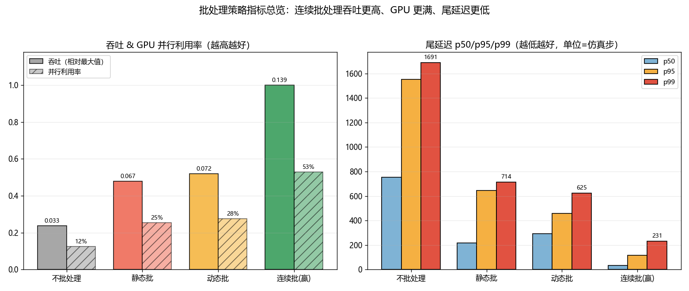
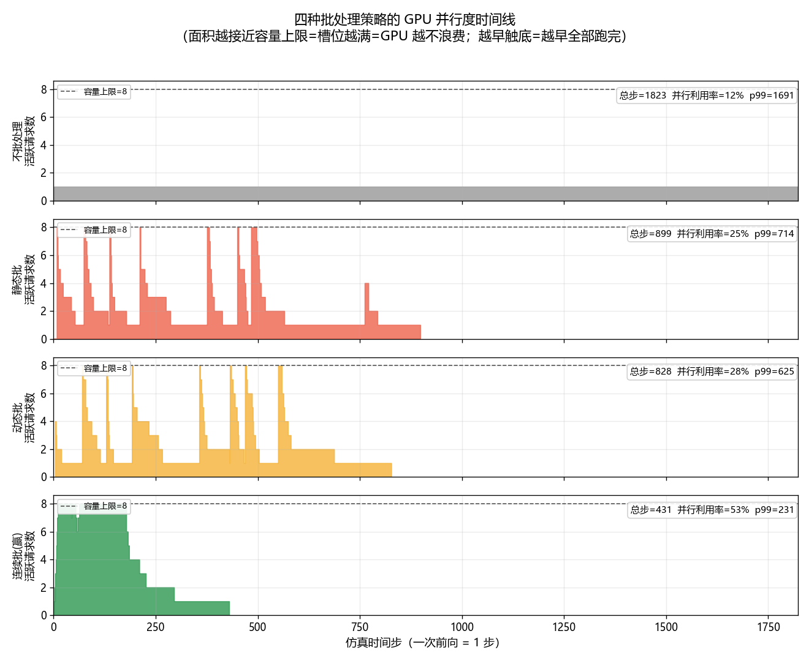
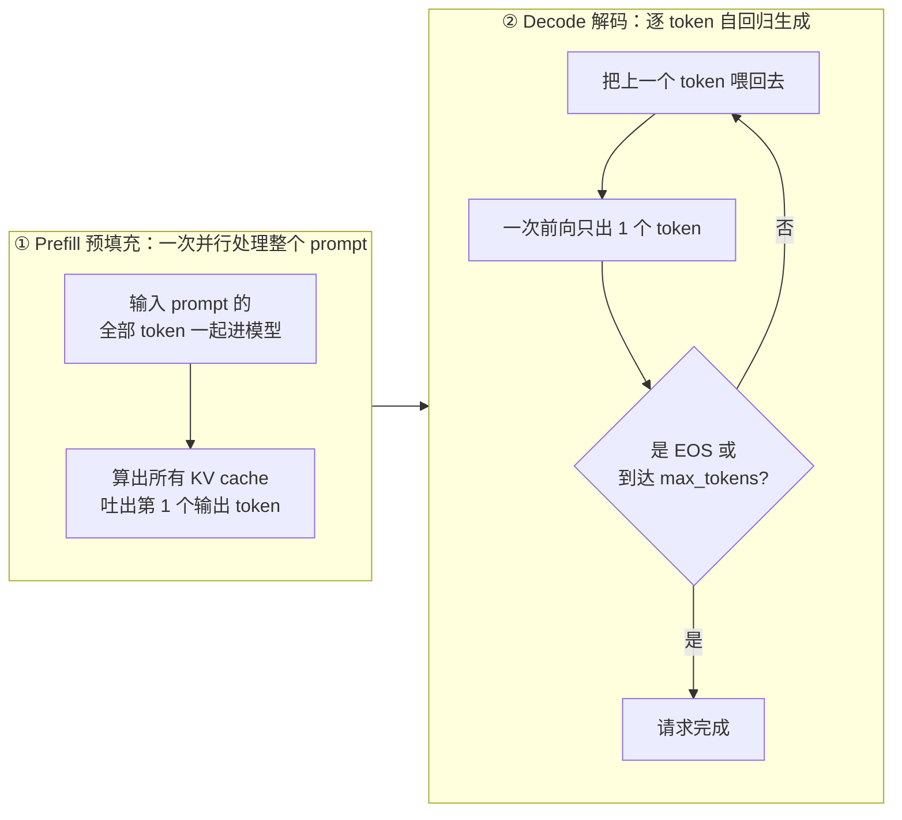
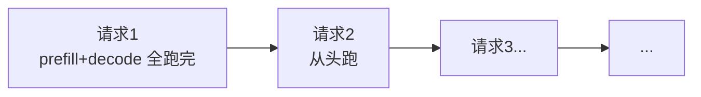
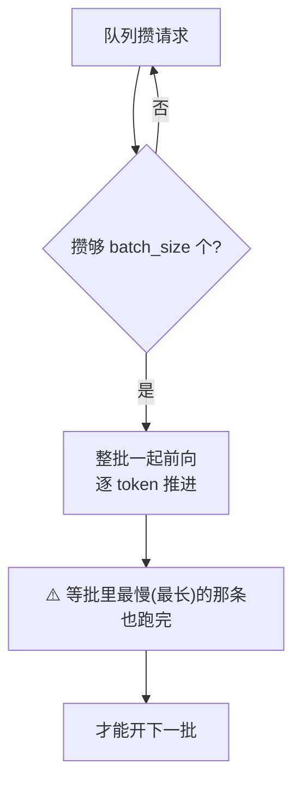
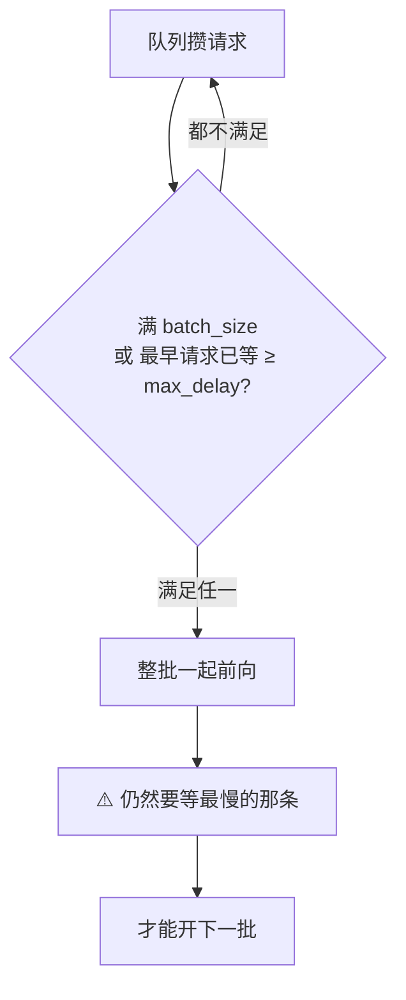
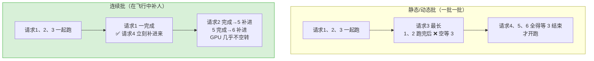
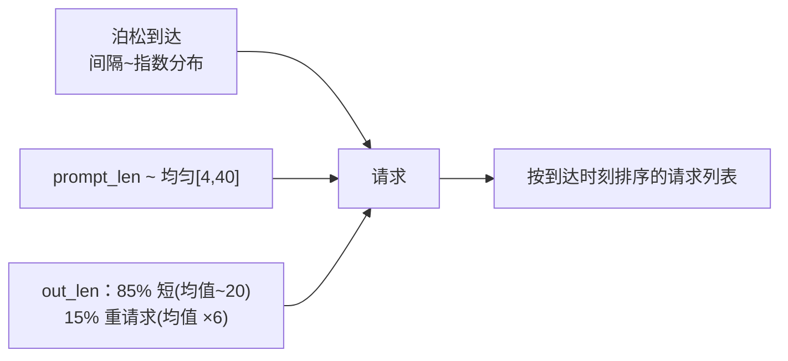
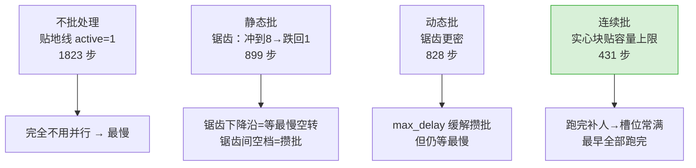

# 🚀 项目 02 · 批处理策略对比实验室（Batching Lab）

> 配套《**Hands-On LLM Serving and Optimization**》**第 6 章 · 核心 LLM 优化技术**（6.1~6.3）。
>
> 用**纯 Python + numpy** 做一个**离散事件仿真器**，把 LLM 推理服务端最核心的四种批处理策略
> —— **不批处理 / 静态批 / 动态批 / 连续批** —— 放在**同一份工作负载**上对拍，量化它们的
> **吞吐（throughput）**、**尾延迟（tail latency, p50/p95/p99）**、**GPU 空闲**，
> 并出图直观展示「为什么连续批处理（continuous batching）是现代推理引擎（vLLM/SGLang/TensorRT-LLM）的默认策略」。
>
> **本机可跑**：Python 3.13、无 GPU、无网络、不下模型、不需 key。`pytest` 全绿、`run_demo.py` 出两张图。

---

## 📖 目录

- [0. TL;DR：一眼看懂结论](#0-tldr一眼看懂结论)
- [1. 这个项目在解决什么问题（是什么·为什么）](#1-这个项目在解决什么问题)
- [2. 背景速成：从 GPU 到批处理（零基础也能懂）](#2-背景速成从-gpu-到批处理)
- [3. 四种策略逐一拆解（含 mermaid 图）](#3-四种策略逐一拆解)
- [4. 仿真怎么建模的（第一性原理）](#4-仿真怎么建模的)
- [5. 代码逐行讲解](#5-代码逐行讲解)
- [6. 如何运行](#6-如何运行)
- [7. 结果解读：图和数字说了什么](#7-结果解读)
- [8. 测试在测什么（pytest 逐条）](#8-测试在测什么)
- [9. 💡 面试高频 & ⚠️ 常见坑合集](#9--面试高频--常见坑合集)
- [10. 📌 小结 & 🔗 延伸阅读](#10--小结--延伸阅读)

---

## 0. TL;DR：一眼看懂结论

在一份 **60 个请求、输出长度重尾（median 14 token、最长 277 token）** 的工作负载上，
`batch_size=8`、`max_delay=3`，四种策略跑出来的结果：

| 策略 | 吞吐(req/步) | token 吞吐 | **并行利用率** | 空闲率 | p50 | p95 | **p99** | 总耗时(步) | 完成 |
|---|---|---|---|---|---|---|---|---|---|
| 不批处理 no-batching | 0.033 | 0.97 | 12.5% | 87.5% | 751 | 1554 | 1691 | 1823 | 60/60 |
| 静态批 static | 0.067 | 1.96 | 25.3% | 74.7% | 218 | 645 | 714 | 899 | 60/60 |
| 动态批 dynamic | 0.072 | 2.13 | 27.5% | 72.5% | 294 | 457 | 625 | 828 | 60/60 |
| **连续批 continuous ⭐** | **0.139** | **4.09** | **52.8%** | **47.2%** | **32** | **117** | **231** | **431** | 60/60 |

**一句话**：相比静态批，**连续批处理吞吐 ×2.09、GPU 并行利用率 25% → 53%、p99 尾延迟 714 → 231 步（降 68%）**，
而且**所有请求都完成**、总耗时只有静态批的一半不到。这就是原书第 6 章、也是 vLLM 论文的核心卖点。

> 🔬 **第一性原理一句话**：静态/动态批处理是「**一批一批**」跑、要**等最慢的那条**才能开下一批，
> 于是超长请求会拖着一整批空转；连续批处理是「**一步一步**」调度、**跑完一个立刻补一个**，GPU 几乎不空转。





看上面第二张**时间线图**：
- **不批处理**：永远是贴地的一条线（并发=1），完全不用 GPU 的并行能力，跑了 1823 步；
- **静态/动态批**：锯齿状——每批冲到 8 又慢慢跌回 1（批尾只剩最长那条独占），锯齿之间还有攒批空档；
- **连续批**：一整块贴着容量上限 8 的实心色块，在第 431 步就全部跑完——**槽位常年填满 = GPU 不浪费**。

---

## 1. 这个项目在解决什么问题

**是什么**：一个**不需要真机、不需要 GPU** 的批处理策略**对拍实验室**。它把「一次前向（forward / iteration）」
抽象成仿真的最小时间单元，用离散事件推进，忠实复现四种调度策略的行为，然后测吞吐/尾延迟/空闲。

**为什么值得做**：
- 📚 **理解 > 背诵**。你可以在 README/书里读到「连续批处理能提升 23× 吞吐」，但**亲手跑一遍、改一改参数、看图变化**，
  才会真正理解「等最慢」「攒批空转」这些坑是怎么在时间线上发生的。
- 💰 **本机零成本**。真机对比要起 vLLM、要 GPU、要压测客户端，门槛高。仿真让你**几秒钟**就能扫完 4 策略 × 5 种子 × 4 batch_size。
- 🎯 **面试直接用**。「静态/动态/连续批处理的区别？」「为什么连续批能提吞吐降尾延迟？」是 AI-Infra 面试**必考**。
  本项目的图和代码就是你的**可视化答案**。

**怎么用**：见 [§6 如何运行](#6-如何运行)。**代价/边界**：这是**仿真**，不是真机 profiling——它抓住了**相对**优劣的**本质**，
但没有建模 KV cache 显存、算子 kernel 效率、chunked prefill 的 token 级混批等细节（这些留给 §9 的坑和 §10 的延伸）。

---

## 2. 背景速成：从 GPU 到批处理

> 已经熟悉 prefill/decode 两阶段的读者可跳到 [§3](#3-四种策略逐一拆解)。

### 2.1 LLM 推理的两个阶段：prefill 与 decode

一个 LLM 请求 = 一段输入 `prompt`（比如「请写一首关于秋天的诗」）+ 模型逐字生成的 `output`。生成分两步：



关键数字直觉：
- **prefill** 一次处理 `prompt_len` 个 token，**算术强度高**（矩阵乘大），本身就能吃满 GPU；
- **decode** 一次只出 **1 个** token，**算术强度极低**——GPU 算力大量闲置，**这才是 batching 的主战场**。

> 💡 **面试高频：batching 对 prefill 和 decode 效果为何天差地别？**
> - **decode**：一次一个 token，算力浪费严重 → 把多个请求的 decode 拼在同一次前向里，**吞吐直接翻几倍**，收益最大。
> - **prefill**：token 已经在并行处理，GPU 本就吃满 → 再 batching 帮助有限。
> 一句话：**batching 是给 decode 用的，prefill 基本用不上。**（原书 p.190）

### 2.2 为什么要 batching：摊薄权重加载

GPU 跑一次前向，要先把模型权重从显存搬到计算单元（**这是固定成本**）。
- 如果**一个请求**单独跑一次前向：搬一次权重，只服务 1 个 token → 极其浪费。
- 如果**8 个请求**拼一次前向：搬一次权重，服务 8 个 token → **同样的搬运成本被 8 个请求分摊**。

这就是 batching（批处理）提高吞吐的**物理根源**：**把多个请求塞进同一次前向，摊薄固定的权重加载开销**。

> 🔬 **第一性原理**：decode 阶段是 **memory-bound（带宽受限）** 的——瓶颈是「把权重从 HBM 读出来」，不是「算」。
> batching 让一次读进来的权重服务更多请求，直接提高**算术强度（arithmetic intensity）**，把带宽利用率拉满。

---

## 3. 四种策略逐一拆解

我们用一个统一的「**渡船类比**」（沿用原书）：GPU 是一条渡船，请求是要过河的乘客，`batch_size` 是船的载客上限。

### 3.1 ① 不批处理（no-batching）—— 一次只渡一人



- **规则**：请求严格**串行**，一个彻底跑完才轮到下一个。
- **代价**：完全不用 GPU 并行能力（并发永远=1）。我们实验里它**吞吐最低（0.033）、耗时最长（1823 步）**。
- **用途**：只作**基线**，量化「batching 到底提升多少」。

### 3.2 ② 静态批处理（static batching）—— 装满一船才开，且必须一起靠岸



- **规则**：**死等**攒够 `batch_size` 个请求才开跑；一批**整批同步**，必须等**最慢的那条**（`out_len` 最大）也完成，才能开下一批。
- **两个致命坑**：
  1. **攒批干等**：假设 batch=10，前 9 个 1 秒到齐，第 10 个 5 分钟后才来 → 前 9 个干等 5 分钟（原书 p.191 经典例子）。
  2. **等最慢**：批里短请求早跑完了，还得陪着最长的那条，这段时间 GPU 只服务 1 个请求却占着整批位置。
- **适用**：**离线批量推理**（所有请求一次性给齐，没有「等新请求」的问题）。**在线服务要命。**

### 3.3 ③ 动态批处理（dynamic batching）—— 满员**或**超时就开



- **规则**：比静态多一个 **`max_delay`（最大等待时间）** 参数。满 `batch_size` **或** 队首请求已等 `≥ max_delay` 步，**任一**满足就开跑。
- **改进**：`max_delay` 兜底，**缓解了「攒批干等」**——请求最多等 `max_delay` 就会被处理。
- **仍未根治**：一批依旧**整批同步、等最慢**（和静态一样）。所以 LLM 场景（输出长短差异巨大）它**还是会「等最慢」空转**。
- 原书原话：dynamic batching 对**传统 ML 模型**够用，但 **LLM 有独特大坑**（输出变长）→ 需要连续批处理。

> 💡 **面试高频：dynamic batching 的两个关键参数？**
> **`batch size`（批大小）** 和 **`max delay time`（最大等待）**。
> - `max_delay` 太长 + 高 batch → 已到请求被迫久等；太短 → 攒不满批、实际 batch 变小、吞吐降。**要根据流量形态调。**

### 3.4 ④ 连续批处理（continuous / in-flight / iterative batching）⭐ —— 跑完一个立刻补一个



- **核心改变**：**调度发生在每一个迭代（step / iteration）之后**，不是每一批之后。batch 变成一个「**运行中的槽位集合**」，
  最多 `max_batch_size` 个槽位。**每一步**给所有槽位里的请求各推进 1 个 token；**谁完成就立刻离场**，腾出的槽位**立刻**补新请求。
- **收益**：
  - 没有「攒批干等」（不用等凑批，有位置就补人）；
  - 没有「等最慢」（短请求跑完立刻返回，不陪长请求）。
- **代价 / 边界**：调度更复杂（每步都要做调度决策）；实现要配合 **PagedAttention** 管理变长 KV cache（否则显存碎片化）。

> 💡 **面试高频：continuous batching 相比 dynamic batching 少了哪个参数？**
> **少了 `max_delay`**（不用等凑批，跑完一个补一个）。但 **`max_batch_size` 仍要管**——它现在只作为**上限**，防止超过绝对最大并发。
> 现代引擎还加了 token 级上限 **`--max-num-batched-tokens`**（配 `--max-num-seqs` 一起卡 prefill/decode）。

> 🔬 **渡船终极版**：把 1 条 10 人大船，换成 **10 条 1 人小船**。有人到就发一条，送完回来接下一个——**无论各人家远近，都没浪费。** 这就是 continuous batching 的精神。

---

## 4. 仿真怎么建模的

### 4.1 为什么能用仿真代替真机？

LLM decode 有一个**极其规整**的时间结构：**每一次前向（无论 prefill 还是 decode）在硬件上是一个离散的时间步**。
这正是术语「**iteration-level scheduling（迭代级调度）**」的来源——连续批处理正是在**每个迭代**后做调度。
所以我们把「一次前向 = 1 步」当作仿真最小单元，用离散事件推进，就能忠实还原四种策略的**相对**行为差异。

### 4.2 成本模型：一次前向固定耗 1 步

```python
def step_cost(batch):
    return 1 if batch else 0
```

**为什么固定 1 步、和 batch 内请求数无关？** 因为真实 GPU 上一次前向耗时≈常数（decode 阶段受**权重加载/带宽**主导），
**batch 里有几个请求不太影响这一步的耗时**——这正是 batching 提吞吐的物理根源（多个请求搭同一趟前向的便车）。
于是在仿真里：
- **batching 的收益** = 「同一步内并行完成多个请求的 1 个 token」；
- **空转的代价** = 「某步 batch 为空 / 只剩 1 个慢请求，浪费了并行能力」。

这个抽象**足以复现四种策略的相对优劣**（本项目的目的）。真实工程里前向耗时还受 token 总数、KV cache、kernel 实现影响——见 [§9 的坑](#9--面试高频--常见坑合集)。

### 4.3 工作负载：重尾输出是关键



**为什么输出要重尾（heavy-tailed）？** 因为原书反复强调 LLM 的痛点是「**输入/输出长度差异巨大**」——
少数超长请求会拖垮静态/动态批（等最慢），却拖不垮连续批（短请求先走）。**没有重尾，四策略差距就体现不出来。**
本实验里 `out_len` 的 **median=14、max=277**（相差 ~20 倍），差距就非常明显。

### 4.4 两个 GPU 利用率口径（重要！）

| 口径 | 定义 | 衡量什么 | 陷阱 |
|---|---|---|---|
| **时间利用率** `gpu_utilization` | busy步 / 总步 | GPU 有没有「开机干活」 | ⚠️ **偏乐观**：批里只剩 1 个慢请求也算 busy |
| **并行利用率** `slot_utilization` ⭐ | Σ(每步占用槽位) / (总步 × 容量) | **并行能力被用掉多少** | 本项目核心口径，才能区分四策略 |

$$
\text{slot\_utilization} = \frac{\sum_{t=1}^{T}\text{active}(t)}{T \times \text{capacity}}
$$

其中 `active(t)` 是第 `t` 步 batch 里真正在跑的请求数，`capacity` 是槽位数（= `batch_size`）。
**只有这个口径能量化「静态批批尾只剩 1 条长请求、其余 7 个槽位空着」的浪费。**

> ⚠️ **坑：别用「时间利用率」下结论。** 四策略的时间利用率都 ≈99%（都在「开机」），看不出差别。
> 真正拉开差距的是**并行利用率**：no-batching 12% / static 25% / dynamic 28% / **continuous 53%**。

---

## 5. 代码逐行讲解

项目结构：

```
02_batching_lab/
├── batching_sim.py       # 核心：数据结构 + 工作负载 + 四种策略仿真 + 指标
├── run_demo.py           # 出图：时间线 + 指标柱状图（Agg + 微软雅黑）
├── requirements.txt      # 依赖（numpy/matplotlib/pytest）
├── tests/
│   └── test_batching.py  # 30 个测试：正确性 + 单策略行为 + 策略间物理规律
├── batching_timeline.png # run_demo 产出
└── batching_metrics.png  # run_demo 产出
```

### 5.1 `Request`：一个请求的静态属性 + 运行时状态

```python
@dataclass
class Request:
    req_id: int          # 请求编号
    arrival: int         # 到达时刻（此刻才出现在队列）
    prompt_len: int      # 输入 token 数 → 决定 prefill 工作量
    out_len: int         # 输出 token 数 → 决定 decode 需要多少个迭代
    start: Optional[int] = None    # 首次被调度进 batch 的时刻
    finish: Optional[int] = None   # 完成最后一个 token 的时刻
    remaining: int = 0             # 还剩几个 decode 迭代
    prefilled: bool = False        # 是否已完成 prefill
```
- `arrival / prompt_len / out_len` 是**输入**（由工作负载生成器给定）；
- `start / finish / remaining / prefilled` 是**运行时状态**，被仿真过程填充。
- `latency = finish - arrival`（**端到端延迟，含排队等待**）——这是我们算 p50/p95/p99 的原料。

> ⚠️ **坑：四策略必须跑在同一份工作负载上才公平。** 但仿真会往 `Request` 写 `start/finish`。
> 所以每个策略开跑前都要 `_clone()` 一份干净请求（重置运行时状态），否则第二个策略读到的是第一个策略的残留状态。

### 5.2 `make_workload`：泊松到达 + 重尾输出

```python
gap = rng.exponential(1.0 / arrival_rate)   # 泊松过程：相邻到达间隔 ~ 指数分布
t += gap
arrival = int(round(t))                     # 取整到最近的仿真步

if rng.random() < out_heavy_ratio:          # 15% 概率是「重请求」
    base = rng.geometric(1.0 / (out_mean * out_heavy_mult))  # 均值放大 6 倍
else:
    base = rng.geometric(1.0 / out_mean)    # 普通请求，均值 ~20
out_len = int(max(1, base))
```
- **泊松到达**：真实在线服务的请求到达近似泊松过程；`arrival_rate` 越小请求越稀疏，**静态批的「攒批干等」坑越明显**。
- **几何分布**近似输出长度（离散、右偏），叠加 15% 重尾——**重尾是四策略拉开差距的关键**。
- `seed` 固定 → 结果可复现 → 测试稳定。

### 5.3 静态批处理：攒批 + 等最慢（核心逻辑）

```python
# 攒批：不够一批且后面还有请求没到 → 快进到下一个到达时刻继续攒
if len(pending) < batch_size and idx < n:
    advance_to(arrivals[idx].arrival)   # 这段 GPU 空闲，记 idle
    continue

batch = pending[:batch_size]            # 取一批
...
# decode：跑到批里最长的请求也完成
max_out = max(r.out_len for r in batch)
for k in range(max_out):
    active = sum(1 for r in batch if r.out_len > k)  # 这一步还活着的请求数
    timeline.append(active)                          # ← 这里会从 batch_size 递减到 1！
    t += 1; busy += 1
    for r in batch:
        if r.out_len == k + 1:          # 谁在这步做完最后一个 token
            r.finish = t                # 就在这步记 finish
```
- `active` 会随着短请求陆续完成而**从 8 递减到 1**——这就是时间线图里**锯齿下降沿**的来源，也是「等最慢」的空转。
- `max_out` 决定这批要跑多少步——**被批里最长的请求绑架**。

### 5.4 动态批处理：多一个 `max_delay` 超时兜底

```python
full = len(pending) >= batch_size
oldest_wait = t - pending[0].arrival        # 队首请求已经等了多久
timed_out = oldest_wait >= max_delay
if not (full or timed_out):                 # 都不满足才继续攒
    deadline = pending[0].arrival + max_delay
    advance_to(min(next_arrival, deadline))  # 快进到「下一个到达」或「超时」的更早者
    continue
# 满足任一 → 开跑（decode 部分与静态相同：仍然等最慢）
```
- 相比静态，**只多了 `timed_out` 这一个判断**——但足以缓解「攒批干等」。
- **decode 部分和静态一模一样**（仍等最慢）→ 所以 LLM 场景动态批**没根治**空转，只是排队延迟好一点。

### 5.5 连续批处理：每步补位（灵魂所在）

```python
def fill_slots():
    # 把已到达、还在等待的请求补进空槽位（直到满或没有可补的）
    while len(running) < max_batch_size and idx < n and arrivals[idx].arrival <= t:
        r = arrivals[idx]; r.start = t; r.prefilled = False
        running.append(r); idx += 1

while idx < n or running:
    fill_slots()                       # ← 每步开头都补位（跑完一个补一个的关键）
    ...
    timeline.append(len(running))      # 执行一步前向
    t += 1; busy += 1
    still = []
    for r in running:
        if not r.prefilled:
            r.prefilled = True; still.append(r)      # 这步做 prefill
        else:
            r.remaining -= 1                          # 这步出 1 个 decode token
            if r.remaining <= 0:
                r.finish = t                          # 完成 → 立刻离场（不加进 still）
            else:
                still.append(r)
    running = still                    # 完成的请求已移出，下轮 fill_slots 立刻补新请求
```
- **`fill_slots()` 在每步开头调用** = 「有空位就立刻补人」→ 这就是 in-flight batching 的精髓。
- 完成的请求**不加进 `still`** = 立刻离场，不占槽位、不拖累别人。
- 所以时间线图里连续批是**一整块贴着容量上限的实心色块**，而不是锯齿。

### 5.6 `run_demo.py` 出图关键三行（离线画中文图必备）

```python
import matplotlib
matplotlib.use("Agg")                                      # ① 无显示环境必须用 Agg 后端
import matplotlib.pyplot as plt
plt.rcParams["font.sans-serif"] = ["Microsoft YaHei", "SimHei"]  # ② 中文字体，否则方框
plt.rcParams["axes.unicode_minus"] = False                 # ③ 负号正常显示，否则乱码
```
> ⚠️ **坑**：这三行的**顺序**很重要——`matplotlib.use("Agg")` 必须在 `import pyplot` **之前**；
> `rcParams` 必须在**画图之前**设置。顺序错了不报错，但图会出问题（无后端 / 中文变方框）。

---

## 6. 如何运行

### 6.1 安装依赖（一次即可）

```bash
pip install -r requirements.txt
# 或最小集：pip install numpy matplotlib pytest
```

### 6.2 跑仿真自检（打印指标表）

```bash
python batching_sim.py
```
输出四策略的吞吐/token吞吐/并行利用率/p50/p95/p99/完成数。

### 6.3 跑测试（必须全绿）

```bash
python -m pytest -q
# 预期： 30 passed
```

### 6.4 出图（生成两张 png）

```bash
python run_demo.py
```
产出 `batching_timeline.png`（时间线）和 `batching_metrics.png`（指标柱状图），并在控制台打印指标表 + 关键结论。

> 💡 **Windows 中文控制台乱码？** 用 `python -X utf8 run_demo.py` 强制 UTF-8 输出（图片本身不受影响）。

### 6.5 动手改参数（强烈推荐）

打开 `run_demo.py` 的 `main()`，改 `make_workload(...)` 和 `run_all(...)` 的参数，观察图变化：

| 改什么 | 现象 | 对应原书哪个结论 |
|---|---|---|
| `arrival_rate` 调小（0.5→0.1） | 请求稀疏，静态批「攒批干等」更严重，尾延迟飙升 | 6.2 静态批在线要命 |
| `out_heavy_ratio` 调大（0.15→0.4） | 重请求更多，静态/动态「等最慢」空转更明显 | 6.3 长请求拖垮整批 |
| `batch_size` 调大（8→32） | 连续批吞吐进一步提升（并行度上限更高） | 6.3 max batch size 是上限 |
| `max_delay` 调大（3→20） | 动态批更接近静态批（攒批久了才开） | 6.2 max_delay 太长坑 |

---

## 7. 结果解读

### 7.1 时间线图（`batching_timeline.png`）



看图记住三件事：
1. **面积越接近容量上限（虚线 8）= 槽位越满 = GPU 越不浪费** → 连续批面积最大。
2. **越早触底（active 回到 0）= 越早全部跑完** → 连续批 431 步最早，不批处理 1823 步最晚。
3. **静态/动态的锯齿** = 「一批一批 + 等最慢」的视觉证据；**连续批没有锯齿** = 「每步补位」的视觉证据。

### 7.2 指标柱状图（`batching_metrics.png`）

- **左图**：连续批的吞吐柱最高（相对最大值=1.0），并行利用率柱也最高（53%）。
- **右图**：连续批的 p50/p95/p99 三根柱全面最矮（p99=231 步 vs 静态 714 vs 不批处理 1691）。

**尾延迟为什么这么重要？** 生产 SLO（服务等级目标）通常卡的是 **p99**——「99% 的请求要在 X 毫秒内返回」。
静态批的 p99 是连续批的 3 倍多，意味着**同样的硬件，连续批能满足严得多的 SLO**，或者说**满足同样 SLO 能省下大量 GPU**。💰

---

## 8. 测试在测什么

`tests/test_batching.py` 共 **30 个测试**，分四层（`python -m pytest -q` → `30 passed`）：

### A. 结构正确性（8 个）
- `test_all_requests_complete`：**【硬性】四策略请求都完成**（没有请求被饿死）。
- `test_finish_after_arrival_and_start`：因果律 `finish > start ≥ arrival`、延迟 > 0。
- `test_timeline_length_matches_total_steps` / `test_busy_plus_idle_equals_total`：时间线守恒。
- `test_metrics_are_finite_and_nonneg`：指标有限、非负、利用率 ∈ [0,1]。
- `test_reproducible` / `test_workload_seed_stability`：确定性、可复现。

### B. 单策略行为（6 个）
- `test_no_batching_is_serial`：串行策略并发永远 ≤ 1。
- `test_no_batching_total_equals_work_plus_idle`：串行忙步 = Σ(1+out_len)（强不变量）。
- `test_dynamic_respects_max_delay`：动态批首请求等待 ≤ max_delay（超时兜底生效）。
- `test_continuous_never_exceeds_capacity`：连续批任意时刻并发 ≤ max_batch_size。
- `test_continuous_can_exceed_batch_start_overlap`：连续批平均并行度 > 静态（补位让槽位更满）。

### C. 策略间物理规律（8 个）—— **本项目灵魂**
- `test_continuous_throughput_ge_static`：**【硬性】连续批吞吐 ≥ 静态批**。
- `test_continuous_least_idle`：**【硬性】连续批并行利用率最高、空闲最少**。
- `test_continuous_lowest_tail_latency`：连续批 p99 最低。
- `test_batching_beats_no_batching`：任意批处理吞吐 > 不批处理。
- `test_throughput_ordering`：`continuous ≥ dynamic ≥ static > no_batching`。

### D. 参数敏感性（8 个，参数化）
- `test_continuous_ge_static_across_seeds`：**跨 5 个随机种子**结论都成立（不是撞大运）。
- `test_conclusions_hold_across_batch_sizes`：**跨 batch_size ∈ {2,4,8,16}** 结论稳定。

> 💡 **为什么要测「物理规律」而不只是「代码不崩」？** 因为这个项目的**价值主张**就是那几条结论
> （连续批吞吐更高、GPU 更满、尾延迟更低）。测试把这些**结论焊死成不变量**——将来你改代码/改参数，
> 一旦不小心破坏了结论，测试立刻红给你看。**这才是「有水平」的测试。**

---

## 9. 💡 面试高频 & ⚠️ 常见坑合集

### 💡 面试高频问答（背下来）

**Q1：静态、动态、连续批处理的区别？**
- **静态**：攒够 batch_size 才开，整批等最慢。离线用，在线要命（攒批干等 + 等最慢）。
- **动态**：满 batch_size **或** 超时 max_delay 就开，仍整批等最慢。缓解攒批，未根治空转。传统 ML 在线够用。
- **连续**：每个迭代后调度，跑完一个立刻补一个，无攒批、无等最慢。LLM 在线的默认策略（vLLM/SGLang）。

**Q2：连续批处理为什么能同时提吞吐、降尾延迟？**
- **提吞吐**：槽位常年填满，GPU 并行能力不浪费（本实验 25%→53%）。
- **降尾延迟**：短请求跑完立刻返回，不用陪长请求、不用等凑批（本实验 p99 714→231）。
- 一句话：**它把「批级调度」升级成「迭代级调度」，消灭了两种空转。**

**Q3：连续批处理相比动态批少了哪个参数？多了什么依赖？**
- 少了 `max_delay`（不用凑批）。`max_batch_size` 保留为上限。
- 现代引擎加了 token 级上限 `--max-num-batched-tokens`（卡 prefill）配 `--max-num-seqs`（卡 decode）。
- **依赖 PagedAttention**：变长请求动态进出，KV cache 必须能分页管理，否则显存碎片化。

**Q4：Anyscale 2023 的经典数字？**
- 连续批处理可把 LLM 推理吞吐**提升高达 23×**，同时显著降低 p50 延迟。（原书第 2 章引用）

**Q5：为什么 batching 对 decode 收益大、对 prefill 收益小？**
- decode 一次出 1 token、算术强度极低、带宽受限 → batching 摊薄权重加载，收益最大。
- prefill 输入 token 已并行、本就吃满算力（prompt > ~1024 token 时）→ batching 帮助有限。

### ⚠️ 常见坑（本项目 & 真实工程）

1. **⚠️ 用「时间利用率」下结论**：四策略时间利用率都 ≈99%，看不出差别。要用**并行利用率（slot / capacity）**。（见 §4.4）
2. **⚠️ 忘记 clone 工作负载**：四策略共享 Request 对象会互相污染 start/finish。必须每策略 `_clone()` 一份。（见 §5.1）
3. **⚠️ matplotlib 三行顺序**：`use("Agg")` 要在 `import pyplot` 前；`rcParams` 要在画图前。否则无后端 / 中文方框 / 负号乱码。（见 §5.6）
4. **⚠️ 没有重尾输出，实验没意义**：如果所有请求 out_len 一样长，静态批就不会「等最慢」，四策略差距消失。重尾是关键。（见 §4.3）
5. **⚠️ 仿真的边界（诚实声明）**：本项目**没建模**——
   - **KV cache 显存**：真实连续批受显存约束，槽位数不是想开多大开多大（要靠 PagedAttention 省显存）；
   - **kernel 效率 / token 数**：真实前向耗时随 batch 内 token 总数增长，不是严格常数；
   - **chunked prefill 混批**：真实引擎把 prefill 切块和 decode 混在同一步（原书 6.4），本项目对 prefill 做了「独占一步」的简化。
   → 这些细节不改变**相对优劣的结论**，但你在真机调参时要知道它们存在。
6. **⚠️ max_delay 调参陷阱**：太长 → 退化成静态批；太短 → 攒不满批、实际 batch 变小、吞吐降。要按流量形态调。

---

## 10. 📌 小结 & 🔗 延伸阅读

### 📌 小结

- **批处理是 LLM 服务提吞吐的第一招**，因为它摊薄了 decode 阶段昂贵的权重加载（带宽受限）。
- **四种策略的演进就是在消灭两种空转**：
  - 静态批 → 有「攒批干等」+「等最慢」两种空转；
  - 动态批 → 用 `max_delay` 消灭「攒批干等」，但「等最慢」还在；
  - **连续批 → 用迭代级调度同时消灭两种空转**，成为现代引擎默认策略。
- 本实验用**纯 numpy 离散事件仿真**量化证明：连续批相对静态批 **吞吐 ×2.09、并行利用率 25%→53%、p99 尾延迟降 68%**，且所有请求都完成。
- **核心度量是「并行利用率」（slot / capacity）**，不是「时间利用率」——这是本项目最容易被忽视、也最有价值的一点。

### 🔗 延伸阅读

**本书其它章 / 本项目配套讲义**：
- 📘 [`../../book-guide/06_核心 LLM 优化技术.md`](../../book-guide/06_核心%20LLM%20优化技术.md) —— 本项目直接对应的第 6 章（6.1~6.3 批处理，6.4 chunked prefill，6.5 PagedAttention）。
- 📘 [`../../book-guide/02_大语言模型服务.md`](../../book-guide/02_大语言模型服务.md) —— LLM 服务 vs 传统 ML 服务（有状态 KV、变长、显存/带宽受限），连续批处理为何被催生。
- 📘 [`../../book-guide/03_模型服务系统设计：深入.md`](../../book-guide/03_模型服务系统设计：深入.md) —— 手搓一个「连续批处理雏形」的调度器（本项目仿真的工程版）。
- 📘 [`../../book-guide/07_高级 LLM 优化技术.md`](../../book-guide/07_高级%20LLM%20优化技术.md) —— PD 分离（prefill–decode disaggregation），把 prefill/decode 拆到不同 GPU。
- 📘 [`../../book-guide/08_LLM 服务框架.md`](../../book-guide/08_LLM%20服务框架.md) —— vLLM / SGLang / TensorRT-LLM 怎么实现连续批处理。

**本仓库 llm-action 既有专题（中文社区讲法，对照阅读）**：
- 📂 [`ai-infra-architecture/09_推理引擎架构_连续批处理_调度_投机解码_chunked_prefill.md`](../../../ai-infra-architecture/09_推理引擎架构_连续批处理_调度_投机解码_chunked_prefill.md) —— 连续批处理、调度、chunked prefill 的架构级详解，直接延续本项目。
- 📂 [`llm-inference/`](../../../llm-inference/) —— LLM 推理专题（KV Cache 优化、PagedAttention、Flash-Decoding、PD 分离、各推理框架 lmdeploy/tgi/lightllm）。
- 📂 [`llm-inference/KV-Cache优化.md`](../../../llm-inference/KV-Cache优化.md) —— 连续批处理的显存搭档：变长 KV cache 管理。

**外部经典**：
- Anyscale (2023), *How continuous batching enables 23x throughput in LLM inference* —— 本项目结论的真机版。
- Yu et al. (2022), *Orca: A Distributed Serving System for Transformer-Based Generative Models* —— iteration-level scheduling（连续批处理）的开山论文。
- Kwon et al. (2023), *Efficient Memory Management for LLM Serving with PagedAttention* (vLLM) —— 连续批处理的显存基石。

---

> 🧪 **本项目自测状态**：`python -m pytest -q` → **30 passed**；`python run_demo.py` → 正常打印指标表 + 生成两张 png。
> 全程离线、无 GPU、无网络、无 API key。欢迎改参数、加策略（比如加一个「优先短请求」的 SJF 调度）继续玩。
