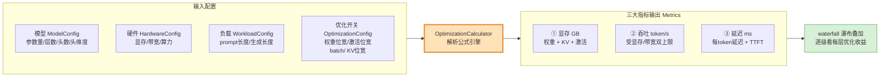
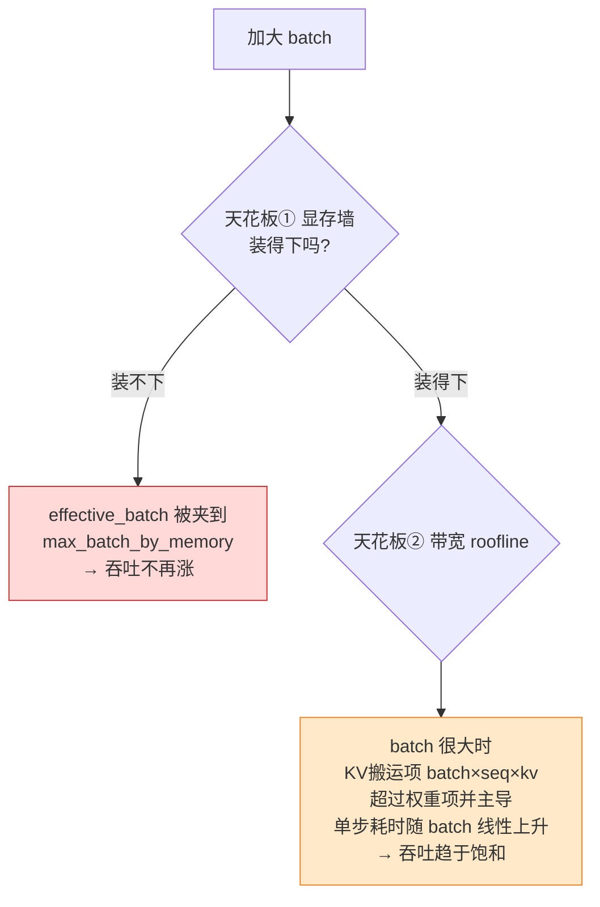
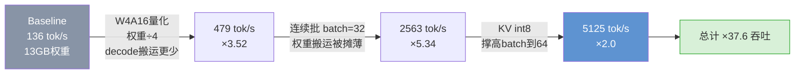
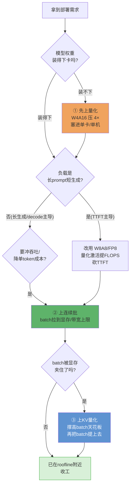

# 🧮 项目 03：优化技术收益计算器（Optimization Impact Calculator）

> 配套《Hands-On LLM Serving and Optimization: Hosting LLMs at Scale》(Chi Wang, Peiheng Hu, O'Reilly)
> 第 5 / 6 / 7 章。这是「《Hands-On LLM Serving》逐章精讲」实战项目系列的第 3 个。
>
> **一句话**：给你一个模型 + 一张卡 + 一组优化开关（量化位宽 / 连续批 batch / KV 量化），
> 用**第一性原理的解析公式**（不跑真模型、不联网、不需 GPU）算出「显存省多少、吞吐快多少、延迟降多少」，
> 并画出**优化叠加瀑布图**，直观回答那个面试必问的问题：
>
> > 「量化 + 连续批 + KV 量化**叠起来**，到底赚多少？各自贡献多少？」

---

## 🗺️ 0. 这个项目在讲什么？（先看全景）

在真实的 LLM 服务里，你不会只用**一个**优化。生产引擎（vLLM / SGLang / TensorRT-LLM）是**一整套优化叠在一起**跑的。但每个优化「省什么、代价是什么、和别的优化怎么互相影响」并不显然——这正是本计算器要拆开讲清楚的。



**读完本项目你能做到：**

- 从**位宽**（bit width）出发，秒算「量化到 INT8 / INT4 省多少显存」，并解释为什么是**严格比例**；
- 理解**连续批处理（continuous batching）为什么提吞吐、又为什么有上限**（显存墙 + 带宽 roofline 双天花板）；
- 说清 **KV 量化**如何「撑高 batch 天花板」，间接把吞吐拉起来；
- 分辨 **W4A16 vs W8A8/FP8** 对 prefill（TTFT）和 decode（每 token 延迟）的**不同**影响；
- 亲手用一张瀑布图，把「优化叠加收益」讲给面试官 / 老板听。

> 🔬 **贯穿全项目的第一性原理**：LLM 推理是一台**内存墙（memory wall）机器**。
> decode 阶段每生成 1 个 token，就要把**全部权重 + 所有请求的 KV** 从 HBM（显存）读一遍——算力单元大量空转。
> 所以几乎所有优化的本质只有两句话：**① 让每次读进来的字节更少（量化 / KV 量化）；② 让读进来的字节被更多请求复用（batching 摊薄权重搬运）。** 记住这条主线，全篇公式就串起来了。

---

## 📁 1. 文件结构

```
03_optimization_impact_calculator/
├── README.md                     # 你正在读的这份（极详讲解）
├── optimization_calculator.py    # 核心：解析模型 + 计算器 + 瀑布叠加
├── run_demo.py                   # Demo：出表 + 出 2 张 PNG（Agg 离线渲染）
├── requirements.txt              # 依赖（matplotlib/pytest；核心逻辑零依赖）
├── tests/
│   └── test_calculator.py        # 28 个 pytest：量化比例 / batch上限 / 公式自洽
├── waterfall_throughput.png      # 运行 demo 后生成：吞吐瀑布图
└── memory_batch_ceiling.png      # 运行 demo 后生成：显存分解 + batch天花板
```

---

## 🚀 2. 如何运行（30 秒上手）

```bash
# 进入项目目录
cd book-hands-on-llm-serving/projects/03_optimization_impact_calculator

# （可选）装依赖。本机若已有 matplotlib/pytest 可跳过。
pip install -r requirements.txt

# ① 跑测试（应输出 28 passed）
python -m pytest -q

# ② 跑 Demo：终端出叠加收益表 + 生成 2 张 PNG
python run_demo.py

# ③ 只想快速看核心模块自检
python optimization_calculator.py
```

> ⚠️ **常见坑**：从**项目根目录之外**跑测试时可能 `ModuleNotFoundError: optimization_calculator`。
> 我们在 `tests/test_calculator.py` 顶部用 `sys.path.insert(0, 上级目录)` 兜底了，但**推荐在本目录下**执行 `python -m pytest -q`（用 `-m pytest` 而不是直接 `pytest`，能保证当前目录进 `sys.path`）。

---

## 🧠 3. 原理：三大优化 + 三大指标，公式怎么来的？

这一节是全项目的**理论核心**。我们把每个公式**从物理直觉推到代码**，不跳步。所有公式都能追溯到书里的页码。

### 3.1 指标一：显存（Memory）= 权重 + KV + 激活

一张卡的显存被三块瓜分（书 p.394，图 5-10）：

$$\text{总显存} = \underbrace{\text{模型权重}}_{\text{固定}} + \underbrace{\text{KV 缓存}}_{\text{随 batch×seq 膨胀}} + \underbrace{\text{中间激活}}_{\text{一小块余量}}$$

#### 🔹 权重显存 —— 量化的主战场

$$\text{权重显存} = \text{参数量} \times \frac{\text{位宽}}{8}\ (\text{字节/参数})$$

书 p.502 的经典例子：

$$7\text{B} \times 2\text{ 字节/参数（FP16）} = 14\text{ GB}$$

量化就是把「字节/参数」降下来：

| 精度 | 位宽 | 字节/参数 | 7B 权重显存 | 相对 FP16 |
|---|---|---|---|---|
| FP16 / BF16 | 16 bit | 2.0 | 13.0 GB* | 1× |
| FP8 / INT8 | 8 bit | 1.0 | 6.5 GB | **÷2** |
| INT4 / FP4 | 4 bit | 0.5 | 3.3 GB | **÷4** |

> \* 我们用 GiB（1024³）换算，所以是 13.0 GB 而不是 14.0 GB（书里用 10⁹ 近似）。二者都对，差别只是单位约定。

> 🔬 **第一性原理：为什么量化省显存是「严格按位宽比例」？**
> 显存 = 参数个数 × 每参数字节数。**参数个数不变**（量化不删参数），只是**每个参数用更少的 bit 存**。
> 所以 $\text{显存} \propto \text{位宽}$，是一条干净的正比例——这也是我们 `test_weight_memory_scales_with_bit_width` 直接断言的。

#### 🔹 KV 缓存 —— 长上下文 / 大 batch 的「显存炸弹」

书 p.399 的核心公式，**每 token 的 KV 缓存**：

$$\text{每 token KV} = 2 \times \text{层数} \times \text{注意力头数} \times \text{头维度} \times \text{精度字节数}$$

（前面的 `2` 是因为要缓存 **K 和 V 两份**。）

Llama-7B（FP16）代入：

$$2 \times 32 \times 32 \times 128 \times 2 = 524{,}288\ \text{字节} = 0.5\ \text{MB / token}$$

总 KV（书 p.419）：

$$\text{总 KV} = \text{每 token KV} \times \text{batch} \times \text{序列长度}$$

> 💥 **震撼结论（书 p.432）**：batch=16、seq=4096 时，总 KV = 0.5MB × 4096 × 16 = **32 GB**，
> 竟然比模型权重（14GB）还大！**KV 随 batch 和序列长度线性膨胀**——这就是长上下文成为「服务噩梦」的定量根源，也是为什么要做 **KV 量化**（把精度字节数从 2 降到 1）。

### 3.2 指标二：吞吐（Throughput）—— batching 的收益与它的两道天花板

decode 是**带宽受限**的（书 p.61）。单步 decode 要从 HBM 搬运：

$$\text{单步搬运字节} = \underbrace{\text{权重字节}}_{\text{所有请求共享，只读一次}} + \underbrace{\text{batch} \times \text{seq} \times \text{每token KV}}_{\text{每个请求各自的 KV}}$$

$$\text{单步耗时} \approx \frac{\text{单步搬运字节}}{\text{显存带宽}}, \qquad \text{吞吐(token/s)} = \frac{\text{batch}}{\text{单步耗时}}$$

**为什么 batching 提吞吐？** 关键在权重项：一步 decode 里权重**只读一次**，却服务了 `batch` 个请求。batch 越大，权重搬运成本被摊得越薄，单请求「分摊到的权重搬运」越少 → 吞吐上升。

**但收益有上限——两道天花板：**



- **天花板① 显存墙**：`max_batch = (显存 − 权重 − 激活) ÷ (每token KV × seq)`（书 p.435 表 5-7 的反推算法）。装不下就装不下，吞吐封顶。
- **天花板② 带宽 roofline**：当 `batch × seq × 每token KV` 这一项超过权重项并占主导时，单步耗时 ≈ 正比于 batch，于是 `吞吐 = batch / 单步耗时` 趋于常数——**饱和**。这就是我们 `test_throughput_has_upper_bound_saturates` 验证的：小 batch 翻倍吞吐接近翻倍，大 batch 翻倍吞吐几乎不动。

> 💡 **面试高频**：「continuous batching 能无限提吞吐吗？」——**不能**。① 先撞显存墙（OOM），② 再撞带宽 roofline（KV 搬运主导后饱和）。所以生产里 batch 不是越大越好，要在 SLA 内找平衡点（书 p.120）。**KV 量化**能同时抬高这两道天花板：KV 更小 → 显存装更多 batch + 带宽搬运更轻。

### 3.3 指标三：延迟（Latency）—— TTFT 与每 token 延迟，别混为一谈

LLM 有**两个**延迟指标，对应两个阶段：

| 指标 | 阶段 | 受限于 | 谁能优化它 |
|---|---|---|---|
| **TTFT**（首 token 延迟） | prefill | **算力**（compute-bound） | **量化激活**（W8A8/FP8 提 FLOPS）、chunked prefill |
| **每 token 延迟**（ITL） | decode | **带宽**（bandwidth-bound） | **权重量化**（搬运更少）、KV 量化 |

- **TTFT ≈ prefill 时间**：$\text{FLOPs} \approx 2 \times \text{参数量} \times \text{prompt\_len}$，$\text{TTFT} \approx \text{FLOPs} / \text{有效算力}$。
  - W8A8/FP8（**权重+激活**都量化）→ Tensor Core 算力翻倍（书 p.510）→ **TTFT 减半**；
  - W4A16（**weight-only**）→ 算力**不变**（低比特权重要反量化回高比特才能算，书 p.511）→ **TTFT 基本不变**。
- **每 token 延迟 = 单步 decode 耗时**：权重量化让搬运字节变少 → 延迟下降；但 **batch 变大反而让单请求延迟略升**（单步要搬更多 KV）——这就是**吞吐 vs 延迟的经典权衡**（书 p.44）。

> ⚠️ **常见坑：把「量化」当成万能加速。**
> W4A16 省显存、降 decode 延迟，但**不加速 prefill（TTFT 不变）**。如果你的负载是**长 prompt、短生成**（TTFT 占主导），选 W4A16 你会失望——这时该上 **W8A8/FP8**。选优化必须先看负载画像（书 Table 6-3）。

---

## 💻 4. 核心代码逐行讲解（`optimization_calculator.py`）

下面把最关键的几段代码抄录 + **逐行**中文讲透。完整文件见同目录。

### 4.1 精度表：位宽 → 字节数

```python
BYTES_PER_PARAM = {
    "fp32": 4.0, "fp16": 2.0, "bf16": 2.0,   # 16bit=2字节：服务默认精度
    "fp8": 1.0, "int8": 1.0,                 # 8bit=1字节：砍半
    "int4": 0.5, "fp4": 0.5,                 # 4bit=0.5字节：砍到1/4
}
COMPUTE_SPEEDUP_VS_FP16 = {
    "fp16": 1.0, "fp8": 2.0, "int8": 2.0,    # 8bit Tensor Core ≈ 2× FP16 算力
    "int4": 1.0, "fp4": 1.0,                 # weight-only：算力不变（要反量化）
}
```

- 第 2–4 行：位宽 ÷ 8 = 字节数。这张表是「量化省显存严格按比例」的**唯一来源**——所有显存公式都乘它。
- 第 6–8 行：算力加速表。**注意 int4/fp4 是 1.0（不加速）**——因为 W4A16 是 weight-only，执行时要把 4bit 权重反量化回 16bit 才能算，所以算力不涨（书 p.511）。这个区分是很多人搞错的地方。

### 4.2 每 token KV 缓存（书的核心公式，直接落代码）

```python
def kv_bytes_per_token(self, kv_dtype="fp16"):
    # 2 × 层数 × 头数 × 头维度 × 精度字节数（K 和 V 两份 → 前面的 2）
    return 2 * self.num_layers * self.num_heads * self.head_dim * BYTES_PER_PARAM[kv_dtype]
```

- 一行就是书 p.399 的公式。`kv_dtype` 从 `"fp16"` 换成 `"int8"`，`BYTES_PER_PARAM` 从 2 变 1 → 每 token KV **严格减半**。这就是 KV 量化省显存的实现。

### 4.3 显存允许的最大 batch（反推「一张卡能跑多大 batch」）

```python
def max_batch_by_memory(self, weight_dtype, kv_dtype, seq_len=None):
    seq_len = seq_len if seq_len is not None else self.model.max_seq_len
    w = self.weight_memory_gb(weight_dtype)          # ① 先算权重占了多少
    act = w * ACTIVATION_OVERHEAD_RATIO              # ② 激活余量（权重的10%近似）
    kv_budget_gb = self.hw.vram_gb - w - act         # ③ 剩下的显存全给 KV
    if kv_budget_gb <= 0:                            # ④ 权重都装不下 → batch=0（OOM）
        return 0
    per_tok_gb = self.model.kv_bytes_per_token(kv_dtype) / (1024 ** 3)
    max_tokens = kv_budget_gb / per_tok_gb           # ⑤ KV预算 ÷ 每token KV = 能装多少token
    return max(0, int(max_tokens // seq_len))        # ⑥ ÷ seq_len = 能装多少个请求(batch)
```

- 这是书 p.435 表 5-7 的「选卡实战算法」的代码化。
- ③ 是**天花板①（显存墙）**的来源：KV 预算越大，能并发的 batch 越多。
- ⑤⑥ 解释了为什么**量化**（w 变小 → kv_budget 变大）和 **KV 量化**（per_tok 变小）都能**抬高 batch 天花板**。

### 4.4 decode 吞吐（batching 收益 + roofline 上限，全在这里）

```python
def decode_throughput_tok_s(self, opt):
    mem_cap = self.max_batch_by_memory(opt.weight_dtype, opt.kv_dtype)
    eff_batch = min(opt.batch_size, mem_cap) if mem_cap > 0 else 0   # ① 显存夹紧
    if eff_batch <= 0:
        return 0.0, 0
    weight_bytes = self.model.num_params_b * 1e9 * BYTES_PER_PARAM[opt.weight_dtype]  # 权重项
    avg_ctx = self.wl.prompt_len + self.wl.gen_len // 2               # decode平均上下文长度
    kv_bytes_per_req = self.model.kv_bytes_per_token(opt.kv_dtype) * avg_ctx          # 每请求KV项
    step_bytes = weight_bytes + eff_batch * kv_bytes_per_req          # ② 单步总搬运字节
    bandwidth_bytes_s = self.hw.mem_bandwidth_tb_s * 1e12
    step_time_s = step_bytes / bandwidth_bytes_s                      # ③ 单步耗时
    throughput = eff_batch / step_time_s                             # ④ 吞吐 = batch / 单步耗时
    return throughput, eff_batch
```

- ① **天花板①**：目标 batch 先被显存夹到 `mem_cap`。请求 batch=100000 也没用，装不下。
- ② `step_bytes = 权重项 + batch × 每请求KV项`。**权重项是常数**（所有请求共享），**KV 项随 batch 线性增长**。
- ④ `吞吐 = batch / 单步耗时`。小 batch 时 `step_time` 几乎被常数权重项主导 → 吞吐≈正比于 batch（**batching 提吞吐**）；大 batch 时 `step_time` 被 KV 项主导（正比 batch）→ 吞吐趋于常数（**天花板② roofline 饱和**）。**一段代码同时体现了收益和上限。**

> 🔬 **第一性原理复盘**：`throughput = batch / (weight + batch·kv) × 带宽`。
> 当 `batch·kv ≪ weight`（小 batch）：`≈ batch/weight × 带宽` → 线性涨。
> 当 `batch·kv ≫ weight`（大 batch）：`≈ 带宽/kv` → 与 batch 无关，**饱和**。
> 这就是 roofline 的两段式行为，用一个分式讲透了。

### 4.5 瀑布叠加（waterfall）

```python
def waterfall(self, stages):
    rows, prev = [], None
    for stage_name, opt in stages:
        m = self.compute(opt)                       # 算这一阶段的三大指标
        row = {"stage": stage_name, "config": opt, "metrics": m}
        if prev is not None:                        # 和"上一阶段"比，算增量
            row["d_mem_gb"] = m.total_mem_gb - prev.total_mem_gb
            row["d_throughput"] = m.throughput_tok_s - prev.throughput_tok_s
            row["speedup_vs_prev"] = m.throughput_tok_s / prev.throughput_tok_s
        rows.append(row); prev = m
    return rows
```

- 输入一串「阶段名 + 完整配置」，输出每阶段指标 + **相对上一阶段**的增量。
- `speedup_vs_prev` 就是瀑布图里每根柱子的「接力增量」——面试时你能一句话说清「这一层优化单独贡献了 ×几」。

---

## 📊 5. Demo 输出解读（`run_demo.py`）

运行 `python run_demo.py`，终端会打印这张叠加收益表（Llama-7B @ A100-80G，prompt=1024 / gen=512）：

```
阶段                     权重GB    KV GB     总GB    吞吐tok/s   有效batch   相对上步
--------------------------------------------------------------------------------
Baseline FP16, batch=1   13.04    2.00    16.34      136.3         1      ×1.00
+ 量化 W4A16 (int4)       3.26    2.00     5.59      479.5         1      ×3.52
+ 连续批 batch=32          3.26   64.00    67.59     2562.6        32      ×5.34
+ KV量化 KV int8,batch=64  3.26   64.00    67.59     5125.2        64      ×2.00
--------------------------------------------------------------------------------
总收益：吞吐 ×37.6，权重显存 ÷4.0
```

**怎么读这张表 / 这张瀑布图？**



1. **+量化 W4A16（×3.52）**：权重从 13GB→3.3GB，decode 每步搬运的权重字节骤减 → 吞吐直接涨 3.5 倍，**且此时还没动 batch**。这说明「量化本身就是 decode 加速器」。
2. **+连续批 batch=32（×5.34）**：权重搬运被 32 个请求摊薄，吞吐再涨 5 倍。这是**吞吐的最大来源**。
3. **+KV 量化 → batch=64（×2.0）**：KV int8 把每 token KV 减半，显存能装的 batch 天花板从 ~38 抬到 ~76，于是我们把 batch 从 32 提到 64，吞吐再翻倍。**KV 量化不直接提吞吐，而是通过"撑高 batch 天花板"间接提。**

生成的两张图：

- **`waterfall_throughput.png`**：吞吐瀑布图。四根柱子接力向上，每段标注增量 `+N`，一眼看出「谁贡献最大」。
- **`memory_batch_ceiling.png`**：左图显存分解（量化压权重蓝条、KV 量化压 KV 橙条），右图 batch 天花板（量化 + KV 量化如何把并发从 32 撑到 76）。

> 💡 **实战洞察**：注意 `+连续批` 那一步总显存从 5.6GB **暴涨到 67.6GB**——**吞吐涨了，但显存代价巨大**（差点撞 80GB 天花板）。这就是为什么第 4 步要**接着上 KV 量化**：不然 batch 根本提不上去。**三大优化是有依赖关系的组合拳，不是各自独立的加法。**

---

## 🧪 6. 测试讲解（`tests/test_calculator.py`，28 passed）

测试分三大主题，正是题目要求验证的三件事：

| 主题 | 代表用例 | 验证了什么 |
|---|---|---|
| **① 量化降显存按位宽比例** | `test_int4_quarters_weight_memory`、`test_weight_memory_scales_with_bit_width`（参数化 7 种精度） | 显存 / 参考显存 == 位宽 / 参考位宽，**严格正比** |
| | `test_kv_int8_halves_kv_memory`、`test_kv_per_token_matches_book_formula` | KV 量化同样按位宽砍；每 token KV 精确等于书 p.412 的 524,288 字节 |
| **② batch 提吞吐有上限** | `test_batching_increases_throughput` | batch 1→8 吞吐显著提升（>1.5×） |
| | `test_throughput_has_upper_bound_saturates` | 小 batch 翻倍≈吞吐翻倍，大 batch 翻倍吞吐几乎不动（roofline 饱和） |
| | `test_batch_clamped_by_memory` | 请求 batch=100000 被夹到显存允许的 max_batch（显存墙） |
| | `test_kv_quant_raises_memory_batch_ceiling` | KV int8 把 batch 天花板抬约 2× |
| **③ 公式自洽** | `test_total_memory_is_sum_of_parts` | 总显存 == 权重 + KV + 激活，无重复无遗漏 |
| | `test_weight_and_activation_quant_speeds_prefill` | W8A8 降 TTFT，W4A16 的 TTFT 不变（weight-only 不提算力） |
| | `test_ttft_scales_with_prompt_length` | TTFT ∝ prompt 长度 |
| | `test_latency_rises_slightly_with_batch` | batch 变大 → 单请求延迟略升（吞吐 vs 延迟权衡） |
| | `test_oom_flag_when_model_too_big` | 405B 塞进 24G → OOM=True，batch=0，吞吐=0 |

跑测试：

```bash
$ python -m pytest -q
............................                                             [100%]
28 passed in 0.03s
```

> ⚠️ **常见坑：浮点比较**。所有比例断言都用 `math.isclose(..., rel_tol=1e-9)` 而不是 `==`。因为 GiB 换算（除以 1024³）会引入浮点误差，直接 `==` 会偶发失败。**测数值公式必须用 isclose / pytest.approx，别用 ==。**

---

## 🛠️ 7. 当库用：自定义模型 / 硬件 / 场景（进阶）

计算器不止能跑内置的 Llama-7B + A100。你可以用它回答**你自己的**部署问题。下面给三个真实场景。

### 场景 A：「我想在一张 RTX 4090（24GB）上跑 14B 模型，能跑吗？要不要量化？」

```python
from optimization_calculator import (
    OptimizationCalculator, ModelConfig, HardwareConfig, WorkloadConfig, OptimizationConfig,
)

# 定义 14B 模型（Qwen3-14B 量级）与消费级卡
model = ModelConfig(name="Qwen3-14B", num_params_b=14, num_layers=40,
                    num_heads=40, head_dim=128, hidden_size=5120, max_seq_len=4096)
hw = HardwareConfig(name="RTX-4090-24G", vram_gb=24.0,
                    mem_bandwidth_tb_s=1.008, fp16_tflops=165.0)
wl = WorkloadConfig(prompt_len=512, gen_len=512)
calc = OptimizationCalculator(model, hw, wl)

# FP16 直接装？
m_fp16 = calc.compute(OptimizationConfig(weight_dtype="fp16", batch_size=8))
print("FP16 :", m_fp16.as_row())   # 14B×2B = 26GB 权重 > 24GB → OOM=True

# 量化到 W4A16 呢？
m_int4 = calc.compute(OptimizationConfig(weight_dtype="int4", batch_size=8, kv_dtype="int8"))
print("W4A16:", m_int4.as_row())   # 14B×0.5B = 6.5GB → 装得下，还能留 KV 空间
```

**结论**：14B FP16 权重就要 26GB > 24GB，**裸装 OOM**；量化到 INT4 后权重只剩 6.5GB，剩下 ~17GB 全给 KV，能跑起像样的 batch。这正是「消费级卡跑大模型必须量化」的量化依据。

### 场景 B：「长 prompt、短生成（RAG 检索增强），我该选 W4A16 还是 W8A8？」

```python
# RAG 场景：4k prompt + 128 生成 → TTFT（prefill）占主导
wl_rag = WorkloadConfig(prompt_len=4096, gen_len=128)
calc = OptimizationCalculator(ModelConfig(), HardwareConfig(), wl_rag)

ttft_w4a16 = calc.ttft_ms(OptimizationConfig(weight_dtype="int4", activation_dtype="fp16"))
ttft_w8a8  = calc.ttft_ms(OptimizationConfig(weight_dtype="fp8",  activation_dtype="fp8"))
print(f"W4A16 TTFT = {ttft_w4a16:.1f} ms   W8A8 TTFT = {ttft_w8a8:.1f} ms")
# W8A8 量化激活 → 算力翻倍 → TTFT 减半；W4A16 的 TTFT 和 FP16 一样
```

**结论**：长 prompt 场景 TTFT 是命门，**W8A8/FP8 直接把 TTFT 砍半**，而 W4A16 对 TTFT **毫无帮助**。选错了优化，用户等首字的时间就白白多一倍。

### 场景 C：「把三大优化画成决策树，我该先上哪个？」



**这张决策树就是本计算器的「使用说明书」**：① 量化优先解决「装得下」，② 连续批冲吞吐，③ KV 量化解开「batch 被显存夹住」的锁。顺序不能乱——先量化腾出显存，连续批才有空间涨 batch。

---

## ⚠️ 8. 这个模型的边界与诚实声明（很重要）

本计算器是**一阶解析近似（first-order analytical model）**，目的是**建立直觉、做量级估算、讲清优化之间的关系**，**不是**替代真实压测（benchmark）。它有意简化了这些：

| 简化点 | 真实世界的复杂性 |
|---|---|
| 只算 decode 的带宽 roofline | 真实吞吐还受 kernel 效率、调度开销、prefill/decode 交错、chunked prefill 影响 |
| 激活用「权重 10%」近似 | 真实激活随 batch、seq、算子实现变化 |
| 量化加速用固定倍率表 | 真实取决于是否有 Marlin/Machete 混合精度 kernel（书 p.511） |
| 未建模精度损失 | 量化会掉点（accuracy），本器只算性能不算质量 |
| MHA 假设 | GQA/MQA/MLA 会大幅改变 KV 公式（KV 头数 ≠ query 头数） |

> 💡 **面试点**：能说清「我的估算模型简化了什么、在什么场景会失真」——这是**资深**和**新手**的分水岭。真实生产里，解析模型用来**选方向、缩小搜索空间**，最终必须用 vLLM `benchmark_serving.py` / 真实 trace 压测**验证**（对应本书第 9 章实战）。

---

## 📌 9. 小结

- **量化省显存 = 严格按位宽比例**。参数个数不变，每个参数用更少 bit → 显存 ∝ 位宽。FP16→INT8 减半，→INT4 砍 1/4。
- **连续批处理提吞吐 = 摊薄权重搬运**，但有**两道天花板**：显存墙（装不下）+ 带宽 roofline（KV 项主导后饱和）。不是越大越好。
- **KV 量化不直接提吞吐**，而是**撑高 batch 天花板**（KV 更小 → 显存装更多并发），间接把吞吐拉起来。
- **量化对两个延迟指标影响不同**：W4A16 降 decode 延迟但不动 TTFT；W8A8/FP8 量化激活才降 TTFT。**选优化要先看负载画像。**
- **优化是组合拳，有依赖**：连续批把显存吃爆 → 必须配 KV 量化才能真把 batch 提上去。瀑布图让这层依赖一目了然。
- 用一句话概括全项目：**优化的本质是在固定显存/带宽预算下，让每一字节的搬运都尽量服务更多 token。**

---

## 🔗 10. 延伸阅读

**本书其它章（book-guide/）：**

- [第 5 章《服务 LLM 的挑战》](../../book-guide/05_服务%20LLM%20的挑战.md) —— GPU 规格、KV 缓存公式、算术强度、屋顶线模型（本项目所有物理公式的源头）。
- [第 6 章《核心 LLM 优化技术》](../../book-guide/06_核心%20LLM%20优化技术.md) —— 连续批处理、量化（W4A16 vs W8A8）、MHA→GQA→MLA、PagedAttention。
- [第 7 章《高级 LLM 优化技术》](../../book-guide/07_高级%20LLM%20优化技术.md) —— 分布式、PD 分离、投机解码、MoE（更高阶的优化叠加）。
- [第 9 章《LLM 优化实战》](../../book-guide/09_LLM%20优化实战.md) —— 用 vLLM 真实压测验证本计算器的估算方向。

**本仓库其它相关目录（llm-action/）：**

- `llm-inference/` —— 推理引擎（vLLM / TensorRT-LLM）源码与部署实战，把本项目的解析结论落到真实系统。
- `ai-infra-architecture/` —— AI-Infra 架构：显存/带宽/互联的系统级权衡。
- 本 projects 目录的兄弟项目：`01_*`、`02_*`（KV 缓存 / batching 的动手实现）。

**延伸公式参考：**

- 屋顶线模型（Roofline Model, Williams et al. 2009）——本项目「带宽 roofline 上限」的理论出处。
- vLLM PagedAttention 论文（Kwon et al. 2023）——KV 缓存近零浪费的内存管理，本项目未建模但生产必备。

---

> 🧮 **一句话记住这个计算器**：给我模型、给我卡、给我几个开关，我用书里的公式告诉你「显存省多少、吞吐快几倍、瓶颈在哪」——然后你拿去 vLLM 上验证。
