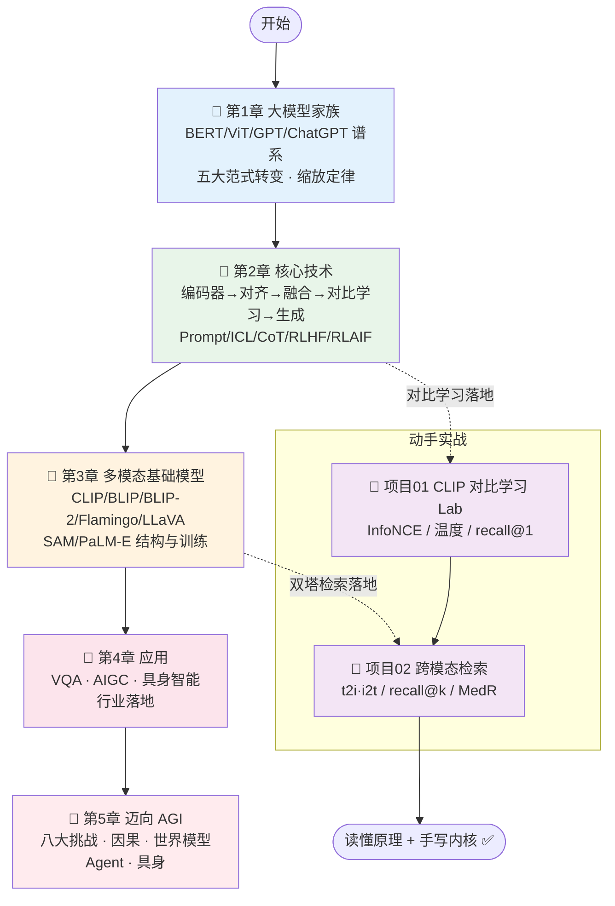

# 🌈 Multimodal Large Models · 中文逐章精讲 + 实战合集

> 本目录是对《**Multimodal Large Models: A New Paradigm of Artificial Intelligence**》(Liang Lin 林倞、Yang Liu 刘阳，中山大学 HCP 实验室) 一书的**中文逐章精讲**，外加两个**本机 CPU 秒级可跑、离线不联网、不需要 API key** 的动手实战项目。
>
> 定位一句话：**读懂 CLIP / BLIP / BLIP-2 / Flamingo / LLaVA / SAM / PaLM-E 这条多模态大模型主线的原理，再亲手把「对比学习 + 跨模态检索」这两块内核用代码敲出来**——既能拿去面试讲透，也能接到真实 CLIP 输出上做工程。

- 📖 **讲义** `book-guide/`：5 章逐节精讲，每章配 mermaid 图、逐行公式、💡实战 / ⚠️常见坑 / 🔬第一性原理 小框。
- 🧪 **项目** `projects/`：2 个从零实现的实战 Lab，各含 `pytest` 全绿 + `run_demo.py` 出图。
- 🎯 **风格**：忠实抄录原书公式与结论 + Strang 式「是什么 / 为什么 / 代价」拆解 + 面试高频问答。

---

## 🗺️ 学习路径（建议按序推进）



> 💡 **两条线怎么配合读**：讲义第 2 章讲清「对比学习为什么能对齐语义」，就去跑 **项目 01** 把 InfoNCE 损失从公式敲到 `recall@1: 0.008 → 1.000`；讲义第 3 章讲清「CLIP 双塔编码到同一空间」，就去跑 **项目 02** 把「以文搜图 / 以图搜文」的检索内核写出来。**原理 → 代码 → 面试**，一条龙闭环。

---

## 📚 讲义逐章目录 `book-guide/`

| 章节 | 文件（点击进入） | 一句话简介 |
| :---: | --- | --- |
| **第 1 章** | [`book-guide/01_大模型家族.md`](book-guide/01_大模型家族.md) | 全书「地基章」：把 BERT（双向编码器）、ViT/MAE（纯视觉）、GPT-1/2/3、ChatGPT（InstructGPT+RLHF）、ChatGLM、Baichuan、GPT-4V 这棵**大模型家谱**讲透；串起**五大范式转变**（单模态→多模态、预测→生成、单任务→多任务、感知→认知、大模型→超级智能体）与**缩放定律**。 |
| **第 2 章** | [`book-guide/02_多模态大模型核心技术.md`](book-guide/02_多模态大模型核心技术.md) | 后续所有基础模型的**技术地基**：沿「模态编码器 → 对齐 Alignment → 融合 Cross-Attention → 对比学习 → 生成」主线，讲透**预训练 / 自监督 / 对比学习（InfoNCE/MoCo/SimCLR）/ Prompt / In-Context Learning / 微调 / 思维链 CoT / RLHF / RLAIF**。 |
| **第 3 章** | [`book-guide/03_多模态基础模型.md`](book-guide/03_多模态基础模型.md) | 从「视觉-语言对齐」到「冻结大模型 + 轻量桥接」再到「具身/分割基础模型」：**CLIP / BLIP（MED+CapFilt）/ BLIP-2（Q-Former）/ Flamingo（Perceiver+GATED XATTN）/ LLaVA（线性投影）/ LLaMA-Adapter V2 / VideoChat / SAM / PaLM-E** 的结构与训练一次讲清。 |
| **第 4 章** | [`book-guide/04_多模态大模型应用.md`](book-guide/04_多模态大模型应用.md) | 从「怎么造」跨到「能干什么」：三条主线 **VQA（视觉问答，含视频 QA + 因果推理）→ AIGC（文/图/视频/3D 生成，GAN/扩散）→ 具身智能（探索/导航/EQA/交互，RT-1/RT-2/VoxPoser）**，贯穿医疗/机器人/交通/创意行业落地。 |
| **第 5 章** | [`book-guide/05_多模态大模型迈向AGI.md`](book-guide/05_多模态大模型迈向AGI.md) | 终章 + 展望：**先诊断（八大研究挑战：评测/对齐/幻觉/鲁棒/可信/可解释…）再开药方（四条前沿路线：因果推理 CausalVLR、世界模型 JEPA/Sora、超级智能 Agent AutoGPT/XAgent、基于 Agent 的具身智能）**——从「缸中之脑」走向「懂世界、能行动」。 |

---

## 🧪 实战项目目录 `projects/`

两个项目都**纯 CPU、离线、秒级**，不下预训练模型、不需要 GPU / API key。每个都是 `pytest` 全绿 + `run_demo.py` 出图。

| 项目 | 目录 | 简介 | 怎么跑 |
| :---: | --- | --- | --- |
| **01** 🧲 CLIP 式对比学习 Lab | [`projects/01_clip_contrastive_lab`](projects/01_clip_contrastive_lab) | 用「玩具版 CLIP」把 **对比学习 / InfoNCE / 可学习温度 logit_scale / 图文检索** 从公式一路打到能跑的代码：双塔 MLP 编码器 → L2 归一化 → 相似度矩阵 → 对称 InfoNCE。实测 `recall@1` 从 **0.008 → 1.000**，配对余弦 **0.938** vs 非配对 **−0.014**。换成真实 CLIP 只需把玩具特征换成 ViT/BERT 输出，**损失代码一字不改**。 | `cd projects/01_clip_contrastive_lab`<br/>`python -m pytest -q` → **14 passed**<br/>`python run_demo.py` → 出 3 张 PNG（相似度前后热图 / 损失曲线 / 检索名次） |
| **02** 🔎 跨模态检索 Cross-Modal Retrieval | [`projects/02_crossmodal_retrieval`](projects/02_crossmodal_retrieval) | CLIP/BLIP/ALIGN 双塔的**最直接下游应用**：给配对好的（图嵌入，文嵌入），实现 **文→图 / 图→文 top-k 检索**，算 **recall@k 与 median rank**，并亲手演示**归一化消除长度偏置**、**温度只改置信度不改排序**。200 行 numpy 跑通工业检索内核；换真实 CLIP 嵌入 + FAISS 即可上生产。 | `cd projects/02_crossmodal_retrieval`<br/>`python -m pytest -q` → **17 passed**<br/>`python run_demo.py` → 出 3 张图到 `figures/`（recall@k 曲线 / 归一化vs温度 / 检索样例） |

> ⚠️ **Windows 控制台踩坑（两项目都已修好）**：① 默认 GBK 编码，`print("✅")` 会 `UnicodeEncodeError` → 脚本用 `sys.stdout.reconfigure(encoding="utf-8")` 或 `chcp 65001`；② matplotlib 出中文图必设 `font.sans-serif=["Microsoft YaHei","SimHei"]` + `axes.unicode_minus=False`，否则中文变 □□□、负号变方框。

---

## 🎯 面试 / 实战怎么用

### 🧑‍💼 面试备战

- **对比学习一条龙**（项目 01 的 README「面试高频」区）：CLIP 损失是什么（对称 InfoNCE = 双向 N 分类）、为什么 L2 归一化、温度 τ 的作用与为什么学 `log(1/τ)` 并 clamp、为什么要超大 batch（32768，InfoNCE 是互信息下界负样本越多越紧）、零样本分类怎么做。
- **检索指标一条龙**（项目 02 的 README「面试高频」区）：以文搜图怎么做、recall@k / median rank 定义与为什么 MedR 用中位数（重尾分布抗离群）、**温度不改检索排序**（单调变换）vs **训练期温度塑造表征**的分界、亿级图库用 ANN（FAISS/ScaNN/HNSW）。
- **原理讲透**（讲义 5 章）：从大模型谱系 → 对齐/融合/RLHF → CLIP 到 SAM 的桥接范式 → VQA/AIGC/具身 → AGI 四拼图，覆盖多模态大模型面试的整条知识主干。

### 🛠️ 实战落地

1. **想理解某个概念** → 先读对应讲义章节建立「是什么 / 为什么」，再到项目里看它是怎么被代码实现的。
2. **想接真实模型** → 两个项目的核心库（`clip_lab.py` / `retrieval.py`）逻辑与真实 CLIP **完全一致**，把玩具特征换成 `model.encode_image / encode_text` 的输出即可；检索端把稠密全比对换成 FAISS 就能上亿级规模。
3. **想验收** → 每个项目一条命令跑测试（必过）+ 一条命令出图，几秒钟看清全部机理，不被算力和数据集拖住。

---

## 📁 目录总览

```
book-multimodal-large-models/
├── README.md                         # 你正在读的这份合集导航
├── book-guide/                       # 📖 逐章精讲（5 章）
│   ├── 01_大模型家族.md
│   ├── 02_多模态大模型核心技术.md
│   ├── 03_多模态基础模型.md
│   ├── 04_多模态大模型应用.md
│   └── 05_多模态大模型迈向AGI.md
└── projects/                         # 🧪 动手实战（2 个）
    ├── 01_clip_contrastive_lab/      # 🧲 对比学习 · InfoNCE · 温度 · recall@1
    │   ├── clip_lab.py               # 核心库：双塔/归一化/InfoNCE/可学习温度/recall
    │   ├── run_demo.py               # 训练 + 出 3 张图
    │   ├── requirements.txt
    │   └── tests/test_clip_lab.py    # 14 passed
    └── 02_crossmodal_retrieval/      # 🔎 t2i·i2t 检索 · recall@k · median rank
        ├── retrieval.py              # 核心库：归一化/相似度/top-k/rank/recall/温度
        ├── toydata.py               # 玩具图文嵌入生成器（共享语义 + 模态噪声）
        ├── run_demo.py               # 出 3 张图到 figures/
        ├── requirements.txt
        └── tests/test_retrieval.py   # 17 passed
```

---

## 🚀 30 秒上手

```bash
# 讲义：直接用编辑器 / GitHub 打开 book-guide/*.md 阅读即可（纯 Markdown + mermaid）

# 项目 01：CLIP 对比学习
cd projects/01_clip_contrastive_lab
python -m pytest -q        # → 14 passed
python run_demo.py         # → sim_before_after.png / loss_curve.png / retrieval_ranks.png

# 项目 02：跨模态检索
cd ../02_crossmodal_retrieval
python -m pytest -q        # → 17 passed
python run_demo.py         # → figures/ 下 recall_curve.png / norm_vs_temp.png / retrieval_examples.png
```

---

## 🔗 延伸阅读

- **CLIP** — Radford et al., *Learning Transferable Visual Models From Natural Language Supervision* (2021)：双塔对比学习 + 可训练温度 `logit_scale` 的开山之作（项目 01/02 的原型）。
- **InfoNCE** — van den Oord et al., *Representation Learning with Contrastive Predictive Coding* (2018)：温度与互信息下界的来源。
- **BLIP / BLIP-2** — 在检索基础上加图文匹配头（ITM）做重排；BLIP-2 的 Q-Former 是「冻结大模型 + 轻量桥接」的代表（讲义第 3 章）。
- **FAISS / ScaNN / HNSW** — 亿级向量近似最近邻检索引擎，是「相似度矩阵」在真实规模下的替身（项目 02 面试点）。

---

> 🧭 **一句话收束**：讲义负责把多模态大模型的**史观与原理**讲透，项目负责把**对比学习与检索的内核**焊进你的手感。读完 + 跑通，你既能在面试里讲清 CLIP 到 AGI 的整条主线，也能把这套逻辑接到真实模型上做工程。
>
> 📌 全部内容中文、离线、CPU 可跑；两项目实测 `pytest` 共 **31 passed**，`run_demo.py` 出 6 张中文图。
