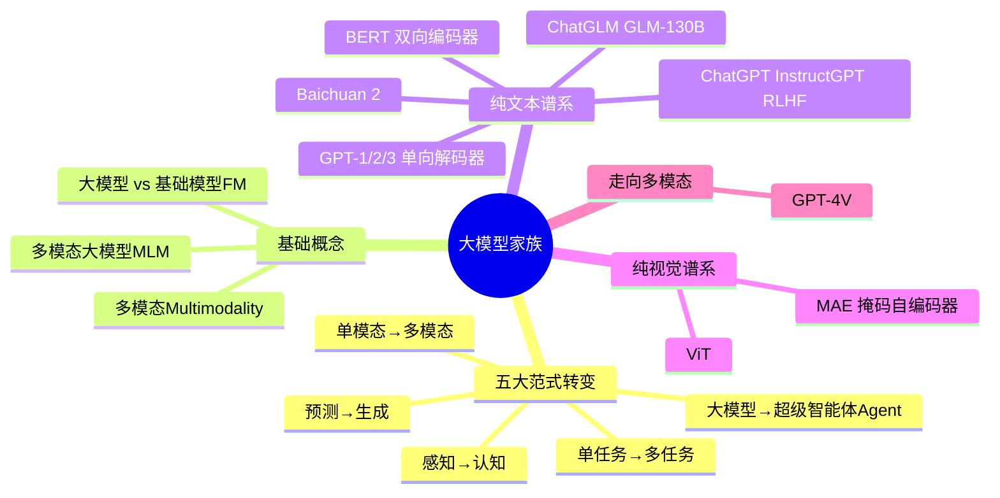
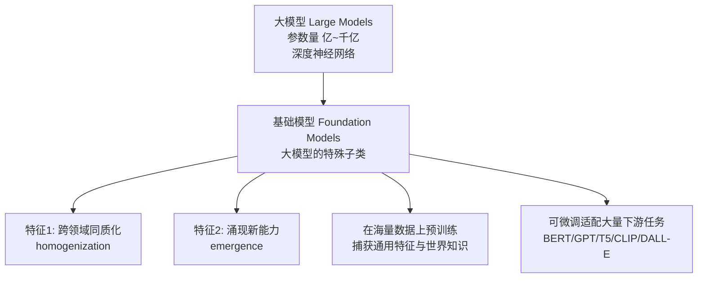
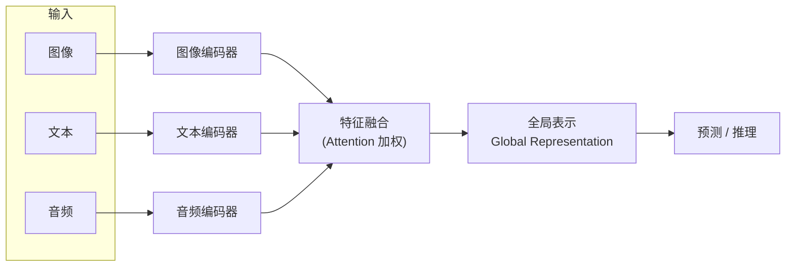
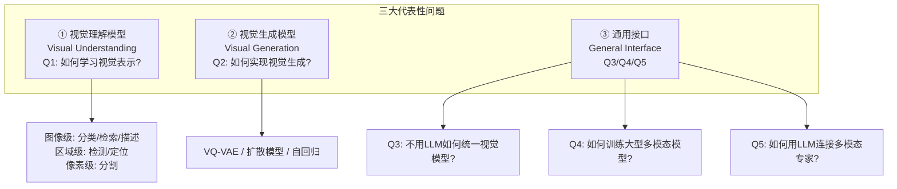
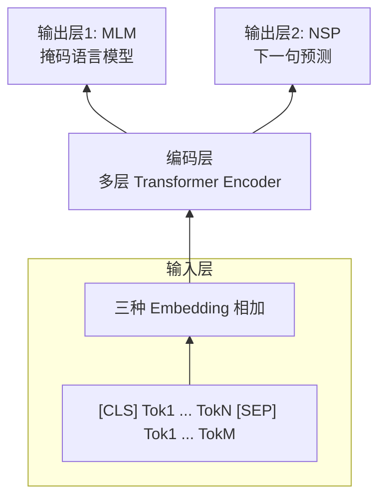
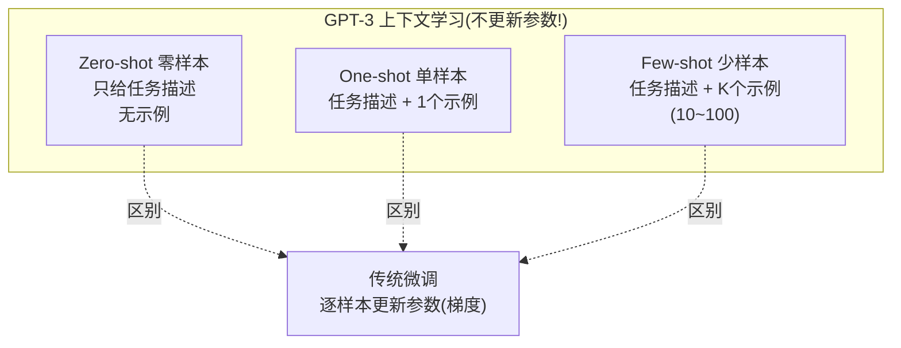
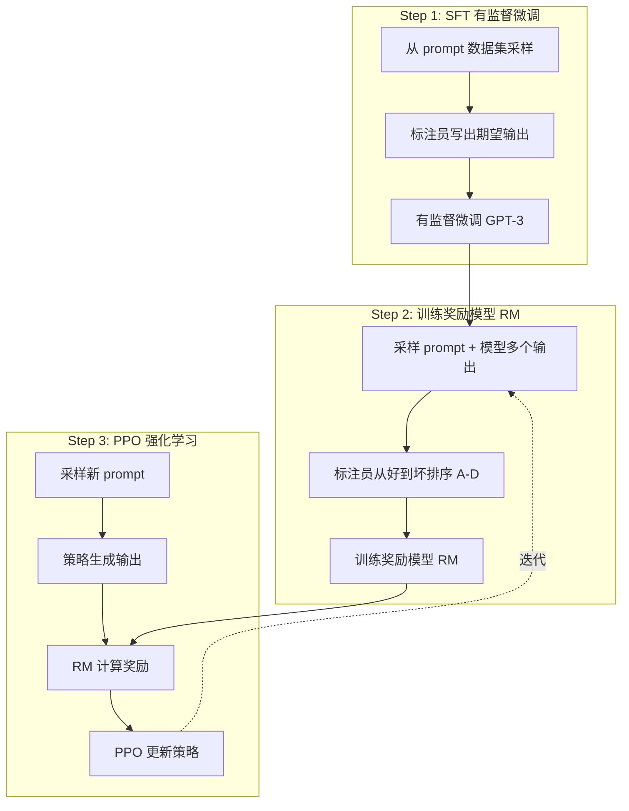
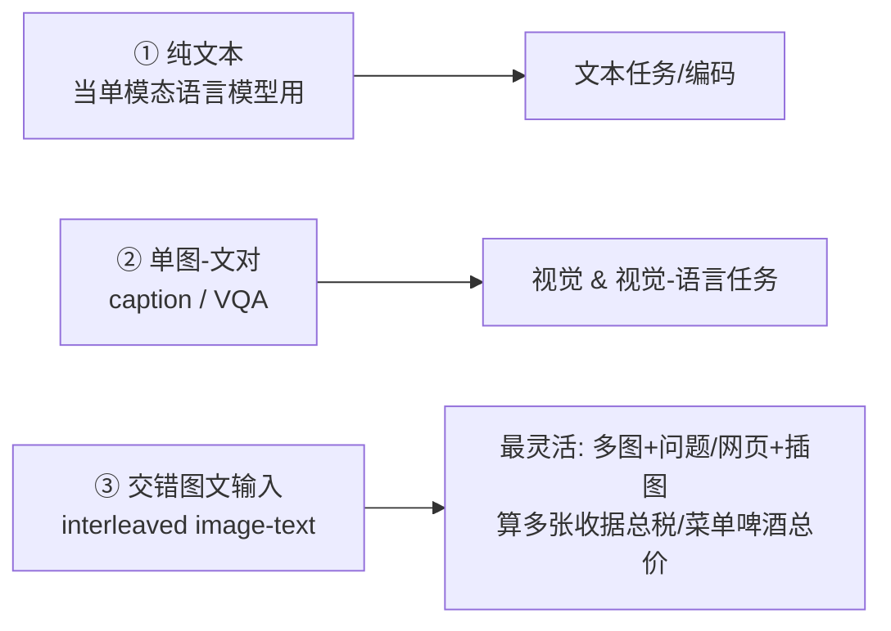
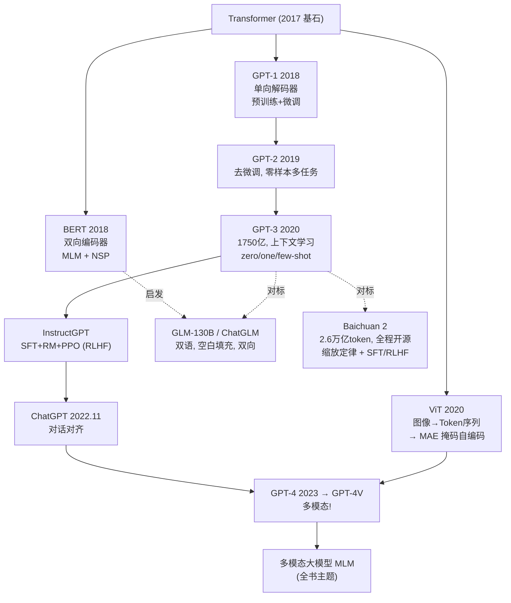

# 🌳 第 1 章 大模型家族(The Large Model Family)

> 本篇对应原书 Chapter 1（PDF 第 15–71 页）。这是全书的"地基章"——把 BERT、ViT、GPT 系列、ChatGPT、ChatGLM、Baichuan 这一整棵"大模型家谱"讲透，为后面进入**多模态大模型（Multimodal Large Models, MLM）**打下地基。原书作者一句话点题：*"这些经典架构是多模态大模型的基础（These classic architectures form the foundation for multimodal large models）"*。

---

## 🗺️ 本章地图

阅读顺序建议：先读 §1「五大范式转变」建立史观 → §2「基础概念」立术语 → §3–§8 逐个拆经典模型 → §9「缩放定律与从单模态到多模态」收口。全章约 900 行，配 5 张 mermaid 图、多张对照表、逐行公式讲解，以及贯穿始终的 💡 实战 / ⚠️ 常见坑 / 🔬 第一性原理 小框。

---

## 1️⃣ 五大范式转变：AI 正在发生什么

原书开篇没有直接讲模型，而是先讲一件更大的事：**自 2018 年 BERT 发布、2022 年底 ChatGPT 出圈以来，整个 AI 范式（paradigm）正在被大模型（Large Models）重塑**。作者归纳了五个"转变"，这是理解整个家族的史观框架。

| # | 范式转变 | 是什么 | 为什么重要 |
|---|---------|--------|-----------|
| 1 | **单模态 → 多模态** Unimodal → Multimodal | 模型同时吃 图像/视频/文本/语音 多种输入 | 人机交互更自然，AI 更贴近人类的多感官理解 |
| 2 | **预测 → 生成** Prediction → Generation | 从"判别标签"到"无需答案直接造新数据" | AI 有了创造力与想象力 |
| 3 | **单任务 → 多任务** Single-task → Multi-task | 一个模型同时干很多任务 | 泛化性、通用性、可迁移性 |
| 4 | **感知 → 认知** Perception → Cognition | 从"人写规则做感知"到"从海量数据学认知" | 逼近人类认知，部分模型能自学习自改进，迈向 AGI |
| 5 | **大模型 → 超级智能体** Large Model → Agent | 从"给 prompt 才动"到"给目标就自己拆解、规划、行动" | Agent 是 AGI 的终极形态 |

> 🔬 **第一性原理：Copilot 与 Agent 的分水岭**
> 原书用一个绝妙的比喻：**Copilot 是副驾驶（co-driver），Agent 是主驾驶（primary driver）**。
> - **大模型/Copilot**：交互基于 **prompt（提示词）**，你说得越清楚，它答得越好。它告诉你"how to do"。
> - **Agent（智能体）**：只需要一个 **goal（目标）**，就能自己"思考—拆解任务成分步计划—依赖外部反馈—给自己写 prompt"去完成。它不仅告诉你"how to do"，还**帮你把事做了**。
> "Agent"一词源自拉丁语 *Agere*（意为"to do / 去做"），在 LLM 语境下指一个**能自主理解、规划、决策、执行复杂任务的智能实体**。

这五个转变里，**转变 1（走向多模态）就是本书全书的主线**，其余四个是背景动力。记住这张表，后面每讲一个模型，你都能把它对号入座到某个"转变"上。

---

## 2️⃣ 基础概念：三个必须分清的术语

初学者最容易把 **多模态 / 大模型 / 基础模型 / 多模态大模型** 搅成一锅粥。原书 §1.1 专门立了定义，我们逐个厘清。

### 2.1 多模态（Multimodality）

**是什么**：使用**多种类型的媒介与数据输入**（文本、图像、音频、视频），且它们彼此**相关或对应**。处理多模态数据要求**融合不同类型的信息**，以获得更全面、准确的分析、理解与推理。

**典型应用（记住这三个，后面第 4 章还会展开 VQA）**：

| 应用 | 英文 | 融合什么 |
|------|------|---------|
| 视觉问答 | Visual Question Answering (VQA) | 图像 + 自然语言问题 |
| 智能对话 | Intelligent Dialog | 语言 + 可能的图像等信息 |
| 图像描述 | Image Captioning | 图像 → 生成文字描述 |

### 2.2 大模型 vs 基础模型（Large Models vs Foundation Models）

这是最关键的一对区分：

- **大模型（Large Models）**：泛指**参数规模巨大（亿到千亿级）**的深度神经网络，能在各种任务和数据集上取得优异性能。例：BERT、GPT、T5、ELECTRA。
- **基础模型（Foundation Models, FM）**：**大模型中的一个特殊类别**——通用、预训练、可适配广泛下游任务。这个概念源自斯坦福那篇著名论文 *"On the opportunities and risks of foundation models"*，它强调两个关键特征：**跨领域同质化（homogenization）** 与 **新能力涌现（emergence）**。

> 💡 **面试高频：为什么说基础模型"技术上不新，规模上惊人"？**
> 原书原话：基础模型建立在**深度神经网络 + 自监督学习**之上，这两样都存在了几十年，**概念并不新颖**。真正让它"起飞"的是**迁移学习（transfer learning）+ 规模（scale）**。GPT-3（1750 亿参数）能仅靠自然语言 prompt 适配特定任务、**无需针对性训练**，就是"规模即力量"的最好注脚。

### 2.3 多模态大模型（Multimodal Large Models, MLM）

**是什么**：**既能处理多种输入类型、又拥有超大参数量**的神经网络（涵盖文本/图像/音频/视频）。

**核心机制**——原书讲得很清楚，务必吃透这段：

> 多模态大模型的**核心在于融合来自不同数据类型的特征**。对每种输入模态，模型用**对应的特征提取器（feature extractor）**抽取特征，再**合并**这些特征得到一个**全局表示（global representation）**，用于后续预测或推理。融合过程中通常使用**注意力机制（attention）**来强化对关键特征的关注。

用一张图固化这个"三步走"心智模型：

> ⚠️ **常见坑：不要把"多模态大模型"等同于"更大的单模态模型"**
> 区别不在"大"，而在**"融合"**。传统深度学习模型只处理单一类型数据；MLM 的价值恰恰是**跨模态信息互补**——比如在医学影像里结合图像和文本辅助诊断，预测更准更全面。代价是：**训练/部署极其吃资源**，需要巨大算力和工程支撑。

### 2.4 多模态基础模型的三大问题（全书路线图）

原书 Fig.1.1 把多模态基础模型按"功能与泛化性"分成三类，用五个问题（Q1–Q5）串起来。这张分类图是**整本书的目录级导航**：

- **视觉理解（Q1）**：预训练强大的视觉骨干（backbone），支撑从图像级（分类、检索、描述）到区域级（检测、定位）再到像素级（分割）的所有下游任务。
- **视觉生成（Q2）**：核心技术三件套——**向量量化 VQ-VAE**、**扩散模型（diffusion）**、**自回归模型（autoregressive）**。
- **通用接口（Q3/Q4/Q5）**：Q3 不借助预训练 LLM 来统一视觉理解与生成；Q4、Q5 则**引入 LLM**（训练/连接），为 AI Agent 铺路。

---

## 3️⃣ BERT：双向编码器的技术细节

BERT（**B**idirectional **E**ncoder **R**epresentations from **T**ransformers）由 Google 于 2018 年提出，**标志着基础模型时代的开端**。它是基于 Transformer 的**深度双向表示学习模型**——"双向"意味着编码时每个位置都能看到**全序列所有位置**（不只是历史位置）。

### 3.1 整体架构：输入层 / 编码层 / 输出层

BERT 由三部分组成：**输入层 → 编码层（多层 Transformer 编码器）→ 输出层**。预训练时有两个最终输出头：**MLM（Masked Language Model）** 和 **NSP（Next Sentence Prediction）**。

### 3.2 输入表示：三种 Embedding 相加

BERT 的输入是一串 **Token**（文本基本单位：词、短语、标点、字符……）。输入表示由**三个向量逐元素相加**得到（公式 1.1）：

$$
\mathbf{v} = \mathbf{v}_p + \mathbf{v}_s + \mathbf{v}_t
$$

| 符号 | 名称 | 作用 | 维度 |
|------|------|------|------|
| $\mathbf{v}_t$ | Token Embedding | 每个词的向量表示 | $N \times e$ |
| $\mathbf{v}_s$ | Segment Embedding | 区分不同句子（第 0 句 / 第 1 句） | $N \times e$ |
| $\mathbf{v}_p$ | Position Embedding | 每个词的绝对位置 | $N \times e$ |

其中 $N$ = 最大序列长度，$e$ = 嵌入维度。三种 embedding 维度**必须相同**（都是 $e$），否则无法相加。两个特殊 Token：**[CLS]** 用于分类任务、**[SEP]** 用于句子分隔。

**逐个公式讲解**（$e_t, e_s, e_p$ 是 one-hot 编码，乘以可训练矩阵得到实值向量）：

$$
\mathbf{v}_t = e_t \mathbf{W}_t \quad (1.2), \qquad
\mathbf{v}_s = e_s \mathbf{W}_s \quad (1.3), \qquad
\mathbf{v}_p = e_p \mathbf{W}_p \quad (1.4)
$$

- $\mathbf{W}_t \in \mathbb{R}^{|V|\times e}$：可训练的 **Token 嵌入矩阵**，$|V|$ 是词表大小。这就是"查表"——把 one-hot 变成稠密向量。
- $\mathbf{W}_s \in \mathbb{R}^{|S|\times e}$：**Segment 嵌入矩阵**，$|S|$ 是段数（单句时全 0，句对时第一句为 0、第二句为 1）。
- $\mathbf{W}_p \in \mathbb{R}^{N\times e}$：**Position 嵌入矩阵**，注意 BERT 的位置编码是**可训练的**（不是 Transformer 原论文那种固定正弦）。

> ⚠️ **常见坑：[CLS] 和第一个 [SEP] 的 Segment 码都是 0**
> 原书特别提醒：序列开头的 [CLS] 标记、以及第一句末尾的 [SEP] 标记，**Segment 码都取 0**。别在实现时把 [SEP] 划给第二段。

### 3.3 编码层：Transformer Encoder

编码层由**多个相同子层**堆叠，每个子层含两个组件：

1. **多头自注意力（Multi-Head Self-Attention, MSA）**：计算序列中每个位置的向量表示——它是**所有位置向量表示的加权和**，权重由"当前位置与其他所有位置的相似度"决定。这样能捕捉序列中不同位置间的**依赖关系与语义关系**。"多头"= 把输入投影到**多个不同的线性空间**并行计算，最后拼接。
2. **前馈神经网络（Feedforward Neural Network, FFN）**：多层全连接。做法是"线性映射 → 激活函数（如 ReLU）→ 再线性映射"，对每个位置做非线性变换。

两个子层用 **残差连接（Residual Connection）+ 层归一化（Layer Normalization, LN）** 组合，这有效支撑深层网络训练、提升泛化与鲁棒性。

### 3.4 预训练任务一：MLM（掩码语言模型）

**是什么**：类似"完形填空（cloze test）"——随机遮住输入序列里的一些词，让模型根据上下文预测被遮的原词。这样才能实现**真·双向**建模（当前预测同时依赖"历史"和"未来"）。

**掩码策略（面试超高频，务必背下）**：BERT 采用 **15% 的掩码率**（15% 的 WordPiece 子词被掩），但**不总是替换成 [MASK]**，而是按概率三选一：

| 概率 | 操作 | 目的 |
|------|------|------|
| **80%** | 替换为 [MASK] | 主要的掩码信号 |
| **10%** | 替换为词表里的随机词 | 增加鲁棒性 |
| **10%** | 保持原词不变 | 缓解预训练/微调不一致 |

> 🔬 **第一性原理：为什么不 100% 用 [MASK]？**
> 因为下游微调时**根本没有 [MASK] 这个人造 token**！如果预训练 100% 用 [MASK]，就会在预训练和微调之间制造"**分布不一致（discrepancy）**"。留 10% 随机词 + 10% 原词，就是逼模型对**每个位置**都保持"随时可能要预测"的警觉，而不是只盯着 [MASK]。

**MLM 建模三步**（公式逐行讲）：

- **① 输入层**：$X = [\text{CLS}]\,x_1 x_2 \dots x_n\,[\text{SEP}]$，经 `Input Representation(X)` 得到 $\mathbf{v}$。长度不足 $N$ 补 **[PAD]**，超过 $N$ 则**截断**。
- **② 编码层**：$\mathbf{v}$ 过 $L$ 层 Transformer（公式 1.8–1.9）：

$$
\mathbf{h}^{[l]} = \text{Transformer-Block}(\mathbf{h}^{[l-1]}),\quad \forall l \in \{1,\dots,L\},\qquad \mathbf{h}^{[0]}=\mathbf{v}
$$

得到上下文语义表示 $\mathbf{h} \in \mathbb{R}^{N\times d}$，$d$ 是隐藏层维度。

- **③ 输出层**：MLM **只预测被掩位置**。设掩码位置索引集 $M=\{m_1,\dots,m_k\}$，掩码数 $k \approx n \times 15\%$。抽出这些位置的表示拼成 $\mathbf{h}^m \in \mathbb{R}^{k\times d}$，再用**词嵌入矩阵 $\mathbf{W}_t$**（复用！因为 $e=d$）映射回词表空间：

$$
P_i = \text{Softmax}(\mathbf{h}^m_i \mathbf{W}_t^\top + b_o) \quad (1.10)
$$

最后与真实标签 $y_i$（原词的 one-hot）算**交叉熵损失**学参数。

> 💡 **实战细节：$\mathbf{W}_t$ 被复用了两次**
> 输入端把 one-hot 变向量用 $\mathbf{W}_t$，输出端把向量变回词表分布**又用了 $\mathbf{W}_t$**（因为输入维度 $e$ 恰等于隐藏维度 $d$）。这叫 **weight tying（权重绑定）**，省参数还常常提点。

### 3.5 预训练任务二：NSP（下一句预测）

**为什么需要 NSP？** MLM 能学到"上下文敏感的词表示"，但**学不到句子之间的关系**。可阅读理解要处理"篇章+问题"，文本蕴含要判断"前提→假设"——这些都需要**句间关系**。

**NSP 是什么**：一个**二分类任务**，判断句子 B 是否是句子 A 的下一句。样本构造：

- **正样本**：自然文本中相邻的两句 A、B（"next sentence"关系）。
- **负样本**：把 B 换成语料库里的随机句子（"non-next"关系）。
- **正负比 1:1**，可自动生成海量数据 → 本质是**无监督**。

**NSP 输出层**（与 MLM 的关键差异）：NSP **只用 [CLS] 的隐表示**做分类。因为 [CLS] 是序列第一个元素，其隐表示对应 $\mathbf{h}_0$：

$$
P = \text{Softmax}(\mathbf{h}_0 \mathbf{W}_p + b_o),\qquad \mathbf{W}_p \in \mathbb{R}^{d\times 2} \quad (1.13)
$$

### 3.6 预训练数据 & 下游应用

- **预训练数据**：**BookCorpus**（1.1 万本书，约 8000 万词）+ **Wikipedia**（约 2.5 亿词）。
- **下游任务**（微调时加一个"简单线性层"即可）：文本分类、问答系统、语言推理、语义匹配、命名实体识别（NER）、自然语言生成、推荐系统。

---

## 4️⃣ ViT：把 Transformer 搬到图像上

**ViT（Vision Transformer）** 由 Google Brain 于 2020 年提出，是**基于 Transformer 的图像分类模型**。传统 CNN 在图像分类上很强，但要人工设计卷积/池化层、且处理大图要额外操作。ViT 用**自注意力自动学关键特征**，无需人工设计层。

**ViT 相比 CNN 的四大优势**：

| 优势 | 说明 |
|------|------|
| **处理变尺寸图** | CNN 要固定输入；ViT 把图切成固定大小 patch，更灵活 |
| **长程依赖建模** | CNN 难捕捉长程依赖、要堆很深；ViT 自注意力直接抓全局 |
| **参数更少** | 同规模下靠多头自注意力，参数更省仍达可比性能 |
| **泛化更强** | 训练时不显式用位置信息，不易"死记"见过的图 |

### 4.1 架构：把图变成"Token 序列"

核心思想一句话：**ViT 把图像当作一串向量序列，用自注意力处理**。数据流转（以 ViT-B/16 为例）：

**四个组件逐个讲**：

1. **图像切块（Image Patching）**：输入图 $x \in \mathbb{R}^{H\times W\times C}$ 切成固定大小 patch $x_p \in \mathbb{R}^{N\times(P^2 C)}$，再用 $\mathbf{E} \in \mathbb{R}^{(P^2 C)\times D}$ 线性投影。patch 数 $N = HW/P^2$。以 ViT-B/16 为例：$224/16=14$，$14^2 = 196$ 个 patch，每个 $16\times16\times3$，投影后每 patch 展平成**长度 768** 的向量（公式 1.14）：

$$
\underbrace{[224,224,3]}_{\text{图像}} \to \underbrace{196 \times [16,16,3]}_{\text{Patch}} \to \underbrace{196 \times [768]}_{\text{Token}}
$$

2. **类别嵌入（Class Embedding）**：仿照 BERT，插入一个可训练的 **[CLASS] Token** $x_{class} \in \mathbb{R}^{1\times D}$，与 196 个 patch token 拼接 → $[197, 768]$。
3. **位置编码（Positional Encoding）**：可训练参数 $E_{pos} \in \mathbb{R}^{(N+1)\times D}$，直接**加**到 token 上，维度仍为 $[197,768]$。
4. **多层 Transformer Encoder**：含 LN（每个 Block 前）、MSA、Dropout、MLP（两层全连接 + GeLU + Dropout）。

**核心公式（1.16–1.19）逐行读**：

$$
z_0 = [x_{class};\, x_p^1 \mathbf{E};\, x_p^2 \mathbf{E};\dots;\, x_p^N \mathbf{E}] + E_{pos} \quad (1.16)
$$
$$
z'_l = \text{MSA}(\text{LN}(z_{l-1})) + z_{l-1},\quad l=1,\dots,L \quad (1.17)
$$
$$
z_l = \text{MLP}(\text{LN}(z'_l)) + z'_l,\quad l=1,\dots,L \quad (1.18)
$$
$$
y = \text{LN}(z_L^0) \quad (1.19)
$$

- (1.16)：拼 [CLASS] + patch embedding，再加位置编码 → 初始输入 $z_0$。
- (1.17)：**先 LN 再 MSA，最后残差**（这是 **Pre-LN** 结构）。
- (1.18)：**先 LN 再 MLP，最后残差**。
- (1.19)：取最后一层的**第 0 个（即 [CLASS]）位置**过 LN，得最终预测 $y$。**分类只看 [CLASS] token**——和 BERT 的 [CLS] 思路完全一致。

> 💡 **面试高频：ViT 为什么用 [CLASS] token 而不是对所有 patch 做池化？**
> [CLASS] token 是可训练的"汇聚器"，通过自注意力主动从所有 patch 聚合全局信息，比简单平均池化更灵活。这个设计直接从 BERT 借来。

### 4.2 预训练：自监督的三种玩法

ViT 预训练数据是 **ImageNet**（>100 万图、1000 类），也用 **JFT-300M、YFCC100M** 等更大数据集。预训练用**自监督学习**（无需人工标注），主要方法：

- **掩码 patch 预测（Masked Patch Prediction, MPP）**：50% 的 patch embedding 被扰动——**80% 换成可学习 [MASK]、10% 随机替换、10% 保持不变**（是不是很眼熟？和 BERT 的 8/1/1 如出一辙），最后预测每个扰动 patch 的 **3-bit 平均颜色**。
- **图像 patch 对比学习（Contrastive Learning）**：同一图的两个 patch 在嵌入空间要相似、与其他图的 patch 要不同。用 **InfoNCE、SimCLR**。
- **图像重建（Image Reconstruction）**：从掩码/损坏的 patch 预测原始 patch。

### 4.3 MAE：非对称编码器-解码器

**MAE（Masked Autoencoders）** 由何恺明 2021 年提出，是图像重建路线最具代表性的自监督方法，本质是一种**更通用的去噪自编码器**。核心思想：**先随机掩码 patch，再用未掩码部分预测被掩区域**。

**MAE 在视觉 vs 语言任务上的三大差异**（这段是理解 MAE 高掩码率的关键）：

| 差异 | 语言（BERT） | 视觉（MAE） |
|------|-------------|-------------|
| **模型架构** | Transformer 天然处理序列 | 过去被 CNN 主导，卷积与位置嵌入融合难，ViT 才解决 |
| **信息密度** | 文本是人类高度抽象的信号，**密度高**，掩几个词就够 | 图像密度低、**空间冗余大**，相邻像素高度相似 |
| **解码器角色** | 预测掩码词需解码器懂语义 | 预测掩码像素往往**不依赖语义** |

> 🔬 **第一性原理：MAE 为什么用 75% 的超高掩码率？**
> 因为图像信息密度太低、冗余太高。如果只掩 15%（像 BERT），模型可以**用周围像素轻松抄出**被掩像素，学不到语义。掩掉 **75%** 后，"抄邻居"这条捷径被堵死，**逼编码器真正去学图像的语义信息**。这是 MAE 最精妙的一笔。

**MAE 的非对称设计**（原书 Fig.1.5）：

- **Encoder（编码器）**：**只吃未掩的 25% patch**！这让编码器能用**少得多的算力**训练——这是 MAE 高效的关键。
- **Decoder（解码器）**：吃"全图 patch"（未掩 patch 的编码特征 + 共享可学习的 mask token）+ 位置编码。**轻量**，深度宽度都远小于编码器，默认只需编码器 **10%** 的算力。**解码器只在预训练用**，可独立灵活设计。
- **重建目标**：重建原始像素 or 归一化像素（后者带来 0.5% 准确率提升）。数据增强只用随机裁剪 + 水平翻转（颜色抖动反而降精度，因为随机掩码已引入足够随机性）。

---

## 5️⃣ GPT 系列：单向解码器的暴力美学

GPT 由 OpenAI 于 2018 年提出。**GPT 系列的哲学是"堆叠 Transformer 层"**，靠不断加大、加优数据 + 加参数持续进化。**与 BERT 最大不同：GPT 是单向语言模型（unidirectional），只能基于前文生成**。

### 5.1 GPT 家族发展史一览

| 版本 | 发布 | 参数量 | 关键特征 |
|------|------|--------|---------|
| **GPT-1** | 2018.06 | 1.17 亿 | 12 层 Transformer，768 隐藏单元；无监督预训练 + 任务微调；5GB BooksCorpus |
| **GPT-2** | 2019.02 | 15 亿（10×） | 更大数据；**去掉微调**，零样本做多任务；WebText |
| **GPT-3** | 2020.05 | **1750 亿**（>100×） | 96 层，词嵌入维 12288；45TB CommonCrawl；**上下文学习**，无需微调 |
| **ChatGPT** | 2022.11 | 基于 GPT-3.5 | InstructGPT 框架，多层 Transformer 解码器，专注对话 |
| **GPT-4** | 2023.03 | — | **多模态**，可处理图像输入输出；文本上限 25000 字符 |
| **GPT-4V** | 2023.09 | — | 视觉能力，可分析图像输入 |

### 5.2 GPT-1：两阶段"半监督"

**训练两阶段**：① **无监督预训练**（大规模无标注数据训语言模型）→ ② **有监督微调**（用标注数据适配下游任务）。本质是"**半监督**"——学一个通用表示，各任务只需微小改动。

**① 无监督预训练目标**（标准语言模型，最大化似然，公式 1.20）：

$$
L_1(U) = \sum_i \log P(u_i \mid u_{i-k},\dots,u_{i-1};\Theta)
$$

- $k$ = 文本窗口大小，$P$ 由参数 $\Theta$ 的神经网络建模。**只用前 $k$ 个词预测当前词**——这就是"单向/自回归"。

**前向计算**（公式 1.21）：

$$
h_0 = U \mathbf{W}_e + \mathbf{W}_p,\qquad h_l = \text{Transformer\_block}(h_{l-1}),\qquad P(u) = \text{Softmax}(h_n \mathbf{W}_e^\top)
$$

- $\mathbf{W}_e$ = 词嵌入矩阵，$\mathbf{W}_p$ = 位置嵌入矩阵。注意**输出端又复用了 $\mathbf{W}_e^\top$**（weight tying）。

**② 有监督微调**（公式 1.22–1.24）：取最后一层激活 $h_l^m$ 过线性层预测标签 $y$。妙处在**最终目标函数把语言模型损失也加进来**：

$$
L_3(C) = L_2(C) + \lambda L_1(C) \quad (1.24)
$$

> 💡 **实战：为什么微调时还保留 $L_1$（语言模型损失）？**
> 原书点明：这能**增强泛化能力、加快收敛**。$\lambda$ 是权重系数。这是"辅助损失（auxiliary loss）"的经典用法。

**任务特定输入格式**（GPT-1 靠"拼接 + 分隔符 \$"统一各任务）：文本分类直接用；文本蕴含把前提和假设拼接、中插 \$；文本相似度做**两种句序**各算一遍再逐元素相加；多选题把 `[文档; 问题; $; 答案]` 拼好各自过模型再 Softmax。

### 5.3 GPT-2：去掉微调，走向通用

GPT-2 沿用 GPT-1 的无监督路线，但用**大量高质量、跨任务数据**，并**彻底去掉微调步骤**。

**核心洞察（公式 1.25–1.26）**——这是 LLM 的思想源头：

$$
p(x) = \prod_{i=1}^{n} p(s_n \mid s_1, s_2, \dots, s_{n-1}) \quad (1.25)
$$

学做单个任务 = 估计 $p(\text{output}\mid\text{input})$；而通用系统应该：

$$
p(\text{output} \mid \text{input}, \text{task}) \quad (1.26)
$$

> 🔬 **第一性原理：为什么"语言建模"能统一所有任务？**
> 原书用一个绝妙例子：训练"北京是中国的首都"这句话时，语言模型**自然而然就学会了问答任务的输入和输出**。因为"有监督输出只是语言模型序列的子集"。把机器翻译、自然语言推理、关系抽取全**塞进一个分类任务**——输入 `"中国的首都是北京"`，模型翻译成 `"The capital of China is Beijing"`。**GPT-2 为后来 LLM 的辉煌打下了坚实基础**。代价：学习速度远慢于任务特定的有监督方法。

**训练数据 WebText**：自研爬虫，只爬人工筛选/过滤的高质量网页——爬 Reddit 上**至少 3 个赞**的外链（"有趣/有教育意义/有意思"的启发式指标），共 4500 万链接。**移除了所有 Wikipedia 文档**（避免与其他数据集重叠污染评测）。

**架构微调**：LN 移到每个 Transformer block 开头，末尾注意力后再加一个 LN；残差层初始化按 $1/\sqrt{N}$ 缩放（$N$ 是残差层数）；词表扩到 50247，上下文窗口 512→1024，batch size 提到 512。

### 5.4 GPT-3：上下文学习与三种"shot"

**"预训练+微调"范式的根本局限**：每个新任务都要大量标注数据 + 专门微调，且微调易**过拟合**、丢失处理其他问题的能力。而人类无需大量标注就能学会大多数任务。

GPT-3 保留 GPT-2 结构但**大幅扩容**：**96 层多头 Transformer，词嵌入维 12288，1750 亿参数**（GPT-2 的 100+ 倍）。**不做微调**，而是**用示例作为输入引导**帮模型完成任务。Transformer 内部用**局部带状稀疏注意力（local banded sparse attention）**（类似 Sparse Transformer）提升计算效率。

**三种上下文学习（In-Context Learning）方式**——这是 GPT-3 最重要的贡献，面试必考：

| 方式 | 给几个示例 | 优点 | 缺点 |
|------|-----------|------|------|
| **Few-shot** | K 个（10–100） | 大幅减少任务数据需求 | 性能仍不及最优微调模型 |
| **One-shot** | 1 个 + 任务描述 | 最接近人类沟通任务的方式 | — |
| **Zero-shot** | 0 个，只有指令 | 最方便、最鲁棒、避免虚假关联 | 最难，有时连人都难懂任务格式 |

> ⚠️ **关键区别：三种 shot vs 传统微调**
> 原书反复强调**唯一本质差异是"是否修改模型参数"**：微调在学习中**持续调整参数**；GPT-3 的三种方法**完全不改参数**（只做前向传播）。这正是"单一模型处理所有任务"的基础。⚠️ 别把 few-shot 里的"示例"误当成"训练"——它们只是 prompt 的一部分，喂进去做一次前向而已。

**训练数据处理三步提质**：① 用 WebText 作正例、CommonCrawl 作负例训逻辑回归**过滤低质数据**；② **模糊去重**防过拟合验证集；③ 加入已知高质量数据集增多样性。45TB → 过滤后 570GB。训练时**不按数据集大小成比例采样**，而是给高质量数据**更大采样权重**。

**GPT-3 的局限（原书讲了一整节，选重点）**：

- 长文本会**语义重复、失去连贯、自相矛盾**。
- **常识物理**差（"把奶酪放冰箱会融化吗？"答不好）。
- 双向任务弱（完形填空、对比两段内容）——因为是**纯自回归、排除了双向架构**。
- **预训练目标缺陷**：所有 token 一视同仁，不区分重要性；**纯自监督预测可能已近极限**，缺乏视频/物理交互等世界经验。
- **样本效率低**：预训练需要远超人一生所见的文本量。
- **推理成本高**（可考虑**蒸馏**为特定任务瘦身）；决策**不可解释**、预测**校准差**、**继承训练数据偏见**。

---

## 6️⃣ ChatGPT：InstructGPT 与 RLHF 的胜利

**要理解 ChatGPT，必先理解 InstructGPT**——ChatGPT 继承了它的框架。ChatGPT 基于 GPT-3.5，核心架构与基于 GPT-3 的 InstructGPT 一致，但**训练数据量高出几个数量级**。

> 🔬 **第一性原理：为什么"单纯把模型做大"不够？**
> 原书一针见血：**简单扩大语言模型，并不能内在地提升其遵循用户意图的能力**。LLM 可能生成不真实、有害、无用的输出——这叫**与用户需求"失配（misalignment）"**。InstructGPT 的解法就是**通过人类反馈微调，让模型对齐（align）用户意图**。

### 6.1 InstructGPT 三步走（RLHF）

**三步详解**：

1. **SFT（Supervised Fine-Tuning，有监督微调）**：标注员在输入 prompt 分布上给出**期望行为的示范**，用有监督学习微调预训练的 GPT-3。训练 16 epochs，余弦学习率衰减，残差 dropout 0.2。（有趣的现象：1 个 epoch 后就过拟合验证损失了，但**继续训反而提升 RM 分数和人类偏好**。）
2. **RM（Reward Modeling，奖励建模）**：从 SFT 模型出发、**去掉最后的 unembedding 层**，输入 prompt+回答、输出**标量奖励**。⚠️ **只用 6B 参数的 RM**（省算力）——175B 的 RM 训练**不稳定**，不适合当 RL 阶段的价值函数。
3. **RL（PPO 强化学习）**：用 **PPO（Proximal Policy Optimization，近端策略优化）** 微调 SFT 模型。环境是**bandit（老虎机）设定**：给随机 prompt，期望一个回答，RM 给奖励后结束 episode。**每个 token 加一个来自 SFT 模型的 KL 惩罚**，防止对 RM 过度优化。价值函数从 RM 初始化。

Step 2、3 可**持续迭代**——从当前最优策略采集更多对比数据，训新 RM 和策略。

> 💡 **面试高频：InstructGPT 用了三个数据集**
> - **SFT 数据集**：约 1.3 万训练 prompt（标注员示范）→ 训 SFT 模型。
> - **RM 数据集**：约 3.3 万训练 prompt（标注员排序）→ 训奖励模型。
> - **PPO 数据集**：约 3.1 万训练 prompt（**无人工标签**，仅来自 API）→ RLHF 微调。

> ⚠️ **反直觉的震撼结论**
> 只有 **13 亿参数**的 InstructGPT（不到 GPT-3 1750 亿的 1/100），其输出**却更受人类偏好**，且更真实、更少有害。这证明：**人类反馈微调 >> 单纯堆参数**，是对齐语言模型与人类意图的有希望方向。

### 6.2 ChatGPT 本身

ChatGPT 建立在 GPT-3.5 上，用 RLHF 训练。**GPT 系列从 GPT-3 起分成两条平行技术路线**：一条是 **Codex（代码预训练）**，另一条是 **InstructGPT（文本指令预训练）**。两条路线最终**合并**成统一预训练流程。经指令微调（Instruction Tuning）、SFT、RLHF，ChatGPT 成为带自然语言对话接口的模型。

**ChatGPT 的三大优势**（对话为何这么强）：

| 优势 | 来源 |
|------|------|
| **强大基础能力** | 微调自 GPT-3.5 的 Code-davinci-002，万亿参数级 + "涌现（emergent）"潜力 |
| **惊艳的思维链推理** | 用 159GB 代码继续预训练——代码的**分步、模块化解题**让模型涌现推理能力，**打破缩放定律（Scaling Law）**、性能超线性增长 |
| **实用的零样本能力** | 多样任务上的指令微调大幅增强泛化，能处理跨语言跨领域的未见任务 |

> 💡 **实战案例：泛化的力量**
> InstructGPT（ChatGPT 前身）指令集 96% 是英语，只含 20 种其他语言。但 ChatGPT **能正确翻译塞尔维亚语**——一种指令集里**根本没有**的语言！这种泛化是小微调模型无法企及的。

**ChatGPT 的局限**：不可验证的可靠性（"自信地胡说，confident nonsense"）、时效性差（知识截止于预训练日期）、成本高、专业领域欠佳、对输入措辞敏感（换个说法答案就变，说明模型**不稳定**）；RLHF 把标注员偏好也**焊进了模型**（如偏好冗长回答）；有数据泄露风险。

**未来方向**：**模型压缩**（量化 quantization、剪枝 pruning、蒸馏 distillation、稀疏化 sparsification）；**RLAIF（Reinforcement Learning from AI Feedback，从 AI 反馈中强化学习）**——Anthropic 2022 年 12 月发表 *Constitutional AI* 论文推出 **Claude**，用**模型而非人工**做排序标注，训一个模型学人类对"无害性（harmlessness）"的偏好来打分排序。

> 📎 **补充：Claude 与 Constitutional AI（宪法 AI）**
> 原书提到的 Claude 由 Anthropic 开发。其 **RLAIF / Constitutional AI** 思路是：用一套"宪法"原则 + AI 自我批评来替代大量人工标注，训练模型自己朝"有用、诚实、无害（helpful, honest, harmless）"对齐。这与 ChatGPT 的 RLHF 是同源竞争路线，代表了对齐技术从"依赖人类反馈"向"减少人类反馈依赖"的演进。

---

## 7️⃣ ChatGLM：双语开源的国产力量

**ChatGLM** 是清华 KEG 团队的**中英双语聊天机器人**，基于 **GLM-130B** 基础模型、针对中文优化。它的核心区别于 BERT/GPT-3/T5——是**融合多个目标函数的自回归预训练模型**。

### 7.1 GLM-130B：与主流 LLM 的对比

| — | GPT3-175B | BLOOM-176B | **GLM-130B** |
|---|-----------|-----------|-------------|
| **基础架构** | GPT | GPT | **GLM** |
| **训练方法** | 自监督预训练 | 自监督预训练 | 自监督 + **多任务预训练** |
| **量化** | — | INT8 | **INT4/INT8** |
| **加速** | — | Megatron | Faster Transformer |
| **跨平台** | NVIDIA | NVIDIA | NVIDIA / 海光 DCU / 华为昇腾 910 / 申威 |

GLM-130B 亮点：中英双语；英文超 GPT-3 175B / OPT-175B / BLOOM-176B；中文显著超 ERNIE TITAN 3.0 260B；**首个实现 INT4 量化的千亿模型**（无需量化感知训练、性能损失极小）；可在 4×3090 或 8×2080Ti 单机近乎无损推理；30+ 任务全可复现；跨国产平台。

### 7.2 GLM 算法：自回归空白填充

**GLM 的训练目标是"自回归空白填充（autoregressive blank-filling）"**。对文本序列 $x=[x_1,\dots,x_n]$，采样一些 span $\{s_1,\dots,s_m\}$，每个 span 被**单个 mask token 替换**形成 $x_{corrupt}$，模型要**自回归地恢复**它们。目标函数（公式 1.27）：

$$
\mathcal{L} = \max_\theta \mathbb{E}_{z\sim Z_m}\left[\sum_{i=1}^{m}\sum_{j=1}^{l_i}\log p(s_{i,j}\mid x_{corrupt}, s_{z<i}, s_{i,<j})\right]
$$

- $Z_m$ = 所有扰动序列的集合；通过**随机排列顺序**决定被破坏 span 间的可见性。

**GLM 对未掩上下文用双向注意力**（区别于 GPT 的单向注意力）。混合两种扰动目标：

- **[MASK]**：句内短空白。→ 行为类似 **BERT/T5**。
- **[gMASK]**：前缀上下文句末的长空白。→ 行为类似 **PrefixLM**。

> 🔬 **第一性原理：GLM 为什么能"understanding + generation"通吃？**
> 双向注意力 + 空白填充让它比 GPT 式模型更懂上下文。**用 [MASK] 时像 BERT（擅理解）、用 [gMASK] 时像 PrefixLM（擅生成）**——一个模型两种人格，这就是 GLM 统一理解与生成的秘诀。

**训练稳定性技巧（面试可能追问）**：Pre-LN、Post-LN、Sandwich-LN 都无法稳定 GLM-130B；最终用 **DeepNorm 初始化的 Post-LN 变体**：$\text{DeepNorm}(x)=\text{LayerNorm}(\alpha\cdot x + \text{Network}(x))$，其中 $\alpha=(2N)^{1/2}$。位置编码用 **RoPE（旋转位置编码）** 而非 ALiBi；FFN 用 **GLU + GeLU**。

**预训练配置**：95% token 做自监督空白填充（1.2TB 英文 Pile + 1.0TB 中文 WudaoCorpora + 250GB 中文网页），5% token 做**多任务指令预训练**（74 个 prompt 数据集）。**3D 并行**（数据+张量+流水线并行），4 路张量并行 + 8 路流水线并行，全局 batch 4224；96 节点 DGX-A100 训 60 天、4000 亿 token。

### 7.3 ChatGLM-6B / ChatGLM2-6B：消费级部署

**ChatGLM-6B**（62 亿参数）的杀手锏是**低部署门槛**：

| 精度 | 显存需求 |
|------|---------|
| FP16 | ≥13 GB |
| INT8 | 10 GB |
| **INT4** | **6 GB（消费级 GPU 可跑！）** |

其他特性：1TB token 中英 1:1 双语预训练；修正 GLM-130B 的 **2D RoPE** 实现、采用标准 FFN；支持 2048 token 序列；用 SFT + Feedback Bootstrap + RLHF 对齐、Markdown 格式输出。

**ChatGLM2-6B 升级**：MMLU +23%、C-Eval +33%、**GSM8K +571%**；用 **Flash Attention** 把上下文从 2K 扩到 32K（对话 8K）；用 **Multi-Query Attention** 推理提速 42%、省显存（INT4 下 6GB 支持 8K 对话）。

> ⚠️ **ChatGLM-6B 的已知局限**
> 6B 参数限制了记忆与语言能力 → 事实性错误、数学/编程差；可能有害/有偏；多轮对话弱、易丢上下文；英文理解逊于中文；"自我认知"有缺陷、易被误导生成错误论断。**小参数量是双刃剑：门槛低但能力上限也低**。

---

## 8️⃣ Baichuan 2：把训练细节开源到底

**Baichuan 2**（百川 2）由百川智能 2023 年 9 月开源，含 7B 和 13B 的 Base 与 Chat 版。在中英文通用榜上**全面超越 LLaMA 2**，Baichuan 2-13B "统治"同规模开源模型。

> 💡 **为什么要有 Baichuan 2？——填两个空**
> ① **开源空白**：GPT-4、PaLM-2、Claude 都是闭源，社区难深入研究。LLaMA 虽开源但**主要面向英语**（67% 数据是 CommonCrawl 英文），限制了中文等特定语言的发展。
> ② **训练透明度空白**：多数开源模型只放最终权重、几乎不谈训练细节，且常是 Chat 变体，"对学术界不友好"。**Baichuan 2 开源了从 220B 到 2640B token 的全过程 checkpoint——这是中国开源生态的首次**，对研究训练动态、继续训练、价值对齐极有价值。

两个模型都训了 **2.6 万亿 token**（Baichuan 1 的两倍多，号称当时最大数据集）。

### 8.1 架构改动（一堆现代 LLM 标配技巧，逐个记）

| 组件 | Baichuan 2 的选择 | 为什么 |
|------|------------------|--------|
| **Tokenizer** | 词表 64000 → **125696**，BPE（SentencePiece）；多位数字**逐位拆分**；加纯空白 token | 平衡压缩率与训练充分性；更好编码数值和代码 |
| **位置编码** | 7B 用 **RoPE**，13B 用 **ALiBi** | ALiBi 外推更好；但 Flash Attention 更配 RoPE（RoPE 是乘法式、不需传 attention_mask） |
| **激活函数** | **SwiGLU**（GLU 的门控变体，3 个参数矩阵） | 因多一个矩阵，隐藏维从 4× 降到 8/3× 并取 128 倍数 |
| **注意力** | xFormers 的**内存高效注意力**（支持 bias） | 高效整合 ALiBi 的偏置式位置编码、降显存 |
| **归一化** | 对 Transformer block **输入**做 LN；用 **RMSNorm** | 对 warm-up 更鲁棒；RMSNorm 只算方差、更快 |

**两个独门稳定化技巧（面试亮点）**：

- **NormHead**：归一化输出词嵌入（"heads"）。原因：① 稀有 token 的嵌入范数会变小、扰乱训练动态，NormHead 显著稳定它；② 语义主要由**余弦相似度**编码，而线性分类器用点积（混了 L2 距离），NormHead 减轻 L2 距离干扰。
- **Max-z Loss**：训练中 logit 会变得过大 → 推理时重复惩罚（如 HuggingFace `model.generate`）直接作用于 logit，缩放大 logit 会剧变 softmax 概率、对超参敏感。加正则（公式 1.28）：

$$
\mathcal{L}_{\text{max-z}} = 2e^{-4}\, z^2,\qquad z=\text{最大 logit 值}
$$

**优化**：AdamW（$\beta_1=0.9,\beta_2=0.95$），weight decay 0.1，梯度裁剪 0.5；全程 **BFloat16 混合精度**（比 Float16 动态范围大、更抗极值），但对**位置编码等数值敏感操作用全精度**（避免 `torch.arange` 整数超 256 碰撞）。

### 8.2 缩放定律（Scaling Laws）—— 本章要点核心

> 这一节是本章"缩放"主题最直接的落地，务必吃透。

**缩放定律是什么**：**误差随"训练集大小 / 模型大小 / 或两者组合"以幂函数（power function）下降**。当训练 LLM 越来越贵，缩放定律能**可靠地预判性能**——在烧钱训大模型前，先训小模型拟合规律，外推大模型表现。

**Baichuan 2 的做法**：先训一系列 **10M 到 3B**（最终模型的 1/1000 到 1/10）的小模型，各训最多 1 万亿 token，用一致超参和同一数据集。根据不同模型的最终损失，把**训练算力 FLOPs 映射到目标损失**。拟合公式（1.29）：

$$
L_C = a \times C^b + L_\infty
$$

- $L_\infty$：**不可约损失（irreducible loss）**——数据本身噪声决定的下界，再怎么加算力也降不到它以下。
- $a\times C^b$：**可约损失（reducible loss）**，构造成**幂律缩放项**。
- $C$：训练 FLOPs；$L_C$：该算力下的最终损失。
- 用 **SciPy 的 `curve_fit`** 拟合参数 $a, b, L_\infty$。

> 🔬 **第一性原理：缩放定律为什么如此重要？**
> 它把"炼丹"从玄学变成**工程可预测**。你不必真的烧几百万美金训个千亿模型才知道效果——先花小钱训几个小模型，拟合出 $L_C = a C^b + L_\infty$ 这条曲线，就能**外推**大模型的损失，从而**理性决定要不要投入、投多少**。GPT-3、PaLM、Chinchilla、Baichuan 2 都靠它做决策。这是"缩放（scaling）"这个主题从"经验观察"上升为"定量规律"的关键。

### 8.3 基础设施与对齐

**Infra（工程亮点）**：弹性训练框架 + 智能集群调度（GPU 资源多用户共享、按集群状态动态调整任务资源）；**张量并行 + ZeRO 数据并行**（机内张量并行、跨机 ZeRO 分片弹性伸缩）；张量分区技术降峰值显存（如大词表交叉熵）；混合精度（前向后向 BFloat16、优化器更新 Float32）；**拓扑感知分布式训练**（减少跨交换机访问）；**ZeRO 的混合分层分区**（解决扩展到数千 GPU 时的通信瓶颈）。最终在 **1024 张 A800** 上训练，算力效率 **>180 TFLOPs**。

**Alignment（对齐）= SFT + RLHF**：

- **SFT**：标注员把 prompt 标为 "helpful" 或 "harmless"（类似 Claude 的原则）；交叉验证保质量；收集 **10 万+** 样本。
- **RM（奖励模型）**：三层分类体系（6 大类、30 子类、200+ 三级类）；用**不同规模/阶段（SFT、PPO）的 Baichuan 2 模型**生成回答增多样性；⚠️ **只用 Baichuan 2 自己生成的回答**训 RM（用其他开源/私有模型的回答**不提升**准确率——体现模型内在一致性）。损失函数对齐 InstructGPT。
- **PPO**：用**四个模型**——actor（生成回答）、reference（固定参数、算 KL 惩罚）、reward（固定参数、给整段奖励）、critic（学每个 token 的价值）。critic 先 warm-up 20 步；梯度裁剪 0.5、学习率 5e-6、PPO 裁剪阈值 0.1；KL 惩罚系数 $\beta$ 从 0.2 逐步降到 0.005；所有 chat 模型训 350 轮。

> 💡 **面试高频：PPO 里的"四个模型"分别干嘛？**
> 这是 RLHF 工程实现的经典问题：**Actor** 是被训练的策略（生成回答）；**Reference/参考模型**参数冻结，用来算 KL 散度防止 Actor 跑偏；**Reward/奖励模型**参数冻结，给整段回答打分；**Critic/价值模型**学每个 token 的价值估计（PPO 需要的优势函数计算要用它）。Baichuan 2、InstructGPT、几乎所有 RLHF 都是这套。

---

## 9️⃣ 从单模态到多模态：GPT-4V 与家族收口

前面 BERT/ViT/GPT/ChatGLM/Baichuan 要么是**纯文本**、要么是**纯视觉**。**GPT-4V（GPT-4 Vision）** 是本章从"单模态谱系"迈向"多模态"的**关键跨越**，也呼应了 §1 的第一大范式转变。

> 原书原话：*"把额外模态（如图像输入）整合进 LLM，被认为是 AI 研究与开发的关键前沿。"* GPT-4V 不仅拥有跨模态（文本+视觉）功能，还**从二者交叉中衍生出新能力**，能处理**任意交错的多模态输入**，是一个强大的多模态通用系统。

### 9.1 GPT-4V 的能力与训练

**训练方式**（和 GPT-4 同源）：先在海量互联网**文本+图像**数据上预训练（预测文档下一个词），再用 **RLHF** 微调生成人类偏好输出。

**视觉能力清单**：

| 能力 | 说明 |
|------|------|
| 目标检测 Object Detection | 识别车、动物、家居物品 |
| 文本识别 OCR | 检测并转录印刷/手写文字 |
| 人脸识别 Face Recognition | 定位人脸、识别性别/年龄/族裔 |
| 验证码破解 CAPTCHA | 展现视觉推理能力 |
| 地理定位 Geolocation | 从风景图识别城市（⚠️隐私风险） |
| 复杂图像 | ❌ 难解读科学图表、医学扫描、多重叠文本 |

### 9.2 三种输入模式与提示技巧

**GPT-4V 支持三种输入模式**：

**四大工作模式与提示技巧**：

1. **遵循文本指令（Following Text Instructions）**：指令是定制任意视觉-语言用例输出的自然方式；给"中间步骤"指令能帮它更好处理抽象推理。
2. **视觉指点与视觉参考提示（Visual Pointing / Visual Referring Prompts）**：**"指点（pointing）"是人类交互的基本方式**。GPT-4V 特别擅长理解**直接画在图上**的视觉指针（箭头、框、圈、手绘）——这可能成为未来人机交互方式。
3. **视觉-文本提示（Visual-Text Prompts）**：能无缝混合指令与输入示例；**多模态指令输入的融合**——GPT-4V 能处理任意混合的图、子图、文本、场景文字、视觉指针，这与其他"严格限制图文组合方式和图片数量"的多模态模型形成鲜明对比。
4. **上下文少样本学习（In-Context Few-Shot Learning）**：GPT-4V 也具备——推理时前缀几个同格式示例、**无需参数更新**即可产出期望输出。

### 9.3 GPT-4V 的挑战

**从纯文到多模态的演进链**：GPT-1/2/3 是**文入文出**（限于 NLP）→ GPT-4 强文本理解生成 → GPT-4V 强图像理解 → 未来应能**生成交错图文内容**（如图文并茂教程），并纳入视频、音频、传感器等更多模态。

**当前八大挑战**：① 空间关系（难懂精确布局/物体位置）；② 物体重叠（分不清边界）；③ 前景/背景（易描述错关系）；④ 遮挡（认不出被遮物体）；⑤ 细节（漏判小物体/文字）；⑥ 上下文推理（缺乏鲁棒视觉推理）；⑦ 置信度（可能描述与内容不符的关系）；⑧ System Card 明确："**当前性能对科研和医疗应用不可靠**"。此外还有**人脸识别的隐私、公平、社会角色**争议（是否该识别公众人物？是否该推断性别/种族/情绪？）。

---

## 🌲 全家族总览：一张图收口

**一句话串起全家族**：**Transformer 是共同基石** → BERT 走"双向编码+理解"、GPT 走"单向解码+生成"、ViT 把它搬到图像 → GPT 靠**缩放**（GPT-1→2→3）催生**上下文学习** → 靠 **RLHF 对齐**（InstructGPT→ChatGPT）→ 靠**多模态融合**（GPT-4V）迈向多模态大模型。ChatGLM、Baichuan 2 是国产开源的双语代表，把**训练细节与缩放定律**贡献给了社区。

---

## 📌 小结

1. **五大范式转变**是理解大模型时代的史观框架，其中"**单模态→多模态**"是全书主线；"**大模型→Agent**"（Copilot 是副驾、Agent 是主驾）指向 AGI 终局。
2. **三个术语要分清**：大模型（参数大）⊃ 基础模型（通用+可适配下游，两特征：**同质化 + 涌现**）；多模态大模型的**核心是"跨模态特征融合 + 注意力"**，不是简单变大。
3. **BERT**：双向编码器，三 embedding 相加，**MLM（15% 掩码，8/1/1 策略）+ NSP**（只用 [CLS]），开启基础模型时代。
4. **ViT**：图切 patch → Token 序列 → 只看 [CLASS] 分类；**MAE 用 75% 超高掩码率**逼编码器学语义，非对称"重编码器+轻解码器"。
5. **GPT 系列**：单向自回归，靠**堆叠 + 缩放**进化；GPT-3 的 **zero/one/few-shot 上下文学习**（不改参数）是里程碑。
6. **ChatGPT = GPT-3.5 + RLHF**，源自 **InstructGPT 三步（SFT→RM→PPO）**；13 亿的 InstructGPT 偏好胜过 1750 亿 GPT-3，证明**对齐 > 堆参数**；对手路线是 Claude 的 **RLAIF / Constitutional AI**。
7. **ChatGLM/GLM-130B**：双语、**自回归空白填充**、[MASK]/[gMASK] 双人格（似 BERT / 似 PrefixLM），INT4 消费级部署。
8. **Baichuan 2**：2.6 万亿 token、**全程 checkpoint 开源**；**缩放定律** $L_C = aC^b + L_\infty$ 让性能可预测；SwiGLU/RMSNorm/NormHead/Max-z Loss 等现代技巧；RLHF 的 **PPO 四模型**（actor/reference/reward/critic）。
9. **GPT-4V** 是从单模态谱系跨入**多模态**的关键，支持纯文/单图文/交错图文三模式，擅长"画在图上的视觉指点"，但在空间关系、遮挡、细节、科研医疗可靠性上仍有八大挑战。

---

## 🔗 延伸

- **On the Opportunities and Risks of Foundation Models**（Bommasani et al., 斯坦福 CRFM）— "基础模型"一词与"同质化/涌现"论述的出处。
- **BERT: Pre-training of Deep Bidirectional Transformers**（Devlin et al., 2018）。
- **An Image is Worth 16×16 Words: ViT**（Dosovitskiy et al., 2020）与 **Masked Autoencoders Are Scalable Vision Learners**（He et al., 2021, MAE）。
- **GPT-3: Language Models are Few-Shot Learners**（Brown et al., 2020）；**InstructGPT: Training LMs to follow instructions with human feedback**（Ouyang et al., 2022）。
- **GLM-130B: An Open Bilingual Pre-trained Model**（Zeng et al., 2022）；**Baichuan 2: Open Large-scale Language Models**（2023 技术报告，含全程 checkpoint）。
- **Constitutional AI: Harmlessness from AI Feedback**（Anthropic, 2022）— RLAIF 与 Claude。若想深入 Claude 系列的对齐范式（RLHF / Constitutional AI / 模型选型），建议查阅 Anthropic 官方文档与该论文。
- **下一步**：本章是"地基"，第 2 章起将进入多模态大模型的**具体架构与核心技术**（视觉-语言预训练、对比学习 CLIP、跨模态融合等），届时回看本章的"三大问题（Q1–Q5）"分类图会更有体感。

> 🧭 **学习建议**：把本章当"家谱"反复查阅。每读到后面章节的一个新模型，先问三句——它属于哪条谱系（BERT 式/GPT 式/ViT 式/GLM 式）？它靠什么进化（缩放/对齐/融合）？它对应五大范式转变的哪一个？能答出这三句，就说明本章真正吃透了。
