# 第 2 章 多模态大模型核心技术（Core Technologies of Multimodal Large Models）

> 逐章精讲 ·《Multimodal Large Models: A New Paradigm of Artificial Intelligence》(Liang Lin, Yang Liu) · 原书第 2 章（PDF pp. 59–135）
>
> 本篇对应原书 Chapter 2「Core Technologies of Multimodal Large Models」。原书把这一章当成后面所有「多模态基础模型」的**技术地基**——预训练、自监督、对比学习、Prompt、In-Context Learning、微调、思维链、RLHF/RLAIF。我在忠实抄录书中公式与结论的基础上，用「模态编码器 → 对齐 → 融合(cross-attention) → 对比学习 → 生成」这条主线把它们串成一张**多模态视角的技术全景图**，让你既读懂书，也能在面试和落地里直接用上。

---

## 🗺️ 本章地图

多模态大模型（Multimodal Large Model, MLLM）本质上是：**用一个强大的 LLM 当「大脑」，把图像 / 视频 / 音频等模态「翻译」成大脑能读的语言，再让大脑推理与生成**。要把这句话拆成可实现的工程，需要五块拼图：

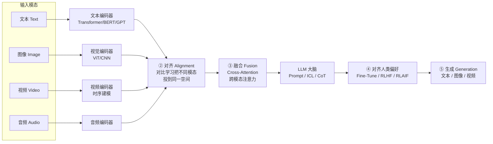

| 拼图 | 本质问题 | 本章对应小节 | 代表技术 |
|---|---|---|---|
| ① **模态编码器** | 怎么把各模态变成向量？ | 2.1 基础架构 | Transformer、ViT、GPT |
| ② **对齐 Alignment** | 怎么让「猫的图」和「cat 这个词」在同一空间挨得近？ | 2.1.2 / 2.4 对比学习 | CLIP 式对比学习、InfoNCE、MoCo/SimCLR |
| ③ **融合 Fusion** | 怎么让模型「看着图回答问题」？ | 2.1.1 注意力机制 | Cross-Attention（交叉注意力） |
| ④ **对齐人类** | 怎么让输出「有用、真实、无害」？ | 2.7–2.10 | 微调、Prompt、ICL、CoT、RLHF、RLAIF |
| ⑤ **生成 Generation** | 怎么产出新内容？ | 2.1.2 / 2.4.3 | 自回归、VAE、GAN、扩散 |

> 💡 **一句话记住全章**：**编码器**负责「看懂」，**对比学习**负责「对齐语义」，**Cross-Attention**负责「融合看与问」，**RLHF/RLAIF**负责「对齐人类」，**生成头**负责「产出」。

---

## 2.0 开篇：AI 模型演化的四个阶段 🔬

原书开篇（Fig. 2.1）把过去十年的 AI 模型分成**四类**，并预言多模态基础模型也会走这条路：

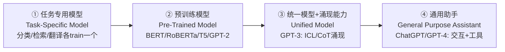

- **第①类**（任务专用）：从零训练，一个数据集配一个模型（分类、检索、风格迁移、情感、翻译各来一套）。属于「窄」模型。
- **第②③④类**都属于**基础模型（Foundation Model）**。语言侧（绿色）和视觉侧（蓝色）各自沿这条轨迹进化，作者预测**多模态基础模型也会沿同一趋势**：从「专用预训练」→「统一涌现」→「通用助手」。
- 语言侧的路径最清晰：`BERT/RoBERTa/T5/GPT-2`（预训练）→ `GPT-3`（统一 + 涌现出 ICL 与 CoT）→ `ChatGPT/GPT-4`（通用助手，会交互、会用工具）。

> 🔬 **第一性原理**：为什么范式会这样演化？因为**数据的边际标注成本**在下降而**模型的边际能力**在上升。任务专用模型受限于「每个任务都要人工标注」；预训练把「无标注文本」变成免费燃料（NLP 的关键优势——训练数据可以来自**任意无标签语料**，等于无限数据）；涌现能力则是「规模」这一自变量跨过阈值后的相变。多模态只是把这套逻辑从「文本」推广到「文本 + 像素」。

> 💡 **面试高频**：「为什么说 LLM 是多模态大模型的『大脑』？」——因为 LLM 已经把「统一接口 + 涌现推理 + 指令跟随」这三件事做好了，多模态只需把其它模态**编码 + 对齐**成 LLM 能吃的 token，就能白嫖 LLM 的推理与生成能力（比如看图讲故事、看图做数学题）。

---

## 2.1 预训练基础模型（Pre-trained Foundation Models, PFM）

### 2.1.1 什么是 PFM，为什么它是地基

**预训练基础模型**：在**大规模数据**上训练出的通用模型，为各种下游任务提供**合理的参数初始化**。BERT、ChatGPT 都是它的代表。

- 和早期用 CNN / RNN 抽特征不同，**BERT 用 Transformer 学双向编码表示**（bidirectional encoder representations）——即根据上下文动态理解词义。
- **GPT 系**用 Transformer 当特征抽取器，以**自回归（autoregressive）**范式在大数据上训练。
- **ChatGPT** 则是在自回归 LLM 上做 zero-shot / few-shot prompting 的成功范例。

📌 **概念起源**：预训练的概念**源自计算机视觉里的迁移学习（transfer learning）**——CV 先用 ImageNet 预训练再迁移到下游。研究者发现它有效后，把这套搬到 NLP，才有了 BERT/GPT。

**PFM 的演化**（原书 Fig. 2.2）：

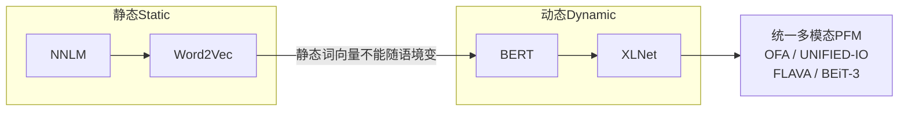

- **静态方法**（NNLM、Word2Vec）：一个词一个固定向量，**无法适应不同语境**（"bank" 是银行还是河岸？分不清）。
- **动态方法**（BERT、XLNet）：根据输入动态调整多义词表示。
- **统一 PFM（Unified PFM）**：能处理文本 + 图像 + 音频的多模态基础模型，如 **OFA、UNIFIED-IO、FLAVA、BEiT-3**、以及 OpenAI 的 **GPT-4V**（人类级的多模态语言模型，吃文本+图像、吐文本）。

> ⚠️ **常见坑**：别把「预训练」当成「一次性初始化」。PFM 的价值是**捕获长程依赖与层级关系**这类通用知识，再用**微调（fine-tune）**适配下游。跳过预训练直接在小数据上训大模型，几乎必然过拟合。

### 2.1.2 基础架构：Transformer 与注意力 = 融合的引擎 ③

原书明确：**Transformer 是 PFM 的主流架构**。它的核心是**注意力机制（attention）**——完全抛弃循环与卷积，只靠注意力在各神经单元间传递「加权的知识表示」。

**注意力的本质公式**（书中文字描述，标准形式如下）：

$$
\text{Attention}(Q,K,V)=\text{softmax}\!\left(\frac{QK^\top}{\sqrt{d_k}}\right)V
$$

逐项拆解：

| 符号 | 含义 | 多模态里的角色 |
|---|---|---|
| $Q$ (Query) | 「我在找什么」 | 例如：文本 token「这只动物的颜色」 |
| $K$ (Key) | 「我这里有什么」 | 例如：图像各 patch 的特征 |
| $V$ (Value) | 「取到后返回的内容」 | 图像 patch 的实际信息 |
| $\text{softmax}(QK^\top/\sqrt{d_k})$ | 兼容性打分→权重 | 文本 token 该「看」图像哪块 |

- **输出 = value 的加权和**，权重由 query 和对应 key 的兼容函数算出（这正是书中「output of attention is a weighted sum of values, weights computed via a compatibility function of keys」的原话）。
- **除以 $\sqrt{d_k}$** 是为了防止点积过大把 softmax 推到饱和区（梯度消失）。

**为什么 Transformer 能撑起大模型？** 书中给了工程答案：**高度并行化 → 可扩展**。所以能堆出：ViT-22B（约 220 亿参数）、GPT-3（1750 亿）、PaLM（5400 亿）。

> 🔬 **第一性原理：Self-Attention vs Cross-Attention——多模态融合的分水岭**
>
> - **Self-Attention（自注意力）**：$Q,K,V$ 都来自**同一个序列**。作用是「序列内部各元素互相看」（一句话里词与词、一张图里 patch 与 patch）。
> - **Cross-Attention（交叉注意力）**：$Q$ 来自模态 A，$K,V$ 来自模态 B。这就是**多模态融合③的核心机制**——让**文本 query 去「看」图像 key/value**，或反过来。
>
> ```mermaid
> flowchart TB
>     subgraph SelfAttn[Self-Attention 序列内]
>         X[序列X] --> QA[Q]
>         X --> KA[K]
>         X --> VA[V]
>         QA & KA & VA --> OA[输出]
>     end
>     subgraph CrossAttn[Cross-Attention 跨模态融合]
>         TXT[文本 token] --> QB[Q]
>         IMG[图像特征] --> KB[K]
>         IMG --> VB[V]
>         QB & KB & VB --> OB[融合表示<br/>看着图理解文本]
>     end
> ```
>
> 💡 **实战**：Flamingo、BLIP-2、LLaVA 这类 MLLM，本质都是**在冻结的 LLM 里插 cross-attention 层**（或用 Q-Former/投影层），让语言 token 通过 cross-attention 把视觉信息「拉」进来。理解了 cross-attention，就理解了 90% 的多模态融合架构。

### 2.1.3 学习机制（Learning Mechanisms）——五种监督范式

原书用统一的数学记号把五种学习范式讲清楚。这是**理解「对齐」与「生成」都要靠什么信号**的基础。

#### （1）监督学习 Supervised Learning

给定训练集 $X=\{(x_i,y_i)\}_{i=1}^{n}$，学一个函数 $f(x_i;\theta)$，最小化：

$$
\arg\min_{\theta}\ \frac{1}{n}\sum_{i=1}^{n} L\big(f(x_i;\theta),\,y_i\big)+\Omega(\theta) \tag{2.1}
$$

- $L$：损失项（如交叉熵）；$\Omega$：正则项（防过拟合）。
- 网络本身是**逐层嵌套**的映射（书中式 2.2）：

$$
h_1(x_i)=g(x_i\,\omega_1+b_1),\qquad h_{l+1}(x_i)=g\big(h_l(x_i)\,\omega_l+b_l\big),\ l=1,\dots,N
$$

其中 $g$ 是激活函数，$b$ 是偏置，$l$ 是层号，$N$ 是总层数，参数集 $\theta=\{\omega_l,b_l\}$。**说白了：深度网络就是一堆「线性变换 + 非线性激活」的套娃。**

#### （2）半监督学习 Semi-supervised Learning

除了带标签集，还有无标签集 $Z=\{z_i\}_{i=1}^{m}$。目标变成：

$$
\arg\min_{\theta}\ \frac{1}{n}\sum_{i=1}^{n}L\big(f(x_i;\theta),y_i\big)+\frac{1}{m}\sum_{i=1}^{m}L\big(f(z_i;\theta),\,R(z_i,X)\big)+\Omega(\theta) \tag{2.3}
$$

- $R$ 是**关系函数**，为无标签数据定义目标（生成**伪标签 pseudo-label**），再放进端到端训练。
- 若完全没有标签，就退化为**无监督学习**（靠数据内在距离）或**自监督学习**（靠设计的预训练任务）。

#### （3）弱监督学习 Weakly Supervised Learning

标注程度介于全监督和自监督之间。设图像 $x_i$ 的真标签 $y_i\in\{0,1\}^K$（$K$ 个可能标签，多标签），共需最小化 $nK$ 个损失项：

$$
\arg\min_{\theta}\ \frac{1}{nK}\sum_{i=1}^{n}\sum_{k=1}^{K}L\big(f(x_i;\theta),\,y_i^k\big)+\Omega(\theta) \tag{2.4}
$$

即对每个标签做「一对多（one-vs-all）」的二分类。

#### （4）自监督学习 Self-Supervised Learning (SSL) ——对齐②与生成⑤的发动机 🔥

**SSL**：**利用数据自身信息**造伪标签来学表示，**免去人工标注大规模数据的成本**。这是多模态预训练的绝对主力。书中把 SSL 分成两大流派：

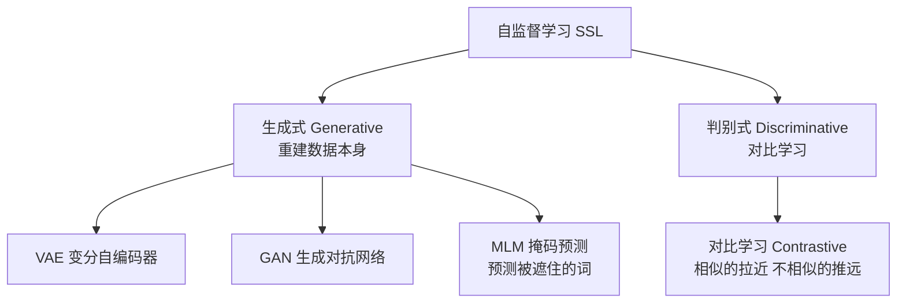

- **生成式 SSL**（VAE、GAN、MLM）：**重建数据本身**。NLP 里就是「预测被遮住的字/词/句」。→ 对应⑤生成。
- **判别式 SSL = 对比学习（Contrastive Learning）**：学一个模型，让**相似实例在投影空间里更近，不相似的更远**。→ 对应②对齐。

**最简对比损失**（书中式 2.5）：

$$
L_c(x_i,x_j,\theta)=m\,\big\lVert f_\theta(x_i)-f_\theta(x_j)\big\rVert_2^2+(1-m)\,\max\!\big(0,\ \epsilon-\lVert f_\theta(x_i)-f_\theta(x_j)\rVert_2^2\big)^2 \tag{2.5}
$$

逐项解读：

- $m=1$：两样本**同类**（正对）→ 只留第一项，**拉近**它们的距离（距离平方越小损失越小）。
- $m=0$：两样本**异类**（负对）→ 只留第二项，**推远**它们，但只在距离小于上界 $\epsilon$ 时才罚（$\max(0,\cdot)$ 保证已经很远的负对不再产生梯度）。

> 💡 **对齐②的本质**：CLIP 式的多模态对齐，就是把「图-文配对」当正对、「图-别的文」当负对，用类似 (2.5) 的对比损失，把图像编码器和文本编码器**拽到同一语义空间**。学完之后「一张猫的图」和「a photo of a cat」自然挨得近——这就是零样本分类的秘密。

#### （5）强化学习 Reinforcement Learning (RL) ——对齐人类④的工具

**RL**：把学习建模成 Agent 与环境的**序贯交互**，学一个最优策略 $\pi_\theta(a_t\mid s_t)$。

- 每步 $t$：Agent 从状态空间 $S$ 收到状态 $s_t$，按策略选动作 $a_t\in A$，拿到即时标量奖励 $r_t=r(s_t,a_t)$ 和下一状态 $s_{t+1}$。
- **折扣回报**：$R_t=\sum_{k=0}^{\infty}\gamma^k r_{t+k}$，$\gamma\in[0,1)$ 是折扣因子。
- **目标**：最大化期望长期回报（书中式 2.6）：

$$
\max_{\theta}\ \mathbb{E}_{s_t}\big[R_t \mid s_t,\ a_t=\pi_\theta(s_t)\big] \tag{2.6}
$$

> 📌 **五范式一句话对照表**

| 范式 | 信号来源 | 多模态里典型用途 |
|---|---|---|
| 监督 | 人工标签 | 下游任务微调（如检测、VQA） |
| 半监督 | 少量标签 + 伪标签 | 数据稀缺时扩样本 |
| 弱监督 | 粗标签 | 图像级标签→区域理解 |
| **自监督** | 数据自身 | **对齐②（对比）+ 生成⑤（重建）核心** |
| 强化 | 奖励信号 | **RLHF/RLAIF 对齐人类④** |

---

## 2.2 预训练任务总览（Pre-training Tasks）

预训练是「初始化框架」，通常要配**微调**才能干下游活。它在预定义任务上训练，捕获**特定属性与结构信息**，为下游提供充分信息并**加速收敛**。

### 2.2.1 NLP 的五种预训练任务

按学习方法分五类，其中 **RTD / NSP / SOP 属对比学习**（假设「观测样本比随机样本语义更相似」）：

| 任务 | 全称 | 做什么 | 代表模型 |
|---|---|---|---|
| **MLM** | Masked Language Modeling | 随机遮词→预测被遮的词 | BERT、SpanBERT |
| **DAE** | Denoised Autoencoder | 加噪→从噪声重建原文 | BART |
| **RTD** | Replaced Token Detection | 判别 token 是否被替换过 | ELECTRA |
| **NSP** | Next Sentence Prediction | 判两句顺序是否正确 | BERT |
| **SOP** | Sentence Order Prediction | 同文档相邻两段正例，交换为负例 | ALBERT |

> ⚠️ **NSP vs SOP 常考**：NSP 用**不同文档**的句子做负例（太容易，模型靠「主题不同」就能作弊）；SOP 用**同文档相邻段交换顺序**做负例，逼模型真正建模句间连贯性——这是 ALBERT 的改进点。

### 2.2.2 CV 的五类预训练任务

CV 里靠**人工设计的标签**（拼图、比对图块）来学特征空间：

1. **代理任务（Proxy Tasks）**：造伪标签让编码器做，如 **inpainting（图像修复）**——预测缺失的中心区域。
2. **帧序列学习（Frame Sequence Learning）**：从视频按时序处理帧，学**视觉时序表示**。
3. **数据生成任务（Data Generation）**：用 GAN 的表征能力，把数据投回隐空间辅助判别。
4. **数据重建任务（Data Reconstruction）**：把图切 patch，套用 NLP 的掩码预测（如 BEiT：每个 patch 编成**离散视觉 token**，预测被遮 patch 的 token）。
5. **其它任务**：基于对比学习（最大化负对距离、最小化正对距离）；DeepClustering（把特征聚类，用簇当监督信号）。

> 💡 **CV 与 NLP 的统一性**：注意第 4 类——**图像可以像语言一样切成 patch/token**。正是这个洞见（ViT）让「NLP 的一整套预训练武器库」能无缝搬到视觉，进而搬到多模态。这是本章最重要的一条暗线。

---

## 2.3 NLP 关键预训练技术：三种词表示

原书 2.3 节先讲**词表示方法**，这是「模态编码器①」在文本侧的三条路线：

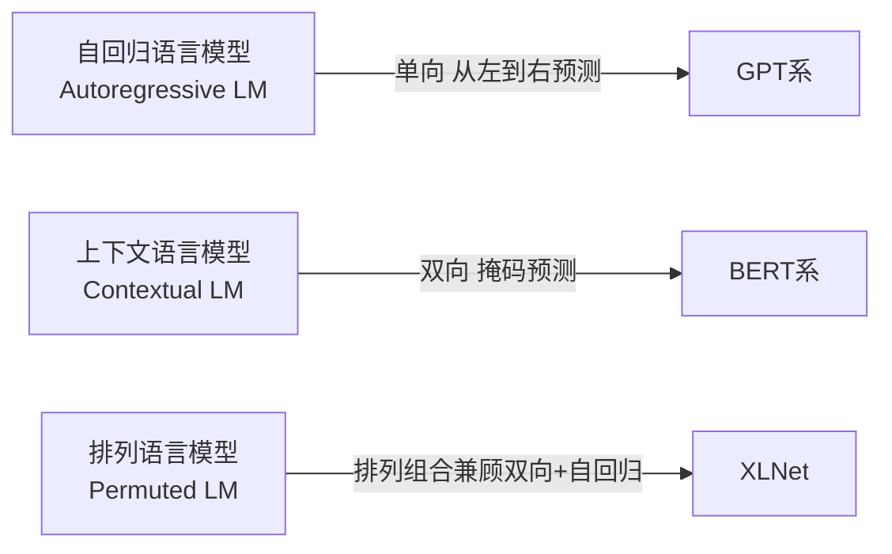

| 路线 | 机制 | 优点 | 代价 |
|---|---|---|---|
| **自回归（AR）** | $P(x_t\mid x_{<t})$，从左往右 | 天然会生成 | 只能单向，看不到右边上下文 |
| **上下文（双向）** | MLM，双向编码 | 理解强 | 预训练/微调有 gap（`[MASK]` 只在预训练出现） |
| **排列（Permuted）** | 打乱因子分解顺序 | 兼顾双向理解 + 自回归生成 | 实现复杂、训练慢 |

> 🔬 **为什么多模态大模型多用 AR（GPT 式）当大脑？** 因为多模态任务的输出（讲故事、写描述、答问题）**本质是生成**，而 AR 天生擅长生成、且能统一「理解与生成」为同一个 next-token 目标，便于把图像 token 和文本 token 拼成一条序列一起喂。

---

## 2.4 计算机视觉预训练的关键技术 —— 对比学习②的主战场

这是全章**含金量最高**的一节，几乎所有现代视觉/多模态编码器的自监督预训练都出自这里。原书按七类组织，我按「重建式」和「对比式」两大脉络重讲。

### 2.4.1 代理任务（Proxy Tasks）：早期视觉 SSL

| 方法 | 代理任务 | 一句话 |
|---|---|---|
| Context Prediction | 判两个图块的相对位置 | 位置信息当标签 |
| Image Inpainting | 补全缺失中心 | 语义级预测，接一个 decoder |
| Colorization | 灰度→上色 | 跨通道编码，逼网络懂语义 |
| Split-Brain AE | 跨通道预测 | 强迫解跨通道任务 |
| Jigsaw | 解拼图 | 上下文无关网络 |
| RotNet | 预测旋转角度 | 简单有效 |

### 2.4.2 帧序列学习：CPC 与 InfoNCE 🔥

**CPC（Contrastive Predictive Coding）**是**第一个「在隐空间预测未来」**来学表示的模型，可吃语音/图像/文本任意模态。

- 记 $x_t$ 为输入观测序列，$z_t$ 为编码器 $g_{enc}$ 得到的隐表示，$c_t$ 为自回归模型 $g_{ar}$ 汇总 $z_{\le t}$ 得到的上下文表示。
- 不像传统生成式模型去预测 $x_{t+k}$，CPC 用**密度比（density ratio）** $f_k$ 刻画 $c_t$ 与 $x_{t+k}$ 的**互信息**：

$$
f_k(x_{t+k},c_t)\ \propto\ \frac{p(x_{t+k}\mid c_t)}{p(x_{t+k})} \tag{2.9}
$$

- 训练用 **InfoNCE 损失**（书中式 2.10）：

$$
L=-\,\mathbb{E}_X\!\left[\log \frac{f_k(x_{t+k},c_t)}{\sum_{x_j\in X} f_k(x_j,c_t)}\right] \tag{2.10}
$$

**逐行读 InfoNCE**：分子是**正样本**（真正的未来 $x_{t+k}$）的打分，分母是正样本 + 一堆**负样本**的打分之和。最小化 $L$ = 让正样本在所有候选里「脱颖而出」——这本质是一个 **(N+1) 类的分类问题**（认出哪个才是真未来）。

> 💡 **InfoNCE 是对比学习的「万能损失」**：后面 MoCo、SimCLR 全用它的变体。记住它 = 记住对比学习的一半。

### 2.4.3 生成式学习：BiGAN / BigBiGAN

GAN 缺特征编码器，于是 **BiGAN** 加一个编码器 $\varepsilon$ 把数据投回隐空间；**BigBiGAN** 在此基础上改进判别器，在 ImageNet 无监督表示学习上达到 SOTA。判别器 $D$ 学会区分「真实数据对」和「编码/生成的数据对」。→ 这是⑤生成能力反哺表示学习的例子。

### 2.4.4 重建式学习：MAE / BEiT / SAM 🔥

这是**「视觉版 MLM」**，多模态视觉编码器的主流预训练方式。

- **BEiT**：两阶段——(1) 用 dVAE 把图切 patch 编成**离散 token**；(2) 遮住部分 patch，让编码器预测被遮 patch 的视觉 token（对齐固定 tokenizer 的输出）。缺点：非端到端。
- **MAE（Masked Autoencoder）**：端到端，直接用**未遮 patch 预测被遮 patch 的像素**，MSE 损失。**关键数字：掩码率 75%**（远高于 BERT 的 15%）！消融证明高掩码率对微调和线性探针都更好。
- **SimMIM**：类似方案，也确认高掩码率 + 随机掩码更好。**MAE 与 SimMIM 的区别**：MAE 的编码器只管表示编码、把预测丢给 decoder；SimMIM 的 decoder 简单，两件事一起干。
- **SAM（Segment Anything Model, Meta 2023.04）**：用 MAE 预训练的 **ViT-H** 当图像编码器 + prompt 编码器（吃点/框）+ 轻量 Transformer mask decoder。**零样本**就能从单个前景点生成高质量 mask，是「可提示的视觉基础模型」典范。

> ⚠️ **MAE 的效率坑**：ViT 里 patch 一多，算力翻倍。两条解法——(1) **层级 ViT（hViT）** 用金字塔 + 移窗（Swin）；但局部窗口注意力难处理 MAE 的随机遮挡，于是有 **UM-MAE**（先采样再遮）。(2) **局部注意力**（LoMaR：只在小窗口内重建，反而更高效）。

**为什么高掩码率对图像有效，对文本却是 15%？**

> 🔬 **第一性原理**：语言的**信息密度高、冗余低**（每个词都携带较多信息，遮太多就无法恢复）；图像**空间冗余极高**（相邻像素高度相关），遮 75% 仍能靠周围重建，反而逼模型学到更全局、更语义的表示。这是「模态特性决定预训练超参」的经典案例，面试常问。

### 2.4.5 记忆库学习（Memory Bank）：NPID / PIRL

**NPID（Non-Parametric Instance Discrimination）**：第一个把「每个实例当一类」的方法。特征 $v=f_\theta(x)$ 属于第 $i$ 个实例的概率：

$$
P(i\mid v)=\frac{\exp(v_i^\top v/\tau)}{\sum_{j=1}^{n}\exp(v_j^\top v/\tau)} \tag{2.11}
$$

- $\tau$ 是**温度参数**（借自知识蒸馏）——控制分布的「尖锐程度」，$\tau$ 越小分布越尖，越强调难负样本。
- 因为实例级分类要用到**全部图像**，所以引入**记忆库（memory bank）**缓存历史特征，供后续比对。

**PIRL（Pretext-Invariant Representation Learning）**：让原图视图 $V_I$ 与变换视图 $V_{I_t}$ 的表示**相似**，同时与其它图的表示**不同**：

$$
L_{total}(\theta;D)=\mathbb{E}_{t\sim T}\ \frac{1}{|D|}\sum_{I\in D} L\big(V_I,\ V_{I_t}\big) \tag{2.12}
$$

**更多负样本 → 梯度可扩展性更好 → 编码器表示更强**——这正是引入记忆库的动机。

### 2.4.6 共享学习（Shared Learning）：双流对比学习全家桶 🔥🔥

这是对比学习**最核心**的一节。所有对比框架都是**双流（dual-stream）**：原图经变换 $t,t'$ 得两视图 $v,v'$，过两个编码器 $f_\theta,f_\xi$ 抽表示，再接 MLP $g_\theta,g_\xi$。按参数共享方式分两类：

- **软共享（Soft Sharing）**：两编码器参数**相似但不同**（$f_\theta\ne f_\xi$）。
- **硬共享（Hard Sharing）**：两编码器**结构参数完全相同**（$f_\theta=f_\xi$）。

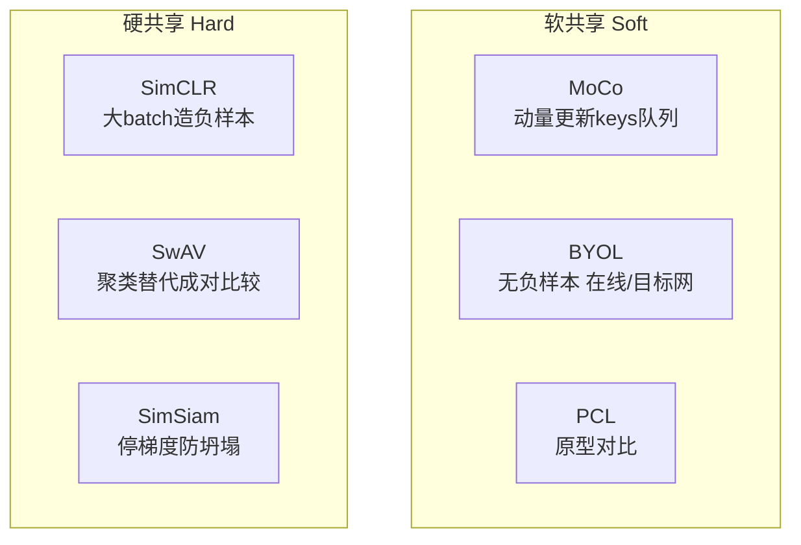

**① MoCo（Momentum Contrast, FAIR）** —— 软共享代表：

- 一个编码器当「字典查找」，维护一个队列存编码过的 keys $\{k_0,k_1,\dots\}$；另一个编码器生成 queries $q$。
- 相似度 = query 与队列里 keys 的点积。用 **InfoNCE** 损失。
- **关键设计：动量更新（momentum update）**。直接把 key 编码器参数拷成 query 的会破坏一致性，所以用滑动平均：

$$
\theta_k=m\,\theta_k+(1-m)\,\theta_q \tag{2.13}
$$

$\theta_q$ 由梯度直接更新，$m\in[0,1)$ 越接近 1，key 编码器越「稳」（一致性越好）。
- **MoCo v2**：借鉴 SimCLR，加 MLP 投影头 + 更强数据增强 + 更大 batch。

**② BYOL（Bootstrap Your Own Latent, DeepMind）** —— **不用负样本**也能达 SOTA：

- 含 representation / projection / prediction 三阶段。
- **在线网络（online）** 用自己的预测去逼近 **目标网络（target）** 给的回归目标；目标网络参数也用式 (2.13) 动量更新：$\xi\leftarrow\tau\xi+(1-\tau)\theta$。
- BYOL 的观点：**防坍塌靠「区分不同视图」，不靠「造大量负样本」**。

**③ SimCLR（Google Brain）** —— 硬共享代表，损失（式 2.14）：

$$
L_{i,j}=-\log \frac{\exp\big(\text{sim}(z_i,z_j)/\tau\big)}{\sum_{k=1}^{2N}\mathbb{1}_{[k\ne i]}\exp\big(\text{sim}(z_i,z_k)/\tau\big)} \tag{2.14}
$$

- $(i,j)$ 是正对（同图不同增强），$\tau$ 是温度，$\mathbb{1}_{[k\ne i]}$ 保证分母只含负对。
- SimCLR 靠**大 batch** 现造负样本，不用队列/动量。

**④ SwAV（Inria + FAIR）**：用**聚类**替代成对比较——引入簇原型（prototypes），避免显式两两比对，省存储。

**⑤ SEER**：在 SwAV 基础上，从任意随机图 + 海量数据学预训练编码器（backbone 用 RegNetY），证明「自监督不局限于 ImageNet」。

**⑥ SimSiam（FAIR）**：**既不用负样本、也不用动量编码器**！两个参数相同的编码器处理两视图，靠 **MLP 预测器 $g$ + 停梯度（stop-gradient）** 防坍塌。极简却有效。

> 💡 **面试高频：这几个方法怎么防「表示坍塌」（所有输入映到同一个点）？**
>
> | 方法 | 防坍塌手段 |
> |---|---|
> | MoCo / SimCLR | **负样本**（正对拉近、负对推远） |
> | BYOL | **动量目标网 + 预测头**（非对称结构） |
> | SimSiam | **停梯度（stop-gradient）**（打破对称，本质近似 EM） |
> | SwAV | **聚类原型 + 均衡约束** |

### 2.4.7 聚类式学习（Cluster-Based）：DeepCluster / PCL

- **DeepCluster**：第一个用聚类做大规模自监督——把特征聚成簇，**用簇标签当预训练信号**训 backbone。
- **PCL（Prototypical Contrastive Learning）**：第一个把对比学习与聚类**联系**起来，用**原型当簇中心**，提出 **ProtoNCE** 损失（把式 2.14 里的样本换成原型）。相比实例判别学低层表示，**聚类能编码更多语义信息**，利于语义级下游任务。也是软共享（动量编码器用式 2.13 更新）。

> 📌 **对比学习②小结**：从 CPC（InfoNCE 起源）→ MoCo（队列+动量）→ SimCLR（大 batch）→ BYOL/SimSiam（无负样本）→ SwAV/PCL（聚类）。**主线是「如何在不用人工标签的前提下，让正对近、负对远，同时防坍塌」**。CLIP 把这套从「单模态图-图」升级成「跨模态图-文」，就得到了多模态对齐的地基。

---

## 2.5 Prompt 学习（Prompt Learning）——对齐人类④第一招

### 2.5.1 范式的两次大转变

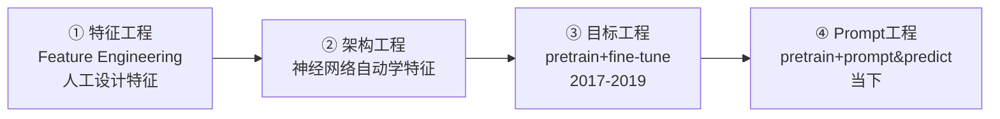

- **pretrain + fine-tune**：把预训练模型**适配**到下游（改目标函数、加参数微调）。焦点是**目标工程**。
- **pretrain + prompt & predict**：反过来——**把下游任务改写成语言模型训练时见过的形式**。焦点是**Prompt 工程**。

**例子**：判断「I missed the bus today」的情感——不训分类头，而是拼成「I missed the bus today. I feel so ___」让 LM 填一个带情感的词。或者拼「English: I missed the bus today. French: ___」就变成翻译。**一个完全无监督训练的 LM，靠不同 prompt 就能干很多活**。

### 2.5.2 Prompt 的数学定义（三步走）

监督学习要建模 $P(y\mid x;\theta)$（需大量标签）；Prompt 法改为建模文本自身的 $P(x;\theta)$，再用它预测 $y$。三步：

- **Step 1 加 Prompt**：用 $f_{prompt}(\cdot)$ 把输入 $x$ 变成 $x'=f_{prompt}(x)$。模板含两个槽：输入槽 $[X]$ 和答案槽 $[Z]$。
  - 例：情感分析模板「$[X]$ Overall, it was a $[Z]$ movie.」，填入后得「I love this movie. Overall it was a $[Z]$ movie.」
- **Step 2 答案搜索**：搜最高分的 $\hat z$。$Z$ 是候选答案集——生成任务时 $Z$ 覆盖整个语言空间；分类任务时 $Z$ 是词表小子集（如 $Z=\{$excellent, good, OK, bad, horrible$\}$ 映射到类别 $Y=\{+,+,+,-,-\}$）。
- **Step 3 答案映射**：把 $\hat z$ 映回最终标签 $y$。

### 2.5.3 多 Prompt 学习：集成与增强

**（1）Prompt 集成（Ensembling）**——组合多个 prompt：

| 方法 | 做法 |
|---|---|
| **均匀平均** | $P(z\mid x):=\frac{1}{K}\sum_i P(z\mid f_{prompt,i}(x))$ |
| **加权平均** | 每个 prompt 配权重（按训练集表现或优化得到） |
| **多数投票** | 分类任务，各 prompt 投票 |
| **知识蒸馏** | 每个模板-答案对训一个模型，集成后标注无标签数据再蒸馏 |
| **文本生成集成** | 按 next-word 概率 $P(z_t\mid x,z_{<t}):=\frac{1}{K}\sum_i P(z_t\mid f_{prompt,i}(x),z_{<t})$ |

**（2）Prompt 增强（Augmentation）= 示范学习**：在 prompt 前塞几个已答范例（如「The capital of the UK is London. ... The capital of China is $[Z]$」）。挑战：

- **范例选择**：选得好坏差异巨大（从近最优到近随机）——用句向量选与输入近的范例。
- **范例排序**：顺序也关键，用基于熵的方法给排列打分。
- **Prompt 组合 / 分解**：把可分解任务拆成子 prompt（关系抽取拆成实体识别+关系分类），或把整体 prompt 拆给每个片段（序列标注）。

> ⚠️ **常见坑**：few-shot prompt 对**范例选择和顺序极度敏感**。生产里别随手塞几个例子，要么用检索选相似样本，要么固定一套经过验证的范例。

---

## 2.6 上下文学习（In-Context Learning, ICL）——涌现能力的招牌

随模型变大，LLM 涌现出 **ICL 能力**：**仅凭几个上下文范例学会任务，无需梯度更新**。核心是**类比学习（learning by analogy）**。

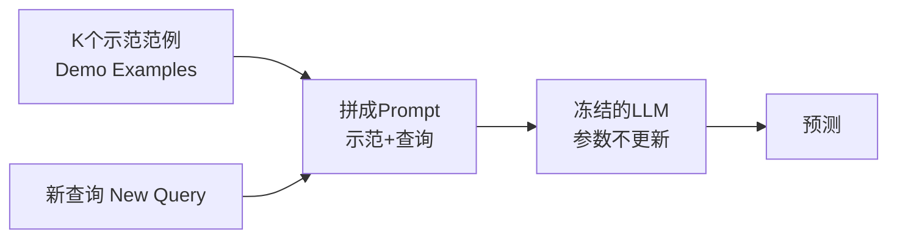

**ICL 三大优势**：(1) 示范用自然语言写，**可解释**、易注入人类知识；(2) 像人类的类比决策；(3) **免训练**，省算力、易大规模落地。

### 2.6.1 ICL 的形式定义

给定查询 $x$ 和候选答案集 $Y=\{y_1,\dots,y_m\}$，预训练 LM $\mathcal{M}$ 在示范集 $C$ 条件下选最高分候选。$C$ 含可选指令 $I$ 和 $k$ 个范例：$C=\{I, s(x_1,y_1),\dots,s(x_k,y_k)\}$。候选 $y_j$ 的似然：

$$
P(y_j\mid x)=f_{\mathcal M}(y_j,\,C,\,x) \tag{2.17}
$$

预测标签取最高概率：

$$
\hat y=\arg\max_{y_j\in Y} P(y_j\mid x) \tag{2.18}
$$

> **ICL 与相关概念的区别**：
> - **Prompt Learning**：ICL 严格说是 prompt tuning 的**子类**。
> - **Few-shot Learning**：传统 few-shot **要更新参数**，ICL **不更新**。

### 2.6.2 模型预热（Warm-Up）

在预训练与 ICL 推理之间**继续训练**以增强 ICL 能力（可选步骤）：

- **监督式**：MetaICL（多任务持续训练）、Symbol Tuning（把「positive/negative」换成「foo/bar」逼模型用上下文而非先验）、Instruction Tuning（FLAN：用自然语言指令模板在 60+ NLP 数据集上调 137B LaMDA-PT）。
- **自监督式**：把原始文本转成输入-输出对（PICL 用简单语言建模目标，效果与任务泛化更好）。

> 📌 **预热三条结论**：(1) 核心是**缩小预训练与 ICL 格式的差距**，Instruction Tuning（无需 few-shot 示范）比 in-context 微调更简单流行；(2) 更新参数能提升 ICL，说明原始 LLM 的 ICL 潜力**远未挖尽**；(3) 数据规模上去后，预热收益会**饱和**（只需少量数据即可适应）。

### 2.6.3 示范设计（Demonstration Design）

**（1）示范组织 = 选择 + 排序**：

- **示范选择**：无监督（KATE：kNN 检索近邻，用 L2/余弦；互信息；低困惑度；多样性）；监督（EPR 两阶段：BM25 粗召回 + 监督精排；DPP 检索整套范例；RL 建模成 MDP 用 Q-Learning 选）。
- **示范排序**：按到输入的距离排；用全局/局部熵指标选最优顺序。

**（2）示范格式**：

- **指令格式**：清晰任务描述助推理；APE 自动生成并筛选指令。
- **推理步格式 = 思维链（CoT）**：在输入输出间插入中间推理步（见 2.8）。

> 📌 **示范设计三痛点**：(1) 多为实例级选择，**数据库级选择**待探索；(2) LLM 输出分数在选择中作用大；(3) $k$ 个范例的排列空间是 $k!$，高效找最优序列仍难。

### 2.6.4 打分函数（Scoring Functions）

把 LM 预测转成答案似然的三种打分：

| 方法 | 机制 | 优缺点 |
|---|---|---|
| **直接估计** | 候选答案 token 的条件概率 | 简单，但要求答案 token 在序列末尾 |
| **困惑度（Perplexity）** | 整句 $S_j=\{C,s(x,y_j,I)\}$ 的困惑度 | 无位置约束，但要额外算力 |
| **通道模型（Channel）** | 反向估计——给标签算输入似然 | 数据不平衡时更稳 |

---

## 2.7 微调（Fine-Tuning）——对齐人类④第二招

LLM 虽在通用文本上训练，但对特定任务/领域知识可能不足。两大微调路线（原书 Fig. 2.11）：

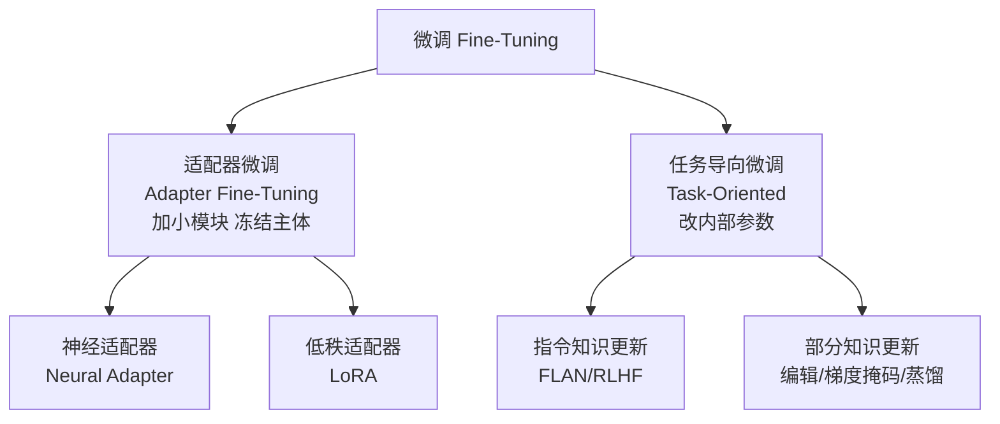

### 2.7.1 适配器微调（Adapter）——参数高效微调 PEFT 🔥

**核心思想**：加**少量额外参数**，**冻结原 LLM 主体**。适配器 $g_\phi$ 与主模型 $f_\Theta$ 组合成 $f_\Theta\circ g_\phi$，目标（式 2.19）：

$$
\phi(f(X))\approx\phi\big(f_\Theta\circ g_\phi(X)\big),\qquad \phi_D(f(D))\le \phi_D\big(f_\Theta\circ g_\phi(D)\big) \tag{2.19}
$$

即：**通用任务性能基本不掉**（约等号），**领域任务性能提升**（不等号）。

**（1）神经适配器（Neural Adapter）**：原设计 = 降维投影 + GeLU + 升维投影 + 前馈，插进 Transformer 的多头注意力和前馈层（即 **bottleneck / serial adapter**）。变体：MAD-X（可逆适配器）、Compacter（超复数乘法层，参数更省）、SparseAdapter（初始化剪枝）、K-Adapter（多领域分开训再拼接）、Ladder Side-Tuning（旁路小模块省显存）。

**（2）低秩适配器（LoRA）** 🔥🔥：

- 灵感：「LLM 存在于内在低维子空间」，参数可在低秩子空间高效更新。
- 做法：把可学的 SVD 块嵌入低秩 $r\ll d$ 的子空间，**与预训练权重并联相加**，冻结原权重。
- **杀手锏**：极大减少可训参数，且**推理零延迟**（可把低秩增量合并回原权重）。
- 变体：DyLoRA（动态搜秩）、KronA（Kronecker 积替代 SVD 块，表达力更强）。

**（3）集成适配器框架**：AdapterFusion（多适配器融合层）、UniPELT（门控激活 serial/LoRA/prefix/BitFit）、AdaMix（同型堆叠 + 随机路由）、LLM-Adapter（LLaMA/OPT/GPT-J 开放框架）。

> ⚠️ **适配器的隐藏代价**：即使冻结主体参数，**反向传播仍要穿过整个模型 → 训练显存并没省多少**（Sung et al. 指出）。这是 Ladder Side-Tuning 等旁路方案的动机。面试常问「LoRA 到底省了什么？」——**省的是可训参数量和存储/切换成本，不必然省训练显存**。

### 2.7.2 任务导向微调（Task-Oriented）

更新 LLM **内部参数**，两大挑战：(1) 更新全局知识可能**破坏 ICL 能力**（过拟合、灾难性遗忘、任务偏置）；(2) **算力昂贵**。

**（1）指令知识更新（Instruction-Based）**：在带明确指令的多任务集上微调。FLAN（137B，60 个 NLP 数据集）零样本超过 175B 的 GPT-3。

- **人类指令微调**：让输出更安全、真实、无害、合意图。**RLHF** 是代表——LLM 对 prompt 生成多个回答，人类按质量排序，奖励模型打分，RL 更新策略，迭代循环（详见 2.9）。
- **局限**：任务过于简单会难泛化；扩任务易触发**灾难性遗忘**。解法：生成高置信答案自我增强、持续学习「反复练习」防遗忘。

**（2）部分知识更新（Partial）**：只改一小撮参数（式 2.20）：

$$
\tilde\Theta=\Theta+\Delta_f(D)\odot T,\qquad T(i)=\begin{cases}1,&\theta(i)\in\Theta_T\\0,&\theta(i)\notin\Theta_T\end{cases} \tag{2.20}
$$

$T$ 是**掩码向量**，控制每次更新多少内部知识（$|\Theta_T|\ll|\Theta|$）。三条路线：

| 路线 | 做法 | 代表 |
|---|---|---|
| **知识编辑** | 定位并改少量参数（改过时事实） | 超网络编辑、因果干预定位神经元 |
| **梯度掩码** | 反传时屏蔽无关参数梯度 | CHILD-TUNING（选任务相关子网） |
| **知识蒸馏** | 从大模型蒸出领域小模型 | 1.5B→70M（CTR 预测）、蒸 CoT 能力 |

> 📌 **微调的两大现实挑战**：(1) **合规（Regulatory Compliance）**——所谓 LLM 对齐可在微调阶段达成；(2) **算力**——高性能 GPU 昂贵，追求微调效率是关键。

---

## 2.8 思维链（Chain-of-Thought, CoT）——推理能力的钥匙

2022 年 Jason Wei 提出 **CoT Prompting**，显著提升 LLM 在数学/推理任务的表现。三大突破：

1. **常识推理超人类**：在 Big-Bench Hard 的 23 项里 17 项超人类基线（体育理解 95% vs 84%）。
2. **数学逻辑推理暴涨**：PaLM 在 MultiArith/GSM8K 上比传统 prompt **提升 300%**，甚至超过最好的监督学习。
3. **可解释性与可信度增强**：把逻辑问题**分解成多步**，推理路径清晰，用户能看懂答案怎么来的。

### 2.8.1 CoT 的技术细节与演化

原书把 CoT 的发展讲成「**从链 → 树 → 图**」的推理结构升级：

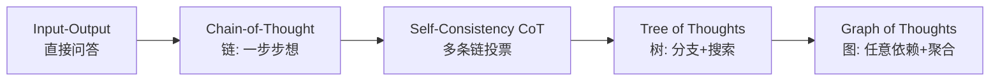

**（1）CoT 基础**：`few-shot CoT` 手工写中间步骤；`Zero-shot CoT` 只加一句「**Let's think step by step**」；`AutoCoT` 自动生成链；复杂度选择法选推理步更多的范例。

**（2）Tree of Thoughts (ToT)** —— 把推理建模成**搜索树**，四要素：

- **思想分解**：把问题拆成思想步。
- **思想生成器**：采样式 `[z^(1),...,z^(k)] ~ p_θ(z|s)` 或提议式（思想空间受限时更好）。
- **状态评估器 $V(p_\theta,S)$**：用 LM「有意识地推理」评估各状态进展——独立打分（给每个状态标 1–10 或「确定/可能/不可能」）或投票（跨状态比较选最优）。这是 ToT 相对 DeepBlue（编程启发式）、AlphaGo（学习式启发式）的**第三条路**。
- **搜索算法**：BFS（每步保 $b$ 个最优状态，树深 $\le 3$）或 DFS（先探最优，遇到评估器判定不可解 $V\le v_{th}$ 就剪枝回溯）。

**（3）Graph of Thoughts (GoT)** —— 2023.08 ETH 等提出，把思想建模成**任意图**（顶点=思想，边=依赖）。形式化为四元组 $(G,T,E,R)$：$G$ 推理过程、$T$ 思想变换、$E$ 评估函数、$R$ 排序函数。

**三种思想变换**（原书 Fig. 2.17）：

| 变换 | 做什么 | 形式 |
|---|---|---|
| **聚合（Aggregation）** | 把多个思想合成一个（取长补短） | $V^+=\{v^+\}$，多个 $v_i$ 连到 $v^+$ |
| **精炼（Refinement）** | 迭代改进单个思想 | 自环 $E^+=\{(v,v)\}$ |
| **生成（Generation）** | 从一个思想生成多个 | $v$ 连到 $v_1^+,\dots,v_k^+$ |

**GoT 详细结构**（Fig. 2.18）：Prompter（构造 prompt）+ Parser（抽取信息）+ Scoring&Validation（验证打分）+ Controller（协调，含静态的**操作图 GoO** 和动态的**推理状态 GRS**）。

> 💡 **GoT 四大优势**：**通用性**（CoT/ToT 都是其特例）、**模块化**（LM 与各流程独立可换）、**适应性**、**便捷性**（无需额外训练，现成 LM 即可）。
>
> 🔬 **为什么链→树→图能变强？** 人类思考不是单链，而是形成**复杂思想网络**；大脑也是图状网络（含环路）；算法执行常表示为有向无环图。**推理结构的表达力上限**决定了模型能建模多复杂的问题分解——图 > 树 > 链。

---

## 2.9 RLHF（Reinforcement Learning from Human Feedback）——对齐人类④王牌 🔥🔥

ChatGPT 掀起 AI 热潮，底层就是 **RLHF**：用**基于人类反馈的强化学习**优化语言模型。

> 🔬 **RLHF 的核心动机**：LLM 训练靠简单的 next-token 预测损失，而 BLEU/ROUGE 只是「和参考文本比字面」的粗糙规则，都**无法捕捉人类偏好**。RLHF 的洞见是——**把「人类对生成文本的反馈」直接当成损失函数来优化模型**。

### 2.9.1 RLHF 三步拆解

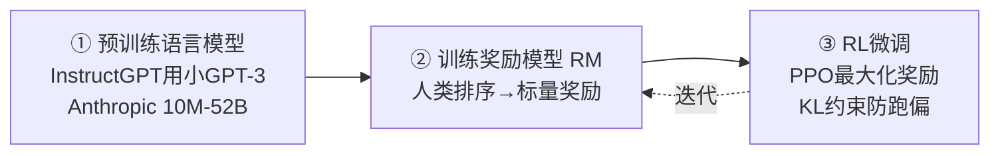

**① 预训练语言模型**：用传统目标训初始 LM。OpenAI 用小 GPT-3（→InstructGPT）；Anthropic 用 10M–52B 的 Transformer；DeepMind 用 280B 的 Gopher。可选：在「更优的人类文本」上再微调（Anthropic 用「helpful, honest, harmless」上下文引导）。**没有定论哪个起点最好**。

**② 训练奖励模型（Reward/Preference Model）**：目标 = 造一个「吃文本序列、吐标量奖励」的模型。

- **为什么用排序而非直接打分？** 因为人类**直接给标量分**会因价值观差异变得**未校准、噪声大**；改用**成对比较 + Elo 排序**再归一化成标量，数据更规整。
- **规模有趣**：奖励模型与 LM 规模常不同——OpenAI 用 175B LM + 6B RM；DeepMind 用 70B Chinchilla 兼做两者。

**③ RL 微调**：

- 建模成 RL 问题：**策略**=LM（吃 prompt 吐文本）；**动作空间**=词表全部 token（约 5 万）；**观测空间**=可能的输入 token 序列；**奖励函数**=偏好模型 + 策略变化约束。
- **最终奖励公式**（核心！）：

$$
r=r_\theta-\lambda\, r_{KL}
$$

- $r_\theta$：偏好模型给「prompt + 生成文本」的「合意度」标量。
- $r_{KL}$：当前 RL 策略与初始模型 token 分布的 **KL 散度惩罚**——防止策略跑偏到「骗高分但胡言乱语」的区域，保证输出连贯合理。$\lambda$ 是权重。
- 用 **PPO**（信赖域优化，约束更新步长）更新策略；DeepMind 在 Gopher 用了类似奖励但换 **A2C**。可选：混入额外预训练梯度（OpenAI 对 InstructGPT 这么干）。

> ⚠️ **KL 惩罚是 RLHF 的命门**：没有它，优化会产生**「reward hacking」**——生成毫无意义却骗到高奖励的文本。KL 项把策略「拴」在初始模型附近，是稳定性的关键。

### 2.9.2 开源工具箱

| 工具 | 特点 |
|---|---|
| **TRL** (Transformers RL) | HuggingFace 生态，用 PPO 微调 |
| **TRLX** | CarperAI 扩展版，支持更大模型（33B）、在线/离线、PPO + ILQL |
| **RL4LM** | 多算法（PPO/NLPO/A2C/TRPO）、多奖励/指标，2000+ 实验验证 |

### 2.9.3 RLHF 的未来挑战

- **数据成本高**：人类偏好标注昂贵（要雇兼职）；人类标注者**常有分歧**，引入无 ground truth 的变异。
- **优化器可改进**：PPO 是老算法；奖励模型的**前向传播开销大**（每段生成都要评分）→ **离线 RL**（如 **ILQL, Implicit Language Q-learning**）可当策略优化器省算力。
- 探索-利用等 RL 权衡在 RLHF 里**仍未充分研究**。

---

## 2.10 RLAIF（RL from AI Feedback）——用 AI 代替人类标注 🔥

RLHF 好用但**人类偏好标签太贵**。2023.09 Google 提出 **RLAIF**：**用 LLM 而非人类标注偏好**。结论惊人：

- RLAIF 能达到与 RLHF **相当的提升（50% 胜率）**，且**不需人类标注者**。
- RLAIF 和 RLHF **都超过监督微调**（胜率 >70%）。
- Anthropic 更早在 **Constitutional AI** 里引入过 RLAIF，发现 LLM 与人类判断高度一致、某些任务甚至超人。

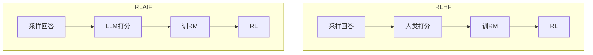

### 2.10.1 LLM 偏好标注

用**现成 LLM**（未针对下游微调）标注候选对偏好。输入结构（Fig. 2.24）：**前言（Preamble，任务说明）+ 可选 1-shot 范例 + 待标注样本 + 结尾（如「Preferred summary=」）**。拿到 LLM 对「1」「2」的对数概率，做 **Softmax** 得偏好分布。

三个关键增强：

- **位置偏置（Position Bias）**：候选顺序会影响选择（小模型尤甚）。解法：**每对做两次推理、第二次颠倒顺序、平均结果**。
- **思维链推理（CoT）**：把结尾换成「Consider the coherence, accuracy, coverage... Reasoning:」先让 LLM 推理，再拼回「Preferred Summary=」打分。
- **自洽（Self-Consistency）**：用非零温度采样**多条推理路径**，各得偏好分布后平均。

### 2.10.2 关键技术路线

- LLM 标完偏好后训**奖励模型**：RLAIF 生成**软标签**（如 $[0.6,0.4]$），对 RM 分数做 Softmax，用**交叉熵损失**优化。
- **本质是模型蒸馏**——AI 标注器通常比奖励模型更强。
- 用 **A2C（Advantage Actor-Critic）** 做 RL（RLAIF 选 A2C 因其简单有效，虽然很多工作用 PPO）。

### 2.10.3 评估三指标

| 指标 | 衡量什么 |
|---|---|
| **AI 标注器对齐度** | AI 偏好与人类偏好的一致率 |
| **成对准确率** | 训好的 RM 在留出人类偏好集上，是否给「更优候选」更高分 |
| **胜率（Win Rate）** | 人类在两策略输出间选谁——端到端质量 |

> 💡 **面试高频：RLHF vs RLAIF 一句话**——RLHF 用**人类**打偏好，RLAIF 用**LLM**打偏好（省钱、可扩展、效果相当）。RLAIF 的哲学延续 Constitutional AI：**让 AI 按一套「宪法原则」自我批判与打分**，把「对齐」从「靠人海」变成「靠模型」。

---

## 2.11 五块拼图回看：从核心技术到多模态大模型

现在把本章所有技术**收束回多模态主线**：

```mermaid
flowchart TB
    subgraph 编码器①
        E[Transformer/ViT/GPT<br/>2.1.1 注意力]
    end
    subgraph 对齐②
        C[对比学习<br/>2.4 InfoNCE/MoCo/CLIP式]
    end
    subgraph 融合③
        F[Cross-Attention<br/>2.1.2 交叉注意力]
    end
    subgraph 对齐人类④
        A[Prompt/ICL/CoT/微调<br/>RLHF/RLAIF<br/>2.5-2.10]
    end
    subgraph 生成⑤
        G[自回归/VAE/GAN/扩散<br/>2.1.2 / 2.4.3]
    end
    E --> C --> F --> A --> G
```

| 多模态拼图 | 本章技术支撑 | 落到具体模型 |
|---|---|---|
| ① 模态编码器 | Transformer / ViT（2.1.1）、MAE/BEiT 预训练（2.4.4） | CLIP 的图/文编码器、ViT-22B |
| ② 对齐 Alignment | 对比学习 InfoNCE / MoCo / SimCLR（2.4）| CLIP 图文对齐、ImageBind |
| ③ 融合 Fusion | Cross-Attention（2.1.2）| Flamingo、BLIP-2、LLaVA |
| ④ 对齐人类 | Prompt/ICL/CoT/RLHF/RLAIF（2.5–2.10）| GPT-4V、多模态助手 |
| ⑤ 生成 Generation | 自回归 + 生成式 SSL（2.1.2 / 2.4.3）| 看图讲故事、文生图 |

> 🔬 **贯穿全章的第一性原理**：多模态大模型没有「新物理」，它是把**已经在语言与视觉各自成熟的三件事**——(a) Transformer/注意力当统一编码与融合引擎、(b) 自监督/对比学习当免标注的表示与对齐引擎、(c) RLHF/RLAIF 当人类对齐引擎——**跨模态地拼在一起**。谁把「编码-对齐-融合-对齐人类-生成」这条链打通得最顺，谁就造出最强的 MLLM。

---

## 📌 本章小结

1. **四阶段演化**：任务专用 → 预训练 → 统一涌现 → 通用助手；多模态将沿同一轨迹（Fig. 2.1）。
2. **Transformer 是地基**：注意力 = value 的加权和；**Self-Attention 管序列内，Cross-Attention 管跨模态融合③**——这是理解一切 MLLM 架构的钥匙。
3. **五种学习范式**：监督/半监督/弱监督/自监督/强化；**自监督（对比+重建）是对齐②与生成⑤的发动机，强化是对齐人类④的工具**。
4. **对比学习②全家桶**：CPC/InfoNCE（起源）→ MoCo（队列+动量式 2.13）→ SimCLR（大 batch 式 2.14）→ BYOL/SimSiam（无负样本，靠停梯度/动量防坍塌）→ SwAV/PCL（聚类）。CLIP 把它升级成跨模态图文对齐。
5. **重建式 SSL**：MAE（掩码率 75%！）、BEiT（离散视觉 token）、SAM（可提示分割）——「视觉版 MLM」，多模态视觉编码器主流。
6. **对齐人类④四招**：Prompt（改写任务）、ICL（免训练类比学习）、CoT（链→树 ToT→图 GoT 的推理升级）、微调（Adapter/**LoRA 推理零延迟**、任务导向）。
7. **RLHF 命门**：最终奖励 $r=r_\theta-\lambda r_{KL}$，**KL 惩罚防 reward hacking**；三步=预训练+奖励模型+PPO 微调。
8. **RLAIF**：用 LLM 代替人类打偏好，胜率与 RLHF 相当（50%），且都超监督微调（>70%）；本质是模型蒸馏 + Constitutional AI 哲学。

> 一句话收束：**编码器看懂、对比学习对齐语义、Cross-Attention 融合看与问、RLHF/RLAIF 对齐人类、生成头产出**——这五步就是多模态大模型的全部核心技术。

---

## 🔗 延伸阅读

- **对齐②**：Radford et al., *CLIP*（图文对比对齐的开山之作，本章 2.4 对比学习的多模态化身）；Girdhar et al., *ImageBind*（把 6 种模态绑到同一空间）。
- **融合③**：Alayrac et al., *Flamingo*（在冻结 LLM 里插 gated cross-attention）；Li et al., *BLIP-2*（Q-Former 桥接视觉与 LLM）；Liu et al., *LLaVA*（投影层 + 视觉指令微调）。
- **重建式 SSL**：He et al., *MAE*；Bao et al., *BEiT*；Kirillov et al., *SAM*（本章 2.4.4 原文引用）。
- **对比学习**：He et al., *MoCo*；Chen et al., *SimCLR*；Grill et al., *BYOL*；Chen & He, *SimSiam*（本章 2.4.6 六大方法原文）。
- **推理**：Wei et al., *Chain-of-Thought Prompting*；Yao et al., *Tree of Thoughts*；Besta et al., *Graph of Thoughts*（本章 2.8）。
- **人类对齐**：Ouyang et al., *InstructGPT/RLHF*；Bai et al., *Constitutional AI*；Lee et al., *RLAIF*（本章 2.9–2.10 原文）。
- **原书后续**：第 3 章「Multimodal Foundation Models」将把本章技术落到 CLIP、SAM 等具体多模态基础模型——本章是它的技术前置。

---

> 📖 本篇严格对应原书 Chapter 2（pp. 59–135）。公式编号 (2.1)–(2.20) 与原书一致；MoCo/BYOL/SimCLR/CPC/RLHF/RLAIF 等结论与数字（掩码率 75%、$r=r_\theta-\lambda r_{KL}$、RLAIF 50% 胜率等）均抄录自原文。多模态「五拼图」框架为本讲义为帮助理解而添加的组织线索。
