# 第 3 章 · 多模态基础模型（Multimodal Foundation Models）🧩

> 对应原书 PDF 第 149–192 页（Chapter 3）。本篇是《Multimodal Large Models: A New Paradigm of Artificial Intelligence》(Liang Lin, Yang Liu) 第 3 章的逐节精讲。
> 定位：从「视觉-语言对齐」到「冻结大模型 + 轻量桥接」再到「具身/分割基础模型」，一次讲透 CLIP / BLIP / BLIP-2 / LLaMA / LLaMA-Adapter / VideoChat / SAM / PaLM-E 的**结构与训练**，并补讲要点里点名的 **Flamingo / LLaVA** 两条业界主线。

---

## 🗺️ 本章地图

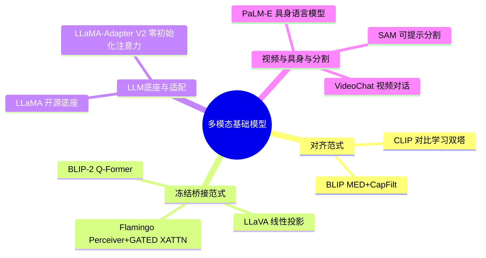

**一句话主线**：本章讲的是「基础模型（foundation model）」思想如何落到多模态——用一次大规模自监督/弱监督预训练，得到一个可以**通过提示（prompt）快速迁移到众多下游任务**的通用底座。它的演化可以画成一条时间线：

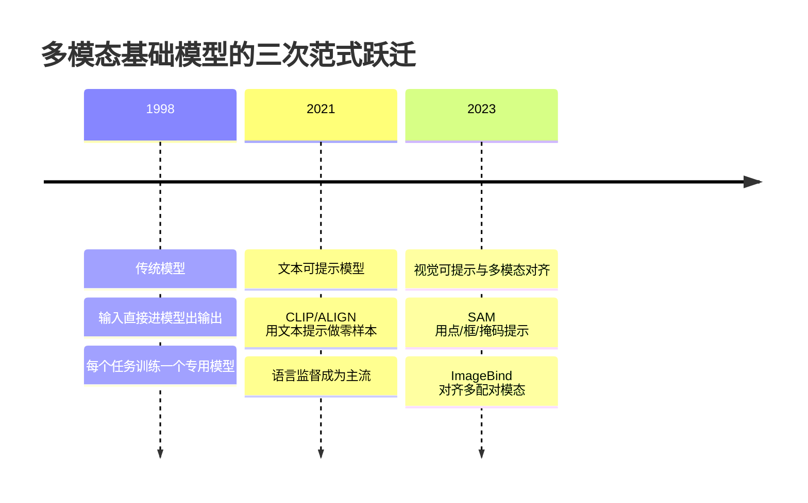

> 🔬 **第一性原理｜什么是"基础模型"？**
> 术语「foundation model」由斯坦福 HAI 的 Bommasani 等人[57]提出，定义为「基于自监督或半监督学习、在大规模数据上训练、可适配多个下游任务的大规模基座模型」。它带来的范式转变很重要：**用一个更宽泛、更通用的基础模型，替代大量狭窄的任务专用模型**——只需一次训练，即可快速适配各种应用。好处是开发快、域内域外都更强，还会从规模里**涌现（emergent）**出智能。

---

## 📖 3.0 引子：为什么需要多模态基础模型

视觉系统要理解世界，就必须对视觉场景的**组合性（compositional）**属性做观察和推理。物体之间复杂的关系与位置、真实世界的歧义与变化，用人类语言能更好地描述——但语言又受句法规则和更深层模态的约束。多模态基础模型学会在这些**耦合的多模态数据**与**大规模训练数据**之间架桥，从而在测试时增强上下文推理、泛化和提示能力。这类模型被称为 **Multimodal Foundation Models（多模态基础模型）**。

书里把这一章的模型按「提示方式」分成三大类（对应上面的时间线图）：

| 类别 | 代表 | 提示方式 | 一句话 |
|---|---|---|---|
| 🟦 文本可提示（Text-Prompted） | **CLIP** / ALIGN | 手工文本模板 `a photo of {label}` | 文本编码器动态搭一个分类器 |
| 🟩 视觉可提示（Visual-Prompted） | **SAM** | 点 / 框 / 掩码 | 给"分什么"，模型返回有效掩码 |
| 🟨 多模态对齐 / 生成 | BLIP-2 / LLaVA / Flamingo / PaLM-E | 图文交错、软视觉提示 | 把视觉喂进 LLM 生成语言 |

> 💡 **实战直觉**：这三类分别回答了三个问题——(1) 怎样用**语言**免费监督视觉？→ CLIP；(2) 怎样用**视觉**提示做通用分割？→ SAM；(3) 怎样把视觉**灌进** LLM 让它开口说话？→ BLIP-2/LLaVA/Flamingo/PaLM-E。整章都在这三条线上展开。

---

# 🧲 3.1 CLIP：对比语言-图像预训练

**CLIP = Contrastive Language-Image Pre-training**（OpenAI, 2021）。它提出把**图像编码器**和**文本编码器**放到一起，用**对比预训练**任务联合训练：在一个 batch 里，正确的「图-文」配对要相互靠近，错误配对要相互远离。CLIP 表现惊艳后，**语言监督的视觉模型**一跃成为主流。

## 3.1.1 是什么：本质是"图文对上的对比学习"

CLIP 本质上是**基于图文对的对比学习多模态模型**。它和 CV 里的一些对比学习（如 MoCo、SimCLR）不同：

- MoCo / SimCLR：数据是**同一张图的不同增强视图**，学"图 vs 图"的一致性。
- CLIP：数据是**图-文对**（一张图 + 它的文字描述），学"图 vs 文"的匹配关系。

CLIP 由两部分构成：
- **图像编码器**：ViT，或一个放大版 CNN（ResNet）。
- **文本编码器**：类似 GPT[61]的 Transformer。

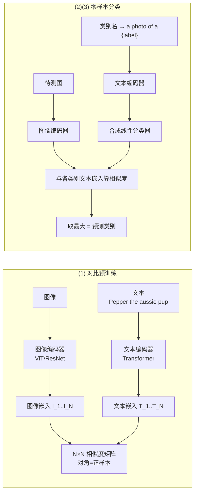

> 🔬 **第一性原理｜为什么"预测配哪张"比"预测写了啥"更高效？**
> 早期做法想让模型精确预测每张图对应的**文字内容**（逐词生成），这非常难。CLIP 换了个更简单的代理任务：**只预测这批里哪段文字配哪张图**，而不预测文字的确切内容。在同样的词袋（bag-of-words）编码基线上，把"预测目标"换成"对比目标"，零样本迁移到 ImageNet 的训练**提速约 4 倍**。核心洞见：把生成问题降维成匹配问题，监督信号密度更高、噪声更容忍。

## 3.1.2 训练目标与损失（怎么用）

给一个 batch 的 $N$ 个图文对，CLIP 要预测 batch 内 $N$ 个真实配对。为此它**联合训练**图像编码器和文本编码器，让：

- $N$ 个**正确**图文对的嵌入**余弦相似度最大化**；
- $N^2 - N$ 个**错误**配对的余弦相似度**最小化**。

由此学到一个**多模态嵌入空间（multimodal embedding space）**。CLIP 在这些相似度分数上优化一个**对称交叉熵损失**（图方向一次、文方向一次）。

**对称对比损失（InfoNCE / CLIP loss）**，设图像嵌入 $\{I_i\}$、文本嵌入 $\{T_i\}$（均已 L2 归一化），温度 $\tau$：

$$
\mathcal{L}_{i2t}=-\frac{1}{N}\sum_{i=1}^{N}\log\frac{\exp(\langle I_i,T_i\rangle/\tau)}{\sum_{j=1}^{N}\exp(\langle I_i,T_j\rangle/\tau)}
$$

$$
\mathcal{L}_{t2i}=-\frac{1}{N}\sum_{i=1}^{N}\log\frac{\exp(\langle T_i,I_i\rangle/\tau)}{\sum_{j=1}^{N}\exp(\langle T_i,I_j\rangle/\tau)}
$$

$$
\boxed{\ \mathcal{L}_{\text{CLIP}}=\tfrac12(\mathcal{L}_{i2t}+\mathcal{L}_{t2i})\ }
$$

**核心训练循环伪代码**（书中思想的 NumPy 风格重写，逐行讲解）：

```python
# image_encoder: ViT 或 ResNet；text_encoder: Transformer
# I[n, h, w, c]  一个 batch 的图像
# T[n, l]        一个 batch 的文本(token id)
# W_i, W_t       各自投到多模态空间的线性投影矩阵
# t              可学习的温度参数(以 log 形式存, exp 后用)

I_f = image_encoder(I)          # [n, d_i]  提图像特征
T_f = text_encoder(T)           # [n, d_t]  提文本特征

# 只用"线性投影"映到共同空间(CLIP 去掉了非线性投影头)
I_e = l2_normalize(I_f @ W_i, axis=1)   # [n, d_e]
T_e = l2_normalize(T_f @ W_t, axis=1)   # [n, d_e]

# 缩放后的成对余弦相似度: logits[i, j] = 图 i 和 文 j 的相似度
logits = (I_e @ T_e.T) * np.exp(t)      # [n, n]

# 对称交叉熵: 对角线是正确配对(标签就是 0..n-1)
labels = np.arange(n)
loss_i = cross_entropy(logits, labels, axis=0)   # 图→文 方向
loss_t = cross_entropy(logits, labels, axis=1)   # 文→图 方向
loss   = (loss_i + loss_t) / 2
```

逐行要点：
- `I_f @ W_i` / `T_f @ W_t`：CLIP **只用线性投影**（不用非线性投影头），把两个编码器的表示映到同一个多模态空间。
- `l2_normalize`：归一化后点积 = 余弦相似度。
- `* exp(t)`：温度缩放，$\tau=1/\exp(t)$，`t` 也是可学习参数。
- `logits` 的**对角线**是正样本，标签天然就是 `0..n-1`。
- 沿两个轴各算一次交叉熵再平均 = **对称**损失。

> ⚠️ **常见坑｜温度不是小事**。温度 $\tau$ 控制分布尖锐度；太小梯度爆炸、太大区分不开。CLIP 把它设成**可学习**并做数值裁剪。复现 CLIP 时温度初始化/裁剪范围没设好，是训练发散的高频原因。

**训练细节被大幅简化**（因为过拟合不是主要矛盾）：
- **从头训练**，不用预训练权重初始化。
- 去掉表示空间与对比嵌入空间之间的**非线性投影**，只用线性投影。
- 去掉文本变换函数 $t_u$——因为很多图文对里是句子，就从文本里**均匀采样一句**。
- 图像变换 $t_v$ 也简化，训练时**唯一的数据增强是随机裁剪缩放**。

## 3.1.3 构建"足够大"的数据集（3.1.1 节）

现有研究主要用三个数据集：**MS-COCO、Visual Genome、YFCC100M**。问题是：
- MS-COCO / Visual Genome：众包高质量，但太小（各约 10 万张训练图）。
- YFCC100M：1 亿张，但**元数据稀疏、质量参差**。很多图用自动生成的文件名（如 `20160716_113957.JPG`）当"标题"，或把相机曝光参数当"描述"。过滤到只保留有英文自然语言标题/描述的图后，规模**缩到 1/6，只剩 1500 万张**——和 ImageNet 差不多。

于是 CLIP 团队自己**构造了 4 亿图文对**的数据集（WIT，WebImageText），这才是"scale up 自然语言监督"的关键动机。

> 💡 **面试高频｜CLIP 为什么能零样本？** 因为它学的是一个**图文共享嵌入空间**。做分类时，把每个类别名塞进模板 `a photo of a {label}`，用**文本编码器**把它们编码成向量，就动态"合成"了一个线性分类器；待测图过图像编码器，跟这些类别向量算相似度取最大即可——**完全没在目标数据集上训练过**。

## 3.1.4 模型缩放与预训练（3.1.2–3.1.4 节）

**缩放策略**：以往 CV 只单独加宽或加深，CLIP 借鉴 **EfficientNet**[678]的思路——把额外算力**均匀分给宽度、深度、分辨率三个维度**，效果优于只堆一维。文本编码器只按 ResNet 的宽度**等比例加宽**、不加深，因为 CLIP 对文本编码器不敏感。

**预训练规模**：训了 5 个 ResNet + 3 个 ViT。

| 模型族 | 具体型号 | 相对算力 | 训练资源 |
|---|---|---|---|
| ResNet | RN50, RN101 | 1× | — |
| ResNet(EfficientNet 缩放) | RN50x4, RN50x16, **RN50x64** | 4× / 16× / 64× | RN50x64：**592× V100，18 天** |
| ViT | ViT-B/32, ViT-B/16, **ViT-L/14** | — | 最大 ViT：**256× V100，12 天** |
| ViT(高分辨率) | ViT-L/14@336px | — | 额外在 336px 上继续预训练（类似 FixRes[698]） |

> 📌 **小结·CLIP**：双塔 + 对比学习 + 4 亿图文对 + 对称交叉熵。产物是一个通用图文嵌入空间，靠文本提示做零样本。它后来成了几乎所有多模态大模型的**视觉编码器地基**（BLIP-2 用 CLIP ViT-L/14、EVA-CLIP ViT-g/14；SAM 的文本提示用 CLIP 文本编码器；LLaVA 用 CLIP ViT）。

---

# 🥾 3.2 BLIP：自举式语言-图像预训练

**BLIP = Bootstrapping Language-Image Pre-training**（Salesforce, 2022）。它解决 CLIP 之后的两个痛点：(1) 结构上**理解与生成难以统一**；(2) 数据上**网络图文噪声大**。BLIP 的两大贡献分别对应这两点：

1. **MED（Multimodal mixture of Encoder-Decoder，多模态编码器-解码器混合体）**——一个能当单模态编码器、图像基础文本编码器、图像基础文本解码器**三用**的架构。
2. **CapFilt（Captioning and Filtering，字幕生成与过滤）**——一种从噪声图文对里自举学习的数据方法。

成绩：图文检索 +2.7% 平均召回、图像描述 +2.8% CIDEr、VQA +1.6%，并且零样本泛化很强。

> 📎 **术语·CIDEr**：图像描述评测指标，结合 BLEU 与向量空间模型，把每句当文档算 TF-IDF。数字越高越好。

## 3.2.1 模型架构（MED 三种形态）

BLIP 用 **ViT** 做图像编码器：切 patch → 编码成 embedding，加一个 `[CLS]` token 表示全局图像特征。相比用预训练目标检测器提视觉特征，ViT 更高效。

MED 有三种功能形态：

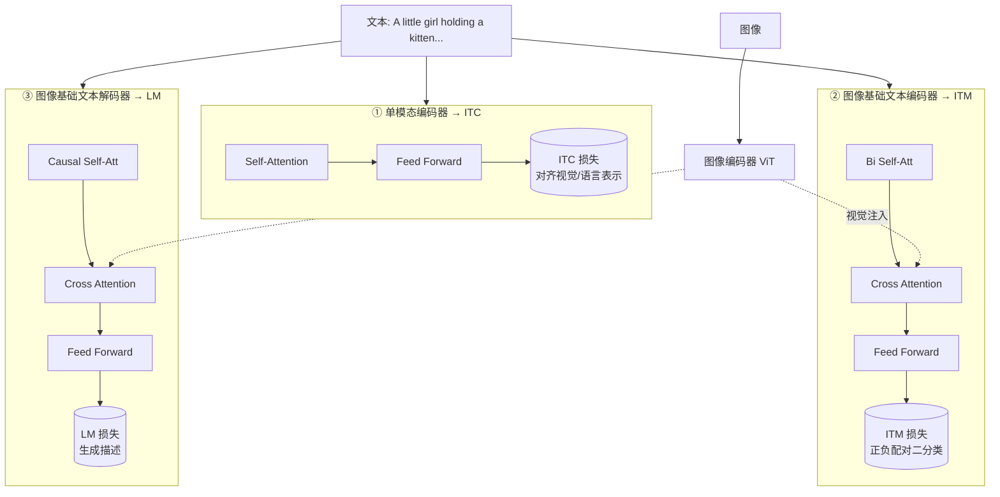

- **① 单模态编码器（Unimodal encoder）**：图和文**分开**编码。文本端仿 BERT，句首加 `[CLS]` 汇总句义。
- **② 图像基础文本编码器（Image-grounded text encoder）**：在每个 Transformer 块的自注意力和 FFN 之间**插一层 Cross-Attention (CA)** 注入视觉信息；文末加任务专用 `[Encode]` token，其输出即图文对的多模态表示。
- **③ 图像基础文本解码器（Image-grounded text decoder）**：把编码器里的**双向自注意力换成因果自注意力（causal self-attention）**；用 `[Decode]` 标开头、`[EOS]` 标结尾。

> 🔬 **第一性原理｜参数共享的智慧**。图 3.3 中相同颜色的参数是**共享**的。文本编码器和解码器**除自注意力层外全部共享参数**。为什么？因为「编码 vs 解码」的差异**恰好由自注意力体现**（双向 vs 因果），而 embedding 层、cross-attention 层、FFN 在两种任务里功能相似，共享它们既省参数又享受多任务学习红利。**每个图文对只需 1 次重型 ViT 前向 + 3 次文本 Transformer 前向**。

## 3.2.2 三个预训练目标

BLIP 同时优化三个目标（两个理解型 + 一个生成型）：

| 损失 | 激活形态 | 类型 | 作用 |
|---|---|---|---|
| **ITC**（Image-Text Contrastive Loss） | ① 单模态编码器 | 理解 | 对齐视觉/文本特征空间；引入**动量编码器（momentum encoder）**生成软标签，缓解"负样本里其实有正样本"的问题 |
| **ITM**（Image-Text Matching Loss） | ② 图像基础文本编码器 | 理解 | 二分类：判断图文对是否匹配；用 **hard negative mining**（batch 内对比相似度更高的负对更可能被选中算损失） |
| **LM**（Language Modeling Loss） | ③ 图像基础文本解码器 | 生成 | 自回归生成描述，交叉熵 + **label smoothing=0.1**；相比 MLM，LM 赋予模型把视觉转成连贯描述的泛化能力 |

> 💡 **实战｜ITC vs ITM 的分工**。ITC 是"粗对齐"（全局向量级别、算力便宜、可上大 batch），ITM 是"细对齐"（token 级交互、算力贵、只在 hard negative 上精算）。二者配合是后来 BLIP-2、很多检索模型的标配套路：**先 ITC 粗筛，再 ITM 精排**。

## 3.2.3 Caption Filtering（CapFilt）—— 从噪声网络数据里自举

痛点：高质量人工标注图文对 $\{(I_h, T_h)\}$（如 COCO）**很贵、很少**；网络 alt-text 图文对 $\{(I_w, T_w)\}$ 量大但**噪声高**（alt-text 常常不准确描述图像）。

BLIP 的解法 **CapFilt** 引入两个从**同一个预训练 MED** 初始化、再各自在 COCO 上轻量微调的模块：

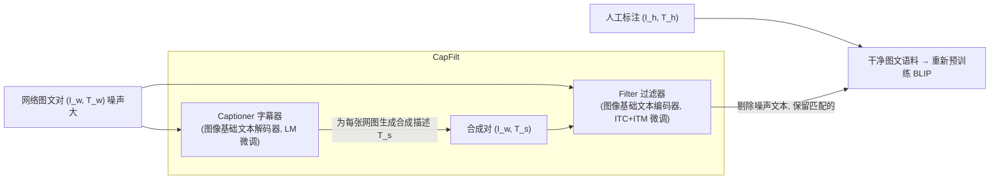

- **Captioner（字幕器）**：图像基础文本解码器，LM 微调。对每张网图 $I_w$ 生成合成描述 $T_s$。
- **Filter（过滤器）**：图像基础文本编码器，ITC+ITM 微调。判断"文-图"是否对应，**从原始网络文本和合成文本里都剔掉噪声**。

最终把「人工对 + 过滤后的网络对 + 过滤后的合成对」合成新语料，**重新预训练 BLIP**——这就是"自举（bootstrapping）"：用模型自己清洗数据，再用清洗后的数据训更强的模型。

> ⚠️ **常见坑｜合成描述也会有噪声**。所以 Filter 要**同时过滤原始网络文本和合成文本两路**，否则字幕器的幻觉会污染语料。CapFilt 的关键正是"生成"与"过滤"配对使用。

> 📌 **小结·BLIP**：MED 一体三形态统一理解+生成；ITC/ITM/LM 三损失联合；CapFilt 用模型自清洗数据自举。它是 BLIP-2 的直接前身。

---

# 🧊 3.3 BLIP-2：用冻结的图像编码器 + 冻结的 LLM 做桥接

痛点：端到端训大模型做视觉-语言预训练**越来越贵**。BLIP-2（Salesforce, 2023）提出一个**通用且高效**的策略——**从冻结的现成图像编码器和冻结的 LLM 自举**，中间只训一个轻量 **Q-Former（Querying Transformer，查询变换器）**来弥合模态鸿沟。尽管可训练参数远少于以往方法，BLIP-2 却在多项视觉-语言任务上取得 SOTA。

## 3.3.1 核心思想：Q-Former 是"信息瓶颈"

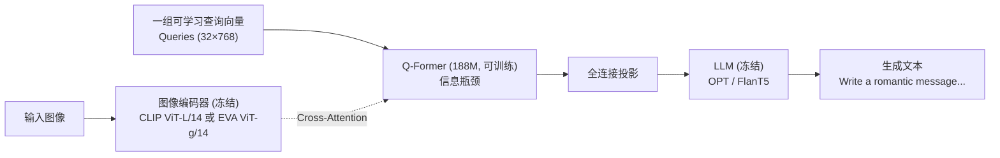

> 🔬 **第一性原理｜为什么要一个"瓶颈"？**
> 冻结的图像编码器输出很多视觉特征（如 ViT-L/14 是 257×1024），冻结的 LLM 只懂语言 token。Q-Former 用**一小组可学习查询（32 个，每个 768 维，输出仅 32×768）**去 cross-attention 提取视觉特征，充当二者之间的**信息瓶颈（information bottleneck）**：只把**对生成文本最有用**的视觉信息传给 LLM，滤掉无关内容。这既**减轻 LLM 学对齐的负担**，又**缓解灾难性遗忘**（因为 LLM 全程冻结）。

Q-Former 由两个**共享自注意力层**的 Transformer 子模块组成：
1. **图像 Transformer**：与冻结图像编码器交互，提取视觉特征。
2. **文本 Transformer**：既当文本编码器又当解码器。

关键数字：
- 用 **BERT-base** 权重初始化 Q-Former，cross-attention 层随机初始化；总参数 **188M**（含查询向量）。
- **32 个查询**，每个 768 维；输出 $Z$ = 32×768，远小于图像特征（257×1024）——这个瓶颈结构逼查询提取**文本相关**的视觉特征。
- Cross-attention 层**每隔一个 Transformer 块插入一次**（every other block）。

## 3.3.2 第一阶段：冻结图像编码器下的表示学习

第一阶段把 Q-Former 接到冻结图像编码器上，用图文对预训练，让查询学会提取"最能表达文本信息"的视觉特征。仿照 BLIP，同时优化**三个共享输入格式和参数**的目标，但**用不同的自注意力掩码**控制"查询-文本"交互：

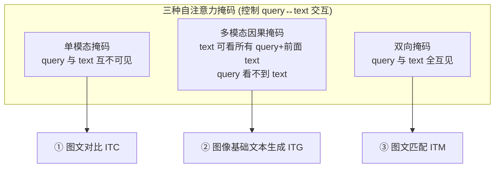

| 目标 | 掩码 | 机制 |
|---|---|---|
| **① 图文对比（ITC）** | 单模态掩码（防信息泄漏，query↔text 互不可见） | 对齐图 Transformer 输出的查询表示 $Z$ 与文本 `[CLS]` 表示 $t$；因 $Z$ 有多个嵌入，两两算相似度**取最大**。用 **in-batch negatives**（不用 BLIP 的动量队列） |
| **② 图像基础文本生成（ITG）** | 多模态因果掩码（仿 UniLM）：query 之间互见但看不到 text；每个 text token 可看所有 query + 前面 text | 逼查询提取**足以生成全部文本**的视觉信息；把 `[CLS]` 换成 `[DEC]` 作解码首 token |
| **③ 图文匹配（ITM）** | 双向掩码：query 与 text 全互见 | 二分类判断匹配与否；输出查询表示 $Z$ 捕获多模态信息后送分类头 |

> 💡 **面试高频｜BLIP-2 vs BLIP 数据侧差异**：BLIP-2 因为图像编码器**冻结**，单卡能塞更多样本，于是直接用 **in-batch negatives** 就够，不再需要 BLIP 的**动量队列（momentum queue）**。这是"冻结带来的工程红利"的一个具体体现。

## 3.3.3 第二阶段：冻结 LLM 下的生成学习

第二阶段把「Q-Former + 冻结图像编码器」接到**冻结 LLM**，借用 LLM 的生成能力：

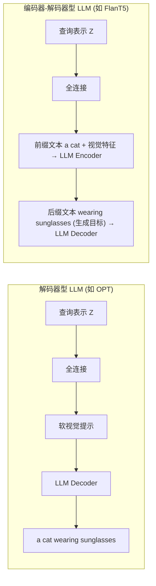

- 用**一个全连接层**把查询表示 $Z$ 线性投到与 LLM 文本嵌入**同维**，然后**前置（prepend）**到输入文本嵌入之前——它们充当**软视觉提示（soft visual prompts）**，让 LLM 以视觉特征为条件。
- **解码器型 LLM（OPT）**：用**语言建模损失**，LLM 以视觉特征为条件生成文本。
- **编码器-解码器型 LLM（FlanT5）**：用**前缀语言建模损失**——前缀文本 + 视觉特征进 encoder，后缀文本作 decoder 的生成目标。

## 3.3.4 训练配置（数字备查）

- **图像编码器**：CLIP ViT-L/14、EVA-CLIP ViT-g/14；**去掉 ViT 最后一层，用倒数第二层特征**（经验上更好）。
- **步数**：第一阶段 250K 步，第二阶段 80K 步。
- **batch**：阶段一 ViT-L=2320 / ViT-g=1680；阶段二 OPT=1920 / FlanT5=1520。
- **精度**：冻结的 ViT 与 LLM 转 **FP16**（FlanT5 用 BFloat16），无性能下降。
- **优化器**：AdamW，$\beta_1{=}0.9,\beta_2{=}0.98$，weight decay 0.05；cosine 衰减，峰值 lr 1e-4，2K 步 warmup；阶段二最小 lr 5e-5。
- **图像**：224×224，随机裁剪缩放 + 水平翻转。

> 📌 **小结·BLIP-2**：冻结视觉 + 冻结 LLM + 只训 188M 的 Q-Former。两阶段：先学"文本相关的视觉表示"，再学"LLM 可读的视觉表示"。这套「冻结底座 + 轻量桥接」范式，是当今绝大多数 MLLM 的模板。

---

# 🦙 3.4 LLaMA：开源大语言模型底座

多模态大模型需要一个强 LLM 底座，本章顺势介绍 **LLaMA**[697]——一组 **7B 到 65B** 的开源基础语言模型，只用**公开数据**、在**万亿级 token** 上训练，就达到 SOTA。亮点：**LLaMA-13B 在多数基准上超过 GPT-3（后者大 10 倍）**，且能在单卡上跑推理。

> 🔬 **第一性原理｜Chinchilla 式"多喂 token"**。LLaMA 的思路是：在给定**推理预算**下，**用更多 token 训更小模型**往往更划算——因为推理成本随参数量走，训练时多喂数据换来的是"部署时更便宜"。这解释了为什么 13B 能打 175B 的 GPT-3。

## 3.4.1 预训练数据（全公开）

| 来源 | 占比 | 处理要点 |
|---|---|---|
| English CommonCrawl | 67% | CCNet 管线；行级去重、FastText 语种识别去非英文、n-gram 语言模型过滤低质；训线性分类器筛"是否像 Wikipedia 引用页" |
| C4 | 15% | 去重 + 语种识别 |
| GitHub | 4.5% | 只留 Apache/BSD/MIT 许可；启发式过滤（行长、字母数字比）；正则去样板；文件级精确去重 |
| Wikipedia | 4.5% | 2022 年 6–8 月，20 种语言（拉丁/西里尔字母）；去超链、注释、样板 |
| Gutenberg + Books3 | 4.5% | 书级去重（>90% 重叠者剔除） |
| arXiv | 2.5% | 处理 LaTeX；去旧版本与参考文献、去 `.tex` 注释、宏内联展开 |
| Stack Exchange | 2% | 高质量问答 |

## 3.4.2 架构改动（三处关键，各有出处）

| 改动 | 借鉴 | 做法 & 好处 |
|---|---|---|
| **Pre-normalization（前置归一化）** | GPT-3 | 归一化每个子层的**输入**而非输出，用 **RMSNorm**[837]，训练更稳 |
| **SwiGLU 激活** | PaLM | 把 ReLU 换成 **SwiGLU**[618]，FFN 维度从 $4d$ 调成 $\tfrac{2}{3}\cdot4d$，效果更好 |
| **Rotary Embeddings（旋转位置编码 RoPE）** | GPTNeo | 去掉绝对位置编码，改用 **RoPE**[662]，在每层加入 |

## 3.4.3 优化器与高效实现

- **优化器**：AdamW，$\beta_1{=}0.9,\beta_2{=}0.95$；cosine 衰减到峰值的 10%；weight decay 0.1、梯度裁剪 1.0、warmup 2000 步。
- **高效实现**：
  - **高效因果多头注意力**（XFormers，灵感来自[551]，反传自[134]）——省显存省时间。
  - **激活检查点（activation checkpointing）**：只保留**计算昂贵**的激活（如线性层输出），**手写 Transformer 层的反向函数**，不完全依赖 PyTorch autograd，减少反传重算量。
  - **模型并行 + 序列并行**；把激活计算与 GPU 间 `all_reduce` 通信**重叠**以掩盖网络开销。
- **吞吐**：训 65B 时，在 **2048× A100（80GB）** 上约 **380 tokens/s/GPU**。

> 💡 **实战｜为什么手写反向？** PyTorch autograd 会保存大量中间激活。手写 Transformer 反向 + 选择性 checkpoint，能精确控制"哪些激活留在显存、哪些反传时重算"，是长上下文/大模型训练省显存的经典手法（后来 FlashAttention 把这套推到极致）。

> 📌 **小结·LLaMA**：全公开数据 + RMSNorm/SwiGLU/RoPE 三件套 + 高效实现。它是 LLaMA-Adapter、LLaVA、MiniGPT-4、VideoChat 等一大批多模态工作的**语言底座**。

---

# 🔌 3.5 LLaMA-Adapter (V2)：参数高效地把 LLaMA 变成视觉指令模型

高效地把 LLM 变成**指令跟随者**是热门方向，但让 LLM 做**多模态推理**仍待探索。本节讲 **LLaMA-Adapter V2**[193]——只加 **1400 万参数**就实现开放式多模态指令跟随，还增强了纯语言指令跟随和对话能力。

## 3.5.1 前置：LLaMA-Adapter 的两个基石

**(1) 零初始化注意力（Zero-init Attention）**——LLaMA-Adapter[851]的核心。

冻结整个 LLaMA，只加一个 **120 万参数**的轻量 adapter，把一组**可学习软提示（soft prompts）**作为前缀接到词 token 前，且只作用于 LLaMA 的**高层** Transformer。

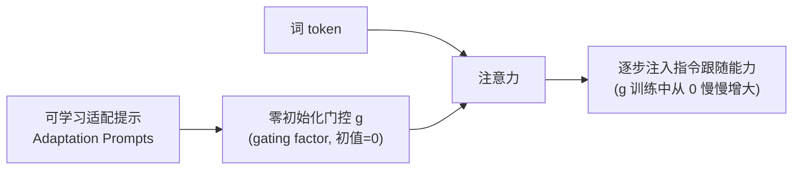

> 🔬 **第一性原理｜"零初始化门控"为什么重要？**
> 直接把随机初始化的软提示塞进冻结 LLaMA，会在训练早期用噪声**破坏**已学好的语言能力。LLaMA-Adapter 引入一个**初值为 0 的门控因子 $g$** 自适应控制适配提示对词 token 的贡献：训练初期 $g\approx0$，几乎不干扰原模型；随训练 $g$ 逐渐增大，**渐进地**把指令跟随能力注入冻结 LLaMA。既保住早期语言生成能力，又持续吸收新知识。

**(2) 简单多模态变体**：处理图像时用预训练视觉编码器提特征，把视觉特征并入适配提示，就能基于图文输入回答，在 ScienceQA 上有竞争力。**(3) 开放式多模态推理**的局限：仅在 COCO Caption 上微调，只会生成**短描述**，且新学的视觉线索会**压过**适配提示、盖住指令跟随特性——这正是要做 V2 的动机。

## 3.5.2 LLaMA-Adapter V2 的四大改进

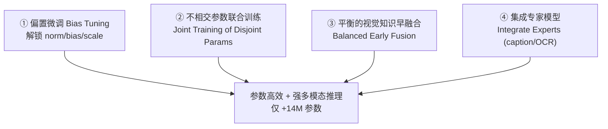

**① 线性层的偏置微调（Bias Tuning）**
原版只更新适配提示和门控，改不了 LLM 内部参数，深度微调受限。V2 **解冻所有归一化层**，并给**每个线性层加偏置项和缩放因子**。类似 BitFit（BERT 微调）和 SSF（视觉提示微调），但那些是 8000 万参数量级的理解任务，V2 把偏置微调用在 **7 亿–650 亿参数**的 LLM 上。且它是**输入无关（input-agnostic）**的，不像 LoRA 加的是输入相关的低秩偏置——进一步降本。

**② 不相交参数的联合训练（Joint Training）**
要同时具备"生成长回复"和"多模态理解"。数据量不对等（**50 万图文对 vs 5 万指令样本**），直接混训会严重损害指令跟随。解法：**给图文对齐和指令跟随分别优化不相交的参数组**：

| 数据类型 | 训练哪些参数 |
|---|---|
| 图文描述数据（500K） | 视觉投影层 + 早期零初始化注意力及门控 |
| 指令跟随数据（50K） | 后期适配提示、零门控、解冻的归一化、新增 bias/scale（或可选 LoRA） |

由此**解决两目标之间的干扰**。好处：**不需要 MiniGPT-4/LLaVA 那样的高质量多模态指令数据**，只用图文对 + 语言指令数据即可。

**③ 视觉知识的平衡早融合（Early Fusion）**
原版把动态视觉提示加到**最后 $L$ 层**的静态适配提示上，视觉容易压过指令。V2 改成**早融合**：

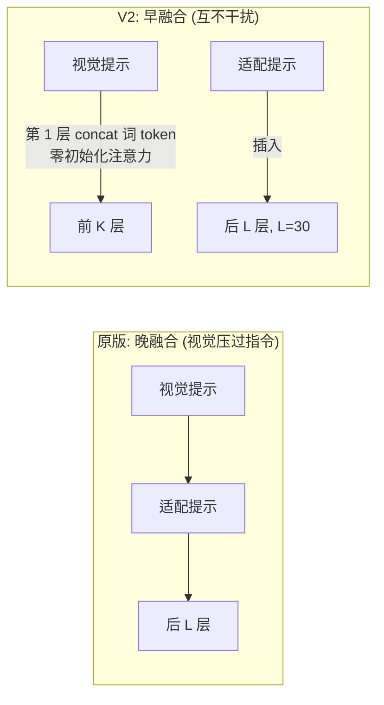

- 适配提示插在**最后 $L$ 层**（如 $L{=}30$）；
- 视觉提示只在**第 1 层**直接与词 token **拼接**（用零初始化注意力），$K < N-L$；
- 二者**注入不同 Transformer 层、不再直接相加**，从而图文对齐不再干扰指令跟随。

**④ 集成专家模型（Integrate Experts）**
V2 图像理解仍偏弱。与其收集更多数据，不如在**推理时**集成专家：给一张图，用视觉编码器编码内容，同时让**专家模型（如 COCO Caption 字幕器、OCR、甚至搜索引擎）**生成一段文字上下文一起喂进去。**无需额外训练**即增强图像理解，且可按下游任务**自由切换专家**。

> ⚠️ **常见坑｜多目标干扰是多模态微调的头号敌人**。LLaMA-Adapter V2 三处设计（不相交参数、早融合、门控）本质都在回答同一个问题：**如何让"看图"和"听话"两种能力不互相打架**。这也是所有 MLLM 微调都要面对的核心矛盾。

> 📌 **小结·LLaMA-Adapter V2**：零初始化注意力打底，偏置微调 + 不相交联合训练 + 早融合 + 专家集成，仅 +14M 参数实现开放式多模态指令跟随。**极致参数高效**是它的招牌。

---

# 🎬 3.6 VideoChat：以视频为中心的多模态对话

视频是最接近人类连续视觉感知的媒介。但现有视频理解受限于任务专用适配，且"把视频转文字再问答"会**丢失视觉信息、过度简化时空复杂度**。VideoChat 把视频相关任务统一成**多轮视频问答**，把 LLM 当作**通用视频任务解码器**。

VideoChat 提供两条路线：

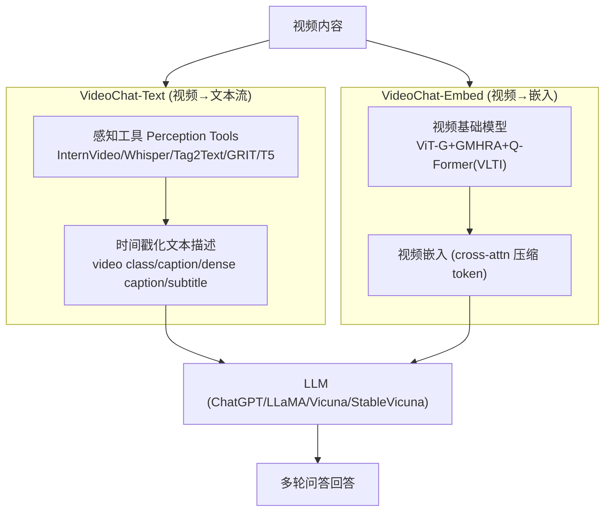

用公式表达"用视觉模型从视频抽取概念"：

$$
[E]_i^{\,j}=f^{\,j}_{\text{img}}(I_i)\quad\text{或}\quad E^{\,j}=f^{\,j}_{\text{vid}}(V),\ \ V=[I_i]_{i=1,2,\dots,T}\tag{3.2}
$$

其中 $E$ 是上下文文本描述或嵌入，$f^{\,j}_{\text{img}}$ 是第 $j$ 个图像模型，$I$、$V$ 分别是图像与视频。

## 3.6.1 VideoChat-Text：把视频转成文本流

流程：**FFmpeg 低 FPS 抽关键帧** → 得到 $T$ 帧和音频 → 喂各种模型拿到动作标签、帧摘要、视频标签、详细描述、物体坐标、旁白、时间戳等 → 整合成**带时间戳的文本描述**。

- 用预训练 **T5**[559]精炼各模型（相对独立）的输出，提升清晰度。
- 集成 **Whisper**[553]语音识别，充分利用音频。
- 系统提示（图 3.14）明确要求：主要参考时序描述、可用标签消歧、**"不要凭空编造视频情节"**。

> ⚠️ **常见坑｜"视频转文字"天生丢信息**。VideoChat-Text 简单粗暴但对复杂时序推理、因果推断能力弱——这正是需要 VideoChat-Embed 的原因。

## 3.6.2 VideoChat-Embed：端到端视频对话

基于 **BLIP-2 + StableVicuna**，加一个可学习的 **VLTI（Video-Language Token Interface，视频-语言 token 接口）**，用 **cross-attention 压缩视频 token**（应对视频冗余）。

**架构**：预训练 **ViT-G**[668] + **GMHRA（Global Multi-Head Relation Aggregator，全局多头关系聚合器）**（来自 InternVideo/UniFormerV2 的时序建模模块）+ 预训练 **Q-Former** + 额外线性投影 + 额外查询 token（建模视频上下文）。**训练时冻结大部分参数，只训 GMHRA、查询、线性投影**。

**两阶段训练**（受 MiniGPT-4 / LLaVA 启发）：

| 阶段 | 数据 | 目标 |
|---|---|---|
| **Stage 1 对齐** | 2500 万视觉-文本对（1000 万 WebVid-10M 视频文本 + 1500 万 COCO/VG/SBU/CC3M/CC12M 图文） | 大规模视频-文本微调对齐视频编码器与 LLM |
| **Stage 2 指令微调** | 两类视频指令数据：深度视频描述（GPT-4 生成 7000 条）+ 视频问答对 | 提升高阶时序任务能力 |

**指令数据构造**：基于 WebVid-10M，用 **ChatGPT/GPT-4**（配合 VideoChat-Text）生成，提示聚焦时空特征。用"first / next / then / finally"等时序副词让描述体现视频随时间的演进；第二个提示再精炼、减少虚构成分。输入格式：`### Human: <Video>video_embed</Video> ... ### Assistant:`。

> 📌 **小结·VideoChat**：Text 路线简单可解释但丢信息；Embed 路线端到端、复用 BLIP-2 的 Q-Former 并加时序聚合 GMHRA + VLTI 压缩冗余。是"把 BLIP-2 范式扩到视频"的代表。

---

# ✂️ 3.7 SAM：可提示的图像分割基础模型

**SAM = Segment Anything Model**[344]。目标：为**图像分割**造一个基础模型——一个**可提示（promptable）**、在海量数据上预训练、具备强泛化的模型，靠 prompt engineering 就能解决新数据分布上的一系列分割问题。SAM 靠三个相互关联的组件成功：**任务、模型、数据**。

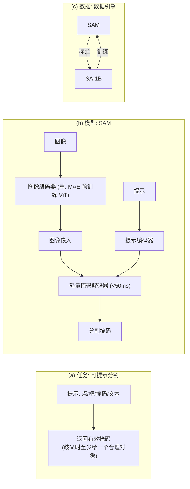

## 3.7.1 SAM 的三大支柱

**(1) 任务：可提示分割（Promptable Segmentation）**
把 NLP 的"提示"概念迁到分割：提示可以是前景/背景点集、粗框、掩码、自由文本，或任何指明"分什么"的信息。要求：**给任意提示都返回有效掩码**。"有效"意味着即使提示有歧义（如"衬衫 vs 人"），输出也要是**其中至少一个对象**的合理掩码——就像期待语言模型对歧义提问给出连贯回答。

**(2) 预训练**：模拟每个样本的一串提示（点、框、掩码），对比预测掩码与真值。它改编自交互式分割，但目标不同——交互式分割要在足够输入后给**单个**有效掩码，而 SAM 要对**任意提示（哪怕歧义）**都给有效掩码。

**(3) 零样本泛化**：预训练赋予"对任意提示恰当响应"的能力，下游任务靠**恰当提示**完成。

## 3.7.2 SAM 的视觉模型架构（三组件）

| 组件 | 设计 | 要点 |
|---|---|---|
| **图像编码器（Image Encoder）** | **MAE 预训练的 ViT**[238]，微调以适配高分辨率 | **重**，但每图**只跑一次**，可在提示前预算好；同一图像嵌入可被不同提示**复用** |
| **提示编码器（Prompt Encoder）** | 稀疏（点/框/文本）用**位置编码**+ 学习到的每类型嵌入；文本用 **CLIP 文本编码器**；稠密（掩码）用卷积嵌入后与图像嵌入逐元素相加 | 灵活支持多种提示 |
| **掩码解码器（Mask Decoder）** | 改良的 Transformer 解码块 + 动态掩码预测头 | 用**双向 cross-attention**（提示↔图像互相更新）；两个解码块后上采样，MLP 把输出 token 映成动态线性分类器，逐位置算前景概率 |

> 🔬 **第一性原理｜为什么"重编码器 + 轻解码器"？**
> 交互式使用要求**实时**响应。SAM 把算力集中在**每图跑一次**的重图像编码器；而提示编码器 + 掩码解码器极轻，**在浏览器里 <50ms** 就能从一个提示出掩码。这样同一图像嵌入可被多个提示复用，成本被**摊销（amortized）**。这是"分离式设计"带来的交互性红利。

**(4) 消解歧义**：单输出时，歧义提示会让模型**对多个有效掩码取平均**（糊）。SAM 改成**一个提示预测 3 个掩码**（嵌套掩码最多三层：整体/部分/子部分），训练时**只反传最小损失的那个**，并为每个掩码预测一个**置信分**用于排序。

## 3.7.3 数据引擎（Data Engine，三阶段）

SAM 用"模型在环（model-in-the-loop）"的方式滚雪球式造数据：

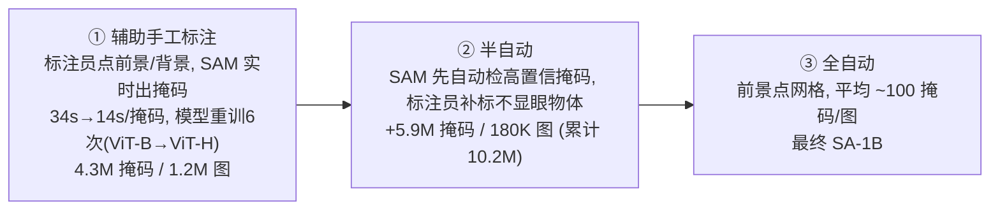

- **阶段① 模型辅助手工标注**：标注员用 SAM 驱动的浏览器工具点物体点，浏览器内实时（用预算好的图像嵌入）；随数据增加，图像编码器从 **ViT-B 扩到 ViT-H**、重训 **6 次**；每掩码平均标注时间 **34s→14s**（比 COCO 掩码标注快 6.5×），每图掩码数 **20→44**；共收 **430 万掩码 / 120 万图**。
- **阶段② 半自动**：为增加掩码多样性，SAM 先自动检出高置信掩码，标注员再补标不显眼物体；用一阶段掩码训了个通用"object"类检测器；**+590 万掩码 / 18 万图（累计 1020 万）**。
- **阶段③ 全自动**：用前景点网格提示，平均 **每图约 100 个高质量掩码**。

## 3.7.4 SA-1B 数据集

- **1100 万张**多样、高分、许可、隐私保护的图像（下采样到短边 1500px，仍高于 COCO 的 480×640）。
- **11 亿掩码**，其中 **99.1% 全自动生成**，质量高。
- 掩码质量：随机抽 500 图（约 5 万掩码）请标注员用"画笔/橡皮"精修评估。
- 比第二大分割数据集（Open Images）**图多 11 倍、掩码多 400 倍**。

> 💡 **面试高频｜SAM 和 CLIP 的"提示"有何异同？** 都借了 NLP 的 prompt 思想做零样本泛化，但 CLIP 的提示是**文本**（"a photo of a {label}"），SAM 的提示是**视觉**（点/框/掩码）。SAM 的文本提示也复用了 CLIP 的文本编码器——两条主线在这里交汇。

> 📌 **小结·SAM**：任务(可提示分割)+模型(重编码器/轻解码器/多掩码消歧)+数据(三阶段数据引擎造 SA-1B)三位一体。它是**视觉可提示**基础模型的标杆。

---

# 🤖 3.8 PaLM-E：具身多模态语言模型

LLM 推理很强，但在真实世界推理时面临 **grounding（接地）问题**：纯文本训练出的表示要和视觉、物理传感器模态连起来，才能解决 CV 和机器人里的真实问题。Google 提出**具身语言模型 PaLM-E**[165]，**把连续传感器模态直接注入语言模型**，在词与感知之间建立连接。

PaLM-E 的输入是一个**交错了视觉、连续状态估计、文本编码的多模态句子**；输出是自回归生成的文本（可以是问答，也可以是给机器人执行的**决策序列**）。它能处理机器人任务规划、VQA、图像描述等多种具身任务，并展现**正迁移**：从视觉-语言域学到的知识迁移到具身推理。

## 3.8.1 模型架构：把连续观测注入语言嵌入空间

**核心设计原则**：把连续具身观测（图像、状态估计、其他传感器模态）**编码成与语言 token 嵌入同维的向量序列**，像语言 token 一样注入 LLM。PaLM-E 是 **decoder-only** LLM，用 **PaLM**[110]做底座（"E" = Embodied 具身）。

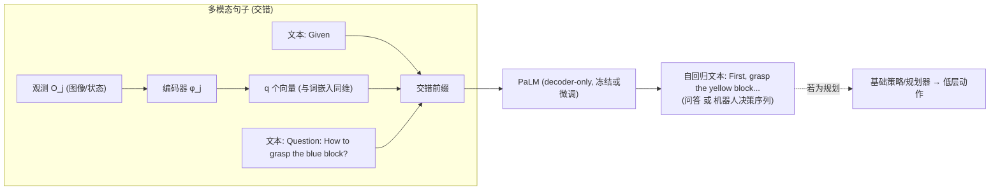

**(1) Decoder-only LLM** 的因式分解：

$$
p(w_{1:L})=\prod_{l=1}^{L}p_{\text{LM}}(w_l\mid w_{1:l-1})\tag{3.4}
$$

**(2) 前缀式 decoder-only**：LLM 可在前缀 $w_{1:n}$ 上条件生成，无需改架构：

$$
p(w_{n+1:L}\mid w_{1:n})=\prod_{l=n+1}^{L}p_{\text{LM}}(w_l\mid w_{1:l-1})\tag{3.5}
$$

**(4) 多模态句子：注入连续观测**。图像等连续观测**绕过离散 tokenization**，直接映到语言嵌入空间。训练一个编码器 $\phi:\mathcal{O}\to\mathcal{X}^q$ 把观测空间映成 $q$ 个向量，与文本 token 嵌入交错成 LLM 前缀。每个前缀向量 $x_i$ 或来自词嵌入器 $\gamma$、或来自编码器 $\phi_i$：

$$
x_i=\begin{cases}\gamma(w_i), & i\ \text{是文本 token}\\[4pt]\phi^{\,j}(O_j)_i, & i\ \text{对应观测 } O_j\end{cases}\tag{3.6}
$$

> 🔬 **第一性原理｜PaLM-E 和 BLIP-2 的注入方式差异**。BLIP-2 把视觉软提示**前置（prepend）**在固定位置；PaLM-E 的观测嵌入**不插在固定位置，而是动态地穿插在周围文本中**，复用 LLM 已有的位置编码。这让 PaLM-E 能处理"一句话里多张图/多个观测"的复杂具身指令。

**(5) 具身输出：接入机器人控制回路**。分两种情况：
- 纯文本输出即可完成 → 直接把输出当解；
- 具身规划/控制 → 生成的文本作为**原语命令（primitive commands）**的条件；假设已有执行小词表原语技能的策略，PaLM-E 的规划就是**给这些技能排序**。注意 PaLM-E 要**自主判断**可用技能，没有额外机制约束/过滤输出。

## 3.8.2 输入编码器（把不同模态编成 token）

| 编码器 | 处理 | 说明 |
|---|---|---|
| **状态估计向量** | MLP $\phi_{\text{state}}$ 把状态向量 $s\in\mathbb{R}^S$（位姿、大小、颜色…）映到语言嵌入空间 | 最简单的输入方式 |
| **ViT** | $\phi_{\text{ViT}}$ 把图像映成 token 序列 $x_{1:m}$；用了 4B 的 ViT-4B、22B 的 ViT-22B | ViT 维度 $k$ 与 LLM 维度不同，需仿射投影 $\psi$：$x_i=\psi(\phi_{\text{ViT}}(I)_i)$ |
| **对象中心表示** | 把视觉分解成"单个物体"的 token | ViT 表示像静态网格、非物体实例集合，故探索结构化编码器 |
| **OSRT** | Object Scene Representation Transformer[597] | **3D 感知**、避免用真值分割的对象中心表示 |

## 3.8.3 训练策略

数据 $\mathcal{D}=\{(I^i_{1:u_i}, w^i_{1:L_i}, n_i)\}_{i=1}^N$，每例含 $u_i$ 个连续观测、文本、一个索引 $n_i$。文本里用**特殊 token 占位**，其位置被编码器嵌入替换。底座用 **8B/62B/540B** 的 PaLM：

| 组合 | 名称 | 参数 |
|---|---|---|
| 8B LLM + 4B ViT | **PaLM-E-12B** | 12B |
| 62B LLM + 22B ViT | **PaLM-E-84B** | 84B |
| 540B LLM + 22B ViT | **PaLM-E-562B** | 562B |

PaLM-E 三大件：编码器 $\phi$、投影器 $\psi$、LLM $p_{\text{LM}}$。

- **(1) 冻结模型变体**：可选**冻结 LLM 只训输入编码器**——此时编码器要产出能把具身能力传给冻结 LLM 的嵌入，可理解为**输入条件的软提示（input-conditioned soft prompting）**。
- **(2) 跨任务联合训练**：在多样数据集（主要是大规模视觉-语言数据）上联合训练，**具身数据只占 8.9% 采样频率**，却带来正迁移。

> 📌 **小结·PaLM-E**：把连续观测编成"和词等价"的向量、动态穿插进文本喂给冻结/微调的 PaLM。它把"视觉-语言基础模型"推广到**具身智能**，展示了大模型跨模态、跨任务的正迁移。

---

# ➕ 补充：Flamingo 与 LLaVA（要点点名，业界主线补讲）

> 说明：本章正文（第 149–192 页）系统讲了 CLIP/BLIP/BLIP-2/LLaMA/LLaMA-Adapter/VideoChat/SAM/PaLM-E，并多次把 **LLaVA / MiniGPT-4 / Flamingo 式**方法作为对照与出处引用（如 VideoChat、LLaMA-Adapter V2 都提到"不需要 LLaVA/MiniGPT-4 那样的高质量多模态指令数据"）。为满足本讲要点里点名的 Flamingo/LLaVA，下面按业界公认结构补讲，方便你把整条"冻结桥接"脉络串起来。

## Flamingo：交错图文的少样本视觉语言模型

Flamingo（DeepMind, 2022）是"冻结桥接"范式的**开山之作之一**，专攻**少样本（few-shot）**的图文交错理解。

```mermaid
flowchart LR
    IMG[图像/视频帧] --> VE["视觉编码器 (冻结, NFNet/CLIP)"]
    VE --> PR["Perceiver Resampler<br/>(把变长视觉特征压成固定数量 token)"]
    TXT["交错文本 <image> ... <image> ..."] --> LM
    PR -.->|GATED XATTN-DENSE<br/>(门控交叉注意力, 初值≈0)| LM["冻结 LLM (Chinchilla)"]
    LM --> OUT[生成文本]
```

- **Perceiver Resampler**：把任意数量/分辨率的视觉特征**重采样成固定少量 token**，解决"视觉 token 太多且变长"。
- **GATED XATTN-DENSE**：在**冻结 LLM** 的层间插入**门控交叉注意力**，门控值 **初始为 0**（`tanh` 门控）——和 LLaMA-Adapter 的零初始化门控异曲同工：**训练初期不破坏 LLM，逐步注入视觉条件**。
- 支持**图文交错序列**，天然适配 few-shot in-context learning（给几个"图+答"示例，再问新图）。

> 💡 **对照记忆**：Flamingo 的 Perceiver Resampler ≈ BLIP-2 的 Q-Former（都把视觉压成少量 token）；Flamingo 的门控交叉注意力 ≈ LLaMA-Adapter 的零初始化注意力（都用近零门控保护冻结 LLM）。三者是同一思想的不同实现。

## LLaVA：最简"线性投影"视觉指令微调

LLaVA（Large Language and Vision Assistant, 2023）把"冻结桥接"做到**极简**，并开创了**视觉指令微调（visual instruction tuning）**。

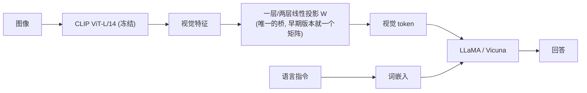

- **桥接极简**：不用 Q-Former、不用 Perceiver，**就一个线性投影** $W$ 把 CLIP 视觉特征映到 LLM 词嵌入空间（LLaVA-1.5 升级为两层 MLP）。
- **两阶段训练**：① 特征对齐预训练（只训投影 $W$，冻结视觉和 LLM）；② 端到端指令微调（训投影 + LLM）。
- **关键数据创新**：用 **GPT-4（纯文本）** 根据图像的 caption/bbox 生成**多模态指令数据**（对话、细节描述、复杂推理三类）——用语言模型**造数据**训多模态模型。

> 🔬 **第一性原理｜为什么"一个线性层"也能work？** 因为 CLIP 视觉编码器已经把图像编码进了一个**语义空间**，且该空间本就是和文本对齐训练出来的。所以只需一个线性变换把它"对齐"到 LLM 的词嵌入空间即可。这解释了为什么 LLaVA 用最少的桥接参数就取得强效果——**地基（CLIP）打得好，桥就可以很短**。

## 五种"视觉→LLM"桥接方式横向对比

| 模型 | 视觉编码器 | 桥接模块 | 桥接可训练参数 | 保护 LLM 的机制 | 训练数据关键 |
|---|---|---|---|---|---|
| **BLIP-2** | 冻结 ViT | **Q-Former**（32 查询） | 188M | 信息瓶颈 + 两阶段 | 图文对 |
| **Flamingo** | 冻结 NFNet | **Perceiver + 门控交叉注意力** | 中等 | tanh 门控初值≈0 | 交错图文 |
| **LLaVA** | 冻结 CLIP ViT | **线性投影/MLP** | 极小 | 两阶段（先只训投影） | GPT-4 造的指令数据 |
| **LLaMA-Adapter V2** | 冻结视觉编码器 | **适配提示 + 早融合** | +14M | 零初始化门控 + 不相交参数 | 图文对 + 语言指令 |
| **PaLM-E** | ViT/OSRT | **投影 + 交错注入** | 视变体而定 | 可选冻结 LLM（软提示） | 视觉语言 + 8.9% 具身 |

> ⚠️ **常见坑｜桥接参数少 ≠ 一定更好**。LLaVA 桥极简但依赖高质量指令数据；BLIP-2 桥重但两阶段训练稳。选型要看：底座冻不冻、数据有多少、要不要 few-shot、要不要生成长文本。没有银弹，**"冻结底座 + 轻量桥 + 保护机制 + 好数据"** 才是共性配方。

---

## 📌 全章小结

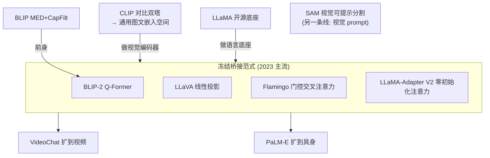

**九个模型，三条主线，一个共性**：

1. **对齐线（CLIP → BLIP）**：用语言弱监督海量图文，学一个共享嵌入空间。CLIP 的对比双塔 + BLIP 的 MED/CapFilt，奠定了"图文对齐 + 数据自举"的地基。
2. **冻结桥接线（BLIP-2 / LLaVA / Flamingo / LLaMA-Adapter / PaLM-E）**：**冻结**现成视觉编码器和 LLM，只训**轻量桥**（Q-Former / 线性投影 / 门控交叉注意力 / 适配提示），把视觉灌进 LLM 生成语言。这是当今 MLLM 的主流范式。
3. **视觉可提示线（SAM）**：把 NLP 的 prompt 迁到视觉（点/框/掩码），用三阶段数据引擎造 SA-1B（11 亿掩码），做出分割基础模型。
4. **一个共性配方**：**冻结底座（省算力、防遗忘）+ 轻量桥（省参数）+ 保护机制（零初始化/门控/信息瓶颈，防破坏 LLM）+ 好数据（CapFilt 自清洗 / GPT-4 造指令）**。

**面试速答卡**：
- CLIP 为何零样本？→ 学到共享图文嵌入空间，文本编码器动态合成分类器。
- Q-Former 是什么？→ BLIP-2 的信息瓶颈，32 个可学习查询提取文本相关视觉特征。
- 零初始化门控的作用？→ 训练初期不破坏冻结 LLM，渐进注入新能力（LLaMA-Adapter/Flamingo 都用）。
- SAM 三支柱？→ 可提示分割任务 + 重编码器轻解码器模型 + 三阶段数据引擎。
- PaLM-E 怎么接地？→ 把连续观测编成与词等维的向量，动态穿插进文本喂 PaLM。

---

## 🔗 延伸阅读

**本章书内引用的核心论文（编号即原书参考文献号）**：
- CLIP [552]（Radford et al., 2021） / ALIGN [296]
- BLIP [382] / BLIP-2 [381] / ITC 出处 [383]（ALBEF）
- LLaMA [697] / RMSNorm [837] / SwiGLU [618] / RoPE [662]
- LLaMA-Adapter [851] / LLaMA-Adapter V2 [193] / Alpaca [683]
- VideoChat（InternVideo [742] / UniFormerV2 [388] / Whisper [553] / WebVid-10M [34]）
- SAM [344] / MAE [238] / ViT [162]
- PaLM-E [165] / PaLM [110] / OSRT [597] / ViT-22B [142]
- Foundation Models 定义 [57]（Bommasani et al.）

**要点补充的业界论文**：
- Flamingo（Alayrac et al., NeurIPS 2022）：Perceiver Resampler + GATED XATTN-DENSE。
- LLaVA（Liu et al., NeurIPS 2023）[418] / MiniGPT-4 [886]：视觉指令微调。
- ImageBind（对齐多配对模态，书中 3.0 引子提到的"对齐多模态"方向）。

**动手建议**：
1. 复现 CLIP 训练循环（上文伪代码），观察温度、batch size 对零样本准确率的影响。
2. 用 HuggingFace `Salesforce/blip2-opt-2.7b` 跑图像描述，体会 Q-Former 软视觉提示。
3. 对比 `llava-1.5-7b`（线性桥）与 `blip2`（Q-Former 桥）在同一张图上的回答风格差异。

> 下一章预告：第 4 章将讲**多模态大模型的应用**——VQA（视觉问答）、AIGC、具身智能，以及当前未解难题与未来方向。
