# 第 4 章 多模态大模型应用（Applications of Multimodal Large Models）

> 逐章精讲 · 对应原书 pp.193–273
> 关键词：视觉问答 VQA · AIGC · 具身智能 Embodied Intelligence · 图文问答/检索/生成/具身/行业落地

---

## 🗺️ 本章地图

这一章是全书从"技术原理"跨向"技术落地"的桥梁。前几章讲的是多模态大模型**怎么造**（架构、预训练、对齐），本章讲的是它**能干什么、怎么用、落地时会踩什么坑**。作者梁林、刘阳（中山大学 HCP 实验室）选了三条最有代表性的应用主线，层层递进：

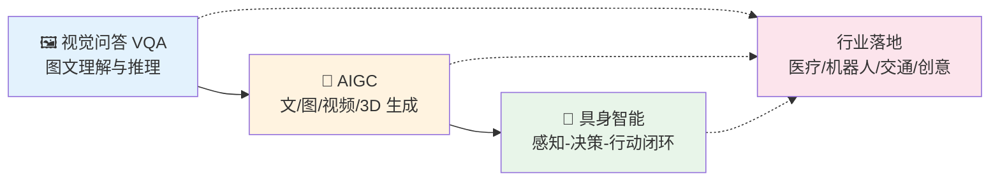

三条主线其实对应了"智能"从被动到主动的三级跃迁：

| 主线 | 本质任务 | 输入→输出 | 智能层级 |
|---|---|---|---|
| **VQA** | 看图回答（理解+推理） | 图/视频 + 问题 → 答案 | 被动感知（Passive AI） |
| **AIGC** | 按意图生成内容 | 条件（文/图/label）→ 图/视频/3D | 被动生成 |
| **具身智能** | 在环境中探索、导航、交互 | 环境 + 目标 → 一连串动作 | 主动交互（Active AI） |

本章讲透以下要点：**图文问答**（VQA 五大经典流派 + 视频 QA + 因果推理）、**检索**（对话系统里的 retrieval-based、具身里的目标检索）、**生成**（GAN/扩散、文/图/视频/3D 全modality AIGC）、**具身**（模拟器、探索/导航/EQA/交互四大任务、RT-1/RT-2/VoxPoser/RoboAgent）、**行业应用**（医疗/机器人/交通/创意/教育贯穿全章）。

> 💡 **一句话抓住本章脉络**：VQA 教机器"看懂并回答"，AIGC 教机器"按需创造"，具身智能教机器"在真实世界里动手"——三者合起来，就是通向 AGI 的应用路线图。

---

# 4.1 视觉问答（Visual Question Answering, VQA）

## 4.1.1 是什么 & 为什么难

**VQA 是什么**：给机器一张图 + 一个自然语言问题，机器要用几个词或短语给出正确答案。问题形式包括：

- **开放式（open-ended）**：无候选答案，如"这是什么颜色？"
- **二值（binary）**：yes/no
- **多选（multiple-choice）**：给定若干候选，选一个

🔬 **第一性原理：VQA 与传统 CV 任务的根本区别**

> 分割、检测这类传统任务，"要回答的问题在运行前是**预先定义好的**"——算法永远在回答"这个像素属于哪一类"，只有输入图片在变。而 VQA 里，**问题的形式和所需的操作在运行时是未知的**。同一张图，问"几只猫"要计数，问"猫什么颜色"要识别属性，问"猫在桌子上吗"要空间推理。这就要求通用图像理解能力，难度陡增。

⚠️ **VQA 为什么比图像描述（image captioning）更难**：

1. **需要图像里没有的信息**：从常识（哪些动物是哺乳动物）到百科知识（图中建筑物是哪座塔）。
2. **需要推理**：收集信息后还要整合、推断才能得出答案。
3. **图像的噪声和维度远高于纯文本**：图像没有语法结构、没有正则匹配这类 NLP 工具，却承载了更丰富的真实世界细节。

所以作者说：**VQA 是真正综合性的 AI 任务**（a truly comprehensive AI task），横跨 CV、NLP、知识库、推理多个子领域。

## 4.1.2 VQA 的分类

从**数据角度**和**任务设定**两个维度切：

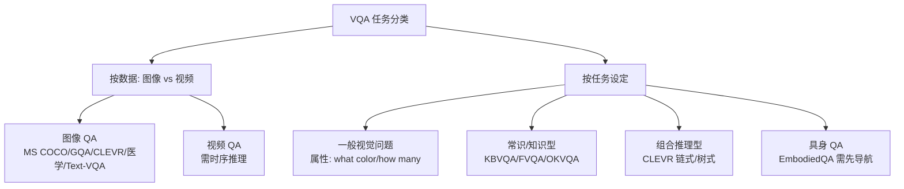

| 类型 | 代表数据集 | 关键特点 |
|---|---|---|
| 图像 QA（自然图） | VQA / VQA 2.0（用 MS COCO 图） | 上下文丰富 |
| 图像 QA（合成图） | Abstract VQA（卡通）、CLEVR（3D 合成） | 便于诊断推理能力 |
| 图像 QA（领域） | 医学 VQA（CT/X 光/超声）、Text-VQA（含 OCR） | 需专业/文字识别 |
| 视频 QA | TVQA / CLEVRER / AGQA | 需时序 + 运动推理 |
| 知识型 | KBVQA / FVQA / OKVQA | 必须查外部知识库 |
| 组合推理 | CLEVR | 链式/树式推理，如"有多少个圆柱体在小物体前面且在绿色物体左边？" |
| 具身 QA | EmbodiedQA | agent 随机出生在 3D 环境，需导航后才能回答 |

> 💡 **面试高频**：为什么 CLEVR 用 3D 合成图而不用真实图？答：因为它是**诊断型（diagnostic）数据集**，合成图可以精确控制物体的大小/颜色/材质/空间关系，从而生成有明确推理链的问题，把"模型是不是真会推理"和"模型是不是靠数据偏置蒙对"区分开。

## 4.1.3 图像 VQA 的五大经典流派

作者系统梳理了五个经典方法族，这是本节的核心。我们逐个讲透。

### 4.1.3.1 数据集：从 DAQUAR 到 VQA-v2

先理解数据集的两个关键区分维度：

- **图像类型**：自然图（DAQUAR/COCO-QA/VQA-v1-real/VQA-v2）、卡通图（VQA-v1-abstract）、合成图。
- **问答格式**：开放式 vs 多选。

| 数据集 | 规模 | 亮点 / 局限 |
|---|---|---|
| **DAQUAR** | 1,449 图 / 12,468 QA | 最早的 VQA 数据集，基于 NYU-Depth v2；答案空间受限、偏置强 |
| **COCO-QA** | 123,287 图 | 由 caption 自动转 QA，每图 1 对；**重复率高** |
| **FM-IQA** | 120,360 图 / 250,560 QA | 众包（AMT）人工标注，多语言，问题多样 |
| **VQA-v1-real** | 12.3 万训练图 / 61.4 万问题 | 引入 yes/no；**偏置严重**——"Do you see…"盲答 yes 有 87% 准确率 |
| **VQA-v1-abstract** | 5 万 clipart / 15 万问题 | 卡通图，测高级推理 |
| **VQA-v2** | 204,721 图 / 110 万问题 | **去偏关键**：为每个问题收集"相似但答案不同"的互补图 |
| **Visual Genome QA** | 108,000 图 | 带结构化 scene graph（场景图） |
| **Visual7W** | 47,300 图 / 32.8 万问题 | 多选（4 选 1），问题中对象带 bounding box |

⚠️ **VQA-v2 去偏的核心 trick**：对每个问题，标注员找**两张相似但答案不同的图**。这样模型就不能靠"语言先验"（linguistic prior）走捷径——比如看到"香蕉什么颜色"直接答"黄色"，因为数据里既有黄香蕉也有绿香蕉。这逼模型真正去看图像内容。

> 💡 **面试高频**：VQA 数据集的"语言偏置（language bias）"问题是什么？答：模型不看图，只靠问题的统计规律就能蒙对相当比例的答案（如 VQA-v1 的 yes 偏置 87%）。VQA-v2 用互补图去偏，是评估模型是否"真看图"的黄金标准。

### 4.1.3.2 联合嵌入方法（Joint Embedding）

**核心思想**：把图像和问题投影到同一个公共空间，再融合。分两类。

**(1) 序列到序列的编码器-解码器（Seq2Seq Encoder-Decoder）**

代表作 **Neural Image QA**（Malinowski 等）：CNN 提图像特征、LSTM 编码问题，然后组合生成多词答案。答案预测被形式化为序列生成：

$$\hat{a}_t = \arg\max_{a \in V} p(a \mid x, q, \hat{A}_{t-1}; \theta) \tag{4.1}$$

**逐行讲解**：
- $\hat{A}_{t-1} = \{\hat{a}_1, \dots, \hat{a}_{t-1}\}$：之前已经预测出的答案词。
- $x, q$：给定的图像和问题；$V$：答案词表；$\theta$：可学习参数。
- 关键机制：训练时用**已知答案词** $a$ 增强问题 $\hat{q}_t = [q, \hat{a}_1, \dots, \hat{a}_t]$；预测时用**已预测的答案词**增强。LSTM 每步吃 $v_t = [x, \hat{q}_t]$，逐词预测直到 `<END>`。

Gao 等的 **Multimodal QA (MQA)** 模型用**两个独立 LSTM**分别处理问题（LSTM-Q）和答案（LSTM-A），融合公式：

$$f(t) = g\big(V_{rQ} r_Q + V_I I + V_{rA} r_A(t) + V_\omega \omega(t)\big) \tag{4.2}$$

- $r_Q$：LSTM-Q 最后一个词的表示；$I$：图像特征；$r_A(t)$：LSTM-A 第 $t$ 词的隐表示；$\omega(t)$：第 $t$ 词的词嵌入。
- **权重共享 trick**：LSTM-Q 和 LSTM-A 的词嵌入矩阵共享，且词嵌入矩阵与 Softmax 层转置共享——因为问题和答案里相同的词应有相同含义，共享可减参数、提性能。

⚠️ **联合嵌入的通病**：用**逐元素操作**（element-wise）融合过于简化，无法捕捉图像和问题的复杂交互，在部分数据集上表现差，只能当 baseline。

**(2) 多模态双线性池化（Multimodal Bilinear Pooling）**

🔬 **为什么需要双线性池化**：逐元素融合表达力太弱。双线性池化取图像向量 $x$ 和文本向量 $q$ 的**外积**（outer product），表达力强得多：

$$z = M[x \otimes q] \tag{4.3}$$

**但代价惊人**：若 $x, q$ 都是 2048 维、3000 个答案类别，原生双线性模型有 **1250 亿参数**！所以要压缩。

**MCB（Multimodal Compact Bilinear Pooling）** 用 count sketch 投影 + FFT 巧妙绕开外积的显式计算：

$$\Psi(x \otimes q, h, s) = \Psi(x, h, s) * \Psi(q, h, s) = x' * q' \tag{4.4}$$

$$x' * q' = \text{FFT}^{-1}\big(\text{FFT}(x') \odot \text{FFT}(q')\big) \tag{4.5}$$

- **逐行**：$*$ 是卷积。根据**卷积定理**，时域卷积 = 频域逐元素乘积 $\odot$。所以先 FFT 到频域相乘，再逆 FFT，避免了直接算外积。
- count sketch 用两个随机固定向量 $s \in \{-1,1\}^n$ 和 $h \in \{1,\dots,d\}^n$ 把高维向量投影到低维。

**MLB（Multimodal Low-rank Bilinear Pooling）** 更进一步，把大权重矩阵 $W$ 低秩分解 $W = UV$：

$$z = P(U'x \odot V'q) \tag{4.6}$$

- $P$ 是全 1 矩阵，$\odot$ 是 Hadamard 积。参数量大幅下降。

| 模型 | VQA-v1-real 开放式得分 | 特点 |
|---|---|---|
| MCB | 66.5% | 表达力强，但计算成本高、特征维度高 |
| MLB | 66.89% | 参数显著更少，性能相当 |

> 💡 **面试高频**：MCB 用了什么数学 trick 避免 1250 亿参数？答：count sketch 投影 + 卷积定理（时域卷积 = 频域逐元素乘），用 FFT/IFFT 间接计算外积。

### 4.1.3.3 注意力方法（Attention-Based）

**动机**：全局图像特征会引入与问题无关区域的噪声；复杂问题需要**多步细粒度推理**，单步注意力不够。

**(1) 堆叠注意力网络（Stacked Attention Network, SAN）**

用 VGGNet 最后池化层提取保留空间信息的图像特征 $f_I$（维度 $512 \times 14 \times 14$，即 196 个区域）：

$$f_I = \text{CNN}_{\text{VGG}}(I) \tag{4.7}$$
$$V_I = \tanh(W_I f_I + b_I) \tag{4.8}$$

注意力权重计算（第一层）：

$$
\begin{aligned}
h_A &= \tanh\big(W_{I,A} v_I \oplus (W_{Q,A} v_Q + b_A)\big) \\
p_I &= \text{Softmax}(W_P h_A + b_P) \\
\tilde{v}_I &= \textstyle\sum_i p_i v_i
\end{aligned}
\tag{4.11}
$$

**核心：堆叠 K 层**。查询向量 $u = \tilde{v}_I + v_Q$（式 4.12），然后逐层迭代（式 4.13），$u_0 = v_Q$，最后用 $u_K$ 预测答案：

$$p_{\text{ans}} = \text{Softmax}(W_u u_K + b_u) \tag{4.14}$$

- **结果**：VQA-v1 上 58.9%，超最佳 baseline 4.8%。**两层 SAN 优于单层**，证明多层注意力有效。

**(2) 层级问题-图像协同注意力（Hierarchical Question-Image Co-Attention, HieCoAtt）**

🔬 **关键洞察**：已有注意力只做"问题引导的图像注意力"（where to look），但**where to listen 同样重要**——图像也应引导对问题的注意力，去掉语言噪声。

两大创新组件：
1. **问题层级**：word→phrase→question 三级表示。phrase 级用多卷积核 + max-pooling 生成（式 4.15），question 级用 LSTM。
2. **协同注意力**：并行 vs 交替两种。

并行协同注意力先算相似矩阵 $C$：

$$C = \tanh(Q^T W_b V) \tag{4.16}$$

再同时算图像和问题的注意力得分：

$$
\begin{aligned}
H^v &= \tanh(W_v V + (W_q Q)C), \quad H^q = \tanh(W_q Q + (W_v V)C^T) \\
a^v &= \text{Softmax}(w_{hv}^T H^v), \quad a^q = \text{Softmax}(w_{hq}^T H^q)
\end{aligned}
\tag{4.17}
$$

- **结果**：开放式 62.1% / 多选 66.1%，超 SOTA 至少 1.7%。
- ⚠️ **代价**：并行协同注意力**更难训练**；交替协同注意力则可能**累积误差**。

### 4.1.3.4 记忆网络方法（Memory Network）

**动机**：记忆网络能通过历史交互探索细粒度特征，NLP QA 里已验证有效。

**(1) 改进动态记忆网络（DMN+）**

四大模块：输入模块（处理成 facts $F$）、问题模块、**情景记忆模块**（episodic memory，从 facts 检索信息）、答案模块。为适配视觉，DMN+ 改了输入模块（VGG 提 196 个 512 维区域特征，经双向 RNN 生成"facts"）和情景记忆模块。

注意力用基于注意力的 GRU 生成上下文向量 $c_t$ 更新记忆 $m_t$：

$$
\begin{aligned}
z_i^t &= [\overleftrightarrow{f_i} \circ q; \overleftrightarrow{f_i} \circ m_{t-1}; |\overleftrightarrow{f_i} - q|; |\overleftrightarrow{f_i} - m_{t-1}|] \\
Z_i^t &= W^{(2)} \tanh(W^{(1)} z_i^t + b^{(1)}) + b^{(2)} \\
g_i^t &= \frac{\exp(Z_i^t)}{\sum_k \exp(Z_k^t)}
\end{aligned}
\tag{4.19}
$$

$$m_t = \text{ReLU}(W_t[m_{t-1}; c_t; q] + b) \tag{4.20}$$

- **逐行**：$z_i^t$ 拼接了 fact 与问题/前记忆的**逐元素乘积**（相似度）和**绝对差**（差异度）——这是注意力的"打分特征"。结果 VQA-v1 上 60.4%。

**(2) 记忆增强网络（Memory-Augmented Network, MAN）**

🔬 **解决两个痛点**：
- **长尾问题**：QA 对分布长尾，模型偏向多数类，忽略罕见但重要的实例。
- **语言偏置**：模型只学 QA 对而不看图。

MAN = 协同注意力（联合嵌入图文）+ 记忆增强网络（记住训练中的罕见实例）。它有**内部记忆（LSTM 内）+ 外部记忆（LSTM 控制）**，这是与 DMN 的根本区别。

读记忆用余弦距离归一化成权重：

$$
\begin{aligned}
h_t &= \text{LSTM}(x_t, h_{t-1}) \\
D(h_t, M_t(i)) &= \frac{h_t \cdot M_t(i)}{\|h_t\| \|M_t(i)\|} \\
w_t^r(i) &= \text{Softmax}(D(h_t, M_t(i))), \quad r_t = \textstyle\sum_i w_t^r(i) M_t
\end{aligned}
\tag{4.22}
$$

- 相比只用内部 RNN 记忆的 DMN+，MAN 靠外部记忆多出 **3.5%** 性能差距。

### 4.1.3.5 组合推理方法（Compositional Reasoning）

🔬 **核心思想**：复杂问题难用单一整体模型解决，用**模块化网络**把问题分解成多步，不同模块负责不同功能。

**(1) 神经模块网络（Neural Module Network, NMN）**

比如"狗是什么颜色？"要先**定位狗**再**识别颜色**。NMN 用布局预测器组装五个模块：

| 模块 | 功能 | 例子 |
|---|---|---|
| **Find** | 卷积层在图上算未归一化注意力 | `find[green]` |
| **Transform** | MLP 把一个注意力移到另一区域 | `transform[above]` |
| **Combine** | 合并两个注意力（如取交集） | `combine[and]` |
| **Describe** | 输入图+注意力，预测标签分布（非 yes/no） | `describe[color]` |
| **Measure** | 类似 Describe，但只预测 yes/no | `measure[is]` |

流程：Stanford 解析器把"What color is the cat?"→`color(cat)`→按规则生成布局（叶节点=Find，中间=Transform/Combine，根=Describe/Measure）。**五个模块联合训练**。结果 VQA-v1 上 58.0%。

**(2) 动态神经模块网络（D-NMN）**

⚠️ **NMN 的局限**：模块结构靠手写规则从依存树转换，无法产生复杂结构。D-NMN 能**自动从候选集学模块布局**。

布局打分：

$$s(z_i \mid x) = a^T \sigma(B h_q(x) + C f(z_i) + d) \tag{4.24}$$
$$p(z_i \mid x, \theta_l) = \frac{e^{s(z_i \mid x)}}{\sum_{j=1}^n e^{s(z_j \mid x)}} \tag{4.25}$$

- **关键**：布局选择 $z$ 是不可微的，D-NMN 用**策略梯度（policy gradient）**把它变成可微，从而布局模型和执行模型可联合训练。
- ⚠️ **代价**：预定义模块难适配不同数据集，子模块需精心设计。

> 💡 **五大流派一张表总结**

| 流派 | 核心机制 | 代表 | VQA-v1 得分 | 一句话本质 |
|---|---|---|---|---|
| 联合嵌入 | 公共空间 + 融合 | Neural Image QA / MCB / MLB | 66.5%（MCB） | 简单粗暴，双线性提表达力 |
| 注意力 | 多步/协同注意力 | SAN / HieCoAtt | 58.9% / 62.1% | 学会"看哪里+听哪里" |
| 记忆网络 | 内/外部记忆 | DMN+ / MAN | 60.4% | 记住细粒度与罕见实例 |
| 组合推理 | 模块化分解 | NMN / D-NMN | 58.0% | 把大问题拆成可组装的小模块 |

## 4.1.4 视频问答（Video QA）

**为什么更难**：视频不是单张静态图，而是**长序列图像 + 丰富运动上下文 + 时序线索**，需要额外的**时序推理**能力。

目标：学一个模型 $f(v, q, a; \theta)$，理解视频与问题的语义关系。目标函数：

$$\min_\theta = L_\theta + \lambda \|\theta\|^2 \tag{4.26}$$

- $L_\theta$ 是损失，$\lambda$ 平衡训练损失与正则化。

**视频 QA 子任务**：视频定位、目标检测、特征提取、多模态融合、分类。

### 视频 QA 数据集

按视频来源分类，作者列了一大批（考察点在于"来源多样性"）：

| 数据集 | 来源 | 规模 | 特点 |
|---|---|---|---|
| **TVQA** | 6 部热门电视剧 | 15.2 万 QA / 460+ 小时 | 长片段(60-300s) + 对白字幕 + 时间戳标注 |
| **TVQA+** | TVQA 增强 | 14.8 万图 / 31 万框 | 加了**空间标注**（bounding box） |
| **SVQA** | Unity3D 合成 | 1.2 万视频 / 11.8 万 QA | 问题超长，可分解成逻辑树/链 |
| **CLEVRER** | 物理引擎（碰撞） | 2 万视频 / 30 万+ QA | 三类事件：进入/退出/碰撞，诊断推理 |
| **AGQA** | Charades 真实视频 | 390 万平衡 QA / 9600 视频 | 组合时空推理，含 novel compositions 等三种划分 |
| **TrafficQA** | 真实交通视频 | 1 万视频 / 6.25 万 QA | 六类推理：因果/预测/反事实/假设/内省/归因 |
| **MovieQA** | 408 部电影 | 1.49 万问题 | 含视频/剧情/字幕/剧本/DVS |
| **ActivityNet-QA** | 网络视频 | 5.8 万 QA / 5800 视频 | 运动/空间/时序三类问题 |
| **TGIF-QA** | 动图 GIF | 10.4 万 QA / 5.67 万 GIF | 计数/动作/状态转移/单帧 |
| **MarioQA** | 超级马里奥 | 18.8 万样例 | NT/ET/HT 三种时序复杂度 |
| **PororoQA** | 儿童卡通 | 8,913 QA | 背景简单、事件清晰，11 类问题 |

### 视频 QA 经典模型

**基本 pipeline**：多层次特征（对象级 Faster R-CNN、帧级 ResNet/VGG、片段级 C3D）+ 文本特征（词级 Word2vec/GloVe、句级 skip-thought/BERT）→ 时空推理 → 答案生成（判别/多分类）。

作者梳理了几个 encoder-decoder 框架的演进：

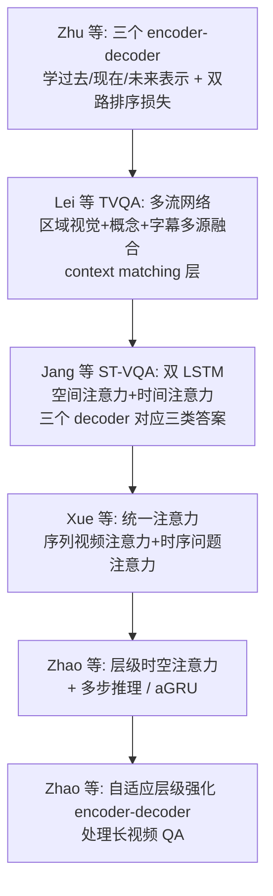

Zhu 等的双路排序损失（学视觉与问题候选的相似度）：

$$
\begin{aligned}
\text{Loss} &= \min_\theta \sum \lambda l_{\text{word}} + (1-\lambda) l_{\text{sent}}, \quad \lambda \in [0,1] \\
l_{\text{word}} &= \max(0, \alpha - v_p^T p_j + v_p^T p_{j'}) \\
l_{\text{sent}} &= \max(0, \beta - v_s^T s_j + v_s^T s_{j'})
\end{aligned}
\tag{4.27}
$$

- 这是 **hinge / 排序损失**：让正确候选 $p_j$ 的相似度比错误候选 $p_{j'}$ 高出至少 margin $\alpha$。
- ⚠️ 通病：答案生成与视频表示**分开训练**，模型难以推理文本-视频关系。

ST-VQA 的**空间注意力**决定看帧内哪些区域，**时间注意力**决定看哪些帧——这是"时空推理"的标准配方。Zhao 等的自适应 GRU（aGRU）用门控 $\beta_j$ 更新隐状态（式 4.33），实现帧级自适应。

### 4.1.3.3 因果干预：鲁棒可信的事件级 QA 推理（CMCIR）

这是中山大学 HCP 实验室的重点工作，也是全章方法论的一个亮点。

🔬 **问题的根源**：现有跨模态 QA 方法学到的是**混淆因子（confounder）导致的浅层关联**，而不是真正的因果结构。例如训练集里 Person 和 Motorbike 频繁共现，测试样本又与车辆/事故高度相关，模型就会走"红色路径"（confounder 引入的偏置推理），而非"绿色路径"（真正的因果）。

**Judea Pearl（图灵奖）的因果三层级**：
1. **关联（association）**——现有深度学习停留在这层。
2. **干预（intervention）**
3. **反事实（counterfactuals）**——如"如果那个人没骑摩托车过街会怎样？"

**CMCIR（Cross-Modal Causal Relational Reasoning）** 基于因果图建模 QA 推理，三大模块：

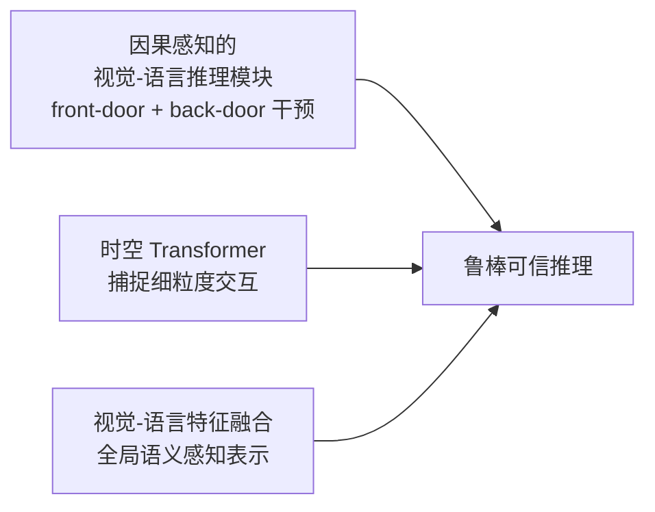

- **视觉前门干预（visual front-door intervention）** + **语言后门干预（linguistic back-door intervention）**：这两个因果干预操作用来切断混淆因子引入的**虚假关联（spurious correlation）**，只保留真实因果效应（图 4.20 里的"绿色路径"）。
- 在 SUTD-TrafficQA / TGIF-QA / MSVD-QA / MSRVTT-QA 四个数据集上验证，是**首个在事件级 QA 探索跨模态因果发现的工作**。
- 已集成进开源框架 **CausalVLR**（第 5 章会讲）。

> 💡 **面试高频**：为什么深度学习模型缺乏鲁棒性和可解释性？从因果角度答：它们倾向于捕捉低层**关联**而非底层**因果**，被混淆因子带偏。解法是引入因果干预（前门/后门），把虚假关联剔除。

## 4.1.5 VQA 未来方向

作者给出三个方向（也是行业落地的痛点）：

1. **可解释 QA**：现有模型是黑盒，注意力图只是热力图，没有清晰的推理链。可信系统要能给出可信解释。
2. **偏置消除**：难点在于——有些"偏置"是有害的语言/视觉先验（绿苹果被答成红色），有些"偏置"其实是**常识/自然规律**（狗是动物、橙子是橙色），对模型有益。**如何过滤真正的负面偏置**是挑战。
3. **更多应用场景**：教育、驾驶、飞行、潜水等场景的 VQA；医疗 VQA（回答医生/患者问题）；机器人具身 VQA。

> 💡 **图文检索在哪里？** VQA 本身不是检索，但**知识型 VQA**（KBVQA/FVQA/OKVQA）内含"从知识库检索"、**检索式对话系统**、**具身里的目标检索/图像导航**都是检索的体现。本章把"检索"这一能力融进了各任务而非单列一节。

---

# 4.2 AIGC（AI-Generated Content）

## 4.2.1 是什么 & 技术全景

**AIGC 的目标**：生成与人类意图**严格对齐**的高保真视觉内容（图像、视频、神经辐射场 NeRF、3D 点云等）。**意图作为输入条件**喂给生成模型——类别标签、文本、bounding box、布局掩码等。由于开放文本描述的灵活性，**文本条件生成**（text-to-image/video/3D）成为主线。

AIGC 的技术全景（图 4.21）：

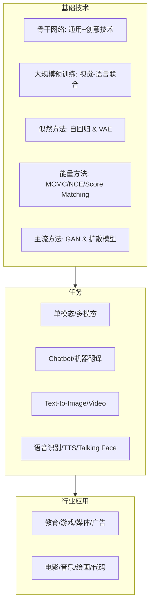

⚠️ **认知纠偏**：ChatGPT 只是众多 AIGC 任务里的**一个工具**，不等于 AIGC 全部。作者反问：GPT-5 能否统一所有 AIGC 任务实现多样化创作？要回答，需系统审视所有 AIGC 任务。

## 4.2.2 两大基石：GAN 与扩散模型

### GAN（生成对抗网络）

Goodfellow 2014 提出，LeCun 誉为"过去 10 年机器学习最有趣的想法"。结构：**判别器 D + 生成器 G**。D 分辨真假图，G 骗过 D。目标是让生成分布 $p_g$ 逼近真实数据分布 $p_{\text{data}}$，通过 minimax 博弈：

$$\min_G \max_D \; \mathbb{E}_{x \sim p_{\text{data}}} \log[D(x)] + \mathbb{E}_{z \sim p_z} \log[1 - D(G(z))] \tag{4.34}$$

**逐行**：
- D 最大化"给真实图和生成图分配正确标签"的概率。
- G 最小化 $\log(1 - D(G(z)))$，即让 D 误判生成图为真。
- ⚠️ GAN 通病：**训练不稳定 + 生成多样性低**（源于对抗训练本质）。
- 🔬 GAN 学**隐式**数据分布；自回归模型学**显式**分布（由模型结构的先验控制）——这是根本区别。

### 扩散模型（Diffusion Model / DDPM）

近年爆发式增长，也叫去噪扩散概率模型（DDPM）或基于分数的生成模型。灵感来自**非平衡热力学**——定义为参数化的 Markov 链，前向逐步加噪、反向学去噪。

**前向扩散**（逐步加高斯噪声）：

$$q(x_{1:T} \mid x_0) := \prod_{t=1}^T q(x_t \mid x_{t-1}), \quad q(x_t \mid x_{t-1}) := \mathcal{N}\big(x_t; \sqrt{1-\beta_t}\, x_{t-1}, \beta_t I\big) \tag{4.35}$$

**任意步的闭式解**（用 $\alpha_t := 1-\beta_t$，$\bar\alpha_t := \prod_{s=0}^t \alpha_s$）：

$$q(x_t \mid x_0) := \mathcal{N}\big(x_t; \sqrt{\bar\alpha_t}\, x_0, (1-\bar\alpha_t)I\big) \tag{4.36}$$

- **这一步是扩散模型的关键便利**：不用逐步加噪，可**一步跳到任意噪声级** $t$，训练时随机采 $t$ 即可。

**反向去噪**训练目标（预测噪声）：

$$\mathbb{E}_{t \sim U(1,T),\, x_0 \sim q(x_0),\, \epsilon \sim \mathcal{N}(0,I)}\; \lambda(t)\, \|\epsilon - \epsilon_\theta(x_t, t)\|^2 \tag{4.37}$$

- 网络 $\epsilon_\theta$ 学着从带噪图 $x_t$ 预测加进去的噪声 $\epsilon$。
- ⚠️ **代价**：前向/反向通常需**上千步**，生成慢（这是扩散模型的主要缺点，也是后续加速研究的动机）。

| | GAN | 扩散模型 |
|---|---|---|
| 训练稳定性 | 差（易 mode collapse） | 好 |
| 生成质量/多样性 | 质量高、多样性低 | 质量高、多样性好 |
| 采样速度 | **快**（一次前向） | **慢**（上千步） |
| 分布类型 | 隐式 | 显式（可算似然近似） |

> 💡 **面试高频**：扩散模型式 4.36 为什么重要？答：它给出前向过程任意步的闭式高斯，训练时可直接采样任意 $t$ 的带噪图，无需真的迭代加噪，极大提升训练效率。

## 4.2.3 文本生成（Text Generation）

NLP 两大基本任务：理解 + 生成。文本生成朝两个方向演进：**可控性**和**多模态**。

### 4.2.3.1 Text-to-Text

**1. 对话系统（Chatbots）**

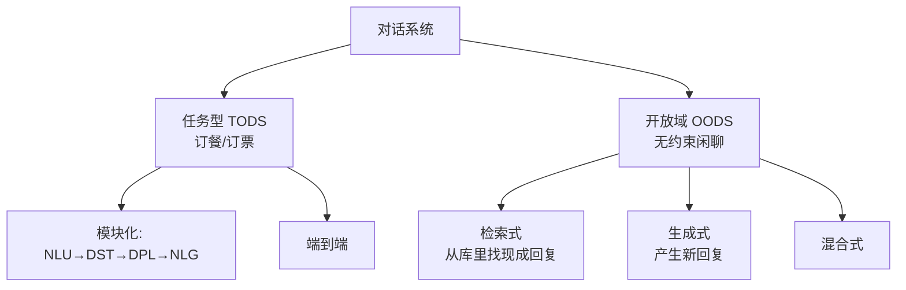

- **任务型 TODS**：模块化四件套——自然语言理解(NLU)、对话状态跟踪(DST)、对话策略学习(DPL)、自然语言生成(NLG)。可控，但部分模块不可微，单模块改进不一定提升整体。
- **开放域 OODS**：三类——**检索式**（从库里找现成回复）、**生成式**（可产生训练集没有的回复）、**混合式**。**ChatGPT 属于开放域对话系统**，还能写论文、debug、生成表格。

> 💡 **检索在这里**：retrieval-based 对话系统就是图文/文本"检索"能力的直接体现——从响应库里检索最匹配的回复。

**2. 机器翻译（Machine Translation）**

演进：规则 → 统计 → **神经机器翻译（NMT）**。里程碑：
- **Seq2Seq**：首个把 encoder-decoder RNN 用于翻译，但长句性能下降。
- **注意力机制**：通过词对齐翻译长句，Google 2016 系统比短语系统减少约 60% 人工。
- **CNN（Convolutional Seq2Seq）**：让 CNN 兼容注意力，性能媲美甚至超 RNN。
- **Transformer**：最终超越前者，成为主流。
- **预训练**：BERT/RoBERTa 初始化权重显著提升英德翻译；GPT 系列不微调也有竞争力；ChatGPT 媲美 Google Translate。

### 4.2.3.2 多模态文本生成

**1. Image-to-Text（图像描述 Image Captioning）**

里程碑 **NIC（Neural Image Caption）**：CNN 编码器提图像高层表示 → RNN 解码器生成描述。这个 encoder-decoder 架构被广泛沿用，分为**视觉编码**和**语言解码**两部分。

| 部分 | 演进 |
|---|---|
| **视觉编码** | 全局特征(GoogleNet/AlexNet/VGG) → 网格/区域注意力 → 图神经网络编码语义空间关系 → 自注意力/ViT 连接所有元素 |
| **语言解码** | RNN → Transformer；部分工作用 BERT 式结构在早期就融合图文（单模型共享空间） |

**2. Speech-to-Text（自动语音识别 ASR）**

从 1950 年代至今，HMM → 深度神经网络。研究话题：
- **特征提取**：时域（小波变换）、频域（最常用 **MFCC** 梅尔倒谱系数）。
- **pipeline**：多模型系统（声学模型 + 语言模型）→ **端到端**（直接从音频预测转录）。
- ⚠️ **端到端的挑战**：低资源语言难、泛化差、训练数据偏置影响特定人群准确率。
- **低资源方案**：多任务学习共享编码器、**自监督 ASR**（先在海量无标注语音预训练，再小数据微调）。

## 4.2.4 图像生成（Image Generation）

按输入控制方式分类：**图像控制图像**（同模态，如超分/去模糊/编辑/翻译，灵活性低）vs **文本引导**（跨模态，任意风格，灵活性高）。

### 4.2.4.1 Image-to-Image

**(1) 图像修复（Image Restoration）**

🔬 **本质**：典型**逆问题（inverse problem）**——从退化图恢复清晰图，是**病态（ill-posed）**的，因为退化图到清晰图有无穷多映射。

退化两来源：原图信息丢失 + 加了干扰。两类任务：超分/修复/上色 vs 去噪/去雨/去雾/去模糊。

演进：数学统计建模（空间滤波器/核估计）→ **深度学习**（CNN → Transformer → CNN+Transformer 结合）→ **生成式**（GAN 保留高频细节但易不稳定/mode collapse → **扩散模型**）。趋势：从**单任务**到**多退化统一处理**。

**(2) 图像编辑（Image Editing）**

与修复（提升质量）不同，编辑是**按需修改语义**（内容/风格/属性）。

- **属性编辑**：改人脸的发型/年龄/性别。优化法（慢）→ 学习法（单属性 → 多属性）→ 无监督解耦属性。
- **两图合成**：图像变形（morphing，插值内容）、**风格迁移**（内容来自 A、风格来自 B）。像素空间插值有伪影，**隐空间插值**更平滑（靠 GAN inversion 求隐编码）。
- **StyleGAN**：从初始层到最终层**由粗到细**控制属性（结构→纹理），混合两图的初始层(内容)和最终层(风格)即可风格迁移。
- **扩散编辑**：DiffusionCLIP（微调对齐文本）、LDEdit（免微调）、DiffEdit（自动预测编辑掩码）。

### 4.2.4.2 多模态图像生成

**1. Text-to-Image（T2I）** —— AIGC 最热任务，三大分支：

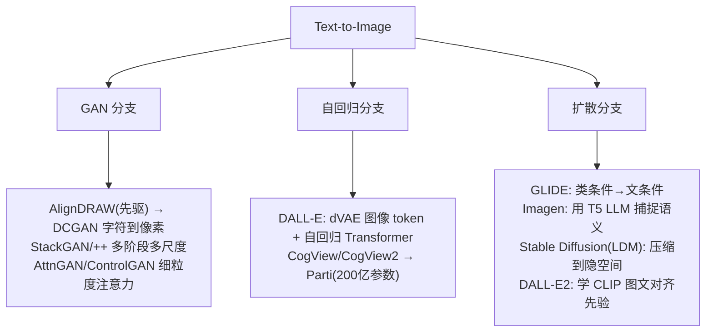

**关键模型速记**：

| 模型 | 路线 | 一句话创新 |
|---|---|---|
| **DALL-E** | 自回归 | dVAE 把图转 token，自回归 Transformer 学图文联合分布 |
| **Parti** | 自回归 | 参数 scale 到 **200 亿**提质量 |
| **GLIDE** | 扩散（像素） | 把类条件扩散扩展到文本条件，超 DALL-E |
| **Imagen** | 扩散（像素） | 用预训练 **T5 LLM** 捕捉文本语义 |
| **Stable Diffusion (LDM)** | 扩散（隐空间） | 先压缩到低维隐空间再扩散，**大幅降算力** |
| **DALL-E2** | 扩散 | 学 **CLIP** 图像/文本空间的对齐先验 |

> 💡 **面试高频**：Stable Diffusion 相比 GLIDE/Imagen 的关键优化？答：在**隐空间（latent space）**而非像素空间做扩散——先用自编码器把高分辨图压到低维隐空间，训练/推理算力大降，这就是 Latent Diffusion Model (LDM)。

**2. Talking Face（说话人脸）**

给一张人脸 + 一段音频，生成对口型的说话视频。作者把它归为**多模态图像生成**（因为像图像编辑：以人脸为身份参考，按音频编辑）。分 **2D 法**（靠 landmark/语义图）和 **3D 法**（3DMM 参数如 BlendShape/Flame、NeRF 隐式表示，成本高）。

## 4.2.5 视频生成（Video Generation）

⚠️ **为什么比图像难**：不仅要生成像素，还要保证**帧间语义一致性**，建模高维视频数据复杂。

分类：**无引导** vs **引导**（文本引导 / 图像引导 / 视频引导，文本引导最受关注）。

- **无引导**：早期只能生成单调规则内容（海浪等动态纹理）→ 逐步扩展到真实视频（但限于简单场景低分辨短视频）。
- **文本引导**：VAE/GAN（简单场景如弹跳数字）→ VQ-VAE 扩展 → **扩散模型**（首次设新基准）→ **Make-a-Video（Meta）**、**Imagen Video（Google）**。
  - Make-a-Video：把文生图扩散扩展到视频，**无需配对文-视频数据**，但需大规模数据微调、算力大。
  - **Tune-a-Video**：单个文-视频对训练开放域生成器（one-shot）。

## 4.2.6 3D 数据生成（3D Data Generation）

3D 表示多样：深度图、体素网格、点云、网格、神经场。按输入分：Text-to-3D / Image-to-3D / 3D-to-3D。

- ⚠️ **核心挑战**：**缺 3D 数据 + 缺合适结构**。
- **DreamFusion**：用预训练文生图模型解决 3D 数据稀缺（基于扩散）。
- **NeRF（神经辐射场）**：多视图 3D 重建新分支，用 MLP **隐式表示** 3D 信息，存储 3D 坐标 + 外观信息。
- **3D-to-3D**：补全、变换（3D 检索是代表性变换任务）。

## 4.2.7 HCP-Diffusion 统一代码框架

这是中山大学 HCP 实验室的开源工程贡献，解决扩散模型代码**碎片化、迁移难、门槛高**的痛点。

🔬 **设计哲学**：用**统一格式的配置文件**协调组件和算法，开发者像搭积木一样组合 LoRA、DreamArtist、ControlNet，**只改配置文件不改代码**。

**六大功能模块**：

| 模块 | 关键能力 |
|---|---|
| **框架特性** | 统一结构、算子插件(DeepSpeed/Colossal-AI/Offload)、一键配置、一键训练(Web UI) |
| **数据模块** | 多并行数据集、自动长宽比聚类(不用手动对齐尺寸)、兼容 TorchVision/Albumentations、灵活 Prompt 模板、TagDropout/TagShuffle 文本增强 |
| **模型框架** | 模块化 Diffusion 训练算法；四类插件见下表 |
| **训练推理** | 配置文件可定义自动实例化的 Python 对象，集成任意 pip 模块（优化器/损失/采样器） |
| **加速优化** | Accelerate/DeepSpeed/Colossal-AI、EMA；推理支持 offload + VAE tiling，**仅 1GB 显存即可生成** |
| **Web UI** | 图形界面做图像生成、模型训练，降学习曲线 |

**四类插件**（把 LoRA/ControlNet 等 Adapter 类算法统一抽象）：

| 插件 | 特点 | 例子 |
|---|---|---|
| SinglePluginBlock | 单层，按层输入改输出 | LoRA 系列 |
| PluginBlock | 一入一出层 | 残差连接 |
| MultiPluginBlock | 多入多出层 | ControlNet |
| WrapPluginBlock | 替换原模型某层 | — |

> 💡 **工程价值**：HCP-Diffusion 把"方法定义、训练逻辑、推理逻辑"彻底解耦，学术研究与工程部署无缝切换，是国内实验室做"统一框架"的典范。

## 4.2.8 AIGC 的挑战与展望

**挑战**：
1. **缺可解释性**：模型产出不理想内容时难以控制。
2. **伦理与法律**：数据偏置（如只训中文文本会对西方文化有偏）、版权侵权、隐私、恶意使用（学生作弊）、政治误导——需 AI 内容检测器。
3. **领域特定技术挑战**：Stable Diffusion 会生成偏离预期的内容（人画成动物、重复人像），ChatBot 会事实错误。

**展望**：
1. **更灵活的控制**：从 GAN 高质量但难控 → 扩散靠文本 prompt 控制 → 需更细粒度控制。
2. **从预训练到微调**：当前重预训练，下游任务微调尚未充分探索。

---

# 4.3 具身智能（Embodied Intelligence）

## 4.3.1 是什么 & 为什么重要

🔬 **核心命题**：Embodied Intelligence 认为**真正的智能源于 agent 与环境的交互**（intelligence emerges from agent-environment interactions），而非被动地消化互联网数据。

**被动 AI vs 具身 AI**（图 4.38）：

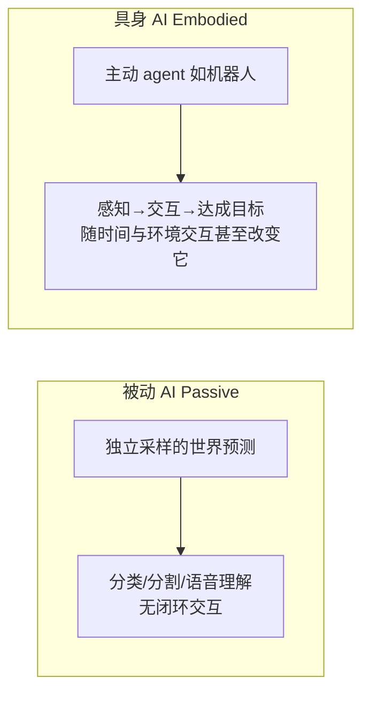

具身智能要求 agent 能：**看（see/perceive）、说（speak）、听（listen）、行动（act，导航+交互）、推理（reason，考虑长期后果）**。它必须主动应对**噪声、环境变化、其他 agent 的干扰**——这些都违反了游戏、流水线那种"干净动态"。

**核心技术**（与多领域交叉但独立）：
- 机器人系统都是具身的，但**不是所有具身系统都是机器人**（如 AR 眼镜）。
- 具身智能在真实环境探索智能属性，同时抽象掉底层控制细节。例：ALFRED 基准里 agent 执行"open/pick up"高层动作（只要看到物体且够近），而机器人学直接关注底层控制/实时响应/传感器处理。

**为什么要真实交互环境**：
1. 真实环境的挑战对开发可部署系统是**必需的**。
2. 只有在尽可能接近现实的环境里解决问题，才能发现处理真实世界所需的智能属性。

## 4.3.2 具身智能模拟器（Simulators）

作者对比了 **9 个模拟器**：DeepMind Lab、AI2-THOR、CHALET、VirtualHome、VRKitchen、Habitat-Sim、iGibson、SAPIEN、ThreeDWorld。它们不同于纯 RL 游戏模拟器——提供真实世界的**逼真表示**，通常含物理引擎 + Python API + 可控 agent。

**7 大技术特征**（评估模拟器的维度）：

| 特征 | 取值 | 说明 |
|---|---|---|
| **Environment（环境）** | Game(G) / World(W) | G 用 3D 资产搭建、物体分割清晰；W 扫描真实环境、保真度高利于 Sim-to-Real |
| **Physics（物理）** | 基础 / 高级 | 基础=碰撞/刚体/重力；高级=布/流体/软体（仅 ThreeDWorld 有） |
| **Object Types（物体来源）** | Dataset(D) / Resource(O) | D 来自 SUNCG/Matterport3D/Gibson（贵但质量保证）；O 来自 Unity 资产商店 |
| **Object Attributes（物体属性）** | 交互(I) / 多状态(M) | M 如苹果被切变成苹果片（AI2-THOR、VRKitchen 支持） |
| **Controller（控制器）** | Python API(P) / 虚拟机器人(R) / VR(V) | R 可用 ROS 直控 UR5/TurtleBot 等真实机器人 |
| **Actions（动作）** | 导航(N) / 原子动作(A) / 人类交互(H) | N 所有模拟器都有；H 需 VR 控制器 + 人类级灵巧度 |
| **Multi-Agent（多智能体）** | 角色型(AT) / 用户型(U) | 仅 AI2-THOR/iGibson/ThreeDWorld 支持 |

**三个二级评估特征**（AI2-THOR、iGibson、Habitat-Sim 三者全占，故最流行）：

- **真实性（Realism）**：环境保真度 + 物理属性真实度。
- **可扩展性（Scalability）**：取决于物体类型（D 靠扫更多真实场景扩展，O 靠买更多资产）。
- **交互性（Interactivity）**：受物体属性、控制器、动作、多智能体影响。

> 💡 **对比结论**：AI2-THOR 环境规模最大；Habitat-Sim 和 iGibson 图形渲染性能最高。

## 4.3.3–4.3.6 具身智能四大研究任务（金字塔结构）

作者提出一个**金字塔结构**——每个任务是下一个的基础：

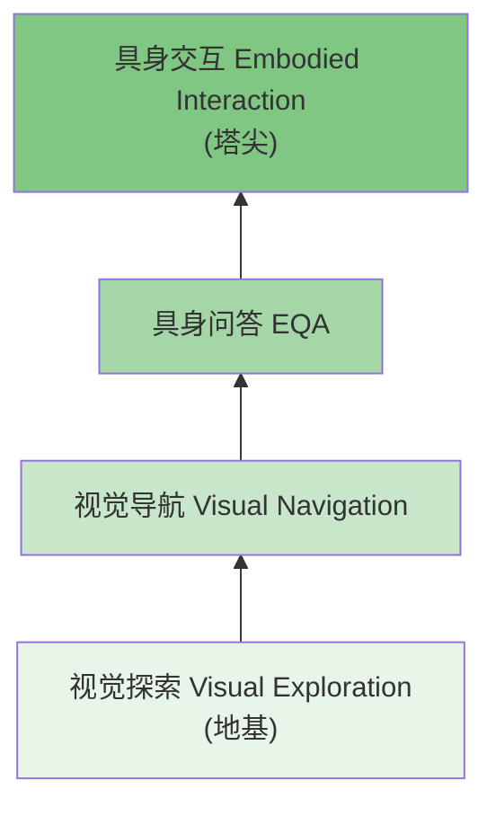

### 4.3.3 视觉探索（Visual Exploration）

agent 在探索前对环境几乎无先验，要高效收集信息、构建环境表示（地图/记忆）。三类方法：

| 方法 | 核心思想 | 关键挑战/技术 |
|---|---|---|
| **好奇心驱动（Curiosity-Driven）** | 寻找难预测的状态，**预测误差当奖励**（内在动机） | ⚠️ **"noisy TV" 问题**：前向动力学模型可利用随机性刷高预测误差骗奖励。解法：逆动力学模型、Random Distillation Network、disagreement(集成方差) |
| **覆盖（Coverage）** | 最大化直接观测到的目标数量（如已见区域） | 结合经典+学习：分析式路径规划 + 学习式 SLAM 维护空间图；Scene Memory Transformer 用自注意力 |
| **重建（Reconstruction）** | 从已观测视角重建其他视角 | 像素级(360°全景/CAD) → 具身 RGB-D 占据重建 → **语义重建**（预测查询位置有无"门"等概念） |

**好奇心驱动的形式化**：用前向动力学模型最小化 $L(\hat{s}_{t+1}, s_{t+1})$——$\hat{s}_{t+1}$ 是 agent 在状态 $s_t$ 采动作 $a_t$ 后的预测下一状态，$s_{t+1}$ 是实际下一状态。误差越大奖励越高。用 PPO 优化策略。

⚠️ **noisy TV 问题**（面试爱问）：一个 agent 用遥控器随机换台，画面永远难预测，于是它就一直盯着电视换台刷奖励，却毫无长进。这是内在奖励设计的经典陷阱。

**评估指标**：① 访问目标计数（已访问面积 m² / 探索区域百分比）；② 下游任务性能（点/图像/目标导航）。**数据集**：Matterport 3D、Gibson V1（真实 RGB，含深度图 + 语义分割）。

### 4.3.4 视觉导航（Visual Navigation）

agent 导航到 3D 环境中的目标点，可带/不带先验信息或语言指令。目标类型：点、物体、图像、区域。

**传统 vs 学习式**：
- 传统：手工子组件（定位、建图、路径规划、运动控制）。
- 学习式：从数据学导航系统，对传感器噪声更鲁棒，能泛化到未见环境。
- 混合：结合两者优势。

**三大挑战赛**（都限于 egocentric RGB-D）：iGibson Sim2Real Challenge（点导航）、Habitat Challenge（点+目标导航）、RoboTHOR Challenge（目标导航，含真实世界公寓测试）。

#### 点导航（Point Navigation）

agent 从原点 $(0,0,0)$ 出发，导航到相对坐标 $(x,y,z)$ 附近。常配 **GPS + 罗盘**。演进：

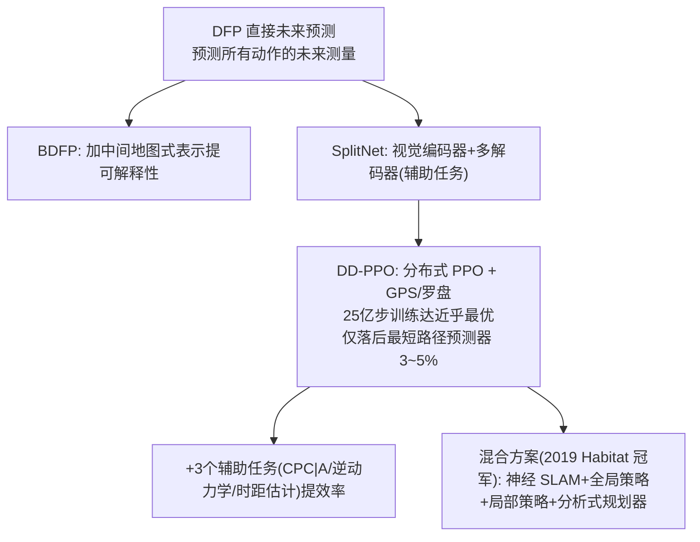

🔬 **DD-PPO 的启示**（"存在性证明"）：给足 GPS/罗盘 + 海量训练步（25 亿步 vs 初版 7500 万步），agent 能在点导航上达到**近乎完美**（仅落后最短路径预测器 3~5%）。说明**规模 + 合适传感器**能解决点导航。

#### 目标导航（Object Navigation）

导航到标签指定类别的物体。**比点导航更难**——不仅需视觉感知/情景记忆，还需**语义理解**。方法：
- **自适应**（元强化学习）：agent 推理时也能自监督调整、纠错。
- **物体关系图（ORG）**：探索中构建，编码类别相似性、空间相关性。
- **先验增强导航**：注入知识图谱/音频等多模态先验（如"在厨房找苹果先去逻辑位置"）、声源导航（视听协调）。

#### 视觉-语言导航（VLN）

按自然语言指令导航。与 VQA 的区别：VLN **序列更长、视觉数据连续输入、需相机视角控制**，而 VQA 只处理单个问题生成答案。

- **辅助推理导航（Auxiliary Reasoning Navigation）**：四个辅助任务——轨迹复述、进度估计、角度预测、跨模态匹配。
- **视觉-对话导航（Vision-and-Dialogue Navigation）**：VLN 的扩展，agent 与人**持续对话**辅助导航；用**跨模态记忆网络（CMN）**分离语言/视觉记忆模块。

**评估指标**：

| 指标 | 定义 |
|---|---|
| **SPL**（最重要） | $\text{SPL} = \frac{1}{N}\sum_{i=1}^N S_i \frac{l_i}{\max(p_i, l_i)}$，兼顾成功与路径效率 |
| 成功率 | agent 在规定时间到达目标的比例 |
| 路径长度比 | 预测路径长 / 最短路径长（仅成功回合） |
| 导航误差 | agent 最终位置到成功阈值边界的距离 |
| （VLN 额外）优化成功率、轨迹长度 | agent 是否停在轨迹上最接近目标的点 |
| （对话导航额外）目标进度、优化路径成功率 | — |

**SPL 逐项**：$S_i$ 成功指示、$p_i$ agent 路径长、$l_i$ 最短路径长。分子 $S_i l_i / \max(p_i,l_i)$——成功且走得越接近最短路径，得分越接近 1。

**数据集**：点/目标导航用 Matterport 3D、Gibson V1；VLN 用 **Room-to-Room (R2R)**（21,567 条指令，平均 29 词）；对话导航用 **CVDN**（2,050 段人-人对话，7000+ 轨迹）。

### 4.3.5 具身问答（Embodied Question Answering, EQA）

🔬 **EQA 是当前具身智能最苛刻、最复杂的任务**——需视觉识别、语言理解、问答、常识推理、任务规划、目标驱动导航全套能力。agent 必须**先探索环境观察物体，再回答问题**。

框架把 EQA 分成**导航 + 问答**两个子任务：

| 模型 | 创新 |
|---|---|
| **PACMAN**（Das 等） | Planner-Controller 分层：planner 选方向、controller 定移动距离；导航与 VQA 先分开训，再用 REINFORCE 联合 |
| **NMC**（神经模块控制） | 高层 master policy 提语义子目标，由子策略执行 |
| **MT-EQA**（多目标 EQA） | 处理多目标问题，如"卧室的苹果比客厅的橙子大吗？"——需导航到两个房间比较 |
| **IQA**（交互式 QA） | agent 需**与物体交互**才能回答（如开冰箱看有没有鸡蛋）；用 HIMN 分层交互记忆网络 |
| **多智能体 IQA**（Tan 等） | 多 agent 协作探索，共享 3D 场景记忆 |

**评估指标**：导航子任务用导航误差 $d_T$、目标进度 $d_\Delta$、最小距离 $d_{\min}$、%stop、%$r_T$、%$r_e$、IoU、命中准确率 $h_T$、轨迹长；问答子任务用**正确答案平均排名 + 准确率**。

**数据集**：EQA（基于 House3D/SUNCG，5000 问 / 750 环境）、MT-EQA（6 类组合比较问题）、IQUAD V1（75,000 多选题，含存在/计数/空间关系）。

### 4.3.6 具身交互（Embodied Interaction）—— 塔尖任务

agent 与**人类协作**完成任务。人类参与能引导监督 agent，确保安全、合法、符合伦理，还能弥补数据不足。两种范式：

- **非对称交互（Instructor-Executor）**：人是指导者、agent 是执行者（助手）。
- **对称交互（Equal-Partner）**：agent 达到与人平等，共同参与。

#### 三大标志性具身交互模型

**1. Robotics Transformer 系列（Google）**

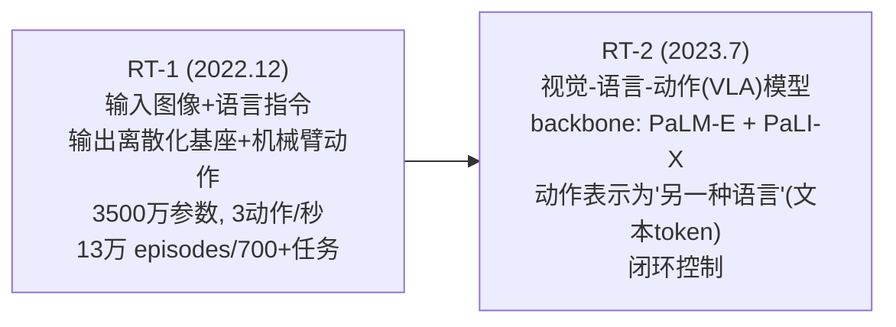

- **RT-1**：多任务模型，机器人输入输出都表达为 **token**，高效实时推理。130,000 episodes、700+ 任务、13 台 Everyday Robots 采集 17 个月。
- **RT-2**：**VLA（vision-language-action）模型**，从网络 + 机器人数据学习，把知识翻译成机器人控制指令。**关键创新**：用视觉-语言模型 PaLM-E + PaLI-X 当 backbone。
  - 🔬 **常识推理的威力**：抓训练里见过的物体，RT-2 ≈ RT-1；但抓**未见物体**成功率从 **32% 跃升到 62%**——这就是从 VLM 迁移来的语义理解和推理能力。

> 💡 **面试高频**：RT-2 为什么泛化到未见物体的能力强？答：它把机器人动作表示成文本 token，与 web 级视觉-语言数据一起训练，从而继承了 VLM 的泛化、语义理解、推理能力（迁移到机器人控制）。

**2. VoxPoser（李飞飞团队，Stanford，2023.7）**

- **目标**：给开放指令 + 物体集，合成机器人轨迹（密集 6-DoF 末端执行器路点序列）。
- **机制**：基于 RGB-D 观测 + 语言指令，**LLM 生成代码**与视觉-语言模型交互，产出 3D **可供性图（affordance map）+ 约束图**（合称 value maps），作为动作规划器的目标函数合成轨迹。
- 🔬 **亮点**：**全程无需额外训练**（no additional training）——把 LLM 的可执行知识直接提取成规划。

**3. RoboAgent（Meta + CMU，两年研发）**

- 仅用 **7,500 条轨迹**训练，38 个任务展现 12 种复杂技能（烘焙、倒茶、清洁厨房等），泛化到 100 个未见场景。
- 四大模块：**RoboPen**（分布式机器人基础设施）、**RoboHive**（仿真+真实统一框架）、**RoboSet**（多样技能数据集）、**MT-ACT**（Multi-Task Action Chunking Transformer，语言条件多任务离线模仿学习——用语义增强扩充数据集）。
- ⚠️ **两大挑战**：① **因果困境**——缺训练数据 vs 缺能生成数据的通用 agent，鸡生蛋问题；② **打破恶性循环**——需一个能在实际数据预算下学多技能、泛化到未见场景的范式。

## 4.3.7 具身智能的现存挑战

**未来研究视角**：作者提出金字塔下一层可能是 **TIQA（Task-oriented Interactive Question Answering，任务导向交互问答）**——结合任务执行与回答，如"煮鸡蛋要多久？橱柜里有苹果吗？"这类必须先动手做任务才能答的问题。TIQA 可能是通向通用任务规划、仿真中开发通用 AI 并部署到真实世界的关键。

**三大挑战维度**：

| 维度 | 挑战 |
|---|---|
| **真实性** | 缺乏"世界级场景 + 高级物理"兼备的模拟器；仅 Habitat-Sim/iGibson 是 world-based（利于 Sim-to-Real），仅 ThreeDWorld 有高级物理 |
| **可扩展性** | 3D 场景/物体资源收集难——光度扫描（Matterport 3D 扫描仪）昂贵、不易大规模 |
| **交互性** | 需在"物体属性功能性"与"动作复杂度"间平衡；game-based 多为符号交互，world-based 只有粗粒度运动控制 |

**研究挑战**：
- **记忆结构**：长轨迹 + 多输入类型，agent 的记忆容量与内部表示至关重要；RNN 捕捉长期依赖有局限，但哪种记忆更好仍难定论。
- **任务复杂度指数增长**：每加一个组件（如语言理解）训练难度指数上升 → 催生两趋势：① **经典+学习混合**（降搜索空间/样本复杂度）；② **先验知识集成**。
- **多智能体研究不足**：缺多智能体模拟器 → 现实中普遍的协作/通信系统受关注少。

---

# 4.4 本章小结 📌

本章围绕三大典型应用，串起了多模态大模型从"理解"到"生成"到"行动"的完整落地图谱：

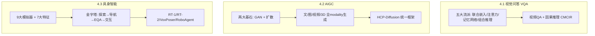

**核心 takeaways**：

1. **图文问答（VQA）**：从联合嵌入的简单融合，到注意力"看哪里+听哪里"，到记忆网络处理长尾，到模块化组合推理，再到用**因果干预（front-door/back-door）**做鲁棒可信推理——一条"从关联走向因果"的进化线。去偏（VQA-v2 互补图）是评估"真看图"的关键。

2. **AIGC**：**扩散模型**已全面接棒 GAN 成为主流（式 4.36 的任意步闭式是训练效率关键）。文生图三分支（GAN/自回归/扩散）中，**LDM（Stable Diffusion）**的隐空间扩散是算力优化的里程碑。生成能力已覆盖文本、图像、视频、3D 全模态。

3. **具身智能**：真正的智能源于**agent-环境交互**。四大任务呈金字塔递进，**Sim-to-Real** 是核心难题。RT-2 用 **VLA 范式**把 VLM 的泛化能力迁移到机器人控制，VoxPoser 用 **LLM 生成代码**免训练规划——大模型正成为具身智能的"大脑"。

4. **行业应用贯穿全章**：医疗 VQA、交通因果推理、机器人操作、创意生成（绘画/电影/音乐）、教育——多模态大模型的落地已渗透各行各业。

**留给下一章的悬念**：作者在章末发问——这些突破是否意味着 **AGI 近在咫尺**？我们离 AGI 还有多远？第 5 章将揭晓答案。

---

# 🔗 延伸阅读

**VQA 经典论文**：
- VQA / VQA 2.0（去偏数据集）、CLEVR（组合推理诊断）
- SAN（Stacked Attention）、HieCoAtt（协同注意力）、MCB/MLB（双线性池化）
- NMN / D-NMN（神经模块网络）
- CMCIR + CausalVLR（中山大学 HCP 因果推理框架，第 5.2.5 节详述）

**AIGC 里程碑**：
- GAN（Goodfellow 2014）、DDPM（扩散模型）
- DALL-E / DALL-E2 / Imagen / Stable Diffusion (LDM) / Parti
- Make-a-Video / Imagen Video / Tune-a-Video（视频生成）
- DreamFusion / NeRF（3D 生成）
- **HCP-Diffusion**（中山大学 HCP 开源统一框架）

**具身智能**：
- 模拟器：AI2-THOR、Habitat-Sim、iGibson、ThreeDWorld
- 导航：DD-PPO、R2R、CVDN
- EQA：PACMAN、MT-EQA、IQA / HIMN
- 交互：**RT-1 / RT-2（Google VLA）**、**VoxPoser（李飞飞团队）**、**RoboAgent（Meta+CMU）**

**跨章关联**：
- 第 3 章：多模态大模型架构与预训练（本章应用的技术底座）
- 第 5 章：AGI 之路 + CausalVLR 因果开源框架
- 与 llm-action 仓库 `llm-inference/` 目录的推理优化、`ai-infra/` 的算子实现可对照阅读

> 💡 **学习建议**：本章方法众多，建议按"三条主线各抓一个代表深挖"——VQA 抓 SAN（注意力鼻祖）、AIGC 抓 Stable Diffusion（隐空间扩散）、具身抓 RT-2（VLA 范式），把这三个吃透，再横向铺开其余方法，事半功倍。
