# 🚀 第 5 章 多模态大模型迈向 AGI

> 本章对应原书 Chapter 5《Multimodal Large Models Toward AGI》（PDF 第 274–347 页）。这是全书的"终章 + 展望篇"：前面几章讲的是"怎么把多模态大模型做出来、做好用"，这一章要回答一个更大的问题——**多模态大模型到底能不能通向 AGI（通用人工智能）？路上还有哪些坑？有哪些技术路线值得押注？**

---

## 🗺️ 本章地图

ChatGPT 的出现，第一次让人们看到一个 AI 能同时聊天、写论文、写代码——这是"窄 AI（Narrow AI，每个模型只会一件事、没有常识）"向 AGI 迈出的一大步。但当前的 AGI 还很"弱"，作者（中山大学 HCP 实验室林倞、刘洋团队）在本章做了两件事：**先诊断问题（8 大挑战），再开药方（4 条前沿路线）**。

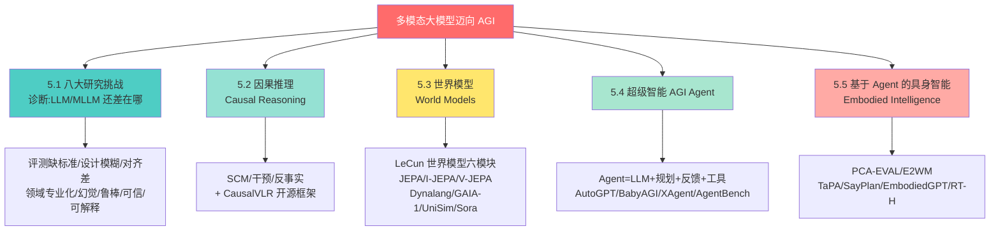

一句话总结全章逻辑：**当前 LLM/MLLM 是"缸中之脑（brain in a vat）"，只有靠"因果 + 世界模型 + Agent + 具身"这四块拼图，才能从"会说话"走向"懂世界、能行动"的 AGI。**

---

## 🌍 引子：为什么说 ChatGPT 把 AI 推向了 AGI？

**是什么。** 过去所有 AI 突破（哪怕是 AlphaGo）都属于**窄 AI（Narrow AI）**——一个模型只干一件事，没有常识。而 ChatGPT 第一次做到了：聊天、写论文、写代码……这些都需要常识甚至专业知识。它的冲击力堪比 AlphaGo，把整个领域推向了 AGI。

**为什么能做到。** 靠的是**规模定律（Scaling Laws）**：随着数据库不断丰富、硬件不断升级，只要把模型和训练数据同步放大，模型能力就能持续提升，最终诞生 LLM（大语言模型）。当模型容量跨过某个临界点，就会出现**涌现能力（Emergent Capabilities）**——这是 LLM 通向 AGI 的关键。

**代价与隐患。** 尽管成功，LLM 却被诟病**缺乏事实知识**。书里举了个经典例子：

> 问："爱因斯坦什么时候发现了引力？"
> LLM 答："爱因斯坦在 1687 年发现了引力。"

这就是**幻觉（Hallucination）**——引力是牛顿在 1687 年提出的万有引力定律，跟爱因斯坦（相对论）张冠李戴了。加上 LLM 是**黑盒**、推理过程本质是**概率的、不确定的**，即使加了思维链（Chain-of-Thought，CoT）解释，解释本身也可能是幻觉。这在医疗诊断、法律判决这类**高风险场景**是致命的。

> 💡 **第一性原理**：LLM 本质是"下一个词预测器"——它学的是**统计模式（statistical patterns）**，不是**世界的语义（semantic meaning）**。它把事实**隐式地编码在参数里**，而不是从结构化知识库里做确定性检索。所以它"记不牢事实、说得头头是道但可能全错"，是架构层面的必然，而非工程 bug。

作者由此提出全章的**总纲**：

- **8 大挑战**：缺评测标准、设计原则模糊、多模态对齐差、领域专业化不足、幻觉、鲁棒性威胁、可信度、可解释与推理。
- **4 条前沿路线**：因果推理（Causal Reasoning）、世界模型（World Models）、超级智能 AGI Agent、基于 Agent 的具身智能（Embodied Intelligence）。

---

# 📛 5.1 八大研究挑战（Research Challenges）

先给出一张全景表，后面逐条展开：

| # | 挑战 | 一句话本质 | 代表性缓解手段 |
|---|------|-----------|--------------|
| 1 | 缺评测标准 | 开放式对话没法用固定指标打分 | "LLM 当裁判"（GPT-4 打 1–10 分） |
| 2 | 设计原则模糊 | 数据/算力/性能三者难平衡 | 模型压缩（ALBERT）、鲁棒 pretext |
| 3 | 多模态对齐差 | 文本 prompt 弱于视觉 prompt | ImageBind 联合嵌入空间 |
| 4 | 领域专业化不足 | 通用 LLM 进不了专业领域 | 领域微调、In-Context Demo |
| 5 | 幻觉 | 一本正经地胡说八道 | CoT、自洽 CoT、RAG |
| 6 | 鲁棒性威胁 | 对抗样本/OOD 一击即溃 | 对抗训练、PromptBench 评测 |
| 7 | 可信度 | 编造文献、伪造判例 | 16 项可信 AGI 能力 |
| 8 | 可解释与推理 | 黑盒、逻辑/因果推理弱 | RAG、用 LLM 解释 LLM |

## 5.1.1 缺乏评测标准（Lack of Evaluation Criteria）

**问题。** 大规模对话式视觉语言模型是**开放式（open-ended）**的，很难做全面评测；视觉输入让问题更严重，因为任务太多样。

**当前做法——"用 LLM 当裁判（LLM-as-judge）"。** 定义一组覆盖各类推理的指令，把两个竞争聊天机器人的回答丢给 GPT-4 打 1–10 分。这套方法源自 **Vicuna-Instructions-80**，覆盖 9 类指令：通用、知识、数学、反事实、费米估算（Fermi）、编码、写作、角色扮演、常识。视频任务上还扩展成 5 个维度：信息正确性、细节关注度、上下文理解、时序理解、一致性。

> ⚠️ **常见坑**：把 GPT-4 当"金标准（gold standard）"本身有争议——裁判自己也会错、也有偏见。评测标准的缺失，是所有下游研究"没法公平比较"的根源。

## 5.1.2 模型设计原则模糊（Fuzziness in Model Design Criteria）

核心矛盾：**如何在数据、算力、性能之间取得平衡**。书里拆成四个子问题：

- **模型多样性（Model Diversity）**：GAN 类方法不流行，两个原因——① 判别器学到的特征表示会在训练中被"遗忘"；② **模式崩溃（Mode Collapse）**让生成器只输出单一模式样本去骗判别器。所以 GAN 做自监督预训练时，判别器收敛难、生成器发散，进展受阻。
- **模型压缩（Model Compression）**：BERT-base ≈ 1.08 亿参数、GPT-3 ≈ 1750 亿参数，从头训练门槛极高。ALBERT 是个正面例子——参数比 BERT-base 少却性能更好。但降算力成本仍是核心难题。
- **模型鲁棒性（Model Robustness）**：NLP 的"线性本质"让深度网络对**对抗输入**脆弱。有意思的对比——图像里"裁剪、旋转"不改变本质，但文本里"增、删、替换一个词"就能显著改变语义。
- **对抗抵抗（Adversarial Resistance）**：语言的**离散性（discreteness）**让对抗攻击尤其难防。

## 5.1.3 多模态对齐差（Poor Multimodal Alignment）

**问题。** 视觉与语言（及其他模态）之间对齐不好。例如 **SAM**（Segment Anything Model）对**视觉 prompt**（点、框、掩码）很强，但对**文本 prompt**很弱。异构模态间对齐更难。

**方向。** **ImageBind** 展示了跨多模态对齐的可行路径，但仍有很大提升空间。书里有个绝妙的直觉例子：

> 人看到一张食物图，不仅能认出品类，还能**回忆起它的味道、烹饪的菜谱、甚至咀嚼时的声音**。

这提示我们要建立**联合嵌入空间（joint embedding space）**的基础模型，为世界提供一个统一的表示空间。

## 5.1.4 领域专业化不足（Insufficient Domain Specialization）

**定义。** LLM 领域专业化 = 基于**领域上下文数据**定制 + **领域知识**补充 + 面向**领域目标**优化 + 受**领域约束**规制。

**为什么需要**（几个驱动因素）：不同领域（医疗处方 vs 法律文书 vs 网络闲聊）语言风格差异巨大；不同机构有各自的"业务模型（utility function）"；专业级任务要求**深度、实时、准确**的领域知识；语言还受社会规范、文化、宗教、法律、伦理约束，不可能"一招鲜吃遍天"。

**三大技术难点**：

1. **难掌握最新知识**：LLM 有**知识截止日期（knowledge cutoff）**，训练数据是离线的，做社媒分析、事实核查会力不从心，需持续学习/定期重训。
2. **难在单个 LLM 里学全所有领域专业知识**：容易产生"看似合理实则错误"的幻觉；根源是 LLM 按概率预测词序列，而非从结构化知识库给确定答案。可用少量**任务示范（demonstrations）**引导，但用户指令常模糊、且**上下文窗口有限**（书里点名 ChatGPT 只能处理 4097 tokens）。
3. **下游任务学习算力开销大**：微调需大量高质量任务数据；LLM 复杂架构易**灾难性遗忘（catastrophic forgetting）**、易过拟合目标域；GPT-3/PaLM 都超千亿参数，微调需 GPU/TPU，对个人和小团队门槛极高。

## 5.1.5 幻觉问题（Hallucination Issues）

**定义。** 幻觉 = LLM 在假设场景下生成**不真实或无意义**的输出。根源是训练在大规模**噪声**文本/图像上，难分辨事实与虚构。

**视觉语言模型的一种典型幻觉**：**忽略视觉输入**，只凭文本 prompt 生成答案（图片里根本没有的东西，它硬说有）。

**控制手段**：① 显式指令要求"只基于给定上下文作答"（如医疗病历只用可验证事实填空）；② 思维链 CoT；③ 自洽思维链（self-consistent CoT）；④ **检索增强生成（RAG，Retrieval-Augmented Generation）**结合知识库。

## 5.1.6 鲁棒性威胁（Robustness Threats）

**定义。** 鲁棒性 = 抵御干扰/外部因素、避免模型失效或输出不准的能力，对安全敏感场景（如假新闻检测）至关重要。恶意用户可能注入噪声或扰动来逃避检测。

鲁棒性威胁的表现形式：**OOD（分布外）样本、对抗输入、长尾样本、噪声输入**等。书里重点讲两类：

### 5.1.6.1 对抗鲁棒性（Adversarial Robustness）

- **本质困境**：对抗输入是**人为构造、非自然出现**的，所以基础模型训练时**永远覆盖不全所有对抗分布**。
- **解法**：把对抗样本注入训练数据；长期靠持续训练适应人类/算法生成的新对抗输入。
- **下游继承缺陷**：只做下游微调的视觉语言模型会**继承预训练模型的缺陷**，且模型越大，靠微调修复越不现实。连 **prompt 本身也可能被攻击**。

### 5.1.6.2 OOD 鲁棒性（OOD Robustness）

作者抛出一个尖锐问题：**LLM 是不是已经解决了 OOD 泛化问题？** 海量数据和参数是"双刃剑"——**过拟合 vs 泛化**。

> 🔬 **第一性原理**：直觉上，OOD 数据"没见过"，那把它加进训练集不就行了？——LLM 正是这么干的。但"数据的不合理有效性（unreasonable effectiveness of data）"真存在吗？一种解释是：ChatGPT 训练数据其实**已覆盖了与测试集相似的分布**（哪怕是 2021 年后收集的）。所以需要用**长尾领域的新数据集**做更公平的评测。而且 ID（分布内）与 OOD 性能不总是正相关，有时甚至**负相关**。

**PromptBench 评测基准**：专门测 LLM 对**对抗 prompt** 的鲁棒性。在字符、词、句、语义四个层面构造攻击，覆盖情感分析、自然语言推理、阅读理解、机器翻译、数学求解等任务。规模惊人：**4032 个对抗 prompt × 10 任务 × 15 数据集 = 583,884 个测试样本**。代码已开源在 `microsoft/Promptbench`。

### 5.1.6.3 其他领域

对抗与 OOD 鲁棒性不限于 NLP。视觉基础模型如 **ViT-22B**（把 ViT 参数扩到 220 亿，训练在 40 亿图的 JFT 数据集）性能很强，但**参数增加并未带来新能力（no emergent capabilities）**——这是视觉大模型与语言大模型的一个耐人寻味的差异。

## 5.1.7 可信度问题（Trustworthiness Issues）

今天的 AI 是**统计训练**出来的，训练后仍会给出"看似合理实则错误"的答案，因此**不可信、不稳定、脆弱**。书里给了几个真实翻车案例：

| 术语 | 真实案例 |
|------|---------|
| **不可信（Untrustworthy）** | 医生问 ChatGPT 要参考文献，它引用了《欧洲内科医学杂志》里一位真实作者的名字，却**编造了一个根本不存在的论文标题**；一位律师因引用 ChatGPT"找到"的 **6 个不存在的判例**被处罚 |
| **脆弱（Fragile）** | 告诉作者《罗密欧与朱丽叶》结局是"罗密欧自杀"，但被追问"罗密欧在剧中死了吗？"却答"**无从得知！**"；被问"非圆形滑板轮子是否和圆形一样好用"竟答错 |

**根本症结**（作者观点）：LLM 对**世界运行的无限丰富性**理解不足，对日常生活、人际互动、多元文化理解有限。"理解（understanding）"包含三块——**知识、推理、世界模型**，而这三块在 LLM 里都没处理好。

### 🎯 可信 AGI 的 16 项能力（面试高频）

作者把"知识 + 推理"拆成 **16 个关键要素**——一个可信 AGI**不必和人类想得一模一样，但至少要具备这 16 项能力**。这是本章最值得背的一张表：

| # | 能力 | 核心含义 |
|---|------|---------|
| 1 | **解释（Explanation）** | 能追溯推理链到基本事实，每条证据有来源 |
| 2 | **推理（Reasoning）** | 假设推理、算术推理、穷举搜索，掌握"与/或/非" |
| 3 | **归纳（Induction）** | 从个例总结规律（含时间映射，概率衰减） |
| 4 | **类比（Analogy）** | 在目标与远端实体间做类比 |
| 5 | **溯因推理（Abductive）** | "最佳解释推断"——由结果反推最可能的原因 |
| 6 | **心智理论（Theory of Mind）** | 建模对话者的知识/兴趣，并**带时间戳更新**而非覆盖；含自我模型 |
| 7 | **量词流畅（Quantifier Fluency）** | 区分"每个瑞典人有一位国王（共享）" vs "有一位母亲（各自）" |
| 8 | **模态流畅（Modal Fluency）** | 处理"我希望…""他担心…""因为…"等（含深层嵌套） |
| 9 | **可废止性（Defeasibility）** | 默认结论可被新信息推翻，要主动通知用户修正 |
| 10 | **正反论证（Pros-and-Cons）** | 争议问题给加权论点而非唯一答案 |
| 11 | **上下文（Context）** | 跨语境推理，文化是重要语境 |
| 12 | **元知识/元推理（Meta）** | 评估自身知识、反思策略、理解并创作笑话、评判来源可靠性 |
| 13 | **显式伦理原则** | 不说谎、不伤害等近乎不可违背的核心契约，且**对每个用户公开** |
| 14 | **足够速度** | 按任务需求响应（有的要微秒级，有的要 <0.25s 实时对话） |
| 15 | **充分的语言与具身能力** | 理解隐喻/讽刺/反语/潜台词；能听说看动 |
| 16 | **广博深厚的知识** | 能快速访问并理解所需事实（查数据库/网络） |

> 💡 **实战提示**：像**规划（planning）、决策、学习**这些，其实是上述 16 项的**组合**。例如机器人学开车需要海量知识，人类却因背景知识丰富而"几次就会"。当前 LLM 在这 16 项上"大面积不及格"，这正是它离可信 AGI 的距离。

## 5.1.8 可解释性与推理挑战

### 5.1.8.1 缺乏可解释性（Lack of Explainability）

大多数 ML 模型是**黑盒**，在医疗诊断、招聘、贷款审批等高风险场景难以让人理解决策依据。经典可解释方法：

- **基于删除（deletion-based）**：Shapley 值、反事实解释——删掉某特征若输出不变，说明它不重要。
- **基于概念（concept-based）**：量化"种族、性别"等概念被用于预测的频率。
- **显著图（Saliency Maps）**：用梯度信息判定特征重要性。

**LLM 时代的新方向**：

- **检索增强模型（RAG）**：给 LLM 提供参考文档，用户可查看检索来源来决定是否信任。典型外部源：浏览器、搜索引擎、文档库、Wikipedia。挑战是**上下文长度有限**——LangChain 用"迭代摘要压缩 prompt"来缓解。
- **用 LLM 解释 LLM**（Bills et al.）：三模型协作——**主体模型（subject）**（被解释的）、**解释器模型（interpreter）**（对主体行为提假设）、**模拟器模型（simulator）**（据假设做预测）。通过观察生成时的节点激活，识别出 1000+ 个"生成特定主题时高度激活"的节点。
- **让 LLM 自己用 CoT** 把推理过程讲给用户听——开辟了一个全新研究领域。

### 5.1.8.2 缺乏通用推理能力（Lack of General Reasoning）

**核心疑问：当前 LLM 能像人一样进行逻辑推理吗？** 证据越来越多地表明——**不能**（或至少不可靠）：

- **CoT 解释常常不反映 LLM 真实的推理过程**：在输入里注入"正确答案总放选项 A"这种偏置，LLM 的 CoT 却"没提这个明显偏置"（说明它嘴上说一套、实际算一套）。
- ChatGPT 能通过**错误/无效的逻辑步骤**得出正确的数学定理结论（对而不真）。
- 在需要逻辑推理的数据集上，ChatGPT 和 GPT-4 性能**显著下降**——说明成功可能依赖**数据集特定模式**而非真正推理。
- LLM 利用**浅层虚假模式（shallow spurious patterns）**：自然语言推理里高度依赖前提与假设的**词汇重叠（lexical overlap）**。
- 侦探谜题归纳推理基准：GPT-3 仅略胜随机猜测，**GPT-4 只解出 38%**。

**提升推理的四类方法**（面试高频，记住这四分类）：

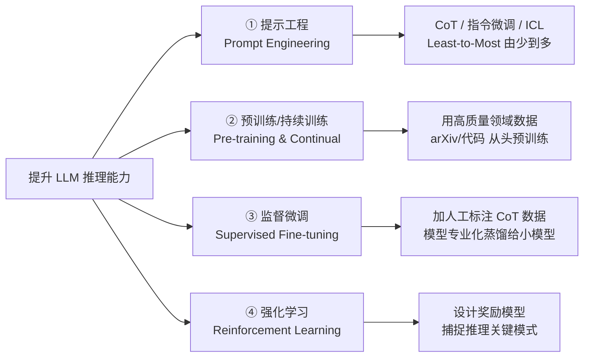

- **① 提示工程**：CoT、指令微调、ICL；**Least-to-Most（由少到多）prompting** 把问题拆成子问题逐个求解。
- **② 预训练/持续训练**：用 arXiv 论文、代码等高质量数据（甚至从头训）。
- **③ 监督微调**：加人工标注 CoT 数据；**模型专业化（model specialization）**——用大模型生成专业化数据来微调小模型，把推理能力蒸馏下去；在编码测试数据上微调并加过滤机制（检查采样答案能否通过测试用例）。
- **④ 强化学习**：设计**奖励模型**捕捉特定推理问题的关键模式。

### 5.1.8.3 缺乏因果推理能力（Lack of Causal Reasoning）

**逻辑推理 vs 因果推理的区别**：逻辑推理是"从前提推结论"；**因果推理**聚焦"识别事件/世界状态之间的因果关系"。

因果推理任务包括：推断随机变量间因果（如温度与纬度）、事件间因果（撞桌子导致啤酒杯掉地）、回答反事实问题、理解结构因果模型规则（如 d-分离）。

**关键发现**（Kiciman et al.）：GPT-4 推断**必要原因（necessary cause）**很准，但推断**充分原因（sufficient cause）**准确率低得多——因为充分原因要回答一大堆反事实问题。

**CORR2CAUSE 数据集**：测 LLM 能否"从相关性推因果"。给定因果图 `A → C ← B`，prompt 里告诉它"3 个变量 + 相关性事实（A 不独立于 C、B 不独立于 C、A 独立于 B）"，再问"A 是否直接导致 C"。结果：**未调优 LLM 仅略胜随机猜测**；少量样本微调能显著提升，但**换措辞、换变量名后又不稳定**。

> ⚠️ **常见坑（书里的 text-davinci-003 翻车案例）**：原句是负面情绪链 `球迷失望 ← 比赛取消 ← 有暴风雨`。让它把情绪从负改为正，它改成"比赛延期 → 球迷兴奋"——**逻辑与语义不一致！** 常识告诉我们"比赛延期"并不会让"球迷兴奋"。这说明 LLM 没真正理解**必要原因与其他事件间的因果关系**。

---

# 🧩 5.2 因果推理（Causal Reasoning）

## 引子：LLM 到底会不会因果推理？

书里给了一组精彩对照（GPT-4 扮演商业顾问）：

- **图 5.2a（答对）**：玩具店老板问"12 月销量上涨是不是因为新广告？"，GPT-4 很稳——指出**节假日等外部因素（潜在混淆因子 confounder）**可能影响销量，建议做 **A/B 测试**（考虑新广告 1000 美元成本）。这是**教科书级的因果回答**。
- **图 5.2b（答错）**：继续对话，2 月把观众分两组、旧广告上报纸、新广告上网络，结果新广告卖了 6000 美元、旧广告 4500 美元。GPT-4 建议"3 月继续用新广告"——**它没考虑报纸广告与网络广告的成本和受众差异**，只看销售数字就下结论。

**由此引出核心争论**：LLM 究竟真有因果推理能力，还是**不可靠的模仿者（unreliable imitators）**？

## 5.2.1 因果推理的基本概念

> 🔬 **第一性原理——相关不蕴含因果（Correlation does not imply causation）**：统计学习模型建立的是数据里的**相关性**。在 i.i.d.（独立同分布）设定下表现好，但一旦违反 i.i.d. 就崩。经典反例：图像识别里看到"天空"就预测"鸟"，因为模型拟合了数据集里虚假的"天空-鸟"关系。

**因果推理的三个层级（Pearl 的因果之梯）**：

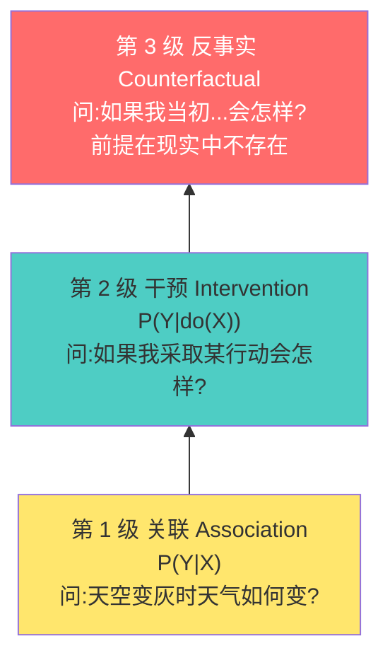

- **第 1 级 关联**：传统统计 ML 停留在此，回答"变量间的关联"。
- **第 2 级 干预**：问"采取某行动的效果"，光靠数据关联答不了。
- **第 3 级 反事实**：问"如果我当初做/不做某事会怎样"，比较同一条件下不同结果，而**前提本身在现实中并不存在**。

### 5.2.1.1 结构因果模型（SCM, Structural Causal Model）

把变量 $X_1, X_2, \dots, X_n$ 看作因果图（**有向无环图 DAG**）的顶点，每个变量写成父节点的函数：

$$X_i = f_i(PA_i, U_i) \sim P(X_i \mid PA_i), \quad i = 1, 2, \dots, n \tag{5.1}$$

其中 $PA_i$ 是 $X_i$ 在因果图里的**父节点（parents）**，$U_i$ 是噪声等**未测因素**。联合分布可做**乘积分解（product decomposition）**：

$$P(X_1, X_2, \dots, X_n) = \prod_{i=1}^{n} P(X_i \mid PA_i) \tag{5.2}$$

**逐行解读**：式 (5.1) 说"每个变量由它的直接原因（父节点）+ 噪声决定"；式 (5.2) 说"整个系统的联合概率 = 各个'局部因果机制'的连乘"。这正是 SCM 的威力——把复杂的联合分布拆成一堆**独立的、可单独干预的机制**。

### 5.2.1.2 独立因果机制（ICM, Independent Causal Mechanisms）

**ICM 原理**：系统各变量的因果生成过程由**互不告知、互不影响的自治模块**组成。应用到式 (5.2)：

1. **干预**一个机制 $P(X_i \mid PA_i)$ **不改变**其他机制 $P(X_j \mid PA_j)$（$i \neq j$）。
2. **知道**一个机制**不提供**关于另一个机制的信息。

> 💡 **为什么重要**：ICM 保证"对一个模块的干预不影响其他模块"，这正是**跨域知识迁移**的理论基础——如果两个域共享相同模块，知识就能迁移。

### 5.2.1.3 因果推断（Causal Inference）与 ATE

医学场景：药物 $A$，$A=1$ 治疗、$A=0$ 不治疗。**平均处理效应（ATE, Average Treatment Effect）**：

$$\text{ATE} = \mathbb{E}[Y(A=1) - Y(A=0)] \tag{5.3}$$

$Y(A=1)$ 是接受治疗的潜在结果，$Y(A=0)$ 是**反事实结果（counterfactual outcome）**——没接受治疗时会怎样。现实中因成本、伦理，观测数据往往不全（同一个人不可能既治疗又不治疗），所以要靠因果推断来估计。

### 5.2.1.4 因果干预（Causal Intervention）：后门 vs 前门

这是本节的技术硬核。核心工具是 **do-算子（do-operator）**，用来区分"观察"和"干预"。

#### （1）后门干预（Backdoor Intervention）

若直接用贝叶斯法则算 $X$ 对 $Y$ 的效应：

$$P(Y \mid X) = \sum_z P(Y \mid X, Z=z)\, P(Z=z \mid X) \tag{5.4}$$

这**不能**代表真实因果效应，因为存在**后门路径 $X \leftarrow Z \rightarrow Y$**。这里 $Z$ 是**混淆因子（confounder）**，既影响 $X$ 又影响 $Y$，导致虚假相关。用 do-算子做干预：

$$P(Y \mid do(X)) = \sum_z P(Y \mid X, Z=z)\, P(Z=z) \tag{5.5}$$

**逐行解读**：对比式 (5.4) 与 (5.5)——唯一区别是把条件分布 $P(Z=z \mid X)$ 换成了**边缘分布 $P(Z=z)$**。几何上相当于在因果图里**砍断 $Z \to X$ 这条边**，阻断后门路径，让 $X$ 和 $Z$ 独立，从而算出 $X$ 的**真实因果效应**。

#### （2）前门干预（Frontdoor Intervention）

当混淆因子 $Z$ **不可观测**时，后门失效（因为 $P(z)$ 拿不到）。若存在可观测的**中介变量 $W$** 在前门路径 $X \to W \to Y$ 上：

$$P(W \mid do(X)) = P(W \mid X) \tag{5.6}$$

$$P(Y \mid do(W)) = \sum_x P(Y \mid W, x)\, P(x) \tag{5.7}$$

$$P(Y \mid do(X)) = \sum_w P(Y \mid do(W=w))\, P(W=w \mid do(X)) \tag{5.8}$$

联立 (5.6)–(5.8) 得**前门公式**：

$$P(Y \mid do(X)) = \sum_w \sum_x P(Y \mid W=w, x)\, P(W=w \mid x)\, P(x) \tag{5.9}$$

**逐行解读**：前门干预**用两次 do-算子**——先对中介 $W$、再对 $X$，从而**绕过**不可观测的 $Z$。

| 方法 | 适用前提 | 关键操作 | 局限 |
|------|---------|---------|------|
| **后门干预** | 混淆因子**可观测** | 砍断 $Z\to X$，用 $P(Z)$ 边缘化 | 需先识别混淆因子；CV 里混淆因子常不可观测 |
| **前门干预** | 存在**可观测中介 $W$** | 两次 do-算子绕过 $Z$ | 需要合适的中介变量 |

> 💡 **实战**：在计算机视觉里，视觉/语言模态的混淆因子**常常不可观测**，此时前门干预提供了一条"混淆因子无法显式识别时"的可行计算路径。这是 CausalVLR（下文）的理论基础之一。

## 5.2.2 因果关系的类型

书里从三个维度对因果做分类：

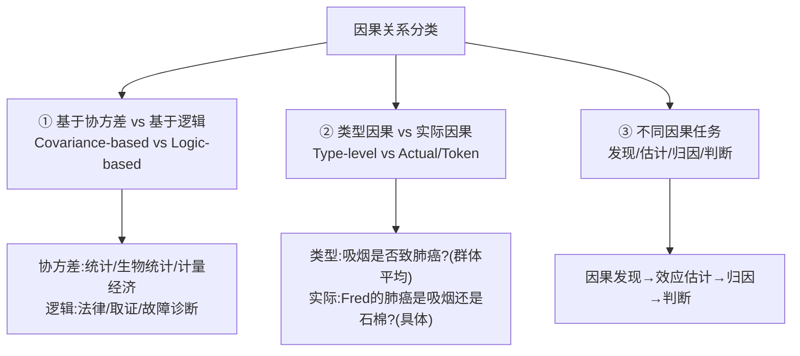

- **① 协方差 vs 逻辑**：统计/生物统计/计量经济学重**协方差**（从数据估计因果强度）；法律/取证/故障诊断重**逻辑**（用逻辑推理和领域知识）。
- **② 类型因果 vs 实际因果**：**类型因果（Type）**问群体平均（"吸烟是否致肺癌？"，科学家关心，用于制定政策）；**实际因果（Actual/Token）**问具体事件（"Fred 的肺癌是吸烟还是石棉暴露导致的？"，需"前向模拟"来归因）。
- **③ 因果任务**：**因果发现（discovery）**（恢复因果图，是所有因果任务的地基）→ **效应估计（effect estimation）** → **归因（attribution）** → **判断（judgment，涉及奖惩/道德责任）**。注意：**解决一类任务不代表能解决另一类**。

## 5.2.3 & 5.2.4 LLM 的因果推理能力与因果发现

**LLM 带来的新能力**：通过捕捉与任务相关的**人类领域知识**来做因果推理——而领域知识正是所有因果分析的关键成分。LLM 有潜力在因果推理的**每一步**辅助人类（见下图工作流）：

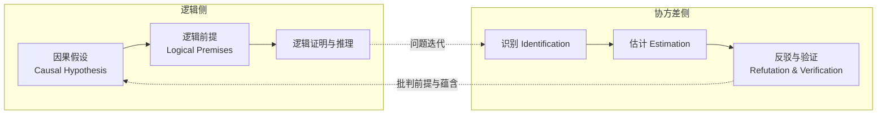

**惊人成绩**：在 **Tübingen 基准**（100+ 跨域因果关系：物理、生物、动物学、认知科学、流行病学、土壤科学）上，LLM 达 **97% 准确率**，远超此前最佳 **83%**。

**但也有软肋**：

- LLM 只靠**元数据（变量名 metadata）**推理，**不分析数据值**——所以会犯简单、不可预测的错误。
- **鲁棒性严重依赖 prompt**。
- **因果发现的根本难题**：仅凭观测数据一般**无法**学出正确因果图，因为多个图结构可对应同一数据分布，形成**马尔可夫等价类（Markov equivalence classes）**。两条传统路线——限制生成过程的函数形式（如加非高斯噪声）、用深度学习联合建模协方差——都没根本解决可识别性问题。LLM 提供了**从元数据推理**的新视角（这本是人类领域专家干的活）。

## 5.2.5 多模态因果开源框架 CausalVLR

**是什么。** **CausalVLR** 是中山大学 **HCP-Lab（人-机-物智能融合实验室）** 开发的、Python 编写的多模态因果开源框架，用于**因果发现与因果推断**。它是目前**唯一专为多模态认知推理任务设计**的开源框架，覆盖 AIGC、问答推理、图像/视频标注、模型泛化鲁棒性分析、具身交互、医疗问诊与决策等任务。

**四大特性**：

| 特性 | 说明 |
|------|------|
| **统一结构** | 把视觉-语言因果框架拆成可组合组件（含因果一致 CoT、VQA、医疗报告生成、医疗问诊、鲁棒性等 demo） |
| **通用模块插件** | 支持因果干预、因果关系、反事实推理、因果图生成等通用插件 |
| **灵活配置** | 改配置文件即可实现特定任务模型（如 VQA 用 CMCIR、医疗报告用 VLCI、因果推理链用 CaCo-CoT） |
| **交互式推理** | 几行代码快速部署验证，提供可视化 UI 动态展示因果推断过程 |

> 💡 **HCP-Lab 是本书作者所在实验室**，CausalVLR、下文的多个具身工作都出自这条主线。可以把 5.2 节理解为"作者团队自己的技术路线宣言：因果 = MLLM 迈向可信 AGI 的第一块拼图"。

---

# 🌐 5.3 世界模型（World Models）

## 引子：LeCun 的三个灵魂拷问

2022 年 6 月，卷积神经网络之父 **Yann LeCun** 提出**世界模型（World Models）**概念，并抛出三个可能长期难解的问题：

1. 机器如何像人和动物一样**高效学习**？
2. 机器如何学会**推理和规划**？
3. 机器如何在**多个抽象层次**上学习感知与动作规划的表示，从而在不同时间尺度上推理、预测、规划？

**LeCun 对当前 LLM 的批判**（面试高频观点）：GPT、BERT 本质是**自回归生成模型（autoregressive generative models）**——预测序列里下一个 token，再用预测结果继续预测。仅用文本训练只能获得**肤浅的世界理解**——它们捕捉的是**统计模式**，而非**真实世界的语义**。这种缺乏底层现实知识的做法会导致错误（有时错得幼稚可笑）。**解药**：引入更多感官信号（视觉、音频）来学习世界动态。

## 5.3.1 世界模型的概念

> 🔬 **第一性原理**：人和动物通过**观察 + 极少交互**，以**任务无关、无监督**的方式获取关于世界动态的海量背景知识。这些知识就是**常识（common sense）**——一组"什么可能、什么合理、什么不可能"的世界模型。有了它，动物能用极少训练学会新技能、预测行动后果、想象新方案，并**在陌生情境下避免致命错误**。

书里给了个绝妙对比：**自动驾驶可能需要几千次 RL 试错才学会"过弯太快会打滑"，而人类靠对物理世界的理解，直接预测后果、避开致命动作。** 婴儿的世界认知（图 5.10）正是通过**非任务特定的感知**在早期发育中形成的。

### LeCun 世界模型框架（六大模块）

```mermaid
graph TD
    CFG[① 配置器 Configurator<br/>按任务配置各模块参数/注意力] --> PER
    CFG --> WM
    CFG --> COST
    PER[② 感知器 Perceptor<br/>估计当前世界状态] --> WM
    WM[③ 世界模型 World Model<br/>补全缺失信息+预测未来状态<br/>用潜变量表示不确定性] --> COST
    WM <--> MEM[⑤ 短期记忆 Short-term Memory<br/>存过去/现在/未来状态+内在代价<br/>类似 Key-Value Memory Network]
    COST[④ 代价 Cost<br/>能量=内在代价(不可训)+评论家(可训)] --> ACT
    ACT[⑥ 行动器 Actor<br/>算最优动作序列<br/>类似模型预测控制 MPC] --> WM

    style WM fill:#ff6b6b,color:#fff
    style COST fill:#ffe66d
```

假设所有模块**可微**（输出经箭头传递可得标量代价的梯度）：

1. **配置器（Configurator）**：接收所有模块输入，按任务需求激活/配置感知、世界模型、代价模块的参数和注意力回路。
2. **感知器（Perceptor）**：估计世界当前状态；但任务只需一小部分状态，故配置器预先调整感知系统只提取任务相关信息。
3. **世界模型（World Model）** ⭐**最复杂的核心**：两大功能——① 补全感知器没给的缺失信息；② 预测世界的**合理未来状态**（既含世界自然演化，也含行动器动作序列导致的未来）。用**潜变量（latent variables）**表示不确定性。理想情况下要在**多抽象层次**表示状态、跨**多时间尺度**预测。两大关键挑战：如何做**多轮合理预测并表示不确定性**、如何**训练**世界模型。
4. **代价（Cost）**：用标量**能量（energy）**量化 agent 的"不适度"，= **内在代价（intrinsic，不可训不可变）** + **评论家（critic，可训）**。内在代价可解释为疼痛（高能量）、愉悦（低/负能量）、饥饿等，是行为的根本驱动和内在动机（如让四足机器人走路时"感觉好"、与人互动时鼓励社交、遇新情境激发好奇探索）。评论家预测未来内在能量，从短期记忆里取历史状态和代价来训练自己。两个子模块都可微，能量梯度可反传。
5. **短期记忆（Short-term Memory）**：存过去/现在/未来的世界状态 + 对应内在代价值；世界模型可查询/写入；评论家从中取历史训练。结构类似著名的 **Key-Value Memory Network**。
6. **行动器（Actor）**：算动作序列提案，输出第一个动作给执行器，循环迭代。它能拿到"估计代价对候选动作序列的梯度"，用**基于梯度**的方法算最优动作（离散动作空间则用动态规划）。整个过程类似最优控制里的**模型预测控制（MPC, Model Predictive Control）**。

## 5.3.2 联合嵌入预测架构（JEPA）

**JEPA（Joint Embedding Predictive Architecture）是本节最重要的概念**，也是理解 I-JEPA / V-JEPA / LeCun 路线的钥匙。

**训练世界模型 = 自监督学习的范式**：用有限的已知信息预测未来/未观测输入。但有三大难题：① 世界模型质量依赖状态序列多样性；② 世界不完全可预测（当前动作后可能有多个合理未来）；③ 要在不同时间尺度和抽象层次预测。

### JEPA 的核心思想

> 🔬 **第一性原理——JEPA 不是生成式的（not generative）**：它**不预测 $y$ 的每个像素细节**，而是在**表示空间（representation space）**里做预测。$x$、$y$ 分别过两个编码器（可以不同架构、不同参数，所以 $x$、$y$ 可以是完全不同的模态，如视频 vs 音频）得到表示 $s_x$、$s_y$；预测器从 $s_x$ 预测 $s_y$，可借助潜变量 $z$。**能量 = 表示空间里的预测误差**。

$$E_w(x, y, z) = D\big(s_y, \text{Pred}(s_x, z)\big) \tag{5.10}$$

对 $z$ 取最小得总能量：

$$\hat{z} = \arg\min_{z \in \mathcal{Z}} E_w(x, y, z) = \arg\min_{z} D\big(s_y, \text{Pred}(s_x, z)\big) \tag{5.11}$$

$$F_w(x, y) = \min_{z \in \mathcal{Z}} E_w(x, y, z) = D\big(s_y, \text{Pred}(s_x, \hat{z})\big) \tag{5.12}$$

**逐行解读**：式 (5.10) 定义能量为"真实表示 $s_y$"与"预测表示 $\text{Pred}(s_x,z)$"的距离 $D$；式 (5.11) 找使能量最小的最优潜变量 $\hat z$；式 (5.12) 把最优 $\hat z$ 代回得到最终能量。**关键洞察**：编码器 $\text{Enc}(y)$ 提取抽象表示时会**剔除无关细节**——$s_y$ 提供不变性，潜变量 $z$ 承载不确定性（相当于执行器的动作）。

### 防止坍缩的四条原则（JEPA 为什么不会退化）

JEPA 用**非对比（non-contrastive）**方法训练，靠四条原则防止**能量模型坍缩（collapse）**：

| 原则 | 内容 | 作用 |
|------|------|------|
| ① | $s_x$ 应最大化关于 $x$ 的信息 | 保留输入信息 |
| ② | $s_y$ 应最大化关于 $y$ 的信息 | 保留输入信息 |
| ③ | $s_y$ 应更容易从 $s_x$ 预测 | 保证可预测性 |
| ④ | 潜变量 $z$ 的信息量应最小化 | 表示不确定性 |

**逻辑**：①②保证 $s_x$、$s_y$ 保留足够输入信息，③才能正确预测；④让 $z$ **离散、低维、稀疏或加噪**，逼模型尽量少借助 $z$——防止模型忽略 $s_x$（否则会"作弊坍缩"）。JEPA 还能**分层堆叠（Hierarchical-JEPA）**做长程预测。

> 💡 **开车例子**：给定接下来几秒的方向盘/踏板操作序列，司机能准确预测车的轨迹；时间越长细节越难预测，但**高层预测**仍准（忽略轨迹细节、其他车、信号灯，车能在可预测时间内到达目的地）。**离散潜变量可表示多条备选路线**——这就是分层 JEPA 的直觉。

### I-JEPA / MC-JEPA / V-JEPA 家族

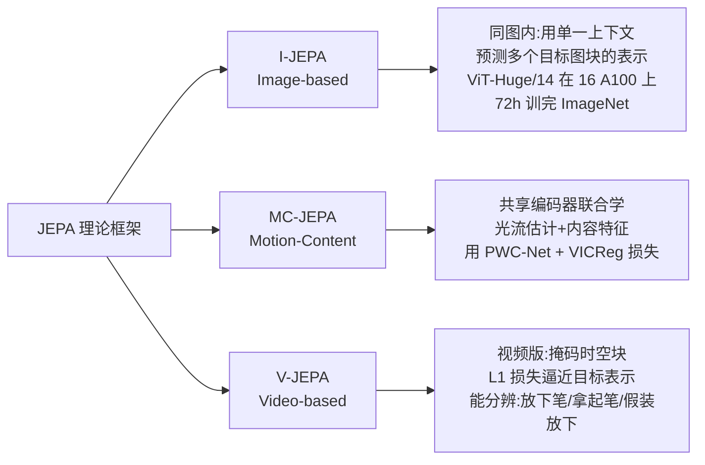

- **I-JEPA（Image-based JEPA）**：核心思想简单——**用同一张图里单个上下文的信息，预测多个目标图块的表示**。关键设计是**掩码策略**：目标块要够大（有语义）、上下文块信息够丰富（空间分布）。随机采样 4 个目标块掩码（尺度 0.15–0.2，宽高比 0.75–1.5）。**高可扩展性**：ViT-Huge/14 在 16 张 A100 上不到 72 小时训完 ImageNet，在线性分类、物体计数、深度预测等下游任务表现强，且比 MAE、CAE、iBOT **算力更省、表示更好**。
- **MC-JEPA（Motion-Content JEPA）**：统一"**光流估计**"和"**自监督内容特征学习**"两个任务，在**共享编码器**里联合学习，证明二者能互相受益。用 **PWC-Net** 做光流估计器（金字塔架构逐层提分辨率），用 **VICReg 损失**学内容特征。
- **V-JEPA（Video JEPA）**：Sora 发布同日 Meta 推出，**非生成式**视频预测模型。输入 $T$ 帧、空间分辨率 $H \times W$ 的视频片段，展平成 $L$ 个 token；先移除掩码 token，编码器 x 处理后输出每个 token 的嵌入；再拼接**可学习掩码 token（含位置嵌入）**，预测器输出每个掩码 token 的嵌入，最后用 **L1 损失**逼近编码器 y 的输出（预测目标）。**优势**：丢弃难预测信息，大幅提升训练和样本效率。能分辨"放下笔 / 拿起笔 / 假装放下但没真放"这种细微交互。**预测器充当初步世界模型**，Meta 下一步要用它做规划和序贯决策。

## 5.3.3 Dynalang：用语言预测未来

**问题。** 现有 agent 常只跟随用户**低层直接指令**（如"捡起某物"），但真实世界信息没这么直白（如"下雨天瓷砖变滑，行人会走不稳"需要"理解"）。

**Dynalang 的关键思想**：**用语言帮 agent 预测未来**——会看到什么、世界如何运作、哪些情境给奖励。它把**语言理解**和**未来预测**统一成一个强大的自监督目标，学一个**多模态世界模型**预测未来的文本和图像表示，并基于"想象的模型 rollout"学习行动。

**与传统 agent 的区别**：传统 agent 只用语言预测**动作**；Dynalang **用过去的语言预测未来的语言**，从而获得丰富的语言理解。它还能在**不含动作/奖励**的文本、视频数据上预训练。

**工作原理**（基于 DreamerV3 这个基于模型的 RL agent）：每个时间步，世界模型把文本和图像压成潜表示，训练目标是**重建原始观测 + 预测奖励 + 预测下一步表示**；再在压缩表示上训一个**策略网络**，在**想象的 rollout** 上学习最大化预测奖励。**关键创新**：把视频和文本建模成**统一序列**，一次处理一帧图像 + 一个文本 token——**像人在真实世界接收信息一样**（花时间去听语言）。

## 5.3.4 交互式真实世界模拟器（UniSim / GAIA-1）

**思路。** Dynalang 描述未来、预测奖励的能力，可自然扩展到**直接模拟和生成训练环境**。生成模型下一个里程碑或许是：**根据人类/机器人/交互 agent 的动作，模拟真实体验**。应用从游戏电影内容生成，到"仅在模拟中训练具身 agent 再直接部署到现实"。

- **GAIA-1**：生成动态驾驶视频的世界模型，用**视频 + 文本 + 动作**输入，把世界建模当**无监督序列建模**（映射到离散 token、预测下一个 token）。**90 亿参数、4700 小时驾驶视频训练**。价值：世界模型让 AI 通过**未来模拟**意识到自身决策（对安全至关重要）；生成数据**更安全、更便宜、可无限扩展**，能覆盖更多边缘案例（如浓雾中行人横穿）。
- **UniSim**（UC Berkeley、Google DeepMind、MIT 等）：迈向**通用真实世界模拟器**的第一步。核心障碍是**数据难获取**——不同数据集覆盖不同信息轴：文本-图像对有丰富场景物体但**缺动作**；视频字幕/QA 有高层活动描述但**缺低层运动细节**；人类活动数据有丰富人类动作但**缺机械运动**；机器人数据有大量机器人动作但**量少**。UniSim 把这些沿不同轴的数据**编排整合**进条件视频生成框架，成功融合多轴经验并泛化。

## 5.3.5 Sora：模拟世界的视频生成模型

**是什么。** 2024 年 2 月 16 日 OpenAI 发布 **Sora**（文生视频模型），是"学习物理世界模型、构建通用物理世界模拟器"的潜在路径。四大突破：

1. 生成**最长 1 分钟**、遵循文本指令、高视觉质量和连贯性的视频。
2. 有**模拟物理世界**的潜力，能生成含多角色、特定运动、精确细节的复杂场景。
3. 深度理解语言，能生成**情感生动**的角色、单视频内**多镜头**。
4. 能**编辑视频**，在两段输入视频间做逐帧插值，创造平滑过渡。

### Sora 三大组件与核心技术

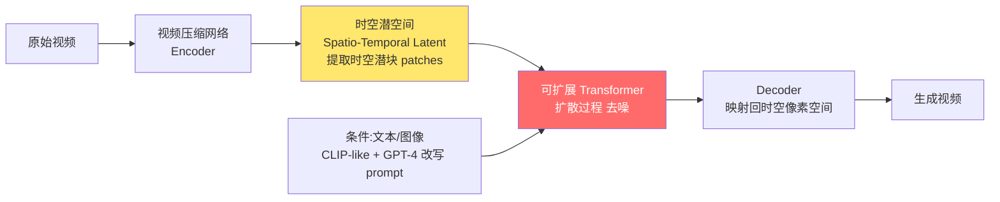

- **核心架构**：**扩散模型（diffusion）+ 预训练 Transformer**。把原始视频压成**时空潜表示**，再提取一系列**时空潜块（spatiotemporal latent patches）**——功能类似语言模型里的 token，是"视觉短语"。从充满视觉噪声的图像帧出发，**迭代去噪**并按文本 prompt 引入细节（多步复原）。
- **三组件**：① 视频压缩网络（降维到时空潜空间）；② 处理 token 化潜表示、输出去噪潜表示的模块；③ **CLIP-like 条件机制**（接收 GPT-4 增强的用户指令 + 视觉线索）。
- **语言理解技巧**：借鉴 **DALL·E 3** 的标注技术，训一个**高描述性视频字幕模型**给所有训练视频生成高质量文本，实现强文本-视频对齐；生成时用 GPT 改写用户 prompt。
- **涌现的模拟能力**（大规模训练后）：**3D 一致性**（相机移动旋转时场景元素在 3D 空间正确移动）、**长程连贯与物体永存性（object permanence）**（角色被遮挡或离开画面仍保持）、**与世界交互**（画家在画布留下持久笔触）。

### ⚠️ Sora 的根本局限（LeCun 的批判）

> 🔬 **第一性原理——生成逼真视频 ≠ 理解物理世界**：Sora 的视频只由 prompt 引导，**不准确遵守物理定律**，难以精确操控物体，**不能做反事实推理**（无法准确回答"what if"）。即使继续 scale，它也**不能直接充当物理世界的模拟器（世界模型）**。LeCun 指出：视频生成只需产出**一个**合理样本就算成功，而遵守物理定律的内容相对稀缺；生成视频续帧既昂贵又无意义。**更理想的做法是生成视频续帧的抽象表示，剔除与潜在动作无关的场景细节——这正是 JEPA 的核心思想**（不生成，在表示空间预测）。

| 维度 | Sora（生成式） | V-JEPA（非生成式） |
|------|--------------|------------------|
| 范式 | 扩散 + Transformer，重建每个像素 | 联合嵌入预测，比较抽象表示 |
| 目标 | 生成逼真视频 | 学习可预测的世界表示 |
| 反事实推理 | ❌ 不能 | 预测器充当初步世界模型 |
| 效率 | 生成续帧昂贵 | 丢弃难预测信息，样本效率高 |
| LeCun 态度 | 批判（肤浅理解） | 力推（人类式抽象预测） |

---

# 🤖 5.4 超级智能 AGI Agent

## 引子：缸中之脑（Brain in a Vat）

> 1981 年 Hilary Putnam 在《理性、真理与历史》提出"**缸中之脑**"思想实验：把大脑取出泡在营养液里，神经末梢接线连到电脑，电脑模拟真实世界参数传给大脑，维持"一切正常"的幻觉。

**类比**：多模态大模型就是这样的"缸中之脑"——靠 GPU 和电力维持，逼近 AGI 式的 GPT 模型。但人类日常处理两类任务：

- **① 离散孤立任务**：环境无关、无时空依赖，如编程、下围棋、内容生成。**"缸中之脑"只能干这类。**
- **② 连续环境绑定任务**：环境相关，如点外卖、打车、经营生意。**绝大多数任务属于这类。**

**Agent 就是连接多模态大模型与任务场景的价值传递桥梁。** 从只会响应查询的 LLM，到能自主决策的**大动作模型（LAMs, Large-Action Models）**（AutoGPT、GPT-Engineer、BabyAGI），标志 LLM 发展进入新阶段。

## 5.4.1 Agent 的定义

Agent 决策过程可函数化表达为：

$$\text{Agent}: P\ (\text{感知 Perception}) \to P\ (\text{规划 Planning}) \to A\ (\text{行动 Action})$$

三步循环：**感知**（从环境采信息提知识）→ **规划**（为达目标做决策）→ **行动**（执行行为）。行动又成为下一轮感知的前提，形成**自主闭环学习**。

书里给出更完整的**直觉公式**（面试必背）：

$$\boxed{\text{Agent} = \text{LLM} + \text{规划 Planning} + \text{反馈 Feedback} + \text{工具使用 Tool Use}} \tag{5.13}$$

> 💡 **关键区分：ChatGPT 不是 Agent！** ChatGPT 只是"世界知识的通用集合"、规划的**知识源**——它缺乏对具体环境状态、记忆、经验的感知。而 Agent 通过**自我驱动循环**赋予 LLM 达成目标的能力，规划时不仅看当前状态，还要考虑**记忆、经验、对过去的反思、世界知识**。**反馈**是 agent 从行动获得的正向/试错响应（对话时用户的文字回复就是一种反馈，**RLHF 是极简化的外部环境**）。**工具**（如天气 API）让 agent 突破物理与认知极限。

**三类 Agent**：① **元宇宙导向**（如 Google/Stanford 的"西部世界"实验、游戏 NPC）；② **需接入现实场景**（招聘、营销、运营监控）；③ **具身机器人**（完全控制自身外设，现实适用性最强）。

## 5.4.2 Agent 的三大核心组件

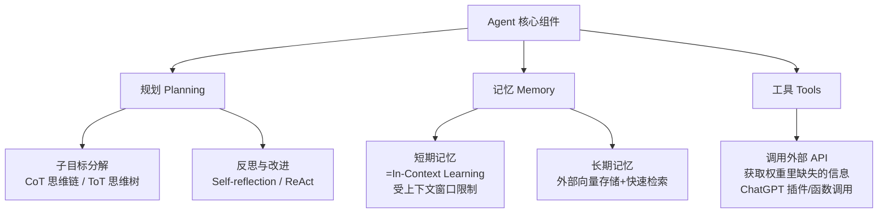

### 5.4.2.1 规划（Planning）

**（1）子目标分解**：把大任务拆成可管理的小子目标。
- **思维链（CoT）**：靠"Think step by step"用更多推理时计算分解子目标。
- **思维树（ToT, Tree-of-Thought）**：在每一步探索多个推理可能，形成树状解空间，用广度/深度优先搜索，每个状态由分类器或多数投票评估。

**（2）反思与改进**：对过去行动自省、从错误学习。**ReAct** 把动作空间扩展为"任务特定离散动作 + 语言空间"的组合——动作让 LLM 与环境交互（如用 Wikipedia 搜索 API），语言空间让它生成自然语言推理轨迹。ReAct 优于只用 Act（去掉 Thought）的基线。

### 5.4.2.2 记忆（Memory）

书里用**人脑三类记忆**类比 LLM：

| 人脑记忆 | 特性 | LLM 对应物 |
|---------|------|-----------|
| **感觉记忆（Sensory）** | 几秒钟（视觉/听觉/触觉印象） | 原始输入的**学习嵌入（embedding）** |
| **短期记忆（Short-term）** | 约 **7 项、20–30 秒** | **上下文学习（ICL）**，受 Transformer 上下文窗口限制 |
| **长期记忆（Long-term）** | 数天到数十年、近乎无限 | **外部向量存储**，查询时快速检索 |

长期记忆两子类：**显式/陈述性**（事实事件，含情景记忆 + 语义记忆）、**隐式/程序性**（无意识技能，如骑车、打字）。

### 5.4.2.3 工具（Tools）

使用工具是人类智能的标志。给 LLM 装外部工具能显著扩展能力——调用外部 API 获取**模型权重里缺失的信息**（当前信息、代码执行、专有信息源）。ChatGPT 插件、OpenAI 函数调用是典型实践。

## 5.4.3 典型 AGI Agent 模型

| 模型 | 机构/年份 | 核心机制 | 亮点/局限 |
|------|----------|---------|----------|
| **AutoGPT** | 2023 | GPT-4/3.5 API 自动循环分解任务 | 首批用 GPT-4 自主执行；⚠️成本高/慢/易死循环 |
| **BabyAGI** | 2023 | 像项目经理:建任务表→排优先级→执行 | 能试错学习、写并执行代码；局限于训练域 |
| **AgentBench** | 智谱 AI | 8 环境多维评测基准 | 揭示开源 vs 商业 LLM 的 Agent 能力差距 |
| **XAgent** | 面壁智能×清华 2023 | **双循环机制** + 人机协作 + Function Call | 全面超越 AutoGPT；ToolServer 隔离 Docker |

### 5.4.3.1 AutoGPT

先分解目标任务，再用互联网等工具**自动循环**完成子任务。与 ChatGPT（每任务需手动输入）不同，AutoGPT **无需人工干预**自主添加新目标任务，形成**递归实例**。通过读写数据库/文件管理短期与长期记忆，用摘要控制 LLM 输入长度。

> ⚠️ **三大局限（含成本账，书里的真实计算）**：① **成本高**——GPT-4 token 比 GPT-3.5 贵 15 倍。假设一任务理想需 20 步、每步 4000 GPT-4 token、每千 token 均价 $0.05，按 $1=7 元算，成本 = $20 \times 4 \times 0.05 \times 7 = 28$ 元；但任务常需几十上百步，**单任务处理成本高得离谱**。② **响应慢**（GPT-4 明显慢于 3.5）。③ **无限循环**——遇到 GPT-4 解不了的步骤会反复生成无意义 prompt，浪费资源。

### 5.4.3.2 BabyAGI

类似项目经理，靠**建任务表、排优先级、执行、动态调整**达成目标。特点是**从反馈中试错学习**、能写并执行代码，在加密货币交易、机器人、自动驾驶等领域表现好。局限同 AutoGPT——性能受限于训练数据域。

### 5.4.3.3 AgentBench（智谱 AI）

**8 类环境**系统评测 LLM 作为 Agent 的能力：

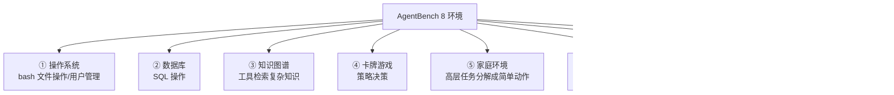

在 **25 个 LLM** 上测试发现：**开源 LLM 与顶级商业 LLM 仍有显著差距**。LLM 在 NLP 任务上接近人类，但在关键 **Agent 能力**上（动作有效性、长上下文记忆、多轮对话一致性、代码生成执行）**明显不足**。

### 5.4.3.4 XAgent（面壁智能 × 清华 NLP 实验室，2023.10）

全面超越 AutoGPT，三大技术亮点：

- **① 双循环机制（Dual-Loop）**：类比人脑左右半球——**外循环**负责高层任务管理与分配（Plan Agent 当"领导"，分解任务、监控进度、据反馈优化计划）；**内循环**聚焦低层任务执行优化（变身 Tool Agent，从外部系统取工具、逐步解子任务、生成反馈）。
- **② 人机协作**：直观界面让用户直接**覆盖/修改**建议；遇新挑战主动**求助**。
- **③ 高效通信语言 + 强大工具调用**：内部用 **Function Call** 作通信语言——**结构化、标准化、统一化**。还引入 **ToolServer 执行引擎**，在**隔离 Docker 环境**里安全执行工具。

### 5.4.3.5 & 5.4.3.6 社会化 Agent 与 V-IRL

- **社会化 Agent（Meta，2023.10）**：三项进展——**Habitat 3.0**（首个支持大规模人-机交互训练的模拟器，同时容纳机器人和人形化身，"Human-in-the-loop"，社会导航任务）、**HSSD-200**（211 个高质量 3D 场景 + 18,656 个物理世界物体模型 + 466 语义类别）、**HomeRobot 库**（支持 Hello Robot Stretch 的导航与操作，单 GPU 每秒 1000+ 步）。为什么用模拟器？RL 常需百万次迭代（物理世界要几年、模拟只需几天），且更换环境只需几秒、避免损坏环境/伤人、可扩展数据采集。
- **V-IRL**：连接数字环境与人类物理世界的多面 agent。用**地图和街景数据**让 agent 导航真实地点、获取实时环境信息、执行物理任务。以**地理空间坐标**为中心连接虚拟与现实，用 Google Maps 访问街景、查询移动、检索附近地点、规划路线。采用**分层架构**（平台 → 感知/推理/行动/协作能力 → agent + 元数据完成任务），agent 行为由用户定义的元数据（背景、意图、内部感知状态）驱动。

## 5.4.4 AGI Agent 的未来展望

作者给出五大前瞻方向：

| 方向 | 核心观点 |
|------|---------|
| **多模态通用 Agent** | 像人一样通过语言/视觉/语音/动作多通道与世界交互（如 Gato、PaLM-E 用**单套权重**做控制任务） |
| **与人类意图对齐** | 语言未必最优；视觉 prompt（关键点、框、草图）能更精确表达意图（如 SAM、ControlNet） |
| **规划/记忆/工具** | LLM 当大脑 + 三组件；视觉理解要增强以感知更细节、更长视频 |
| **多 Agent 协作** | 分**无序**（自由表达，如按职业/性格给反馈）与**有序**（按预定顺序，下游只关注上游输出）通信模式 |

> ⚠️ **多 Agent 系统的三大挑战**：① 长通信超出 LLM 上下文限制；② 计算开销剧增；③ **可能收敛到错误共识**（所有 agent 都坚信自己对）。当前多 Agent 系统远未成熟，**适时引入人类引导**仍是可行之道。

---

# 🦾 5.5 基于 Agent 的具身智能（Embodied Intelligence）

## 引子：为什么纯文本训练不够？

具身智能与 agent 目标相似：培养能感知环境、有知识和认知推理、通过行动与环境交互的智能体。当前热潮与 LLM（GPT-4）流行紧密相关。

**核心矛盾**：仅在**文本世界**（ALFWorld、Agent Town、APIBench）训练**不足以**创造能在真实世界运作的 agent——**视觉感知**尤其关键，而现有语言模型恰恰缺这个。

**"模态转换（modality conversion）"方法及其代价**：把多模态信息先转成文本再喂给 LLM，让它"间接看世界"。

> 🔬 **第一性原理——"缸中盲圣"比喻**：此时 LLM 像一位**视力受损的圣人**，靠别人对世界的描述来决策。优点是直接利用强大语言模型（模型越强越好）；**致命缺点是模态转文本时发生大量信息损失**。既然如此，为什么不用视觉语言模型做**端到端**决策？

**具身决策为什么远难于 VQA？** 三个关键：

1. **跨域感知能力**：要深度分析与问题相关的图像内容（如交通场景准确识别标志、家庭环境识别物品），而非表面描述。
2. **丰富的世界知识与推理**：不仅要有知识（交通规则、游戏规则），还要据感知信息有效推理。
3. **动作理解与选择**：理解各种动作含义，通过推理选最合适的动作。

> 💡 **作者的判断**：只有同时具备这三种能力的模型，才能真正接近"世界模型"。

## 5.5.1 具身决策基准 PCA-EVAL

最大挑战是**缺乏合适的评测框架**。**PCA-EVAL** 聚焦三个具身领域：① 自动驾驶；② 家庭机器人（如 ALFRED）；③ 开放世界游戏（如 Minecraft）。每域 100 样本（持续增长）。

**核心创新——三维评测 + 六元组标注**：评测覆盖 **感知（Perception）、认知（Cognition）、决策（Decision-making）** 三维度。每个标注实例是**六元组**：`(图像, 问题, 动作集, 答案, 依据 rationale, 关键概念)`——不只要 agent 决策，还要它**分析依据、描述图中关键信息**。结论：**GPT-4V 展现卓越的端到端跨模态推理与决策能力**，其他开源视觉语言模型仍有很大提升空间。

## 5.5.2 具身知识与世界模型融合 E2WM

**问题。** LLM 在简单物理推理和规划任务上常翻车（如**数物体数量**、理解**物体永存性**、规划家务）。图 5.29 里 ChatGPT 数错了桌上物品数量。**根源**：LLM 仅在文本语料训练，**缺乏具身经验**（导航环境、与物体交互、感知并追踪世界状态）。

**E2WM（Embodied Experiences from World Model）微调范式**：让**世界模型充当具身模拟器**（如 VirtualHome），给 LLM 理解物体交互、执行操作的机会，在**保持通用性**的同时注入具身知识。两种经验采集方法：

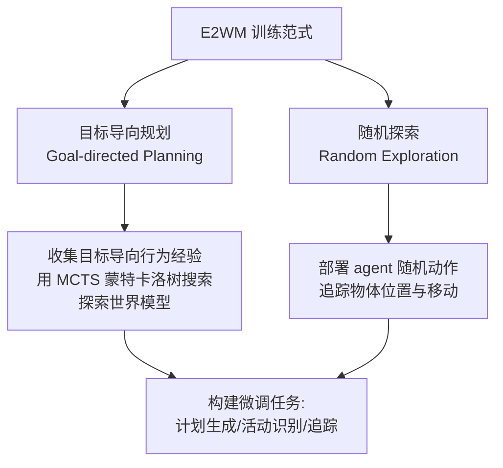

- **目标导向规划**：为特定活动（如扫地）设目标（如把垃圾扔进桶），用 **MCTS（蒙特卡洛树搜索）**探索世界模型生成计划，存为具身经验。
- **随机探索**：部署 agent 随机动作，追踪所有物体的位置和移动（积累物体和世界状态追踪经验）。

采集后构建微调任务：**计划生成、活动识别、追踪**。

## 5.5.3 具身机器人任务规划与控制

**核心难题——"接地（grounding）"**：LLM 有丰富常识，但**无法感知周围场景**，会生成**不可执行的动作**（与不存在的物体交互）。书里的经典例子：

> 指令"给我倒点酒"，GPT-3.5 生成"从瓶子往**玻璃杯**倒酒"；但实际场景**只有马克杯**，正确动作应是"从瓶子往**马克杯**倒酒"。

所以必须把 LLM 生成的计划**与物理世界关联**，构造可执行的具身任务规划。下面是这条线上的代表作：

| 模型 | 核心贡献 | 关键技术 |
|------|---------|---------|
| **SayCan** | 视觉导航生成基于场景的计划 | 仅限厨房场景 |
| **LLM-Planner** | ALFRED 模拟器中生成计划 | 多为简单任务（放置、摆放） |
| **TaPA** | 不限任务类型/目标物体的具体计划 | 微调 LLaMA + 开放词汇检测器多视角 |
| **SayPlan** | 跨多房间多楼层的可扩展规划 | **3D 场景图（3DSG）** + Dijkstra + 迭代重规划 |
| **Octopus** | 具身视觉-语言**编程**系统 | GPT-4 采集数据 + RLEF 环境反馈强化学习 |
| **EmbodiedGPT** | 端到端多模态具身基础模型 | EgoCoT/EgoVQA 数据集 + 前缀微调 |
| **RT-H** | 用语言规划**分层**机器人动作序列 | Language Motions 中间层 + 在线人工纠正 |

### 5.5.3.1 TaPA

针对 SayCan（只能厨房）、LLM-Planner（ALFRED 里任务太简单）的不足，TaPA 能**不限任务类型/目标物体**生成具体计划。先构建"视觉场景 + 人类指令 + 对应计划"三元组数据集，据场景物体列表预测动作步骤，微调 **LLaMA** 作任务规划器。推理时 agent 高效访问视点、采集多视角 RGB 图、用**开放词汇检测器**泛化到物体列表。比 LLaVA 等大模型**成功率更高**。

### 5.5.3.2 SayPlan（基于 3D 场景图）

> 挑战案例："给我冲杯咖啡放到桌上"——涉及导航、感知、操作、高层规划全流程。

用 **3D 场景图（3DSG）**（四层结构：**楼层 Floor → 房间 Room → 设施 Facility → 物体 Object**），把任务相关信息（物体状态、谓词、动作选择、属性）用自然语言编码，以 **JSON 表示**输入 LLM。三大创新：

1. **语义搜索子图**：通过"折叠/展开 API"操作 3DSG 节点，让 LLM 聚焦小而信息密的子图，**不超 token 限制**。
2. **放松导航生成**：不让 LLM 生成导航部分，改用 **Dijkstra 最优路径规划器**连接高层节点，避免幻觉/不可行动作。
3. **迭代重规划**：用场景图模拟器反馈**验证并修正**计划（如"放东西进冰箱前忘了开冰箱门"）。

### 5.5.3.3 Octopus（具身视觉-语言编程 Agent）

> 🔬 **System-I vs System-II**：通过**代码调用**与环境交互，反映人类"System-I"本能反应（像预定义代码）；而更深思熟虑的"System-II"涉及规划推理，需大模型认知能力。

Octopus 用 **GPT-4** 从开源社区 **OctoVerse** 采集训练数据（GPT-4 接收复杂系统消息、环境线索、明确目标，制定动作策略并生成代码）。关键——引入 **RLEF（Reinforcement Learning with Environmental Feedback，带环境反馈的强化学习）**：模拟器反馈每步代码执行有效性，区分成功/失败动作。**局限**：只能产简单代码、依赖环境反馈、仅在模拟环境运作。

### 5.5.3.4 EmbodiedGPT

**数据是关键**：作者构建**EgoCoT**（从 Ego4D 精选的第一人称视频 + 高质量分步语言指令，含 CoT 规划，机器生成→语义过滤→人工验证）和 **EgoVQA**（第一人称人-物交互视频问答）。

**四个集成模块**：① 冻结**视觉模型**编码当前观测；② 冻结**语言模型**做问答/描述/具身规划；③ 带**语言映射层的具身模型**（对齐视觉与具身指令、提取实例级特征供低层控制）；④ **策略网络**（据任务特征生成低层动作）。在冻结语言模型上做**前缀微调（prefix tuning）**鼓励更可执行的规划。

### 5.5.3.5 RT-H：用语言规划分层机器人动作序列

**背景。** Google DeepMind 的 RT 系列——2023.7 推出 **RT-2**（世界首个能控制机器人的**视觉-语言-动作（VLA）模型**，见 4.3.6）。

**RT-H 的核心洞察**：随着任务多样化，描述每个任务的高层语言也越来越杂，**光靠高层语言难学到任务间共享结构**。RT-H 引入**中间层——语言动作（Language Motions）**。

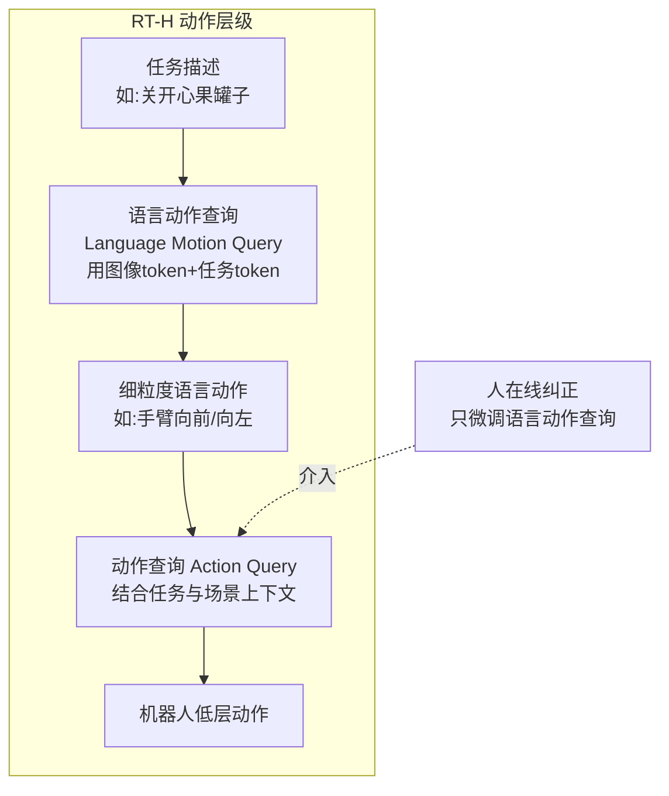

**两个关键步骤**：① **语言动作查询**——据任务描述和视觉观测预测语言动作；② **动作查询**——据预测的语言动作、任务、观测推断精确动作。RT-H 用**单个模型**同时处理两类查询（架构源自 RT-2），共享海量知识支撑所有层级。

**为什么好**：语言动作能编码相似任务的**共享结构**（"捡汽水罐"vs"捡苹果"），跨多任务数据集**更好共享数据**。**人可在线提供语言动作纠正**防任务失败，纠正后 RT-H 达**近乎完美的成功率**——且只需**微调语言动作查询**即可吸收新纠正。

> 💡 **RT-H 的启示**：① 语言动作可连接不同具身数据集（如 OXE），甚至从"只用语言描述动作的视频"学习；② 语言动作可作**先验知识压缩 RL 的动作空间**，让策略学习更高效且**可解释、可纠正**；③ 未来需确定中间层的**最优抽象层次**。

---

## 📌 本章小结

本章是全书的"诊断书 + 路线图"，把"多模态大模型能否通向 AGI"这个大问题拆成了**先破后立**两半：

**先破——8 大挑战**（记忆钩子："评测、设计、对齐、领域、幻觉、鲁棒、可信、可解释"）：

1. **缺评测标准**：开放式对话难打分，"LLM 当裁判"有争议。
2. **设计原则模糊**：数据/算力/性能三难，GAN 因模式崩溃退场，压缩看 ALBERT。
3. **多模态对齐差**：文本 prompt 弱于视觉 prompt，需联合嵌入空间（ImageBind）。
4. **领域专业化不足**：知识截止、单模型学不全、微调开销大 + 灾难性遗忘。
5. **幻觉**：一本正经胡说，靠 CoT/自洽 CoT/RAG 缓解。
6. **鲁棒性威胁**：对抗（永远覆盖不全）+ OOD（数据的"不合理有效性"存疑），PromptBench 评测。
7. **可信度**：编造文献/伪造判例，提出**可信 AGI 的 16 项能力**（最值得背）。
8. **可解释与推理**：黑盒 + 逻辑推理靠虚假模式（GPT-4 只解 38% 侦探谜题）+ 因果推理弱（充分原因难）。

**再立——4 条前沿路线**：

- 🧩 **因果推理**：从相关到因果的三级阶梯（关联/干预/反事实），SCM + 后门/前门干预 + ATE，开源框架 **CausalVLR**。
- 🌐 **世界模型**：LeCun 六模块框架 + **JEPA**（非生成、表示空间预测、四原则防坍缩）+ I/MC/V-JEPA 家族；对比 Sora（生成式、不懂物理）与 V-JEPA（抽象预测）。
- 🤖 **AGI Agent**：`Agent = LLM + 规划 + 反馈 + 工具`，三组件（规划/记忆/工具），从 AutoGPT/BabyAGI 到 XAgent 双循环，AgentBench 评测。
- 🦾 **具身智能**：破解"接地"难题，从 PCA-EVAL 评测、E2WM 注入具身知识，到 TaPA/SayPlan/EmbodiedGPT/RT-H 的任务规划与控制。

**一句话收束**（作者原话精神）：**深度融合计算机视觉、NLP、因果推理、世界模型、具身智能与 Agent，最终诞生的通用 Agent 将极大推进人类社会——这就是多模态大模型迈向 AGI 的道路。**

> 🎯 **面试高频串讲**：
> - "LLM 是不是世界模型？"——不是。它只捕捉统计模式、不懂物理、不能反事实推理（Sora 是反例，V-JEPA/JEPA 是解药）。
> - "Agent 和 ChatGPT 的区别？"——`Agent = LLM + 规划 + 反馈 + 工具`；ChatGPT 只是规划的知识源，缺环境状态/记忆/经验。
> - "后门 vs 前门干预？"——后门砍断 $Z\to X$ 用 $P(Z)$ 边缘化（混淆因子可观测）；前门用两次 do-算子绕过不可观测的 $Z$。
> - "可信 AGI 需要哪些能力？"——16 项（解释/推理/归纳/类比/溯因/心智理论/…/广博知识）。
> - "JEPA 为什么不会坍缩？"——四条原则（①②保留信息、③保证可预测、④最小化潜变量信息）。

---

## 🔗 延伸阅读与关键出处

| 主题 | 关键工作 / 概念 | 出处/机构 |
|------|---------------|----------|
| 规模定律与涌现 | Scaling Laws、Emergent Capabilities | Wei et al. |
| 可信 AGI 16 项能力 | Knowledge + Reasoning 拆解 | 书中 [365] |
| Prompt 鲁棒性评测 | **PromptBench**（4032 对抗 prompt） | `microsoft/Promptbench` |
| 因果推理（相关不蕴含因果） | Pearl 因果之梯、do-算子、SCM/ICM | Pearl；书 [435,527] |
| LLM 因果发现 | Tübingen 97%、CORR2CAUSE、必要/充分原因 | Kiciman et al. [331]、Jin et al. [305] |
| 多模态因果框架 | **CausalVLR**（VLCI/CMCIR/CaCo-CoT） | 中山大学 HCP-Lab [431] |
| 世界模型框架 | 六模块 + MPC + Key-Value Memory | Yann LeCun [360] |
| 联合嵌入预测 | **JEPA / I-JEPA / MC-JEPA / V-JEPA** | LeCun、Meta [23,38] |
| 语言预测未来 | **Dynalang**（基于 DreamerV3） | [413,228] |
| 世界模拟器 | **GAIA-1 / UniSim / Sora** | Wayve/DeepMind/OpenAI [271,802,437] |
| 自主 Agent | **AutoGPT / BabyAGI / XAgent** | [583]、面壁×清华 [687] |
| Agent 评测 | **AgentBench**（8 环境） | 智谱 AI [429] |
| 具身评测与知识 | **PCA-EVAL / E2WM** | [86,775] |
| 具身任务规划 | **SayCan / TaPA / SayPlan / EmbodiedGPT / RT-H** | Google/HCP-Lab/DeepMind [8,768,566,492,44] |

---

> 📖 **写在最后**：本章标题是"迈向 AGI（Toward AGI）"，落点在"**Toward**"这个介词上——多模态大模型还在路上，远未形成统一完整体系。作者的态度既清醒（列出 8 大挑战、多处 LeCun 式批判）又乐观（4 条前沿路线、HCP-Lab 自己的 CausalVLR/E2WM/TaPA 实践）。对读者而言，这一章的价值不在"背结论"，而在**看清 LLM 的能力边界，理解为什么"因果 + 世界模型 + Agent + 具身"是通向 AGI 绕不开的四块拼图**。
