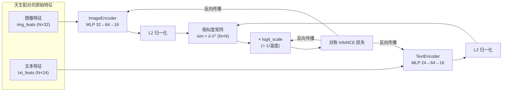
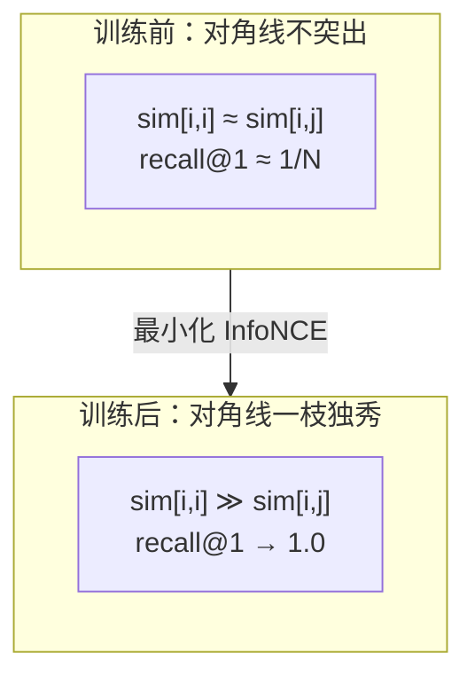
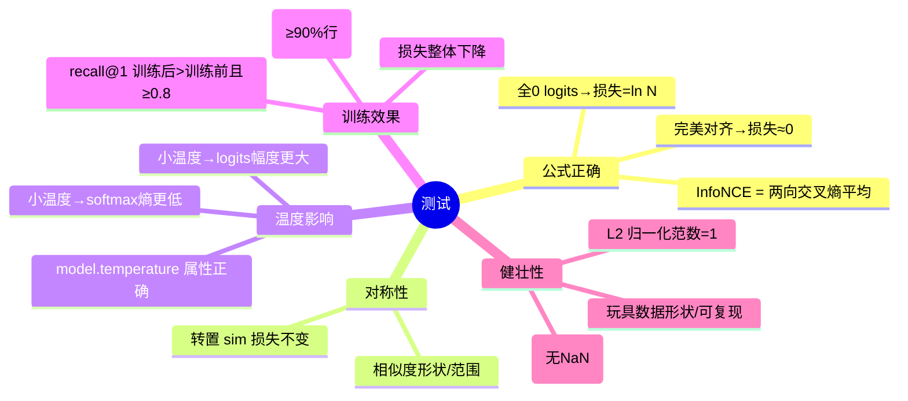

# 🧲 CLIP 式对比学习实战 Lab（纯 torch · CPU · 离线可跑）

> 《Multimodal Large Models》配套项目 01 —— 用一个"玩具版 CLIP"把 **对比学习 / InfoNCE / 温度 / 图文检索** 从公式一路打到能跑的代码。
>
> **全程离线**：不联网、不下预训练模型、不需要任何 API key、不需要 GPU。一条命令训练 + 出图，一条命令跑测试。

---

## 📖 目录

- [1. 这个项目在做什么](#1-这个项目在做什么)
- [2. 30 秒跑起来](#2-30-秒跑起来)
- [3. 🔬 第一性原理：CLIP 到底在优化什么](#3--第一性原理clip-到底在优化什么)
- [4. 数据流全景（mermaid）](#4-数据流全景mermaid)
- [5. 核心代码逐行讲解](#5-核心代码逐行讲解)
  - [5.1 玩具数据 `make_toy_pairs`](#51-玩具数据-make_toy_pairs)
  - [5.2 双塔编码器](#52-双塔编码器)
  - [5.3 L2 归一化与相似度矩阵](#53-l2-归一化与相似度矩阵)
  - [5.4 InfoNCE 对比损失](#54-infonce-对比损失)
  - [5.5 可学习温度 `CLIPModel`](#55-可学习温度-clipmodel)
  - [5.6 检索指标 `recall@1`](#56-检索指标-recall1)
  - [5.7 训练循环](#57-训练循环)
- [6. 运行结果（真实数字）](#6-运行结果真实数字)
- [7. 三张图怎么看](#7-三张图怎么看)
- [8. 测试覆盖了什么](#8-测试覆盖了什么)
- [9. 💡 面试高频 & ⚠️ 常见坑](#9--面试高频--常见坑)
- [10. 📌 小结 & 🔗 延伸](#10--小结---延伸)

---

## 1. 这个项目在做什么

**一句话**：造一批"天生配对"的图/文特征，用两个小编码器把它们投影到同一个空间，再用 **InfoNCE 对比损失**训练，让**配对**的图文越来越像、**非配对**的越来越不像；最后验证——训练后配对相似度（相似度矩阵对角线）占绝对优势，检索 `recall@1` 从 ≈0 提升到 1.0。

| 你会亲手实现 | 对应文件 |
| --- | --- |
| 玩具图/文嵌入器（两塔 MLP） | `clip_lab.py` → `ImageEncoder` / `TextEncoder` |
| InfoNCE 对比损失（对称、带温度） | `clip_lab.py` → `info_nce_loss` / `similarity_matrix` |
| 可学习温度（logit_scale） | `clip_lab.py` → `CLIPModel` |
| 训练循环 + recall@1 | `clip_lab.py` → `train_clip` / `recall_at_1` |
| 单元测试（公式/对称/温度/训练效果） | `tests/test_clip_lab.py` |
| 出图 demo（Agg + 中文字体） | `run_demo.py` |

> 💡 **为什么用"玩具特征"而不是真图片？** CLIP 真正的难点在**对比目标本身**，不在于卷积/Transformer 怎么抽特征。把图像/文本骨干换成"已经抽好的随机特征"，我们就能在 CPU 上几秒钟看清对比学习的全部机理，而不被算力和数据集拖住。真实 CLIP 只是把这里的 `img_feats/txt_feats` 换成 ViT/BERT 的输出而已，**损失部分一字不差**。

---

## 2. 30 秒跑起来

```bash
# 进入项目目录
cd book-multimodal-large-models/projects/01_clip_contrastive_lab

# （可选）装依赖；本机 torch 2.12 CPU / numpy / matplotlib / pytest 已就绪
pip install -r requirements.txt

# ① 跑测试（必过）
python -m pytest -q

# ② 训练 + 出三张图
python run_demo.py
```

运行 `run_demo.py` 后，会在本目录生成：

- `sim_before_after.png` —— 训练前/后相似度热图
- `loss_curve.png` —— 损失 / recall@1 / 温度 曲线
- `retrieval_ranks.png` —— 检索名次分布

> ⚠️ **Windows 控制台坑**：默认 GBK 编码，`print("✅")` 会 `UnicodeEncodeError`。`run_demo.py` 开头已用 `sys.stdout.reconfigure(encoding="utf-8")` 修好。你自己写脚本打印 emoji/特殊符号时也要记得这一步。

---

## 3. 🔬 第一性原理：CLIP 到底在优化什么

CLIP（Contrastive Language–Image Pre-training）的思想极其朴素：

> **把配对的（图，文）在一个共享空间里拉近，把不配对的推远。**

难点全在"怎么把'拉近/推远'写成一个能反向传播的损失"。CLIP 的答案是把它变成一个 **batch 内的分类问题**：

- 一个 batch 有 $N$ 对 `(图_i, 文_i)`。
- 对第 $i$ 张图，它的"正确答案"就是第 $i$ 条文本（**对角线是正样本**），其余 $N-1$ 条文本是**负样本**。
- 于是"**图 → 文检索**"变成一个 $N$ 分类；"**文 → 图检索**"又是一个 $N$ 分类。两个方向的交叉熵取平均，就是 CLIP 损失。

数学上，先做 **L2 归一化**让点积等于**余弦相似度**：

$$
\hat{u}_i = \frac{f_\text{img}(x_i)}{\lVert f_\text{img}(x_i)\rVert}, \quad
\hat{v}_j = \frac{f_\text{txt}(t_j)}{\lVert f_\text{txt}(t_j)\rVert}, \quad
s_{ij} = \hat{u}_i \cdot \hat{v}_j \in [-1, 1]
$$

再除以**温度** $\tau$ 得到 logits，写出对称 InfoNCE：

$$
\mathcal{L} = \frac{1}{2}\underbrace{\left[-\frac{1}{N}\sum_{i=1}^{N}\log\frac{\exp(s_{ii}/\tau)}{\sum_{j=1}^{N}\exp(s_{ij}/\tau)}\right]}_{\text{图}\to\text{文}} + \frac{1}{2}\underbrace{\left[-\frac{1}{N}\sum_{j=1}^{N}\log\frac{\exp(s_{jj}/\tau)}{\sum_{i=1}^{N}\exp(s_{ij}/\tau)}\right]}_{\text{文}\to\text{图}}
$$

> 🔬 **为什么最小化它 = 学到好表示？** InfoNCE 是**互信息**的一个下界（van den Oord 2018）。在"1 个正样本 + N−1 个负样本"里用 softmax 把概率质量推给正样本，等价于最大化配对图文之间互信息的下界。负样本越多（batch 越大），这个下界越紧——这就是 CLIP 要用**超大 batch（32768）**的根本原因。

---

## 4. 数据流全景（mermaid）



训练时相似度矩阵对角线的演化（示意）：



---

## 5. 核心代码逐行讲解

以下代码全部抄录自 `clip_lab.py`，逐段拆解**是什么 / 为什么 / 代价**。

### 5.1 玩具数据 `make_toy_pairs`

```python
img_proto = torch.randn(n_concepts, img_dim, generator=g)   # 图像侧概念原型
txt_proto = torch.randn(n_concepts, txt_dim, generator=g)   # 文本侧概念原型
labels    = torch.randint(0, n_concepts, (n_pairs,), generator=g)
img_feats = img_proto[labels] + noise * torch.randn(n_pairs, img_dim, generator=g)
txt_feats = txt_proto[labels] + noise * torch.randn(n_pairs, txt_dim, generator=g)
```

- **是什么**：先造 `n_concepts` 个"概念"（猫/狗/飞机…），每个概念在图像侧、文本侧各有一个**原型向量**。第 $i$ 个样本随机抽一个概念，图特征 = 该概念图像原型 + 噪声，文特征 = 同概念文本原型 + 噪声。
- **为什么这样造**：
  - 图、文原型**维度不同、数值无关**（`img_dim=32` vs `txt_dim=24`）——这模拟"两种模态原始特征根本不能直接比较"，逼模型**学一个投影**才能对齐。
  - 因为第 $i$ 张图和第 $i$ 条文本共享同一个概念，它们**天生配对**；不同样本可能撞到同一概念，于是存在"难负样本"，任务不平凡。
- **代价**：`noise` 越大越难；`n_concepts` 越小越容易撞概念、越难区分。用 `generator` 固定种子保证**可复现**（测试依赖这一点）。

### 5.2 双塔编码器

```python
class ImageEncoder(nn.Module):
    def __init__(self, in_dim, embed_dim=16, hidden=64):
        super().__init__()
        self.net = nn.Sequential(
            nn.Linear(in_dim, hidden),   # 升维，给非线性留空间
            nn.GELU(),                   # 平滑激活（CLIP/ViT 常用）
            nn.Linear(hidden, embed_dim),# 投影到共享空间
        )
    def forward(self, x):
        return self.net(x)               # 注意：这里不归一化，交给损失统一处理
```

- **是什么**：两个结构相同、**参数独立**的两层 MLP，各自把一种模态投影到共享的 `embed_dim=16` 维空间。
- **为什么两塔独立**：图像和文本的统计分布完全不同，共享权重会互相打架。CLIP 也是**两个独立塔**（ViT + Transformer 文本塔）。
- **⚠️ 坑**：`forward` **故意不做 L2 归一化**。归一化统一放到相似度计算里做，避免"编码器里归一化一次、损失里又归一化一次"的重复/不一致。

### 5.3 L2 归一化与相似度矩阵

```python
def l2_normalize(x, eps=1e-8):
    return x / x.norm(dim=-1, keepdim=True).clamp_min(eps)   # 放到单位球面

def similarity_matrix(img_emb, txt_emb, temperature=0.07):
    img_n = l2_normalize(img_emb)
    txt_n = l2_normalize(txt_emb)
    sim = img_n @ txt_n.t()          # sim[i,j] = cos(图 i, 文 j) ∈ [-1,1]
    return sim / temperature         # 除以温度 = 缩放 logits
```

- **是什么**：先把每个嵌入向量投到**单位球面**（L2 范数=1），此时**点积 = 余弦相似度**；再除以温度得到 logits。
- **为什么归一化**：让相似度只关心**方向**、不关心**长度**。否则某个向量把模长学得巨大就能"作弊"拿高相似度。
- **⚠️ 坑**：`clamp_min(eps)` 防止零向量除以 0（`NaN`）。真实训练里 warm-up 阶段偶尔会出现接近零的嵌入。

### 5.4 InfoNCE 对比损失

```python
def info_nce_loss(sim):
    n = sim.shape[0]
    targets = torch.arange(n, device=sim.device)  # 正确答案就是 0,1,...,N-1（对角线）
    loss_i2t = F.cross_entropy(sim,     targets)   # 每行一个 N 分类（图找文）
    loss_t2i = F.cross_entropy(sim.t(), targets)   # 每列一个 N 分类（文找图）
    return 0.5 * (loss_i2t + loss_t2i)
```

- **是什么**：把 `(N,N)` 相似度矩阵**每一行**当作一个 $N$ 分类的 logits，第 $i$ 行正确类别是 $i$；`sim.t()` 换成列方向。两方向交叉熵取平均。
- **为什么 `targets = arange(N)`**：因为我们把数据摆成"第 $i$ 张图 ↔ 第 $i$ 条文本"，所以**对角线就是标签**。这是 CLIP 实现里最漂亮的一招——不需要额外标注。
- **🔬 关键洞察**：`F.cross_entropy(sim, targets)` 内部 = `log_softmax` + `nll_loss`。对第 $i$ 行做 softmax，就是"图 $i$ 应该在所有文本里选中文 $i$"的概率分布。最小化 = 把对角线 logit 顶上去、把同行其它 logit 压下去 = **对角占优**。

### 5.5 可学习温度 `CLIPModel`

```python
init_logit_scale = torch.log(torch.tensor(1.0 / init_temperature))
self.log_logit_scale = nn.Parameter(init_logit_scale)   # 学 log(1/τ)，不直接学 τ
...
logit_scale = self.log_logit_scale.clamp(max=torch.log(torch.tensor(100.0))).exp()
sim = (img_n @ txt_n.t()) * logit_scale
```

- **是什么**：温度 $\tau$ 不是常数，而是**可学习参数**。CLIP 的技巧是学 $\log(1/\tau)$（叫 `logit_scale`），而不是直接学 $\tau$。
- **为什么学 log**：
  - `exp()` 保证 `logit_scale` 恒为正 → $\tau$ 恒为正，不会学出负温度这种非法值；
  - 以**乘性**方式变化，梯度更平稳。
- **⚠️ 坑（复刻官方）**：`clamp(max=log(100))` 把 `logit_scale` 上限锁在 100，即 $\tau \geq 0.01$。不 clamp 的话训练可能把温度学到极小，logits 爆炸 → `NaN`。CLIP 官方源码里就有这一句。

### 5.6 检索指标 `recall@1`

```python
def recall_at_1(sim):
    n = sim.shape[0]
    targets = torch.arange(n)
    i2t = (sim.argmax(dim=1) == targets).float().mean()  # 每行最大值是否在对角线
    t2i = (sim.argmax(dim=0) == targets).float().mean()  # 每列最大值是否在对角线
    return float(0.5 * (i2t + t2i))
```

- **是什么**：对每个查询取**最相似**的候选，命中配对（对角）就算 `recall@1` 成功；双向平均。
- **为什么它是最直观的验收指标**：损失是"软"的、不好读；`recall@1` 直接回答"检索对了几成"。随机基线 ≈ $1/N$，训练后应逼近 1.0。

### 5.7 训练循环

```python
for step in range(steps):
    opt.zero_grad()
    _, loss = model(img_feats, txt_feats)   # 全 batch 前向（玩具规模，直接全量）
    loss.backward()
    opt.step()
    with torch.no_grad():                   # 评估不建图，省内存
        cos = l2_normalize(img_emb) @ l2_normalize(txt_emb).t()
        history["recall"].append(recall_at_1(cos))
```

- **是什么**：标准 Adam 全量梯度下降，每步记录 loss / recall@1 / 温度。
- **为什么全量**：64 对样本，直接一次算完整个相似度矩阵最省事、最清晰。真实 CLIP 用 mini-batch + 分布式，但**每个 batch 内部的逻辑和这里完全一样**。
- **细节**：评估用**不带温度缩放**的纯余弦相似度（范围 [-1,1]），画热图更直观；训练用带温度的 logits 算损失。二者分开不要混。

---

## 6. 运行结果（真实数字）

在本机（Python 3.13 / torch 2.12 CPU）实际跑 `python run_demo.py` 的输出：

```
step    0 | loss 7.9673 | recall@1 0.070 | temp 0.0704
step   50 | loss 1.2304 | recall@1 0.773 | temp 0.0698
step  100 | loss 0.0102 | recall@1 1.000 | temp 0.0624
step  150 | loss 0.0033 | recall@1 1.000 | temp 0.0609
step  200 | loss 0.0022 | recall@1 1.000 | temp 0.0601
step  250 | loss 0.0016 | recall@1 1.000 | temp 0.0594
step  299 | loss 0.0013 | recall@1 1.000 | temp 0.0589
----------------------------------------------------------------
训练前 recall@1 = 0.008
训练后 recall@1 = 1.000
训练后 等效温度 = 0.0589
对角均值 0.938 vs 非对角均值 -0.014
```

读数解读：

| 指标 | 训练前 | 训练后 | 说明 |
| --- | --- | --- | --- |
| `recall@1` | **0.008** (≈ 1/N=1/64) | **1.000** | 从随机瞎猜到全部命中 |
| 对角均值（配对相似度） | 接近 0 | **0.938** | 配对图文几乎共线 |
| 非对角均值（非配对） | 接近 0 | **−0.014** | 非配对被推到接近正交 |
| InfoNCE 损失 | 7.97 | **0.0013** | 逼近 0 |

> 💡 **配对 0.938、非配对 −0.014** 这组数字就是 CLIP 学好的标志：正样本挤到一起（余弦≈1），负样本互相排斥（余弦≈0，正交）。

---

## 7. 三张图怎么看

| 文件 | 看点 |
| --- | --- |
| **`sim_before_after.png`** | 左（训练前）整张图颜色杂乱、对角线不突出；右（训练后）**对角线一条亮黄线**，其余暗——这就是"配对上升、非配对下降"的可视化铁证。 |
| **`loss_curve.png`** | 红线（损失）陡降到 ≈0；蓝线（recall@1）快速冲到 1.0；绿虚线（温度）从 0.07 缓慢自适应到 ≈0.059。 |
| **`retrieval_ranks.png`** | 训练后"图→文"检索里，配对文本的名次几乎全落在 **0**（recall@1 命中），柱状图堆在最左。 |

---

## 8. 测试覆盖了什么

`python -m pytest -q` → **14 passed**。分四大块：



- **`test_info_nce_random_is_near_log_n`** 用第一性原理验证：全 0 logits 时损失恰为 $\ln N$（softmax 均匀 → 正样本概率 $1/N$ → 交叉熵 $-\ln(1/N)$）。
- **`test_info_nce_is_symmetric_under_transpose`** 验证"图↔文"角色可交换，损失不变——CLIP 对称性的核心。
- **`test_temperature_affects_softmax_sharpness`** 用**熵**量化"温度越小分布越尖锐"。
- **`test_training_makes_diagonal_dominant`** / **`test_recall_improves_after_training`** 直接验收对比学习是否真的生效。

---

## 9. 💡 面试高频 & ⚠️ 常见坑

### 💡 面试高频

1. **CLIP 的损失是什么？** 对称 InfoNCE：batch 内每张图对所有文本做 $N$ 分类（对角线为正样本），每条文本对所有图做 $N$ 分类，两方向交叉熵平均。
2. **为什么要 L2 归一化？** 让点积=余弦相似度，只比方向不比模长，防止用"放大模长"作弊。
3. **温度 $\tau$ 的作用？** 缩放 logits 控制 softmax 尖锐度。$\tau$ 小 → 分布尖锐 → 对难负样本敏感、梯度大但易不稳；$\tau$ 大 → 平缓、训练温和但慢。CLIP 用**可学习** `logit_scale=log(1/τ)` 并 clamp 到 $\tau\geq0.01$。
4. **为什么 CLIP 要超大 batch？** InfoNCE 是互信息下界，负样本越多（batch 越大）下界越紧、表示越好。CLIP 用 batch=32768。
5. **零样本分类怎么做？** 把类别名套模板（"a photo of a {class}"）编码成文本嵌入，图像嵌入和它们算相似度取最大——本质就是这里的"图→文检索"。
6. **InfoNCE 和普通交叉熵的关系？** InfoNCE 就是在"1 正 + N−1 负"上的交叉熵，只不过负样本来自 batch 内其它样本，标签是对角线。

### ⚠️ 常见坑

| 坑 | 后果 | 解法 |
| --- | --- | --- |
| 忘记 L2 归一化 | 相似度被模长主导，训练不稳 | 点积前先 `l2_normalize` |
| 温度学飞（→0） | logits 爆炸 → `NaN` | `clamp(logit_scale, max=log(100))` |
| 编码器里也归一化、损失里又归一化 | 双重归一化/梯度异常 | 归一化只在**一处**做 |
| 零向量除法 | `NaN` | `norm().clamp_min(eps)` |
| batch 内有**重复样本**（两张图配同一文） | 对角线不再是唯一正样本，损失有下界打不平 | 去重 / 用 soft label |
| Windows `print(emoji)` | `UnicodeEncodeError` | `sys.stdout.reconfigure(encoding="utf-8")` |
| matplotlib 中文变方框、负号消失 | 图不可读 | `font.sans-serif=["Microsoft YaHei"]` + `axes.unicode_minus=False` |
| 评估用带温度的 logits 画热图 | 数值范围超出 [-1,1] 不直观 | 评估/画图用纯余弦，训练才乘温度 |

---

## 10. 📌 小结 & 🔗 延伸

### 📌 小结

- CLIP 的灵魂就三步：**L2 归一化 → 相似度矩阵 → 对称 InfoNCE**，把"配对拉近、非配对推远"变成一个 batch 内的双向 $N$ 分类。
- **温度**是核心超参，CLIP 把它做成可学习的 `logit_scale` 并 clamp 防爆。
- 本 Lab 用玩具特征在 CPU 上几秒复现：`recall@1` **0.008 → 1.000**，配对余弦 **0.938** vs 非配对 **−0.014**，对角线在热图上一枝独秀。
- **换成真实 CLIP** 只需把 `img_feats/txt_feats` 换成 ViT/BERT 输出、把全量换成大 batch 分布式——**损失代码一字不改**。

### 🔗 延伸

- **原始论文**：Radford et al., *Learning Transferable Visual Models From Natural Language Supervision*（CLIP, 2021）。
- **InfoNCE**：van den Oord et al., *Representation Learning with Contrastive Predictive Coding*（2018）——温度与互信息下界的来源。
- **后续可加**：
  - 把玩具编码器换成真正的小 CNN + 词袋文本塔；
  - 加**难负样本挖掘** / 队列（MoCo 式）扩大有效负样本数；
  - 做**零样本分类** demo：给几个"类别文本"，看图像被分到哪一类；
  - 对比 **SigLIP**（把 softmax 换成 sigmoid，摆脱对大 batch 的依赖）。

---

> 🧪 **验收命令**：`python -m pytest -q`（14 passed）+ `python run_demo.py`（生成 3 张 PNG）。全部离线、CPU、秒级。
