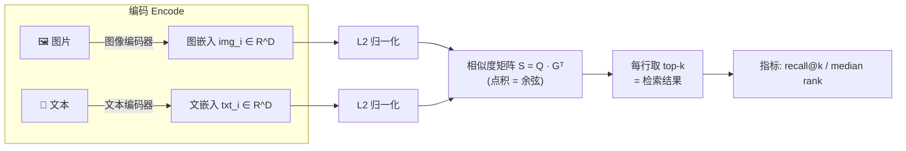
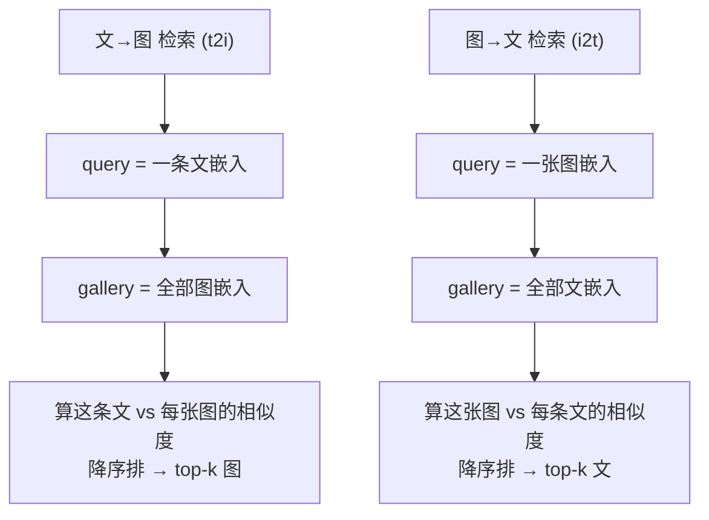
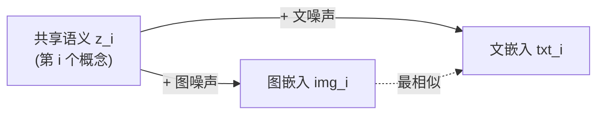

# 🔎 项目 02 · 跨模态检索实战 (Cross-Modal Retrieval)

> 《Multimodal Large Models》配套动手项目 · 本机 CPU 秒级可跑 · 离线不联网不下模型
>
> 主题:给一批「配对好」的 **(图嵌入 image embedding, 文嵌入 text embedding)**,实现
> **文→图 (text-to-image)** 与 **图→文 (image-to-text)** 的 top-k 检索,计算
> **recall@k** 与 **median rank**,并亲手演示 **归一化 (normalization)** 与
> **温度 (temperature)** 对检索的影响。

这是 CLIP / BLIP / ALIGN 这类「双塔对比学习」多模态大模型**最直接的下游应用**:
把图和文都编码成同一空间里的向量,然后靠**向量相似度**互相检索。搜索引擎的
「以文搜图」、电商的「以图搜商品描述」、多模态 RAG 的「检索相关图文」,底层都是这一套。

---

## 📁 目录结构

```
02_crossmodal_retrieval/
├── README.md              # 你正在读的这份 (原理 + 逐行讲解 + 面试点 + 坑)
├── requirements.txt       # 依赖: numpy / matplotlib / pytest (torch 可选)
├── retrieval.py           # 🌟 核心库: 归一化/相似度/top-k/rank/recall/温度/加噪
├── toydata.py             # 玩具图文嵌入生成器 (共享语义 + 模态噪声)
├── run_demo.py            # 可视化 demo: recall@k 曲线 + 归一化/温度 + 检索样例
├── tests/
│   └── test_retrieval.py  # 17 个单测: 自检索R@1=1 / 加噪下降 / 单调 / rank正确 ...
└── figures/               # 运行 demo 后自动生成的 3 张图
    ├── recall_curve.png
    ├── norm_vs_temp.png
    └── retrieval_examples.png
```

---

## 🚀 如何运行

```bash
# 0) 进入项目目录
cd book-multimodal-large-models/projects/02_crossmodal_retrieval

# 1) (可选) 装依赖 —— 若本机已有 numpy/matplotlib/pytest 可跳过
pip install -r requirements.txt

# 2) 跑测试 (必须全绿)
python -m pytest -q
#  期望: 17 passed

# 3) 跑可视化 demo (在 figures/ 下出 3 张图 + 终端打印指标表)
python run_demo.py
```

> ⚠️ **Windows 终端中文乱码?** 那只是 GBK 控制台显示 `print` 中文时的花屏,**不影响程序正确性**,
> 图里的中文与文件里的中文都是好的。想让终端也正常显示,先执行 `chcp 65001` 切到 UTF-8 即可。

---

## 🧭 一图看懂:检索到底在干什么



**核心只有一句话**:把图和文都变成同一个 `D` 维空间里的向量,谁和谁的**方向**最接近(余弦相似度最大),就认为它们最匹配。检索 = **排序问题**。



两个方向**完全对称**:只是把谁当 query、谁当 gallery 互换而已。代码里就是
`retrieval_report(txt, img)`(文→图)和 `retrieval_report(img, txt)`(图→文)。

---

## 🔬 第一性原理:为什么用「点积/余弦」而不是别的?

> 🔬 **第一性原理框**
>
> 检索要的不是「两个向量差多少」的绝对距离,而是「谁和 query 最像」的**相对排序**。
> - 点积 `a·b = |a||b|cos(θ)` 一次矩阵乘法 `Q @ Gᵀ` 就能批量把所有 query 对所有候选算完,**极快**(GPU 上就是一个 GEMM)。
> - 但点积混入了**长度** `|a||b|`:一个「特别长」的向量会天然拿到更大的点积,不公平地排到前面 —— 这叫 **hubness / 长度偏置**。
> - **L2 归一化**把每个向量长度压成 1,点积就退化成**纯余弦** `cos(θ)`,只反映**方向是否一致**,这才是语义相似度想要的。
>
> 所以 CLIP 的官方推理代码里,第一步永远是 `features / features.norm(dim=-1, keepdim=True)`。

---

## 📦 核心库 `retrieval.py` 逐块讲解

整个库只有 8 个函数,像搭积木一样从「归一化」一路搭到「指标」。下面逐块讲**是什么 / 为什么 / 怎么用 / 代价**。

### ① `l2_normalize` —— 把向量压成单位长度

```python
def l2_normalize(x, eps=1e-12):
    x = np.asarray(x, dtype=np.float64)
    norm = np.linalg.norm(x, axis=-1, keepdims=True)   # 每行的 L2 范数, 形状 (N,1)
    return x / np.maximum(norm, eps)                   # 除以范数; 用 eps 兜底防 0/0
```

**逐行**:
- `np.linalg.norm(x, axis=-1, keepdims=True)`:沿**最后一维**(特征维)求 √(Σxᵢ²),`keepdims=True` 让结果保持 `(N,1)` 好**广播**回 `(N,D)`。
- `np.maximum(norm, eps)`:把范数为 0 的行(全 0 向量)抬成 `eps`,避免 `0/0 = NaN`。归一化后全 0 行仍是 0 向量,不炸。

> ⚠️ **常见坑**:忘了 `keepdims=True`,`norm` 形状变成 `(N,)`,`x / norm` 会触发**错误的广播**(按列而非按行),结果全错还不报错。这是新手 debug 半天的经典坑。

> 💡 **面试高频**:「为什么检索前要归一化?」标准答案三连——① 让点积等价于余弦,只比方向;② 消除长度偏置 / hubness;③ 数值稳定(避免相似度尺度失控)。

### ② `similarity_matrix` —— 一次矩阵乘算完所有相似度

```python
def similarity_matrix(query, gallery, normalize=True):
    q = np.asarray(query, dtype=np.float64)
    g = np.asarray(gallery, dtype=np.float64)
    if normalize:
        q = l2_normalize(q); g = l2_normalize(g)
    return q @ g.T          # (Nq,D)@(D,Ng) = (Nq,Ng)
```

`S[i,j]` = 第 `i` 个 query 与第 `j` 个 gallery 的相似度。`normalize=True` 时它就是**余弦相似度**。

> 💡 **代价 / 扩展**:这是稠密全比对,复杂度 `O(Nq·Ng·D)`。库里只有几百个向量,瞬间完成;但真实检索库有**上亿**向量时,不能全比对,要上 **FAISS / ScaNN / HNSW** 等 **ANN(近似最近邻)** 索引,用「牺牲一点召回换几个数量级的速度」。面试常问:「亿级图库怎么做以文搜图?」→ 双塔离线编码 + ANN 在线检索。

### ③ `topk_indices` —— 每个 query 取最像的 k 个

```python
def topk_indices(sim, k):
    k = int(min(k, ng))
    part = np.argpartition(-sim, kth=k-1, axis=1)[:, :k]   # O(N) 粗选前 k 大(无序)
    part_scores = np.take_along_axis(sim, part, axis=1)
    order = np.argsort(-part_scores, axis=1)               # 只对这 k 个精排
    return np.take_along_axis(part, order, axis=1)         # top-k 下标, 第0列最像
```

**为什么不用 `np.argsort` 全排序?** 全排序是 `O(N log N)`。`np.argpartition` 先用
**快速选择 (quickselect)** `O(N)` 把「最大的 k 个」粗略拎出来(内部无序),再只对这 `k` 个做
排序 —— 当 `k << N` 时省很多。这是检索工程里的标准套路。

> ⚠️ **坑**:取负号 `-sim` 是因为 `argpartition/argsort` 默认**升序**(找最小),我们要**最大**。忘了取负会把最不像的排在前面。

### ④ `ranks_of_ground_truth` —— 正确答案排第几名(检索的灵魂)

```python
def ranks_of_ground_truth(sim, gt=None):
    if gt is None: gt = np.arange(nq)               # 默认对角线配对(自检索)
    gt_scores = np.take_along_axis(sim, gt[:,None], axis=1)  # 正确项的分数 (Nq,1)
    higher = (sim > gt_scores).sum(axis=1)          # 比它「严格更高」的候选个数
    return higher + 1                               # rank = 1 + 更高的个数
```

**排名定义(务必记牢)**:`rank = 1 + (严格比正确项分数高的候选数)`。

- 用**严格大于 `>`** 而不是 `>=`:这样**并列时正确项不会把自己算进去**,能拿到 rank 1。若用 `>=`,自己也满足 `sim >= gt_scores`,`higher` 至少为 1,`rank` 至少为 2 —— **系统性偏大 1**,是很隐蔽的 bug。
- `gt=None` 时默认第 `i` 个 query 的正确答案就是第 `i` 个 gallery(**对角线**),对应「第 i 图↔第 i 文」这种配对好的数据。

> 💡 **面试高频**:「recall@1、median rank 怎么算?」→ 先算每个 query 的正确答案 rank,再 `mean(rank<=k)` 得 recall@k,`median(rank)` 得 MedR。会亲手写 rank 是加分项。

### ⑤⑥ `recall_at_k` / `median_rank` —— 两个标准指标

```python
def recall_at_k(ranks, k):
    return float((ranks <= k).mean())      # 正确项落在 top-k 的 query 比例

def median_rank(ranks):
    return float(np.median(ranks))         # 正确项排名的中位数
```

| 指标 | 含义 | 越大/小越好 | 为什么这么定义 |
|------|------|:---:|------|
| **recall@1** | top-1 直接命中率 | 越大越好 | 最严苛,直接反映「一把中」的能力 |
| **recall@5 / @10** | 正确项进 top-5/10 的比例 | 越大越好 | 现实里常展示多条,更宽松也更实用 |
| **median rank (MedR)** | 排名中位数 | **越小越好** | 用中位数**抗离群点**:少数超难样本 rank 高达几百,会把**平均**拉爆,中位数稳健 |

> 🔬 **为什么 MedR 用中位数不用均值?** 检索排名分布是**重尾**的——大部分 query rank 很小,少数「怎么都检索不对」的 rank 极大。均值被这些离群点主导,失真;中位数只看「一半以上 query 好到什么程度」,更能代表典型表现。CLIP/BLIP 论文报告的都是 `R@1 / R@5 / R@10 + MedR` 这套组合。

### ⑦ `softmax_retrieval_probs` —— 温度登场

```python
def softmax_retrieval_probs(sim, temperature=1.0):
    logits = sim / temperature                        # 温度缩放
    logits = logits - logits.max(axis=1, keepdims=True)  # 数值稳定: 减每行最大值
    ex = np.exp(logits)
    return ex / ex.sum(axis=1, keepdims=True)         # 每行归一成概率分布
```

把相似度按行变成**概率分布** `p_ij = exp(s_ij/T) / Σ exp(s_ij'/T)`:

- **`T → 0`(低温)**:分布**锐化**,最像那条概率→1,极度自信。
- **`T → ∞`(高温)**:分布**平滑**,趋近均匀,谁都差不多。

> 🔬 **第一性原理:温度不改变检索排序!**
> `s → s/T` 是**单调递增**变换(T>0),它**不改变每行内部的大小顺序**,所以 **top-k 排序、recall@k、median rank 全都与 T 无关**。温度只决定概率「有多尖」,即**置信度的软硬**,不决定「谁排第一」。
> 这一点是本项目一条单测 `test_temperature_does_not_change_ranking` 的断言依据,也是最容易被误解的地方。

> 💡 **那 CLIP 训练里的温度有啥用?** 训练时温度出现在**对比损失**里(CLIP 学一个可训练的 `logit_scale = 1/T`,初始约对应温度 0.07)。它把挤在 `[-1,1]` 的余弦相似度**拉开**,让 softmax 对比损失的梯度更好,**影响的是「学到的嵌入长什么样」**;而推理检索时,温度对**固定嵌入的排序**没有影响。区分「训练期温度塑造表征」与「推理期温度只改置信度」是面试送分点。

- `logits - logits.max(...)`:标准**数值稳定 softmax**,先减每行最大值再 `exp`,防止 `exp(大数)` 溢出成 `inf`。结果与不减完全等价(分子分母同乘一个常数)。

### ⑧ `add_noise` —— 制造「对齐不完美」

```python
def add_noise(x, sigma, rng=None):
    if sigma <= 0: return x.copy()
    if rng is None: rng = np.random.default_rng()
    return x + rng.normal(0.0, sigma, size=x.shape)
```

给嵌入加高斯噪声,模拟图文对齐**没那么完美**。`sigma` 越大,图/文越对不上,**recall 下降、median rank 上升**。这是测试与 demo 里「让检索变难」的开关。

---

## 🧪 玩具数据 `toydata.py`:凭空造出会「配对」的图文嵌入

真实 CLIP 嵌入要跑几亿参数模型 + 一堆图片,离线拿不到。我们用一个
**「共享语义 + 各自模态噪声」** 的生成过程造数据:

```python
z   = rng.normal(size=(n, dim))                 # 共享语义(代表「猫在沙发上」这类概念)
img = z + rng.normal(0, modality_sigma, ...)    # 图嵌入 = 语义 + 图像模态噪声
txt = z + rng.normal(0, modality_sigma, ...)    # 文嵌入 = 语义 + 文本模态噪声
```



因为 `img_i` 和 `txt_i` **共享同一个 `z_i`**,它俩天然最像 → **完美情况自检索 recall@1 = 1**。
`modality_sigma` 越大,两个模态各自跑偏越多,越难对上 —— 这正好复现真实检索里
「模型对齐得好不好直接决定 recall」的现象。

> 💡 这套「共享隐变量 + 模态特定噪声」正是多模态表征学习的**理想化模型**:好的对比学习目标就是要把同一概念的图和文**拉近**、不同概念的**推远**,让 `z` 主导、噪声可忽略。

---

## 📊 `run_demo.py`:三张图讲清三件事

运行 `python run_demo.py` 生成 `figures/` 下三张图。matplotlib 关键设置(**离线出中文图必备**):

```python
import matplotlib
matplotlib.use("Agg")                                   # 无界面后端: 只出图不弹窗
import matplotlib.pyplot as plt
plt.rcParams["font.sans-serif"] = ["Microsoft YaHei", "SimHei"]  # 中文字体
plt.rcParams["axes.unicode_minus"] = False              # 负号正常显示(否则显示成方框)
```

> ⚠️ **坑三连**:①不设 `Agg` 在无显示环境(服务器/CI)会报错或卡住;②不设中文字体,标题里的中文全变**豆腐块 □□□**;③不设 `unicode_minus=False`,坐标轴负号会显示成一个奇怪的框。这三行是 llm-action 全仓中文出图的标配。

### 图 1 `recall_curve.png` —— recall@k 曲线 + 噪声影响

左「文→图」、右「图→文」,每张里画 σ=0/0.5/1.0 三条噪声档位的 recall@k 曲线(x 轴对数)。

**能读出三件事**:
1. **每条曲线随 k 单调上升**(k 越大越容易命中)—— 对应单测 `test_recall_monotonic_in_k`。
2. **噪声越大曲线越低**(绿→橙→红逐级下沉)—— 对应 `test_noise_degrades_recall`。
3. `k` 大到等于图库大小时,recall 必然到 1(正确项一定在库里)。

终端还打印一张指标表:

```
  方向    σ    R@1    R@5    R@10   MedR
  ----------------------------------------
   t2i  0.0  0.904  0.984  0.994  1
   t2i  0.5  0.804  0.950  0.980  1
   t2i  1.0  0.522  0.800  0.892  1
   i2t  0.0  0.906  0.984  0.998  1
   ...
```

> ⚠️ **实验设计坑**:比较不同 σ 时,每个档位必须用**同一颗种子的新 `rng`**(`np.random.default_rng(100)`),否则在**同一条噪声流**上连续采样,σ=1 和 σ=2 抽到的噪声不独立,曲线会出现**非单调的诡异抖动**(σ 大的反而 recall 高)。demo 里特意每档 `rng = np.random.default_rng(100)` 重开,保证公平可比。这是很多人复现实验对不上数的隐藏原因。

### 图 2 `norm_vs_temp.png` —— 归一化改结果 / 温度不改排序

- **左**:人为给文嵌入乘上 0.05~20 倍的随机缩放(制造**长度偏置**),对比「不归一化 vs L2 归一化」的 recall。结果 **R@1 从 0.81 提升到 0.93** —— 归一化确实消除了长度偏置、改变了检索结果。
- **右**:同一条 query 对全库的 top-8 概率,画 T=0.05/0.2/1.0 三条。**位次(x 轴)完全不变**,变的只是曲线「有多尖」—— 直观证明温度只改置信度、不改排序。

### 图 3 `retrieval_examples.png` —— 检索样例热力条

挑 6 条文本 query,每行画它检索到的 top-5 图(**绿=正确配对被检出,灰=其它**),行标注 `rank`:

- 前 3 行 `rank=1`:正确图直接排 top-1(绿块在最左)。
- 第 4 行 `rank=3`:正确图排在 top-3(绿块在第 3 列)。
- 后 2 行 `rank=9/11`:正确图**掉出 top-5**,五个全灰 —— 直观展示「recall@5 没命中」长什么样。

> 这张图把抽象的 rank / recall@k 变成了**看得见的检索结果**,一眼理解「rank 就是正确答案的位次,recall@k 就是有没有进前 k」。

---

## ✅ 测试 `tests/test_retrieval.py`:17 个断言守住正确性

```bash
python -m pytest -q
# 17 passed in 0.14s
```

| 测试 | 断言了什么 | 对应的硬性要求 |
|------|-----------|:---:|
| `test_self_retrieval_recall1_is_one` | 集合对自己检索,R@1=1、MedR=1 | ✅ 自检索 R@1=1 |
| `test_easy_paired_recall1_is_one` | 近乎完美对齐的图文对,文→图 R@1=1 | ✅ |
| `test_noise_degrades_recall` | σ 递增时 R@1 单调不增,首尾显著下降 | ✅ 加噪后下降 |
| `test_noise_increases_median_rank` | 加噪后 MedR 不减 | ✅ |
| `test_recall_monotonic_in_k` | recall@k 关于 k 单调不减;k=N 时 recall=1 | ✅ recall@k 单调 |
| `test_ranks_hand_crafted` | 手工相似度矩阵,rank=[1,2,3],recall/MedR 全对 | ✅ rank 计算正确 |
| `test_ranks_with_custom_gt` | 指定非对角线 gt,rank 正确 | ✅ |
| `test_ranks_tie_handling` | 全并列时 rank=1(严格 `>` 不自算) | ✅ |
| `test_topk_indices_order_and_shape` | top-k 下标降序、形状正确 | |
| `test_topk_k_larger_than_gallery` | k 超库大小自动裁剪不报错 | |
| `test_l2_normalize_unit_norm` | (3,4)→(0.6,0.8);全 0 行不 NaN | |
| `test_normalize_changes_retrieval` | 归一化前后结论可不同 | |
| `test_temperature_does_not_change_ranking` | 任意 T 下 rank 与原始完全一致 | 温度不改排序 |
| `test_softmax_probs_valid` | 每行和=1;全 0 行→均匀;概率合法 | |
| `test_lower_temperature_sharper` | 低温分布更尖 | |
| `test_softmax_bad_temperature_raises` | T≤0 抛 `ValueError` | |
| `test_both_directions_run` | t2i 与 i2t 都能算且 R@1=1 | 双向检索 |

**手算校验的那条最值得看**(把指标定义焊死):

```python
sim = np.array([
    [0.9, 0.1, 0.2],  # 对角项 0.9 是本行最大 → rank 1
    [0.5, 0.2, 0.1],  # 对角项 0.2, 只有 0.5 更大 → rank 2
    [0.8, 0.3, 0.1],  # 对角项 0.1, 0.8 与 0.3 更大 → rank 3
])
ranks = ranks_of_ground_truth(sim)          # [1, 2, 3]
recall_at_k(ranks, 1) == 1/3                 # 只有 query0 进 top-1
recall_at_k(ranks, 2) == 2/3                 # query0,1 进 top-2
median_rank(ranks)    == 2.0                 # median([1,2,3]) = 2
```

---

## 🐍 附:用 PyTorch 写等价的相似度(可选对照)

核心逻辑用 numpy 已经讲透,这里给一段 torch 等价片段,方便你把它接到真实 CLIP 输出上
(CLIP 的 `model.encode_image` / `encode_text` 返回的就是 `(N,D)` 张量):

```python
import torch
import torch.nn.functional as F

# img_feat, txt_feat: (N, D) 的真实 CLIP 嵌入
img = F.normalize(img_feat, dim=-1)          # L2 归一化, 等价 l2_normalize
txt = F.normalize(txt_feat, dim=-1)
sim = txt @ img.t()                          # (N,N) 余弦相似度, 文→图

# top-k 检索
topk = sim.topk(k=5, dim=1).indices          # (N,5) 每条文的 top-5 图下标

# 正确项 rank (对角线 gt)
gt_scores = sim.diag().unsqueeze(1)          # (N,1)
ranks = (sim > gt_scores).sum(dim=1) + 1     # (N,) 与 numpy 版逻辑一致
recall_at_1 = (ranks <= 1).float().mean()
```

> 💡 一行 `txt @ img.t()` 在 GPU 上就是一个 GEMM,亿级检索前把它换成 FAISS 即可。**逻辑和本项目的 numpy 版一模一样**——你已经掌握了工业检索的内核。

---

## ⚠️ 常见坑总集(踩过就长记性)

| 坑 | 现象 | 正解 |
|----|------|------|
| 归一化忘 `keepdims=True` | 广播成按列除,结果全错还不报错 | `norm(..., keepdims=True)` |
| 全 0 向量归一化 | 出 `NaN`,污染整个相似度矩阵 | `np.maximum(norm, eps)` 兜底 |
| rank 用 `>=` 计数 | 正确项把自己算进去,rank 系统性 +1 | 用**严格 `>`** |
| 不归一化就检索 | 长向量霸榜,recall 虚低 | 检索前先 L2 归一化 |
| 以为调温度能提 recall | 白折腾,排序压根不变 | 温度只改置信度;要提 recall 得改**嵌入/模型** |
| 比较不同 σ 复用同一 rng | 曲线非单调抖动,复现对不上 | 每个实验档位**重开同种子 rng** |
| 忘设 matplotlib 中文字体 | 图里中文全是 □□□ | `font.sans-serif=["Microsoft YaHei","SimHei"]` |
| 忘设 `unicode_minus=False` | 坐标轴负号变方框 | `axes.unicode_minus=False` |
| softmax 不减最大值 | 大 logit 时 `exp` 溢出成 inf | 先 `logits - logits.max()` |

---

## 💡 面试高频问答速记

1. **以文搜图(text-to-image retrieval)怎么做?**
   双塔模型(如 CLIP)把图和文各自编码到同一空间 → L2 归一化 → 用文向量对全部图向量算余弦相似度 → 取 top-k。亿级图库用 ANN(FAISS/HNSW)加速。

2. **检索为什么要归一化?**
   ① 让点积=余弦,只比方向;② 消除长度偏置(hubness);③ 数值稳定。

3. **recall@k / median rank 分别衡量什么?为什么 MedR 用中位数?**
   recall@k = 正确项进 top-k 的比例(命中率);MedR = 正确项排名中位数(越小越好)。用中位数因为排名分布重尾,均值被难样本离群点带偏。

4. **温度对检索结果有影响吗?**
   对**排序/召回没有**影响(单调变换不改序);只改 softmax 概率的软硬(置信度)。训练期温度塑造表征、影响学到的嵌入,那是另一回事。

5. **t2i 和 i2t 的 recall 会一样吗?**
   通常不完全一样。数据不对称(一图多文/一文多图)、模态编码器强弱不同,会让两个方向的召回有差异,论文一般两个方向都报。

6. **相似度矩阵 O(Nq·Ng·D) 太贵怎么办?**
   离线把 gallery 编码好建 ANN 索引(FAISS/ScaNN/HNSW),在线只对 query 编码 + 近似最近邻查询,用少量召回损失换几个数量级速度。

---

## 📌 小结

- 跨模态检索 = **把图文编码到同一空间 → 归一化 → 余弦相似度排序 → 取 top-k**,本质是一个**排序问题**。
- 两个核心指标:**recall@k**(命中率,越大越好、关于 k 单调不减)与 **median rank**(排名中位数,越小越好、抗离群点)。
- **归一化会改变检索结果**(消除长度偏置),**温度不会改变排序**(只改置信度软硬)——这两条是最容易混淆、也是面试最爱考的分界线。
- 加噪实验直观复现「对齐越差、recall 越低、rank 越高」,把「模型对齐质量 ↔ 检索效果」的因果链焊死。
- 本项目 200 行 numpy 就跑通了工业检索的内核;换成真实 CLIP 嵌入 + FAISS,同一套逻辑直接上生产。

## 🔗 延伸阅读

- **CLIP** — Radford et al., *Learning Transferable Visual Models From Natural Language Supervision* (2021):双塔对比学习 + 可训练温度 `logit_scale` 的开山之作。
- **BLIP / BLIP-2** — 在检索基础上加图文匹配头(ITM)做**重排(re-rank)**:先用相似度粗召回 top-k,再用更重的匹配模型精排,recall/精度双赢。
- **FAISS** (Johnson et al.) / **ScaNN** / **HNSW**:亿级向量的近似最近邻检索引擎,是「相似度矩阵」在真实规模下的替身。
- **Recall@K / MedR** 的报告惯例:见 CLIP、ALIGN、BLIP 论文的 Flickr30K / COCO 检索表(R@1/R@5/R@10 + MedR)。
- 本仓姊妹项目:`projects/01_clip_contrastive_lab`(对比学习损失从零实现)—— 本项目的**上游**,先学好对齐、再学检索。

---

> 🛠️ 全部代码本机 Python 3.13 + numpy 2.3 + CPU 实测通过:`pytest 17 passed`,`run_demo.py` 出 3 张中文图。离线、不联网、不下模型、不要 key。
