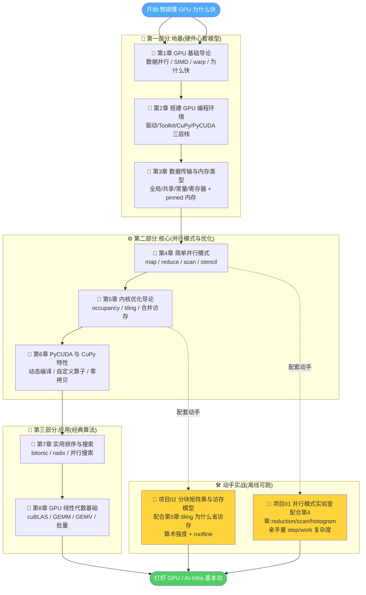

# 🎮 《Practical GPU Programming》中文逐章精讲 + 实战合集

> 本目录是围绕 **《Practical GPU Programming》(Fenlor M., 2025)** 打造的一套中文学习资料:
> 一半是 **逐章精讲**(`book-guide/`,全书 8 章,把原书代码逐行讲穿 + 补足第一性原理),
> 一半是 **可离线跑的实战项目**(`projects/`,各含 `pytest` 单测 + `run_demo` 可视化)。
>
> 🎯 目标读者:想系统入门 **GPU / CUDA / 高性能计算(HPC)** 的工程师、想补 AI-Infra 基本功、
> 或正在准备 **GPU 编程 / 推理优化 / AI 基础设施** 岗位面试的同学。
>
> 🖥️ 全部实战项目 **纯 CPU + numpy 离线可跑**——不需要 GPU、不需要 CUDA、不联网,
> 用 numpy「模拟」GPU 的并行思路,把「GPU 为什么快」从**代码**和**公式**两头讲穿。

---

## 📚 这套资料是什么

| 你会得到 | 具体是什么 |
| --- | --- |
| 📖 **8 章逐章精讲** | 忠实抄录并逐行讲解原书代码/概念,补足内存层级、并行模式、内核优化等第一性原理,零基础能读懂、进阶有收获 |
| 🧩 **2 个动手项目** | 每个项目都配 `pytest`(几十条断言对拍)+ `run_demo.py`(出图讲清复杂度),开箱即跑 |
| 💡 **面试速查** | 讲义与项目 README 都内嵌「面试高频题」小框:算术强度、roofline、warp、occupancy、bitonic sort…… |
| 📊 **可视化产物** | reduction/scan 的 `O(log n)` 曲线、matmul 的 roofline 屋顶线图,眼见为实 |

---

## 🗺️ 学习路径(建议顺序)



> 💬 **推荐节奏**:先按 1→8 通读讲义建立全局观;读到第 4 章去跑 **项目01**,读到第 5 章去跑 **项目02**——
> 讲义讲「原理」,项目让你「亲手量出来」,两者对照,记得最牢。

---

## 📖 一、逐章精讲(`book-guide/`)

> 全书 8 章,每章一份 Markdown。每章都以一张 **mermaid 本章地图** 开头,再逐节展开;
> 忠实对应原书页码,逐行讲解代码,并补足原书略过的第一性原理。

| # | 章节(点击进入) | 一句话简介 | 原书页码 |
| :-: | --- | --- | :-: |
| 1 | [📄 01_GPU基础导论.md](./book-guide/01_GPU基础导论.md) | 建立**硬件心智模型**:数据并行 / SIMD / warp,想清楚 GPU 为什么在某些任务快 100 倍、另一些反而更慢 | p.14–41 |
| 2 | [📄 02_搭建GPU编程环境.md](./book-guide/02_搭建GPU编程环境.md) | 把「能跑一次」变成「可复现、可移植」:CUDA 三层栈、驱动/Toolkit 安装、`nvcc`/`nvidia-smi`/设备查询 | p.42–58 |
| 3 | [📄 03_基础数据传输与内存类型.md](./book-guide/03_基础数据传输与内存类型.md) | 回答「我的数据现在在哪儿」:主机↔设备传输、全局/共享/常量/寄存器内存层级、pinned 锁页内存 | p.59–88 |
| 4 | [📄 04_简单并行模式.md](./book-guide/04_简单并行模式.md) | 从「能跑一个 kernel」到「用**模式思维**解题」:线程索引、grid-stride、map / reduce / scan / stencil | p.89–110 |
| 5 | [📄 05_内核优化导论.md](./book-guide/05_内核优化导论.md) | 从「能跑」到「跑得快」的分水岭:occupancy 占用率、**共享内存分块 tiling**、合并访存、profiler | p.111–131 |
| 6 | [📄 06_使用PyCUDA与CuPy特性.md](./book-guide/06_使用PyCUDA与CuPy特性.md) | 升级为**动态可组合**用法:PyCUDA 运行时编译、CuPy 自定义算子、广播/索引、PyCUDA⇄CuPy 零拷贝 | p.132–148 |
| 7 | [📄 07_实用排序与搜索.md](./book-guide/07_实用排序与搜索.md) | 排序/搜索搬上 GPU:**双调排序 bitonic**、**基数排序 radix**、并行线性搜索、CPU 端结果归并 | p.149–166 |
| 8 | [📄 08_GPU上的线性代数基础.md](./book-guide/08_GPU上的线性代数基础.md) | 从「手写 kernel」到「调工业级库」:**cuBLAS**、GEMM/GEMV、手写 vs 库对比、批量 GEMM | p.167–188 |

---

## 🛠️ 二、实战项目(`projects/`)

> 两个项目都 **纯 CPU + numpy 离线可跑**(Python 3.10+,本机 3.13 验证通过),不依赖 GPU / CUDA / torch。
> 思路:用 numpy 把 GPU 的**并行结构**和**访存模型**显式写出来 + 量出来,再画成曲线。
> 每个项目都有自己的详细 `README.md`,下面是速览。

| 项目(点击进入) | 配套章节 | 一句话简介 | 核心产物 |
| --- | :-: | --- | --- |
| [🧩 01_parallel_patterns_lab](./projects/01_parallel_patterns_lab/) | 第 4 章 | 把 **reduction / scan / histogram** 三大并行原语从「串行」重写成「按步并行」,亲手量出 **step 复杂度 O(log n)** 与 **work 工作量** | `parallel_patterns.py` + 3 张复杂度曲线图 |
| [🧱 02_tiled_matmul_memory_model](./projects/02_tiled_matmul_memory_model/) | 第 5 章 | 同一个 matmul,朴素写法把 HBM 带宽撑爆、分块(tiling)写法搬一次反复用;用**代码 + 公式**讲穿「分块为什么省访存」,并画出 **roofline** | `tiled_matmul.py` + HBM/算术强度/屋顶线 3 张图 |

### ▶️ 如何跑(两个项目通用)

```bash
# 进入某个项目目录,例如 项目01
cd projects/01_parallel_patterns_lab

# 1) 安装依赖(numpy / matplotlib / pytest,均为常见包)
python -m pip install -r requirements.txt

# 2) 跑单元测试:验证「并行结果 == 串行参考」、复杂度断言等
pytest -q

# 3) 跑可视化 demo:生成讲清复杂度 / roofline 的曲线图(PNG)
python run_demo.py
```

> ✅ 项目 02 同理:`cd projects/02_tiled_matmul_memory_model` → 装依赖 → `pytest -q` → `python run_demo.py`。
> 📊 `run_demo.py` 强制使用 matplotlib 的 `Agg` 后端,**无需显示器 / 无需 GPU**,直接把图片落盘。

#### 🧩 项目 01 亮点

- **可对拍的实现**:每个并行模式都配一个串行参考版,`pytest` 逐元素验证「并行结果 == 串行结果」。
- **复杂度探针**:每次运行都记录 `steps`(并行深度)和 `work`(总操作数),并断言它们等于理论值。
- **三张图**:`step vs n` 直观对比 `O(log n)` 与 `O(n)`;`work vs n` 揭示「步高效 ≠ 工作高效」。
- 直击面试:为什么 reduction 是 `O(log n)` 步?work-efficient scan 是什么?histogram 为什么要「私有化」?

#### 🧱 项目 02 亮点

- **分块 matmul 的循环结构**(`matmul_tiled`),和真实 GPU kernel 一一对应。
- **可手算的访存模型**(`analyze`):HBM 读取量 / 算术强度(AI)/ 复用率,一次讲清。
- 「tile 越大越省访存,但受 shared memory 上限约束」的**定量证据**(60+ 断言 + 曲线)。
- 直击面试:算术强度是什么?roofline 屋顶线怎么读?为什么 matmul 必须分块?memory-bound vs compute-bound?

---

## 💼 三、面试 / 实战怎么用

| 你的场景 | 建议用法 |
| --- | --- |
| 🎯 **准备 GPU / AI-Infra 面试** | 先扫每章讲义里的「面试高频题」小框 + 两个项目 README 的 💡 框;重点吃透:warp/occupancy、合并访存、共享内存分块、算术强度、roofline、bitonic/radix sort、cuBLAS 何时用 |
| 🧠 **建立硬件直觉** | 读第 1、3、5 章 + 跑项目 02:把「算力 ≫ 带宽」这对永恒矛盾用 roofline 图刻进脑子 |
| ⚡ **理解并行算法** | 读第 4、7 章 + 跑项目 01:亲手把串行 for 循环改写成 `O(log n)` 的树形并行,量出 step 与 work |
| 🛠️ **动手写 GPU 代码** | 读第 2、6、8 章:环境怎么搭、PyCUDA/CuPy 怎么写自定义算子、什么时候别自己写 kernel 直接调 cuBLAS |
| 📝 **做笔记 / 复习** | 每章开头的 mermaid 地图可当「一页纸复习卡」;项目的曲线图可直接贴进你的笔记 |

> 🔑 **一条贯穿全书的主线**:GPU 有海量算力,但**喂不饱**(带宽有限)。
> 于是所有优化——分块、合并访存、复用、零拷贝——本质都在回答同一个问题:
> **怎么让每个字节的显存读取,喂给尽可能多的计算?** 带着这个问题读,全书会串成一条线。

---

## 📁 目录结构一览

```text
book-practical-gpu-programming/
├── README.md                     ← 你在这里
├── book-guide/                   📖 逐章精讲(8 章 Markdown)
│   ├── 01_GPU基础导论.md
│   ├── 02_搭建GPU编程环境.md
│   ├── 03_基础数据传输与内存类型.md
│   ├── 04_简单并行模式.md
│   ├── 05_内核优化导论.md
│   ├── 06_使用PyCUDA与CuPy特性.md
│   ├── 07_实用排序与搜索.md
│   └── 08_GPU上的线性代数基础.md
└── projects/                     🛠️ 实战项目(离线可跑)
    ├── 01_parallel_patterns_lab/          🧩 并行模式实验室
    │   ├── README.md
    │   ├── parallel_patterns.py           核心实现
    │   ├── run_demo.py                     出图 demo
    │   ├── requirements.txt
    │   ├── figures/                        产出的曲线图
    │   └── tests/test_parallel_patterns.py
    └── 02_tiled_matmul_memory_model/      🧱 分块矩阵乘与访存模型
        ├── README.md
        ├── tiled_matmul.py                核心实现
        ├── run_demo.py                     出图 demo
        ├── requirements.txt
        ├── fig1_hbm_vs_tile.png            访存量 vs tile 大小
        ├── fig2_intensity_reuse.png        算术强度 / 复用率
        ├── fig3_roofline.png               屋顶线
        └── tests/test_tiled_matmul.py
```

---

## 🔗 延伸阅读

- 📘 原书:*Practical GPU Programming*, Fenlor M., 2025(本合集逐章对应其 8 章)
- 🧵 CUDA 编程模型官方文档(NVIDIA CUDA C++ Programming Guide)
- 📗 CuPy / PyCUDA 官方文档:把 NumPy 思维迁移到 GPU、写自定义算子
- 🏗️ 本仓库其它 AI-Infra 教程:`llm-inference/`、`ai-infra/`、`cuda-mastery/` 等,可与本章并行学习

---

> 🙌 **食用建议**:讲义负责「讲清为什么」,项目负责「让你亲手量出来」。
> 边读边跑、边跑边对照公式,GPU 编程的直觉就是这样一点点长出来的。祝学习愉快!🚀
