# 第 1 章 🚀 GPU 基础导论(Introduction to GPU Fundamentals)

> 对应原书 *Practical GPU Programming*(Fenlor M., 2025)第 14–41 页 · 第 1 章 "Introduction to GPU Fundamentals"
>
> 本章是全书地基。我们不追求把每一行 CUDA 语法背下来,而是要在脑子里建立起一个**硬件心智模型(mental model)**:数据是怎么被成千上万个线程"同时"啃掉的?为什么 GPU 在某些任务上能比 CPU 快 100 倍、在另一些任务上反而更慢?搞懂这一章,后面所有的 kernel、内存优化、性能调优才有根。

---

## 🗺️ 本章地图

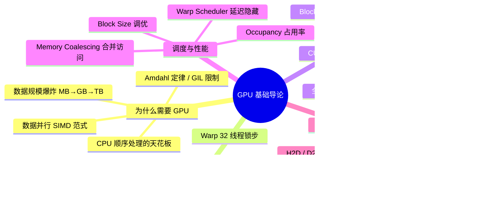

学习路线:**"为什么"(动机)→"是什么"(硬件)→"怎么写"(CUDA 模型)→"怎么调"(性能)→"跑起来"(实战)**。这也是原书第 1 章的叙事顺序。

---

## 1.1 🧠 GPU vs CPU:两种截然不同的哲学

### 1.1.1 是什么:一句话区分

- **CPU(Central Processing Unit,中央处理器)**:计算机的"大脑",**少数几个极其聪明的核**。每个核有复杂的控制逻辑、超大缓存、超高主频(3–4 GHz),擅长做**复杂决策、跑操作系统、处理带分支和依赖的顺序逻辑**。
- **GPU(Graphics Processing Unit,图形处理器)**:一支**由成千上万个简单核组成的大军**。单个核不如 CPU 核聪明、主频也更低,但它们**齐步走**,对海量数据同时施加同一个操作。

> 🔬 **第一性原理:延迟(latency)优化 vs 吞吐(throughput)优化**
>
> - CPU 是**延迟机器(latency-oriented)**:目标是"让单个任务尽可能快地完成"。为此它砸下巨量晶体管做**分支预测、乱序执行、多级大缓存**,把一条指令流的等待时间压到最低。
> - GPU 是**吞吐机器(throughput-oriented)**:目标是"单位时间内处理的数据总量最大"。它不在乎某一个线程等多久,而是靠**海量线程互相掩护**——一个线程在等内存,就切到另一个线程干活,硬件永不空转。
>
> 记住这句话:**CPU 让一个人跑得飞快;GPU 让一万个人同时慢慢走,但总产出碾压。**

### 1.1.2 硬件参数对比表

| 维度 | CPU(现代桌面/服务器) | GPU(典型 NVIDIA) |
|---|---|---|
| 核心数量 | 4 – 64 核(常见 8–32) | 5,000 – 10,000 个 CUDA 核 |
| 单核主频 | 高(3–4 GHz) | 较低 |
| 单核能力 | 强(复杂控制逻辑、大缓存) | 弱(简单、轻量) |
| 组织方式 | 独立核,各跑各的指令流 | 核被分组进 **SM(流多处理器)** |
| 缓存 | 每核数 MB,多级 | 小而快的共享内存 + 寄存器 |
| 擅长 | 顺序处理、复杂分支、OS 调度 | 大规模数据并行、同一操作作用于海量数据 |
| 并行度 | 数十个并行线程 | 数千个并行线程"在飞" |
| 连接方式 | 直连主板/内存 | 经 **PCI Express** 连到系统 |

> 💡 **实战直觉**:一张现代 GPU 的 CUDA 核数量,大约是同代 CPU 核数量的**几百倍**。这就是为什么"能并行的活儿"交给 GPU 会有量级差异。

### 1.1.3 一个直观例子:处理 4000×4000 的图像

假设我们要对一张 4000×4000 像素的图片做变换(比如调亮度、加滤镜),那就是 **1600 万(16M)个彼此独立的计算**。

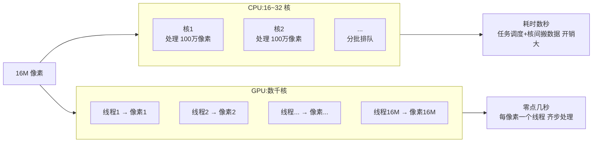

- **CPU 做法**:把 1600 万个像素**切成几十份**,分给几十个线程排队处理。管理这么多小任务、在核之间倒腾数据,本身开销就很大 → 耗时**数秒**。
- **GPU 做法**:给**每一个像素分配一个专属线程**,仿佛每个像素都有自己的处理器,整张图**并行处理** → 耗时**零点几秒**。

这就是原书反复强调的核心范式:**"same operation, many data points"(同一操作,海量数据点)**。

### 1.1.4 什么是 SIMD?

原书在此引出关键术语:

> **SIMD(Single Instruction, Multiple Data,单指令多数据)**:同一条指令,同时作用在多份不同的数据上。

这正是 GPU 高效的根源。后面(1.3 节)我们会看到 GPU 实际执行时更精确的术语是 **SIMT(Single Instruction, Multiple Threads)**——它是 SIMD 思想在"线程"这个抽象层面的落地。

---

## 1.2 ⛔ 为什么不能"堆更多 CPU 核"就完事?

一个自然的疑问:服务器 CPU 都几十核了,云上还能开几百个 vCPU,那我们疯狂加核不就行了?

原书给出三条根本限制:

### 1.2.1 限制一:CPU 核太贵,scale 不动

每个 CPU 核都要配**复杂的控制单元 + 大而低延迟的缓存**,这些东西吃掉大量硅片面积、消耗大量功耗。加核 = 面积、功耗、成本三重暴涨,很快撞墙。

### 1.2.2 限制二:Amdahl 定律(Amdahl's Law)

> 🔬 **第一性原理:程序的速度上限,由它最慢、最"顺序"的那部分决定。**

Amdahl 定律用公式表达就是:如果程序里有比例 $p$ 的部分能并行,剩下 $(1-p)$ 是必须顺序执行的,那么用 $N$ 个核能得到的加速比为:

$$
\text{Speedup}(N) = \frac{1}{(1 - p) + \dfrac{p}{N}}
$$

关键推论:当 $N \to \infty$ 时,

$$
\text{Speedup}_{\max} = \frac{1}{1 - p}
$$

举个数字:哪怕 95% 的代码能并行($p=0.95$),那剩下 5% 顺序部分就把上限死死锁在 $\frac{1}{0.05} = 20$ 倍——**再加多少核都突破不了 20 倍**。

| 可并行比例 $p$ | 无限核的理论加速上限 |
|---|---|
| 50% | 2× |
| 90% | 10× |
| 95% | 20× |
| 99% | 100× |
| 99.9% | 1000× |

> 💡 **面试高频**:"为什么多核加速常常达不到线性?" 标准答案就是 Amdahl 定律——顺序部分是天花板。GPU 的价值在于它面向的正是那些 $p$ 接近 1 的**"embarrassingly parallel"(高度并行 / 尴尬并行)** 问题。

### 1.2.3 限制三:Python 的 GIL 与线程争用

如果你写过 `threading` / `multiprocessing` 的 Python 脚本,一定踩过这些坑:

- **GIL(Global Interpreter Lock,全局解释器锁)**:CPython 同一时刻只允许一个线程执行 Python 字节码,多线程在 CPU 密集任务上**并不能真正并行**。
- **线程争用(thread contention)与全局锁**:线程越多,抢锁越凶。
- **线程间传数据的开销**:反而吃掉可用的内存带宽。

结论(原书原话):**CPU 能处理"数十个"并行线程,但处理不了"数千个"。** 而 GPU 天生为数千线程而生。

> ⚠️ **常见坑**:很多初学者以为"我 Python 开 32 个线程就并行了"。对 CPU 密集型的数值计算,GIL 会让你几乎白忙。这也是为什么 NumPy/CuPy 这类库把重活儿甩给底层 C/CUDA 的原因。

---

## 1.3 🏗️ 走近硬件:SM、Warp 与内存层级

要真正榨干 GPU,得知道它内部长啥样。这一节是本章的**硬件核心**。

### 1.3.1 SM:流多处理器(Streaming Multiprocessor)

现代 GPU 的心脏是一组 **SM(Streaming Multiprocessor,流多处理器)**。把一张 GPU 拆开看,里面是**几十个 SM 并排而坐**。

每个 SM 是一个**自给自足的迷你处理器**,内部包含:

- 一堆简单的 **CUDA 核(CUDA cores)**——最基本的计算单元;
- **特殊功能单元(Special Function Units)**——算 sin/cos/exp 这类超越函数;
- **寄存器(registers)**——每线程私有的超快存储;
- **共享内存(shared memory)**——SM 内部、block 内线程共享的小而快内存;
- **Warp 调度器(warp scheduler)**——决定每个周期哪些 warp 去执行。

> SM 数量随卡型号变化:入门卡可能只有几个,数据中心级 GPU 有 **80 个以上**。

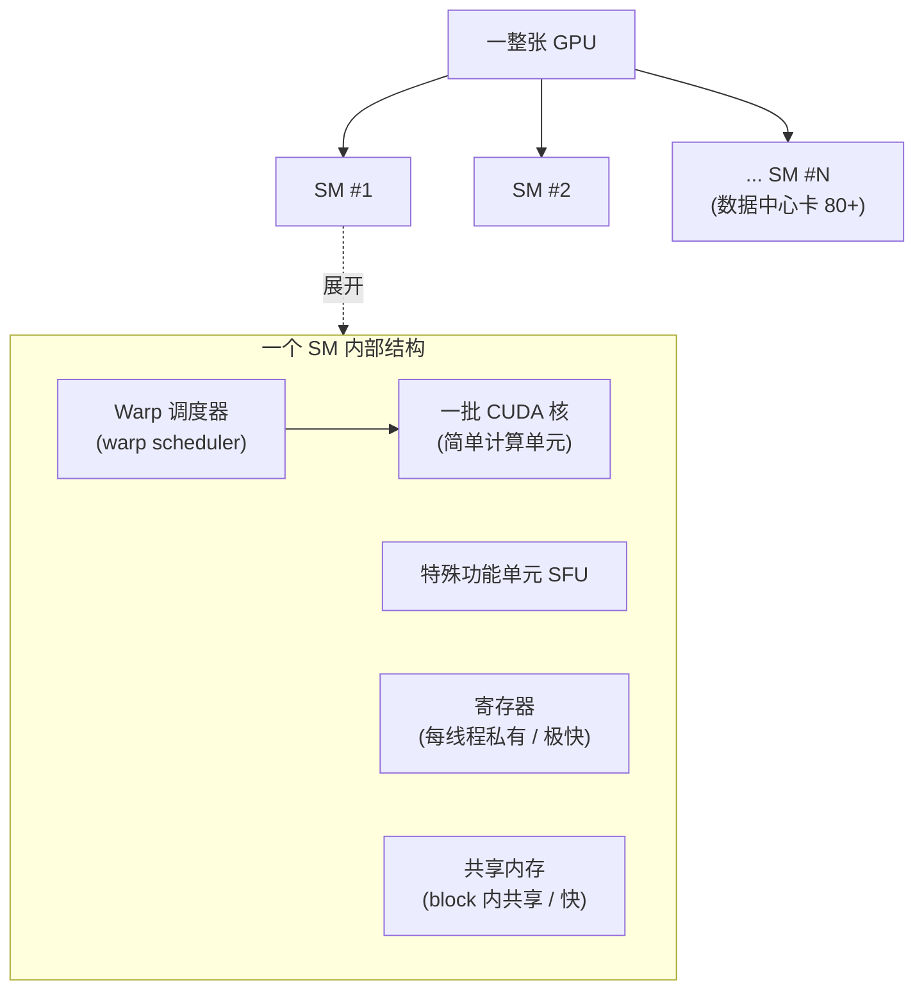

### 1.3.2 Warp:32 个线程的锁步小队

这是全章**最关键的概念之一**:

> **Warp**:SM 内部把线程 **32 个一组** 打包,叫一个 warp。一个 warp 里的 32 个线程**锁步(in lockstep)执行**——每个周期,它们执行**同一条指令**,但各自操作**不同的数据**。

这正是 **SIMT(Single Instruction, Multiple Threads,单指令多线程)** 的落地:硬件调度的最小单位不是单个线程,而是 32 个线程组成的 warp。

> 🎓 **原书的教室比喻(强烈推荐记住)**:
> 想象一个大教室,**每一排(row)= 一个 warp**,整排学生跟着**同一份学习计划(同一条指令)**走;但**每个学生有自己的练习册(不同的数据)**。SM 的 warp 调度器像老师,能同时管好几排,谁卡住了(等内存)就先切到另一排,保证大家一直有事干。

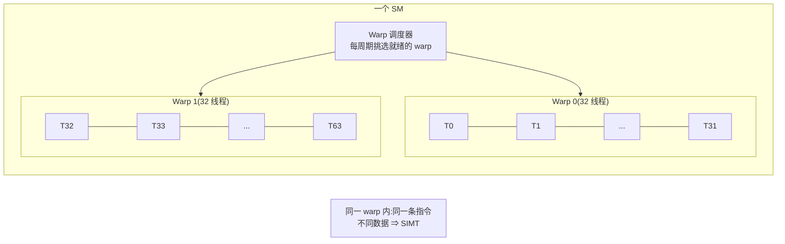

> ⚠️ **常见坑:Warp Divergence(线程束分化)**
> 因为一个 warp 锁步执行同一条指令,如果代码里有 `if/else` 分支,导致 warp 内一半线程走 `if`、一半走 `else`,硬件只能**先跑 if 分支(else 线程闲着),再跑 else 分支(if 线程闲着)**,两条路径串行执行,效率对折甚至更差。所以 GPU 代码要**尽量避免同一 warp 内的分支分化**。原书本章点明了"heavily reliant on complex branching"(重度依赖复杂分支)是 GPU 不擅长的工作类型,根源就在这里。

### 1.3.3 GPU 内存层级:速度与容量的权衡

原书列出的 GPU 内存类型,从"快而小"到"慢而大":

| 内存类型 | 作用域 | 速度 | 容量 | 特点 |
|---|---|---|---|---|
| **寄存器 Registers** | 每线程私有 | ⚡ 极快 | 极小 | 存线程局部变量 |
| **共享内存 Shared Memory** | block 内线程共享 | 快、低延迟 | 小(SM 内) | 线程间协作的关键 |
| **全局内存 Global Memory** | 所有线程可见 | 慢、高延迟 | 大(GB 级) | 高带宽,但延迟高 |
| **常量/纹理内存 Constant/Texture** | 只读,全局 | 特化优化 | 中 | 只读、空间局部性数据(后续章节) |

再往外,GPU 通过 **PCI Express(PCIe)** 连到系统主机。PCIe 虽然快,但**远慢于 GPU 片上内存带宽**——这就是为什么"少搬数据、多在设备上计算"是 GPU 编程的黄金法则。

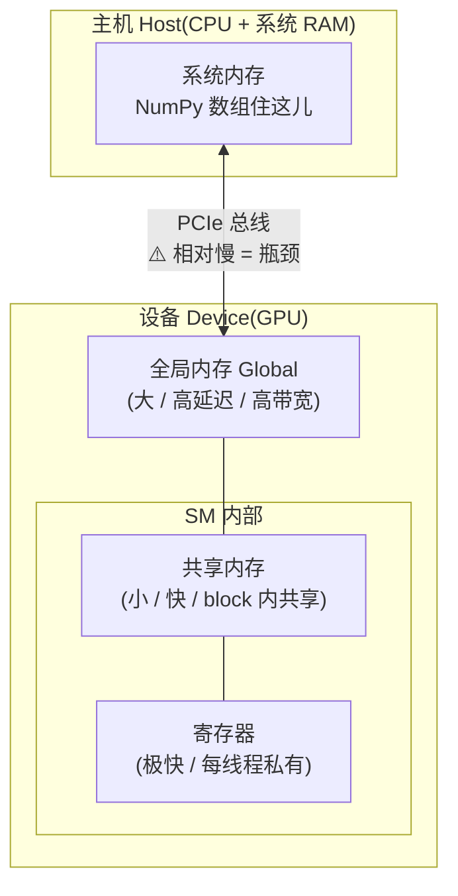

> 🔬 **第一性原理:GPU 靠"延迟隐藏(latency hiding)"取胜。**
> 全局内存延迟很高(几百个时钟周期)。GPU 不去消灭延迟,而是**藏起来**:当一个 warp 等内存时,warp 调度器瞬间切到另一个就绪的 warp 继续算。只要**在飞的 warp 足够多**,SM 就永远有活干,内存延迟就被计算掩盖了。这就是"吞吐机器"的运作方式。

---

## 1.4 🎯 CUDA 编程模型:Grid / Block / Thread 三层线程层级

有了硬件直觉,现在看软件抽象。**CUDA(Compute Unified Device Architecture)** 是 NVIDIA 提供的框架,让我们在自己的代码里驱动 GPU,启动成千上万个轻量线程。在 Python 里,我们用 **PyCUDA** 或 **CuPy** 来编译并运行 CUDA kernel。

> 📌 原书默认环境:**Linux**(对 CUDA 开发支持最好)。

### 1.4.1 线程层级(Thread Hierarchy):两级组织

CUDA 用**两层层级**组织并行工作:**Grid(网格)→ Block(线程块)→ Thread(线程)**。

- 每次启动一个 **kernel(核函数)**,你要指定:**启动多少个 block**,以及**每个 block 里放多少个 thread**。
- **grid 里的每个 thread 都执行同一份代码,但处理数据的不同部分。**

> 🧩 **原书的电子表格比喻**:把数据想象成一张大**电子表格(spreadsheet)**。
> - 给表格的每个**区域(region)分配一支队伍 = 一个 block**;
> - 给区域里的每个**单元格(cell)分配一个工人 = 一个 thread**。

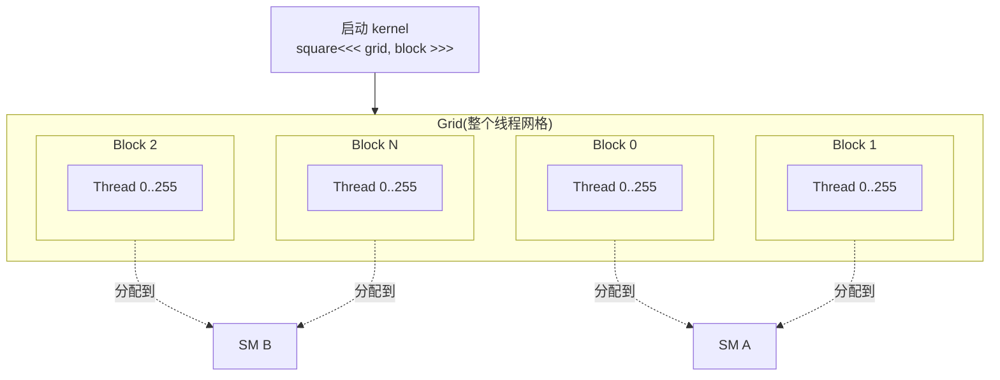

**从 kernel 到硬件的映射链条**(把 1.3 和 1.4 串起来):

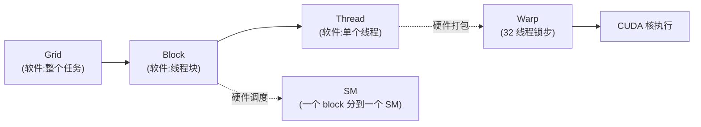

- **一个 block 被整体分配到一个 SM 上**(不会跨 SM);
- 一个 SM 可以**同时容纳多个 block**(取决于寄存器、共享内存等资源够不够);
- SM 内部再把 block 的线程切成 **warp(32 个)** 来实际执行。

> 💡 **面试高频**:请说清 grid / block / thread / warp / SM 的关系。一句话:**软件层是 grid→block→thread 三级;硬件层 block 落到 SM 上,thread 被打包成 32 线程的 warp 锁步执行。**

### 1.4.2 核心公式:每个线程如何算出自己的全局索引

这是**整个 CUDA 编程里出现频率最高的一行代码**,务必背下来:

```cpp
int idx = blockIdx.x * blockDim.x + threadIdx.x;
```

逐项拆解:

| 变量 | 含义 | 类比 |
|---|---|---|
| `threadIdx.x` | 线程在**它自己 block 内**的局部编号(0 ~ blockDim.x-1) | 一个班里的学号 |
| `blockIdx.x` | 当前 block 在**整个 grid 里**的编号 | 第几个班 |
| `blockDim.x` | **每个 block 有多少线程**(比如 256) | 每个班的人数 |
| `idx` | 该线程在**整个 grid 中的全局唯一索引** | 全校统一编号 |

**为什么是这个公式?** 全局编号 = (前面所有 block 的线程总数)+(自己在本 block 内的编号)= `班号 × 每班人数 + 班内学号`。这样 grid 里每个线程都拿到一个**独一无二的全局索引**,正好对应数据数组里的一个位置。

### 1.4.3 边界检查:不可省略的 `if`

```cpp
if (idx < num_elements) {
    output[idx] = input[idx] * input[idx];
}
```

> ⚠️ **常见坑:必须做边界检查!**
> block 数量通常按 `(元素数 + 每块线程数 - 1) / 每块线程数` **向上取整**算出来,所以最后一个 block 往往会**多出一些线程**,它们的 `idx` 会**越过数组末尾**。如果不加 `if (idx < n)`,这些"多余"的线程会**越界写内存**,轻则结果错误,重则崩溃。这个 `if` 是每个 kernel 的标配保险丝。

### 1.4.4 实战:1D 数组平方 kernel(完整可跑代码)

原书用 CuPy 的 `RawModule` 接口,把一段 CUDA C 字符串编译成 kernel:

```python
import cupy as cp

num_elements = 1_000_000
input_array = cp.arange(num_elements, dtype=cp.float32)   # 在 GPU 上建输入
output_array = cp.empty_like(input_array)                  # 在 GPU 上开输出

threads_per_block = 256                                     # 每块 256 线程
# 向上取整算需要多少个 block —— 保证覆盖到最后一个元素
blocks_per_grid = (num_elements + threads_per_block - 1) // threads_per_block

kernel_code = '''
extern "C" __global__
void square(const float *input, float *output, int n) {
    int idx = blockIdx.x * blockDim.x + threadIdx.x;   // 全局索引
    if (idx < n) {                                     // 边界检查
        output[idx] = input[idx] * input[idx];         // 每线程算一个平方
    }
}
'''

module = cp.RawModule(code=kernel_code)                    # 编译 CUDA C
square_kernel = module.get_function('square')             # 拿到 kernel 句柄

# 启动:第一个元组是 grid 尺寸,第二个是 block 尺寸,第三个是参数
square_kernel((blocks_per_grid,), (threads_per_block,),
              (input_array, output_array, num_elements))

# 把结果从 device 拷回 host 并验证
result = cp.asnumpy(output_array)
assert (result == (cp.asnumpy(input_array) ** 2)).all()
print("1D kernel executed successfully!")
```

**逐段讲解**:

1. `extern "C"` —— 关闭 C++ 的 name mangling(名字修饰),这样 `get_function('square')` 才能按原名找到函数。
2. `__global__` —— CUDA 关键字,标记这是一个**从 host 端调用、在 device 上执行的 kernel**。
3. `square_kernel((blocks_per_grid,), (threads_per_block,), (...))` —— CuPy 的启动语法:**第一个元组 = grid 维度,第二个元组 = block 维度,第三个元组 = 传给 kernel 的参数**。
4. `cp.asnumpy(...)` —— 把 GPU 数组拷回 CPU(host),这样才能用 NumPy 校验。

### 1.4.5 从 1D 到 2D:处理图像/矩阵

数据是二维时(图像、矩阵),用**二维的 block 和 grid**,每个线程算出自己的行列索引:

```cpp
int col = blockIdx.x * blockDim.x + threadIdx.x;   // 列 = x 方向
int row = blockIdx.y * blockDim.y + threadIdx.y;   // 行 = y 方向
if (row < height && col < width) {
    output[row * width + col] = input[row * width + col] + 1.0f;
}
```

对应的 Python 启动配置:

```python
height, width = 1024, 1024
input_array = cp.random.rand(height, width).astype(cp.float32)
output_array = cp.empty_like(input_array)

block = (16, 16)                                   # 每块 16×16 = 256 线程
grid = ((width  + block[0] - 1) // block[0],       # x 方向 block 数
        (height + block[1] - 1) // block[1])       # y 方向 block 数

kernel_code = '''
extern "C" __global__
void increment(const float *input, float *output, int width, int height) {
    int col = blockIdx.x * blockDim.x + threadIdx.x;
    int row = blockIdx.y * blockDim.y + threadIdx.y;
    if (row < height && col < width) {
        output[row * width + col] = input[row * width + col] + 1.0f;
    }
}
'''
module = cp.RawModule(code=kernel_code)
increment_kernel = module.get_function('increment')
increment_kernel(grid, block, (input_array, output_array, width, height))

result = cp.asnumpy(output_array)
assert (result == cp.asnumpy(input_array) + 1).all()
print("2D kernel executed and verified successfully!")
```

**关键点**:

- 二维数组在内存里是**按行展平(row-major)**存的,所以 `(row, col)` 要用 `row * width + col` 折算成一维偏移。
- `block = (16, 16)` → 每块 256 线程,是个常用的 2D 配置。
- 模式可无缝扩展到 **3D**(体数据 volumetric、仿真网格):每个线程算 `(z, y, x)` 处理自己的一个 voxel(体素)。

> 💡 **本质总结(原书原话)**:无论 1D/2D/3D,套路永远一样——**把逻辑数据位置映射到 CUDA 的 thread/block 索引,做边界检查,确保每个线程只在合法数据范围内工作。** 这个模式会出现在你写的几乎每一个 GPU 程序里。

---

## 1.5 ⚙️ 调度与性能:Occupancy、Warp Scheduler、Coalescing

kernel 能跑只是起点,能跑得**快**才是本事。这一节讲三个决定性能的核心概念。

### 1.5.1 Occupancy(占用率):有多少 warp 在待命

> **Occupancy(占用率)**:衡量你用满 GPU 并行资源的程度——具体说,就是**每个 SM 上活跃的 warp 数** 与 **该 SM 理论最大 warp 数** 之比。

- **占用率高** = 更多 warp 就绪待命 → 一个 warp 卡在等数据时,调度器立刻切到另一个 → **延迟隐藏效果好**。
- **怎么提高占用率**:每个 block 多放线程 / 降低每线程的寄存器和共享内存用量 / 优化 kernel 消除瓶颈。

> ⚠️ **常见坑 & 面试陷阱**:**占用率不是越高越好!** 原书明确指出"higher occupancy does not always guarantee better performance"。有时资源用得太满反而挤占了每线程的寄存器,或者达到某个**甜蜜点(sweet spot)**后就不再有收益。目标是**平衡资源占用与吞吐**,而非盲目拉满。

### 1.5.2 Warp Scheduler(线程束调度器):空中交通管制员

> 🛫 **原书比喻**:每个 SM 里的 warp 调度器就像**空中交通管制员(air traffic controller)**。它根据 warp 的**就绪状态、资源约束**决定谁上谁下:某个 warp 在等内存或等同步点,调度器**瞬间换上另一个 warp**,让硬件永不空闲。

这种上下文切换极其轻量,因为**所有线程和它们的数据一直驻留在 SM 上**(不像 CPU 换线程要保存/恢复大量状态)。

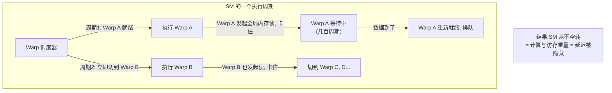

> 🔬 **第一性原理**:GPU 的高吞吐不是靠"更快的核",而是靠 **超额订阅(oversubscription)**——让远多于执行单元数量的 warp 在飞,用它们互相填补彼此的等待空隙。**只要你的代码暴露出足够多的并行工作,延迟隐藏是硬件免费送的。** 反过来说,如果并行度不够(线程太少),SM 一堵就真的堵住了。

### 1.5.3 Memory Coalescing(内存合并访问)

> **Memory Coalescing(合并访问)**:让**同一个 warp 里的 32 个线程访问连续的内存地址**,硬件就能把它们合并成一次(或少数几次)宽内存事务,大幅提升带宽利用率。

反面例子:如果 warp 内线程访问的地址东一块西一块(跨步大、随机),硬件被迫发起很多次零散的内存事务,带宽被浪费,kernel 变慢。

> 💡 **实战三条高性能模式(原书 microbenchmark 小结)**:
> 1. **每个 SM 尽量塞满线程**,但别过度消耗寄存器/共享内存(否则占用率反跌)。
> 2. **启动足够多的 block**,让每个 SM 都有活干,大 GPU 上尤其重要。
> 3. **注意内存合并**:让 warp 内线程读连续地址。
>
> 把这三条落地,即便是向量加法、直方图这类简单 kernel,也能比朴素实现快**一个数量级**。

### 1.5.4 Block Size 调优:动手做 microbenchmark

原书建议的实验(强烈建议自己跑一遍):

1. 建一个**几百万元素**的数组;
2. 写一个平凡 kernel(如每个元素加常数);
3. 用不同的 block size 启动:**32、64、128、256、512、1024** 线程/块;
4. 各测执行时间。

会观察到:某些配置明显更快,取决于它们与 GPU 的 SM 架构"契合"程度。

| block size | 可能的现象 |
|---|---|
| 太小(如 32) | 线程太少,GPU **利用不足(underutilized)**,SM 空转 |
| 中等(128/256) | 通常是**甜蜜点**,占用率与资源平衡 |
| 太大(1024) | 每块占用太多寄存器/共享内存,**占用率下降**,性能受损 |

用 CuPy/PyCUDA 的 device 属性查询接口,可以打印出 **SM 数量、每 SM 最大线程数**,从而把启动配置对准硬件的甜蜜点:

```python
import cupy as cp
print(cp.cuda.runtime.getDeviceProperties(0))   # 打印设备属性
```

---

## 1.6 🔄 Host–Device 交互:完整的 GPU 工作流

现在把所有零件组装成一条**端到端流水线**。这是每一个 GPU 项目都会走的流程。

### 1.6.1 四个核心步骤

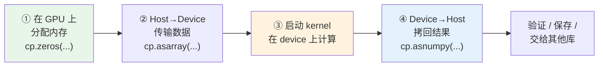

### 1.6.2 术语:Host 与 Device

- **Host(主机)** = CPU + 系统 RAM,你的 Python 主脚本跑在这儿,NumPy 数组住这儿。
- **Device(设备)** = GPU,CuPy 数组分配在这儿,kernel 在这儿读写数据。

> ⚠️ **关键认知转变**:`cp.zeros(10_000)` 分配的是 **GPU 显存**,不是你电脑的主 RAM!这些 CuPy 数组**不能直接喂给只认 CPU 的函数**——想用 NumPy 处理,必须先 `cp.asnumpy()` 拷回来。

### 1.6.3 内存分配、传输代码

```python
import cupy as cp
import numpy as np

# ① 直接在 GPU 上分配一块内存(10000 个 float)
gpu_array = cp.zeros(10_000, dtype=cp.float32)

# ② Host → Device:先在 CPU 建 NumPy 数组,再传到 GPU
host_data = np.arange(10_000, dtype=np.float32)
device_data = cp.asarray(host_data)      # 整个数组搬进显存

# ④ Device → Host:结果拷回 CPU
result_on_host = cp.asnumpy(device_data)
print("First five:", result_on_host[:5])
```

`cp.asarray()`(H2D,host-to-device)和 `cp.asnumpy()`(D2H,device-to-host)是你会**反复用到**的一对搬运工——尤其在验证输出、保存结果、或和其他只吃 NumPy 的库交互时。

### 1.6.4 启动一个简单 kernel(每元素乘 2)

```python
kernel_code = r'''
extern "C" __global__
void multiply_by_two(float* data, int n) {
    int idx = blockDim.x * blockIdx.x + threadIdx.x;
    if (idx < n) {
        data[idx] *= 2.0f;                // 原地(in-place)乘 2
    }
}
'''
module = cp.RawModule(code=kernel_code)
multiply_by_two = module.get_function('multiply_by_two')

n = 10_000
threads_per_block = 256
blocks_per_grid = (n + threads_per_block - 1) // threads_per_block

multiply_by_two((blocks_per_grid,), (threads_per_block,), (gpu_array, n))

cpu_result = cp.asnumpy(gpu_array)
print("After kernel:", cpu_result[:5])
```

### 1.6.5 GPU 内存空间全景 & 黄金法则

原书把内存空间归纳如下(回扣 1.3.3 的层级):

| 空间 | 谁能访问 | 用途 |
|---|---|---|
| **Host memory** | CPU | NumPy 数组、脚本起点 |
| **Device / Global memory** | 所有 GPU 线程 | CuPy 数组、kernel 读写 |
| **Shared memory** | block 内线程 | 需要线程协作的算法 |
| **Registers** | 单个线程 | 超快、线程私有 |
| **Constant / Texture memory** | 全局只读 | 只读或空间局部性数据(后续章节) |

> 📌 **黄金法则(原书反复强调)**:**尽量把计算留在 device 上,只在"输入"和"最终输出"时才做 host–device 传输。** 因为 PCIe 传输是相对昂贵的瓶颈,来回搬数据会吃掉 GPU 省下来的时间。

> ⚠️ **常见坑**:小数据别上 GPU!原书明说——对小数组,**搬进搬出的传输开销可能完全抵消甚至超过**计算收益,这时 CPU 反而更快。GPU 的甜蜜区是**大规模数据 + 高度并行**。

---

## 1.7 🧪 综合实战:向量加法 kernel(CuPy vs PyCUDA)

向量加法是每个 GPU 程序员的"入门仪式"。原书用 **CuPy** 和 **PyCUDA** 两套写法各实现一遍,并和 CPU 结果比对。

### 1.7.1 准备数据(Host + Device)

```python
import numpy as np
import cupy as cp

N = 1_000_000
a_host = np.random.rand(N).astype(np.float32)   # host 上的两个随机向量
b_host = np.random.rand(N).astype(np.float32)

c_cpu = a_host + b_host                          # CPU 参考答案,用于验证

a_gpu = cp.asarray(a_host)                       # 传到 GPU
b_gpu = cp.asarray(b_host)
```

### 1.7.2 共用的 CUDA C kernel

```python
kernel_code = r'''
extern "C" __global__
void vector_add(const float* a, const float* b, float* c, int n) {
    int idx = blockDim.x * blockIdx.x + threadIdx.x;
    if (idx < n) {
        c[idx] = a[idx] + b[idx];         // 每线程加一对元素
    }
}
'''
```

### 1.7.3 用 CuPy 跑

```python
c_gpu = cp.empty_like(a_gpu)
threads_per_block = 256
blocks_per_grid = (N + threads_per_block - 1) // threads_per_block

module = cp.RawModule(code=kernel_code)
vector_add = module.get_function('vector_add')
vector_add((blocks_per_grid,), (threads_per_block,), (a_gpu, b_gpu, c_gpu, N))

c_result = cp.asnumpy(c_gpu)
print("Are GPU and CPU results equal?", np.allclose(c_result, c_cpu))   # True
```

### 1.7.4 用 PyCUDA 跑(同一个 kernel)

```python
import pycuda.autoinit                       # 自动初始化 CUDA 上下文
import pycuda.driver as drv
import pycuda.gpuarray as gpuarray
from pycuda.compiler import SourceModule

a_gpu_py = gpuarray.to_gpu(a_host)           # PyCUDA 的 H2D
b_gpu_py = gpuarray.to_gpu(b_host)
c_gpu_py = gpuarray.empty_like(a_gpu_py)

mod = SourceModule(kernel_code)              # 编译
vector_add_func = mod.get_function("vector_add")

vector_add_func(
    a_gpu_py, b_gpu_py, c_gpu_py, np.int32(N),
    block=(threads_per_block, 1, 1),         # block 是 3 元组 (x,y,z)
    grid=(blocks_per_grid, 1)                # grid 也显式给维度
)

c_result_py = c_gpu_py.get()                 # PyCUDA 的 D2H
print("PyCUDA GPU result matches CPU?", np.allclose(c_result_py, c_cpu))   # True
```

### 1.7.5 CuPy vs PyCUDA:该用哪个?

| 对比项 | CuPy | PyCUDA |
|---|---|---|
| 定位 | 高层、类 NumPy 的 GPU 数组库 | 低层、贴近 CUDA C 的直接控制 |
| 上手难度 | 低(换个 import 就能用) | 较高 |
| 内存/上下文控制 | 自动管理为主 | 手动、精细(内存、kernel、context) |
| H2D / D2H | `cp.asarray` / `cp.asnumpy` | `gpuarray.to_gpu` / `.get()` |
| 启动语法 | `kern((grid,), (block,), args)` | `func(args, block=(x,y,z), grid=(x,y))` |
| 适用场景 | 大部分高层数组计算、快速原型 | 需要精细控制、榨性能、贴底层时 |

> 💡 **面试高频 / 选型建议**:**默认用 CuPy**(生产力高、代码像 NumPy);**当你需要对内存布局、kernel 启动、设备上下文做精细控制**,或想直接写原生 CUDA C 时,再上 PyCUDA。两者跑同一个 kernel 得到同样的 `True`,证明底层是一回事,区别只在抽象层次。

> ⚠️ **PyCUDA 语法细节坑**:PyCUDA 里 `block` 必须是 **3 元组 `(x, y, z)`**(不用的维度填 1),整型参数要显式包成 `np.int32(N)`,否则类型不匹配会出错。

---

## 1.8 🌍 GPU 编程为什么"现在"重要?(应用全景)

原书列举了 GPU 加速的主战场,帮你判断"我的活儿适不适合上 GPU":

| 应用领域 | 典型任务 | 为什么适合 GPU | Python 生态 |
|---|---|---|---|
| **机器学习/深度学习推理** | 神经网络前向传播:大量矩阵乘 + 逐元素激活 | 天生的大规模并行浮点运算;CPU 无法在此规模做实时推理 | PyTorch / TensorFlow |
| **高性能数据分析** | ETL、日志处理、分组/聚合/过滤/直方图 | 这些操作完美映射到 GPU 强项 | **RAPIDS / cuDF**(GPU 版 pandas) |
| **实时可视化与渲染** | 3D 渲染、游戏、点云、分子动力学动画 | 每秒刷新数百万像素几十次 | 各类可视化库 |
| **科学计算与仿真** | 天气模型、流体力学、蒙特卡洛 | "尴尬并行":更新数百万粒子/网格点 | CuPy / Numba |
| **通用数值计算** | 大矩阵乘、归约(reduction)、逐元素运算 | 大数组上 10×–100× 加速 | **CuPy**(换个 import 就提速) |

> 💡 **实战判断法(原书精髓)**:
> - 数据**小** 或 算法**高度顺序** → 用 CPU。
> - 数据**大** 或 计算能描述成 **"对每一行做同样的事"** → GPU 大放异彩。
> - 坚持用现代 Python 库(CuPy/RAPIDS),**你甚至不需要写底层 CUDA C**,拿到的是熟悉的类 NumPy 高层 API。

### GPU 适合 / 不适合的工作负载

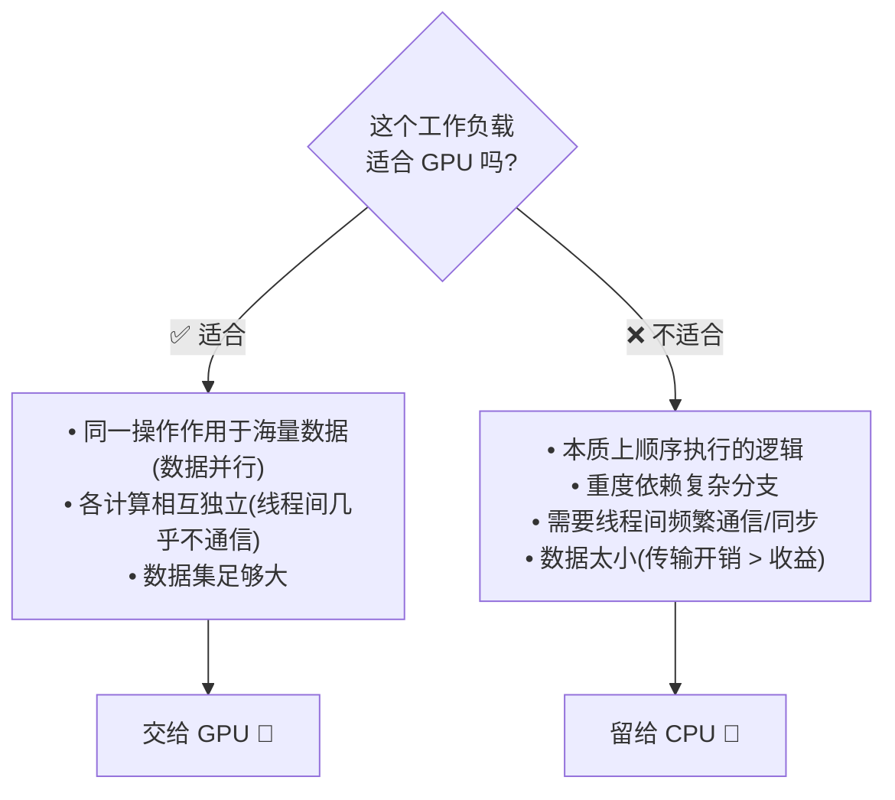

> 🔬 **第一性原理:GPU 编程是一次思维方式的转变。**
> 从"一次做一个操作(one operation at a time)"转向问自己:**"我能不能把它写成所有元素一起跑?"** 你开始关心**内存布局、合并访问、如何组织工作以最小化等待**。CuPy/PyCUDA 帮你自动做了很多,但**理解硬件才能把算法对齐到硬件,拿到更极致的结果。**

> ⚠️ **别迷信 "1000× 加速"**:原书泼冷水——你**不会总是**拿到 1000 倍加速。对足够大的数组,常见任务(向量加、矩阵乘、归约)能有 **10×–100×**;数据太小时,H2D/D2H 传输开销会**吃掉全部收益**。关键永远是**让工作负载匹配硬件强项**。

---

## 📌 本章小结

本章为实用 GPU 编程打下地基,核心脉络一图流:

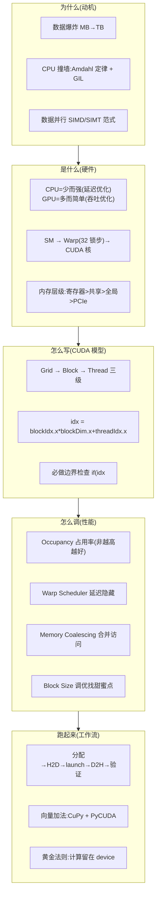

**必须记牢的 10 个要点**:

1. **CPU vs GPU** = 延迟优化(少而强的核)vs 吞吐优化(多而简单的核)。
2. **SIMD/SIMT** = 单指令作用于海量数据/线程,是 GPU 高效的根源。
3. **Amdahl 定律**:加速上限 = $\frac{1}{1-p}$,顺序部分是天花板;GPU 面向 $p\to1$ 的高度并行问题。
4. **SM(流多处理器)** 是 GPU 的心脏,内含 CUDA 核、寄存器、共享内存、warp 调度器。
5. **Warp = 32 线程锁步执行**;warp 内分支会导致 divergence(分化),性能对折。
6. **线程层级:Grid → Block → Thread**;一个 block 落到一个 SM 上。
7. **黄金公式**:`idx = blockIdx.x * blockDim.x + threadIdx.x`,配 `if (idx < n)` 边界检查。
8. **Occupancy** 高有助延迟隐藏,但**不是越高越好**,要找甜蜜点。
9. **延迟隐藏**靠 warp 调度器超额订阅;**Coalescing** 靠 warp 内读连续地址。
10. **Host–Device 工作流**:分配→H2D→launch kernel→D2H→验证;**尽量把计算留在 device**,小数据别上 GPU。

---

## 🔗 延伸阅读

- **原书后续章节**:constant/texture memory、shared memory 协作算法、profiling、更复杂的 kernel 优化。
- **NVIDIA 官方博客(原书图片来源)**:
  - CUDA Refresher: Reviewing the Origins of GPU Computing(CPU vs GPU 由来)
  - CUDA Refresher: Getting Started with CUDA(Blocks 概念)
  - CUDA Refresher: The CUDA Programming Model(kernel 执行模型)
- **Python GPU 生态**:
  - **CuPy** —— 类 NumPy 的 GPU 数组库,`RawModule`/`RawKernel` 写自定义 kernel。
  - **PyCUDA** —— 贴近 CUDA C 的低层控制,`SourceModule` + `gpuarray`。
  - **RAPIDS / cuDF** —— GPU 版 pandas,加速数据库式分析。
  - **Numba** —— 用 `@cuda.jit` 直接把 Python 函数编译成 kernel(原书后续可能涉及)。
- **经典理论**:
  - Amdahl's Law(阿姆达尔定律)与 Gustafson's Law(古斯塔夫森定律,弱扩展视角)。
  - SIMT 执行模型、Warp Divergence、Memory Coalescing 的深入分析(见 NVIDIA CUDA C Programming Guide)。
- **面试自测清单**:
  1. 用一句话说清 CPU 与 GPU 的设计哲学差异。
  2. 画出 Grid/Block/Thread 与 SM/Warp/Core 的对应关系。
  3. 推导全局索引公式,并解释为什么需要边界检查。
  4. 解释 warp divergence 为什么伤性能。
  5. 为什么占用率不是越高越好?
  6. 什么样的工作负载**不适合** GPU?各举一例(顺序依赖 / 复杂分支 / 频繁通信 / 小数据)。
```
