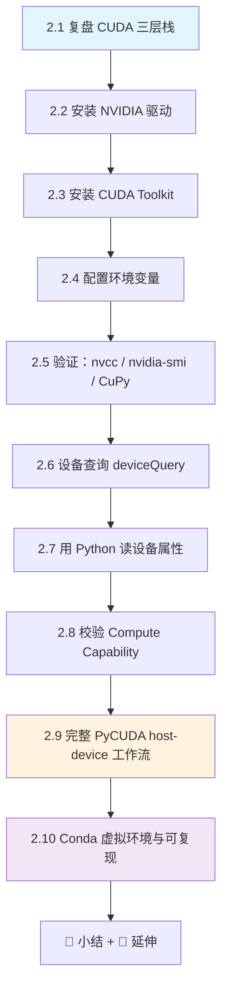
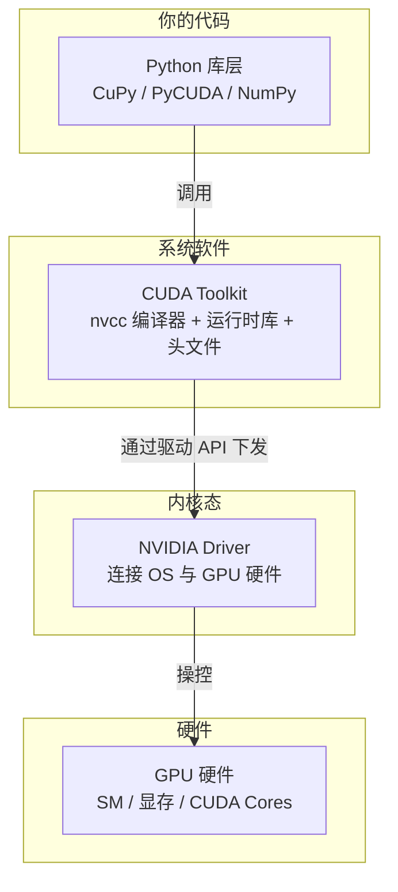
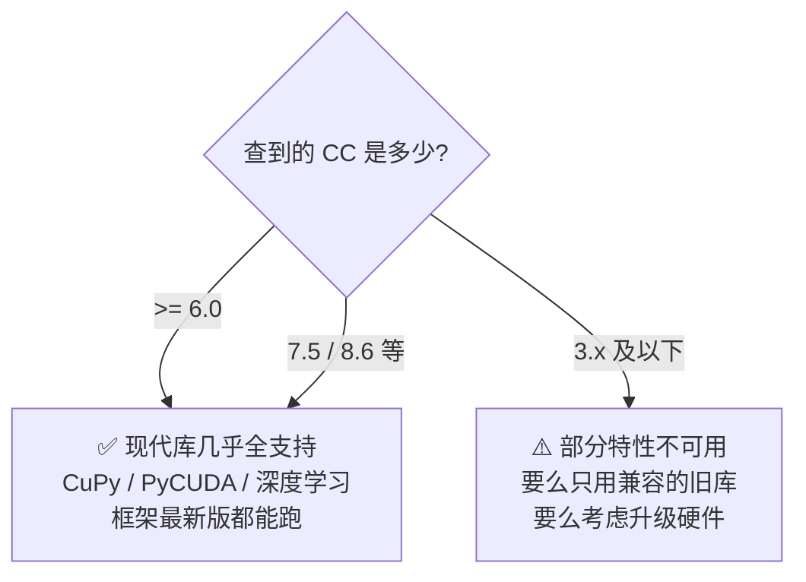
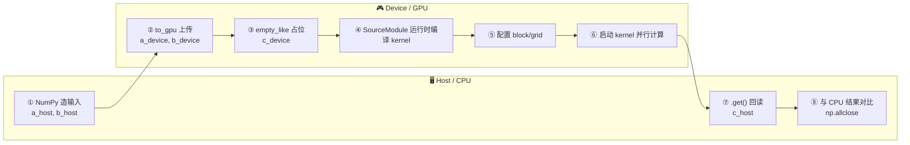
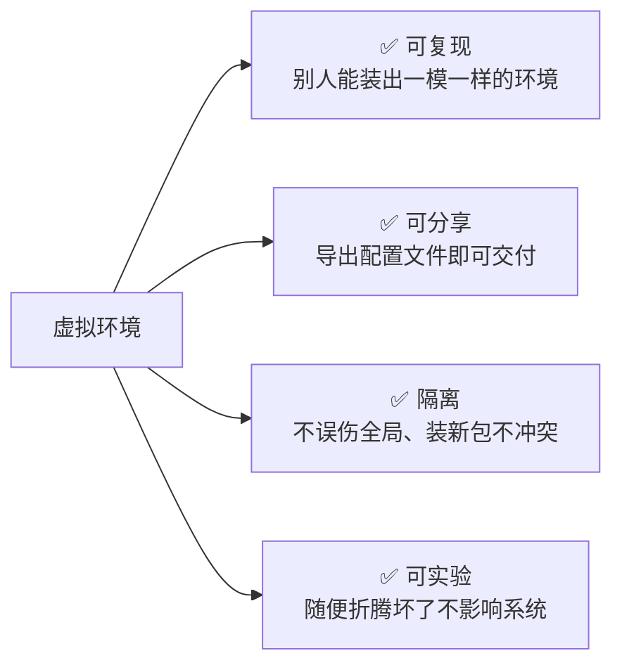
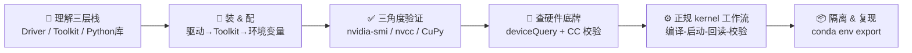

# 第 2 章 · 搭建 GPU 编程环境 🛠️

> 对应原书 *Practical GPU Programming*（Fenlor M., 2025）第 2 章 "Setting Up GPU Programming Environment"，PDF 第 42–58 页。
>
> 上一章我们已经"能跑"了——用 CuPy / PyCUDA 写了第一个 kernel 并成功启动。但"能跑一次"和"以后每次都稳定可复现地跑"是两回事。本章要做的，就是把引擎盖打开，逐层检查每一个零件，把一次性的成功变成**可复现、可移植、可扩展**的工程能力。

---

## 🗺️ 本章地图

本章围绕一句话展开：**GPU 上的 Python 代码，能跑起来，是三层软件精确对齐的结果。** 我们会先看清这三层是什么，再一层层地安装、配置、验证，最后动手写一个更"正规"的 PyCUDA kernel，并把整个工作装进隔离的虚拟环境里。



| 小节 | 你将学会 | 关键命令/API |
|---|---|---|
| 2.1 | GPU 运行栈的三层心智模型 | — |
| 2.2 | 装 & 查 NVIDIA 驱动 | `nvidia-smi` / `apt install nvidia-driver-535` |
| 2.3 | 装 & 查 CUDA Toolkit | `nvcc --version` |
| 2.4 | 让 shell 找到 CUDA | `PATH` / `LD_LIBRARY_PATH` |
| 2.5 | 三种角度验证环境 | `cp.cuda.runtime.runtimeGetVersion()` |
| 2.6 | 命令行读硬件参数 | `deviceQuery` |
| 2.7 | Python 读硬件参数 | `cp.cuda.Device(0).attributes` |
| 2.8 | 判断 GPU 世代与兼容性 | `compute_capability()` |
| 2.9 | 完整 kernel 编译-启动-回读 | `SourceModule` / `gpuarray` |
| 2.10 | 隔离依赖、导出复现 | `conda env export` |

---

## 2.1 复盘：CUDA 运行栈的三层 🧱

原书开篇就点明了本章的世界观（PDF p.43）：

> Our ability to run GPU code from Python relies on three layers working in harmony.

**从 Python 代码到 GPU 硬件，中间隔着三层软件，缺一不可，且必须版本匹配。**



逐层拆解——**这是整章的地基，务必吃透**：

| 层 | 是什么 | 为什么需要 | 谁装的 | 典型验证 |
|---|---|---|---|---|
| **① NVIDIA Driver** | 内核态驱动，把操作系统和 GPU 硬件连起来 | 没有它，OS 根本"看不见"这块显卡 | 系统级安装 | `nvidia-smi` |
| **② CUDA Toolkit** | `nvcc` 编译器、开发库、运行时组件、头文件、示例 | 把 CUDA C 代码编译成 GPU 指令；提供 runtime | 系统级安装 | `nvcc --version` |
| **③ Python 库** | CuPy / PyCUDA，调用 Toolkit 把 Python 代码变成高性能 GPU 指令 | 让你用 Python 而非纯 C 写 GPU 程序 | pip/conda 装在环境里 | `import cupy` |

> 🔬 **第一性原理：为什么必须"三层对齐"？**
> GPU 不是一块能直接跑 Python 的芯片。Python 解释器运行在 CPU 上，它发出的"请在 GPU 上做加法"这个意图，要经过一条**翻译链**：
> Python 库把你的意图打包 → Toolkit 的 runtime/编译器把它变成 GPU 能懂的机器指令（PTX/SASS）→ Driver 把这些指令和数据搬进 GPU、启动执行。
> 链条里任何一环版本不匹配（比如 Toolkit 编译出的指令是新架构的，但老驱动看不懂），整条链就断。所以原书反复强调 "all these three components match in version and configuration"——**版本匹配不是洁癖，是能不能跑的硬约束**。

> ⚠️ **常见坑：先装谁？**
> 正确顺序是 **驱动 → Toolkit → Python 库**，自底向上。原因：上层依赖下层。驱动有一个"最高支持的 CUDA 版本"（`nvidia-smi` 右上角会显示），Toolkit 版本不能超过它；Python 库又要匹配 Toolkit。反过来先装库，很容易装上一个你的驱动根本带不动的 CUDA 版本。

> 💡 **面试高频**：被问"CUDA driver version 和 CUDA runtime version 有什么区别？"——
> - **driver version**（`nvidia-smi` 显示）：驱动附带的、内核态支持的 CUDA API 版本，代表这块卡"最高能吃多新的 CUDA"。
> - **runtime version**（`nvcc --version` 或 `cp.cuda.runtime.runtimeGetVersion()` 显示）：你实际安装的 Toolkit 版本。
> 规则：**runtime ≤ driver 支持的上限**即可（向后兼容）。二者不必完全相等，但 runtime 不能超过 driver 的能力。

---

## 2.2 安装 NVIDIA 驱动 🔌

原书的做法很务实：**先查，缺了或旧了再装。**（PDF p.44）

### 第一步：查当前驱动

```bash
nvidia-smi
```

这条命令（NVIDIA System Management Interface）会打印出一张信息表：

- GPU 型号
- 已安装的驱动版本（Driver Version）
- 该驱动支持的最高 CUDA 版本（CUDA Version，右上角）
- 当前显存占用、GPU 利用率、正在跑的进程

如果这条命令能正常出表，说明驱动已就位。如果报"command not found"或"No devices were found"，就需要安装/修复驱动。

### 第二步：安装驱动

原书给了两条路：

**路线 A · 官网下载**：去 NVIDIA Driver Downloads 页面，按你的 GPU 型号选正确的包下载安装。

**路线 B · 包管理器**（Ubuntu/Debian 系）：

```bash
sudo apt update
sudo apt install nvidia-driver-535
```

> ⚠️ **常见坑：装完必须重启**
> 原书强调 "a reboot locks in the changes"。驱动是内核态模块，装好后需要重启（或至少重新加载内核模块）才真正生效。装完不重启就继续 `nvidia-smi`，很可能看到版本没变或干脆报错——不是没装成功，是没生效。

| 命令 | 作用 | 何时用 |
|---|---|---|
| `nvidia-smi` | 查驱动 + GPU 状态 | 任何时候先跑它体检 |
| `sudo apt install nvidia-driver-535` | 装指定版本驱动 | 驱动缺失/过旧 |
| `sudo reboot` | 重启使驱动生效 | 装完驱动之后 |

> 💡 **实战：`535` 这个数字怎么选？**
> 数字是驱动分支号，不是随便填的。你要根据自己的 GPU 型号和目标 CUDA 版本，去 NVIDIA 官方"驱动-CUDA 兼容表"选一个覆盖你目标 CUDA 版本的分支。原书用 `535` 只是当时的一个稳定分支示例。选太旧带不动新 CUDA，选太新可能碰到未修复的兼容问题——**优先选官方标注 stable 的长期分支**。

---

## 2.3 安装 CUDA Toolkit 🧰

驱动就位后，装 Toolkit。它不只提供 kernel 编译能力，还带来一些 Python 库会引用的开发头文件和示例工程（PDF p.44）。

### 第一步：查是否已装

```bash
nvcc --version
```

`nvcc`（NVIDIA CUDA Compiler）是把 CUDA C 代码编译成 GPU 指令的编译器。能打印出版本信息，就说明 Toolkit 在位。

### 第二步：安装 Toolkit

**路线 A · 官网**：从 *CUDA Toolkit Archive* 下载对应版本安装器（可以精确选版本，推荐用于生产/需要特定版本时）。

**路线 B · 包管理器**：

```bash
sudo apt install nvidia-cuda-toolkit
```

安装时**记住默认安装目录 `/usr/local/cuda`**——下一节配置环境变量、以及找 `deviceQuery` 示例都要用到它。

| 术语 | 全称 | 干什么 |
|---|---|---|
| `nvcc` | NVIDIA CUDA Compiler | 编译 `.cu` / CUDA C 代码 → GPU 指令 |
| `/usr/local/cuda` | Toolkit 默认安装根目录 | 里面有 `bin/`（工具）、`lib64/`（库）、`samples/`（示例） |
| runtime 组件 | CUDA Runtime Library | Python 库运行时会链接到它 |

> ⚠️ **常见坑：apt 装的 Toolkit 版本可能偏旧**
> `sudo apt install nvidia-cuda-toolkit` 装的是发行版仓库里的版本，往往不是最新。如果你需要最新特性（比如新架构支持），走官网 Archive 精确选版本更可靠。两种方式装出来的路径也可能不同（apt 装的有时在 `/usr` 而非 `/usr/local/cuda`），配环境变量前先 `which nvcc` 确认真实路径。

> 🔬 **第一性原理：为什么装了库还要装 Toolkit？**
> PyCUDA 的杀手锏是"运行时把你写的 CUDA C 字符串编译成 kernel"（见 2.9 节）。这个"编译"动作靠的就是 Toolkit 里的 `nvcc`。所以哪怕你只用 Python，只要用了 PyCUDA 的 `SourceModule` 这类运行时编译功能，就**必须有 Toolkit**。CuPy 的部分功能（自定义 kernel）同理。

---

## 2.4 配置环境变量：让 shell 找到 CUDA 🌐

装好了不等于能用——你的 shell 和 Python 库得**知道 CUDA 装在哪**。原书用两个环境变量解决（PDF p.45）：

```bash
export PATH=/usr/local/cuda/bin:$PATH
export LD_LIBRARY_PATH=/usr/local/cuda/lib64:$LD_LIBRARY_PATH
```

把这两行加到 `~/.bashrc`（bash）或 `~/.zshrc`（zsh），然后重载：

```bash
source ~/.bashrc
```

逐行讲透这两个变量：

| 环境变量 | 指向 | 作用 | 不设会怎样 |
|---|---|---|---|
| `PATH` | `/usr/local/cuda/bin` | 让 shell 能直接敲 `nvcc`、`cuda-*` 等**可执行文件** | 敲 `nvcc` 报 command not found |
| `LD_LIBRARY_PATH` | `/usr/local/cuda/lib64` | 让运行时**动态链接器**能找到 CUDA 的 `.so` 库文件 | 程序启动时报 `libcudart.so not found` |

`source ~/.bashrc` 这一步的意义：环境变量的修改只对"读取过配置文件的 shell"生效。`source` 就是让**当前**这个终端立刻重新读一遍配置，不用关掉重开。而以后新开的每个终端会自动读 `.bashrc`，所以都能拿到完整 CUDA 栈。

> ⚠️ **常见坑：`$PATH` 放在前还是后？**
> 注意原书写的是 `/usr/local/cuda/bin:$PATH`——把 CUDA 路径放在**最前面**。冒号左边优先级高。如果系统里有多个 CUDA 版本，放前面能保证优先用你指定的这个。反过来写成 `$PATH:/usr/local/cuda/bin`，可能被系统里某个旧版本"截胡"。

> 💡 **实战：多版本 CUDA 共存**
> 生产环境常常要在 CUDA 11 和 12 之间切。做法：不写死 `/usr/local/cuda`（它通常是个软链接），而是分别装到 `/usr/local/cuda-11.8`、`/usr/local/cuda-12.4`，然后靠改环境变量或改软链接来切换当前默认版本。`/usr/local/cuda` 这个"不带版本号"的路径本质是个指针。

---

## 2.5 三种角度验证环境 ✅

原书特别强调："the validation of our setup is very important ... to ensure that nothing goes wrong when we are busy in programming."（PDF p.45）**装完立刻验证，别等写到一半才发现环境是坏的。** 从三个角度交叉确认：

### 角度一：验证 Toolkit（编译器）

```bash
nvcc --version
```

能出版本号 → 编译器 OK。

### 角度二：验证驱动 + 硬件

```bash
nvidia-smi
```

能出 GPU 表 → 驱动 OK、硬件被系统看见。

### 角度三：用 Python 程序化验证运行时

这一步最关键——**它验证的是"你的 Python 库真的能连通 CUDA 运行时"**，是真正贴近你实际工作的检查：

```python
import cupy as cp

print("CuPy version:", cp.__version__)
print("CUDA runtime version:", cp.cuda.runtime.runtimeGetVersion())
print("Our available device:", cp.cuda.Device(0).name)
```

逐行讲解：

| 代码 | 在做什么 | 成功意味着 |
|---|---|---|
| `import cupy as cp` | 导入 CuPy | 库本身安装无误 |
| `cp.__version__` | 读 CuPy 版本 | 确认库版本 |
| `cp.cuda.runtime.runtimeGetVersion()` | 调 CUDA runtime API 问版本 | **Python↔CUDA runtime 链路打通** |
| `cp.cuda.Device(0)` | 拿到 0 号 GPU 设备句柄 | 至少有一块可用 GPU |
| `.name` | 读设备名 | 驱动能报出硬件信息 |

`runtimeGetVersion()` 返回一个整数，比如 `12040` 代表 CUDA 12.4（编码规则：`1000*major + 10*minor`）。

> 🔬 **第一性原理：为什么三个角度都要查？**
> 三条命令分别踩在三层栈上：`nvidia-smi` 踩驱动层，`nvcc` 踩 Toolkit 层，`import cupy + runtimeGetVersion` 踩 Python 库层并顺着链路一路验到 runtime。三个都过，等于**从上到下每一层都亲手确认过一遍**。原书的原话是"if these commands work, we know for certain our hardware and software stack is ready"——这不是仪式感，是把"三层对齐"这个抽象要求变成三条可执行的证据。

> 💡 **面试高频**：`Device(0)` 里的 `0` 是什么？——是 **GPU 的逻辑索引**。多卡机器上有 0,1,2...；`0` 是默认第一块。可以用环境变量 `CUDA_VISIBLE_DEVICES` 控制程序能看见哪几块卡、以及它们的编号顺序（这是多卡训练里最常用的隔离手段）。

至此，我们"闭合了从第 1 章的环境搭建到深层信心之间的回路"——Linux 系统、NVIDIA GPU、Python 工具三者紧密集成、健壮可用。

---

## 2.6 用命令行做设备查询：deviceQuery 🔎

环境通了，接下来要**看清这块硬件到底有什么家底**。这不是好奇——你后面写 kernel 时，线程块能开多大、共享内存有多少、支持哪些指令，全由硬件参数决定（PDF p.47）。

CUDA Toolkit 自带一个示例二进制 `deviceQuery`，它会把每块可见 GPU 的完整属性打印出来。位置通常在：

```
/usr/local/cuda/samples/1_Utilities/deviceQuery/deviceQuery
```

如果没有现成的可执行文件，就进目录自己编译：

```bash
cd /usr/local/cuda/samples/1_Utilities/deviceQuery
sudo make
./deviceQuery
```

逐行讲解这三条命令：

| 命令 | 作用 |
|---|---|
| `cd .../deviceQuery` | 进入示例源码目录 |
| `sudo make` | 用 Makefile 编译出 `deviceQuery` 可执行文件 |
| `./deviceQuery` | 运行它，打印硬件报告 |

输出很长，原书圈出了对我们最有用的几行：

| 属性 | 含义 | 影响你写代码的什么 |
|---|---|---|
| **Device Name** | GPU 型号名 | 认卡 |
| **Total Global Memory** | 全局显存总量 | 一次能分配多大数据 |
| **Multiprocessors Count** | SM（流多处理器）数量 | 硬件并行度的核心指标 |
| **CUDA Cores per SM** | 每个 SM 的 CUDA 核心数 | 单个 SM 的算力密度 |
| **Maximum Threads per Block** | 每个线程块最多几个线程 | 线程块尺寸上限（常见 1024） |
| **Shared Memory per Block** | 每块的共享内存大小 | 能缓存多少数据做加速 |
| **Compute Capability** | 计算能力（世代号） | 决定支持哪些 CUDA 特性 |

> ⚠️ **常见坑：新版 Toolkit 找不到 samples**
> 从 CUDA 11.6 起，官方把 `samples` 从 Toolkit 里移出，放到了独立的 GitHub 仓库 `NVIDIA/cuda-samples`。所以在较新的 CUDA 上，你可能在 `/usr/local/cuda/samples` 下**找不到** `deviceQuery`——原书写的是较早版本的路径。解决办法：要么 `git clone` 那个仓库自己 `make`，要么干脆跳过命令行，直接用下一节的 **Python 方式**读属性（更推荐，因为不依赖示例是否存在）。

> 💡 **实战：为什么关心 SM 数量？**
> SM（Streaming Multiprocessor）是 GPU 真正干活的物理单元。你启动的所有线程块会被调度到这些 SM 上执行。SM 越多，能同时"在飞"的线程块越多，并行度越高。写高性能 kernel 时，一个经典目标就是让线程块数量足够多、能把所有 SM 喂饱（保持高 occupancy），别让某些 SM 闲着。

---

## 2.7 用 Python 读设备属性 🐍

命令行方式依赖示例二进制是否存在，而且不方便在代码里用。更实用的做法：**在 Python 里程序化读取属性**，让你的代码能根据不同硬件自动适配（PDF p.48）。

### 用 CuPy 读

```python
import cupy as cp

device = cp.cuda.Device(0)
attributes = device.attributes

print("Device Name:", device.name)
print("Compute Capability:",
      f"{attributes['ComputeCapabilityMajor']}.{attributes['ComputeCapabilityMinor']}")
print("Total Global Memory (MB):", device.mem_info[1] // (1024 * 1024))
print("Multiprocessors:", attributes['MultiProcessorCount'])
print("Max Threads per Block:", attributes['MaxThreadsPerBlock'])
print("Shared Memory per Block (KB):", attributes['MaxSharedMemoryPerBlock'] // 1024)
```

逐行拆解：

| 代码 | 在做什么 | 备注 |
|---|---|---|
| `cp.cuda.Device(0)` | 拿到 0 号设备句柄 | |
| `device.attributes` | 取一个包含所有属性的字典 | key 是属性名字符串 |
| `device.name` | 设备名 | 对应 deviceQuery 的 Device Name |
| `ComputeCapabilityMajor/Minor` | 计算能力主/次版本号 | 拼成 `8.6` 这种 |
| `device.mem_info[1]` | 显存信息元组的第 2 项 = **总显存**（字节） | `mem_info[0]` 是空闲显存 |
| `// (1024*1024)` | 字节 → MB | 整除，取整数 MB |
| `MultiProcessorCount` | SM 数量 | |
| `MaxThreadsPerBlock` | 每块最大线程数 | 决定 block 尺寸上限 |
| `MaxSharedMemoryPerBlock // 1024` | 每块共享内存，字节 → KB | |

> 🔬 **第一性原理：`mem_info` 为什么是 `[free, total]` 两个数？**
> GPU 显存是**动态占用**的——你自己的数组、别的进程、框架的缓存都在吃显存。所以驱动同时告诉你"当前还剩多少（free）"和"总共多少（total）"。`mem_info[1]` 取 total 是设备的固有规格；如果你想在分配大数组前判断"够不够放"，就得看 `mem_info[0]` 这个实时的 free 值。

### 用 PyCUDA 读

CuPy 之外，PyCUDA 也能查，接口略有不同：

```python
import pycuda.driver as drv
import pycuda.autoinit

device = drv.Device(0)
print("Device Name:", device.name())
print("Compute Capability:",
      f"{device.compute_capability()[0]}.{device.compute_capability()[1]}")
print("Total Global Memory (MB):", device.total_memory() // (1024 * 1024))

for key, value in device.get_attributes().items():
    print(f"{key}: {value}")
```

逐行讲解：

| 代码 | 在做什么 |
|---|---|
| `import pycuda.autoinit` | **自动初始化 CUDA 上下文**（创建 context、选默认设备）——这行不能少 |
| `drv.Device(0)` | 拿 0 号设备 |
| `device.name()` | 设备名（注意 PyCUDA 里是**方法**，带括号；CuPy 里是**属性**，不带） |
| `device.compute_capability()` | 返回 `(major, minor)` 元组 |
| `device.total_memory()` | 总显存（字节） |
| `device.get_attributes()` | 返回**全部**属性字典，遍历打印 |

> ⚠️ **常见坑：`import pycuda.autoinit` 忘了写**
> PyCUDA 不像 CuPy 那样"用到时自动就绪"。它需要一个 CUDA **context**（可以理解为"GPU 上的一个工作会话"）。`pycuda.autoinit` 这个模块被 import 时的副作用就是自动帮你建好 context 并选好设备。忘了它，后面调用会报 context 相关的错误。这是 PyCUDA 新手最常见的坑之一。

> 💡 **CuPy vs PyCUDA 读属性对比（面试高频细节）**
>
> | 维度 | CuPy | PyCUDA |
> |---|---|---|
> | 设备名 | `device.name`（属性） | `device.name()`（方法） |
> | 计算能力 | `attributes['ComputeCapabilityMajor']` | `device.compute_capability()` 返回元组 |
> | 初始化 | 用到即自动 | 需 `import pycuda.autoinit` |
> | 定位 | 偏 NumPy 风格的高层数组库 | 偏底层、贴近 CUDA driver API |

---

## 2.8 校验 Compute Capability：判断 GPU 世代 🏛️

**Compute Capability（计算能力，简称 CC）是一个 `major.minor` 的版本号，它告诉你这块 GPU 属于哪一代、支持哪些 CUDA 特性。** 这是整套环境检查里最需要"读懂含义"的一个数字（PDF p.49）。

原书给出的世代对照（补全整理如下）：

| CC | 架构代号 | 大致年代 | 典型代表 |
|---|---|---|---|
| 6.x | **Pascal** | 2016 | GTX 1080 / P100 |
| 7.0 | **Volta** | 2017 | V100 |
| 7.5 | **Turing** | 2018 | RTX 2080 / T4 |
| 8.0 / 8.6 | **Ampere** | 2020 | A100 / RTX 3090 |
| 8.9 / 9.0 | Ada / Hopper | 2022 | RTX 4090 / H100 |

> 注：原书文字把代号和数字的对应写得较松（把 6.x/7.x/8.x 笼统对到 Pascal→Volta→Turing→Ampere），上表按官方架构-CC 映射做了更精确的对齐。**记住规律即可：CC 数字越大 = 世代越新 = 特性越多。**

每一次 CC 提升，都会解锁：更多新指令、更大的共享内存、新的加速特性（比如 Volta 引入 Tensor Core、Ampere 引入 TF32/结构化稀疏等）。

### 兼容性判断规则（原书核心结论）



| CC 范围 | 结论 | 该怎么做 |
|---|---|---|
| **≥ 6.0** | 满足绝大多数现代 CUDA 库要求 | 放心用最新 CuPy / PyCUDA / PyTorch 等 |
| **7.5 / 8.6 等** | 覆盖当前几乎所有库 | 无需担心兼容性 |
| **≤ 3.x** | 太老，部分特性缺失 | 限制到兼容的旧库，或升级硬件 |

> 🔬 **第一性原理：为什么库会"要求最低 CC"？**
> 库/框架在编译时会为一组目标架构生成 GPU 机器码（通过 `nvcc` 的 `-arch=sm_XX` 指定）。为了控制体积和维护成本，它们只覆盖"还在服役"的架构。CC 低于这个下限的老卡，库里根本没有对应的机器码，自然跑不了。这就是为什么"CC 太低 → 只能用旧版库"——不是软件歧视老硬件，是**编译期就没给你这代卡准备指令**。

> 💡 **实战：换机器第一件事**
> 原书结尾给了一条金规则（PDF p.50）：
> > Whenever we change machines, GPUs, or drivers, running a fresh device query should always be our first step to validate compatibility.
>
> **每次换机器、换卡、换驱动，第一件事就是重新跑一遍设备查询。** 这个习惯能让你在写任何 kernel 之前就知道硬件底牌，把兼容性问题挡在最前面，而不是跑到一半崩了才回头查。

---

## 2.9 完整的 PyCUDA host-device 工作流 ⚙️

前面都在"检查环境"，这一节开始**真正动手写一个正规的 kernel**。第 1 章的向量加法只是"能跑"，这里要把整个 **host（CPU/主机）↔ device（GPU/设备）** 工作流讲透：准备数据 → 分配显存 → 写 kernel → 运行时编译 → 配置线程 → 启动 → 回读 → 校验（PDF p.51–54）。

原书说得很直白：这个例子比上一个好，因为它讲清了**参数化**，也讲清了**为什么 PyCUDA 是 Python 和 CUDA 生态之间的坚实桥梁**。

### 整体流程图



### 第一步：准备主机数据（Host Data）

```python
import numpy as np

N = 8
a_host = np.arange(N, dtype=np.float32)
b_host = np.arange(N, 0, -1).astype(np.float32)

print("Input Array A:", a_host)
print("Input Array B:", b_host)
```

逐行讲：

| 代码 | 结果 | 说明 |
|---|---|---|
| `N = 8` | 数组长度 8 | 故意取小，方便肉眼验证；大数据集同样流程 |
| `np.arange(N, dtype=np.float32)` | `[0. 1. 2. 3. 4. 5. 6. 7.]` | 递增；**必须是 float32** |
| `np.arange(N, 0, -1)` | `[8 7 6 5 4 3 2 1]` | 递减（从 8 到 1，步长 -1，不含 0） |
| `.astype(np.float32)` | 转成 float32 | 与 kernel 里的 `float*` 对齐 |

> ⚠️ **常见坑：dtype 必须和 kernel 参数类型一致**
> kernel 里声明的是 `float *a`（32 位单精度）。NumPy 默认造出来的是 `float64`。如果你忘了 `dtype=np.float32`，把 float64 数据喂给期待 float32 的 kernel，GPU 会按 4 字节步长去读 8 字节的数据，结果全是**乱码**（而且往往不报错！）。这是 PyCUDA 最隐蔽的坑：**类型不匹配不崩溃，只出错误数字。**

### 第二步：分配设备显存（Allocating Device Memory）

```python
import pycuda.autoinit
import pycuda.driver as drv
import pycuda.gpuarray as gpuarray

a_device = gpuarray.to_gpu(a_host)
b_device = gpuarray.to_gpu(b_host)
c_device = gpuarray.empty_like(a_device)
```

| 代码 | 作用 |
|---|---|
| `import pycuda.autoinit` | 建 CUDA context（前面强调过，不能漏） |
| `gpuarray.to_gpu(a_host)` | 在显存里**分配空间并把主机数据拷上去**，一步到位 |
| `gpuarray.empty_like(a_device)` | 在显存里分配一块和 a 同形状/类型的**空**空间，装结果 |

此时：`a_device`、`b_device` 在 GPU 上装着输入，`c_device` 是给结果预留的空位。

> 🔬 **第一性原理：为什么要"分配 device 内存"？**
> CPU 和 GPU 有**各自独立的物理内存**（主机内存 vs 显存）。GPU 的计算单元只能读写显存，够不着主机内存里的 NumPy 数组。所以数据必须先"搬家"到显存（`to_gpu`），算完再"搬回来"（`.get()`）。原书特别点出好处：`c_device` 只需按结果实际大小分配——**不占主机 RAM**，处理超大数据集时不受主机内存限制。

### 第三步：写自定义 CUDA C kernel（运行时编译）

**这是 PyCUDA 最闪光的地方**——把 CUDA C 代码当成 Python 字符串，**运行时即时编译**：

```python
from pycuda.compiler import SourceModule

kernel_code = """
__global__ void add_arrays(float *a, float *b, float *c, int n)
{
    int idx = threadIdx.x + blockDim.x * blockIdx.x;
    if (idx < n)
    {
        c[idx] = a[idx] + b[idx];  // Try changing this operation!
    }
}
"""

mod = SourceModule(kernel_code)
add_arrays = mod.get_function("add_arrays")
```

**逐行讲透这段 CUDA C**（这是全章最重要的代码）：

| 代码 | 含义 |
|---|---|
| `__global__` | CUDA 关键字：声明这是一个 **kernel**，从 CPU 调用、在 GPU 上执行 |
| `void add_arrays(float *a, float *b, float *c, int n)` | 三个 float 数组指针 + 元素个数 n |
| `int idx = threadIdx.x + blockDim.x * blockIdx.x;` | **全局线程索引公式**——每个线程算出"我负责第几个元素" |
| `if (idx < n)` | **边界检查**：防止多出来的线程越界访问 |
| `c[idx] = a[idx] + b[idx];` | 真正的计算：对应元素相加。注释提示可以改成别的运算 |

Python 侧：

| 代码 | 作用 |
|---|---|
| `SourceModule(kernel_code)` | 调 `nvcc` 把这段 C 字符串**当场编译**成 GPU 模块 |
| `mod.get_function("add_arrays")` | 从编译好的模块里取出这个 kernel，拿到一个可在 Python 里调用的函数句柄 |

> 🔬 **第一性原理：`idx = threadIdx.x + blockDim.x * blockIdx.x` 为什么长这样？**
> GPU 把成千上万个线程组织成"网格(grid) → 块(block) → 线程(thread)"三级结构。每个线程需要知道"在全局范围里我是第几号"，才能各自认领一个数组元素、做到"一个线程算一个元素"的完美并行。
> - `blockIdx.x`：我所在的块，是第几块
> - `blockDim.x`：每块有多少线程
> - `threadIdx.x`：我在自己块内的编号
> - 全局编号 = 前面所有块的线程总数 `blockDim.x * blockIdx.x` + 我在块内的位置 `threadIdx.x`
>
> 这就像"第 blockIdx 栋楼、每栋 blockDim 户、我是本楼 threadIdx 号"，算出全小区唯一的门牌号。**这个公式是几乎所有 CUDA kernel 的起手式，务必背下来。**

> ⚠️ **常见坑：为什么必须有 `if (idx < n)`？**
> 见下一步——线程总数常常**多于**数据个数（因为 grid 尺寸是"向上取整"算出来的）。多出来的线程如果不拦住，会去访问 `a[8]`、`a[9]`...这些不存在的位置，导致越界读写、结果错误甚至崩溃。这个边界检查是 kernel 的标准安全带。

### 第四步：配置线程布局（block / grid）

```python
threads_per_block = 4
blocks_per_grid = (N + threads_per_block - 1) // threads_per_block
```

| 代码 | 值（N=8） | 说明 |
|---|---|---|
| `threads_per_block = 4` | 4 | 每块 4 个线程（原书为简单起见选的） |
| `(N + threads_per_block - 1) // threads_per_block` | `(8+3)//4 = 2` | **向上取整**算出需要几个块 |

> 🔬 **第一性原理：`(N + tpb - 1) // tpb` 这个"向上取整"惯用法**
> 我们要保证**线程总数 ≥ 元素总数**，一个都不能漏。整数除法 `N // tpb` 是向下取整——若 N=8、tpb=4 恰好整除得 2，没问题；但若 N=9、tpb=4，`9//4=2`，只有 8 个线程，第 9 个元素没人管！加上 `tpb-1` 再整除就变成"向上取整"：`(9+3)//4 = 3` 块 = 12 个线程，足够覆盖。**代价**：会多开线程（这里多开 3 个），但有第三步的 `if (idx < n)` 兜底，多出来的线程什么都不做，安全。这是"宁可多开、不可漏算"的经典权衡。

本例 N=8、每块 4 线程、共 2 块 = 恰好 8 个线程，一一对应，没有浪费。

### 第五步：启动 kernel + 回读 + 校验

```python
add_arrays(
    a_device, b_device, c_device, np.int32(N),
    block=(threads_per_block, 1, 1),
    grid=(blocks_per_grid, 1)
)
```

| 参数 | 说明 |
|---|---|
| `a_device, b_device, c_device` | 按 kernel 签名顺序传入的三个显存数组指针 |
| `np.int32(N)` | 对应 kernel 的 `int n`；**必须用 `np.int32` 包一下**，保证是 32 位整数 |
| `block=(4, 1, 1)` | 块的三维尺寸，这里只用 x 维 → `(4,1,1)` |
| `grid=(2, 1)` | 网格尺寸，同理只用 x 维 |

> ⚠️ **常见坑：参数顺序 & 类型**
> 原书强调 "All pointers and parameters are passed in the order they appear in our kernel."——**传参顺序必须和 kernel 函数签名完全一致**，PyCUDA 不做名字匹配，只按位置。而且标量必须显式转 numpy 类型（`np.int32(N)` 而非裸 `N`），否则类型对不上。

kernel **异步**在 GPU 上并行处理所有元素。算完把结果搬回主机并校验：

```python
c_host = c_device.get()
print("Result Array C:", c_host)

# 与 CPU 结果对比验证
expected = a_host + b_host
if np.allclose(c_host, expected):
    print("Result matches CPU computation.")
else:
    print("Mismatch found!")
```

| 代码 | 作用 |
|---|---|
| `c_device.get()` | 把 GPU 结果拷回主机成 NumPy 数组 |
| `expected = a_host + b_host` | 用可信的 CPU/NumPy 算一遍"正确答案" |
| `np.allclose(c_host, expected)` | 逐元素近似比较（浮点用 allclose 而非 == 更稳妥） |

预期输出：A=`[0..7]`，B=`[8..1]`，C 全是 8（`[8 8 8 8 8 8 8 8]`），与 CPU 一致 → 打印 "Result matches"。

> 💡 **面试高频：kernel 是异步的，`.get()` 为什么还能拿到正确结果？**
> `add_arrays(...)` 启动 kernel 后**立即返回**，不等 GPU 算完（这就是"异步"）。但 `c_device.get()` 这类**内存拷贝操作会隐式同步**——它会等到 GPU 上排在它前面的工作（我们的 kernel）全部做完，才开始拷。所以顺序执行的脚本里，`.get()` 拿到的一定是算好的结果。真正需要手动 `synchronize()` 的场景，是你要**精确计时**、或多个流(stream)并发时。

### 原书对这套模式的五点总结

| 要点 | 含义 |
|---|---|
| 按需分配 device 数组 | 只按数据实际大小分配，不占主机 RAM |
| 自动搬数据 | `to_gpu()` / `.get()` 自动处理主机↔设备双向搬运 |
| 运行时编译 | CUDA C 内嵌 + 脚本运行即编译，**迭代极快** |
| 掌控 block/grid | 灵活适配任意规模和复杂度的问题 |
| 对比 CPU 校验 | 尽早抓错，建立对 GPU 编程的信心 |

这套"嵌入-编译-启动-校验"的模式，是你后面处理更复杂 GPU 任务的**可靠模板**。

---

## 2.10 用 Conda 管理虚拟环境：让项目可复现 📦

最后一块拼图：**依赖隔离**。随着工具箱膨胀（CuPy、PyCUDA、NumPy……），每个项目、甚至每个教程需要的版本都可能不同。如果全装进全局 Python，很快就是一团乱麻——版本冲突、依赖损坏（PDF p.55）。虚拟环境就是解药。

### 为什么需要虚拟环境？

> 💡 一个**虚拟环境** = 一个自包含、与系统其余部分隔离的 Python 工作区。在里面装你想要的确切库和版本。

它带来四个关键能力：



### 用 Conda 创建环境

原书选用 **Conda**——数据科学和 GPU 计算圈最流行的环境管理器，跨 Linux/macOS/Windows，且为很多 GPU 库提供**预编译二进制**（省去自己编译的痛苦）。

```bash
conda create -n mygpu python=3.10
```

| 部分 | 含义 |
|---|---|
| `conda create` | 新建环境 |
| `-n mygpu` | 环境名叫 `mygpu`（名字随便取） |
| `python=3.10` | 指定 Python 版本 |

激活它：

```bash
conda activate mygpu
```

激活后，你就进入了隔离工作区——这里装的任何库都不会影响系统其余部分。

### 安装 GPU 库

```bash
conda install -c conda-forge cupy pycuda
```

| 部分 | 含义 |
|---|---|
| `conda install` | 装包 |
| `-c conda-forge` | 从 `conda-forge` 这个社区频道找包（GPU 库大多在这里，且是优化过的构建） |
| `cupy pycuda` | 要装的两个库 |

Conda 会**自动拉取与你 CUDA toolkit 兼容的版本**——这是它相比 pip 的一大优势。如果某个包 conda 没有，仍可在环境内用 pip：

```bash
pip install <library-name>
```

查看已装包和版本：

```bash
conda list
```

> ⚠️ **常见坑：conda 和 pip 混用要小心**
> 在同一环境里 conda 和 pip 都能装包，但**优先用 conda**，实在没有再用 pip。原因：conda 有自己的依赖求解器，pip 装的包它"看不太懂"，两者交叉可能把依赖关系弄乱。经验法则：**能 conda 就 conda，pip 留到最后**，且 pip 装完别再回头用 conda 大改这个环境。

### 让项目可复现：导出与重建

**导出**当前环境的完整规格：

```bash
conda env export > environment.yml
```

任何人拿到这个 `environment.yml`，都能**精确重建**一模一样的环境：

```bash
conda env create -f environment.yml
```

| 命令 | 作用 | 场景 |
|---|---|---|
| `conda env export > environment.yml` | 把环境冻结成 YAML 清单 | 交付前/换机器前 |
| `conda env create -f environment.yml` | 按清单重建环境 | 团队协作、分享教程、迁移代码 |

> 🔬 **第一性原理：为什么"导出文件"就等于"可复现"？**
> `environment.yml` 里精确记录了**每个包的确切版本号**（还有来源频道）。软件的行为由它依赖的所有库版本共同决定——只要版本清单完全一致，重建出的环境行为就一致。这就把"在我机器上能跑"变成了"在任何机器上都能跑"。这是现代软件工程"可复现性(reproducibility)"的核心思想，在 GPU 领域尤其重要，因为 GPU 栈的版本敏感度极高。

> 💡 **实战：`environment.yml` 该不该进 Git？**
> **该。** 把它和代码一起提交，团队每个人 clone 下来 `conda env create -f environment.yml` 就有一致环境。这是团队项目、开源教程、跨机器迁移的标准做法。相当于给你的项目附上一张"配料表"。

---

## 📌 小结

本章我们完成了从"能跑一次"到"专业级、可复现环境"的跨越，一路的主线始终是**三层栈的对齐与验证**：



**核心要点回顾：**

| # | 一句话记住 |
|---|---|
| 1 | GPU 上跑 Python，是 **Driver + Toolkit + Python库** 三层精确对齐的结果 |
| 2 | 安装顺序自底向上：**驱动 → Toolkit → 库**；装完驱动要**重启** |
| 3 | 环境变量 `PATH`（找可执行）+ `LD_LIBRARY_PATH`（找 .so 库），改完 `source` |
| 4 | 三角度验证：`nvidia-smi`（驱动/硬件）、`nvcc`（编译器）、`import cupy`+runtime（库链路） |
| 5 | **换机/换卡/换驱动，第一件事是重跑设备查询**校验兼容性 |
| 6 | **Compute Capability** 判世代：≥6.0 现代库全支持，≤3.x 需迁就或升级 |
| 7 | PyCUDA 精髓：CUDA C 当字符串**运行时编译**（`SourceModule`），迭代飞快 |
| 8 | kernel 起手式：`idx = threadIdx.x + blockDim.x*blockIdx.x` + `if(idx<n)` 边界检查 |
| 9 | grid 尺寸用 `(N+tpb-1)//tpb` **向上取整**，多开线程靠边界检查兜底 |
| 10 | dtype 必须与 kernel 参数一致（`float32` / `np.int32`），**不匹配不报错只出错数** |
| 11 | 用 **conda** 隔离依赖，`conda env export` 冻结成 `environment.yml` 实现可复现 |

**几个反复强调的坑，单独钉在这里：**

- ⚠️ NumPy 默认 float64，喂给 float32 的 kernel → 静默乱码。
- ⚠️ PyCUDA 用前必须 `import pycuda.autoinit` 建 context。
- ⚠️ kernel 传参严格按签名顺序、标量要 `np.int32(...)` 包。
- ⚠️ 新版 CUDA 的 `deviceQuery` 已移出 Toolkit，优先用 Python 方式读属性。

---

## 🔗 延伸

**承上启下：**
- 上承第 1 章——第 1 章让我们"能跑第一个 kernel"，本章把它变成"稳定可复现地跑"，并第一次把完整 host-device 工作流讲透。
- 下启后续章节——2.9 的"编译-启动-回读-校验"模板，是后面所有复杂 kernel 的骨架；2.6/2.7 查到的硬件参数（SM 数、每块最大线程、共享内存），是后面优化 kernel 配置（occupancy、共享内存 tiling）的直接输入。

**动手练习建议：**
1. 在你自己的机器上跑通 2.5 的三角度验证，记下你的 CUDA runtime 版本和 driver 版本。
2. 用 2.7 的 Python 代码打印你 GPU 的 CC、SM 数、每块最大线程数——建立对自己硬件的"数感"。
3. 把 2.9 的 kernel 里 `c[idx] = a[idx] + b[idx]` 改成减法/乘法，重跑校验，体会"改一行 C、脚本一跑即重新编译"的迭代速度。
4. 用 conda 建一个 `mygpu` 环境，装好 cupy/pycuda，`conda env export` 出 `environment.yml`，尝试在另一个环境里 `conda env create` 重建。

**官方资源（自行搜索最新链接）：**
- NVIDIA Driver Downloads —— 按 GPU 型号选驱动
- CUDA Toolkit Archive —— 按版本精确下载 Toolkit
- NVIDIA `cuda-samples` GitHub 仓库 —— 新版 `deviceQuery` 等示例所在
- CuPy / PyCUDA 官方文档 —— 完整设备属性与 API 列表
- conda-forge —— GPU 库的优化预编译构建来源

> 环境是一切 GPU 编程的地基。地基打牢了——三层对齐、硬件底牌清楚、依赖隔离可复现——后面写再复杂的 kernel，你都能"知其然且知其所以然"，而不是在版本冲突和玄学报错里打转。🚀
