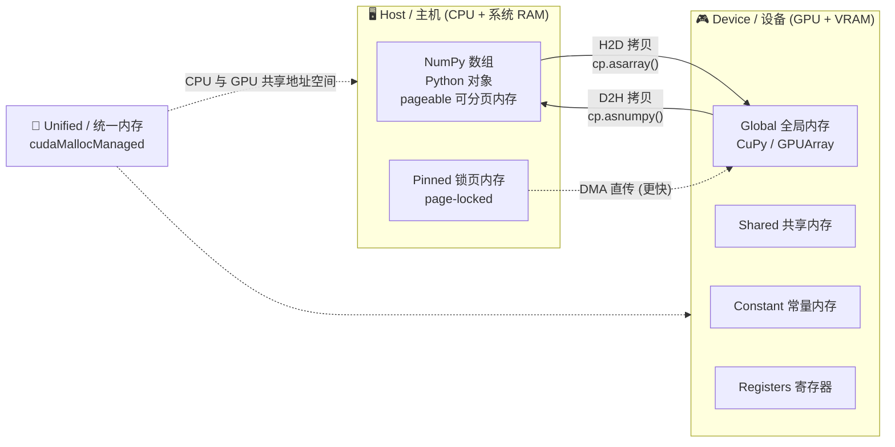
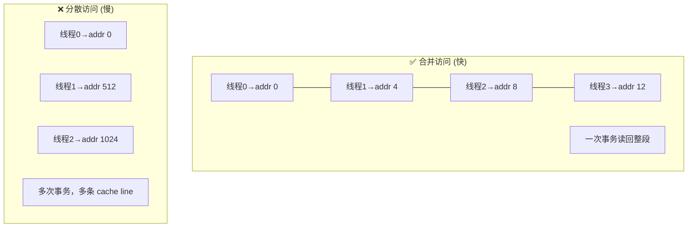
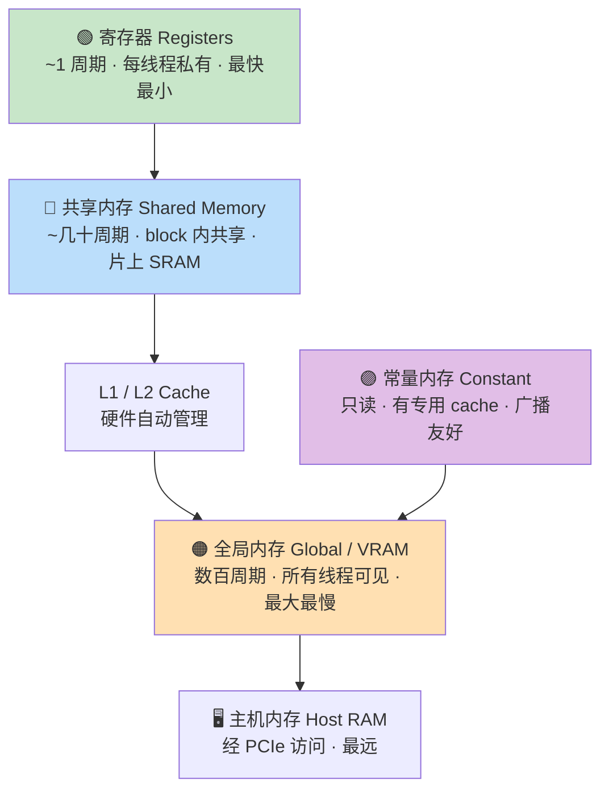
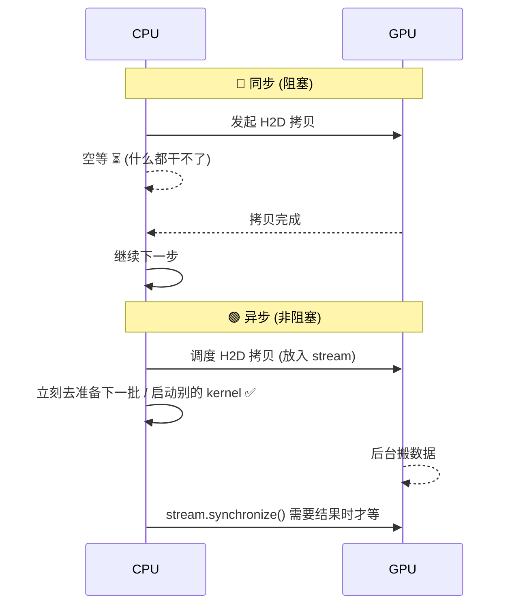
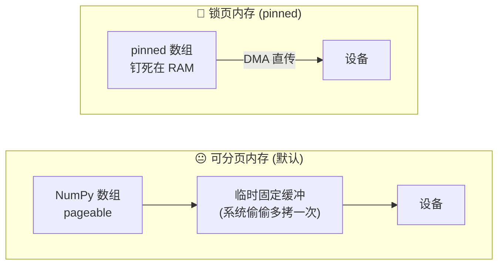
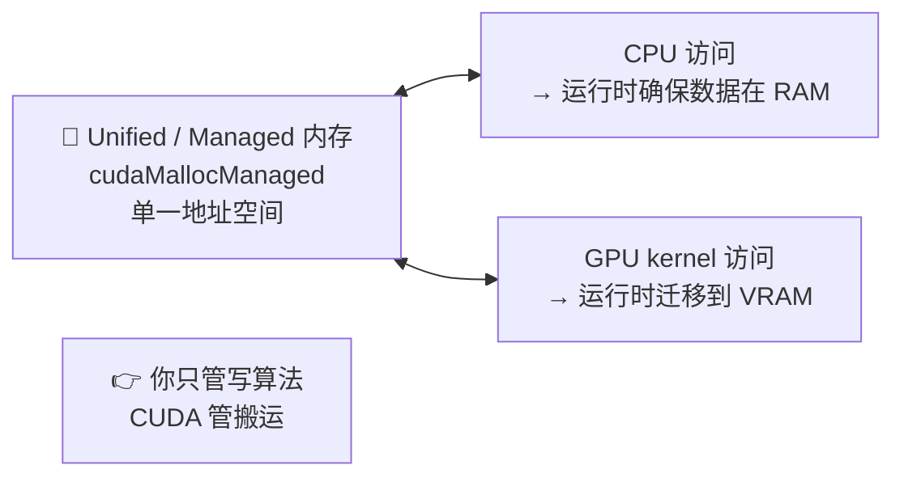
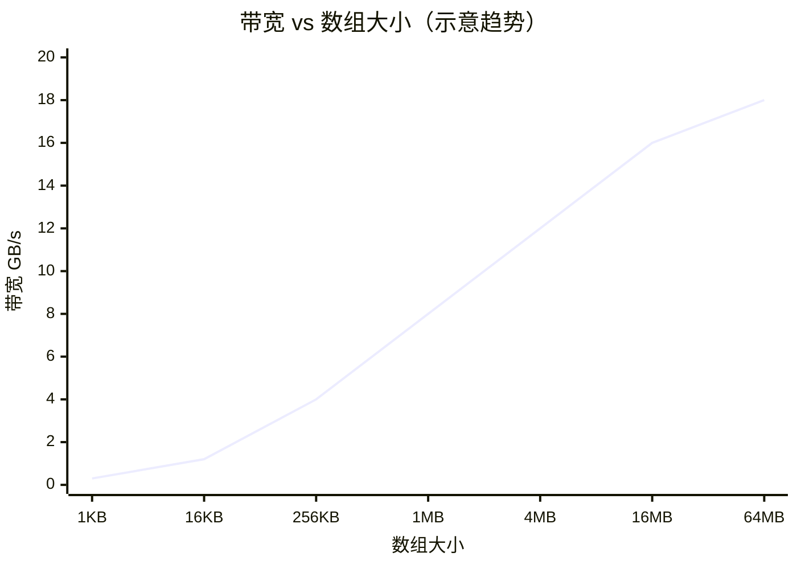

# 第 3 章 · 基础数据传输与内存类型

> 对应原书《Practical GPU Programming》(Fenlor M., 2025) 第 3 章 *Basic Data Transfers and Memory Types*,PDF 第 59–88 页。
> 本篇是"逐章精讲",在忠实抄录并逐行讲解原书代码/概念的基础上,补足 GPU 内存层级(全局/共享/常量/寄存器)的第一性原理,做到零基础也能读懂、进阶也有收获。

---

## 🗺️ 本章地图

这一章要回答一个贯穿所有 GPU 编程的核心问题:**"我的数据现在在哪儿?下一步操作它该在哪儿?"**(Where's my data now, and where should it be for my next operation?)



本章按下面这条主线展开,建议顺着读:

| 小节 | 主题 | 你会学到 | 原书页 |
|---|---|---|---|
| 3.1 | 主机内存 vs 设备内存 | 数据的两个"家",为什么必须搬家 | 60–65 |
| 3.2 | GPU 片上内存层级 | 全局/共享/常量/寄存器(本章标题重点,原书轻描,这里讲透) | 补充 |
| 3.3 | 同步 vs 异步拷贝 | 阻塞与非阻塞,CUDA Stream 初见 | 66–70 |
| 3.4 | 锁页(pinned)内存 | DMA 直传为何更快,代码怎么写 | 71–74 |
| 3.5 | 统一内存(Unified Memory) | 一块内存 CPU/GPU 都能碰,代价是什么 | 75–79 |
| 3.6 | 重叠传输与计算 | 双缓冲 + 多流,把带宽榨干 | 80–84 |
| 3.7 | 带宽基准测试 | 亲手量出你机器的 GB/s | 85–87 |
| 📌 | 小结 + 面试高频 + 延伸 | — | 88 |

> 💡 **一句话抓住本章**:GPU 快在"算",慢在"搬"。这一章教你**少搬、批量搬、边搬边算、用对的内存搬**——数据搬运优化,是 GPU 性能工程的第一课,也是面试必问。

---

## 3.1 主机内存与设备内存:数据的两个"家"

### 🔬 第一性原理:为什么会有两块内存?

每一个 GPU 项目都有一个共同点:**我们的数据可以住在两个完全不同的地方**。

- **主机内存(Host Memory)**:就是你电脑的主内存(系统 RAM)。所有标准的 Python 数据结构、NumPy 数组、操作系统进程都跑在这里。**CPU 能直接访问它**。
- **设备内存(Device Memory)**:位于 GPU 板卡上,常被称为 **VRAM** 或 **全局内存(global memory)**。它**只在 CUDA kernel 执行或设备端操作时**被 GPU 的成千上万个核心访问。

这两块内存在**物理上是分离的**,这一点比它初看起来重要得多:

> ⚠️ **CPU 无法访问或修改设备内存里的数据,除非先把它拷回主机内存;GPU 也无法直接处理主机 RAM 里的数据,必须先把数据传到 GPU 内存里。**

为什么硬件要这么设计?因为**两块内存是为完全不同的访问模式优化的**:

| | 主机内存 (CPU) | 设备内存 (GPU) |
|---|---|---|
| 擅长 | 随机访问、低延迟单点读写 | 高带宽、大批量顺序/合并访问 |
| 靠什么快 | 深层硬件缓存 + 强预取器 (prefetcher) | 大量线程协同读取相邻内存块 |
| 典型容量 | 32 / 64 GB 甚至更多 | 8 ~ 24 GB(明显更小) |
| 适合任务 | 串行、I/O-bound | 并行、高吞吐计算 |

### 怎么分配?从主机开始

分配方法决定了数组"住在哪里"、你如何与它交互。流程从主机(host)开始,用 NumPy 或标准 Python 工具:

```python
import numpy as np
host_array = np.arange(1_000_000, dtype=np.float32)
```

**逐行讲解**:这行代码在**系统 RAM** 里创建了一个百万元素的数组。你可以把它传给任何 CPU 函数、用 Python 全套工具去操作它。**但 GPU 对这个数组的存在一无所知**,直到我们显式地把它搬过去。

要在**设备内存**里分配,我们转向 **CuPy** 或 **PyCUDA**。CuPy 的用法几乎是 NumPy 的镜像:

```python
import cupy as cp
device_array = cp.zeros(1_000_000, dtype=cp.float32)
```

**逐行讲解**:分配直接发生在 **GPU 上**,除非你显式请求,否则**不会**发生任何 host↔device 的拷贝。现在你可以对它施加 GPU kernel,调动数千个并行线程。

PyCUDA 提供自己的 `GPUArray` 对象,行为很像 CuPy 数组:

```python
import pycuda.autoinit
import pycuda.gpuarray as gpuarray
device_array_py = gpuarray.zeros(1_000_000, dtype=np.float32)
```

**逐行讲解**:同样,分配直接发生在设备上;除非执行显式拷贝,否则**主机端内存分文不动**。

> 💡 **实战心法**:
> - 如果数据从主机开始 → 启动 kernel 前必须先传到设备。
> - 如果直接在设备上分配 → 让数据**在 GPU 上待满整个计算周期**,只在需要保存/查看结果时才搬回主机。
> 这就是"少搬"原则。

### ⚠️ 常见坑:数据放错地方

原书特别强调了几类"难以排查"的 bug:

- 如果你在**还留在主机内存**的数据上跑 kernel,大概率**报错或得到错误结果**。
- 如果你把 **NumPy 数组直接**丢给 GPU 函数处理,通常会**抛异常**。
- 这些 bug 往往很隐蔽 —— 时刻盯住"数据在哪儿",在启动操作前确保数组已搬到正确的内存区域。

### 访问模式的差异:合并访问 (coalescing)

原书在这里埋了一个后续章节的重要伏笔:

> 当很多线程在一个 **warp**(GPU 调度的 32 个线程为一组)里访问内存时,**如果跨线程的访问是相邻且对齐的**,你就能把内存控制器的效率发挥到极致——这叫**合并读写 (coalesced loads and stores)**。如果访问模式乱七八糟,GPU 得为一次操作抓取多条 cache line,速度就会掉下来。



### 性能影响:搬运是有成本的

> 每一次在两块内存空间之间传输数据,都要花一定时间,而且**数据越大,代价越高**。一次百万浮点数的传输可能只花零点几秒,但如果**每秒重复很多次**,这个开销会迅速主宰整个应用的运行时间。

还有一个现实约束:**GPU 内存远小于系统 RAM**(常见 8–24 GB vs 32–64 GB+)。这意味着:

- 对超大数据集,要**规划**任一时刻哪些数据在 GPU 上;
- 把数据**切成 chunk、分 batch 处理**,别超出可用设备内存。

### 完整示例:一次典型的 host↔device 往返

原书给出的"黄金工作流"—— 主机建数据 → 传设备 → kernel 处理 → 传回主机:

```python
import numpy as np
host_input = np.random.rand(1_000_000).astype(np.float32)   # ① 主机上建数据

import cupy as cp
device_input = cp.asarray(host_input)                       # ② H2D:传到设备

device_output = cp.sqrt(device_input)                       # ③ 全程在设备上算

host_output = cp.asnumpy(device_output)                     # ④ D2H:传回主机
```

**逐行讲解**:
- ① `np.random.rand(...).astype(np.float32)` —— 在 RAM 里造一批随机单精度浮点。
- ② `cp.asarray()` —— **Host to Device (H2D)**,把 NumPy 数组拷进 GPU 全局内存。
- ③ `cp.sqrt()` —— 对设备数组逐元素开方,**计算完全在 GPU 上**。
- ④ `cp.asnumpy()` —— **Device to Host (D2H)**,把结果拷回 NumPy 供后续 Python 处理或落盘。

> 🔑 **本工作流是任何 GPU 项目的骨架**:把传输**攒到一起**,把重活**全压在设备上**,以最大化性能、最小化开销。

### 三种"进阶内存类型"的预告

原书在第 64 页先给出三个后面要展开的概念,先建立印象:

| 进阶类型 | 一句话 | 换来什么 / 代价 |
|---|---|---|
| **Pinned(锁页/page-locked)** | 把主机数据钉在 RAM 固定位置 | ✅ 传输更快 / ⚠️ 占用不可换出的物理内存 |
| **Unified(统一内存)** | CPU、GPU 共享一个地址空间,运行时按需迁移 | ✅ 编程简单 / ⚠️ 让出部分性能控制权 |
| **Zero-copy(零拷贝)** | GPU 直接访问主机内存 | ✅ 省显存、适合流式 / ⚠️ 走 PCIe,单次访问慢 |

---

## 3.2 GPU 片上内存层级:全局 / 共享 / 常量 / 寄存器

> 📖 本章标题点名了"内存类型",但原书正文主要聚焦 host↔device 传输。作为逐章精讲,这里补上 GPU **片上内存层级**的第一性原理——它是理解后续 kernel 优化、面试必考的地基。上一节的"设备内存/global memory"只是这个层级里最外层的一块。

### 🔬 第一性原理:为什么 GPU 要分这么多层内存?

和 CPU 一样,GPU 也面临"**大而慢**"与"**小而快**"的矛盾。容量越大的存储,离计算单元越远、延迟越高、带宽相对越低。于是硬件把内存切成一个**金字塔**,让程序员根据数据的复用程度、共享范围,把它放到合适的层。**放对层,是 kernel 优化的核心手艺。**



### 四种内存逐一讲透

#### 🟢 寄存器 (Registers)

- **是什么**:每个**线程私有**的极小存储,直接连着 ALU,访问几乎零延迟。
- **谁能看到**:只有拥有它的那个线程,别的线程完全看不见。
- **怎么用**:你在 kernel 里声明的局部标量变量(如 `int idx = ...`)默认就住在寄存器里。
- **代价**:数量极其有限(每个 SM 的寄存器总数固定)。**一个线程用太多寄存器 → 能同时驻留的线程数(occupancy)下降 → 并行度降低**。寄存器不够用时会"溢出"到本地内存(local memory,实际在慢速全局内存里),性能悬崖式下跌。

#### 🔵 共享内存 (Shared Memory)

- **是什么**:片上 SRAM,一个 **block(线程块)内的所有线程共享**,延迟比全局内存低一两个数量级。
- **谁能看到**:同一个 block 的线程;block 结束即释放。
- **怎么用**:CUDA C 里用 `__shared__` 声明;经典用法是**把全局内存的数据先协作搬进共享内存,再反复复用**(如矩阵乘的 tiling、卷积、reduction)。这是把"多次慢速全局访问"换成"一次慢 + 多次快"的关键手艺。
- **代价**:容量小(每 SM 通常几十到上百 KB);**bank conflict(存储体冲突)**会让并行访问退化为串行;还要用 `__syncthreads()` 手动同步,写错就是竞态。

#### 🟣 常量内存 (Constant Memory)

- **是什么**:一块**只读**的设备内存(通常 64 KB),配有专用的 **constant cache**。
- **谁能看到**:所有线程只读;由主机端写入。
- **怎么用**:适合放**所有线程都读、且读同一个值**的数据(如卷积核系数、超参数)。当一个 warp 里所有线程读**同一地址**时,硬件**广播 (broadcast)** 一次即可,极其高效。
- **代价**:只读;若不同线程读**不同地址**,访问会被串行化,反而变慢。

#### 🟠 全局内存 (Global Memory / VRAM)

- **是什么**:就是 3.1 节说的**设备内存**,容量最大(GB 级)、延迟最高(数百周期)、带宽最高(HBM 可达 TB/s 级)。
- **谁能看到**:所有 kernel、所有线程,且**跨 kernel 持久存在**(直到你释放)。CuPy / GPUArray 分配的数组就在这里。
- **怎么用**:大数据的主力存储。用好它的关键是 **合并访问**(见 3.1)+ 用共享内存/寄存器减少重复访问。
- **代价**:延迟高;访问不合并时带宽利用率暴跌;主机要访问它必须先 D2H 拷贝。

### 一张对照表记牢

| 内存 | 作用域 | 相对速度 | 相对容量 | 读写 | 典型用途 |
|---|---|---|---|---|---|
| 寄存器 Register | 单线程私有 | ⚡⚡⚡⚡ 最快 | 极小 | 读写 | 局部标量、循环变量 |
| 共享内存 Shared | block 内共享 | ⚡⚡⚡ | 小 (KB) | 读写 | tiling、block 内协作复用 |
| 常量内存 Constant | 全局只读 | ⚡⚡⚡ (广播时) | 小 (~64KB) | 只读 | 系数、超参、查表 |
| 全局内存 Global | 所有线程 + 跨 kernel | ⚡ 最慢 | 大 (GB) | 读写 | 主数据、输入输出 |
| 本地内存 Local | 单线程私有 | ⚡ 慢(实在 VRAM) | — | 读写 | 寄存器溢出、大局部数组 |

> 💡 **面试高频**:"CUDA 有哪些内存类型,各自的作用域和速度?"标准答案就是上面这张表 + 一句话点睛:**寄存器最快但私有、共享内存快且 block 内共享(需手动同步)、常量内存只读适合广播、全局内存最大最慢但对所有线程持久可见**。能再补一句"优化的本质是把热数据从全局内存搬到共享内存/寄存器,减少慢速访问",就非常加分。

---

## 3.3 同步 vs 异步拷贝

### 定义:阻塞与非阻塞

我们常把 host↔device 传输想成"一个简单动作",但实际上有两种**截然不同**的传输模式:

- **同步传输 (Synchronous)**:Python 脚本**等到数据搬完**才往下走。拷贝命令会**阻塞 (block)** 后续所有代码,直到每一个字节都到达目的地。小的、偶尔的传输几乎察觉不到;但**大数组或频繁传输**时,同步拷贝会拖慢整个流程,让 **CPU 空等**。
- **异步传输 (Asynchronous)**:代码**调度**好传输后**立刻往前走**。GPU 和驱动在后台真正搬数据,而你的脚本可以去干别的——启动另一个 kernel、准备更多数据、甚至发起更多传输。异步拷贝让我们**重叠通信与计算 (overlap communication and computation)**,隐藏传输延迟,把硬件吞吐榨到最大。



### 性能影响

> 依赖同步传输时,CPU 和 GPU 常常互相干等,**双双闲置**,严重限制每秒能干的活。切到异步后,我们可以**排队一堆操作**,驱动和 GPU 一有资源就执行,实际上搭起了一条**流水线**:CPU 在 GPU 忙于传输/计算时准备下一批负载或处理结果。用对了,异步传输在某些工作流里能让**有效吞吐几乎翻倍**——尤其配合流式和批处理时。

### CuPy 里的同步与异步

**默认方法 `cp.asarray()` / `cp.asnumpy()` 是同步的**:

```python
import numpy as np
import cupy as cp
host_data = np.random.rand(100_000_000).astype(np.float32)
device_data = cp.asarray(host_data)     # ⛔ 阻塞:直到全部数据落地设备才返回
```

**逐行讲解**:Python 进程在 `cp.asarray()` 处**停住**,直到每个值都安全落进设备内存才返回。这保证下一步操作开始时数据已就绪——安全,但可能低效。

要解锁**异步**,用 CuPy 的 **`cp.cuda.Stream()`** 对象:

```python
stream = cp.cuda.Stream(non_blocking=True)   # 创建一个非阻塞流
with stream:
    device_data_async = cp.asarray(host_data)  # 传输被排进这个 stream,后台运行
# 我们的脚本继续往下走，即使传输还在后台进行
```

**逐行讲解**:`with stream:` 上下文里的操作被**排队 (queue)** 到该 stream 上;只要没有显式同步,Python 代码就继续前进。

需要确保 stream 里所有排队操作都完成、再去用数据时,调用:

```python
stream.synchronize()   # 手动同步：在此等待该 stream 全部完成
```

> 💡 这种**手动同步**让我们自己决定"何时才等结果"的最佳时机,对执行流有细粒度控制。

### 示例:测量阻塞行为

原书用一段程序对比两种方式的耗时。先测同步:

```python
import time
import numpy as np
import cupy as cp
host_data = np.random.rand(200_000_000).astype(np.float32)

start = time.time()
device_data = cp.asarray(host_data)              # 同步:代码在此暂停直到传完
end = time.time()
print("Synchronous transfer time (seconds):", end - start)
```

再测异步(用显式 stream 管理):

```python
import time
host_data = np.random.rand(200_000_000).astype(np.float32)
stream = cp.cuda.Stream(non_blocking=True)

start = time.time()
with stream:
    device_data_async = cp.asarray(host_data)
    # 这里可以放其它工作（准备数据 / 启动别的 kernel）
stream.synchronize()                              # 用数据前等传输完成
end = time.time()
print("Asynchronous transfer time (seconds):", end - start)
```

> 🔑 **关键洞察**:如果你在 `start` 和 `synchronize()` 之间**塞进更多计算或 kernel 启动**,常能观察到**净加速**——传输和计算并行跑,吃满硬件并发。**光测一个空的异步拷贝是看不出好处的**,好处来自"传输时 CPU/GPU 没闲着"。

### ⚠️ 常见坑:计时不加同步 = 测了个寂寞

因为异步调用**立即返回**,如果你在 `cp.asarray()` 后**不 `synchronize()` 就 `time.time()`**,你测到的只是"把命令排进队列"的时间(接近 0),而**不是真正的传输时间**。基准测试务必在计时区间末尾同步(见 3.7)。

### 何时用哪种?

| 场景 | 推荐 | 理由 |
|---|---|---|
| 简单脚本、快速原型、偶尔的小数组 | **同步** | 简单直观,数据总是就绪 |
| 批处理、深度学习流水线、频繁 host↔device | **异步 + Stream** | 让 CPU/GPU 都忙起来,减少等待 |
| 需要精细排队/多任务重叠 | **多 Stream** | 不同任务分配不同 stream,重叠传输与 kernel,避免争用 |

---

## 3.4 锁页(Pinned)内存:更快的传输

### 🔬 为什么主机内存的"类型"会影响传输速度?

默认情况下,NumPy / Python 的数组住在**可分页 (pageable) 内存**里。这种内存**可以被操作系统换入换出**(swap 到磁盘),对系统整体很灵活,但对"直接给设备访问"是个负担:

> 当 GPU 向可分页内存请求数据时,系统必须**先把它拷到一块临时的、固定位置的缓冲区**,才能开始真正的传输。这一"额外拷贝"拖慢了整个过程,数组越大越明显。

**锁页(pinned / page-locked)内存**给了我们一个大提速:分配 pinned 内存,就是告诉操作系统**把这块内存钉死在物理 RAM 里,永远不换出到磁盘**。这样 **GPU 的 DMA 引擎 (Direct Memory Access) 就能直接从 RAM 搬到设备,不需要任何临时拷贝**,带宽实测提升。



### 分配锁页内存

CuPy 用**锁页内存池**来分配:

```python
import cupy as cp
# 分配一个锁页主机数组
pinned_pool = cp.cuda.PinnedMemoryPool()
cp.cuda.set_pinned_memory_allocator(pinned_pool.malloc)
size = 100_000_000
pinned_host = cp.ndarray(
    (size,), dtype=cp.float32,
    memptr=pinned_pool.malloc(size * cp.dtype(cp.float32).itemsize)
)
```

**逐行讲解**:
- `PinnedMemoryPool()` —— 创建一个锁页内存池(负责向 OS 申请 page-locked 区域并复用)。
- `set_pinned_memory_allocator(pinned_pool.malloc)` —— 把它设为默认的锁页分配器。
- `pinned_pool.malloc(字节数)` —— 申请一块锁页内存,返回内存指针 (`memptr`)。
- `cp.ndarray((size,), ..., memptr=...)` —— 用这块锁页内存**当作后端**构造一个数组。它**用起来和普通 CuPy 数组一模一样**,但住在 GPU 能高速直取的 RAM 区域。

### 对比测速:pageable vs pinned

```python
import time
# ... pinned_host 已按上面分配好 ...
pinned_host[:] = pageable_host            # 把数据拷进锁页数组

# 计时：从可分页内存传输
start_pageable = time.time()
device_array_pageable = cp.asarray(pageable_host)
cp.cuda.Stream.null.synchronize()         # ← 关键：同步后再停表
end_pageable = time.time()
print("Transfer time (pageable):", end_pageable - start_pageable, "seconds")

# 计时：从锁页内存传输
start_pinned = time.time()
device_array_pinned = cp.asarray(pinned_host)
cp.cuda.Stream.null.synchronize()
end_pinned = time.time()
print("Transfer time (pinned):", end_pinned - start_pinned, "seconds")
```

**逐行讲解**:每次传输后都 `cp.cuda.Stream.null.synchronize()`(在**默认/null 流**上同步),确保**计时只包含真正的数据移动**、不含排队的其它操作。绝大多数系统上,**pinned 的传输明显更快,数组越大差距越明显**。

### 何时用锁页内存?

| 适合 | 不必要 |
|---|---|
| 大而频繁的传输 | 简单脚本、一次性实验 |
| 低延迟关键(流式、实时) | 追求代码可移植 / 简洁 |
| 机器学习:快速搬 batch | 传输量很小时 |

> ⚠️ **常见坑**:锁页内存是**不可换出的物理 RAM**,占用是"真占用"。**分配过多 pinned 内存会挤占系统可用 RAM,导致整机变卡甚至 OOM**。把它当"稀缺高速通道"用在热点数据上,而不是无脑全用。

---

## 3.5 统一内存(Unified Memory):一块内存两边用

### 核心思想

到目前为止,每次想在 GPU 上处理数据,我们都**显式**地从主机搬到设备,看结果再搬回来。这种"泾渭分明"给了我们极佳的控制和顶级性能,但也让代码更复杂、更不灵活——尤其当算法在 CPU/GPU 之间**动态来回**,或我们在**快速原型**时。

**统一内存(Unified Memory,由 CUDA 的 `cudaMallocManaged` 引入)改变了游戏规则**:

> 我们分配**一块** CPU 和 GPU 都能直接访问的内存区域。**CUDA 驱动和运行时负责按需在 host/device 之间迁移数据**。这意味着我们可以从任意一侧操作数据,**无需显式拷贝、也无需维护分开的 host/device 数组**。



CPU 访问该数组时,运行时保证它在 RAM;GPU kernel 访问时,运行时把它迁移到设备内存。**你专注写算法,CUDA 处理后勤。**

### 何时用统一内存?

原书列的理想场景:
- ✅ **快速开发与测试**,当"降低代码复杂度"比"榨干性能"更重要时;
- ✅ 在 CPU/GPU 之间**频繁切换**的算法;
- ✅ **多 GPU / 多进程**、显式内存管理很棘手的负载;
- ✅ 数据大小**可能超过设备内存**的情况(靠自动分页救场)。

> 对性能关键路径,仍可把统一内存与**显式传输**或**锁页内存**结合使用。

### 示例:用统一内存做向量加法

CuPy 通过 `alloc_managed` 支持统一内存。先分配托管缓冲:

```python
import cupy as cp
import numpy as np
size = 1_000_000
# 为输入输出分配统一内存
a_managed = cp.cuda.memory.alloc_managed(size * cp.dtype(cp.float32).itemsize)
b_managed = cp.cuda.memory.alloc_managed(size * cp.dtype(cp.float32).itemsize)
c_managed = cp.cuda.memory.alloc_managed(size * cp.dtype(cp.float32).itemsize)
```

**逐行讲解**:`alloc_managed(字节数)` 分配一块**托管 (managed) 内存**,CPU 与 GPU 都能访问。现在有三个缓冲 `a/b/c`。

用 Python 的 buffer 接口把它们**当 NumPy 数组**用(主机端访问):

```python
# 把托管内存映射为 NumPy 数组（主机访问）
a_host = np.frombuffer(a_managed, dtype=np.float32, count=size)
b_host = np.frombuffer(b_managed, dtype=np.float32, count=size)
c_host = np.frombuffer(c_managed, dtype=np.float32, count=size)
a_host[:] = np.random.rand(size).astype(np.float32)
b_host[:] = np.random.rand(size).astype(np.float32)
```

**逐行讲解**:`np.frombuffer(...)` 让 NumPy **共享同一块底层内存**(不复制)。填好 `a_host / b_host` 后,**数据已就绪,无需任何显式 host→device 传输**。

### 写并启动 kernel

```python
kernel_code = r'''
extern "C" __global__
void vec_add(const float* a, const float* b, float* c, int n) {
    int idx = blockDim.x * blockIdx.x + threadIdx.x;   // 全局线程索引
    if (idx < n) {                                      // 边界检查
        c[idx] = a[idx] + b[idx];                       // 逐元素相加
    }
}
'''
module = cp.RawModule(code=kernel_code)                  # 编译 CUDA C 源码
vec_add = module.get_function('vec_add')                 # 取出 kernel 句柄

threads_per_block = 256
blocks_per_grid = (size + threads_per_block - 1) // threads_per_block  # 向上取整
vec_add((blocks_per_grid,), (threads_per_block,),
        (a_managed, b_managed, c_managed, size))         # 直接传托管指针，零拷贝
```

**逐行讲解(kernel 内部)**:
- `int idx = blockDim.x * blockIdx.x + threadIdx.x;` —— **一维全局线程索引**的标准公式:块大小 × 块号 + 块内线程号。这个 `idx` 是**寄存器**变量(见 3.2)。
- `if (idx < n)` —— **边界检查**。因为 `blocks_per_grid` 向上取整,最后一个 block 会有多余线程,必须挡住越界写。
- `c[idx] = a[idx] + b[idx];` —— 每个线程负责一个元素,数千线程并行完成整个向量加。
- `(size + threads_per_block - 1) // threads_per_block` —— **向上取整**惯用法,保证线程数 ≥ 元素数。
- 最后一行:kernel **直接吃 `a_managed/b_managed/c_managed` 托管指针**——**没有任何显式内存传输**,这正是统一内存的魅力。

### 校验结果

kernel 一跑完,由于统一内存 CPU 也能访问,**结果立刻可读**:

```python
# 用 CPU 计算校验 GPU 结果
expected = a_host + b_host
if np.allclose(c_host, expected):
    print("Unified memory vector addition succeeded and is correct.")
else:
    print("Mismatch detected.")
```

**逐行讲解**:`np.allclose()` 在浮点容差内比对 GPU 结果 `c_host` 与 CPU 参考 `expected`。**无需把 `c` 显式搬回主机**——它本就在统一地址空间里。

### ⚖️ 代价:方便,但不是免费的

> 统一内存极大简化了代码,但 **CUDA 运行时仍需按需迁移数据**。对于**反复在 CPU/GPU 访问间弹跳**的工作流,相比手工优化的显式传输,会出现一些**额外开销 (page fault + 迁移)**。不过对许多真实问题——尤其开发、快速原型、混合负载——统一内存以**很小的代价**换来清晰与便利。

> 💡 **额外福利**:处理**超大数据集**时,统一内存的**自动分页**让你能操作**比 GPU 显存还大**的数组——CUDA 会把数据换入换出,让程序在受限环境里依然健壮。

| | 显式传输 | 统一内存 |
|---|---|---|
| 代码复杂度 | 高(手动管两份数组) | 低(一份数组) |
| 峰值性能 | 最快(可控) | 略慢(运行时迁移开销) |
| 超显存数据 | 需手动分块 | 自动分页,透明支持 |
| 适合 | 性能关键路径 | 原型、混合、多 GPU |

---

## 3.6 重叠数据传输与计算

### 为什么要重叠?

默认情况下,**传输和计算一个接一个串行发生**:拷数据到 GPU → 等拷贝完 → 启动 kernel → 等 kernel 完 → 再处理下一块。这让 GPU 或 CPU 在周期的大部分时间里**闲置**,硬件严重欠利用。

**当数据传输与 kernel 执行重叠**——一块数据在传、另一批 kernel 同时在算——每个资源都忙起来,端到端延迟下降。**CUDA Stream 是实现重叠的钥匙。**

> **一个 CUDA stream 本质上是 GPU 的一个命令队列。放在不同 stream 里的操作,只要资源允许就能并发执行。** 默认 stream(**null stream**)里的一切都严格顺序执行;把传输和 kernel 分配到**不同 stream**,就等于给了 GPU"重叠数据移动与计算"的许可。

### 双缓冲 (Double Buffering)

要看到重叠,我们创建**多个数据缓冲**——一个在传输的同时,另一个在被处理。这种**双缓冲**是高性能 GPU 负载里极常用的手法,最大化吞吐。

```mermaid
gantt
    title 双缓冲：传输流与计算流重叠
    dateFormat X
    axisFormat %s
    section 传输流 transfer
    传 batch0      :0, 1
    传 batch1      :1, 2
    传 batch2      :2, 3
    section 计算流 compute
    算 batch0      :1, 2
    算 batch1      :2, 3
    算 batch2      :3, 4
```



上图直觉:当计算流在算 batch0 时,传输流已经在传 batch1——两条流并行推进,总时间被压缩。

### 示例:两个 stream 实现重叠

```python
import cupy as cp
import numpy as np
import time

total_size = 100_000_000
batch_size = 10_000_000
# 在主机上生成数据批次
host_batches = [
    np.random.rand(batch_size).astype(np.float32)
    for _ in range(total_size // batch_size)      # 共 10 个 batch
]

# 简单 kernel：逐元素乘以标量
kernel_code = r'''
extern "C" __global__
void scale(float *a, float scale, int n) {
    int idx = blockDim.x * blockIdx.x + threadIdx.x;
    if (idx < n) {
        a[idx] *= scale;
    }
}
'''
mod = cp.RawModule(code=kernel_code)
scale_kernel = mod.get_function('scale')
threads_per_block = 256
blocks_per_grid = (batch_size + threads_per_block - 1) // threads_per_block

# 创建两条 stream 用于重叠
stream_transfer = cp.cuda.Stream(non_blocking=True)
stream_compute  = cp.cuda.Stream(non_blocking=True)

results = []
start = time.time()
for i, batch in enumerate(host_batches):
    # 在传输流里分配设备缓冲并拷入
    with stream_transfer:
        device_batch = cp.asarray(batch)
    # 等传输完成，再在计算流里启动 kernel
    stream_transfer.synchronize()
    with stream_compute:
        scale_kernel(
            (blocks_per_grid,), (threads_per_block,),
            (device_batch, np.float32(1.5), batch_size)
        )
        # 异步把结果拷回
        result_host = cp.asnumpy(device_batch)
    stream_compute.synchronize()   # 确保计算与回拷完成再继续
    results.append(result_host)
end = time.time()
print(f"Total time for processing with overlap: {end - start:.2f} seconds")
```

**逐行/逐段讲解**:
- `host_batches` —— 把 1 亿元素切成 10 个 1000 万的 batch,是"分块处理"的实践。
- `scale` kernel —— 每个线程把一个元素 `*= scale`(这里 1.5),结构同 3.5 的 vec_add。
- **两条 stream** `stream_transfer` / `stream_compute` —— 一条专职传输、一条专职计算。
- 循环里:传输流拷入 → `stream_transfer.synchronize()` → 计算流启动 kernel + 回拷 → `stream_compute.synchronize()`。
- 原书点出关键:**"由于下一次传输能在计算流一开跑就立即开始,后面的迭代就会看到重叠。"** 也就是说,当前 batch 在 compute 流里算的同时,下一个 batch 已能在 transfer 流里传。

> ⚠️ **注意**:这个教学示例为了清晰,在每个 batch 内加了两次 `synchronize()`,把重叠机会限制在"迭代之间"。**真正生产级的双缓冲**会用两套预分配缓冲交替、并用 CUDA event 做更松的依赖,让重叠更充分。但原书这版足以演示核心思想。

### 对照组:无重叠(全走默认流)

```python
start_sync = time.time()
for batch in host_batches:
    device_batch = cp.asarray(batch)                 # 传
    scale_kernel(
        (blocks_per_grid,), (threads_per_block,),
        (device_batch, np.float32(1.5), batch_size)  # 算
    )
    result_host = cp.asnumpy(device_batch)           # 回拷
end_sync = time.time()
print(f"Total time with synchronous (no overlap): {end_sync - start_sync:.2f} seconds")
```

**逐行讲解**:一切都在**默认/null 流**上顺序执行——传完才算、算完才回拷、回拷完才进下一个 batch,**没有任何重叠**。对比两段的打印时间,就能量化重叠带来的收益。

> 🔑 在真实负载里,重叠常能**减少总时间**、跟上流式输入。用 CUDA stream 重叠传输与计算,是解锁 GPU 并发潜力、构建高吞吐流水线的核心技巧。

---

## 3.7 简单带宽测量

### 为什么要量带宽?

> **不管你的 GPU 多快,如果它只是干等 CPU 喂数据,那也白搭。** 测量系统带宽(host↔device 能多快传数据),能告诉我们瓶颈在哪、离硬件极限有多近,进而帮我们**决定数组大小、挑最佳 batch size、判断何时该上锁页内存或重叠传输**。

### 基准脚本

目标:把不同大小的数组来回传,计时,算出有效吞吐(GB/s)。

```python
import numpy as np
import cupy as cp
import time

sizes = [2**10, 2**14, 2**18, 2**20, 2**22, 2**24, 2**26]  # 从 1KB 到 64MB
dtype = np.float32

print(f"{'Array Size (MB)':>15} | {'Host→Device GB/s':>18} | {'Device→Host GB/s':>18}")
for size in sizes:
    arr = np.random.rand(size).astype(dtype)
    arr_bytes = arr.nbytes / (1024 * 1024)          # 转成 MB 便于打印

    # Host → Device
    start_htod = time.time()
    d_arr = cp.asarray(arr)
    cp.cuda.Stream.null.synchronize()               # ← 必须同步再停表
    end_htod = time.time()
    htod_time = end_htod - start_htod
    htod_gbs = arr.nbytes / (htod_time * 1e9)       # 字节 / (秒 × 1e9) = GB/s

    # Device → Host
    start_dtoh = time.time()
    arr2 = cp.asnumpy(d_arr)
    cp.cuda.Stream.null.synchronize()
    end_dtoh = time.time()
    dtoh_time = end_dtoh - start_dtoh
    dtoh_gbs = arr.nbytes / (dtoh_time * 1e9)

    print(f"{arr_bytes:15.2f} | {htod_gbs:18.2f} | {dtoh_gbs:18.2f}")
```

**逐段拆解**(原书第 87 页):
1. 选一串数组大小,**每次翻倍**(1KB → 64MB),扫出"大小 vs 带宽"曲线。
2. 对每个大小,造一个随机 NumPy 数组,记下 MB 数。
3. 用 `cp.asarray()` 测 H2D、`cp.asnumpy()` 测 D2H,**每次操作后 `synchronize()`**(否则计时无效,见 3.3 坑)。
4. **有效带宽 = 数组字节数 / 传输时间**,报成 GB/s。注意 `1e9`(用 GB = 10^9 字节的十进制口径)。

### 结果解读

> 通常会看到**带宽随数组增大而上升**:小数组因**启动开销 (setup overhead)** 无法喂满总线;大数组则逼近硬件理论极限。对多数跑在 **PCIe Gen3/Gen4** 上的现代 GPU,**大传输的峰值带宽典型在 8–20 GB/s**,取决于具体硬件以及是否用了锁页内存。



### 进一步探索

原书建议的延伸实验:
- 用**锁页内存**重跑 → 大传输带宽通常更高;
- 若有多 GPU,测 **device-to-device (GPU↔GPU)** 拷贝;
- 加**异步 (CUDA stream) 传输**测量,看并发对带宽的影响。

> 💡 **面试高频**:"PCIe Gen3/Gen4 的 host-device 带宽大概多少?"—— 记住 **8–20 GB/s 量级**(Gen3 ×16 理论 ~16GB/s,Gen4 翻倍 ~32GB/s,实测打折)。再补一句"**小传输受启动开销限制,所以要批量传**",就答到点子上了。

---

## 📌 本章小结

这一章我们建立了 GPU 数据管理的完整心智模型:

1. **两块内存,两个家**:主机内存(CPU/RAM,擅长随机访问)与设备内存(GPU/VRAM,擅长高带宽批量)。物理分离 → 必须显式搬家。核心问题永远是"**数据现在在哪儿?下一步该在哪儿?**"

2. **GPU 片上内存层级**(本章标题重点):
   - 🟢 **寄存器** —— 单线程私有,最快最小;
   - 🔵 **共享内存** —— block 内共享,tiling 复用的利器(需 `__syncthreads`);
   - 🟣 **常量内存** —— 只读、广播友好;
   - 🟠 **全局内存** —— 最大最慢、所有线程持久可见。
   - 优化的本质:**把热数据从慢的全局内存搬到快的共享内存/寄存器**。

3. **同步 vs 异步**:默认 `asarray/asnumpy` 是**阻塞**的;用 `cp.cuda.Stream` 解锁**非阻塞**,重叠通信与计算,吞吐可近翻倍。计时**务必同步**。

4. **锁页内存**:把主机数据钉在物理 RAM,让 **DMA 直传**、省掉临时拷贝,大而频繁的传输显著提速——但占用不可换出的真 RAM,别滥用。

5. **统一内存**:一块 `cudaMallocManaged` 内存 CPU/GPU 共享,运行时自动迁移,代码大幅简化,还能操作超显存数据;代价是 page-fault 迁移开销,不适合极致性能路径。

6. **重叠传输与计算**:用**多 stream + 双缓冲**让"传一批、算一批"并行,榨干硬件并发。

7. **带宽基准**:亲手量出 H2D/D2H 的 GB/s,PCIe Gen3/4 典型 8–20 GB/s;小传输受启动开销限制 → **批量传**。

> 🎯 **一句话带走**:GPU 性能工程的第一原则是 **"少搬、批量搬、边搬边算、用对的内存搬"**。搞定数据搬运,你就跨过了 GPU 编程最常见的性能陷阱。

### ✅ 自测清单(面试自查)

- [ ] 为什么 CPU 不能直接读 GPU 显存?反之为什么不行?
- [ ] 说出 4 种 GPU 内存类型的**作用域 + 相对速度**。
- [ ] `cp.asarray` 默认是同步还是异步?怎么改成异步?
- [ ] 锁页内存为什么快?它的代价是什么?
- [ ] 统一内存省了什么?代价是什么?什么时候**不该**用?
- [ ] 双缓冲/多 stream 如何实现传输与计算重叠?
- [ ] PCIe Gen3/4 的 host-device 带宽量级?为什么小数组测出来带宽低?

---

## 🔗 延伸阅读

- **原书后续章节**:CUDA Streams、Events 与更深入的并发调度;kernel 优化与合并访问 (memory coalescing) 的展开。
- **官方文档**:
  - *CUDA C++ Programming Guide* — "Memory Hierarchy" 与 "Device Memory Accesses" 章节(权威定义寄存器/共享/常量/全局的语义与合并规则)。
  - *CuPy 官方文档* — `cupy.cuda.Stream`、`PinnedMemoryPool`、`alloc_managed`、`RawModule` 的 API 说明。
  - *NVIDIA 博客* — "Unified Memory for CUDA Beginners"、"How to Optimize Data Transfers in CUDA"(pinned memory + 重叠的经典教程)。
- **本仓库关联**:
  - `ai-infra/` 与 `llm-inference/` 目录里关于显存管理、KV-cache、PCIe/NVLink 拓扑的讨论,与本章"搬运成本"一脉相承。
  - `llm-interview/` 里 CUDA 内存层级、合并访问、occupancy 的高频面试题。

---

*本篇为《Practical GPU Programming》逐章精讲第 3 章。上一章打好了工具链与第一个 kernel 的基础,下一章将在此之上深入 CUDA 的并发与调度机制。*
