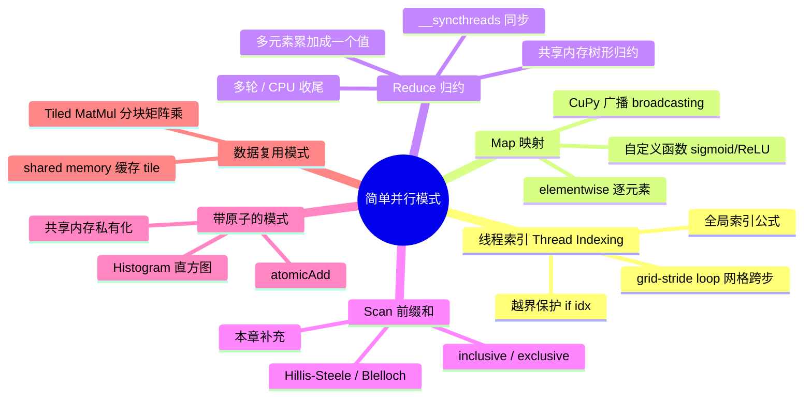
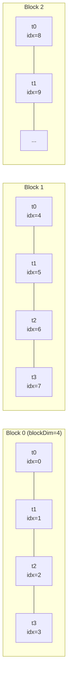
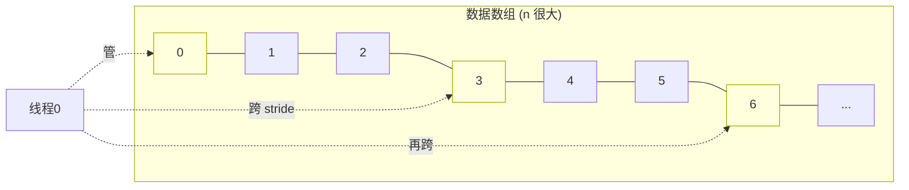
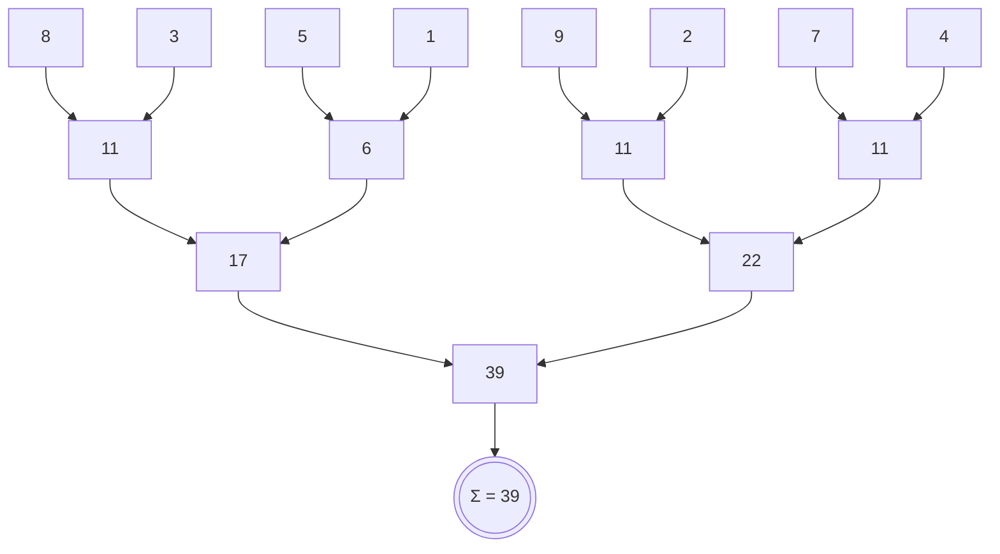
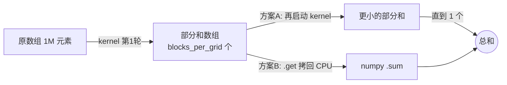
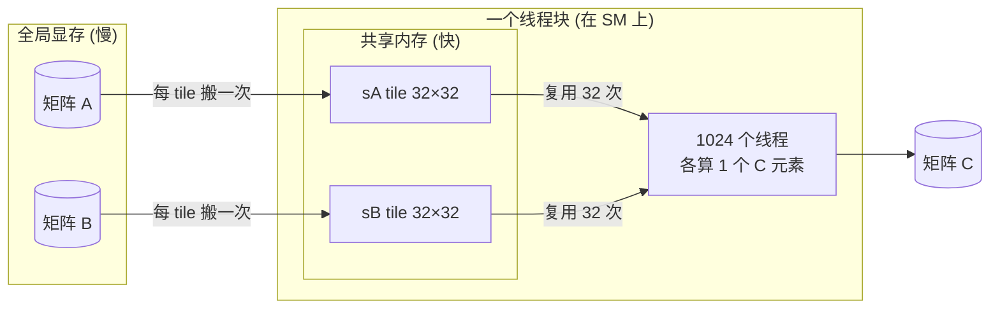
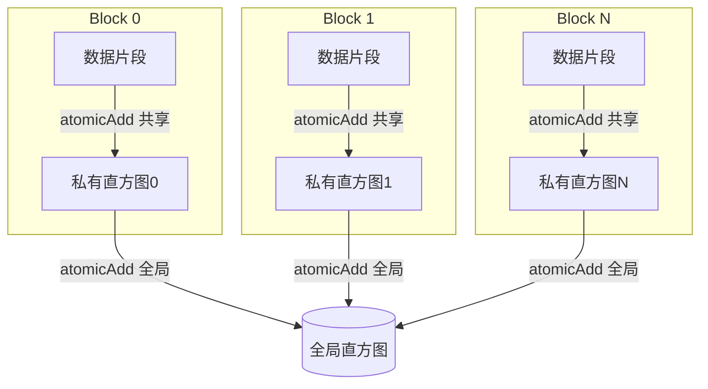
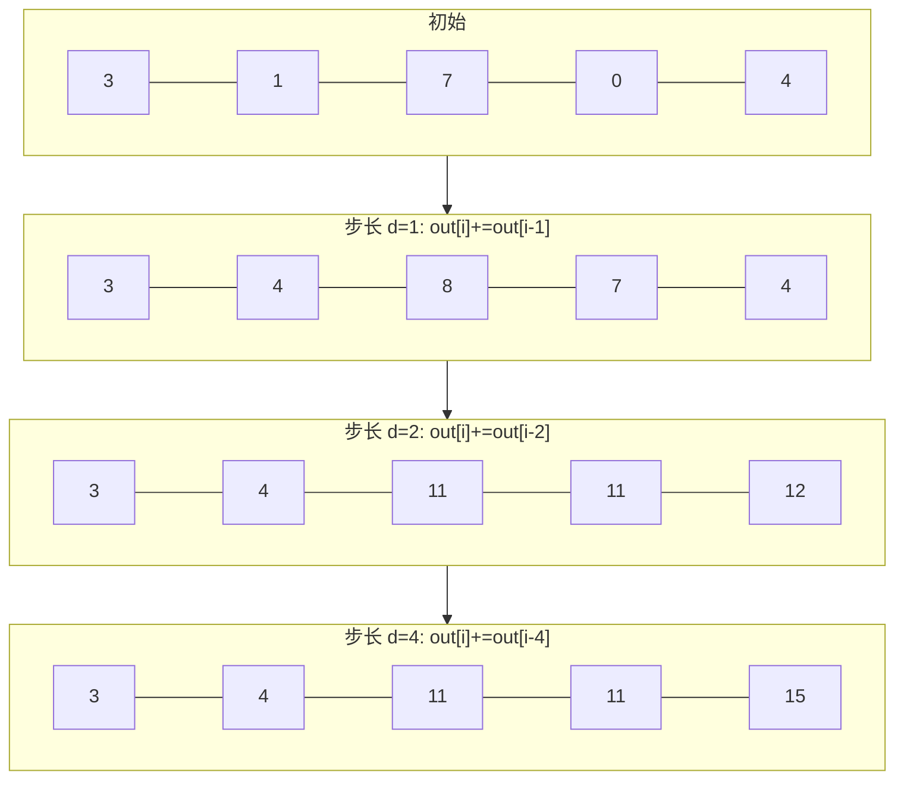

# 第 4 章 · 简单并行模式（Simple Parallel Patterns）🧩

> 对应《Practical GPU Programming》(Fenlor M., 2025) 第 89–110 页。
> 本章把 GPU 编程从"能跑一个 kernel"提升到"会用**模式（pattern）思维**解决真实问题"。一旦你掌握了这几个模式，绝大多数并行算法都会变成"同一主题的简单变奏"。

---

## 🗺️ 本章地图



本章的主线逻辑是一个**难度阶梯**：

| 阶段 | 模式 | 线程之间要不要"说话"？ | 核心武器 | 书中页码 |
|---|---|---|---|---|
| 1️⃣ | **Map（映射）** | ❌ 完全独立 | 全局线程索引 | 90–92, 102–105 |
| 2️⃣ | **Reduce（归约）** | ✅ 块内协作 | 共享内存 + `__syncthreads` | 93–97 |
| 3️⃣ | **Tiled MatMul（分块矩阵乘）** | ✅ 块内协作复用数据 | 共享内存 tile | 98–101 |
| 4️⃣ | **Histogram（直方图）** | ✅✅ 会抢同一个位置 | `atomicAdd` 原子操作 | 106–109 |
| ➕ | **Scan（前缀和）** | ✅ 有数据依赖 | 本章额外补充 | — |

> 🔬 **第一性原理**：GPU 有几千个核心，但它们**没有共享的调用栈、没有全局锁、彼此不能随便通信**。所以"并行模式"的本质，就是**在"线程互不干扰"和"线程必须协作"之间找到最省通信的组织方式**。Map 是零通信（最快最爽），Reduce/Scan 是有序通信（要同步），Histogram 是无序争抢（要原子）。理解了这条谱系，你就理解了并行编程的全部张力。

---

## 0️⃣ 前置：线程索引（Thread Indexing）—— 一切模式的地基 🧭

在讲任何模式之前，必须先把**"这个线程该处理哪个数据？"**这件事焊死在脑子里。GPU 启动 kernel 时，会拉起一个 **grid（网格）**，grid 由若干 **block（线程块）** 组成，每个 block 又由若干 **thread（线程）** 组成。CUDA 给每个线程发了两个"工牌"：

- `threadIdx.x`：我在**块内**排第几（0 ~ `blockDim.x - 1`）
- `blockIdx.x`：我这个块在**网格里**排第几（0 ~ `gridDim.x - 1`）
- `blockDim.x`：一个块里有多少线程

### 全局线程索引公式（一维）

```cuda
int idx = blockIdx.x * blockDim.x + threadIdx.x;
```

📐 **怎么理解这条公式？** 把它想成"门牌号"：



- Block 0 的 4 个线程占 idx `0,1,2,3`；
- Block 1 从 `blockIdx.x(=1) * blockDim.x(=4) = 4` 起步，占 `4,5,6,7`；
- 每个块负责一段连续区间，全局索引 = **块起点 + 块内偏移**。

### ⚠️ 越界保护：为什么几乎每个 kernel 都有 `if (idx < n)`

我们通常这样算需要多少个 block：

```python
threads_per_block = 256
blocks_per_grid = (N + threads_per_block - 1) // threads_per_block  # 向上取整
```

`(N + T - 1) // T` 是**向上取整除法**的经典写法。假设 `N = 10_000_000`、`T = 256`，算出来 `blocks_per_grid = 39063`，一共启动 `39063 * 256 = 10_000_128` 个线程 —— 比数据多了 128 个！这多出来的 128 个线程如果不加判断就去访问 `input[idx]`，会**越界读写**，轻则脏数据重则崩溃。所以：

```cuda
int idx = blockIdx.x * blockDim.x + threadIdx.x;
if (idx < n) {          // 🛡️ 守门：只有真实数据范围内的线程才干活
    output[idx] = f(input[idx]);
}
```

> 💡 **面试高频**：请手推 `(N + T - 1) / T` 为什么等于 ⌈N/T⌉。答：整数除法向下取整，给分子加上 `T-1` 恰好把"不满一整块的余数"顶进下一块。当 `N` 恰好整除 `T` 时，`N + T - 1 < N + T`，多出的 `T-1` 不够凑一块，结果不变；当有余数时，余数 + `(T-1)` ≥ `T`，进位加一块。

---

## 1️⃣ Map 模式（映射）：最简单、最爽、零通信 🚀

### 是什么

**Map** = 对数据集里**每一个元素**独立地施加同一个函数 `f`，输出一个等长数组。`out[i] = f(in[i])`，元素之间**互不影响**。这正是 Python 的 `map(f, xs)` 或列表推导 `[f(x) for x in xs]` 干的事 —— 只不过 Python 是一个一个串行做，GPU 是几百万个线程**同时**做。

### 为什么 GPU 天生适合 Map

书里第 90 页说得很直白：

> "Each GPU thread can handle one (or more) elements on its own, so there's no need for coordination."（每个 GPU 线程可以独立处理一个或多个元素，无需任何协调。）

无需协调 = 无需同步 = 无需锁 = **完美并行（embarrassingly parallel）**。这是 GPU 能拿到接近理论峰值吞吐的最理想工况。

### 怎么用（一）：CuPy —— 一行改导入就上 GPU

书中第 91 页给出最省事的写法：换掉 `numpy`，其余几乎不动。

```python
import cupy as cp

# 造两个一千万元素的大数组，直接放在 GPU 显存里
size = 10_000_000
a = cp.random.rand(size).astype(cp.float32)
b = cp.random.rand(size).astype(cp.float32)

# 全部是逐元素（elementwise）运算，每个线程独立算自己那份
sum_result  = a + b                 # 加
diff_result = a - b                 # 减
prod_result = a * b                 # 乘
epsilon = 1e-8
div_result  = a / (b + epsilon)     # 除（加 epsilon 防止除零）
```

**逐行讲解**：

- `cp.random.rand(size)`：和 `np.random.rand` 同名同姓，但数组**直接分配在显存**里，不经过 CPU。
- `.astype(cp.float32)`：显式转成单精度。GPU 上 `float32` 吞吐通常是 `float64` 的 2 倍甚至更多，**深度学习/图形几乎全用 float32**，这是习惯动作。
- `a + b`：CuPy 重载了 `+`，背后自动生成并启动一个逐元素加法 kernel。你写的是 NumPy 语法，跑的是 CUDA。
- `b + epsilon`：`epsilon = 1e-8` 是数值稳定性的小护栏，防止 `b` 里出现极小值导致除法爆炸成 `inf`。⚠️ 这是工程里"除法必加 epsilon"的通用习惯。

### 怎么用（二）：广播（Broadcasting）—— Map 的进阶形态

书中第 91–92 页强调了 CuPy/NumPy 最强的特性之一：**广播**。它允许**形状不同**但**维度兼容**的数组做逐元素运算，系统自动"拉伸"小数组去对齐大数组。

```python
# 把一个 (size,) 的一维数组，加到 (size, 100) 的每一行上
array_2d = cp.random.rand(size, 100).astype(cp.float32)
broadcasted_result = array_2d + a[:, None]   # a[:, None] 变成 (size, 1)
```

**逐行讲解**：

- `a[:, None]`：`None`（等价于 `np.newaxis`）给 `a` 加一个长度为 1 的新轴，形状从 `(size,)` 变成 `(size, 1)`。
- `(size, 100) + (size, 1)`：广播规则看"从右往左"对齐每个维度，某维长度为 1 的一方被"复制"到匹配 —— 这里 `(size,1)` 的那一列被沿着 100 列方向复制，实现"给每一行加同一个偏置"。深度学习里加 bias、做 layernorm 全靠它。

> ⚠️ **常见坑**：广播是**虚拟复制**（不真的开 `size*100` 份内存），但结果数组是实打实的 `(size,100)`。一千万 × 100 × 4 字节 = 4 GB 显存，很容易 OOM。写广播时永远先在脑子里算一遍**输出形状 × 4 字节**。

### 怎么用（三）：PyCUDA 手写 Map kernel —— 最灵活

CuPy 的 `+` 只能做内置运算。当你要施加**任意复杂函数**（比如带条件、带查表、多步链式），就得自己写 kernel。书中第 102–105 页用 **sigmoid** 演示了标准的"parallel map"。

先看串行的 Python 参考实现：

```python
def sigmoid(x):
    return 1.0 / (1.0 + np.exp(-x))
```

对应的 CUDA kernel（第 104 页）：

```cuda
__global__ void parallel_map(const float *input, float *output, int n)
{
    int idx = blockIdx.x * blockDim.x + threadIdx.x;   // ① 算全局索引
    if (idx < n)                                        // ② 越界保护
    {
        float x = input[idx];                           // ③ 取自己那一个元素
        output[idx] = 1.0f / (1.0f + expf(-x));         // ④ 施加 sigmoid，写回
    }
}
```

**逐行讲解**：

- `__global__`：CUDA 关键字，表示这是"从 CPU 端启动、在 GPU 上执行"的核函数（kernel）。
- `const float *input`：`const` 声明该指针只读，帮编译器优化，也防手滑写坏输入。
- ① 全局索引：这个线程的"工牌号"，决定它负责哪个元素。
- ② `if (idx < n)`：前面讲过的守门，防越界。
- ④ `expf(-x)`：注意是 `expf`（float 版）不是 `exp`（double 版）。GPU 上带 `f` 后缀的单精度数学函数更快，`1.0f` 字面量也带 `f`，避免隐式提升成 double 拖慢速度。⚠️ **精度陷阱高频考点**。

主机端启动（第 104–105 页）：

```python
import numpy as np
import pycuda.autoinit
import pycuda.gpuarray as gpuarray
from pycuda.compiler import SourceModule

N = 10_000_000
input_host = np.random.randn(N).astype(np.float32)
input_gpu  = gpuarray.to_gpu(input_host)      # H2D：数据搬进显存
output_gpu = gpuarray.empty_like(input_gpu)   # 只开空间，不初始化（省时间）

mod = SourceModule(kernel_code)               # 运行时编译（NVCC 即时编译）
parallel_map = mod.get_function("parallel_map")

threads_per_block = 256
blocks_per_grid = (N + threads_per_block - 1) // threads_per_block   # 向上取整
parallel_map(
    input_gpu, output_gpu, np.int32(N),
    block=(threads_per_block, 1, 1),          # 每块 256 线程（1D）
    grid=(blocks_per_grid, 1)                 # 网格里 blocks_per_grid 个块
)

# 拷回并验证
output_host = output_gpu.get()                # D2H
sigmoid_np = 1.0 / (1.0 + np.exp(-input_host))
print("Outputs close?", np.allclose(output_host, sigmoid_np, atol=1e-6))
```

**几个关键点**：

- `gpuarray.to_gpu` = Host→Device（H2D）拷贝；`.get()` = Device→Host（D2H）。这两次 PCIe 传输往往比 kernel 本身还慢，能不来回搬就别搬。
- `np.int32(N)`：把 Python int 显式包成 int32 传给 kernel 的 `int n`。类型不匹配是 PyCUDA 新手最常见的报错来源。
- `block=(256,1,1)`：block 和 grid 都是 3 元组 `(x,y,z)`，一维问题就把 y、z 填 1。
- `np.allclose(..., atol=1e-6)`：**永远用 CPU 参考实现校验 GPU 结果**。这是本章每个例子都有的好习惯 —— 先保证对，再谈快。

> 💡 **实战**：这个模板换掉 kernel 里的第 ④ 行，就能秒变 ReLU（`fmaxf(0.0f, x)`）、tanh（`tanhf(x)`）、阈值化、任意逐元素函数。书里说得好："even 'complicated' functional operations become a matter of specifying the transformation" —— 你只要说清楚"变换是什么"，性能和循环 GPU 帮你搞定。

### ➕ 补充：grid-stride loop（网格跨步循环）—— Map 的工业级写法 🔁

上面"一个线程管一个元素"的写法有个隐患：**如果 N 大到需要的线程数超过 GPU 一次能调度的上限，或者你想让 grid 大小与数据规模解耦**，就得用 **grid-stride loop**。这是 NVIDIA 官方极力推荐的惯用法，书中隐含在"each thread can handle one **(or more)** elements"这句话里。

```cuda
__global__ void map_gridstride(const float *in, float *out, int n)
{
    int idx    = blockIdx.x * blockDim.x + threadIdx.x;  // 起点
    int stride = blockDim.x * gridDim.x;                  // 跨步 = 总线程数
    for (int i = idx; i < n; i += stride) {               // 一个线程可处理多个元素
        out[i] = 1.0f / (1.0f + expf(-in[i]));
    }
}
```



**为什么这样写更好？**

| 维度 | 一线程一元素 | grid-stride loop |
|---|---|---|
| grid 大小 | 必须 = ⌈N/T⌉，随数据变 | 可固定（如按 SM 数量调优），与 N 解耦 |
| 处理超大数组 | 可能超线程上限 | ✅ 任意大小都能覆盖 |
| 代码可测试性 | 换 N 就得换 grid | 同一 grid 跑不同 N，好测试 |
| 访存合并 | 好 | ✅ 依然合并（相邻线程访相邻地址） |

> 🔬 **第一性原理**：grid-stride 的精髓是把"线程数量"和"数据数量"**解耦**。你按硬件（有多少 SM、每 SM 能塞多少 block）决定 grid 大小以吃满占用率，让每个线程自己循环去"扫"完剩下的数据。这也让 kernel 变成天然幂等、易于用小 grid 做单元测试。

---

## 2️⃣ Reduce 模式（归约）：把一堆数据"塌缩"成一个值 ⤵️

### 是什么

**Reduce** = 用一个结合律运算（加、max、min、与、或……）把整个数组**折叠成单个标量**。求和是最典型的：`sum = a[0] + a[1] + ... + a[n-1]`。CPU 上就是一个 for 循环或 `sum()`。

### 为什么 GPU 做归约"不能天真"

书中第 93 页点出了核心矛盾：

> "if you're not careful, launching a kernel with every thread trying to add to a single total can quickly lead to bottlenecks and synchronization problems."

如果让**几百万个线程都往同一个 `total` 变量加**，它们会疯狂争抢那一个内存地址（要么结果错乱，要么被迫排队变成串行）。这叫 **contention（争用）**。归约的全部智慧就在于：**别让大家挤一个门，让他们分层、成对地合并**。

### 核心思想：树形归约（tree reduction）



- 第 1 步：8 个数两两相加 → 4 个数（并行做，4 对同时算）；
- 第 2 步：4 → 2；第 3 步：2 → 1。
- **只需 log₂(n) 步**（这里 log₂8 = 3 步），而不是串行的 n-1 步。这就是并行的威力：**串行 O(n)，并行 O(log n) 步深度**。

### 书中的块级归约 kernel（第 94–95 页）逐行精讲

```cuda
extern "C"
__global__ void reduce_sum(float *g_idata, float *g_odata, int n)
{
    extern __shared__ float sdata[];                        // ① 动态共享内存
    unsigned int tid = threadIdx.x;                          // ② 块内局部 id
    unsigned int i = blockIdx.x * blockDim.x * 2 + threadIdx.x;  // ③ 全局起点（注意 *2）

    // ---- 加载 + 首轮展开：每个线程一次读两个元素 ----
    float sum = 0;
    if (i < n)                     sum += g_idata[i];               // ④ 读第一个
    if (i + blockDim.x < n)        sum += g_idata[i + blockDim.x];  // ⑤ 读第二个
    sdata[tid] = sum;                                               // ⑥ 写进共享内存
    __syncthreads();                                                // ⑦ 全块对齐

    // ---- 共享内存里做树形归约 ----
    for (unsigned int s = blockDim.x / 2; s > 0; s >>= 1) {         // ⑧ 步长折半
        if (tid < s)
            sdata[tid] += sdata[tid + s];                           // ⑨ 前半 += 后半
        __syncthreads();                                            // ⑩ 每轮后同步
    }

    // ---- 块内老大把这一块的和写回全局 ----
    if (tid == 0)
        g_odata[blockIdx.x] = sdata[0];                             // ⑪ 每块产出 1 个值
}
```

**逐行拆解**：

| 行 | 代码 | 讲解 |
|---|---|---|
| ① | `extern __shared__ float sdata[]` | **动态共享内存**。大小不写死在 kernel 里，而是启动时用 `shared=` 参数传入。共享内存是 SM 上的**片上高速缓存**，块内所有线程共享，比全局显存快一个数量级。 |
| ② | `tid = threadIdx.x` | 线程在**块内**的编号，用来索引 `sdata`。 |
| ③ | `... * blockDim.x * 2 + ...` | 注意这里乘了 **2**！因为每个线程要处理 2 个元素（下一步的"展开"），所以每块覆盖 `2 * blockDim.x` 个数据，块起点也要跨 2 倍。 |
| ④⑤ | 读两个元素求和 | **loop unrolling（循环展开）**：在把数据写进共享内存**之前**就先加一次，等于免费省掉一整轮归约，也提高了访存效率。两个 `if` 都是越界保护。 |
| ⑥⑦ | 写共享内存 + `__syncthreads()` | 必须等**全块所有线程**都写完 `sdata` 才能开始归约，否则有人还没写你就去读 → **竞态（race condition）**。`__syncthreads()` 是块内屏障。 |
| ⑧ | `s = blockDim.x/2; s>>=1` | 步长 `s` 从"半块"开始，每轮右移一位（`>>=1` 即除以 2）：256→128→64→…→1。这正是树形归约的 log 步。 |
| ⑨ | `sdata[tid] += sdata[tid+s]` | 前半段的线程把"后半段对应位置"的值加到自己身上。每轮活跃线程减半。 |
| ⑩ | 循环内 `__syncthreads()` | ⚠️ **绝对不能省**！下一轮要读上一轮的结果，必须等全块本轮都写完。少了它 = 随机错误。 |
| ⑪ | `if (tid==0) ...` | 归约完 `sdata[0]` 就是本块总和，让 0 号线程写回 `g_odata[blockIdx.x]`。**每个块只吐一个数**。 |

> ⚠️ **共享内存归约三大铁律**（面试必背）：
> 1. **写完共享内存后要 `__syncthreads()`**（⑦）；
> 2. **每轮归约后要 `__syncthreads()`**（⑩）；
> 3. **`__syncthreads()` 必须被块内所有线程执行到** —— 千万别把它写进 `if (tid < s)` 里面，否则不满足条件的线程不到屏障，全块死锁！注意书里第 ⑨⑩ 行的缩进：`+=` 在 `if` 内，`__syncthreads()` 在 `if` 外，这是**正确**写法。

### 主机端配置与"多轮收尾"（第 95–97 页）

```python
threads_per_block = 512
# 每块处理 2*512 个元素，所以除以 (T*2) 向上取整
blocks_per_grid = (size + threads_per_block * 2 - 1) // (threads_per_block * 2)
shared_mem_size = threads_per_block * 4        # 每个 float 4 字节

partial_sums = gpuarray.empty(blocks_per_grid, dtype=np.float32)

reduce_sum(
    device_array, partial_sums, np.int32(size),
    block=(threads_per_block, 1, 1),
    grid=(blocks_per_grid, 1),
    shared=shared_mem_size                     # 👈 动态共享内存大小在这里传
)

# 收尾：块数还多就递归再归约，或干脆拷回 CPU 做最后一步求和
final_sum = partial_sums.get().sum()
print("GPU reduction result:", final_sum)
print("CPU reference result:", device_array.get().sum() if False else host_array.sum())
```

**关键洞察**：一个 kernel 出来的是**"每块一个部分和"**的数组（`partial_sums`），不是最终答案。要拿到单个总和有两条路：



- **方案 A（递归）**：如果块数还很多，就把 `partial_sums` 当新输入，再启一次同样的 kernel，直到只剩一个块。适合超大数组。
- **方案 B（CPU 收尾）**：块数已经不多（比如几百个）时，直接 `.get()` 拷回主机，用 numpy `.sum()` 收尾更省事。书里用的就是这招。

> ⚠️ **浮点归约的坑**：GPU 并行归约的加法**顺序**和 CPU 串行不同，浮点加法**不满足结合律**（`(a+b)+c ≠ a+(b+c)` 在有限精度下），所以 GPU 和 CPU 结果会有微小差异。校验时**必须用 `allclose` 带容差**，不能用 `==` 精确比较。数据量越大、数值范围越广，误差越明显。

---

## 3️⃣ Tiled MatMul（分块矩阵乘）：数据复用的艺术 🧱

### 为什么需要"分块（tiling）"

矩阵乘 `C = A × B` 是科学计算、图形、深度学习的核心操作。最朴素的 GPU 实现里，计算 `C[row][col]` 需要读 A 的一整行、B 的一整列。问题是（第 98 页）：

> "The naïve GPU implementation reads every element from global memory as many times as needed, which causes high memory traffic and becomes a bottleneck."

同一个 A 元素会被**同一行上不同的输出线程反复从全局显存里读**，全局显存又慢，于是访存成了瓶颈。**tiling** 的思路：把矩阵切成小方块（tile），**把 tile 搬进共享内存一次，让整块的线程反复复用**，把慢速全局访存换成快速片上访存。

### 共享内存：为什么它是关键（第 98 页）

- 共享内存是每个 SM 上**用户可管理**的小块高速内存，**块内所有线程可见**，比全局显存快得多；
- 容量有限（现代 GPU 常见 48 KB 或 96 KB 每块），所以**只值得缓存"会被反复复用"的数据** —— 矩阵乘的 tile 正是教科书级的复用场景。

### kernel 逐行精讲（第 99–100 页）

```cuda
#define TILE_SIZE 32
__global__ void matmul_tiled(float *A, float *B, float *C, int N)
{
    __shared__ float sA[TILE_SIZE][TILE_SIZE];   // ① A 的 tile 缓存
    __shared__ float sB[TILE_SIZE][TILE_SIZE];   // ② B 的 tile 缓存

    int row = blockIdx.y * TILE_SIZE + threadIdx.y;   // ③ 该线程负责的输出行
    int col = blockIdx.x * TILE_SIZE + threadIdx.x;   // ④ 该线程负责的输出列
    float sum = 0.0f;

    for (int t = 0; t < N / TILE_SIZE; ++t) {         // ⑤ 沿 K 维一块块滑过去
        // ---- 协作加载：每个线程各搬 1 个 A 元素、1 个 B 元素进共享内存 ----
        sA[threadIdx.y][threadIdx.x] = A[row * N + t * TILE_SIZE + threadIdx.x];  // ⑥
        sB[threadIdx.y][threadIdx.x] = B[(t * TILE_SIZE + threadIdx.y) * N + col];// ⑦
        __syncthreads();                              // ⑧ 等全块搬完

        // ---- 用共享内存里的 tile 算部分和 ----
        for (int k = 0; k < TILE_SIZE; ++k) {
            sum += sA[threadIdx.y][k] * sB[k][threadIdx.x];   // ⑨ tile 内点积
        }
        __syncthreads();                              // ⑩ 等全块算完再换下一块
    }
    C[row * N + col] = sum;                            // ⑪ 写回最终结果
}
```

**核心机制**：

| 行 | 讲解 |
|---|---|
| ①② | 两块 `TILE_SIZE × TILE_SIZE` 的共享内存，分别缓存 A、B 的当前 tile。 |
| ③④ | 用 **2D 索引**（`.x` 和 `.y`）算这个线程负责输出矩阵 C 的哪个 `(row,col)`。block 也是二维的（`TILE_SIZE × TILE_SIZE`）。 |
| ⑤ | 外层循环沿"公共维 K"把大矩阵切成 `N/TILE_SIZE` 段，**一段一段地滑动**。 |
| ⑥⑦ | **协作加载（collaborative loading）**：整个块的 32×32=1024 个线程，一人搬一个元素，一次就把两个 tile 装进共享内存。注意 A 按行取、B 按列所在行取，索引换算要仔细对齐。 |
| ⑧ | 搬完必须同步：得等**全块**都把自己那格填好，才能开始算。 |
| ⑨ | 在**快得多的共享内存**里做 tile 内的点积累加。这里每个元素被 tile 内 32 个线程复用，全局访存量直接降到原来的 1/32 量级。 |
| ⑩ | 算完再同步，才能安全覆盖共享内存去装下一个 tile（否则有线程还在用旧数据）。 |
| ⑪ | 所有 tile 累加完，`sum` 就是 `C[row][col]` 的最终值。 |

### 启动配置与验证（第 100–101 页）

```python
N = 1024
TILE_SIZE = 32                       # TILE_SIZE 要能整除 N，简化边界处理
block = (TILE_SIZE, TILE_SIZE, 1)    # 每块 32×32=1024 线程（正好是常见上限）
grid  = (N // TILE_SIZE, N // TILE_SIZE, 1)   # 网格铺满整个输出矩阵

matmul_tiled(A_gpu, B_gpu, C_gpu, np.int32(N), block=block, grid=grid)

C_host = C_gpu.get()
C_ref  = np.dot(A_host, B_host)      # CPU 参考
print("Are results close?", np.allclose(C_host, C_ref, atol=1e-3))
```



> 🔬 **第一性原理**：tiling 为什么快？看**算术强度（arithmetic intensity）= 计算量 / 访存量**。朴素版每读一个元素只算一次乘加，强度低、被显存带宽卡死；tiled 版把一个元素读进共享内存后复用 `TILE_SIZE` 次，算术强度提升 `TILE_SIZE` 倍，计算单元才有机会吃饱。这就是把 memory-bound 变成 compute-bound 的通用套路，也是理解 FlashAttention 等现代 kernel 的钥匙。
>
> ⚠️ **常见坑**：书中版本假设 `TILE_SIZE` 整除 `N`（省去边界判断）。真实矩阵尺寸未必整除，工业代码里 tile 加载要对越界元素填 0（padding），否则读脏数据。这是把 demo 变产品必须补的一课。

---

## 4️⃣ Histogram（直方图）：当线程必须"抢"同一个位置 🎯

### 是什么、难在哪

**直方图** = 统计每个"桶（bin）"里落了多少个元素（如：256 个灰度值各出现几次）。串行很简单：`hist[data[i]] += 1`。但并行时会出大事（第 106 页暗示）：**成千上万个线程可能同时想给 `hist[5]` 加 1**，如果不加保护，`读-改-写`三步会互相踩踏，计数丢失。这是典型的**竞态更新（race on update）**。

### 武器：原子操作 `atomicAdd`

`atomicAdd(&addr, val)` 保证"读+加+写回"作为**不可分割的一步**完成，任何时刻只有一个线程能动那个地址，其他线程排队。它解决了正确性，但**串行化了争抢** —— 越多线程抢同一个 bin，越慢。

### 优化关键：共享内存"私有直方图"

书中第 107 页给的 kernel 用了聪明的两级策略：**每个块先在共享内存里维护一份自己的小直方图**（争抢范围缩小到块内），最后再把块内小直方图汇总进全局大直方图。

```cuda
extern "C" __global__
void histogram(const int *data, int *hist, int N, int nbins)
{
    extern __shared__ int s_hist[];                     // ① 块私有的共享直方图
    int tid = threadIdx.x;
    int gid = blockIdx.x * blockDim.x + threadIdx.x;    // ② 全局索引

    // ---- 第一步：把共享直方图清零 ----
    for (int i = tid; i < nbins; i += blockDim.x)       // ③ 跨步清零
        s_hist[i] = 0;
    __syncthreads();                                    // ④ 等全块清完

    // ---- 第二步：在共享内存里累加（争抢只在块内）----
    if (gid < N) {
        int bin = data[gid];
        if (bin >= 0 && bin < nbins)
            atomicAdd(&s_hist[bin], 1);                 // ⑤ 原子加到共享内存
    }
    __syncthreads();                                    // ⑥ 等全块累加完

    // ---- 第三步：把块私有直方图合并进全局 ----
    for (int i = tid; i < nbins; i += blockDim.x)       // ⑦ 跨步合并
        atomicAdd(&hist[i], s_hist[i]);                 // ⑧ 原子加到全局
}
```

**逐行拆解**：

| 行 | 讲解 |
|---|---|
| ① | 动态共享内存开一份 `nbins` 大小的**块私有直方图**。 |
| ③ | **grid-stride 式的清零**：`nbins`（如 256）可能比块里线程数多也可能少，用 `i += blockDim.x` 让每个线程负责清好几个桶，不管 `nbins` 和 `blockDim` 谁大都能覆盖。这正是前面 grid-stride 思想在"块内"的复用！ |
| ④ | 清零后同步，防止有人还没清完别人就来加。 |
| ⑤ | `atomicAdd(&s_hist[bin], 1)`：原子加**在共享内存**做。共享内存的原子操作比全局显存原子快得多，且争抢范围只有一个块（几百线程）而非全网格（几百万线程），**争用大幅降低**。 |
| ⑥ | 累加完同步，保证块私有直方图已定型。 |
| ⑦⑧ | 把 `s_hist` 合并进全局 `hist`，同样用原子加 + 跨步。这里全局原子只发生 `blocks_per_grid × nbins` 次，而不是 `N` 次，**全局争用降了几个数量级**。 |

### 启动与验证（第 108 页，用 CuPy RawModule）

```python
import cupy as cp
import numpy as np

size, nbins = 10_000_000, 256
data = cp.random.randint(0, nbins, size, dtype=cp.int32)
histogram = cp.zeros(nbins, dtype=cp.int32)

module = cp.RawModule(code=kernel_code)          # CuPy 也能编原始 CUDA
hist_kernel = module.get_function("histogram")

threads_per_block = 256
blocks_per_grid = (size + threads_per_block - 1) // threads_per_block
shared_mem_size = nbins * 4                       # int32 每个 4 字节

hist_kernel(
    (blocks_per_grid,), (threads_per_block,),    # CuPy 风格：(grid,), (block,)
    (data, histogram, size, nbins),
    shared_mem=shared_mem_size
)

# 验证
hist_cpu = np.histogram(cp.asnumpy(data), bins=nbins, range=(0, nbins))[0]
hist_gpu = histogram.get()
print("Are GPU and CPU histograms equal?", np.array_equal(hist_cpu, hist_gpu))
```



> 💡 **实战/面试高频**：直方图是"**私有化（privatization）**"优化模式的代表。凡是"多线程更新少量共享计数器/累加器"的问题（词频统计、桶排序计数、图算法度数统计），都能套这个"块内私有 + 最后合并"的两级模板，把全局原子争用压到最低。注意：`np.array_equal` 能精确比较是因为直方图是**整数计数**，没有浮点误差 —— 这与归约的 `allclose` 形成鲜明对比。

---

## ➕ 5️⃣ Scan（前缀和）：本章缺失的"第三块拼图" 🔗

书里讲了 map 和 reduce，但"简单并行模式"的经典三剑客还有 **scan（前缀和 / prefix sum）**。它比 map/reduce 难，因为**输出的每个元素都依赖前面所有元素**，是有数据依赖的并行，补上它你的模式库才完整。

### 是什么

- **Inclusive scan（含当前）**：`out[i] = in[0] + in[1] + ... + in[i]`
- **Exclusive scan（不含当前）**：`out[i] = in[0] + ... + in[i-1]`（`out[0]=0`）

例：输入 `[3, 1, 7, 0, 4]`，inclusive 前缀和 = `[3, 4, 11, 11, 15]`。

### 为什么重要

前缀和是无数算法的隐藏引擎：**流压缩（stream compaction，过滤出满足条件的元素）、基数排序、稀疏矩阵、字符串解析、动态内存分配的偏移计算**……凡是"我需要知道我前面有多少个元素以确定我该写到哪"的场景，本质都是一次 scan。

### 并行怎么做：Hillis-Steele 扫描



对应共享内存 kernel 骨架：

```cuda
__global__ void scan_hillis_steele(float *in, float *out, int n)
{
    extern __shared__ float temp[];
    int tid = threadIdx.x;
    temp[tid] = (tid < n) ? in[tid] : 0.0f;
    __syncthreads();

    for (int d = 1; d < n; d <<= 1) {          // 步长 1,2,4,8... 翻倍
        float val = 0.0f;
        if (tid >= d) val = temp[tid - d];      // 先读，避免读写冲突
        __syncthreads();
        temp[tid] += val;                        // 再写
        __syncthreads();
    }
    if (tid < n) out[tid] = temp[tid];          // inclusive 结果
}
```

**逐行要点**：

- `d <<= 1`：步长 1→2→4→…，共 **log₂(n) 步**，每步每个线程把"前 d 位"的值加过来。
- **先全读进临时变量 `val`，`__syncthreads()`，再统一写回** —— 这个"读-同步-写-同步"的分离是防止"有的线程还没读、别人就把它要读的位置改了"的竞态。这是 scan 比 reduce 更微妙的地方。
- Hillis-Steele 简单但做了 `O(n log n)` 次加法（比串行的 `O(n)` 还多）；追求效率的 **Blelloch 扫描**用"上扫 + 下扫"两趟做到 `O(n)` 工作量，是进阶话题。

> 🔬 **第一性原理**：map（无依赖）→ reduce（收敛依赖，只要最终一个值）→ scan（全依赖，每个位置都要中间结果）。三者恰好是并行"数据依赖强度"的三个台阶。理解了"scan 用 log 步的倍增（doubling）把全依赖并行化"，你就掌握了并行算法设计里最深刻的技巧之一。

---

## 🧭 五大模式横向对比总表

| 模式 | 输出规模 | 线程通信 | 关键机制 | 校验方式 | 典型应用 |
|---|---|---|---|---|---|
| **Map** | = 输入 | 无 ✅ | 全局索引 + `if(idx<n)` + grid-stride | `allclose` | 激活函数、归一化、逐元素变换 |
| **Reduce** | 1 个标量 | 块内同步 | 共享内存树形归约 + `__syncthreads` | `allclose`（浮点！） | 求和、求最值、范数、loss 汇总 |
| **Scan** | = 输入 | 块内有序同步 | 倍增 doubling + 读写分离 | `allclose` | 流压缩、基数排序、偏移计算 |
| **Tiled MatMul** | 矩阵 | 块内协作复用 | 共享内存缓存 tile | `allclose` | 矩阵乘、卷积、注意力 |
| **Histogram** | bin 数组 | 无序争抢 | `atomicAdd` + 共享内存私有化 | `array_equal`（整数） | 计数统计、桶排序、图像分析 |

---

## ⚠️ 全章通用避坑清单

1. **越界不保护**：不写 `if (idx < n)`，最后一个块的多余线程越界 → 崩溃/脏数据。
2. **`__syncthreads()` 放进条件分支**：只要有线程走不到屏障，全块死锁。屏障必须"全员到达"。
3. **忘了单精度后缀**：`exp` 写成 `expf`、`1.0` 写成 `1.0f`，否则悄悄提升到 double，慢一半还占更多寄存器。
4. **浮点归约用 `==` 校验**：并行加法顺序不同 → 结果有微小误差，必须用 `allclose` + 合适 `atol`。
5. **PCIe 来回搬数据**：`to_gpu`/`.get()` 是慢速拷贝，能留在显存链式计算就别反复搬。
6. **共享内存超容**：动态共享内存大小（`shared=`/`shared_mem=`）× 每块 = 别超 48/96 KB，也会挤占占用率。
7. **类型不匹配**：Python int 传给 kernel 的 `int n` 要显式 `np.int32(N)`，PyCUDA 报错重灾区。
8. **tile 不整除矩阵**：demo 假设整除，真实尺寸要 padding 填 0，否则读越界。

---

## 📌 小结

- 🧭 **一切从线程索引开始**：`idx = blockIdx.x * blockDim.x + threadIdx.x` + 越界保护 `if(idx<n)` + 工业级 **grid-stride loop**，是每个 kernel 的地基。
- 🚀 **Map** 是零通信的完美并行 —— CuPy 换个 import 就上 GPU，PyCUDA 手写 kernel 换一行就实现任意逐元素函数；广播是它的进阶形态。
- ⤵️ **Reduce** 用**共享内存 + 树形归约 + `__syncthreads`** 把 O(n) 串行压成 O(log n) 步深度，核心是"别挤一个门，分层成对合并"，收尾靠多轮递归或 CPU。
- 🧱 **Tiled MatMul** 靠共享内存缓存 tile **复用数据**，把 memory-bound 变 compute-bound，是理解一切高性能 kernel（含 FlashAttention）的钥匙。
- 🎯 **Histogram** 用 `atomicAdd` 解决并行争抢，用**共享内存私有化**把全局争用降几个数量级 —— "私有 + 合并"是所有共享计数器问题的通用模板。
- 🔗 **Scan（本章补充）** 补上三剑客最后一块，用倍增在 log 步内处理"全依赖"问题，是流压缩/排序/偏移计算的隐藏引擎。
- 🔬 贯穿全章的一条主线：**并行模式的本质是在"线程独立"与"线程协作"之间，找到最省通信的组织方式**。Map（无）→ Reduce（收敛）→ Scan（全依赖）→ MatMul（复用）→ Histogram（争抢），正是这条通信谱系的五个坐标。

---

## 🔗 延伸阅读

- **NVIDIA 官方**："Optimizing Parallel Reduction in CUDA"（Mark Harris 的经典 slides，把本章 reduce 优化到极致：warp shuffle、bank conflict、完全展开）。
- **grid-stride loop**：NVIDIA Developer Blog "CUDA Pro Tip: Write Flexible Kernels with Grid-Stride Loops"。
- **Scan**：GPU Gems 3, Chapter 39 "Parallel Prefix Sum (Scan) with CUDA"（Blelloch work-efficient scan 详解）。
- **私有化与直方图**：《Programming Massively Parallel Processors》(Hwu, Kirk, El Hajj) 的 histogram 与 atomic 章节，本章模式的权威教科书出处。
- **实战库**：CuPy 的 `cupyx` 融合 kernel、`ReductionKernel`、`ElementwiseKernel`——把本章手写模式封装成一行 API，工业界常用。
- **本仓库关联**：结合 `Enigneer-infra/cuda-mastery/` 的算子实战项目，把本章 reduce/matmul/histogram 亲手优化一遍，感受从 demo 到高性能的差距。
```
