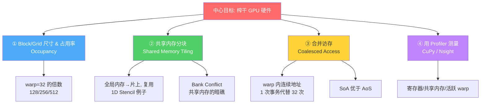
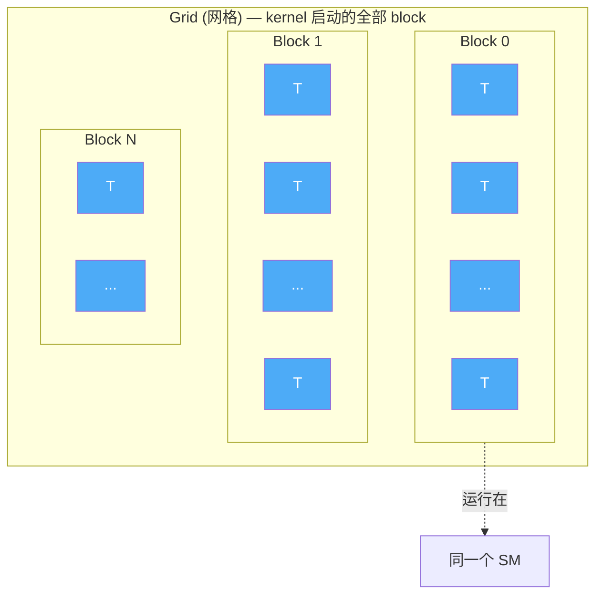
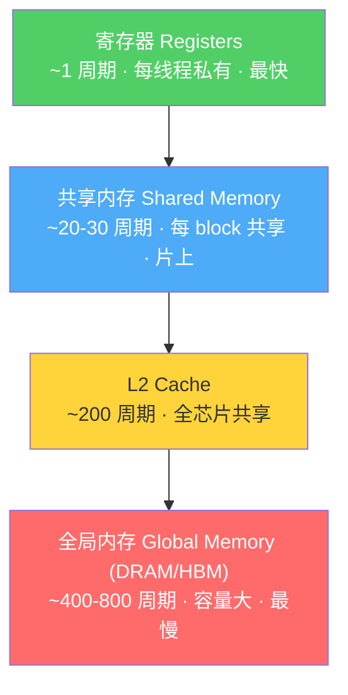
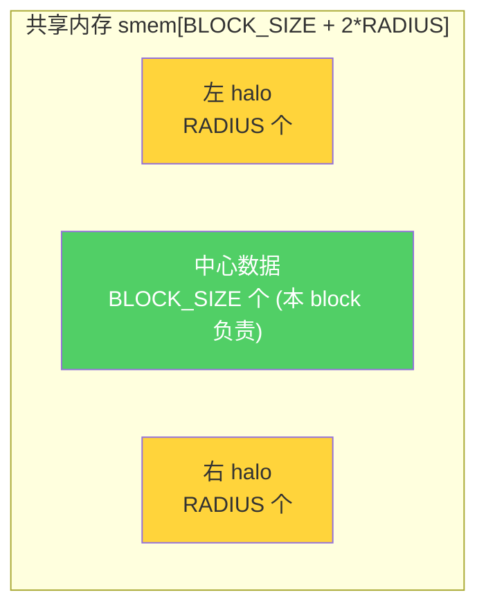
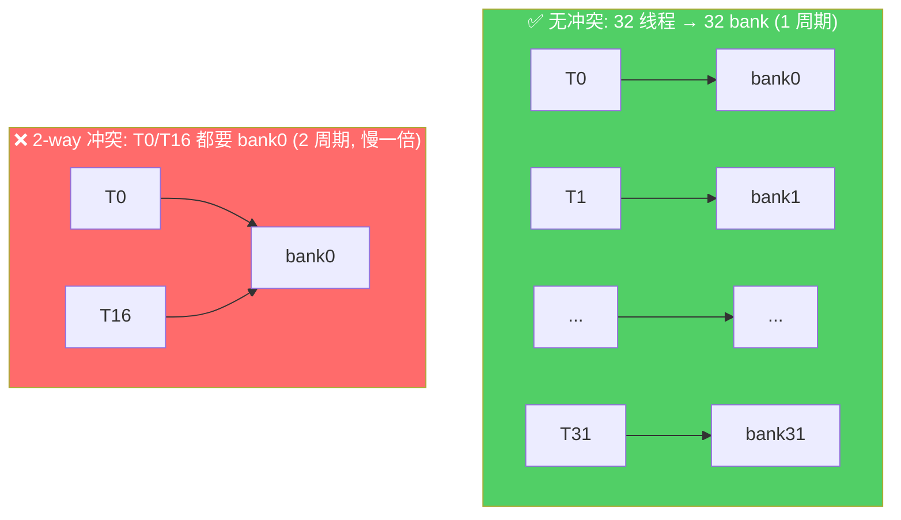
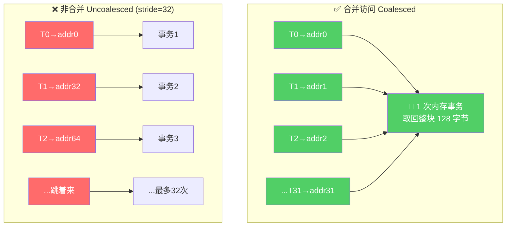
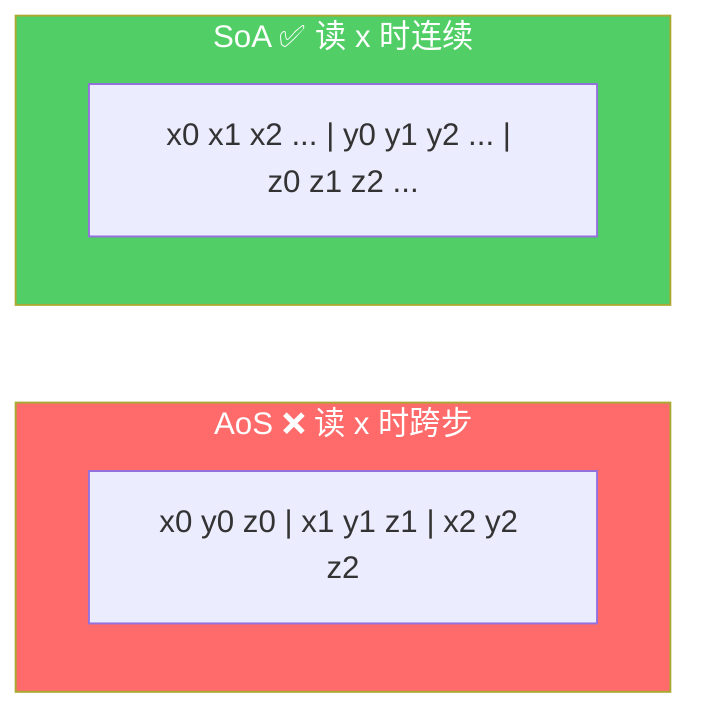
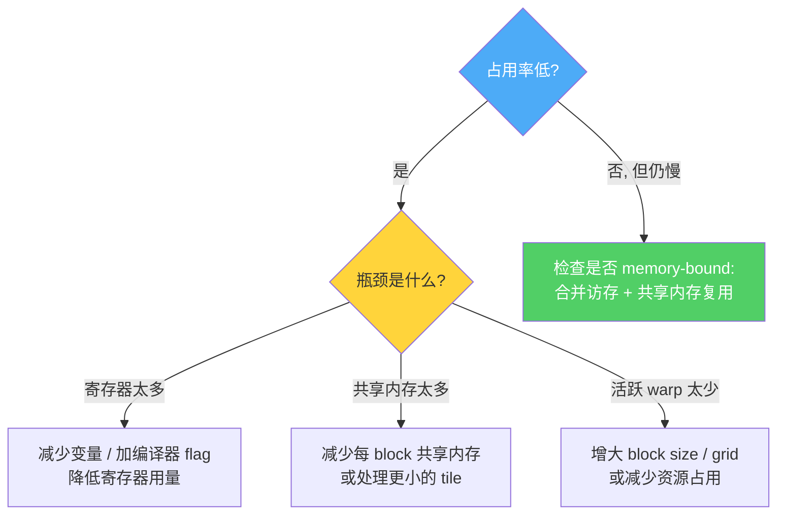

# 第 5 章 · 内核优化导论(Introduction to Kernel Optimization)

> 对应原书 *Practical GPU Programming* 第 5 章(PDF p.111–131)。
> 本章是全书从"能跑"迈向"跑得快"的分水岭。前几章我们学会了如何把计算搬到 GPU 上;从这一章开始,我们要回答一个更难、也更值钱的问题:**同样的算法,凭什么在 GPU 上能快 10 倍甚至 100 倍?**

---

## 🗺️ 本章地图

在动手之前,先把这一章的四条主线钉在脑子里。它们不是零散的技巧,而是围绕**同一个中心目标**展开的:让 GPU 的每一个硬件单元(计算核、内存带宽、片上缓存)都尽可能满负荷运转。



| 主线 | 一句话本质 | 优化了什么资源 | 核心陷阱 |
| --- | --- | --- | --- |
| ① 占用率 | 让 SM 上同时活跃的 warp 尽量多,好掩盖延迟 | 计算核 + 延迟隐藏 | 寄存器/共享内存过多导致 warp 上不来 |
| ② 共享内存分块 | 从慢的全局内存搬一次到快的片上内存,反复复用 | 内存带宽 | Bank Conflict(本章会补充讲透) |
| ③ 合并访存 | warp 内 32 个线程访问连续地址,合并成 1 次事务 | 内存带宽 | 跨步(stride)/未对齐访问 |
| ④ 测量 | 不测量的优化都是玄学 | 你的判断力 | 只看 occupancy 不看实际耗时 |

> 💡 **一句话总纲**:GPU 优化 = **喂饱计算核(占用率)** + **喂饱内存带宽(合并访存)** + **少去外面吃饭(共享内存复用)**,最后用 **Profiler 验尸**。这四件事贯穿本章,也贯穿你未来写的每一个高性能 kernel。

---

## 5.1 选择 Block 和 Grid 尺寸(Choosing Block and Grid Sizes)

### 🔬 第一性原理:为什么"配置"这么重要?

原书开篇就点出:**"选择正确的线程块和网格大小,是我们能对性能做出的最重要选择之一。"**

为什么一个看似"填参数"的动作能决定性能?回到硬件的第一性原理:

- CUDA 提供了**海量并行**(massive parallelism),理论上你可以启动上百万个线程。
- 但硬件是有限的:**每个 SM(Streaming Multiprocessor,流多处理器)** 的共享内存、寄存器、同时驻留的线程数都有上限。
- 如果配置不当,GPU 资源就会**闲置**(underutilized)、产生**内存瓶颈**,甚至因为**超出硬件上限**导致 kernel 启动直接失败。

最好的 kernel 是在走钢丝:**block 要足够大,让所有 SM 满载;但又不能太大,否则耗尽资源。** 这个平衡的目标,原书给了一个专有名词——

> **占用率(Occupancy)**:在任意时刻,GPU 可用资源中真正被用于计算的比例。

### CUDA 的线程层级回顾

原书快速带你复习了 CUDA 的两层组织(这是理解一切的地基):



| 概念 | 英文 | 本质 | 关键特性 |
| --- | --- | --- | --- |
| 线程块 | Thread Block | 一组能协作的线程 | **整块运行在同一个 SM 上**;块内可用**共享内存**通信,用 `__syncthreads()` 同步 |
| 网格 | Grid | 一次 kernel 启动的所有 block 的集合 | 覆盖整个数据集;block 之间**默认不能直接通信** |

> ⚠️ **常见坑**:初学者以为"线程越多越好,那我一个 block 塞满 1024 个线程"。实际上,**一个 block 只能在一个 SM 上跑**。如果一个 block 吃光了 SM 的共享内存/寄存器,那这个 SM 就只能驻留这一个 block,其它 block 排队等待,并行度反而暴跌。

### 📏 黄金法则:block size 取 32 的倍数

原书明确写道:**标准做法是使用 warp 大小(32)的倍数作为 block size。典型值是 128、256 或 512。**

为什么必须是 32 的倍数?

> 🔬 **第一性原理:warp 是 GPU 真正的执行单位**
> GPU 不是逐个线程执行的,而是以 **warp(线程束,固定 32 个线程)** 为单位、**同一条指令**(SIMT,Single Instruction Multiple Threads)一起执行。
> - 如果 block size = 128,正好是 4 个完整 warp,零浪费。
> - 如果 block size = 100,GPU 会向上取整到 4 个 warp(128 个线程),后 28 个线程被"打上死标"(masked off),它们**占着资源却不干活**——纯浪费。

| Block size | 完整 warp 数 | 浪费的线程 | 评价 |
| --- | --- | --- | --- |
| 32 | 1 | 0 | 偏小,延迟隐藏弱 |
| 128 | 4 | 0 | ✅ 常用甜点 |
| 256 | 8 | 0 | ✅ 最通用默认值 |
| 512 | 16 | 0 | ✅ 计算密集型常用 |
| 100 | 4(向上取整) | 28 | ❌ 白白浪费 |
| 1024 | 32 | 0 | 上限,寄存器压力大时慎用 |

### 决定最优配置的三大因素

原书总结,最优 block/grid 尺寸取决于三点:

1. **总问题规模(Total problem size)**:要处理多少元素/任务。
2. **硬件限制(Hardware limits)**:每 block 最大线程数(常为 1024)、可用共享内存、寄存器总数。
3. **Kernel 资源消耗(Kernel resource usage)**:每个线程/block 用了多少共享内存、多少寄存器。

原书建议:用 NVIDIA 提供的 **CUDA 占用率计算器(Occupancy Calculator)** 做估算起点——它会根据你 kernel 的资源消耗,建模出每个 SM 上能同时驻留多少 block。

---

### 💻 实战:同一个向量加法,扫不同 block size

原书给了一个完整可跑的例子——用 **CuPy** 处理一个千万级的一维数组,计算 `c[i] = a[i] + b[i]`。

**第一步:准备数据**

```python
import numpy as np
import cupy as cp

N = 10_000_000                      # 一千万个元素
a = cp.random.rand(N).astype(cp.float32)
b = cp.random.rand(N).astype(cp.float32)
c = cp.empty_like(a)
```

**第二步:挑 block size,计算 grid size,启动 kernel**

```python
threads_per_block = 256
# 向上取整: 保证所有元素都被覆盖,即使 N 不是 256 的整数倍
blocks_per_grid = (N + threads_per_block - 1) // threads_per_block

kernel_code = """
extern "C" __global__
void vector_add(const float* a, const float* b, float* c, int n) {
    int idx = blockDim.x * blockIdx.x + threadIdx.x;
    if (idx < n) {
        c[idx] = a[idx] + b[idx];
    }
}
"""

mod = cp.RawModule(code=kernel_code)
vector_add = mod.get_function("vector_add")

vector_add(
    (blocks_per_grid,), (threads_per_block,),   # grid 维度, block 维度
    (a, b, c, N)                                # kernel 参数
)
```

**逐行讲透这段 kernel:**

| 代码 | 讲解 |
| --- | --- |
| `extern "C" __global__` | `extern "C"` 关闭 C++ 名字修饰(name mangling),让 CuPy 能按字符串 `"vector_add"` 找到函数;`__global__` 表示这是从 CPU 调用、在 GPU 上运行的 kernel |
| `int idx = blockDim.x * blockIdx.x + threadIdx.x;` | **全局线程索引的标准公式**。`blockIdx.x` 是当前 block 编号,`blockDim.x` 是每 block 线程数(256),`threadIdx.x` 是 block 内局部编号。三者组合,给每个线程算出它负责数组里的哪一格 |
| `if (idx < n)` | **边界守卫(boundary guard)**。因为 grid 向上取整了,最后一个 block 会有几个线程的 `idx` 超出数组范围,这个判断防止它们越界写内存 |
| `c[idx] = a[idx] + b[idx];` | 真正的计算:一个线程干一格加法 |

> ⚠️ **常见坑:忘了 `if (idx < n)`**
> `N=10_000_000`,`blocks_per_grid = ceil(10^7/256) = 39063`,总线程数 = `39063 × 256 = 10,000,128`,比 N 多了 128 个。少了边界守卫,这 128 个线程会去读写 `a[10000000..10000127]`——**非法内存访问**,轻则结果错误,重则程序崩溃。这是 CUDA 新手最高频的 bug 之一。

**为什么 grid size 用向上取整公式 `(N + tpb - 1) // tpb`?**

这是整数向上取整的经典写法。假设 `N=10`,`tpb=4`:直接 `10//4 = 2` 会漏掉最后 2 个元素;`(10+4-1)//4 = 13//4 = 3` 才够。记住这个模板,你会用一辈子。

---

### 评估占用率(Evaluating Occupancy)

原书指出,NVIDIA 的 **占用率计算器**(网页版 + Excel 版)需要你提供三个输入:

1. **Block size**(每 block 线程数)
2. **每 block 用的共享内存量**
3. **每线程用的寄存器数**——由编译器报告,命令行加 `nvcc --ptxas-options=-v`(或 `-Xptxas -v`)

> 💡 **实战:如何拿到寄存器数?**
> 编译时加上 `-Xptxas -v`,nvcc 会打印类似:
> ```
> ptxas info : Used 32 registers, 2048 bytes smem
> ```
> 这告诉你每线程用 32 个寄存器、每 block 用 2KB 共享内存。把这些数字喂给占用率计算器,就能预测出理论占用率。

原书给的经验结论:**对于大多数共享内存/寄存器用量很少的基础 kernel,即使 block 很大,占用率也会很高;一旦 kernel 用了较多共享内存或寄存器,占用率就会因为这些资源成为瓶颈而下降。**

### 🧮 占用率到底怎么算?(补充第一性原理)

原书没有把公式摊开,这里补上,帮你彻底理解"资源如何限制占用率"。

假设某 GPU 的一个 SM 有这些硬件预算(以典型值为例):

| 资源 | 每 SM 上限(示例) |
| --- | --- |
| 最大驻留线程数 | 2048 |
| 最大驻留 warp 数 | 64 |
| 寄存器总数 | 65536(64K) |
| 共享内存 | 96 KB |
| 最大驻留 block 数 | 32 |

占用率 = **实际驻留的 warp 数 / 硬件最大 warp 数**。而"实际能驻留多少"由**最紧的那个资源**卡死:

$$
\text{驻留 block 数} = \min\left(
\left\lfloor\frac{\text{寄存器总数}}{\text{每 block 寄存器}}\right\rfloor,\
\left\lfloor\frac{\text{共享内存}}{\text{每 block 共享内存}}\right\rfloor,\
\left\lfloor\frac{\text{最大线程数}}{\text{block size}}\right\rfloor,\
\text{最大 block 数}
\right)
$$

**举例**:block size=256、每线程 32 寄存器、每 block 4KB 共享内存:

- 寄存器约束:每 block 用 `256×32 = 8192` 寄存器 → `65536/8192 = 8` 个 block
- 共享内存约束:`96KB/4KB = 24` 个 block
- 线程约束:`2048/256 = 8` 个 block
- 取最小 → **8 个 block** 驻留 → `8×256/32 = 64` warp → 占用率 = `64/64 = 100%` ✅

> 🔬 **本质**:占用率是一场"木桶效应"。寄存器、共享内存、线程数——谁最短,谁决定水位。优化占用率的本质,就是**找到那块最短的木板并加长它**。

> 💡 **面试高频**:"占用率高就一定快吗?" 答案是 **不一定**(原书第 5.4 节也强调了这点)。高占用率能更好地**隐藏内存延迟**(一个 warp 等数据时,SM 切去执行另一个 warp),但如果 kernel 本身是**计算受限**或有其它瓶颈,拉满占用率没有额外收益。经验上占用率到 50%~75% 收益就趋于饱和了。这是区分"背书"和"真懂"的分水岭问题。

---

### 💻 实战:测量不同 block size 的实际耗时

理论归理论,**"结合动手实验和占用率计算器"** 才是原书推崇的方法。它给了一段扫描代码:

```python
import time

for block_size in [64, 128, 256, 512, 1024]:
    grid_size = (N + block_size - 1) // block_size
    c_test = cp.empty_like(a)
    start = time.time()
    vector_add(
        (grid_size,), (block_size,),
        (a, b, c_test, N)
    )
    cp.cuda.Stream.null.synchronize()   # ⚠️ 关键: 等 GPU 真的算完
    end = time.time()
    print(f"Block size {block_size}, Time: {end - start:.5f} seconds")
```

**逐行要点:**

- `cp.cuda.Stream.null.synchronize()`:**GPU kernel 是异步启动的**——`vector_add(...)` 这行立刻返回,GPU 在后台慢慢算。如果不同步就直接 `time.time()`,你测到的是"启动时间"而非"计算时间",数字会假到离谱。这个同步是所有 GPU 计时的**铁律**。
- 循环扫 `[64, 128, 256, 512, 1024]`,让数据自己告诉你哪个最快。

原书的观察结论:**最快的时间通常出现在 block size 128~512 之间,但会因硬件和 kernel 复杂度而异。**

> ⚠️ **常见坑:用 Python `time.time()` 测 GPU 更严谨的做法**
> `time.time()` 会把 Python 解释器开销、kernel 启动开销也算进去。对单次极快的 kernel(如向量加法),更准的方式是用 CUDA Event(`cp.cuda.Event`)或原书后面介绍的 `cupyx.profiler.benchmark`(见 5.4 节),它会**多次重复取平均**,消除抖动。

---

## 5.2 共享内存实现数据复用(Shared Memory for Data Reuse)

### 🔬 缓冲(Buffering)的第一性原理

原书这一节直击 GPU 性能的头号杀手:**全局内存(global memory)访问往往是吞吐量的瓶颈。**

为什么?看这张内存层级金字塔——**越快的内存越小、越靠近计算核**:



原书的原话极其精准:**"一个线程从全局内存取数据,要付延迟的代价。这个延迟可能远远超过计算本身所需的时间。"**

**关键洞察**:如果同一个 block 内的多个线程需要访问**相同或重叠的数据**(比如相邻线程处理重叠区域、或一个 block 处理矩阵/图像的一个 tile),那些重复的全局内存读取会**迅速累积**。

**解决方案 = 缓冲(Buffering)**:
> 从全局内存**只加载一次**到共享内存,然后让 block 内所有线程都访问这份共享副本,从而减少内存流量、提升吞吐。

原书点明这招最适合的场景:**数据会被 block 内不同线程多次使用**——例如 **模板计算(stencil)、矩阵分块(tiling)、卷积(convolution)**。

| 特性 | 全局内存 Global Memory | 共享内存 Shared Memory |
| --- | --- | --- |
| 位置 | 芯片外 DRAM/HBM | 芯片上(on-chip) |
| 延迟 | ~400-800 周期 | ~20-30 周期(快一个数量级) |
| 作用域 | 所有线程 | 单个 block 内 |
| 谁管理 | 硬件缓存 | **程序员手动**(`__shared__`) |
| 容量 | GB 级 | KB 级(每 block 几十 KB) |
| 用途 | 存放全部数据 | 暂存被复用的热点数据 |

> 💡 **一个绝妙的类比**:全局内存像**城郊的大仓库**,共享内存像**你办公桌上的抽屉**。每次去仓库取货很慢;聪明的做法是一次性把这批活儿要用的料搬到抽屉里,接下来反复取用都是秒到。缓冲就是"搬一次料到抽屉"。

---

### 💻 实战:一维模板计算(1D Stencil)

原书用最经典的 **1D Stencil**(滑动窗口平均)来演示。每个输出元素 = 它自己 + 左右各 `radius` 个邻居的平均值。

**痛点**:如果每个线程各自去全局内存取自己的邻居,大量读取会**重复**——因为相邻线程的窗口**高度重叠**。

**解法**:整个 block 协作,一次性把"覆盖所有线程需求的区域(含邻居)"加载进共享内存。这个"额外的邻居区域"有个专门的名字——**halo(晕环/光环区)**。



**第一步:准备数据(用 PyCUDA)**

```python
import numpy as np
import pycuda.autoinit
import pycuda.driver as drv
import pycuda.gpuarray as gpuarray
from pycuda.compiler import SourceModule

N = 1024 * 1024
radius = 3      # 左右各看 3 个邻居 → 窗口大小 = 7

input_host  = np.random.rand(N).astype(np.float32)
output_host = np.zeros_like(input_host)
input_gpu   = gpuarray.to_gpu(input_host)
output_gpu  = gpuarray.empty_like(input_gpu)
```

**第二步:共享内存 kernel(原书核心代码,逐行讲透)**

```c
#define RADIUS 3
#define BLOCK_SIZE 256

__global__ void stencil_1d(const float *input, float *output, int N)
{
    // 1. 声明共享内存: 中心 256 + 左右各 3 = 262 个 float
    __shared__ float smem[BLOCK_SIZE + 2 * RADIUS];

    int tid        = threadIdx.x;                         // block 内局部索引 0..255
    int global_idx = blockIdx.x * BLOCK_SIZE + tid;       // 全局索引
    int smem_idx   = tid + RADIUS;                         // 在 smem 里的位置(偏移 RADIUS 让出左 halo)

    // 2. 每个线程加载自己的中心数据
    if (global_idx < N)
        smem[smem_idx] = input[global_idx];

    // 3. block 最左边的 RADIUS 个线程, 顺手把左 halo 也搬进来
    if (tid < RADIUS && global_idx >= RADIUS)
        smem[smem_idx - RADIUS] = input[global_idx - RADIUS];

    // 4. block 最右边的 RADIUS 个线程, 顺手把右 halo 搬进来
    if (tid >= BLOCK_SIZE - RADIUS && (global_idx + RADIUS) < N)
        smem[smem_idx + RADIUS] = input[global_idx + RADIUS];

    // 5. 屏障: 等全 block 都加载完, 才能开始读别人加载的数据
    __syncthreads();

    // 6. 计算输出(跳过全局边界)
    if (global_idx >= RADIUS && global_idx < N - RADIUS) {
        float sum = 0.0f;
        for (int j = -RADIUS; j <= RADIUS; ++j)
            sum += smem[smem_idx + j];       // ✅ 全部从快速的共享内存读!
        output[global_idx] = sum / (2 * RADIUS + 1);
    }
}
```

**逐段拆解(这是全章最需要吃透的代码):**

| 步骤 | 在做什么 | 为什么这样写 |
| --- | --- | --- |
| ① `__shared__ float smem[262]` | 声明片上暂存区 | `+2*RADIUS` 为左右 halo 预留空间。这块内存**整个 block 共享** |
| ② 中心加载 | 256 个线程各搬 1 格中心数据 | 每格只从全局内存读**一次** |
| ③ 左 halo | 只有 `tid<3` 的线程负责 | 这 3 个线程"多干一点",把左边邻居搬进来,供 block 最左侧的输出线程用 |
| ④ 右 halo | 只有 `tid>=253` 的线程负责 | 对称地搬右邻居 |
| ⑤ `__syncthreads()` | **同步屏障** | ⚠️ 生死攸关!必须等所有线程都写完 smem,后面才能安全地读别人写的部分 |
| ⑥ 计算 | 循环累加 7 个共享内存值求平均 | 全部命中片上快速内存,零全局访问 |

> ⚠️ **共享内存三大致命坑**
> 1. **忘了 `__syncthreads()`**:线程 0 可能在线程 255 还没写完 halo 时就去读,读到**垃圾值 / 上一轮残留**。这类 bug 最阴险——有时对、有时错,取决于调度时序(race condition)。
> 2. **`__syncthreads()` 放在分支里**:如果只有部分线程执行到 `__syncthreads()`(比如放进 `if (idx<N)` 里),会**死锁**——到达屏障的线程永远等不到没到的线程。屏障必须**全 block 一致执行**。
> 3. **halo 边界判断写错**:`global_idx >= RADIUS`、`global_idx + RADIUS < N` 这些守卫少一个,就会越界读全局内存。

**第三步:启动 kernel**

```python
mod = SourceModule(kernel_code.replace("BLOCK_SIZE", "256"))
stencil_1d = mod.get_function("stencil_1d")

block_size = 256
grid_size = (N + block_size - 1) // block_size
stencil_1d(
    input_gpu, output_gpu, np.int32(N),
    block=(block_size, 1, 1), grid=(grid_size, 1)
)
```

**第四步:验证正确性(和 NumPy 对拍)**

```python
for i in range(radius, N - radius):
    output_host[i] = np.mean(input_host[i - radius:i + radius + 1])

output_gpu_host = output_gpu.get()
print("Results match?",
      np.allclose(output_host[radius:N-radius],
                  output_gpu_host[radius:N-radius], atol=1e-6))
```

> 💡 **好习惯:永远和 CPU 参考实现对拍**。GPU 代码极易出现"跑起来了但结果错"的静默 bug(race condition、越界、精度)。`np.allclose` + `atol=1e-6` 是黄金搭档——`atol` 容忍浮点误差,因为 GPU/CPU 的浮点累加顺序可能不同。

**收益有多大?** 原书总结:
> 不用共享内存时,每个线程的每个邻居都要从全局内存读一遍,产生海量重复流量。用了共享内存后,**每个值每个 block 只取一次**,然后被所有需要它的线程复用。随着 block 尺寸和复用度增加,节省越来越大,**常常把一个内存受限(memory-bound)的 kernel 变成计算受限(compute-bound)的 kernel**。

> 🔬 **量化直觉**:窗口 = 7 时,朴素做法每个输出要读 7 次全局内存,共享内存做法平摊下来每个输出约读 1 次(`(256+6)/256 ≈ 1.02`)。**全局内存流量降到约 1/7**。这就是"从 memory-bound 转向 compute-bound"的字面意思。

---

### 🧨 深入:Bank Conflict(共享内存的暗礁)

> ⚠️ 原书正文对共享内存"分 bank"这个机制着墨不多,但**它是共享内存优化绕不开的核心概念**,也是面试必考。这里作为第一性原理专题补齐,让你真正会用共享内存,而不是只会 `__shared__`。

#### 是什么:共享内存被切成 32 个 bank

共享内存在硬件上不是一整块,而是被切成 **32 个 bank(存储体)**,恰好对应一个 warp 的 32 个线程。你可以把它想成**32 个并排的收银台**:

- 连续的 4 字节(一个 `float`)依次落在 bank 0, 1, 2, ..., 31, 然后又回到 bank 0......(取地址除以 4 再模 32)。
- **一个 warp 的 32 个线程,如果各自访问不同的 bank,32 个访问一个周期全部完成**——满速。
- 如果**两个或以上线程访问同一个 bank 的不同地址**,硬件只能**排队串行**处理——这就是 **Bank Conflict(存储体冲突)**。



#### 为什么会冲突:典型元凶是"跨步 32"

如果线程按 `smem[threadIdx.x * 32]` 这样以 32 的步长访问,那么线程 0 访问 bank 0、线程 1 访问 `32 % 32 = bank 0`、线程 2 访问 `64 % 32 = bank 0`......**32 个线程全挤在 bank 0** → **32-way conflict**,慢 32 倍!

| 访问模式 | bank 落点 | 冲突程度 | 相对速度 |
| --- | --- | --- | --- |
| `smem[tid]`(连续) | 0,1,2,...,31 | 无冲突 | 1×(满速) |
| `smem[tid*2]` | 0,2,4,...,62→0,2,... | 2-way | 慢 2× |
| `smem[tid*32]` | 全部 bank 0 | 32-way | 慢 32×(最坏) |
| 所有线程读 `smem[0]` | 同地址 | **广播(broadcast)** | 1×(硬件特殊优化,不冲突!) |

> 🔬 **易混点:同地址 ≠ 冲突**。若一个 warp 内多个线程读**完全相同的地址**,硬件会**广播(broadcast)**,一次搞定,不算冲突。冲突特指"访问**同一 bank 内的不同地址**"。

#### 怎么解决:Padding(填充)大法

经典场景:二维共享内存 `smem[N][32]`,按列访问时列内元素间隔 32,全撞 bank 0。**解药是给每行多加 1 个元素做 padding**:

```c
// ❌ 有冲突: 每行 32 列, 按列访问撞在同一 bank
__shared__ float tile[32][32];

// ✅ 无冲突: 每行填充成 33 列, 打乱 bank 对齐
__shared__ float tile[32][33];   //         ↑ +1 padding
```

加 1 列后,列方向相邻元素的地址间隔变成 33(与 32 互质),访问自动散落到不同 bank,冲突消失。**代价**:多用 `32×4 = 128` 字节共享内存,几乎可忽略。这是矩阵转置/矩阵乘 tiling kernel 的标准优化。

> 💡 **面试高频**:"共享内存 tiling 为什么有时反而不快?" 十有八九是 **bank conflict**。答出"32 bank + padding 消冲突",立刻显示你真写过 kernel。

---

## 5.3 减少全局内存访问 —— 合并访存(Coalescing)

### 🔬 第一性原理:不是所有访存都平等

原书这一节的开场白点破了新手最大的盲区:**"并非所有内存访问都是平等的。"**

机制是这样的:当一个 warp(32 个线程)访问全局内存时,GPU 硬件会**尝试把这些请求合并(coalesce)成尽可能少的内存事务(memory transaction)**。

- 如果线程访问的数据是**规则的、对齐的、连续的**,硬件可以**一次性取回**所有需要的数据,用满带宽。
- 如果访问模式**杂乱无章**,每个线程的请求可能**各自启动一个事务**——这叫 **非合并访问(uncoalesced access)**,严重拖慢 kernel。

原书的原话:**"GPU 编程中最常见、代价最高的低效之一,就是因为非合并的加载/存储导致带宽没被正确利用。"**



**核心规则(记死它):**
> **让同一个 warp 里、线程索引连续的线程,访问连续的内存地址。** 即 `output[idx] = input[idx]`,而不是 `input[idx * stride]`。

原书打了个生动的比方:warp 里的线程像一队人协作,第一个线程负责取对齐块的第一个地址,后面依次连续。这样内存控制器就能**把请求打包,一次操作取回整块**。结果就是 **每 warp 一次事务,而不是每线程一次事务**——吞吐拉满。

---

### 💻 实战:合并 vs 非合并,同一份数据对比

原书用最纯粹的例子——**数组拷贝**——把差距摊开给你看。

**准备数据:**

```python
import numpy as np
import pycuda.autoinit
import pycuda.driver as drv
import pycuda.gpuarray as gpuarray
from pycuda.compiler import SourceModule

N = 1024 * 1024
input_host = np.random.rand(N).astype(np.float32)
input_gpu  = gpuarray.to_gpu(input_host)
output_gpu = gpuarray.empty_like(input_gpu)
```

**❌ 非合并 kernel(带 stride 跨步):**

```c
__global__ void copy_uncoalesced(const float *input, float *output, int N, int stride)
{
    int idx = blockIdx.x * blockDim.x + threadIdx.x;
    if (idx < N/stride)
        output[idx] = input[idx * stride];   // ← 每个线程跳 stride 格去取
}
```

**✅ 合并 kernel(连续访问):**

```c
__global__ void copy_coalesced(const float *input, float *output, int N)
{
    int idx = blockIdx.x * blockDim.x + threadIdx.x;
    if (idx < N)
        output[idx] = input[idx];             // ← 线程 idx 取地址 idx, 完美连续
}
```

**关键差异只有一处**:`input[idx * stride]` vs `input[idx]`。

- 合并版:warp 里线程 0..31 分别读地址 0..31 → **相邻、对齐 → 1 次事务搞定**。
- 非合并版(stride=32):线程 0 读地址 0、线程 1 读地址 32、线程 2 读地址 64......**每次跳 128 字节 → 每个线程独占一次事务**,带宽利用率暴跌到 1/32,而且取回的整块里只用了 1 个 float,其余 31 个白读。

**测量对比:**

```python
block_size = 256
grid_size = (N + block_size - 1) // block_size
import time

# 非合并 (stride=32)
stride = 32
output_uncoalesced = gpuarray.empty_like(input_gpu)
start = time.time()
copy_uncoalesced(
    input_gpu, output_uncoalesced, np.int32(N), np.int32(stride),
    block=(block_size, 1, 1), grid=(grid_size // stride, 1)
)
drv.Context.synchronize()
print(f"Uncoalesced copy time: {time.time() - start:.5f} seconds")

# 合并
output_coalesced = gpuarray.empty_like(input_gpu)
start = time.time()
copy_coalesced(
    input_gpu, output_coalesced, np.int32(N),
    block=(block_size, 1, 1), grid=(grid_size, 1)
)
drv.Context.synchronize()
print(f"Coalesced copy time:   {time.time() - start:.5f} seconds")
```

原书的观察:**合并版本快得多——通常快好几倍——因为硬件高效地合并了内存请求。**

---

### 数据布局:SoA 优于 AoS

原书最后给出**在复杂场景(2D/3D 数组、结构体数组)下保证合并**的黄金准则:**安排数据,让 warp 里连续的线程总是访问连续的内存地址。**

由此引出一个经典的数据布局抉择:

| 布局 | 全称 | 内存排布 | 合并友好度 |
| --- | --- | --- | --- |
| **AoS** | Array of Structures(结构体数组) | `[{x0,y0,z0}, {x1,y1,z1}, ...]` 各字段交错 | ❌ 差 |
| **SoA** | Structure of Arrays(数组的结构体) | `{x:[x0,x1,...], y:[y0,...], z:[...]}` 各字段独立成数组 | ✅ 好 |

**为什么 SoA 更合并友好?** 假设一个 warp 的所有线程都要读 `x` 字段:

- **AoS**:`x0, x1, x2` 在内存里被 `y`、`z` 隔开(间隔 = 结构体大小)→ 线程访问是**跨步的** → 非合并。
- **SoA**:`x` 全挤在一个连续数组里 → 线程 0..31 读 `x[0..31]` → **完美连续** → 合并。



> 💡 **实战启示**:粒子模拟、图形学、科学计算里到处是"每个实体有多个属性"的结构。CPU 代码习惯写 AoS(缓存局部性好、面向对象自然),但**移植到 GPU 时,常常需要把 AoS 重构成 SoA** 来换取合并访存。这是 CPU→GPU 移植的高频改造点。

> ⚠️ **常见坑:二维数组的行主序 vs 访问方向**。C/CUDA 二维数组是**行主序**(row-major),`A[i][j]` 中 `j` 变化是连续的。若让 warp 里的线程沿**列方向**(`i` 变化)访问,就是跨步非合并。**规则:让 threadIdx.x 对应变化最快的那个维度(列)**,访问才连续。这也是矩阵转置 kernel 天然非合并、需要共享内存 tiling 补救的根本原因。

---

## 5.4 用 CuPy Profiler 测量占用率

### 🔬 为什么"测量"是优化的最后一块拼图

原书最后一节回到出发点:**优化 kernel 的主要目标,是让硬件尽可能忙碌**——用活跃线程灌满所有 SM,榨干寄存器和内存资源。而**占用率**就是"实际运行线程数 / 最大可能线程数"的度量。

原书特别强调了那句关键的辩证:
> **"高占用率通常(但不总是)意味着高性能。占用率太低,大量 GPU 资源闲置;但设得太高,可能耗尽寄存器或共享内存,导致溢出(spills)和减速。"**

> 🔬 **什么是寄存器溢出(register spill)?** 每个 SM 的寄存器总量固定。如果你为了拉高占用率硬塞很多 block,平摊到每线程的寄存器不够用,编译器会把放不下的变量**溢出到本地内存(local memory)**——而 local memory 实际在**慢速全局内存**上。结果:占用率上去了,速度反而掉下来。这就是"过犹不及"。

### 💻 用 `cupyx.profiler.benchmark` 采集统计

原书给出的第一个工具——**benchmark**,会自动多次重复、计时并 profile:

```python
import cupy as cp
from cupyx.profiler import benchmark

size = 10_000_000
a = cp.random.rand(size, dtype=cp.float32)
b = cp.random.rand(size, dtype=cp.float32)

def vector_add():
    cp.add(a, b, out=a)

# 重复运行 10 次, 逐次计时并 profile
result = benchmark(vector_add, n_repeat=10)
print(result)
```

> 💡 `benchmark` 帮你解决了 5.1 节手动计时的所有痛点:自动同步、多次重复取平均、消除首次启动开销(warm-up)。**测 GPU 性能优先用它,而不是手写 `time.time()`。**

**采集更高级的指标**——配合 CUDA Profiler API 标记时间区间:

```python
from cupyx.profiler import time_range

with time_range('Vector Add Profile', color_id=0):
    cp.add(a, b, out=a)
```

原书说明:当在 **Nsight Systems / Nsight Compute** 下运行时,`time_range` 会标记一段时间区间,并启用**逐 kernel 统计**的采集。这样你在 Nsight 的时间线上能一眼定位到这段计算。

### 📊 解读 Profiler 的核心指标

原书列出了 profiling 输出里最该盯的四个指标:

| 指标 | 英文 | 含义 | 怎么看 |
| --- | --- | --- | --- |
| 每 SM 活跃 warp 数 | Active Warps per SM | 同时运行的 32 线程组数量 | 越高越好(到硬件上限为止) |
| 每线程寄存器数 | Registers per Thread | 寄存器压力 | 太多会限制占用率(总量固定) |
| 每 block 共享内存 | Shared Memory per Block | 每 block 吃多少共享内存 | 太多则并发 block 数下降 |
| 占用率 | Occupancy | 达到理论最大并行度的比例 | 报告为百分比或比率(如 0.75) |

原书给了一份 **Nsight Compute 的样例输出**,教你怎么读:

```
Grid Size:                39063 x 1 x 1
Block Size:               256 x 1 x 1
Registers per Thread:     32
Shared Memory per Block:  2.0 KB
Active Warps per SM:      24
Occupancy:                75%
```

盯着这些数字,原书说你就能回答关键的诊断问题:

- **是不是用了太多寄存器,限制了 block 并发?**
- **是不是每 block 共享内存太高,压低了活跃 block 数?**
- **是不是活跃 warp 太少,导致吞吐低?**

### 🩺 优化决策树:根据 Profiler 结果对症下药

原书给出的行动指南,可以整理成一棵决策树:



原书的原话结论:
- 若**占用率因寄存器而低** → 优化 kernel 用更少变量,或用编译器 flag 压低寄存器用量。
- 若**共享内存限制了占用率** → 减少每 block 的共享内存,或**处理更小的 tile**。

> 💡 **面试高频 / 实战心法**:优化 GPU kernel 的正确姿势是**"测量 → 定位瓶颈 → 针对性优化 → 再测量"** 的闭环,而不是凭直觉乱调 block size。Profiler 是你的"验尸报告"。**不测量的优化都是玄学。**

---

## 📌 本章小结

这一章我们把 GPU 从"能跑"推向"跑得快",四条主线环环相扣:

1. **Block/Grid 尺寸与占用率(5.1)**:block size 取 warp(32)的倍数(128/256/512 是甜点);占用率是一场资源"木桶效应",由寄存器、共享内存、线程数里**最短的板**决定;高占用率有助于隐藏延迟,但**不等于高性能**,需结合动手实验和占用率计算器一起判断。别忘了 `if (idx < n)` 边界守卫和计时前的 `synchronize()`。

2. **共享内存分块(5.2)**:全局内存延迟是头号瓶颈;**缓冲(buffering)** 的本质是"从慢内存搬一次到快的片上内存,让 block 内线程反复复用",能把 memory-bound 变成 compute-bound。1D Stencil 是经典范式(中心 + halo + `__syncthreads()`)。**补充硬核点**:共享内存分 32 个 bank,访问同 bank 不同地址会 **bank conflict**,padding(+1 列)是标准解药。

3. **合并访存(5.3)**:让 warp 内连续线程访问连续地址,硬件把 32 次请求合并成 1 次事务,榨满带宽;跨步(stride)访问是最常见的性能杀手;数据布局上 **SoA 优于 AoS**,二维数组让 `threadIdx.x` 对应变化最快的维度。

4. **Profiler 测量(5.4)**:用 `cupyx.profiler.benchmark` / `time_range` + Nsight 采集占用率、寄存器、共享内存、活跃 warp;按"测量→定位瓶颈→对症下药→再测量"的闭环迭代。

> 🎯 **一句话带走**:GPU 优化的三板斧是 **喂饱计算核(占用率)、喂饱带宽(合并访存)、少去外面吃饭(共享内存复用)**,而 Profiler 是裁判。这三样是所有高性能 CUDA kernel(包括你以后会遇到的 GEMM、FlashAttention、卷积)共同的地基。

---

## 🔗 延伸阅读

- **NVIDIA CUDA C++ Best Practices Guide** —— 官方对合并访存、占用率、共享内存 bank 的权威定义,本章所有概念的一手来源。
- **NVIDIA CUDA Occupancy Calculator** —— 本章 5.1 反复提到的工具(现已集成进 Nsight Compute 的 Occupancy 视图)。
- **Nsight Compute / Nsight Systems** —— 5.4 提到的专业 profiler,取代了老 `nvprof`;逐 kernel 看 roofline、内存事务、bank conflict。
- **《Programming Massively Parallel Processors》(Kirk & Hwu)** —— 深入讲 tiling、coalescing、bank conflict 的经典教材,是本章的"进阶版"。
- **本仓库延伸**:合并访存 + 共享内存 tiling + bank-conflict 消除,三者合起来正是**矩阵乘法(GEMM)/矩阵转置**优化的全部套路——建议下一步动手写一个 tiled matmul,把本章四条主线一次性练到位。
- **下一章预告(第 6 章)**:*Working with PyCUDA and CuPy Features* —— 深入这两个库的高级特性,把本章的手写 kernel 融进更完整的工程流程。
```
