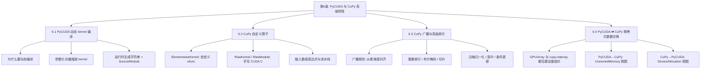
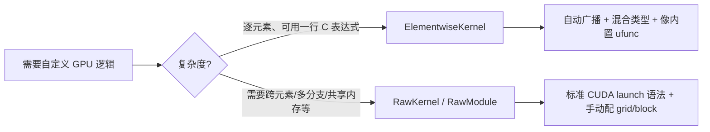
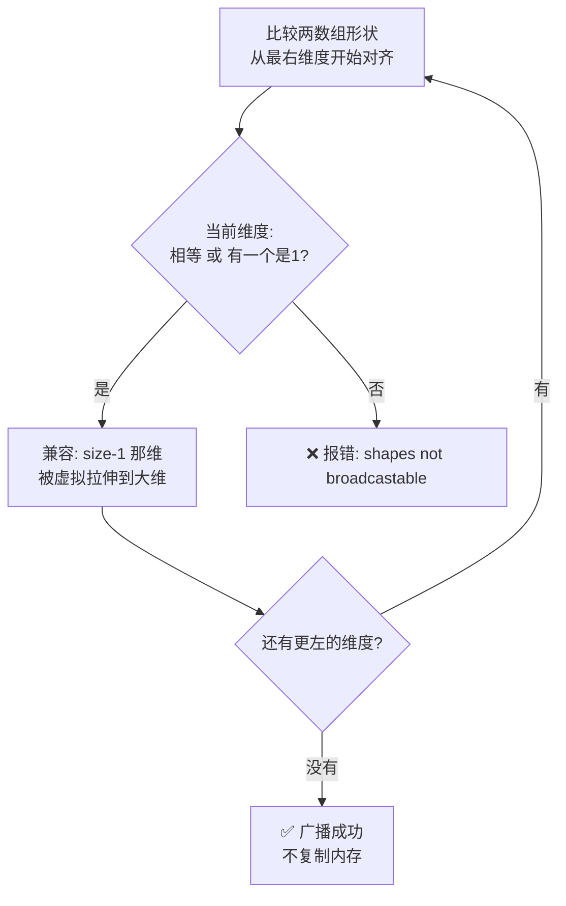
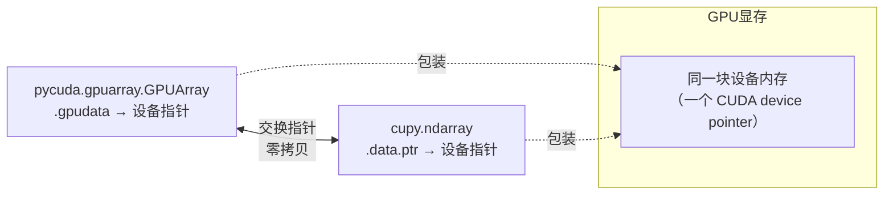
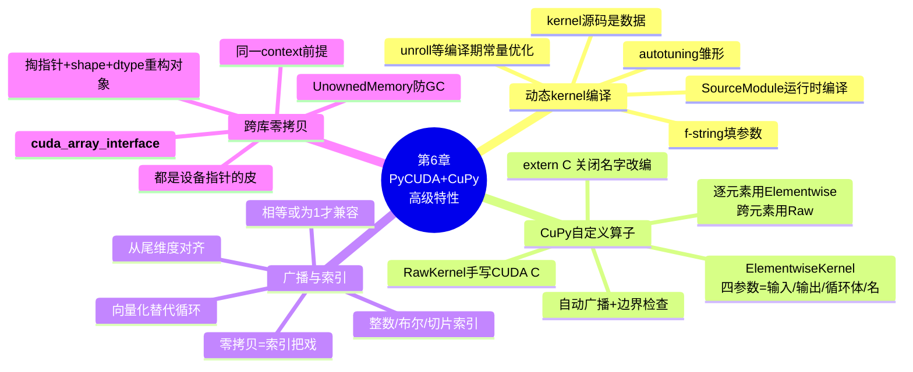

# 第 6 章 使用 PyCUDA 与 CuPy 特性（Working with PyCUDA and CuPy Features）

> 对应原书 *Practical GPU Programming*（Fenlor M., 2025）第 132–148 页，Chapter 6: Working with PyCUDA and CuPy Features。
>
> 本章把前几章「静态、手写、编译一次」的 GPU 编程方式，升级为**动态、可参数化、可组合**的高级用法：让 kernel 在运行时按需生成，让 CuPy 写自定义算子，让广播/索引替代循环，并让 PyCUDA 与 CuPy 之间**零拷贝**共享同一块显存。

---

## 🗺️ 本章地图



**一句话主线**：前几章我们把 kernel 当成「刻死的石碑」——写死、编译一次、反复用；本章把它变成「橡皮泥」——运行时捏出想要的形状。同时，CuPy 让你在不离开 NumPy 风格 API 的前提下，把自己的复杂逻辑塞进 GPU；最后两个库还能握手交换显存，谁也不用把数据搬下 GPU。

| 小节 | 核心工具 | 抽象层次 | 解决什么痛点 |
|------|----------|----------|--------------|
| 6.1 | `SourceModule` + f-string | 低层（写 CUDA C） | kernel 要按运行时参数变形 |
| 6.2 | `ElementwiseKernel` / `RawKernel` | 中层（自定义 ufunc） | 内置 ufunc 表达不了的自定义逻辑 |
| 6.3 | 广播 + 高级索引 | 高层（数组表达式） | 用循环写多维操作又慢又啰嗦 |
| 6.4 | 指针互转 | 跨库 | 两个库之间搬数据浪费拷贝 |

---

## 6.1 PyCUDA 中的动态 kernel 编译（Dynamic Kernel Compilation）

### 6.1.1 是什么 & 为什么

在前面的章节里，我们一直把 kernel 当成**静态代码块**：把 CUDA C 代码手写成一个 Python 字符串，编译一次，需要时就发射（launch）。对于稳定、固定的 kernel，这没问题。

但随着项目变大，你会发现**灵活性、代码生成、参数调优**和裸速度一样重要。原书点破了这个转折点：

> "As our projects grow, we often find that flexibility, code generation, and parameter tuning are just as important as raw speed."

**动态 kernel 编译**（dynamic kernel compilation）就是：**在运行时生成、修改、编译 kernel**，全程不离开 Python 会话，也不用手动管理临时 CUDA 文件。

🔬 **第一性原理：为什么"运行时编译"在 GPU 世界如此自然？**
> CUDA C 里有大量东西是**编译期常量**才能优化的——循环展开次数（unroll factor）、block 大小、数据类型、数学常数。如果这些值写死，你就得为每一种组合手写一个 kernel。而 GPU kernel 本质是一段要被 `nvcc`/NVRTC 编译成 PTX 再到 SASS 的源码文本。既然它就是**文本**，那用 Python 的 f-string 在运行时把参数填进去、再交给编译器，就是最自然的"元编程"。换句话说：**kernel 源码是数据，Python 是生成这份数据的程序。**

原书列出动态编译特别有价值的四类场景：

| 场景 | 说明 | 例子 |
|------|------|------|
| 🎛️ 编译期参数随运行时输入变化 | block 大小、数据类型、数学常数按输入决定 | 小数组用小 block，大数组用大 block |
| 🧰 构建框架/工具需支持多种算法变体 | 不想为每个变体手写一个 kernel | 同一算法的 fp16/fp32/fp64 三版 |
| 🚀 快速原型 / 测试 / 基准测试 | 需要快速迭代和自动化 | 扫一遍 unroll=1,2,4,8 看哪个快 |
| 🖥️ 硬件细节或用户偏好决定不同实现 | 不同 GPU 架构走不同优化路径 | 老卡不用 tensor core，新卡用 |

💡 **实战 / 面试高频**
> 面试常问："既然 kernel 都要编译，运行时编译不是很慢吗？" 答：编译确实有开销（几十到几百毫秒），所以**动态编译的收益点在"编译一次、发射多次"**——你花一次编译成本，换来一个为当前参数量身定制、能被编译器充分优化（比如 `#pragma unroll {N}` 里的 N 是常量）的 kernel，之后成千上万次发射都受益。反模式是"每次发射前都重编译"。生产上通常配合**缓存**（相同参数只编译一次）。

### 6.1.2 完整案例：参数化的向量缩放 kernel

原书用一个**可调 unroll 因子 + 运行时可设缩放常数**的向量缩放例子，逐步走完整个流程。我们把它拆成四步。

#### 第一步：准备数据（Preliminary Data Config）

工作流和之前完全一样：

```python
import numpy as np
import pycuda.autoinit                      # 自动初始化 CUDA 上下文
import pycuda.driver as drv
import pycuda.gpuarray as gpuarray
from pycuda.compiler import SourceModule    # 编译 CUDA C 源码的入口

N = 2_000_000
host_array = np.random.rand(N).astype(np.float32)   # 主机端随机数组
device_array = gpuarray.to_gpu(host_array)          # 拷贝到 GPU
```

**逐行讲解**：

| 代码 | 作用 | 关键点 |
|------|------|--------|
| `import pycuda.autoinit` | 导入即自动建立 CUDA 上下文 | 省去手动 `cuInit` / 创建 context 的样板代码 |
| `SourceModule` | PyCUDA 的运行时编译器封装 | 吃一段 CUDA C 字符串，返回可查询函数的模块对象 |
| `np.random.rand(N).astype(np.float32)` | 生成 200 万个 fp32 | ⚠️ 必须显式 `astype(np.float32)`——`np.random.rand` 默认 fp64，与 kernel 的 `float*` 不匹配会读错内存 |
| `gpuarray.to_gpu(host_array)` | 主机→设备拷贝 | 返回一个 `GPUArray`，之后可直接当 kernel 参数传 |

#### 第二步：生成参数化 kernel（Building Parameterized Kernel）

这是本节的核心。我们用一个 Python 函数**动态生成** kernel 源码，把 unroll 因子填进去：

```python
def generate_scaling_kernel(unroll):
    return f"""
    __global__ void scale_unroll(float *data, float scale, int n)
    {{
        int idx = blockDim.x * blockIdx.x + threadIdx.x;
        #pragma unroll
        for (int i = 0; i < {unroll}; ++i) {{
            int offset = idx + i * gridDim.x * blockDim.x;
            if (offset < n)
                data[offset] *= scale;
        }}
    }}
    """

unroll_factor = 4
kernel_code = generate_scaling_kernel(unroll_factor)
mod = SourceModule(kernel_code)                  # 运行时编译！
scale_unroll = mod.get_function("scale_unroll")  # 取出可调用的 kernel
```

**逐行拆解 CUDA C 部分**（这是全章最需要吃透的一段）：

```cuda
__global__ void scale_unroll(float *data, float scale, int n)
```
- `__global__`：这是一个 kernel，从主机端发射、在设备端执行。
- 参数：`data`（要缩放的数组指针）、`scale`（缩放因子，运行时传）、`n`（元素总数，做边界检查）。

```cuda
int idx = blockDim.x * blockIdx.x + threadIdx.x;
```
- 计算**全局线程索引**（global thread index）。这是 CUDA 里最经典的一行公式：
  $$\text{idx} = \text{blockDim.x} \times \text{blockIdx.x} + \text{threadIdx.x}$$
  含义：我在第 `blockIdx.x` 个 block（每个 block 有 `blockDim.x` 个线程），我在这个 block 里是第 `threadIdx.x` 个，所以我的全局编号就是这个。

```cuda
#pragma unroll
for (int i = 0; i < {unroll}; ++i) {
    int offset = idx + i * gridDim.x * blockDim.x;
    if (offset < n)
        data[offset] *= scale;
}
```
- `#pragma unroll`：告诉编译器把下面的循环**完全展开**。因为 `{unroll}` 在编译时已经是常量（比如 4），编译器能把 4 次迭代摊平成 4 条无跳转的指令，消除循环开销、提升指令级并行。**这正是动态编译的价值所在**——`{unroll}` 是 Python 填进去的常量，不是运行时变量。
- `int offset = idx + i * gridDim.x * blockDim.x;`：这是**网格跨步循环**（grid-stride loop）的写法。`gridDim.x * blockDim.x` 是整个网格的线程总数（一个"跨步"）。每个线程处理 `idx, idx + stride, idx + 2*stride, ...` 共 `unroll` 个元素，从而用有限的线程覆盖超大数组。
- `if (offset < n)`：**边界检查**，防止最后不整齐的部分越界读写。

🔬 **第一性原理：unroll 为什么能加速？**
> GPU 每条循环迭代都要付出"判断 `i < unroll`、`++i`、跳转"的控制开销。当迭代次数是编译期常量时，编译器可以把循环体复制 N 份、彻底删掉计数器和跳转，让流水线不被分支打断，同时给指令调度器更多可并行的独立指令（更高的 ILP）。代价是**代码体积膨胀**和**寄存器压力上升**——unroll 太大反而可能因寄存器溢出（register spilling）或占用率（occupancy）下降而变慢。所以要"扫参数找最优"，这恰恰是动态编译的用武之地。

#### 第三步：发射动态编译好的 kernel（Launching）

根据环境配置发射参数：

```python
threads_per_block = 256
blocks_per_grid = (N + threads_per_block * unroll_factor - 1) \
                  // (threads_per_block * unroll_factor)

scale_unroll(
    device_array, np.float32(2.5), np.int32(N),
    block=(threads_per_block, 1, 1),
    grid=(blocks_per_grid, 1)
)
```

**逐行讲解**：

| 代码 | 讲解 |
|------|------|
| `threads_per_block = 256` | 每个 block 256 个线程，是常见的甜点值（256/512，warp=32 的整数倍） |
| `blocks_per_grid = (N + T*U - 1) // (T*U)` | **向上取整**公式。每个线程因 unroll 处理 `U` 个元素，所以有效并行度是 `T*U`，用 `⌈N/(T*U)⌉` 算需要多少 block |
| `np.float32(2.5)` | ⚠️ **必须显式包类型**！Python 的 `2.5` 是 fp64，kernel 参数是 `float`（fp32），不包类型会传错字节 |
| `np.int32(N)` | 同理，`n` 声明为 `int`，必须传 `np.int32` |
| `block=(256,1,1)` / `grid=(blocks_per_grid,1)` | PyCUDA 用元组指定 block/grid 的三维形状 |

⚠️ **常见坑：向上取整为什么是 `(N + M - 1) // M` 而不是 `N // M`？**
> 假设 `N=10, M=4`。`N//M = 2`，只发 2 个 block 覆盖 8 个元素，最后 2 个漏掉。`(N+M-1)//M = 13//4 = 3`，发 3 个 block 覆盖 12 个"槽位"，配合 kernel 里的 `if (offset < n)` 把多出来的 2 个越界访问挡掉。**"向上取整发射 + kernel 内边界检查"是 CUDA 的标准搭配。**

#### 第四步：验证与实验（Verifying and Experimenting）

```python
result_host = device_array.get()             # 设备→主机拷回
expected = host_array * 2.5                   # NumPy 在 CPU 上算参考答案
print("Result matches expected?",
      np.allclose(result_host, expected))     # 容差比较
```

- `device_array.get()`：把 GPU 结果拷回主机做验证。
- `np.allclose`：⚠️ 浮点比较**绝不能用 `==`**！fp32 运算有舍入误差，必须用带容差的 `np.allclose`（默认相对容差 1e-5、绝对容差 1e-8）。

原书强调这个流程的最大好处：想换 unroll 因子或换数学操作，**只要重新生成字符串再编译**，不用重复代码、不用离开 Python：

> "We can just regenerate the kernel string and recompile, so there's no code duplication and no need to leave Python."

```python
# 想扫一遍不同 unroll 因子？一个循环搞定
for u in (1, 2, 4, 8):
    code = generate_scaling_kernel(u)
    mod = SourceModule(code)
    fn = mod.get_function("scale_unroll")
    # ...计时、发射、记录性能...
```

💡 **实战：这就是"kernel 自动调优（autotuning）"的雏形**
> cuBLAS、CUTLASS、Triton 这些高性能库内部都在做类似的事——为不同 shape/dtype/硬件生成一堆 kernel 变体，跑一遍挑最快的。你在这里用 40 行代码就摸到了同一个思想的门槛。

---

## 6.2 CuPy 自定义算子（CuPy for Custom Operations）

### 6.2.1 为什么内置 ufunc 不够用

CuPy 的**通用函数**（universal functions, ufuncs）——加、乘、三角、指数——已经被优化并直接映射到 GPU 硬件，语法和 NumPy 一模一样，是高性能逐元素计算的基石。

但真实的科学/工程/数据问题常常需要**内置操作给不了的变换**：分段函数、带阈值的非线性变换、数学与逻辑步骤的组合……原书一针见血：

> "In NumPy, we might use `np.vectorize` or `np.frompyfunc` to wrap custom logic, but these approaches do not accelerate on the GPU and aren't natively supported by CuPy."

| 方法 | 能在 GPU 加速？ | 说明 |
|------|:---:|------|
| CuPy 内置 ufunc（`+ * cp.exp` 等） | ✅ | 快，但只有预定义的操作 |
| NumPy `np.vectorize` / `np.frompyfunc` | ❌ | 本质是 Python 层循环，CuPy 不原生支持，无加速 |
| **CuPy `ElementwiseKernel`** | ✅ | 用极简语法写自定义逐元素算子 |
| **CuPy `RawKernel` / `RawModule`** | ✅ | 直接手写完整 CUDA C，最大灵活度 |

CuPy 给了两把钥匙来突破内置 ufunc 的天花板：`ElementwiseKernel` 和 `RawKernel`。下面分别讲透。



### 6.2.2 ElementwiseKernel：定义自定义 ufunc

原书用机器学习里流行的 **Leaky ReLU** 作例子：

```python
import cupy as cp

leaky_relu = cp.ElementwiseKernel(
    'float32 x, float32 slope',    # 输入参数
    'float32 y',                   # 输出参数
    'y = x > 0 ? x : slope * x;',  # 操作（C 语法）
    'leaky_relu'                   # 名字
)

# 在 GPU 数组上使用我们的自定义 ufunc
a = cp.linspace(-5, 5, 10_000, dtype=cp.float32)
slope = 0.1
b = leaky_relu(a, slope)
```

**四个参数逐一讲解**（`ElementwiseKernel` 的签名很规整）：

| 位置 | 内容 | 含义 |
|------|------|------|
| 第 1 个 | `'float32 x, float32 slope'` | **输入**参数列表（类型 + 名字），逗号分隔 |
| 第 2 个 | `'float32 y'` | **输出**参数列表 |
| 第 3 个 | `'y = x > 0 ? x : slope * x;'` | **循环体**——对每个元素执行的 C 代码，`x`/`y`/`slope` 自动是"当前元素" |
| 第 4 个 | `'leaky_relu'` | kernel 名字（用于调试/编译缓存） |

数学上，Leaky ReLU 就是：
$$
y = \begin{cases} x & x > 0 \\ \text{slope} \cdot x & x \le 0 \end{cases}
$$
对应 C 的三元运算符 `x > 0 ? x : slope * x`——正数原样输出，负数乘一个小斜率（这里 0.1），从而避免标准 ReLU 在负区间"梯度全死"的问题。

原书点出关键：**这个 kernel 现在是"一等公民"的 ufunc**：

> "This kernel is now a first-class ufunc: it broadcasts, works with arbitrary shapes, and executes entirely on the GPU."

也就是说，`leaky_relu` 支持：
- **广播**（broadcasting）：标量 `slope` 自动广播到整个数组 `a`；
- **任意形状**：给它 1D、2D、3D 数组都行；
- **全程 GPU**：不下 GPU，无 Python 层循环。

💡 **面试高频：`ElementwiseKernel` 帮你做了什么"脏活"？**
> 它自动生成了完整的 CUDA kernel 骨架：全局索引计算、边界检查、grid-stride 循环、按 dtype 特化、以及广播时的索引换算。你只需要写"对一个元素做什么"这一行核心逻辑，其余样板代码全免。这是"声明式"写 GPU 算子——你说做什么，它管怎么在硬件上高效跑。

### 6.2.3 RawKernel / RawModule：手写完整 CUDA C

当逻辑更特化——比如**按不同数值区间用不同缩放**——就上 `RawKernel`。原书例子是一个分段缩放函数：

```python
# CUDA kernel 作为字符串
raw_kernel_code = r'''
extern "C" __global__
void piecewise_scale(const float* x, float* y, int n)
{
    int idx = blockDim.x * blockIdx.x + threadIdx.x;
    if (idx < n) {
        float val = x[idx];
        if (val < 0)
            y[idx] = val * 0.5f;
        else if (val < 1)
            y[idx] = val * 2.0f;
        else
            y[idx] = val * 0.1f;
    }
}
'''

mod = cp.RawModule(code=raw_kernel_code)
piecewise_scale = mod.get_function('piecewise_scale')

a = cp.linspace(-2, 3, 100_000, dtype=cp.float32)
b = cp.empty_like(a)

threads_per_block = 256
blocks_per_grid = (a.size + threads_per_block - 1) // threads_per_block

piecewise_scale(
    (blocks_per_grid,), (threads_per_block,),   # grid, block
    (a, b, a.size)                              # 参数元组
)
```

**逐行讲解 CUDA C 部分**：

```cuda
extern "C" __global__
void piecewise_scale(const float* x, float* y, int n)
```
- `extern "C"`：⚠️ **关键且必须**！C++ 会对函数名做"名字改编"（name mangling），把 `piecewise_scale` 变成一串带类型信息的乱码符号。加 `extern "C"` 关闭改编，这样 Python 侧才能用原名 `get_function('piecewise_scale')` 找到它。**忘了这句是新手最常见的报错来源。**
- `const float* x`：输入只读（`const` 是给编译器的优化提示）；`float* y`：输出。

```cuda
int idx = blockDim.x * blockIdx.x + threadIdx.x;
if (idx < n) {
    float val = x[idx];
    if (val < 0)      y[idx] = val * 0.5f;   // 负数：乘 0.5
    else if (val < 1) y[idx] = val * 2.0f;   // [0,1)：乘 2.0
    else              y[idx] = val * 0.1f;   // ≥1：乘 0.1
}
```
- 全局索引 + 边界检查，和 6.1 的模式一致。
- 分段逻辑：三个区间，三种缩放。注意 `0.5f`/`2.0f`/`0.1f` 的 **`f` 后缀**——表示 fp32 字面量，不加 `f` 是 fp64，会引入不必要的双精度运算和隐式转换。

**Python 侧发射逐行讲解**：

| 代码 | 讲解 |
|------|------|
| `cp.RawModule(code=...)` | 把整段 CUDA C 编成一个模块 |
| `mod.get_function('piecewise_scale')` | 按名取出 kernel（靠上面的 `extern "C"` 才找得到） |
| `b = cp.empty_like(a)` | 预分配输出缓冲，形状/类型同 `a`（不初始化，省时间） |
| `(blocks_per_grid,), (threads_per_block,)` | **标准 CUDA launch 语法**：第一个元组是 grid 维度，第二个是 block 维度 |
| `(a, b, a.size)` | 参数元组，依次对应 kernel 的 `x, y, n`——CuPy 数组会自动转成设备指针 |

⚠️ **常见坑：`RawKernel` 不帮你做广播和 dtype 检查**
> 和 `ElementwiseKernel` 不同，`RawKernel` 是"裸"的——你写的 kernel 假设 `x` 是 `const float*`，那你就**必须**保证传进去的 `a` 是 `cp.float32` 且连续（contiguous）。传个 fp64 或非连续切片进去，不会报友好错误，而是直接读错内存、结果全错甚至崩溃。灵活度和安全性是一对权衡。

### 6.2.4 把自定义 kernel 融入数组表达式

原书强调：一旦定义好，这些 kernel 就**像内置 ufunc 一样**融入工作流——可用在更大的表达式里、作为处理流水线的一步、或与其他数组操作组合：

> "For `ElementwiseKernel` functions, we even get broadcasting and mixed-type support... And for `RawKernel` operations, we use standard CUDA launch syntax and coordinate data movement and memory management using CuPy arrays."

| 特性 | `ElementwiseKernel` | `RawKernel` / `RawModule` |
|------|:---:|:---:|
| 广播（broadcasting） | ✅ 自动 | ❌ 需自己处理 |
| 混合类型（mixed-type） | ✅ 支持 | ❌ 需匹配 |
| 边界检查 / grid-stride | ✅ 自动生成 | ❌ 手写 |
| launch 配置 | ✅ 隐藏 | ❌ 手动指定 grid/block |
| 灵活度 | 中（限逐元素） | 最高（可用共享内存、跨元素、原子操作等） |
| 上手难度 | 低 | 高 |

**选型口诀**：
- 逻辑能塞进"对单个元素做什么"的一行/几行 C 表达式 → 用 **`ElementwiseKernel`**；
- 需要跨元素协作（reduction 之外的邻居访问、共享内存 tiling、原子操作、复杂控制流）→ 用 **`RawKernel`**。

> 💬 补充：CuPy 还有一个本章未详述但配套的 `cp.ReductionKernel`，专门写自定义**归约**（求和/求最值等跨元素聚合），三者（Elementwise / Raw / Reduction）构成 CuPy 自定义算子的完整工具箱。本章聚焦前两者。

---

## 6.3 数组广播与索引（Array Broadcasting and Indexing）

### 6.3.1 广播规则：从尾维度对齐

**广播**（broadcasting）是 NumPy 和 CuPy 里最强大也最方便的特性之一：允许在**不同形状**的数组间做算术/逻辑运算，只要形状"兼容"。你不用手动 reshape、tile 或写循环——CuPy 会以内存高效的方式自动把小数组"拉伸"匹配大数组。

**核心规则**（原书原文精髓）：

> "Broadcasting works by comparing the shapes of two (or more) arrays elementwise, starting from the **trailing dimensions**. If dimensions are equal, or if one of them is 1, the operation is permitted."

即：**从尾（最右）维度开始逐一对齐**，两个维度**相等**或**其中一个为 1** 就兼容，然后把 size-1 的维度**隐式扩展**到大维度——**全程不真的复制或重复数据**。



🔬 **第一性原理：广播为什么"零内存开销"？**
> 广播不真的把小数组复制成大数组，而是在**索引计算**层面做手脚：对 size-1 的维度，无论外层循环走到哪个下标，都把该维索引钉死在 0（步幅 stride 设为 0）。于是"每一行都加同一个向量"变成"每次访问那同一份向量数据"，内存里只存一份。这就是为什么原书反复说 "without actually copying or repeating any data in memory"——**广播是索引的把戏，不是内存的搬运。**

### 6.3.2 案例一：不同形状的逐元素算术

原书例子：2D 矩阵的**每一行**都加同一个 1D 向量。

```python
import cupy as cp

rows, cols = 512, 128
matrix = cp.random.rand(rows, cols).astype(cp.float32)      # 形状 (512, 128)
vector = cp.linspace(1, 2, cols, dtype=cp.float32)          # 形状 (128,)

# 广播：vector 形状 (128,) 被广播到 (512, 128)
result = matrix + vector    # matrix 的每一行都加上 vector
```

**广播过程分解**：

```
matrix:  (512, 128)
vector:  (     128,)   ← 从尾维度对齐
─────────────────────
尾维度:  128 vs 128 → 相等 ✅
次维度:  512 vs (缺) → vector 缺失的前导维视为 1，拉伸到 512 ✅
结果:    (512, 128)
```

原书注："No loops, no manual expansion—CuPy handles the broadcasting behind the scenes." 一句话干掉了一个双层 for 循环。

### 6.3.3 案例二：跨多维数组的广播

3D 张量乘 1D 数组：

```python
tensor = cp.random.rand(32, 64, 128).astype(cp.float32)    # (32, 64, 128)
scaling_factors = cp.linspace(0.1, 1.0, 128, dtype=cp.float32)  # (128,)

# scaling_factors 广播到 (32, 64, 128)
scaled_tensor = tensor * scaling_factors
```

**含义**：张量最后一维（128 个元素）的每一个，都被 `scaling_factors` 里对应位置的值缩放——对**每一行、每一片**都如此。

```
tensor:          (32, 64, 128)
scaling_factors: (        128,)
─────────────────────────────
128 vs 128 → ✅   |  64 vs 1(缺)→拉伸 |  32 vs 1(缺)→拉伸
结果: (32, 64, 128)
```

💡 **实战：广播是深度学习框架的地基**
> `y = W @ x + b` 里 bias `b` 加到每个 batch 样本上、layernorm 沿最后一维减均值除方差、注意力里 mask 广播到 scores——全是广播。理解"从尾维度对齐 + size-1 拉伸"这条规则，就理解了 PyTorch/CuPy 里 90% 的形状魔法。

### 6.3.4 高级索引（Advanced Indexing）

广播和**高级索引**结合会更强大。CuPy 支持三类索引：

| 索引方式 | 作用 | 例子 |
|----------|------|------|
| **整数数组索引**（integer array indexing） | 用索引数组选任意元素 | `data[rows, cols]` |
| **布尔掩码**（boolean masking） | 选满足条件的元素 | `matrix[matrix > 0.5]` |
| **切片对象**（slice objects） | 选整行/整列/任意子数组 | `matrix[100:200, 50:90]` |

#### 整数索引（Integer Indexing）

从大 2D GPU 数组里选特定元素：

```python
data = cp.random.rand(1024, 1024)
row_indices = cp.array([10, 200, 400])
col_indices = cp.array([5, 100, 800])

# 选出 (10,5), (200,100), (400,800) 这三个点
selected_elements = data[row_indices, col_indices]
```

⚠️ **常见坑：整数索引是"配对"不是"笛卡尔积"**
> `data[[10,200,400], [5,100,800]]` 选的是**3 个点** `(10,5) (200,100) (400,800)`，**不是** 3×3=9 个点！两个索引数组按位置配对。想选 3×3 子块要用 `data[cp.ix_([10,200,400],[5,100,800])]` 或切片。这个语义和 NumPy 完全一致，也是新手常踩的坑。

#### 布尔掩码（Boolean Masking）

```python
mask = matrix > 0.5           # 生成同形状的布尔数组
filtered = matrix[mask]       # 返回所有大于 0.5 的元素（展平成 1D）
```

- `matrix > 0.5` 是逐元素比较，产出一个 `(512,128)` 的布尔数组；
- 用它索引，返回**所有 True 位置的元素**，结果是 1D（因为满足条件的数量运行时才知道，无法保持原形状）。

#### 多维切片（Multidimensional Slicing）

```python
sub_matrix = matrix[100:200, 50:90]   # 切出第 100~199 行、第 50~89 列的块
```

- 切片返回的是**视图**（view）还是拷贝？在 NumPy/CuPy 里，基本切片（用 `start:stop:step`）返回**视图**，共享底层内存，改视图会改原数组；而高级索引（整数数组、布尔掩码）返回**拷贝**。这是一个重要而微妙的区别。

### 6.3.5 广播 + 索引组合：真实任务

原书指出，很多真实任务**同时需要广播和索引**——沿轴归一化、数据居中、选择性更新元素：

```python
mean = matrix.mean(axis=0)      # 沿第 0 轴（行方向）求均值 → 形状 (128,)
centered = matrix - mean        # 广播：从每一列减去该列的均值

# 把所有负值置零
matrix[matrix < 0] = 0          # 布尔掩码 + 赋值
```

**逐行讲解**：

| 代码 | 讲解 |
|------|------|
| `matrix.mean(axis=0)` | `axis=0` 表示沿"行"聚合（把 512 行压成 1 行），得到每列均值，形状 `(128,)` |
| `matrix - mean` | 广播减法：`(512,128) - (128,)`，每列减自己的均值，实现**列居中**（centering） |
| `matrix[matrix < 0] = 0` | 布尔掩码索引 + 赋值：把所有负值原地置零（就地 ReLU） |

原书总结这一节的威力：

> "All of this happens without explicit Python loops, keeping our code both readable and blazingly fast."

**没有一个显式 Python 循环**，却完成了归约（求均值）、广播（减均值）、条件更新（负值置零）三种操作，全在 GPU 上并行。这就是向量化编程的精髓：**把"怎么循环"交给库和硬件，你只声明"要算什么"。**

💡 **面试高频：为什么向量化比 Python 循环快几个数量级？**
> Python 循环每次迭代都要走解释器（类型检查、对象装箱、字节码分发），单次开销上百纳秒，且串行。而 `matrix - mean` 这样的向量化表达式一次调用就把整个数组交给一个 GPU kernel，成千上万个线程并行处理，每个元素的开销降到几纳秒且并行。差距 = 解释器开销 × 数据量 × 并行度，轻松几百上千倍。

---

## 6.4 PyCUDA 与 CuPy 之间的数据交换（Data Exchange）

### 6.4.1 为什么要共享数据

有时候单独用 PyCUDA 或单独用 CuPy 都不够：

| 库 | 强项 | 弱项 |
|----|------|------|
| **PyCUDA** | 细粒度控制、动态 kernel 编译、直接访问底层 CUDA 特性 | API 啰嗦，缺高层数组工具 |
| **CuPy** | NumPy 风格表达式、快速逐元素运算、丰富高层工具（切片/广播/高层数学） | 底层控制不如 PyCUDA 灵活 |

原书列举了要混用的典型场景：
- 工作流可能**先用 PyCUDA** 写个自定义 kernel 或做内存分配，**再切到 CuPy** 做切片、广播、高层数学；
- 或者外部库/遗留代码基于 PyCUDA，而项目其余部分用 CuPy。

**核心目标**：避免额外的设备↔主机拷贝，让**数据始终留在 GPU**，在两个库之间无缝传递"所有权"或"视图"。

> "We want to avoid extra device-to-host or host-to-device copies and keep all data on the GPU."

### 6.4.2 互操作的底层原理

两个库都通过各自的 GPU 数组类管理设备内存：

- `pycuda.gpuarray.GPUArray`
- `cupy.ndarray`

原书点破本质：

> "Under the hood, both are wrappers around **CUDA device pointers and memory pools**, but their Python interfaces are different. Luckily, they both expose ways to create one's array from the device pointer of the other, without extra copies."



🔬 **第一性原理：零拷贝互操作的本质是什么？**
> GPU 上的一个数组，本质就是三样东西：一个**设备指针**（指向显存起始地址的整数）、一个**形状**（shape）、一个**数据类型**（dtype）。`GPUArray` 和 `cupy.ndarray` 只是围绕这三样东西的两层不同 Python 皮。既然底下是同一块显存，那"转换"根本不需要搬数据——只要把**指针 + shape + dtype** 从一个库的对象里掏出来，再喂给另一个库去构造一个新对象。新对象和老对象指向**同一块显存**，读写彼此可见。这就是"零拷贝视图"（zero-copy view）。

### 6.4.3 PyCUDA → CuPy：构造 ndarray 视图

假设我们有一个 PyCUDA `GPUArray`（比如来自自定义 kernel）：

```python
import pycuda.gpuarray as gpuarray
import pycuda.autoinit
import numpy as np
import cupy as cp

arr_host = np.arange(10_000, dtype=np.float32)
arr_gpu_py = gpuarray.to_gpu(arr_host)          # 一个 PyCUDA GPUArray
```

直接创建这块内存的 CuPy `ndarray` 视图：

```python
ptr   = arr_gpu_py.gpudata    # 原始设备指针
shape = arr_gpu_py.shape
dtype = arr_gpu_py.dtype

arr_cupy = cp.ndarray(
    shape, dtype=dtype,
    memptr=cp.cuda.MemoryPointer(
        cp.cuda.UnownedMemory(
            int(ptr), arr_gpu_py.nbytes, arr_gpu_py
        ),
        0
    )
)
```

**逐层拆解**（从内到外读）：

| 层 | 代码 | 作用 |
|----|------|------|
| ① 取指针 | `ptr = arr_gpu_py.gpudata` | 从 PyCUDA 对象掏出**设备指针** |
| ② 包装为"非拥有内存" | `cp.cuda.UnownedMemory(int(ptr), nbytes, arr_gpu_py)` | 告诉 CuPy："这块内存我**不拥有**（unowned），别去 free 它"；三个参数=指针、字节数、**持有者对象** |
| ③ 转成内存指针 | `cp.cuda.MemoryPointer(unowned_mem, 0)` | 包成 CuPy 的内存指针，偏移 0 |
| ④ 构造 ndarray | `cp.ndarray(shape, dtype, memptr=...)` | 用这块内存 + 形状 + 类型拼出一个 CuPy 数组 |

原书解释关键机制：

> "The `cp.cuda.UnownedMemory` wraps the PyCUDA memory without copying, and `MemoryPointer` tells CuPy to use it as its own array data. The original PyCUDA `GPUArray` object keeps the memory alive as long as either object exists."

⚠️ **常见坑（也是最难的一点）：生命周期管理**
> 注意 `UnownedMemory` 的第三个参数传的是 `arr_gpu_py`（原 PyCUDA 对象本身）。这不是可有可无的——它让 CuPy 数组**持有对 PyCUDA 对象的引用**，从而阻止 Python 垃圾回收器（GC）过早释放那块显存。如果不传这个"持有者"，一旦 `arr_gpu_py` 被回收，显存就被 free，而你的 CuPy 视图还指着那个地址 → **悬垂指针**（dangling pointer），读到垃圾数据或崩溃。"Unowned" 的含义正是：**我用它但不管它的死活，得靠别人（持有者）把它续命。**

### 6.4.4 CuPy → PyCUDA：构造 GPUArray 视图

反方向：假设我们在 CuPy 里处理好了数据：

```python
arr_cupy = cp.arange(10_000, dtype=cp.float32)
```

创建一个 PyCUDA `GPUArray` 视图：

```python
import pycuda.driver as drv
import pycuda.gpuarray as gpuarray

ptr     = arr_cupy.data.ptr                 # CuPy 的设备指针（整数）
shape   = arr_cupy.shape
dtype   = np.dtype(str(arr_cupy.dtype))     # 转成 numpy dtype
gpudata = drv.DeviceAllocation(ptr)          # 把指针包成 PyCUDA 的分配对象
arr_gpu_py = gpuarray.GPUArray(shape, dtype, gpudata)
```

**逐行讲解**：

| 代码 | 作用 |
|------|------|
| `arr_cupy.data.ptr` | 从 CuPy 数组掏出设备指针（一个整数地址） |
| `np.dtype(str(arr_cupy.dtype))` | 把 CuPy dtype 转成 NumPy dtype（PyCUDA 用 NumPy 的类型系统） |
| `drv.DeviceAllocation(ptr)` | 把裸指针包成 PyCUDA 认识的"设备分配"对象 |
| `gpuarray.GPUArray(shape, dtype, gpudata)` | 用形状+类型+这块内存构造 PyCUDA 数组 |

原书总结：

> "The PyCUDA now manages the same device memory. Both objects refer to the same GPU buffer, and no data is copied."

现在 PyCUDA 和 CuPy 两个对象指向**同一块 GPU 缓冲区**，无任何拷贝。

### 6.4.5 互操作全景对比

| 方向 | 取指针 | 关键包装类 | 生命周期注意点 |
|------|--------|-----------|---------------|
| PyCUDA → CuPy | `arr.gpudata` | `UnownedMemory` + `MemoryPointer` | 必须把 PyCUDA 对象作为"持有者"传入，防 GC |
| CuPy → PyCUDA | `arr.data.ptr` | `DeviceAllocation` + `GPUArray` | 需保证 CuPy 对象存活期覆盖 PyCUDA 视图使用期 |

💡 **实战 / 面试高频：现代方式是 `__cuda_array_interface__`**
> 原书展示的是**手工掏指针**的经典方式，能让你彻底理解底层原理。生产中更推荐用标准协议 **`__cuda_array_interface__`**（CAI，NumPy `__array_interface__` 的 GPU 版）——PyCUDA `GPUArray`、CuPy `ndarray`、Numba、PyTorch 张量都实现了它。有了 CAI，`cupy.asarray(pycuda_gpuarray)` 之类的转换会自动、安全地读取指针/形状/dtype/步幅，还处理好生命周期。理解本节的手工方式，就理解了 CAI 底下在做什么。面试若问"GPU 库之间怎么零拷贝互操作"，答"通过共享设备指针 + `__cuda_array_interface__` 标准协议"即可点满。

⚠️ **共享的隐藏前提：同一个 CUDA 上下文**
> 零拷贝互操作能成立，前提是两个库工作在**同一个 CUDA context / device** 上。`pycuda.autoinit` 建了一个默认 context，CuPy 也有自己的 context 管理。多 GPU 或多 context 场景下，一个库的指针在另一个 context 里是无效的——跨 context 直接用指针会读错地址。单卡单 context（最常见的场景）下不用操心，但这是扩展到多卡时必须警惕的边界。

---

## 📌 本章小结

本章把 Python GPU 编程从"静态、单库、手写循环"推进到"动态、跨库、向量化"的高级形态，四条主线：



**四个"是什么/为什么/怎么用/代价"速览**：

| 主题 | 是什么 | 为什么用 | 代价 / 坑 |
|------|--------|----------|-----------|
| 动态 kernel 编译 | 运行时用字符串生成并编译 CUDA | 灵活、可参数化、可 autotune | 编译有开销，须"编一次发多次" |
| `ElementwiseKernel` | 声明式自定义逐元素 ufunc | 自动广播+免样板代码 | 只能表达逐元素逻辑 |
| `RawKernel` | 手写完整 CUDA C | 最大灵活度（共享内存/原子等） | 不帮你检查 dtype/广播，`extern "C"` 易漏 |
| 广播 + 索引 | 无循环表达多维操作 | 简洁 + GPU 并行 + 内存高效 | 整数索引是配对非笛卡尔积；视图vs拷贝语义 |
| 跨库互操作 | 共享设备指针零拷贝 | 兼取两库之长、免搬运 | 生命周期管理、须同一 context |

**贯穿全章的三个第一性原理**：
1. **kernel 源码就是文本（数据）**——所以能被 Python 在运行时生成、参数化、编译。
2. **广播是索引的把戏，不是内存搬运**——size-1 维度靠"步幅置 0"零成本拉伸。
3. **GPU 数组=设备指针+shape+dtype**——所以跨库转换只需交换这三样，无需拷贝数据。

**记住四句实操口诀**：
- 参数要在编译期定死才能优化（unroll/dtype）→ **动态生成 kernel 字符串**。
- 逐元素自定义逻辑 → `ElementwiseKernel`；跨元素复杂逻辑 → `RawKernel`（别忘 `extern "C"`）。
- 能广播/索引解决的，**永远不要写 Python 循环**。
- 跨库传数据 → **交换指针做视图**，绝不下 GPU 再上 GPU。

---

## 🔗 延伸阅读

- **PyCUDA 官方文档** — `SourceModule`、`GPUArray`、驱动 API：<https://documen.tician.de/pycuda/>
- **CuPy 官方文档 · 自定义 kernel** — `ElementwiseKernel` / `RawKernel` / `RawModule` / `ReductionKernel`：<https://docs.cupy.dev/en/stable/user_guide/kernel.html>
- **CuPy 官方文档 · 与其他库互操作** — `__cuda_array_interface__`、`cupy.asarray`：<https://docs.cupy.dev/en/stable/user_guide/interoperability.html>
- **NumPy 广播规则**（CuPy 与之完全一致，先在 CPU 上练熟）：<https://numpy.org/doc/stable/user/basics.broadcasting.html>
- **`__cuda_array_interface__` 规范**（GPU 库零拷贝互操作的事实标准）：<https://numba.readthedocs.io/en/stable/cuda/cuda_array_interface.html>
- **`#pragma unroll` 与循环展开**（CUDA C++ Programming Guide 优化章节）：NVIDIA CUDA C++ Programming Guide
- **本书前置章节** — PyCUDA 基础与 `SourceModule` 静态用法、CuPy 内置 ufunc（第 3–5 章），本章是它们的进阶延伸。
- **配套主题** — 若要写自定义**归约**（求和/最值），研究 `cp.ReductionKernel`；若要 kernel 缓存与 autotuning，可参考 Triton / CUTLASS 的自动调优思想。

> 💡 **动手建议**：把 6.1 的向量缩放 kernel 用一个 `for u in (1,2,4,8)` 循环包起来，加 `time.perf_counter()` 计时，亲眼看看不同 unroll 因子在你的 GPU 上哪个最快——这就是最小可行的 kernel autotuner，也是理解"动态编译为何值得"的最好方式。
